# Use case 01: Creating a Lakehouse, ingesting sample data and building a report

**Introduction**

This usecase walks you through an end-to-end scenario from data acquisition
to data consumption. It helps you build a basic understanding of Fabric,
including the different experiences and how they integrate, as well as
the professional and citizen developer experiences that come with
working on this platform. This lab isn't intended to be a reference
architecture, an exhaustive list of features and functionality, or a
recommendation of specific best practices.

Traditionally, organizations have been building modern data warehouses
for their transactional and structured data analytics needs. And data
lakehouses for big data (semi/unstructured) data analytics needs. These
two systems ran in parallel, creating silos, data duplicity, and
increased total cost of ownership.

Fabric with its unification of data store and standardization on Delta
Lake format allows you to eliminate silos, remove data duplicity, and
drastically reduce total cost of ownership.

With the flexibility offered by Fabric, you can implement either
lakehouse or data warehouse architectures or combine them together to
get the best of both with simple implementation. In this tutorial,
you're going to take an example of a retail organization and build its
lakehouse from start to finish. It uses the [medallion
architecture](https://learn.microsoft.com/en-us/azure/databricks/lakehouse/medallion) where
the bronze layer has the raw data, the silver layer has the validated
and deduplicated data, and the gold layer has highly refined data. You
can take the same approach to implement a lakehouse for any organization
from any industry.

This lab explains how a developer at the fictional Wide World Importers
company from the retail domain completes the following steps.

**Objectives**:

- Sign in to Power BI account and initiate a free Microsoft Fabric
trial.

- Start the Microsoft Fabric (Preview) trial within Power BI.

- Configure OneDrive sign-up for the Microsoft 365 admin center.

- Build and implement an end-to-end lakehouse for the organization,
including creating a Fabric workspace and a lakehouse.

- Ingest sample data into the lakehouse and prepare it for further
processing.

- Transform and prepare the data using Python/PySpark and SQL
notebooks.

- Create business aggregate tables using different approaches.

- Establish relationships between tables for seamless reporting.

- Build a Power BI report with visualizations based on the prepared
data.

- Save and store the created report for future reference and
analysis.

## Exercise 1: Setup Lakehouse end-to-end scenario

### Task 1: Sign in to Power BI account and sign up for the free Microsoft Fabric trial

1.  Open your browser, navigate to the address bar, and type or paste
    the following URL: +++https://app.fabric.microsoft.com/+++ then press
    the **Enter** button.

    > 

2.  In the **Microsoft Fabric** window, enter your credentials, and
    click on the **Submit** button.

    |   |   |
    |---|---|
    | Username | +++@lab.CloudPortalCredential(User1).Username+++ |
    | Password | +++@lab.CloudPortalCredential(User1).Password+++ |

    > 

3.  Then, In the **Microsoft** window enter the password and click on
    the **Sign in** button.

    > 

4.  In **Stay signed in?** window, click on the **Yes** button.

    > 

5.  You'll be directed to Fabric Home page.

    > 

## Exercise 2: Build and implement an end-to-end lakehouse for your organization

### Task 1: Create a Fabric workspace

In this task, you create a Fabric workspace. The workspace contains all
the items needed for this lakehouse tutorial, which includes lakehouse,
dataflows, Data Factory pipelines, the notebooks, Power BI datasets, and
reports.

1.  Fabric home page, select **+New workspace** tile.

    > 

2.  In the **Create a workspace** pane that appears on the right side,
    enter the following details, and click on the **Apply** button.
	
    | Property  | Value  |
    |-------|-----|
    |Name|	+++Fabric Lakehouse Tutorial-@lab.LabInstance.Id+++ (must be a unique Id)|
    |Advanced	|Under License mode, select Fabric capacity|
    |Default	storage format| Small dataset storage format|
    |Template apps	|Check the Develop template apps|

    > 

    >[!note]**Note**: To find your lab instant ID, select 'Help' and copy the instant ID.

    > 

    > 

3.  Wait for the deployment to complete. It takes 2-3 minutes to
    complete.

    > 

### Task 2: Create a lakehouse

1.  Create a new lakehouse by clicking on the **+New item** button in
    the navigation bar.

    > 

2.  Filter by, and select, the **+++Lakehouse+++** tile.

    > 

3.  In the **New lakehouse** dialog box, enter **+++wwilakehouse+++** in
    the **Name** field and **unselect** the lakehouses schemas, click on the **Create** button and open the new
    lakehouse.

    >[!note]**Note**: Be sure to remove space before **wwilakehouse**.

    > 

    > 

4.  You will see a notification stating **Successfully created SQL
    endpoint**.

    > 

### Task 3: Ingest sample data

1.  In the **wwilakehouse** page, navigate to **Get data in your
    lakehouse** section, and click on **Upload files as shown in the
    below image.**

    > 

2.  On the Upload files tab, click on the folder under the Files

    > 

3.  Browse to **C:\LabFiles\LabFiles** on your VM, then
    select **dimension_customer.csv** file and click
    on **Open** button.

    > 

4.  Then, click on the **Upload** button and close the **Upload files** dialog by selecting the **X** icon for the dialog.

    > 

5.  Click and select refresh on the **Files**. The file appear.

    > 

    > 

6.  In the **Lakehouse** page, Under the Explorer pane select **Files**.
    Now, hover your mouse over the **dimension_customer.csv** file. Click on
    the horizontal ellipses **(…)** beside **dimension_customer.csv**.
    Navigate and click on **Load Table**, then select **New table**.

    > 

7.  In the **Load file to new table** dialog box, click on
    the **Load** button.

    > 

    > 
8.	Now successfully created dimension_customer table
       > 

9.  Select the **dimension_coustomer** table to preview the data.

    >[!note]**Note**: You may need to select the **Refresh** button more than once to preview the data.

    > 

    > 

10.  You can also use the SQL endpoint of the lakehouse to query the data
    with SQL statements. Select **SQL analytics endpoint** from
    the **Lakehouse** drop-down menu at the top right of the screen.

> 

11. In the wwilakehouse page, under Explorer select
    the **dimension_customer** table to preview its data and then 
    select **New SQL query** to write your SQL statements.

    > 

12. The following sample query aggregates the row count based on
    the **BuyingGroup column** of the **dimension_customer** table. SQL
    query files are saved automatically for future reference, and you
    can rename or delete these files based on your need. Paste the code
    as shown in the below image, then click on the play icon
    to **Run** the script.
	
    ```
    SELECT BuyingGroup, Count(*) AS Total
    FROM dimension_customer
    GROUP BY BuyingGroup
    ```
	
    > 

    >[!note]**Note**: If you encounter an error during the execution of the script, then crosscheck the script syntax with the above image.
    
13.  Previously all the lakehouse tables and views were automatically
    added to the semantic model. With the recent updates, for new
    lakehouses, you have to manually add your tables to the semantic
    model.

 > 

14. From the lakehouse **Home** tab, select **New semantic model** and then select the tables that you want to add to the semantic model.

    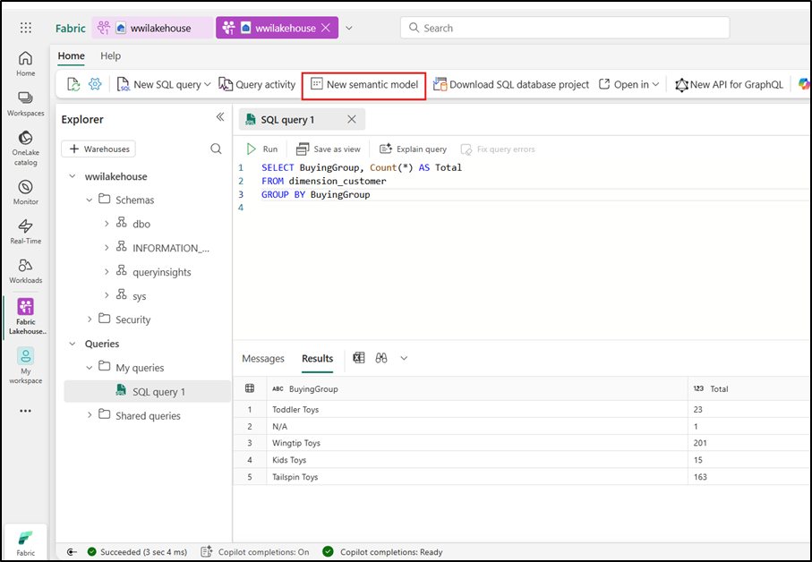
	
15. In the **New semantic model** dialog enter +++wwilakehouse+++ and then select the **dimension_customer** table from the list of tables and select **Confirm** to create the new model.

      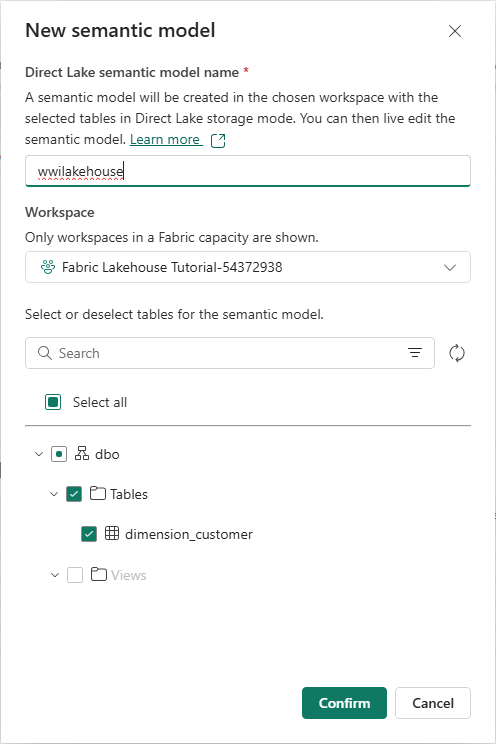
	

### Task 4: Build a report

1.  Now, click on **Fabric Lakehouse** **Tutorial-@lab.LabInstance.Id** on the top
    navigation pane.
    
2. In the **Fabric Lakehouse Tutorial-XX** view, select **wwilakehouse** of Type Semantic model. 

    > 

3.  In the **Fabric Lakehouse Tutorial-@lab.LabInstance.Id** view,
    select **wwilakehouse** of Type **Semantic model**.

       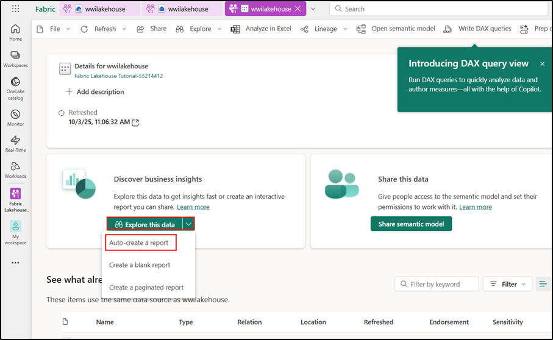

4.  From the semantic model pane, you can view all the tables. You have
    options to create reports either from scratch, paginated report, or
    let Power BI automatically create a report based on your data. For
    this tutorial, under **Explore this data**, select **Auto-create a
    report** as shown in the below image.

      

    > 

    >[!note]**Note**: Since the table is a dimension and there are no measures in it,
    Power BI creates a measure for the row count and aggregates it
    across different columns, and creates different charts as shown in
    the following image.

5.  Save this report for the future by selecting **Save** from the top
    ribbon.

    > 

6. In the **Save your replort** dialog box, enter a name for your
    report as +++dimension_customer-report+++ and select **Save.**

    > 

11. You will see a notification stating **Report saved**.

    > 

## Exercise 3: Ingest data into the lakehouse

In this exercise, you ingest additional dimensional and fact tables from
the Wide World Importers (WWI) into the lakehouse.

### Task 1: Ingest data

1.  Now, click on **Fabric Lakehouse** **Tutorial-@lab.LabInstance.Id** on the left-sided
    navigation pane.

    > 

2.  In the **Fabric Lakehouse Tutorial-@lab.LabInstance.Id** workspace page, navigate and
    click on **+New item** button, then select **Pipeline**.

    > 

3.  In the New pipeline dialog box, specify the name
    as **+++IngestDataFromSourceToLakehouse+++** and
    select **Create.** A new data factory pipeline is created and opened

    > 

    > 

4.  On newly created data factory pipeline
    i.e **IngestDataFromSourceToLakehouse**, select  **Copy data** .

    > 

5.  In the **Copy data** activity selected and the **Source tab** displayed, select the **Browse all**

    > 

6.  Next, set up a **Sample data** connection to import the sample
    World Wide Importers data into the Lakehouse. From the list of **New
    sources**, select **Retail Data Model from Wide World Importers**.

    > 

7.  In the **Connect to data destination** window, select **Retail Data Model from Wide World Importers** database and click on **OK**

    > 

8.  In the **Copy data** activity selected and the **Destination tab**

    > 
9. Select the connection type as **Lakehouse**, choose **wwilakehouse**, and set the **Root folder** to **File**. Select the Validation

      > 
      > 

10. Once validated, select the Save option and then Run to start the ingestion from the data pipeline. Running the pipeline initiates the data transfer, allowing you to see the results of your configuration in action within the output window.
     >  

12.  The data copy process takes approximately 1-3 minutes to complete.

   > 

 
10.  Under the Output tab, select **Copy_a1n** to look at the details of
    the data transfer. After seeing the **Status** as **Succeeded**,
    click on the **Close** button.

 >    

  >   [A screenshot of a computer AI-generated content may be incorrect.](https://raw.githubusercontent.com/technofocus-pte/msfbrcanlytcsrio/refs/heads/Cloud-slice/Labguide/Usecase%2001/media/imagea17.png)

11.  After the successful execution of the pipeline, go to your lakehouse
    (**wwilakehouse**) and open the explorer to see the imported data.

>  

12.  Verify that the all the  **WideWorldImporters folders** is present
    in the **Explorer** view and contains data for all tables.

> 

## Exercise 4: Prepare and transform data in the lakehouse

### Task 1: Transform data and load to silver Delta table

1.  In the **wwilakehouse** page, navigate and click on **Open
    notebook** drop in the command bar, then select **New notebook**.

    > 

2.  In the open notebook in **Lakehouse explorer**, you will see that the notebook
    is already linked to your opened lakehouse.

    > 

    >[!note]**Note**: 
    >Fabric provides the [**V-order**](https://learn.microsoft.com/en-us/fabric/data-engineering/delta-optimization-and-v-order) capability
    >to write optimized delta lake files. V-order often improves compression by three to four times and up to 10 times performance acceleration over
    >the Delta Lake files that aren't optimized. Spark in Fabric dynamically optimizes partitions while generating files with a default 128 MB size.
    >The target file size may be changed per workload requirements using configurations. With the [**optimize
    >write**](https://learn.microsoft.com/en-us/fabric/data-engineering/delta-optimization-and-v-order#what-is-optimized-write) capability, 
	>the Apache Spark engine that reduces the number of files written and aims to increase individual file size of the written data.
    
3.  Before you write data as delta lake tables in the **Tables** section
    of the lakehouse, you use two Fabric features
    (**V-order** and **Optimize Write**) for optimized data writing and
    for improved reading performance. To enable these features in your
    session, set these configurations in the first cell of your
    notebook.
    
    Update the code in the **cell** with the following code and click on **▷ Run
    cell** that appears to the left of the cell upon hover.
    
    [!alert]Alert: If you encounter a TooManyRequestsForCapacity issue you may need to wait for 5 minutes or more before retrying the cell. In rare circumstances you may need to increase the Fabric Capacity SKU size as well.
	
    ```
    # Copyright (c) Microsoft Corporation.
    # Licensed under the MIT License.
    spark.conf.set("spark.sql.parquet.vorder.enabled", "true")
    spark.conf.set("spark.microsoft.delta.optimizeWrite.enabled", "true")
    spark.conf.set("spark.microsoft.delta.optimizeWrite.binSize", "1073741824")
    ```

    > 
	[!note]**Note**: When running a cell, you didn't have to specify the underlying Spark
    > pool or cluster details because Fabric provides them through Live
    > Pool. Every Fabric workspace comes with a default Spark pool, called
    > Live Pool. This means when you create notebooks, you don't have to
    > worry about specifying any Spark configurations or cluster details.
    > When you execute the first notebook command, the live pool is up and
    > running in a few seconds. And the Spark session is established and it
    > starts executing the code. Subsequent code execution is almost
    > instantaneous in this notebook while the Spark session is active.
    
    > 

5.  Next, you read raw data from the **Files** section of the lakehouse
    and add more columns for different date parts as part of the
    transformation. You use partitionBy Spark API to partition the data
    before writing it as delta table based on the newly created data
    part columns (Year and Quarter).
    
    Use the **+ Code** icon below the cell output to add a new code cell
    to the notebook, and enter the following code in it. Click on **▷
    Run cell** button and review the output

    **Note**: In case, you are unable to see the output, then click on the
    horizontal lines on the left side of **Spark jobs**.
	
    ```
    from pyspark.sql.functions import col, year, month, quarter
    
    table_name = 'fact_sale'
    
    df = spark.read.format("parquet").load('Files/fact_sale_1y_full')
    df = df.withColumn('Year', year(col("InvoiceDateKey")))
    df = df.withColumn('Quarter', quarter(col("InvoiceDateKey")))
    df = df.withColumn('Month', month(col("InvoiceDateKey")))
    
    df.write.mode("overwrite").format("delta").partitionBy("Year","Quarter").save("Tables/" + table_name)
    ```

    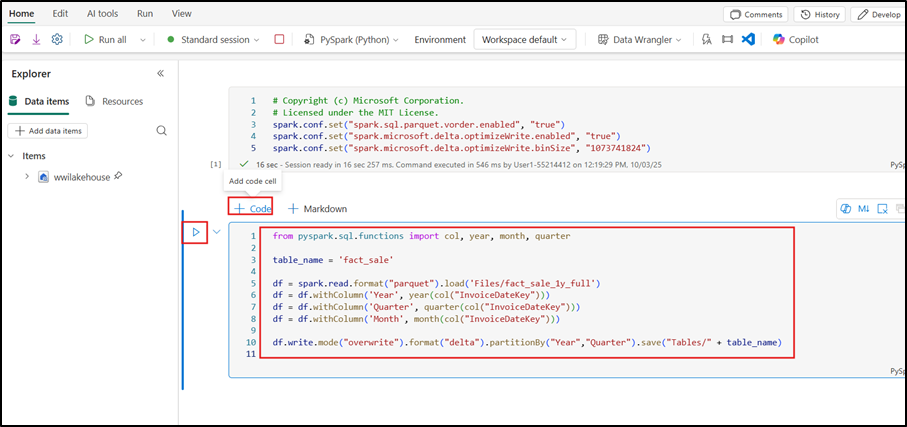

    > 

6.  After the tables load, you can move on to loading data for the
    rest of the dimensions. The following cell creates a function to
    read raw data from the **Files** section of the lakehouse for each
    of the table names passed as a parameter. Next, it creates a list of
    dimension tables. Finally, it loops through the list of tables and
    creates a delta table for each table name that's read from the input
    parameter.

    Use the **+ Code** icon below the cell output to add a new code cell
    to the notebook, and enter the following code in it. Click on **▷
    Run cell** button and review the output.
	
    ```
    from pyspark.sql.types import *
    
    def loadFullDataFromSource(table_name):
        df = spark.read.format("parquet").load('Files/' + table_name)
        df = df.drop("Photo")
        df.write.mode("overwrite").format("delta").save("Tables/" + table_name)
    
    full_tables = [
        'dimension_city',
        'dimension_customer',
        'dimension_date',
        'dimension_employee',
        'dimension_stock_item'
    ]
    
    for table in full_tables:
        loadFullDataFromSource(table)
    ```
	
  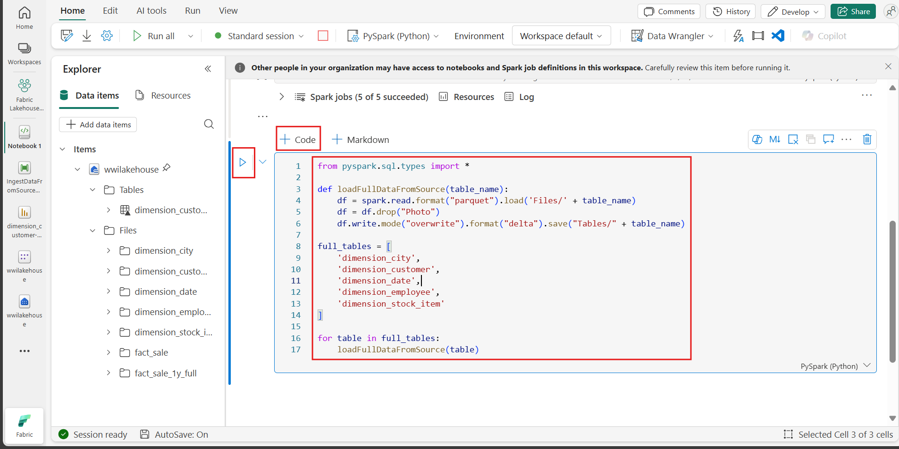

> 

6.  To validate the created tables, click and select refresh on
    the **Tables** in the **Explorer** panel until all the tables appear in the list. 

  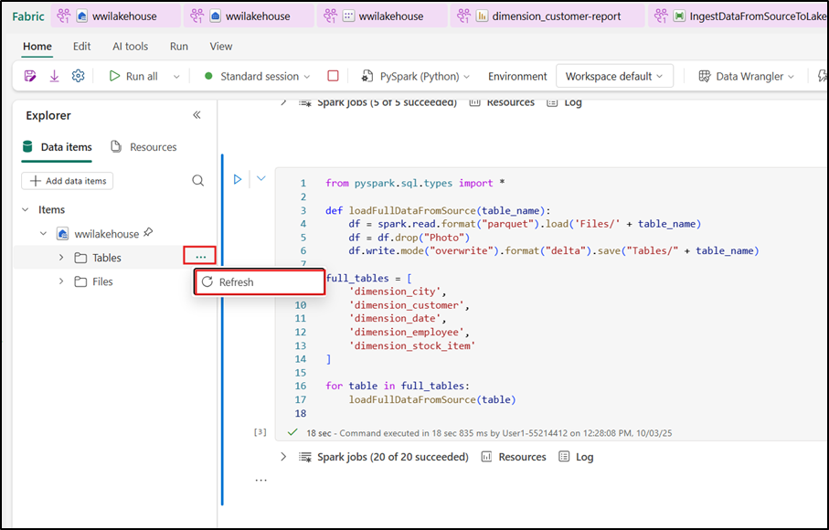


### Task 2: Transforming Business Data for Aggregation

An organization might have data engineers working with Scala/Python
and other data engineers working with SQL (Spark SQL or T-SQL), all
working on the same copy of the data. Fabric makes it possible for
these different groups, with varied experience and preference, to
work and collaborate. The two different approaches transform and
generate business aggregates. You can pick the one suitable for you
or mix and match these approaches based on your preference without
compromising on the performance:

- **Approach \#1** - Use PySpark to join and aggregates data for
    generating business aggregates. This approach is preferable to
    someone with a programming (Python or PySpark) background.

- **Approach \#2** - Use Spark SQL to join and aggregates data for
    generating business aggregates. This approach is preferable to
    someone with SQL background, transitioning to Spark.

<u>**Approach \#1 (sale_by_date_city)**</u>

Use PySpark to join and
aggregate data for generating business aggregates. With the
following code, you create three different Spark dataframes, each
referencing an existing delta table. Then you join these tables
using the dataframes, do group by to generate aggregation, rename a
few of the columns, and finally write it as a delta table in
the **Tables** section of the lakehouse to persist with the data.

1.  Use the **+ Code** icon below the cell output to add a new code cell
    to the notebook, and enter the following code in it. Click on **▷
    Run cell** button and review the output

    In this cell, you create three different Spark dataframes, each
    referencing an existing delta table.
	
    ```
    df_fact_sale = spark.read.table("wwilakehouse.fact_sale") 
    df_dimension_date = spark.read.table("wwilakehouse.dimension_date")
    df_dimension_city = spark.read.table("wwilakehouse.dimension_city")
    ```
	
  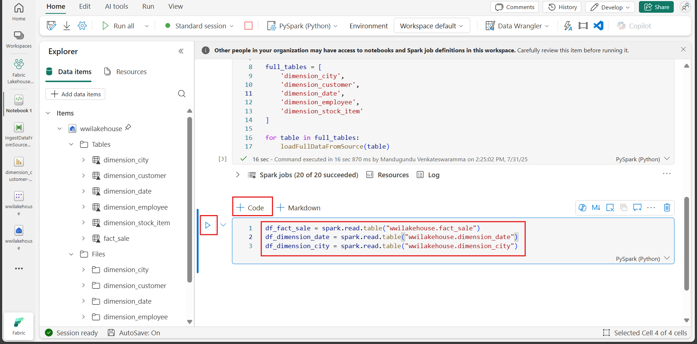

> 

2.  Use the **+ Code** icon below the cell output to add a new code cell
    to the notebook, and enter the following code in it. Click on **▷
    Run cell** button and review the output

    In this cell, you join these tables using the dataframes created
    earlier, do group by to generate aggregation, rename a few of the
    columns, and finally write it as a delta table in
    the **Tables** section of the lakehouse.
	
    ```
    sale_by_date_city = df_fact_sale.alias("sale") \
    .join(df_dimension_date.alias("date"), df_fact_sale.InvoiceDateKey == df_dimension_date.Date, "inner") \
    .join(df_dimension_city.alias("city"), df_fact_sale.CityKey == df_dimension_city.CityKey, "inner") \
    .select("date.Date", "date.CalendarMonthLabel", "date.Day", "date.ShortMonth", "date.CalendarYear", "city.City", "city.StateProvince", 
     "city.SalesTerritory", "sale.TotalExcludingTax", "sale.TaxAmount", "sale.TotalIncludingTax", "sale.Profit")\
    .groupBy("date.Date", "date.CalendarMonthLabel", "date.Day", "date.ShortMonth", "date.CalendarYear", "city.City", "city.StateProvince", 
     "city.SalesTerritory")\
    .sum("sale.TotalExcludingTax", "sale.TaxAmount", "sale.TotalIncludingTax", "sale.Profit")\
    .withColumnRenamed("sum(TotalExcludingTax)", "SumOfTotalExcludingTax")\
    .withColumnRenamed("sum(TaxAmount)", "SumOfTaxAmount")\
    .withColumnRenamed("sum(TotalIncludingTax)", "SumOfTotalIncludingTax")\
    .withColumnRenamed("sum(Profit)", "SumOfProfit")\
    .orderBy("date.Date", "city.StateProvince", "city.City")
    
    sale_by_date_city.write.mode("overwrite").format("delta").option("overwriteSchema", "true").save("Tables/aggregate_sale_by_date_city")
    ```
	
   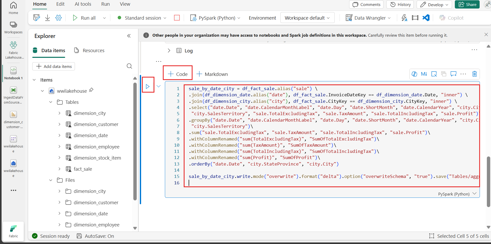

 

<u>**Approach \#2 (sale_by_date_employee)** </u>

Use Spark SQL to join and
aggregate data for generating business aggregates. With the
following code, you create a temporary Spark view by joining three
tables, do group by to generate aggregation, and rename a few of the
columns. Finally, you read from the temporary Spark view and finally
write it as a delta table in the **Tables** section of the lakehouse
to persist with the data.

3.  Use the **+ Code** icon below the cell output to add a new code cell
    to the notebook, and enter the following code in it. Click on **▷
    Run cell** button and review the output

    In this cell, you create a temporary Spark view by joining three
    tables, do group by to generate aggregation, and rename a few of the
    columns.
	
    ```
    %%sql
    CREATE OR REPLACE TEMPORARY VIEW sale_by_date_employee
    AS
    SELECT
           DD.Date, DD.CalendarMonthLabel
     , DD.Day, DD.ShortMonth Month, CalendarYear Year
          ,DE.PreferredName, DE.Employee
          ,SUM(FS.TotalExcludingTax) SumOfTotalExcludingTax
          ,SUM(FS.TaxAmount) SumOfTaxAmount
          ,SUM(FS.TotalIncludingTax) SumOfTotalIncludingTax
          ,SUM(Profit) SumOfProfit 
    FROM wwilakehouse.fact_sale FS
    INNER JOIN wwilakehouse.dimension_date DD ON FS.InvoiceDateKey = DD.Date
    INNER JOIN wwilakehouse.dimension_Employee DE ON FS.SalespersonKey = DE.EmployeeKey
    GROUP BY DD.Date, DD.CalendarMonthLabel, DD.Day, DD.ShortMonth, DD.CalendarYear, DE.PreferredName, DE.Employee
    ORDER BY DD.Date ASC, DE.PreferredName ASC, DE.Employee ASC
    ```

   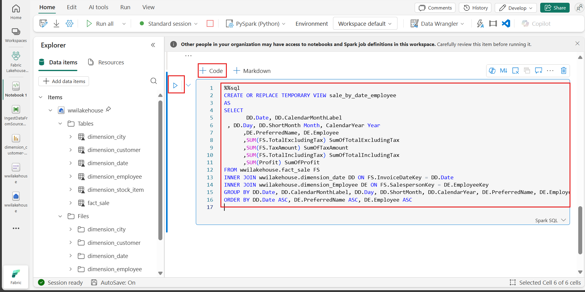
    > 

4. Use the **+ Code** icon below the cell output to add a new code cell
    to the notebook, and enter the following code in it. Click on **▷
    Run cell** button and review the output

    In this cell, you read from the temporary Spark view created in the
    previous cell and finally write it as a delta table in
    the **Tables** section of the lakehouse.
	
    ```
    sale_by_date_employee = spark.sql("SELECT * FROM sale_by_date_employee")
    sale_by_date_employee.write.mode("overwrite").format("delta").option("overwriteSchema", "true").save("Tables/aggregate_sale_by_date_employee")
    ```

 
    > 

5. To validate the created tables, click and select refresh on
    the **Tables** until the aggregate tables appear.

 
   > 

Both the approaches produce a similar outcome. You can choose based on
your background and preference, to minimize the need for you to learn a
new technology or compromise on the performance.

Also you may notice that you're writing data as delta lake files. The
automatic table discovery and registration feature of Fabric picks up
and registers them in the metastore. You don't need to explicitly
call CREATE TABLE statements to create tables to use with SQL.


## Exercise 5: Building reports in Microsoft Fabric

In this section of the tutorial, you create a Power BI data model and
create a report from scratch.

### Task 1: Explore data in the silver layer using the SQL endpoint

Power BI is natively integrated in the whole Fabric experience. This
native integration brings a unique mode, called DirectLake, of accessing
the data from the lakehouse to provide the most performant query and
reporting experience. DirectLake mode is a groundbreaking new engine
capability to analyze very large datasets in Power BI. The technology is
based on the idea of loading parquet-formatted files directly from a
data lake without having to query a data warehouse or lakehouse
endpoint, and without having to import or duplicate data into a Power BI
dataset. DirectLake is a fast path to load the data from the data lake
straight into the Power BI engine, ready for analysis.

In traditional DirectQuery mode, the Power BI engine directly queries
the data from the source to execute each query, and the query
performance depends on data retrieval speed. DirectQuery eliminates the
need to copy data, ensuring that any changes in the source are
immediately reflected in the query results during the import. On the
other hand, in Import mode performance is better because the data is
readily available in the memory without querying data from the source
for each query execution. However, the Power BI engine must first copy
the data into memory during data refresh. Only changes to the underlying
data source are picked up during the next data refresh(in scheduled as
well as on-demand refresh).

DirectLake mode now eliminates this import requirement by loading the
data files directly into memory. Because there's no explicit import
process, it's possible to pick up any changes at the source as they
occur, thus combining the advantages of DirectQuery and import mode
while avoiding their disadvantages. DirectLake mode is therefore the
ideal choice for analyzing very large datasets and datasets with
frequent updates at the source.

1. From the left menu select the **Fabric Lakehouse-@lab.LabInstance.Id** then select your Semantic model named **wwilakehouse**.

      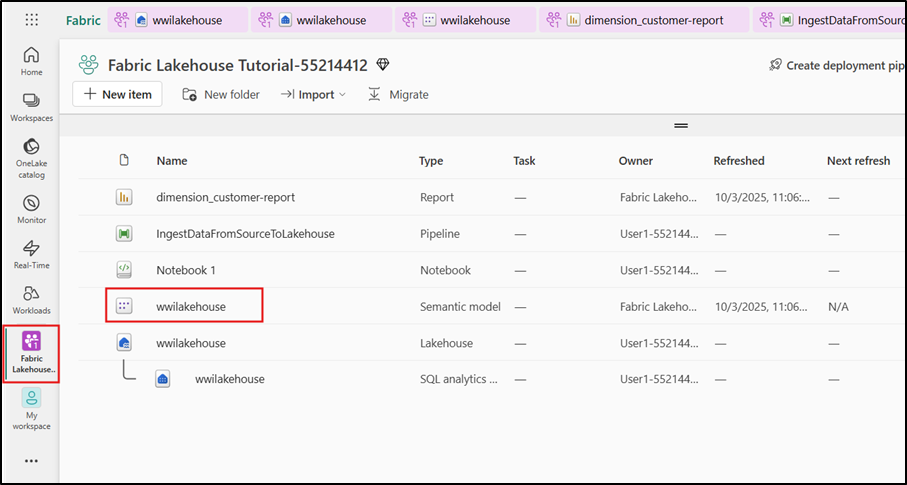

2. On the top menu bar select **Open semantic model** to open the data model designer.

      

3. At the top-right ensure that the data model designer is in the **Editing** mode. This should change the drop-down text to “Editing”.

   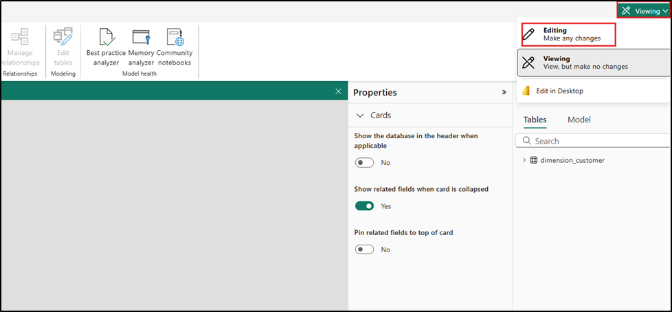

4. In the menu ribbon select **Edit tables** to display the table synchronization dialog.

   

5. On the **Edit semantic model** dialog select all the tables and then select **Confirm** at the bottom of the dialog to synchronize the Semantic model.

      

    >[!note]**Note**: Once the synchronization has been completed the Semantic model designer will display all the available tables.
6.  From the **fact_sale** table, drag the **CityKey** field and drop it
    on the **CityKey** field in the **dimension_city** table to create a
    relationship. The **Create Relationship** dialog box appears.

    >[!note]**Note**: Rearrange the tables by clicking on the table, dragging and
    > dropping to have the dimension_city and the fact_sale tables next to
    > each other. The same holds good for any two tables that you are trying
    > to create relationship. This is just to make the drag and drop of the
    > columns between the tables is easier.
    

7.  In the **Create Relationship** dialog box:

    - **Table 1** is populated with **fact_sale** and the column
      of **CityKey**.

    - **Table 2** is populated with **dimension_city** and the column
      of **CityKey**.

    - Cardinality: **Many to one (\*:1)**

    - Cross filter direction: **Single**

    - Leave the box next to **Make this relationship active** selected.

    - Select the box next to **Assume referential integrity.**

    - Select **Save.**

    > 

8.  Next, add these relationships with the same **Create
    Relationship** settings as shown above but with the following tables
    and columns:

    - **StockItemKey(fact_sale)** - **StockItemKey(dimension_stock_item)**

    > 

    > 

    - **Salespersonkey(fact_sale)** - **EmployeeKey(dimension_employee)**

    > 

9.  Ensure to create the relationships between the below two sets using
    the same steps as above.

    - **CustomerKey(fact_sale)** - **CustomerKey(dimension_customer)**

    - **InvoiceDateKey(fact_sale)** - **Date(dimension_date)**

10.  After you add these relationships, your data model should be as
    shown in the below image and is ready for reporting.

      

### Task 2: Build a Report

1.  From the **File** menu, select **Create new report** to start creating reports/dashboards in Power BI.

    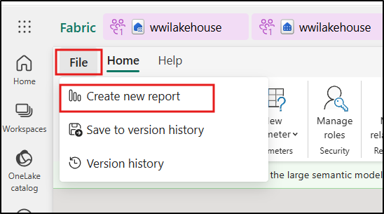

2.  On the Power BI report canvas, you can create reports to meet your
    business requirements by dragging required columns from
    the **Data** pane to the canvas and using one or more of available
    visualizations.

    > 

    <u>**Add a title:**</u>

3.  In the Ribbon, select **Text box**. Type in **+++WW Importers Profit
    Reporting+++**. Highlight the **text** and increase size to **20**.

    > 

4.  Resize the text box and place it in the **upper left** of the report
    page and click outside the textbox.

    > 

    <u>**Add a Card:**</u>

1.  On the **Data** pane, expand **fact_sales** and check the box next
    to **Profit**. This selection creates a column chart and adds the
    field to the Y-axis.

    > 

5.  With the bar chart selected, select the **Card** visual in the
    visualization pane.

    > 

6.  This selection converts the visual to a card. Place the card under
    the title.

    > 

7.  Click anywhere on the blank canvas (or press the Esc key) so the
    Card that we just placed is no longer selected.

    <u>**Add a Bar chart:**</u>

8.  On the **Data** pane, expand **fact_sales** and check the box next
    to **Profit**. This selection creates a column chart and adds the
    field to the Y-axis. 

    > 

9.  On the **Data** pane, expand **dimension_city** and check the box
    for **SalesTerritory**. This selection adds the field to the
    Y-axis. 

    > 

10. With the bar chart selected, select the **Clustered bar
    chart** visual in the visualization pane. This selection converts
    the column chart into a bar chart.

    > 

11. Resize the Bar chart to fill in the area under the title and Card.

    > 

12. Click anywhere on the blank canvas (or press the Esc key) so the bar
    chart is no longer selected.

    <u>**Build a stacked area chart visual:**</u>

13. On the **Visualizations** pane, select the **Stacked area
    chart** visual.

    > 

14. Reposition and resize the stacked area chart to the right of the
    card and bar chart visuals created in the previous steps.

    > 

15. On the **Data** pane, expand **fact_sales** and check the box next
    to **Profit**. Expand **dimension_date** and check the box next
    to **FiscalMonthNumber**. This selection creates a filled line chart
    showing profit by fiscal month.

    > 

16. On the **Data** pane, expand **dimension_stock_item** and
    drag **BuyingPackage** into the Legend field well. This selection
    adds a line for each of the Buying Packages.

    > 
	
    > 

17. Click anywhere on the blank canvas (or press the Esc key) so the
    stacked area chart is no longer selected.

    <u>**Build a column chart:**</u>

18. On the **Visualizations** pane, select the **Stacked column
    chart** visual.

    > 

19. On the **Data** pane, expand **fact_sales** and check the box next
    to **Profit**. This selection adds the field to the Y-axis.

20. On the **Data** pane, expand **dimension_employee** and check the
    box next to **Employee**. This selection adds the field to the
    X-axis.

    > 

21. Click anywhere on the blank canvas (or press the Esc key) so the
    chart is no longer selected.

22. From the ribbon, select **File** \> **Save**.

    > 

23. Enter the name of your report as **+++Profit Reporting+++**.
    Select **Save**.

    > 

24. You will get a notification stating that the report has been
    saved. 

## Exercise 6: Clean up resources

You can delete individual reports, pipelines, warehouses, and other
items or remove the entire workspace. Use the following steps to delete
the workspace you created for this tutorial.

1.  Select your workspace, the **Fabric Lakehouse Tutorial-@lab.LabInstance.Id** from the
    left-hand navigation menu. It opens the workspace item view.

    > 

2.  Select the **...** option under the workspace name and
    select **Workspace settings**.

    > 

3.  Navigate to the bottom of the **General** tab and select **Remove this workspace**.

    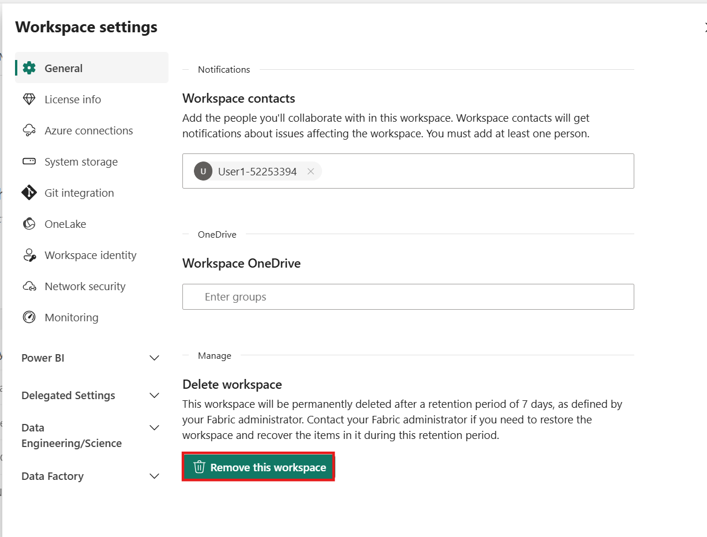

4.  Click on **Delete** in the warning that pops up.

    > 

5.  Wait for a notification that the Workspace has been deleted, before
    proceeding to the next lab.

    > 

**Summary**: This practical lab focuses on setting up and configuring
essential components within Microsoft Fabric and Power BI for data
management and reporting. It includes tasks like activating trials,
configuring OneDrive, creating workspaces, and setting up lakehouses.
The lab also covers tasks related to ingesting sample data, optimizing
delta tables, and building reports in Power BI for effective data
analysis. The objectives aim to provide hands-on experience in utilizing
Microsoft Fabric and Power BI for data management and reporting purposes.


