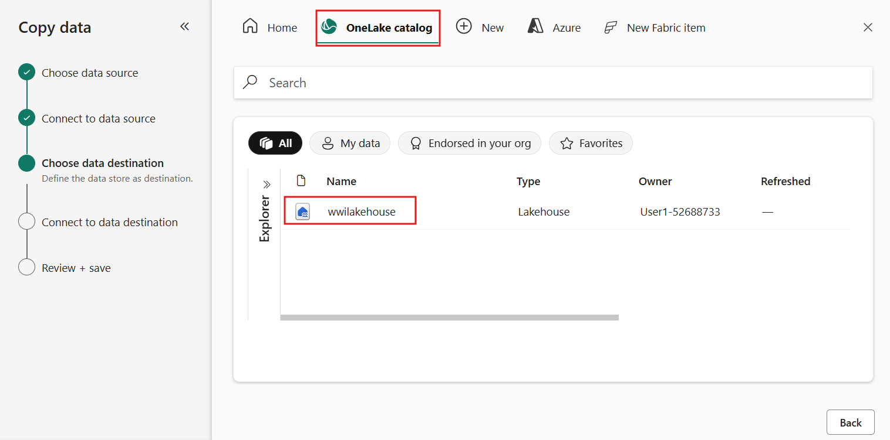
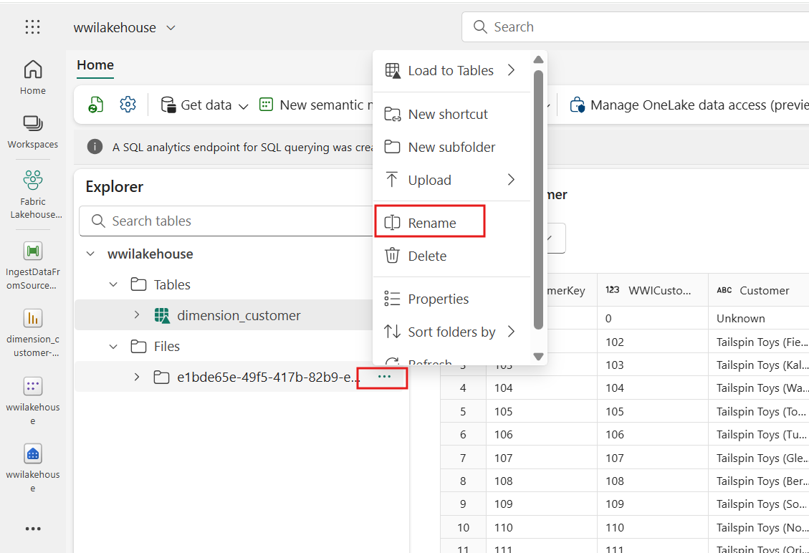
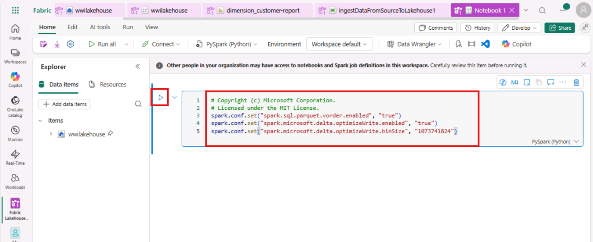
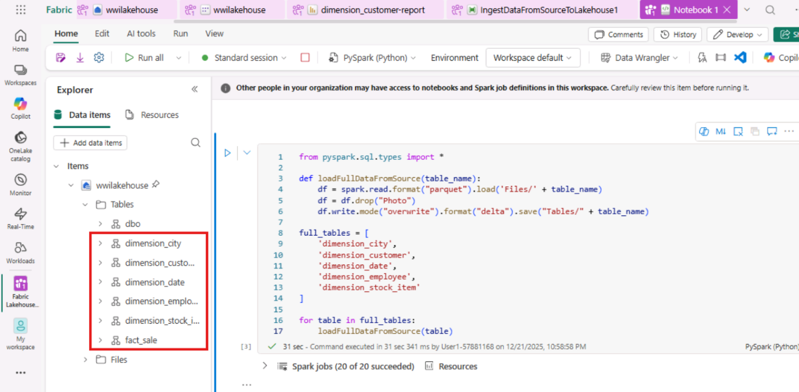
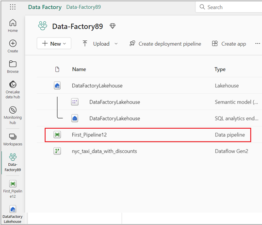
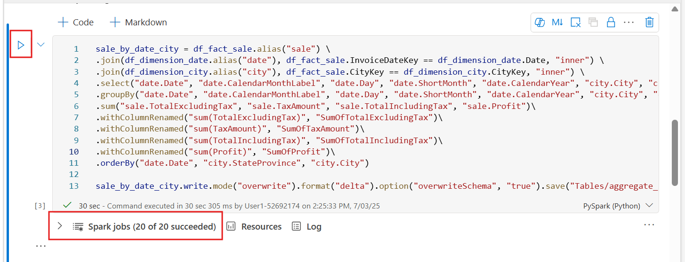
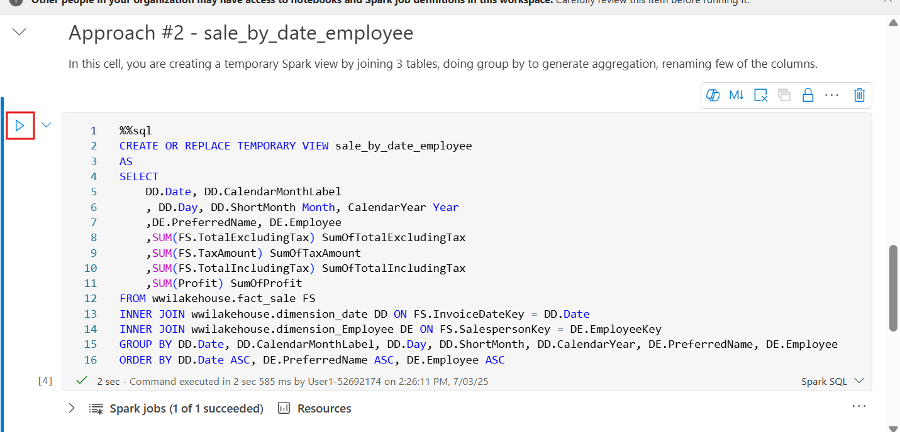
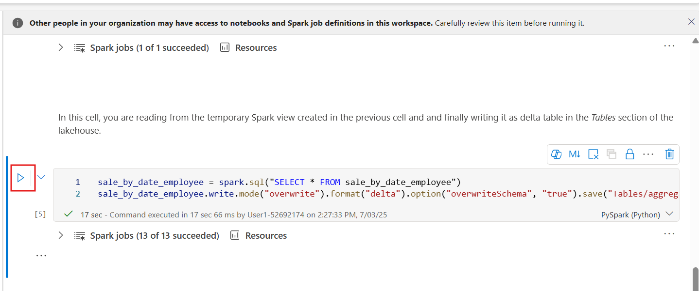

# Caso de uso 1: Crear un Lakehouse, ingerir datos de muestra y crear un reporte

**Introducción**

Este laboratorio lo guía a través de un escenario de extremo a extremo,
desde la adquisición de datos hasta el consumo de datos. Le ayuda a
crear una comprensión básica de Fabric, incluidas las diferentes
experiencias y cómo se integran, así como las experiencias tanto de
desarrolladores profesionales como de desarrolladores ciudadanos que
conlleva trabajar en esta plataforma. Este laboratorio no pretende ser
una arquitectura de referencia, una lista exhaustiva de características
y funcionalidades, ni una recomendación de prácticas específicas.

Tradicionalmente, las organizaciones han estado construyendo modern data
warehouses para sus necesidades de analítica de datos transaccionales y
estructurados. Y data lakehouses para las necesidades de analítica de
big data (datos semiestructurados/no estructurados). Estos dos sistemas
se ejecutaban en paralelo, creando silos, duplicación de datos e
incremento en el costo total de propiedad.

Fabric, con su unificación de almacenamiento de datos y estandarización
en el formato Delta Lake, le permite eliminar silos, remover duplicación
de datos y reducir drásticamente el costo total de propiedad.

Con la flexibilidad que ofrece Fabric, puede implementar arquitecturas
de lakehouse o data warehouse, o combinarlas para obtener lo mejor de
ambas con una implementación sencilla. En este tutorial, tomará como
ejemplo una organización de retail y construirá su lakehouse de
principio a fin. Utiliza la [arquitectura
medallion](https://learn.microsoft.com/en-us/azure/databricks/lakehouse/medallion), donde
la capa bronze contiene los datos en bruto, la capa silver contiene los
datos validados y deduplicados, y la capa gold contiene datos altamente
refinados. Puede aplicar el mismo enfoque para implementar un lakehouse
en cualquier organización de cualquier industria.

Este laboratorio explica cómo un desarrollador de la empresa ficticia
Wide World Importers, del sector retail, completa los siguientes pasos.

**Objetivos**:

1\. Inicie sesión en su cuenta de Power BI e inicie una prueba gratuita
de Microsoft Fabric.

2\. Comience la prueba de Microsoft Fabric (vista previa) dentro de
Power BI.

3\. Configure el registro de OneDrive en el centro de administración de
Microsoft 365.

4\. Cree e implemente un lakehouse de extremo a extremo para la
organización, lo que incluye la creación de un workspace de Fabric y un
lakehouse.

5\. Ingeste datos de muestra en el lakehouse y prepárelos para su
posterior procesamiento.

6\. Transforme y prepare los datos utilizando notebooks de
Python/PySpark y SQL.

7\. Cree tablas de agregados de negocio utilizando diferentes enfoques.

8\. Establezca relaciones entre tablas para generar reportes sin
inconvenientes.

9\. Elabore un reporte de Power BI con visualizaciones basadas en los
datos preparados.

10\. Guarde y almacene el reporte creado para referencia y análisis
futuros.

## Ejercicio 1: Configure el escenario de Lakehouse de extremo a extremo

### Tarea 1: Inicie sesión en su cuenta de Power BI y regístrese en la prueba gratuita de Microsoft Fabric

1.  Abra su navegador, vaya a la barra de direcciones y escriba o pegue
    la siguiente URL:+++https://app.fabric.microsoft.com/+++ luego
    presione el botón **Enter**.

> 

2.  En la ventana de **Microsoft Fabric**, ingrese sus credenciales, y
    haga clic en el botón **Submit**.

> 

3.  Luego, en la ventana de **Microsoft**, ingrese la contraseña y haga
    clic en el botón **Sign in**.

> 

4.  En la ventana **Stay signed in?**, haga clic en el botón **Yes**.

> 

5.  Será dirigido a la página principal de Power BI.

> 

## Ejercicio 2: Cree e implemente un lakehouse de extremo a extremo para su organización

### Tarea 1: Cree un workspace de Fabric

En esta tarea, cree un workspace de Fabric. El workspace contiene todos
los elementos necesarios para este tutorial de lakehouse, que incluyen
lakehouse, dataflows, pipelines de Data Factory, notebooks, conjuntos de
datos de Power BI e informes.

1.  En la página principal de Fabric, seleccione el recuadro **+New
    workspace**.

> 

2.  En el panel **Create a workspace** que aparece en el lado derecho,
    ingrese los siguientes detalles y haga clic en el botón **Apply**.

    |   |   |
    |-------|-----|
    |Name|	+++Fabric Lakehouse Tutorial-XXXXX+++ (XXXXX can be Lab instant ID)|
    |Advanced	|Under License mode, select Fabric capacity|
    |Default	storage format| Small dataset storage format|
    |Template apps	|Check the Develop template apps|


> 

Nota: Para encontrar su Lab instant ID, seleccione Help y copie el
instant ID.

> 
>
> 

3.  Espere a que se complete la implementación. Esto tarda entre 2 y 3
    minutos en finalizar.

> 

### Tarea 2: Cree un lakehouse

1.  Cree un nuevo lakehouse haciendo clic en el botón **+New item** en
    la barra de navegación.

> 

2.  Haga clic en el recuadro "**Lakehouse**".

> 

3.  En el cuadro de diálogo **New lakehouse**,
    ingrese +++**wwilakehouse+++** en el campo **Name**, haga clic en el
    botón **Create** y abra el nuevo lakehouse.

> **Nota**: Asegúrese de eliminar el espacio antes de **wwilakehouse**.
>
> 
>
> 

4.  Verá una notificación que indica **Successfully created SQL
    endpoint**.

> 

### Tarea 3: Ingeste datos de muestra

1.  En la página **wwilakehouse**, vaya a la sección **Get data in your
    lakehouse**, y haga clic en **Upload files,** como se muestra en la
    imagen a continuación.

> 

2.  En la pestaña **Upload files**, haga clic debajo de la carpeta
    **Files**.

> 

3.  Vaya a **C:\LabFiles** en su máquina virtual (VM), luego seleccione
    el archivo ***dimension_customer.csv*** y haga clic en el
    botón **Open**.

> 

4.  Luego, haga clic en el botón **Upload** y cierre.

> 

5.  Haga clic y seleccione **Refresh** en **Files**. El archivo
    aparecerá.

> 
>
> 

6.  En la página del **Lakehouse**, en el panel **Explorer**, seleccione
    **Files**. Luego, pase el mouse sobre el
    archivo **dimension_customer.csv**. Haga clic en los puntos
    suspensivos horizontales **(…)** junto a **dimension_customer**.csv.
    Navegue y haga clic en **Load Table**, luego seleccione **New
    table**.

> 

7.  En el cuadro de diálogo **Load file to new table**, haga clic en el
    botón **Load**.

> 
>
> 

8.  Seleccione la tabla **dimension_coustomer**.

> 
>
> 

9.  También puede usar el SQL endpoint del lakehouse para consultar los
    datos con sentencias SQL. Seleccione **SQL analytics endpoint** en
    el menú desplegable de **Lakehouse** en la parte superior derecha de
    la pantalla.

> 

10. En la página wwilakehouse, en el panel **Explorer**, seleccione la
    tabla **dimension_customer** para previsualizar sus datos y
    seleccione **New SQL query** para escribir sus sentencias SQL.

> 

11. La siguiente consulta de ejemplo agrega el conteo de filas según la
    columna **BuyingGroup** de la tabla **dimension_customer**. Los
    archivos de consultas SQL se guardan automáticamente para referencia
    futura, y usted puede renombrar o eliminar estos archivos según lo
    necesite. Pegue el código como se muestra en la imagen a
    continuación, luego haga clic en el icono de play con el texto
    **Run** para ejecutar el script.

    ```
    SELECT BuyingGroup, Count(*) AS Total
    
    FROM dimension_customer
    
    GROUP BY BuyingGroup
    ```
> 

**Nota**: Si encuentra un error durante la ejecución del script,
verifique la sintaxis del script con la imagen anterior.

> 

12. Anteriormente, todas las tablas y vistas del lakehouse se agregaban
    automáticamente al modelo semántico. Con las actualizaciones
    recientes, para los nuevos lakehouses, debe agregar manualmente sus
    tablas al modelo semántico.

> 

13. Desde la pestaña **Reporting** del lakehouse, seleccione **Manage
    default semantic model** y selecione las tablas que desea agregar al
    modelo semántico.

> 

14. En la pestaña **Manage default semantic model**, seleccione la
    tabla **dimension_customer** y haga clic en **Confirm.**

> 

### Tarea 4: Elabore un informe

1.  Ahora, haga clic en **Fabric Lakehouse Tutorial-XX** en el panel de
    navegación del lado izquierdo.

> 

2.  Ahora, seleccione **wwilakehouse** de tipo **SQL analytics**.

> 

3.  Desde la pestaña **Home** del lakehouse, seleccione **Settings**

> 

4.  Para asegurarse de que las tablas en el modelo semántico estén
    siempre sincronizadas, cambie a la vista **SQL analytics endpoint**
    y abra el panel de **configuración** del lakehouse. Seleccione
    **Default Power BI semantic model** y active **Sync the default
    Power BI semantic model**.

> 

5.  Ahora, haga clic en **Fabric Lakehouse Tutorial-XX** en el panel de
    navegación del lado izquierdo.

> 

6.  En la vista **Fabric Lakehouse Tutorial-XX**,
    seleccione **wwilakehouse** de tipo **Semantic model(default)**.
    Este conjunto de datos se crea automáticamente y tiene el mismo
    nombre que el lakehouse.

> 

7.  Desde el panel del modelo semántico, puede ver todas las tablas.
    Tiene opciones para crear reportes desde cero, crear un reporte
    paginado o permitir que Power BI cree automáticamente un reporte
    basado en sus datos. Para este tutorial, en **Explore this data**,
    seleccione **Auto-create a report**, como se muestra en la imagen a
    continuación.

> 
>
> 
>
> 

8.  Dado que la tabla es una dimensión y no contiene medidas, Power BI
    crea una medida para el conteo de filas y la agrega en diferentes
    columnas, generando distintos gráficos como se muestra en la
    siguiente imagen.

9.  Guarde este informe para el futuro seleccionando **Save** en la
    cinta superior.

> 

10. En el cuadro de diálogo **Save your replort**, ingrese un nombre
    para su reporte como +++dimension_customer-report+++ y
    seleccione **Save**.

> 

11. Verá una notificación que indica **Report saved**.

> 

# Ejercicio 2: Ingeste datos en el lakehouse

En este ejercicio, usted ingeste tablas dimensionales y de hechos
adicionales de Wide World Importers (WWI) en el lakehouse.

### Tarea 1: Ingeste datos

1.  Ahora, haga clic en **Fabric Lakehouse Tutorial-XX** en el panel de
    navegación del lado izquierdo.

> 

2.  En la página del workspace **Fabric Lakehouse Tutorial-XX**, navegue
    y haga clic en el botón **+New item**, luego seleccione **Data
    pipeline**.

> 

3.  En el cuadro de diálogo **New pipeline**, especifique el nombre
    como **+++IngestDataFromSourceToLakehouse+++** y
    seleccione **Create.** Se creará y abrirá un nuevo pipeline de Data
    Factory.

> 
>
> 

4.  En el pipeline de Data Factory recién creado, es decir,
    **IngestDataFromSourceToLakehouse**, seleccione **Copy data
    assistant** .

> 

5.  A continuación, configure una conexión de **Sample data** para
    importar los datos de muestra de **World Wide Importers** en el
    Lakehouse. En la lista de **New sources**, seleccione **Retail Data
    Model from Wide World Importers**.

> 

6.  En la ventana **Connect to data source**, seleccione **Retail Data
    Model from Wide World Importers data** y haga clic en **Next**.

> 

7.  En la ventana **Connect to data destination**, seleccione **OneLake
    catalog** y seleccione **wwilakehouse.** Ahora especifique la
    carpeta raíz como **Files** y haga clic en **Next**. Esto escribirá
    los datos en la sección **Files** del lakehouse.

> 
>
> 

1.  Elija que el **File format** esté vacío para el destino. Haga clic
    en **Next** y luego en **Save+Run**. Puede programar los pipelines
    para actualizar los datos periódicamente. En este tutorial, solo
    ejecutaremos el pipeline una vez.

> 
>
> 

2.  El proceso de copia de datos tarda aproximadamente de 1 a 3 minutos
    en completarse.

> 
>
> 
>
> 
>
> 

3.  En la pestaña Output, seleccione **Copy_a1n** para ver los detalles
    de la transferencia de datos. Después de verificar que el **estado**
    sea **Succeeded**, haga clic en el botón **Close**.

> 
>
> 

4.  Después de la ejecución exitosa del pipeline, vaya a su lakehouse
    (**wwilakehouse**) y abra el explorador para ver los datos
    importados.

> 

5.  Verifique que todas las carpetas de **WideWorldImporters** estén
    presentes en la vista **Explorer** y que contengan datos para todas
    las tablas.

> 

# Ejercicio 3: Prepare y transforme datos en el lakehouse

### Tarea 1: Transforme datos y cárguelos en una tabla Delta silver

1.  En la página de **wwilakehouse**, navegue y haga clic en **Open
    notebook** en la barra de comandos, luego seleccione **New
    notebook**.

> 

2.  En el notebook abierto en **Lakehouse Explorer**, verá que el
    notebook ya está vinculado a su lakehouse abierto.

> 

\*\* Nota\*\*

Fabric ofrece la característica
[**V-order**](https://learn.microsoft.com/en-us/fabric/data-engineering/delta-optimization-and-v-order) para
escribir archivos optimizados de Delta Lake. V-order a menudo mejora la
compresión entre tres y cuatro veces y puede acelerar el rendimiento
hasta 10 veces en comparación con los archivos de Delta Lake que no
están optimizados. Spark en Fabric optimiza dinámicamente las
particiones mientras genera archivos con un tamaño predeterminado de 128
MB. El tamaño objetivo de los archivos puede modificarse según los
requisitos de la carga de trabajo mediante configuraciones. Con la
característica [**optimize
write**](https://learn.microsoft.com/en-us/fabric/data-engineering/delta-optimization-and-v-order#what-is-optimized-write), el
motor Apache Spark reduce la cantidad de archivos escritos y busca
aumentar el tamaño individual de los archivos generados.

3.  Antes de escribir datos como tablas de *Delta Lake* en la sección
    **Tables** del lakehouse, utilice dos características de Fabric
    (**V-order** y **Optimize Write**) para lograr una escritura de
    datos optimizada y un mejor rendimiento de lectura. Para habilitar
    estas características en su sesión, configure estos parámetros en la
    primera celda de su notebook.

4.  Escriba el siguiente código en la **celda** y haga clic en **▷ Run
    cell**, que aparece a la izquierda de la celda al pasar el cursor.

    ```
    # Copyright (c) Microsoft Corporation.
    # Licensed under the MIT License.
    spark.conf.set("spark.sql.parquet.vorder.enabled", "true")
    spark.conf.set("spark.microsoft.delta.optimizeWrite.enabled", "true")
    spark.conf.set("spark.microsoft.delta.optimizeWrite.binSize", "1073741824")
    ```
> 
>
> 
>
> Al ejecutar una celda, no tuvo que especificar los detalles del Spark
> pool o del clúster subyacente porque Fabric los proporciona a través
> de Live Pool. Cada workspace de Fabric incluye un Spark pool
> predeterminado, llamado Live Pool.
>
> Esto significa que, al crear notebooks, no es necesario preocuparse
> por especificar configuraciones de Spark ni detalles de clúster.
> Cuando ejecuta el primer comando del notebook, el Live Pool se inicia
> y se encuentra en ejecución en unos segundos. Entonces se establece la
> sesión de Spark y comienza a ejecutar el código.
>
> La ejecución de código subsiguiente es casi instantánea en este
> notebook mientras la sesión de Spark permanezca activa. 

5.  A continuación, lea los datos en bruto desde la sección **Files**
    del lakehouse y agregue más columnas para diferentes partes de fecha
    como parte de la transformación. Utilice la API partitionBy de Spark
    para particionar los datos antes de escribirlos como una tabla
    Delta, basándose en las nuevas columnas de partes de fecha (Year y
    Quarter).

6.  Use el icono **+ Code** debajo de la salida de la celda para agregar
    una nueva celda de código al notebook e ingrese en ella el siguiente
    código. Haga clic en el botón **▷ Run cell** y revise la salida.

**Nota:** En caso de que no pueda ver la salida, haga clic en las líneas
horizontales en el lado izquierdo de **Spark jobs**.

    ```
    from pyspark.sql.functions import col, year, month, quarter
    
    table_name = 'fact_sale'
    
    df = spark.read.format("parquet").load('Files/fact_sale_1y_full')
    df = df.withColumn('Year', year(col("InvoiceDateKey")))
    df = df.withColumn('Quarter', quarter(col("InvoiceDateKey")))
    df = df.withColumn('Month', month(col("InvoiceDateKey")))
    
    df.write.mode("overwrite").format("delta").partitionBy("Year","Quarter").save("Tables/" + table_name)
    ```
>  
>
> 

7.  Después de que las tablas de hechos se carguen, puede continuar con
    la carga de datos para el resto de las dimensiones. La siguiente
    celda crea una función para leer datos en bruto desde la sección
    **Files** del lakehouse para cada uno de los nombres de tablas
    pasados como parámetro. A continuación, crea una lista de tablas de
    dimensiones. Finalmente, recorre en bucle la lista de tablas y crea
    una tabla Delta para cada nombre de tabla leído desde el parámetro
    de entrada.

8.  Use el ícono **+ Code** debajo de la salida de la celda para agregar
    una nueva celda de código al notebook e ingrese en ella el siguiente
    código. Haga clic en el botón **▷ Run cell** y revise la salida from
    pyspark.sql.types import \*

    ```
    from pyspark.sql.types import *
    
    def loadFullDataFromSource(table_name):
        df = spark.read.format("parquet").load('Files/' + table_name)
        df = df.drop("Photo")
        df.write.mode("overwrite").format("delta").save("Tables/" + table_name)
    
    full_tables = [
        'dimension_city',
        'dimension_customer',
        'dimension_date',
        'dimension_employee',
        'dimension_stock_item'
    ]
    
    for table in full_tables:
        loadFullDataFromSource(table)
    ```
> 
>
> 

9.  Para validar las tablas creadas, haga clic en **Refresh** en
    **Tables**. Las tablas aparecerán.

> 
>
>  

### Tarea 2: Transforme datos de negocio para agregación

1.  Una organización puede tener ingenieros de datos que trabajen con
    Scala/Python y otros ingenieros que trabajen con SQL (Spark SQL o
    T-SQL), todos trabajando sobre la misma copia de los datos. Fabric
    hace posible que estos diferentes grupos, con experiencia y
    preferencias variadas, trabajen y colaboren. Los dos enfoques
    distintos transforman y generan agregados de negocio. Usted puede
    elegir el que le resulte más adecuado o combinar ambos enfoques
    según su preferencia, sin comprometer el rendimiento:

    - **Enfoque n.º 1** – Use PySpark para unir y agregar datos con el
      fin de generar agregados de negocio. Este enfoque es preferible
      para alguien con experiencia en programación (Python o PySpark).

    - **Enfoque n.º 2** – Use Spark SQL para unir y agregar datos con el
      fin de generar agregados de negocio. Este enfoque es preferible
      para alguien con experiencia en SQL que esté en transición hacia
      Spark.

2.  **Enfoque n.º 1 (sale_by_date_city) –** Use PySpark para unir y
    agregar datos con el fin de generar agregados de negocio. Con el
    siguiente código, cree tres *dataframes* de Spark diferentes, cada
    uno haciendo referencia a una tabla Delta existente. Luego una estas
    tablas usando los dataframes, aplique un group by para generar la
    agregación, cambie el nombre de algunas columnas y finalmente
    escriba el resultado como una tabla Delta en la sección **Tables**
    del lakehouse para persistir los datos.

3.  Use el ícono **+ Code** debajo de la salida de la celda para agregar
    una nueva celda de código al notebook e ingrese en ella el siguiente
    código. Haga clic en el botón **▷ Run cell** y revise la salida.

4.  En esta celda, cree tres dataframes de Spark diferentes, cada uno
    haciendo referencia a una tabla Delta existente.

    ```
    df_fact_sale = spark.read.table("wwilakehouse.fact_sale") 
    df_dimension_date = spark.read.table("wwilakehouse.dimension_date")
    df_dimension_city = spark.read.table("wwilakehouse.dimension_city")
    ```
> 
>
> 

5.  Use el ícono **+ Code** debajo de la salida de la celda para agregar
    una nueva celda de código al notebook e introduzca en ella el
    siguiente código. Haga clic en el botón **▷ Run cell** y revise la
    salida.

6.  En esta celda, una estas tablas utilizando los dataframes creados
    anteriormente, aplique un **group by** para generar la agregación,
    cambie el nombre de algunas columnas y finalmente escriba el
    resultado como una tabla Delta en la sección **Tables** del
    lakehouse.

    ```
    sale_by_date_city = df_fact_sale.alias("sale") \
    .join(df_dimension_date.alias("date"), df_fact_sale.InvoiceDateKey == df_dimension_date.Date, "inner") \
    .join(df_dimension_city.alias("city"), df_fact_sale.CityKey == df_dimension_city.CityKey, "inner") \
    .select("date.Date", "date.CalendarMonthLabel", "date.Day", "date.ShortMonth", "date.CalendarYear", "city.City", "city.StateProvince", 
     "city.SalesTerritory", "sale.TotalExcludingTax", "sale.TaxAmount", "sale.TotalIncludingTax", "sale.Profit")\
    .groupBy("date.Date", "date.CalendarMonthLabel", "date.Day", "date.ShortMonth", "date.CalendarYear", "city.City", "city.StateProvince", 
     "city.SalesTerritory")\
    .sum("sale.TotalExcludingTax", "sale.TaxAmount", "sale.TotalIncludingTax", "sale.Profit")\
    .withColumnRenamed("sum(TotalExcludingTax)", "SumOfTotalExcludingTax")\
    .withColumnRenamed("sum(TaxAmount)", "SumOfTaxAmount")\
    .withColumnRenamed("sum(TotalIncludingTax)", "SumOfTotalIncludingTax")\
    .withColumnRenamed("sum(Profit)", "SumOfProfit")\
    .orderBy("date.Date", "city.StateProvince", "city.City")
    
    sale_by_date_city.write.mode("overwrite").format("delta").option("overwriteSchema", "true").save("Tables/aggregate_sale_by_date_city")
    ```
> 
>
> 

7.  **Enfoque n.º 2 (sale_by_date_employee)** – Use Spark SQL para unir
    y agregar datos con el fin de generar agregados de negocio. Con el
    siguiente código, cree una vista temporal de Spark uniendo tres
    tablas, aplique un **group by** para generar la agregación y cambie
    el nombre de algunas columnas. Finalmente, lea desde la vista
    temporal de Spark y escriba el resultado como una tabla Delta en la
    sección **Tables** del lakehouse para persistir los datos.

8.  Use el icono **+ Code** debajo de la salida de la celda para agregar
    una nueva celda de código al notebook e ingrese en ella el siguiente
    código. Haga clic en el botón **▷ Run cell** y revise la salida.

9.  En esta celda, cree una vista temporal de Spark uniendo tres tablas,
    aplique un **group by** para generar la agregación y cambie el
    nombre de algunas columnas.

    ```
    %%sql
    CREATE OR REPLACE TEMPORARY VIEW sale_by_date_employee
    AS
    SELECT
           DD.Date, DD.CalendarMonthLabel
     , DD.Day, DD.ShortMonth Month, CalendarYear Year
          ,DE.PreferredName, DE.Employee
          ,SUM(FS.TotalExcludingTax) SumOfTotalExcludingTax
          ,SUM(FS.TaxAmount) SumOfTaxAmount
          ,SUM(FS.TotalIncludingTax) SumOfTotalIncludingTax
          ,SUM(Profit) SumOfProfit 
    FROM wwilakehouse.fact_sale FS
    INNER JOIN wwilakehouse.dimension_date DD ON FS.InvoiceDateKey = DD.Date
    INNER JOIN wwilakehouse.dimension_Employee DE ON FS.SalespersonKey = DE.EmployeeKey
    GROUP BY DD.Date, DD.CalendarMonthLabel, DD.Day, DD.ShortMonth, DD.CalendarYear, DE.PreferredName, DE.Employee
    ORDER BY DD.Date ASC, DE.PreferredName ASC, DE.Employee ASC
    ```


> 
>
> 

10. Use el icono **+ Code** debajo de la salida de la celda para agregar
    una nueva celda de código al notebook e ingrese en ella el siguiente
    código. Haga clic en el botón **▷ Run cell** y revise la salida.

11. En esta celda, lea desde la vista temporal de Spark creada en la
    celda anterior y finalmente escriba el resultado como una tabla
    Delta en la sección **Tables** del lakehouse.

    ```
    sale_by_date_employee = spark.sql("SELECT * FROM sale_by_date_employee")
    sale_by_date_employee.write.mode("overwrite").format("delta").option("overwriteSchema", "true").save("Tables/aggregate_sale_by_date_employee")
    ```
> 
>
> 

12. Para validar las tablas creadas, haga clic en **Refresh** en
    **Tables**. Las tablas de agregados aparecerán.

> 
>
> 

Ambos enfoques producen un resultado similar. Usted puede elegir en
función de su experiencia y preferencia, para minimizar la necesidad de
aprender una nueva tecnología o comprometer el rendimiento.

Además, puede notar que está escribiendo datos como archivos de Delta
Lake. La función de descubrimiento y registro automático de tablas de
Fabric los detecta y los registra en el metastore. No necesita ejecutar
explícitamente sentencias CREATE TABLE para crear tablas que se usen con
SQL.

# Ejercicio 4: Creación de reportes en Microsoft Fabric

En esta sección del tutorial, cree un modelo de datos de Power BI y
elabore un reporte desde cero.

### Tarea 1: Explore los datos en la capa silver utilizando el SQL endpoint

Power BI está integrado de forma nativa en toda la experiencia de
Fabric. Esta integración nativa incorpora un modo único, llamado
DirectLake, para acceder a los datos desde el lakehouse y ofrecer la
experiencia de consultas y reportes con mayor rendimiento.

El modo DirectLake es una capacidad innovadora del motor que permite
analizar conjuntos de datos muy grandes en Power BI. La tecnología se
basa en la idea de cargar archivos en formato parquet directamente desde
un data lake, sin necesidad de consultar un data warehouse o un
lakehouse endpoint, y sin tener que importar o duplicar datos en un
conjunto de datos de Power BI.

DirectLake es una ruta rápida para cargar los datos desde el data lake
directamente en el motor de Power BI, listos para su análisis.

En el modo tradicional DirectQuery, el motor de Power BI consulta
directamente los datos desde la fuente para ejecutar cada consulta, y el
rendimiento depende de la velocidad de recuperación de datos.
DirectQuery elimina la necesidad de copiar los datos, garantizando que
cualquier cambio en la fuente se refleje de inmediato en los resultados
de las consultas durante la importación.

Por otro lado, en el modo Import, el rendimiento es mejor porque los
datos están disponibles en la memoria sin necesidad de consultarlos
desde la fuente en cada ejecución. Sin embargo, el motor de Power BI
primero debe copiar los datos en memoria durante la actualización de
datos. Solo los cambios en la fuente subyacente se incorporan en la
siguiente actualización de datos (ya sea programada o bajo demanda).

El modo DirectLake elimina este requisito de importación al cargar
directamente los archivos de datos en la memoria. Dado que no existe un
proceso de importación explícito, es posible capturar cualquier cambio
en la fuente a medida que ocurre, combinando así las ventajas de
DirectQuery y del modo Import, evitando sus desventajas. Por lo tanto,
el modo DirectLake es la opción ideal para analizar conjuntos de datos
muy grandes y conjuntos de datos con actualizaciones frecuentes en la
fuente.

1.  Desde el panel de navegación izquierdo, seleccione
    **Fabric_LakehouseXX** y luego seleccione **wwilakehouse** de tipo
    **SQL analytics endpoint**.

> 
>
> 

2.  Desde el panel del **SQL endpoint**, debería poder ver todas las
    tablas que creó. Si aún no las ve, seleccione el ícono **Refresh**
    en la parte superior. A continuación, seleccione la pestaña **Model
    layouts** en la parte inferior para abrir el conjunto de datos
    predeterminado de Power BI.

> 
>
> 

3.  Desde la tabla **fact_sale**, arrastre el campo **CityKey** y
    suéltelo sobre el campo **CityKey** en la tabla **dimension_city**
    para crear una relación. Aparecerá el cuadro de diálogo **Create
    Relationship**.

> Nota: Reorganice las tablas haciendo clic en la tabla y arrastrándola
> para colocar las tablas dimension_city y fact_sale una junto a la
> otra. Lo mismo aplica para cualquier par de tablas en las que intente
> crear una relación. Esto es solo para facilitar el arrastre y la
> colocación de columnas entre tablas.

 

4.  En el cuadro de diálogo **Create Relationship**:

    - **Table 1** se completa con **fact_sale** y la columna
      **CityKey**.

    - **Table 2** se completa con **dimension_city** y la columna
      **CityKey**.

    - Cardinality: **Many to one (\*:1)**

    - Cross filter direction: **Single**

    - Mantenga seleccionada la casilla junto a **Make this relationship
      active**.

    - Seleccione la casilla junto a **Assume referential integrity.**

    - Seleccione **Save.**

> 

5.  A continuación, agregue estas relaciones con la misma configuración
    de **Create Relationship** indicada anteriormente, pero utilizando
    las siguientes tablas y columnas:

    - **StockItemKey(fact_sale)** - **StockItemKey(dimension_stock_item)**

> 
>
> 

- **Salespersonkey(fact_sale)** - **EmployeeKey(dimension_employee)**

> 

6.  Asegúrese de crear las relaciones entre los siguientes dos conjuntos
    utilizando los mismos pasos descritos anteriormente.

    - **CustomerKey(fact_sale)** - **CustomerKey(dimension_customer)**

    - **InvoiceDateKey(fact_sale)** - **Date(dimension_date)**

7.  Después de agregar estas relaciones, su modelo de datos debería
    verse como en la imagen a continuación y estar listo para la
    elaboración de reportes.

> 

### Tarea 2: Cree un reporte

1.  Desde la cinta superior, seleccione **Reporting** y luego **New
    report** para comenzar a crear reportes/tableros en Power BI.

> 
>
> 

2.  En el lienzo de reportes de Power BI, puede crear reportes que
    satisfagan sus necesidades de negocio arrastrando las columnas
    requeridas desde el panel **Data** hacia el lienzo y utilizando una
    o más de las visualizaciones disponibles.

> 

**Agregue un título:**

3.  En la cinta, seleccione **Text box**. Escriba **WW Importers Profit
    Reporting**. **Resalte el texto** y aumente el tamaño a **20**.

> 

4.  Cambie el tamaño del cuadro de texto y colóquelo en la **parte
    superior** izquierda de la página del reporte, luego haga clic fuera
    del cuadro de texto.

> 

**Agregue una Card:**

- En el panel **Data**, expanda **fact_sales** y marque la casilla junto
  a **Profit**. Esta selección crea una **Card** que muestra el valor de
  la medida Profit en el lienzo del reporte.

> 

5.  Con el gráfico de barras seleccionado, elija la visual **Card** en
    el panel de visualizaciones.

> 

6.  Esta selección convierte el visual en una Card. Coloque la Card
    debajo del título.

> 

7.  Haga clic en cualquier parte del lienzo en blanco (o presione la
    tecla Esc) para que la Card que acaba de colocar deje de estar
    seleccionada.

**Agregue un Bar chart:**

8.  En el panel **Data**, expanda **fact_sales** y marque la casilla
    junto a **Profit**. Esta selección crea un gráfico de columnas y
    agrega el campo al eje Y. 

> 

9.  En el panel **Data**, expanda **dimension_city** y marque la casilla
    **SalesTerritory**. Esta selección agrega el campo al eje **Y**. 

> 

10. Con el gráfico de columnas seleccionado, elija el visual **Clustered
    bar chart** en el panel de visualizaciones. Esta selección convierte
    el gráfico de columnas en un gráfico de barras.

> 

11. Cambie el tamaño del gráfico de barras para que ocupe el área debajo
    del título y la Card.

> 

12. Haga clic en cualquier parte del lienzo en blanco (o presione la
    tecla **Esc**) para que el gráfico de barras deje de estar
    seleccionado.

**Cree un visual de tipo Stacked area chart:**

13. En el panel **Visualizations**, seleccione el visual **Stacked area
    chart**.

> 

14. Reposicione y cambie el tamaño del stacked area chart para colocarlo
    a la derecha de la Card y del gráfico de barras creados en los pasos
    anteriores.

> 

15. En el panel **Data**, expanda **fact_sales** y marque la casilla
    junto a **Profit**. Luego, expanda **dimension_date** y marque la
    casilla junto a **FiscalMonthNumber**. Esta selección crea un
    gráfico de línea rellena que muestra la ganancia por mes fiscal.

> 

16. En el panel **Data**, expanda **dimension_stock_item** y arrastre
    **BuyingPackage** al área **Legend**. Esta selección agrega una
    línea para cada uno de los Buying Packages.

>  

17. Haga clic en cualquier parte del lienzo en blanco (o presione la
    tecla Esc) para que el stacked area chart deje de estar
    seleccionado.

**Cree un Column chart:**

18. En el panel **Visualizations**, seleccione el visual **Stacked
    column chart**.

> 

19. En el panel **Data**, expanda **fact_sales** y marque la casilla
    junto a **Profit**. Esta selección agrega el campo al eje Y.

20.  En el panel **Data**, expanda **dimension_employee** y marque la
    casilla junto a **Employee**. Esta selección agrega el campo al eje
    **X**.

> 

21. Haga clic en cualquier parte del lienzo en blanco (o presione la
    tecla Esc) para que el gráfico deje de estar seleccionado.

22. Desde la cinta, seleccione **File** \> **Save**.

> 

23. Ingrese el nombre de su reporte como **Profit Reporting**.
    Seleccione **Save**.

> 

24. Recibirá una notificación que indica que el reporte ha sido
    guardado.
     

# Ejercicio 5: Limpieza de recursos

Puede eliminar reportes, pipelines, warehouses y otros elementos de
forma individual o bien quitar todo el *workspace*. Use los siguientes
pasos para eliminar el workspace que creó para este tutorial:

1.  Seleccione su workspace, **Fabric Lakehouse Tutorial-XX**, desde el
    menú de navegación izquierdo. Esto abrirá la vista de elementos del
    workspace.

> 

2.  Seleccione la opción ... debajo del nombre del workspace y
    seleccione **Workspace settings**.

> 

3.  Seleccione **Other** y **Remove this workspace.**

> 

4.  Haga clic en **Delete** en la advertencia que aparece en pantalla.

> 

5.  Espere la notificación que indica que el Workspace ha sido eliminado
    antes de continuar con el siguiente laboratorio.

> 

**Resumen**: Este laboratorio práctico se centra en la configuración y
preparación de los componentes esenciales dentro de Microsoft Fabric y
Power BI para la gestión y el análisis de datos. Incluye tareas como
activar pruebas gratuitas, configurar OneDrive, crear workspaces y
establecer lakehouses. El laboratorio también abarca actividades
relacionadas con la ingesta de datos de ejemplo, la optimización de
tablas Delta y la creación de reportes en Power BI para un análisis de
datos efectivo. Los objetivos buscan proporcionar experiencia práctica
en el uso de Microsoft Fabric y Power BI para fines de gestión y
generación de reportes de datos.
