# 用例1：創建Lakehouse，導入樣本數據並生成報告

**介紹**

本實驗室將帶你從數據採集到數據消費的全流程。它幫助你建立對Fabric的基本理解，包括不同的體驗及其集成方式，以及在該平臺上工作所帶來的專業和公民開發者的體驗。本實驗室並非旨在作為參考架構、詳盡的功能和功能列表，或推薦具體的最佳實踐。

傳統上，組織一直在構建現代數據倉庫以滿足其交易型和結構化數據分析需求。以及用於大數據（半結構化/非結構化）數據分析需求的數據lakehouse。這兩個系統並行運行，造成了silos、數據重複和增加的總擁有成本。

Fabric通過統一數據存儲和Delta
Lake格式的標準化，幫助你消除數據silos，消除數據重複性，並大幅降低總擁有成本。

借助Fabric提供的靈活性，你可以實現lakehouse或數據倉庫架構，或者將它們結合起來，通過簡單的實現實現實現兩者的最佳優勢。在本教程中，你將以一家零售企業為例，從頭到尾建造其lakehouse別墅。
它採用[了 medallion
架構](https://learn.microsoft.com/en-us/azure/databricks/lakehouse/medallion)，青銅層有原始數據，銀層有驗證和去重的數據，金層有高度精煉的數據。你也可以用同樣的方法為任何行業的組織實施lakehouse。

本实验室解释了虚构的Wide World
Importers公司零售领域的开发者如何完成以下步骤。

**目标**:

1\. 登录 Power BI 账户，启动免费的 Microsoft Fabric 试用。

2\. 在Power BI中启动Microsoft Fabric（预览版）试用。

3\. 配置 Microsoft 365 管理中心的 OneDrive 注册功能。

4\. 为组织构建并实施端到端的lakehouse，包括创建Fabric工作区和lakehouse。

5\. 将样本数据导入湖屋，并为后续处理做准备。

6\. 用Python/PySpark和SQL笔记本转换和准备数据。

7\. 用不同的方法創建業務匯總表。

8\. 建立表格間的關係，以實現無縫報告。

9\. 基於準備好的數據構建帶有可視化的Power BI報告。

10\. 保存並存儲已創建的報告，以便未來參考和分析。

## 练习 1：搭建 Lakehouse 端到端场景

### 任务1：登录Power BI账户并注册免费Microsoft Fabric试用版

1.  打开浏览器，进入地址栏，输入或粘贴以下URL：+++https：//app.fabric.microsoft.com/+++，然后按下**Enter **键。

> 

2.  在 **Microsoft Fabric**
    窗口中，输入你的凭证，然后点击**Submit** 按钮。

    |   |   |
    |---|---|
    | Username | +++@lab.CloudPortalCredential(User1).Username+++ |
    | Password | +++@lab.CloudPortalCredential(User1).Password+++ |

> 

3.  然后，在 **Microsoft** 窗口输入密码，点击**Sign in** 按钮。

> 

4.  在 **Stay signed in?**  窗口，点击“**Yes**”按钮。

> 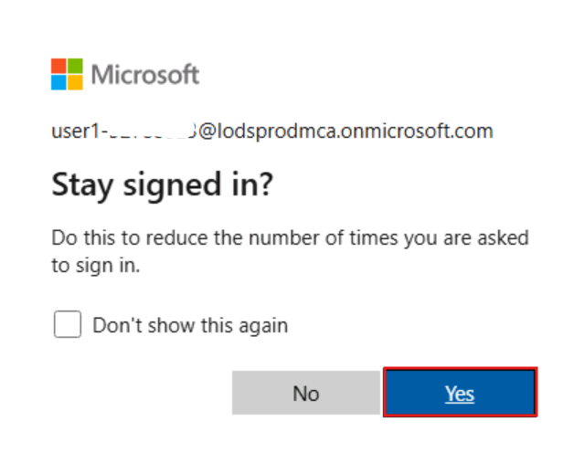 

5.  你将被引导到Power BI主页。

> 

## 練習 2：為您的組織構建並實施一個完整的lakehouse項目

### 任務1：創建Fabric工作區

在這個任務中，你需要創建一個Fabric工作區。工作区包含了本 lakehouse
教程所需的所有内容，包括 lakehouse、数据流、Data Factory
管道、笔记本、Power BI 数据集和报表。

1.  Fabric主页，选择**+New workspace**瓷砖。

> 

2.  在右侧的**Create a
    workspace**面板中，输入以下细节，然后点击“**Apply** ”按钮。 

    | Property  | Value  |
    |-------|-----|
    |Name|	+++Fabric Lakehouse Tutorial-@lab.LabInstance.Id+++ (must be a unique Id)|
    |Advanced	|Under License mode, select Fabric capacity|
    |Default	storage format| Small dataset storage format|
    |Template apps	|Check the Develop template apps|

> 

注意：要查找您的實驗室即時ID，請選擇“Help”並複製即時ID。

> 
>
> 

3.  等待部署完成。完成大約需要2-3分鐘。

> 

### 任务 2: 创建 lakehouse

1.  点击导航栏中的**+New item**按钮创建新lakehouse。

> 

2.  点击“**Lakehouse**”瓷砖。

> 

3.  在“**New lakehouse** ”对话框中，输入“**Name** ”栏的
    +++**wwilakehouse+++** ，点击“**Create**”按钮，打开新湖屋。 

> **注意：**确保在**wwilakehouse**之前清空。
>
> 
>
> 

4.  你会看到一条通知，提示**Successfully created SQL endpoint**。

> 

### 任务3：导入样本数据

1.  In th在**wwilakehouse**页面，点击“**Get data in your
    lakehouse** ”部分，点击**Upload files as shown in the below image**
    。

> 

2.  在“Upload files”标签页中，点击文件下的文件夹

> 

3.  在虚拟机上浏览到
    **C：\LabFiles**，然后选择**dimension_customer.csv**文件，点击**Open**按钮。

> 

4.  然後點擊**Upload **按鈕並關閉

> 

5.  **关闭** 上传文件面板。

> 

6.  點擊並選擇Files刷新。文件出现了。

> 
>
> 

7.  在**Lakehouse**頁面，在資源管理器面板下選擇“文件”。不過，現在你的鼠標可以**dimension_customer.csv**文件。點擊**dimension_customer.csv**旁邊的水平省略號**（...）。**點擊“**Load
    Table**”，然後選擇“**New table**”。

> 

8.  在“**Load file to new table** ”对话框中，点击**Load** 按钮。

> 

9.  现在**dimension_customer**表已经成功创建。

> 

10. 选择 **dbo** 模式下的 **dimension_customer** 表。

> 
>
> 

11. 你也可以用lakehouse的SQL端点用SQL语句查询数据。在屏幕右上角的
    **Lakehouse** 下拉菜单中选择 **SQL analytics endpoint** 。

> 

12. 在 **wwilakehouse** 页面，在 Explorer 下选择 **dimension_customer**
    表预览其数据，并选择 **New SQL query **来写你的 SQL 语句。

> 

13. 以下示例查詢基於**dimension_customer**表的**BuyingGroup列**匯總行數
    。SQL查詢文件會自動保存以供未來參考，你可以根據需要重命名或刪除這些文件。按照下圖所示粘貼代碼，然後點擊播放圖標**運行**
    腳本:

    ```
    SELECT BuyingGroup, Count(*) AS Total
    FROM dimension_customer
    GROUP BY BuyingGroup
    ```
> 

**注意**：如果你在腳本執行過程中遇到錯誤，請交叉檢查腳本語法，確保沒有不必要的空格。

14. 此前，所有lakehouse表和視圖都會自動添加到語義模型中。根據最近的更新，對於新的lakehouse，你必須手動將表格添加到語義模型中。

> 

15. 在lakehouse **主页**标签中，选择“**New semantic
    model** ”，选择你想添加到语义模型中的表格。

> 

16. 在“**New semantic model** ”对话框中输入
    +++wwilakehouse+++，然后从表列表中选择**dimension_customer**表，选择**Confirm** 以创建新模型。

> 

### 任务4：制作报告

1.  现在，点击 左侧导航面板上的 **Fabric Lakehouse Tutorial-XX** 。

> 

2.  在 **Fabric Lakehouse Tutorial-XX** 视图中，选择类型**Semantic
    model**的 **wwilakehouse**。

> 

3.  從語義模型窗格中，你可以查看所有表格。你可以選擇從零創建報告、分頁報告，或者讓
    Power BI 根據你的數據自動生成報告。在本教程中，在“**Explore this
    data**”中，选择“**Auto-create a report**”，如下图所示。

> 

4.  报告准备好后，点击“ **View report now** ”以打开并查看。

> 

5.  由於表格是一個維度，裡面沒有測量值，Power BI
    會為行數創建一個度量，並在不同列中匯總，並生成不同的圖表，如下圖所示。

6.  通過從頂部的色帶選擇**“Save**”，將此報告保存以備將來使用。

> 

7.  在“**Save your report** ”对话框中，输入你的报告名称为
    +++dimension_customer-report+++，然后选择**Save**。

> 

8.  你会看到一条通知，说“**Report saved**”。

> 

# 練習2：將數據導入lakehouse

在這個練習中，你會將來自世界大戰（WWI）的額外維度和事實表導入lakehouse。

### 任务1：数据导入

1.  现在，点击 左侧导航面板上的 **Fabric Lakehouse Tutorial-XX**。

> 

2.  同樣，選擇工作區名稱。


3.  在 **Fabric Lakehouse Tutorial-XX** 工作区页面，点击 **+New
    item** 按钮，然后选择**Pipeline**。

> 

4.  在“New pipeline”对话框中，将名称指定为
    **+++IngestDataFromSourceToLakehouse+++**，并选择**Create。**
    创建一个新的数据工厂流水线并被创建。


> 

5.  在新建的数据工厂流水线（即
    **IngestDataFromSourceToLakehouse**）中，选择“**Copy
    data**”下拉菜单，并选择“**Add to canvas**”选项。

> 

6.  选择**copy data**后，导航到**Source**签页。


7.  选择**Connection**下拉菜单，选择“**Browse all**”选项。


8.  从左侧窗格选择“**Sample data**”，并选择**Retail Data Model from Wide
    World Importers**。

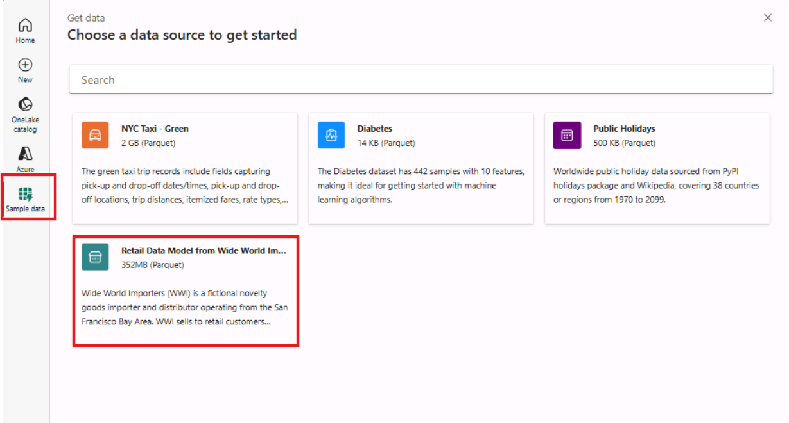

9.  在“**Connect to data source**”窗口中，选择“**Retail Data Model from
    Wide World Importers** ”数据预览并选择**OK**。

> 

10. 選擇數據源連接作為樣本數據。


11. 现在，导航到**destination**标签页。


12. 在目标标签页，点击**connection**下拉菜单，选择“**Browse**
    **all**”选项。

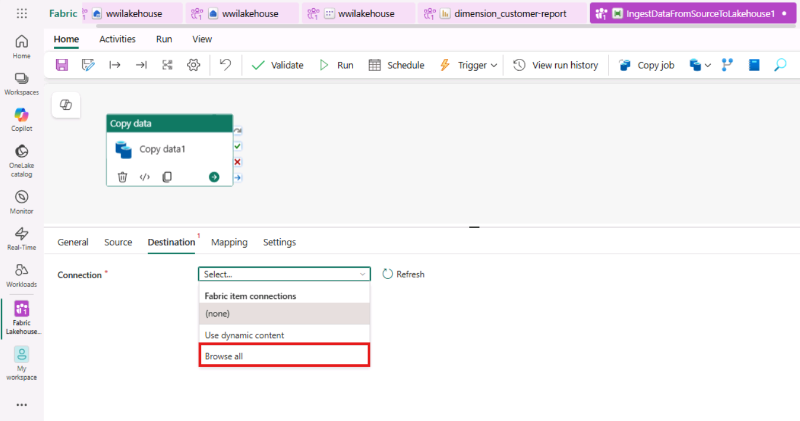

13. 在选择目的地窗口时，从左侧窗格选择**OneLake
    catalog**，然后选择**wwilakehouse**。

> 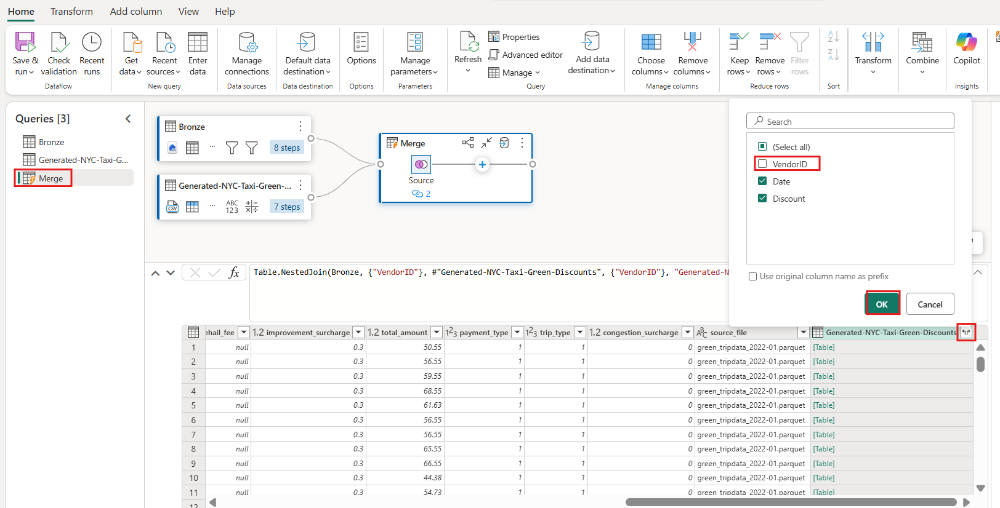

14. 目的地现定为Lakehouse。将**Root
    Folder**指定为**Files**，并确保文件格式为**Parquet**。


8.  點擊 **“Run”** 以運行複製數據。

> 

9.  点击“**Save and run**”按钮，这样该流程就会被保存并运行。

> 

10. 數據複製過程大約需要1-3分鐘完成。

> 
>
> 
>
> 

11. 在輸出標簽下，選擇 **Copy
    data1** 查看數據傳輸的詳細信息。看到**Status** 为**Succeeded**后，点击**Close** 按钮。

> 
>
> 

12. 管道成功執行後，進入你的湖屋（**wwilakehouse**）打開資源管理器查看導入的數據。

> 

13. 验证所有 **WideWorldImporters
    文件夹**是否都存在于资源**Explorer** 视图中，并且包含所有表的数据。

> 

# 練習3：準備並轉換lakehouse中的數據

### 任務1：轉換數據並加載為銀色Delta表

1.  在 **wwilakehouse** 页面，点击命令栏的“**Open
    notebook** ”下拉，然后选择 **New notebook**。

> 

2.  在**Lakehouse
    explorer**中的打开笔记本中，你会发现笔记本已经与你打开的lakehouse关联。

> 

\[！note\] **注意**：Fabric 提供
[**V-order**](https://learn.microsoft.com/en-us/fabric/data-engineering/delta-optimization-and-v-order)功能，用于写入优化的三角洲湖文件。V-order通常能将压缩率提升三到四倍，性能加速高达十倍，而这些文件则是未优化的Delta
Lake文件。Fabric中的Spark動態優化分區，生成默認大小為128
MB的文件。目標文件大小可根據工作負載需求通過配置進行調整。
通過[**優化寫**](https://learn.microsoft.com/en-us/fabric/data-engineering/delta-optimization-and-v-order#what-is-optimized-write)入功能，Apache
Spark引擎減少寫入文件數量，並旨在增加寫入數據的單個文件大小。

3.  在你將數據寫入湖屋的**表**部分為三角湖表之前，你需要使用Fabric的兩個功能（**V-order**和**優化寫入**）來優化數據寫入並提升讀取性能。要在會話中啟用這些功能，請在筆記本的第一個單元格中設置這些配置。

4.  用以下代碼更新該**單元格**的代碼 ，並點擊懸停時左側出現的**▷ Run
    cell**。

    ```
    # Copyright (c) Microsoft Corporation.
    # Licensed under the MIT License.
    spark.conf.set("spark.sql.parquet.vorder.enabled", "true")
    spark.conf.set("spark.microsoft.delta.optimizeWrite.enabled", "true")
    spark.conf.set("spark.microsoft.delta.optimizeWrite.binSize", "1073741824")
    ```

\[!note\]注意：运行单元格时，您无需指定底层 Spark 池或集群的详细信息，


因为 Fabric 通过 Live Pool 提供这些资源。每个 Fabric
工作区都自带一个默认的 Spark 池，称为 Live
Pool。这意味着创建笔记本时，您无需担心指定任何 Spark
配置或集群详细信息。執行第一個筆記本命令後，Live Pool
會在幾秒鐘內啟動並運行。Spark
會話建立後，代碼便開始執行。在此筆記本中，只要 Spark
會話處於活動狀態，後續代碼的執行幾乎是瞬間完成的。

5.  接下來，你從 lakehouse 的**文件**部分讀取原始數據
    ，並在轉換過程中為不同日期部分添加更多列。你使用 partitionBy Spark
    API 对数据进行分区，然后再根据新创建的数据部分列（年度和季度）写成
    delta 表。

6.  使用單元格輸出下方的 **+ Code**
    圖標，向筆記本添加一個新的代碼單元格，並輸入以下代碼。点击**▷ Run
    cell**按钮，查看输出结果

**注意**：如果你看不到輸出，請點擊**Spark**作業左側的水平線。

    ```
    from pyspark.sql.functions import col, year, month, quarter
    
    table_name = 'fact_sale'
    
    df = spark.read.format("parquet").load('Files/fact_sale_1y_full')
    df = df.withColumn('Year', year(col("InvoiceDateKey")))
    df = df.withColumn('Quarter', quarter(col("InvoiceDateKey")))
    df = df.withColumn('Month', month(col("InvoiceDateKey")))
    
    df.write.mode("overwrite").format("delta").partitionBy("Year","Quarter").save("Tables/" + table_name)
    ```

> 
>
> 
>
> 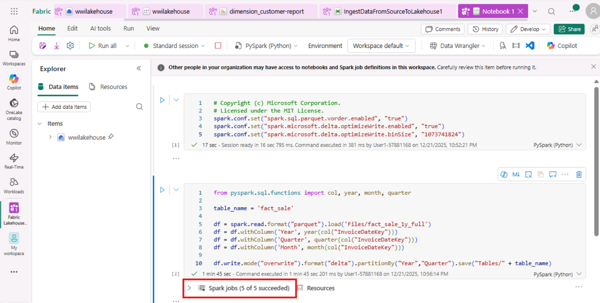

7.  表格加載完成後，你可以繼續加載其餘尺寸的數據。接下來的單元格創建一個函數，用於讀取
    lakehouse
    **文件**部分中每個作為參數傳遞的表名的原始數據。接下來，它創建一個維度表列表。最後，它會循環處理表列表，並為每個從輸入參數讀取的表名創建一個增量表。

8.  使用單元格輸出下方的 **+
    Code**圖標，向筆記本添加一個新的代碼單元格，並輸入以下代碼。点击 **▷
    Run cell**  按钮，查看输出结果。

    ```
    from pyspark.sql.types import *
    
    def loadFullDataFromSource(table_name):
        df = spark.read.format("parquet").load('Files/' + table_name)
        df = df.drop("Photo")
        df.write.mode("overwrite").format("delta").save("Tables/" + table_name)
    
    full_tables = [
        'dimension_city',
        'dimension_customer',
        'dimension_date',
        'dimension_employee',
        'dimension_stock_item'
    ]
    
    for table in full_tables:
        loadFullDataFromSource(table)
    ```
> 
>
> 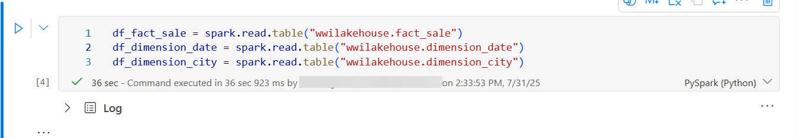

6.  要验证已创建的表，请在**Explorer**面板的“**Tables**”中点击并选择刷新，直到所有表都出现在列表中。

> 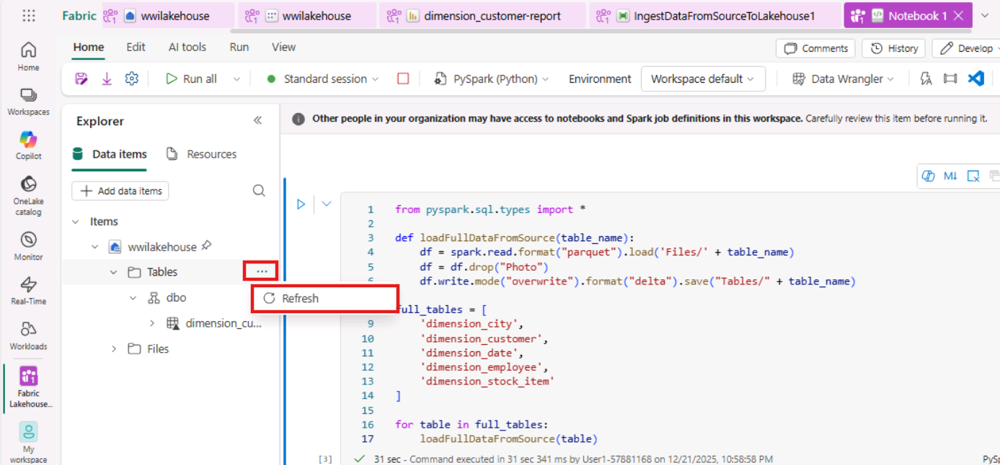
>
> 

### **任務2：整合業務數據以實現聚合**

一個組織可能有數據工程師在使用Scala/Python，還有其他數據工程師在使用SQL（Spark
SQL或T-SQL），他們都處理同一份數據。Fabric使這些經驗和偏好各異的群體能夠合作和合作。這兩種不同的方法能夠轉化並生成業務匯總。你可以根據喜好選擇合適的方案，或根據喜好混合搭配這些方法，而不犧牲性能:

- **Approach \#1** - 使用 PySpark
  连接和汇总数据以生成业务聚合。这种方法比有编程背景（Python或PySpark）的人更合适。

- **Approach \#2** - 使用 Spark SQL
  连接和汇总数据以生成业务聚合。这种方法对有 SQL 背景、转用 Spark
  的人来说更受欢迎。

**Approach \#1 (sale_by_date_city)**

使用 PySpark
進行合併和匯總數據，生成業務聚合。用以下代碼，你創建三個不同的 Spark
數據幀，每個數據幀都引用一個已有的 delta
表。然後你用數據幀連接這些表，進行分組生成聚合，重命名幾列，最後在湖屋的**表**部分寫成一個增量表，以保持數據的保存。

1.  使用單元格輸出下方的 **+
    Code**圖標，向筆記本添加一個新的代碼單元格，並輸入以下代碼。点击 **▷
    Run cell** 按钮，查看输出结果

在這個單元格中，你創建三個不同的 Spark
數據幀，每個數據幀都引用一個已有的 delta 表。

    ```
    df_fact_sale = spark.read.table("wwilakehouse.fact_sale") 
    df_dimension_date = spark.read.table("wwilakehouse.dimension_date")
    df_dimension_city = spark.read.table("wwilakehouse.dimension_city")
    ```


2.  使用單元格輸出下方的 **+
    Code**圖標，向筆記本添加一個新的代碼單元格，並輸入以下代碼。点击 **▷
    Run cell**按钮，查看输出结果

在這個單元格裡，你用之前創建的數據幀連接這些表，進行分組生成聚合，重命名幾列，最後在
lakehouse 的**表格**部分寫成一個delta表。

    ```
    sale_by_date_city = df_fact_sale.alias("sale") \
    .join(df_dimension_date.alias("date"), df_fact_sale.InvoiceDateKey == df_dimension_date.Date, "inner") \
    .join(df_dimension_city.alias("city"), df_fact_sale.CityKey == df_dimension_city.CityKey, "inner") \
    .select("date.Date", "date.CalendarMonthLabel", "date.Day", "date.ShortMonth", "date.CalendarYear", "city.City", "city.StateProvince", 
     "city.SalesTerritory", "sale.TotalExcludingTax", "sale.TaxAmount", "sale.TotalIncludingTax", "sale.Profit")\
    .groupBy("date.Date", "date.CalendarMonthLabel", "date.Day", "date.ShortMonth", "date.CalendarYear", "city.City", "city.StateProvince", 
     "city.SalesTerritory")\
    .sum("sale.TotalExcludingTax", "sale.TaxAmount", "sale.TotalIncludingTax", "sale.Profit")\
    .withColumnRenamed("sum(TotalExcludingTax)", "SumOfTotalExcludingTax")\
    .withColumnRenamed("sum(TaxAmount)", "SumOfTaxAmount")\
    .withColumnRenamed("sum(TotalIncludingTax)", "SumOfTotalIncludingTax")\
    .withColumnRenamed("sum(Profit)", "SumOfProfit")\
    .orderBy("date.Date", "city.StateProvince", "city.City")
    
    sale_by_date_city.write.mode("overwrite").format("delta").option("overwriteSchema", "true").save("Tables/aggregate_sale_by_date_city")
    ```


**Approach \#2 (sale_by_date_employee)**

使用Spark
SQL進行連接和聚合數據，生成業務聚合。用以下代碼，你通過連接三個表創建臨時
Spark 視圖，進行分組生成聚合，並重命名部分列。最后，你从临时的 Spark
视图读取数据，最后将其写入 Lakehouse 的 **Tables** 部分的 delta
表，以保持数据的持久化。

3.  使用單元格輸出下方的 **+ Code**
    圖標，向筆記本添加一個新的代碼單元格，並輸入以下代碼。点击** ▷ Run
    cell**按钮，查看输出结果

在這個單元格裡，你通過連接三個表創建臨時 Spark
視圖，進行分組生成聚合，並重命名部分列。

    ```
    %%sql
    CREATE OR REPLACE TEMPORARY VIEW sale_by_date_employee
    AS
    SELECT
           DD.Date, DD.CalendarMonthLabel
     , DD.Day, DD.ShortMonth Month, CalendarYear Year
          ,DE.PreferredName, DE.Employee
          ,SUM(FS.TotalExcludingTax) SumOfTotalExcludingTax
          ,SUM(FS.TaxAmount) SumOfTaxAmount
          ,SUM(FS.TotalIncludingTax) SumOfTotalIncludingTax
          ,SUM(Profit) SumOfProfit 
    FROM wwilakehouse.fact_sale FS
    INNER JOIN wwilakehouse.dimension_date DD ON FS.InvoiceDateKey = DD.Date
    INNER JOIN wwilakehouse.dimension_Employee DE ON FS.SalespersonKey = DE.EmployeeKey
    GROUP BY DD.Date, DD.CalendarMonthLabel, DD.Day, DD.ShortMonth, DD.CalendarYear, DE.PreferredName, DE.Employee
    ORDER BY DD.Date ASC, DE.PreferredName ASC, DE.Employee ASC
    ```

 

8.  使用單元格輸出下方的 **+
    Code**圖標，向筆記本添加一個新的代碼單元格，並輸入以下代碼。点击 **▷
    Run cell** 按钮，查看输出结果

在这个单元格中，你从前一个单元创建的临时 Spark
视图读取数据，最后将其写成 Lakehouse 的 **Tables** 部分的 delta 表。

sale_by_date_employee = spark.sql("SELECT \* FROM
sale_by_date_employee")

sale_by_date_employee.write.mode("overwrite").format("delta").option("overwriteSchema",
"true").save("Tables/aggregate_sale_by_date_employee")


9.  要驗證已創建的**表**，請點擊並選擇“refresh”，直到匯總表出現。


這兩種方法的結果相似。你可以根據自己的背景和偏好選擇，以減少學習新技術或在性能上做出妥協。

你可能還會發現你把數據寫成了三角洲湖的文件。Fabric
的自動表發現和註冊功能會在元存儲中獲取並註冊這些數據。你不需要顯式調用
CREATE TABLE 語句來創建用於 SQL 的表。

# 練習4：在Microsoft Fabric中構建報表

在教程的這一部分中，你將創建一個Power
BI數據模型，並從零開始創建一份報告。

### 任務1：利用SQL端點探索銀層中的數據

Power
BI是原生集成在整個Fabric體驗中的。這種原生集成帶來了一種獨特的模式，稱為DirectLake，能夠訪問湖屋中的數據，提供最高性能的查詢和報告體驗。DirectLake
模式是一種開創性的全新引擎功能，用於分析 Power BI
中非常龐大的數據集。該技術基於這樣一個理念：直接從data
lake加載parquet格式文件，無需查詢數據倉庫或lakehouse端點，也無需導入或複製數據到Power
BI數據集中。DirectLake 是一種快速路徑，可以直接將數據湖的數據加載到
Power BI 引擎，供分析。

在傳統的DirectQuery模式下，Power
BI引擎直接從源端查詢數據以執行每個查詢，查詢性能取決於數據檢索速度。DirectQuery
消除了複製數據的需求，確保源代碼的任何變化在導入過程中立即反映在查詢結果中。另一方面，導入模式下性能更好，因為數據在內存中易於獲取，無需每次查詢都從源端查詢數據。然而，Power
BI
引擎必須在數據刷新時先將數據複製到內存中。只有在下一次數據刷新（無論是計劃刷新還是按需刷新）時，才會被接收到底層數據源的變更。

DirectLake
模式現在通過直接將數據文件加載到內存中，消除了這種導入要求。由於沒有明確的導入流程，用戶可以在源頭實時捕捉任何變化，從而結合了DirectQuery和導入模式的優勢，同時避免了它們的缺點。因此，DirectLake
模式是分析非常大型數據集和源頭頻繁更新數據集的理想選擇。

1.  在左側菜單中，選擇工作區圖標，然後選擇工作區名稱。

> 

2.  在左側菜單中選擇**Fabric** [**Lakehouse-@lab.LabInstance.Id**
    然後選擇名為](mailto:Lakehouse-@lab.LabInstance.Id)**wwilakehouse**的語義模型。

> 

3.  在顶部菜单栏选择“**Open semantic model**”以打开数据模型设计器。

> 

4.  在右上角，確保數據模型設計器處於**Editing**模式。這樣下拉文本應該會變成“Editing”。

> 

5.  在菜单功能区中选择**“Edit tables**”以显示表格同步对话框。

> 

6.  在“**Edit semantic
    model** ”对话框中，**选择所有**表格，然后在对话框底部选择“**Confirm** ”以同步语义模型。

> 
>
> 

7.  从**fact_sale**表中，拖动**CityKey**字段并将其放置在**dimension_city**表中的CityKey**字段**
    上，创建关联。创建**关系对话框**出现了。

> 注意：通过点击表格，拖放表格，将dimension_city和fact_sale表格相邻来重新排列表格。同样的道理也适用于你想要建立关系的两张桌子。这样做只是为了方便在表格之间拖拽列。 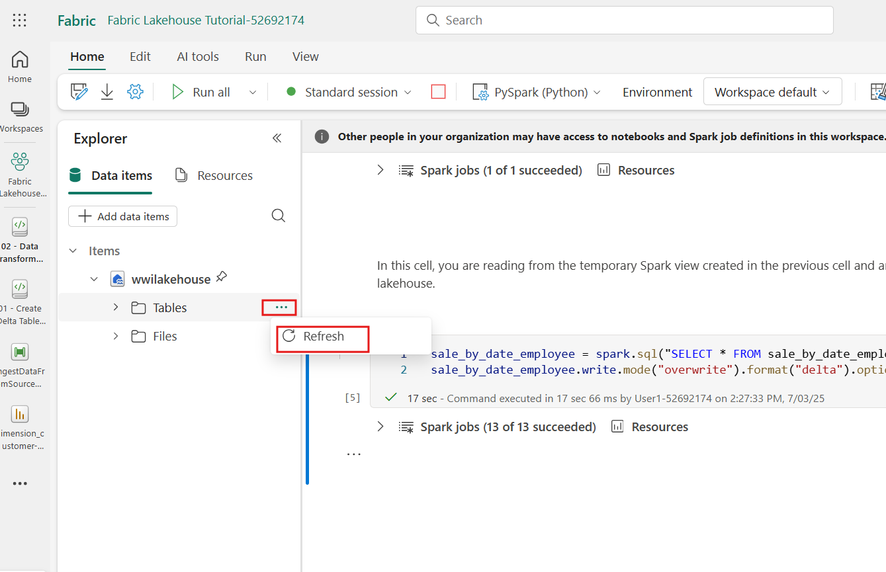

8.  在**Create Relationship**对话框中:

    - **表1**由**fact_sale**和**CityKey**列填充。

    - **表2**包含**dimension_city**和**CityKey**列。

    - Cardinality: **Many to one (\*:1)**

    - 交叉滤波器方向: **Single**

    - 保持“**Make this relationship active**”旁边的复选框选中。 

    - 选中“**Assume referential integrity**”旁边的复选框。

    - 选择**Save。**

> 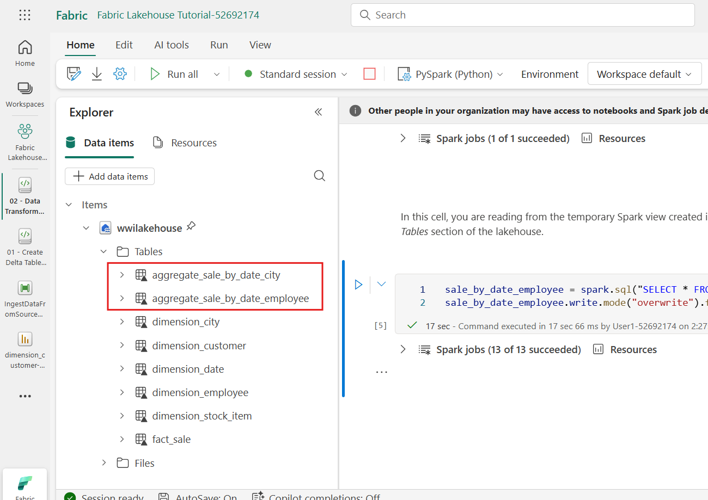

9.  接下来，将这些关系添加在与上述相同的**Create
    Relationship**置中，但表格和列为基础:

    - **StockItemKey(fact_sale)** - **StockItemKey(dimension_stock_item)**

> 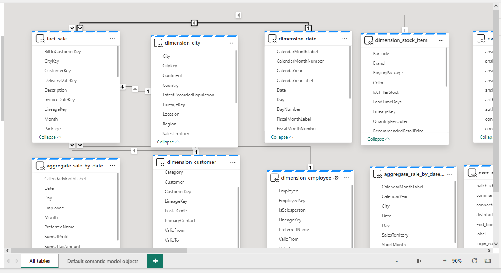
>
> 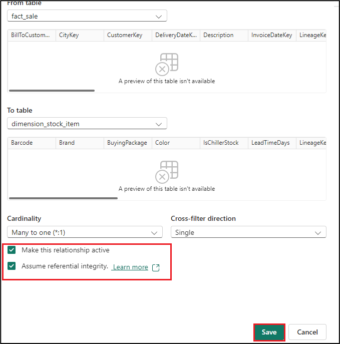

- **Salespersonkey(fact_sale)** - **EmployeeKey(dimension_employee)**

> 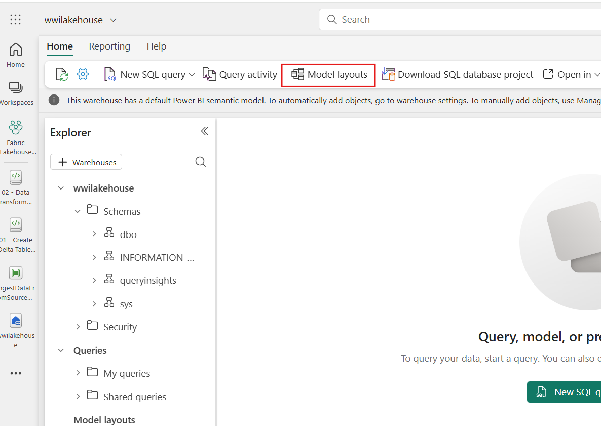

10. 確保按照上述步驟創建下面兩組之間的關係。

    - **CustomerKey(fact_sale)** - **CustomerKey(dimension_customer)**

    - **InvoiceDateKey(fact_sale)** - **Date(dimension_date)**

11. 添加這些關係後，您的數據模型應如下圖所示，準備進行報告。

> 

### 任务2：建造报告

1.  从顶部功能区选择**文件**，选择**Create new report**，开始在 Power BI
    中创建报表/仪表盘。

> 

2.  在 Power BI
    報表畫布中，您可以通過將所需列從**數據**窗格拖入畫布，並使用一個或多個可用的可視化工具來創建滿足業務需求的報表。

> 

**添加标题:**

3.  在功能区中，选择**Text box**。输入**WW Importers Profit
    Reporting**。高**Highlight** 文本并放大到**20**。

> 

4.  調整文本框大小，放在報告頁面左**上角**，點擊文本框外。

> 

**添加卡片:**

- 在**數據**面板上，展開**fact_sales**並勾選利潤旁邊的框。此選擇會生成柱狀圖表，並將字段添加到Y軸。

> 

5.  選擇柱狀圖後，在可視化面板中選擇**卡片**可視化。

> 

6.  此選擇將視覺化轉換為一張卡片。把卡片放在标题下面。

> 

7.  點擊空白畫布上的任意位置（或按Esc鍵），這樣剛放置的卡牌就不再被選中。

**添加条形图:**

8.  在**數據**面板上，展開**fact_sales**並勾選利潤旁邊的框。此選擇會生成柱狀圖表，並將字段添加到Y軸。

> 

9.  在**数据**面板中，展开**dimension_city**并勾选**SalesTerritory**的选项。该选择将场添加到Y轴上。

> 

10. 选择条形图后，在可视化窗格中选择**“Clustered bar
    chart**”可视化。此选择将柱状图转换为柱状图。

> 

11. 調整條形圖大小，填滿標題和卡片下方的區域。

> 

12. 點擊空白畫布上的任意位置（或按Esc鍵），這樣條形圖就不再被選中。

**構建疊加面積圖可視化:**

13. 在**Visualizations**面板中，选择**Stacked area chart** 可视化。 

> 

14. 重新定位並調整堆疊區域圖，位於卡片右側，以及之前步驟中創建的條形圖可視化。

> 

15. 在**数据**面板上，展开**fact_sales**并勾选利润旁边的框。展开**dimension_date**，勾选“**FiscalMonthNumber**”旁边的框。该选择会生成一个充满折线图，显示按财政月份的利润。

> 

16. 在**数据**面板中，展开**dimension_stock_item**，并将
    **BuyingPackage** 拖入图例字段。该选项为每个购买套餐添加一行。

>  

17. 點擊空白畫布上的任意位置（或按Esc鍵），這樣堆疊面積圖就不再被選中。

**制作柱状图:**

18. 在**Visualizations **面板中，选择**Stacked column chart**可视化。

> 

19. 在**數據**面板上，展開**fact_sales**並勾選**利潤**旁邊的框。該選擇將場添加到Y軸上。

20.  在**数据**面板中，展开**dimension_employee**，勾选“**Employee**”旁边的框。该选择将场加到X轴上。

> 

21. 在空白畫布上任意點擊（或按Esc鍵），這樣圖表就不再被選中。

22. 从功能区选择**“File \> Save**”。

> 

23. 请输入您的报告名称为**“Profit Reporting**”。选择**Save**。

> 

24. 你會收到通知，說報告已被保存。

> 

# 練習5：清理資源

你可以刪除單個報表、管道、倉庫和其他項目，或者刪除整個工作區。請按照以下步驟刪除你為本教程創建的工作區。

1.  选择你的工作区，从左侧导航菜单中选择**Fabric Lakehouse
    Tutorial-XX**。它会打开工作区的物品视图。

> 

2.  选择...... 在工作区名称下选择选项，选择**Workspace settings**。

> 

3.  选择**“General**”并**Remove this workspace。**

> 

4.  点击弹出的警告中“**Delete**”。

> 

5.  等待工作區被刪除的通知後，再進入下一個實驗室。

> 

**總結**：本實踐實驗室重點在Microsoft Fabric和Power
BI中設置和配置數據管理與報告所需的關鍵組件。它包括激活試用、配置
OneDrive、創建工作區和設置湖屋等任務。實驗室還涵蓋採樣數據的導入、優化差異表以及在
Power BI 中構建報告以實現有效數據分析等任務。目标旨在提供使用Microsoft
Fabric和Power BI进行数据管理和报告目的的实践经验
