# 用例01——创建Lakehouse，导入样本 data并构建报告

**剧情**

**Wide World Importers（WWI）**
是一家全球零售组织，在多个地区运营数百家门店。客户信息来自各种运营系统，包括point-of-sale（POS）应用、客户关系管理平台和电子商务渠道。Data以CSV文件形式存储，每天从不同业务单元接收。

公司分析團隊目前花費大量時間手動導入文件、驗證 data質量以及準備 data
集以供報告。這些人工流程導致客戶洞察生成延遲，並使業務用戶難以獲取一致可靠的信息。

为了现代化其分析平台，Wide World Importers 采用了 **Microsoft Fabric**
作为其统一 data平台。Data engineering团队的任务是利用 **Microsoft Fabric
Data Factory** 和 **Lakehouse** 实现可扩展解决方案，以集中客户
data，实现高效的 data 管理，简化报告。

作为Data
Engineer，你的职责是创建Fabric工作区，配置Lakehouse，将客户数据导入OneLake，将源文件转换为托管的Delta表，使用SQL
Analytics Endpoint验证导入 data，创建Direct Lake
semantic模型，并生成Power
BI报告，使业务利益相关者能够以最小延迟分析客户信息。

通过实施该解决方案，Wide World Importers 可以消除手动 data
准备，提供客户分析的单一真实来源，并利用 Microsoft Fabric 实现更快速、
data驱动的业务决策。

**简介**

在此用例中，您将通过使用 **Microsoft Fabric Data Factory** 和 **Fabric
Lakehouse** 构建完整的data engineering解决方案。从新的 Fabric
工作区开始，你将将 data导入 Lakehouse，将文件转换为托管的 Delta 表，使用
SQL analytics endpoints查询 data，创建语义模型，并生成交互式 Power BI
报告。

在整个实验室过程中，你将探索 Microsoft Fabric 如何将
data集成、存储、转换、分析和报告整合到单一的Software-as-a-Service（SaaS）平台中。通过完成此实践练习，您将理解现代data
engineering工作流程如何通过Fabric Data Factory实现，同时遵循行业最佳
data采集、管理和分析实践。

**目标**:

- 创建并配置一个 Microsoft Fabric 工作空间。

- 建造并配置Fabric Lakehouse。

- 将源data导入OneLake。

- 將文件加載到託管的Delta表中。

- 使用 SQL Analytics Endpoint 查询 Lakehouse data。

- 创建一个Direct Lake semantic模型。

- 从Fabric data生成并探索Power BI报告。

- 了解Fabric Data Factory如何将data
  engineering和分析整合到一个统一平台中。

## 练习 1：搭建 Microsoft Fabric Data Engineering 环境 

在构建 data engineering 解决方案之前，你需要先准备好Microsoft
Fabric环境。在此练习中，您将登录 Microsoft
Fabric，创建专用工作区，并配置一个Lakehouse，作为分析解决方案的集中存储。

### 任务1：登录 Power BI 账户

1.  打开浏览器，进入地址栏，输入或粘贴以下URL：+++https：//app.fabric.microsoft.com/+++，然后按下**Enter **键。


2.  在 **Microsoft Fabric** 窗口中，输入你的凭证，然后点击
    **Submit**按钮。

| Credential | Value |
|---|---|
| Username | +++@lab.CloudPortalCredential(User1).Username+++ |
| Password | +++@lab.CloudPortalCredential(User1).Password+++ |


3.  然后，在 **Microsoft** 窗口输入密码，点击**Sign in**按钮。

> 

4.  在 **Stay signed in?** 窗口，点击**“Yes”**按钮。

5.  你将被引导到Power BI主页。

> 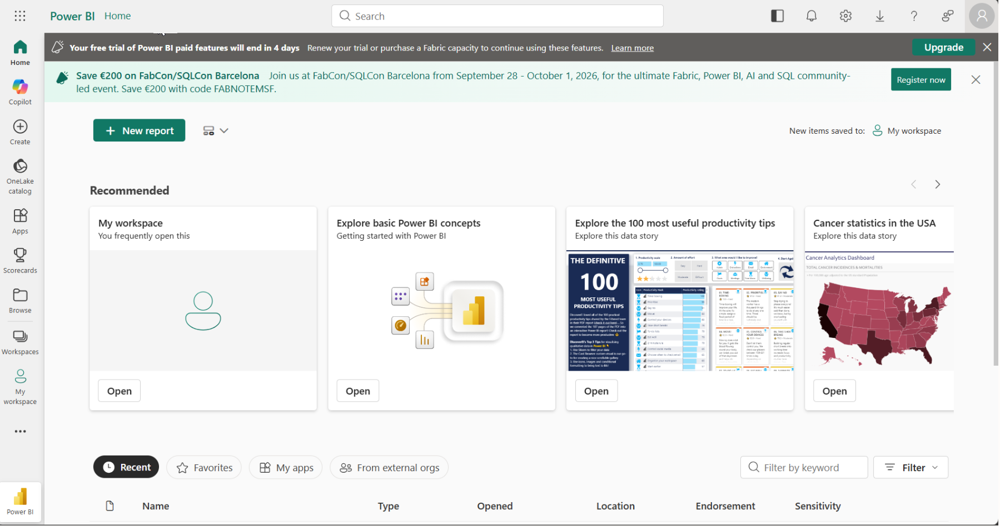

6.  选择屏幕左下角的默认 Power BI 图标，然后选择 **Fabric**。

> 
>
> 

### 任務 2：創建Fabric工作區

在這個任務中，你需要創建一個Fabric工作區。工作区包含了本 lakehouse
教程所需的所有内容，包括 lakehouse、dataflows、Data Factory
pipelines、笔记本、Power BI data集和报表。

1.  Fabric主页，选择**+New workspace**瓷砖。

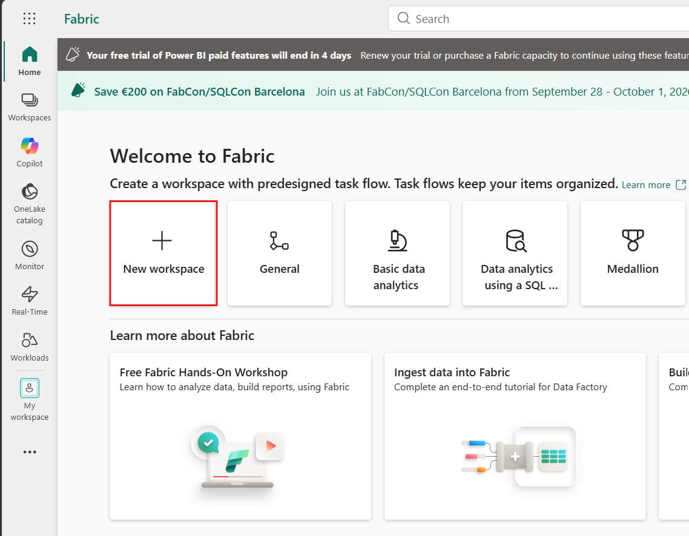

2.  在右侧的 ** Create a
    workspace**面板中，输入以下细节，然后点击**“Apply**”按钮。

| Property | Value |
|---|---|
| Name | !!Fabric Dataengineering-DataFactoryXXXXXX!! |
| Advanced | Under License mode, select Fabric |
| Default storage format | Small dataset storage format |


注意：要查找您的实验室 instant ID，请选择“Help”并复制 instant ID。


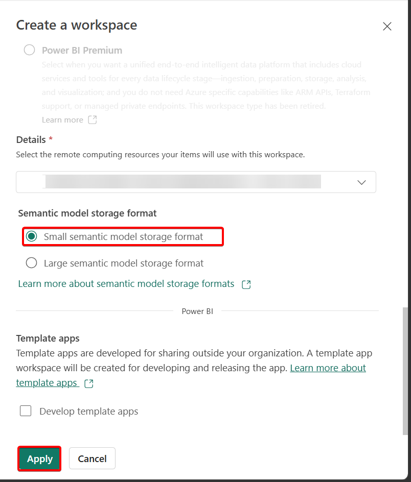

3.  等待部署完成。完成大約需要2-3分鐘。

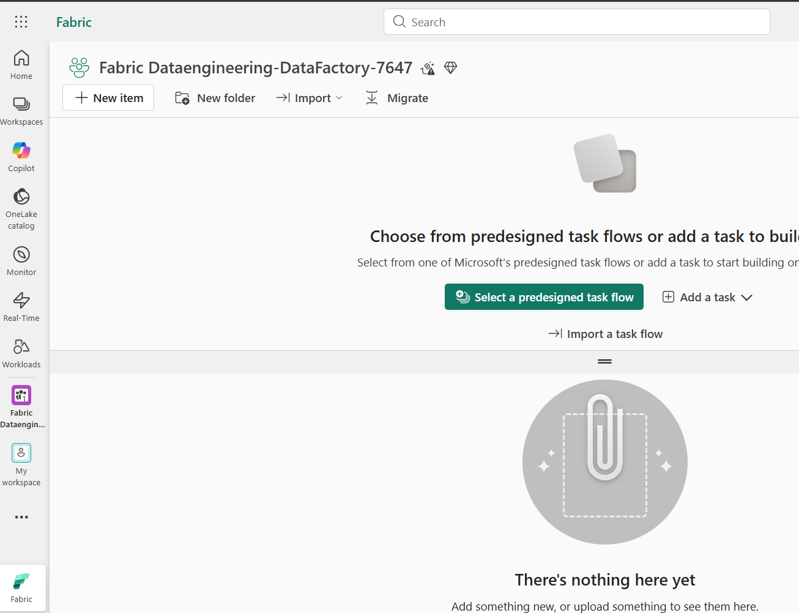

### 任务 3：建造 lakehouse

1.  点击导航栏中的 **+New item **按钮创建新lakehouse。

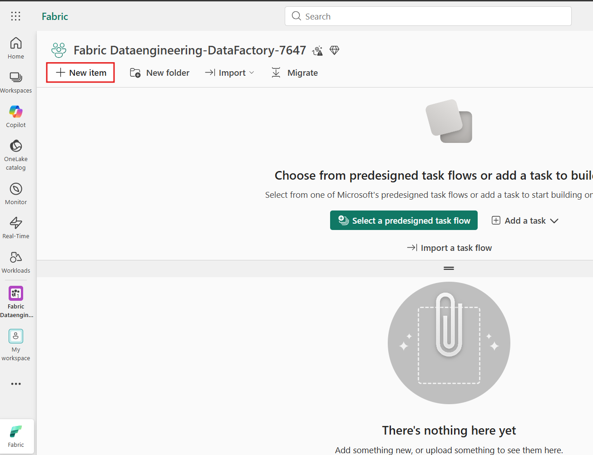

2.  点击“**Lakehouse**”瓷砖。

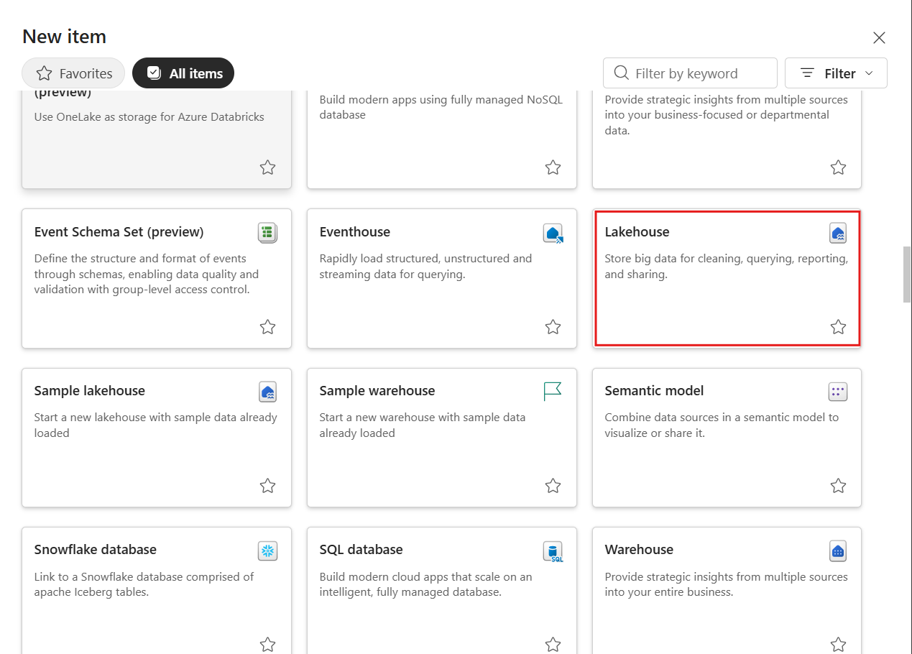

3.  在**“New lakehouse**”对话框中，在名称字段输入 +++**wwilakehouse+++**
    并**取消选择**lakehouses的模式。点击**“Create** ”按钮，打开新的lakehouse。

**注意：**确保在**wwilakehouse**之前清空。

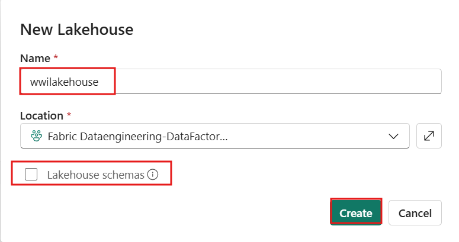

4.  你会看到一条通知，提示**Successfully created SQL endpoint。**

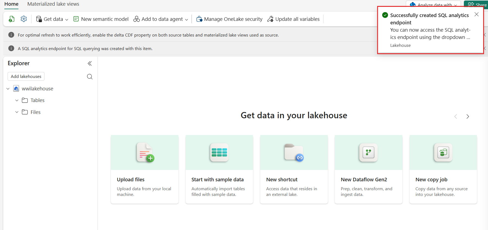

### 任務4： **導入樣本data**

1.  在**wwilakehouse**页面，点击**“Get data in your
    lakehouse**”部分，点击“**Upload files**”，如下图所示。


2.  在“Upload files”标签页中，点击Files下的文件夹

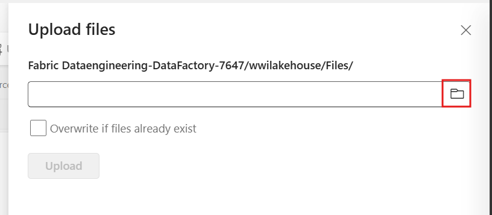

3.  在虚拟机上浏览到
    **C：\LabFiles**，然后选择**dimension_customer.csv**文件，点击**Open **按钮。


4.  然後點擊**Upload **按鈕並關閉

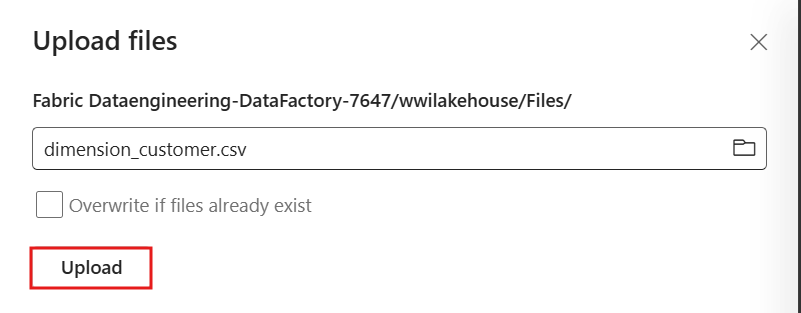

5.  **关闭**上传文件面板。

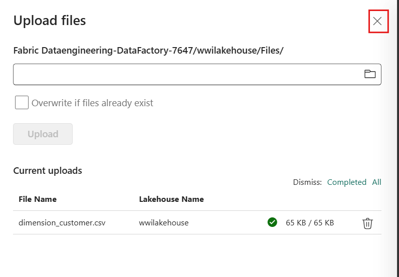

6.  點擊並選擇**Files**刷新。文件出现了。

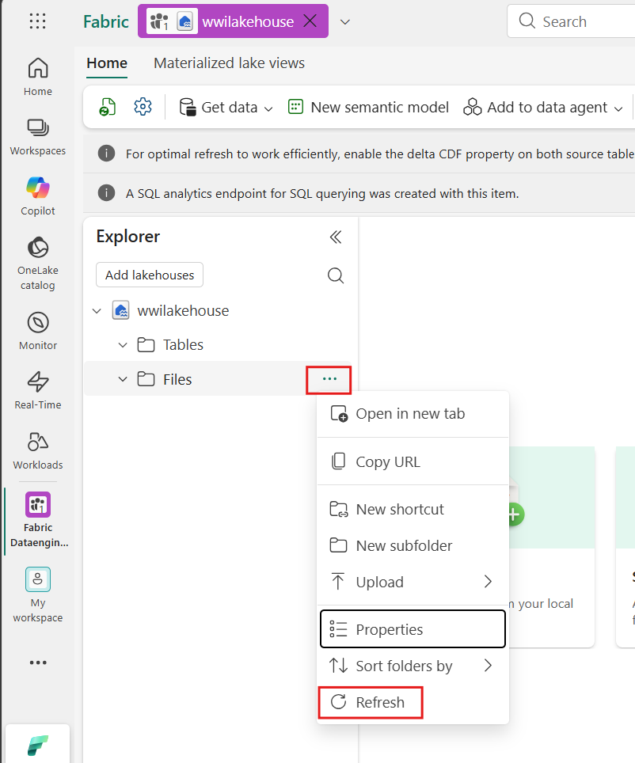

7.  在**Lakehouse**页面，在Explorer面板下选择“Files”。不过，现在，你的鼠标可以选择文件**dimension_customer.csv**。点击水平椭圆**（...）**
    旁边**dimension_customer**.csv。点击**“Load Table**”，然后选择**“New
    table**”。


> 

8.  在**“Load file to new table**”对话框中，点击**Load**按钮。


9.  现在 表格**dimension_customer**成功创建。

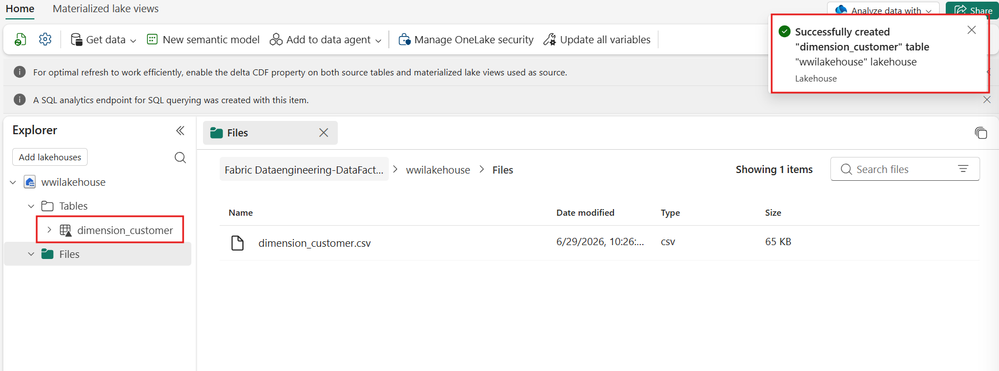

10. 在表格下选择**dimension_customer**表。

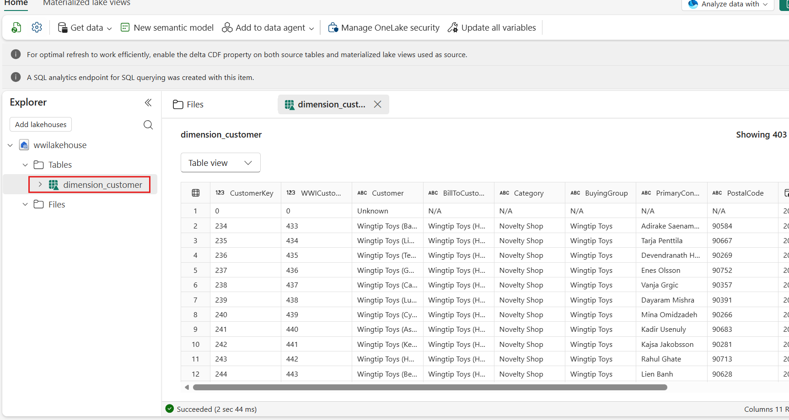

11. 您还可以使用 Lakehouse 的 SQL endpoint，通过 SQL
    语句查询data。从屏幕右上角的使用以下方式 **Analyze data
    with** 下拉菜单中选择 **SQL analytics endpoint**。


12. 在 **wwilakehouse** 页面，在 Explorer 下选择 **dimension_customer**
    表预览其 data，并选择 **New SQL query** 来写你的 SQL 语句。

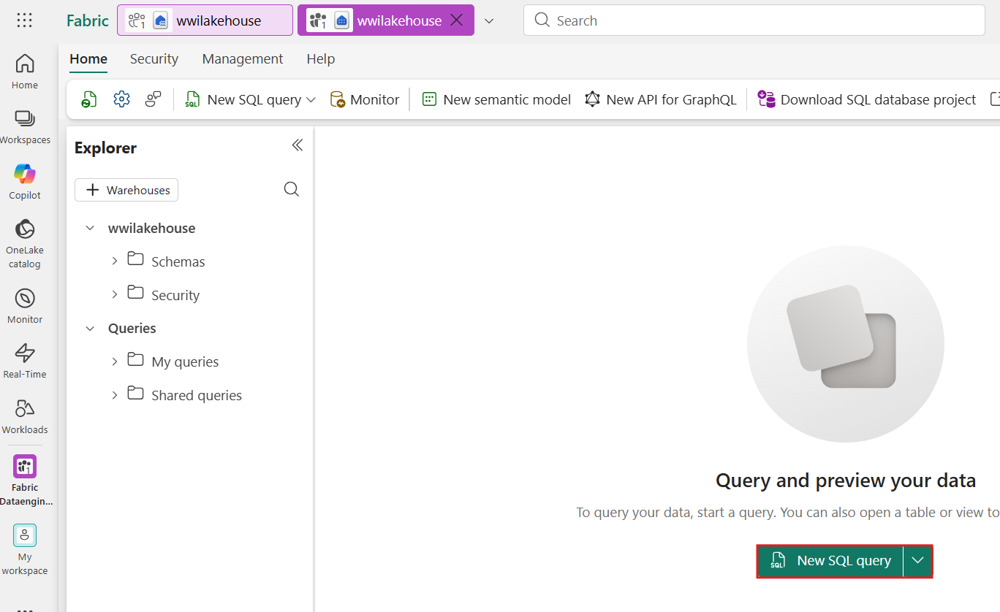

13. 以下示例查询基于**dimension_customer**表的**BuyingGroup**列汇总行数
    。SQL
    query文件会自动保存以供未来参考，你可以根据需要重命名或删除这些文件。按照下圖所示粘貼代碼，然後點擊播放圖標**Run**
    腳本：

```
SELECT BuyingGroup, Count(*) AS Total
FROM dimension_customer
GROUP BY BuyingGroup
```

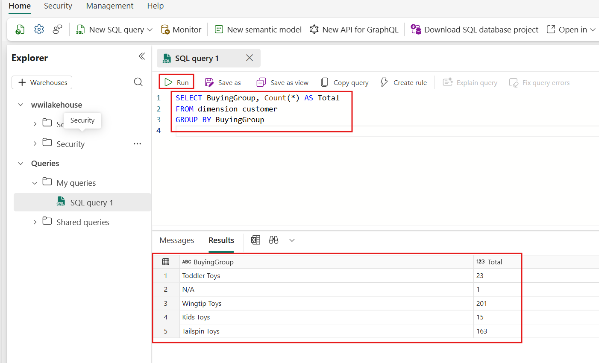

**注意**：如果你在腳本執行過程中遇到錯誤，請交叉檢查腳本語法，確保沒有不必要的空格。

14. 此前，所有lakehouse表和視圖都會自動添加到語義模型中。根据最近的更新，对于新的lakehouse，你必须手动将表格添加到semantic模型中。

15. 在lakehouse **Home**标签中，选择**“New semantic
    model**”，选择你想添加到semantic模型中的表格。

> 

16. 在**“New semantic model**”对话框中输入
    +++**wwwsemanticmodel**+++，然后从表列表中选择**dimension_customer**表，选择**Confirm**以创建新模型。

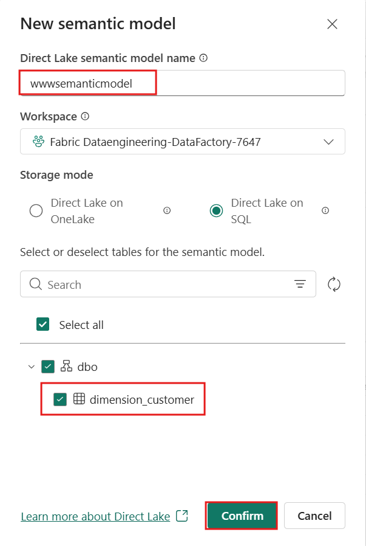

### 任务5：制作报告

1.  在左侧导航窗格中，选择 **Fabric Dataengineering-DataFactory-XX。**


2.  在你的工作区里，找到你创建的语义模型，选择**......**（省略号）菜单，然后选择
    **Auto-create report**。


4.  报告准备好后，点击“**View report now**”以打开并查看。

> 


5.  由於表格是一個維度，裡面沒有測量值，Power BI
    會為行數創建一個度量，並在不同列中匯總，並生成不同的圖表，如下圖所示。

6.  通過從頂部的色帶選擇**“Save**”，將此報告保存以備將來使用。

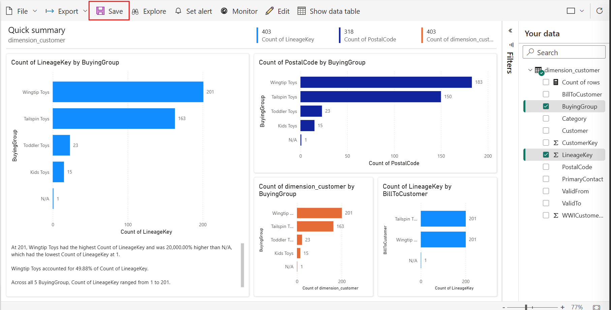

7.  在**“Save your report**”对话框中，输入报告名称
    +++dimension_customer-report+++，然后选择 **Save。**


8.  你会看到一条通知，说“**Report saved**”。

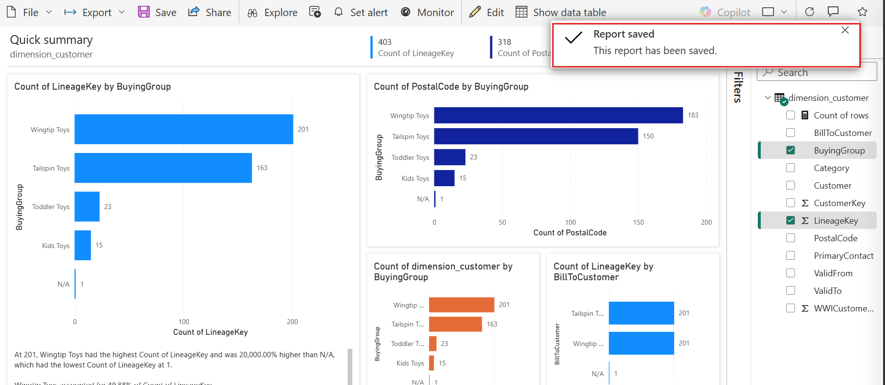

## 练习2：在Fabric Lakehouse中导入和管理Data

在这个练习中，你会将来自Wide World
Importers（WWI）的额外维度和事实表导入 lakehouse。

### 任务1：Data导入

1.  在左侧导航窗格中，选择 **Fabric Dataengineering-DataFactory-XX。**


2.  在 **Fabric Dataengineering-DataFactory-XX** 工作区页面，点击 **+New
    item** 按钮，然后选择**Pipeline**。

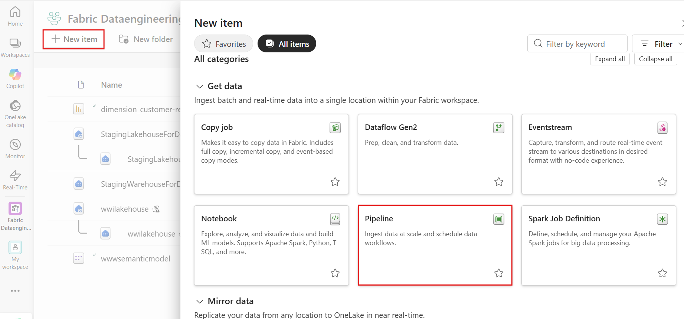

3.  在“New pipeline”对话框中，将名称指定为
    **+++IngestDataFromSourceToLakehouse+++**，并选择 **Create。**
    创建一个新的 data 工厂流水线并被创建。


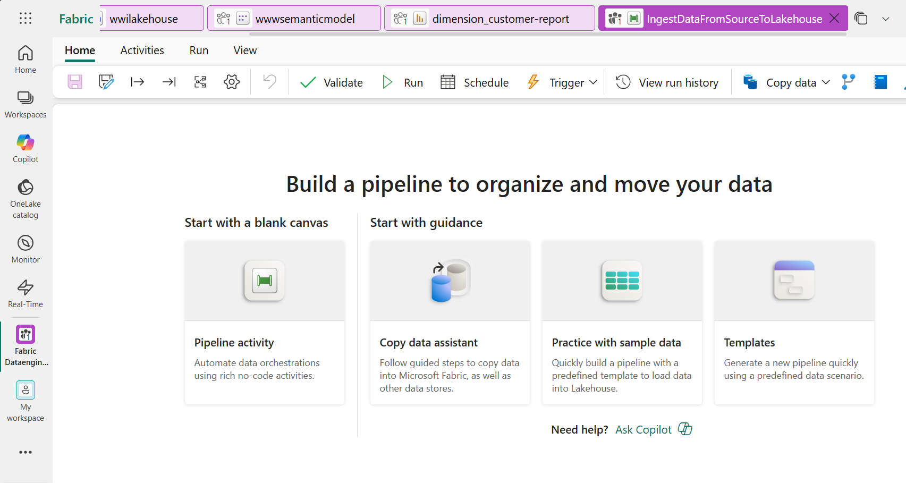

4.  在new pipeline的**Home** 页标签中，选择 **Pipeline
    activity** \> **Copy data**。

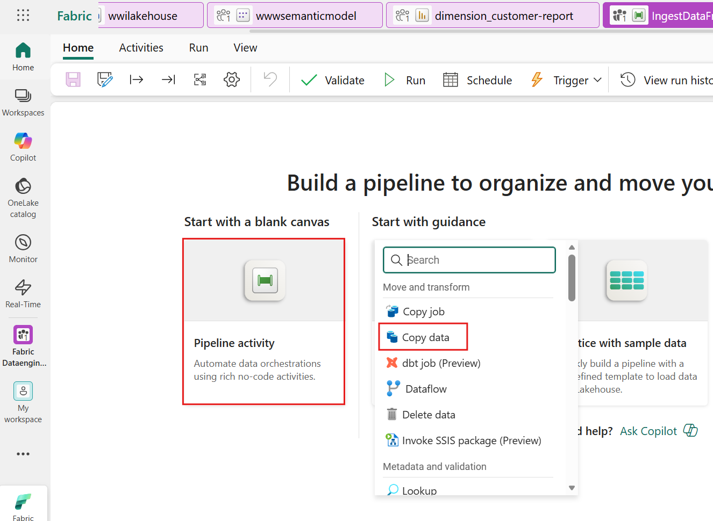

5.  從畫布中選擇新的**Copy
    data** 活動。活动属性显示在画布下方的一个窗格中，分布在包括**General**,
    **Source**, **Destination**, **Mapping**
    和**Settings**等标签页中。你可能需要通过拖动顶部边缘来向上扩展面板。


6.  在“**General**”标签页，在**Name** 字段输入 +++**Data Copy to
    Lakehouse+++**。其他字段保持默认值。


7.  在“**Source**”标签下，选择**Connection**下拉菜单，然后选择“**Browse
    all**”。


8.  在“**Choose a data source to get started”**页面中，搜索并选择**Azure
    blobs**。


9.  请在“**Connect data source**”页面输入以下详细信息
    。然后选择**Connect**，创建与 data
    源的连接。在本教程中，所有示例data都存放在 Azure blob
    storage的公共容器中。你连接到这个容器以复制 data。

| Property | Value |
|---|---|
| Account name or URL | !!https://fabrictutorialdata.blob.core.windows.net/sampledata/!! |
| Connection | Create new connection |
| Connection name | !!wwisampledata!! |
| Authentication kind | Anonymous |


10. 在**Source **標簽頁中，默認選擇新創建的連接。在進入目的地設置前，請先指定以下屬性。

| Property | Value |
|---|---|
| Connection | wwisampledata |
| File path type | File path |
| File path | Container name (first text box): !!sampledata!!<br>Directory name (second text box): !!WideWorldImportersDW/parquet!! |
| Recursively | Checked |
| File format | Binary |


11. 在**“Destination**”标签页中，指定以下属性：

| Property | Value |
|---|---|
| Connection | wwilakehouse (choose your lakehouse if you named it differently) |
| Root folder | Files |
| File path | Directory name (first text box): !!wwi-raw-data!! |
| File format | Binary |


12. 点击**“Run”**以运行复制 data。

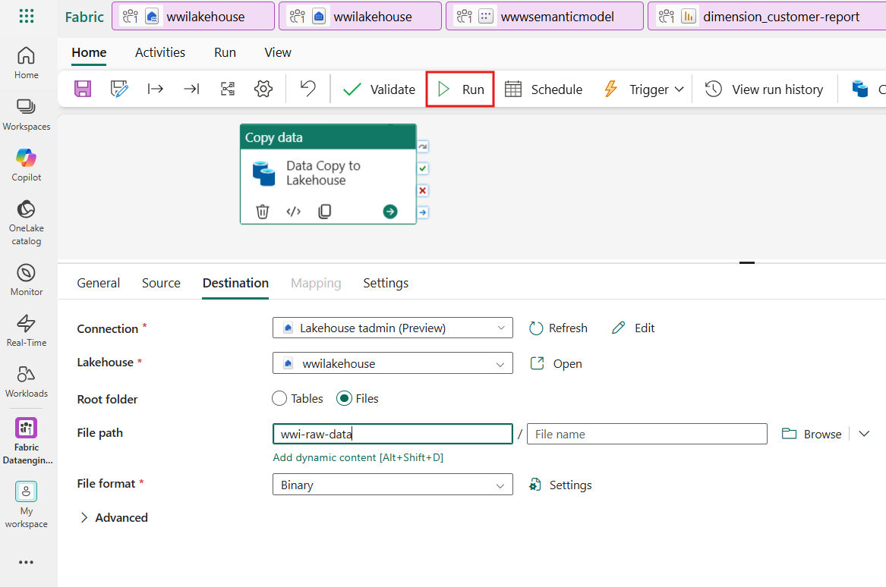

13. 点击“**Save and run**”按钮，这样该流程就会被保存并运行。

> 

14. Data複製過程大約需要1-2分鐘完成。


15. 在输出标签下，选择**“Data Copy to Lakehouse**”以查看
    data传输的详细信息。看到**Status**为**Succeeded**后，点击**Close** 按钮。

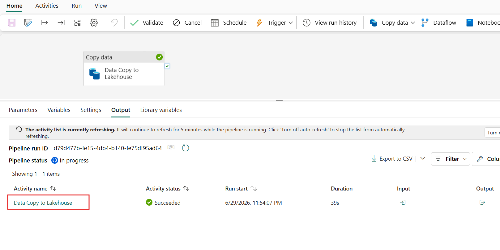


16. 管道成功执行后，进入你的lakehouse（**wwilakehouse**）打开资源管理器查看导入的
    data。


17. 刷新**Files** 部分以查看已导入的data。文件部分会出现一个新的文件夹
    **wwi-raw-data** **，**Azure Blob表中的data会被复制到那里。
    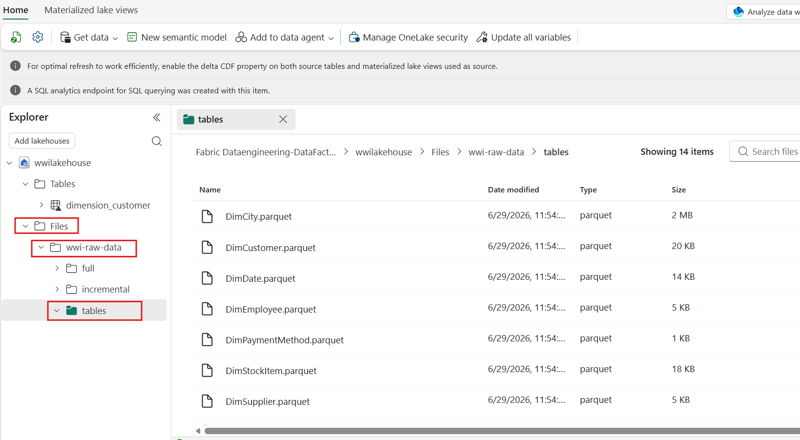

## 练习3：准备并转换lakehouse中的 data

### 任務1：轉換data並加載為銀色Delta表

1.  在左侧导航窗格中，选择 **Fabric Dataengineering-DataFactory-XX。**

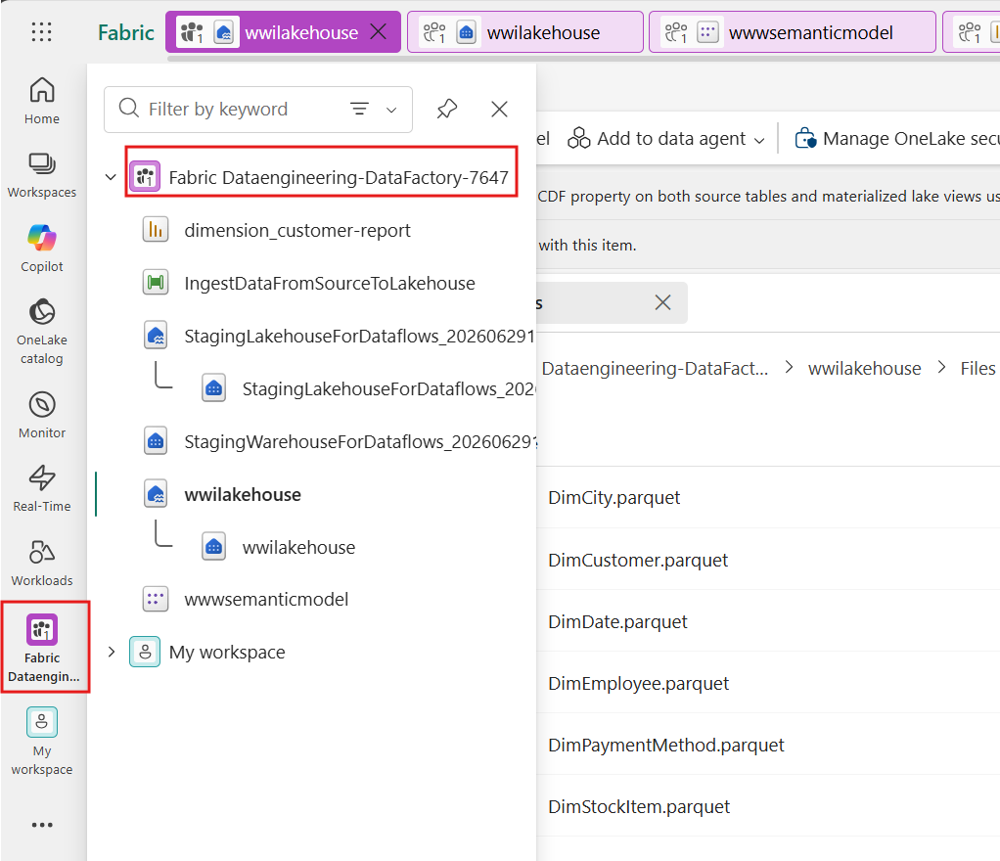

2.  在**Fabric**页面，点击命令栏的**“Import**”下注，然后选择 **New
    notebook\> From this computer**。

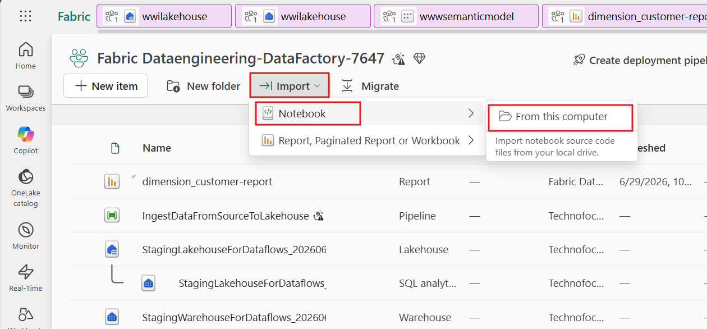

3.  从屏幕右侧打开的**Import status** 面板中选择**Upload** 。

> 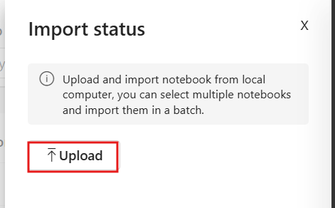

4.  在虚拟机上浏览到 **C：\LabFiles**，然后选择**“Prepare and transform
    data – PySpark**” 笔记本，点击**Open**按钮。

> 
>
> 

5.  选择**wwilakehouse**
    lakehouse来打开它，这样你接下来打开的笔记本就会关联到它。

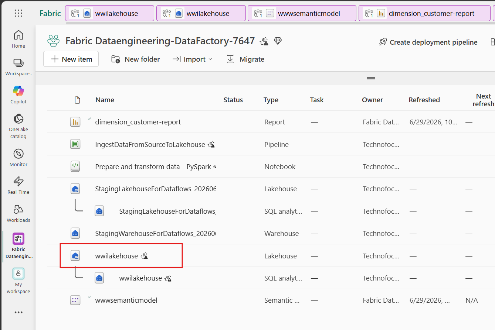

6.  在工具栏中，选择用下拉菜单**Analyze
    data**，指向**Notebook**，然后选择**“Existing notebook**”。

> 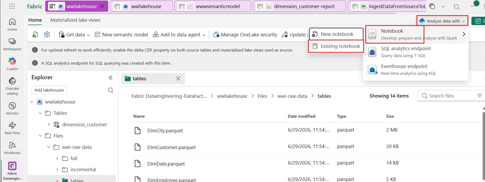

7.  选择导入的notebook，准备 **Prepare and transform data –
    PySpark**，然后点击 **Open。**

> 
>
> 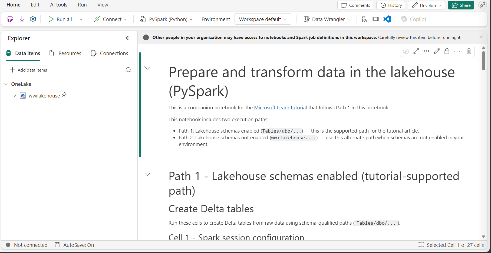

### 任务2：创建Delta表

> 在这个任务中，你需要运行notebook单元格，从原始 data创建Delta表。
>
> 这些表格遵循星型模式，这是组织分析数据的常见模式：

- **fact
  table** （fact_sale）包含企业可测量的事件——在此例中，包含数量、价格和利润的单个销售交易。

- **Dimension
  tables**（dimension_city、dimension_customer、dimension_date、dimension_employee、dimension_stock_item）包含为事实提供背景的描述属性，如销售发生地点、谁制作的以及何时。

1.  **Cell 1 - Spark session configuration。**
    该单元支持两个Fabric功能，优化后续单元中data的写入和读取方式。
    [V-order](https://learn.microsoft.com/en-us/fabric/data-engineering/delta-optimization-and-v-order)优化了parquet文件布局，以实现更快的读取和更好的压缩。
    [Optimize
    Write](https://learn.microsoft.com/en-us/fabric/data-engineering/tune-file-size#optimize-write)
    减少写入文件数量并增加单个文件大小。

```
spark.conf.set("spark.sql.parquet.vorder.enabled", "true")
spark.conf.set("spark.microsoft.delta.optimizeWrite.enabled", "true")
spark.conf.set("spark.microsoft.delta.optimizeWrite.binSize", "1073741824")
```

2.  **Run** 这个单元，等它完成后再进入下一步。

> 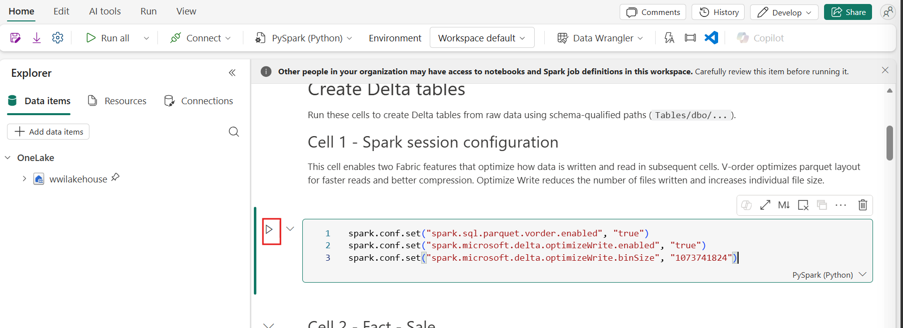
>
> 

3.  **Cell 2 - Fact - Sale。** 该单元格读取
    Files/wwi-raw-data/full/fact_sale_1y_full的原始parquet
    data，添加日期部分列（**Year**, **Quarter**和**Month**），并将fact_sale写入按**Year**和
    **Quarter**划分的Delta表。

4.  运行这个单元，等它完成后再进入下一步。

> 

5.  **Cell 3** -
    Dimensions。该单元读取五维分层数据集，并将其写入为Delta表
    (dimension_city, dimension_customer, dimension_date, dimension_employee,
    and dimension_stock_item) under Tables/dbo/....

6.  **Run** 这个单元，等它完成后再进入下一步。

> 

7.  要验证已创建的表，在资源管理器中右键点击 **wwilakehouse**
    湖屋，然后选择**Refresh**。表格出现了。

> 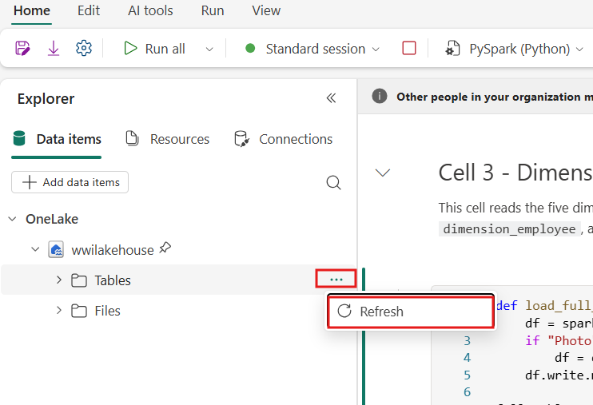
>
> 

### 任务3：转化业务Data以实现聚合

在任务中，你继续使用同一个notebook，然后运行接下来的单元格，用你在上一节创建的Delta表创建汇总表。

1.  确保笔记本仍然绑定在**wwilakehouse**。

2.  **Cell 4 - Load source tables for transformation (PySpark only)。**
    如果你用的是 PySpark 笔记本，可以运行这个单元格，把 Delta 表加载到
    DataFrames 里，进行后续的聚合步骤。

3.  运行这个单元，等它完成后再进入下一步。

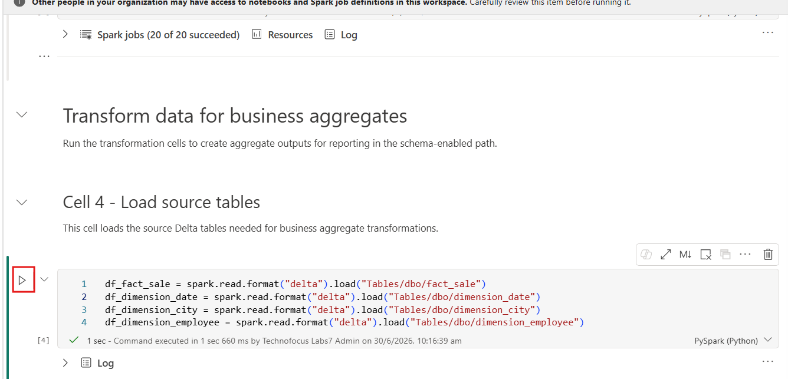

4.  **Cell 5 - Create aggregate_sale_by_date_city。**
    该单元格将销售、日期和城市数据合并，然后创建城市层级的汇总表。

5.  运行这个单元，等它完成后再进入下一步。

> 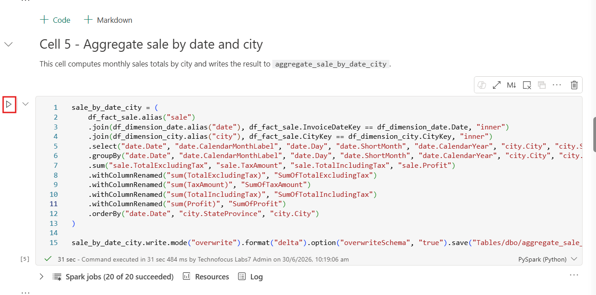

6.  **Cell 6 - Create aggregate_sale_by_date_employee。**
    该单元格连接销售、日期和员工 data，然后创建员工级别的汇总表。

7.  运行这个单元，等它完成后再进入下一步。

> 

8.  要验证已创建的表，在资源管理器中右键点击 **wwilakehouse**
    lakehouse，然后选择**Refresh**。汇总表会出现。

> 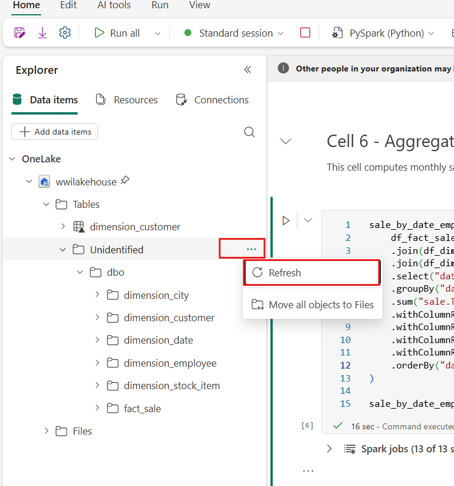
>
> 

## 练习4：在Microsoft Fabric中构建报表

在教程的这一部分中，你将创建一个Power BI
data模型，并从零开始创建一份报告。

### 任务1：利用SQL endpoint探索银层中的 data

Power
BI是原生集成在整个Fabric体验中的。这种原生集成带来了一种独特的模式，称为
DirectLake，能够访问lakehouse中的
data，提供最高性能的查询和报告体验。DirectLake
模式是一种开创性的全新引擎功能，用于分析 Power BI
中非常庞大的datasets。该技术基于这样一个理念：直接从data
lake加载parquet格式文件，无需查询data warehouse或lakehouse
endpoint，也无需导入或复制 data到Power BI dataset中。DirectLake
是一种快速路径，可以直接将data lake的 data加载到 Power BI 引擎，供分析。

在传统的DirectQuery模式下，Power BI引擎直接从源端查询
data以执行每个查询，查询性能取决于 data检索速度。DirectQuery 消除了复制
data的需求，确保源代码的任何变化在导入过程中立即反映在查询结果中。另一方面，导入模式下性能更好，因为
data在内存中易于获取，无需每次查询都从源端查询 data。然而，Power BI
引擎必须在 data刷新时先将 data复制到内存中。只有在下一次
data刷新（无论是计划刷新还是按需刷新）时，才会被接收到底层
data源的变更。

DirectLake 模式现在通过直接将
data文件加载到内存中，消除了这种导入要求。由于没有明确的导入流程，用户可以在源头实时捕捉任何变化，从而结合了DirectQuery和导入模式的优势，同时避免了它们的缺点。因此，DirectLake
模式是分析非常大型数据集和源头频繁更新 data集的理想选择。

1.  在左侧菜单中选择 **Fabric
    Dataengineering-DataFactory-@lab.LabInstance.Id，**然后选择名为
    **wwisemanticmodel** 的Semantic模型。

2.  打开semantic模型，选择右上角的模式下拉菜单，从查看切换到编辑，然后选择
    “Make any changes”。

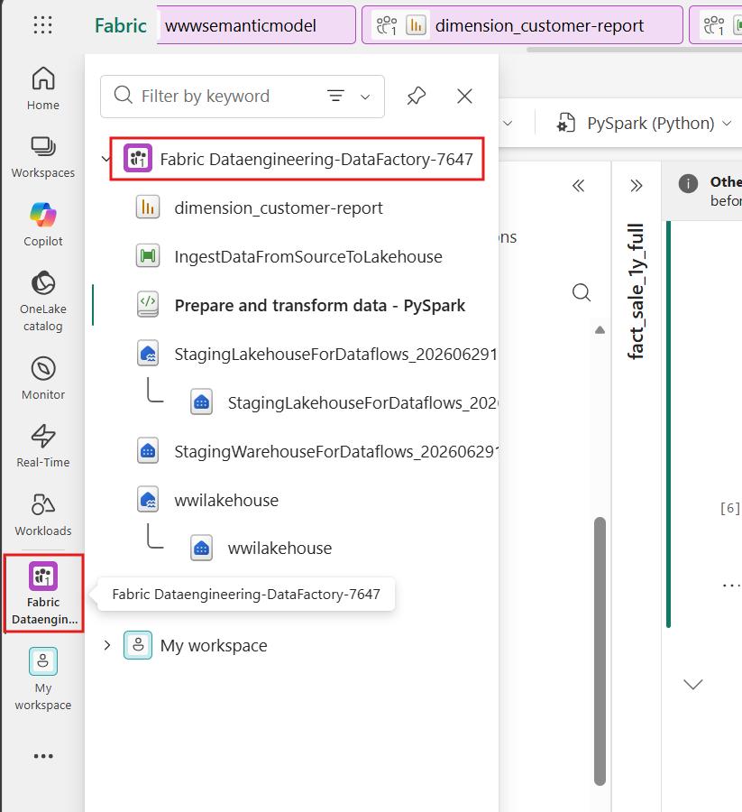

3.  在菜单功能区中选择**“Edit tables**”以显示表格同步对话框。

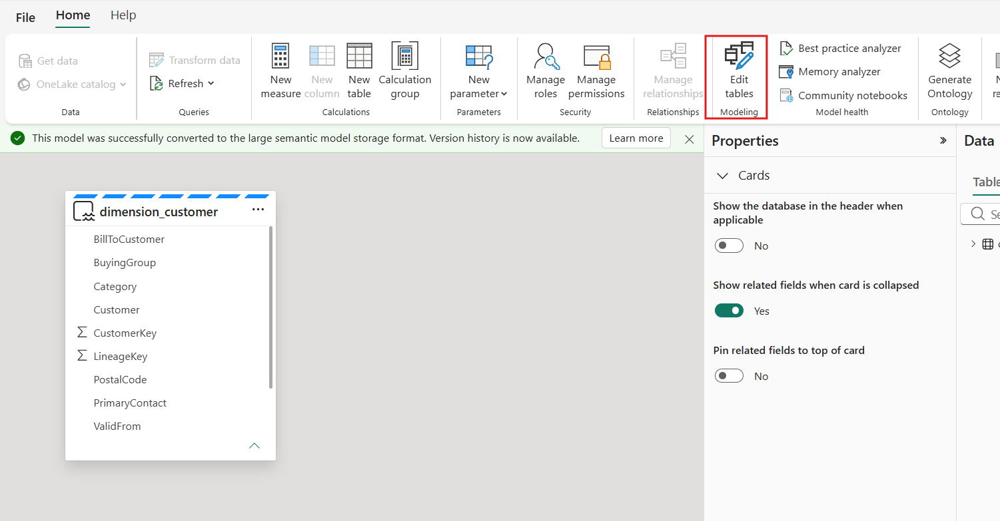

4.  在**“Edit semantic model**”对话框中，选择**select
    all**，然后在对话框底部选择**“Confirm**”以同步语义模型。


5.  从**fact_sale**表中，拖动**CityKey**字段并将其放置在**dimension_city**表中的
    **CityKey**字段 上，创建关联。**Create Relationship** 对话框出现了。

注意：通过点击表格，拖放表格，将dimension_city和fact_sale表格相邻来重新排列表格。同样的道理也适用于你想要建立关系的两张桌子。这样做只是为了方便在表格之间拖拽列。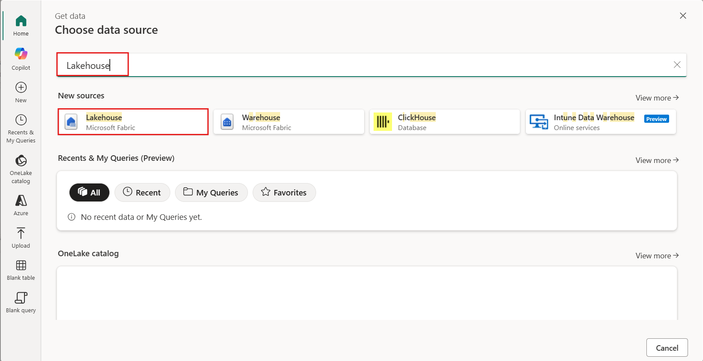

> 6\. 在**Create Relationship**对话框中:

- **表1**由**fact_sale**和**CityKey**列填充。

- **表2**包含**dimension_city**和**CityKey**列。

- Cardinality: **Many to one (\*:1)**

- Cross filter direction: **Single**

- 保持“**Make this relationship active**”旁边的复选框选中。

- 选择“**Assume referential integrity”**旁边的框。

- 选择**Save。**

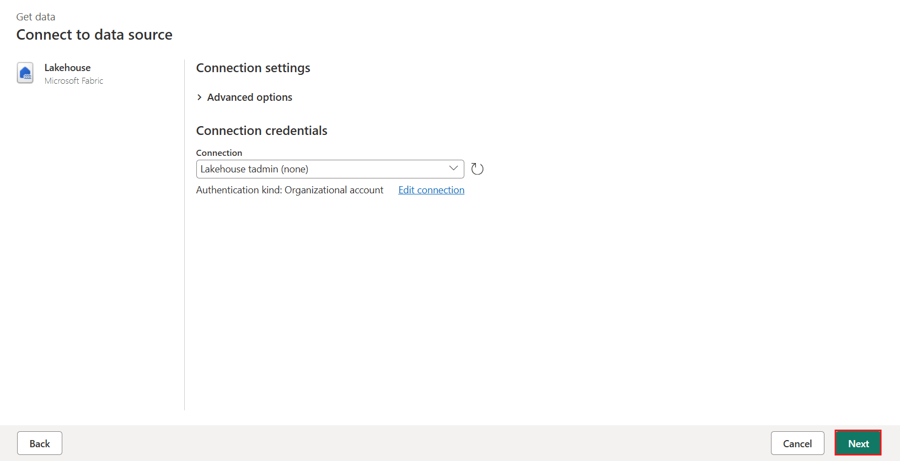

> 7\. 接下来，使用上述相同的**Create
> Relationship **设置，但使用以下表格和列添加这些关系：

- **StockItemKey(fact_sale)** - **StockItemKey(dimension_stock_item)**


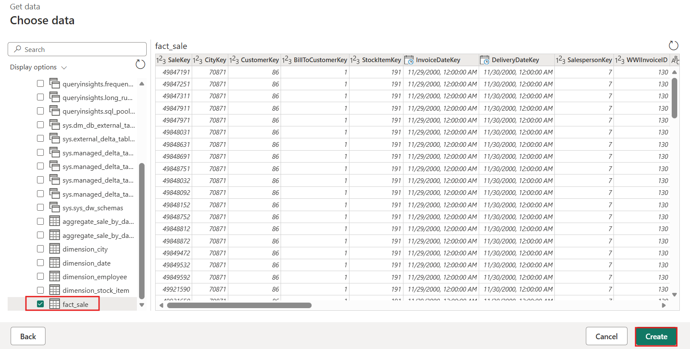

- **Salespersonkey(fact_sale)** - **EmployeeKey(dimension_employee)**

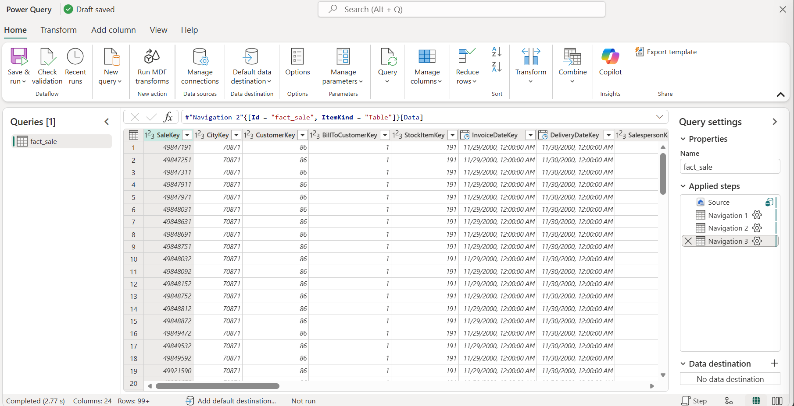

> 8\. 确保按照上述步骤创建下面两组之间的关系。

- **CustomerKey(fact_sale)** - **CustomerKey(dimension_customer)**

- **InvoiceDateKey(fact_sale)** - **Date(dimension_date)**

> 9\. 添加这些关系后，您的 data模型应如下图所示，准备进行报告。

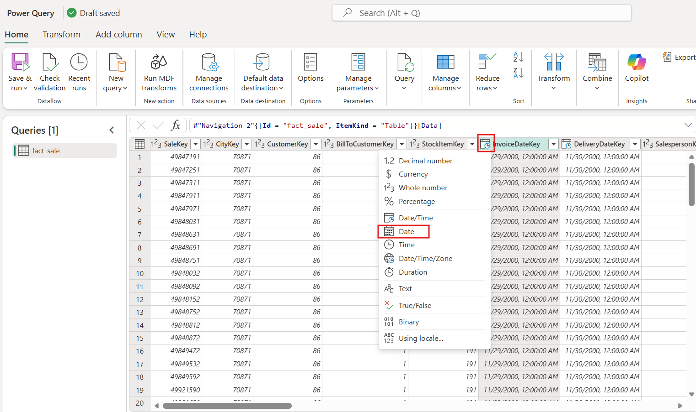

### 任务2：建造报告

1.  从顶部功能区选择**File**，选择**Create new report**，开始在 Power BI
    中创建报表/仪表盘。


2.  在 Power BI
    报表画布中，您可以通过将所需列从**Data** 窗格拖入画布，并使用一个或多个可用的可视化工具来创建满足业务需求的报表。


**添加标题：**

3.  在功能区中，选择**文本框**。输入**WW Importers Profit Reporting**。
    **高亮文本** 并放大到**20**。

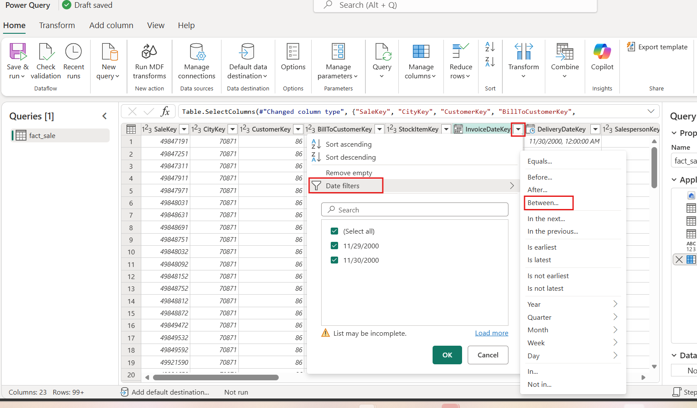

4.  调整文本框大小，放在报告页面**左上角**，点击文本框外。


**添加卡片：**

- 在**Data** 面板上，展开**fact_sales**并勾选Profit旁边的框。此选择会生成柱状图表，并将字段添加到Y轴。


5.  选择柱状图后，在可视化面板中选择**Card **可视化。

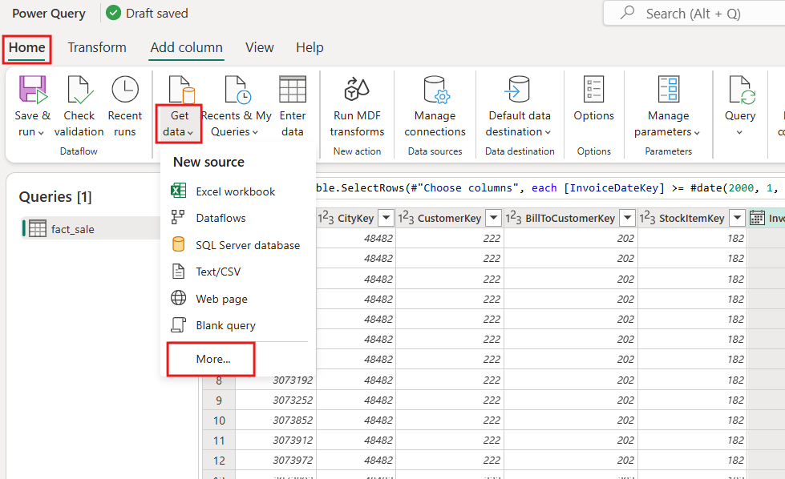

6.  此选择将视觉化转换为一张卡片。把卡片放在标题下面。


7.  点击空白canvas上的任意位置（或按Esc键），这样刚放置的卡牌就不再被选中。

**添加Bar chart：**

8.  在**Data**面板上，展开**fact_sales**并勾选**Profit**旁边的框。此选择会生成柱状图表，并将字段添加到Y轴。

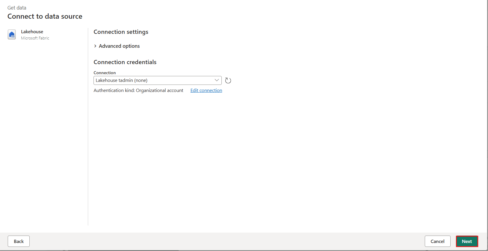

9.  在**Data **面板中，展开**dimension_city**并勾选**SalesTerritory**的选项。该选择将场添加到Y轴上。


10. 选择条形图后，在可视化窗格中选择**“Clustered bar
    chart**”可视化。此选择将柱状图转换为柱状图。


11. 调整Bar chart大小，填满标题和卡片下方的区域。


12. 点击空白 canvas上的任意位置（或按Esc键），这样bar
    chart就不再被选中。

**构建堆叠面积图可视化：**

13. 在“**Visualizations**”窗格中，选择“**Stacked area chart**”视觉对象。


14. 重新定位并调整stacked area chart，位于卡片右侧，以及之前步骤中创建的
    bar chart可视化。


15. 在**Data** 面板上，展开**fact_sales**并勾选**Profit**旁边的框。展开**dimension_date**，勾选“**FiscalMonthNumber**”旁边的框。该选择会生成一个充满折线图，显示按财政月份的利润。

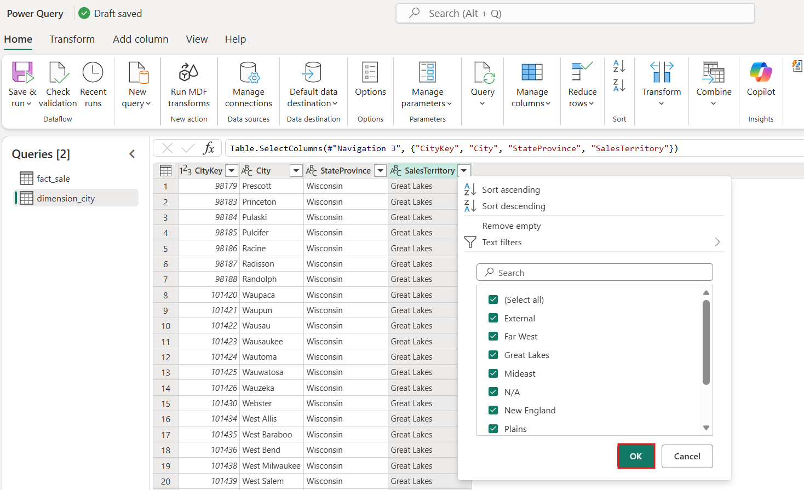

16. 在**Data** 面板中，展开**dimension_stock_item**，并将
    **BuyingPackage** 拖入图例字段。该选项为每个购买套餐添加一行。

 

17. 点击空白canvas上的任意位置（或按Esc键），这样堆叠面积图就不再被选中。

**制作柱状图：**

18. 在**Visualizations **面板中，选择**Stacked column chart** 可视化。


19. 在 **Data**面板上，展开**fact_sales**并勾选
    **profit**旁边的框。该选择将场添加到Y轴上。

20.  在
    **Data**面板中，展开**dimension_employee**，勾选“**Employee**”旁边的框。该选择将场加到X轴上。

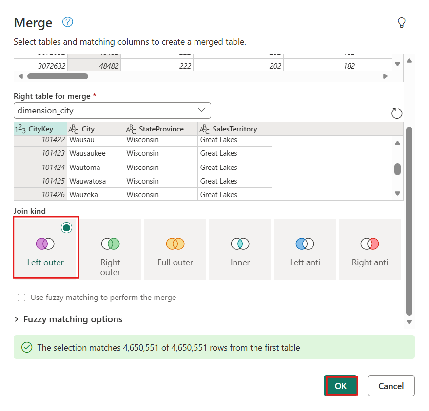

21. 在空白canvas上任意点击（或按Esc键），这样图表就不再被选中。

22. 从功能区选择**“File \> Save**”。


23. 请输入您的报告名称为**“Profit Reporting**”。选择 **Save**。


24. 你会收到通知，说报告已被保存。 


# 练习7：清理资源

你可以删除单个报表、pipelines、仓库和其他项目，或者删除整个工作区。请按照以下步骤删除你为本教程创建的工作区。

1.  选择你的工作区，即左侧导航菜单中的 **Fabric
    Dataengineering-DataFactory-@lab.LabInstance.Id**。它会打开工作区的物品视图。

&nbsp;

2.  选择...... 在工作区名称下选择选项，选择**Workspace settings**。


3.  选择**“General**”并 **Remove this workspace。**

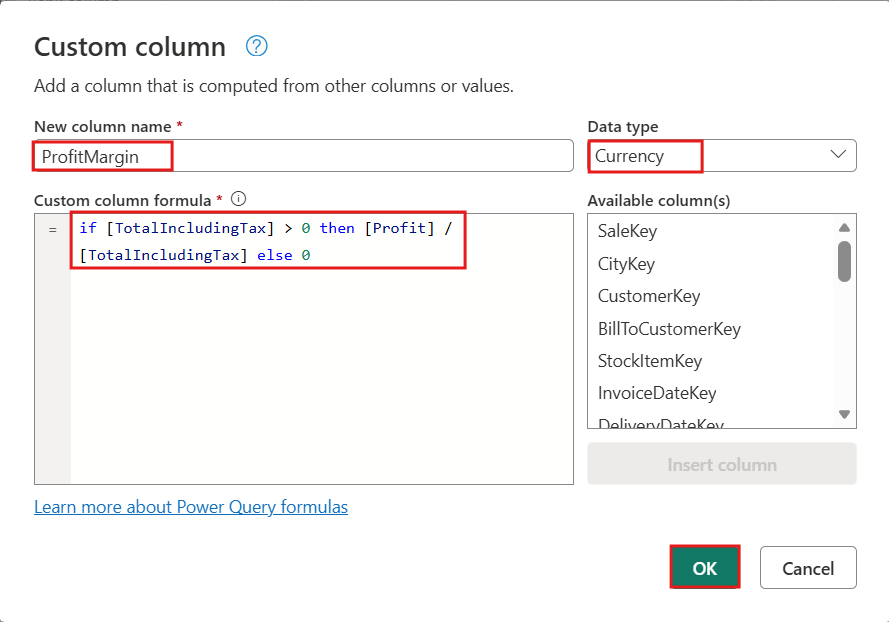

4.  点击弹出的警告中“**Delete**”。


5.  等待工作区被删除的通知后，再进入下一个实验室。

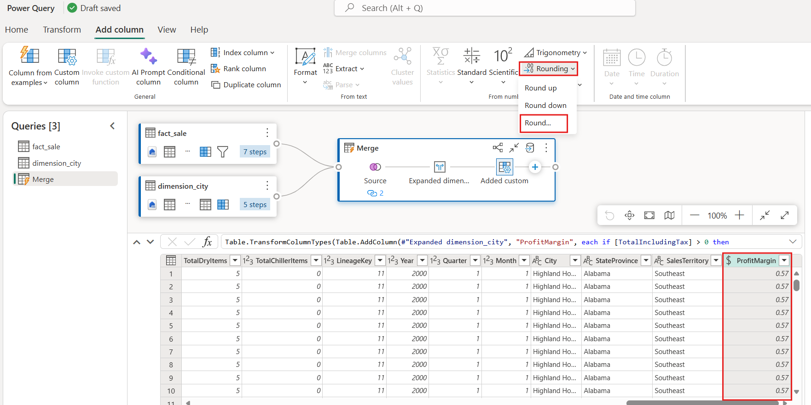

**摘要**

在这个实验室里，你通过创建Fabric工作区和Lakehouse实现了完整的Microsoft
Fabric data engineering流程，导入源 data，加载到Delta表中，用SQL查询验证
data，构建semantic模型，并生成Power BI报告。这些活动展示了Microsoft
Fabric如何通过将
data集成、存储、转换、semantic建模和报告整合在统一平台上，简化现代分析。在实验室中获得的技能为利用Microsoft
Fabric开发可扩展的data engineering解决方案奠定了基础。
