# 使用场景 1: 实现一个用于Fabric Data Factory数据迁移和转换的 Data engineering 解决方案

**場景**

**Wide World Importers（WWI）**
是一家全球零售组织，在多个地区运营数百家门店。客户信息从多种运营系统收集，包括销售点（POS）应用、客户关系管理平台和电子商务渠道。數據以CSV文件形式存儲，每天從不同業務單元接收。

公司分析團隊目前花費大量時間手動導入文件、驗證數據質量以及準備數據集以供報告。這些人工流程導致客戶洞察生成延遲，也使業務用戶難以獲取一致可靠的信息。

为现代化 analytics 平台，Wide World Importers采用了**Microsoft
Fabric**作为统一数据平台。data engineering 团队被指派利用**Microsoft
Fabric Data
Factory**和**Lakehouse**实现可扩展解决方案，集中客户数据，实现高效数据管理，简化报告。

作为数据工程师，你的职责是创建Fabric工作区，配置Lakehouse，将客户数据导入OneLake，将源文件转换为托管的Delta表，使用SQL
Analytics Endpoint验证导入数据，创建Direct Lake语义模型，并生成Power
BI报告，使业务利益相关者能够以最小延迟分析客户信息。

通过实施该解决方案，Wide World Importers
可以消除手动数据准备，提供客户分析的单一真实来源，并利用 Microsoft
Fabric 实现更快速、数据驱动的业务决策。

**简介**

在此用例中，您将通过使用 **Microsoft Fabric Data Factory** 和 **Fabric
Lakehouse** 构建完整的数据工程解决方案。從新的 Fabric
工作區開始，您將數據導入 Lakehouse，將文件轉換為託管的 Delta 表，使用
SQL 分析端點查詢數據，創建語義模型，並生成交互式 Power BI 報告。

在整個實驗過程中，您將探索 Microsoft Fabric
如何將數據集成、存儲、轉換、分析和報告整合到單一的軟件即服務（SaaS）平臺中。通過完成這一實踐練習，您將理解現代數據工程工作流程如何通過
Fabric Data Factory
實現，同時遵循行業在數據攝取、管理和分析方面的最佳實踐。

**目标**:

- 创建并配置一个 Microsoft Fabric 工作空间。

- 建造并配置Fabric Lakehouse。

- 將源數據導入OneLake。

- 將文件加載到託管的Delta表中。

- 使用 SQL Analytics Endpoint 查询 Lakehouse 数据。

- 创建一个Direct Lake语义模型。

- 从Fabric data 中激活并探索Power BI报告。

- 了解Fabric Data Factory如何将数据工程和分析整合到一个统一平台中。

## 练习一：搭建Microsoft Fabric data Engineering 环境 

在构建数据工程解决方案之前，你需要先准备好 Microsoft Fabric
环境。在这个练习中，你将登录 Microsoft
Fabric，创建一个专用工作区，并配置一个
Lakehouse，作为分析解决方案的集中存储。

### 任务 1: 登录 Power BI 账户

1.  打開瀏覽器，進入地址欄，輸入或粘貼以下內容
    URL:+++https://app.fabric.microsoft.com/+++ 然後按下**回車**鍵。

2.  在 **Microsoft Fabric** 窗口中，输入你的凭证，然后点击**提交**按钮。

[TABLE]

1.  然後，在 **Microsoft** 窗口輸入密碼，點擊**登錄**按鈕。

> 

2.  在**“保持登錄”中，**點擊**“是”**按鈕。

3.  你将被引导到Power BI主页。

> 

4.  选择屏幕左下角的默认 Power BI 图标，然后选择 **Fabric**。

> 
>
> 

### 任務 2: 創建一個Fabric工作區

在這個任務中，你需要創建一個 Fabric 工作區。工作区包含了 lakehouse
教程所需的所有内容，包括 lakehouse、数据流、Data Factory
流水线、笔记本、Power BI 数据集和报告。

1.  Fabric主頁，選擇**+新工作區**瓷磚。

2.  在**右側的創建工作區**面板中，輸入以下細節，然後點擊**“應用**”按鈕。

[TABLE]

注意：要查找您的實驗室即時ID，請選擇“幫助”並複製即時ID。

3.  等待部署完成。完成大約需要2-3分鐘。

### 任務 3: 創建 lakehouse

1.  點擊導航欄中的**+新物品**按鈕創建新湖屋。

2.  点击“ **Lakehouse**”瓷砖。

3.  在**“新湖屋**”對話框中，在名稱字段輸入 +++wwilakehouse+++
    ，並**取消選擇**湖屋的模式。點擊**“創建**”按鈕，打開新湖屋。

**注意：确保在**wwilakehouse之前清空。

4.  你會看到一條通知，提示SQL**端點已成功創建**。

### 任務4: **导入样本数据**

1.  在**wwilakehouse**頁面，點擊**“獲取你的湖屋數據**”部分，點擊“**上傳文件**”，如下圖所示。

2.  在“上傳文件”標簽頁中，點擊文件下的文件夾

3.  在虚拟机上浏览到**C：\LabFiles**，然后选择**dimension_customer.csv**文件，点击**打开**按钮。

4.  然後點擊**上傳**按鈕並關閉

5.  **关闭**上传文件面板。

6.  點擊並選擇文件刷新。文件會出現。

7.  在**Lakehouse**頁面，在資源管理器窗格下選擇“文件”。不過，現在用鼠標打開**dimension_customer.csv**文件。點擊橫向省略號**（...）**旁邊**dimension_customer**.csv。導航並點擊“**加載表**”，然後選擇**“新表**”。

> 

8.  在**“加載文件到新表格**”對話框中，點擊 **Load**按鈕。

9.  现在 表格**dimension_customer**成功创建。

10. 在表格下**选择dimension_customer**表。

11. 你也可以使用湖屋的SQL端點用SQL語句查詢數據。
    **在屏幕右上角的下拉菜单**中选择**SQL analytics endpoint**。

12. 在 **wwilakehouse** 页面，在 Explorer 下选择 **dimension_customer**
    表预览其数据，并选择**新 SQL 查询**来写你的 SQL 语句。

13. 以下示例查询汇总了基于**dimension_customer**表中 **BuyingGroup
    列**的行数。SQL
    查询文件会自动保存以供未来参考，您可以根据需要重命名或删除这些文件。將代碼粘貼如下圖所示，然後點擊播放圖標執行
    腳本：

> SELECT BuyingGroup, Count(\*) AS Total
>
> FROM dimension_customer
>
> GROUP BY BuyingGroup

**注意**：如果你在腳本執行過程中遇到錯誤，請交叉檢查腳本語法，確保沒有不必要的空格。

14. 之前所有湖屋的表和視圖都會自動添加到語義模型中。最近更新後，對於新湖屋，你必須手動將表添加到語義模型中。

15. 在Lakehouse**主頁**標簽中，選擇**“新語義模型**”，選擇你想添加到語義模型中的表格。

> 

16. 在**“新語義模型**”對話框中輸入
    **+++wwwsemanticmodel+++**，然後從表列表中選擇**dimension_customer**表，選擇**確認**以創建新模型。

### 任務 5: 制作报告

1.  在左侧导航面板中，选择 **Fabric Dataengineering-DataFactory-XX**.

2.  在你的工作区里，找到你创建的语义模型，选择**......**（省略号）菜单，然后选择
    **Auto-create report**.

3.  報告準備好後，點擊“**立即查看報告**”以打開並查看。

> 

5.  由於表格是一個維度，裡面沒有測量值，Power BI
    會為行數創建一個度量，並在不同列中匯總，並生成不同的圖表，如下圖所示。

6.  通過從頂部的色帶選擇**“保存**”，將此報告保存以備將來使用。

7.  在**“Save your report** ”对话框中，输入报告名称
    +++dimension_customer-report+++，然后选择**保存。**

8.  你會看到一條通知，說“**報告已保存**”。

## 練習2：在Fabric Lakehouse中導入和管理數據

在這個練習中，你會將來自世界大戰（WWI）的額外維度和事實表導入湖邊別墅。

### 任務 1: 导入数据

1.  在左侧导航面板中，选择 **Fabric Dataengineering-DataFactory-XX**.

2.  在 **Fabric Dataengineering-DataFactory-XX** 工作区页面，点击 **+New
    item** 按钮，然后选择**管道**。

3.  在“新建管道”对话框中，指定名称为
    **+++IngestDataFromSourceToLakehouse+++**，并选择**创建。**创建一个新的数据工厂流水线并打开。

4.  在新管道的**主**页标签中，选择**Pipeline activity** \> **Copy
    data**.

5.  從畫布中選擇新的**“CopyData**活動”。活動屬性顯示在畫布下方的窗格中，分為包括**“通用**”、“**來源**”、“**目的地**”、“**映射**”和**“設置**”等標簽頁。你可能需要通过拖动顶部边缘向上展开窗格。

6.  在“**通用**”标签页，在名称字段输入 +++**Data Copy to Lakehouse**+++
    。其他字段保持默认值。

7.  在“**源**”標簽下，選擇連接下拉菜單，然後選擇“**全部瀏覽**”。

8.  在“**Choose a data source to get
    started** **”**页面中，搜索并选择**Azure blobs**。

9.  在“連接數據源**”頁面**輸入以下細節。然後選擇**連接**以創建與數據源的連接。在本教程中，所有示例数据都存在
    Azure Blob 存储的公共容器中。你连接到该容器以复制数据。

[TABLE]

10. 在**“源**”標簽頁中，默認選擇新創建的連接。在進入目標設置前，請先指定以下屬性。

[TABLE]

11. 在**“Destination** ”标签页中，指定以下属性：

[TABLE]

12. 點擊**“運行”**以運行複製數據。

13. 點擊“**保存並運行**”按鈕，這樣該流程就會被保存並運行。

> 

14. 數據複製過程大約需要1-2分鐘完成。

15. 在“輸出”標簽下，選擇**“Data Copy to
    Lakehouse** ”以查看數據傳輸的詳細信息。看到**狀態**為**“成功”**後，點擊**關閉**按鈕。

16. 管道成功執行後，進入你的湖屋（**wwilakehouse**）打開資源管理器查看導入的數據。

17. 刷新**文件**部分以查看被導入的數據。文件部分会出现一个新文件夹**wwi-raw-data，Azure**
    Blob表的数据会被复制到那里。

> 

## 練習 3: 準備和轉換 Lakehouse內的數據

### 任務1：轉換數據並加載為銀色Delta表

1.  在左侧导航面板中，选择 **Fabric Dataengineering-DataFactory-XX**.

2.  在**Fabric**頁面，點擊命令欄的**“導入**”下注，然後選擇**新筆記本\>從這台電腦**。

3.  從屏幕右側打開**的**導入狀態面板**中選擇**上傳。

> 

4.  在虛擬機上瀏覽到
    **C：\LabFiles**，然後選擇**“準備和轉換數據——PySpark**
    筆記本”，點擊**打開**按鈕。

> 
>
> 

5.  選擇**wwilakehouse**湖屋來打開它，這樣你接下來打開的筆記本就會關聯到它。

6.  在工具欄中，選擇“用下拉菜單**分析數據**”，指向**筆記本**，然後選擇**“現有筆記本**”。

> 

7.  選擇導入的筆記本，準備 **並轉換數據——PySpark**，然後點擊 **打開。**

> 
>
> 

### 任務2: 創建Delta表

> 在這個任務中，你需要運行筆記本單元格，從原始數據創建Delta表。
>
> 這些表格遵循星型模式，這是組織分析數據的常見模式：

- **事實表**（fact_sale）包含企業可測量的事件——在此例中，包含數量、價格和利潤的單個銷售交易。

- **维度表**（dimension_city、dimension_customer、dimension_date、dimension_employee、dimension_stock_item）包含为事实提供背景的描述属性，如销售发生地点、谁制作的以及何时。

1.  **Cell 1 - Spark
    会话配置。**该单元支持两个Fabric功能，优化后续单元中数据的写入和读取方式。[V-order](https://learn.microsoft.com/en-us/fabric/data-engineering/delta-optimization-and-v-order) 优化Parquet文件布局，以加快读取速度和更好的压缩。 [Optimize
    write](https://learn.microsoft.com/en-us/fabric/data-engineering/tune-file-size#optimize-write) 减少写入文件数量并增加单个文件大小。

> spark.conf.set("spark.sql.parquet.vorder.enabled", "true")
>
> spark.conf.set("spark.microsoft.delta.optimizeWrite.enabled", "true")
>
> spark.conf.set("spark.microsoft.delta.optimizeWrite.binSize",
> "1073741824")

2.  **運行** 這個單元，等它完成後再進入下一步。

> 
>
> 

3.  **Cell 2 - Fact -
    Sale.** 该单元读取文件/wwi-raw-data/full/fact_sale_1y_full的原始parquet数据，添加日期部分列（**年份**、**季度**和**月份**），并将fact_sale写成按年和季度划分的Delta表
    。

4.  運行這個單元，等它完成後再進入下一步。

> 

5.  **Cell 3** - 尺寸. 该单元读取五维分层数据集，并将其写入 Delta
    表（dimension_city、dimension_customer、dimension_date、dimension_employee
    和 dimension_stock_item），在 Tables/dbo/.... 下。

6.  **運行** 這個單元，等它完成後再進入下一步。

> 

7.  要驗證已創建的表格，請在資源管理器中右鍵點擊 **wwilakehouse**
    湖屋，然後選擇**刷新**。表格显示出来。

> 
>
> 

### 任務3: 為聚合轉換業務數據

在任務中，你繼續使用同一個筆記本，然後運行接下來的單元格，用你在上一節創建的Delta表創建匯總表。

1.  确保笔记本仍然关联着**wwilakehouse**.

2.  **Cell 4 - 用于转换的加载源表（仅限PySpark）。**如果你用的是 PySpark
    笔记本，可以运行这个单元格，把 Delta 表加载到 DataFrames
    里，进行后续的聚合步骤。

3.  運行這個單元，等它完成後再進入下一步。

4.  **Cell 5 -
    创建aggregate_sale_by_date_city。**该单元连接销售、日期和城市数据，然后创建城市级别的汇总表。

5.  運行這個單元，等它完成後再進入下一步。

> 

6.  **Cell 6 -
    创建aggregate_sale_by_date_employee。**该单元连接销售、日期和员工数据，然后创建员工级别汇总表。

7.  運行這個單元，等它完成後再進入下一步。

> 

8.  要驗證已創建的表格，請在資源管理器中右鍵點擊 **wwilakehouse**
    Lakehouse，然後選擇**刷新**。聚合表會出現。

> 
>
> 

## 練習 4: 在 Data Factory 中通過數據流進行數據轉換

### 任務1：從青銅湖屋表獲取數據

1.  在左側導航窗格中，點擊工作區名稱 **Fabric
    Dataengineering-DataFactory-@lab.LabInstance.Id** 返回工作區視圖。

2.  點擊**導航欄中的+新項目**。从可用项目列表中选择**Dataflow Gen2。**

3.  在名称栏中输入 +++**wwi_fact_sale_transform**+++, 然后选择
    **创建。**

4.  在新數據流菜單中，在 Power Query
    面板下點擊“**獲取數據**”下拉菜單，然後選擇**“更多**......”

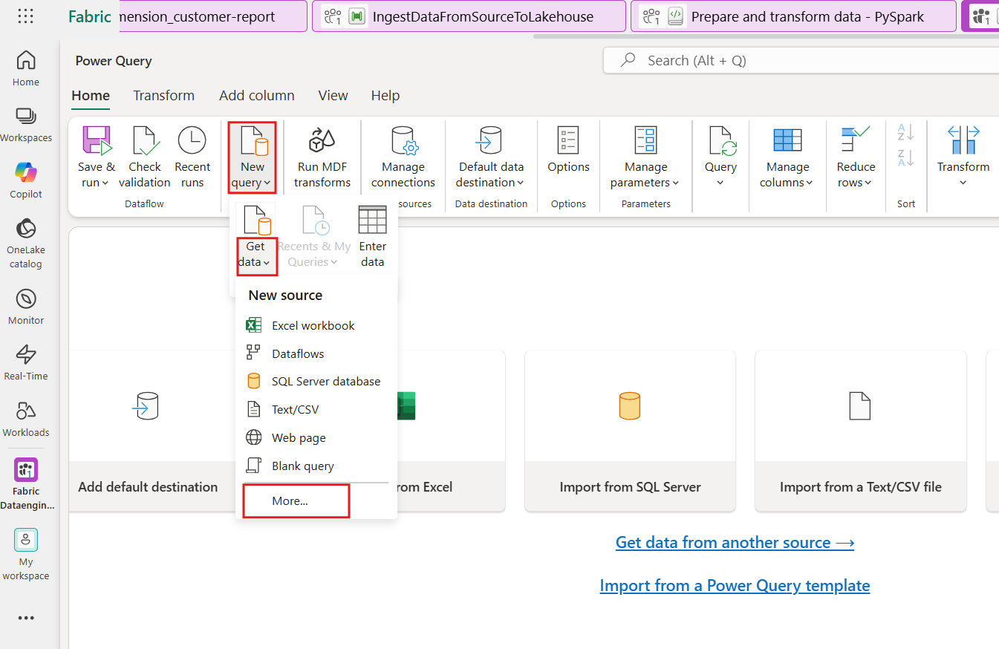

5.  在“选择数据源”标签中，搜索 +++Lakehouse+++ 并点击 **Lakehouse**
    连接器。

6.  會彈出“連接至數據源”對話框。會根據你已登錄的用戶自動創建一個新連接。选择
    **“下一步**”。

7.  會顯示“選擇數據”對話框。 扩展工作区 **Fabric
    Dataengineering-DataFactory** -@lab.LabInstance.Id, 然后扩展
    Lakehouse - **wwilakehouse**, 并从列表中选择fact_sale表。点击
    **创建**。

8.  你会看到画布现在已经被**fact_sale**数据填满了。

### 任務 2: 轉換從 Lakhouse導入的數據

1.  在InvoiceDateKey**列的列頭中選擇數據類型圖標**
    ，以顯示下拉菜單。從菜單中選擇數據類型，將該列從**日期/時間**轉換為**日期**類型。

2.  在功能區的**“主頁**”標簽頁中，從**管理列**組中選擇“選擇列”選項，然後選擇**“選擇列”**

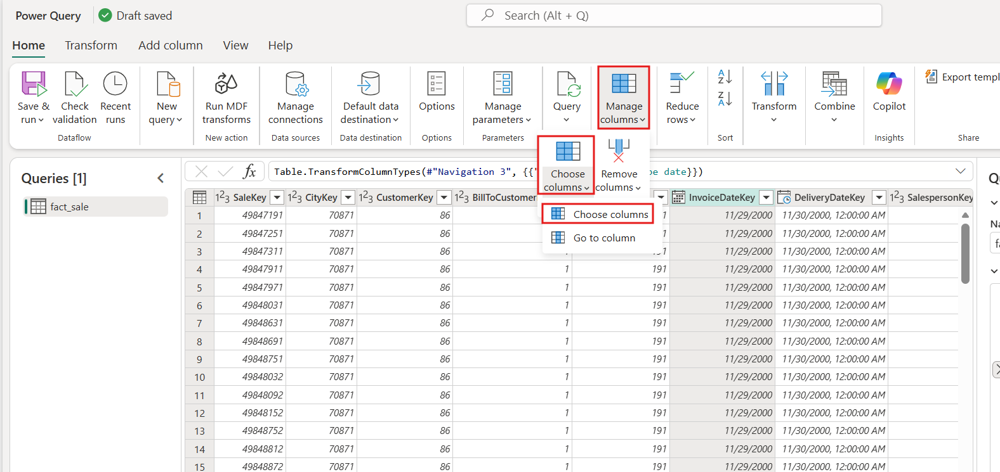

3.  在“選擇列”對話框中，取消選擇 **稅率** 列，然後選擇 **確定：**

> 

4.  選擇InvoiceDateKey列的排序和篩選下拉菜單，然後選擇日期篩選，再選擇
    **中間......** 筛选。

5.  在篩選行對話框中，選擇2000年1月1日至2000年1月31日之間的日期，然後選擇確定。

###  任務 3：连接dimension_city桌

你不需要CSV文件，而是加载用例01中**已存在**于wwilakehouse的**dimension_city**表，以丰富fact_sale数据，包含城市和销售区域的信息。、

1.  在**數據流編輯器菜單的主頁中，選擇**“獲取數據**”選項，然後選擇**“更多......”

2.  在“选择数据源”标签中，搜索 +++Lakehouse+++ 并点击 Lakehouse 连接器。

3.  會出現“連接數據源”對話框。會自動創建一個新的連接。选择
    **“下一步**”。

4.  显示“选择数据”对话框。展开工作空间 **Fabric
    Dataengineering-DataFactory-**@lab.LabInstance.Id，然后展开
    Lakehouse - **wwilakehouse**，选择 **dimension_city** 表。点击创建。

5.  你现在会在 Power Query 编辑器**中看到第二个查询——**dimension_city。

###  任務 4: 转换 dimension_city 数据

1.  确保**在查询面板中选中**了dimension_city查询。

2.  在色帶的“主頁”標簽頁中，從“管理列”組中選擇“列。

> 

3.  在“選擇列”對話框中，只保留以下列（取消選出其他列），然後點擊
    **確定**：

- CityKey

- City

- StateProvince

- SalesTerritory

4.  選擇 **SalesTerritory**
    列的篩選和排序下拉菜單。取消選擇（空）或（空）條目以移除沒有區域的行。然後點擊確定。

###  任務5: 结合fact_sale和dimension_city数据

下一步是将两个表格合并为一个表格，包含每笔销售的城市和领地上下文，并添加计算出的利润率栏。

1.  首先，切換“圖解視圖”按鈕，這樣你可以看到兩個查詢。

2.  選擇**fact_sale**查詢。在主頁標簽中，選擇**“合併**”菜單，選擇**“合併查詢**”，然後選擇**“合併查詢為新查詢**”。

3.  在合併對話框中，選擇**dimension_city**為右表，接受CityKey
    到**CityKey**的建議映射，確保選擇左外層作為連接類型，然後點擊確定。

4.  展开 **dimension_city** 列，清除 **CityKey**
    复选框，保持剩余列选中，然后点击 **确定**。

5.  要添加計算列：在編輯器頂部選擇**添加列**標簽，然後從通用組中選擇**自定義列**。

6.  在自定義列對話框中，配置新列如下**:**

[TABLE]

然后选择 **OK**.

7.  選擇新創建的**ProfitMargin**列。然後在編輯器窗口頂部選擇“變換”標簽。在數字列組中，選擇“**四捨五入**”下拉菜單，然後選擇“四捨五入......”

。

8.  在輪對話框中輸入4表示小數點數，然後點擊確定。

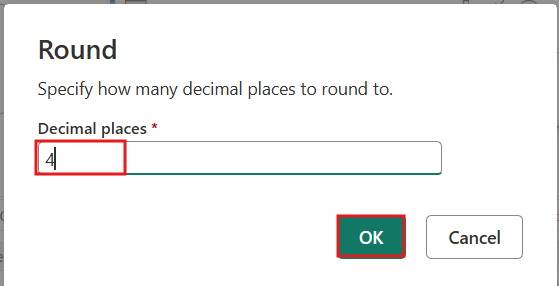

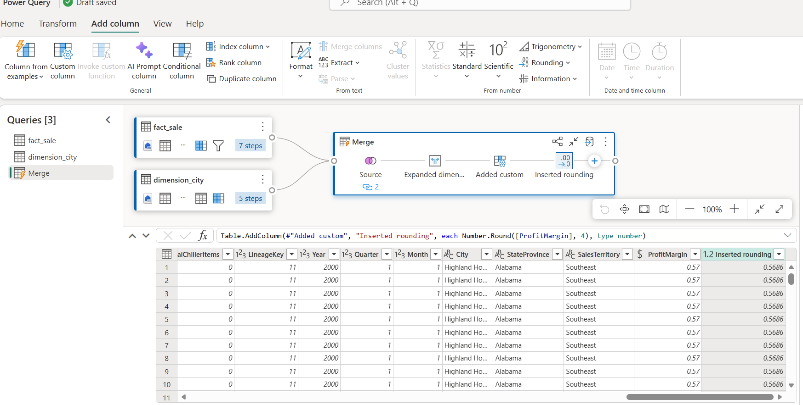

9.  将**InvoiceDateKey列的数据类型从** 日期改回日期**/时间。**

10. 最後，從編輯器右側展開查詢設置窗格，並將查詢重命名為 +++Output+++。

[TABLE]

### 任務 6: 將輸出查詢加載到 Lakehouse中的金表中

在輸出查詢完全準備好後，定義輸出目的地。

1.  選擇
    之前創建的輸出合併查詢。然後選擇**+圖標**，將數據目的地添加到該數據流中。

2.  在數據目的地列表中，選擇“新目的地”下的湖屋選項。

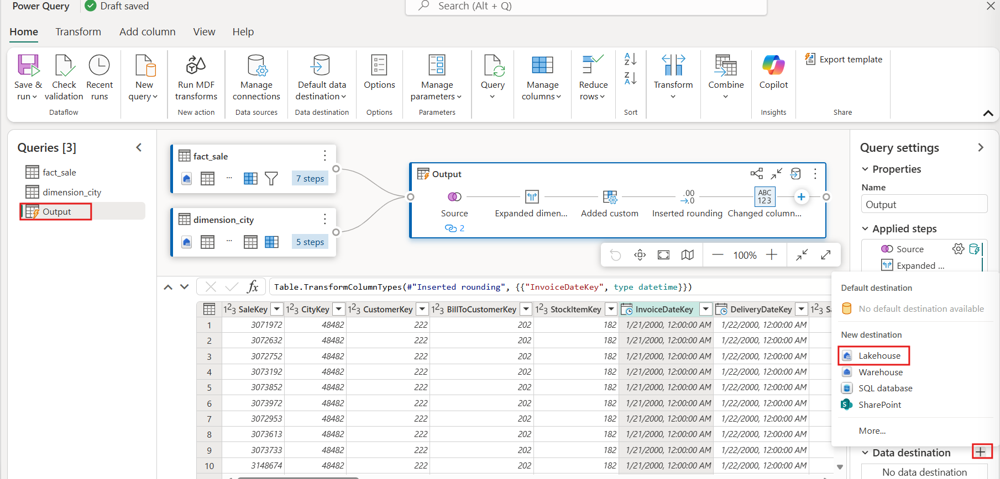

3.  在“連接數據目的地”對話框中，你的連接應該已經被選中了。选择
    **“下一步** ”继续。

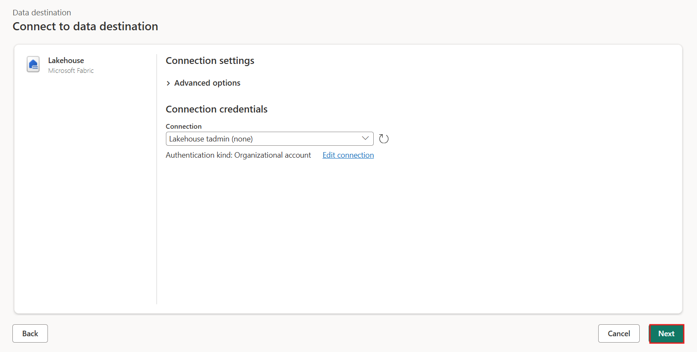

4.  在选择目标目标下，选择新表，浏览 **Fabric
    Dataengineering-DataFactory-XX** 工作区下的 wwilakehouse，输入
    **+++Gold_Sales_By_City+++** 作为表名，然后点击**下一步**。

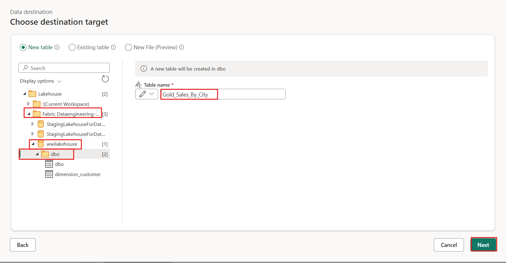

5.  點擊**Save settings**

6.  回到主編輯器窗口，確認查詢設置面板顯示Lakehouse是輸出表的輸出目的地。

7.  從主頁選項卡**選擇**“保存並運行”。

8.  等待數據流運行完成（大約2-3分鐘）。

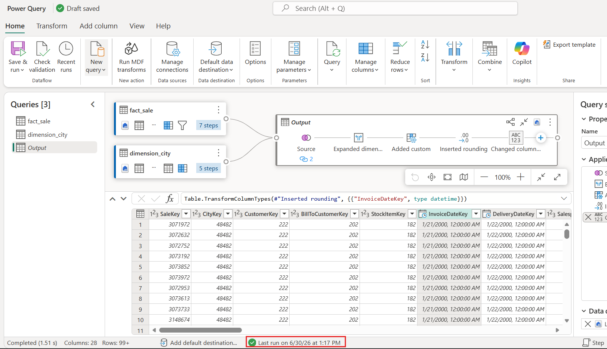

9.  返回
    wwilakehouse，点击表格部分的刷新。确认Gold_Sales_By_City表现在出现在资源管理器面板的表格下。

10. 点击 **Gold_Sales_By_City**
    表预览并确认包含城市、州省、销售领地、利润、总计包括税和利润率等列。

## 練習 5: 通过Data Factory自动化并发送通知

### 任務 1: 将 Office 365 Outlook 活动添加到您的管道中

1.  在左侧导航菜单中点击 **Fabric
    Dataengineering-DataFactory-**@lab.LabInstance.Id Workspace 导航。

2.  在工作区页面选择 **“Pipeline**”。

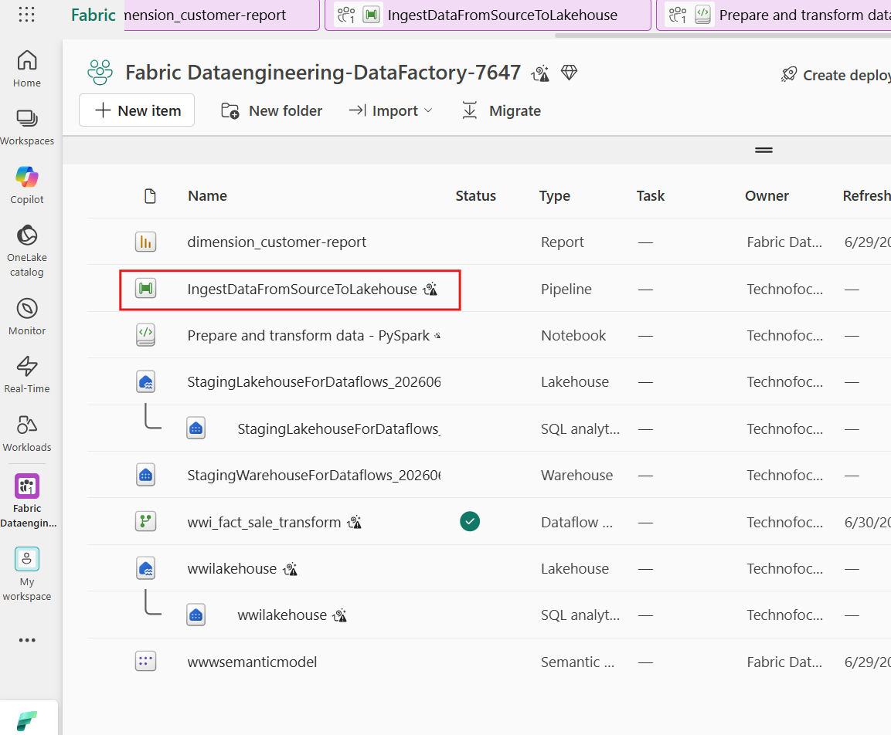

3.  在管道编辑器中选择**“活动**”标签，找到 **Office Outlook** 活动。

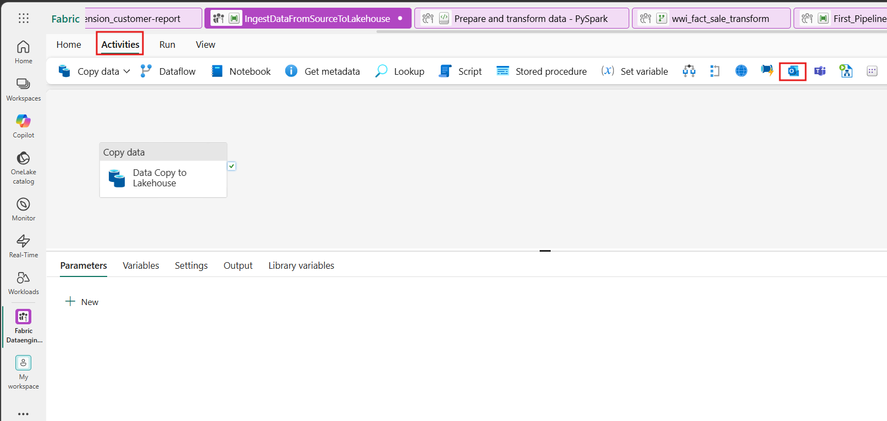

4.  从复制活动中选择并拖动“成功”路径（右上角的绿色复选框）到新的Office
    365 Outlook活动。

5.  從管道畫布中選擇Office 365
    Outlook活動，然後選擇畫布下方屬性區域的設置標簽。點擊連接下拉菜單，選擇全部瀏覽。

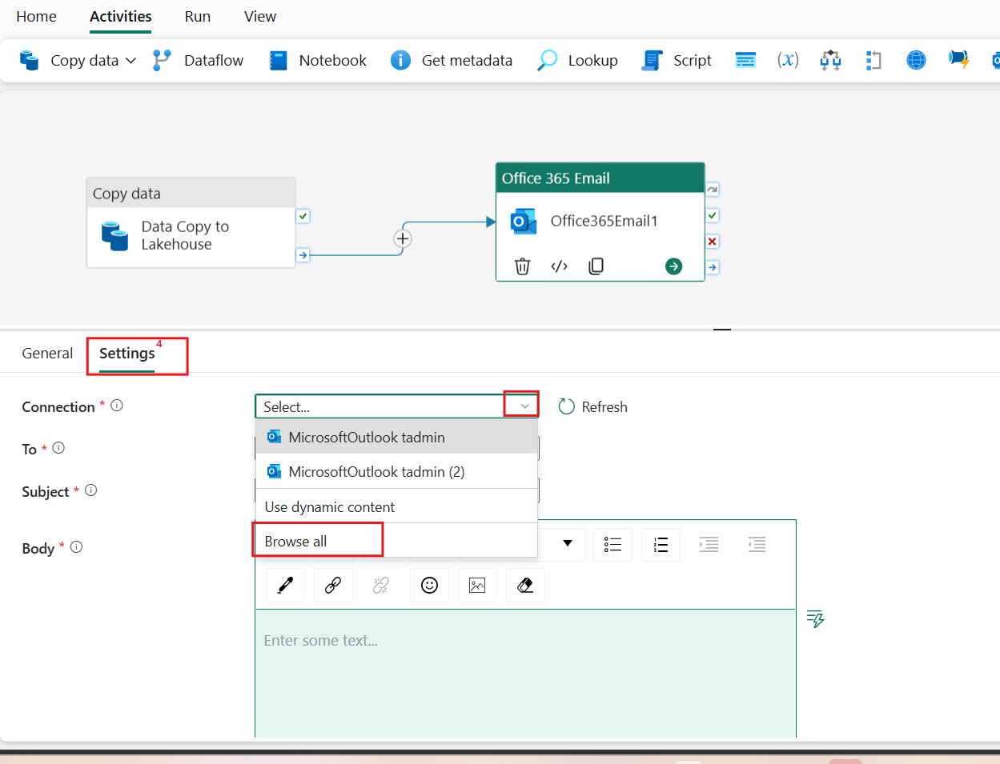

6.  在選擇數據源窗口中，選擇 **Office 365郵件** 源。

> 

7.  用你想发送邮件的账户登录。你可以用已经登录的账户使用现有连接。

8.  点击连接 以继续。

9.  从管道画布中选择Office 365
    Outlook活动。在画布下方属性区域的设置标签页中，配置邮件。

10. 在“收件人”部分输入你的电子邮件地址。如果你想使用多个地址，请使用
    ;将它们分隔开来。

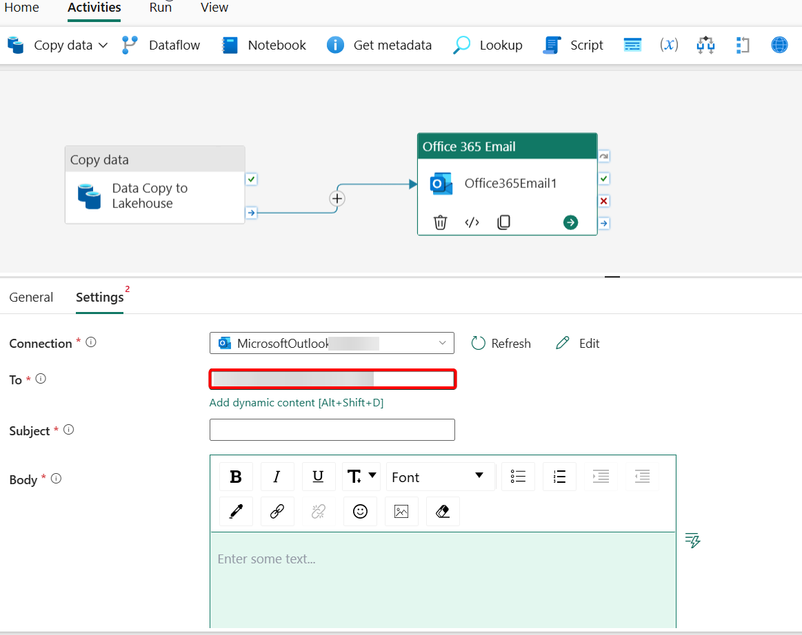

11. 对于**主题**，选择该字段，使“**添加动态**内容”选项出现，然后选择它以显示流水线表达式构建画布。

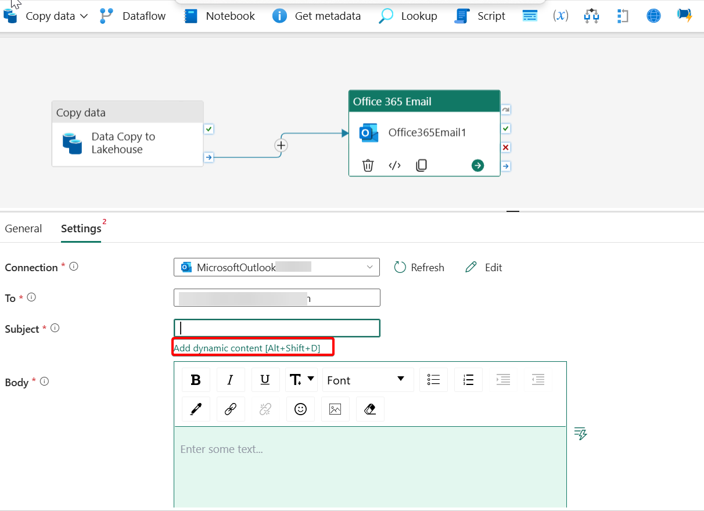

[TABLE]

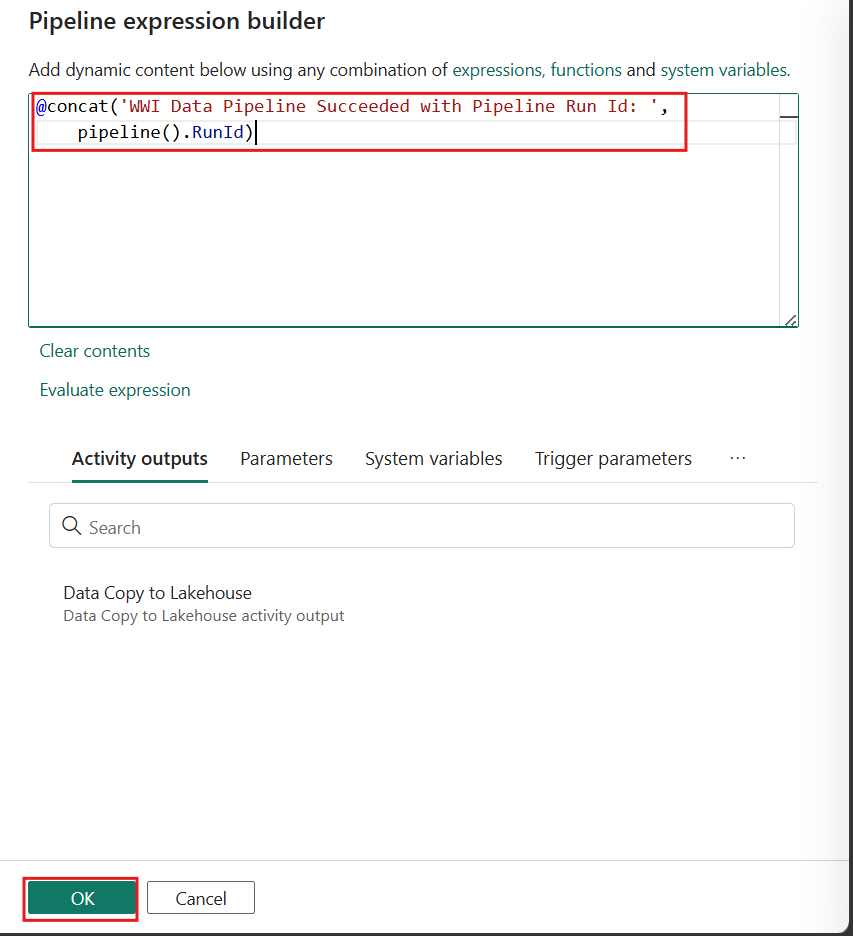

1.  对于正体，再次选择该字段，并在文本区域下方出现时选择“表达式构建器中的视图”选项。在出现的管道表达式构建器对话框中添加以下表达式，然后选择确定：

[TABLE]

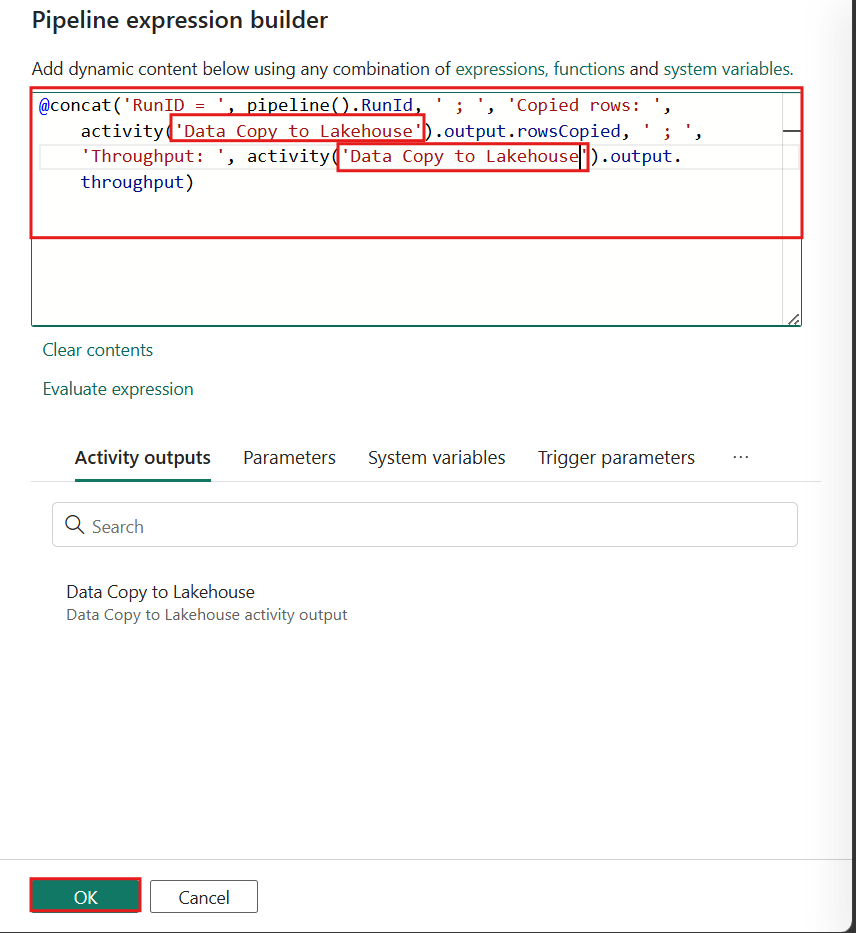

[TABLE]

2.  最后，在流水线编辑器顶部选择“主页”标签，选择
    **“运行**”。然后在确认对话框中选择“保存并再次运行”，以执行这些活动。

3.  管道成功运行后，查看你的电子邮件，查找管道发送的确认邮件。

### 任務2: 调度 Pipeline执行

一旦你完成了流程的开发和测试，就可以安排它自动执行。

1.  在管道编辑器窗口的主页标签中，选择 **“计划**”。

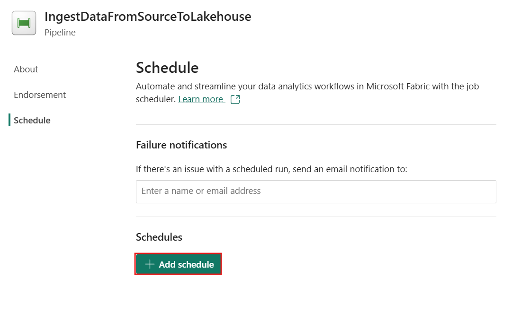

2.  根据需要配置排程。下面的示例将流水线安排在每天晚上8：00执行，直到年底。

[TABLE]

1.  点击 **关闭** 日程表。

### 任務3: 向管道添加 Dataflow activity 

1.  在**活动**标签页中，将 **Datflow** 活动拖拽到管道画布上。

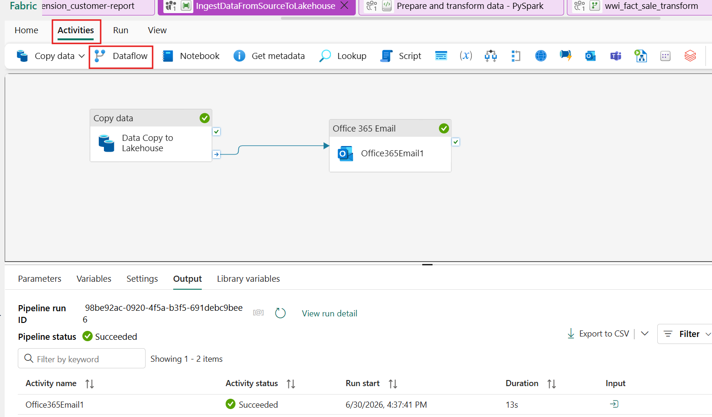

2.  从出现的菜单中选择数据流。

3.  新创建的数据流活动会插入复制活动和Office 365
    Outlook活动之间，并自动选择，在画布下方区域显示其属性。

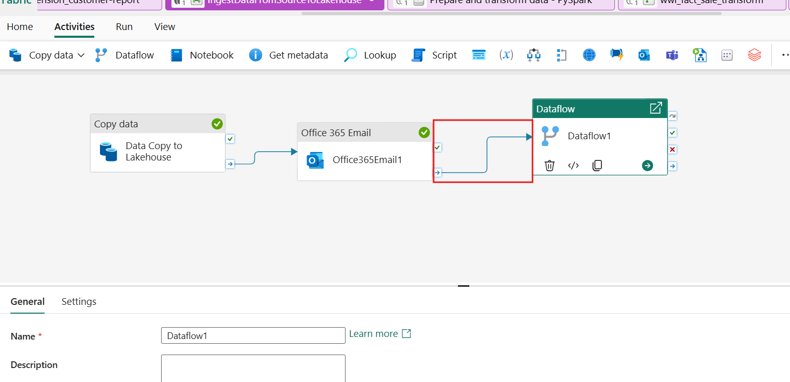

4.  选择属性区域的设置标签，然后选择
    你在练习4中创建的**wwi_fact_sale_transform**数据流。

5.  选择
    Pipeline编辑器顶部的“主页”标签，选择**运行**。然后在确认对话框中选择“保存并再次运行”以执行这些活动。

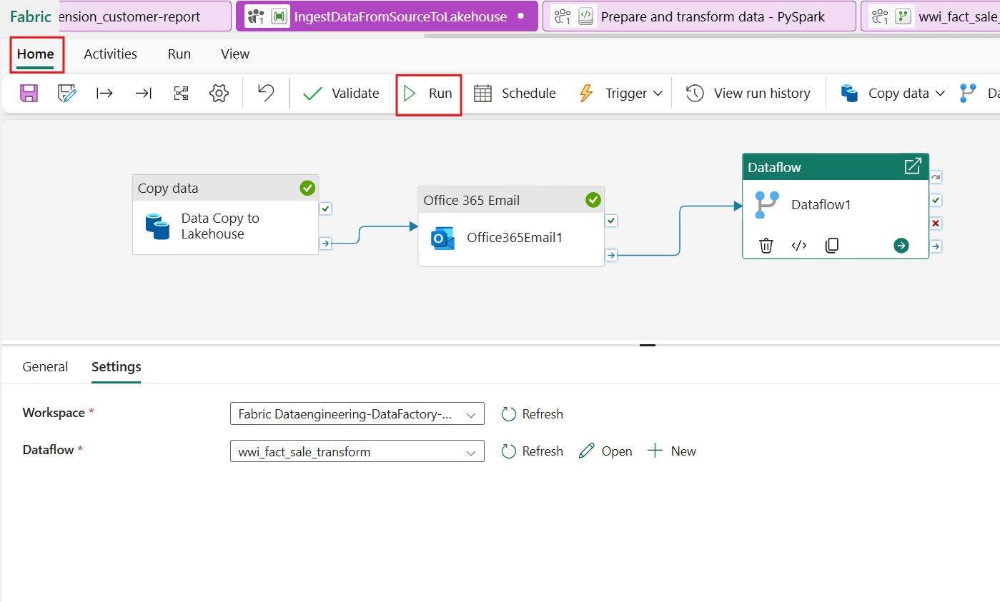

6.  监控输出标签，确认所有三项活动（复制数据、数据流、Office 365
    Outlook），并显示状态：成功。

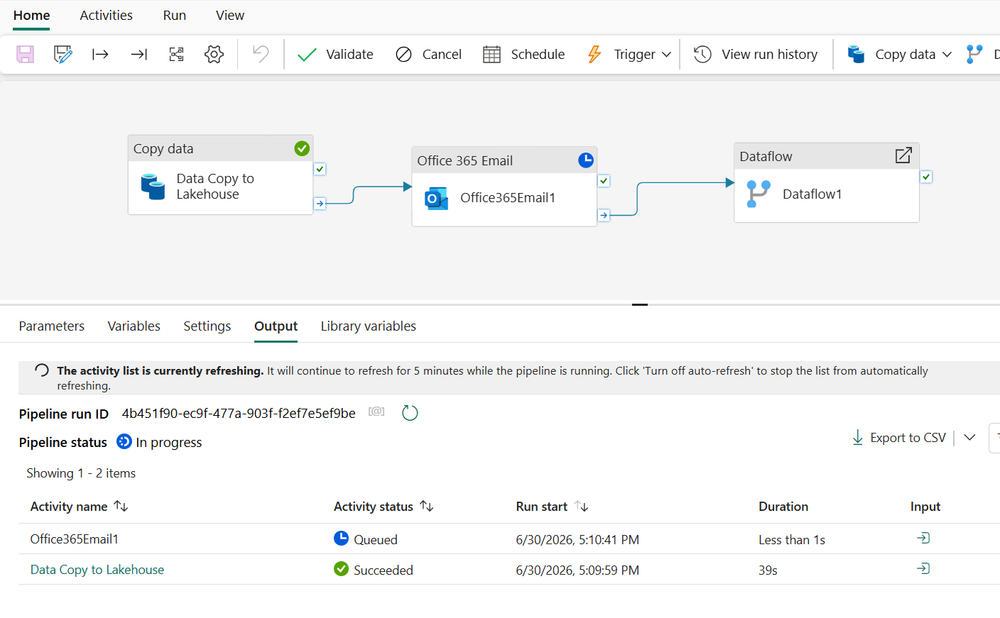

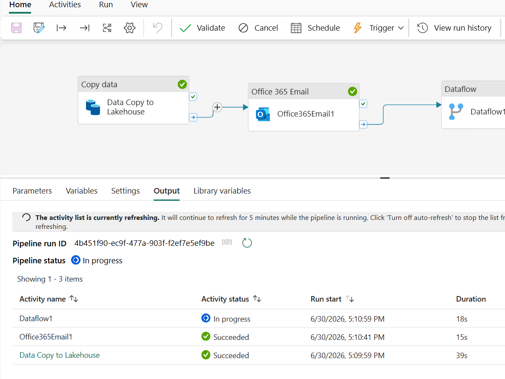

## 練習 6: 在 Microsoft Fabric 中构建报表

在教程的这一部分中，你将创建一个Power
BI数据模型，并从零开始创建一份报告。

### 任務 1: 利用SQL端点探索银层的数据

Power BI 原生集成在整个 Fabric
体验中。这种原生集成带来了一种独特的模式，称为
DirectLake，能够访问湖屋中的数据，提供最高性能的查询和报告体验。DirectLake
模式是开发的一项突破性新引擎功能，用于分析 Power BI
中超大型数据集。该技术基于这样一个理念：直接从数据湖加载 parquet
格式文件，无需查询数据仓库或湖屋端点，也无需导入或复制数据到 Power BI
数据集。DirectLake 是一种快速路径，可以将数据湖的数据直接加载到 Power BI
引擎，供分析。

在传统的 DirectQuery 模式下，Power BI
引擎直接从源端查询数据以执行每个查询，查询性能取决于数据检索速度。DirectQuery
消除了复制数据的需求，确保源代码的任何变化在导入过程中立即反映在查询结果中。另一方面，导入模式下性能更好，因为数据在内存中易于获取，无需每次查询都从源端查询数据。
然而，Power BI
引擎必须在数据刷新时先将数据复制到内存中。只有在下一次数据刷新（包括计划刷新和按需刷新）时，才会对底层数据源进行更改。

DirectLake
模式现在通过直接将数据文件加载到内存中，消除了这种导入要求。由于没有显式导入过程，用户可以在源头实时捕捉任何变化，从而结合了
DirectQuery 和导入模式的优势，同时避免了它们的缺点。因此，DirectLake
模式是分析超大型数据集和源头频繁更新数据集的理想选择。

1.  从左侧菜单选择**Fabric
    Dataengineering-DataFactory-@lab.LabInstance.Id** 然后选择名为**wwisemanticmodel**.

> 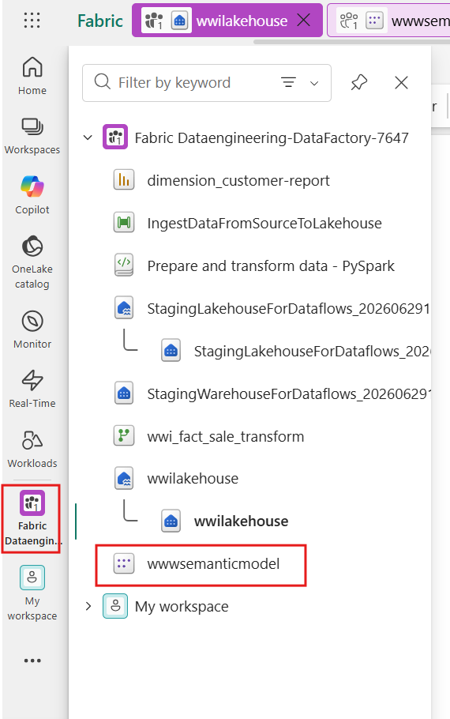

2.  打开语义模型，选择右上角的模式下拉菜单，从查看切换到编辑，然后选择“进行任何更改”。

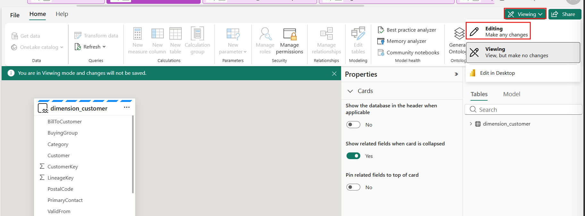

3.  在菜单功能区中选择**“编辑表格**”以显示表格同步对话框。

4.  在**“编辑语义模型**”对话框**中，选择所有**表格，然后在对话框底部选择**“确认**”以同步语义模型。

5.  从**fact_sale**表中，拖动**CityKey**字段并将其放到**dimension_city**表中的CityKey**字段**
    上，创建关联。会出现**“创建关系**”对话框。

注意:
通过点击表格，拖放表格，dimension_city和fact_sale表格相邻来重新排列表格。同样的方法适用于你想建立关系的两个表格。这样做是为了让表格之间列的拖拽更方便。

6.  在**“创建关系”**对话框中：

    - **表1**由**fact_sale**和**CityKey列填充**。

    - **表2**包含**dimension_city**和**CityKey列**。

    - 基数：**多对一 (\*:1)**

    - 交叉滤波器方向: **Single**

    - 选择“激活此关系**”的**框。

    - 选择“**假设引用完整性”旁边的框。**

    - 选择**保存。**

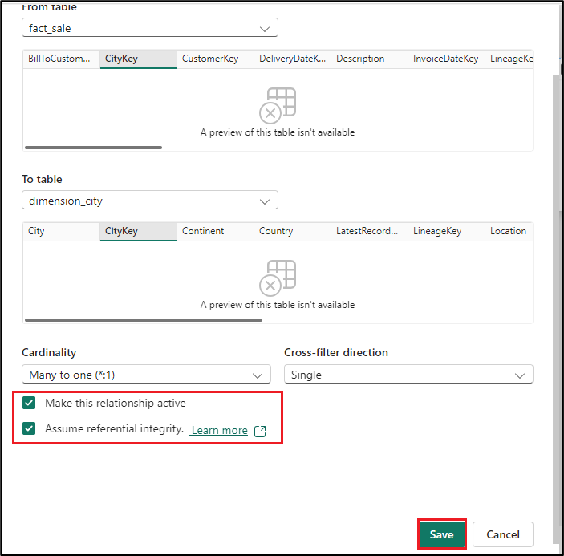

7.  接下来，使用上述相同的**创建关系**设置，但使用以下表格和列添加这些关系：

    - **StockItemKey(fact_sale)** - **StockItemKey(dimension_stock_item)**

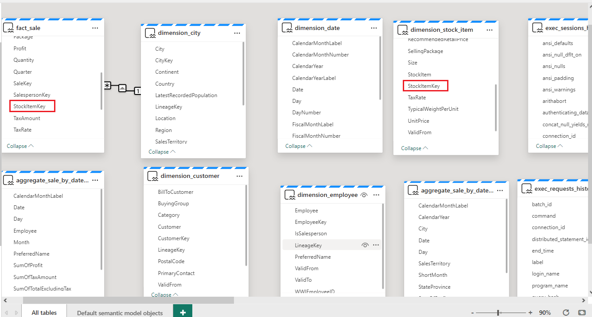

- **Salespersonkey(fact_sale)** - **EmployeeKey(dimension_employee)**

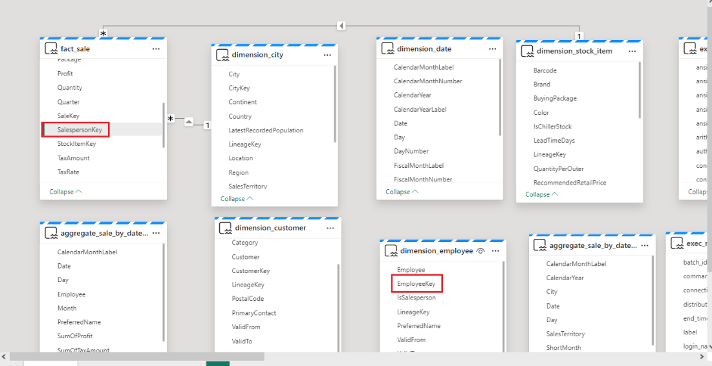

8.  确保按照上述步骤创建下面两组之间的关系。

    - **CustomerKey(fact_sale)** - **CustomerKey(dimension_customer)**

    - **InvoiceDateKey(fact_sale)** - **Date(dimension_date)**

9.  添加这些关系后，您的数据模型应如下图所示，准备进行报告。

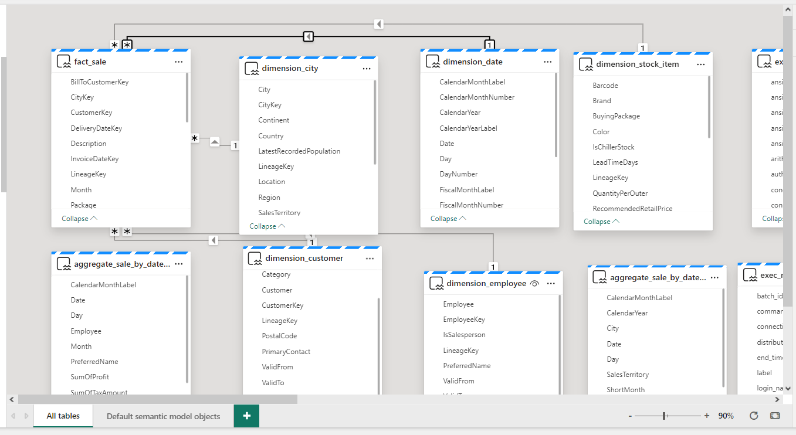

### 任務 2: 建造报告

1.  从顶部功能区选择**文件**，选择**创建新报表**，开始在 Power BI
    中创建报表/仪表盘。

2.  在 Power BI
    报表画布中，您可以通过将所需列从**数据**窗格拖入画布，并使用一个或多个可用的可视化工具来创建满足业务需求的报表。

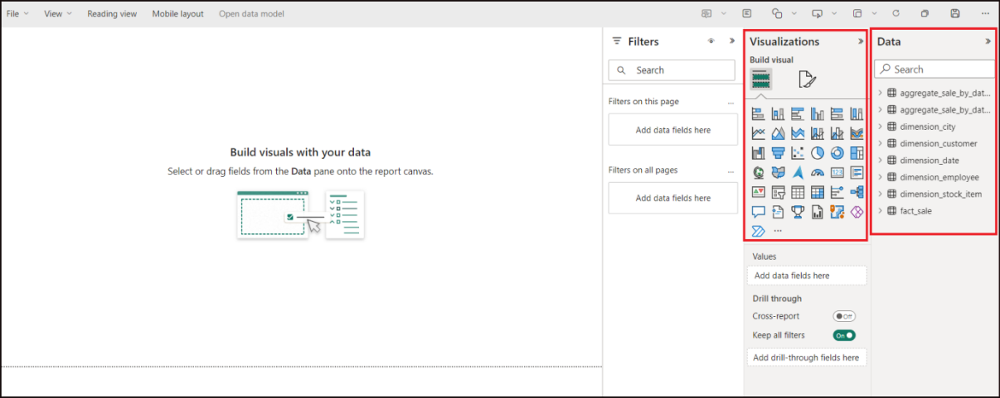

**添加标题：**

1.  在功能区内，选择**文本框**。输入“**WW Importers Profit
    Reporting**”。**高亮**该**文本**并将大小放大为**20**。

2.  调整文本框大小，放在报告页面左**上角**，点击文本框外。

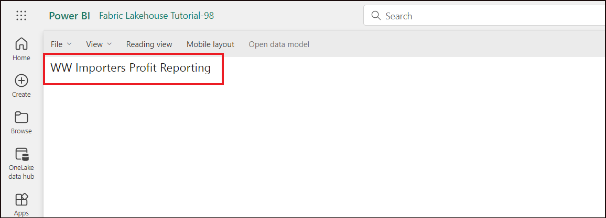

**添加卡片：**

3.  在**数据**面板中，展开**fact_sales**，勾选利润旁边的框。此选择会生成一个柱状图表，并将字段添加到Y轴。

4.  选择柱状图后，在可视化面板中选择**卡片**可视化。

5.  此选择将视觉图像转换为卡片。将卡片放在标题下方。

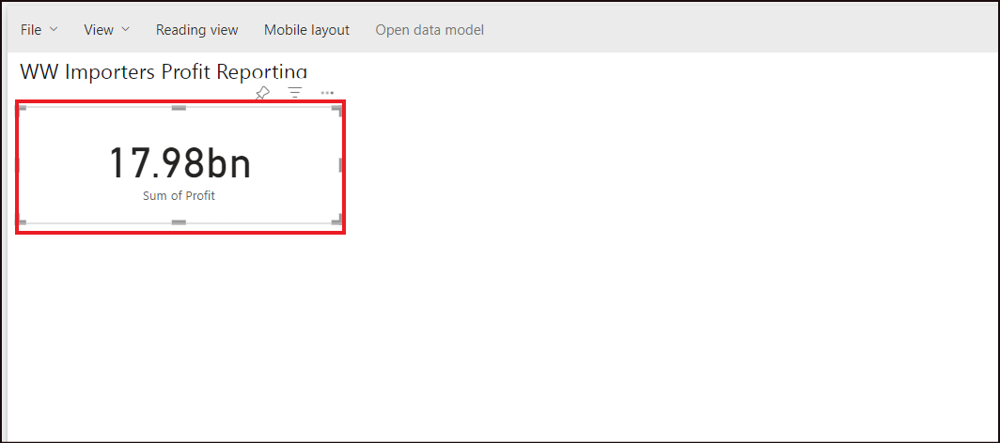

6.  点击空白画布上的任意位置（或按Esc键），这样刚放置的卡牌就不再被选中。

**添加条形图:**

7.  在**数据**窗格中，展开**fact_sales**，勾选利润旁边的框。此选择会生成柱状图表，并将字段添加到Y轴。

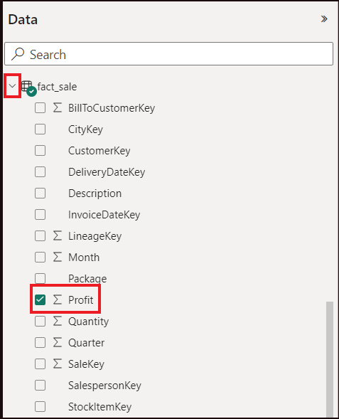

8.  在**数据**面板中，展开**dimension_city**并勾选“**SalesTerritory**”选项。此选择会将字段添加到Y轴。

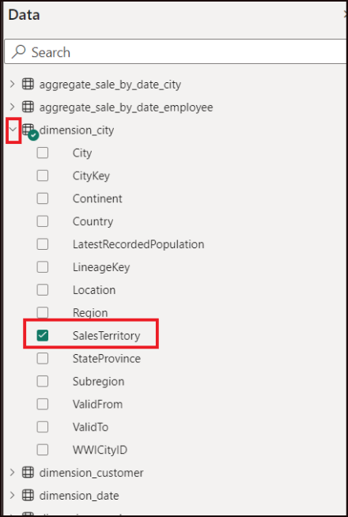

9.  选择柱状图后，在可视化窗格中选择**“Clustered bar
    chart**”可视化。此选择将柱状图转换为条形图。

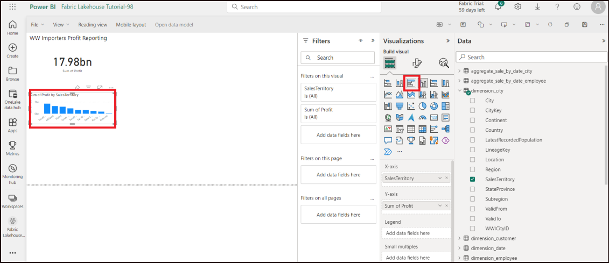

10. 调整条形图大小，填满标题和卡片下方的区域。

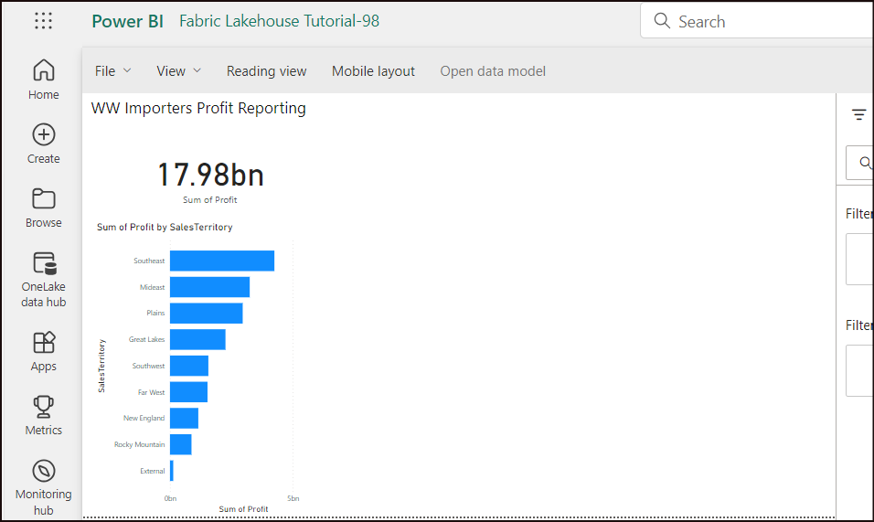

11. 点击空白画布上的任意位置（或按Esc键），这样条形图就不再被选中。

**构建堆叠面积图可视化：**

12. 在**可视化**面板中，选择**堆叠面积图**可视化。

13. 重新定位并调整堆叠区域图，位于卡片右侧，以及之前步骤中创建的条形图可视化。

14. 在**数据**面板中，展开**fact_sales**并勾选利润旁边的框。展开**dimension_date**，勾选财政**月份编号**旁的框。此选择会生成一个填充折线图，显示按财年月份的利润。

15. 在**数据**面板中，展开**dimension_stock_item**，并将**BuyingPackage**
    拖入图例字段。此选项为每个购买套餐添加一行。

 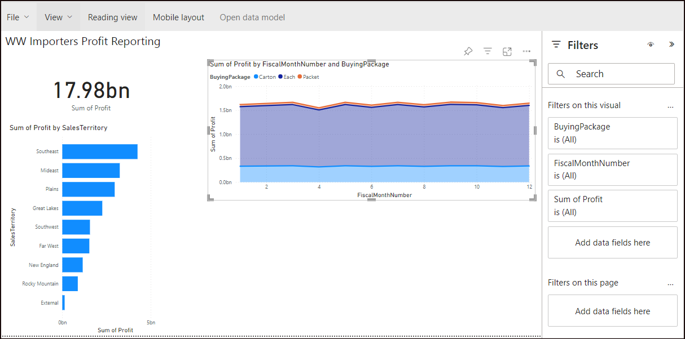

16. 点击空白画布上的任意位置（或按Esc键），这样堆叠面积图就不再被选中。

**制作柱状图:**

17. 在**可视化**面板中，选择**堆叠列式图表**可视化。

18. 在**数据**面板中，展开**fact_sales**并勾选利润旁边的框。此选择会将字段添加到Y轴。

19. 在**数据**面板上，展开**dimension_employee**并勾选“员工”旁边的框。此选择将字段添加到X轴。

20. 在空白画布上任意点击（或按Esc键），这样图表就不再被选中。

21. 从功能区选择**“文件**\>**保存**”。

22. 输入您的报告名称为**“利润报告**”。选择**保存**。

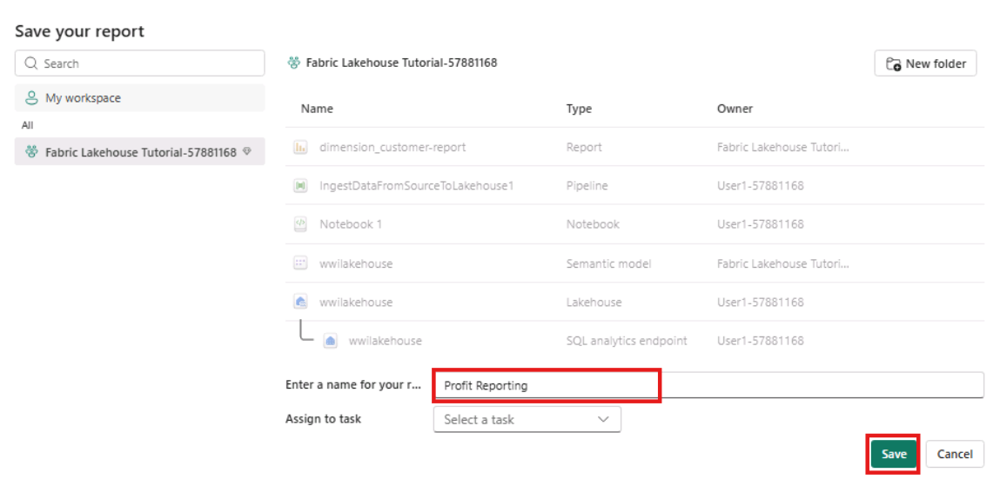

23. 你会收到通知，说报告已被保存。

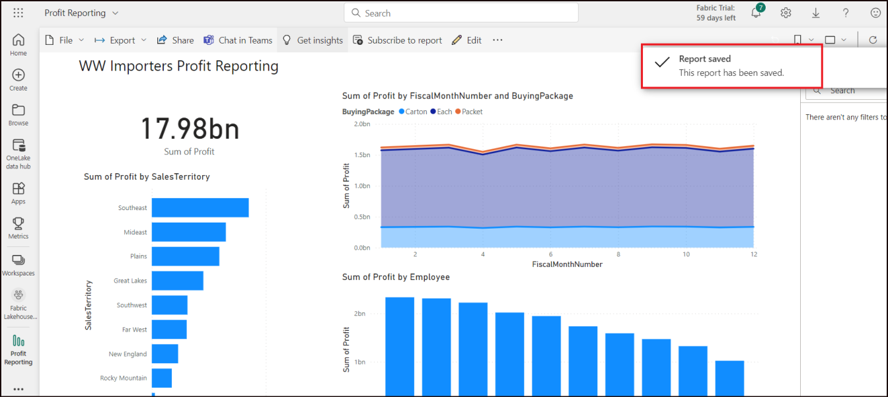

# 練習 7: 清理资源

你可以删除单个报表、管道、仓库和其他项目，或者删除整个工作区。请使用以下步骤删除你为本教程创建的工作区。

1.  从左侧导航菜单中选择你的工作区，**Fabric
    Dataengineering-DataFactory-@lab.LabInstance.Id**。它会打开工作区项目视图。

2.  选择 **...**在工作区名称下选择**工作区设置**。

3.  选择**“通用**”并**移除此工作区。**

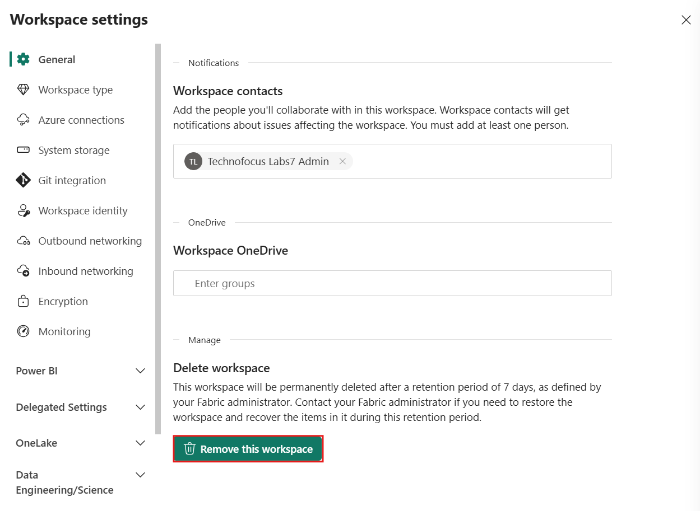

4.  点击弹出的警告中“**删除**”。

5.  等待工作区被删除的通知后，再进入下一个实验室。

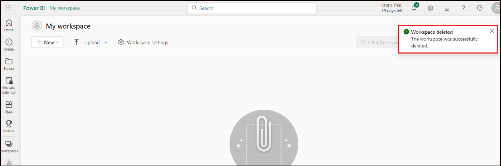

**總結**

在本实验室中，你通过创建Fabric工作区和Lakehouse、导入源数据、加载到Delta表、用SQL查询验证数据、构建语义模型以及生成Power
BI报告，实现了完整的Microsoft Fabric Data Engineering
工作流程。这些活动展示了Microsoft
Fabric如何通过在统一平台上结合数据集成、存储、转换、语义建模和报告，简化现代分析。本实验室获得的技能为开发使用Microsoft
Fabric开发可扩展的 Data Engineering 解决方案奠定了基础。
