# 使用案例 02：使用 Apache Spark 分析資料

**案例情境**

一家零售公司每年都會將銷售訂單匯出為 CSV 檔案。分析團隊希望在單一平台上探索這些資料、清理和轉換資料、將結果儲存為適合分析的格式，並快速以圖表呈現趨勢，而不必在多個工具之間來回切換。

身為資料工程師，您將在 Microsoft Fabric 中建立工作區和 Lakehouse、上傳銷售訂單檔案，並使用 Spark notebook 載入、探索、轉換和視覺化資料。您也會建立受控和外部 Delta 資料表、使用 Spark SQL 查詢資料，並使用 Delta 資料表處理串流資料。

**簡介**

Apache Spark 是一個開放原始碼的分散式資料處理引擎，廣泛用於探索、處理和分析 Data Lake 儲存體中的大量資料。許多資料平台產品都提供 Spark 作為處理選項，包括 Azure HDInsight、Azure Databricks、Azure Synapse Analytics 和 Microsoft Fabric。Spark 的優勢之一是支援多種程式語言，包括 Java、Scala、Python 和 SQL，因此非常適合各種資料處理工作負載，包括資料清理與操作、統計分析與機器學習，以及資料分析與視覺化。

Microsoft Fabric Lakehouse 中的資料表以開放原始碼的 Apache Spark **Delta Lake** 格式為基礎。Delta Lake 為批次和串流資料作業提供關聯式語意支援，並可建立 Lakehouse 架構，讓 Apache Spark 處理和查詢以 Data Lake 底層檔案為基礎的資料表。

**本實驗建立的 Fabric 項目**

| **項目** | **名稱** | **在實驗中的用途** |
|----|----|----|
| 工作區 | dp_Fabric\<實驗執行個體 ID\> | 包含本實驗的所有項目 |
| Lakehouse | Fabric_lakehouse | 儲存銷售訂單檔案、轉換後的資料和 Delta 資料表 |
| Notebook | Explore Sales Orders | 用於探索、轉換和視覺化資料的 Spark notebook |
| Delta 資料表 | salesorders、external_salesorder、iotdevicedata | 受控資料表、外部資料表和串流資料表 |

**目標**：

- 在 Microsoft Fabric 中建立工作區和 Lakehouse，並上傳要分析的資料檔案。

- 建立 notebook，以互動方式探索和分析資料。

- 將資料載入 DataFrame，並篩選、分組和彙總資料。

- 使用 PySpark 轉換資料，並將轉換後的資料儲存為 Parquet 檔案和分割檔案。

- 在 Spark metastore 中建立受控 Delta 資料表 **salesorders** 和外部 Delta 資料表 **external_salesorder**，並比較兩者的屬性。

- 使用 Spark SQL 查詢資料表以進行分析。

- 使用 matplotlib 和 seaborn 等 Python 程式庫視覺化資料。

- 使用 Delta 資料表處理串流資料。

- 刪除工作區及其相關項目。

**注意：** 本實驗的螢幕擷取畫面使用英文介面，因此步驟中的介面名稱（例如 **+ New workspace**、**Apply**）保留英文，方便您對照畫面操作。

## 練習 1：建立工作區、Lakehouse 和 notebook，並將資料載入 DataFrame

在本練習中，您將建立工作區和 Lakehouse、上傳銷售訂單檔案，並在 notebook 中將資料載入 DataFrame。

### 任務 1：建立工作區

1.  開啟瀏覽器，在網址列中輸入或貼上以下 URL：+++https://app.fabric.microsoft.com/+++，然後按 **Enter** 鍵。

**注意**：如果您直接進入 Microsoft Fabric 首頁，請跳到步驟 6。

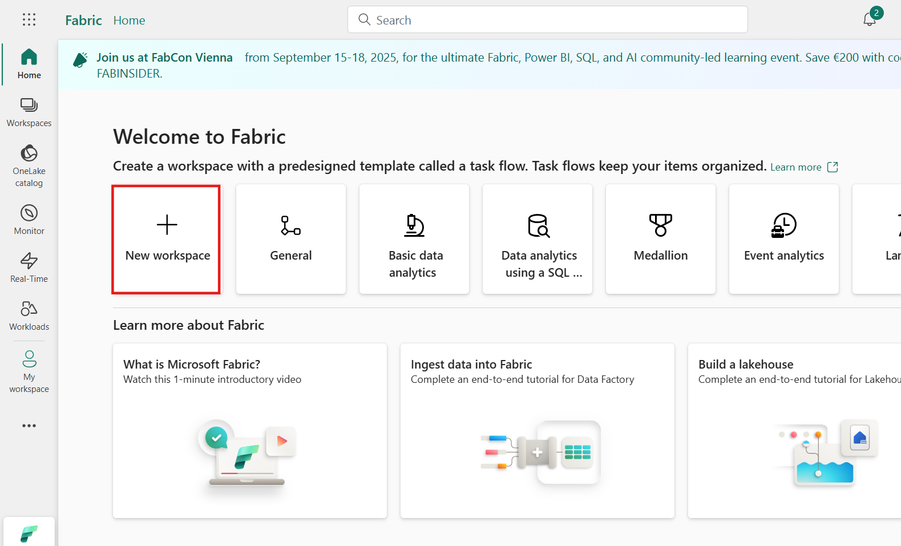

2.  在 **Microsoft Fabric** 視窗中輸入您的認證，然後按一下 **Submit** 按鈕。

| **使用者名稱** | **+++@lab.CloudPortalCredential(User1).Username+++** |
|----|----|
| **密碼** | **+++@lab.CloudPortalCredential(User1).Password+++** |


3.  在 **Microsoft** 視窗中輸入密碼，然後按一下 **Sign in** 按鈕。


4.  在 **Stay signed in?** 視窗中，按一下 **Yes** 按鈕。

5.  如果預設開啟 Power BI，請執行以下步驟，否則略過此步驟：

- 按一下 **Power BI**。


- 從選項中選取 **Fabric**。

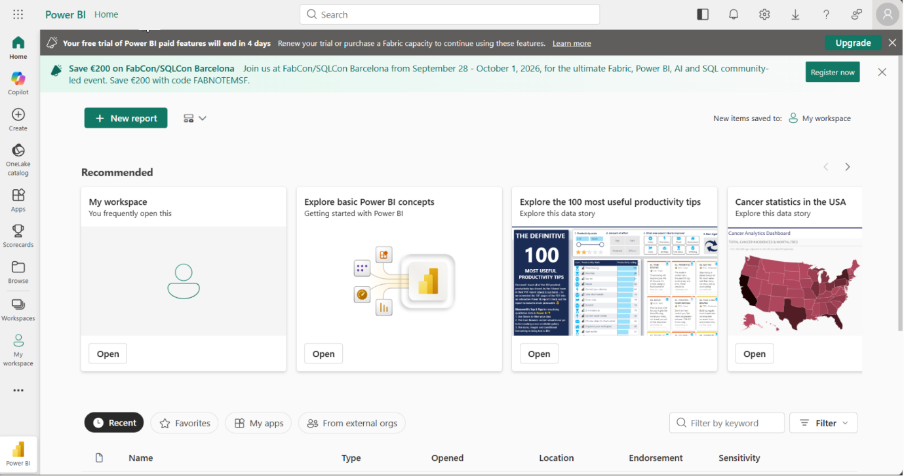

6.  在 Fabric 首頁上，選取 **+ New workspace** 圖格。

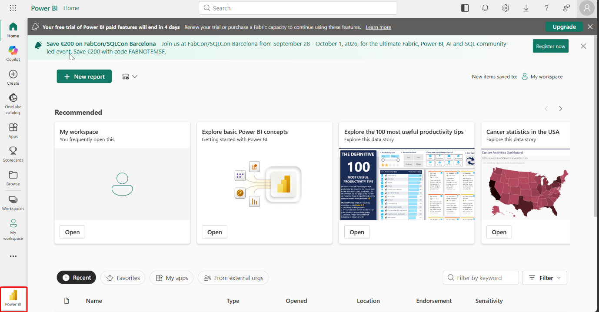

7.  在 **Create a workspace** 窗格中輸入以下資訊，然後按一下 **Apply** 按鈕。

| **屬性** | **值** |
|----|----|
| **Name** | +++dp_Fabric@lab.LabInstance.Id+++（必須是唯一的名稱） |
| **Description** | 此工作區包含使用 Apache Spark 分析資料的項目 |
| **Advanced** | 在 **License mode** 下選取 **Fabric** |
| **Default storage format** | **Small dataset storage format** |


8.  等待部署完成，大約需要 2-3 分鐘。新工作區開啟時應該是空的。

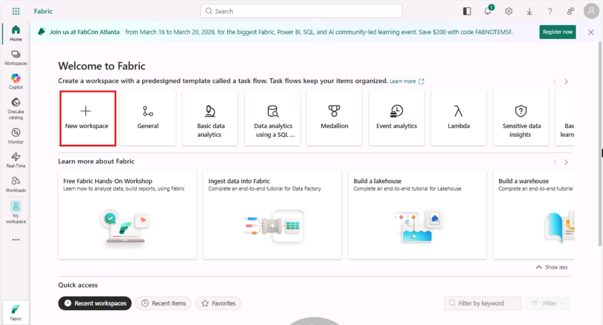

### 任務 2：建立 Lakehouse 並上傳檔案

有了工作區之後，接下來要建立 Lakehouse，以存放您要分析的資料檔案。

1.  按一下導覽列中的 **+ New item** 按鈕，建立新的 Lakehouse。

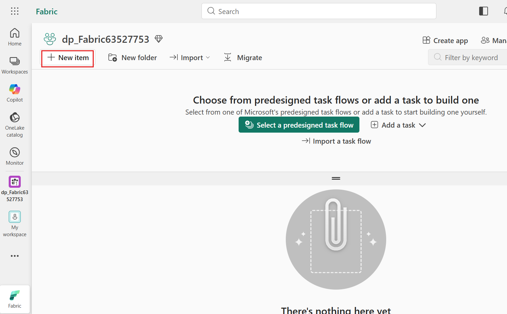

2.  篩選並選取 **Lakehouse** 圖格。

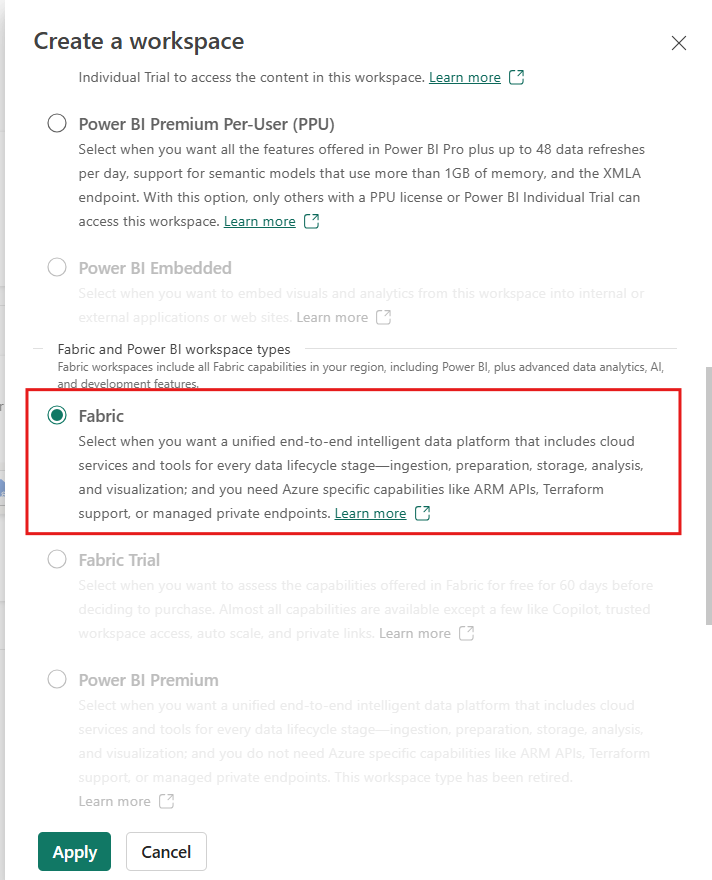

3.  在 **New lakehouse** 對話方塊的 **Name** 欄位中輸入 +++Fabric_lakehouse+++，然後按一下 **Create** 按鈕，開啟新的 Lakehouse。


**注意**：大約一分鐘後，就會建立新的空白 Lakehouse。您需要將一些資料擷取到 Lakehouse 中進行分析。

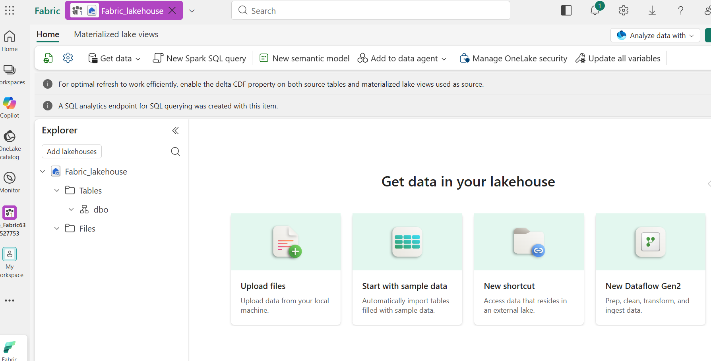

4.  您會看到 **Successfully created SQL endpoint** 的通知。

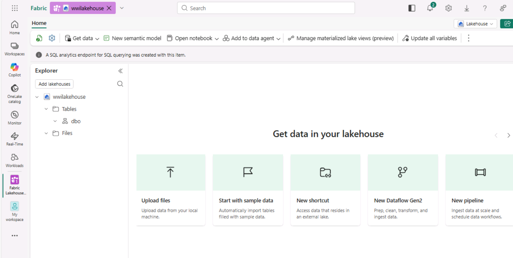

5.  在 **Explorer** 區段的 **Fabric_lakehouse** 下，將滑鼠游標停留在 **Files** 資料夾旁，然後按一下水平省略號 **(...)** 功能表。按一下 **Upload**，然後按一下 **Upload folder**。

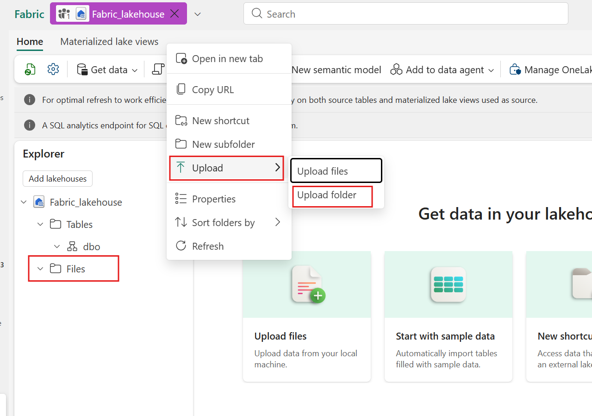

6.  在右側的 **Upload folder** 窗格中，選取 **Files/** 下的資料夾圖示，瀏覽至 **C:\LabFiles**，選取 **orders** 資料夾，然後按一下 **Upload** 按鈕。

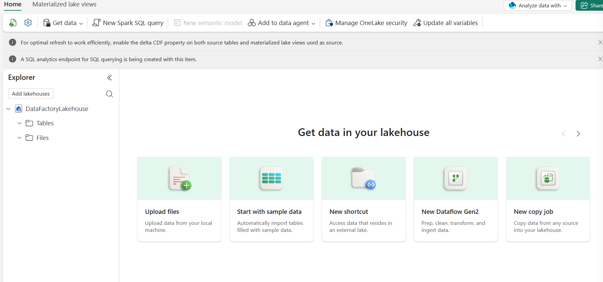

7.  如果出現 **Upload 3 files to this site?** 對話方塊，請按一下 **Upload** 按鈕。

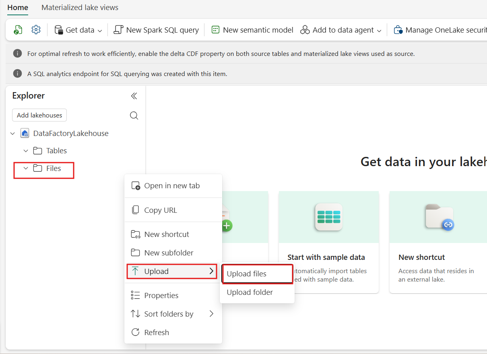

8.  在 **Upload folder** 窗格中，按一下 **Upload** 按鈕。

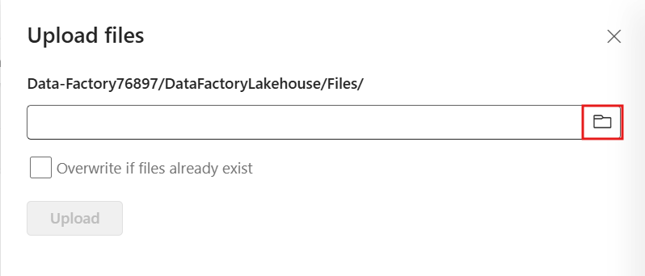

9.  檔案上傳完成後，關閉 **Upload folder** 窗格。

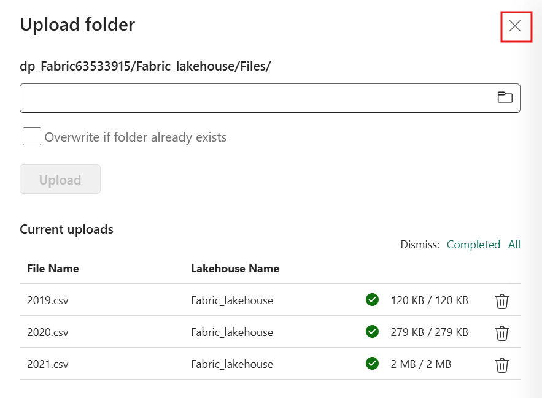

10. 展開 **Files**，選取 **orders** 資料夾，並確認 CSV 檔案已上傳。

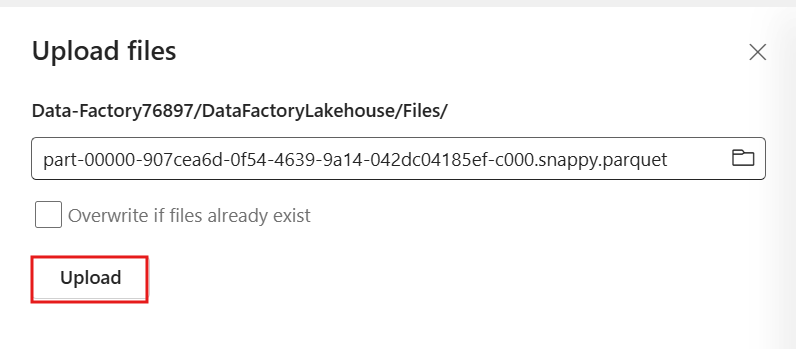

### 任務 3：建立 notebook

若要在 Apache Spark 中處理資料，您可以建立 *notebook*。Notebook 提供互動式環境，可讓您以多種語言撰寫和執行程式碼，並新增筆記來記錄程式碼。

1.  在 Lakehouse 的 **Home** 索引標籤上，選取 **Analyze data with** 下拉式功能表，指向 **Notebook**，然後選取 **New notebook**。

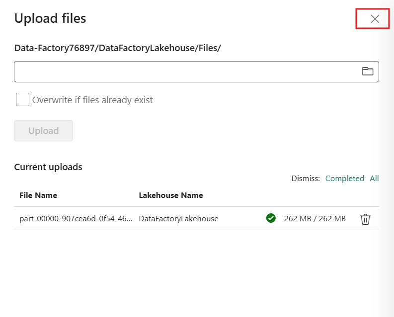

2.  幾秒鐘後，會開啟一個包含單一*儲存格*的新 notebook。Notebook 由一或多個儲存格組成，儲存格可以包含*程式碼*或 *Markdown*（格式化文字）。

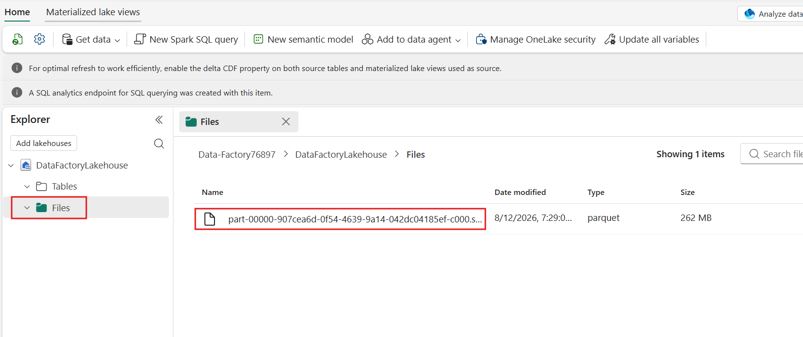

3.  選取第一個儲存格（目前是*程式碼*儲存格），然後在其右上角的動態工具列中，使用 **M↓** 按鈕將儲存格轉換為 **Markdown** 儲存格。

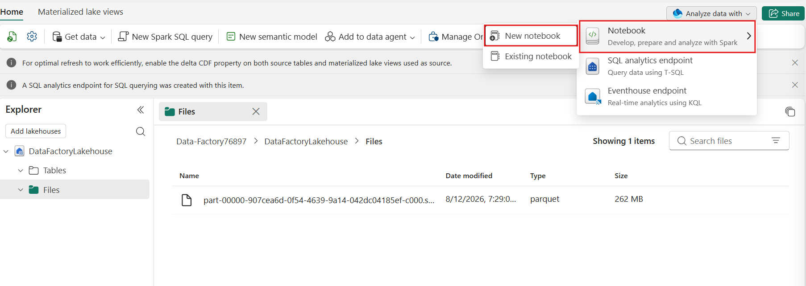

4.  儲存格變為 Markdown 儲存格後，其中的文字會轉譯顯示。

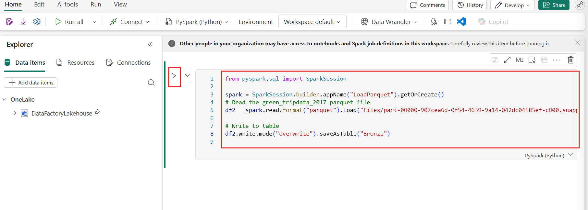

5.  使用 **🖉**（編輯）按鈕將儲存格切換為編輯模式，取代所有文字，並將 Markdown 修改如下：

```text
# Sales order data exploration

Use the code in this notebook to explore sales order data.
```

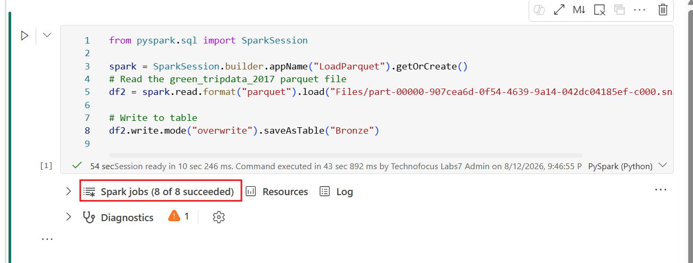

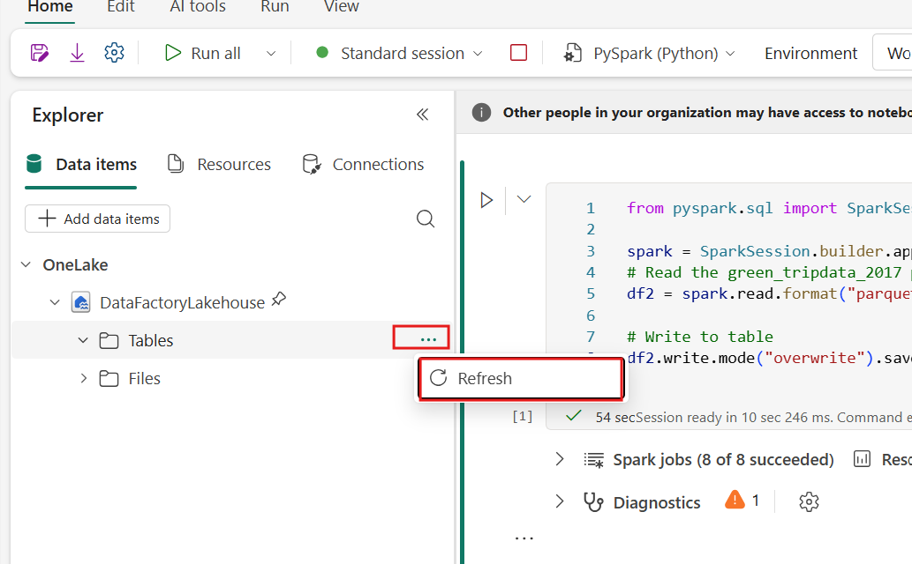

6.  按一下 notebook 中儲存格外的任意位置，停止編輯並檢視轉譯後的 Markdown。

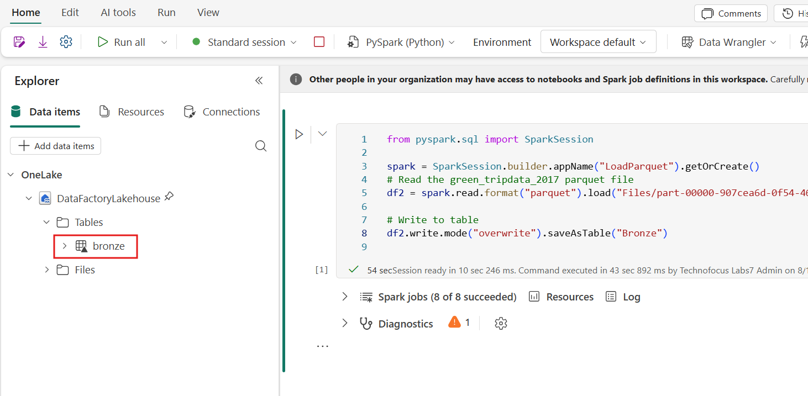

### 任務 4：將資料載入 DataFrame

現在您可以執行程式碼，將資料載入 *DataFrame*。Spark 中的 DataFrame 類似於 Python 中的 Pandas DataFrame，提供處理資料列和資料行的通用結構。

**注意**：Spark 支援多種程式語言，包括 Scala、Java 等。在本練習中，我們將使用 *PySpark*，這是 Spark 最佳化的 Python 版本。PySpark 是 Spark 最常用的語言之一，也是 Fabric notebook 的預設語言。

1.  Notebook 顯示後，展開 **Files** 清單並選取 **orders** 資料夾，讓 CSV 檔案顯示在 notebook 編輯器旁。

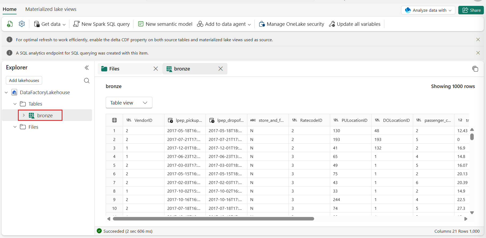

2.  將滑鼠游標停留在 **2019.csv** 檔案上，按一下旁邊的水平省略號 **(...)**，按一下 **Load data**，然後選取 **Spark**。Notebook 中會新增一個包含以下程式碼的程式碼儲存格：

```python
df = spark.read.format("csv").option("header","true").load("Files/orders/2019.csv")
# df now is a Spark DataFrame containing CSV data from "Files/orders/2019.csv".
display(df)
```

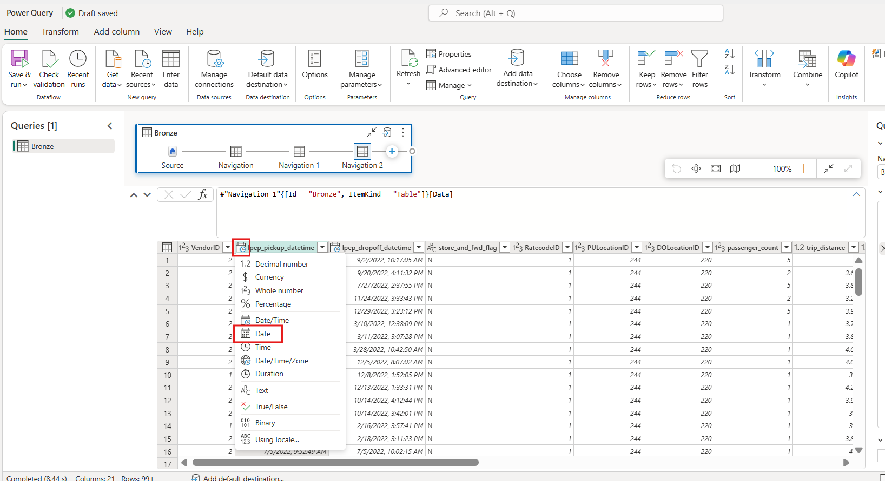

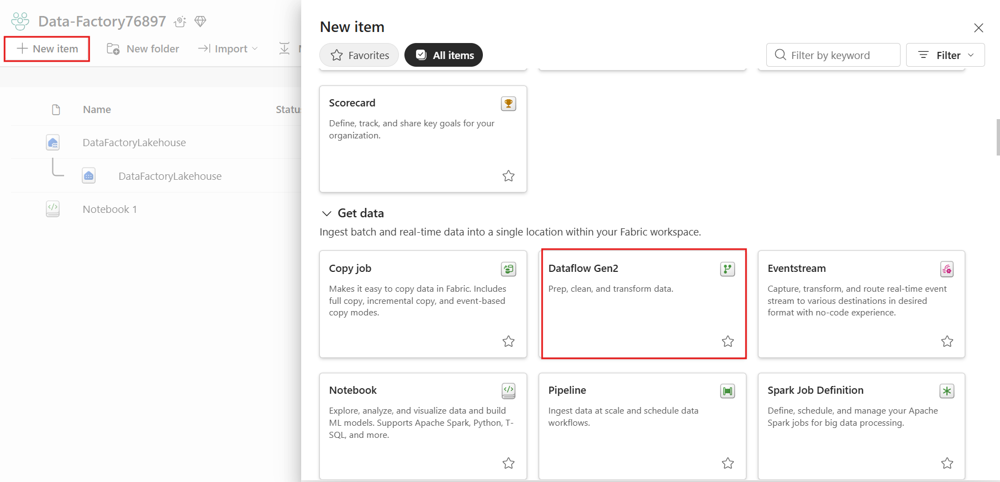

**提示**：您可以使用左側的 **«** 圖示隱藏 Lakehouse Explorer 窗格，以便專注於 notebook。

3.  使用儲存格左側的 **▷ Run cell** 按鈕執行儲存格。

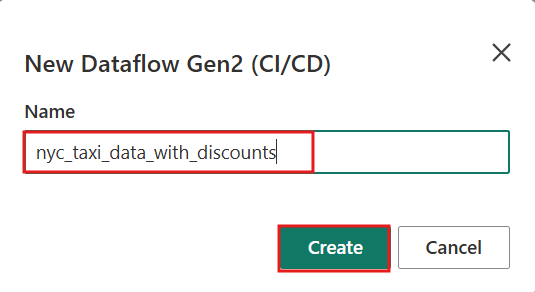

**注意**：由於這是您第一次執行 Spark 程式碼，系統必須先啟動 Spark 工作階段。因此，工作階段中的第一次執行可能需要約一分鐘才能完成，後續執行會比較快。

4.  儲存格命令完成後，檢閱儲存格下方的輸出，應該類似下圖：

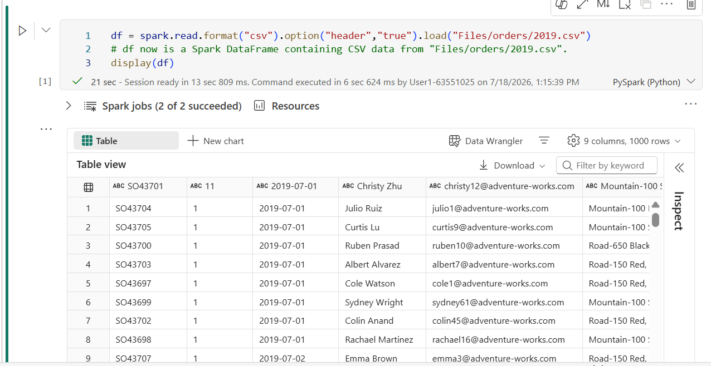

5.  輸出顯示 2019.csv 檔案中的資料列和資料行。不過，請注意資料行標題看起來不太正確。用於將資料載入 DataFrame 的預設程式碼假設 CSV 檔案的第一列包含資料行名稱，但在此案例中，CSV 檔案只包含資料，沒有任何標題資訊。

6.  修改程式碼，將 **header** 選項設定為 **false**。將儲存格中的所有程式碼取代為以下程式碼，按一下 **▷ Run cell** 按鈕，並檢閱輸出。

```python
df = spark.read.format("csv").option("header","false").load("Files/orders/2019.csv")
# df now is a Spark DataFrame containing CSV data from "Files/orders/2019.csv".
display(df)
```


7.  現在 DataFrame 已正確地將第一列包含為資料值，但資料行名稱是自動產生的，用處不大。若要理解資料，您需要明確定義檔案中資料值的正確結構描述和資料類型。

8.  將儲存格中的所有程式碼取代為以下程式碼，按一下 **▷ Run cell** 按鈕，並檢閱輸出。

```python
from pyspark.sql.types import *

orderSchema = StructType([
    StructField("SalesOrderNumber", StringType()),
    StructField("SalesOrderLineNumber", IntegerType()),
    StructField("OrderDate", DateType()),
    StructField("CustomerName", StringType()),
    StructField("Email", StringType()),
    StructField("Item", StringType()),
    StructField("Quantity", IntegerType()),
    StructField("UnitPrice", FloatType()),
    StructField("Tax", FloatType())
])

df = spark.read.format("csv").schema(orderSchema).load("Files/orders/2019.csv")
display(df)
```

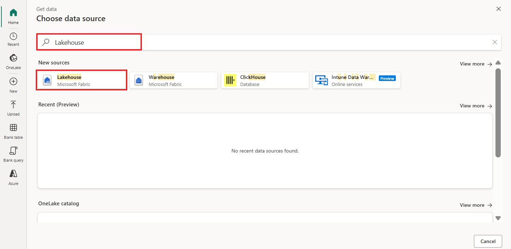

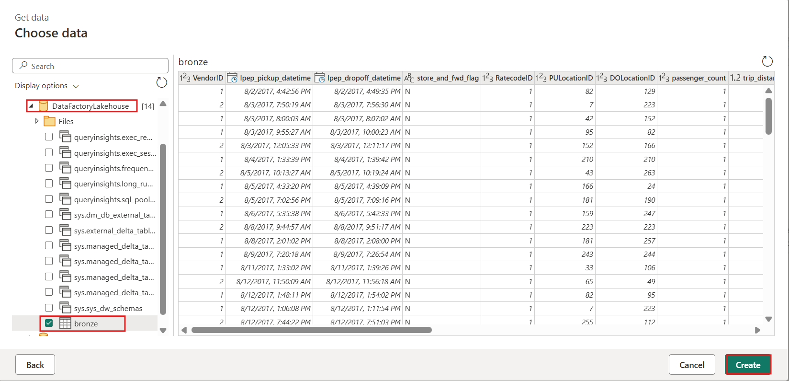

9.  現在，DataFrame 包含正確的資料行名稱。資料行的資料類型是使用 Spark SQL 程式庫中定義的標準類型集指定的，這些類型在儲存格開頭匯入。

10. 使用儲存格輸出下方的 **+ Code** 圖示，在 notebook 中新增程式碼儲存格，並輸入以下程式碼。按一下 **▷ Run cell** 按鈕，確認您的變更已套用到資料。

```python
display(df)
```

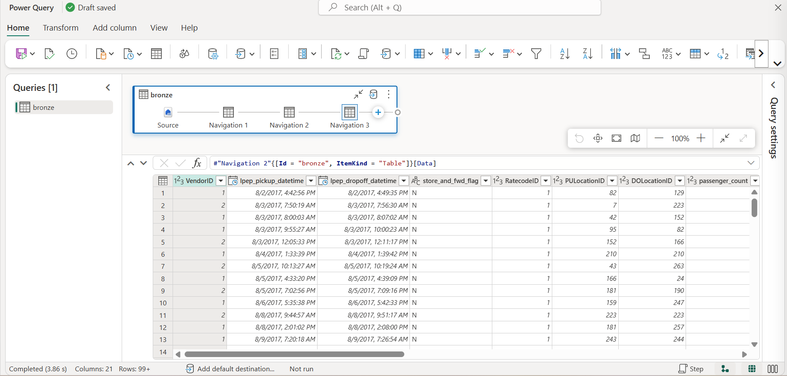

11. DataFrame 只包含 **2019.csv** 檔案中的資料。接下來，您將修改程式碼，讓檔案路徑使用 \* 萬用字元，從 **orders** 資料夾中的所有檔案讀取銷售訂單資料。

12. 使用儲存格輸出下方的 **+ Code** 圖示，在 notebook 中新增程式碼儲存格，並輸入以下程式碼。

```python
from pyspark.sql.types import *

orderSchema = StructType([
    StructField("SalesOrderNumber", StringType()),
    StructField("SalesOrderLineNumber", IntegerType()),
    StructField("OrderDate", DateType()),
    StructField("CustomerName", StringType()),
    StructField("Email", StringType()),
    StructField("Item", StringType()),
    StructField("Quantity", IntegerType()),
    StructField("UnitPrice", FloatType()),
    StructField("Tax", FloatType())
])

df = spark.read.format("csv").schema(orderSchema).load("Files/orders/*.csv")
display(df)
```

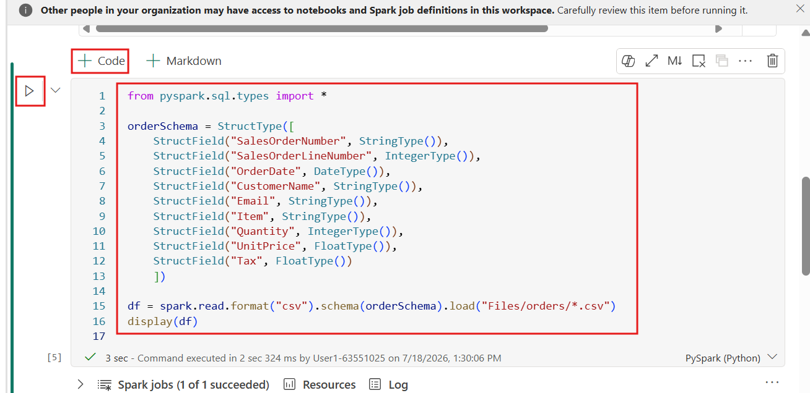

13. 執行修改後的程式碼儲存格並檢閱輸出，現在應該包含 2019、2020 和 2021 年的銷售資料。

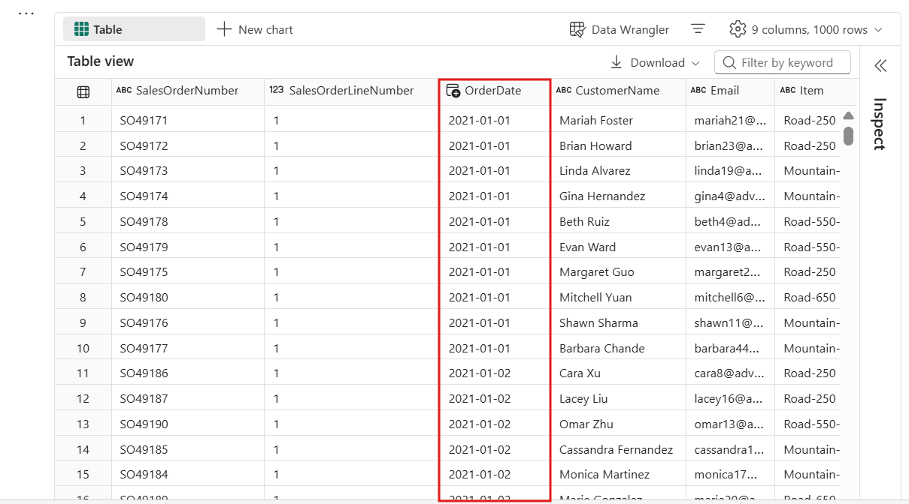

**注意**：輸出只會顯示部分資料列，因此您可能看不到所有年份的範例。

## 練習 2：探索 DataFrame 中的資料

DataFrame 物件包含多種函式，可用來篩選、分組和以其他方式操作其中的資料。

### 任務 1：篩選 DataFrame

1.  使用儲存格輸出下方的 **+ Code** 圖示，在 notebook 中新增程式碼儲存格，並輸入以下程式碼。

```python
customers = df['CustomerName', 'Email']
print(customers.count())
print(customers.distinct().count())
display(customers.distinct())
```

2.  **執行**新的程式碼儲存格，並檢閱結果。請注意以下細節：

- 當您對 DataFrame 執行作業時，結果會是新的 DataFrame（在此案例中，會從 **df** DataFrame 選取特定資料行子集，建立新的 **customers** DataFrame）。

- DataFrame 提供 **count** 和 **distinct** 等函式，可用來彙總和篩選其中的資料。

- `dataframe['Field1', 'Field2', ...]` 語法是定義資料行子集的簡寫方式。您也可以使用 **select** 方法，例如上述程式碼的第一行可以寫成 `customers = df.select("CustomerName", "Email")`。

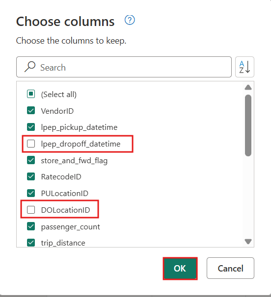

3.  將儲存格中的所有程式碼取代為以下程式碼，然後按一下 **▷ Run cell** 按鈕。

```python
customers = df.select("CustomerName", "Email").where(df['Item']=='Road-250 Red, 52')
print(customers.count())
print(customers.distinct().count())
display(customers.distinct())
```

4.  檢閱結果，查看購買 **Road-250 Red, 52** 產品的客戶。請注意，您可以「串連」多個函式，讓一個函式的輸出成為下一個函式的輸入。在此案例中，**select** 方法建立的 DataFrame 是套用篩選條件的 **where** 方法的來源 DataFrame。

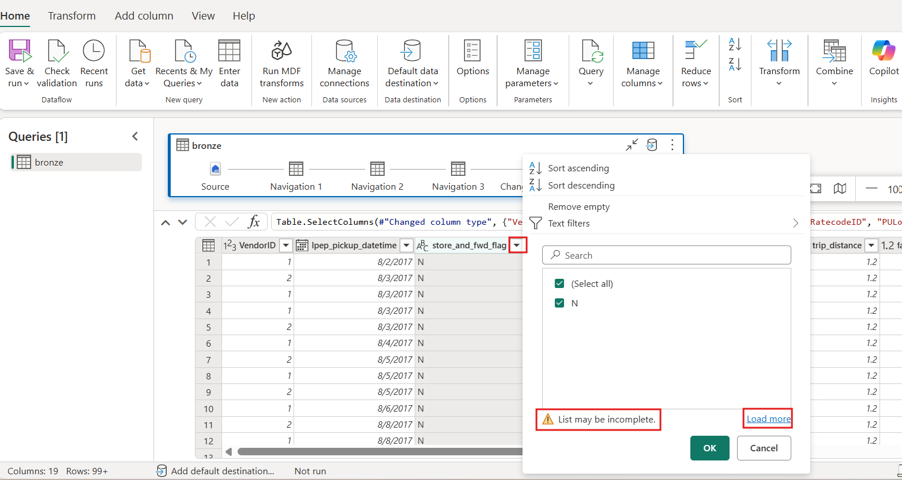

### 任務 2：在 DataFrame 中彙總和分組資料

1.  按一下 **+ Code**，複製並貼上以下程式碼，然後按一下 **Run cell** 按鈕。

```python
productSales = df.select("Item", "Quantity").groupBy("Item").sum()
display(productSales)
```


2.  請注意，結果會顯示依產品分組的訂購數量總和。**groupBy** 方法會依 *Item* 將資料列分組，後續的 **sum** 彙總函式會套用到所有剩餘的數值資料行（在此案例中為 *Quantity*）。

3.  按一下 **+ Code**，複製並貼上以下程式碼，然後按一下 **Run cell** 按鈕。

```python
from pyspark.sql.functions import *

yearlySales = df.select(year("OrderDate").alias("Year")).groupBy("Year").count().orderBy("Year")
display(yearlySales)
```

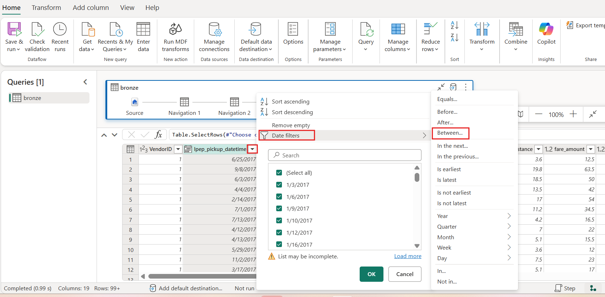

4.  請注意，結果會顯示每年的銷售訂單數量。**select** 方法包含 SQL **year** 函式，用來擷取 *OrderDate* 欄位的年份部分（這也是程式碼包含 **import** 陳述式以從 Spark SQL 程式庫匯入函式的原因）。接著使用 **alias** 方法為擷取的年份值指定資料行名稱，然後依衍生的 *Year* 資料行將資料分組並計算每組的資料列數，最後使用 **orderBy** 方法排序結果 DataFrame。

## 練習 3：使用 Spark 轉換資料檔案

資料工程師的常見工作之一，是擷取特定格式或結構的資料，並將其轉換以供後續處理或分析。

### 任務 1：使用 DataFrame 方法和函式轉換資料

1.  按一下 **+ Code**，複製並貼上以下程式碼。

```python
from pyspark.sql.functions import *

## Create Year and Month columns
transformed_df = df.withColumn("Year", year(col("OrderDate"))).withColumn("Month", month(col("OrderDate")))

# Create the new FirstName and LastName fields
transformed_df = transformed_df.withColumn("FirstName", split(col("CustomerName"), " ").getItem(0)).withColumn("LastName", split(col("CustomerName"), " ").getItem(1))

# Filter and reorder columns
transformed_df = transformed_df["SalesOrderNumber", "SalesOrderLineNumber", "OrderDate", "Year", "Month", "FirstName", "LastName", "Email", "Item", "Quantity", "UnitPrice", "Tax"]

# Display the first five orders
display(transformed_df.limit(5))
```

2.  **執行**程式碼，透過以下轉換從原始訂單資料建立新的 DataFrame：

- 根據 **OrderDate** 資料行新增 **Year** 和 **Month** 資料行。

- 根據 **CustomerName** 資料行新增 **FirstName** 和 **LastName** 資料行。

- 篩選並重新排序資料行，移除 **CustomerName** 資料行。

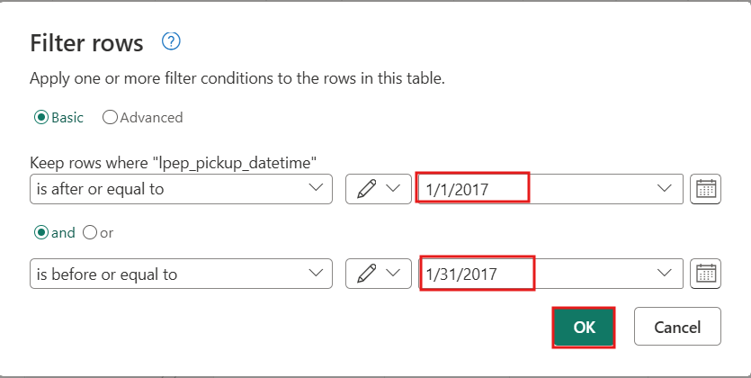

3.  檢閱輸出，並確認已對資料進行轉換。

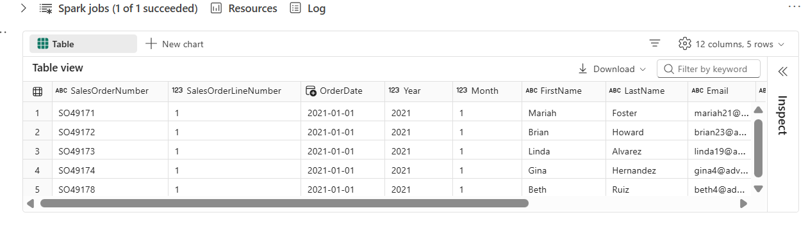

您可以運用 Spark SQL 程式庫的完整功能，透過篩選資料列、衍生、移除、重新命名資料行，以及套用其他必要的資料修改來轉換資料。

**提示**：請參閱 [*Spark DataFrame 文件*](https://spark.apache.org/docs/latest/api/python/reference/pyspark.sql/dataframe.html)，深入了解 DataFrame 物件的方法。

### 任務 2：儲存轉換後的資料

1.  新增一個包含以下程式碼的儲存格，將轉換後的 DataFrame 儲存為 Parquet 格式（如果已有資料則覆寫）。**執行**儲存格，並等待資料已儲存的訊息出現。

```python
transformed_df.write.mode("overwrite").parquet('Files/transformed_data/orders')
print ("Transformed data saved!")
```

**注意**：一般而言，*Parquet* 格式較適合用於進一步分析或擷取到分析存放區的資料檔案。Parquet 是非常有效率的格式，大多數大型資料分析系統都支援它。事實上，有時您的資料轉換需求可能只是將其他格式（例如 CSV）的資料轉換為 Parquet！

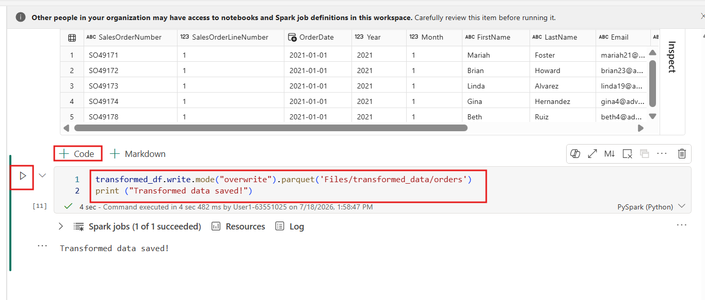

2.  在左側的 **Lakehouse explorer** 窗格中，選取 **Files** 節點的 **...** 功能表，然後選取 **Refresh**。


3.  按一下 **transformed_data** 資料夾，確認其中包含名為 **orders** 的新資料夾，而該資料夾包含一或多個 **Parquet** 檔案。


4.  按一下 **+ Code**，輸入以下程式碼，從 **transformed_data -\> orders** 資料夾中的 Parquet 檔案載入新的 DataFrame：

```python
orders_df = spark.read.format("parquet").load("Files/transformed_data/orders")
display(orders_df)
```

5.  **執行**儲存格，確認結果顯示從 Parquet 檔案載入的訂單資料。

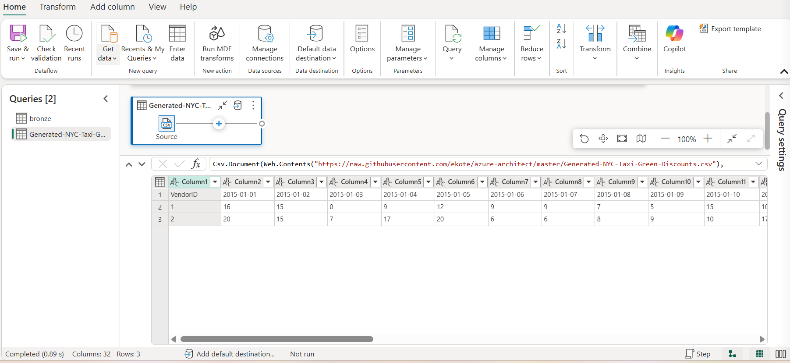

### 任務 3：將資料儲存為分割檔案

1.  按一下 **+ Code** 新增儲存格，並輸入以下程式碼。此程式碼會儲存 DataFrame，並依 **Year** 和 **Month** 分割資料。**執行**儲存格，並等待資料已儲存的訊息出現。

```python
orders_df.write.partitionBy("Year","Month").mode("overwrite").parquet("Files/partitioned_data")
print ("Transformed data saved!")
```

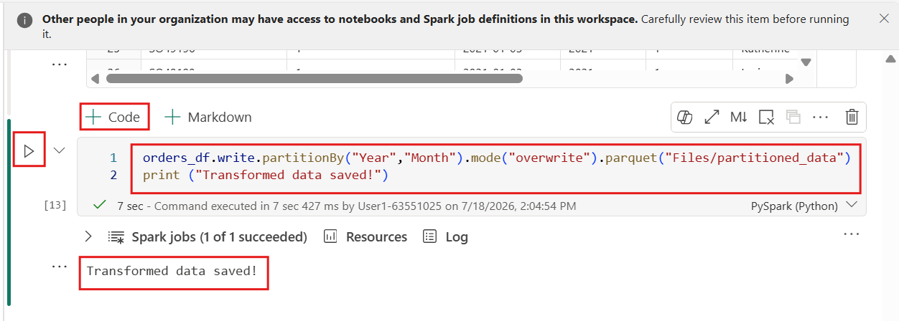

2.  在左側的 **Lakehouse explorer** 窗格中，選取 **Files** 節點的 **...** 功能表，然後選取 **Refresh**。


3.  展開 **partitioned_data** 資料夾，確認其中包含名為 **Year=xxxx** 的資料夾階層，且每個資料夾都包含名為 **Month=xxxx** 的資料夾。每個月份資料夾都包含一個 Parquet 檔案，其中有該月的訂單。

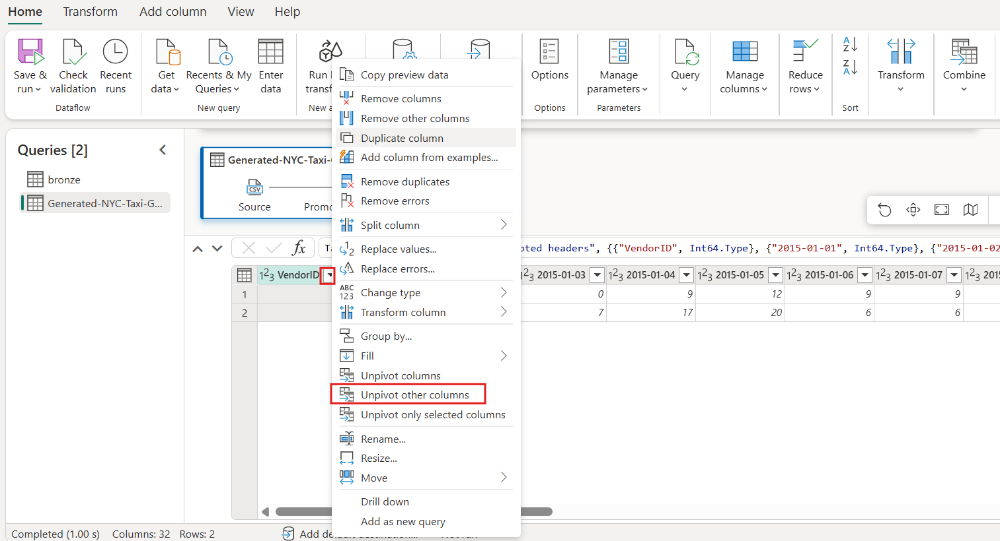

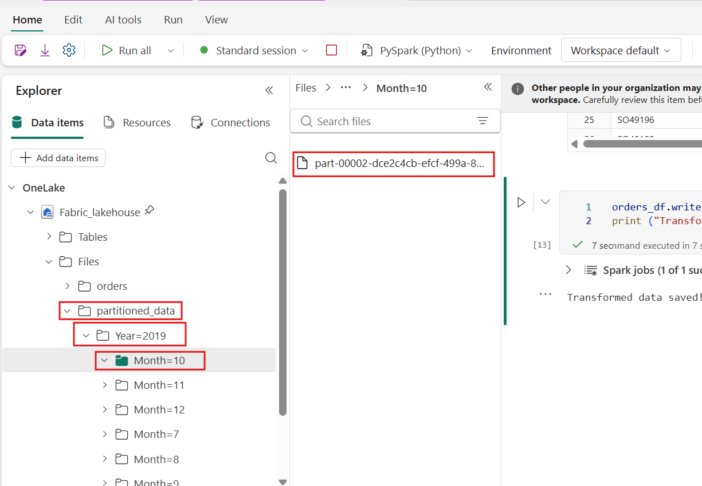

分割資料檔案是處理大量資料時最佳化效能的常見方法。這種方法可以大幅提升效能，並讓篩選資料更容易。

4.  按一下 **+ Code** 新增儲存格，並輸入以下程式碼，從分割資料中載入 2021 年的訂單到新的 DataFrame：

```python
orders_2021_df = spark.read.format("parquet").load("Files/partitioned_data/Year=2021/Month=*")
display(orders_2021_df)
```

5.  **執行**儲存格，確認結果顯示 2021 年的訂單資料。請注意，路徑中指定的分割資料行（**Year** 和 **Month**）並未包含在 DataFrame 中。


## 練習 4：使用資料表和 SQL

如您所見，DataFrame 物件的原生方法可讓您非常有效地查詢和分析檔案中的資料。不過，許多資料分析師較習慣使用可以透過 SQL 語法查詢的資料表。Spark 提供 *metastore*，可讓您在其中定義關聯式資料表。提供 DataFrame 物件的 Spark SQL 程式庫也支援使用 SQL 陳述式查詢 metastore 中的資料表。運用 Spark 的這些功能，您可以將 Data Lake 的彈性與關聯式資料倉儲的結構化資料結構描述和 SQL 查詢結合起來，這就是「Data Lakehouse」一詞的由來。

### 任務 1：建立受控資料表

Spark metastore 中的資料表是 Data Lake 中檔案的關聯式抽象層。資料表可以是*受控*（檔案由 metastore 管理）或*外部*（資料表參考 Data Lake 中獨立於 metastore 管理的檔案位置）。

1.  按一下 notebook 中的 **+ Code** 新增程式碼儲存格，並輸入以下程式碼，將銷售訂單資料的 DataFrame 儲存為名為 **salesorders** 的資料表：

```python
# Create a new table
df.write.format("delta").saveAsTable("salesorders")

# Get the table description
spark.sql("DESCRIBE EXTENDED salesorders").show(truncate=False)
```

**注意**：此範例有幾點值得注意。首先，沒有提供明確的路徑，因此資料表的檔案會由 metastore 管理。其次，資料表以 **delta** 格式儲存。您可以根據多種檔案格式（包括 CSV、Parquet、Avro 等）建立資料表，但 *Delta Lake* 是一種 Spark 技術，可為資料表加入關聯式資料庫功能，包括交易、資料列版本控制和其他實用功能的支援。在 Fabric 中，建立 Data Lakehouse 時建議使用 delta 格式的資料表。

2.  **執行**程式碼儲存格，並檢閱描述新資料表定義的輸出。


3.  在 **Lakehouse explorer** 窗格中，選取 **Tables** 資料夾的 **...** 功能表，然後選取 **Refresh**。


4.  展開 **Tables** 節點，確認已在 **dbo** 結構描述下建立 **salesorders** 資料表。

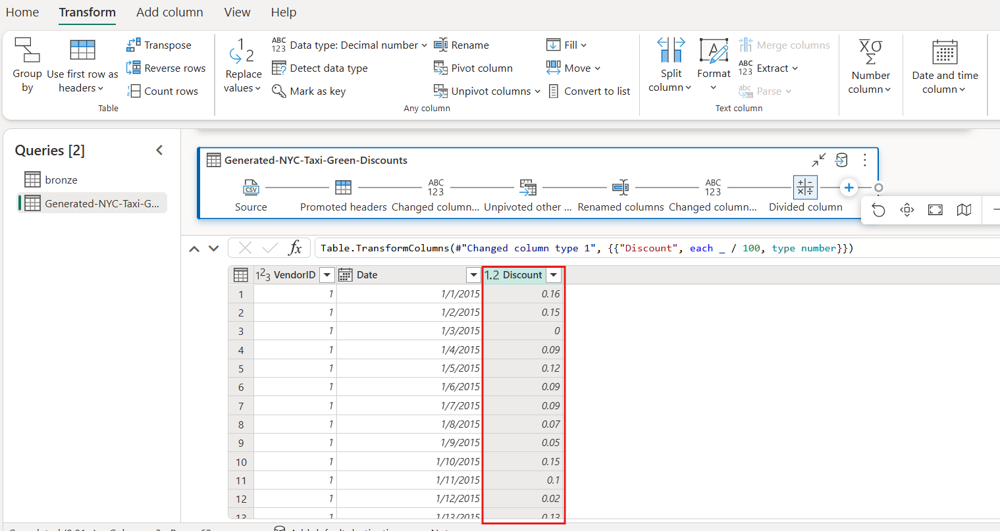

5.  將滑鼠游標停留在 **salesorders** 資料表旁，按一下水平省略號 **(...)**，按一下 **Load data**，然後選取 **Spark**。

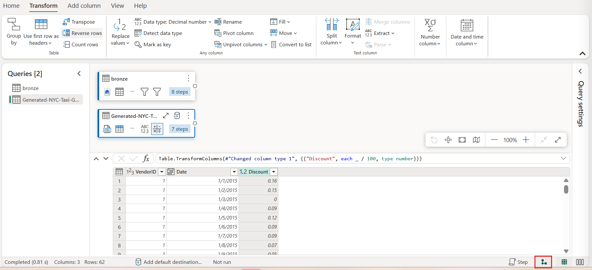

6.  Notebook 中會新增一個程式碼儲存格，它使用 Spark SQL 程式庫，在 PySpark 程式碼中內嵌針對 **salesorders** 資料表的 SQL 查詢，並將查詢結果載入 DataFrame。產生的程式碼類似以下內容。按一下 **▷ Run cell** 按鈕執行它。

```python
df = spark.sql("SELECT * FROM Fabric_lakehouse.dbo.salesorders LIMIT 1000")
display(df)
```

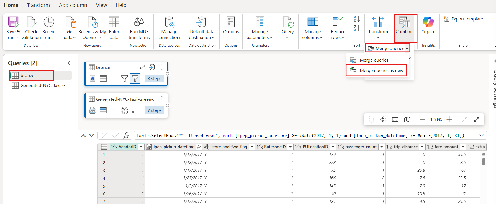

### 任務 2：建立外部資料表

您也可以建立*外部*資料表，其結構描述中繼資料定義在 Lakehouse 的 metastore 中，但資料檔案儲存在外部位置。

1.  在第一個程式碼儲存格傳回的結果下方，如果沒有新的程式碼儲存格，請使用 **+ Code** 按鈕新增程式碼儲存格，然後輸入以下程式碼。

```python
df.write.format("delta").saveAsTable("external_salesorder", path="<abfs_path>/external_salesorder")
```

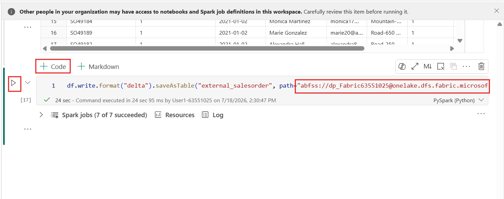

2.  在 **Lakehouse explorer** 窗格中，選取 **Files** 資料夾的 **...** 功能表，然後選取 **Copy ABFS path**，並將路徑貼到記事本中。

ABFS 路徑是您 Lakehouse 的 OneLake 儲存體中 **Files** 資料夾的完整路徑，類似於：

```text
abfss://dp_Fabric<lab instance ID>@onelake.dfs.fabric.microsoft.com/Fabric_lakehouse.Lakehouse/Files
```

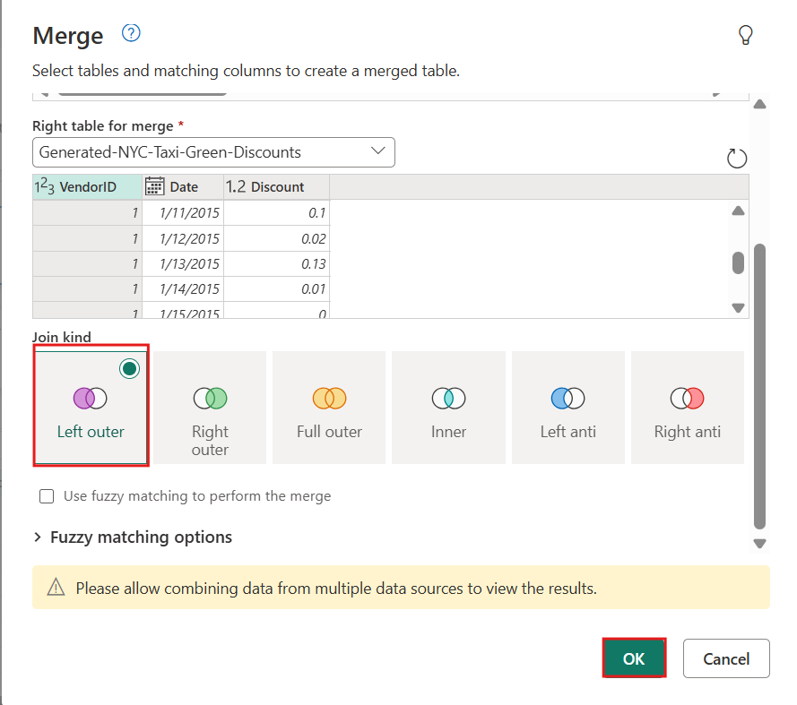

3.  回到程式碼儲存格，將 **\<abfs_path\>** 取代為您複製到記事本的路徑，讓程式碼將 DataFrame 儲存為外部資料表，並將資料檔案存放在 **Files** 資料夾中名為 **external_salesorder** 的資料夾內。完整路徑應類似於：

```text
abfss://dp_Fabric<lab instance ID>@onelake.dfs.fabric.microsoft.com/Fabric_lakehouse.Lakehouse/Files/external_salesorder
```

4.  使用儲存格左側的 **▷ (Run cell)** 按鈕執行儲存格。

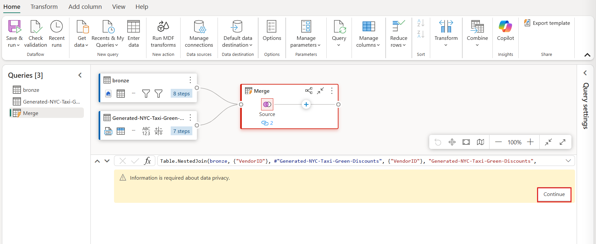

5.  在 **Lakehouse explorer** 窗格中，選取 **Tables** 資料夾的 **...** 功能表，然後選取 **Refresh**。

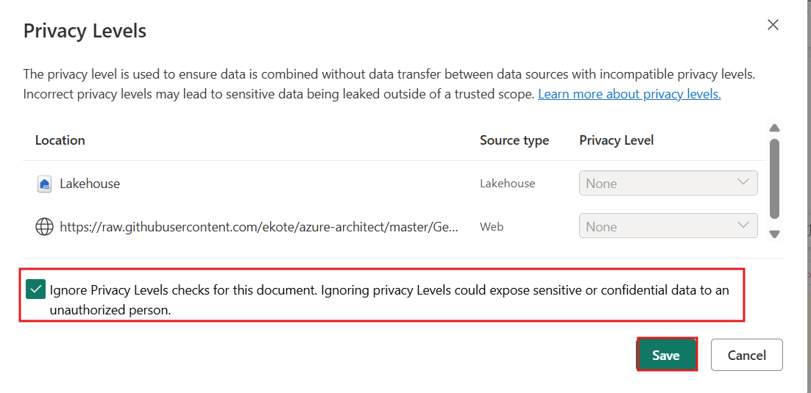

6.  展開 **Tables** 節點，確認已建立 **external_salesorder** 資料表。

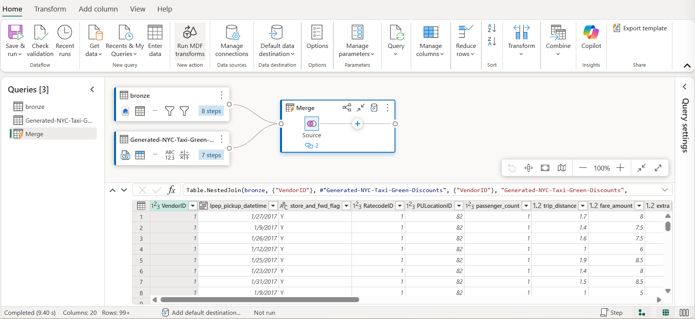

7.  在 **Lakehouse explorer** 窗格中，選取 **Files** 資料夾的 **...** 功能表，然後選取 **Refresh**。


8.  展開 **Files** 節點，確認已為資料表的資料檔案建立 **external_salesorder** 資料夾。

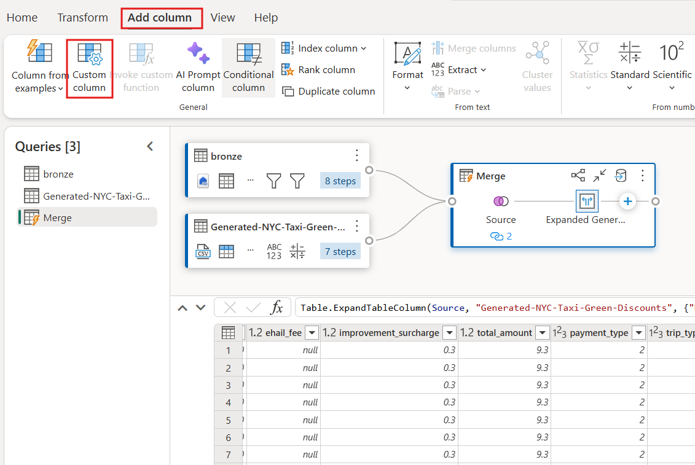

### 任務 3：比較受控資料表和外部資料表

讓我們來探討受控資料表和外部資料表之間的差異。

1.  在程式碼儲存格傳回的結果下方，使用 **+ Code** 按鈕新增程式碼儲存格。將以下程式碼複製到程式碼儲存格，然後使用儲存格左側的 **▷ (Run cell)** 按鈕執行它。

```sql
%%sql

DESCRIBE FORMATTED salesorders;
```

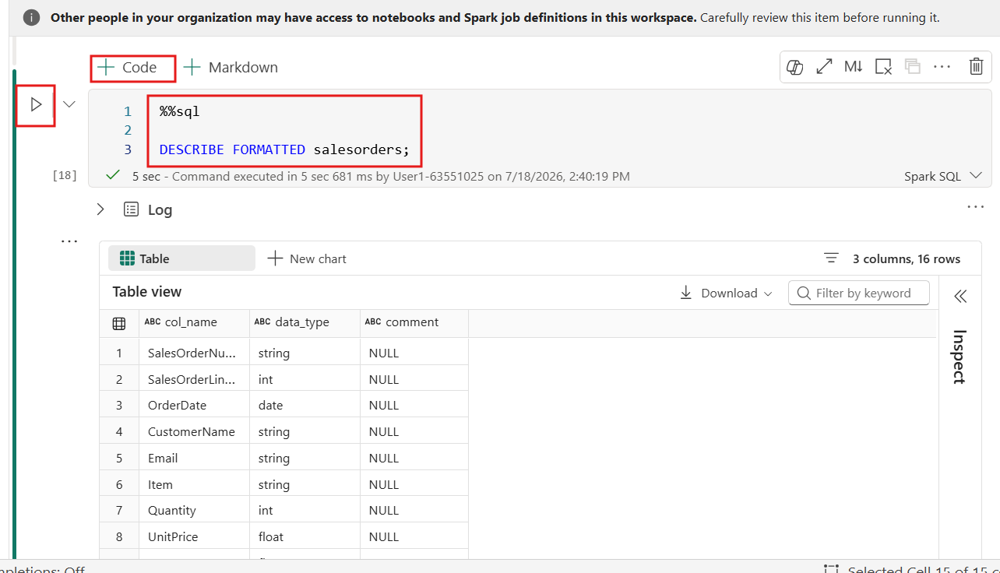

2.  在結果中，檢視資料表的 **Location** 屬性，它應該是 Lakehouse OneLake 儲存體的路徑，結尾為 **/Tables/salesorders**（您可能需要加寬 **Data type** 資料行才能看到完整路徑）。

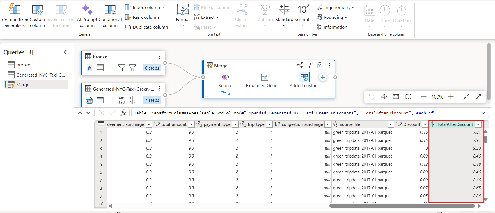

3.  接下來，修改 **DESCRIBE** 命令以顯示 **external_salesorder** 資料表的詳細資料。在程式碼儲存格傳回的結果下方，使用 **+ Code** 按鈕新增程式碼儲存格，複製以下程式碼，然後使用儲存格左側的 **▷ (Run cell)** 按鈕執行它。

```sql
%%sql

DESCRIBE FORMATTED external_salesorder;
```

4.  在結果中，檢視資料表的 **Location** 屬性，它應該是 Lakehouse OneLake 儲存體的路徑，結尾為 **/Files/external_salesorder**（您可能需要加寬 **Data type** 資料行才能看到完整路徑）。

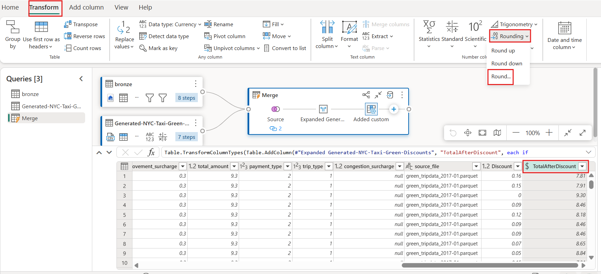

### 任務 4：在儲存格中執行 SQL 程式碼

雖然能在包含 PySpark 程式碼的儲存格中內嵌 SQL 陳述式很實用，但資料分析師通常只想直接使用 SQL。

1.  按一下 notebook 中的 **+ Code** 新增儲存格，並輸入以下程式碼。按一下 **▷ Run cell** 按鈕並檢閱結果。請注意：

- 儲存格開頭的 `%%sql` 行（稱為 *magic*）表示應使用 Spark SQL 語言執行階段來執行此儲存格中的程式碼，而不是 PySpark。

- SQL 程式碼參考您先前建立的 **salesorders** 資料表。

- SQL 查詢的輸出會自動顯示為儲存格下方的結果。

```sql
%%sql
SELECT YEAR(OrderDate) AS OrderYear,
       SUM((UnitPrice * Quantity) + Tax) AS GrossRevenue
FROM salesorders
GROUP BY YEAR(OrderDate)
ORDER BY OrderYear;
```

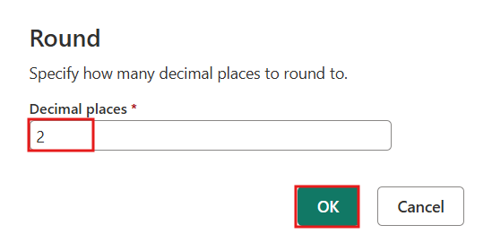

**注意**：如需 Spark SQL 和 DataFrame 的詳細資訊，請參閱 [*Spark SQL 文件*](https://spark.apache.org/docs/2.2.0/sql-programming-guide.html)。

## 練習 5：使用 Spark 視覺化資料

俗話說，一張圖勝過千言萬語，而圖表往往比上千列資料更有說服力。雖然 Fabric 中的 notebook 內建了 DataFrame 或 Spark SQL 查詢資料的圖表檢視，但它並非為完整的圖表製作而設計。不過，您可以使用 **matplotlib** 和 **seaborn** 等 Python 圖形程式庫，從 DataFrame 中的資料建立圖表。

### 任務 1：以圖表檢視結果

1.  按一下 notebook 中的 **+ Code** 新增儲存格，並輸入以下程式碼。按一下 **▷ Run cell** 按鈕，並觀察它會傳回您先前建立的 **salesorders** 資料表中的資料。

```sql
%%sql
SELECT * FROM salesorders
```

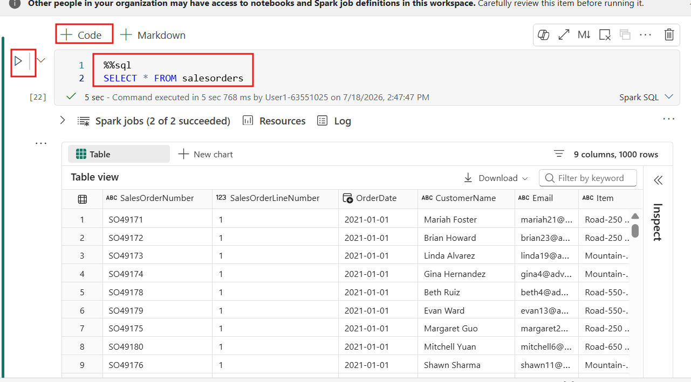

2.  在儲存格下方的結果區段中，將 **View** 選項從 **Table** 變更為 **+ New chart**。

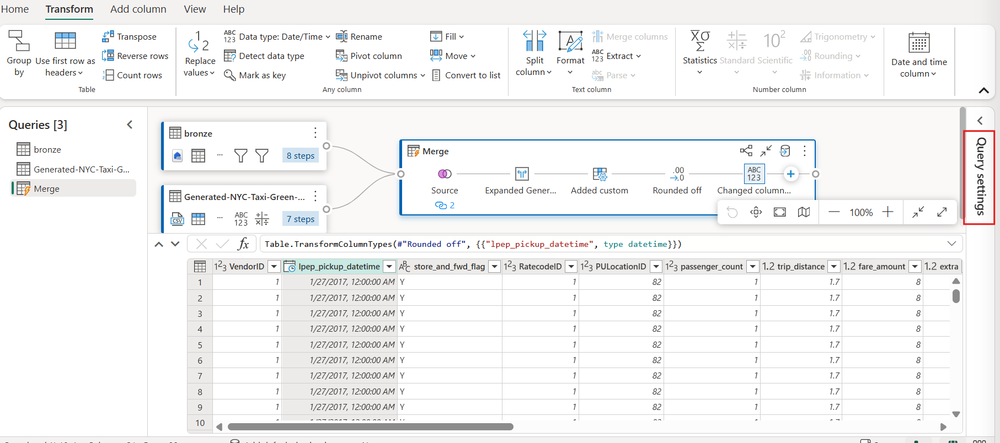

3.  使用圖表右上角的 **Start editing** 按鈕顯示圖表的選項窗格，然後依下列方式設定選項，並選取 **Apply**：

| **選項** | **值** |
|----|----|
| **Chart type** | **Bar chart** |
| **X-axis** | **Item** |
| **Y-axis** | **Quantity** |
| **Series Group** | **–None–** |
| **Aggregation** | **Sum** |
| **Missing and NULL values** | **Display as 0** |
| **Stacked** | 不勾選 |

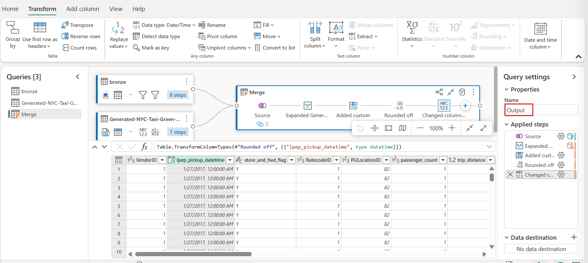

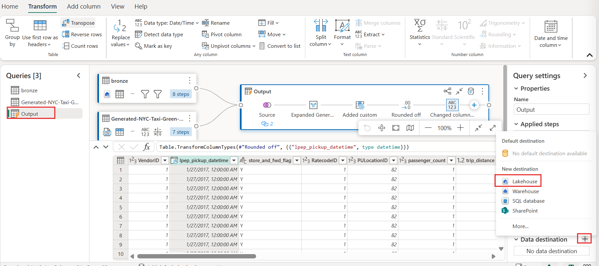


4.  確認圖表看起來與下圖類似。


### 任務 2：開始使用 matplotlib

1.  按一下 **+ Code**，複製並貼上以下程式碼。**執行**程式碼，並觀察它會傳回包含年度營收的 Spark DataFrame。

```python
sqlQuery = "SELECT CAST(YEAR(OrderDate) AS CHAR(4)) AS OrderYear, \
                SUM((UnitPrice * Quantity) + Tax) AS GrossRevenue \
            FROM salesorders \
            GROUP BY CAST(YEAR(OrderDate) AS CHAR(4)) \
            ORDER BY OrderYear"
df_spark = spark.sql(sqlQuery)
df_spark.show()
```

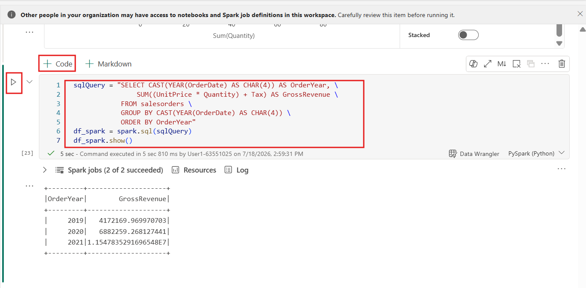

2.  若要以圖表視覺化資料，我們會先使用 **matplotlib** Python 程式庫。此程式庫是許多其他繪圖程式庫的基礎，可提供極大的圖表製作彈性。

3.  按一下 **+ Code**，複製並貼上以下程式碼。

```python
from matplotlib import pyplot as plt

# matplotlib requires a Pandas dataframe, not a Spark one
df_sales = df_spark.toPandas()

# Create a bar plot of revenue by year
plt.bar(x=df_sales['OrderYear'], height=df_sales['GrossRevenue'])

# Display the plot
plt.show()
```

4.  按一下 **Run cell** 按鈕並檢閱結果，結果包含顯示每年總營收的直條圖。請注意用於產生此圖表的程式碼具有以下特點：

- **matplotlib** 程式庫需要 *Pandas* DataFrame，因此您需要將 Spark SQL 查詢傳回的 *Spark* DataFrame 轉換為此格式。

- **matplotlib** 程式庫的核心是 **pyplot** 物件，這是大多數繪圖功能的基礎。

- 預設設定就能產生可用的圖表，但有很大的自訂空間。

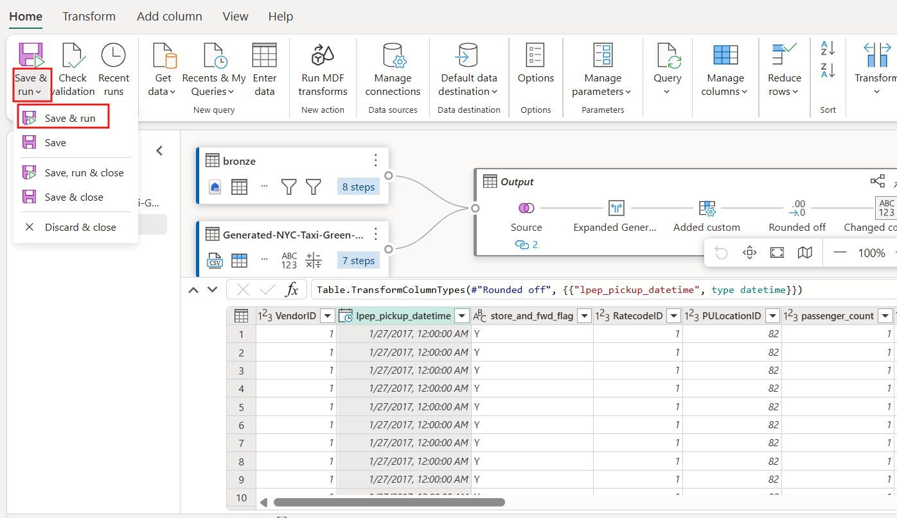

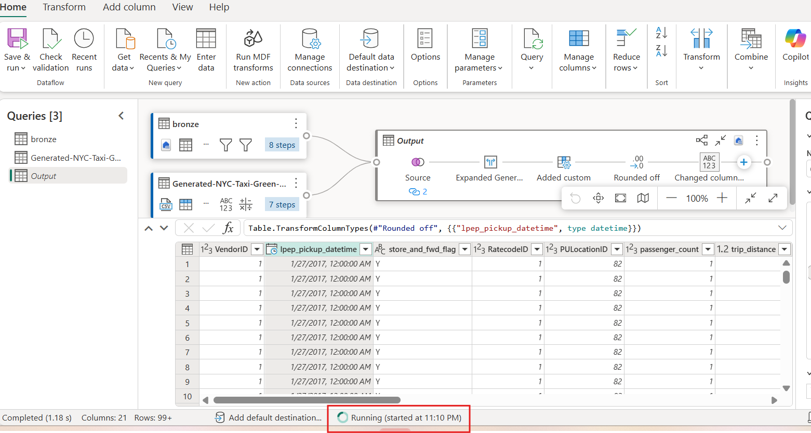

5.  修改程式碼以繪製如下的圖表：將儲存格中的所有程式碼取代為以下程式碼，按一下 **▷ Run cell** 按鈕，並檢閱輸出。

```python
from matplotlib import pyplot as plt

# Clear the plot area
plt.clf()

# Create a bar plot of revenue by year
plt.bar(x=df_sales['OrderYear'], height=df_sales['GrossRevenue'], color='orange')

# Customize the chart
plt.title('Revenue by Year')
plt.xlabel('Year')
plt.ylabel('Revenue')
plt.grid(color='#95a5a6', linestyle='--', linewidth=2, axis='y', alpha=0.7)
plt.xticks(rotation=45)

# Show the figure
plt.show()
```

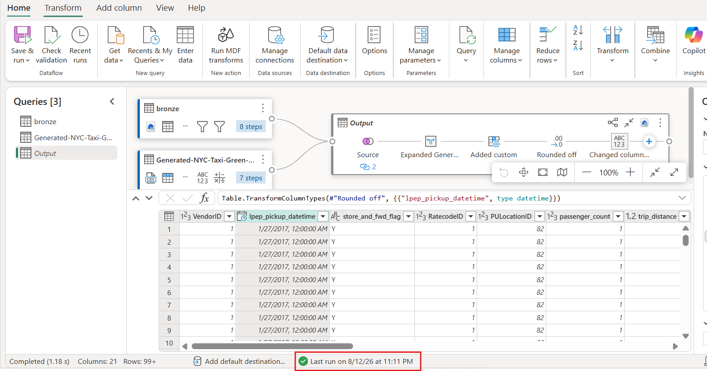

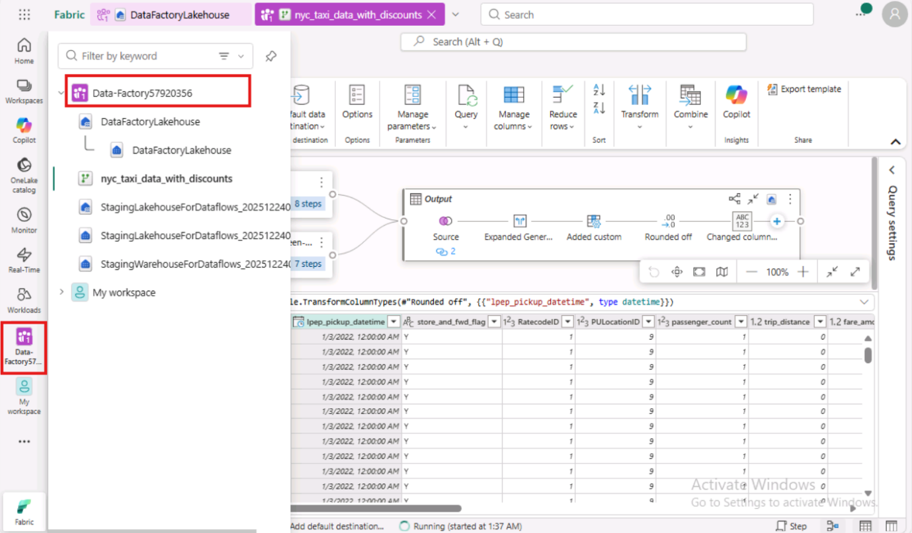

6.  圖表現在包含更多資訊。嚴格來說，繪圖是包含在**圖形 (Figure)** 中的。在先前的範例中，圖形是自動為您建立的，但您也可以明確建立它。

7.  修改程式碼以繪製如下的圖表：將儲存格中的所有程式碼取代為以下程式碼。

```python
from matplotlib import pyplot as plt

# Clear the plot area
plt.clf()

# Create a Figure
fig = plt.figure(figsize=(8,3))

# Create a bar plot of revenue by year
plt.bar(x=df_sales['OrderYear'], height=df_sales['GrossRevenue'], color='orange')

# Customize the chart
plt.title('Revenue by Year')
plt.xlabel('Year')
plt.ylabel('Revenue')
plt.grid(color='#95a5a6', linestyle='--', linewidth=2, axis='y', alpha=0.7)
plt.xticks(rotation=45)

# Show the figure
plt.show()
```

8.  **重新執行**程式碼儲存格並檢閱結果。圖形決定了繪圖的形狀和大小。一個圖形可以包含多個子圖，每個子圖都有自己的*座標軸*。

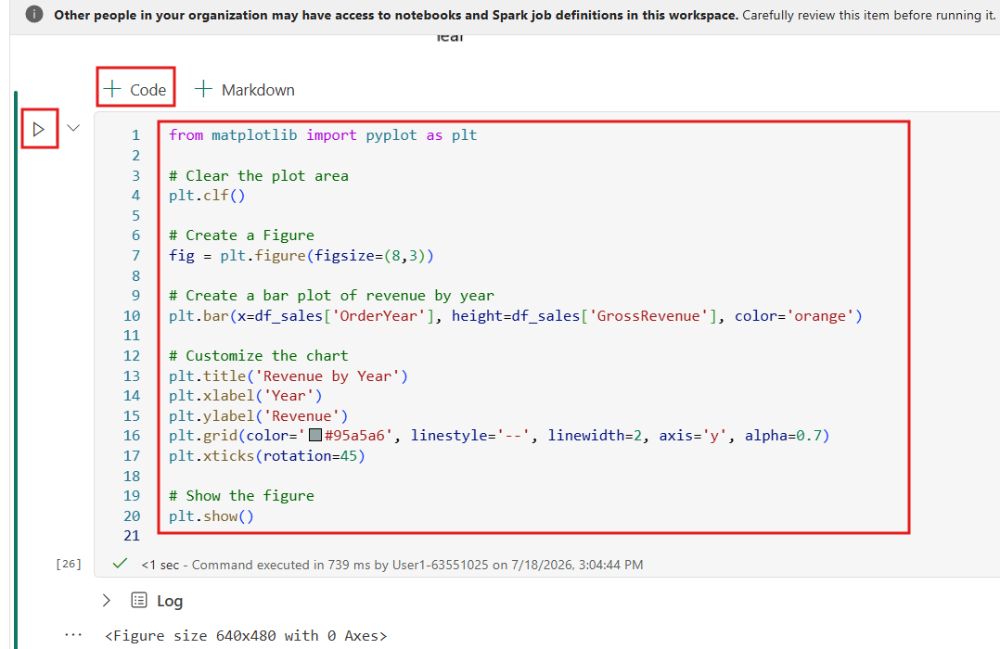


9.  修改程式碼以繪製如下的圖表。**重新執行**程式碼儲存格並檢閱結果。圖形包含程式碼中指定的子圖。

```python
from matplotlib import pyplot as plt

# Clear the plot area
plt.clf()

# Create a figure for 2 subplots (1 row, 2 columns)
fig, ax = plt.subplots(1, 2, figsize = (10,4))

# Create a bar plot of revenue by year on the first axis
ax[0].bar(x=df_sales['OrderYear'], height=df_sales['GrossRevenue'], color='orange')
ax[0].set_title('Revenue by Year')

# Create a pie chart of yearly order counts on the second axis
yearly_counts = df_sales['OrderYear'].value_counts()
ax[1].pie(yearly_counts)
ax[1].set_title('Orders per Year')
ax[1].legend(yearly_counts.keys().tolist())

# Add a title to the Figure
fig.suptitle('Sales Data')

# Show the figure
plt.show()
```

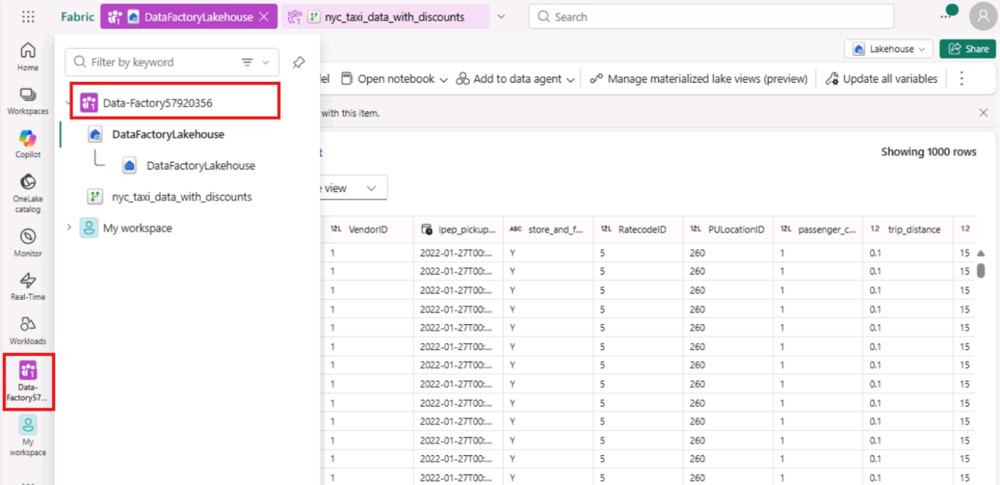

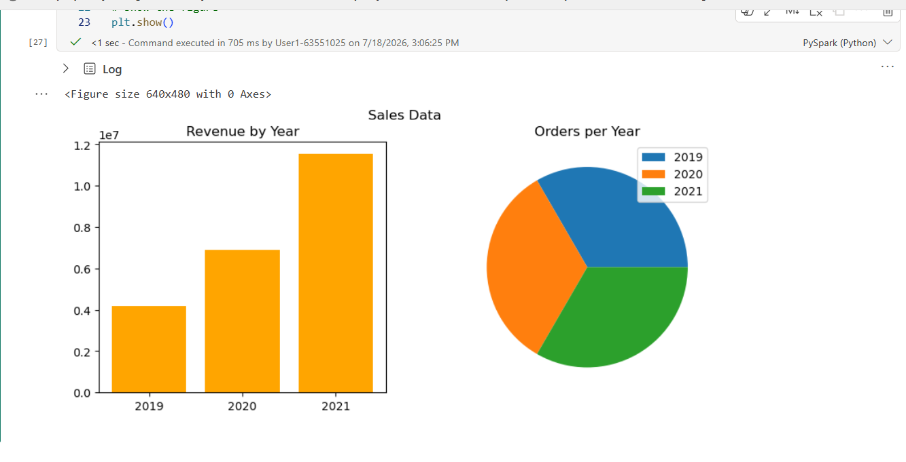

**注意**：若要深入了解如何使用 matplotlib 繪圖，請參閱 [*matplotlib 文件*](https://matplotlib.org/)。

### 任務 3：使用 seaborn 程式庫

雖然 **matplotlib** 可讓您建立多種類型的複雜圖表，但可能需要一些複雜的程式碼才能達到最佳效果。因此，多年來已有許多新程式庫建立在 matplotlib 的基礎上，以簡化其複雜性並增強其功能。其中一個程式庫就是 **seaborn**。

1.  按一下 **+ Code**，複製並貼上以下程式碼。

```python
import seaborn as sns

# Clear the plot area
plt.clf()

# Create a bar chart
ax = sns.barplot(x="OrderYear", y="GrossRevenue", data=df_sales)
plt.show()
```

2.  **執行**程式碼，並觀察它會使用 seaborn 程式庫顯示直條圖。

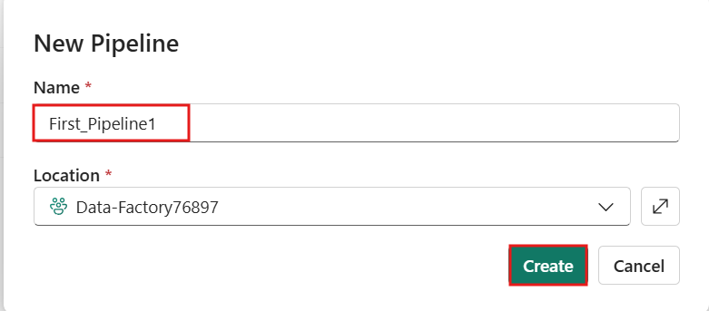

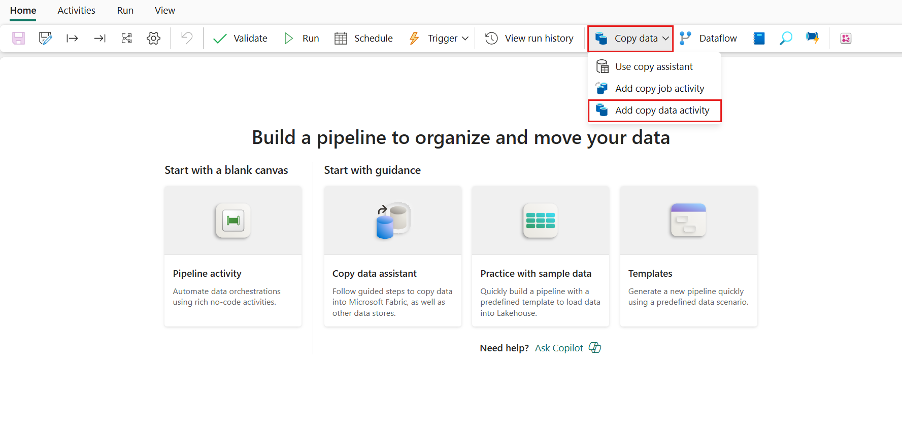

3.  將程式碼**修改**如下。**執行**修改後的程式碼，並請注意 seaborn 可讓您為繪圖設定一致的色彩主題。

```python
import seaborn as sns

# Clear the plot area
plt.clf()

# Set the visual theme for seaborn
sns.set_theme(style="whitegrid")

# Create a bar chart
ax = sns.barplot(x="OrderYear", y="GrossRevenue", data=df_sales)
plt.show()
```


4.  再次將程式碼**修改**如下。**執行**修改後的程式碼，以折線圖檢視年度營收。

```python
import seaborn as sns

# Clear the plot area
plt.clf()

# Create a line chart
ax = sns.lineplot(x="OrderYear", y="GrossRevenue", data=df_sales)
plt.show()
```


**注意**：若要深入了解如何使用 seaborn 繪圖，請參閱 [*seaborn 文件*](https://seaborn.pydata.org/index.html)。

### 任務 4：使用 Delta 資料表處理串流資料

Delta Lake 支援串流資料。Delta 資料表可以作為使用 Spark Structured Streaming API 建立之資料串流的*接收端 (sink)* 或*來源 (source)*。在此範例中，您將使用 Delta 資料表作為模擬物聯網 (IoT) 情境中串流資料的接收端。

1.  按一下 **+ Code**，複製並貼上以下程式碼，然後按一下 **Run cell** 按鈕。

```python
from notebookutils import mssparkutils
from pyspark.sql.types import *
from pyspark.sql.functions import *

# Create a folder
inputPath = 'Files/data/'
mssparkutils.fs.mkdirs(inputPath)

# Create a stream that reads data from the folder, using a JSON schema
jsonSchema = StructType([
    StructField("device", StringType(), False),
    StructField("status", StringType(), False)
])
iotstream = spark.readStream.schema(jsonSchema).option("maxFilesPerTrigger", 1).json(inputPath)

# Write some event data to the folder
device_data = '''{"device":"Dev1","status":"ok"}
{"device":"Dev1","status":"ok"}
{"device":"Dev1","status":"ok"}
{"device":"Dev2","status":"error"}
{"device":"Dev1","status":"ok"}
{"device":"Dev1","status":"error"}
{"device":"Dev2","status":"ok"}
{"device":"Dev2","status":"error"}
{"device":"Dev1","status":"ok"}'''
mssparkutils.fs.put(inputPath + "data.txt", device_data, True)
print("Source stream created...")
```

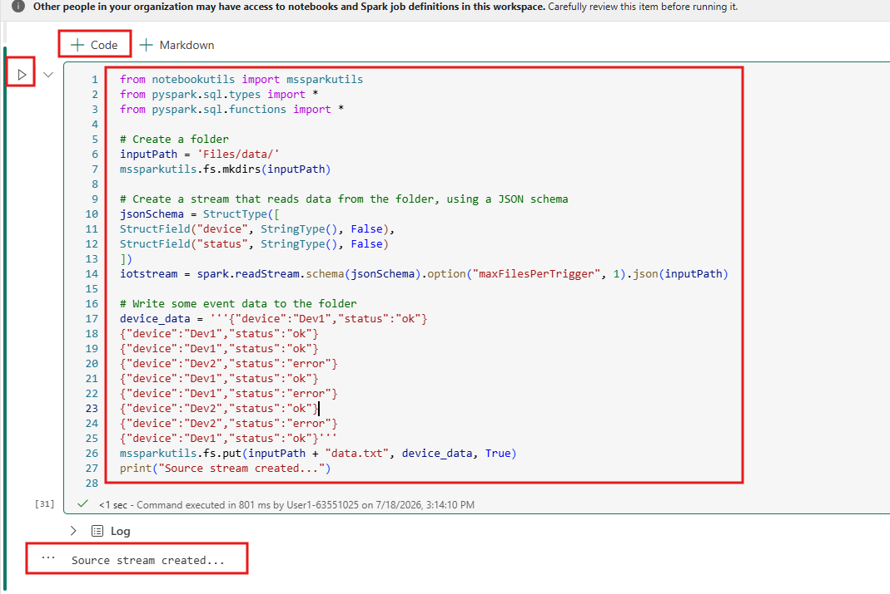

2.  確認已輸出 **Source stream created...** 訊息。您剛才執行的程式碼會根據一個資料夾建立串流資料來源，該資料夾中儲存了一些代表假設 IoT 裝置讀數的資料。

3.  按一下 **+ Code**，複製並貼上以下程式碼，然後按一下 **Run cell** 按鈕。

```python
# Write the stream to a delta table
delta_stream_table_path = 'Tables/dbo/iotdevicedata'
checkpointpath = 'Files/delta/checkpoint'
deltastream = iotstream.writeStream.format("delta").option("checkpointLocation", checkpointpath).start(delta_stream_table_path)
print("Streaming to delta sink...")
```

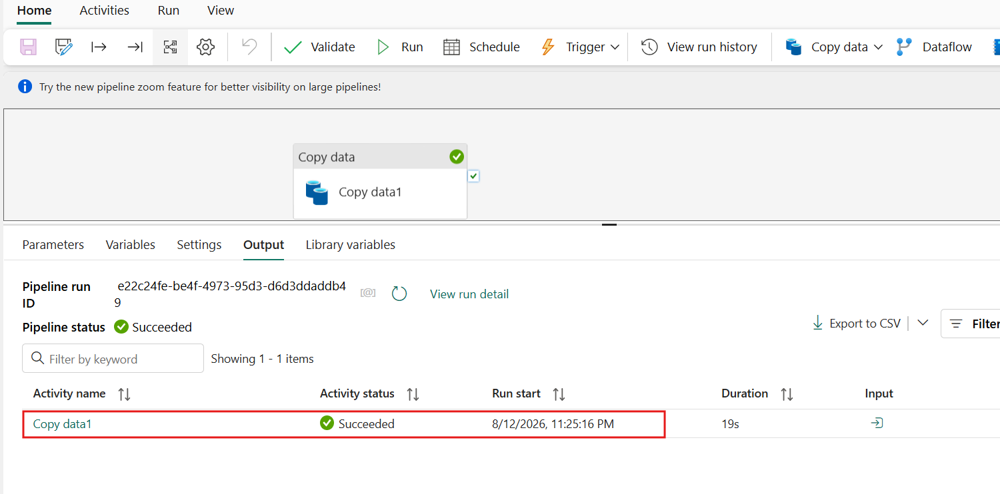

4.  此程式碼會以 delta 格式，將串流裝置資料寫入名為 **iotdevicedata** 的資料夾。由於資料夾位於 **Tables** 資料夾中，系統會自動為它建立資料表。按一下 **Tables** 旁的水平省略號，然後按一下 **Refresh**。

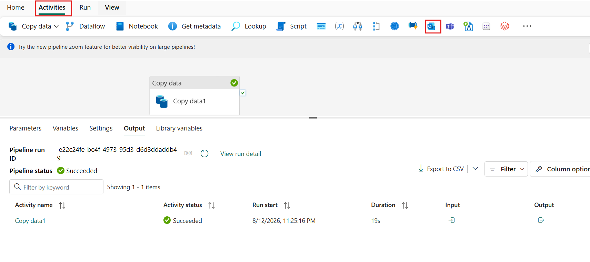


5.  按一下 **+ Code**，複製並貼上以下程式碼，然後按一下 **Run cell** 按鈕。此程式碼會查詢 **iotdevicedata** 資料表，其中包含來自串流來源的裝置資料。

```sql
%%sql
SELECT * FROM dbo.iotdevicedata;
```


6.  按一下 **+ Code**，複製並貼上以下程式碼，然後按一下 **Run cell** 按鈕。此程式碼會將更多假設的裝置資料寫入串流來源。

```python
# Add more data to the source stream
more_data = '''{"device":"Dev1","status":"ok"}
{"device":"Dev1","status":"ok"}
{"device":"Dev1","status":"ok"}
{"device":"Dev1","status":"ok"}
{"device":"Dev1","status":"error"}
{"device":"Dev2","status":"error"}
{"device":"Dev1","status":"ok"}'''
mssparkutils.fs.put(inputPath + "more-data.txt", more_data, True)
```

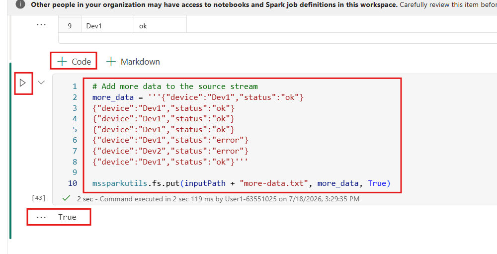

7.  按一下 **+ Code**，複製並貼上以下程式碼，然後按一下 **Run cell** 按鈕。此程式碼會再次查詢 **iotdevicedata** 資料表，現在應包含新增到串流來源的額外資料。

```sql
%%sql
SELECT * FROM dbo.iotdevicedata;
```

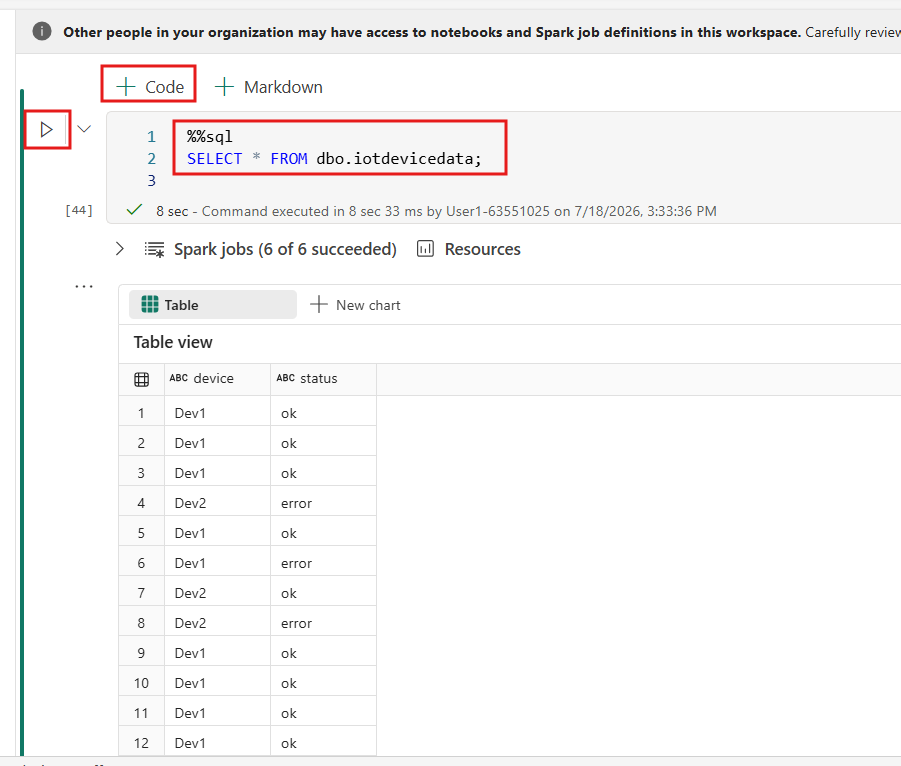

8.  按一下 **+ Code**，複製並貼上以下程式碼，然後按一下 **Run cell** 按鈕。此程式碼會停止串流。

```python
deltastream.stop()
```

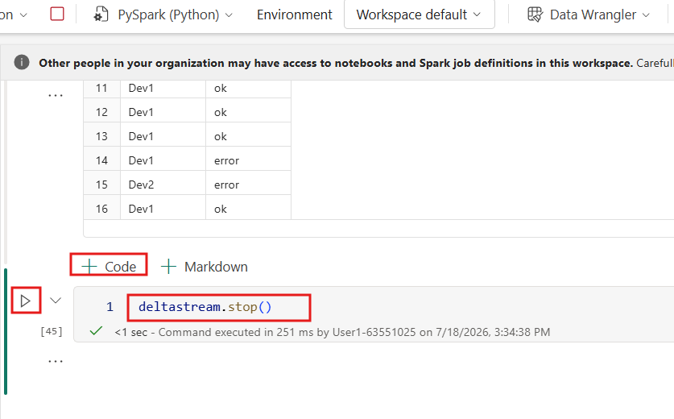

### 任務 5：儲存 notebook 並結束 Spark 工作階段

完成資料處理後，您可以為 notebook 取一個有意義的名稱並儲存，然後結束 Spark 工作階段。

1.  在 notebook 功能表列中，使用 ⚙️ **Settings** 圖示檢視 notebook 設定。

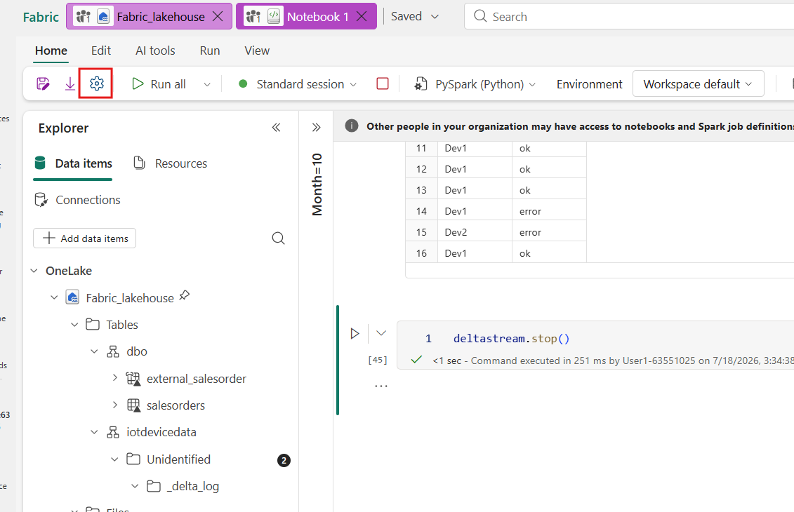

2.  將 notebook 的 **Name** 設定為 +++Explore Sales Orders+++，然後關閉設定窗格。

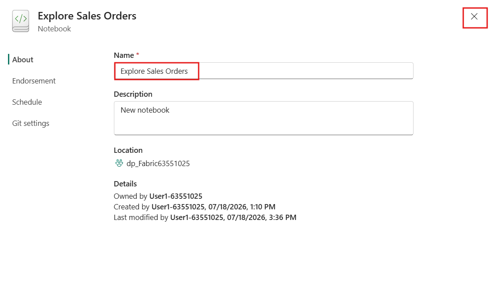

3.  在 notebook 功能表中，選取 **Stop session** 以結束 Spark 工作階段。


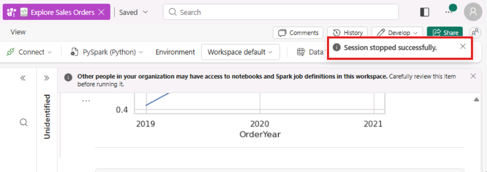

## 練習 6：清除資源

在本實驗中，您已學會如何使用 Spark 在 Microsoft Fabric 中處理資料。如果您已完成 Lakehouse 的探索，可以刪除為本實驗建立的工作區。

1.  在左側列中，選取工作區圖示以檢視其中的所有項目。

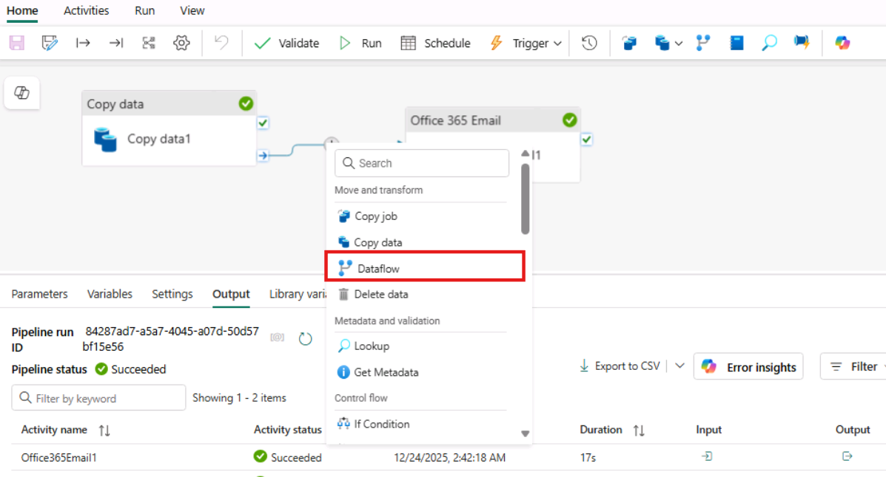

2.  在工具列的 **...** 功能表中，選取 **Workspace settings**。


3.  選取 **General**，然後按一下 **Remove this workspace**。

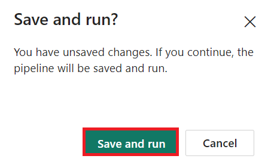

4.  在 **Delete workspace?** 對話方塊中，按一下 **Delete** 按鈕。

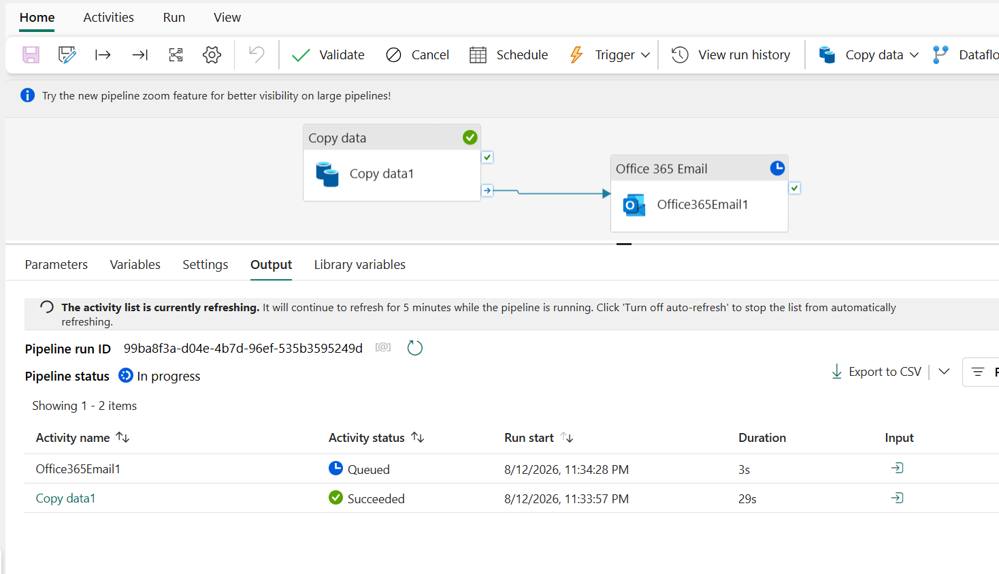

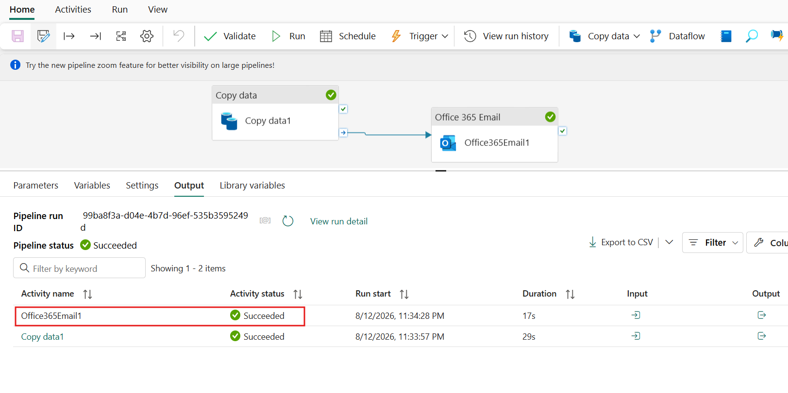

**摘要**

在本實驗中，您在 Microsoft Fabric 中建立了工作區和 Lakehouse、上傳了銷售訂單檔案，並使用 Spark notebook 探索資料。您使用 PySpark 將資料載入 DataFrame，並篩選、分組、彙總和轉換資料，然後將結果儲存為 Parquet 檔案和分割檔案，以提升查詢效率。接著，您建立了受控和外部 Delta 資料表並比較其屬性，使用 Spark SQL 查詢資料，並使用內建圖表、matplotlib 和 seaborn 視覺化資料。最後，您使用 Delta 資料表處理模擬 IoT 情境中的串流資料，並清除了資源。這些練習可協助您全面了解如何在 Microsoft Fabric 中使用 Apache Spark 進行資料分析。
