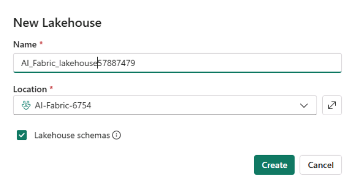

# Caso de uso 03: Chatee con sus datos utilizando Fabric Data Agent

**Introducción:**

Este caso de uso le presenta Data Agent de Microsoft Fabric, que permite
realizar consultas en lenguaje natural sobre conjuntos de datos
estructurados. Al aprovechar los modelos de lenguaje de gran tamaño
(LLMs), Fabric Data Agent puede interpretar preguntas en inglés sencillo
y traducirlas en consultas T-SQL válidas, que se ejecutan sobre los
datos de su Lakehouse seleccionado. Este ejercicio práctico lo guía a
través del proceso de configurar su entorno, crear un espacio de trabajo
en Fabric, cargar datos y utilizar la habilidad de IA para interactuar
con sus datos de manera conversacional. También explorará funciones
avanzadas como proporcionar ejemplos de consultas, agregar instrucciones
para mejorar la precisión y llamar a la habilidad de IA de manera
programática desde un notebook de Fabric.

**Objetivos:**

- Configure un espacio de trabajo en Fabric y cargue datos en un
  Lakehouse.

- Cree y configure un Data Agentpara habilitar las consultas en lenguaje
  natural.

- Haga preguntas en inglés sencillo y visualice los resultados de las
  consultas SQL generadas por la IA.

- Mejore las respuestas de la IA utilizando instrucciones personalizadas
  y consultas de ejemplo.

- Use el Data Agent de manera programática desde un notebook de Fabric.

## **Tarea 0: Sincronizar la hora del entorno Host**

1.  En su máquina virtual (VM), navegue y haga clic en la **barra de
    búsqueda**, escriba **Settings** y luego haga clic en **Settings**
    en la sección **Best match**.

> 

2.  En la ventana **Settings**, navegue y haga clic en **Time &
    language**.


3.  En la página **Time & language**, navegue y haga clic en **Date &
    time**.


4.  Desplácese hacia abajo y navegue hasta la sección **Additional
    settings**, luego haga clic en el botón **Sync now**. El proceso
    tomará entre 3 y 5 minutos para sincronizarse.


5.  Cierre la ventana de **Settings**.


## **Tarea 1: Crear un espacio de trabajo en Fabric**

En esta tarea, creará un espacio de trabajo en Fabric. El espacio de
trabajo contiene todos los elementos necesarios para este tutorial de
Lakehouse, lo cual incluye: lakehouse, dataflows, Data Factory
pipelines, notebooks, conjuntos de datos de Power BI y reportes.

1.  Abra su explorador, vaya a la barra de direcciones y escriba o pegue
    la siguiente URL: +++https://app.fabric.microsoft.com/+++ luego
    presione el botón **Enter**.

> 

2.  En la ventana de **Microsoft Fabric**, ingrese sus credenciales y
    haga clic en el botón **Submit**.

> 

3.  Luego, en la ventana de **Microsoft**, ingrese la contraseña y haga
    clic en el botón **Sign in**.

> 

4.  En la ventana **Stay signed in?** haga clic en el botón **Yes**.

> 

5.  En el panel **Workspaces**, seleccione **+New workspace**.

> 

6.  En el panel **Create a workspace** que aparece en el lado derecho,
    ingrese los siguientes detalles y haga clic en el botón **Apply**.

    |    |   |
    |----|----|
    |Name	|+++AI-Fabric-XXX+++ (XXX can be a unique number) |
    |Advanced	|Under License mode, select Fabric capacity|
    |Default storage format	|Small dataset storage format|

> 
>
> 

7.  Espere a que se complete la implementación. Tomará aproximadamente
    de 2 a 3 minutos.

> 

## **Tarea 2: Crear un lakehouse**

1.  En la página principal de **Fabric**, seleccione **+New item** y
    luego seleccione el recuadro **Lakehouse**.

> 

2.  En el cuadro de diálogo **New lakehouse**, ingrese
    +++**AI_Fabric_lakehouseXX**+++ en el campo **Name**, haga clic en
    el botón **Create** y abra el nuevo lakehouse.

> **Nota**: Asegúrese de eliminar el espacio antes de
> **AI_Fabric_lakehouseXX**.
>
> 

3.  Verá una notificación que indica **Successfully created SQL
    endpoint**.

> 


4.  A continuación, cree un nuevo notebook para consultar la tabla. En
    la cinta **Home**, seleccione el menú desplegable **Open notebook**
    y seleccione **New notebook**.


## Tarea 3: Cargar los datos de AdventureWorksDW en el lakehouse

Primero, cree un lakehouse y cárguelo con los datos necesarios.

Si ya tiene una instancia de AdventureWorksDW en un warehouse o
lakehouse, puede omitir este paso. De lo contrario, cree un lakehouse
desde un notebook y utilice el notebook para poblar el lakehouse con los
datos.

1.  En el editor de consultas, copie y pegue el siguiente código.
    Seleccione el botón **Run all** para ejecutar la consulta. Una vez
    completada la consulta, verá los resultados.

    ```
    import pandas as pd
    from tqdm.auto import tqdm
    base = "https://synapseaisolutionsa.z13.web.core.windows.net/data/AdventureWorks"
    
    # load list of tables
    df_tables = pd.read_csv(f"{base}/adventureworks.csv", names=["table"])
    
    for table in (pbar := tqdm(df_tables['table'].values)):
        pbar.set_description(f"Uploading {table} to lakehouse")
    
        # download
        df = pd.read_parquet(f"{base}/{table}.parquet")
    
        # save as lakehouse table
        spark.createDataFrame(df).write.mode('overwrite').saveAsTable(table)
    ```
> 
>
> 
>
> 

Después de unos minutos, el lakehouse queda poblado con los datos
necesarios..

## Tarea 4: Crear un Data Agent

1.  Ahora, haga clic en **AI-Fabric-XXXX** en el panel de navegación
    izquierdo.


1.  En la página principal de **Fabric**, seleccione **+New item**.


2.  En el cuadro de búsqueda **Filter by item type**, escriba **+++data
    agent+++** y seleccione **Data agent**.

3.  Ingrese +++**AI-agent**+++ como nombre del **Data agent** y
    seleccione **Create**.


4.  En la página de AI-agent, seleccione **Add a data source**.


5.  En la pestaña **OneLake catalog**, seleccione el
    **AI-Fabric_lakehouse** y haga clic en **Add**.


2.  A continuación, debe seleccionar las tablas a las que desea que la
    habilidad de IA tenga acceso disponible.

Este laboratorio utiliza las siguientes tablas:

- DimCustomer

- DimDate

- DimGeography

- DimProduct

- DimProductCategory

- DimPromotion

- DimReseller

- DimSalesTerritory

- FactInternetSales

- FactResellerSales

> 

## Task 5: Proporcionar instrucciones

1.  Cuando haga las primeras preguntas con las tablas listadas,
    seleccione **factinternetsales**; el Data Agent las responde
    bastante bien.

2.  Por ejemplo, para la pregunta +++**What is the most sold
    product?+++**,:

> 
>
> 

3.  Copie todas las preguntas y consultas SQL y péguelas en un bloc de
    notas, luego guarde el bloc de notas para usar la información en las
    próximas tareas.


4.  Seleccione **FactResellerSales**, ingrese el siguiente texto y haga
    clic en el icono **Submit**, como se muestra en la imagen a
    continuación.

+++**What is our most sold product?**+++


A medida que continúe experimentando con las consultas, debe agregar más
instrucciones.

5.  Seleccione **dimcustomer**, ingrese el siguiente texto y haga clic
    en el **icono** **Submit**

+++**how many active customers did we have June 1st, 2013?**+++


> 

6.  Copie todas las preguntas y consultas SQL, péguelas en un bloc de
    notas y luego guarde el bloc de notas para usar la información en
    las próximas tareas.

7.  Seleccione **dimdate,** **FactInternetSales**, ingrese el siguiente
    texto y haga clic en el **icono** **Submit**

+++**what are the monthly sales trends for the last year?**+++


> 

6.  Seleccione **dimproduct** y **FactInternetSales**, ingrese el
    siguiente texto y haga clic en el icono **Submit**.

+++**which product category had the highest average sales price?**+++

> 
>
> 

Parte del problema es que “cliente activo” no tiene una definición
formal. Más instrucciones en el cuadro de texto \*\*Notes to the
model\*\* podrían ayudar, pero los usuarios podrían hacer esta pregunta
con frecuencia. Debe asegurarse de que la IA maneje la pregunta
correctamente.

7.  La consulta relevante es moderadamente compleja, por lo que
    proporcione un ejemplo seleccionando el botón **Example queries**.

> 

8.  Seleccione **Edit**.

> 

8.  En la pestaña **Example SQL queries**, seleccione **+Add example.**

> 

9.  Puede agregar ejemplos manualmente, pero también puede cargarlos
    desde un archivo JSON. Proporcionar ejemplos desde un archivo es
    útil cuando tiene muchas consultas SQL que desea subir de una sola
    vez, en lugar de cargarlas manualmente una por una.


10.  Agregue todas las preguntas y consultas SQL que haya guardado en el
    Bloc de notas, y luego haga clic en “Download all as .json”.


## Tarea 6: Usar el Data Agent de forma programática 

Se agregaron tanto las instrucciones como los ejemplos al Data Agent. A
medida que continúe la fase de pruebas, agregar más ejemplos e
instrucciones puede mejorar aún más la habilidad de IA. Colabore con sus
colegas para verificar si las instrucciones y ejemplos proporcionados
cubren el tipo de preguntas que ellos desean realizar.

Puede usar la habilidad de IA de forma programática dentro de un
notebook de Fabric. Esto le permite verificar si la habilidad de IA
tiene un valor de URL publicado.

1.  En la página del Data Agent en Fabric, en la cinta de opciones
    **Home**, seleccione **Settings**.


2.  Antes de publicar la habilidad de IA, no tiene un valor de URL
    publicado, como se muestra en esta captura de pantalla.

3.  Cierre la configuración de la habilidad de IA.


4.  En la cinta de opciones **Home**, seleccione **Publish**.

> 
>
> 

9.  Haga clic en **View publishing details**.

> 

5.  La URL publicada para el agente de IA aparece, como se muestra en
    esta captura de pantalla.


6.  Copie la URL y péguela en un bloc de notas, luego guarde el bloc de
    notas para usar la información en las próximas tareas.

> 

7.  Seleccione **Notebook1** en el panel de navegación izquierdo.

> 

10. Utilice el icono **+** **Code** debajo de la salida de la celda para
    agregar una nueva celda de código al notebook, ingrese el siguiente
    código en ella y reemplace la **URL**. Haga clic en el botón ▷
    **Run** y revise la salida.

11. .

+++%pip install "openai==1.70.0"+++

> 

12. Utilice el icono **+ Code** debajo de la salida de la celda para
    agregar una nueva celda de código al notebook, ingrese el siguiente
    código en ella y reemplace la **URL**. Haga clic en el botón ▷
    **Run** y revise la salida.

> +++%pip install httpx==0.27.2+++
>
> 
>
> Utilice el icono **+** **Code** debajo de la salida de la celda para
> agregar una nueva celda de código al notebook, ingrese el siguiente
> código en ella y reemplace la **URL**. Haga clic en el botón ▷ **Run**
> y revise la salida.

    ```
    import requests
    import json
    import pprint
    import typing as t
    import time
    import uuid
    
    from openai import OpenAI
    from openai._exceptions import APIStatusError
    from openai._models import FinalRequestOptions
    from openai._types import Omit
    from openai._utils import is_given
    from synapse.ml.mlflow import get_mlflow_env_config
    from sempy.fabric._token_provider import SynapseTokenProvider
     
    base_url = "https://<generic published base URL value>"
    question = "What datasources do you have access to?"
    
    configs = get_mlflow_env_config()
    
    # Create OpenAI Client
    class FabricOpenAI(OpenAI):
        def __init__(
            self,
            api_version: str ="2024-05-01-preview",
            **kwargs: t.Any,
        ) -> None:
            self.api_version = api_version
            default_query = kwargs.pop("default_query", {})
            default_query["api-version"] = self.api_version
            super().__init__(
                api_key="",
                base_url=base_url,
                default_query=default_query,
                **kwargs,
            )
        
        def _prepare_options(self, options: FinalRequestOptions) -> None:
            headers: dict[str, str | Omit] = (
                {**options.headers} if is_given(options.headers) else {}
            )
            options.headers = headers
            headers["Authorization"] = f"Bearer {configs.driver_aad_token}"
            if "Accept" not in headers:
                headers["Accept"] = "application/json"
            if "ActivityId" not in headers:
                correlation_id = str(uuid.uuid4())
                headers["ActivityId"] = correlation_id
    
            return super()._prepare_options(options)
    
    # Pretty printing helper
    def pretty_print(messages):
        print("---Conversation---")
        for m in messages:
            print(f"{m.role}: {m.content[0].text.value}")
        print()
    
    fabric_client = FabricOpenAI()
    # Create assistant
    assistant = fabric_client.beta.assistants.create(model="not used")
    # Create thread
    thread = fabric_client.beta.threads.create()
    # Create message on thread
    message = fabric_client.beta.threads.messages.create(thread_id=thread.id, role="user", content=question)
    # Create run
    run = fabric_client.beta.threads.runs.create(thread_id=thread.id, assistant_id=assistant.id)
    
    # Wait for run to complete
    while run.status == "queued" or run.status == "in_progress":
        run = fabric_client.beta.threads.runs.retrieve(
            thread_id=thread.id,
            run_id=run.id,
        )
        print(run.status)
        time.sleep(2)
    
    # Print messages
    response = fabric_client.beta.threads.messages.list(thread_id=thread.id, order="asc")
    pretty_print(response)
    
    # Delete thread
    fabric_client.beta.threads.delete(thread_id=thread.id)
    ```
> 
>
> 

## Tarea 7: Eliminar los recursos

1.  Seleccione su workspace, el **AI-Fabric-XXXX**, desde el menú de
    navegación izquierdo. Esto abrirá la vista de elementos del
    workspace.

> 

2.  Seleccione la opción ... debajo del nombre del workspace y
    seleccione **Workspace settings**.

> 

3.  Seleccione **Other** y **Remove this workspace.**

> 

4.  Haga clic en **Delete** en la advertencia que aparece.

> 
>
> 

**Resumen:**

En este laboratorio, aprendió a desbloquear el poder del análisis
conversacional utilizando el Data Agent de Microsoft Fabric. Configuró
un workspace de Fabric, ingresó datos estructurados en un lakehouse y
configuró una habilidad de IA para traducir preguntas en lenguaje
natural a consultas SQL. También mejoró las capacidades del agente de IA
proporcionando instrucciones y ejemplos para refinar la generación de
consultas. Finalmente, llamó al agente de manera programática desde un
notebook de Fabric, demostrando la integración de IA de principio a fin.
Este laboratorio le permite hacer que los datos empresariales sean más
accesibles, utilizables e inteligentes para los usuarios de negocio
mediante lenguaje natural y tecnologías de IA generativa.

