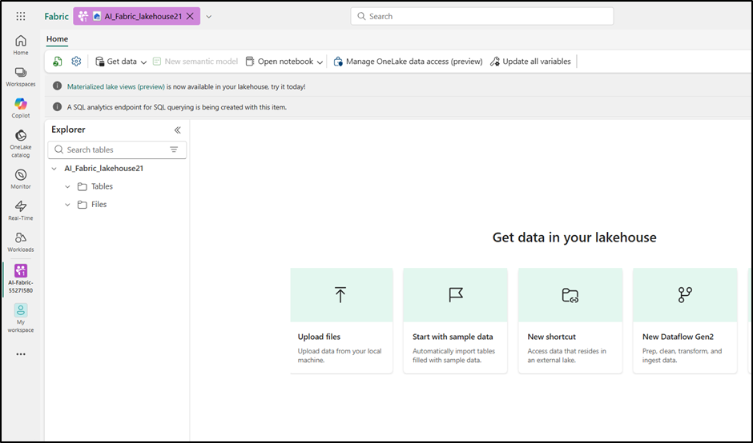
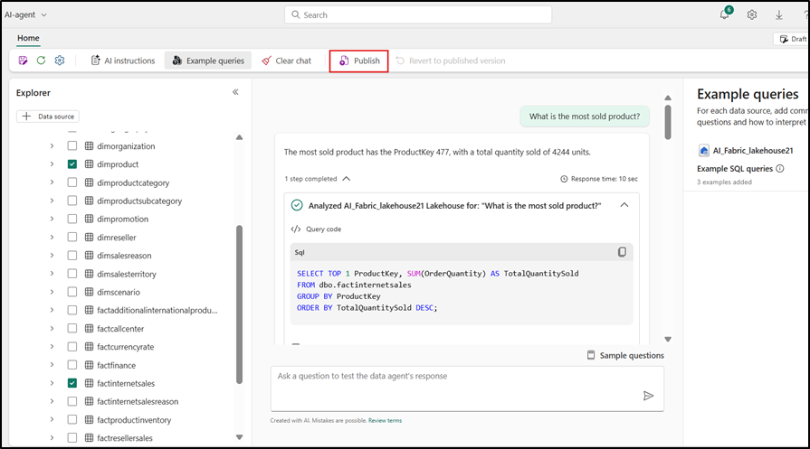
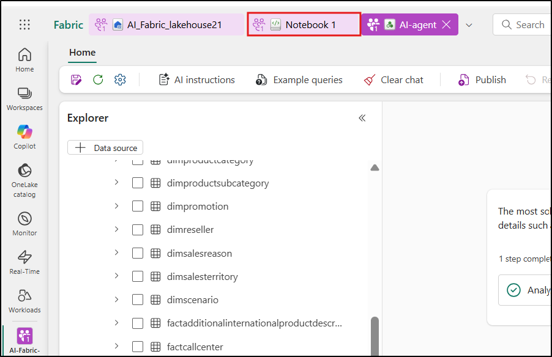

## Use case 03: Chat with your data using Fabric Data Agent

**Introduction:**

This usecase introduces you to Microsoft Fabric's Data Agent, enabling
natural language querying over structured datasets. By leveraging large
language models (LLMs), the Fabric Data Agent can interpret plain
English questions and translate them into valid T-SQL queries, executed
over your chosen lakehouse data. This hands-on exercise guides you
through the process of configuring your environment, setting up a Fabric
workspace, uploading data, and using the AI skill to interact with your
data conversationally. You will also explore advanced features like
providing query examples, adding instructions to improve accuracy, and
calling the AI skill programmatically from a Fabric notebook

**Objectives:**

- Set up a Fabric workspace and load data into a lakehouse.

- Create and configure a Data Agent to enable natural language querying.

- Ask questions in plain English and view AI-generated SQL query
  results.

- Enhance AI responses using custom instructions and example queries.

- Use the Data agent programmatically from a Fabric notebook.

### Task 0: Sync Host environment time

1.  In your VM, navigate and click in the **Search bar**, type
    **+++Settings+++** and then click on **Settings** under **Best match**.

    > 

2.  On Settings window, navigate and click on **Time & language**.

    > 

3.  On **Time & language** page, navigate and click on **Date & time**.

    > 

4.  Scroll down and navigate to **Additional settings** section, then
    click on **Syn now** button. It will take 3-5 minutes to syn.

    > 

5.  Close the **Settings** window.

    > 

### Task 1: Create a Fabric workspace

In this task, you create a Fabric workspace. The workspace contains all
the items needed for this lakehouse tutorial, which includes lakehouse,
dataflows, Data Factory pipelines, the notebooks, Power BI datasets, and
reports.

1.  Open your browser, navigate to the address bar, and type or paste
    the following URL: +++https://app.fabric.microsoft.com/+++ then
    press the **Enter** button.

    > 

2.  In the **Microsoft Fabric** window, enter your credentials, and
    click on the **Submit** button.

    > 

3.  Then, In the **Microsoft** window enter the password and click on
    the **Sign in** button**.**

    > 

4.  In **Stay signed in?** window, click on the **Yes** button.

    > 

5.  In the Workspaces pane Select **+New workspace**.

    > 

6.  In the **Create a workspace** pane that appears on the right side,
    enter the following details, and click on the **Apply** button.
	
    |    |   |
    |----|----|
    |Name	|+++AI-Fabric-@lab.LabInstance.Id+++ (must be a unique Id) |
    |Advanced	|Under License mode, select Fabric capacity|
    |Default storage format	|Small dataset storage format|

    > 

    > 

7.  Wait for the deployment to complete. It takes 2-3 minutes to
    complete.

   

### Task 2: Create a lakehouse

1.  In the **Fabric** **Home** page, select **+New item** and
    filter by, and select, the **+++Lakehouse+++** tile.

    > 

2.  In the **New lakehouse** dialog box, enter
    +++**AI_Fabric_lakehouse@lab.LabInstance.Id**+++ in the **Name** field and **unselect** the lakehouses schemas. Click on the
    **Create** button and open the new lakehouse.

    >[!note]**Note**: Ensure to remove space before **AI_Fabric_lakehouse@lab.LabInstance.Id**.

    > 

3.  You will see a notification stating **Successfully created SQL
    endpoint**.

    > 

    

4.  Next, create a new notebook to query the table. In
    the **Home** ribbon, select the drop down for **Open notebook** and
    choose **New notebook**.

   

### Task 3: Upload AdventureWorksDW data into lakehouse

First, create a lakehouse and populate it with the necessary data.

If you already have an instance of AdventureWorksDW in a warehouse or
lakehouse, you can skip this step. If not, create a lakehouse from a
notebook. Use the notebook to populate the lakehouse with the data.

1.  In the query editor, copy and paste the following code. Select
    the **Run all** button to execute the query. After the query is
    completed, you will see the results.
	
    ```
    import pandas as pd
    from tqdm.auto import tqdm
    base = "https://synapseaisolutionsa.z13.web.core.windows.net/data/AdventureWorks"
    
    # load list of tables
    df_tables = pd.read_csv(f"{base}/adventureworks.csv", names=["table"])
    
    for table in (pbar := tqdm(df_tables['table'].values)):
        pbar.set_description(f"Uploading {table} to lakehouse")
    
        # download
        df = pd.read_parquet(f"{base}/{table}.parquet")
    
        # save as lakehouse table
        spark.createDataFrame(df).write.mode('overwrite').saveAsTable(table)
    ```

    > 

    > 

    > 

After a few minutes, the lakehouse is populated with the necessary data.

### Task 4: Create Data agent

1.  Now, click on **AI-Fabric-@lab.LabInstance.Id** on the left-sided navigation pane.

     

2.  In the **Fabric** home page, select **+New item.**

     

3.  In the **Filter by item type** search box, enter **+++data
    agent+++** and select the **Data agent**

    > 

4.  Enter **+++AI-agent+++** as the Data agent name and
    select **Create**.

    > 

    > 

5.  In AI-agent page, select **Add a data source**

    > 

6.  In the **OneLake catalog** tab, select the **AI-Fabric_lakehouse
    lakehouse** and select **Add**.

    > 

    > 

7.  You must then select the tables for which you want the AI skill to
    have available access.

    This lab uses these tables:

    - DimCustomer

    - DimDate

    - DimGeography

    - DimProduct

    - DimProductCategory

    - DimPromotion

    - DimReseller

    - DimSalesTerritory

    - FactInternetSales

    - FactResellerSales

   
### Task 5: Provide instructions

1.  When you first ask the questions with the listed tables select
    **factinternetsales**, the data agent answers them fairly well.

2.  For instance, for the question **+++What is the most sold product?+++**,

    > 

    > 

3.  Copy the question and SQL query and paste them in a notepad
    and then Save the notepad to use the information in the upcoming
    tasks

    > 

4.  Select **FactResellerSales** and enter the following text and click
    on the **Submit icon** as shown in the below image.

    **+++What is our most sold product?+++**

    > 

    > 

    As you continue to experiment with queries, you should add more
    instructions.

5.  Select the **dimcustomer** , enter the following text and click on
    the **Submit icon**

    **+++how many active customers did we have June 1st, 2013?+++**

    > 

    > 

6.  Copy the all question and SQL queries and paste them in a notepad
    and then Save the notepad to use the information in the upcoming
    tasks

7.  Select the **dimdate,** **FactInternetSales** , enter the following
    text and click on the **Submit icon**

    **+++what are the monthly sales trends for the last year?+++**

    > 

    > 

6.  Select the **dimproduct,** **FactInternetSales** , enter the
    following text and click on the **Submit icon**

    +++**which product category had the highest average sales price?**+++

    > 

    > 

    >[!note]**Note**: Part of the problem is that "active customer" doesn't have a formal
    > definition. More instructions in the notes to the model text box might
    > help, but users might frequently ask this question. You need to make
    > sure that the AI handles the question correctly

7.  The relevant query is moderately complex, so provide an example by
    selecting the **Example queries** button.

    > 

8.  Select the Edit pencil icon.

    > 

9.  In the Example SQL queries tab, select **+ Add example** text.

    > 

10.  You can manually add examples, but you can also upload them from a
    JSON file. Providing examples from a file is helpful when you have
    many SQL queries that you want to upload all at once, instead of
    manually uploading the queries one by one.

   > 

   > 

   > 

11.  Add all the queries and SQL queries that you have saved in Notepad,
    and then click on 'Download all as .json'.

   > 

## Task 6: Use the Data agent programmatically

Both instructions and examples were added to the Data agent. As testing
proceeds, more examples and instructions can improve the AI skill even
further. Work with your colleagues to see if you provided examples and
instructions that cover the kinds of questions they want to ask.

You can use the AI skill programmatically within a Fabric notebook. To
determine whether or not the AI skill has a published URL value.

1.  In the Data agent Fabric page, in the **Home** ribbon select the
    **Settings**.

    

2.  Before you publish the AI skill, it doesn't have a published URL
    value, as shown in this screenshot.

3.  Close the AI Skill setting.

    > 

4.  In the **Home** ribbon, select the **Publish**.

    

    > 

5.  Click on the **View publishing details**

    > 

6.  The published URL for the AI agent appears, as shown in this
    screenshot.

    > 

7.  Copy the URL and paste that in a notepad and then Save the notepad
    to use the information in the upcoming

    > 

8.  Select **Notebook1** in the top navigation pane.

      

9. Use the **+ Code** icon below the cell output to add a new code cell
    to the notebook, enter the following code in it and replace the
    **URL**. Click on **▷ Run** button and review the output

    +++%pip install "openai==1.70.0"+++

    > 

10. Use the **+ Code** icon below the cell output to add a new code cell
    to the notebook, enter the following code in it and replace the
    **URL**. Click on **▷ Run** button and review the output

    +++%pip install httpx==0.27.2+++

    > 

11.  Use the **+ Code** icon below the cell output to add a new code cell
    to the notebook, enter the following code in it and replace the
    **URL**. Click on **▷ Run** button and review the output
	
    ```
    import requests
    import json
    import pprint
    import typing as t
    import time
    import uuid
    
    from openai import OpenAI
    from openai._exceptions import APIStatusError
    from openai._models import FinalRequestOptions
    from openai._types import Omit
    from openai._utils import is_given
    from synapse.ml.mlflow import get_mlflow_env_config
    from sempy.fabric._token_provider import SynapseTokenProvider
     
    base_url = "https://<generic published base URL value>"
    question = "What datasources do you have access to?"
    
    configs = get_mlflow_env_config()
    
    # Create OpenAI Client
    class FabricOpenAI(OpenAI):
        def __init__(
            self,
            api_version: str ="2024-05-01-preview",
            **kwargs: t.Any,
        ) -> None:
            self.api_version = api_version
            default_query = kwargs.pop("default_query", {})
            default_query["api-version"] = self.api_version
            super().__init__(
                api_key="",
                base_url=base_url,
                default_query=default_query,
                **kwargs,
            )
        
        def _prepare_options(self, options: FinalRequestOptions) -> None:
            headers: dict[str, str | Omit] = (
                {**options.headers} if is_given(options.headers) else {}
            )
            options.headers = headers
            headers["Authorization"] = f"Bearer {configs.driver_aad_token}"
            if "Accept" not in headers:
                headers["Accept"] = "application/json"
            if "ActivityId" not in headers:
                correlation_id = str(uuid.uuid4())
                headers["ActivityId"] = correlation_id
    
            return super()._prepare_options(options)
    
    # Pretty printing helper
    def pretty_print(messages):
        print("---Conversation---")
        for m in messages:
            print(f"{m.role}: {m.content[0].text.value}")
        print()
    
    fabric_client = FabricOpenAI()
    # Create assistant
    assistant = fabric_client.beta.assistants.create(model="not used")
    # Create thread
    thread = fabric_client.beta.threads.create()
    # Create message on thread
    message = fabric_client.beta.threads.messages.create(thread_id=thread.id, role="user", content=question)
    # Create run
    run = fabric_client.beta.threads.runs.create(thread_id=thread.id, assistant_id=assistant.id)
    
    # Wait for run to complete
    while run.status == "queued" or run.status == "in_progress":
        run = fabric_client.beta.threads.runs.retrieve(
            thread_id=thread.id,
            run_id=run.id,
        )
        print(run.status)
        time.sleep(2)
    
    # Print messages
    response = fabric_client.beta.threads.messages.list(thread_id=thread.id, order="asc")
    pretty_print(response)
    
    # Delete thread
    fabric_client.beta.threads.delete(thread_id=thread.id)
    ```
	
 > 

 > 

### Task 7: Delete the resources

1.  Select your workspace, the **AI-Fabric-@lab.LabInstance.Id** from the left-hand
    navigation menu. It opens the workspace item view.

    > 

2.  Select the **...** option under the workspace name and
    select **Workspace settings**.

    > 

3.  Navigate to the bottom of the **General** tab and select **Remove this workspace**.

    > 

4.  Click on **Delete** in the warning that pops up.

    > 

    > 

**Summary:**

In this lab, you learned how to unlock the power of conversational
analytics using Microsoft Fabric's Data Agent. You configured a Fabric
workspace, ingested structured data into a lakehouse, and set up an AI
skill to translate natural language questions into SQL queries. You also
enhanced the AI agent's capabilities by providing instructions and
examples to refine query generation. Finally, you called the agent
programmatically from a Fabric notebook, demonstrating end-to-end AI
integration. This lab empowers you to make enterprise data more
accessible, usable, and intelligent for business users through natural
language and generative AI technologies.


