# 用例03——使用 Fabric 數據代理與你的數據聊天

**介紹：**

該用例將向你介紹Microsoft
Fabric的數據代理，支持對結構化數據集進行自然語言查詢。通過利用大型語言模型（LLM），Fabric
Data Agent 可以解釋簡單的英語問題，並將其翻譯成有效的 T-SQL
查詢，運行在您選擇的湖屋數據上。這個動手練習將引導你完成配置環境、搭建Fabric工作區、上傳數據，以及利用AI技能與你的數據進行對話式互動的過程。你還將探索高級功能，比如提供查詢示例、添加提高準確性說明，以及從Fabric筆記本中程序化調用AI技能

**目標:**

- 搭建一個Fabric工作區，並將數據加載到 lakehouse 中。

- 創建並配置一個數據代理，以支持自然語言查詢。

- 用通俗易懂的英語提問，並查看AI生成的SQL查詢結果。

- 通過自定義指令和示例查詢來增強AI回答。

- 在 Fabric 筆記本中編程使用 Data agent。

## **任務0：同步主機環境時間**

1.  在您的VM中，導航並單擊 **Search
    bar**，鍵入“**Settings**”，然後單擊“**Best
    match**”下的“**Settings**”。

> 

2.  在設置窗口中，點擊 **Time & language**。


3.  在“**Time & language**”頁面，點擊“**Date & time**”。


4.  向下滾動，進入“**Additional settings**”部分，然後點擊“**Syn
    now**”按鈕。同步需要3-5分鐘。


5.  關閉 **Settings** 窗口。


## **任務1：創建Fabric工作區**

在這個任務中，你需要創建一個Fabric工作區。工作區包含了本 lakehouse
教程所需的所有內容，包括 lakehouse、數據流、Data Factory
管道、筆記本、Power BI 數據集和報表。

1.  打開瀏覽器，進入地址欄，輸入或粘貼以下URL：+++https://app.fabric.microsoft.com/+++
    ，然後按下 **Enter** 鍵。

> 

2.  在 **Microsoft Fabric** 窗口中，輸入你的憑證，然後點擊 **Submit**
    按鈕。

> 

3.  然後，在 **Microsoft** 窗口輸入密碼，點擊 **Sign in** 按鈕**。**

> 

4.  在 **Stay signed in?** 窗口，點擊**“Yes”**按鈕。

> 

5.  在工作區面板中選擇 **+New workspace**。

> 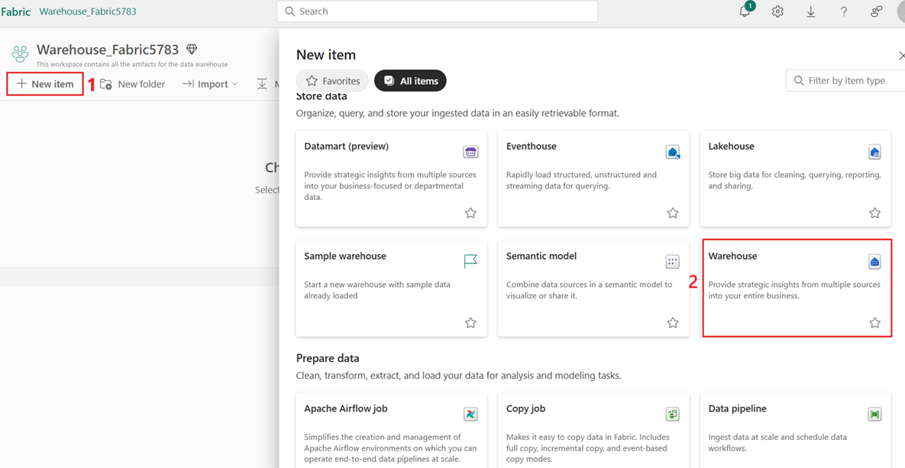

6.  在右側的 **Create a workspace**
    面板中，輸入以下細節，然後點擊“**Apply**”按鈕。

    |    |   |
    |----|----|
    |Name	|+++AI-Fabric-@lab.LabInstance.Id+++ (must be a unique Id) |
    |Advanced	|Under License mode, select Fabric capacity|
    |Default storage format	|Small dataset storage format|
> 
>
> 

7.  等待部署完成。完成大約需要1-2分鐘。

> 

## **任務 2: 建造 lakehouse**

1.  在**Fabric主頁**，選擇 **+New item** ，選擇 **Lakehouse** 瓷磚。

> 

2.  在“**New lakehouse** ”對話框中，輸入“**Name**”欄的
    +++**AI_Fabric_lakehouseXX**+++，點擊“**Create**”按鈕，打開新湖屋。

> **注意**：**AI_Fabric_lakehouseXX** 前請務必清空。
>
> 

3.  你會看到一條通知，提示 **Successfully created SQL endpoint**。

> 


4.  接下來，創建一個新的筆記本來查詢該表。在“**Home**”功能區中，選擇“**Open
    notebook** ”下拉菜單，然後選擇“**New notebook**”。 


## **任務3：將 AdventureWorksDW 數據上傳到 Lakehouse**

首先，創建一個lakehouse並填充必要的數據。

如果你已經在warehouse或lakehouse裡有 AdventureWorksDW
實例，可以跳過這一步。如果沒有，就用筆記本創建一個lakehouse。用筆記本填充lakehouse的數據。

1.  在查詢編輯器中，複製粘貼以下代碼。選擇“**Run
    all **”按鈕來執行查詢。查詢完成後，你會看到結果。

    ```
    import pandas as pd
    from tqdm.auto import tqdm
    base = "https://synapseaisolutionsa.z13.web.core.windows.net/data/AdventureWorks"
    
    # load list of tables
    df_tables = pd.read_csv(f"{base}/adventureworks.csv", names=["table"])
    
    for table in (pbar := tqdm(df_tables['table'].values)):
        pbar.set_description(f"Uploading {table} to lakehouse")
    
        # download
        df = pd.read_parquet(f"{base}/{table}.parquet")
    
        # save as lakehouse table
        spark.createDataFrame(df).write.mode('overwrite').saveAsTable(table)
    ```
> 
>
> 
>
> 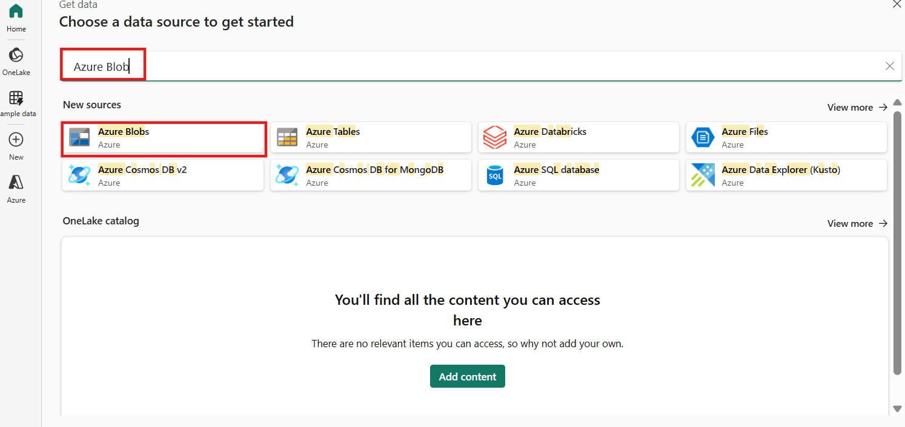

幾分鐘後，lakehouse已經收集了所需的數據。

## **任務4：創建數據代理**

1.  現在，點擊 左側導航面板上的 **AI-Fabric-XXXX** 。

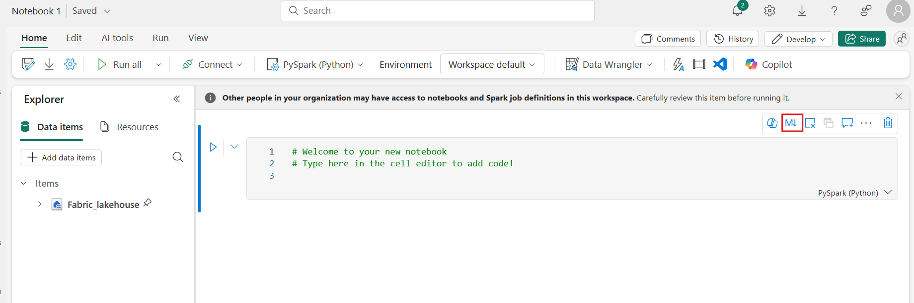

2.  在 **Fabric** 主頁，選擇 **+New item**。

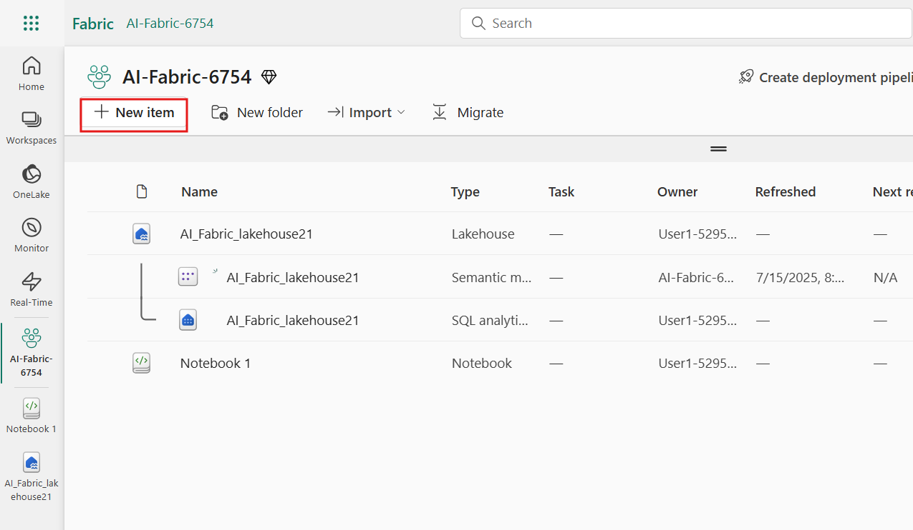

3.  在“**Filter by item type**”搜索框中，輸入 **+++data agent+++**
    並選擇 **Data agent**。

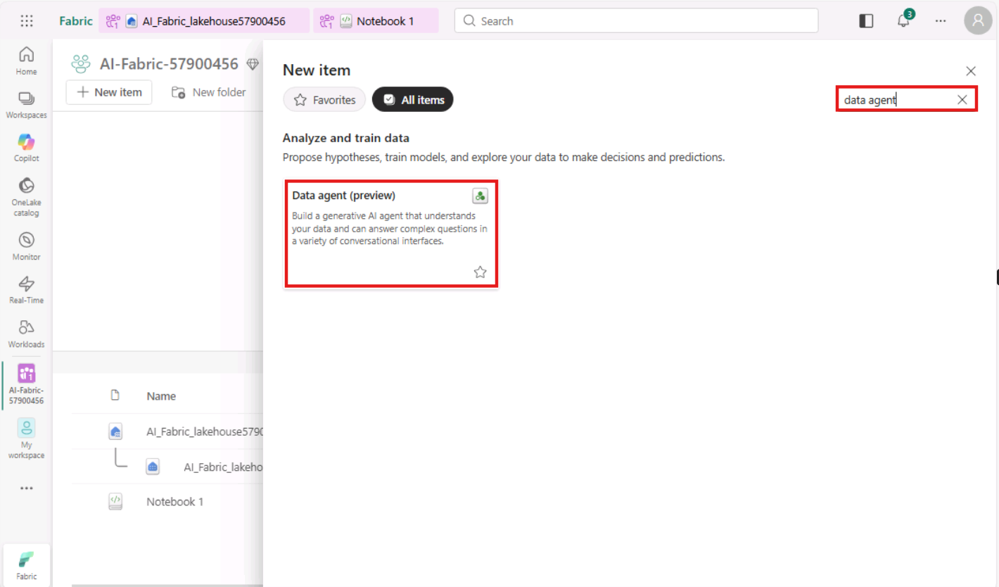

4.  輸入 **+++AI-agent+++** 作為 Data 代理名稱，選擇 **Create**。


5.  在 AI 代理頁面中，選擇 **Add a data source**。


6.  在 **OneLake catalog** 標簽頁中，選擇 **AI-Fabric_lakehouse
    lakehouse** 並選擇 **Add**。

> 
>
> 

1.  然後你必須選擇你希望AI技能能訪問的表格。

這個實驗室使用這些表格:

- DimCustomer

- DimDate

- DimGeography

- DimProduct

- DimProductCategory

- DimPromotion

- DimReseller

- DimSalesTerritory

- FactInternetSales

- FactResellerSales

> 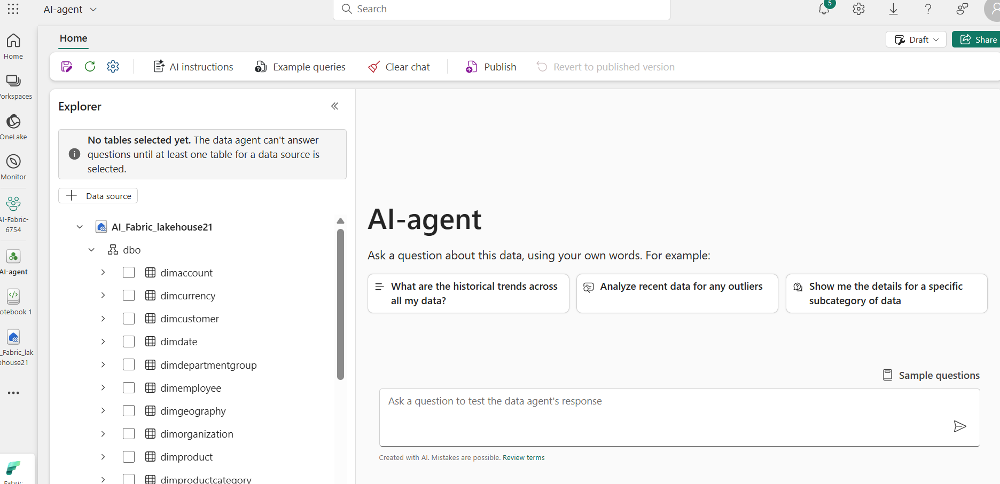

## **任務5：提供指令**

1.  當你第一次用列出的表格選擇 **factinternetsales**
    來提問時，數據代理會相當準確地回答。

2.  例如，對於+++**What is the most sold product?+++**


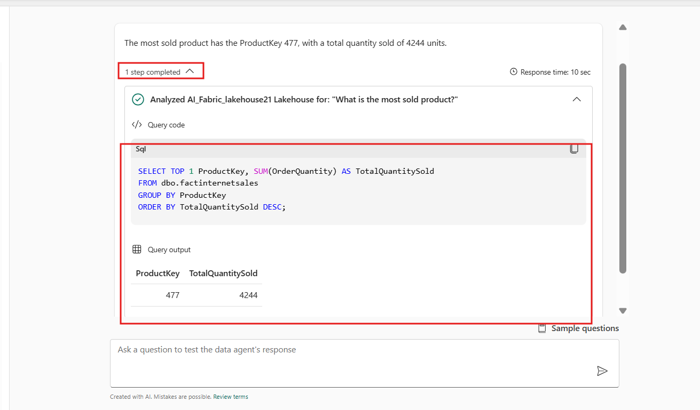

3.  複製問題和SQL查詢，粘貼到記事本，然後保存記事本，以便後續任務中使用這些信息。


4.  選擇 **FactResellerSales**，輸入以下文字，點擊下圖所示的
    **Submit圖標**。

+++**What is our most sold product?**+++


隨著你不斷嘗試查詢，應該添加更多指令。

5.  選擇 **dimcustomer** ， 輸入以下文字，點擊 **Submit圖標**

+++**How many active customers did we have on June 1st, 2013?**+++


7.  把所有問題和SQL查詢複製出來，粘貼到記事本裡，然後保存記事本，方便後續任務中使用這些信息。


8.  選擇 **dimdate，FactInternetSales ，**輸入以下文字，點擊
    **Submit圖標** **:**

+++**what are the monthly sales trends for the last year?**+++


6.  選擇 **dimproduct，FactInternetSales ，**輸入以下文字，點擊
    **Submit圖標 :**

+++**which product category had the highest average sales price?**+++

> 
>
> 

問題的一部分在於“活躍客戶”沒有正式的定義。模型文本框備註中更多說明可能會有幫助，但用戶可能會經常問這個問題。你需要確保AI正確地處理這個問題。

7.  相關查詢較為複雜，因此請從“**Setup**”窗格中選擇“**Example
    queries**”按鈕來提供示例。

> 

8.  在“Example queries”標簽中，選擇 **Add example。**

> 

9.  這裡，你應該為你創建的 lakehouse
    數據源添加示例查詢。請在問題欄中添加以下問題:

+++What is the most sold product?+++


10. 添加你保存在記事本中的 query1:  
      
```      
SELECT TOP 1 ProductKey, SUM(OrderQuantity) AS TotalQuantitySold
FROM [dbo].[factinternetsales]
GROUP BY ProductKey
ORDER BY TotalQuantitySold DESC
```


11. 要添加新的查詢字段，請點擊 **+Add。**


12. 在問題欄中添加第二個問題:

+++What are the monthly sales trends for the last year?+++


13. 把你保存在筆記本裡的query3添加進去:  
      
	```      
	SELECT
	    d.CalendarYear,
	    d.MonthNumberOfYear,
	    d.EnglishMonthName,
	    SUM(f.SalesAmount) AS TotalSales
	FROM
	    dbo.factinternetsales f
	    INNER JOIN dbo.dimdate d ON f.OrderDateKey = d.DateKey
	WHERE
	    d.CalendarYear = (
	        SELECT MAX(CalendarYear)
	        FROM dbo.dimdate
	        WHERE DateKey IN (SELECT DISTINCT OrderDateKey FROM dbo.factinternetsales)
	    )
	GROUP BY
	    d.CalendarYear,
	    d.MonthNumberOfYear,
	    d.EnglishMonthName
	ORDER BY
	    d.MonthNumberOfYear
	```
> 

14. 要添加新的查詢字段，請點擊 **+Add。**


15. 在問題欄中添加第三個問題:

+++Which product category has the highest average sales price?+++


16. 添加你保存在筆記本中的 query4:  
      
    **SELECT TOP 1**

```      
SELECT TOP 1
    dp.ProductSubcategoryKey AS ProductCategory,
    AVG(fis.UnitPrice) AS AverageSalesPrice
FROM
    dbo.factinternetsales fis
INNER JOIN
    dbo.dimproduct dp ON fis.ProductKey = dp.ProductKey
GROUP BY
    dp.ProductSubcategoryKey
ORDER BY
    AverageSalesPrice DESC
```


11. 把你保存在筆記本裡的所有查詢和SQL查詢添加進去，然後點擊“**Export
    all”**


## **任務6：程序化使用Data代理**

指令和示例都被添加到了Data代理中。隨著測試的推進，更多的示例和說明可以進一步提升AI技能。和同事一起看看你是否提供了涵蓋他們想問的問題的例子和說明。

你可以在Fabric筆記本中編程使用AI技能。用來判斷AI技能是否有已發佈的URL值。

1.  在 Data agent Fabric頁面，**Home**功能區選擇**Settings**。


2.  在你發佈AI技能之前，它沒有發佈的URL值，如這張截圖所示。

3.  關閉AI技能設置。


4.  在 **Home**頁功能區，選擇 **Publish**。 

> 
>
> 

9.  點擊查看 **View publishing details**

> 

5.  AI代理的公開URL顯示在這張截圖中。

6.  複製URL粘貼到記事本，然後保存記事本以便在後續步驟中使用這些信息。

> 

7.  在左側導航窗格選擇**Notebook1。**


10. 使用單元格輸出下方的 **+
    Code** 圖標，向筆記本添加一個新的代碼單元，輸入以下代碼並替換
    **URL**。點擊 **▷ Run** 按鈕，查看輸出結果

+++%pip install "openai==1.70.0"+++

> 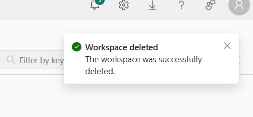
>
> 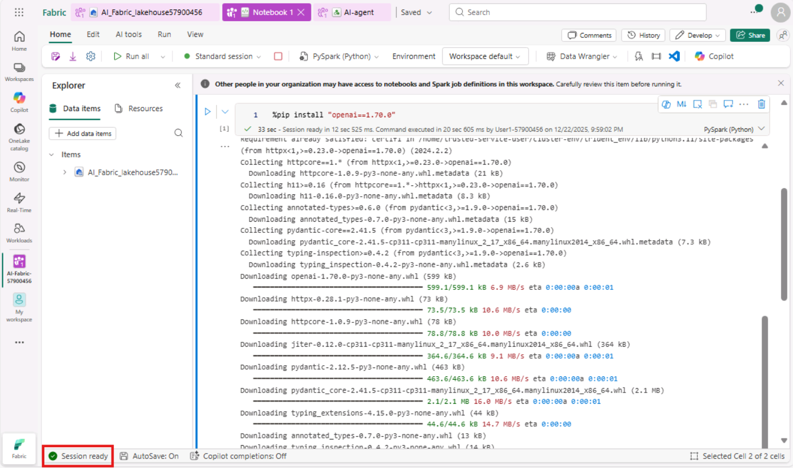

11. 使用單元格輸出下方的 **+ Code**
    圖標，向筆記本添加一個新的代碼單元，輸入以下代碼並替換 **URL**。點擊
    **▷ Run** 按鈕，查看輸出結果

> +++%pip install httpx==0.27.2+++
>
> 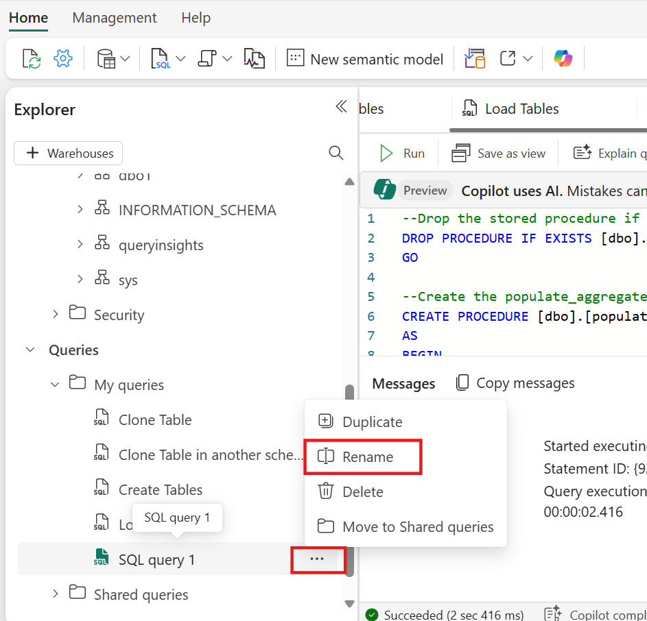
>
> 

8.  使用單元格輸出下方的 **+
    Code** 圖標，向筆記本添加一個新的代碼單元，輸入以下代碼並替換
    **URL**。點擊 **▷ Run** 按鈕，查看輸出結果

```
import requests
import json
import pprint
import typing as t
import time
import uuid

from openai import OpenAI
from openai._exceptions import APIStatusError
from openai._models import FinalRequestOptions
from openai._types import Omit
from openai._utils import is_given
from synapse.ml.mlflow import get_mlflow_env_config
from sempy.fabric._token_provider import SynapseTokenProvider
 
base_url = "https://<generic published base URL value>"
question = "What datasources do you have access to?"

configs = get_mlflow_env_config()

# Create OpenAI Client
class FabricOpenAI(OpenAI):
    def __init__(
        self,
        api_version: str ="2024-05-01-preview",
        **kwargs: t.Any,
    ) -> None:
        self.api_version = api_version
        default_query = kwargs.pop("default_query", {})
        default_query["api-version"] = self.api_version
        super().__init__(
            api_key="",
            base_url=base_url,
            default_query=default_query,
            **kwargs,
        )
    
    def _prepare_options(self, options: FinalRequestOptions) -> None:
        headers: dict[str, str | Omit] = (
            {**options.headers} if is_given(options.headers) else {}
        )
        options.headers = headers
        headers["Authorization"] = f"Bearer {configs.driver_aad_token}"
        if "Accept" not in headers:
            headers["Accept"] = "application/json"
        if "ActivityId" not in headers:
            correlation_id = str(uuid.uuid4())
            headers["ActivityId"] = correlation_id

        return super()._prepare_options(options)

# Pretty printing helper
def pretty_print(messages):
    print("---Conversation---")
    for m in messages:
        print(f"{m.role}: {m.content[0].text.value}")
    print()

fabric_client = FabricOpenAI()
# Create assistant
assistant = fabric_client.beta.assistants.create(model="not used")
# Create thread
thread = fabric_client.beta.threads.create()
# Create message on thread
message = fabric_client.beta.threads.messages.create(thread_id=thread.id, role="user", content=question)
# Create run
run = fabric_client.beta.threads.runs.create(thread_id=thread.id, assistant_id=assistant.id)

# Wait for run to complete
while run.status == "queued" or run.status == "in_progress":
    run = fabric_client.beta.threads.runs.retrieve(
        thread_id=thread.id,
        run_id=run.id,
    )
    print(run.status)
    time.sleep(2)

# Print messages
response = fabric_client.beta.threads.messages.list(thread_id=thread.id, order="asc")
pretty_print(response)

# Delete thread
fabric_client.beta.threads.delete(thread_id=thread.id)
```
> 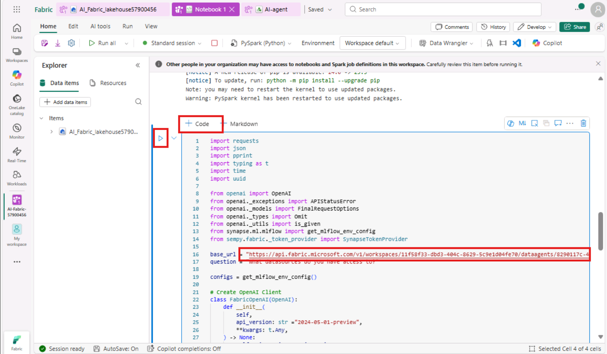
>
> 

## **任務7：刪除資源**

1.  選擇你的工作區，在左側導航菜單中使用
    **AI-Fabric-XXXX**。它會打開工作區的物品視圖。

> 

2.  選擇...... 在工作區名稱下選擇選項，選擇 **Workspace settings**。

> 

3.  選擇 **Other** 並 **Remove this workspace**。 

> 

4.  點擊彈出的警告中“**Delete**”。

> 
>
> 

**摘要：**

在本實驗室中，你學習了如何利用Microsoft
Fabric的數據代理，釋放對話式分析的力量。你配置了一個Fabric工作區，將結構化數據導入
lakehouse，並設置了一個AI技能將自然語言問題轉換為SQL查詢。你還通過提供指導和示例來優化查詢生成，增強了AI代理的能力。最後，你通過Fabric筆記本程序化調用了代理，展示了端到端的AI集成。該實驗室通過自然語言和
generative AI 技術，賦能您讓企業數據對企業用戶更易訪問、更易用且更智能。
