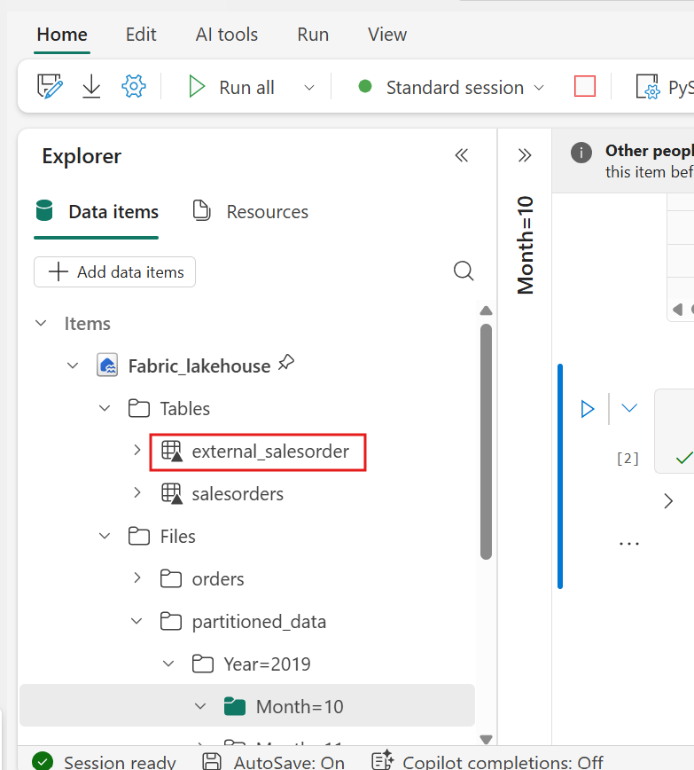
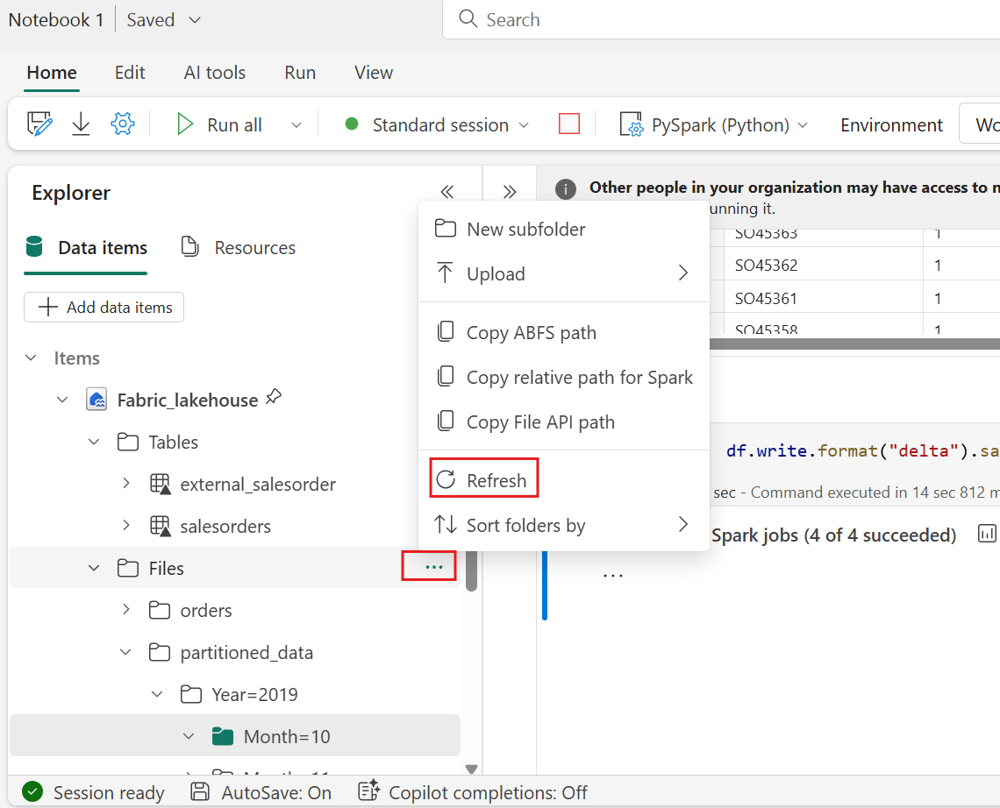

# Usecase 03- Chat with your data using Fabric Data Agent

**Introduction:**

This usecase introduces you to Microsoft Fabric’s Data Agent, enabling
natural language querying over structured datasets. By leveraging large
language models (LLMs), the Fabric Data Agent can interpret plain
English questions and translate them into valid T-SQL queries, executed
over your chosen lakehouse data. This hands-on exercise guides you
through the process of configuring your environment, setting up a Fabric
workspace, uploading data, and using the AI skill to interact with your
data conversationally. You will also explore advanced features like
providing query examples, adding instructions to improve accuracy, and
calling the AI skill programmatically from a Fabric notebook

**Objectives:**

- Set up a Fabric workspace and load data into a lakehouse.

- Create and configure a Data Agent to enable natural language querying.

- Ask questions in plain English and view AI-generated SQL query
  results.

- Enhance AI responses using custom instructions and example queries.

- Use the Data agent programmatically from a Fabric notebook.

## **Task 0: Sync Host environment time**

1.  In your VM, navigate and click in the **Search bar**, type
    **Settings** and then click on **Settings** under **Best match**.

> 

2.  On Settings window, navigate and click on **Time & language**.


3.  On **Time & language** page, navigate and click on **Date & time**.


4.  Scroll down and navigate to **Additional settings** section, then
    click on **Syn now** button. It will take 3-5 minutes to syn.


5.  Close the **Settings** window.


## **Task 1: Create a Fabric workspace**

In this task, you create a Fabric workspace. The workspace contains all
the items needed for this lakehouse tutorial, which includes lakehouse,
dataflows, Data Factory pipelines, the notebooks, Power BI datasets, and
reports.

1.  Open your browser, navigate to the address bar, and type or paste
    the following URL: +++https://app.fabric.microsoft.com/+++ then
    press the **Enter** button.

> 

2.  In the **Microsoft Fabric** window, enter your credentials, and
    click on the **Submit** button.

> 

3.  Then, In the **Microsoft** window enter the password and click on
    the **Sign in** button**.**

> 

4.  In **Stay signed in?** window, click on the **Yes** button.

> 

5.  In the Workspaces pane Select **+New workspace**.

> 

6.  In the **Create a workspace** pane that appears on the right side,
    enter the following details, and click on the **Apply** button.

    |    |   |
    |----|----|
    |Name	|+++AI-Fabric-@lab.LabInstance.Id+++ (must be a unique Id) |
    |Advanced	|Under License mode, select Fabric capacity|
    |Default storage format	|Small dataset storage format|

> 
>
> 

7.  Wait for the deployment to complete. It takes 1-2 minutes to
    complete.

> 

## **Task 2: Create a lakehouse**

1.  In the **Fabric** **Home** page, select **+New item** and
    select **Lakehouse** tile.

> 

2.  In the **New lakehouse** dialog box, enter
    +++**AI_Fabric_lakehouseXX**+++ in the **Name** field, click on the
    **Create** button and open the new lakehouse.

> **Note**: Ensure to remove space before **AI_Fabric_lakehouseXX**.
>
> 

3.  You will see a notification stating **Successfully created SQL
    endpoint**.

> 


4.  Next, create a new notebook to query the table. In
    the **Home** ribbon, select the drop down for **Open notebook** and
    choose **New notebook**.


## **Task 3: Upload AdventureWorksDW data into lakehouse**

First, create a lakehouse and populate it with the necessary data.

If you already have an instance of AdventureWorksDW in a warehouse or
lakehouse, you can skip this step. If not, create a lakehouse from a
notebook. Use the notebook to populate the lakehouse with the data.

1.  In the query editor, copy and paste the following code. Select
    the **Run all** button to execute the query. After the query is
    completed, you will see the results.

    ```
    import pandas as pd
    from tqdm.auto import tqdm
    base = "https://synapseaisolutionsa.z13.web.core.windows.net/data/AdventureWorks"
    
    # load list of tables
    df_tables = pd.read_csv(f"{base}/adventureworks.csv", names=["table"])
    
    for table in (pbar := tqdm(df_tables['table'].values)):
        pbar.set_description(f"Uploading {table} to lakehouse")
    
        # download
        df = pd.read_parquet(f"{base}/{table}.parquet")
    
        # save as lakehouse table
        spark.createDataFrame(df).write.mode('overwrite').saveAsTable(table)
    ```

> 
>
> 
>
> 

After a few minutes, the lakehouse is populated with the necessary data.

## **Task 4: Create Data agent**

1.  Now, click on **AI-Fabric-XXXX** on the left-sided navigation pane.


2.  In the **Fabric** home page, select **+New item.**


3.  In the **Filter by item type** search box, enter **+++data
    agent+++** and select the **Data agent.**


4.  Enter **+++AI-agent+++** as the Data agent name and
    select **Create**.


5.  In AI-agent page, select **Add a data source**.


6.  In the **OneLake catalog** tab, select the **AI-Fabric_lakehouse
    lakehouse** and select **Add**.

> 
>
> 

1.  You must then select the tables for which you want the AI skill to
    have available access.

This lab uses these tables:

- DimCustomer

- DimDate

- DimGeography

- DimProduct

- DimProductCategory

- DimPromotion

- DimReseller

- DimSalesTerritory

- FactInternetSales

- FactResellerSales

> 

## **Task 5: Provide instructions**

1.  When you first ask the questions with the listed tables select
    **factinternetsales**, the data agent answers them fairly well.

2.  For instance, for the question +++**What is the most sold
    product?+++**


3.  Copy the question and SQL queries and paste them in a notepad and
    then Save the notepad to use the information in the upcoming tasks.


4.  Select **FactResellerSales** and enter the following text and click
    on the **Submit icon** as shown in the below image.

   **+++What is our most sold product?+++**


As you continue to experiment with queries, you should add more
instructions.

5.  Select the **dimcustomer** , enter the following text and click on
    the **Submit icon**

   **+++how many active customers did we have June 1st, 2013?+++**


7.  Copy the all question and SQL queries and paste them in a notepad
    and then Save the notepad to use the information in the upcoming
    tasks.


8.  Select the **dimdate**, **FactInternetSales** , enter the following
    text and click on the **Submit icon:**

    **+++what are the monthly sales trends for the last year?+++**


6.  Select the **dimproduct,** **FactInternetSales** , enter the
    following text and click on the **Submit icon:**

**+++which product category had the highest average sales price?+++**

> 
>
> 

Part of the problem is that "active customer" doesn't have a formal
definition. More instructions in the notes to the model text box might
help, but users might frequently ask this question. You need to make
sure that the AI handles the question correctly.

7.  The relevant query is moderately complex, so provide an example by
    selecting the **Example queries** button from the **Setup** pane.

> 

8.  In the Example queries tab, select the **Add example.**

> 

9.  Here, you should add Example queries for the lakehouse data source
    that you have created. Add the below question in the question field:

    **+++What is the most sold product?+++**


10. Add the query1 that you have saved in the notepad:  
```      
SELECT TOP 1 ProductKey, SUM(OrderQuantity) AS TotalQuantitySold
FROM [dbo].[factinternetsales]
GROUP BY ProductKey
ORDER BY TotalQuantitySold DESC
```


11. To add a new query field, click on **+Add.**


12. To add a second question in the question field:

**+++What are the monthly sales trends for the last year?+++**


13. Add the query3 that you have saved in the notepad:  
	```      
	SELECT
	    d.CalendarYear,
	    d.MonthNumberOfYear,
	    d.EnglishMonthName,
	    SUM(f.SalesAmount) AS TotalSales
	FROM
	    dbo.factinternetsales f
	    INNER JOIN dbo.dimdate d ON f.OrderDateKey = d.DateKey
	WHERE
	    d.CalendarYear = (
	        SELECT MAX(CalendarYear)
	        FROM dbo.dimdate
	        WHERE DateKey IN (SELECT DISTINCT OrderDateKey FROM dbo.factinternetsales)
	    )
	GROUP BY
	    d.CalendarYear,
	    d.MonthNumberOfYear,
	    d.EnglishMonthName
	ORDER BY
	    d.MonthNumberOfYear
	```
>
> 

14. To add a new query field, click on **+Add.**


15. To add a third question in the question field:

+++Which product category has the highest average sales price?+++


16. Add the query4 that you have saved in the notepad:  
```      
SELECT TOP 1
    dp.ProductSubcategoryKey AS ProductCategory,
    AVG(fis.UnitPrice) AS AverageSalesPrice
FROM
    dbo.factinternetsales fis
INNER JOIN
    dbo.dimproduct dp ON fis.ProductKey = dp.ProductKey
GROUP BY
    dp.ProductSubcategoryKey
ORDER BY
    AverageSalesPrice DESC
```


11. Add all the queries and SQL queries that you have saved in Notepad,
    and then click on ‘**Export all’**


## **Task 6: Use the Data agent programmatically**

Both instructions and examples were added to the Data agent. As testing
proceeds, more examples and instructions can improve the AI skill even
further. Work with your colleagues to see if you provided examples and
instructions that cover the kinds of questions they want to ask.

You can use the AI skill programmatically within a Fabric notebook. To
determine whether or not the AI skill has a published URL value.

1.  In the Data agent Fabric page, in the **Home** ribbon select the
    **Settings**.


2.  Before you publish the AI skill, it doesn't have a published URL
    value, as shown in this screenshot.

3.  Close the AI Skill setting.


4.  In the **Home** ribbon, select the **Publish**.

> 
>
> 

9.  Click on the **View publishing details**

> 

5.  The published URL for the AI agent appears, as shown in this
    screenshot.

6.  Copy the URL and paste that in a notepad and then Save the notepad
    to use the information in the upcoming steps.

> 

7.  Select **Notebook1** in the left navigation pane.


10. Use the **+ Code** icon below the cell output to add a new code cell
    to the notebook, enter the following code in it and replace the
    **URL**. Click on **▷ Run** button and review the output

    +++%pip install "openai==1.70.0"+++

> 
>
> 

11. Use the **+ Code** icon below the cell output to add a new code cell
    to the notebook, enter the following code in it and replace the
    **URL**. Click on **▷ Run** button and review the output

> +++%pip install httpx==0.27.2+++
>
> 
>
> 

8.  Use the **+ Code** icon below the cell output to add a new code cell
    to the notebook, enter the following code in it and replace the
    **URL**. Click on **▷ Run** button and review the output
```
import requests
import json
import pprint
import typing as t
import time
import uuid

from openai import OpenAI
from openai._exceptions import APIStatusError
from openai._models import FinalRequestOptions
from openai._types import Omit
from openai._utils import is_given
from synapse.ml.mlflow import get_mlflow_env_config
from sempy.fabric._token_provider import SynapseTokenProvider
 
base_url = "https://<generic published base URL value>"
question = "What datasources do you have access to?"

configs = get_mlflow_env_config()

# Create OpenAI Client
class FabricOpenAI(OpenAI):
    def __init__(
        self,
        api_version: str ="2024-05-01-preview",
        **kwargs: t.Any,
    ) -> None:
        self.api_version = api_version
        default_query = kwargs.pop("default_query", {})
        default_query["api-version"] = self.api_version
        super().__init__(
            api_key="",
            base_url=base_url,
            default_query=default_query,
            **kwargs,
        )
    
    def _prepare_options(self, options: FinalRequestOptions) -> None:
        headers: dict[str, str | Omit] = (
            {**options.headers} if is_given(options.headers) else {}
        )
        options.headers = headers
        headers["Authorization"] = f"Bearer {configs.driver_aad_token}"
        if "Accept" not in headers:
            headers["Accept"] = "application/json"
        if "ActivityId" not in headers:
            correlation_id = str(uuid.uuid4())
            headers["ActivityId"] = correlation_id

        return super()._prepare_options(options)

# Pretty printing helper
def pretty_print(messages):
    print("---Conversation---")
    for m in messages:
        print(f"{m.role}: {m.content[0].text.value}")
    print()

fabric_client = FabricOpenAI()
# Create assistant
assistant = fabric_client.beta.assistants.create(model="not used")
# Create thread
thread = fabric_client.beta.threads.create()
# Create message on thread
message = fabric_client.beta.threads.messages.create(thread_id=thread.id, role="user", content=question)
# Create run
run = fabric_client.beta.threads.runs.create(thread_id=thread.id, assistant_id=assistant.id)

# Wait for run to complete
while run.status == "queued" or run.status == "in_progress":
    run = fabric_client.beta.threads.runs.retrieve(
        thread_id=thread.id,
        run_id=run.id,
    )
    print(run.status)
    time.sleep(2)

# Print messages
response = fabric_client.beta.threads.messages.list(thread_id=thread.id, order="asc")
pretty_print(response)

# Delete thread
fabric_client.beta.threads.delete(thread_id=thread.id)
```
> 
>
> 

## **Task 7: Delete the resources**

1.  Select your workspace, the **AI-Fabric-XXXX** from the left-hand
    navigation menu. It opens the workspace item view.

> 

2.  Select the **...** option under the workspace name and
    select **Workspace settings**.

> 

3.  Select **Other** and **Remove this workspace.**

> 

4.  Click on **Delete** in the warning that pops up.

> 
>
> 

**Summary:**

In this lab, you learned how to unlock the power of conversational
analytics using Microsoft Fabric’s Data Agent. You configured a Fabric
workspace, ingested structured data into a lakehouse, and set up an AI
skill to translate natural language questions into SQL queries. You also
enhanced the AI agent’s capabilities by providing instructions and
examples to refine query generation. Finally, you called the agent
programmatically from a Fabric notebook, demonstrating end-to-end AI
integration. This lab empowers you to make enterprise data more
accessible, usable, and intelligent for business users through natural
language and generative AI technologies.
