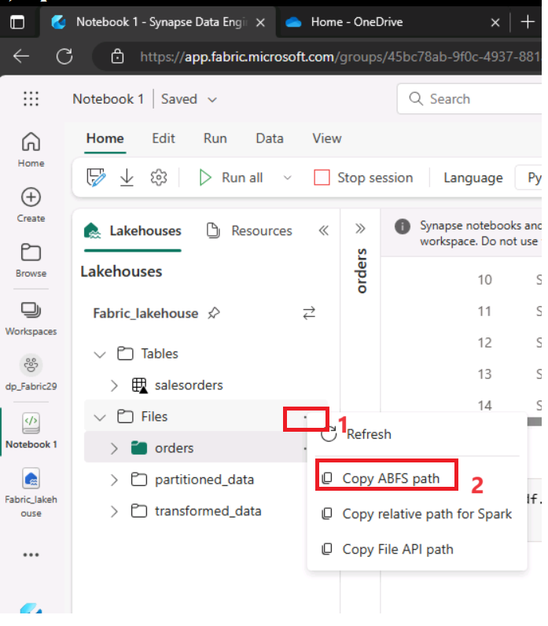
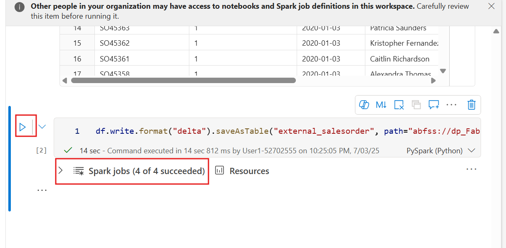

# Caso de uso 03 - Conversar com seus dados usando o Fabric Data Agent

**Introdução:**

Este caso de uso apresenta o Data Agent do Microsoft Fabric, que permite
consultas em linguagem natural sobre conjuntos de dados estruturados. Ao
aproveitar os Large Language Models (LLMs), o Fabric Data Agent pode
interpretar perguntas em inglês simples e traduzi-las em consultas T-SQL
válidas, executadas sobre os dados do lakehouse escolhido. Este
exercício prático orienta o processo de configuração do seu ambiente,
criação de um espaço de trabalho do Fabric, carregamento de dados e
utilização da habilidade de AI para interagir com os seus dados de forma
conversacional. Também irá explorar recursos avançados, como fornecer
exemplos de consultas, adicionar instruções para melhorar a precisão e
acionar a habilidade de AI programaticamente a partir de um bloco de
notas do Fabric.

**Objetivos:**

- Configurar um espaço de trabalho Fabric e carregar os dados em um
  ambiente Lakehouse.

- Criar e configurar um Data Agent para habilitar consultas em linguagem
  natural.

- Fazer perguntas em linguagem simples e visualizar os resultados das
  consultas SQL geradas por AI.

- Aprimorar as respostas da AI usando instruções personalizadas e
  exemplos de consultas.

- Utilizar o Data Agent programaticamente a partir de um bloco de notas
  do Fabric.

## **Tarefa 0: Sincronizar a hora do ambiente de hospedagem**

1.  Na sua máquina virtual, navegue e clique em **Search bar** digite
    **Settings** e clique em **Settings** em **Best match**.

> 

2.  Na janela **Settings**, navegue e clique em **Time & language**

3.  Na página **Time & language**, navegue e clique em **Date & time**.

4.  Desça a página e navegue até a seção **Additional settings** e
    clique no botão **Sync now**. A sincronização levará de 3 a 5
    minutos.

5.  Feche a janela de **Settings**.

## **Tarefa 1: Criar um espaço de trabalho Fabric**

Nesta tarefa, você criará um espaço de trabalho do Fabric. O espaço de
trabalho contém todos os itens necessários para este tutorial do
Lakehouse, incluindo o próprio Lakehouse, fluxos de dados, pipelines do
Data Factory, bloco de notas, conjuntos de dados do Power BI e
relatórios.

1.  Abra seu navegador, acesse a barra de endereços e digite ou cole a
    seguinte URL: +++https://app.fabric.microsoft.com/+++ Em seguida,
    pressione o botão **Enter**.

> 

2.  Na janela do **Microsoft Fabric**, insira suas credenciais e clique
    no botão **Submit**.

> 

3.  Em seguida, na janela da **Microsoft**, digite a senha e clique no
    botão **Sign in.**

> 

4.  Na janela **Stay signed in?**, clique no botão **Yes.**

> 

5.  No painel **Workspace**, selecione **+ New workspace**.

> 

6.  No painel **Create a workspace** que aparece no lado direito, insira
    os seguintes detalhes e clique no botão **Apply**.

[TABLE]

> 
>
> 

7.  Aguarde a conclusão da implementação. Leva de 1 a 2 minutos.

> 

## **Tarefa 2: Criar um lakehouse**

1.  Na página **Fabric**, selecione **+ New item** e escolha o bloco
    **Lakehouse**.

> 

2.  Na caixa de diálogo **New lakehouse**, digite
    +++**AI_Fabric_lakehouseXX**+++ no campo **Name**, clique no botão
    **Create** e abra o novo lakehouse.

> **Observação:** Certifique-se de remover o espaço antes de
> **AI_Fabric_lakehouseXX**.
>
> 

3.  Você verá uma notificação informando **Successfully created SQL
    endpoint**.

> 

4.  Em seguida, crie um novo bloco de notas para consultar a tabela. Na
    página **Home**, selecione a lista suspensa **Open notebook** e
    escolha **New notebook**.

## **Tarefa 3: Carregar os dados do AdventureWorksDW no lakehouse**

Primeiro, crie um lakehouse e preencha com os dados necessários.

Se você já possui uma instância do AdventureWorksDW em um armazém ou
lakehouse, pode pular esta etapa. Caso contrário, crie um lakehouse a
partir de um bloco de notas. Use o bloco de notas para preencher o
lakehouse com os dados.

1.  No editor de consultas, copie e cole o seguinte código. Selecione o
    botão **Run all** para executar a consulta. Após a conclusão da
    consulta, você verá os resultados.

> import pandas as pd
>
> from tqdm.auto import tqdm
>
> base =
> "https://synapseaisolutionsa.z13.web.core.windows.net/data/AdventureWorks"
>
> \# load list of tables
>
> df_tables = pd.read_csv(f"{base}/adventureworks.csv",
> names=\["table"\])
>
> for table in (pbar := tqdm(df_tables\['table'\].values)):
>
> pbar.set_description(f"Uploading {table} to lakehouse")
>
> \# download
>
> df = pd.read_parquet(f"{base}/{table}.parquet")
>
> \# save as lakehouse table
>
> spark.createDataFrame(df).write.mode('overwrite').saveAsTable(table)
>
> 
>
> 
>
> 

Após alguns minutos, o lakehouse é populado com os dados necessários.

## **Tarefa 4: Criar Data Agent**

1.  Agora, clique em **AI-Fabric-XXXX** no painel de navegação à
    esquerda.

2.  Na página inicial do **Fabric**, selecione **+ New item.**

3.  Na caixa de pesquisa **Filter by item type**, digite **+++data
    agent+++** e selecione **Data agent.**

4.  Insira **+++AI-agent+++** como o nome do Data Agent e selecione
    **Create**.

5.  Na página AI-agent, selecione **Add a data source**.

6.  Na aba **OneLake catalog**, selecione **AI-Fabric_lakehouse
    lakehouse** e selecione **Add**.

> 
>
> 

7.  Em seguida, você deve selecionar as tabelas às quais deseja que a
    habilidade de AI tenha acesso.

Este laboratório utiliza estas tabelas:

- DimCustomer

- DimDate

- DimGeography

- DimProduct

- DimProductCategory

- DimPromotion

- DimReseller

- DimSalesTerritory

- FactInternetSales

- FactResellerSales

> 

## **Tarefa 5: Fornecer instruções**

1.  Quando você faz as perguntas pela primeira vez com as tabelas
    listadas, selecionando **factinternetsales**, o Data Agent responde
    a elas de forma bastante satisfatória.

2.  Por exemplo, para a pergunta +++**What is the most sold
    product?+++**

3.  Copie a pergunta e as consultas SQL e cole-as em um bloco de notas.
    Em seguida, salve o bloco de notas para usar as informações nas
    próximas tarefas.

1.  Selecione **FactResellerSales**, insira o seguinte texto e clique no
    **ícone Submit**, conforme mostrado na imagem abaixo.

+++**What is our most sold product?**+++

À medida que você continua a experimentar consultas, deve adicionar mais
instruções.

2.  Selecione o **dimcustomer**, insira o seguinte texto e clique no
    **ícone Submit.**

+++**How many active customers did we have on June 1st, 2013?**+++

3.  Copie todas as perguntas e consultas SQL e cole-as em um bloco de
    notas. Em seguida, salve o bloco de notas para usar essas
    informações nas próximas tarefas.

4.  Selecione **dimdate**, **FactInternetSales**, insira o seguinte
    texto e clique no **ícone Submit:**

+++**what are the monthly sales trends for the last year?**+++

5.  Selecione o **dimproduct,** **FactInternetSales**, insira o seguinte
    texto e clique no **ícone Submit:**

+++**which product category had the highest average sales price?**+++

Parte do problema é que "active customer" não possui uma definição
formal. Mais instruções nas notas da caixa de texto do modelo poderiam
ajudar, mas os usuários podem fazer essa pergunta com frequência. É
preciso garantir que a AI lide com a questão corretamente.

6.  A consulta relevante é moderadamente complexa, portanto, forneça um
    exemplo selecionando o botão **Example queries** no painel
    **Setup**.

7.  Na aba **Example queries**, selecione **Add example.**

8.  Aqui, você deve adicionar exemplos de consultas para a fonte de
    dados Lakehouse que você criou. Adicione a seguinte pergunta no
    campo de perguntas:

**+++What is the most sold product?+++**

4.  Adicione a consulta 1 que você salvou no bloco de notas:  
      
    **SELECT TOP 1 ProductKey, SUM(OrderQuantity) AS TotalQuantitySold**

**FROM \[dbo\].\[factinternetsales\]**

**GROUP BY ProductKey**

**ORDER BY TotalQuantitySold DESC**

5.  Para adicionar um novo campo de consulta, clique em **+ Add.**

6.  Para adicionar uma segunda pergunta no campo de perguntas:

**+++What are the monthly sales trends for the last year?+++**

7.  Adicione a consulta3 que você salvou no bloco de notas:  
      
    **SELECT**

> **d.CalendarYear,**
>
> **d.MonthNumberOfYear,**
>
> **d.EnglishMonthName,**
>
> **SUM(f.SalesAmount) AS TotalSales**
>
> **FROM**
>
> **dbo.factinternetsales f**
>
> **INNER JOIN dbo.dimdate d ON f.OrderDateKey = d.DateKey**
>
> **WHERE**
>
> **d.CalendarYear = (**
>
> **SELECT MAX(CalendarYear)**
>
> **FROM dbo.dimdate**
>
> **WHERE DateKey IN (SELECT DISTINCT OrderDateKey FROM
> dbo.factinternetsales)**
>
> **)**
>
> **GROUP BY**
>
> **d.CalendarYear,**
>
> **d.MonthNumberOfYear,**
>
> **d.EnglishMonthName**
>
> **ORDER BY**

**d.MonthNumberOfYear**

8.  Para adicionar um novo campo de consulta, clique em **+ Add.**

9.  Para adicionar uma terceira pergunta no campo de perguntas:

**+++Which product category has the highest average sales price?+++**

10. Adicione a consulta que você salvou no bloco de notas:  
      
    **SELECT TOP 1**

> **dp.ProductSubcategoryKey AS ProductCategory,**
>
> **AVG(fis.UnitPrice) AS AverageSalesPrice**
>
> **FROM**
>
> **dbo.factinternetsales fis**
>
> **INNER JOIN**
>
> **dbo.dimproduct dp ON fis.ProductKey = dp.ProductKey**
>
> **GROUP BY**
>
> **dp.ProductSubcategoryKey**
>
> **ORDER BY**

**AverageSalesPrice DESC**

9.  Adicione todas as consultas e consultas SQL que você salvou no bloco
    de notas e clique em **‘Export all’**

**Tarefa 6: Usar o Data Agent programaticamente**

Instruções e exemplos foram adicionados ao Data Agent. Conforme os
testes progridem, mais exemplos e instruções podem aprimorar ainda mais
as habilidades da AI. Trabalhe com seus colegas para verificar se você
forneceu exemplos e instruções que abrangem os tipos de perguntas que
eles desejam fazer.

Você pode usar a habilidade de AI programaticamente em um bloco de notas
do Fabric. Para determinar se a habilidade de AI possui ou não um valor
de URL publicado.

1.  Na página Data agent Fabric, na faixa de opções **Home**, selecione
    **Settings**.

2.  Antes de publicar a habilidade da AI, ela não possui um valor de URL
    publicado, conforme mostrado nesta captura de tela.

3.  Feche as configurações da habilidade de AI.

4.  Na página **Home**, selecione **Publish**.

5.  Clique em **View publishing details.**

6.  O URL publicado para o agente de AI é exibido, conforme mostrado
    nesta captura de tela.

7.  Copie o URL e cole-o em um bloco de notas. Em seguida, salve o bloco
    de notas para usar essas informações nas próximas etapas.

8.  Selecione **Notebook1** no painel de navegação à esquerda.

9.  Use o ícone + **Code** abaixo da saída da célula para adicionar uma
    nova célula de código ao bloco de notas, insira o código a seguir e
    substitua o **URL**. Clique no botão ▷ **Run** e revise a saída.

**+++%pip install "openai==1.70.0"+++**

10. Use o ícone + **Code** abaixo da saída da célula para adicionar uma
    nova célula de código ao bloco de notas, insira o código a seguir e
    substitua o **URL**. Clique no botão ▷ **Run** e revise a saída.

**+++%pip install httpx==0.27.2+++**

11. Use o ícone **+ Code** abaixo da saída da célula para adicionar uma
    nova célula de código ao bloco de notas, insira o seguinte código e
    substitua a **URL**. Clique no botão **▷ Run** e revise a saída.

> import requests
>
> import json
>
> import pprint
>
> import typing as t
>
> import time
>
> import uuid
>
> from openai import OpenAI
>
> from openai.\_exceptions import APIStatusError
>
> from openai.\_models import FinalRequestOptions
>
> from openai.\_types import Omit
>
> from openai.\_utils import is_given
>
> from synapse.ml.mlflow import get_mlflow_env_config
>
> from sempy.fabric.\_token_provider import SynapseTokenProvider
>
> base_url = "https://\<generic published base URL value\>"
>
> question = "What datasources do you have access to?"
>
> configs = get_mlflow_env_config()
>
> \# Create OpenAI Client
>
> class FabricOpenAI(OpenAI):
>
> def \_\_init\_\_(
>
> self,
>
> api_version: str ="2024-05-01-preview",
>
> \*\*kwargs: t.Any,
>
> ) -\> None:
>
> self.api_version = api_version
>
> default_query = kwargs.pop("default_query", {})
>
> default_query\["api-version"\] = self.api_version
>
> super().\_\_init\_\_(
>
> api_key="",
>
> base_url=base_url,
>
> default_query=default_query,
>
> \*\*kwargs,
>
> )
>
> def \_prepare_options(self, options: FinalRequestOptions) -\> None:
>
> headers: dict\[str, str | Omit\] = (
>
> {\*\*options.headers} if is_given(options.headers) else {}
>
> )
>
> options.headers = headers
>
> headers\["Authorization"\] = f"Bearer {configs.driver_aad_token}"
>
> if "Accept" not in headers:
>
> headers\["Accept"\] = "application/json"
>
> if "ActivityId" not in headers:
>
> correlation_id = str(uuid.uuid4())
>
> headers\["ActivityId"\] = correlation_id
>
> return super().\_prepare_options(options)
>
> \# Pretty printing helper
>
> def pretty_print(messages):
>
> print("---Conversation---")
>
> for m in messages:
>
> print(f"{m.role}: {m.content\[0\].text.value}")
>
> print()
>
> fabric_client = FabricOpenAI()
>
> \# Create assistant
>
> assistant = fabric_client.beta.assistants.create(model="not used")
>
> \# Create thread
>
> thread = fabric_client.beta.threads.create()
>
> \# Create message on thread
>
> message =
> fabric_client.beta.threads.messages.create(thread_id=thread.id,
> role="user", content=question)
>
> \# Create run
>
> run = fabric_client.beta.threads.runs.create(thread_id=thread.id,
> assistant_id=assistant.id)
>
> \# Wait for run to complete
>
> while run.status == "queued" or run.status == "in_progress":
>
> run = fabric_client.beta.threads.runs.retrieve(
>
> thread_id=thread.id,
>
> run_id=run.id,
>
> )
>
> print(run.status)
>
> time.sleep(2)
>
> \# Print messages
>
> response =
> fabric_client.beta.threads.messages.list(thread_id=thread.id,
> order="asc")
>
> pretty_print(response)
>
> \# Delete thread

fabric_client.beta.threads.delete(thread_id=thread.id)

**Tarefa 7: Excluir os recursos**

1.  Selecione seu espaço de trabalho, **AI-Fabric-XXXX,** no menu de
    navegação à esquerda. Isso abrirá a visualização do item do espaço
    de trabalho.

2.  Selecione a opção**...** abaixo do nome do espaço de trabalho e
    selecione **Workspace settings**.

3.  Selecione **Other** e **Remove this workspace.**

4.  Clique em **Delete** no aviso que aparecer.

**Resumo:**

Neste laboratório, você aprendeu a desbloquear o poder da análise
conversacional usando o Data Agent do Microsoft Fabric. Você configurou
um espaço de trabalho do Fabric, ingeriu dados estruturados em um
lakehouse e configurou uma habilidade de AI para traduzir perguntas em
linguagem natural em consultas SQL. Você também aprimorou os recursos do
agente de AI fornecendo instruções e exemplos para refinar a geração de
consultas. Por fim, você chamou o agente programaticamente a partir de
um bloco de notas do Fabric, demonstrando a integração de AI completa.
Este laboratório permite que você torne os dados corporativos mais
acessíveis, utilizáveis e inteligentes para usuários de negócios por
meio de tecnologias de linguagem natural e AI generativa.
