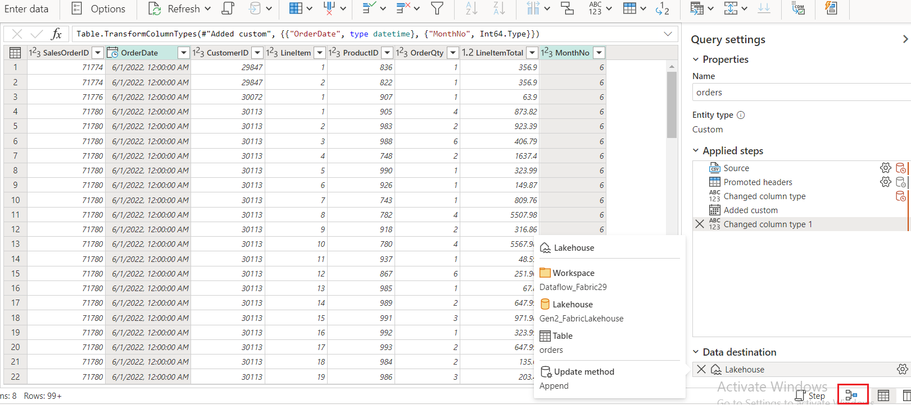

# Caso de uso 04: Analizar datos con Apache Spark

**Introducción**

Apache Spark es un motor de procesamiento distribuido de código abierto
ampliamente utilizado para explorar, procesar y analizar grandes
volúmenes de datos almacenados en data lake. Spark está disponible como
opción de procesamiento en muchos productos de plataformas de datos,
incluidos Azure HDInsight, Azure Databricks, Azure Synapse Analytics y
Microsoft Fabric.

Una de sus principales ventajas es la compatibilidad con diversos
lenguajes de programación, entre ellos Java, Scala, Python y SQL, lo que
convierte a Spark en una solución altamente flexible para cargas de
trabajo de procesamiento de datos que incluyen limpieza y manipulación
de datos, análisis estadístico, machine learning, y analítica y
visualización de datos.

Las tablas en un lakehouse de Microsoft Fabric se basan en el formato
abierto Delta Lake para Apache Spark. Delta Lake agrega compatibilidad
con semánticas relacionales para operaciones de datos de batch y
streaming, y habilita la creación de una arquitectura Lakehouse en la
que Apache Spark puede procesar y consultar datos en tablas respaldadas
por archivos almacenados en un data lake.

En Microsoft Fabric, los Dataflows (Gen2) se conectan a diversas fuentes
de datos y realizan transformaciones en Power Query Online. Luego pueden
utilizarse en Data Pipelines para ingerir datos en un lakehouse u otro
almacén analítico, o para definir un dataset para un informe de Power
BI.

Este laboratorio está diseñado para introducir los distintos elementos
de Dataflows (Gen2), sin crear una solución compleja como las que
podrían existir en un entorno empresarial.

**Objetivos**:

- Crear un espacio de trabajo en Microsoft Fabric con el período de
  prueba de Fabric habilitado.

- Establecer un entorno de lakehouse y cargar archivos de datos para su
  análisis.

- Generar un notebook para la exploración y el análisis interactivo de
  datos.

- Cargar los datos en un dataframe para su posterior procesamiento y
  visualización.

- Aplicar transformaciones a los datos utilizando PySpark.

- Guardar y particionar los datos transformados para optimizar las
  consultas.

- Crear una tabla en el Spark metastore para la gestión estructurada de
  datos.

- Guardar el DataFrame como una tabla Delta administrada llamada
  "salesorders".

- Guardar el DataFrame como una tabla Delta externa llamada
  "external_salesorder" con una ruta especificada.

- Describir y comparar las propiedades de las tablas administradas y
  externas.

- Ejecutar consultas SQL sobre las tablas para análisis y creación de
  informes.

- Visualizar datos utilizando bibliotecas de Python como matplotlib y
  seaborn.

- Establecer un data lakehouse en la experiencia de Data Engineering e
  ingerir datos relevantes para análisis posteriores.

- Definir un dataflow para extraer, transformar y cargar datos en el
  lakehouse.

- Configurar destinos de datos en Power Query para almacenar los datos
  transformados en el lakehouse.

- Incorporar el dataflow en un pipeline para habilitar el procesamiento
  e ingestión programada de datos.

- Eliminar el espacio de trabajo y los elementos asociados para concluir
  el ejercicio..

# Ejercicio 1: Crear un espacio de trabajo, un lakehouse, un notebook y cargar datos en un dataframe 

## Tarea 1: Crear un espacio de trabajo 

Antes de comenzar a trabajar con datos en Fabric, cree un espacio de
trabajo con la versión de prueba de Fabric habilitada.

1.  Abra su navegador, diríjase a la barra de direcciones y escriba o
    pegue la siguiente URL: +++https://app.fabric.microsoft.com/+++
    Luego presione **Enter**.

> **Nota:** Si es dirigido a la página de inicio de Microsoft Fabric,
> omita los pasos del **\#2** al **\#4**.
>
> 

2.  En la ventana de **Microsoft Fabric**, ingrese sus credenciales y
    haga clic en el botón **Submit**.
    |   |   |
    |---|---|
    | Username | +++@lab.CloudPortalCredential(User1).Username+++ |
    | Password | +++@lab.CloudPortalCredential(User1).Password+++ |

> 

3.  Luego, en la ventana de **Microsoft**, ingrese la contraseña y haga
    clic en el botón **Sign in**.

> 

4.  En la ventana **Stay signed in?,** haga clic en el botón **Yes.**

> 

5.  En la página principal de Fabric, seleccione el recuadro **+New
    workspace**.

> 

6.  En la pestaña **Create a workspace**, ingrese los siguientes datos y
    haga clic en el botón **Apply**.

    |  |  |
    |-----|----|
    |Name|	+++dp_Fabric@lab.LabInstance.Id+++ (must be a unique Id)| 
    |Description|	This workspace contains Analyze data with Apache Spark|
    |Advanced|	Under License mode, select Fabric capacity|
    |Default storage format	|Small dataset storage format|

> 
>
> 

7.  Espere a que la implementación finalice. Este proceso puede tardar
    entre 2 y 3 minutos. Una vez que se abra su nuevo espacio de
    trabajo, este debería estar vacío.

> 

## Tarea 2: Crear un lakehouse y cargar archivos

Ahora que ya cuenta con un espacio de trabajo, es momento de cambiar a
la experiencia de Data engineering en el portal y crear un data
lakehouse para los archivos de datos que analizará.

1.  Cree un nuevo **Eventhouse** haciendo clic en el botón **+New item**
    en la barra de navegación.


2.  Haga clic en el recuadro **Lakehouse.**


3.  En el cuadro de diálogo **New lakehouse**, ingrese
    +++Fabric_lakehouse+++ en el campo **Name**, haga clic en el botón
    **Create** y abra el nuevo **lakehouse**.


4.  Después de aproximadamente un minuto, se habrá creado un
    **lakehouse** vacío. Necesita ingerir datos en el data lakehouse
    para su análisis.


5.  Verá una notificación indicando **Successfully created SQL
    endpoint**.


6.  En la sección **Explorer**, debajo de **fabric_lakehouse**, coloque
    el cursor junto a la carpeta **Files** y luego haga clic en el menú
    de puntos horizontales **(…)**. Navegue a **Upload** y haga clic en
    **Upload folder**, como se muestra en la imagen.


7.  En el panel **Upload folder** que aparece en el lado derecho,
    seleccione el **ícono de carpeta** bajo **Files/**, navegue a
    **C:\LabFiles**, seleccione la carpeta **orders** y haga clic en el
    botón **Upload**.


8.  Si aparece el cuadro de diálogo **Upload 3 files to this site?,**
    haga clic en el botón **Upload**.


9.  En el panel **Upload folder**, haga clic en el botón **Upload**.

> 

10. Después de que los archivos se hayan cargado, cierre el panel
    **Upload folder**.


11. Expanda **Files**, seleccione la carpeta **orders** y verifique que
    los archivos **CSV** se hayan cargado correctamente.

> 

## Tarea 3: Crear un notebook

Para trabajar con datos en Apache Spark, puede crear un notebook. Los
notebooks proporcionan un entorno interactivo en el que puede escribir y
ejecutar código (en múltiples lenguajes) y agregar notas para
documentarlo.

1.  En la página **Home,** mientras visualiza el contenido de la carpeta
    **orders** en su datalake, en el menú **Open notebook**, seleccione
    **New notebook**.


2.  Después de unos segundos, se abrirá un nuevo notebook que contiene
    una única celda. Los notebooks están formados por una o más cells,
    que pueden contener código o **markdown** (texto con formato)..


3.  Seleccione la primera celda (que actualmente es una **code cell**)
    y, en la barra de herramientas dinámica ubicada en la parte superior
    derecha de la celda, utilice el botón **M↓** para convertirla en una
    **celda de Markdown**.


4.  Cuando la celda se convierta a formato markdown, el texto que
    contiene se mostrará con el formato aplicado.


5.  Use el botón **🖉 (Edit)** para cambiar la celda al modo de edición.
    Reemplace todo el texto y modifíquelo como se indica a continuación:

    ```
    # Sales order data exploration
    
    Use the code in this notebook to explore sales order data.
    ```


6.  Haga clic en cualquier parte del notebook fuera de la celda para
    dejar de editarla y visualizar el markdown con su formato aplicado.


## Tarea 4: Cargar datos en un dataframe

Ahora está listo para ejecutar código que cargue los *datos en un
dataframe*. Los dataframes en Spark son similares a los dataframes de
Pandas en Python, y proporcionan una estructura común para trabajar con
datos organizados en filas y columnas.

**Nota:** Spark admite múltiples lenguajes de programación, incluidos
Scala, Java y otros. En este ejercicio usaremos PySpark, que es una
variante optimizada de Spark para Python. PySpark es uno de los
lenguajes más utilizados en Spark y es el lenguaje predeterminado en los
notebooks de Fabric.

1.  Con el notebook visible, expanda la lista **Files** y seleccione la
    carpeta orders para que los archivos **CSV** se muestren junto al
    editor del **notebook**.

> 

2.  Luego, coloque el cursor sobre el archivo 2019.csv. Haga clic en los
    puntos horizontales **(…)** junto a **2019.csv**. Navegue a **Load
    data** y seleccione **Spark**.  
    Se agregará una nueva ***code cell*** al notebook con el siguiente
    código:

    ```
    df = spark.read.format("csv").option("header","true").load("Files/orders/2019.csv")
    # df now is a Spark DataFrame containing CSV data from "Files/orders/2019.csv".
    display(df)
    ```

> 
>
> 

**Tip**: Puede ocultar los paneles del Lakehouse explorer a la izquierda
utilizando los íconos «.

Esto le ayudará a enfocarse en el notebook.

3.  Use el botón **▷ Run cell** a la izquierda de la celda para
    ejecutarla.


**Nota:** Dado que esta es la primera vez que ejecuta código de Spark,
debe iniciarse una sesión de Spark. Esto puede hacer que la primera
ejecución tarde alrededor de un minuto. Las ejecuciones siguientes serán
más rápidas.

4.  Cuando el comando haya finalizado, revise el resultado que aparece
    debajo de la celda:


5.  El resultado muestra las filas y columnas del archivo 2019.csv. Sin
    embargo, los encabezados no se muestran correctamente.

El código predeterminado utilizado para cargar los datos asume que la
primera fila del CSV contiene los nombres de las columnas, pero en este
caso, el archivo no incluye encabezados.

6.  Modifique el código para establecer la opción **header** en
    **false**.  
    Reemplace todo el código de la celda con lo siguiente, haga clic en
    **▷ Run cell** y revise el resultado:


    ```
    df = spark.read.format("csv").option("header","false").load("Files/orders/2019.csv")
    # df now is a Spark DataFrame containing CSV data from "Files/orders/2019.csv".
    display(df)
    ```


7.  Ahora el dataframe incluye correctamente la primera fila como
    valores de datos, pero los nombres de columnas son generados
    automáticamente y no son muy útiles.

Para interpretar los datos, necesita definir explícitamente el schema
correcto y el tipo de dato para cada campo.

8.  Reemplace todo el código de la **celda** con lo siguiente, haga clic
    en **▷ Run cell** y revise el resultado:

    ```
    from pyspark.sql.types import *
    
    orderSchema = StructType([
        StructField("SalesOrderNumber", StringType()),
        StructField("SalesOrderLineNumber", IntegerType()),
        StructField("OrderDate", DateType()),
        StructField("CustomerName", StringType()),
        StructField("Email", StringType()),
        StructField("Item", StringType()),
        StructField("Quantity", IntegerType()),
        StructField("UnitPrice", FloatType()),
        StructField("Tax", FloatType())
        ])
    
    df = spark.read.format("csv").schema(orderSchema).load("Files/orders/2019.csv")
    display(df)
    ```
> 
>
> 

9.  Ahora el dataframe incluye los nombres de columna correctos (además
    de la columna Index, que es una columna integrada basada en la
    posición ordinal de cada fila).

Los tipos de datos se especifican utilizando el conjunto estándar de
tipos definidos en la biblioteca **Spark SQL**, importados al inicio de
la celda.

10. Confirme que los cambios se han aplicado correctamente visualizando
    el dataframe.

11. Use el ícono **+ Code** debajo del resultado de la celda para
    agregar una nueva **code cell** al notebook.

> Ingrese el siguiente código, ejecute con **▷ Run cell** y revise el
> resultado:
    ```
    display(df)
    ```
> 

12. El dataframe contiene únicamente los datos del archivo
    **2019.csv**.  
    Modifique el código para que la ruta del archivo utilice un comodín
    \* y así leer los datos de todos los archivos de la carpeta
    **orders**.

13. Use el ícono **+ Code** para agregar una nueva celda e ingrese el
    siguiente código:

CodeCopy

    ```
    from pyspark.sql.types import *
    
    orderSchema = StructType([
        StructField("SalesOrderNumber", StringType()),
        StructField("SalesOrderLineNumber", IntegerType()),
        StructField("OrderDate", DateType()),
        StructField("CustomerName", StringType()),
        StructField("Email", StringType()),
        StructField("Item", StringType()),
        StructField("Quantity", IntegerType()),
        StructField("UnitPrice", FloatType()),
        StructField("Tax", FloatType())
        ])
    
    df = spark.read.format("csv").schema(orderSchema).load("Files/orders/*.csv")
    display(df)
    ```
> 

14. Ejecute la celda modificada y revise el resultado, que ahora debe
    incluir datos de ventas de 2019, 2020 y 2021.

> 

**Nota:** Solo se muestra un subconjunto de las filas, por lo que puede
que no aparezcan ejemplos de todos los años.

# Ejercicio 2: Explorar datos en un dataframe

El objeto dataframe incluye una amplia gama de funciones que puede
utilizar para filtrar, agrupar y manipular los datos que contiene.

## Tarea 1: Filtrar un dataframe

1.  Use el ícono **+ Code** debajo del resultado de la celda para
    agregar una nueva **code cell** al notebook e ingrese el siguiente
    código:

    ```
    customers = df['CustomerName', 'Email']
    print(customers.count())
    print(customers.distinct().count())
    display(customers.distinct())
    ```
> 

2.  **Ejecute** la nueva celda de código y revise los resultados.
    Observe los siguientes detalles:

    - Al realizar una operación sobre un dataframe, el resultado es un
      nuevo dataframe. En este caso, se crea un nuevo dataframe
      denominado **customers**, que contiene un subconjunto específico
      de columnas del dataframe **df**.

    - Los dataframes proporcionan funciones como **count** y
      **distinct**, que pueden utilizarse para resumir y filtrar los
      datos que contienen.

    - La sintaxis dataframe\['Field1', 'Field2', ...\] es una forma
      abreviada de definir un subconjunto de columnas. También puede
      utilizarse el método **select**, por lo que la primera línea del
      código anterior podría escribirse como customers =
      df.select("CustomerName", "Email")

> 

3.  Modifique el código reemplazando todo el contenido de la **celda**
    con el siguiente código y haga clic en **▷ Run cell**:

    ```
    customers = df.select("CustomerName", "Email").where(df['Item']=='Road-250 Red, 52')
    print(customers.count())
    print(customers.distinct().count())
    display(customers.distinct())
    ```

4.  **Ejecute** el código modificado para ver los clientes que han
    comprado el producto **Road-250 Red, 52**. Tenga en cuenta que es
    posible “**encadenar**” múltiples funciones, de manera que el
    resultado de una función se convierta en la entrada de la siguiente.
    En este caso, el dataframe generado por el método **select** sirve
    como dataframe de origen para el método **where,** que se utiliza
    para aplicar los criterios de filtrado.

> 

## Tarea 2: Agregar y agrupar datos en un dataframe

1.  Haga clic en **+ Code**, copie y pegue el siguiente código, y luego
    haga clic en **▷ Run cell**:

> **CodeCopy:**
    ```
    productSales = df.select("Item", "Quantity").groupBy("Item").sum()
    display(productSales)
    ```
> 

2.  Observe que los resultados muestran la suma de las cantidades de los
    pedidos agrupadas por producto.

El método **groupBy** agrupa las filas según la columna *Item*, y la
función agregada **sum** se aplica a todas las columnas numéricas
restantes (en este caso, *Quantity*).

3.  Haga clic en **+ Code**, copie y pegue el siguiente código, y luego
    haga clic en **▷ Run cell**:


    ```
    from pyspark.sql.functions import *
    
    yearlySales = df.select(year("OrderDate").alias("Year")).groupBy("Year").count().orderBy("Year")
    display(yearlySales)
    ```
> 

4.  Los resultados muestran la cantidad de órdenes de venta por año.

Algunos detalles importantes:

- El método **select** utiliza la función **year** de SQL para extraer
  el componente de año del campo *OrderDate* (por eso se **importa** la
  biblioteca de funciones de Spark SQL).

- Se utiliza **alias** para asignar un nombre de columna al valor del
  año extraído.

- Los datos se agrupan según la columna derivada *Year* y se calcula el
  conteo de filas en cada grupo.

- Finalmente, **orderBy** se utiliza para ordenar el dataframe
  resultante según el año.

# Ejercicio 3: Usar Spark para transformar archivos de datos

Una tarea común para los ingenieros de datos es ingerir datos en un
formato o estructura determinada y transformarlos para un procesamiento
o análisis posterior.

## Tarea 1: Usar métodos y funciones de dataframe para transformar datos

1.  Haga clic en + Code y copie y pegue el siguiente código:

**CodeCopy**

    ```
    from pyspark.sql.functions import *
    
    ## Create Year and Month columns
    transformed_df = df.withColumn("Year", year(col("OrderDate"))).withColumn("Month", month(col("OrderDate")))
    
    # Create the new FirstName and LastName fields
    transformed_df = transformed_df.withColumn("FirstName", split(col("CustomerName"), " ").getItem(0)).withColumn("LastName", split(col("CustomerName"), " ").getItem(1))
    
    # Filter and reorder columns
    transformed_df = transformed_df["SalesOrderNumber", "SalesOrderLineNumber", "OrderDate", "Year", "Month", "FirstName", "LastName", "Email", "Item", "Quantity", "UnitPrice", "Tax"]
    
    # Display the first five orders
    display(transformed_df.limit(5))
    ```
> 

2.  **Ejecute** el código para crear un nuevo dataframe a partir de los
    datos originales de pedidos con las siguientes transformaciones:

    - Agregar las columnas **Year** y **Month** basadas en la columna
      **OrderDate**.

    - Agregar las columnas **FirstName** y **LastName** basadas en la
      columna **CustomerName**.

    - Filtrar y reordenar las columnas, eliminando la columna
      **CustomerName**.

> 

3.  Revise el resultado y verifique que las transformaciones se hayan
    aplicado correctamente a los datos.


Puede utilizar todo el potencial de la biblioteca Spark SQL para
transformar los datos: filtrar filas, derivar nuevas columnas, eliminar
o renombrar columnas, y aplicar cualquier otra modificación de datos que
sea necesaria.

**Tip**: Consulte la [**documentación de Spark dataframe**](https://spark.apache.org/docs/latest/api/python/reference/pyspark.sql/dataframe.html)
 para conocer más sobre los métodos disponibles del objeto Dataframe.

## Tarea 2: Guardar los datos transformados

1.  **Agregue una nueva celda** con el siguiente código para guardar el
    dataframe transformado en formato Parquet (sobrescribiendo los datos
    si ya existen). **Ejecute** la celda y espere el mensaje que
    confirme que los datos se han guardado.


    ```
    transformed_df.write.mode("overwrite").parquet('Files/transformed_data/orders')
    print ("Transformed data saved!")
    ```
> **Nota:** El formato *Parquet* se prefiere comúnmente para archivos de
> datos que se usarán para análisis posterior o para ingestión en un
> almacén analítico. Parquet es un formato muy eficiente y es compatible
> con la mayoría de los sistemas de análisis de datos a gran escala.  
> De hecho, en algunos casos, su requisito de transformación de datos
> puede ser simplemente convertir datos de otro formato (como CSV) a
> Parquet.
>
> 
>
> 

2.  Luego, en el panel **Lakehouse explorer** a la izquierda, haga clic
    en el menú … del nodo **Files** y seleccione **Refresh**.

> 

3.  Haga clic en la carpeta **transformed_data** para verificar que
    contiene una nueva carpeta llamada **orders**, la cual a su vez
    contiene uno o más archivos **Parquet.**

> 

4.  Haga clic en **+ Code** e ingrese el siguiente código para cargar un
    nuevo dataframe desde los archivos Parquet ubicados en la carpeta
    **transformed_data -\> orders**:

> **CodeCopy**
    ```
    orders_df = spark.read.format("parquet").load("Files/transformed_data/orders")
    display(orders_df)
    ```
> 

5.  **Ejecute** la celda y verifique que los resultados muestren los
    datos de pedidos que se han cargado desde los archivos Parquet.

> 

## Tarea 3: Guardar los datos en archivos particionados

1.  Agregue una nueva celda haciendo clic en **+ Code** e ingrese el
    siguiente código, que guarda el dataframe particionando los datos
    por **Year** y **Month.** **Ejecute** la celda y espere el mensaje
    que confirme que los datos se han guardado:

> CodeCopy
    ```
    orders_df.write.partitionBy("Year","Month").mode("overwrite").parquet("Files/partitioned_data")
    print ("Transformed data saved!")
    ```
> 
>
> 

2.  Luego, en el panel **Lakehouse explorer** a la izquierda, haga clic
    en el menú … del nodo **Files** y seleccione **Refresh**.


3.  Expanda la carpeta **partitioned_orders** para verificar que
    contiene una jerarquía de carpetas con el formato **Year=xxxx**,
    cada una con carpetas **Month=xxxx**.

Cada carpeta de mes contiene un archivo Parquet con los pedidos
correspondientes a ese mes.


> Nota: Particionar archivos de datos es una técnica común para
> optimizar el rendimiento cuando se trabaja con grandes volúmenes de
> datos. Esta técnica puede mejorar significativamente el desempeño y
> facilita el filtrado de datos.

4.  Agregue una nueva celda haciendo clic en **+ Code** e ingrese el
    siguiente código para cargar un nuevo dataframe desde el archivo
    **orders.parquet**:

> CodeCopy
    ```
    orders_2021_df = spark.read.format("parquet").load("Files/partitioned_data/Year=2021/Month=*")
    display(orders_2021_df)
    ```

5.  **Ejecute** la celda y verifique que los resultados muestren los
    datos de pedidos correspondientes a las ventas de 2021.

Tenga en cuenta que las columnas de partición especificadas en la ruta
(**Year** y **Month**) no se incluyen automáticamente en el dataframe.


# **Ejercicio 3: Trabajar con tablas y SQL**

Como se ha observado, los métodos nativos del objeto dataframe permiten
consultar y analizar datos desde un archivo de manera eficiente.  
Sin embargo, muchos analistas de datos prefieren trabajar con tablas que
pueden consultar utilizando sintaxis SQL.  
Spark proporciona un metastore en el que se pueden definir tablas
relacionales. La biblioteca Spark SQL, que implementa el objeto
dataframe, también soporta el uso de sentencias SQL para consultar
tablas dentro del metastore.  
Al aprovechar estas capacidades de Spark, es posible combinar la
flexibilidad de un data lake con la estructura de datos y las consultas
SQL propias de un data warehouse relacional; de ahí el término “data
lakehouse”.

## Tarea 1: Crear una tabla administrada

Las tablas en un Spark metastore son abstracciones relacionales sobre
archivos en el data lake.Existen dos tipos de tablas:  
**Managed:** los archivos subyacentes son gestionados por el
metastore.  
**External:** la tabla referencia una ubicación de archivos en el data
lake, que se gestiona de forma independiente al metastore.

1.  Agregue una nueva celda haciendo clic en **+ Code** en el notebook e
    ingrese el siguiente código para guardar el dataframe de pedidos
    como una tabla llamada **salesorders**:

    ```
    # Create a new table
    df.write.format("delta").saveAsTable("salesorders")
    
    # Get the table description
    spark.sql("DESCRIBE EXTENDED salesorders").show(truncate=False)
    ```

**Nota:** Cabe destacar algunos aspectos importantes de este ejemplo. En
primer lugar, no se proporciona una ruta explícita; por lo tanto, los
archivos de la tabla serán gestionados por el metastore. En segundo
lugar, la tabla se guarda en formato **delta**.  
Es posible crear tablas basadas en múltiples formatos de archivo
(incluyendo CSV, Parquet, Avro, entre otros), pero *Delta Lake* es una
tecnología de Spark que agrega capacidades de base de datos relacional a
las tablas, incluyendo soporte para transacciones, versionado de filas y
otras funcionalidades avanzadas.  
La creación de tablas en formato delta es la práctica recomendada para
data lakehouses en Fabric.

2.  **Ejecute** la celda y revise el resultado, la cual describe la
    definición de la nueva tabla.


3.  En el panel **Lakehouse explorer**, haga clic en el menú … de la
    carpeta **Tables** y seleccione **Refresh**.


4.  Expanda el nodo **Tables** y verifique que la tabla **salesorders**
    se haya creado dentro del esquema **dbo**.

> 

5.  Coloque el cursor junto a la tabla **salesorders**, haga clic en los
    puntos horizontales **(…)**, navegue a **Load data** y seleccione
    **Spark**.

> 

6.  Haga clic en **▷ Run cell** para ejecutar una consulta SQL sobre la
    tabla salesorders mediante PySpark, cargando los resultados en un
    dataframe:

    ```
    df = spark.sql("SELECT * FROM [your_lakehouse].salesorders LIMIT 1000")
    display(df)
    ```


## Tarea 2: Crear una tabla externa

También es posible crear tablas externas, en las cuales el metastore del
lakehouse almacena el esquema (schema metadata), pero los archivos de
datos se almacenan en una ubicación externa.

1.  Debajo de los resultados devueltos por la primera celda de código,
    utilice el botón **+ Code** para agregar una nueva celda (si aún no
    existe). Luego, ingrese el siguiente código en la nueva celda:

CodeCopy

    ```
    df.write.format("delta").saveAsTable("external_salesorder", path="<abfs_path>/external_salesorder")
    ```


2.  En el panel **Lakehouse explorer**, en el menú … de la carpeta
    **Files**, seleccione **Copy ABFS path** para copiar la ruta en el
    bloc de notas.

> La ruta **ABFS** corresponde a la ruta totalmente calificada hacia la
> carpeta **Files** en el almacenamiento OneLake de su lakehouse. Esta
> tendrá un aspecto similar al siguiente:

abfss://dp_Fabric29@onelake.dfs.fabric.microsoft.com/Fabric_lakehouse.Lakehouse/Files/external_salesorder

> 

3.  Luego, regrese a la celda de código y reemplace **\<abfs_path\>**
    con la **ruta** que copió en el bloc de notas, de modo que el código
    guarde el dataframe como una tabla externa, almacenando los archivos
    de datos en una carpeta llamada **external_salesorder** ubicada
    dentro de su carpeta **Files**.

La ruta completa debe verse similar a:

abfss://dp_Fabric29@onelake.dfs.fabric.microsoft.com/Fabric_lakehouse.Lakehouse/Files/external_salesorder

4.  Utilice el botón **▷ (Run cell)** a la izquierda de la celda para
    ejecutarla.


5.  En el panel **Lakehouse explorer**, en el menú … de la carpeta
    **Tables**, seleccione **Refresh**.


6.  Expanda el nodo **Tables** y verifique que la tabla
    **external_salesorder** haya sido creada.


7.  En el panel **Lakehouse explorer**, en el menú … de la carpeta
    **Files**, seleccione nuevamente **Refresh**.


8.  Expanda el nodo **Files** y verifique que se haya creado la carpeta
    **external_salesorder** que contiene los archivos de datos
    correspondientes a la tabla.


## Tarea 3: Comparación entre tablas managed y external

A continuación, explorará las diferencias entre las tablas managed y
external.

1.  Debajo de los resultados devueltos por la celda de código, utilice
    el botón **+ Code** para agregar una nueva celda. Copie el siguiente
    código en la celda y utilice el botón **▷ (Run cell)** ubicado a la
    izquierda de la celda para ejecutarlo.

    ```
    %%sql
    
    DESCRIBE FORMATTED salesorders;
    ```
> 

2.  En los resultados, revise la propiedad **Location**, que debe ser
    una ruta hacia el almacenamiento OneLake del lakehouse y debe
    finalizar con /**Tables/salesorders**.

(Es posible que necesite ampliar la columna **Data type** para
visualizar la ruta completa).


3.  Modifique el comando **DESCRIBE** para mostrar los detalles de la
    tabla **external_salesorder**, como se indica a continuación.

4.  Debajo de los resultados de la celda, utilice nuevamente el botón
    **+ Code** para agregar una nueva celda. Copie el siguiente código y
    ejecútelo utilizando el botón **▷ (Run cell):**

    ```
    %%sql
    
    DESCRIBE FORMATTED external_salesorder;
    ```

5.  En los resultados, revise la propiedad **Location**, que debe ser
    una ruta en el almacenamiento OneLake del lakehouse que finalice con
    /**Files/external_salesorder**.

(Nuevamente, es posible que deba ampliar la columna **Data type** para
visualizar la ruta completa).


## Tarea 4: Ejecutar código SQL en una celda

Si bien resulta útil poder insertar instrucciones SQL en una celda que
contiene código PySpark, los analistas de datos a menudo prefieren
trabajar directamente en SQL.

1.  Haga clic en **+ Code** para agregar una celda al notebook, e
    ingrese en ella el siguiente código. Haga clic en el botón **▷ (Run
    cell)** y revise los resultados. Observe que:

    - La línea %%sql al inicio de la celda (conocida como magic) indica
      que debe utilizarse el motor de ejecución de Spark SQL en lugar de
      PySpark para ejecutar el código de esta celda.

    - El código SQL hace referencia a la tabla salesorders, que creó
      previamente.

    - El resultado de la consulta SQL se muestra automáticamente como
      salida bajo la celda.

      ```
      %%sql
      SELECT YEAR(OrderDate) AS OrderYear,
             SUM((UnitPrice * Quantity) + Tax) AS GrossRevenue
      FROM salesorders
      GROUP BY YEAR(OrderDate)
      ORDER BY OrderYear;
      ```


**Nota:** Para obtener más información sobre Spark SQL y dataframes,
[*consulte la documentación de Spark
SQL*](https://spark.apache.org/docs/2.2.0/sql-programming-guide.html).

# Tarea 4: Ejecutar código SQL en una celda

Una imagen, según el conocido proverbio, vale más que mil palabras, y un
gráfico suele ser mejor que mil filas de datos. Si bien los notebooks en
Fabric incluyen una vista de gráficos incorporada para los datos que se
muestran a partir de un dataframe o de una consulta de Spark SQL, dicha
vista no está diseñada para ofrecer capacidades de visualización
completas. No obstante, puede utilizar bibliotecas gráficas de Python
como **matplotlib** y **seaborn** para crear gráficos a partir de datos
en dataframes.

## Tarea 1: Ver los resultados como un gráfico

1.  Haga clic en **+ Code cell** en el notebook e ingrese el siguiente
    código. Luego seleccione el botón **▷ Run cell** y observe que
    devuelve los datos de la vista **salesorders** que creó previamente.

    ```
    %%sql
    SELECT * FROM salesorders
    ```


2.  En la sección de resultados que aparece debajo de la celda, cambie
    la opción **View** de **Table** a **+ New chart**.


3.  Utilice el botón **Start editing** situado en la parte superior
    derecha del gráfico para mostrar el panel de opciones. A
    continuación, configure las opciones de la siguiente manera y
    seleccione **Apply**:

    - **Chart type:** Bar chart

    - **Key:** Item

    - **Values:** Quantity

    - **Series Group:** dejar en blanco

    - **Aggregation:** Sum

    - **Stacked:** desactivado


4.  Verifique que el gráfico se vea similar al siguiente.

> 

## Tarea 2: Introducción a matplotlib

1.  Haga clic en **+ Code** y copie y pegue el siguiente código.
    **Ejecútelo** y observe que devuelve un Spark dataframe que contiene
    los ingresos anuales.

    ```
    sqlQuery = "SELECT CAST(YEAR(OrderDate) AS CHAR(4)) AS OrderYear, \
                    SUM((UnitPrice * Quantity) + Tax) AS GrossRevenue \
                FROM salesorders \
                GROUP BY CAST(YEAR(OrderDate) AS CHAR(4)) \
                ORDER BY OrderYear"
    df_spark = spark.sql(sqlQuery)
    df_spark.show()
    ```
> 

2.  Para visualizar los datos como un gráfico, comenzaremos utilizando
    la biblioteca de **Python matplotlib**. Esta biblioteca es la base
    de muchas otras librerías de visualización y ofrece una gran
    flexibilidad para crear gráficos.

3.  Haga clic en **+ Code** y copie y pegue el siguiente código.

**CodeCopy**

    ```
    from matplotlib import pyplot as plt
    
    # matplotlib requires a Pandas dataframe, not a Spark one
    df_sales = df_spark.toPandas()
    
    # Create a bar plot of revenue by year
    plt.bar(x=df_sales['OrderYear'], height=df_sales['GrossRevenue'])
    
    # Display the plot
    plt.show()
    ```


5.  Seleccione **Run cell** y revise los resultados, que consisten en un
    gráfico de columnas que muestra los ingresos brutos totales para
    cada año. Tenga en cuenta lo siguiente sobre el código utilizado:

    - La biblioteca **matplotlib** requiere un *Pandas* dataframe, por
      lo que es necesario convertir el *Spark* dataframe antes de
      graficar.

    - El objeto **pyplot** constituye la base de la mayoría de las
      funciones de graficación.

    - La configuración predeterminada produce un gráfico usable, pero
      existe un amplio margen para personalizarlo.

> 

6.  Modifique el código para trazar el gráfico como se indica a
    continuación. Reemplace todo el contenido de la celda con el
    siguiente código, haga clic en **▷ Run cell** y revise el resultado.

    ```
    from matplotlib import pyplot as plt
    
    # Clear the plot area
    plt.clf()
    
    # Create a bar plot of revenue by year
    plt.bar(x=df_sales['OrderYear'], height=df_sales['GrossRevenue'], color='orange')
    
    # Customize the chart
    plt.title('Revenue by Year')
    plt.xlabel('Year')
    plt.ylabel('Revenue')
    plt.grid(color='#95a5a6', linestyle='--', linewidth=2, axis='y', alpha=0.7)
    plt.xticks(rotation=45)
    
    # Show the figure
    plt.show()
    ```
> 
>
> 

7.  El gráfico ahora incluye más información. Técnicamente, una gráfica
    está contenida dentro de una ***Figure***. En los ejemplos
    anteriores, la figura se creó implícitamente; sin embargo, se puede
    crear explícitamente.

8.  Modifique el código para trazar el gráfico como se muestra a
    continuación. Reemplace todo el contenido de la celda con el
    siguiente código.

    ```
    from matplotlib import pyplot as plt
    
    # Clear the plot area
    plt.clf()
    
    # Create a Figure
    fig = plt.figure(figsize=(8,3))
    
    # Create a bar plot of revenue by year
    plt.bar(x=df_sales['OrderYear'], height=df_sales['GrossRevenue'], color='orange')
    
    # Customize the chart
    plt.title('Revenue by Year')
    plt.xlabel('Year')
    plt.ylabel('Revenue')
    plt.grid(color='#95a5a6', linestyle='--', linewidth=2, axis='y', alpha=0.7)
    plt.xticks(rotation=45)
    
    # Show the figure
    plt.show()
    ```
9.  **Ejecute nuevamente** la celda y revise los resultados. La
    ***Figure*** determina la forma y el tamaño del gráfico.

> Una figura puede contener múltiples subplots, cada uno con su propio
> eje.\*\*
>
> 
>
> 

10. Modifique el código para trazar el gráfico como se indica a
    continuación. **Ejecute nuevamente** la celda y revise los
    resultados. La figura contiene los subplots especificados en el
    código.

    ```
    from matplotlib import pyplot as plt
    
    # Clear the plot area
    plt.clf()
    
    # Create a figure for 2 subplots (1 row, 2 columns)
    fig, ax = plt.subplots(1, 2, figsize = (10,4))
    
    # Create a bar plot of revenue by year on the first axis
    ax[0].bar(x=df_sales['OrderYear'], height=df_sales['GrossRevenue'], color='orange')
    ax[0].set_title('Revenue by Year')
    
    # Create a pie chart of yearly order counts on the second axis
    yearly_counts = df_sales['OrderYear'].value_counts()
    ax[1].pie(yearly_counts)
    ax[1].set_title('Orders per Year')
    ax[1].legend(yearly_counts.keys().tolist())
    
    # Add a title to the Figure
    fig.suptitle('Sales Data')
    
    # Show the figure
    plt.show()
    ```
> 
>
> 

**Nota:** Para obtener más información sobre la creación de gráficos con
matplotlib, consulte [*documentación oficial de
matplotlib.*](https://matplotlib.org/)

## Tarea 3: Usar la biblioteca seaborn

Aunque **matplotlib** permite crear gráficos complejos de múltiples
tipos, a veces requiere código detallado para obtener resultados
óptimos. Por este motivo, con el tiempo se han desarrollado nuevas
bibliotecas basadas en matplotlib que simplifican su uso y amplían sus
capacidades. Una de estas bibliotecas es **seaborn**.

1.  Haga clic en **+ Code** y copie y pegue el siguiente código. Luego
    ejecute la celda:

**CodeCopy**

    ```
    import seaborn as sns
    
    # Clear the plot area
    plt.clf()
    
    # Create a bar chart
    ax = sns.barplot(x="OrderYear", y="GrossRevenue", data=df_sales)
    plt.show()
    ```
2.  **Ejecute** el código y observe que se muestra un gráfico de barras
    generado con la biblioteca seaborn.


3.  **Modifique** el código como se indica a continuación. **Ejecute**
    la celda y observe que seaborn permite definir un tema visual
    coherente para los gráficos.

    ```
    import seaborn as sns
    
    # Clear the plot area
    plt.clf()
    
    # Set the visual theme for seaborn
    sns.set_theme(style="whitegrid")
    
    # Create a bar chart
    ax = sns.barplot(x="OrderYear", y="GrossRevenue", data=df_sales)
    plt.show()
    ```
> 

4.  **Modifique** nuevamente el código según se muestra a continuación.
    **Ejecute** la celda para visualizar los ingresos anuales mediante
    un gráfico de líneas.

    ```
    import seaborn as sns
    
    # Clear the plot area
    plt.clf()
    
    # Create a bar chart
    ax = sns.lineplot(x="OrderYear", y="GrossRevenue", data=df_sales)
    plt.show()
    ```
> 

**Nota:** Para obtener más información sobre la creación de gráficos con
seaborn, consulte la [*documentación oficial de la
biblioteca*](https://seaborn.pydata.org/index.html).

## Tarea 4: Uso de tablas Delta para datos en streaming

Delta Lake admite el procesamiento de datos en streaming. Las tablas
Delta pueden funcionar como origen o destino de flujos de datos creados
mediante la API Spark Structured Streaming. En este ejemplo, se
utilizará una tabla Delta como destino para datos en streaming que
simulan información generada por dispositivos conectados a Internet,
como sensores o equipos inteligentes, en un escenario de Internet de las
Cosas (IoT).

1.  Cree un flujo de datos de entrada: Haga clic en **+ Code**, copie y
    pegue el siguiente código, y luego haga clic en **Run cell**:

CodeCopy

    ```
    from notebookutils import mssparkutils
    from pyspark.sql.types import *
    from pyspark.sql.functions import *
    
    # Create a folder
    inputPath = 'Files/data/'
    mssparkutils.fs.mkdirs(inputPath)
    
    # Create a stream that reads data from the folder, using a JSON schema
    jsonSchema = StructType([
    StructField("device", StringType(), False),
    StructField("status", StringType(), False)
    ])
    iotstream = spark.readStream.schema(jsonSchema).option("maxFilesPerTrigger", 1).json(inputPath)
    
    # Write some event data to the folder
    device_data = '''{"device":"Dev1","status":"ok"}
    {"device":"Dev1","status":"ok"}
    {"device":"Dev1","status":"ok"}
    {"device":"Dev2","status":"error"}
    {"device":"Dev1","status":"ok"}
    {"device":"Dev1","status":"error"}
    {"device":"Dev2","status":"ok"}
    {"device":"Dev2","status":"error"}
    {"device":"Dev1","status":"ok"}'''
    mssparkutils.fs.put(inputPath + "data.txt", device_data, True)
    print("Source stream created...")
    ```
> 
>
> 

2.  Verifique que se imprima el mensaje ***Source stream created…*** El
    código ejecutado ha creado un source de datos en streaming basado en
    una carpeta a la que se ha guardado información, representando
    lecturas de dispositivos IoT hipotéticos.

3.  Escriba el flujo de datos en una tabla Delta: Haga clic en **+
    Code**, copie y pegue el siguiente código, y haga clic en **Run
    cel**.

**CodeCopy**

    ```
    # Write the stream to a delta table
    delta_stream_table_path = 'Tables/iotdevicedata'
    checkpointpath = 'Files/delta/checkpoint'
    deltastream = iotstream.writeStream.format("delta").option("checkpointLocation", checkpointpath).start(delta_stream_table_path)
    print("Streaming to delta sink...")
    ```
> 

4.  Este código escribe los datos de dispositivos en streaming en
    formato Delta dentro de una carpeta llamada **iotdevicedata**. Como
    la ruta se encuentra dentro de la carpeta **Tables**, se creará
    automáticamente una tabla asociada. Haga clic en los tres puntos
    horizontales junto a la tabla y luego en **Refresh**.


5.  Consulte la tabla en streaming: Haga clic en **+ Code**, copie y
    pegue el siguiente código, y haga clic en **Run cell**:

    ```
    %%sql
    
    SELECT * FROM IotDeviceData;
    ```
> 

6.  Este código consulta la tabla **IotDeviceData**, que contiene los
    datos de los dispositivos provenientes desde la fuente en streaming.

7.  Agregue más datos al flujo de entrada: Haga clic en **+ Code**,
    copie y pegue el siguiente código, y haga clic en **Run cell**:

    ```
    # Add more data to the source stream
    more_data = '''{"device":"Dev1","status":"ok"}
    {"device":"Dev1","status":"ok"}
    {"device":"Dev1","status":"ok"}
    {"device":"Dev1","status":"ok"}
    {"device":"Dev1","status":"error"}
    {"device":"Dev2","status":"error"}
    {"device":"Dev1","status":"ok"}'''
    
    mssparkutils.fs.put(inputPath + "more-data.txt", more_data, True)
    ```
> 

8.  Este código añade más datos hipotéticos de dispositivos desde la
    fuente en streaming.

9.  Consulte nuevamente la tabla en streaming: Haga clic en **+ Code**,
    copie y pegue el siguiente código, y haga clic en **Run cell**:

    ```
    %%sql
    
    SELECT * FROM IotDeviceData;
    ```
> 

10. Este código consulta nuevamente la tabla **IotDeviceData**, que
    ahora debería incluir los datos adicionales que se agregaron desde
    la fuente en streaming.

11. Detenga el flujo de datos: Haga clic en **+ Code**, copie y pegue el
    siguiente código, y luego haga clic en **Run cell:**

    ```
    deltastream.stop()
    ```
> 

12. Este código detiene el stream.

## Tarea 5: Guardar el notebook y finalizar la sesión de Spark

Ahora que ha terminado de trabajar con los datos, puede guardar el
notebook con un nombre significativo y finalizar la sesión de Spark.

1.  En la barra de menú del notebook, haga clic en el ícono **⚙️
    Settings** para ver la configuración del notebook.


2.  Establezca el **Name** del notebook como +++**Explore Sales
    Orders+++** y luego cierre el panel de configuración.


3.  En el menú del notebook, seleccione **Stop session** para finalizar
    la sesión de Spark.


# Ejercicio 5: Crear un Dataflow (Gen2) en Microsoft Fabric

En **Microsoft Fabric**, los **Dataflows (Gen2)** se conectan a diversas
fuentes de datos y realizan transformaciones en Power Query Online.
Luego, pueden utilizarse en Data Pipelines para ingerir datos en un
lakehouse u otro repositorio analítico, o para definir un conjunto de
datos (dataset) para un informe de Power BI.  
  
Este ejercicio está diseñado para introducir los diferentes elementos de
los Dataflows (Gen2), y no para crear una solución compleja como podría
existir en un entorno empresarial.

## Tarea 1: Crear un Dataflow (Gen2) para ingerir datos

Ahora que ya tiene un lakehouse, necesita ingerir algunos datos en él.
Una forma de hacerlo es definiendo un dataflow que encapsule un proceso
de *extracción, transformación y carga* (ETL).

1.  Haga clic en **Fabric_lakehouse** en el panel de navegación lateral
    izquierdo.

> 

2.  En la página principal de **Fabric_lakehouse**, haga clic en la
    flecha desplegable en **Get data** y seleccione **New Dataflow
    Gen2**. Se abrirá el editor de Power Query para su nuevo dataflow.

> 

3.  En el cuadro de diálogo **New Dataflow Gen2**, ingrese
    **+++Gen2_Dataflow+++** en el campo **Name**, haga clic en
    **Create** y abra el nuevo Dataflow Gen2.

> 

4.  En el panel de **Power Query**, bajo la pestaña **Home**, haga clic
    en **Import from a Text/CSV file.**

> 

5.  En el panel **Connect to data source**, bajo **Connection
    settings**, seleccione el botón de opción **Link to file
    (Preview):**

- **Link to file**: **Selected**

- **File path or
  URL**: +++https://raw.githubusercontent.com/MicrosoftLearning/dp-data/main/orders.csv+++


6.  En el panel **Connect to data source**, bajo **Connection
    credentials**, ingrese los siguientes datos y haga clic en **Next**:

- **Connection**: Create new connection

- **Connection name**: Orders

- **data gateway**: (none)

- **Authentication kind**: Anonymous

> 

7.  En el panel **Preview file data**, haga clic en **Create** para
    crear la fuente de datos.
     

9.  El editor de **Power Query** mostrará la fuente de datos y un
    conjunto inicial de pasos de consulta para formatear los datos.


9.  En la cinta de opciones, seleccione la pestaña **Add column** y
    luego haga clic en **Custom column**.

>  

10. Establezca **New column name** como +++**MonthNo+++**, configure
    **Data type** en **Whole Number** y luego ingrese la siguiente
    fórmula en **Custom column formula**:
    +++**Date.Month(\[OrderDate\])+++**. Haga clic en **OK** para
    aplicar el cambio.

> 

11. Observe cómo el paso para agregar la columna personalizada se añade
    a la consulta. La columna resultante se muestra en el panel de
    datos.

> 

**Tip:** En el panel Query Settings a la derecha, observe que **Applied
Steps** incluye cada paso de transformación. En la parte inferior,
también puede alternar el botón **Diagram flow** para activar el
diagrama visual de los pasos.

Los pasos pueden moverse hacia arriba o hacia abajo, editarse haciendo
clic en el ícono de engranaje, y puede seleccionar cada paso para ver
cómo se aplican las transformaciones en el panel de vista previa.

Tarea 2: Agregar destino de datos para el Dataflow

1.  En la cinta de opciones de **Power Query**, seleccione la pestaña
    **Home**. Luego, en el menú desplegable **Data destination**,
    seleccione **Lakehouse** (si no está seleccionado ya).


**Nota:** Si esta opción aparece deshabilitada, es posible que ya tenga
un destino de datos configurado. Verifique el destino de datos en la
parte inferior del panel Query settings a la derecha del editor de Power
Query. Si ya existe un destino, puede modificarlo usando el ícono de
engranaje.

2.  El destino **Lakehouse** se indica mediante un ícono en la consulta
    dentro del editor de **Power Query**.




3.  En la ventana **Home**, seleccione **Save & run** y haga clic en el
    botón **Save & run**.


4.  En la navegación izquierda, seleccione el ícono del espacio de
    trabajo ***dp_Fabric-XXXXX***, como se muestra en la imagen.


## Tarea 3: Agregar un Dataflow a un Pipeline

Puede incluir un dataflow como actividad dentro de un pipeline. Los
pipelines se utilizan para orquestar actividades de ingestión y
procesamiento de datos, permitiendo combinar dataflows con otros tipos
de operaciones dentro de un mismo proceso programado. Los pipelines
pueden crearse en diferentes experiencias, incluyendo la **Data Factory
experience**.

1.  En la página principal de Synapse Data Engineering, bajo el panel
    **dp_FabricXX**, seleccione **+New item → Pipeline**.


2.  En el cuadro de diálogo **New pipeline**, ingrese +++**Load
    data+++** en el campo **Name**, haga clic en **Create** para abrir
    el nuevo pipeline.


3.  Se abrirá el editor de pipeline.

> 
>
> **Tip**: Si se abre automáticamente el Copy Data wizard, ciérrelo.

4.  Seleccione **Pipeline activity** y agregue una **Dataflow activity**
    al pipeline.


5.  Con la nueva actividad **Dataflow1** seleccionada, en la pestaña
    **Settings**, en la lista desplegable **Dataflow**, seleccione
    **Gen2_Dataflow** (el dataflow que creó previamente).


6.  En la pestaña **Home**, guarde el pipeline usando el ícono 🖫
    **(Save).**


7.  Use el botón **▷ (Run)** para ejecutar el pipeline, y espere a que
    finalice. Esto puede tardar algunos minutos.

> 
>
> 
>
> 

8.  Desde la barra superior, seleccione la pestaña **Fabric_lakehouse**.

> 

9.  En el panel **Explorer,** haga clic en el menú … de **Tables**,
    seleccione **Refresh**. Luego, expanda **Tables** y seleccione la
    tabla **orders**, que ha sido creada por su dataflow.


**Tip**: Utilice el conector Power BI Desktop Dataflows para conectarse
directamente a las transformaciones de datos realizadas con su dataflow.

También puede realizar transformaciones adicionales, publicar como un
nuevo dataset y distribuirlo a la audiencia deseada para conjuntos de
datos especializados.

## Tarea 4: Eliminar los recursos

En este ejercicio, ha aprendido cómo usar Spark para trabajar con datos
en Microsoft Fabric.

Si ha terminado de explorar su lakehouse, puede eliminar el espacio de
trabajo que creó para este ejercicio.

1.  En la barra lateral izquierda, seleccione el ícono de su espacio de
    trabajo para ver todos los elementos que contiene.

> 

2.  En el menú … de la barra de herramientas, seleccione **Workspace
    settings.**


3.  Seleccione **General** y haga clic en **Remove this workspace**.


4.  En el cuadro de diálogo **Delete workspace?,** haga clic en el botón
    **Delete**.

> 
>
> 

**Resumen**

Este caso de uso guía a los participantes a través del proceso de
trabajar con Microsoft Fabric dentro de Power BI. Cubre diversas tareas,
incluyendo la configuración de un espacio de trabajo, la creación de un
lakehouse, la carga y administración de archivos de datos, y el uso de
notebooks para la exploración de datos.  
Los participantes aprenderán a manipular y transformar datos usando
PySpark, crear visualizaciones, y guardar y particionar datos para
consultas eficientes.

En este caso de uso, los participantes realizarán tareas centradas en
trabajar con tablas delta en Microsoft Fabric, que incluyen la carga y
exploración de datos, la creación de tablas delta gestionadas y
externas, la comparación de sus propiedades, y la introducción de
capacidades SQL para la gestión de datos estructurados. Además, se
proporcionan instrucciones sobre visualización de datos usando
bibliotecas de Python como matplotlib y seaborn. Los ejercicios están
diseñados para proporcionar un entendimiento completo del uso de
Microsoft Fabric para análisis de datos, incluyendo la incorporación de
tablas delta para datos en streaming en un contexto de IoT.

Este caso de uso también guía al usuario en la configuración de un
espacio de trabajo en Fabric, la creación de un data lakehouse, y la
ingestión de datos para análisis. Se demuestra cómo definir un dataflow
para manejar operaciones ETL y configurar destinos de datos para
almacenar la información transformada. Además, se enseña cómo integrar
el dataflow en un pipeline para procesamiento automatizado. Finalmente,
se proporcionan instrucciones para eliminar los recursos una vez
finalizado el ejercicio.

Este laboratorio equipa a los participantes con habilidades esenciales
para trabajar con Fabric, permitiéndoles crear y gestionar espacios de
trabajo, establecer data lakehouses, y realizar transformaciones de
datos de manera eficiente. Al incorporar dataflows en pipelines,
aprenderán a automatizar tareas de procesamiento de datos, optimizando
su flujo de trabajo y aumentando la productividad en escenarios reales.
Las instrucciones de eliminación de recursos aseguran que no queden
elementos innecesarios, promoviendo una gestión organizada y eficiente
del espacio de trabajo.
