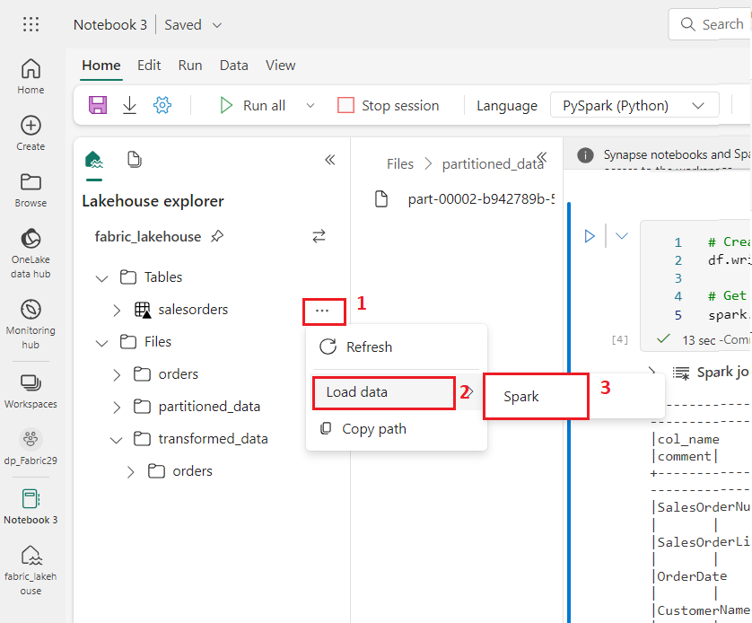
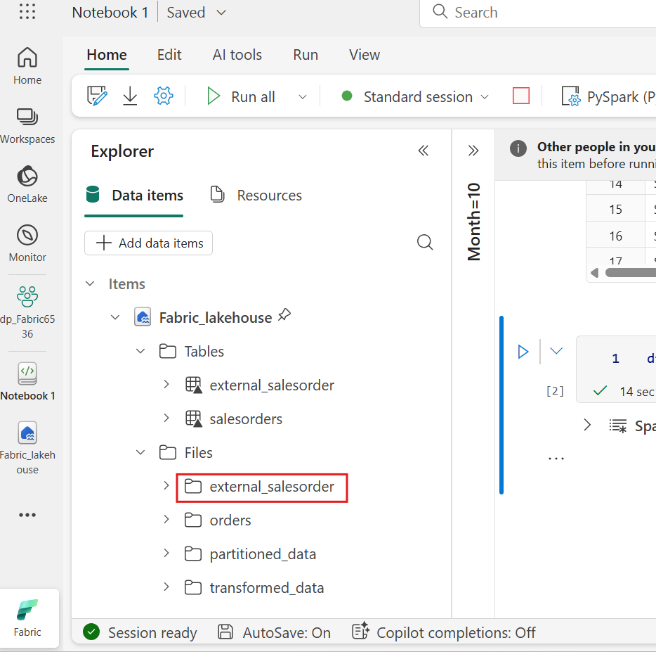
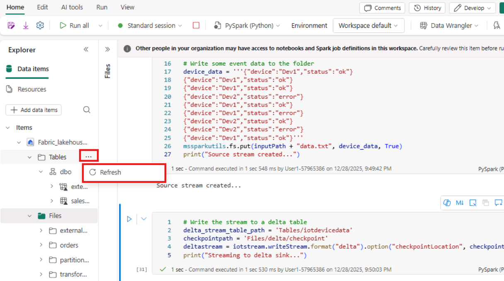
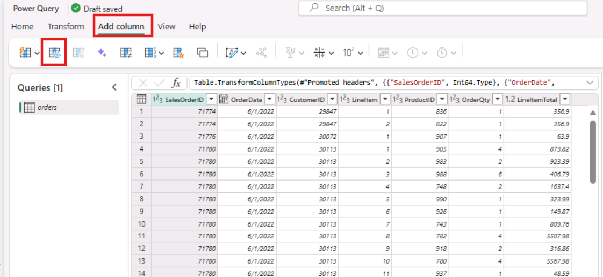
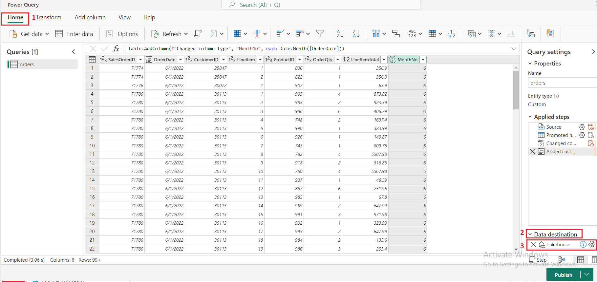
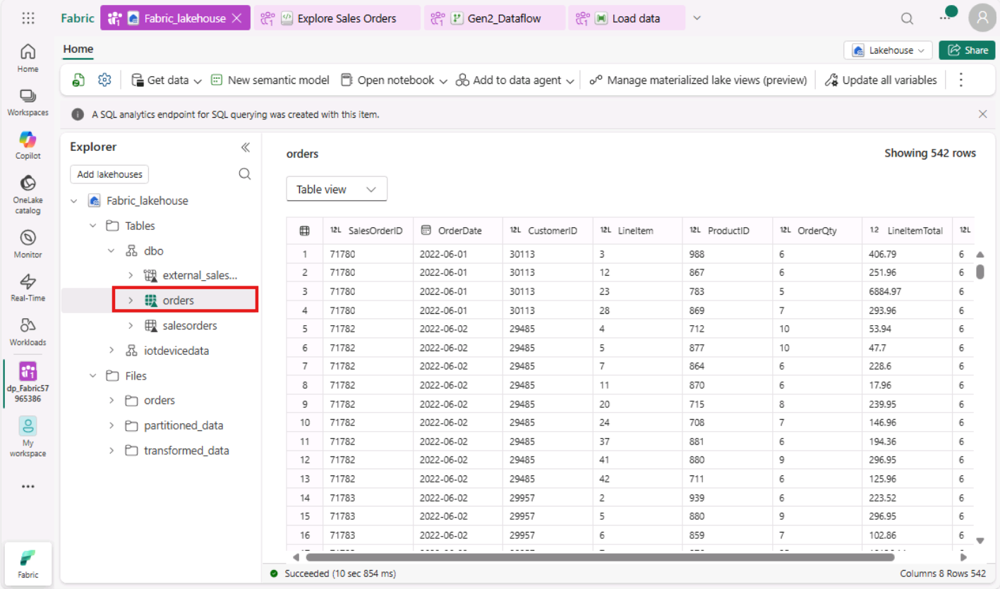

# 用例02：用Apache Spark分析数据

**介绍**

Apache Spark
是一个开源的分布式数据处理引擎，广泛用于探索、处理和分析数据湖存储中的海量数据。Spark
作为处理选项在许多数据平台产品中提供，包括 Azure HDInsight、Azure
Databricks、Azure Synapse Analytics 和 Microsoft Fabric。Spark
的一个优势是支持多种编程语言，包括 Java、Scala、Python 和
SQL;这使得Spark成为数据处理工作负载的非常灵活解决方案，包括数据清理与作、统计分析与机器学习，以及数据分析与可视化。

Microsoft Fabric lakehouse 中的表基于开源的 Apache Spark *Delta Lake*
格式。Delta Lake 增加了对批处理和流数据作的关系语义支持，并支持创建
Lakehouse 架构，使 Apache Spark
能够处理和查询基于数据湖底层文件的表中的数据。

在 Microsoft Fabric 中，Dataflows（Gen2）连接多个数据源，并在 Power
Query Online 中执行转换。然后它们可以在数据管道中用于将数据导入
lakehouse 或其他分析存储，或定义 Power BI 报告中的数据集。

本实验室旨在介绍
Dataflows（Gen2）的不同元素，而非创建企业中可能存在的复杂解决方案。

**目的：**

- 在 Microsoft Fabric 中创建一个工作区，并启用 Fabric 试用。

- 建立 lakehouse 环境并上传数据文件进行分析。

- 生成一本用于交互式数据探索和分析的笔记本。

- 将数据加载到数据帧中以便进一步处理和可视化。

- 用 PySpark 对数据进行转换。

- 保存并分区转换后的数据，以便优化查询。

- 在 Spark 元存储库中创建一个用于结构化数据管理的表

- 将DataFrame保存为一个名为“salesorders”的管理级delta表。

- 将DataFrame保存为名为“external_salesorder”的外部delta表，并指定路径。

- 描述并比较托管表和外部表的属性。

- 对表执行SQL查询以进行分析和报告。

- 使用如 matplotlib 和 seaborn 等 Python 库来可视化数据。

- 在数据工程体验中建立数据 lakehouse，并导入相关数据以便后续分析。

- 定义一个数据流，用于提取、转换和加载数据到 lakehouse。

- 在 Power Query 中配置数据目的地，将转换后的数据存储在 lakehouse 中。

- 将数据流整合进流水线，以实现定时的数据处理和摄取。

- 移除工作区及相关元素以结束练习。

# 练习1：创建一个工作区、lakehouse、笔记本，并将数据加载到数据框架中 

## 任务1：创建一个工作区 

在处理Fabric数据之前，先创建一个启用Fabric试用区的工作区。

1.  打开浏览器，进入地址栏，输入或粘贴以下URL：+++https://app.fabric.microsoft.com/+++
    ，然后按下 **Enter** 键。

> **Note**：如果你被引导到Microsoft Fabric主页，可以跳过#2到#4的步骤。
>
> 

2.  在 **Microsoft Fabric** 窗口中，输入你的凭证，然后点击 **Submit**
    按钮。
    |   |   |
    |---|---|
    | Username | +++@lab.CloudPortalCredential(User1).Username+++ |
    | Password | +++@lab.CloudPortalCredential(User1).Password+++ |

> 

3.  然后，在 **Microsoft** 窗口输入密码，点击 **Sign in** 按钮**。**

> 

4.  在 **Stay signed in?** 窗口，点击“**Yes**”按钮。

> 

5.  Fabric 主页，选择 **+New workspace** 瓷砖。

> 

6.  在“**Create a
    workspace”标签**中，输入以下信息，点击“**Apply**”按钮。

    |  |  |
    |-----|----|
    |Name|	+++dp_Fabric@lab.LabInstance.Id+++ (must be a unique Id)| 
    |Description|	This workspace contains Analyze data with Apache Spark|
    |Advanced|	Under License mode, select Fabric capacity|
    |Default storage format	|Small dataset storage format|

> 
>
> 

7.  等待部署完成。完成大约需要2-3分钟。
    当你的新工作区开放时，应该是空的。

> 

## 任务2：创建 lakehouse 并上传文件

现在你有了工作区，就该切换到门户中*的数据工程*体验，为你要分析的数据文件创建一个数据
lakehouse。

1.  点击导航栏中的**+New item** 按钮，创建新的活动屋。


2.  点击“**Lakehouse**”瓷砖。


3.  在“**New lakehouse** ”对话框中，输入“**Name**”栏的
    **+++Fabric_lakehouse+++** ，点击“**Create**”按钮，打开新lakehouse。


4.  大约一分钟后，新的空 lakehouse
    会被创造出来。你需要把一些数据导入数据 lakehouse 进行分析。


5.  你会看到一条通知，提示 **Successfully created SQL endpoint**。


6.  在 **Explorer** 部分，**fabric_lakehouse**下方，将鼠标悬停在 **Files
    folder**
    旁边，然后点击水平省略号**（...）**菜单。点击“**Upload**”，然后点击“**Upload
    folder**”，如下图所示。


7.  在右侧的“**Upload folder**”面板上，选择 **Files/**
    下的**文件夹图标**，然后浏览到
    **C：\LabFiles**，再选择**orders**文件夹，点击 **Upload** 按钮。


8.  如果是，**Upload 3 files to this site?** 对话框出现，然后点击
    **Upload** 按钮。


9.  在“Upload”文件夹面板中，点击 **“Upload**”按钮。

> 

10. 文件上传后 **关闭 Upload folder** 面板。


11. 展开 **Files** ，选择 **orders ** 文件夹，并确认CSV文件已上传。

> 

## 任务3：制作一本笔记本

要在 Apache Spark
中处理数据，你可以创建一个*笔记本*。笔记本提供了一个互动环境，你可以编写和运行多种语言的代码，并添加笔记来记录代码。

1.  在**主**页查看 datalake 中 **orders** 文件夹内容时，在 **Open
    notebook** 菜单中选择 **New notebook**。


2.  几秒钟后，会打开一个包含单个*单元格*的新笔记本。笔记本由一个或多个单元格组成，可以包含*代码*或*标记（*格式化文本）。


3.  选择第一个单元格（目前是一个代码单元格），然后在其右上角的动态工具栏中，使用**M↓**按钮**convert
    the cell to a markdown cell**。 


4.  当该单元格变为标记降低单元格时，其文本会被渲染。


5.  使用**🖉**（Edit）按钮将单元格切换到编辑模式，替换所有文本，然后按以下方式修改标记:

    ```
    # Sales order data exploration
    
    Use the code in this notebook to explore sales order data.
    ```


6.  点击笔记本中单元格外的任何位置，停止编辑并查看渲染后的标记。


## 任务4：将数据加载到数据帧中

现在你准备好运行将数据加载到*数据帧*中的代码了。Spark 中的 Dataframes
类似于 Python 中的 Pandas dataframe，并为处理行和列数据提供了通用结构。

**注意**：Spark 支持多种编程语言，包括 Scala、Java
等。在这个练习中，我们将使用*PySpark*，它是Python的Spark优化版本。PySpark
是 Spark 上最常用的语言之一，也是 Fabric 笔记本的默认语言。

1.  笔记本可见后，展开 **Files** 列表，选择
    **orders **文件夹，使CSV文件与笔记本编辑器并列。

> 

2.  现在，将鼠标悬停到2019.csv文件。点击2019.csv旁边的水平椭圆（...）。点击
    **Load data**，然后选择
    **Spark**。笔记本中将添加一个包含以下代码的新代码单元格:

    ```
    df = spark.read.format("csv").option("header","true").load("Files/orders/2019.csv")
    # df now is a Spark DataFrame containing CSV data from "Files/orders/2019.csv".
    display(df)
    ```
> 
>
> 

**提示**：你可以用左侧的“图标”隐藏湖屋探索者面板 。正在做

这会帮你专注于笔记本。

3.  使用单元左侧的 ** ▷ Run cell ** 按钮来运行它。


**注意**：由于这是你第一次运行任何 Spark 代码，必须启动一次 Spark
会话。这意味着会话中的第一次运行可能需要一分钟左右完成。后续的运行会更快。

4.  当单元格命令完成后，查看单元格下方的输出，应该类似于这个:


5.  输出显示的是2019.csv文件中的行和列数据。不过，请注意列头看起来不太对。用于将数据加载到数据帧的默认代码假设CSV文件第一行包含列名，但在此情况下，CSV文件仅包含数据，没有任何头部信息。

6.  修改代码，将 **header** 选项设置为
    **false**。将该**单元格**中的所有代码替换为以下代码，点击 **▷ Run
    cell** 按钮，查看输出结果 

    ```
    df = spark.read.format("csv").option("header","false").load("Files/orders/2019.csv")
    # df now is a Spark DataFrame containing CSV data from "Files/orders/2019.csv".
    display(df)
    ```


7.  现在数据帧正确地包含了第一行作为数据值，但列名是自动生成的，帮助不大。要理解数据，你需要明确定义文件中数据值的正确模式和数据类型。

8.  将该**单元格**中的所有代码 替换为以下代码，点击 **▷ Run cell**
    按钮，查看输出结果

    ```
    from pyspark.sql.types import *
    
    orderSchema = StructType([
        StructField("SalesOrderNumber", StringType()),
        StructField("SalesOrderLineNumber", IntegerType()),
        StructField("OrderDate", DateType()),
        StructField("CustomerName", StringType()),
        StructField("Email", StringType()),
        StructField("Item", StringType()),
        StructField("Quantity", IntegerType()),
        StructField("UnitPrice", FloatType()),
        StructField("Tax", FloatType())
        ])
    
    df = spark.read.format("csv").schema(orderSchema).load("Files/orders/2019.csv")
    display(df)
    ```

> 
>
> 

9.  现在，数据帧包含正确的列名（除了索引，**Index**
    是所有数据帧中基于每行序数位置的内置列）。列的数据类型使用Spark
    SQL库中定义的标准类型集指定，这些类型在单元格开头导入。

10. 通过查看数据帧确认你的更改已被应用到数据上。

11. 使用单元格输出下方的 **+
    Code** 图标，向笔记本添加一个新的代码单元格，并输入以下代码。点击
    **▷ Run cell** 按钮，查看输出结果

    ```
    display(df)
    ```
> 

12. 数据帧仅包含**2019.csv**文件中的数据
    。修改代码，使文件路径使用\*通配符读取**订单**文件夹中所有文件的销售订单数据

13. 使用单元格输出下方的 **+
    Code **图标，向笔记本添加一个新的代码单元格，并输入以下代码。

    ```
    from pyspark.sql.types import *
    
    orderSchema = StructType([
        StructField("SalesOrderNumber", StringType()),
        StructField("SalesOrderLineNumber", IntegerType()),
        StructField("OrderDate", DateType()),
        StructField("CustomerName", StringType()),
        StructField("Email", StringType()),
        StructField("Item", StringType()),
        StructField("Quantity", IntegerType()),
        StructField("UnitPrice", FloatType()),
        StructField("Tax", FloatType())
        ])
    
    df = spark.read.format("csv").schema(orderSchema).load("Files/orders/*.csv")
    display(df)
    ```
> 

14. 运行修改后的代码单元格，查看输出，现在应该包括2019、2020和2021年的销售额。

> 

**注意**：仅显示部分行，因此你可能无法看到所有年份的示例。

# 练习2：探索数据框架内的数据

数据框对象包含多种函数，可用于过滤、分组和以其他方式作其包含的数据。

## 任务1：过滤数据帧

1.  使用单元格输出下方的 **+ Code**
    图标，向笔记本添加一个新的代码单元格，并输入以下代码。

    ```
    customers = df['CustomerName', 'Email']
    print(customers.count())
    print(customers.distinct().count())
    display(customers.distinct())
    ```
> 

2.  **运行** 新的代码单元，查看结果。请注意以下细节:

    - 当你对数据帧执行作时，结果是一个新的数据帧（此例中，通过从**df**数据帧**中**选择特定列子集创建新的**客户**数据帧）

    - 数据帧提供**计数**和**不同**等功能，可用于总结和过滤其包含的数据。

    - dataframe\['Field1', 'Field2',
      ...\] 语法是一种简写方式，用来定义列的子集。
      你也可以使用**select**方法，比如上面代码的第一行可以写成customers
      = df.select（“CustomerName”， “Email”）

> 

3.  修改代码，将该**单元格**中的所有代码替换为以下代码，然后点击 **▷ Run
    cell** 按钮，如下所示:

    ```
    customers = df.select("CustomerName", "Email").where(df['Item']=='Road-250 Red, 52')
    print(customers.count())
    print(customers.distinct().count())
    display(customers.distinct())
    ```

4.  **运行**修改后的代码以查看购买 ***Road-250 Red 52*** 产品的客户。
    注意，你可以“**chain**”多个函数，使一个函数的输出成为下一个函数的输入——在这种情况下，**select**方法创建的数据帧是用于应用过滤条件的**where**方法的源数据帧。

> 

## 任务2：将数据汇总和分组到数据框架中

1.  点击 **+** **Code** ，复制粘贴下面的代码，然后点击 **“Run cell”**
    按钮。

    ```
    productSales = df.select("Item", "Quantity").groupBy("Item").sum()
    display(productSales)
    ```
> 

2.  请注意，结果显示了按产品分组的订单数量之和。**groupBy**
    方法按项目*对行进行分组*，随后对剩余所有数值列（此处为数量）应用和汇总函数

3.  点击 **+** **Code**，复制粘贴下面的代码，然后点击 **“Run cell”**
    按钮。


    ```
    from pyspark.sql.functions import *
    
    yearlySales = df.select(year("OrderDate").alias("Year")).groupBy("Year").count().orderBy("Year")
    display(yearlySales)
    ```
> 

4.  请注意，结果显示的是每年销售订单数量。注意，**select**方法包含一个SQL
    **年**函数，用于提取*OrderDate*字段中的年份成分（这也是代码中包含
    导入语句以导入Spark
    SQL库中的函数的原因）。然后它使用**别名**方法为提取的年份值分配列名。然后将数据按派生*的年份*列分组，计算每组的行数，最后
    使用**OrderBy**方法对所得数据帧进行排序**。**

# 练习3：使用 Spark 转换数据文件

数据工程师的一项常见任务是以特定格式或结构导入数据，并将其转换以供后续处理或分析。

## 任务1：使用数据框架方法和函数进行数据转换

1.  点击 + Code，复制粘贴下面的代码

**CodeCopy**

    ```
    from pyspark.sql.functions import *
    
    ## Create Year and Month columns
    transformed_df = df.withColumn("Year", year(col("OrderDate"))).withColumn("Month", month(col("OrderDate")))
    
    # Create the new FirstName and LastName fields
    transformed_df = transformed_df.withColumn("FirstName", split(col("CustomerName"), " ").getItem(0)).withColumn("LastName", split(col("CustomerName"), " ").getItem(1))
    
    # Filter and reorder columns
    transformed_df = transformed_df["SalesOrderNumber", "SalesOrderLineNumber", "OrderDate", "Year", "Month", "FirstName", "LastName", "Email", "Item", "Quantity", "UnitPrice", "Tax"]
    
    # Display the first five orders
    display(transformed_df.limit(5))
    ```
> 

2.  **运行** 代码，从原始顺序数据中创建新的数据帧，并进行以下变换:

    - 根据**OrderDate**列添加**年份**和**月份**列。

    - 根据**CustomerName**列添加**FirstName**和**LastName**列。

    - 过滤并重新排序列，移除**CustomerName**列。

> 

3.  检查输出并确认数据的转换已完成。


你可以充分利用 Spark SQL
库的全部功能，通过过滤行、推导、删除、重命名列以及应用其他必要的数据修改来转换数据。

**提示**：请参阅 [*Spark dataframe
文档*](https://spark.apache.org/docs/latest/api/python/reference/pyspark.sql/dataframe.html)，了解更多关于
Dataframe 对象的方法。

## 任务2：保存转换后的数据

1.  **添加一个新单元格，**并在其中写入以下代码，以将转换后的数据框保存为
    Parquet
    格式（如果数据已存在，则覆盖现有数据）。**运行**该单元格并等待数据保存成功的提示信息。

    ```
    transformed_df.write.mode("overwrite").parquet('Files/transformed_data/orders')
    print ("Transformed data saved!")
    ```
> **注意**：通常，*Parquet*格式更适合用于进一步分析或导入分析存储的数据文件。Parquet是一种非常高效的格式，大多数大型数据分析系统都支持它。事实上，有时你的数据转换需求可能只是将其他格式（如CSV）的数据转换成Parquet！
>
> 
>
> 

2.  然后，在左侧的 **Lakehouse explorer** 
    窗格中，在“**Files**”节点的“…”菜单中，选择“**Refresh**”。

> 

3.  单击 **transformed_data** 文件夹，确认其中是否包含一个名为
    **orders** 的新文件夹，而 orders 文件夹又包含一个或多个 **Parquet
    文件**。

> 

4.  点击 **+ Code** 跟随代码，从 **transformed_data -\> orders**
    文件夹中的 parquet 文件加载新数据帧 :

> **CodeCopy**
    ```
    orders_df = spark.read.format("parquet").load("Files/transformed_data/orders")
    display(orders_df)
    ```
> 

5.  **运行** 该单元格，验证结果是否显示了从parquet文件加载的顺序数据。

> 

## 任务3：将数据保存到分区文件中

1.  添加一个新单元格，点击以下代码的**+
    Code**;它保存数据帧，按**年份**和**月份划分**数据。
    **运行**小区并等待数据已保存的消息

    ```
    orders_df.write.partitionBy("Year","Month").mode("overwrite").parquet("Files/partitioned_data")
    print ("Transformed data saved!")
    ```
> 
>
> 

2.  然后，在左侧的 **Lakehouse explorer**
    窗格中，在“**Files**”节点的“…”菜单中，选择“**Refresh**”。 


3.  展开**partitioned_orders**文件夹，确认其中包含名为**Year=xxxx**的文件夹层级结构，每个文件夹包含名为**Month=xxxx**的文件夹。每个月文件夹都包含一个镶花文件，里面有当月的订单。


> 数据文件分区是处理大量数据时优化性能的常见方法。这种方法可以显著提升性能，并使数据过滤变得更简单。

4.  添加一个新单元格，点击以下代码的 **+Code，**从 **orders.parquet**
    文件加载新数据帧 :

    ```
    orders_2021_df = spark.read.format("parquet").load("Files/partitioned_data/Year=2021/Month=*")
    display(orders_2021_df)
    ```

5.  **运行**
    单元格，确认结果显示的是2021年的订单数据。注意路径中指定的分区列（**年份**和**月份**）未包含在数据帧中。


# **练习3：处理表和SQL**

正如你所见，dataframe对象的原生方法让你能够非常有效地查询和分析文件中的数据。然而，许多数据分析师更习惯使用可以用SQL语法查询的表。Spark
提供了一个元*存储*库，你可以在这里定义关系表。提供数据框架对象的 Spark
SQL 库也支持使用 SQL 语句查询元存储中的表。通过使用 Spark
的这些功能，你可以将数据湖的灵活性与关系型数据仓库的结构化数据模式和基于
SQL 的查询结合起来——这就是“数据lakehouse”这一术语的由来。

## 任务1：创建一个受管理表

Spark
元存储中的表是数据湖中文件的关系抽象。表可以被*管理*（此时文件由元存储管理）或*外部*（此时表引用数据湖中独立于元存储管理的文件位置）。

1.  添加新代码，点击笔记本中的**“+
    Code“**单元格，输入以下代码，该代码会将销售订单数据的数据框保存为名为
    **salesorders** 的表格:

    ```
    # Create a new table
    df.write.format("delta").saveAsTable("salesorders")
    
    # Get the table description
    spark.sql("DESCRIBE EXTENDED salesorders").show(truncate=False)
    ```

**注意**：关于这个例子，值得注意几点。首先，没有提供显式路径，因此表的文件将由元存储管理。其次，表格以
**delta** 格式保存。你可以基于多种文件格式创建表（包括
CSV、Parquet、Avro 等），但 *delta lake* 是一种 Spark
技术，为表增加了关系数据库功能;包括对事务、行版本控制及其他实用功能的支持。在
Fabric 中创建数据湖屋更倾向于以 delta 格式创建表。

2.  **运行** 代码单元并查看输出，后者描述了新表的定义。


3.  在 **Lakehouse**
    **explorer** 窗格中，在“**Tables**”文件夹的“…”菜单中，选择“**Refresh**”。


4.  然后展开 **Tables** 节点，确认 **SalesOrders** 表是否已在 **dbo**
    模式下创建。

> 

5.  将鼠标悬停在 **salesorders**
    表旁边，然后单击水平省略号（…）。导航并单击“**Load data**”，然后选择
    **Spark**。

> 

6.  点击 **▷ Run cell** 按钮，该按钮使用Spark SQL库将针对
    **salesorder** 表的SQL查询嵌入到PySpark代码中，并将查询结果加载到数据帧中。

    ```
    df = spark.sql("SELECT * FROM [your_lakehouse].salesorders LIMIT 1000")
    display(df)
    ```


## 任务2：创建一个外部表格

你也可以创建 外部表，模式元数据在 lakehouse
的元存储中定义，但数据文件存储在外部位置。

1.  在第一个代码单元返回的结果下，如果没有新的代码单元格，使用 **+
    Code**按钮添加新代码单元。然后在新格子里输入以下代码。

    ```
    df.write.format("delta").saveAsTable("external_salesorder", path="<abfs_path>/external_salesorder")
    ```


2.  在 **Lakehouse
    explorer** 窗格中，“**Files**”文件夹的“…”菜单中，选择在记事本中**Copy
    ABFS path**”。

> ABFS路径是你 **lakehouse** **OneLake**
> 存储中**Files**文件夹的完整合格路径——类似于这个:

abfss://dp_Fabric29@onelake.dfs.fabric.microsoft.com/Fabric_lakehouse.Lakehouse/Files/external_salesorder

> 

3.  现在，进入代码单元格，将 **\`\<abfs_path\>\`**
    替换为您复制到记事本中的**路径**，以便代码将数据帧保存为外部表，并将数据文件保存在“文件”文件夹下的名为
    **\`external_salesorder\`** 的**Files**中。完整路径应类似于这样

abfss://dp_Fabric29@onelake.dfs.fabric.microsoft.com/Fabric_lakehouse.Lakehouse/Files/external_salesorder

4.  使用单元左侧的 **▷ (Run cell)** 按钮来运行它。


5.  在 **Lakehouse
    explorer** 窗格中，在“**Tables** ”文件夹的“…”菜单中，选择“**Refresh**”。


6.  然后展开“**Tables**”节点，并验证 **external_salesorder**
    表是否已创建。


7.  在 **Lakehouse
    explorer** 窗格中，“**Files**”文件夹的“…”菜单中，选择“**Refresh**”。 


8.  然后展开**Files**节点，确认**external_salesorder**文件夹已为表中的数据文件创建。 



## 任务3：比较托管表和外部表

让我们来探讨托管表和外部表之间的区别。

1.  在代码单元返回的结果下，使用 **+ Code**
    按钮添加新的代码单元。将下面的代码复制到代码单元格，并使用单元格左侧的
    **▷ (Run cell)** 按钮来运行它。

    ```
    %%sql
    
    DESCRIBE FORMATTED salesorders;
    ```
> 

2.  在结果中，查看表的 **Location** 属性，该属性应该是指向 Lakehouse 的
    OneLake 存储的路径，以
    **/Tables/salesorders** 结尾（您可能需要展开“**Data
    type** ”列才能看到完整路径）。


3.  修改 **DESCRIBE** 命令以显示 **external_saleorder**
    表的详细信息，如图所示。

4.  在代码单元格返回的结果下方，使用“**+
    Code** ”按钮添加一个新的代码单元格。复制下面的代码，然后使用单元格左侧的
    **▷ (*Run cell*)** 按钮运行它。

    ```
    %%sql
    
    DESCRIBE FORMATTED external_salesorder;
    ```

5.  在结果中，查看表的 **Location** 属性，它应该是指向 Lakehouse 的
    **OneLake** 存储的路径，以 **/Files/external_saleorder**
    结尾（您可能需要展开“**Data type**”列才能看到完整路径）。


## 任务4：在单元格中运行SQL代码

虽然能够将SQL语句嵌入包含PySpark代码的单元格很有用，但数据分析师通常只想直接用SQL工作。

1.  点击笔记本的**+ Code**单元，输入以下代码。点击 **▷ Run cell**
    按钮，查看结果。请注意:

    - 单元格开头的%%sql行（称为*magic*）表示应使用Spark
      SQL语言运行时来运行该单元的代码，而非PySpark。

    - SQL代码引用 的是你之前创建的**salesorders** 表。

    - SQL查询的输出会自动显示为单元格下的结果

      ```
      %%sql
      SELECT YEAR(OrderDate) AS OrderYear,
             SUM((UnitPrice * Quantity) + Tax) AS GrossRevenue
      FROM salesorders
      GROUP BY YEAR(OrderDate)
      ORDER BY OrderYear;
      ```


**注意**：有关 Spark SQL 和数据帧的更多信息，请参见 [*Spark SQL
文档*](https://spark.apache.org/docs/2.2.0/sql-programming-guide.html)。

# 练习四：用Spark可视化数据

俗话说，一幅图胜千言万语，一张图表往往比一千行数据更好。虽然 Fabric
中的笔记本内置了数据框架或 Spark SQL
查询数据的图表视图，但它并非为全面的图表设计。不过，你可以用 Python
图形库，比如 **matplotlib** 和 **seaborn**，从数据帧中生成图表。

## 任务1：以图表形式查看结果

1.  点击笔记本中的**+ Code** 单元格，并在其中输入以下代码。点击“ **▷ Run
    cell** ”按钮，观察它是否返回了您之前创建的 **salesorders**
    视图中的数据。

    ```
    %%sql
    SELECT * FROM salesorders
    ```


2.  在单元格下方的结果部分，将 **View** 选项从 **Table** 更改为 **New
    chart**。


3.  使用图表右上角的**“Start
    editing**”按钮，显示图表的选项面板。然后设置如下选项，选择
    **Apply**:

    - **Chart type**: Bar chart

    - **Key**: Item

    - **Values**: Quantity

    - **Series Group**: *leave blank*

    - **Aggregation**: Sum

    - **Stacked**: *Unselected*


4.  请确认图表是否与此相似

> 

## 任务2：开始使用 matplotlib

1.  点击 **+ Code**，复制粘贴下面的代码。 **运行**
    代码，观察它返回一个包含年度收入的 Spark 数据帧。

    ```
    sqlQuery = "SELECT CAST(YEAR(OrderDate) AS CHAR(4)) AS OrderYear, \
                    SUM((UnitPrice * Quantity) + Tax) AS GrossRevenue \
                FROM salesorders \
                GROUP BY CAST(YEAR(OrderDate) AS CHAR(4)) \
                ORDER BY OrderYear"
    df_spark = spark.sql(sqlQuery)
    df_spark.show()
    ```

> 

2.  为了将数据可视化为图表，我们将先使用 **matplotlib** Python
    库。该库是许多其他库的核心绘图库，提供了极大的图表制作灵活性。

3.  点击 **+ Code**，复制粘贴下面的代码。

**CodeCopy**

    ```
    from matplotlib import pyplot as plt
    
    # matplotlib requires a Pandas dataframe, not a Spark one
    df_sales = df_spark.toPandas()
    
    # Create a bar plot of revenue by year
    plt.bar(x=df_sales['OrderYear'], height=df_sales['GrossRevenue'])
    
    # Display the plot
    plt.show()
    ```


5.  点击 **“Run
    cell ”**按钮查看结果，结果包括一个栏状图，显示每年的总总收入。请注意用于制作该图表的代码的以下特点:

    - **matplotlib** 库需要 *Pandas* 数据帧，所以你需要将 *Spark* SQL
      查询返回的数据帧转换成这个格式。

    - matplotlib **库**的核心是 **pyplot**
      对象。这是大多数绘图功能的基础。

    - 默认设置会得到可用的图表，但自定义空间很大

> 

6.  修改代码，将图表绘制如下图，将该**单元格**中的所有代码替换为以下代码，点击**▷
    Run cell** 格按钮，查看输出结果

    ```
    from matplotlib import pyplot as plt
    
    # Clear the plot area
    plt.clf()
    
    # Create a bar plot of revenue by year
    plt.bar(x=df_sales['OrderYear'], height=df_sales['GrossRevenue'], color='orange')
    
    # Customize the chart
    plt.title('Revenue by Year')
    plt.xlabel('Year')
    plt.ylabel('Revenue')
    plt.grid(color='#95a5a6', linestyle='--', linewidth=2, axis='y', alpha=0.7)
    plt.xticks(rotation=45)
    
    # Show the figure
    plt.show()
    ```
> 
>
> 

7.  图表现在包含了一些更多信息。剧情技术上是由**一个人物**所包含的。在前面的例子中，这个图形是隐含地为你创造的;但你可以明确创建它。

8.  修改代码，将图表绘制如下图，将**单元格**中的所有代码替换
    为以下代码。

    ```
    from matplotlib import pyplot as plt
    
    # Clear the plot area
    plt.clf()
    
    # Create a Figure
    fig = plt.figure(figsize=(8,3))
    
    # Create a bar plot of revenue by year
    plt.bar(x=df_sales['OrderYear'], height=df_sales['GrossRevenue'], color='orange')
    
    # Customize the chart
    plt.title('Revenue by Year')
    plt.xlabel('Year')
    plt.ylabel('Revenue')
    plt.grid(color='#95a5a6', linestyle='--', linewidth=2, axis='y', alpha=0.7)
    plt.xticks(rotation=45)
    
    # Show the figure
    plt.show()
    ```

9.  **重新运行** 代码单元，查看结果。图形决定了地块的形状和大小。

> 一个图可以包含多个子线，每个子线都围绕其自身*轴*线。
>
> 
>
> 

10. 修改代码，将图表绘制如下图。 **重新运行**
    代码单元，查看结果。图中包含了代码中指定的子线。

    ```
    from matplotlib import pyplot as plt
    
    # Clear the plot area
    plt.clf()
    
    # Create a figure for 2 subplots (1 row, 2 columns)
    fig, ax = plt.subplots(1, 2, figsize = (10,4))
    
    # Create a bar plot of revenue by year on the first axis
    ax[0].bar(x=df_sales['OrderYear'], height=df_sales['GrossRevenue'], color='orange')
    ax[0].set_title('Revenue by Year')
    
    # Create a pie chart of yearly order counts on the second axis
    yearly_counts = df_sales['OrderYear'].value_counts()
    ax[1].pie(yearly_counts)
    ax[1].set_title('Orders per Year')
    ax[1].legend(yearly_counts.keys().tolist())
    
    # Add a title to the Figure
    fig.suptitle('Sales Data')
    
    # Show the figure
    plt.show()
    ```
> 
>
> 

**注意**：想了解更多关于使用 matplotlib 绘制的信息，请参阅 [*matplotlib
文档*](https://matplotlib.org/)。

## 任务3：使用 Seaborn 库

虽然 **matplotlib**
可以让你创建多种类型的复杂图表，但要达到最佳效果可能需要一些复杂的代码。因此，多年来，许多新的库在
matplotlib 基础上构建，以抽象化其复杂性并增强其能力。其中一个图书馆是
**seaborn**。

1.  点击 **+ Code**，复制粘贴下面的代码。

CodeCopy

    ```
    import seaborn as sns
    
    # Clear the plot area
    plt.clf()
    
    # Create a bar chart
    ax = sns.barplot(x="OrderYear", y="GrossRevenue", data=df_sales)
    plt.show()
    ```

2.  **运行** 代码，观察它显示的是使用 Seaborn 库的条形图。


3.  **修改** 代码如下。 **运行** 修改后的代码，注意 seaborn
    可以让你为地块设置一致的颜色主题。

    ```
    import seaborn as sns
    
    # Clear the plot area
    plt.clf()
    
    # Set the visual theme for seaborn
    sns.set_theme(style="whitegrid")
    
    # Create a bar chart
    ax = sns.barplot(x="OrderYear", y="GrossRevenue", data=df_sales)
    plt.show()
    ```
> 

4.  再次**修改** 代码如下。 **运行**
    修改后的代码，以折线图的形式查看年度收入。

    ```
    import seaborn as sns
    
    # Clear the plot area
    plt.clf()
    
    # Create a bar chart
    ax = sns.lineplot(x="OrderYear", y="GrossRevenue", data=df_sales)
    plt.show()
    ```
> 

**注意**：想了解更多关于用 seaborn 策划的建议，请参见
[*seaborn文档*](https://seaborn.pydata.org/index.html)。

## 任务4：使用delta表进行流数据流处理

Delta Lake 支持流式数据。Delta 表可以作为使用 Spark Structured Streaming
API 创建的数据流的接收器或源。在本示例中，您将使用 Delta
表作为模拟物联网 (IoT) 场景中某些流式数据的接收器。

1.  点击 **+ Code** ，复制粘贴下面的代码，然后点击 **“Run cell”** 按钮。

CodeCopy

    ```
    from notebookutils import mssparkutils
    from pyspark.sql.types import *
    from pyspark.sql.functions import *
    
    # Create a folder
    inputPath = 'Files/data/'
    mssparkutils.fs.mkdirs(inputPath)
    
    # Create a stream that reads data from the folder, using a JSON schema
    jsonSchema = StructType([
    StructField("device", StringType(), False),
    StructField("status", StringType(), False)
    ])
    iotstream = spark.readStream.schema(jsonSchema).option("maxFilesPerTrigger", 1).json(inputPath)
    
    # Write some event data to the folder
    device_data = '''{"device":"Dev1","status":"ok"}
    {"device":"Dev1","status":"ok"}
    {"device":"Dev1","status":"ok"}
    {"device":"Dev2","status":"error"}
    {"device":"Dev1","status":"ok"}
    {"device":"Dev1","status":"error"}
    {"device":"Dev2","status":"ok"}
    {"device":"Dev2","status":"error"}
    {"device":"Dev1","status":"ok"}'''
    mssparkutils.fs.put(inputPath + "data.txt", device_data, True)
    print("Source stream created...")
    ```
> 
>
> 

2.  确保消息源 ***Source stream
    created…*** 已印刷。你刚运行的代码基于一个文件夹创建了一个流数据源，该文件夹保存了一些数据，代表假设的物联网设备的读数。

3.  点击 **+ Code** ，复制粘贴下面的代码，然后点击 **“Run cell”** 按钮。

CodeCopy

    ```
    # Write the stream to a delta table
    delta_stream_table_path = 'Tables/iotdevicedata'
    checkpointpath = 'Files/delta/checkpoint'
    deltastream = iotstream.writeStream.format("delta").option("checkpointLocation", checkpointpath).start(delta_stream_table_path)
    print("Streaming to delta sink...")
    ```
> 

4.  此代码以增量格式将流式设备数据写入名为 **iotdevicedata**
    的文件夹。由于文件夹路径位于 **Tables** 
    文件夹中，因此会自动为其创建一个表格。单击表格旁边的水平省略号，然后单击“**Refresh**”。




5.  点击“ **+ Code**”，复制并粘贴以下代码，然后点击“**Run cell**”按钮。

    ```
    %%sql
    
    SELECT * FROM IotDeviceData;
    ```
> 

6.  该代码查询包含流媒体源设备数据的 **IotDeviceData** 表。

7.  点击 **+ Code**，复制粘贴下面的代码，然后点击“**Run cell**”按钮。

    ```
    # Add more data to the source stream
    more_data = '''{"device":"Dev1","status":"ok"}
    {"device":"Dev1","status":"ok"}
    {"device":"Dev1","status":"ok"}
    {"device":"Dev1","status":"ok"}
    {"device":"Dev1","status":"error"}
    {"device":"Dev2","status":"error"}
    {"device":"Dev1","status":"ok"}'''
    
    mssparkutils.fs.put(inputPath + "more-data.txt", more_data, True)
    ```

> 

8.  这段代码会将更多假设的设备数据写入流源。

9.  点击 **+ Code**，复制粘贴下面的代码，然后点击“**Run cell**”按钮。

    ```
    %%sql
    
    SELECT * FROM IotDeviceData;
    ```
> 

10. 该代码再次查询 **IotDeviceData**
    表，表中应包含已添加到流源的额外数据。

11. 点击 **+ Code**，复制粘贴下面的代码，然后点击“**Run cell**”按钮。

    ```
    deltastream.stop()
    ```
> 

12. 这个代码会停止直播。

## 任务五：保存笔记本并结束 Spark 会话

现在你已经完成数据处理，可以保存笔记本并命名有意义，并结束 Spark 会话。

1.  在笔记本菜单栏，使用 ⚙️ **Settings **图标查看笔记本设置。


2.  将笔记本的 **Name** 设置为  +++**Explore Sales
    Orders+++**，然后关闭设置窗格。 


3.  在笔记本菜单中，选择 **Stop session** 以结束Spark会话。


# 练习5：在Microsoft Fabric中创建数据流（Gen2）

在 Microsoft Fabric 中，数据流（Gen2）连接多个数据源，并在 Power Query
Online
中执行转换。然后它们可以在数据管道中用于将数据导入湖屋或其他分析存储，或定义
Power BI 报告中的数据集。

本练习旨在介绍数据流（Gen2）的不同元素，而非创建企业中可能存在的复杂解决方案

## 任务1：创建数据流（Gen2）以获取数据

现在你有了湖屋，需要把一些数据导入去。一种方法是定义一个数据流，封装提取*、转换和加载*（ETL）过程。

1.  现在，点击 左侧导航面板上的Fabric_lakehouse。

> 

2.  **Fabric_lakehouse** 主页上，单击“**Get
    data**”中的下拉箭头，然后选择“**New Dataflow
    Gen2**”。此时将打开新数据流的 Power Query 编辑器。

> 

5.  在“**New Dataflow Gen2**”对话框中，在“**Name**”字段中输入
    **+++Gen2_Dataflow+++** ，单击“**Create**”按钮，打开新的数据流
    Gen2。

> 

3.  在 **Power Query 主页标签**下的窗格中，点击“**Import from a Text/CSV
    file**”。

> 

4.  在“**Connect to data source**”窗格的“**Connection
    settings**”下，选择“**Link to file (Preview)**”单选按钮。

- **文件链接**: *已选择*

- **文件路径或URL**: +++https://raw.githubusercontent.com/MicrosoftLearning/dp-data/main/orders.csv+++


5.  在“**Connect to data source**”窗格的“**Connection
    credentials**”下，输入以下详细信息，然后单击“**Next**”按钮。

- **连接**：创造新的连接

- **连接名称**：Orders

- **数据网关**：（无）

- **认证类型**：匿名

> 

6.  在“**Preview file data**”窗格中，单击“**Create**”以创建数据源。

7.  **Power Query** 编辑器显示数据源及初始查询步骤，用于格式化数据。


8.  在工具栏功能区上，选择**“Add column**”标签。然后，选择 **Custom
    column。**

>  

9.  将新列名称设置为 +++**MonthNo+++**，数据类型设置为**Whole
    Number**，然后在“**Custom column
    formula**”下添加以下公式：+++**Date.Month(\[OrderDate\])+++**。单击“**OK**”。

> 

10. 注意添加自定义列的步骤是如何添加到查询中的。生成的列会显示在数据窗格中。

> 

**提示：**在右侧的查询设置面板中，注意应用 **Applied
Steps** 了每个变换步骤。在底部，你还可以切换“**Diagram
flow**”按钮，打开步骤的可视化示意图。

步数可以上下移动，通过选择齿轮图标进行编辑，你还可以选择每个步骤，在预览窗格中看到变换的应用。

任务2：为Dataflow添加数据目的地

1.  在 **Power Query** 工具栏功能区中，选择“**Home**”标签。然后在 D**ata
    destination** 下拉菜单中，选择 **Lakehouse**（如果还没选中）。




**注意：**如果该选项显示为灰色，说明你可能已经设置了数据目的地。请在
Power Query
编辑器右侧的查询设置窗底部查看数据目的地。如果目的地已经设定好，可以用档位来更改。

2.  在 Power Query 编辑器中，**Lakehouse**
    目的地以**图标**的形式显示在**query**中。 


3.  在主页窗口，选择“**Save & run**”，然后点击“**Save & run**”按钮


4.  在左侧导航中选择 ***dp_Fabric-XXXXX workspace图标***，如下图所示


## 任务3：向管道添加数据流

你可以将数据流作为流水线中的活动包含。管道用于协调数据的摄取和处理活动，使你能够将数据流与其他类型的作结合在一个单一的定时流程中。管道可以在几种不同的体验中创建，包括Data
Factory体验。

1.  在 Synapse 数据工程主页的 **dp_FabricXX** 窗格中，选择**+New item**
    -\> P**ipeline**”。


2.  在“**New pipeline**”对话框中，在“**Name**”字段中输入 +++**Load
    data+++**，然后单击“**Create**”按钮以打开新管道。


3.  管道编辑器打开。

> 
>
> **提示**：如果复制数据向导自动打开，请关闭它！

4.  选择 **Pipeline activity**，并将 **Dataflow** 活动添加到管道中。


5.  选择新的 **Dataflow1**
    活动后，在“**Settings**”选项卡上的“**Dataflow**”下拉列表中，选择
    **Gen2_Dataflow**（您之前创建的数据流）。


6.  在**主页**标签页，使用**🖫（*保存*）**图标保存管道。


7.  使用 **▷ Run** 按钮运行管道，等待它完成。可能需要几分钟。

> 
>
> 
>
> 

8.  从顶部栏选择 **Fabric_lakehouse** 标签。

> 

9.  在 **Explorer**
    窗格中，选择“**Tables**”的“…”菜单，然后选择“**refresh**”。接着展开“**Tables**”，选择由数据流创建的
    **orders** 表。




**提示**： 使用Power
BI桌面*数据流连接器*，直接连接到数据流中的数据转换。

你还可以进行额外的转换，作为新数据集发布，并向目标受众分发专门数据集。

## 任务4：清理资源

在这个练习中，你已经学会了如何使用Spark在Microsoft Fabric中处理数据。

如果你已经完成了 lakehouse 探索，可以删除你为这个练习创建的工作区。

1.  在左侧栏中，选择工作区图标，查看其所有项目。

> 

2.  在**......**工具栏菜单，选择 **Workspace settings**。


3.  选择“**General**”，然后单击“**Remove this workspace**”。


4.  在 **Delete workspace?** 对话框，点击 **Delete** 按钮。

> 
>
> 

**摘要**

本 用例 将引导你在 Power BI 中使用 Microsoft Fabric
的过程。它涵盖了多个任务，包括搭建工作区、创建
lakehouse、上传和管理数据文件，以及使用笔记本进行数据探索。参与者将学习如何使用PySpark作和转换数据，创建可视化，并保存和分区数据以实现高效的查询。

在这个用例中，参与者将参与一系列专注于Microsoft
Fabric中三角表的任务。任务包括上传和探索数据、创建托管和外部 delta
表、比较其属性，实验室介绍了用于结构化数据管理的 SQL 功能，并利用
Matplotlib 和 seaborn 等 Python
库提供数据可视化的见解。这些练习旨在全面理解如何使用 Microsoft Fabric
进行数据分析，以及在物联网环境中引入差异表进行数据流传输。

这个用例将引导你完成搭建Fabric工作区、创建数据湖屋以及数据导入分析的过程。它演示了如何定义数据流以处理ETL作，并配置存储转换后数据的数据目的地。此外，你还将学习如何将数据流集成到自动化处理的流水线中。最后，您将获得清理资源的指导。

该实验室为您提供使用Fabric所需的必要技能，使您能够创建和管理工作空间，建立数据湖，并高效执行数据转换。通过将数据流融入管道，您将学会如何自动化数据处理任务，简化工作流程并在现实环境中提升生产力。清理说明确保不遗留多余资源，促进有序高效的工作管理方式。

