# Caso de uso 04: Analizar datos con Apache Spark

**Introducción**

Apache Spark es un motor de código abierto para el procesamiento
distribuido de datos, ampliamente utilizado para explorar, procesar y
analizar grandes volúmenes de datos almacenados en un data lake. Spark
está disponible como opción de procesamiento en muchos productos de
plataformas de datos, incluyendo Azure HDInsight, Azure Databricks,
Azure Synapse Analytics y Microsoft Fabric. Uno de los beneficios de
Spark es su compatibilidad con una amplia variedad de lenguajes de
programación, incluyendo Java, Scala, Python y SQL, lo que lo convierte
en una solución muy flexible para cargas de trabajo de procesamiento de
datos, incluyendo limpieza y manipulación de datos, análisis estadístico
y aprendizaje automático, así como análisis y visualización de datos.

Las tablas en un lakehouse de Microsoft Fabric se basan en el formato de
código abierto Delta Lake para Apache Spark. Delta Lake agrega soporte
para semánticas relacionales tanto en operaciones por lotes como en
tiempo real (streaming), y permite la creación de una arquitectura
Lakehouse en la que Apache Spark puede usarse para procesar y consultar
datos en tablas basadas en archivos subyacentes en un data lake.

En Microsoft Fabric, los Dataflows (Gen2) se conectan a diversas fuentes
de datos y realizan transformaciones mediante Power Query Online.
Posteriormente, pueden utilizarse en Data Pipelines para ingerir datos
en un lakehouse u otro almacén analítico, o para definir un conjunto de
datos para un informe de Power BI.

Este laboratorio está diseñado para introducir los diferentes elementos
de los Dataflows (Gen2), y no para crear una solución compleja que
podría existir en un entorno empresarial.

**Objetivos**:

- Crear un workspace en Microsoft Fabric con la prueba de Fabric
  habilitada.

- Establecer un entorno lakehouse y cargar archivos de datos para
  análisis.

- Generar un notebook para exploración y análisis interactivo de datos.

- Cargar datos en un DataFrame para procesamiento y visualización
  adicionales.

- Aplicar transformaciones a los datos usando PySpark.

- Guardar y particionar los datos transformados para consultas
  optimizadas.

- Crear una tabla en el metastore de Spark para gestión de datos
  estructurados.

- Guardar el DataFrame como una tabla delta gestionada llamada
  "salesorders".

- Guardar el DataFrame como una tabla delta externa llamada
  "external\\salesorder" con una ruta especificada.

- Describir y comparar las propiedades de las tablas gestionadas y
  externas.

- Ejecutar consultas SQL sobre las tablas para análisis e informes.

- Visualizar datos usando bibliotecas de Python como matplotlib y
  seaborn.

- Establecer un data lakehouse en la experiencia de Data Engineering e
  ingerir los datos relevantes para análisis posteriores.

- Definir un dataflow para extraer, transformar y cargar datos en el
  lakehouse.

- Configurar destinos de datos dentro de Power Query para almacenar los
  datos transformados en el lakehouse.

- Incorporar el dataflow en un pipeline para habilitar el procesamiento
  e ingestión de datos programados.

- Eliminar el workspace y los elementos asociados para concluir el
  ejercicio.

# Ejercicio 1: Crear un workspace, un lakehouse, un notebook y cargar datos en un dataframe

## Tarea 1: Crear un workspace

Antes de trabajar con datos en Fabric, cree un workspace con la versión
de prueba de Fabric habilitada.

1.  Abra su navegador, navegue a la barra de direcciones y escriba o
    pegue la siguiente URL: +++https://app.fabric.microsoft.com/+++ y
    luego presione el botón **Enter**.

> **Nota**: Si es dirigido a la página de inicio de Microsoft Fabric,
> omita los pasos del \#2 al \#4.
>
> 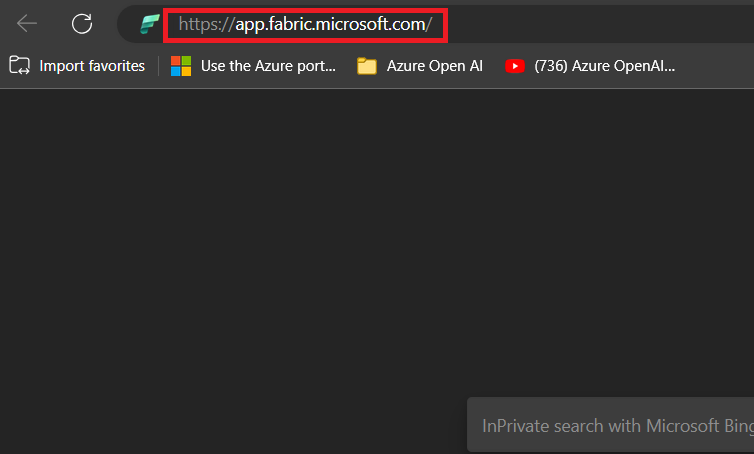

2.  En la ventana de **Microsoft** **Fabric**, ingrese sus credenciales
    y haga clic en el botón **Submit**.

> 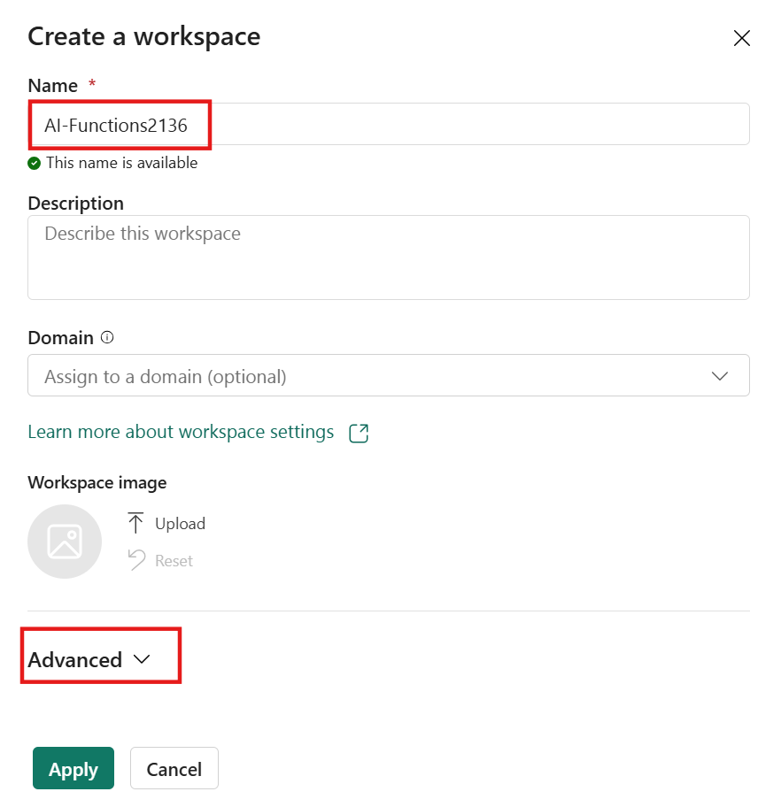

3.  Luego, en la ventana de **Microsoft**, ingrese la contraseña y haga
    clic en el botón **Sign in**.

> 

4.  En la ventana **Stay signed in?** haga clic en el botón **Yes**.

> 

5.  En la página principal de Fabric, seleccione el **tile +New
    workspace**.

> 

6.  En la pestaña **Create a workspace**, ingrese los siguientes
    detalles y haga clic en el botón **Apply**.

    |  |  |
    |-----|----|
    |Name|	+++dp_FabricXXXX+++ (XXXX can be a unique number)| 
    |Description|	This workspace contains Analyze data with Apache Spark|
    |Advanced|	Under License mode, select Fabric capacity|
    |Default storage format	|Small dataset storage format|

> 
>
> 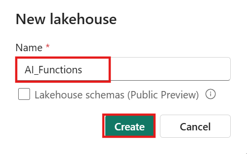

7.  Espere a que se complete la implementación. Toma de 2 a 3 minutos.
    Cuando se abra su nuevo workspace, debería estar vacío.

> 

## Tarea 2: Crear un lakehouse y cargar archivos

Ahora que tiene un workspace, es momento de cambiar a la experiencia de
*Data Engineering* en el portal y crear un data lakehouse para los
archivos de datos que va a analizar.

1.  Cree un nuevo Eventhouse haciendo clic en el botón **+New item** en
    la barra de navegación.


2.  Haga clic en el recuadro "**Lakehouse**".


3.  En el cuadro de diálogo **New lakehouse**, ingrese
    +++**Fabric_lakehouse**+++ en el campo **Name**, haga clic en el
    botón **Create** y abra el nuevo lakehouse.


4.  Después de un minuto aproximadamente, se creará un nuevo lakehouse
    vacío. Debe ingerir algunos datos en el lakehouse para su análisis.

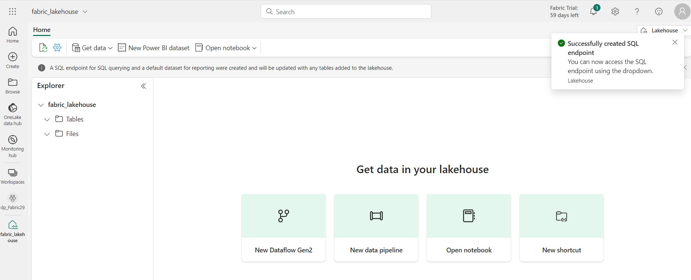

5.  Verá una notificación que indica **Successfully created SQL
    endpoint**.

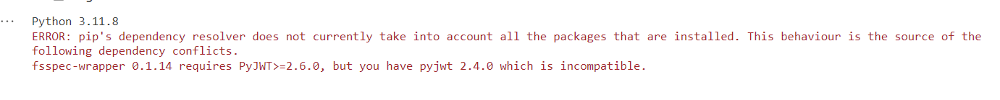

6.  En la sección **Explorer**, debajo de **fabric_lakehouse**, coloque
    el cursor junto a la carpeta **Files**, luego haga clic en el menú
    de puntos suspensivos horizontales (**…**). Navegue y haga clic en
    **Upload**, después seleccione **Upload folder**, tal como se
    muestra en la imagen a continuación.

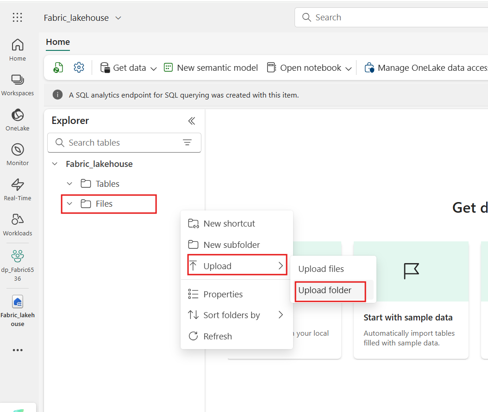

7.  En el panel **Upload folder** que aparece en el lado derecho,
    seleccione el **icono de carpeta** debajo de **Files/**, luego
    busque la ruta **C:\LabFiles**, seleccione la carpeta **orders** y
    haga clic en el botón **Upload**.


8.  En caso de que aparezca el cuadro de diálogo **Upload 3 files to
    this site?** haga clic en el botón **Upload**.

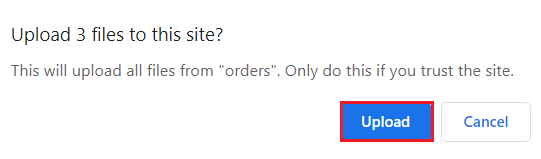

9.  En el panel **Upload folder**, haga clic en el botón **Upload**.

> 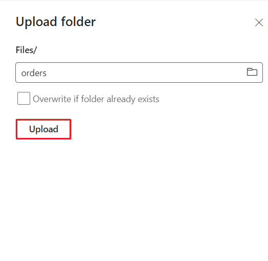

10. Después de que los archivos se hayan subido, cierre el panel
    **Upload folder**.

> 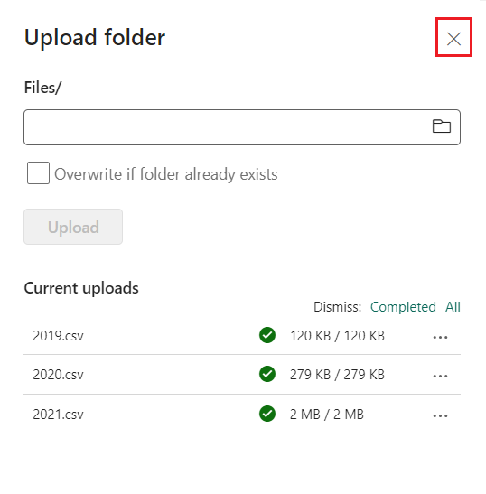

11. Expanda **Files** y seleccione la carpeta **orders** para verificar
    que los archivos CSV se hayan subido.

> 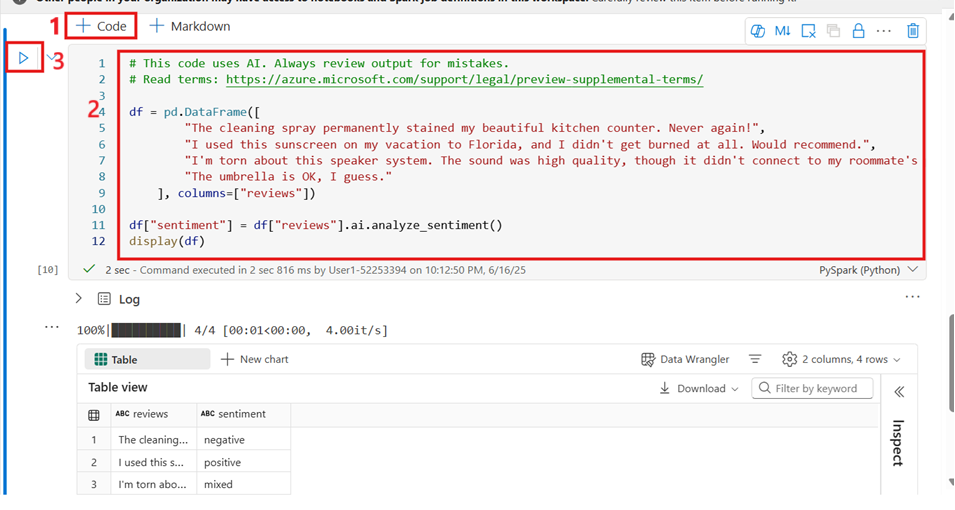

## Task 3: Crear un notebook

Para trabajar con datos en Apache Spark, puede crear un *notebook*. Los
notebooks proporcionan un entorno interactivo en el que puede escribir y
ejecutar código (en múltiples lenguajes) y agregar notas para
documentarlo.

1.  En la página **Home**, mientras visualiza el contenido de la carpeta
    **orders** en su **datalake**, en el menú **Open notebook**,
    seleccione **New notebook**.


2.  Después de unos segundos, se abrirá un nuevo notebook que contiene
    una sola *celda*. Los notebooks están compuestos por una o más
    celdas que pueden contener *código* o *markdown* (texto con
    formato).

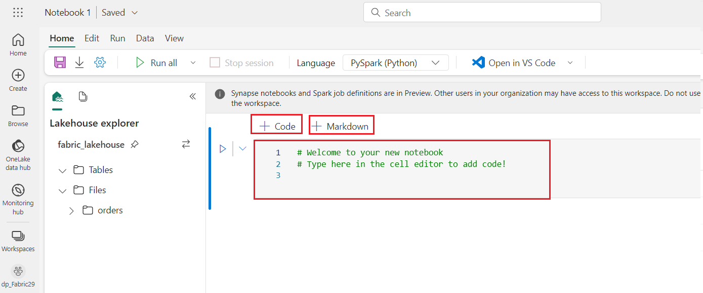

3.  Seleccione la primera celda (que actualmente es una celda de código)
    y, en la barra de herramientas dinámica en la esquina superior
    derecha, use el botón **M↓** **para convertir la celda en una celda
    de markdown**.


4.  Cuando la celda cambie a una celda de markdown, el texto que
    contiene se mostrará formateado.

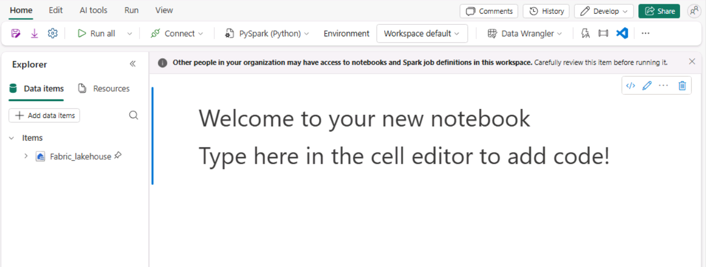

5.  Use el botón **🖉** (Edit) para cambiar la celda a modo de edición,
    reemplace todo el texto y luego modifique el markdown de la
    siguiente manera:

    CodeCopy
    ```
    # Sales order data exploration
    
    Use the code in this notebook to explore sales order data.
    ```

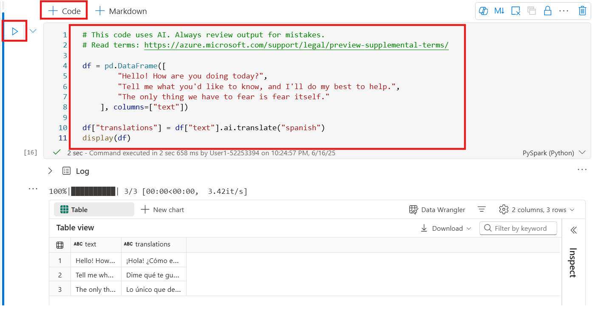


6.  Haga clic en cualquier lugar del notebook fuera de la celda para
    salir del modo de edición y ver el markdown renderizado.


## Tarea 4: Cargar datos en un dataframe

Ahora está listo para ejecutar código que cargue los datos en un
*dataframe*. Los dataframes en Spark son similares a los dataframes de
Pandas en Python y proporcionan una estructura común para trabajar con
datos organizados en filas y columnas.

**Nota**: Spark soporta múltiples lenguajes de programación, incluyendo
Scala, Java y otros. En este ejercicio, utilizaremos PySpark, que es una
variante de Python optimizada para Spark. PySpark es uno de los
lenguajes más utilizados en Spark y es el lenguaje predeterminado en los
notebooks de Fabric.

1.  Con el notebook visible, expanda la lista de **Files** y seleccione
    la carpeta **orders** para que los archivos CSV se muestren junto al
    editor del notebook.

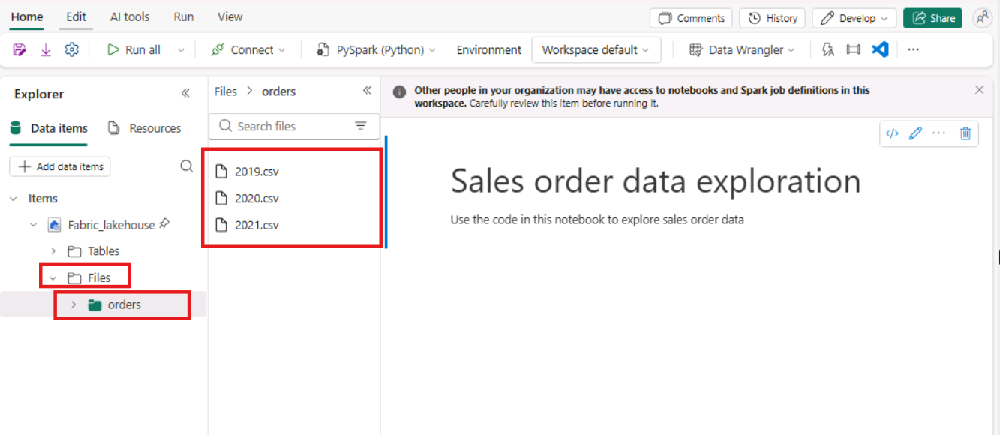

2.  Ahora, coloque el cursor sobre el archivo 2019.csv. Haga clic en los
    puntos suspensivos horizontales **(…)** junto a 2019.csv, luego
    seleccione **Load data** y elija **Spark**. Se agregará una nueva
    celda de código al notebook con el siguiente código:

    ```
    df = spark.read.format("csv").option("header","true").load("Files/orders/2019.csv")
    # df now is a Spark DataFrame containing CSV data from "Files/orders/2019.csv".
    display(df)
    ```
> 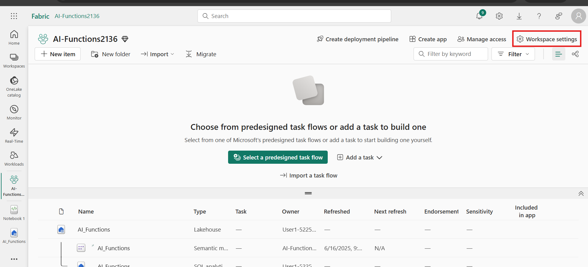
>
> 

**Sugerencia**: Puede ocultar los paneles del explorador del Lakehouse
en el lado izquierdo usando sus iconos «. Hacer esto le ayudará a
concentrarse en el notebook.

3.  Use el botón ▷ **Run cell** a la izquierda de la celda para
    ejecutarla.


**Nota**: Dado que es la primera vez que ejecuta código de Spark, se
debe iniciar una sesión de Spark. Esto significa que la primera
ejecución en la sesión puede tardar alrededor de un minuto en
completarse. Las ejecuciones posteriores serán más rápidas.

4.  Cuando el comando de la celda haya finalizado, revise la salida
    debajo de la celda, que debería verse similar a esto:


5.  La salida muestra las filas y columnas de datos del archivo
    2019.csv. Sin embargo, observe que los encabezados de columna no se
    ven correctos. El código predeterminado usado para cargar los datos
    en un dataframe asume que el archivo CSV incluye los nombres de
    columna en la primera fila, pero en este caso el archivo CSV solo
    contiene los datos sin información de encabezado.

6.  Modifique el código para establecer la opción **header** en
    **false**. Reemplace todo el código en la celda con el siguiente
    código, haga clic en el botón ▷ **Run cell** y revise la salida

    ```
    df = spark.read.format("csv").option("header","false").load("Files/orders/2019.csv")
    # df now is a Spark DataFrame containing CSV data from "Files/orders/2019.csv".
    display(df)
    ```


7.  Ahora el dataframe incluye correctamente la primera fila como
    valores de datos, pero los nombres de las columnas se generan
    automáticamente y no son muy útiles. Para interpretar correctamente
    los datos, necesita definir explícitamente el esquema correcto y el
    tipo de datos de los valores en el archivo.

8.  Reemplace todo el código en la celda con el siguiente código y haga
    clic en el botón **▷ Run cell** para revisar el resultado.

    ```
    from pyspark.sql.types import *
    
    orderSchema = StructType([
        StructField("SalesOrderNumber", StringType()),
        StructField("SalesOrderLineNumber", IntegerType()),
        StructField("OrderDate", DateType()),
        StructField("CustomerName", StringType()),
        StructField("Email", StringType()),
        StructField("Item", StringType()),
        StructField("Quantity", IntegerType()),
        StructField("UnitPrice", FloatType()),
        StructField("Tax", FloatType())
        ])
    
    df = spark.read.format("csv").schema(orderSchema).load("Files/orders/2019.csv")
    display(df)
    ```
> 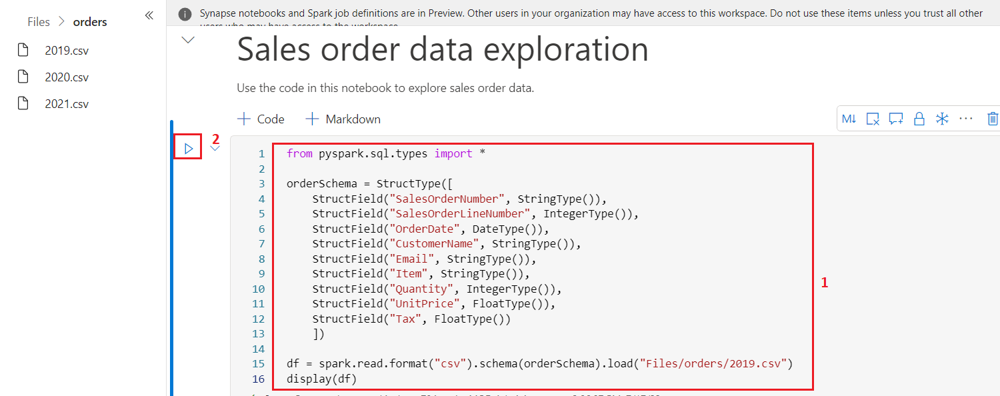
>
> 

9.  Ahora el dataframe incluye los nombres correctos de las columnas
    (además del **Index**, que es una columna incorporada en todos los
    dataframes basada en la posición ordinal de cada fila). Los tipos de
    datos de las columnas se especifican utilizando un conjunto estándar
    de tipos definidos en la librería Spark SQL, que se importaron al
    inicio de la celda.

10. Confirme que sus cambios se han aplicado a los datos visualizando el
    dataframe.

11. Use el **icono + Code** debajo de la salida de la celda para agregar
    una nueva celda de código al notebook, ingrese el siguiente código
    en ella. Haga clic en el botón **▷ Run cell** y revise la salida.

> CodeCopy
>
+++display(df)+++
>
> 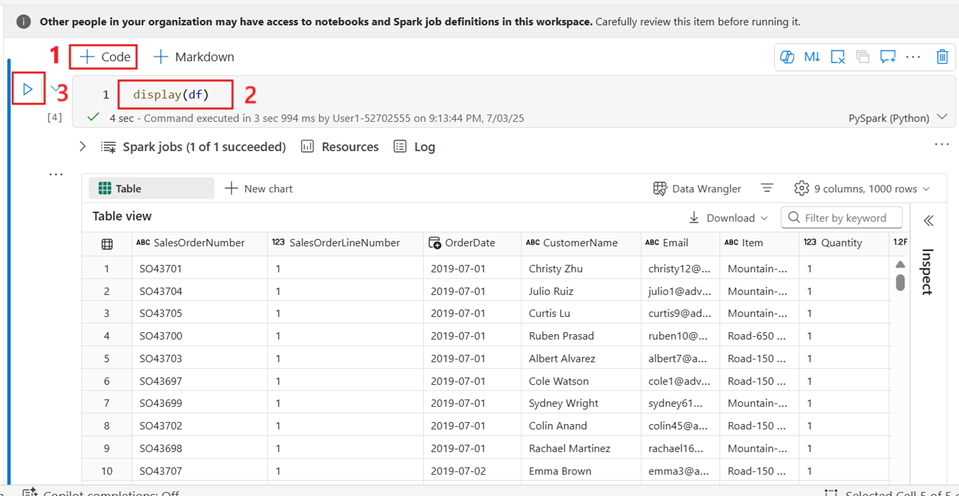

12. El dataframe incluye únicamente los datos del archivo **2019.csv.**
    Modifique el código para que la ruta del archivo use un comodín (\*)
    y lea los datos de ventas de todos los archivos en la carpeta
    **orders**.

13. Use el icono **+ Code** debajo del resultado de la celda para
    agregar una nueva celda de código al notebook, y escriba el
    siguiente código en ella.

    ```
    from pyspark.sql.types import *
    
    orderSchema = StructType([
        StructField("SalesOrderNumber", StringType()),
        StructField("SalesOrderLineNumber", IntegerType()),
        StructField("OrderDate", DateType()),
        StructField("CustomerName", StringType()),
        StructField("Email", StringType()),
        StructField("Item", StringType()),
        StructField("Quantity", IntegerType()),
        StructField("UnitPrice", FloatType()),
        StructField("Tax", FloatType())
        ])
    
    df = spark.read.format("csv").schema(orderSchema).load("Files/orders/*.csv")
    display(df)
    
    ```
> 

14. Ejecute la celda de código modificada y revise la salida, la cual
    ahora debería incluir las ventas de 2019, 2020 y 2021.

> 

**Nota**: Solo se muestra un subconjunto de las filas, por lo que puede
que no pueda ver ejemplos de todos los años.

# Ejercicio 2: Explorar datos en un dataframe

El objeto dataframe incluye una amplia gama de funciones que puede usar
para filtrar, agrupar y manipular de otras formas los datos que
contiene.

## Tarea 1: Filtrar un dataframe

1.  Use el icono + **Code** debajo del resultado de la celda para
    agregar una nueva celda de código al notebook, e ingrese el
    siguiente código en ella.

    ```
    customers = df['CustomerName', 'Email']
    print(customers.count())
    print(customers.distinct().count())
    display(customers.distinct())
    ```
> 

2.  **Ejecute** la nueva celda de código y revise los resultados.
    Observe los siguientes detalles:

    - Cuando realiza una operación en un dataframe, el resultado es un
      nuevo dataframe (en este caso, se crea un nuevo dataframe llamado
      **customers** al seleccionar un subconjunto específico de columnas
      del dataframe **df**)

    - Los dataframes proporcionan funciones como **count** y
      **distinct**, que pueden usarse para resumir y filtrar los datos
      que contienen.

    - La sintaxis dataframe\['Field1', 'Field2', ...\] es una forma
      abreviada de definir un subconjunto de columnas. También puede
      usar el método **select**, por lo que la primera línea del código
      anterior podría escribirse como customers =
      df.select("CustomerName", "Email")

> 

3.  Modifique el código: reemplace todo el contenido de la **celda** con
    el siguiente código y haga clic en el botón ▷ **Run cell** para
    ejecutarlo:

    ```
    customers = df.select("CustomerName", "Email").where(df['Item']=='Road-250 Red, 52')
    print(customers.count())
    print(customers.distinct().count())
    display(customers.distinct())
    ```
4.  **Ejecute** el código modificado para ver los clientes que han
    comprado el producto ***Road-250 Red, 52***. Tenga en cuenta que
    puede “**encadenar**” múltiples funciones, de manera que la salida
    de una función se convierta en la entrada de la siguiente; en este
    caso, el dataframe creado por el método **select** es el dataframe
    de origen para el método **where**, que se utiliza para aplicar los
    criterios de filtrado.

> 

## Tarea 2: Agregar y agrupar datos en un dataframe

1.  Seleccione **+ Code** y copie y pegue el siguiente código en la
    nueva celda. Luego, haga clic en el botón **▷ Run cell** para
    ejecutar el código.

    ```
    productSales = df.select("Item", "Quantity").groupBy("Item").sum()
    display(productSales)
    ```
> 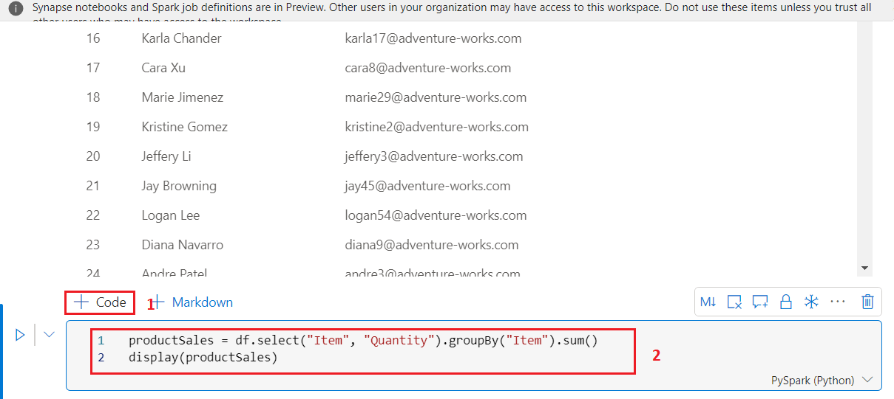

2.  Observe que los resultados muestran la suma de las cantidades de
    pedido agrupadas por producto. El método **groupBy** agrupa las
    filas por *Item*, y la función de agregación **sum** se aplica a
    todas las columnas numéricas restantes (en este caso, *Quantity*).

3.  Haga clic en **+ Code**, copie y pegue el siguiente código en la
    celda, luego haga clic en el botón **▷ Run cell**.


    ```
    from pyspark.sql.functions import *
    
    yearlySales = df.select(year("OrderDate").alias("Year")).groupBy("Year").count().orderBy("Year")
    display(yearlySales)
    ```
> 

4.  Observe que los resultados muestran el número de órdenes de venta
    por año. Note que el método **select** incluye la función SQL
    **year** para extraer el componente de año del campo **OrderDate**
    (por eso el código incluye una instrucción **import** para importar
    funciones desde la biblioteca Spark SQL). Luego se utiliza el método
    **alias** para asignar un nombre de columna al valor de año
    extraído. Los datos se agrupan por la columna derivada **Year** y se
    calcula el conteo de filas en cada grupo; finalmente, se utiliza el
    método **orderBy** para ordenar el dataframe resultante.

# Ejercicio 3: Usar Spark para transformar archivos de datos

Una tarea común para los ingenieros de datos es ingerir datos en un
formato o estructura específica y transformarlos para su posterior
procesamiento o análisis.

## Tarea 1: Utilizar métodos y funciones de un dataframe para transformar datos

1.  Haga clic en + Code y copie y pegue el siguiente código

**CodeCopy**

    ```
    from pyspark.sql.functions import *
    
    ## Create Year and Month columns
    transformed_df = df.withColumn("Year", year(col("OrderDate"))).withColumn("Month", month(col("OrderDate")))
    
    # Create the new FirstName and LastName fields
    transformed_df = transformed_df.withColumn("FirstName", split(col("CustomerName"), " ").getItem(0)).withColumn("LastName", split(col("CustomerName"), " ").getItem(1))
    
    # Filter and reorder columns
    transformed_df = transformed_df["SalesOrderNumber", "SalesOrderLineNumber", "OrderDate", "Year", "Month", "FirstName", "LastName", "Email", "Item", "Quantity", "UnitPrice", "Tax"]
    
    # Display the first five orders
    display(transformed_df.limit(5))
    ```
> 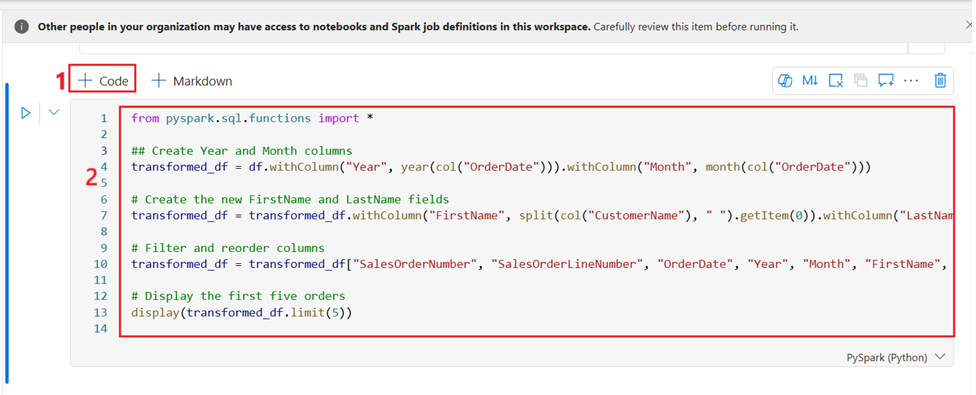

2.  **Ejecute** el código para crear un nuevo dataframe a partir de los
    datos originales de pedidos con las siguientes transformaciones:

    - Agregue columnas **Year** y **Month** basadas en la
      columna **OrderDate**.

    - Agregue columnas **FirstName** y **LastName** basadas en la
      columna **CustomerName**.

    - Filtre y reordene las columnas, eliminando la
      columna **CustomerName**.

> 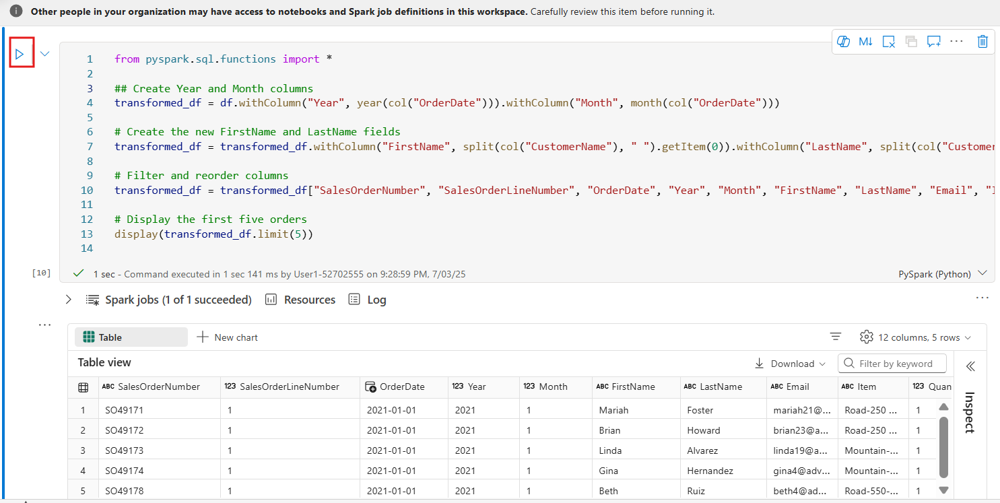

3.  Revise la salida y verifique que las transformaciones se hayan
    aplicado correctamente a los datos.


Puede usar todo el poder de la biblioteca Spark SQL para transformar los
datos mediante filtrado de filas, creación de columnas derivadas,
eliminación o renombrado de columnas y la aplicación de cualquier otra
modificación requerida.

**Consejo**: Consulte [*documentación de DataFrame de
Spark*](https://spark.apache.org/docs/latest/api/python/reference/pyspark.sql/dataframe.html) para
conocer más sobre los métodos del objeto DataFrame.

## Tarea 2: Guardar los datos transformados

1.  **Agregue una nueva celda** con el siguiente código para guardar el
    dataframe transformado en formato Parquet (sobrescribiendo los datos
    si ya existen). **Ejecute** la celda y espere el mensaje que indique
    que los datos han sido guardados.

    ```
    transformed_df.write.mode("overwrite").parquet('Files/transformed_data/orders')
    print ("Transformed data saved!")
    ```
> **Nota**: Normalmente, el formato *Parquet* se prefiere para archivos
> de datos que se utilizarán para análisis adicionales o para su
> ingestión en un almacén analítico. Parquet es un formato muy eficiente
> y es compatible con la mayoría de los sistemas de análisis de datos a
> gran escala. De hecho, en ocasiones, el requisito de transformación de
> datos puede ser simplemente convertir datos de otro formato (como CSV)
> a Parquet.
>
> 
>
> 

2.  Luego, en el panel del **explorador del Lakehouse** a la izquierda,
    en el menú … del nodo **Files**, seleccione **Refresh**.

> 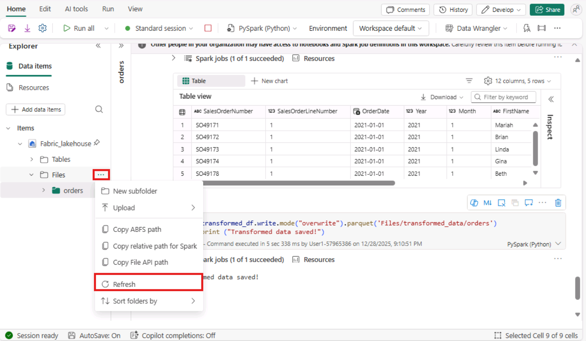

3.  Haga clic en la carpeta **transformed_data** para verificar que
    contiene una nueva carpeta llamada **orders**, la cual a su vez
    contiene uno o más **archivos** **Parquet**.

> 

4.  Haga clic en **+ Code** e ingrese el siguiente código para cargar un
    nuevo dataframe desde los archivos **Parquet** en la carpeta
    **transformed_data -\> orders**:

    ```
    orders_df.write.partitionBy("Year","Month").mode("overwrite").parquet("Files/partitioned_data")
    print ("Transformed data saved!")
    ```
> 

5.  **Ejecute** la celda y verifique que los resultados muestran los
    datos de órdenes que se han cargado desde los archivos Parquet.

> 

## Tarea 3: Guardar los datos en archivos particionados

1.  Agregue una nueva celda, haga clic en **+ Code** e ingrese el
    siguiente código; este guarda el dataframe particionando los datos
    por **Year** y **Month**. **Ejecute** la celda y espere el mensaje
    que indique que los datos se han guardado.

    ```
    orders_df.write.partitionBy("Year","Month").mode("overwrite").parquet("Files/partitioned_data")
    print ("Transformed data saved!")
    ```
> 
>
> 

2.  Luego, en el panel **Lakehouse explorer** a la izquierda, haga clic
    en el menú **…** del nodo **Files** y seleccione **Refresh**.

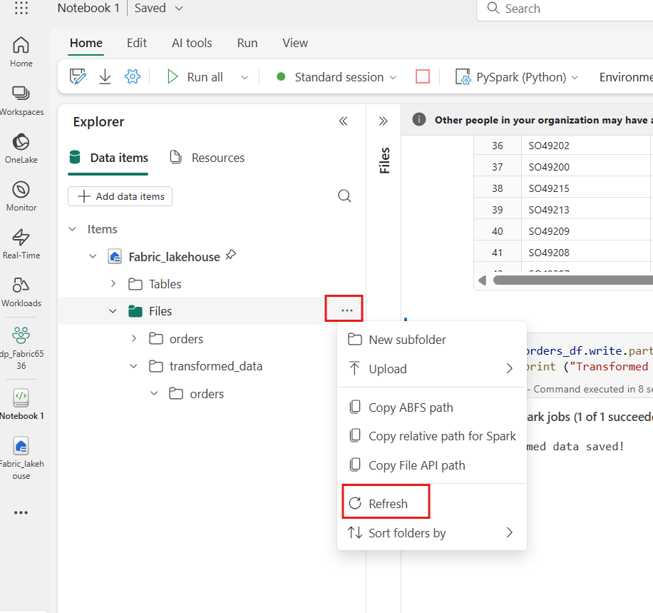

3.  Expanda la carpeta **partitioned_orders** para verificar que
    contiene una jerarquía de carpetas con nombres **Year=*xxxx***, cada
    una conteniendo carpetas **Month= *xxxx***. Cada carpeta de mes
    contiene uno o más archivos Parquet con los pedidos correspondientes
    a ese mes.


> El particionado de archivos de datos es una técnica común para
> optimizar el rendimiento al trabajar con grandes volúmenes de
> información. Esta técnica puede mejorar significativamente la
> eficiencia de las consultas y facilita la filtración de los datos.

4.  Agregue una nueva celda, haga clic en + **Code** e ingrese el
    siguiente código para cargar un nuevo dataframe desde el archivo
    **orders.parquet**:

    ```
    orders_2021_df = spark.read.format("parquet").load("Files/partitioned_data/Year=2021/Month=*")
    display(orders_2021_df)
    ```
5.  **Ejecute** la celda y verifique que los resultados muestren los
    datos de pedidos de ventas de 2021. Note que las columnas de
    partición especificadas en la ruta **(Year y Month)** no se incluyen
    automáticamente en el dataframe.


# **Ejercicio 3: Trabajar con tablas y SQL**

Como ha observado, los métodos nativos del objeto dataframe le permiten
consultar y analizar datos de un archivo de manera bastante efectiva.
Sin embargo, muchos analistas de datos se sienten más cómodos trabajando
con tablas que pueden consultar utilizando la sintaxis SQL. Spark
proporciona un metastore en el que puede definir tablas relacionales. La
biblioteca Spark SQL, que provee el objeto dataframe, también admite el
uso de sentencias SQL para consultar tablas en el metastore. Al utilizar
estas características de Spark, puede combinar la flexibilidad de un
data lake con el esquema de datos estructurado y las consultas basadas
en SQL de un data warehouse relacional; de ahí el término “data
lakehouse”.

## Tarea 1: Crear una tabla administrada

Las tablas en un metastore de Spark son abstracciones relacionales sobre
archivos en el data lake. Las tablas pueden ser *administradas* (en cuyo
caso los archivos son gestionados por el metastore) o externas (en cuyo
caso la tabla hace referencia a una ubicación de archivo en el data lake
que usted administra de manera independiente al metastore).

1.  Agregue una nueva celda de código, haga clic en **+** **Code** en el
    cuaderno e ingrese el siguiente código, que guarda el dataframe de
    datos de órdenes de venta como una tabla llamada **salesorders**:

    ```
    # Create a new table
    df.write.format("delta").saveAsTable("salesorders")
    
    # Get the table description
    spark.sql("DESCRIBE EXTENDED salesorders").show(truncate=False)
    ```
**Nota**: Vale la pena destacar un par de aspectos sobre este ejemplo.
Primero, no se proporciona una ruta explícita, por lo que los archivos
de la tabla serán gestionados por el metastore. Segundo, la tabla se
guarda en formato **delta**. Puede crear tablas basadas en múltiples
formatos de archivo (incluyendo CSV, Parquet, Avro y otros), pero *Delta
Lake* es una tecnología de Spark que agrega capacidades de base de datos
relacional a las tablas; incluyendo soporte para transacciones,
versionado de filas y otras funciones útiles. Crear tablas en formato
delta es la práctica recomendada para data lakehouses en Fabric.

2.  **Ejecute** la celda de código y revise la salida, la cual describe
    la definición de la nueva tabla.


3.  En el panel **Lakehouse explorer**, en el menú **…** de la carpeta
    **Tables**, seleccione **Refresh**.

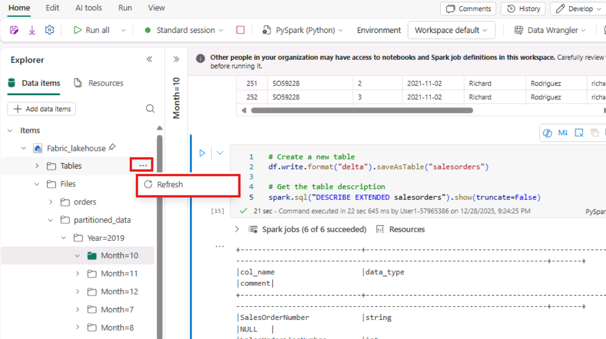

4.  Luego, expanda el nodo **Tables** y verifique que la tabla
    **salesorders** se haya creado.


5.  Coloque el cursor junto a la tabla **salesorders**, luego haga clic
    en los puntos suspensivos horizontales (**…**). Navegue y haga clic
    en **Load data**, luego seleccione **Spark**.


6.  Haga clic en el botón ▷ **Run cell**, el cual utiliza la biblioteca
    **Spark SQL** para ejecutar una consulta SQL sobre la tabla
    **salesorders** en código PySpark y cargar los resultados de la
    consulta en un dataframe.

    ```
    df = spark.sql("SELECT * FROM [your_lakehouse].salesorders LIMIT 1000")
    display(df)
    ```


## Tarea 2: Crear una tabla externa

También puede crear tablas externas, en las cuales los metadatos del
esquema se definen en el metastore del lakehouse, pero los archivos de
datos se almacenan en una ubicación externa.

1.  Debajo de los resultados devueltos por la primera celda de código,
    use el botón **+ Code** para agregar una nueva celda de código si
    aún no existe. Luego, ingrese el siguiente código en la nueva celda.

    ```
    df.write.format("delta").saveAsTable("external_salesorder", path="<abfs_path>/external_salesorder")
    ```


2.  En el panel **Lakehouse explorer**, en el menú **…** de la carpeta
    **Files**, seleccione **Copy ABFS path** en el bloc de notas.

> La ruta ABFS es la ruta completamente calificada a la carpeta
> **Files** en el almacenamiento OneLake de su lakehouse, similar a la
> siguiente:

abfss://dp_Fabric29@onelake.dfs.fabric.microsoft.com/Fabric_lakehouse.Lakehouse/Files/external_salesorder


3.  Ahora, vaya a la celda de código y reemplace **\<abfs_path\>** con
    la **ruta** que copió en el bloc de notas, de manera que el código
    guarde el dataframe como una tabla externa con los archivos de datos
    en una carpeta llamada **external_salesorder** dentro de la
    ubicación de su carpeta **Files**. La ruta completa debería verse
    similar a la siguiente:

abfss://dp_Fabric29@onelake.dfs.fabric.microsoft.com/Fabric_lakehouse.Lakehouse/Files/external_salesorder

4.  Use el botón ▷ (***Run cell***) a la izquierda de la celda para
    ejecutarla.


5.  En el panel **Lakehouse explorer**, en el menú **…** de la carpeta
    **Tables**, seleccione **Refresh**.


6.  Luego, expanda el nodo **Tables** y verifique que la tabla
    **external_salesorder** se haya creado.


7.  En el panel **Lakehouse explorer**, en el menú **…** de la carpeta
    **Files**, seleccione **Refresh**.


8.  Luego, expanda el nodo **Files** y verifique que se haya creado la
    carpeta **external_salesorder** para los archivos de datos de la
    tabla.


## Tarea 3: Comparar tablas administradas y externas

Exploraremos las diferencias entre las tablas administradas y las
externas.

1.  Debajo de los resultados devueltos por la celda de código, use el
    botón **+ Code** para agregar una nueva celda de código. Copie el
    siguiente código en la celda de código y utilice el botón ▷ (**Run
    cell**) a la izquierda de la celda para ejecutarlo.

    ```
    %%sql
    
    DESCRIBE FORMATTED salesorders;
    ```
> 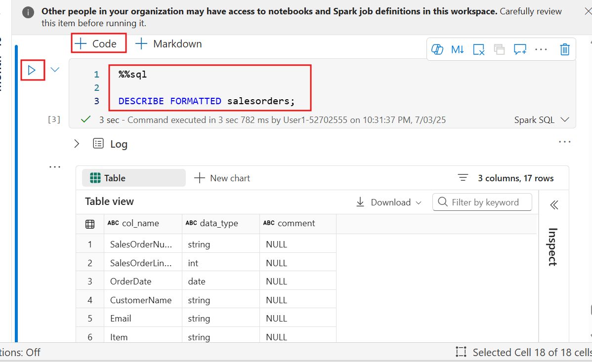

2.  En los resultados, consulte la propiedad **Location** de la tabla,
    la cual debería ser una ruta al almacenamiento **OneLake** del
    lakehouse que termina con **/Tables/salesorders** (es posible que
    necesite ampliar la columna **Data type** para ver la ruta
    completa).


3.  Modifique el comando **DESCRIBE** para mostrar los detalles de la
    tabla **external_salesorder** como se muestra a continuación.

4.  Debajo de los resultados devueltos por la celda de código, use el
    botón **+ Code** para agregar una nueva celda de código. Copie el
    siguiente código en la celda y utilice el botón ▷ (**Run cell**) a
    la izquierda de la celda para ejecutarlo.

    ```
    %%sql
    
    DESCRIBE FORMATTED external_salesorder;
    ```
5.  En los resultados, consulte la propiedad **Location** de la tabla,
    la cual debería ser una ruta al almacenamiento **OneLake** del
    lakehouse que termina con **/Files/external_salesorder** (es posible
    que necesite ampliar la columna **Data type** para ver la ruta
    completa).


## Tarea 4: Ejecutar código SQL en una celda

Si bien es útil poder incrustar sentencias SQL en una celda que contenga
código PySpark, los analistas de datos a menudo solo desean trabajar
directamente en SQL.

1.  Haga clic en **+ Code** en el cuaderno e ingrese el siguiente código
    en la celda. Haga clic en el botón ▷ (**Run cell**) y revise los
    resultados. Observe que:

    - La línea %%sql al inicio de la celda (llamada magic) indica que se
      debe utilizar el runtime de Spark SQL para ejecutar el código en
      esta celda en lugar de PySpark.

    - El código SQL hace referencia a la tabla **salesorders** que creó
      previamente.

    - La salida de la consulta SQL se muestra automáticamente como
      resultado debajo de la celda.

      ```
      %%sql
      SELECT YEAR(OrderDate) AS OrderYear,
             SUM((UnitPrice * Quantity) + Tax) AS GrossRevenue
      FROM salesorders
      GROUP BY YEAR(OrderDate)
      ORDER BY OrderYear;
      ```


**Nota**: Para obtener más información sobre Spark SQL y los dataframes,
consulte la [*documentación de Spark
SQL*](https://spark.apache.org/docs/2.2.0/sql-programming-guide.html).

# Ejercicio 4: Visualizar datos con Spark

Una imagen vale más que mil palabras, y un gráfico suele ser mejor que
mil filas de datos. Aunque los cuadernos en Fabric incluyen una vista de
gráficos integrada para los datos que se muestran desde un dataframe o
una consulta de Spark SQL, esta no está diseñada para creación de
gráficos de manera integral. Sin embargo, puede utilizar bibliotecas
gráficas de Python, como **matplotlib** y **seaborn**, para crear
gráficos a partir de los datos en los dataframes.

## Tarea 1: Visualizar resultados como un gráfico

1.  Haga clic en **+ Code** en el cuaderno e ingrese el siguiente código
    en la celda. Haga clic en el botón ▷ (**Run cell**) y observe que
    devuelve los datos de la vista **salesorders** que creó previamente.

    ```
    %%sql
    SELECT * FROM salesorders
    ```


2.  En la sección de resultados debajo de la celda, cambie la opción
    **View** de **Table** a **+New chart**.

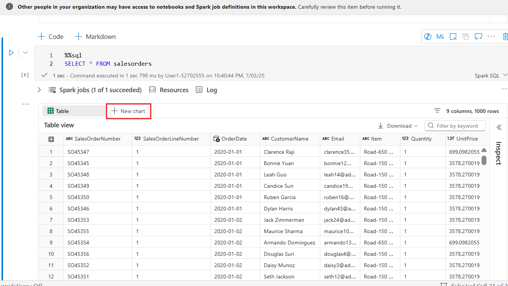

3.  Utilice el botón **Start editing** en la esquina superior derecha
    del gráfico para mostrar el panel de opciones del mismo. Luego,
    configure las opciones como se indica a continuación y seleccione
    **Apply**:

    - **Chart type**: Bar chart

    - **Key**: Item

    - **Values**: Quantity

    - **Series Group**: *dejar en blanco*

    - **Aggregation**: Sum

    - **Stacked**: *No seleccionado*


4.  Verifique que el gráfico se vea de manera similar a esto.

> 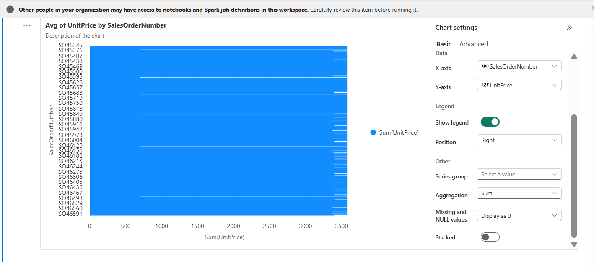

## Tarea 2: Introducción a matplotlib

1.  Haga clic en **+ Code** y copie y pegue el siguiente código.
    **Ejecute** la celda y observe que devuelve un dataframe de Spark
    que contiene los ingresos anuales.

    ```
    sqlQuery = "SELECT CAST(YEAR(OrderDate) AS CHAR(4)) AS OrderYear, \
                    SUM((UnitPrice * Quantity) + Tax) AS GrossRevenue \
                FROM salesorders \
                GROUP BY CAST(YEAR(OrderDate) AS CHAR(4)) \
                ORDER BY OrderYear"
    df_spark = spark.sql(sqlQuery)
    df_spark.show()
    ```
> 

2.  Para visualizar los datos como un gráfico, comenzaremos utilizando
    la biblioteca de Python **matplotlib**. Esta biblioteca es la
    principal para creación de gráficos, sobre la cual se basan muchas
    otras, y ofrece una gran flexibilidad para generar distintos tipos
    de gráficos.

3.  Haga clic en **+ Code** y copie y pegue el siguiente código.

**CodeCopy**

    ```
    from matplotlib import pyplot as plt
    
    # matplotlib requires a Pandas dataframe, not a Spark one
    df_sales = df_spark.toPandas()
    
    # Create a bar plot of revenue by year
    plt.bar(x=df_sales['OrderYear'], height=df_sales['GrossRevenue'])
    
    # Display the plot
    plt.show()
    ```


5.  Haga clic en el botón **Run cell** y revise los resultados, los
    cuales consisten en un gráfico de columnas con el ingreso bruto
    total por cada año. Observe las siguientes características del
    código utilizado para generar este gráfico:

    - La biblioteca **matplotlib** requiere un dataframe de Pandas, por
      lo que es necesario convertir el dataframe de Spark devuelto por
      la consulta Spark SQL a este formato.

    - En el núcleo de la biblioteca **matplotlib** se encuentra el
      objeto **pyplot**, que es la base de la mayoría de las
      funcionalidades de creación de gráficos.

    - La configuración predeterminada genera un gráfico funcional, pero
      existe un amplio margen para personalizarlo.

> 

6.  Modifique el código para trazar el gráfico de la siguiente manera:
    reemplace todo el código de la **celda** con el siguiente y haga
    clic en el botón ▷ (**Run cell**) para revisar la salida.
    ```
    from matplotlib import pyplot as plt
    
    # Clear the plot area
    plt.clf()
    
    # Create a bar plot of revenue by year
    plt.bar(x=df_sales['OrderYear'], height=df_sales['GrossRevenue'], color='orange')
    
    # Customize the chart
    plt.title('Revenue by Year')
    plt.xlabel('Year')
    plt.ylabel('Revenue')
    plt.grid(color='#95a5a6', linestyle='--', linewidth=2, axis='y', alpha=0.7)
    plt.xticks(rotation=45)
    
    # Show the figure
    plt.show()
    ```
> 
>
> 

7.  El gráfico ahora incluye un poco más de información. Técnicamente,
    un gráfico (*plot*) está contenido dentro de una **Figure**. En los
    ejemplos anteriores, la figura se creó de manera implícita; sin
    embargo, usted puede crearla de forma explícita.

8.  Modifique el código para trazar el gráfico de la siguiente manera:
    reemplace todo el código de la celda con el siguiente código.

    ```
    from matplotlib import pyplot as plt
    
    # Clear the plot area
    plt.clf()
    
    # Create a Figure
    fig = plt.figure(figsize=(8,3))
    
    # Create a bar plot of revenue by year
    plt.bar(x=df_sales['OrderYear'], height=df_sales['GrossRevenue'], color='orange')
    
    # Customize the chart
    plt.title('Revenue by Year')
    plt.xlabel('Year')
    plt.ylabel('Revenue')
    plt.grid(color='#95a5a6', linestyle='--', linewidth=2, axis='y', alpha=0.7)
    plt.xticks(rotation=45)
    
    # Show the figure
    plt.show()
    ```
9.  **Vuelva a ejecutar la celda** de código y revise los resultados. La
    figura determina la forma y el tamaño del gráfico.

> Una figura puede contener múltiples subplots, cada uno con su propio
> eje (*axis*).
>
> 
>
> 

10. Modifique el código para trazar el gráfico de la siguiente manera.
    Vuelva a ejecutar la celda de código y revise los resultados. La
    figura contiene los subplots especificados en el código.

      ```
      from matplotlib import pyplot as plt
      
      # Clear the plot area
      plt.clf()
      
      # Create a figure for 2 subplots (1 row, 2 columns)
      fig, ax = plt.subplots(1, 2, figsize = (10,4))
      
      # Create a bar plot of revenue by year on the first axis
      ax[0].bar(x=df_sales['OrderYear'], height=df_sales['GrossRevenue'], color='orange')
      ax[0].set_title('Revenue by Year')
      
      # Create a pie chart of yearly order counts on the second axis
      yearly_counts = df_sales['OrderYear'].value_counts()
      ax[1].pie(yearly_counts)
      ax[1].set_title('Orders per Year')
      ax[1].legend(yearly_counts.keys().tolist())
      
      # Add a title to the Figure
      fig.suptitle('Sales Data')
      
      # Show the figure
      plt.show()
      ```
> 
>
> 

**Nota**: Para obtener más información sobre la creación de gráficos con
matplotlib, consulte la [*documentación de
matplotlib*](https://matplotlib.org/).

## Tarea 3: Utilizar la biblioteca seaborn

Aunque **matplotlib** le permite crear gráficos complejos de múltiples
tipos, a veces se requiere código complejo para obtener los mejores
resultados. Por esta razón, a lo largo de los años se han desarrollado
muchas bibliotecas nuevas sobre la base de matplotlib para abstraer su
complejidad y mejorar sus capacidades. Una de estas bibliotecas es
**seaborn**.

1.  Haga clic en **+ Code** y copie y pegue el siguiente código:

    ```
    import seaborn as sns
    
    # Clear the plot area
    plt.clf()
    
    # Create a bar chart
    ax = sns.barplot(x="OrderYear", y="GrossRevenue", data=df_sales)
    plt.show()
    ```

2.  **Ejecute** la celda de código y observe que se muestra un gráfico
    de barras utilizando la biblioteca seaborn.


3.  **Modifique** el código de la siguiente manera. **Ejecute** el
    código modificado y observe que seaborn le permite establecer un
    tema de color consistente para sus gráficos.

    ```
    import seaborn as sns
    
    # Clear the plot area
    plt.clf()
    
    # Set the visual theme for seaborn
    sns.set_theme(style="whitegrid")
    
    # Create a bar chart
    ax = sns.barplot(x="OrderYear", y="GrossRevenue", data=df_sales)
    plt.show()
    ```
> 

4.  **Modifique** nuevamente el código de la siguiente manera.
    **Ejecute** el código modificado para visualizar los ingresos
    anuales como un gráfico de líneas.

    ```
    import seaborn as sns
    
    # Clear the plot area
    plt.clf()
    
    # Create a bar chart
    ax = sns.lineplot(x="OrderYear", y="GrossRevenue", data=df_sales)
    plt.show()
    ```
> 

**Note**: Para obtener más información sobre la creación de gráficos con
seaborn, consulte la [*documentación de
seaborn*](https://seaborn.pydata.org/index.html).

## Tarea 4: Utilizar tablas delta para datos en streaming

Delta Lake admite datos en streaming. Las tablas Delta pueden funcionar
como sink o source para flujos de datos creados mediante la API Spark
Structured Streaming. En este ejemplo, utilizará una tabla Delta como
sink para algunos datos en streaming en un escenario simulado de
Internet of Things (IoT)**.**

1.  Haga clic en **+ Code**, copie y pegue el siguiente código, y luego
    haga clic en el botón **Run cell**.

    ```
    from notebookutils import mssparkutils
    from pyspark.sql.types import *
    from pyspark.sql.functions import *
    
    # Create a folder
    inputPath = 'Files/data/'
    mssparkutils.fs.mkdirs(inputPath)
    
    # Create a stream that reads data from the folder, using a JSON schema
    jsonSchema = StructType([
    StructField("device", StringType(), False),
    StructField("status", StringType(), False)
    ])
    iotstream = spark.readStream.schema(jsonSchema).option("maxFilesPerTrigger", 1).json(inputPath)
    
    # Write some event data to the folder
    device_data = '''{"device":"Dev1","status":"ok"}
    {"device":"Dev1","status":"ok"}
    {"device":"Dev1","status":"ok"}
    {"device":"Dev2","status":"error"}
    {"device":"Dev1","status":"ok"}
    {"device":"Dev1","status":"error"}
    {"device":"Dev2","status":"ok"}
    {"device":"Dev2","status":"error"}
    {"device":"Dev1","status":"ok"}'''
    mssparkutils.fs.put(inputPath + "data.txt", device_data, True)
    print("Source stream created...")
    ```
> 
>
> 

2.  Asegúrese de que se imprima el mensaje ***Source stream created…***.
    El código que acaba de ejecutar ha creado una fuente de datos en
    **streaming** basada en una carpeta a la que se han guardado algunos
    datos, que representan lecturas de dispositivos IoT hipotéticos.

3.  Haga clic en **+ Code**, copie y pegue el siguiente código, y luego
    haga clic en el botón **Run cell**.

    ```
    # Write the stream to a delta table
    delta_stream_table_path = 'Tables/iotdevicedata'
    checkpointpath = 'Files/delta/checkpoint'
    deltastream = iotstream.writeStream.format("delta").option("checkpointLocation", checkpointpath).start(delta_stream_table_path)
    print("Streaming to delta sink...")
    ```
> 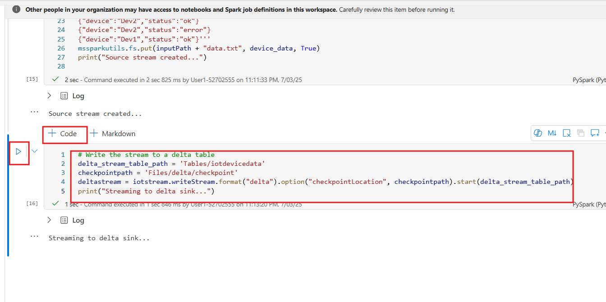

4.  Este código escribe los datos en streaming de los dispositivos en
    formato **Delta** en una carpeta llamada **iotdevicedata**. Dado que
    la ruta de la carpeta se encuentra en la carpeta **Tables**, se
    creará automáticamente una tabla para ella. Haga clic en los **tres
    puntos horizontales** junto a la tabla y luego seleccione
    **Refresh**.


5.  Haga clic en **+ Code**, copie y pegue el siguiente código, y luego
    haga clic en el botón **Run cell**.

    ```
    %%sql
    
    SELECT * FROM IotDeviceData;
    ```
> 

6.  Este código realiza una consulta a la tabla **IotDeviceData**, la
    cual contiene los datos de los dispositivos provenientes de la
    fuente en streaming.

7.  Haga clic en **+ Code**, copie y pegue el siguiente código, y luego
    haga clic en el botón **Run cell**.

    ```
    # Add more data to the source stream
    more_data = '''{"device":"Dev1","status":"ok"}
    {"device":"Dev1","status":"ok"}
    {"device":"Dev1","status":"ok"}
    {"device":"Dev1","status":"ok"}
    {"device":"Dev1","status":"error"}
    {"device":"Dev2","status":"error"}
    {"device":"Dev1","status":"ok"}'''
    
    mssparkutils.fs.put(inputPath + "more-data.txt", more_data, True)
    ```
> 

8.  Este código escribe más datos hipotéticos de los dispositivos en la
    fuente de streaming.

9.  Haga clic en **+ Code**, copie y pegue el siguiente código, y luego
    haga clic en el botón **Run cell**.

    ```
    %%sql
    
    SELECT * FROM IotDeviceData;
    ```
> 

10. Este código vuelve a consultar la tabla **IotDeviceData**, la cual
    ahora debería incluir los datos adicionales que se agregaron a la
    fuente de streaming.

11. Haga clic en **+ Code**, copie y pegue el siguiente código, y luego
    haga clic en el botón **Run cell**.

    ```
    deltastream.stop()
    ```
> 

12. Este código detiene el stream.

## Tarea 5: Guardar el notebook y finalizar la sesión de Spark

Ahora que ha terminado de trabajar con los datos, puede guardar el
notebook con un nombre significativo y finalizar la sesión de Spark.

1.  En la barra de menú del notebook, use el icono ⚙️ **Settings** para
    ver la configuración del notebook.


2.  Establezca el **Name** del notebook como **+++Explore Sales
    Orders+++** y luego cierre el panel de settings.


3.  En el menú del **notebook**, seleccione **Stop session** para
    finalizar la sesión de **Spark**.


**Ejercicio 5: Crear un Dataflow (Gen2) en Microsoft Fabric**

En Microsoft Fabric, los Dataflows (Gen2) se conectan a diversas fuentes
de datos y realizan transformaciones en Power Query Online.
Posteriormente, pueden ser utilizados en Data Pipelines para ingerir
datos en un lakehouse u otro almacén analítico, o para definir un
dataset para un informe de Power BI.

Este ejercicio está diseñado para introducir los distintos elementos de
los Dataflows (Gen2), y no para crear una solución compleja que pudiera
existir en una empresa.

## Tarea 1: Crear un Dataflow (Gen2) para ingerir datos

Ahora que dispone de un lakehouse, necesita ingerir datos en él. Una
forma de hacerlo es definiendo un dataflow que encapsule un proceso de
*extract, transform, and load (ETL)**.***

1.  Ahora, haga clic en **Fabric_lakehouse** en el panel de navegación
    lateral izquierdo.

> 

2.  En la página principal de **Fabric_lakehouse**, haga clic en la
    flecha desplegable de **Get data** y seleccione **New Dataflow
    Gen2**. Se abrirá el editor de Power Query para su nuevo
    dataflow**.**

> 

5.  En el cuadro de diálogo **New Dataflow Gen2**, ingrese
    **+++Gen2_Dataflow+++** en el campo **Name**, haga clic en el botón
    **Create** y abra el nuevo Dataflow Gen2.

> 

3.  En el panel de **Power Query**, bajo la pestaña **Home**, haga clic
    en **Import from a Text/CSV file**.

> 

4.  En el panel **Connect to data source**, bajo **Connection
    settings**, seleccione el botón de opción **Link to file (vista
    previa)**.

- **Link to file**: **Seleccionado**

- **File path or
  URL**: +++https://raw.githubusercontent.com/MicrosoftLearning/dp-data/main/orders.csv+++

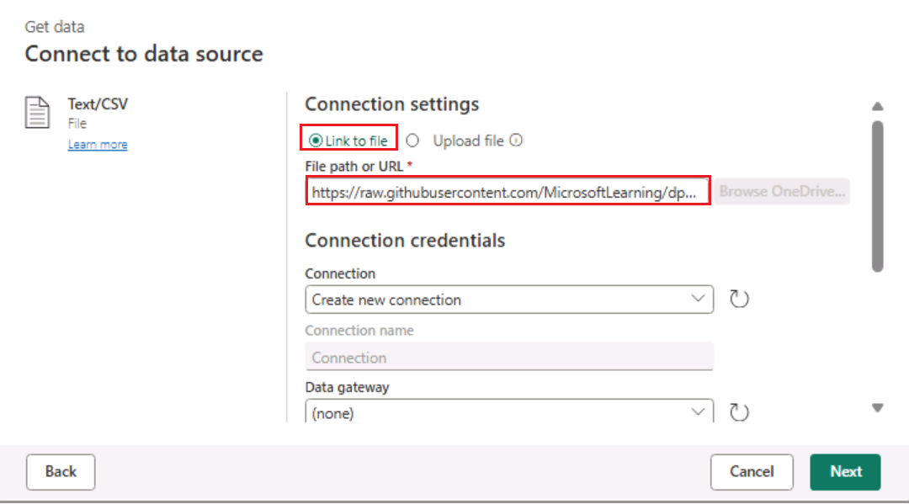

5.  En el panel **Connect to data source**, bajo **Connection
    credentials**, ingrese los siguientes detalles y haga clic en el
    botón **Next**.

- **Connection**: Create new connection

- **data gateway**: (none)

- **Authentication kind**: Anonymous

> 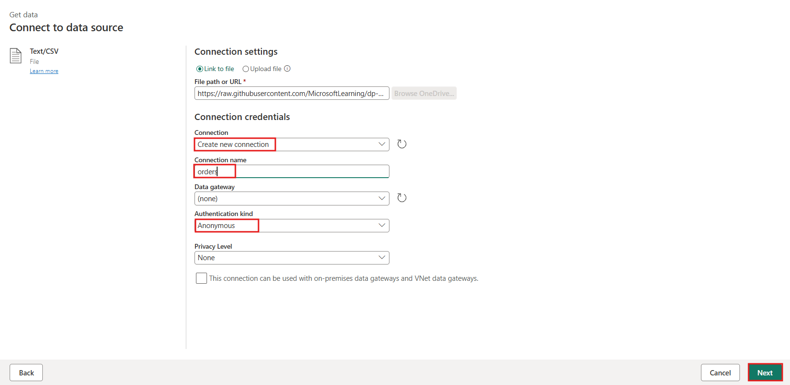

6.  En el panel **Preview file data**, haga clic en **Create** para
    crear la fuente de datos.
     

8.  El editor de **Power Query** muestra la fuente de datos y un
    conjunto inicial de pasos de consulta para dar formato a los datos.


8.  En la cinta de opciones de la barra de herramientas, seleccione la
    pestaña **Add column**. Luego, seleccione **Custom column**.

 

9.  Establezca el nombre de la nueva columna como +++**MonthNo+++** ,
    configure el Data type como **Whole Number** y luego agregue la
    siguiente fórmula:+++**Date.Month(\[OrderDate\])+++** en **Custom
    column formula**. Seleccione **OK**.


10. Observe cómo el paso para agregar la columna personalizada se añade
    a la consulta. La columna resultante se muestra en el panel de
    datos.


**Consejo:** En el panel Query Settings en el lado derecho, observe que
**Applied** **Steps** incluye cada paso de transformación. En la parte
inferior, también puede alternar el botón **Diagram** **flow** para
activar el Diagrama visual de los pasos.  
Los pasos se pueden mover hacia arriba o hacia abajo, editar
seleccionando el icono de engranaje, y puede seleccionar cada paso para
ver cómo se aplican las transformaciones en el panel de vista previa.

Tarea 2: Agregar destino de datos para el Dataflow

1.  En la cinta de opciones de **Power** **Query**, seleccione la
    pestaña **Home**. Luego, en el menú desplegable **Data**
    **destination**, seleccione **Lakehouse** (si no está seleccionado
    ya).

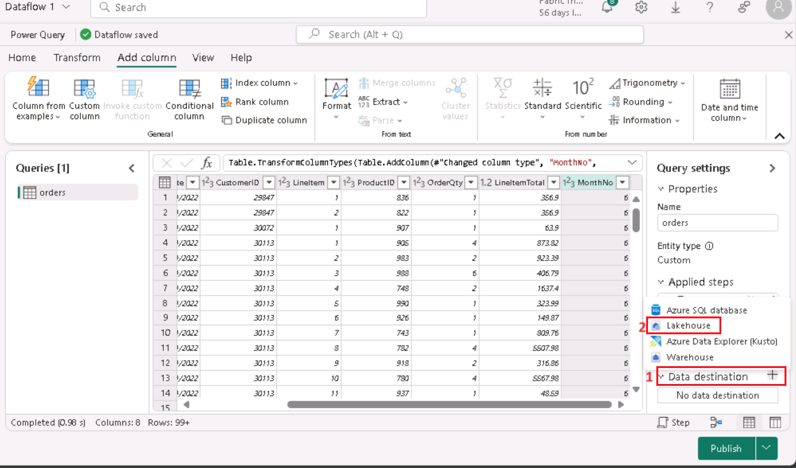


**Nota:** Si esta opción aparece atenuada, es posible que ya tenga un
destino de datos configurado. Verifique el destino de datos en la parte
inferior del panel Query settings, al lado derecho del editor de Power
Query. Si ya hay un destino configurado, puede cambiarlo usando el ícono
de engranaje.

2.  El destino **Lakehouse** se indica como un **icono** en la
    **consulta** dentro del editor de Power Query.


3.  Seleccione **Publish** para publicar el dataflow. Luego, espere a
    que el dataflow **Dataflow 1** se cree en su espacio de trabajo.


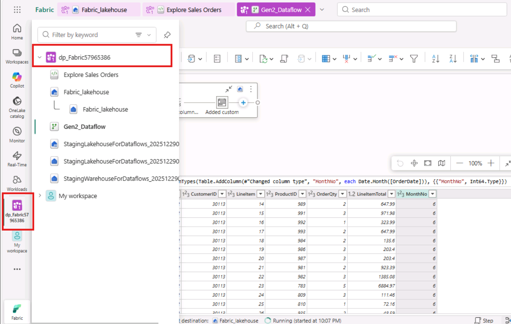

## Tarea 3: Agregar un dataflow a un pipeline

Puede incluir un dataflow como una actividad en un pipeline. Los
pipelines se utilizan para orquestar actividades de ingestión y
procesamiento de datos, lo que le permite combinar dataflows con otros
tipos de operaciones en un solo proceso programado. Los pipelines se
pueden crear en varias experiencias, incluyendo la experiencia de Data
Factory.

1.  En la página de inicio de Synapse Data Engineering, en el panel
    **dp_FabricXX**, seleccione **+New item** -\> **Data pipeline**

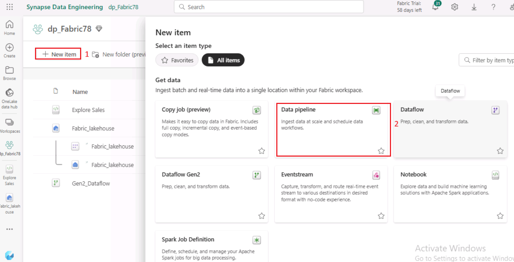

2.  En el cuadro de diálogo **New pipeline**, ingrese **Load data en el
    campo Name**, y haga clic en el botón **Create** para abrir la nueva
    pipeline.


3.  Se abre el editor de la pipeline.


> **Consejo**: ¡Si el asistente Copy Data se abre automáticamente,
> ciérrelo!

4.  Seleccione **Pipeline activity** y agregue una **Dataflow activity**
    al pipeline.

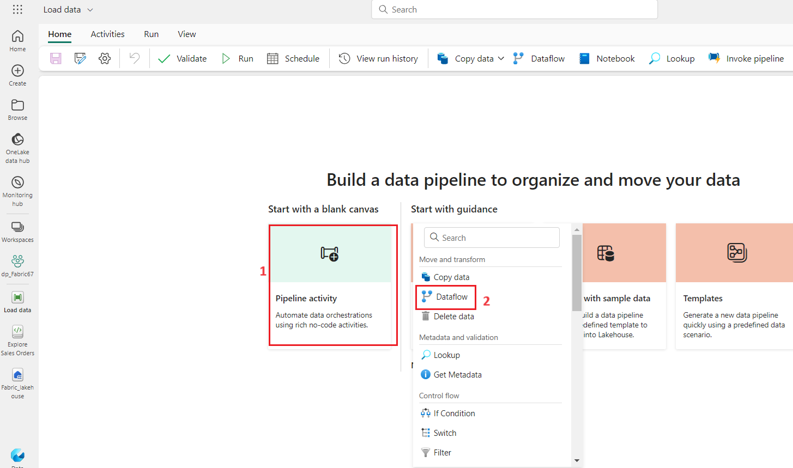

5.  Con la nueva **Dataflow1 activity** seleccionada, en la pestaña
    **Settings**, en la lista desplegable **Dataflow**, seleccione
    **Gen2_Dataflow** (el flujo de datos que creó previamente).

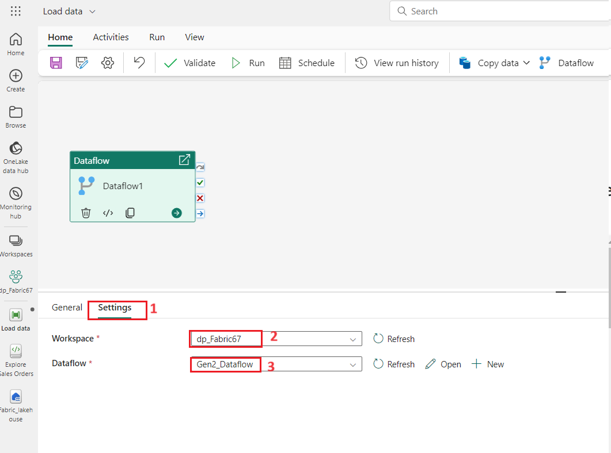

6.  En la pestaña **Home**, guarde el pipeline usando el
    icono **🖫 (*Guardar*)**.


7.  Use el botón ▷ (**Run**) para ejecutar el pipeline y espere a que se
    complete. Esto puede tardar algunos minutos.

> 
>
> 


8.  En la barra de menú en el borde izquierdo, seleccione su workspace,
    es decir, **dp_FabricXX**.


9.  En el panel **Fabric_lakehouse**, seleccione el
    **Gen2_FabricLakehouse** de tipo Lakehouse.


10. En el panel **Explorer**, seleccione el menú **…** de **Tables**,
    haga clic en **Refresh**. Luego, expanda **Tables** y seleccione la
    tabla **orders**, que ha sido creada por su dataflow.


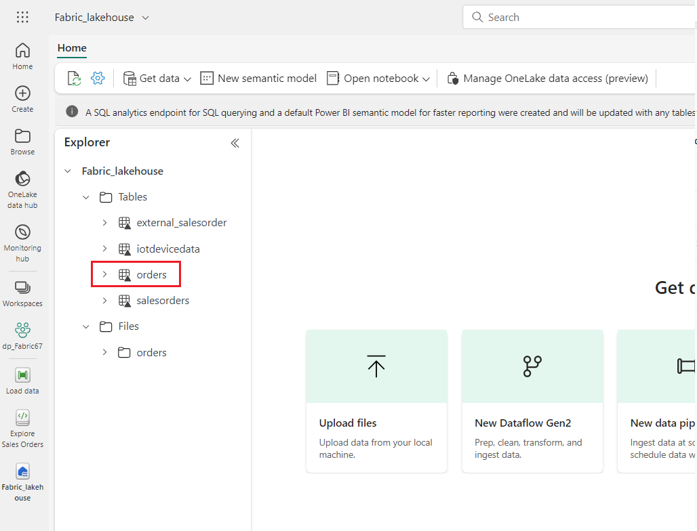

**Consejo**: Use el conector *Power BI Desktop Dataflows* para
conectarse directamente a las transformaciones de datos realizadas con
su dataflow.

También puede realizar transformaciones adicionales, publicar como un
nuevo conjunto de datos y distribuirlo al público objetivo para
conjuntos de datos especializados.

## Tarea 4: Liberar recursos

En este ejercicio, ha aprendido cómo usar Spark para trabajar con datos
en Microsoft Fabric.

Si ha terminado de explorar su lakehouse, puede eliminar el workspace
que creó para este ejercicio.

1.  En la barra de la izquierda, seleccione el icono de su workspace
    para ver todos los elementos que contiene.

> 

2.  En el menú … de la barra de herramientas, seleccione **Workspace
    settings**.

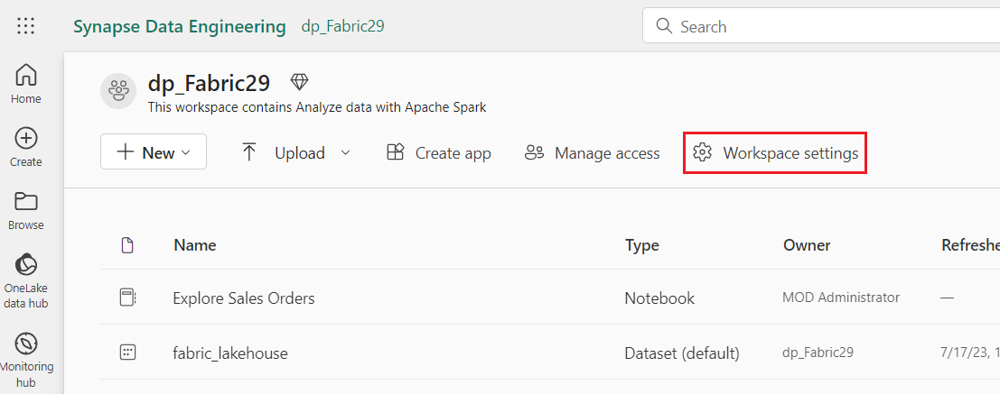

3.  Seleccione **General** y haga clic en **Remove this workspace.**


4.  En el cuadro de diálogo **Delete workspace?** Haga clic en el botón
    **Delete**.

> 
>
> 

**Resumen**

Este caso de uso lo guía a través del proceso de trabajo con Microsoft
Fabric dentro de Power BI. Cubre diversas tareas, incluyendo la
configuración de un workspace, la creación de un lakehouse, la carga y
gestión de archivos de datos, y el uso de notebooks para la exploración
de datos. Los participantes aprenderán a manipular y transformar datos
utilizando PySpark, crear visualizaciones y guardar y particionar datos
para consultas eficientes.

En este caso de uso, los participantes realizarán una serie de tareas
centradas en trabajar con delta tables en Microsoft Fabric. Las tareas
incluyen cargar y explorar datos, crear delta tables managed y external,
comparar sus propiedades; el laboratorio introduce capacidades de SQL
para la gestión de datos estructurados y proporciona información sobre
la visualización de datos utilizando librerías de Python como matplotlib
y seaborn. Los ejercicios buscan proporcionar una comprensión integral
del uso de Microsoft Fabric para análisis de datos e incorporar delta
tables para streaming data en un contexto de IoT.

Este caso de uso lo guía en el proceso de configurar un Fabric
workspace, crear un data lakehouse e ingerir datos para análisis.
Demuestra cómo definir un dataflow para manejar operaciones de ETL y
configurar destinos de datos para almacenar los datos transformados.
Además, aprenderá a integrar el dataflow en un pipeline para
procesamiento automatizado. Finalmente, se proporcionan instrucciones
para limpiar los recursos una vez completado el ejercicio.

Este laboratorio le brinda habilidades esenciales para trabajar con
Fabric, permitiéndole crear y administrar workspaces, establecer data
lakehouses y realizar transformaciones de datos de manera eficiente. Al
incorporar dataflows en pipelines, aprenderá a automatizar tareas de
procesamiento de datos, optimizando su flujo de trabajo y mejorando la
productividad en escenarios reales. Las instrucciones de limpieza
garantizan que no queden recursos innecesarios, promoviendo un enfoque
organizado y eficiente para la gestión de workspaces.

.
