# 用例02：用Apache Spark分析data

**简介**

Apache Spark 是一个开源的分布式
data处理引擎，广泛用于探索、处理和分析data lake存储中的海量 data。Spark
作为处理选项在许多 data平台产品中提供，包括 Azure HDInsight、Azure
Databricks、Azure Synapse Analytics 和 Microsoft Fabric。Spark
的一个优势是支持多种编程语言，包括 Java、Scala、Python 和
SQL;这使得Spark成为 data处理工作负载的非常灵活解决方案，包括
data清理与操作、统计分析与机器学习，以及 data分析与可视化。

Microsoft Fabric lakehouse中的表基于开源的 Apache Spark *Delta Lake*
格式。Delta Lake 增加了对批处理和流 data操作的关系语义支持，并支持创建
Lakehouse 架构，在该架构中，Apache Spark 可用于处理和查询基于data
lake底层文件的表中的 data。

在 Microsoft Fabric 中，Dataflows (Gen2) 连接多个数据源，并在 Power
Query Online 中执行转换。然后它们可以在Data
Pipelines中用于将data导入lakehouse或其他分析存储，或定义 Power BI
报告中的dataset。

本实验室旨在介绍 Dataflows (Gen2)
的不同元素，而非创建企业中可能存在的复杂解决方案。

**目的：**

- 在 Microsoft Fabric 中创建一个工作区，并启用 Fabric 试用。

- 建立lakehouse环境并上传data文件进行分析。

- 生成一本用于交互式data探索和分析的notebook。

- 将 data加载到dataframe中以便进一步处理和可视化。

- 用 PySpark 对data进行转换。

- 保存並分區轉換後的data，以便優化查詢。

- 在 Spark 元存储库中创建一个用于结构化 data管理的表

- 将DataFrame保存为一个名为“salesorders”的管理级delta表。

- 将DataFrame保存为名为“external_salesorder”的外部delta表，并指定路径。

- 描述並比較託管表和外部表的屬性。

- 對表執行SQL查詢以進行分析和報告。

- 使用如 matplotlib 和 seaborn 等 Python 库来可视化 data。

- 在Data Engineering体验中建立data
  lakehouse，并导入相关data以便后续分析。

- 定义一个dataflow，用于提取、转换和加载data到lakehouse。

- 在 Power Query 中配置data destinations，将转换后的
  data存储在lakehouse中。

- 将dataflow整合进pipeline，以实现定时的 data处理和摄取。

- 移除工作區及相關元素以結束練習。

## 練習1：創建一個工作區、lakehouse、notebook，並將 data加載到 data框架中

### 任務1：創建一個工作區

1.  打开浏览器，进入地址栏，输入或粘贴以下URL：+++https://app.fabric.microsoft.com/+++，然后按下**Enter** 键。

\[！note\]**注意**：如果你被引导到Microsoft Fabric主页，请跳到步骤#5。


2.  在 **Microsoft Fabric**
    窗口中，输入你的凭证，然后点击**Submit** 按钮。

| Credential | Value |
|---|---|
| Username | +++@lab.CloudPortalCredential(User1).Username+++ |
| Password | +++@lab.CloudPortalCredential(User1).Password+++ |

> 

3.  然后，在 **Microsoft** 窗口输入密码，点击**Sign in** 按钮。

> 

4.  在 **Stay signed in?** 窗口，点击**“Yes”**按钮。

5.  如果 PowerBI 默認打開，請按照以下步驟操作，否則跳過這一步

- 点击 PowerBI

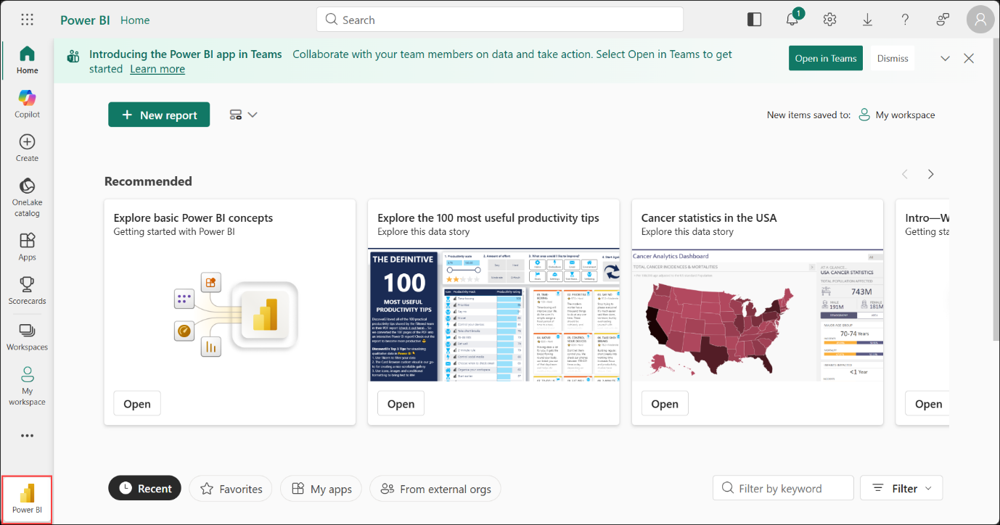

- 從選項中選擇Fabric


6.  Fabric主页，选择** +New workspace **瓷砖。

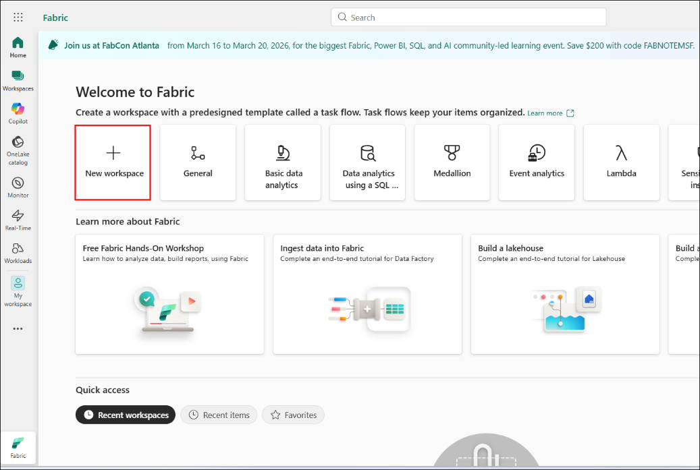

7.  在“**Create a
    workspace”标签**中，输入以下信息，点击**“Apply**”按钮。

| Setting | Value |
|---|---|
| Name | +++dp_Fabric@lab.LabInstance.Id+++ (must be a unique ID) |
| Description | `This workspace contains Analyze data with Apache Spark` |
| Advanced | Under **License mode**, select **Fabric** |
| Default storage format | **Small dataset storage format** |

> 
>
> 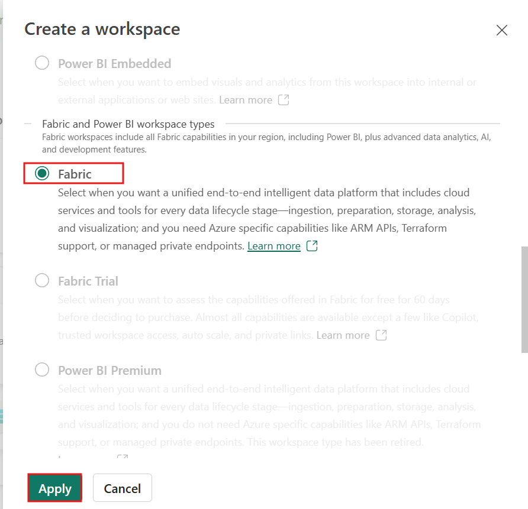

8.  等待部署完成。完成大約需要2-3分鐘。當你的新工作區開放時，應該是空的。


### 任務2：創建一個lakehouse並上傳文件

现在你有了工作区，就该切换到门户中的*Data
engineering* 体验，为你要分析的data文件创建一个data lakehouse。

1.  点击导航栏中的 **+ New item** 按钮创建新的Eventhouse。

> 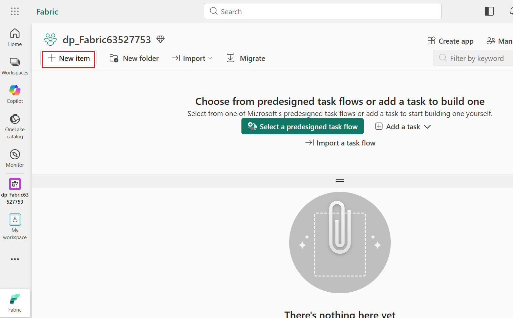

2.  通過篩選並選擇Lakehouse 瓷磚。


3.  在“**New lakehouse**”对话框中，在“**Name**”字段中输入**+++Fabric_lakehouse+++**，单击“**Create** ”按钮，打开新的lakehouse。

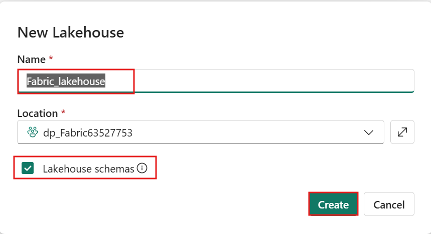

\[！注\]**注意**：大約一分鐘後，會生成一個新的空lakehouse。你需要把一些data导入
data lakehouse进行分析。


你会看到一条通知，提示**Successfully created SQL endpoint**。

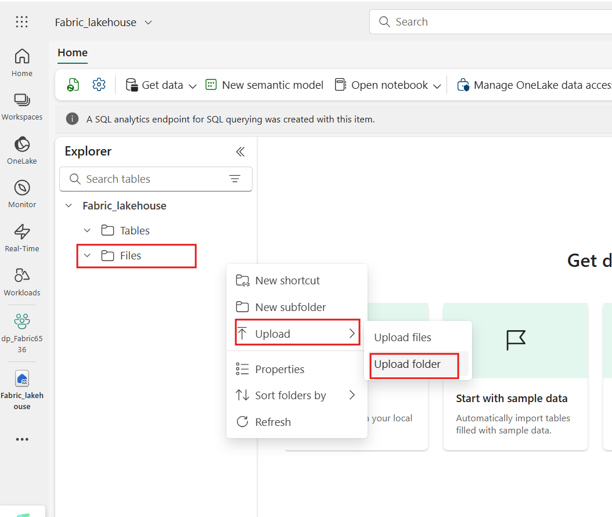

4.  在**Explorer**部分，**fabric_lakehouse**下方，将鼠标悬停在**Files
    folder**旁边，然后点击水平椭圆**（...）**
    菜单。点击“**Upload**”，然后点击“**Upload folder**”，如下图所示。

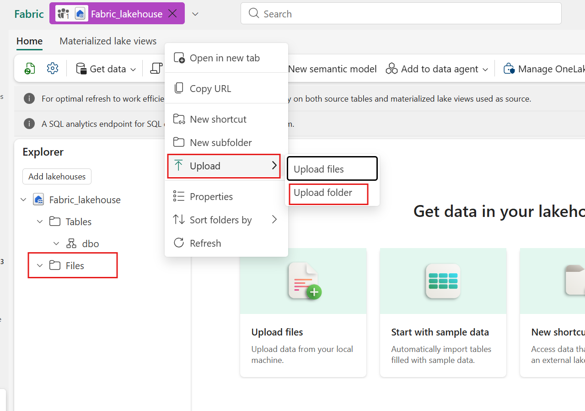

5.  在右侧的**“Upload folder**”面板上，选择 **Files/** 下的**folder
    icon**，然后浏览到**C：\LabFiles\LabFiles，**然后选择**orders**文件夹，点击**Upload** 按钮。


6.  如果是**，Upload 3 files to this
    site?** 对话框出现，然后点击**Upload** 按钮。


7.  在“Upload”文件夹面板中，点击**“Upload**”按钮。

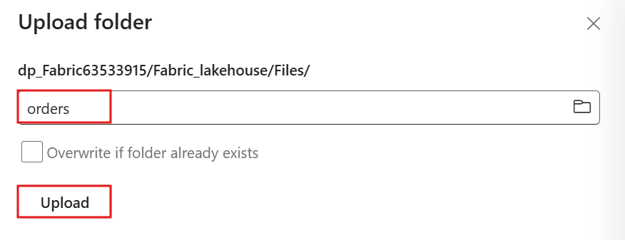

8.  文件上传后 **关闭上Upload folder** 面板。

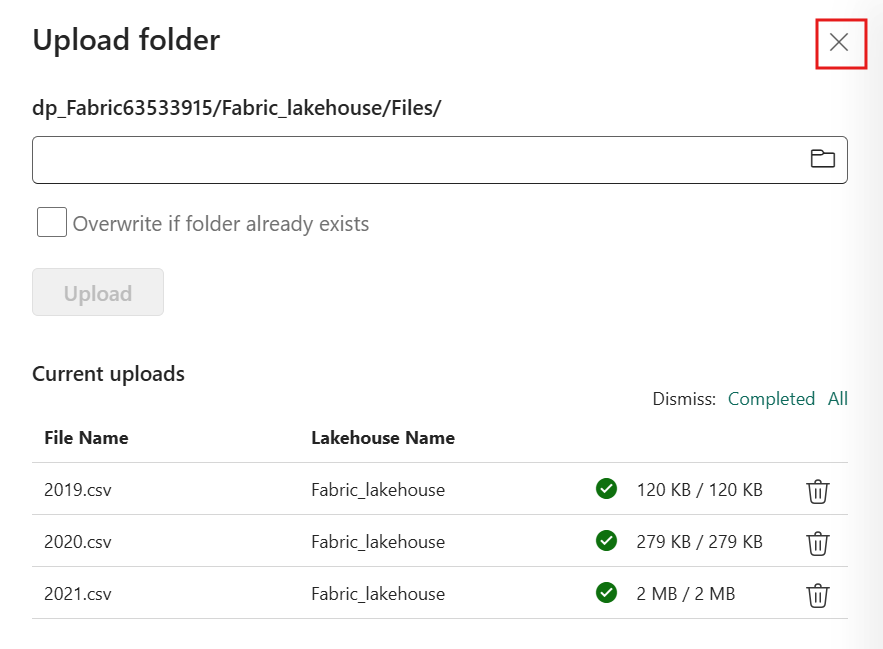

9.  展开**Files**，选择**orders** 文件夹，并确认CSV文件已上传。

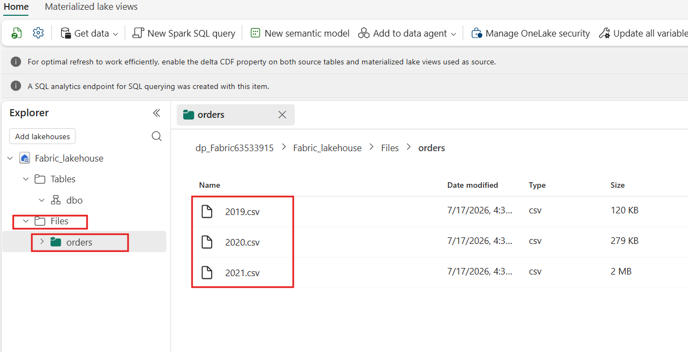

### 任務 3：創建一個notebook

要在 Apache Spark
中處理data，你可以創建一個*notebook*。Notebooks提供了一個互動環境，你可以編寫和運行多種語言的代碼，並添加筆記來記錄代碼。

1.  在**Fabric**页面，点击命令栏的**“Import**”下注，然后选择 **New notebook\> From this computer**。


2.  幾秒鐘後，會打開一個包含單個*cell* 的新notebook。Notebooks由一个或多个单元格组成，可以包含*code* 或*markdown* *（*格式化文本）。

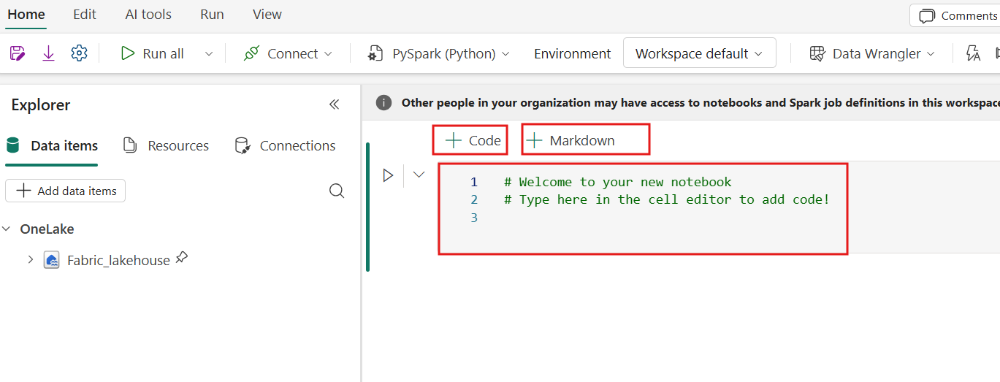

3.  選擇第一個單元格（目前是一個*代碼*單元格），然後在其右上角的動態工具欄中，使用**M↓**按鈕將**單元格轉換為標記單元格。**

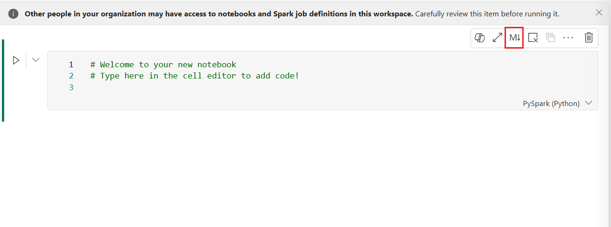

4.  當該單元格變為標記降低單元格時，其文本會被渲染。


5.  使用**🖉**（編輯）按鈕將單元格切換到編輯模式，替換所有文本，然後按以下方式修改標記：

+++# Sales order data exploration+++

6.  使用notebook中的代碼來探索銷售訂單 data。


6.  點擊筆記本中單元格外的任何位置，停止編輯並查看渲染後的標記。


### 任务4：将 data加载到dataframe中

现在你准备好运行将 data加载到*dataframe*中的代码了。Spark 中的
Dataframes 类似于 Python 中的 Pandas dataframe，并为处理行和列
data提供了通用结构。

**注意**：Spark 支持多种编程语言，包括 Scala、Java
等。在这个练习中，我们将使用*PySpark*，它是Python的Spark优化版本。PySpark
是 Spark 上最常用的语言之一，也是 Fabric notebooks的默认语言。

1.  Notebook可见后，展开**Files** 列表，选择**orders** 文件夹，使CSV文件与notebook
    editor并列。


2.  現在，將鼠標懸停到2019.csv文件。點擊水平橢圓**（...）**
    就在2019.csv旁邊。点击**Load
    data**，然后选择**Spark**。Notebook中将新增一个包含以下代码的代码单元格：

```
df = spark.read.format("csv").option("header","true").load("Files/orders/2019.csv")
# df now is a Spark DataFrame containing CSV data from "Files/orders/2019.csv".
display(df)
```


**提示**：你可以用左侧的“**«** icons”隐藏Lakehouse explorer面板 。正在做

这会帮你专注于notebook。

3.  使用单元左侧的 **▷ Run cell** 按钮来运行它。


**注意**：由于这是你第一次运行任何 Spark 代码，必须启动一次 Spark
会话。这意味着会话中的第一次运行可能需要一分钟左右完成。后续的运行会更快。

4.  当单元格命令完成后，查看单元格下方的输出，应该类似于这样：

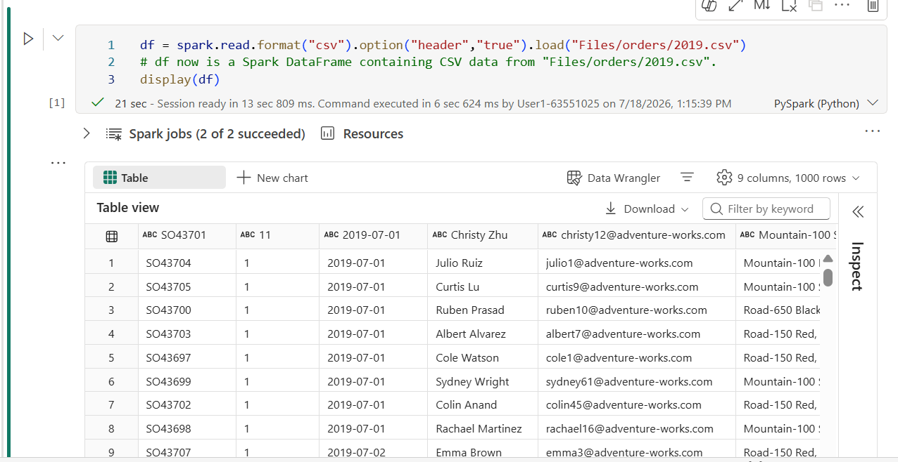

5.  输出显示的是2019.csv文件中的行和列数据。不过，请注意列头看起来不太对。用于将data加载到dataframe的默认代码假设CSV文件第一行包含列名，但在此情况下，CSV文件仅包含data，没有任何头部信息。

6.  修改代码，将**头**选项设置为**false**。将该**单元格**中的所有代码
    替换为以下代码，点击 **▷ Run cell** 按钮，查看输出结果

```
df = spark.read.format("csv").option("header","false").load("Files/orders/2019.csv")
# df now is a Spark DataFrame containing CSV data from "Files/orders/2019.csv".
display(df)
```


7.  现在dataframe正确地包含了第一行作为data值，但列名是自动生成的，帮助不大。要理解data，你需要明确定义文件中data值的正确模式和data类型。

8.  将该**单元格**中的所有代码 替换为以下代码，点击 **▷ Run
    cell** 按钮，查看输出结果

```
from pyspark.sql.types import *

orderSchema = StructType([
    StructField("SalesOrderNumber", StringType()),
    StructField("SalesOrderLineNumber", IntegerType()),
    StructField("OrderDate", DateType()),
    StructField("CustomerName", StringType()),
    StructField("Email", StringType()),
    StructField("Item", StringType()),
    StructField("Quantity", IntegerType()),
    StructField("UnitPrice", FloatType()),
    StructField("Tax", FloatType())
    ])

df = spark.read.format("csv").schema(orderSchema).load("Files/orders/2019.csv")
display(df)
```

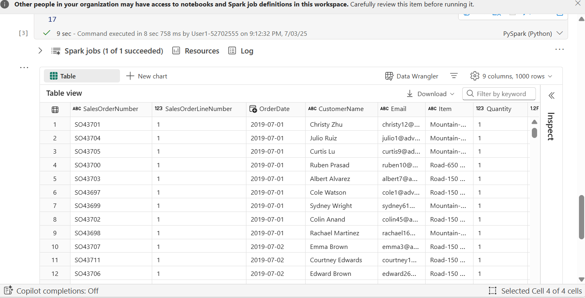


9.  现在，dataframe包含正确的列名（除了**Index**，**Index**是所有dataframes中基于每行序数位置的内置列）。列的
    data类型使用Spark
    SQL库中定义的标准类型集指定，这些类型在单元格开头导入。

10. 通过查看dataframe确认您的更改已应用到 data中。

11. 使用单元格输出下方的 **+
    Code** 图标，向notebook添加一个新的代码单元格，并输入以下代码。点击
    **▷ Run cell** 按钮，查看输出结果

+++display(df)+++


12. Dataframe仅包含 **2019.csv** 文件中的
    data。修改代码，使文件路径使用\*通配符从orders文件夹中的所有文件中读取销售订单
    data

13. 使用单元格输出下方的 **+
    Code** 图标，向notebook添加一个新的代码单元格，并输入以下代码。

```
from pyspark.sql.types import *

orderSchema = StructType([
    StructField("SalesOrderNumber", StringType()),
    StructField("SalesOrderLineNumber", IntegerType()),
    StructField("OrderDate", DateType()),
    StructField("CustomerName", StringType()),
    StructField("Email", StringType()),
    StructField("Item", StringType()),
    StructField("Quantity", IntegerType()),
    StructField("UnitPrice", FloatType()),
    StructField("Tax", FloatType())
    ])

df = spark.read.format("csv").schema(orderSchema).load("Files/orders/*.csv")
display(df)
```

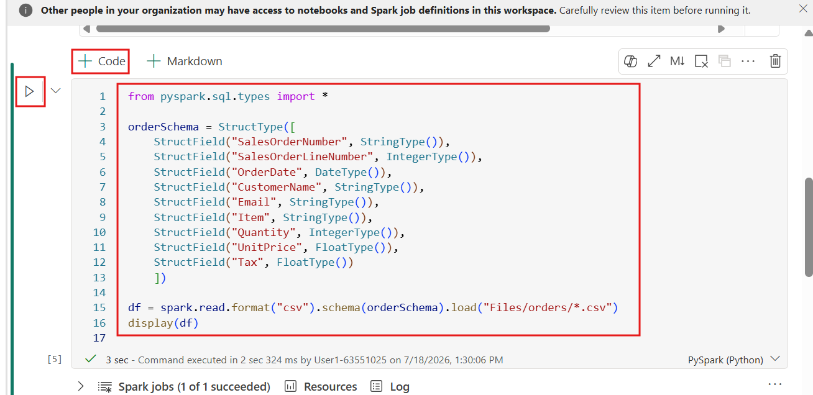

14. 运行修改后的代码单元格，查看输出，现在应该包括2019、2020和2021年的销售额。


**注意**：仅显示部分行，因此你可能无法看到所有年份的示例。

## 练习2：探索dataframe内的 data

Dataframe对象包含多种函数，可用于过滤、分组和以其他方式操作其包含的
data。

### 任务1：过滤dataframe

1.  使用单元格输出下方的 **+
    Code** 图标，向notebook添加一个新的代码单元格，并输入以下代码。

```
customers = df['CustomerName', 'Email']
print(customers.count())
print(customers.distinct().count())
display(customers.distinct())
```

2.  **运行**新的代码单元，查看结果。请注意以下细节：

    - 当你对dataframe执行操作时，结果是一个新的dataframe（此例中，通过从**df**
      dataframe中选择特定列子集创建新的**客户**dataframe）

    - Dataframes提供**计数**和**不同**等功能，可用于总结和过滤其包含的
      data。

    - dataframe\['Field1'， 'Field2'， ...\]
      语法是一种简写方式，用于定义一组列的子集。你也可以使用**select**方法，比如上面代码的第一行可以写成customers
      = df.select（“CustomerName”， “Email”）

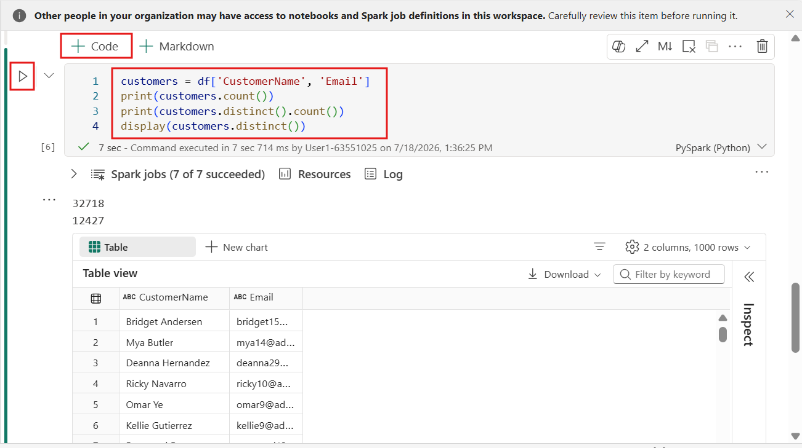

3.  修改代码，将**该单元格**中的所有代码替换为以下代码，然后点击** ▷ Run
    cell **按钮如下：

```
customers = df.select("CustomerName", "Email").where(df['Item']=='Road-250 Red, 52')
print(customers.count())
print(customers.distinct().count())
display(customers.distinct())
```

4.  **运行**修改后的代码以查看购买 ***Road-250 Red,
    52* product**的客户。注意，你可以“**chain**”多个函数，使一个函数的输出成为下一个函数的输入——在这种情况下，**select**方法创建的dataframe是用于应用过滤条件的**where**方法的源dataframe。

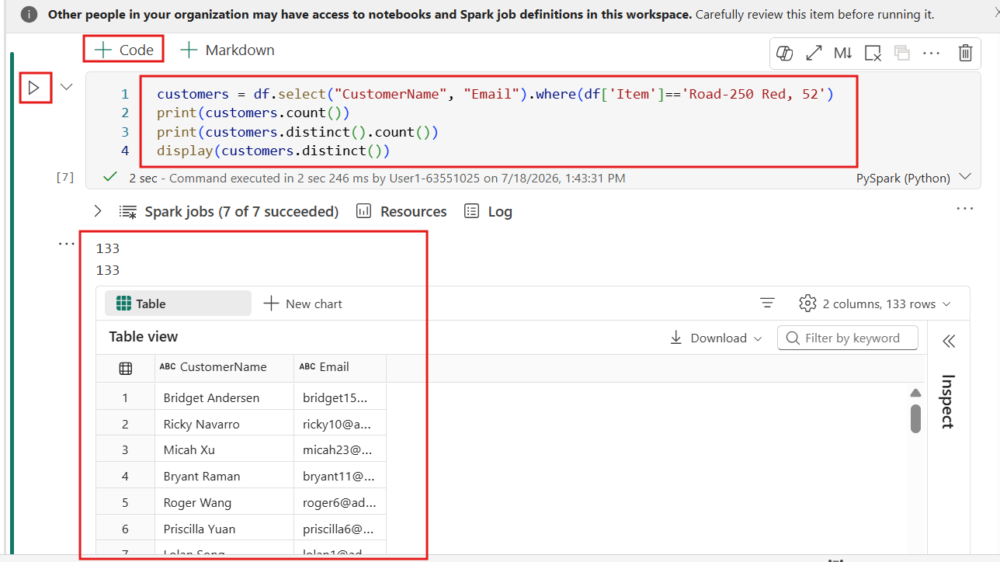

### 任务2：将 data汇总和分组到dataframe中

1.  点击 **+ Code**，复制粘贴下面的代码，然后点击**“Run cell”**按钮。

```
productSales = df.select("Item", "Quantity").groupBy("Item").sum()
display(productSales)
```
> 

2.  请注意，结果显示了按产品分组的订单数量之和。**groupBy**
    方法按*Item*对行进行分组，随后对剩余所有数值列（此处为数量）应用和汇**总函数**

3.  点击 **+ Code**，复制粘贴下面的代码，然后点击**“Run
    cell** **”**按钮。

```
from pyspark.sql.functions import *

yearlySales = df.select(year("OrderDate").alias("Year")).groupBy("Year").count().orderBy("Year")
display(yearlySales)
```

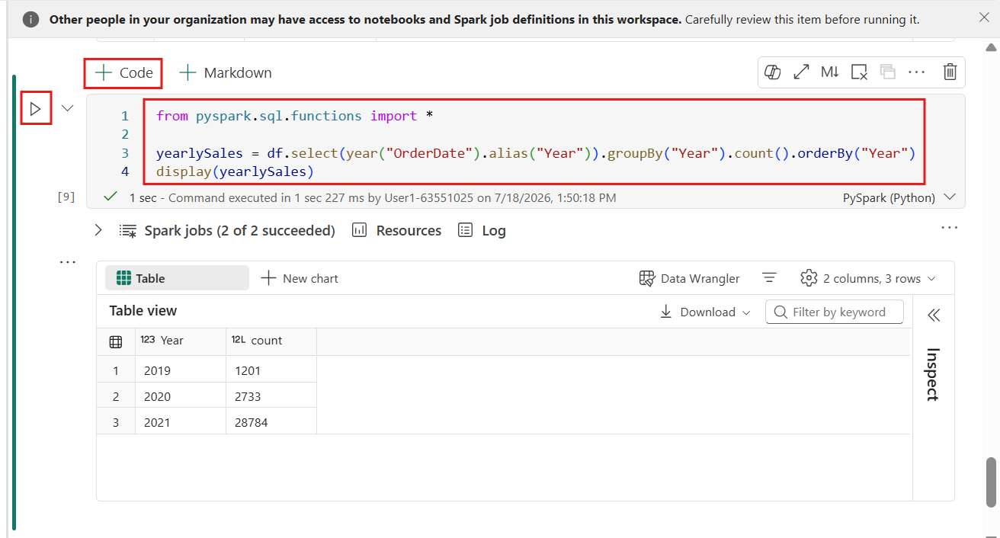

4.  請注意，結果顯示的是每年銷售訂單數量。注意，**select**方法包含一個SQL
    **year**，用於提取*OrderDate*字段中的年份成分（這也是代碼中包含
    導入語句以導入Spark
    SQL庫中的函數的原因）。然後它使用**alias** 方法為提取的年份值分配列名。然後將數據按派生的*年份*列分組，計算每組的行數，最後
    使用**OrderBy**方法對所得dataframe進行排序。

## 练习3：使用 Spark 转换 data文件

Data engineers的一项常见任务是以特定格式或结构导入
data，并将其转换以供后续处理或分析。

### 任务1：使用dataframe方法和函数进行 data转换

1.  点击 + Code，复制粘贴下面的代码

```
from pyspark.sql.functions import *

## Create Year and Month columns
transformed_df = df.withColumn("Year", year(col("OrderDate"))).withColumn("Month", month(col("OrderDate")))

# Create the new FirstName and LastName fields
transformed_df = transformed_df.withColumn("FirstName", split(col("CustomerName"), " ").getItem(0)).withColumn("LastName", split(col("CustomerName"), " ").getItem(1))

# Filter and reorder columns
transformed_df = transformed_df["SalesOrderNumber", "SalesOrderLineNumber", "OrderDate", "Year", "Month", "FirstName", "LastName", "Email", "Item", "Quantity", "UnitPrice", "Tax"]

# Display the first five orders
display(transformed_df.limit(5))
```

2.  **运行**代码，通过以下变换从原始顺序 data创建新的dataframe：

    - 根据**OrderDate** 列添加**年份**和**月份**列。

    - 根据**CustomerName**列添加**FirstName**和**LastName**列。

    - 过滤并重新排序列，移除**CustomerName**列。


3.  检查输出并确认 data的转换已完成。


你可以充分利用 Spark SQL
库的全部功能，通过过滤行、推导、删除、重命名列以及应用其他必要的数据修改来转换
data。

**提示**：请参阅 [*Spark dataframe
documentation*](https://spark.apache.org/docs/latest/api/python/reference/pyspark.sql/dataframe.html)，了解更多关于
Dataframe 对象的方法。

### 任务2：保存转换后的data

1.  **添加**一个带有以下代码的新单元格，以保存转换后的dataframe为Parquet格式（如果已有
    data则覆盖）。 **运行**小区，等待 data已保存的消息。

```
transformed_df.write.mode("overwrite").parquet('Files/transformed_data/orders')
print ("Transformed data saved!")
```

**注意**：通常，*Parquet*格式更适合用于进一步分析或导入分析存储的
data文件。Parquet是一种非常高效的格式，大多数大型
data分析系统都支持它。事实上，有时你的
data转换需求可能只是将其他格式（如CSV）的 data转换成Parquet！


2.  然后，在左侧的**Lakehouse
    explorer** 面板中，在**......Files** 节点菜单 中选择**Refresh**。

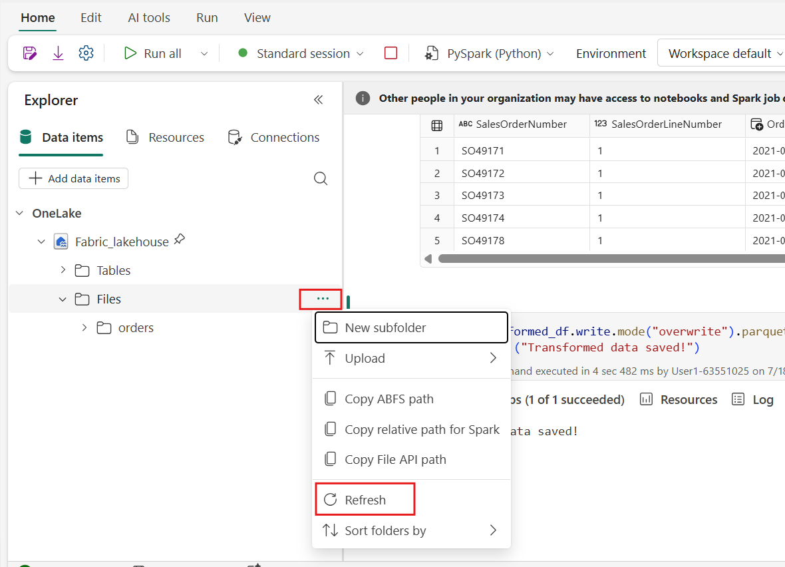

3.  点击**transformed_data**文件夹以验证其是否包含一个名为 **orders**
    的新文件夹，该文件夹包含一个或多个 **Parquet files**。


4.  点击 **+ Code，**跟随代码，从**transformed_data -\>
    orders** 文件夹中的 parquet 文件加载新dataframe：

```
orders_df = spark.read.format("parquet").load("Files/transformed_data/orders")
display(orders_df)
```

5.  **运行**该单元格，验证结果是否显示了从parquet文件加载的顺序 data。

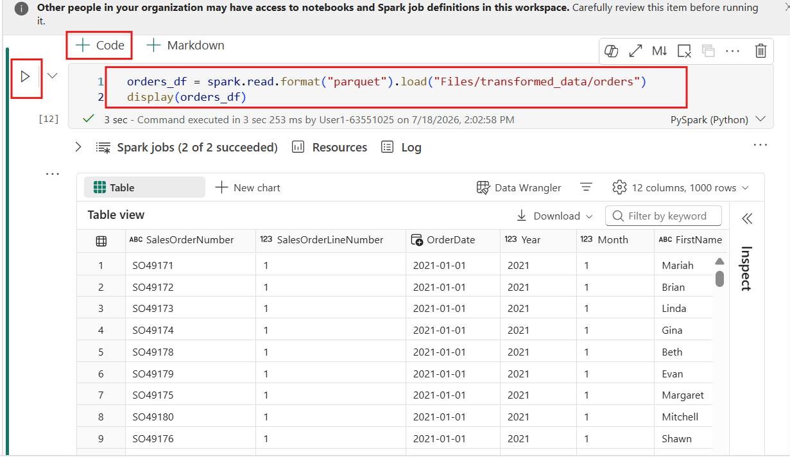

### 任务3：将 data保存到分区文件中

1.  添加一个新单元格，点击以下代码的 **+
    Code**;它保存dataframe，按**年份**和**月份**划分data。
    **运行**小区并等待data已保存的消息

```
orders_df.write.partitionBy("Year","Month").mode("overwrite").parquet("Files/partitioned_data")
print ("Transformed data saved!")
```

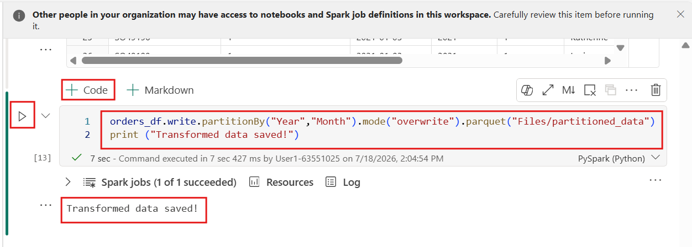

2.  然后，在左侧的**Lakehouse
    explorer** 面板中，在**......Files** 节点菜单 中选择**Refresh。**

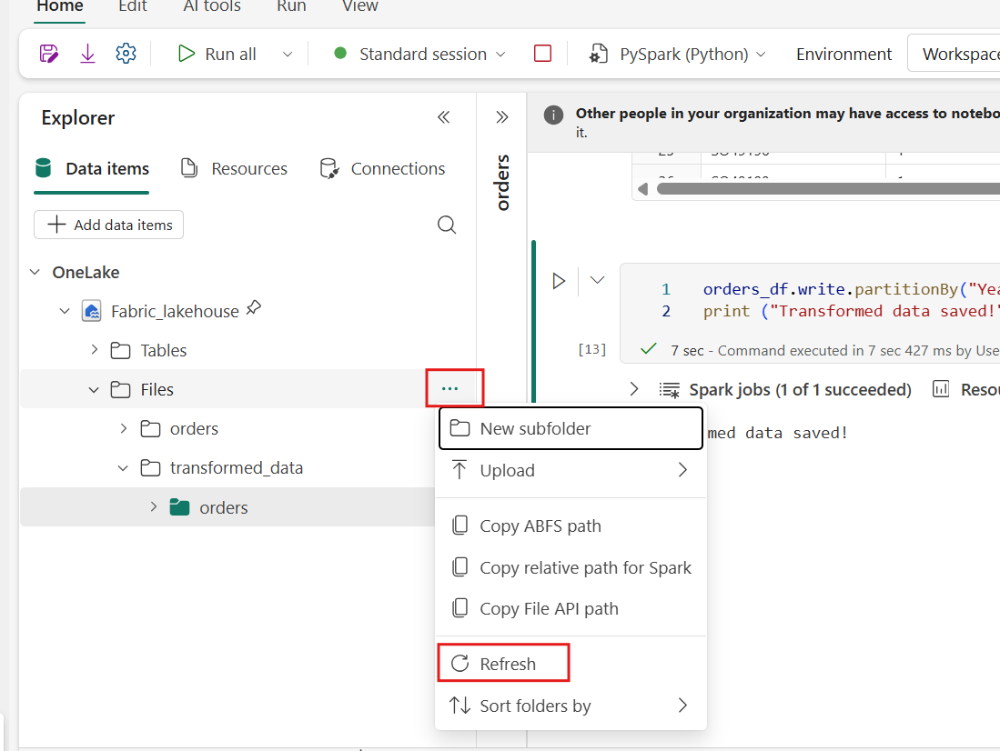

3.  展开**partitioned_orders**文件夹，确认其中包含名为**Year=xxxx**的文件夹层级结构，每个文件夹包含名为**Month=xxxx**的文件夹。每个月文件夹都包含一个镶花文件，里面有当月的订单。

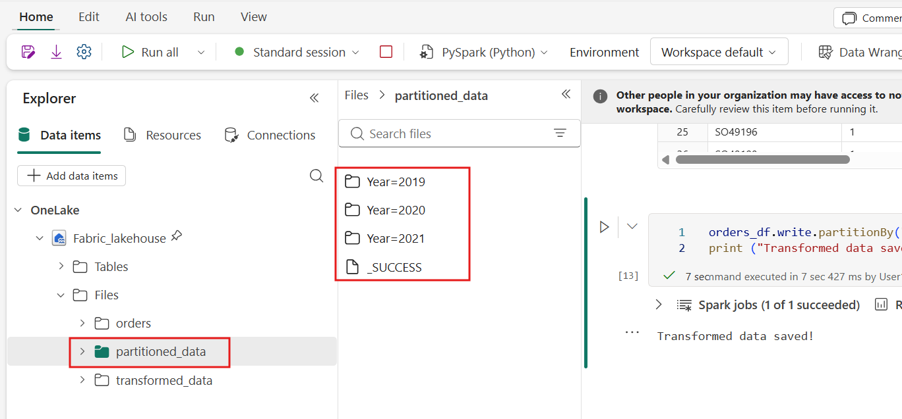

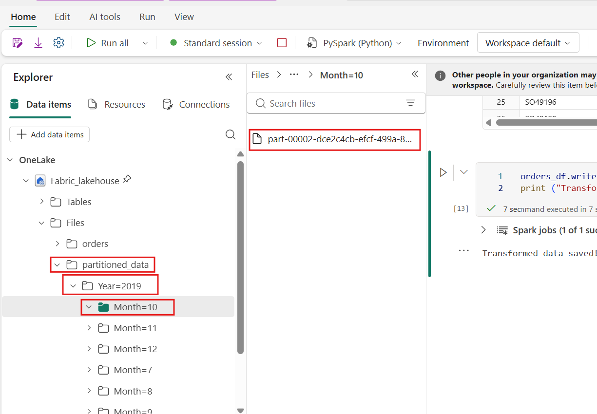

Data文件分区是处理大量
data时优化性能的常见方法。这种方法可以显著提升性能，并使
data过滤变得更简单。

4.  添加一个新单元格，点击以下代码的 **+
    Code** **，**从**orders.parquet**文件加载新dataframe：

```
orders_2021_df = spark.read.format("parquet").load("Files/partitioned_data/Year=2021/Month=*")
display(orders_2021_df)
```

5.  **运行**单元格，确认结果显示的是2021年的订单
    data。注意路径中指定的分区列（**年份**和**月份**）未包含在dataframe中。

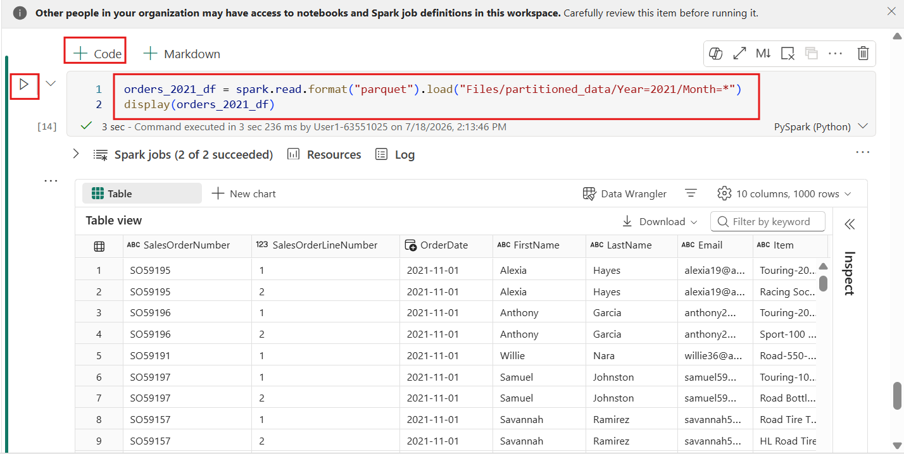

## 练习4：处理表和SQL

正如你所見，dataframe對象的原生方法讓你能夠非常有效地查詢和分析文件中的數據。然而，許多數據分析師更習慣使用可以用SQL
syntax查詢的表。Spark
提供了一个*metastore*，你可以在这里定义关系表。提供dataframe对象的 Spark
SQL 库也支持使用 SQL 语句查询metastore中的表。通过使用 Spark
的这些功能，你可以将data lake的灵活性与关系型 data Warehouse的结构化
data模式和基于 SQL 的查询结合起来——这就是“data
lakehouse”这一术语的由来。

### 任务1：创建一个受管理表

Spark metastore中的表是data
lake中文件的关系抽象。表可以被*managed* （此时文件由metastore管理）或*external* （此时表引用data
lake中独立于metastore管理的文件位置）。

1.  添加一个新代码，点击notebook中的 **+
    Code** 单元，输入以下代码，这样销售订单
    data的dataframe会保存为名为**“salesorders”**的表格：

```
# Create a new table
df.write.format("delta").saveAsTable("salesorders")

# Get the table description
spark.sql("DESCRIBE EXTENDED salesorders").show(truncate=False)
```

**注意**：关于这个例子，值得注意几点。首先，没有提供显式路径，因此表的文件将由metastore管理。其次，表格以
**delta** 格式保存。你可以基于多种文件格式创建表（包括
CSV、Parquet、Avro 等），但 *delta lake* 是一种 Spark
技术，为表增加了关系database功能;包括对事务、行版本控制及其他实用功能的支持。在
Fabric 中创建data lakehouses更倾向于以 delta 格式创建表。

2.  **运行**代码单元并查看输出，后者描述了新表的定义。

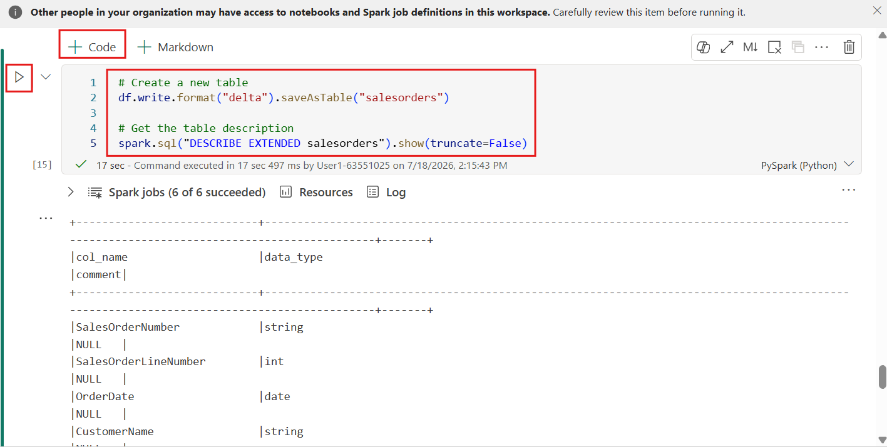

3.  在**Lakehouse** **explorer** 面板中，在**......**
    **Tables** 文件夹菜单中选择 **Refresh。**

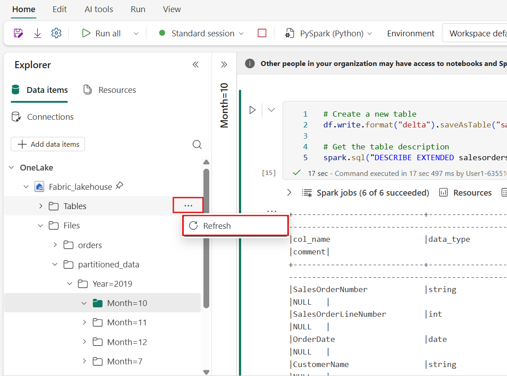

4.  然后展开 **Tables** 节点，确认 **SalesOrders** 表是否已在 **dbo**
    模式下创建。

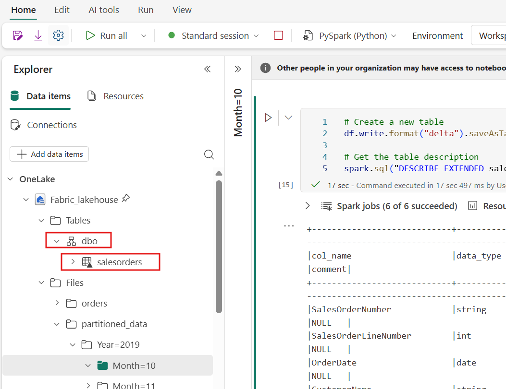

5.  将鼠标悬停在**salesorders** 表旁，然后点击水平省略号（...）。点击**Load
    data**，然后选择**Spark**。

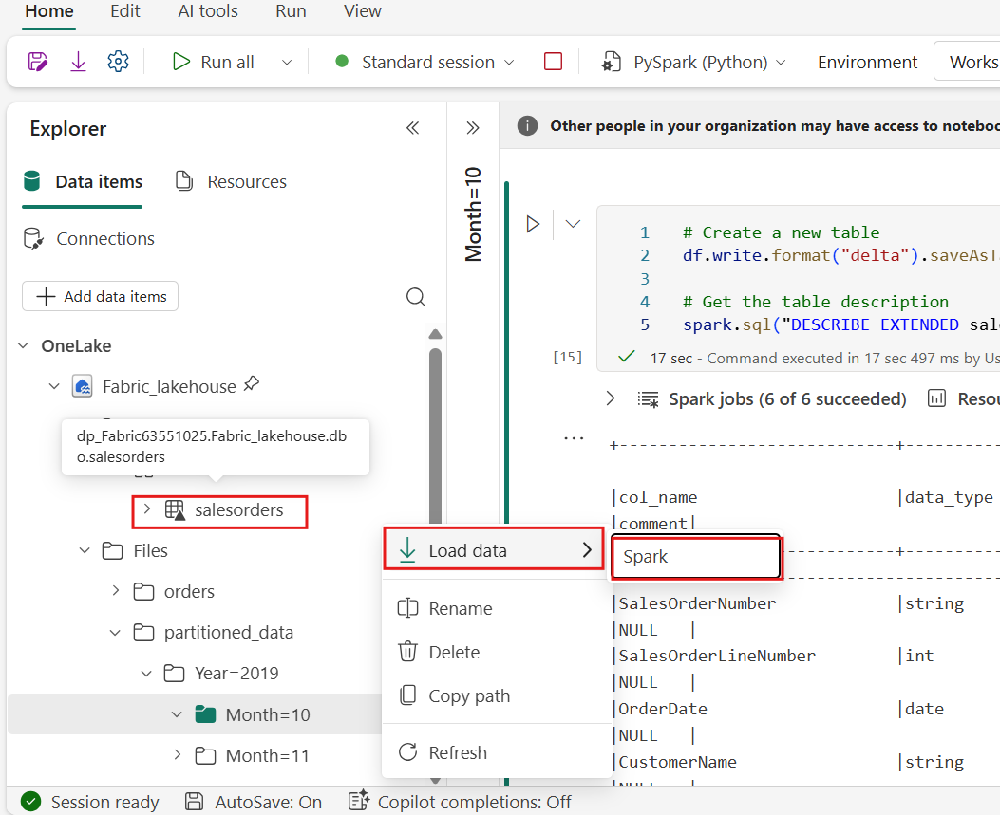

6.  点击 **▷ Run cell** 按钮，该按钮使用Spark SQL库，在
    PySpark代码中嵌入对**salesorder** 表的SQL
    query，并将查询结果加载到dataframe中。

```
df = spark.sql("SELECT * FROM [your_lakehouse].salesorders LIMIT 1000")
display(df)
```

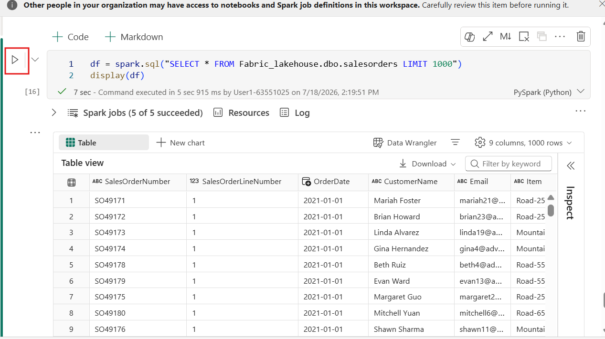

### 任务2：创建一个外部表格

你也可以创建 *external* 表，模式元 data在lakehouse的metastore中定义，但
data文件存储在外部位置。

1.  在第一个代码单元返回的结果下，如果没有新的代码单元格，使用 **+
    Code** 按钮添加新代码单元。然后在新格子里输入以下代码。

```
df.write.format("delta").saveAsTable("external_salesorder", path="<abfs_path>/external_salesorder")
```

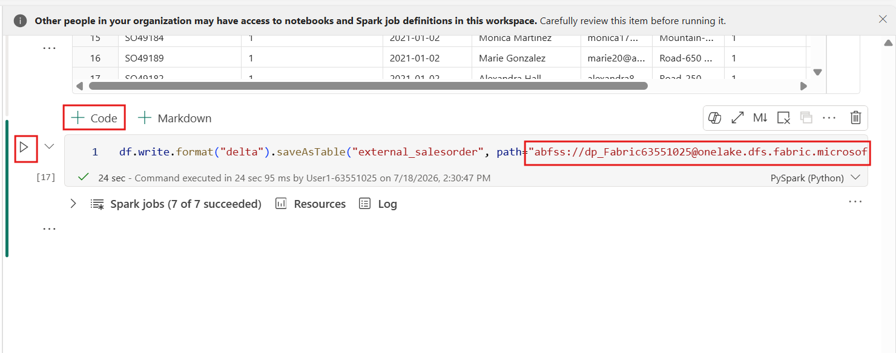

2.  在**Lakehouse explorer** 面板中，在**...... Files** 文件夹菜单
    中，选择notepad中的**“Copy ABFS path**”。

ABFS路径是你 lakehouse
OneLake存储中**Files** 文件夹的完全合格路径——类似于这个：

abfss://<dp_Fabric29@onelake.dfs.fabric.microsoft.com>/Fabric_lakehouse.Lakehouse/Files/external_salesorder


3.  现在，进入代码单元，把 **\<abfs_path\>** 替换成
    你复制到notepad的**路径**，这样代码会把dataframe保存为外部表，
    data文件存放在你
    **Files** 文件夹里的名为**external_salesorder** 的文件夹里。整条路径应该像这样

abfss://<dp_Fabric29@onelake.dfs.fabric.microsoft.com>/Fabric_lakehouse.Lakehouse/Files/external_salesorder

4.  使用单元左侧的 **▷ (*Run cell*)** 按钮来运行它。

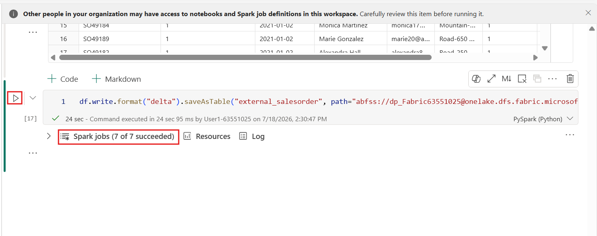

5.  在**Lakehouse explorer** 面板中，在**......Tables** 文件夹菜单
    中选择**Refresh**。


6.  然后展开 **Tables** 节点，验证 **external_salesorder**
    表是否已创建。

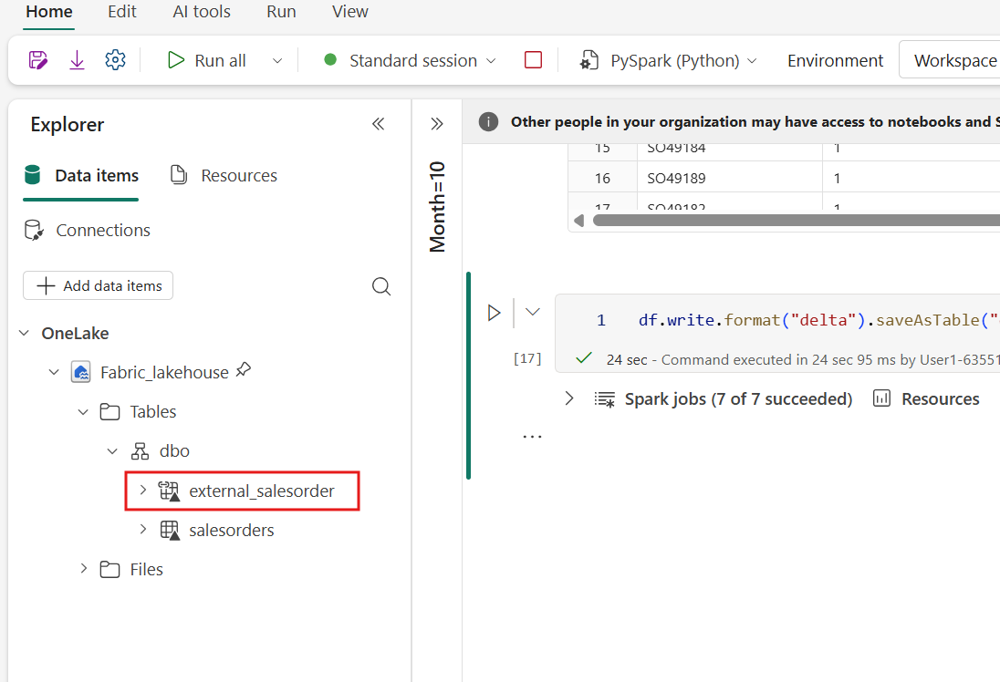

7.  在**Lakehouse
    explorer** 面板中，在**......**在**Files** 文件夹菜单中选择**Refresh**。

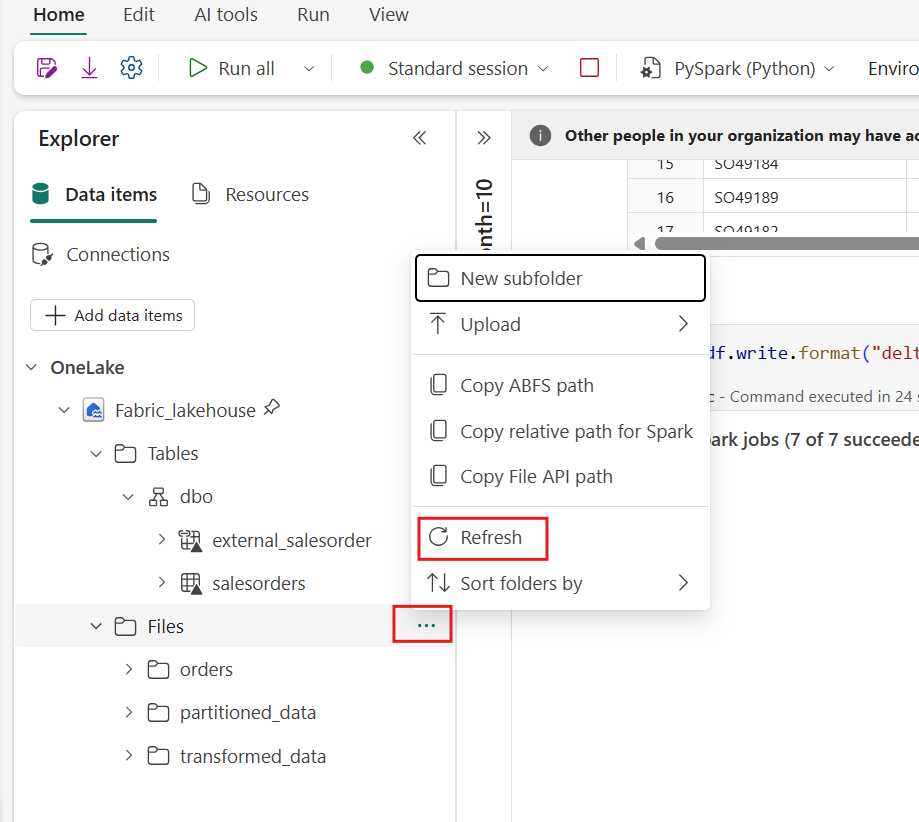

8.  然后展开**Files** 节点，确认**external_salesorder**文件夹已为表中的
    data文件创建。

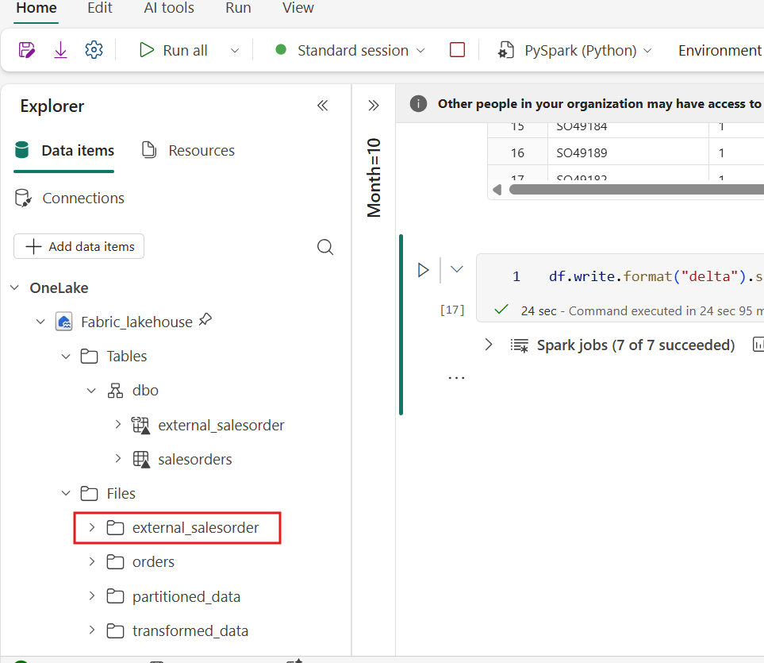

### 任务3：比较托管表和外部表

让我们来探讨托管表和外部表之间的区别。

1.  在代码单元返回的结果下，使用 **+
    Code** 按钮添加新的代码单元。将下面的代码复制到代码单元格，并使用单元格左侧的
    **▷ (*Run cell*)** 按钮来运行它。

```
%%sql

DESCRIBE FORMATTED salesorders;
```

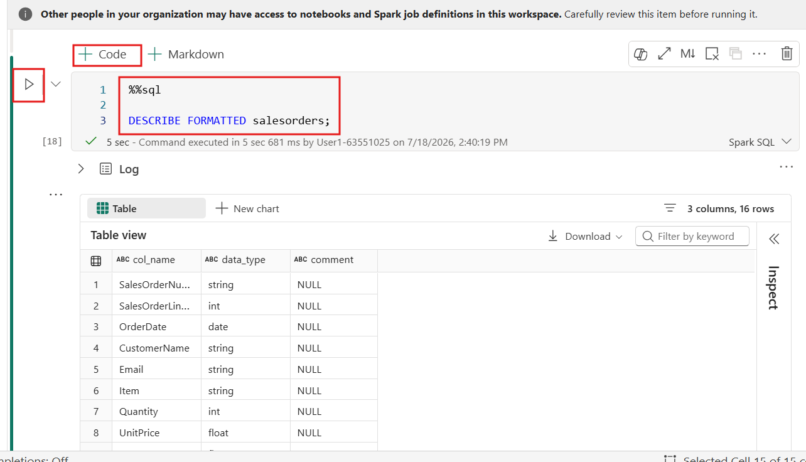

2.  在结果中，查看 表的 **Location** 属性，应该是通往lakehouse OneLake
    存储的路径，结尾是 **/Tables/salesorders**（你可能需要放大**Data
    type** 栏才能看到完整路径）。

> 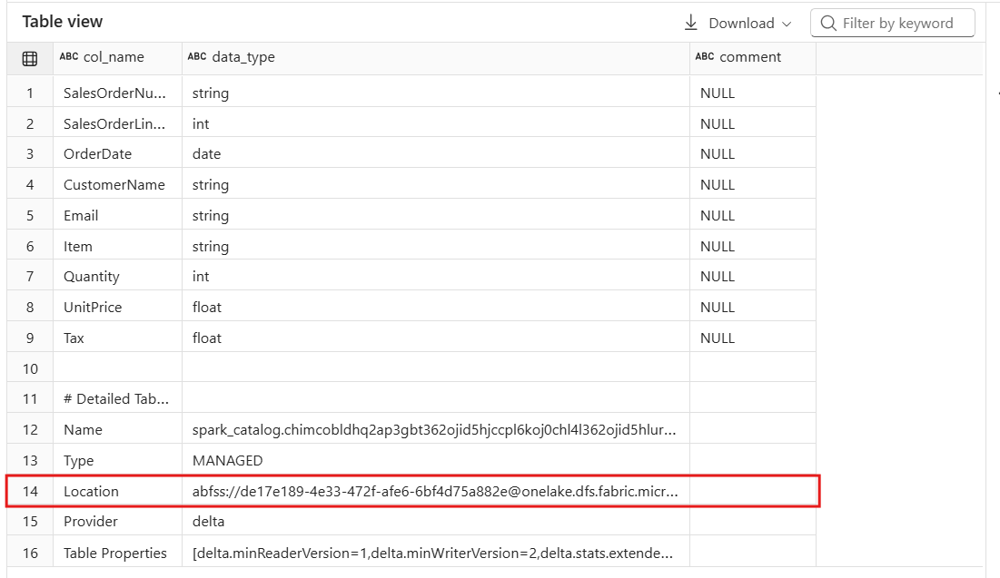

3.  修改 **DESCRIBE** 命令以显示 **external_saleorder**
    表的详细信息，如图所示。

4.  在代码单元返回的结果下，使用 **+
    Code** 按钮添加新的代码单元。复制下面的代码，使用单元左侧的
    **▷ (*Run cell*)** 按钮来运行它。

```
%%sql

DESCRIBE FORMATTED external_salesorder;
```

5.  在结果中，查看 表的 **Location** 属性，应该是一条通往lakehouse
    OneLake 存储的路径，结尾以
    **/Files/external_saleorder**（你可能需要扩大**Data
    type** 栏才能看到完整路径）。


### 任务4：在单元格中运行SQL代码

虽然能够将SQL语句嵌入包含PySpark代码的单元格很有用，但
data分析师通常只想直接用SQL工作。

1.  点击笔记本的 **+ Code** 单元，输入以下代码。点击 **▷ Run
    cell** 按钮，查看结果。请注意：

    - 单元格开头的%%sql行（称为*magic*）表示应使用Spark
      SQL语言运行时来运行该单元的代码，而非PySpark。

    - SQL代码引用的是你之前创建的salesorders 表。

    - SQL query的输出会自动显示为单元格下的结果

```
%%sql
SELECT YEAR(OrderDate) AS OrderYear,
       SUM((UnitPrice * Quantity) + Tax) AS GrossRevenue
FROM salesorders
GROUP BY YEAR(OrderDate)
ORDER BY OrderYear;
```

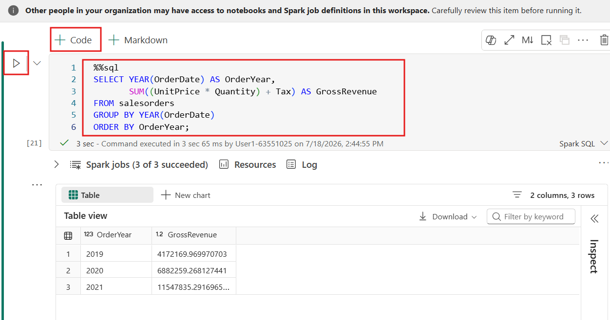

**注意**：有关 Spark SQL 和dataframes的更多信息，请参见 [*Spark SQL
documentation*](https://spark.apache.org/docs/2.2.0/sql-programming-guide.html)。

## 练习4：用Spark可视化data

俗话说，一幅图胜千言万语，一张图表往往比一千行data更好。虽然 Fabric
中的notebooks内置了dataframe或 Spark SQL 查询
data的图表视图，但它并非为全面的图表设计。不过，你可以用 Python
图形库，比如 **matplotlib** 和 **seaborn**，从数据帧中生成图表。

### 任务1：以图表形式查看结果

1.  點擊筆記本的 **+ Code** 單元，輸入以下代碼。点击 **▷ Run
    cell** 按钮，观察它会返回 你之前创建的**salesorders** 视图中的
    data。

```
%%sql
SELECT * FROM salesorders
```


2.  在单元格下方的结果部分，将**View** 选项从**“Table**”改为**“+New
    chart**”。


3.  使用图表右上角的**“Start
    editing** ”按钮，显示图表的选项面板。然后设置如下选项，选择**Apply**：

    - Chart type: Bar chart

    - X-axis: Item

    - Y-axis: Quantity

    - Series Group: –None–

    - Aggregation: Sum

    - Missing and NULL values: Display as 0

    - Stacked: Unselected

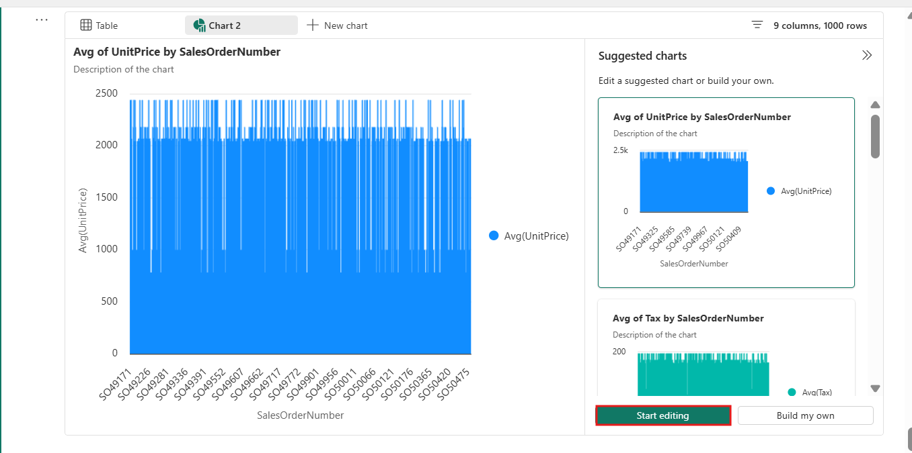

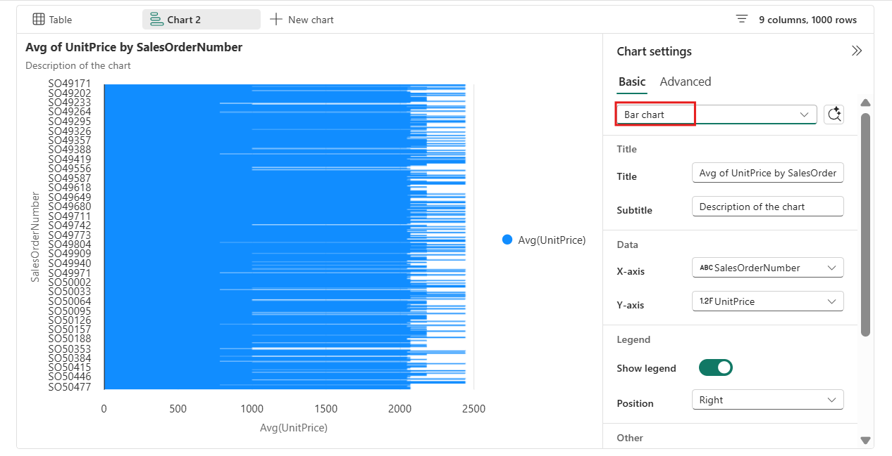

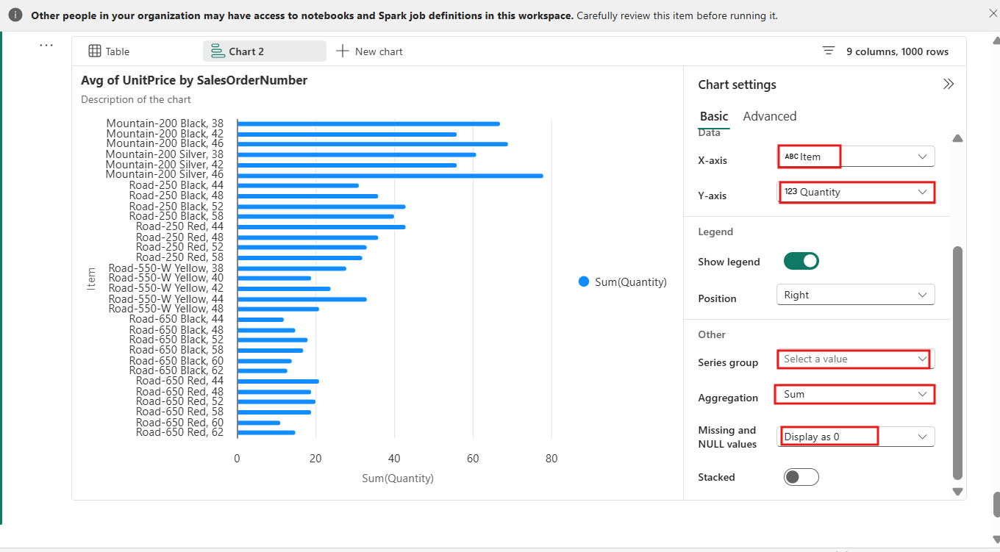

4.  请确认图表是否与此相似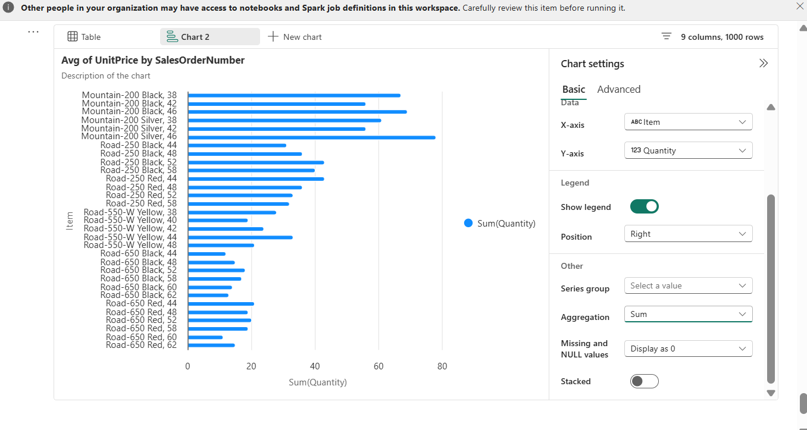

### 任务2：开始使用 matplotlib

1.  点击 **+ Code** ，复制粘贴下面的代码。
    **运行**代码，观察它返回一个包含年度收入的 Spark dataframe。

```
sqlQuery = "SELECT CAST(YEAR(OrderDate) AS CHAR(4)) AS OrderYear, \
                SUM((UnitPrice * Quantity) + Tax) AS GrossRevenue \
            FROM salesorders \
            GROUP BY CAST(YEAR(OrderDate) AS CHAR(4)) \
            ORDER BY OrderYear"
df_spark = spark.sql(sqlQuery)
df_spark.show()
```


2.  为了将 data可视化为图表，我们将先使用 **matplotlib** Python
    库。该库是许多其他库的核心绘图库，提供了极大的图表制作灵活性。

3.  点击 **+ Code**，复制粘贴下面的代码。

```
from matplotlib import pyplot as plt

# matplotlib requires a Pandas dataframe, not a Spark one
df_sales = df_spark.toPandas()

# Create a bar plot of revenue by year
plt.bar(x=df_sales['OrderYear'], height=df_sales['GrossRevenue'])

# Display the plot
plt.show()
```

4.  点击**“Run
    cell”**按钮查看结果，结果包括一个栏状图，显示每年的总总收入。请注意用于制作该图表的代码的以下特点：

    - **matplotlib** 库需要 *Pandas* dataframe，所以你需要将 *Spark* SQL
      查询返回的dataframe转换成这个格式。

    - **matplotlib** 库的核心是 **pyplot**
      对象。这是大多数绘图功能的基础。

    - 默认设置会得到可用的图表，但自定义空间很大

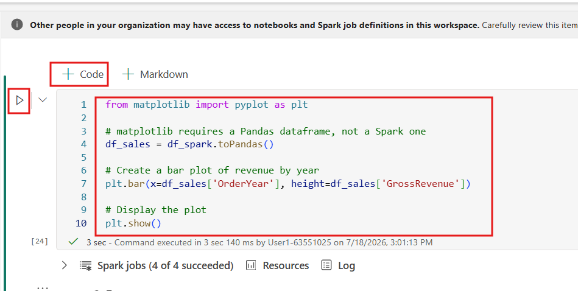

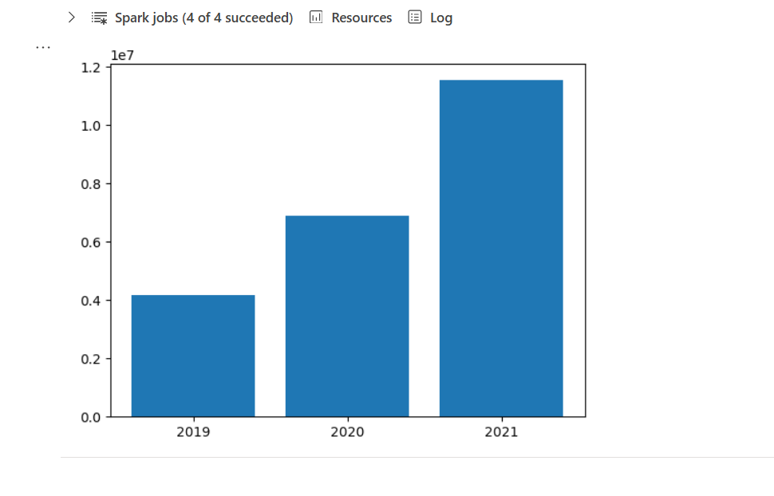

5.  修改代码，将图表绘制如下图，将该单**元格**的所有代码替换为以下代码，点击
    **▷ Run cell** 格按钮，查看输出结果

```
from matplotlib import pyplot as plt

# Clear the plot area
plt.clf()

# Create a bar plot of revenue by year
plt.bar(x=df_sales['OrderYear'], height=df_sales['GrossRevenue'], color='orange')

# Customize the chart
plt.title('Revenue by Year')
plt.xlabel('Year')
plt.ylabel('Revenue')
plt.grid(color='#95a5a6', linestyle='--', linewidth=2, axis='y', alpha=0.7)
plt.xticks(rotation=45)

# Show the figure
plt.show()
```


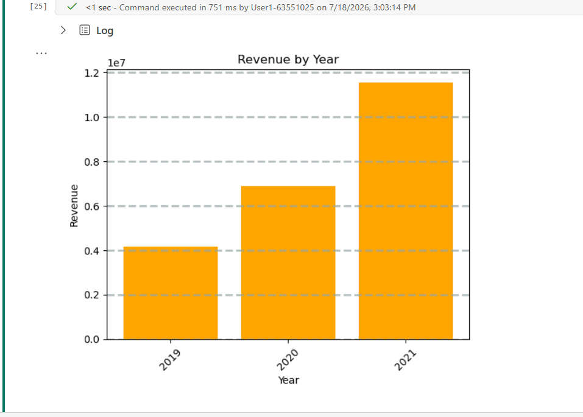

6.  图表现在包含了一些更多信息。剧情技术上是由一个**人物**所包含的。在前面的例子中，这个图形是隐含地为你创造的;但你可以明确创建它。

7.  修改代码，将图表绘制如下图，将**单元格**中的所有代码替换
    为以下代码。

```
from matplotlib import pyplot as plt

# Clear the plot area
plt.clf()

# Create a Figure
fig = plt.figure(figsize=(8,3))

# Create a bar plot of revenue by year
plt.bar(x=df_sales['OrderYear'], height=df_sales['GrossRevenue'], color='orange')

# Customize the chart
plt.title('Revenue by Year')
plt.xlabel('Year')
plt.ylabel('Revenue')
plt.grid(color='#95a5a6', linestyle='--', linewidth=2, axis='y', alpha=0.7)
plt.xticks(rotation=45)

# Show the figure
plt.show()
```

8.  **重新运行**代码单元，查看结果。图形决定了地块的形状和大小。

一个图可以包含多个子线，每个子线都围绕其自身*轴*线。

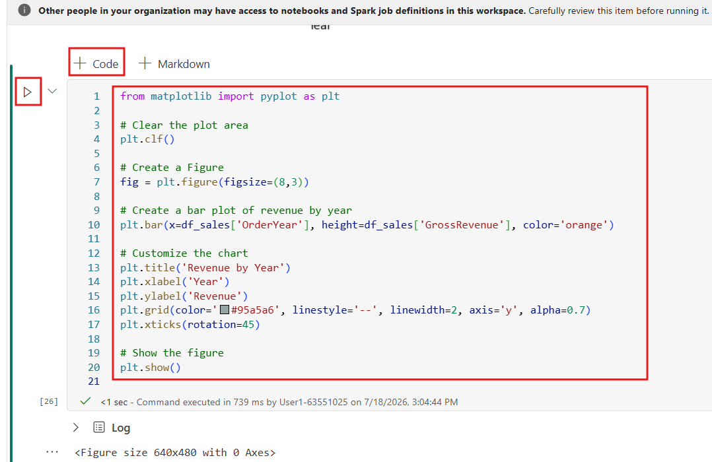

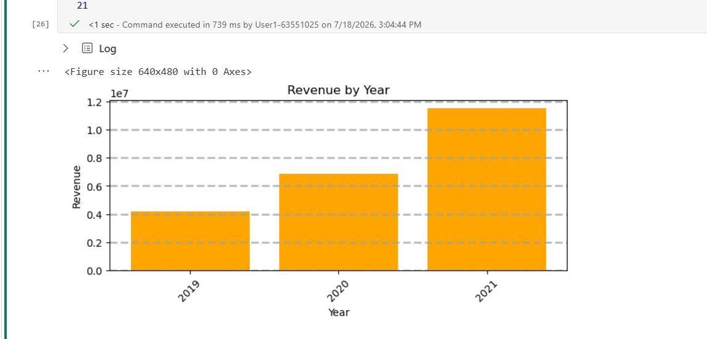

9. 修改代码，将图表绘制如下图。
    **重新运行**代码单元，查看结果。图中包含了代码中指定的子线。

```
# Clear the plot area
plt.clf()

# Create a figure for 2 subplots (1 row, 2 columns)
fig, ax = plt.subplots(1, 2, figsize = (10,4))

# Create a bar plot of revenue by year on the first axis
ax[0].bar(x=df_sales['OrderYear'], height=df_sales['GrossRevenue'], color='orange')
ax[0].set_title('Revenue by Year')

# Create a pie chart of yearly order counts on the second axis
yearly_counts = df_sales['OrderYear'].value_counts()
ax[1].pie(yearly_counts)
ax[1].set_title('Orders per Year')
ax[1].legend(yearly_counts.keys().tolist())

# Add a title to the Figure
fig.suptitle('Sales Data')

# Show the figure
plt.show()
```
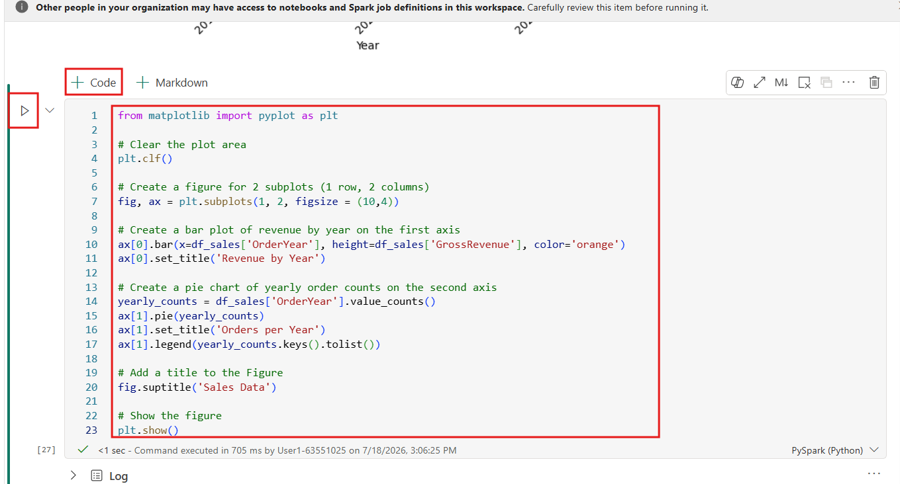

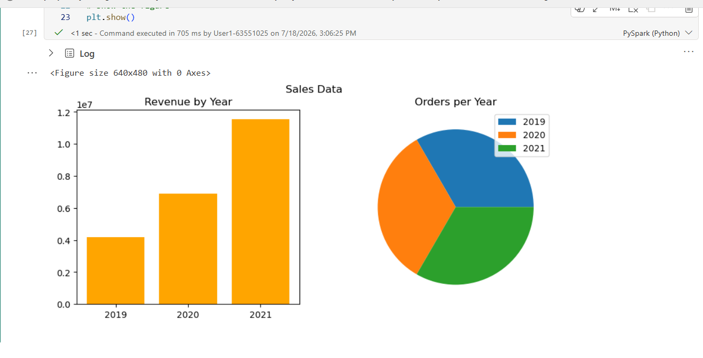

**注意**：想了解更多关于使用 matplotlib 绘制的信息，请参阅 [*matplotlib
documentation*](https://matplotlib.org/)。

### 任务3：使用seaborn 图书馆

虽然 **matplotlib**
可以让你创建多种类型的复杂图表，但要达到最佳效果可能需要一些复杂的代码。因此，多年来，许多新的库在
matplotlib 基础上构建，以抽象化其复杂性并增强其能力。其中一个图书馆是
**seaborn**。

1.  点击 **+ Code**，复制粘贴下面的代码。

```
import seaborn as sns

# Clear the plot area
plt.clf()

# Create a bar chart
ax = sns.barplot(x="OrderYear", y="GrossRevenue", data=df_sales)
plt.show()
```

2.  **运行**代码，观察它显示的是使用Seaborn库的条形图。

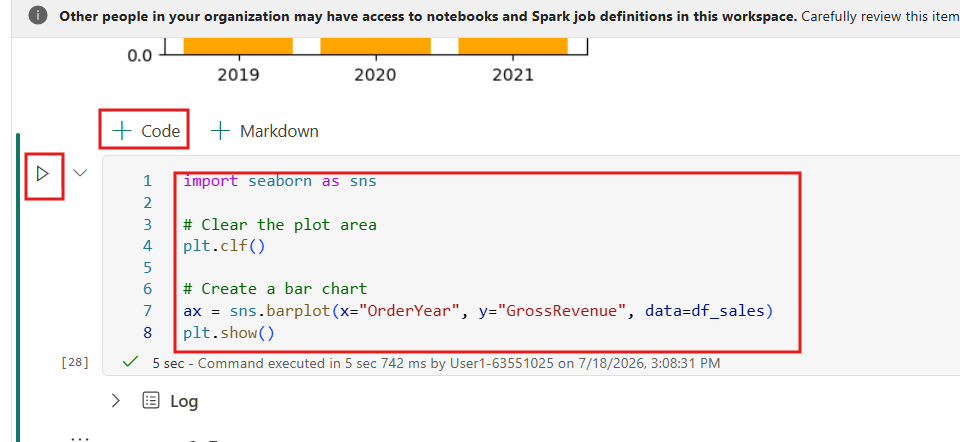

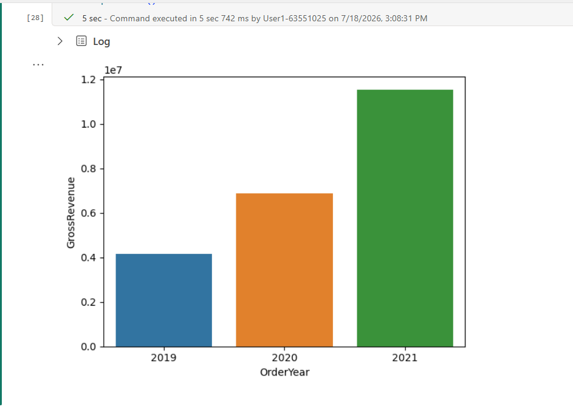

3.  **修改**代码如下。 **运行**修改后的代码，注意 seaborn
    可以让你为地块设置一致的颜色主题。

```
import seaborn as sns

# Clear the plot area
plt.clf()

# Set the visual theme for seaborn
sns.set_theme(style="whitegrid")

# Create a bar chart
ax = sns.barplot(x="OrderYear", y="GrossRevenue", data=df_sales)
plt.show()
```
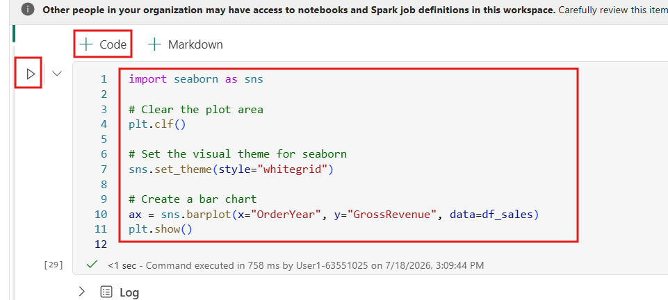

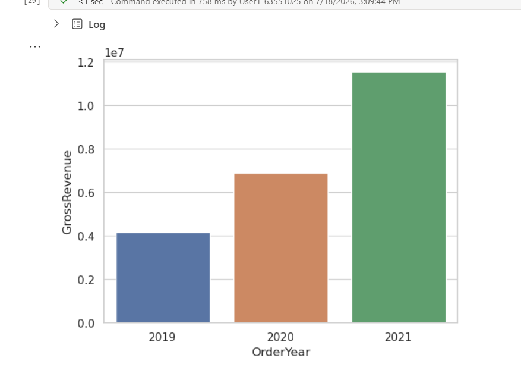

4.  **再次修改**代码如下。
    **运行**修改后的代码，以折线图的形式查看年度收入。

```
import seaborn as sns

# Clear the plot area
plt.clf()

# Create a bar chart
ax = sns.lineplot(x="OrderYear", y="GrossRevenue", data=df_sales)
plt.show()
```


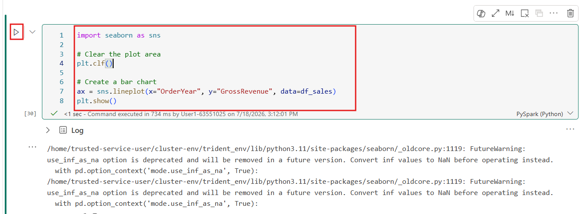

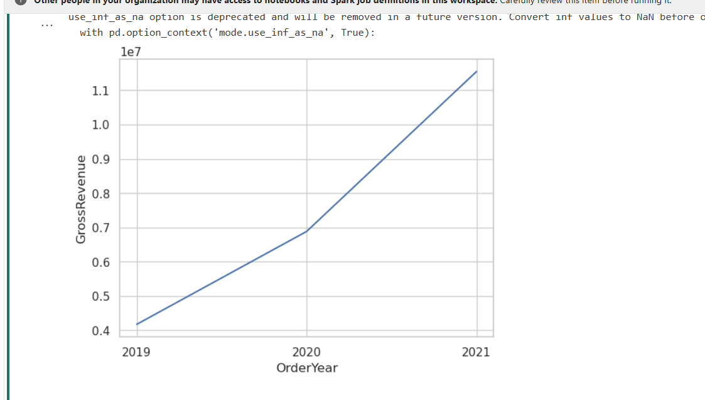

**注意**：想了解更多关于用海生策划的建议，请参见[*seaborn
documentation*](https://seaborn.pydata.org/index.html)。

### 任务4：使用delta表进行流data流处理

Delta lake支持流式 data传输。Delta表可以是 使用Spark Structured
Streaming API创建的
data的*sink* 或*source*。在这个例子中，你将使用一个三角表作为模拟internet
of things（IoT）场景中流 data的汇入点。

1.  点击 **+ Code**，复制粘贴下面的代码，然后点击**“Run cell”**按钮。

```
from notebookutils import mssparkutils
from pyspark.sql.types import *
from pyspark.sql.functions import *

# Create a folder
inputPath = 'Files/data/'
mssparkutils.fs.mkdirs(inputPath)

# Create a stream that reads data from the folder, using a JSON schema
jsonSchema = StructType([
StructField("device", StringType(), False),
StructField("status", StringType(), False)
])
iotstream = spark.readStream.schema(jsonSchema).option("maxFilesPerTrigger", 1).json(inputPath)

# Write some event data to the folder
device_data = '''{"device":"Dev1","status":"ok"}
{"device":"Dev1","status":"ok"}
{"device":"Dev1","status":"ok"}
{"device":"Dev2","status":"error"}
{"device":"Dev1","status":"ok"}
{"device":"Dev1","status":"error"}
{"device":"Dev2","status":"ok"}
{"device":"Dev2","status":"error"}
{"device":"Dev1","status":"ok"}'''
mssparkutils.fs.put(inputPath + "data.txt", device_data, True)
print("Source stream created...")
```
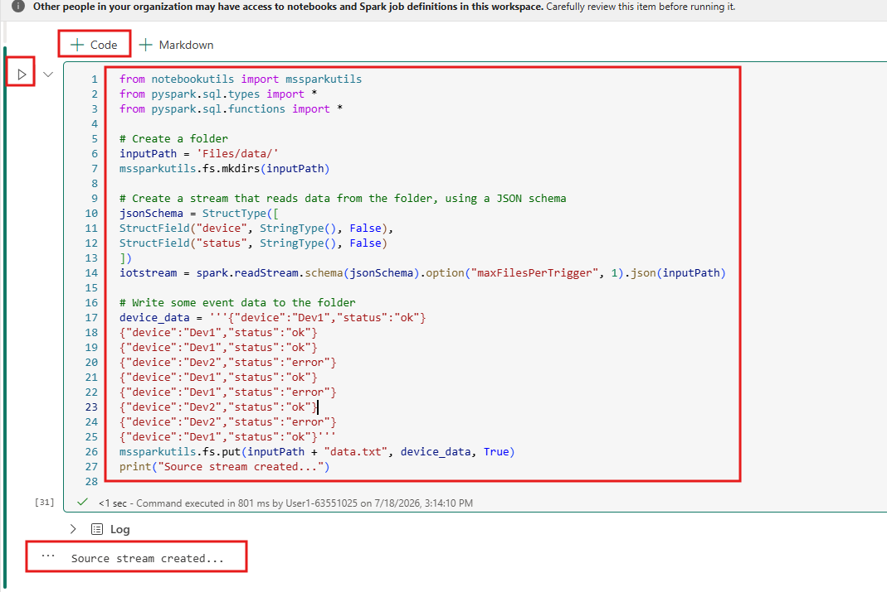

2.  确保消息源 ***Source stream
    created…*** 已印刷。你刚运行的代码基于一个文件夹创建了一个流
    data源，该文件夹保存了一些 data，代表假设的物联网设备的读数。

3.  点击 **+ Code**，复制粘贴下面的代码，然后点击**“Run cell”**按钮。

```
# Write the stream to a delta table
delta_stream_table_path = 'Tables/dbo/iotdevicedata'
checkpointpath = 'Files/delta/checkpoint'
deltastream = iotstream.writeStream.format("delta").option("checkpointLocation", checkpointpath).start(delta_stream_table_path)
print("Streaming to delta sink...")
```

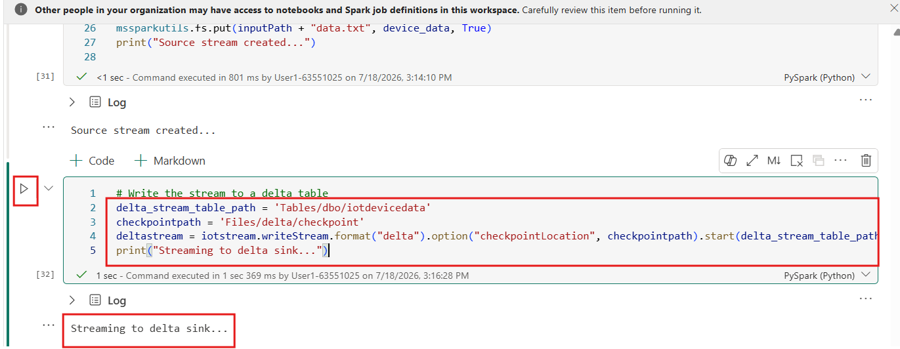

4.  该代码以delta格式将流媒体设备数据写入名为**iotdevicedata**的文件夹。由于文件夹位置的路径在
    **Tables**
    文件夹中，会自动为它创建一个表。点击桌子旁的水平椭圆，然后点击
    **Refresh**。

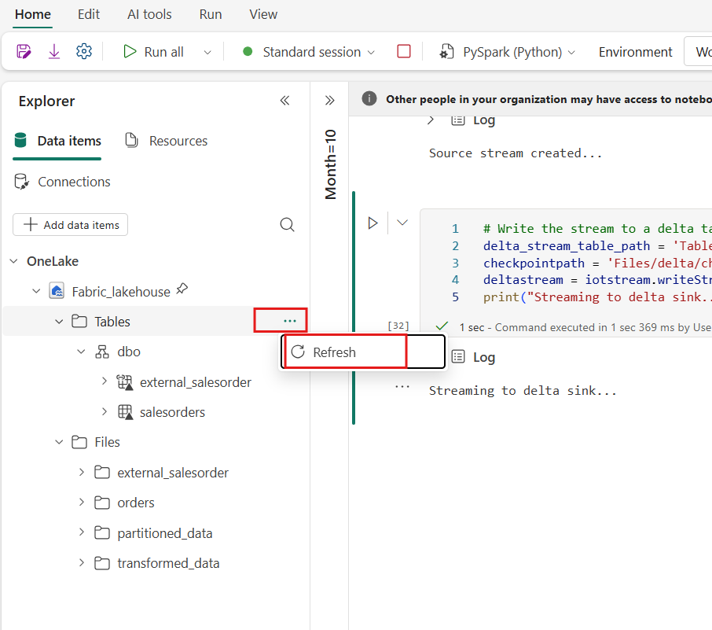


5.  点击 **+ Code**，复制粘贴下面的代码，然后点击**“Run cell”**按钮。

```
%%sql
SELECT * FROM dbo.iotdevicedata;
```


6.  该代码查询包含流媒体源设备 data的IotDeviceData表。

7.  点击 **+ Code**，复制粘贴下面的代码，然后点击**“Run cell”**按钮。

```
# Add more data to the source stream
more_data = '''{"device":"Dev1","status":"ok"}
{"device":"Dev1","status":"ok"}
{"device":"Dev1","status":"ok"}
{"device":"Dev1","status":"ok"}
{"device":"Dev1","status":"error"}
{"device":"Dev2","status":"error"}
{"device":"Dev1","status":"ok"}'''

mssparkutils.fs.put(inputPath + "more-data.txt", more_data, True)
```

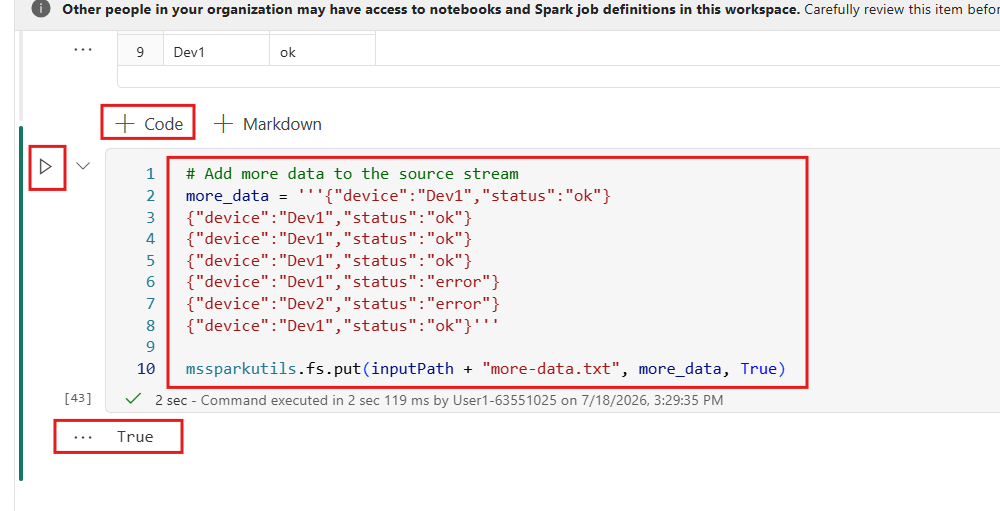

8.  这段代码会将更多假设的设备 data写入流源。

9.  点击 **+ Code**，复制粘贴下面的代码，然后点击**“Run cell”**按钮。

```
%%sql
SELECT * FROM dbo.iotdevicedata;
```

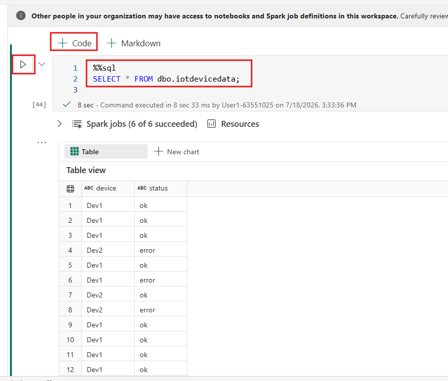

10. 该代码再次查询 **IotDeviceData** 表，表中应包含已添加到流源的额外
    data。

11. 点击 **+ Code**，复制粘贴下面的代码，然后点击**“Run cell”**按钮。

+++deltastream.stop()+++

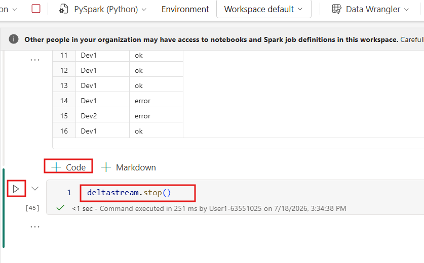

12. 这个代码会停止直播。

### 任务5：保存notebook并结束Spark会话

现在你已经完成data处理，可以保存notebook并命名有意义，并结束 Spark
会话。

1.  在notebook菜单栏，使用 ⚙️ **Settings** 图标查看notebook设置。

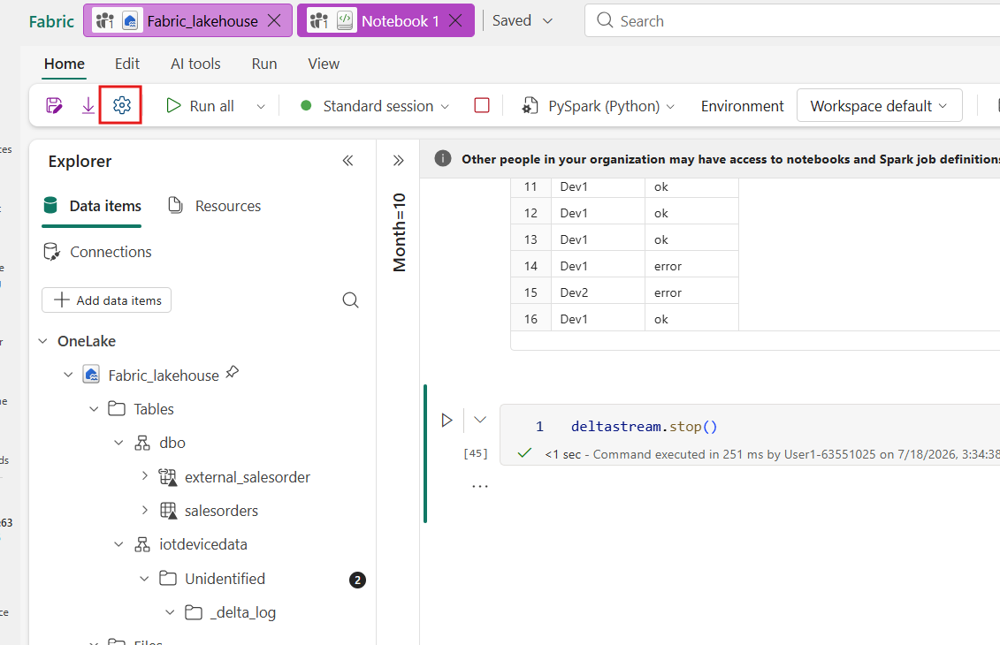

2.  将notebook**名称**设置为 +++**Explore Sales
    Orders+++**，然后关闭设置面板。

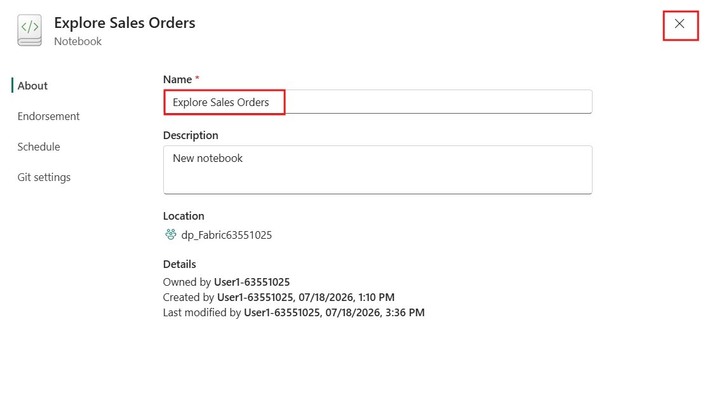

3.  在notebook菜单中，选择**Stop session** 以结束Spark会话。

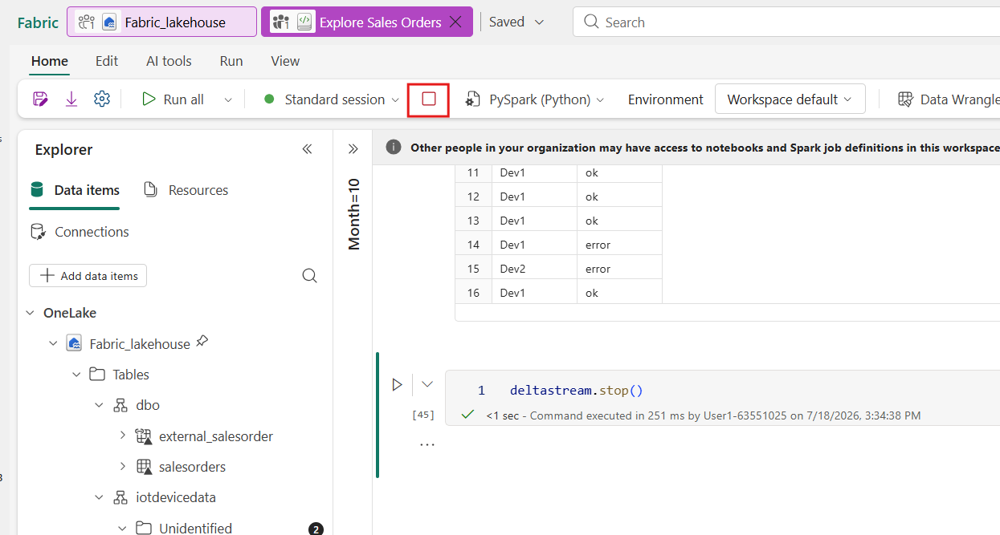


### 任务6：清理资源

在这个练习中，你已经学会了如何使用Spark在Microsoft Fabric中处理data。

如果你已经完成了lakehouse探索，可以删除你为这个练习创建的工作区。

1.  在左侧栏中，选择工作区图标，查看其所有项目。


2.  在**......**工具栏菜单，选择**Workspace settings**。


3.  选择**“General**”，点击**“Remove this workspace”。**


4.  在 **Delete workspace?** 对话框，点击**Delete** 按钮。


**摘要**

本用例将引导你在 Power BI 中使用 Microsoft Fabric
的过程。它涵盖了多个任务，包括搭建工作区、创建lakehouse、上传和管理
data文件，以及使用notebooks进行data探索。参与者将学习如何使用PySpark操作和转换数据，创建可视化，并保存和分区数据以实现高效的查询。

在这个用例中，参与者将参与一系列专注于Microsoft
Fabric中delta表的任务。任务包括上传和探索 data、创建托管和外部 delta
表、比较其属性，实验室介绍了用于结构化 data管理的 SQL 功能，并利用
Matplotlib 和 seaborn 等 Python 库提供
data可视化的见解。这些练习旨在全面理解如何使用 Microsoft Fabric 进行
data分析，以及在IoT环境中引入delta表进行data流传输。
