# 用例 03：在 Microsoft Fabric 中为 Contoso 构建销售和地理数据仓库

**场景**

Contoso 是一家跨国零售公司，正在寻求实现数据基础结构的现代化，以提升销售和地理分析能力。目前，公司的销售和客户数据分散在多个系统中，业务分析师和公民开发人员难以从中获取洞察。公司计划使用 Microsoft Fabric 将这些数据整合到统一的平台中，以支持跨仓库查询、销售分析和地理报表。

在本实验中，你将扮演 Contoso 的数据工程师，负责使用 Microsoft Fabric 设计和实现数据仓库解决方案。你将首先设置 Fabric 工作区并创建数据仓库，然后加载示例数据，并执行一系列分析任务，为 Contoso 的决策者提供洞察。

**简介**

虽然 Microsoft Fabric 中的许多概念对数据和分析专业人员来说可能很熟悉，但在新环境中应用这些概念可能具有挑战性。本实验以循序渐进的方式，带你完成从数据引入到数据使用的端到端场景，帮助你建立对 Microsoft Fabric 用户体验、各种工作负载及其集成点，以及专业开发人员和公民开发人员体验的基本理解。

**本实验创建的 Fabric 项**

| **项** | **名称** | **在实验中的用途** |
|----|----|----|
| 工作区 | Warehouse_Fabric\<实验实例 ID\> | 包含本实验的所有项 |
| 仓库 | WideWorldImporters | 存储 Wide World Importers 示例数据、克隆表、存储过程和视图 |
| 复制作业 | Load Customer Data | 将示例数据加载到仓库 |
| Lakehouse | Shortcut_Exercise | 包含指向仓库 dimension_customer 表的快捷方式 |
| 语义模型 | Sales Model | 基于仓库的 Direct Lake 语义模型 |
| 报表 | Sales Analysis | 包含柱形图、地图和表格的 Power BI 报表 |

**目标**：

- 创建 Microsoft Fabric 工作区和名为 WideWorldImporters 的仓库。

- 使用复制作业将 Wide World Importers 示例数据加载到仓库中。

- 使用 T-SQL 在同一架构内以及跨架构 (dbo1) 克隆表，包括时间点克隆。

- 创建并运行存储过程，以转换数据并创建 aggregate_sale_by_date_city 表。

- 使用 T-SQL 在语句级别执行时间旅行查询。

- 使用可视化查询生成器合并和汇总数据。

- 使用 T-SQL 笔记本和 Spark 笔记本查询和分析数据。

- 在 WideWorldImporters 仓库和 Shortcut_Exercise SQL 分析终结点之间运行跨仓库查询。

- 创建 Direct Lake 语义模型，并构建包含柱形图、地图和表格视觉对象的 Power BI 报表。

- 删除工作区及其相关项。

**注意：** 本实验的屏幕截图使用英文界面，因此步骤中的界面名称（例如 **+ New workspace**、**Apply**）保留英文，方便你对照界面操作。

## 练习 1：创建 Microsoft Fabric 工作区

在本练习中，你将登录 Microsoft Fabric、创建工作区，并在其中创建仓库。

### 任务 1：创建工作区

1.  打开浏览器，在地址栏中输入或粘贴以下 URL：+++https://app.fabric.microsoft.com/+++，然后按 **Enter** 键。

**注意**：如果你直接进入 Microsoft Fabric 主页，请跳到步骤 6。


2.  在 **Microsoft Fabric** 窗口中输入你的凭据，然后单击 **Submit** 按钮。

| **用户名** | **+++@lab.CloudPortalCredential(User1).Username+++** |
|----|----|
| **密码** | **+++@lab.CloudPortalCredential(User1).Password+++** |

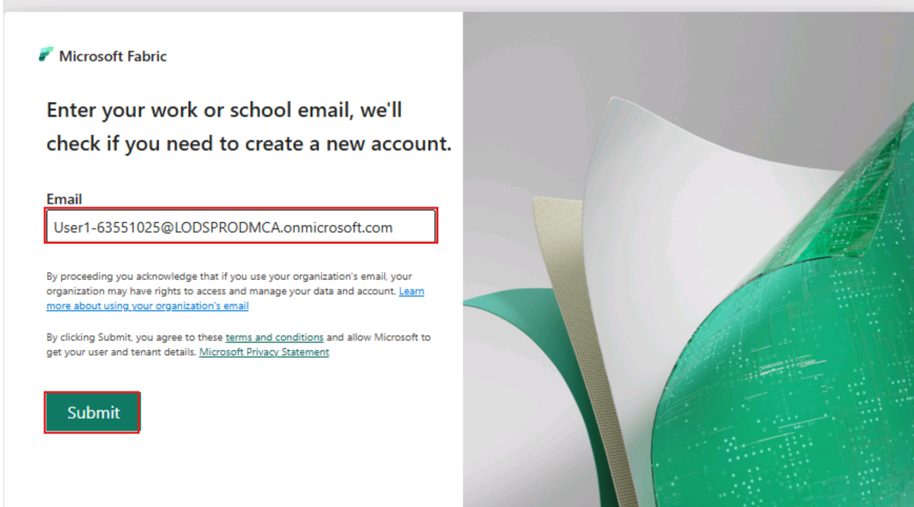

3.  在 **Microsoft** 窗口中输入密码，然后单击 **Sign in** 按钮。


4.  在 **Stay signed in?** 窗口中，单击 **Yes** 按钮。

5.  如果默认打开 Power BI，请执行以下步骤，否则跳过此步骤：

- 单击 **Power BI**。

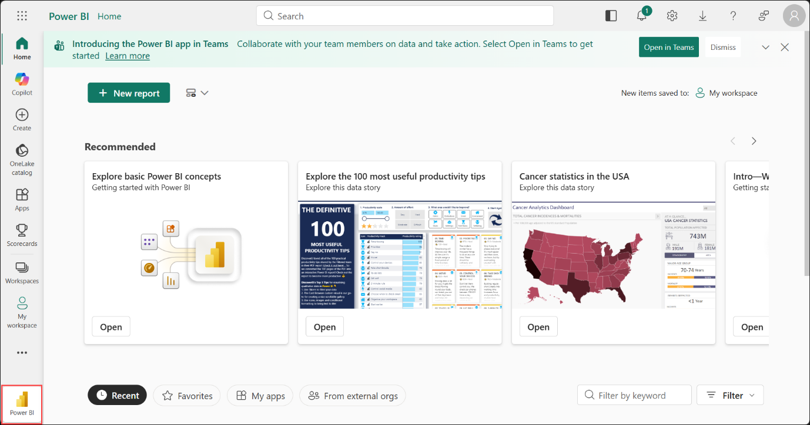

- 从选项中选择 **Fabric**。

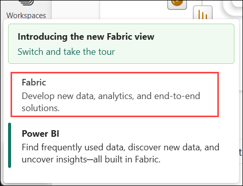

6.  在 Fabric 主页上，选择 **+ New workspace** 磁贴。


7.  在 **Create a workspace** 窗格中，输入以下信息，然后单击 **Apply** 按钮。

| **属性** | **值** |
|----|----|
| **Name** | +++Warehouse_Fabric@lab.LabInstance.Id+++（必须是唯一的名称） |
| **Description** | +++This workspace contains all the artifacts for the data warehouse+++ |
| **Advanced** | 在 **License mode** 下选择 **Fabric** |
| **Default storage format** | **Small dataset storage format** |

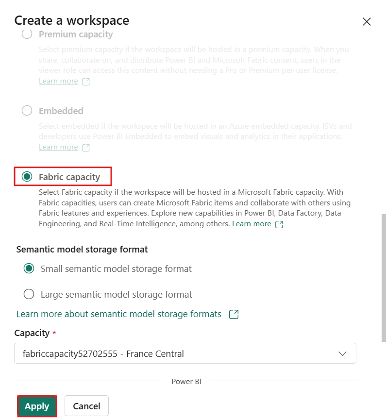

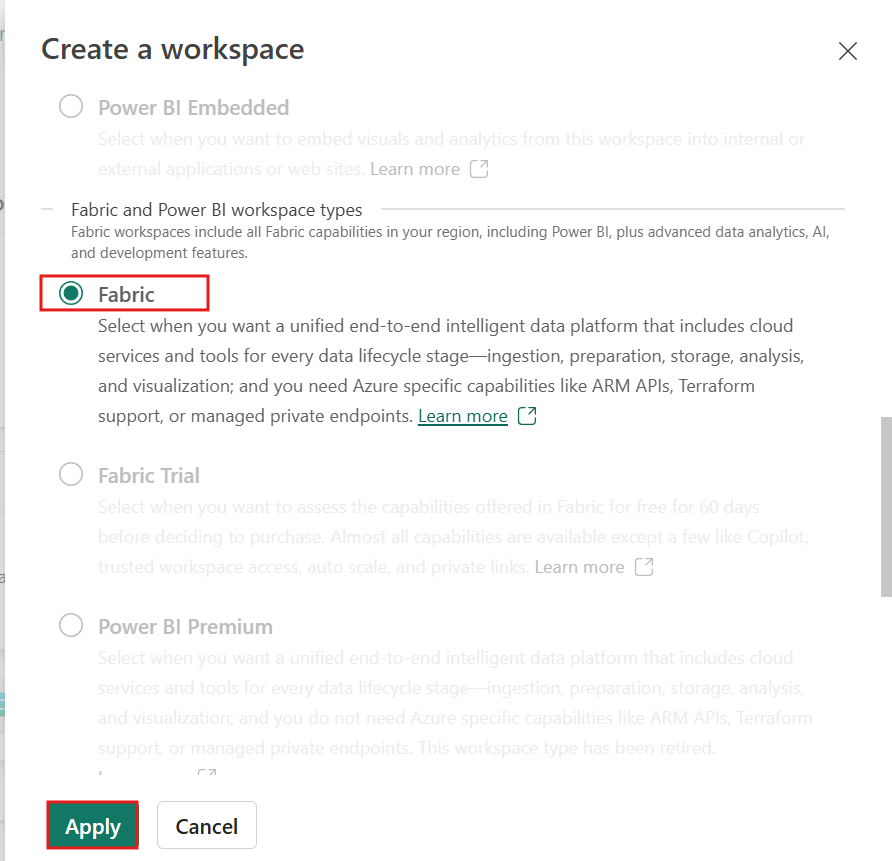

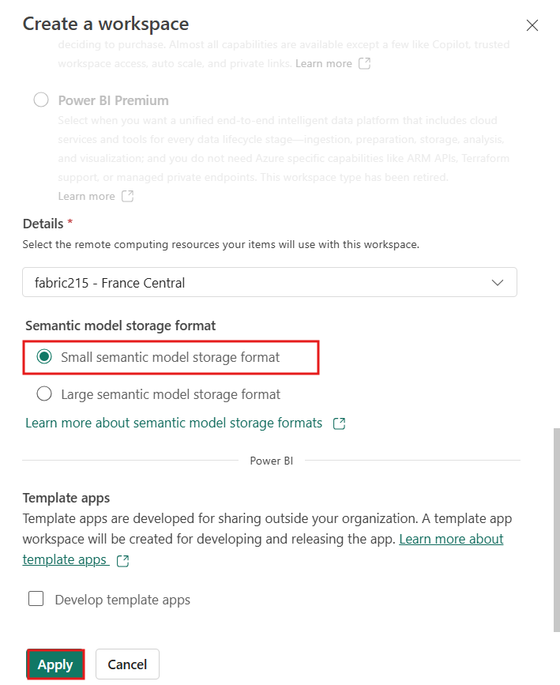

8.  等待部署完成，大约需要 1-2 分钟。新工作区打开时应该是空的。


### 任务 2：在 Microsoft Fabric 中创建仓库

1.  在工作区页面上，选择 **+ New item**，然后选择 **Warehouse**。

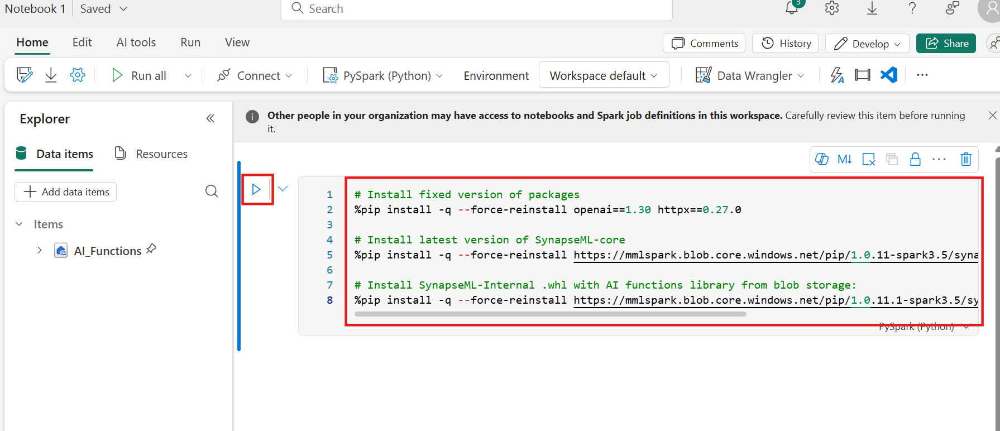

2.  在 **New warehouse** 对话框中，输入 +++WideWorldImporters+++，然后单击 **Create** 按钮。

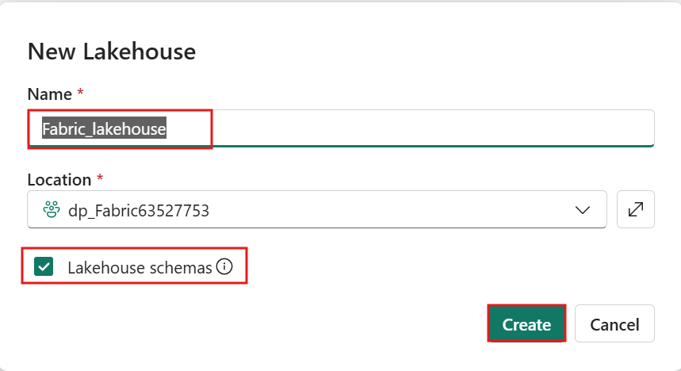

3.  预配完成后，会显示 **WideWorldImporters** 仓库的登录页。


## 练习 2：在 Microsoft Fabric 中将数据引入仓库

在本练习中，你将使用复制作业，把 Wide World Importers 示例数据加载到仓库中。

### 任务 1：将数据引入仓库

1.  在 **WideWorldImporters** 仓库登录页的左侧导航菜单中，选择 **Warehouse_Fabric@lab.LabInstance.Id**，返回工作区项列表。


2.  在工作区页面上，选择 **+ New item**，然后在 **Get data** 下单击 **Copy job**。


3.  在 **New copy job** 窗口的 **Name** 框中，输入 +++Load Customer Data+++，然后单击 **Create**。

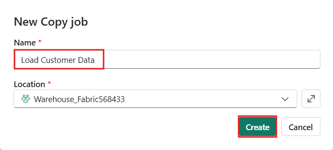

4.  **Copy job** 页面随即打开。

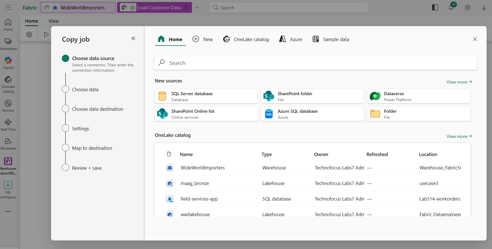

5.  在 **Copy job** 向导的第一页，从菜单栏中选择 **Sample data**，然后选择 **Retail Data Model from Wide World Importers** 示例，进入下一页。

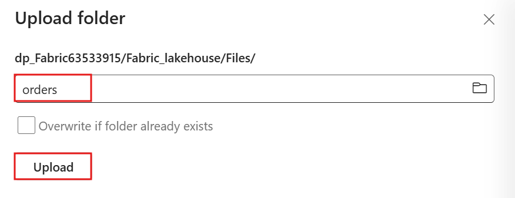

6.  示例数据的预览随即加载。在 **Choose data** 页面上，你可以预览所选数据集。查看数据后，单击 **Next**。


7.  在 **Choose data destination** 页面上，从 OneLake 目录中选择你的 **WideWorldImporters** 仓库，然后单击 **Next**。

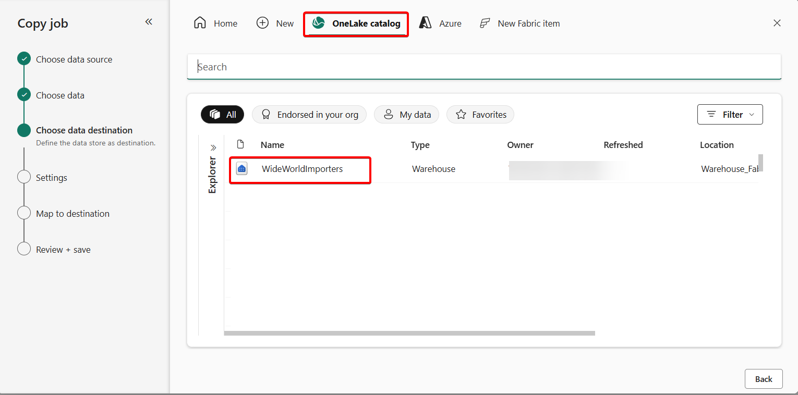

8.  在 **Choose copy job mode** 页面上，选择 **Full copy**，然后单击 **Next**。

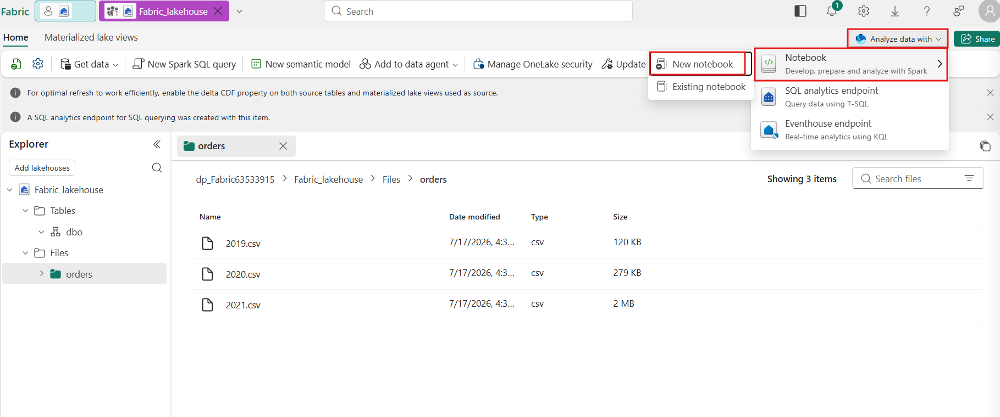

9.  输入以下目标表，然后单击 **Next**。

- +++dbo.dimension_city+++

- +++dbo.dimension_customer+++

- +++dbo.dimension_date+++

- +++dbo.dimension_employee+++

- +++dbo.dimension_stock_item+++

- +++dbo.fact_sale+++

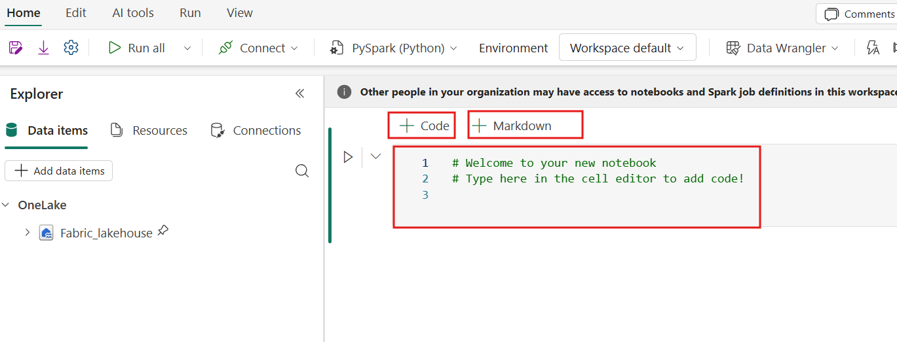

10. 在 **Review + save** 页面上，查看 **Source** 和 **Destination**，然后保存。

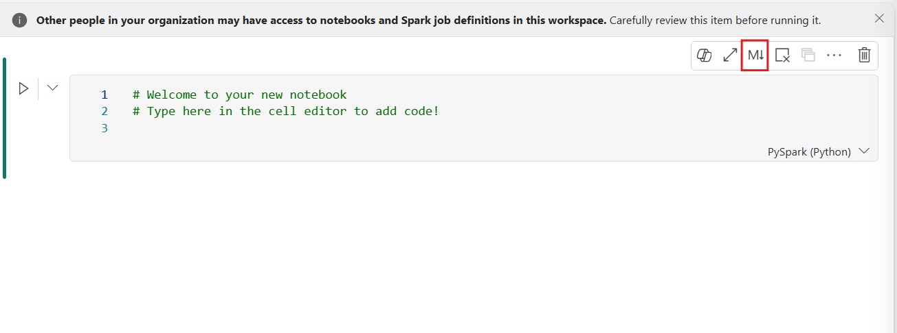

11. 使用 **Results** 选项卡监视复制作业的执行情况。


12. 完成后，**Copy job** 会显示 **Succeeded** 通知和状态。现在，你会在仓库中看到来自 Wide World Importers 数据集的六个新表。

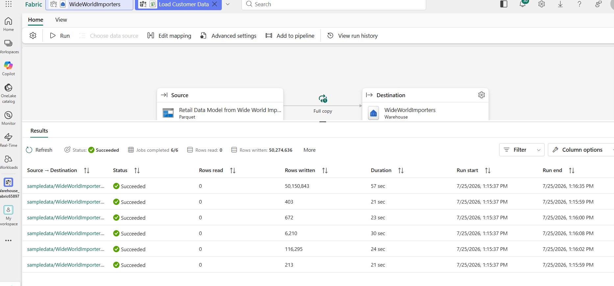

13. 在 **Load Customer Data** 页面上，单击左侧导航栏中的 **Warehouse_Fabric@lab.LabInstance.Id** 工作区，然后选择 **WideWorldImporters** 仓库。

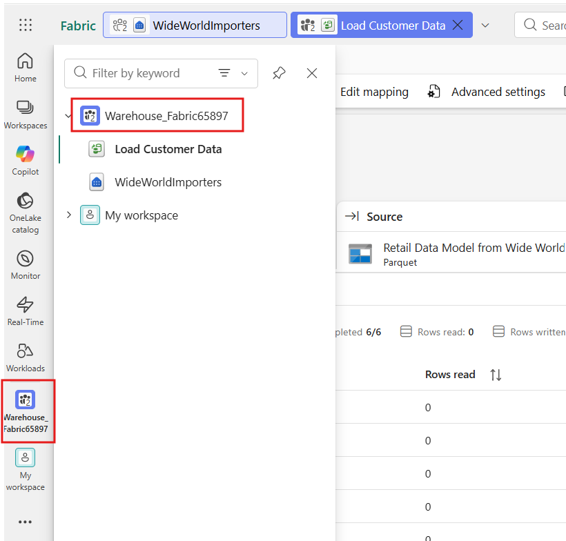

14. 在 **WideWorldImporters** 仓库中，展开 **Schemas \> dbo \> Tables**，并验证表 **dimension_city**、**dimension_customer**、**dimension_date**、**dimension_employee**、**dimension_stock_item** 和 **fact_sale** 是否已成功创建。

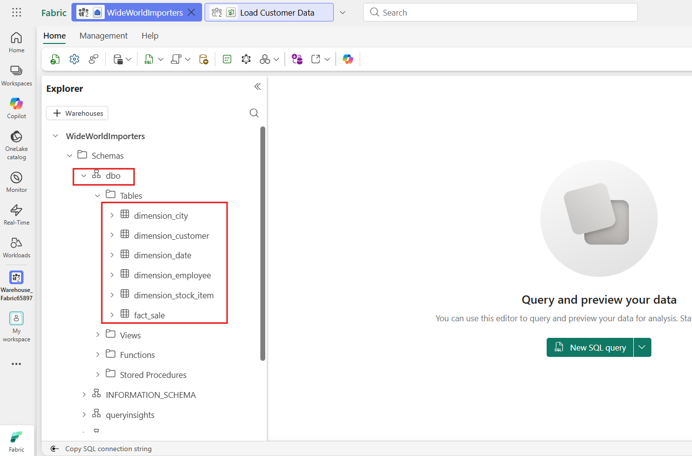

## 练习 3：在仓库中使用 T-SQL 克隆表

在本练习中，你将使用 T-SQL 在同一架构内以及跨架构克隆表，包括基于过去某个时间点的克隆。

### 任务 1：在同一架构内克隆表

1.  在 **WideWorldImporters** 页面上，转到 **Home** 选项卡，从 **SQL** 下拉菜单中单击 **New SQL query**。


2.  在查询编辑器中粘贴以下代码。此代码会创建 **dimension_city** 表和 **fact_sale** 表的克隆。

```sql
--Create a clone of the dbo.dimension_city table.
CREATE TABLE [dbo].[dimension_city1] AS CLONE OF [dbo].[dimension_city];

--Create a clone of the dbo.fact_sale table.
CREATE TABLE [dbo].[fact_sale1] AS CLONE OF [dbo].[fact_sale];
```

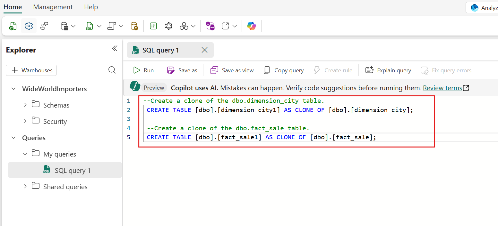

3.  若要执行查询，请在查询设计功能区上选择 **Run**。


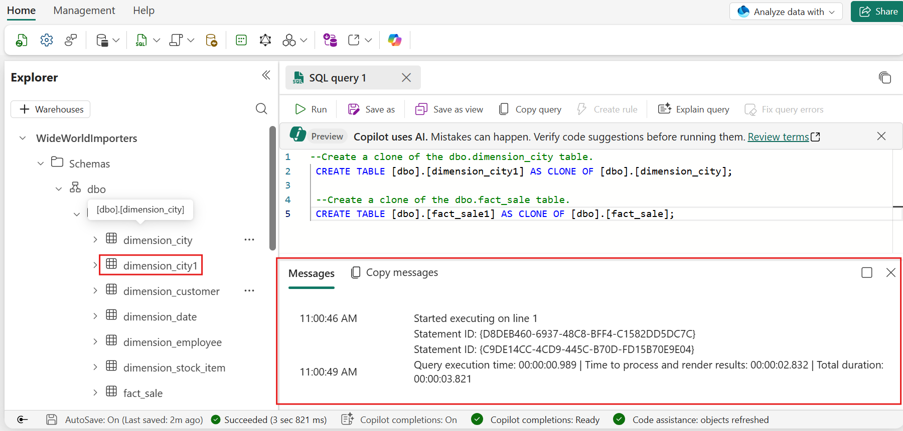

4.  在查询编辑器中粘贴以下代码，替换现有语句。CURRENT_TIMESTAMP T-SQL 函数以 **datetime** 形式返回当前 UTC 时间戳。选择 **Run** 执行查询，并复制返回的时间戳值。

```sql
SELECT CURRENT_TIMESTAMP;
```


5.  若要创建*过去某个时间点*的表克隆，请在查询编辑器中粘贴以下代码，**替换现有语句**。将 **YOUR_TIMESTAMP** 替换为上一步返回的时间戳（格式为 **YYYY-MM-DDTHH:MM:SS.FFF**）。此代码会创建 **dimension_city** 表和 **fact_sale** 表在该时间点的克隆。运行查询。

```sql
--Create a clone of the dbo.dimension_city table at a specific point in time.
CREATE TABLE [dbo].[dimension_city2] AS CLONE OF [dbo].[dimension_city] AT 'YOUR_TIMESTAMP';

--Create a clone of the dbo.fact_sale table at a specific point in time.
CREATE TABLE [dbo].[fact_sale2] AS CLONE OF [dbo].[fact_sale] AT 'YOUR_TIMESTAMP';
```

**注意：** 时间点必须晚于表的创建时间，并在仓库的数据保留期内。如果使用表创建之前的时间（例如 2025 年的日期），克隆会失败。

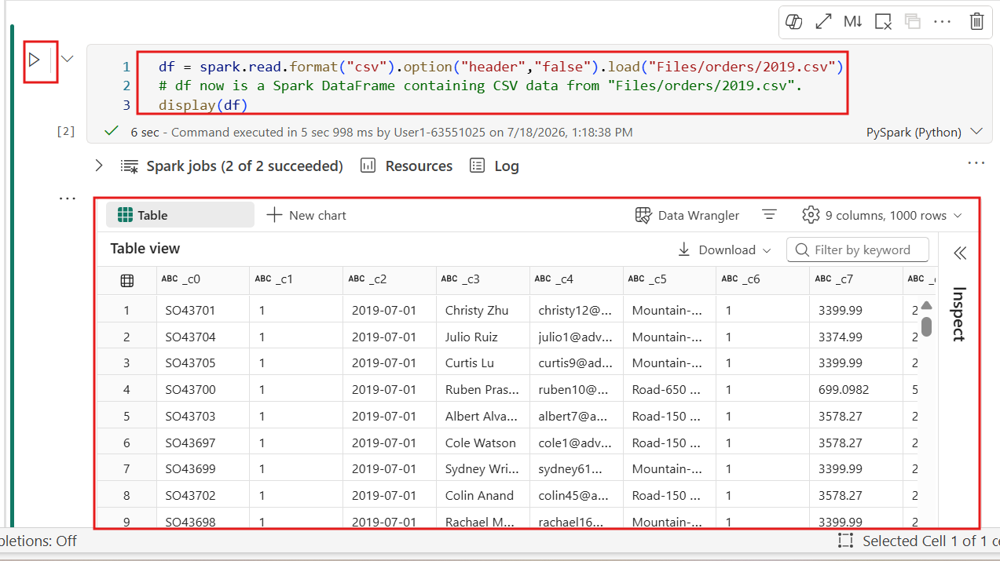

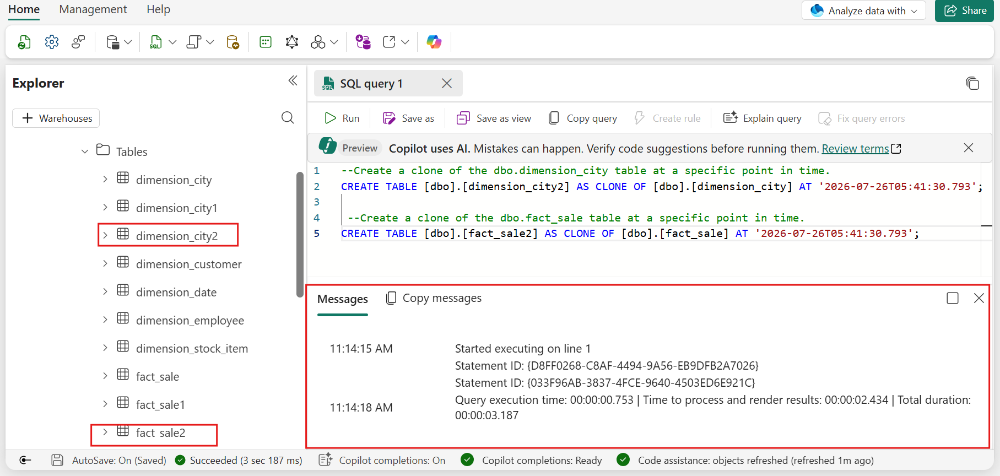

6.  将查询重命名为 +++Clone Tables+++。

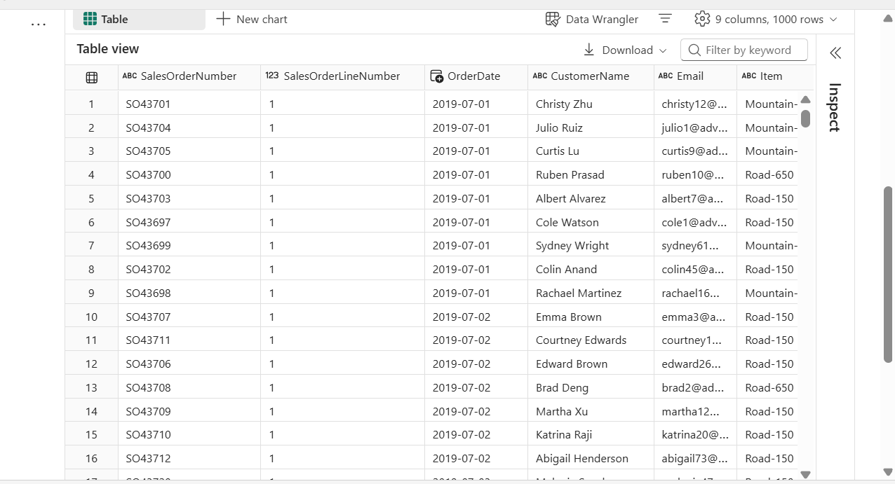

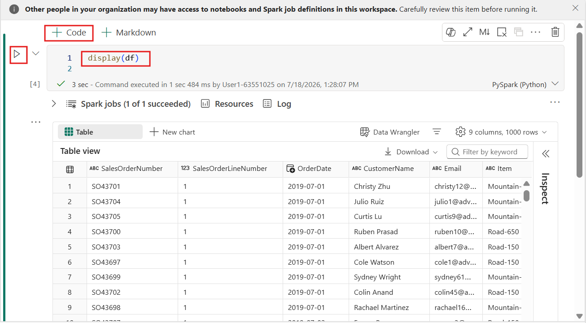

### 任务 2：在同一仓库内跨架构克隆表

在此任务中，你将学习如何在同一仓库内跨架构克隆表。

1.  若要创建新查询，请在 **Home** 功能区上选择 **New SQL query**。


2.  在查询编辑器中粘贴以下代码。此代码会创建一个架构，然后在新架构中创建 **fact_sale** 表和 **dimension_city** 表的克隆。运行查询。

```sql
--Create a new schema within the warehouse named dbo1.
CREATE SCHEMA dbo1;
GO

--Create a clone of dbo.fact_sale table in the dbo1 schema.
CREATE TABLE [dbo1].[fact_sale1] AS CLONE OF [dbo].[fact_sale];

--Create a clone of dbo.dimension_city table in the dbo1 schema.
CREATE TABLE [dbo1].[dimension_city1] AS CLONE OF [dbo].[dimension_city];
```


3.  执行完成后，预览 **dbo1** 架构中 **dimension_city1** 表加载的数据。

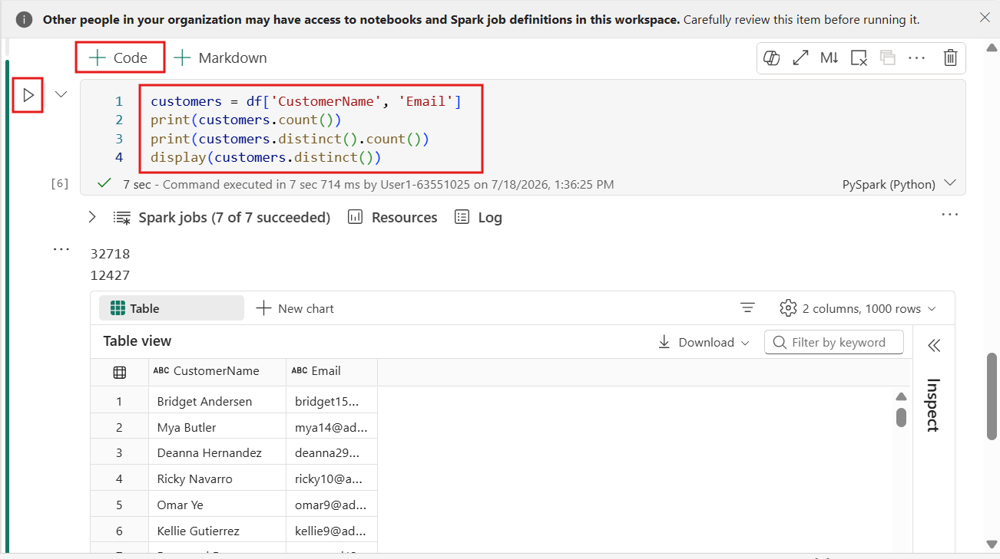

4.  若要创建*过去某个时间点*的表克隆，请在查询编辑器中粘贴以下代码，**替换现有语句**。将 **YOUR_TIMESTAMP** 替换为任务 1 中复制的时间戳。此代码会在新架构中创建 **dimension_city** 表和 **fact_sale** 表在该时间点的克隆。运行查询。

```sql
--Create a clone of the dbo.dimension_city table in the dbo1 schema.
CREATE TABLE [dbo1].[dimension_city2] AS CLONE OF [dbo].[dimension_city] AT 'YOUR_TIMESTAMP';

--Create a clone of the dbo.fact_sale table in the dbo1 schema.
CREATE TABLE [dbo1].[fact_sale2] AS CLONE OF [dbo].[fact_sale] AT 'YOUR_TIMESTAMP';
```

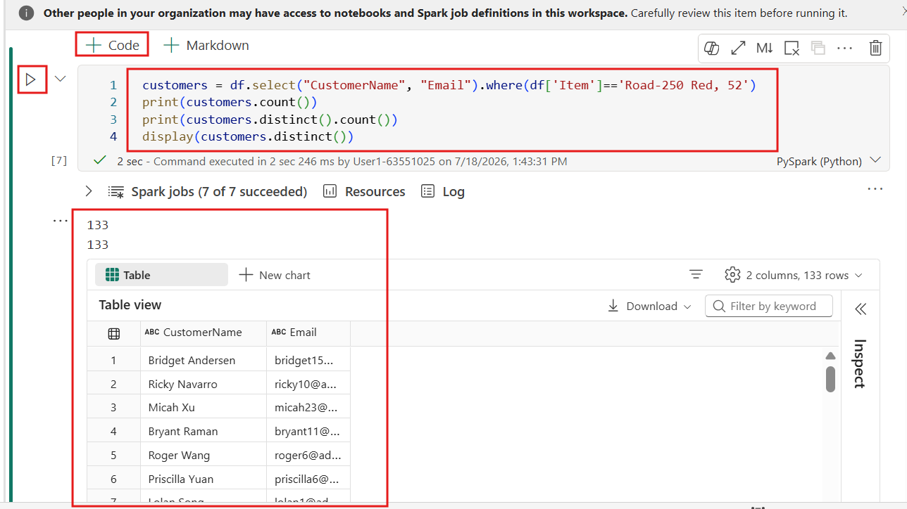

5.  执行完成后，预览 **dbo1** 架构中 **fact_sale2** 表加载的数据。

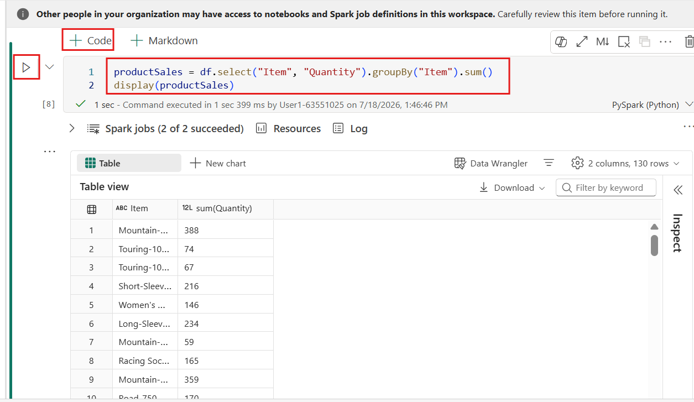

6.  将查询重命名为 +++Clone Tables Across Schemas+++。

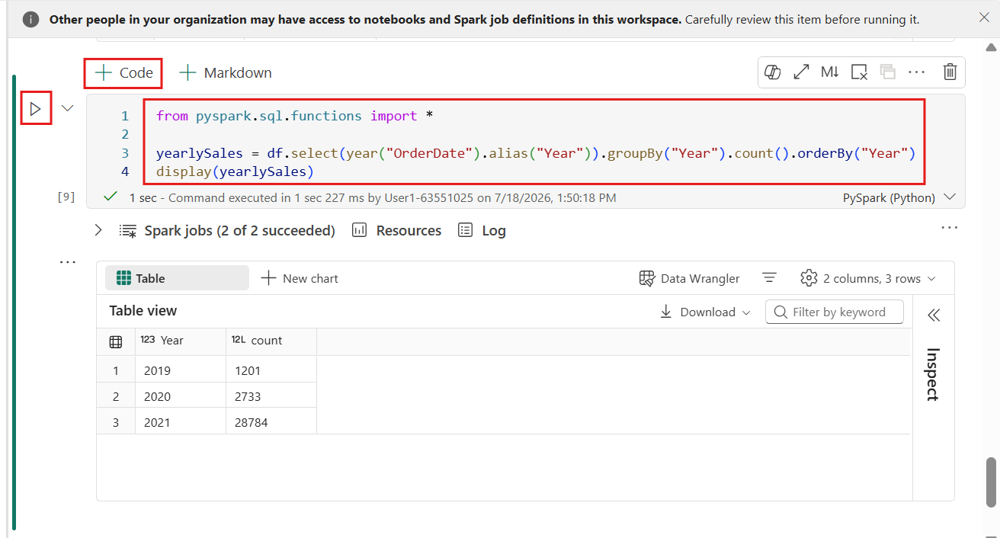

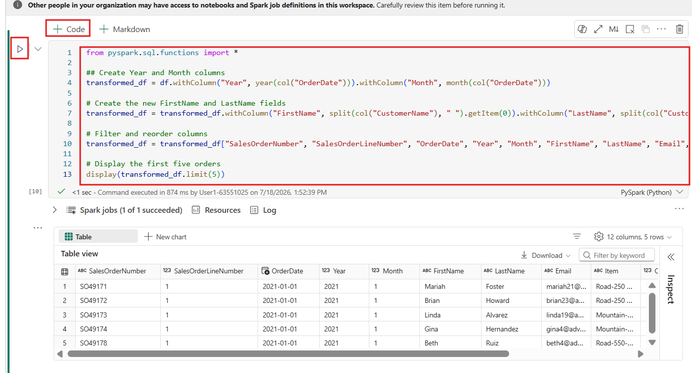

## 练习 4：使用存储过程转换数据

在本练习中，你将创建并运行存储过程，以转换仓库表中的数据。

### 任务 1：创建存储过程

1.  在 **WideWorldImporters** 页面上，转到 **Home** 选项卡，从 **SQL** 下拉菜单中单击 **New SQL query**。


2.  在查询编辑器中粘贴以下代码。此代码会删除存储过程（如果存在），然后创建名为 **populate_aggregate_sale_by_city** 的存储过程。存储过程的逻辑会创建名为 **aggregate_sale_by_date_city** 的表，并使用联接 **fact_sale** 和 **dimension_city** 表的分组查询插入数据。

```sql
--Drop the stored procedure if it already exists.
DROP PROCEDURE IF EXISTS [dbo].[populate_aggregate_sale_by_city];
GO

--Create the populate_aggregate_sale_by_city stored procedure.
CREATE PROCEDURE [dbo].[populate_aggregate_sale_by_city]
AS
BEGIN
    --Drop the aggregate table if it already exists.
    DROP TABLE IF EXISTS [dbo].[aggregate_sale_by_date_city];

    --Create the aggregate table.
    CREATE TABLE [dbo].[aggregate_sale_by_date_city]
    (
        [Date] [DATETIME2](6),
        [City] [VARCHAR](8000),
        [StateProvince] [VARCHAR](8000),
        [SalesTerritory] [VARCHAR](8000),
        [SumOfTotalExcludingTax] [DECIMAL](38,2),
        [SumOfTaxAmount] [DECIMAL](38,6),
        [SumOfTotalIncludingTax] [DECIMAL](38,6),
        [SumOfProfit] [DECIMAL](38,2)
    );

    --Load aggregated data into the table.
    INSERT INTO [dbo].[aggregate_sale_by_date_city]
    SELECT
        FS.[InvoiceDateKey] AS [Date],
        DC.[City],
        DC.[StateProvince],
        DC.[SalesTerritory],
        SUM(FS.[TotalExcludingTax]) AS [SumOfTotalExcludingTax],
        SUM(FS.[TaxAmount]) AS [SumOfTaxAmount],
        SUM(FS.[TotalIncludingTax]) AS [SumOfTotalIncludingTax],
        SUM(FS.[Profit]) AS [SumOfProfit]
    FROM [dbo].[fact_sale] AS FS
    INNER JOIN [dbo].[dimension_city] AS DC
        ON FS.[CityKey] = DC.[CityKey]
    GROUP BY
        FS.[InvoiceDateKey],
        DC.[City],
        DC.[StateProvince],
        DC.[SalesTerritory]
    ORDER BY
        FS.[InvoiceDateKey],
        DC.[StateProvince],
        DC.[City];
END;
```


3.  若要执行查询，请在查询设计功能区上选择 **Run**。

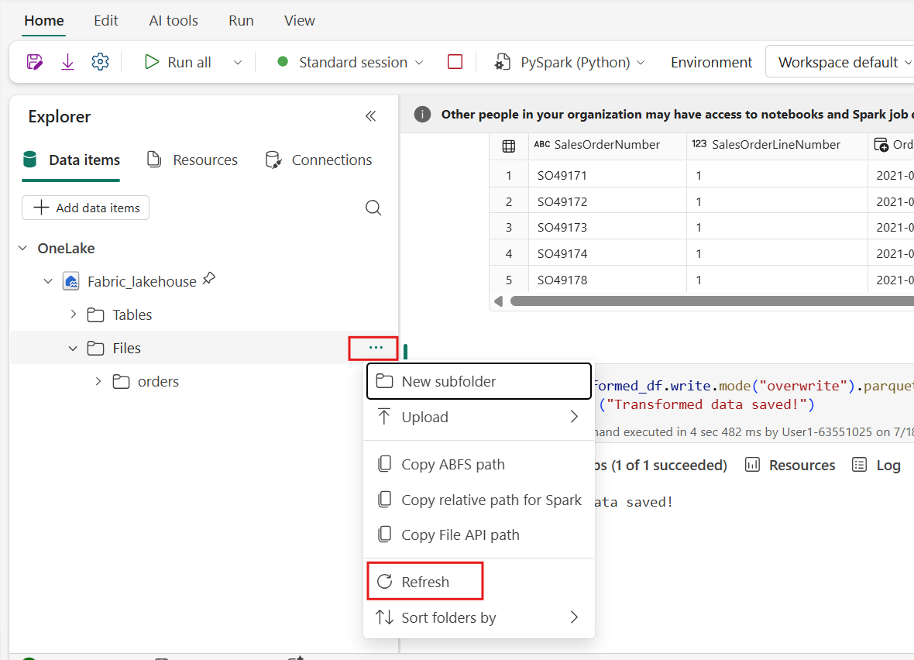

4.  执行完成后，将查询重命名为 +++Create Aggregate Procedure+++。

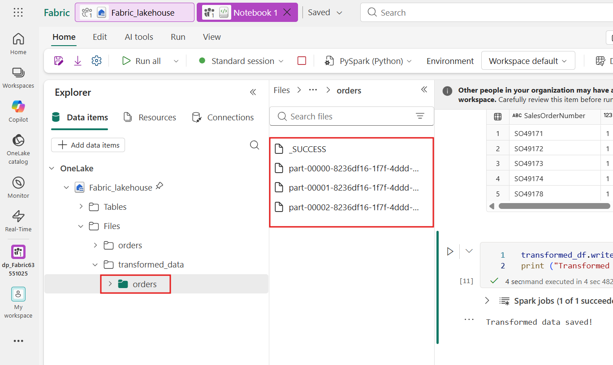

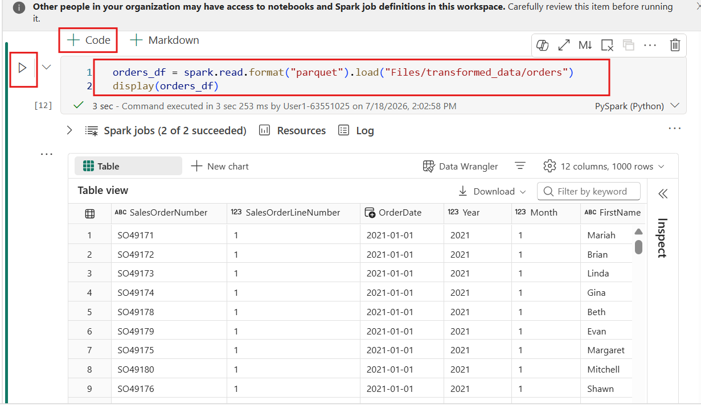

5.  在 **Explorer** 窗格中，确认 **dbo** 架构的 **Stored Procedures** 文件夹中存在 **populate_aggregate_sale_by_city** 存储过程。


### 任务 2：运行存储过程

1.  在 **WideWorldImporters** 页面上，转到 **Home** 选项卡，从 **SQL** 下拉菜单中单击 **New SQL query**。

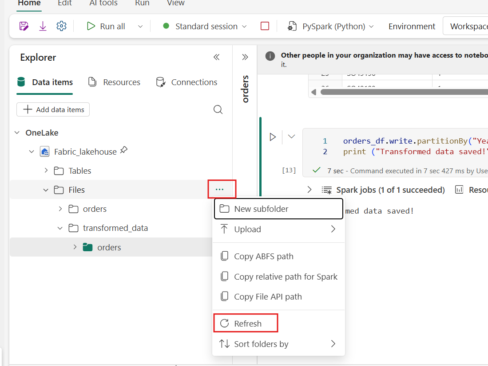

2.  在查询编辑器中粘贴以下代码。此代码会执行 **populate_aggregate_sale_by_city** 存储过程。运行查询。

```sql
--Execute the stored procedure to create and load aggregated data.
EXEC [dbo].[populate_aggregate_sale_by_city];
```

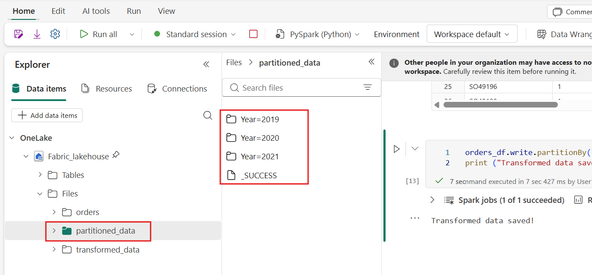

3.  执行完成后，将查询重命名为 +++Run Aggregate Procedure+++。


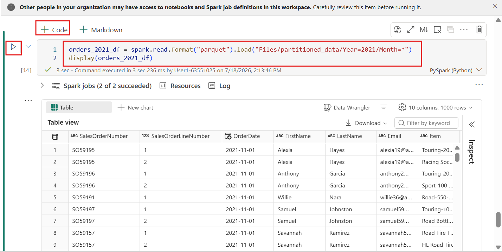

4.  若要预览汇总数据，请在 **Explorer** 窗格中选择 **aggregate_sale_by_date_city** 表。

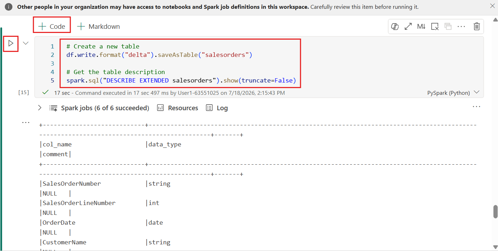

**注意：** 如果表未显示，请选择 **Tables** 文件夹的省略号 (**...**)，然后选择 **Refresh**。

## 练习 5：在语句级别使用 T-SQL 进行时间旅行

在本练习中，你将创建销售额排名前十的客户视图，并使用该视图运行时间旅行查询。

### 任务 1：使用时间旅行查询

1.  在 **WideWorldImporters** 页面上，转到 **Home** 选项卡，从 **SQL** 下拉菜单中单击 **New SQL query**。

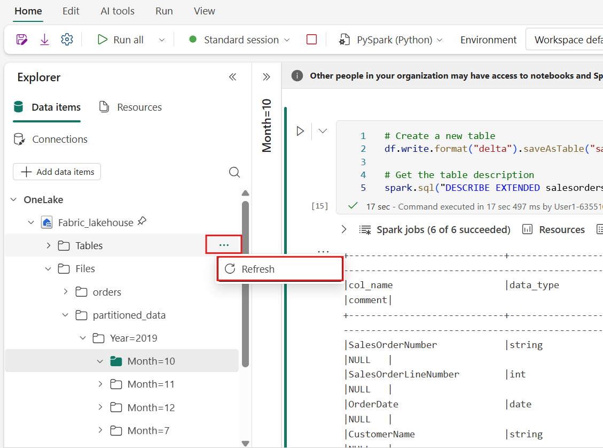

2.  在查询编辑器中粘贴以下代码。此代码会创建名为 **Top10Customers** 的视图，该视图根据销售额检索排名前 10 的客户。选择 **Run** 执行查询。

```sql
--Create the Top10Customers view.
CREATE VIEW [dbo].[Top10Customers]
AS
SELECT TOP(10)
    FS.[CustomerKey],
    DC.[Customer],
    SUM(FS.[TotalIncludingTax]) AS [TotalSalesAmount]
FROM
    [dbo].[dimension_customer] AS DC
INNER JOIN [dbo].[fact_sale] AS FS
    ON DC.[CustomerKey] = FS.[CustomerKey]
GROUP BY
    FS.[CustomerKey],
    DC.[Customer]
ORDER BY
    [TotalSalesAmount] DESC;
```

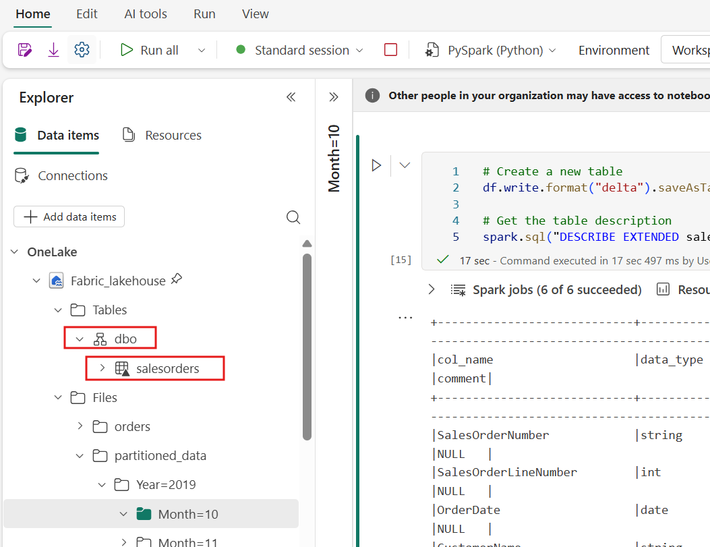

3.  执行完成后，将查询重命名为 +++Create Top 10 Customer View+++。

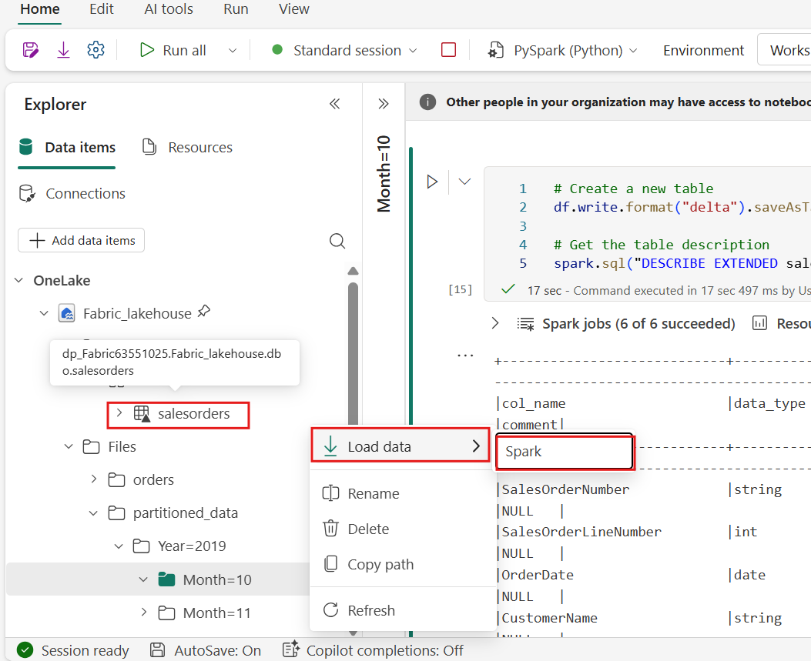

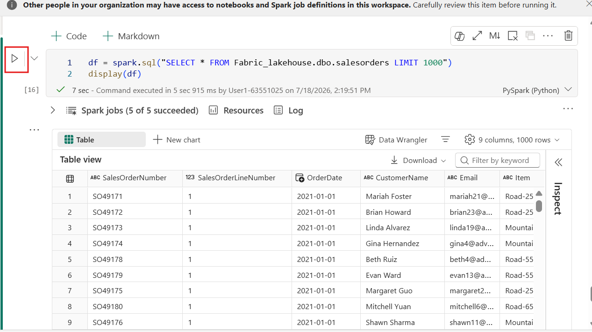

4.  在 **Explorer** 中展开 **dbo** 架构下的 **Views** 节点，确认可以看到新创建的视图 **Top10Customers**。


5.  与步骤 1 类似，创建新查询。在功能区的 **Home** 选项卡上，选择 **New SQL query**。

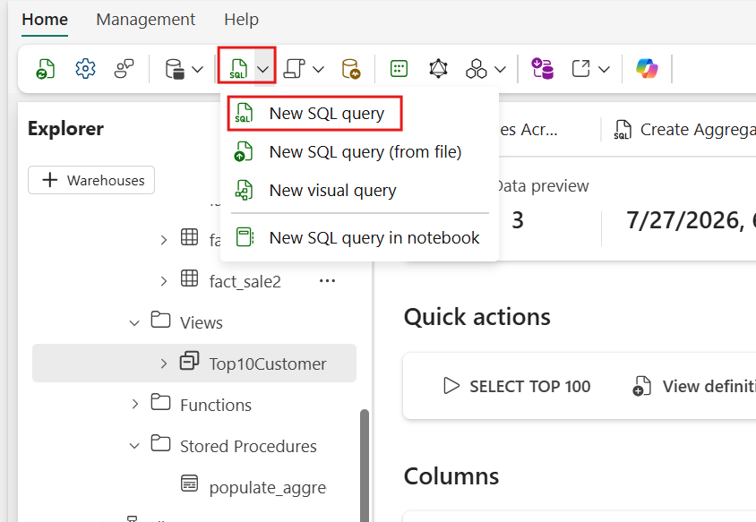

6.  在查询编辑器中粘贴以下代码。此代码会更新单个事实行的 **TotalIncludingTax** 值，故意夸大其总销售额，并检索当前时间戳。运行查询。

```sql
--Update the TotalIncludingTax for a single fact row to deliberately inflate its total sales.
UPDATE [dbo].[fact_sale]
SET [TotalIncludingTax] = 200000000
WHERE [SaleKey] = 22632918; --For customer 'Tailspin Toys (Muir, MI)'
GO

--Retrieve the current (UTC) timestamp.
SELECT CURRENT_TIMESTAMP;
```

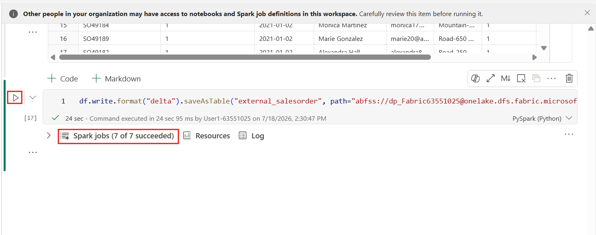

7.  将返回的时间戳值复制到剪贴板。

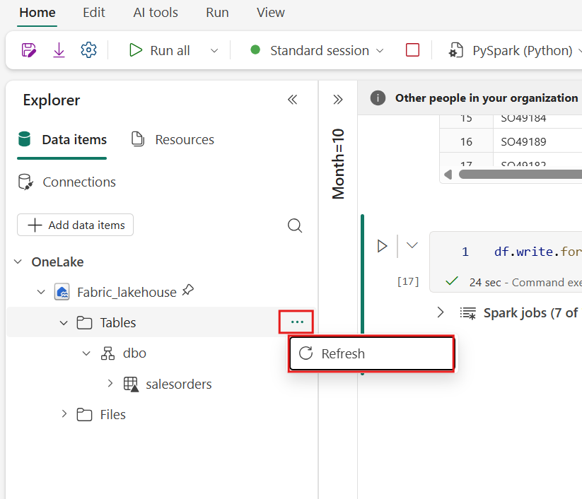

**注意：** 目前，只能使用协调世界时 (UTC) 时区进行时间旅行。

8.  执行完成后，将查询重命名为 +++Time Travel+++。

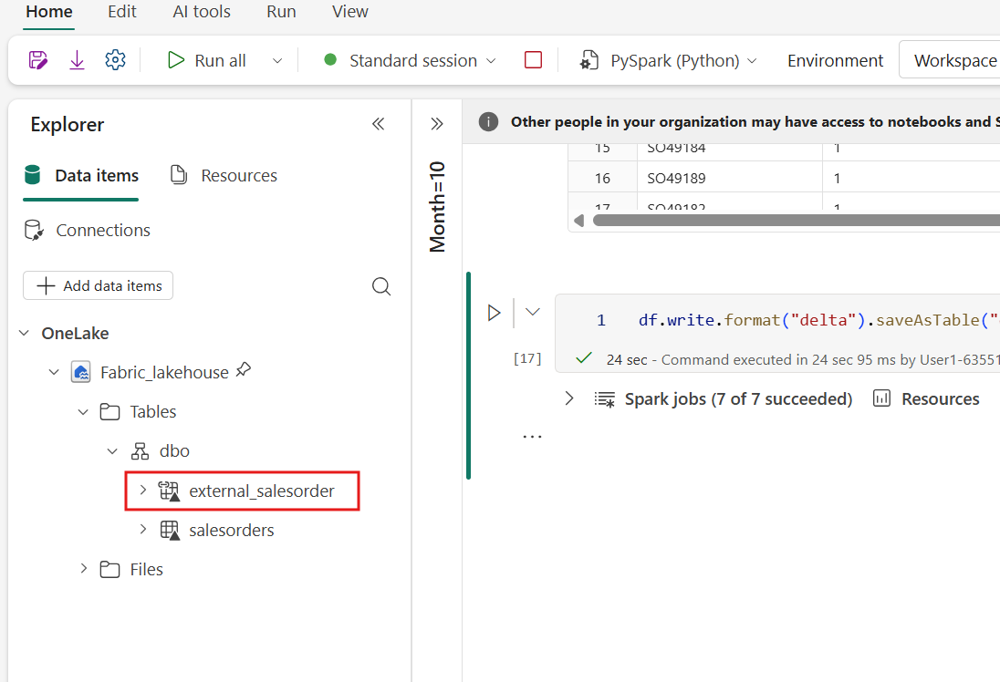

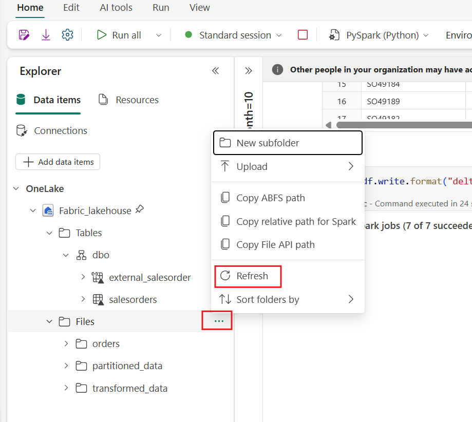

9.  创建新查询，并粘贴以下语句，以检索*当前*排名前 10 的客户。此代码使用 **FOR TIMESTAMP AS OF** 查询提示。将 **YOUR_TIMESTAMP** 替换为你复制到剪贴板的时间戳，格式为 **YYYY-MM-DDTHH:MM:SS\[.FFF\]**，并去掉末尾的零，例如 **2026-07-27T06:20:55.823**。运行查询。

```sql
--Retrieve the top 10 customers as of now.
SELECT *
FROM [dbo].[Top10Customers]
OPTION (FOR TIMESTAMP AS OF 'YOUR_TIMESTAMP');
```

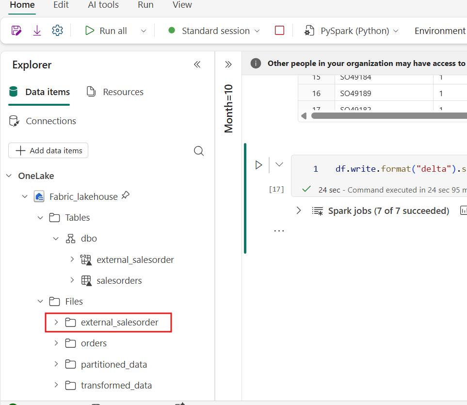

10. 将查询重命名为 +++Time Travel Now+++。


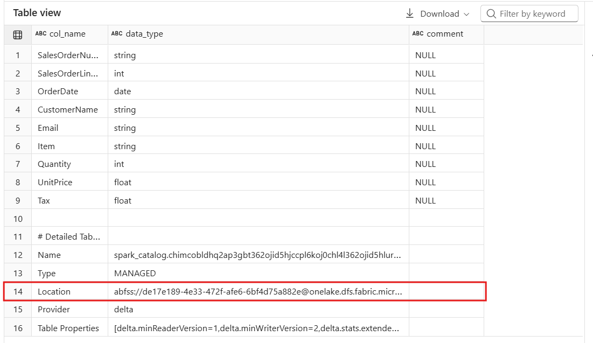

11. 请注意，由于刚才夸大了销售额，排名第一的 **CustomerKey** 现在是 **49**，即 **Tailspin Toys (Muir, MI)**。

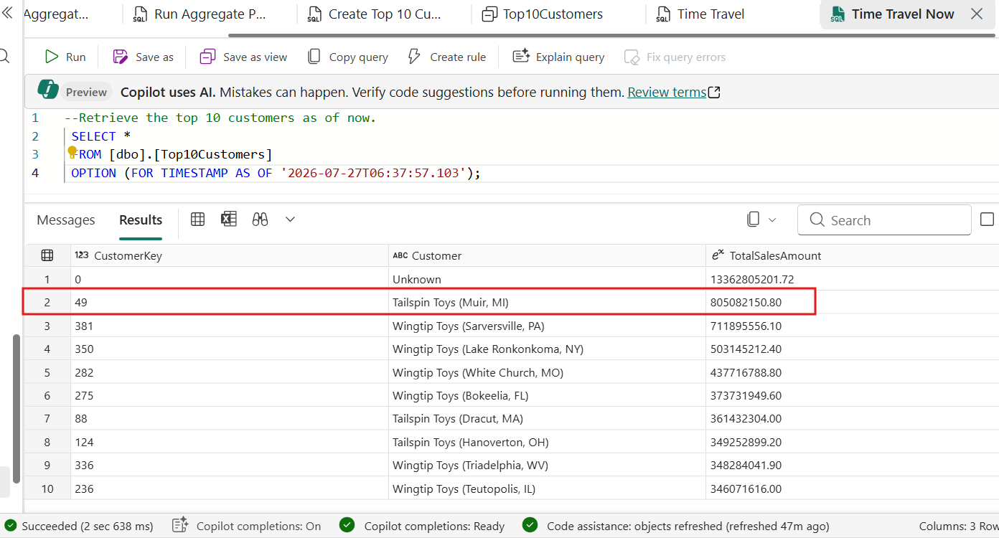

12. 将时间戳值**减去一分钟**，修改为更早的时间。

13. 再次运行查询，请注意排名第一的 **CustomerKey** 是 **381**，即 **Wingtip Toys (Sarversville, PA)**。这是更新之前的结果。

## 练习 6：在仓库中使用可视化查询生成器创建查询

在本练习中，你将使用可视化查询生成器合并和汇总数据，而无需编写 SQL 代码。

### 任务 1：使用可视化查询生成器

1.  在 **Home** 功能区上，打开 **New SQL query** 下拉列表，然后选择 **New visual query**。

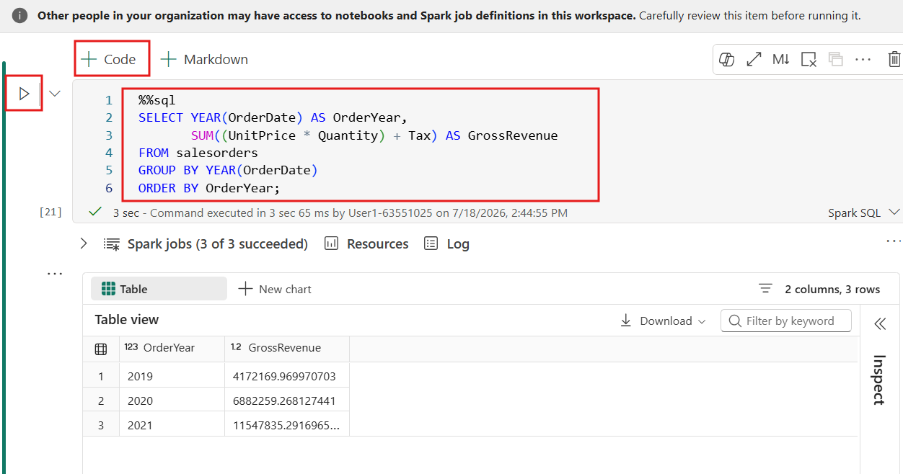

2.  在 **Explorer** 窗格中，从 **dbo** 架构的 **Tables** 文件夹将 **fact_sale** 表拖到可视化查询画布上。


3.  若要限制数据集大小，请在查询设计器的 **transformations** 功能区中，单击 **Reduce rows** 下拉菜单，然后单击 **Keep top rows**。

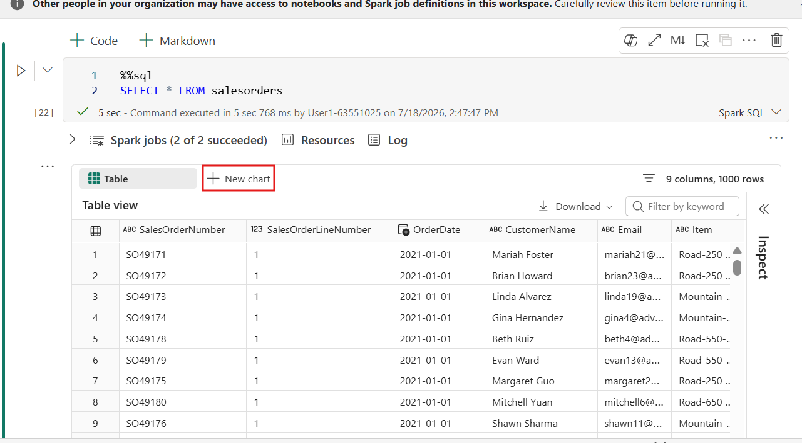

4.  在 **Keep top rows** 对话框中，输入 +++10000+++，然后选择 **OK**。


5.  在 **Explorer** 窗格中，右键单击 **dbo** 架构 **Tables** 文件夹中的 **dimension_city** 表，然后选择 **Insert into canvas**（也可以直接将表拖到画布上）。


6.  在 **transformations** 功能区中，选择 **Combine** 旁边的下拉菜单，然后选择 **Merge queries as new**。


7.  在 **Merge** 设置页面上输入以下信息，然后单击 **OK**：

- 在 **Left table for merge** 下拉列表中，选择 **dimension_city**。

- 在 **Right table for merge** 下拉列表中，选择 **fact_sale**（可使用水平和垂直滚动条）。

- 在 **dimension_city** 表中，选择标题行中的 **CityKey** 列名作为联接列。

- 在 **fact_sale** 表中，选择标题行中的 **CityKey** 列名作为联接列。

- 在 **Join kind** 中，选择 **Inner**。


8.  选中 **Merge** 步骤后，单击数据网格标题中 **fact_sale** 旁边的 **Expand** 按钮，选择 **TaxAmount**、**Profit** 和 **TotalIncludingTax** 列，然后选择 **OK**。


9.  在 **transformations** 功能区中，单击 **Transform** 旁边的下拉菜单，然后选择 **Group by**。


10. 在 **Group by** 页面上输入以下信息：

- 选择 **Advanced** 单选按钮。

- 在 **Group by** 下选择以下列：**Country**、**StateProvince**、**City**。

- 添加以下汇总列（每添加一列后，单击 **Add aggregation** 添加下一列）：

| **New column name** | **Operation** | **Column** |
|----|----|----|
| +++SumOfTaxAmount+++ | **Sum** | **TaxAmount** |
| +++SumOfProfit+++ | **Sum** | **Profit** |
| +++SumOfTotalIncludingTax+++ | **Sum** | **TotalIncludingTax** |

- 单击 **OK** 按钮。


11. 在 **Explorer** 中，转到 **Queries**，右键单击 **Visual query 1**，然后选择 **Rename**。


12. 输入 +++Sales Summary+++ 更改查询名称。按 **Enter** 键或单击选项卡外的任意位置保存更改。


13. 单击 **Home** 选项卡下的 **Refresh** 图标。


## 练习 7：使用笔记本分析数据

在本练习中，你将使用 T-SQL 笔记本查询仓库数据，并通过 Lakehouse 快捷方式和 Spark 笔记本分析数据。

### 任务 1：创建 T-SQL 笔记本

1.  在 **Home** 功能区上，打开 **New SQL query** 下拉列表，然后选择 **New SQL query in notebook**。


2.  在 **Explorer** 窗格中，选择 **Warehouses** 以显示 **WideWorldImporters** 仓库中的对象。

3.  若要生成用于浏览数据的 SQL 模板，请选择 **dimension_city** 表右侧的省略号 (**...**)，然后选择 **SELECT TOP 100**。


4.  若要运行此单元格中的 T-SQL 代码，请选择代码单元格的 **Run cell** 按钮。


5.  在结果窗格中查看查询结果。


### 任务 2：创建 Lakehouse 快捷方式并使用笔记本分析数据

1.  在左侧菜单中，选择 **Warehouse_Fabric@lab.LabInstance.Id** 工作区图标，然后选择工作区名称。


2.  选择 **+ New item**，以显示所有可用项类型的完整列表。

3.  在列表的 **Store data** 部分中，选择 **Lakehouse** 项类型。


4.  输入 +++Shortcut_Exercise+++ 作为 Lakehouse 名称，并取消选择 **Lakehouse schemas**。选择 **Create**。


5.  新的 Lakehouse 打开后，在登录页上选择 **New shortcut** 选项。


6.  在 **New shortcut** 窗口中，选择 **Microsoft OneLake** 选项。


7.  在 **Select a data source type** 窗口中，选择 **WideWorldImporters** 仓库，然后选择 **Next**。


8.  单击 **Connect**。


9.  在 **OneLake object** 浏览器中，展开 **Tables**，展开 **dbo** 架构，然后选中 **dimension_customer** 表的复选框。选择 **Next**。


10. 选择 **Create**。


11. 在 **Explorer** 窗格中，选择 **dimension_customer** 表以预览数据，并查看从仓库 **dimension_customer** 表检索到的数据。


12. 在 **dimension_customer** 表页面上，单击 **Analyze data with**，选择 **Notebook**，然后选择 **New notebook**，创建用于数据分析的新 Spark 笔记本。


13. 在 **Explorer** 窗格中，选择 **Lakehouses**。

14. 将 **dimension_customer** 表拖到打开的笔记本单元格中。


15. 请注意，笔记本单元格中添加了 **PySpark** 查询。该查询从 **Shortcut_Exercise.dimension_customer** 快捷方式获取前 **1,000 行**。这种笔记本体验与 Visual Studio Code 中的 Jupyter 笔记本体验类似，你也可以在 VS Code 中打开笔记本。


16. 在 **Home** 功能区上，选择 **Run all** 按钮。


## 练习 8：使用 SQL 查询编辑器创建跨仓库查询

在本练习中，你将学习如何使用 SQL 查询编辑器在多个仓库之间创建和运行 T-SQL 查询，包括将 Microsoft Fabric 中的 SQL 分析终结点和仓库的数据合并在一起。

### 任务 1：向 Explorer 添加多个仓库

1.  在笔记本页面上，从左侧导航菜单中选择 **WideWorldImporters** 仓库。


2.  在 **Explorer** 窗格中，选择 **+ Warehouses**。


3.  在 **OneLake catalog** 窗口中，选择 **Shortcut_Exercise** SQL 分析终结点，然后选择 **Confirm**。


4.  在 **Explorer** 窗格中，请注意 **Shortcut_Exercise** SQL 分析终结点现在可用。


### 任务 2：运行跨仓库查询

在此任务中，你将运行一个查询，将 WideWorldImporters 仓库与 Shortcut_Exercise SQL 分析终结点联接起来。

**注意：** 跨数据库查询使用 *database.schema.table* 三部分命名来引用对象。

1.  在功能区的 **Home** 选项卡上，选择 **New SQL query**。


2.  在查询编辑器中粘贴以下代码。此代码按库存项、说明和客户检索销售数量的汇总。

```sql
--Retrieve an aggregate of quantity sold by stock item, description, and customer.
SELECT
    Sales.StockItemKey,
    Sales.Description,
    c.Customer,
    SUM(CAST(Sales.Quantity AS int)) AS SoldQuantity
FROM
    [dbo].[fact_sale] AS Sales
INNER JOIN [Shortcut_Exercise].[dbo].[dimension_customer] AS c
    ON Sales.CustomerKey = c.CustomerKey
GROUP BY
    Sales.StockItemKey,
    Sales.Description,
    c.Customer;
```

3.  **运行**查询，并查看查询结果。


4.  重命名查询以便日后参考。在 **Explorer** 中右键单击 **SQL query**，然后选择 **Rename**。


5.  在 **Rename** 对话框的 **Name** 字段中，输入 +++Cross-warehouse query+++，然后单击 **Rename** 按钮。


## 练习 9：创建 Direct Lake 语义模型和 Power BI 报表

在本练习中，你将基于 WideWorldImporters 仓库创建 Direct Lake 语义模型，并构建 Power BI 报表。

### 任务 1：创建语义模型

1.  在 **WideWorldImporters** 页面的 **Home** 选项卡上，选择 **New semantic model**。


2.  在 **New semantic model** 窗口的 **Direct Lake semantic model name** 框中，输入 +++Sales Model+++。

3.  展开 **dbo** 架构，展开 **Tables** 文件夹，然后选中 **dimension_city** 和 **fact_sale** 表。选择 **Confirm**。


4.  从左侧导航中选择 **Warehouse_Fabric@lab.LabInstance.Id** 工作区。


5.  若要打开语义模型，请在工作区登录页上选择 **Sales Model** 语义模型。


6.  在 **Sales Model** 页面上，将模式从 **Viewing** 更改为 **Editing**，以便管理关系。


7.  若要创建关系，请在模型设计器的 **Home** 功能区上选择 **Manage relationships**。


8.  在 **Manage relationships** 窗口中，选择 **+ New relationship**。


9.  在 **New relationship** 窗口中，完成以下步骤以创建关系：

- 在 **From table** 下拉列表中，选择 **dimension_city** 表。

- 在 **To table** 下拉列表中，选择 **fact_sale** 表。

- 在 **Cardinality** 下拉列表中，选择 **One to many (1:\*)**。

- 在 **Cross-filter direction** 下拉列表中，选择 **Single**。

- 选中 **Assume referential integrity** 复选框。

- 选择 **Save**。


10. 在 **Manage relationships** 窗口中，选择 **Close**。


### 任务 2：创建 Power BI 报表

在此任务中，你将基于上一个任务创建的语义模型构建 Power BI 报表。

1.  在 **File** 功能区上，选择 **Create new report**。


2.  在报表设计器中，完成以下步骤以创建柱形图视觉对象：

- 在 **Data** 窗格中，展开 **fact_sale** 表，然后选中 **Profit** 字段。

- 在 **Data** 窗格中，展开 **dimension_city** 表，然后选中 **SalesTerritory** 字段。


3.  单击画布的空白区域，然后在 **Visualizations** 窗格中选择 **Azure Map** 视觉对象。


4.  在 **Data** 窗格中，将 **dimension_city** 表中的 **StateProvince** 字段拖到 **Visualizations** 窗格的 **Location** 区域。


5.  在 **Data** 窗格中，选中 **fact_sale** 表中的 **Profit** 字段，将其添加到地图视觉对象的 **Size** 区域。

6.  单击画布的空白区域，然后在 **Visualizations** 窗格中选择 **Table** 视觉对象。


7.  在 **Data** 窗格中，选中以下字段：

- **dimension_city** 表中的 **SalesTerritory**

- **dimension_city** 表中的 **StateProvince**

- **fact_sale** 表中的 **Profit**

- **fact_sale** 表中的 **TotalExcludingTax**


8.  确认已完成的报表页面设计与下图类似。


9.  若要保存报表，请在 **Home** 功能区上选择 **File** \> **Save**。


10. 在 **Save your report** 窗口的 **Enter a name for your report** 框中，输入 +++Sales Analysis+++，然后选择 **Save**。


## 练习 10：清理资源

你可以删除单个报表、管道、仓库和其他项，或删除整个工作区。请按照以下步骤删除你为本实验创建的工作区及其所有项。

1.  在导航菜单中选择 **Warehouse_Fabric@lab.LabInstance.Id**，返回工作区项列表。


2.  在工作区标题的菜单中，选择 **Workspace settings**。


3.  在 **Workspace settings** 对话框中，选择 **General**，然后选择 **Remove this workspace**。


4.  在 **Delete workspace?** 对话框中，单击 **Delete** 按钮。


**摘要**

在本实验中，你在 Microsoft Fabric 中为 Contoso 构建了一个完整的数据仓库环境。你首先创建了工作区和 WideWorldImporters 仓库，并使用复制作业加载了 Wide World Importers 示例数据。接着，你使用 T-SQL 在同一架构内和跨架构 (dbo1) 克隆了表，包括时间点克隆；创建并运行了存储过程，以生成 aggregate_sale_by_date_city 汇总表；并使用时间旅行查询比较了数据更新前后的结果。然后，你使用可视化查询生成器在无需编写代码的情况下合并和汇总数据，使用 T-SQL 笔记本和 Spark 笔记本分析数据，并通过 Lakehouse 快捷方式运行了跨仓库查询。最后，你创建了 Direct Lake 语义模型，构建了包含柱形图、地图和表格的 Power BI 销售分析报表，并清理了工作区资源。这些任务帮助你全面了解如何在 Microsoft Fabric 中设置、管理和分析数据。
