## Caso de uso 05: Creación de un Data Warehouse de ventas y geografía para Contoso en Microsoft Fabric
**Introducción**

Contoso, una empresa minorista multinacional, busca modernizar su
infraestructura de datos para mejorar el análisis de ventas y geografía.
Actualmente, sus datos de ventas y clientes se encuentran dispersos en
múltiples sistemas, lo que dificulta que sus analistas de negocio y
desarrolladores ciudadanos obtengan información útil. La empresa planea
consolidar estos datos en una plataforma unificada utilizando Microsoft
Fabric, con el objetivo de permitir consultas cruzadas, análisis de
ventas e informes geográficos.

En este laboratorio, usted asumirá el rol de ingeniero de datos en
Contoso, encargado de diseñar e implementar una solución de data
warehouse utilizando Microsoft Fabric. Comenzará configurando un
workspace de Fabric, creando un data warehouse, cargando datos desde
Azure Blob Storage y realizando tareas analíticas para entregar
información a los tomadores de decisiones de Contoso.

Aunque muchos conceptos de Microsoft Fabric pueden resultar familiares
para los profesionales de datos y análisis, aplicarlos en un entorno
nuevo puede ser un desafío. Este laboratorio ha sido diseñado para
guiarlo paso a paso a través de un escenario de principio a fin, desde
la adquisición de datos hasta su consumo, con el fin de construir una
comprensión básica de la experiencia de usuario de Microsoft Fabric, sus
diferentes entornos y puntos de integración, así como de las
experiencias profesionales y para desarrolladores ciudadanos dentro de
Microsoft Fabric.

**Objetivos**

- Configurar un workspace de Fabric con la versión de prueba habilitada.

- Establecer un nuevo Warehouse llamado WideWorldImporters en Microsoft
  Fabric.

- Cargar datos en el workspace Warehouse_FabricXX mediante un pipeline
  de Data Factory.

- Generar las tablas dimension_city **y** fact_sale dentro del data
  warehouse.

- Poblar las tablas dimension_city **y** fact_sale con datos
  provenientes de Azure Blob Storage.

- Crear clones de las tablas dimension_city **y** fact_sale en el
  Warehouse.

- Clonar las tablas dimension_city y fact_sale en el esquema dbo1.

- Desarrollar un stored procedure para transformar los datos y crear la
  tabla aggregate_sale_by_date_city.

- Generar consultas mediante el visual query builder para combinar y
  agregar datos.

- Utilizar un notebook para consultar y analizar datos de la tabla
  dimension**\_**customer.

- Incluir los warehouses WideWorldImporters y ShortcutExercise para
  realizar cross-querying.

- Ejecutar consultas T-SQL entre los warehouses WideWorldImporters y
  ShortcutExercise.

- Habilitar la integración de Azure Maps desde el Admin portal**.**

- Generar visualizaciones de column chart, map y table para el reporte
  Sales Analysis.

- Crear un reporte a partir del dataset WideWorldImporters en el OneLake
  data hub.

- Eliminar el workspace y todos los elementos asociados una vez
  finalizado el ejercicio.

# **Ejercicio 1: Crear un workspace de Microsoft Fabric**

## **Tarea 1: Iniciar sesión en la cuenta de Power BI y registrarse para la prueba gratuita de Microsoft Fabric**

1.  Abra su navegador, navegue hasta la barra de direcciones y escriba o
    pegue la siguiente URL: +++https://app.fabric.microsoft.com/+++ y
    luego presione el botón **Enter**.

> 

2.  En la ventana de **Microsoft Fabric**, ingrese las credenciales
    asignadas y haga clic en el botón **Submit** .

> 

3.  Luego, en la ventana de **Microsoft**, ingrese la contraseña y haga
    clic en el botón **Sign in**.

> 

4.  En la ventana **Stay signed in?** haga clic en el botón **Yes**.

> 

5.  Se le dirigirá a la página de inicio de Power BI.

> 

## Tarea 2: Crear un workspace

Antes de trabajar con datos en Fabric, cree un área de trabajo con la
versión de prueba de Fabric habilitada.

1.  En el panel **Workspaces**, seleccione **+** **New workspace**.

> 

2.  En la pestaña **Create a workspace,** ingrese los siguientes
    detalles y haga clic en el botón **Apply**.

    |  |  |
    |----|---|
    |Name	|+++Warehouse_FabricXXXX+++ (XXXX can be a unique number) |
    |Description	|This workspace contains all the artifacts for the data warehouse|
    |Advanced	Under License mode| select Fabric capacity|
    |Default storage format	|Small dataset storage format|

> 
>
> 

3.  Espere a que se complete la implementación. Tarda entre 1 y 2
    minutos en completarse. Cuando se abra el nuevo workspace, debería
    estar vacío.

> 

## Tarea 4: Crear un Warehouse en Microsoft Fabric

1.  En la página de **Fabric**, seleccione **+ New item** para crear un
    lakehouse y seleccione **Warehouse**.

> 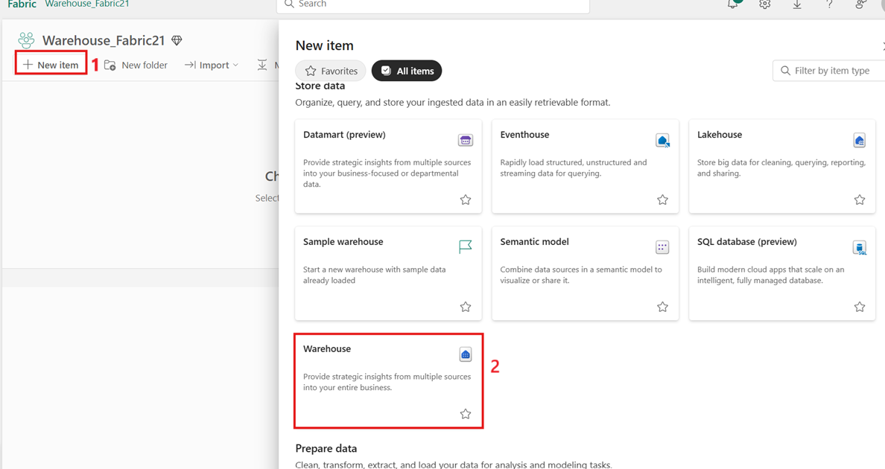

2.  En el cuadro de diálogo **New warehouse**, ingrese
    **+++WideWorldImporters+++** y haga clic en el botón **Create**.

> 

3.  Cuando se complete el aprovisionamiento, aparecerá la página de
    inicio del warehouse **WideWorldImporters**.

> 

# Ejercicio 2: Ingerir datos en un Warehouse en Microsoft Fabric

## Tarea 1: Ingerir datos en un Warehouse

1.  Desde la página de inicio del warehouse **WideWorldImporters**,
    seleccione **Warehouse_FabricXX** en el menú de navegación lateral
    izquierdo para volver a la lista de elementos del workspace.

> 

2.  En la página **Warehouse_FabricXX**, seleccione **+New item**.
    Luego, haga clic en **Data pipeline** para ver la lista completa de
    elementos disponibles debajo de **Get data**.

> 

3.  En el cuadro de diálogo **New pipeline**, en el campo **Name**,
    ingrese **+++Load Customer Data+++** y haga clic en el botón
    **Create**.

> 

4.  En la página **Load Customer Data**, navegue a la sección **Start
    building your data pipeline** y haga clic en **Pipeline activity**.

> 

5.  Navegue y seleccione **Copy data** en la sección **Move &
    transform**.

> 

6.  Seleccione la actividad recién creada **Copy data 1** desde el
    lienzo de diseño para configurarla.

> **Nota**: Arrastre la línea horizontal en el lienzo de diseño para
> tener una vista completa de las distintas funciones.
>
> 

7.  En la pestaña **General**, en el campo **Name,** ingrese +++**CD
    Load dimension_customer+++**.

> 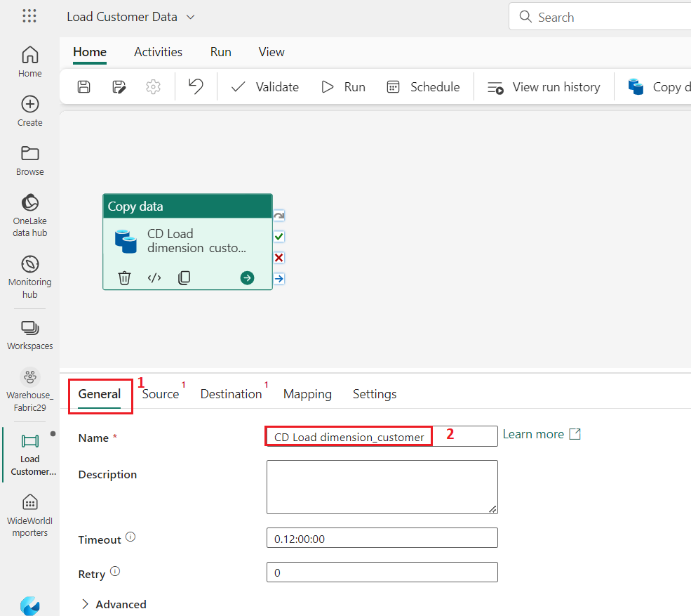

8.  En la página **Source**, seleccione el menú desplegable
    **Connection**. Haga clic en **More** para ver todas las fuentes de
    datos disponibles, incluidas las fuentes de datos en su OneLake
    local.

> 

9.  En la ventana **Get data**, busque **+++Azure Blobs+++**, luego haga
    clic en el botón **Azure Blob Storage**.

> 

10. En el panel **Connection settings** que aparece en el lado derecho,
    configure los siguientes ajustes y haga clic en el botón
    **Connect**.

- En **Account name or URL**, ingrese
  +++**https://fabrictutorialdata.blob.core.windows.net/sampledata/+++**

- En la sección **Connection credentials**, haga clic en el menú
  desplegable debajo de **Connection**, y luego seleccione **Create new
  connection**.

- En el campo **Connection name,** ingrese +++**Wide World Importers
  Public Sample+++**.

- Configure **Authentication kind** en **Anonymous**.


11. Cambie la configuración restante en la página **Source** de la
    actividad de copia de la siguiente manera para llegar a los archivos
    .parquet
    en **https://fabrictutorialdata.blob.core.windows.net/sampledata/WideWorldImportersDW/parquet/full/dimension_customer/\*.parquet**

12. En los cuadros de texto **File** **path**, ingrese:

- **Container:** +++**sampledata+++**

- **File path - Directory:** +++**WideWorldImportersDW/tables+++**

- **File path - File name:** +++**dimension_customer.parquet+++**

- En el desplegable **File format**, seleccione **Parquet** (si no puede
  ver **Parquet**, escríbalo en el cuadro de búsqueda y luego
  selecciónelo)


13. Haga clic en **Preview data** en el lado derecho de la configuración
    de **File path** para asegurarse de que no haya errores y luego haga
    clic en **Close**.

> 


14. En la pestaña **Destination**, ingrese la siguiente configuración.

    |  |  |
    |---|---|
    |Connection	|WideWorldImporters|
    |Table option	|select the Auto create table radio button.|
    |Data Warehouse|	Drop down, select WideWorldImporters from the list
    |Table	|•	In the first box enter +++dbo+++                                                                                                            •	In the second box enter +++dimension_customer+++|

> 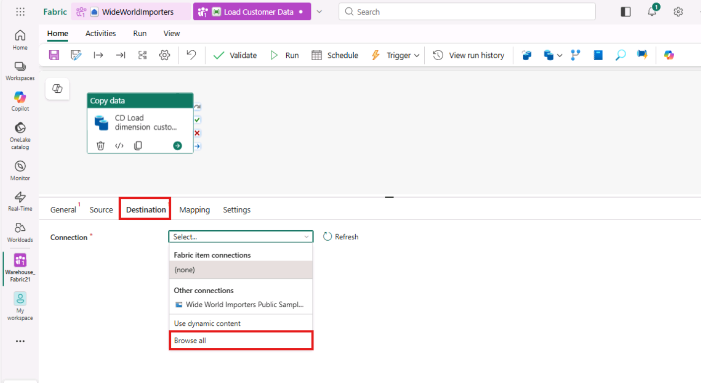

15. En la cinta de opciones, seleccione **Run** .

> 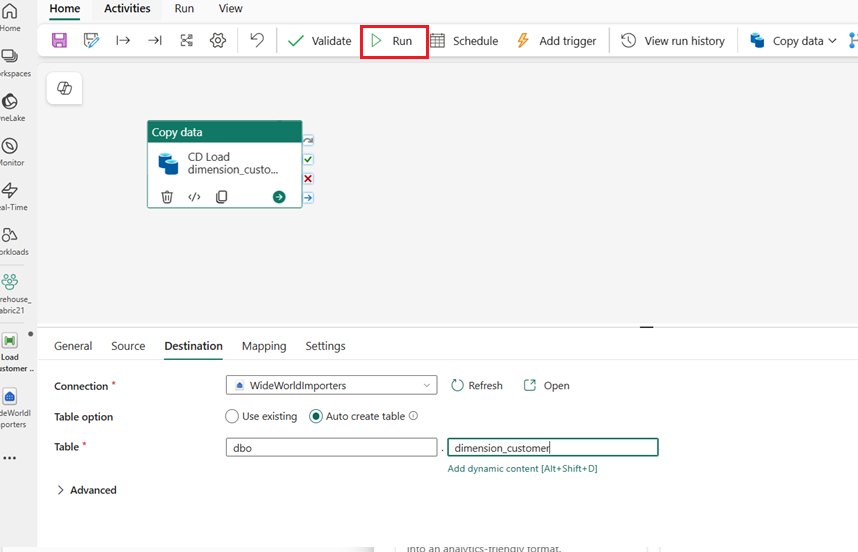

16. En el cuadro de diálogo **Save and run?** haga clic en el botón
    **Save and run**.

> 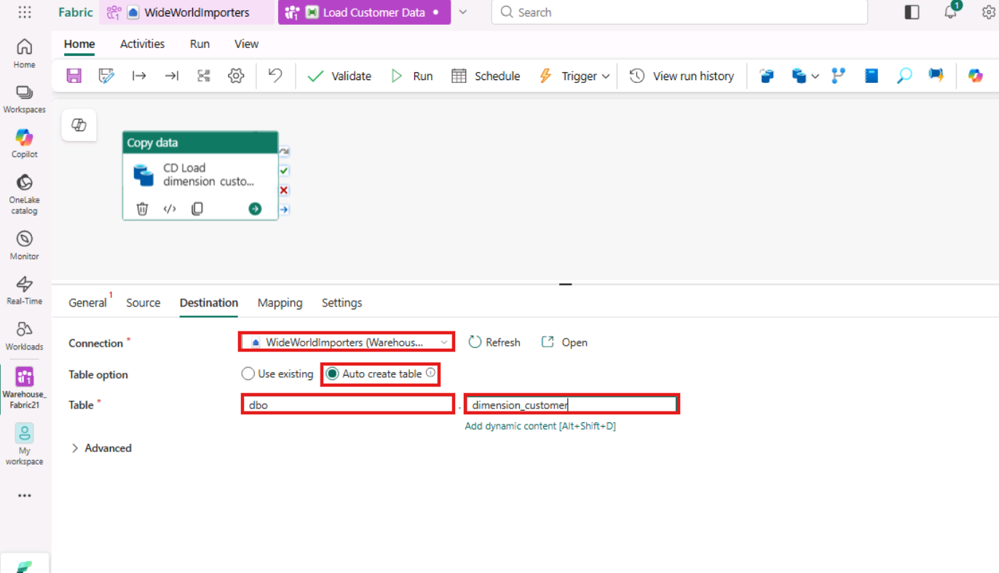
>
> 

17. Monitoree el progreso de la actividad Copy en la página **Output** y
    espere a que se complete.

> 

# Ejercicio 3: Crear tablas en un Data Warehouse 

## Tarea 1: Crear tabla en un Data Warehouse

1.  En la página **Load Customer Data**, haga clic en el workspace
    **Warehouse_FabricXX** en la barra de navegación izquierda.

> 

2.  En la página **Synapse Data Engineering Warehouse_FabricXX**,
    navegue con cuidado y haga clic en **WideWorldImporters**, que tiene
    el tipo **Warehouse**, como se muestra en la imagen a continuación.

> 

3.  En la página **WideWorldImporters**, vaya a la pestaña **Home**,
    seleccione **SQL** en el menú desplegable y haga clic en **New SQL
    query**.

> 

4.  En el editor de consultas, pegue el siguiente código y seleccione
    **Run** para ejecutar la consulta.

    ```
    /*
    1. Drop the dimension_city table if it already exists.
    2. Create the dimension_city table.
    3. Drop the fact_sale table if it already exists.
    4. Create the fact_sale table.
    */
    
    --dimension_city
    DROP TABLE IF EXISTS [dbo].[dimension_city];
    CREATE TABLE [dbo].[dimension_city]
        (
            [CityKey] [int] NULL,
            [WWICityID] [int] NULL,
            [City] [varchar](8000) NULL,
            [StateProvince] [varchar](8000) NULL,
            [Country] [varchar](8000) NULL,
            [Continent] [varchar](8000) NULL,
            [SalesTerritory] [varchar](8000) NULL,
            [Region] [varchar](8000) NULL,
            [Subregion] [varchar](8000) NULL,
            [Location] [varchar](8000) NULL,
            [LatestRecordedPopulation] [bigint] NULL,
            [ValidFrom] [datetime2](6) NULL,
            [ValidTo] [datetime2](6) NULL,
            [LineageKey] [int] NULL
        );
    
    --fact_sale
    
    DROP TABLE IF EXISTS [dbo].[fact_sale];
    
    CREATE TABLE [dbo].[fact_sale]
    
        (
            [SaleKey] [bigint] NULL,
            [CityKey] [int] NULL,
            [CustomerKey] [int] NULL,
            [BillToCustomerKey] [int] NULL,
            [StockItemKey] [int] NULL,
            [InvoiceDateKey] [datetime2](6) NULL,
            [DeliveryDateKey] [datetime2](6) NULL,
            [SalespersonKey] [int] NULL,
            [WWIInvoiceID] [int] NULL,
            [Description] [varchar](8000) NULL,
            [Package] [varchar](8000) NULL,
            [Quantity] [int] NULL,
            [UnitPrice] [decimal](18, 2) NULL,
            [TaxRate] [decimal](18, 3) NULL,
            [TotalExcludingTax] [decimal](29, 2) NULL,
            [TaxAmount] [decimal](38, 6) NULL,
            [Profit] [decimal](18, 2) NULL,
            [TotalIncludingTax] [decimal](38, 6) NULL,
            [TotalDryItems] [int] NULL,
            [TotalChillerItems] [int] NULL,
            [LineageKey] [int] NULL,
            [Month] [int] NULL,
            [Year] [int] NULL,
            [Quarter] [int] NULL
        );
    ```
> 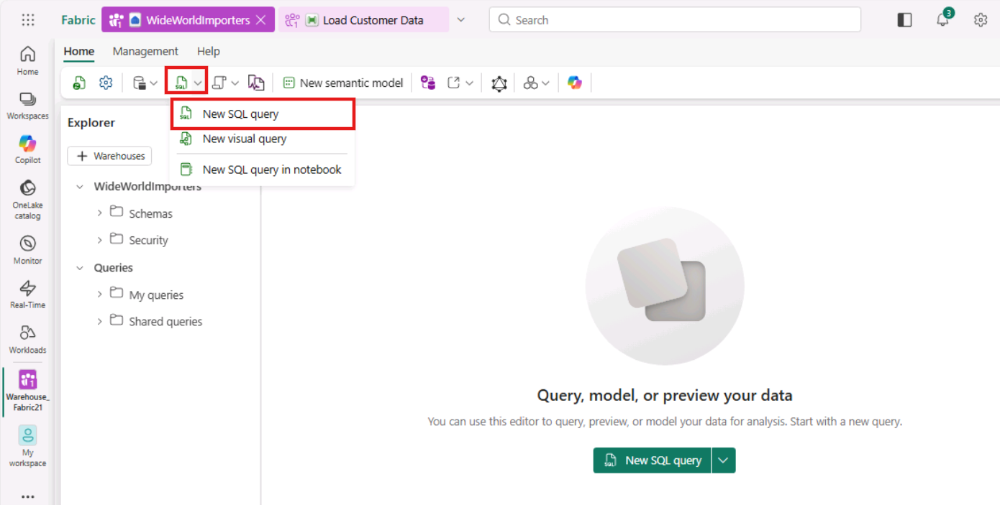
>
> 

5.  Para guardar esta consulta, haga clic derecho en la pestaña **SQL
    query 1** justo encima del editor y seleccione **Rename**.

> 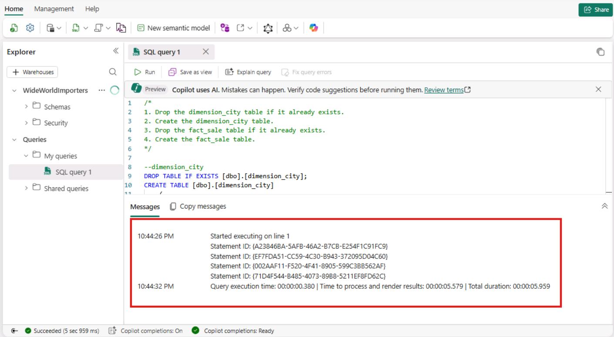

6.  En el cuadro de diálogo **Rename**, en el campo **Name**, ingrese
    +++**Create Tables+++** para cambiar el nombre de **SQL query 1**.
    Luego, haga clic en el botón **Rename**.

> 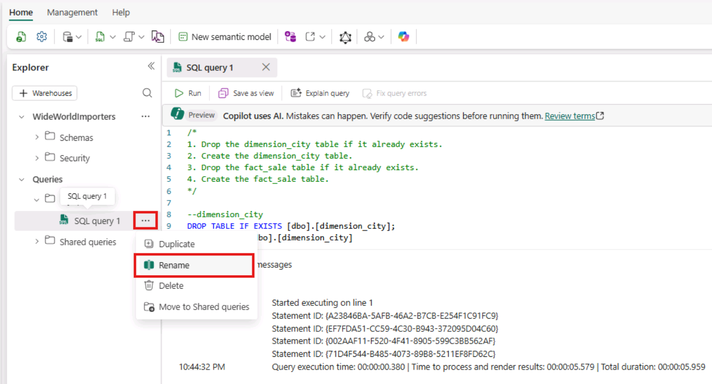

7.  Valide que la tabla se creó correctamente seleccionando el icono de
    **Refresh** en la cinta de opciones.

> 

8.  En el panel **Explorer**, verá las tablas **fact_sale** y
    **dimension_city**.

> 

## Tarea 2: Cargar datos usando T-SQL

Ahora que sabe cómo construir un data warehouse, cargar una tabla y
generar un reporte, es momento de ampliar la solución explorando otros
métodos para cargar datos.

1.  En la página de **WideWorldImporters**, vaya a la pestaña **Home**,
    seleccione **SQL** en el menú desplegable y haga clic en **New SQL
    query**.

> 

2.  En el editor de consultas, pegue el siguiente código y luego haga
    clic en **Run** para ejecutar la consulta.

    ```
    --Copy data from the public Azure storage account to the dbo.dimension_city table.
    COPY INTO [dbo].[dimension_city]
    FROM 'https://fabrictutorialdata.blob.core.windows.net/sampledata/WideWorldImportersDW/tables/dimension_city.parquet'
    WITH (FILE_TYPE = 'PARQUET');
    
    --Copy data from the public Azure storage account to the dbo.fact_sale table.
    COPY INTO [dbo].[fact_sale]
    FROM 'https://fabrictutorialdata.blob.core.windows.net/sampledata/WideWorldImportersDW/tables/fact_sale.parquet'
    WITH (FILE_TYPE = 'PARQUET');
    
    ```
> 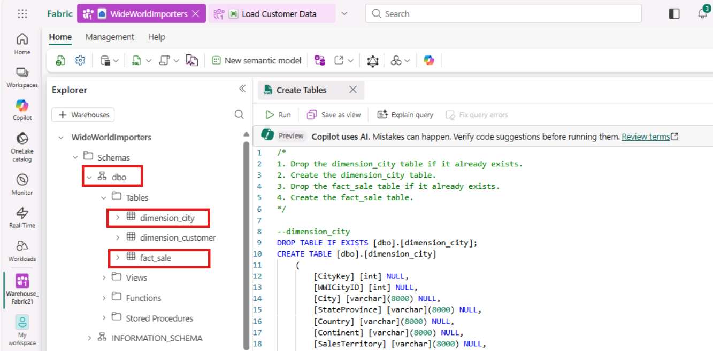

3.  Una vez que se complete la consulta, revise los mensajes, los cuales
    indican el número de filas que se cargaron en las tablas
    **dimension_city** y **fact_sale**, respectivamente.

> 

4.  Cargue la vista previa de los datos para validar que la información
    se haya cargado correctamente, seleccionando la tabla **fact_sale**
    en el **Explorer**.

> 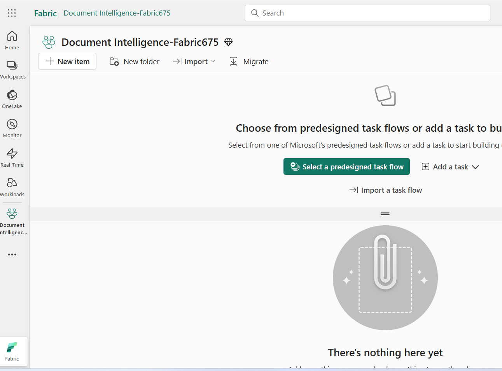

5.  Cambie el nombre de la consulta. Haga clic derecho en **SQL query
    1** en el **Explorer** y luego seleccione **Rename**.

> 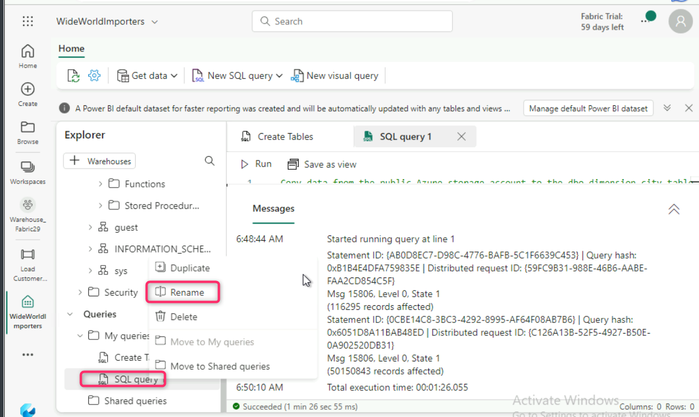

6.  En el cuadro de diálogo **Rename**, en el campo **Name**, ingrese
    +++**Load Tables+++**. Luego, haga clic en el botón **Rename**.

> 

7.  Haga clic en el icono **Refresh** en la barra de comandos debajo de
    la pestaña **Home**.

> 

# Ejercicio 4: Clonar una tabla usando T-SQL en Microsoft Fabric

## Tarea 1: Crear un clon de tabla dentro del mismo esquema en un warehouse

Esta tarea le guía para crear un [clon de
tabla](https://learn.microsoft.com/en-in/fabric/data-warehouse/clone-table) en
un Warehouse en Microsoft Fabric, utilizando la sintaxis T-SQL [CREATE
TABLE AS CLONE
OF](https://learn.microsoft.com/en-us/sql/t-sql/statements/create-table-as-clone-of-transact-sql?view=fabric&preserve-view=true).

1.  Crear un clon de tabla dentro del mismo esquema en un warehouse.

2.  En la página de **WideWorldImporters**, vaya a la pestaña **Home**,
    seleccione **SQL** en el menú desplegable y haga clic en **New SQL
    query**.

> 

3.  En el editor de consultas, pegue el siguiente código para crear
    clones de las tablas **dbo.dimension_city** y **dbo.fact_sale**.

    ```
    --Create a clone of the dbo.dimension_city table.
    CREATE TABLE [dbo].[dimension_city1] AS CLONE OF [dbo].[dimension_city];
    
    --Create a clone of the dbo.fact_sale table.
    CREATE TABLE [dbo].[fact_sale1] AS CLONE OF [dbo].[fact_sale];
    ```
> 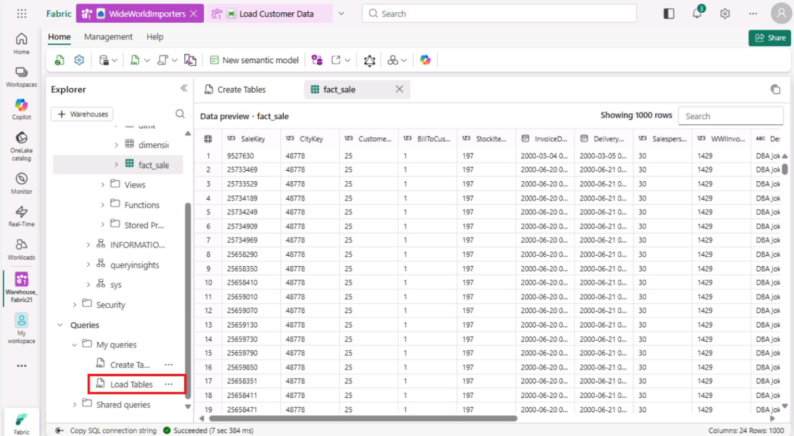

4.  Seleccione **Run** para ejecutar la consulta. La ejecución tomará
    unos segundos. Una vez completada, se crearán los clones de tabla
    **dimension_city1** y **fact_sale1**.

> 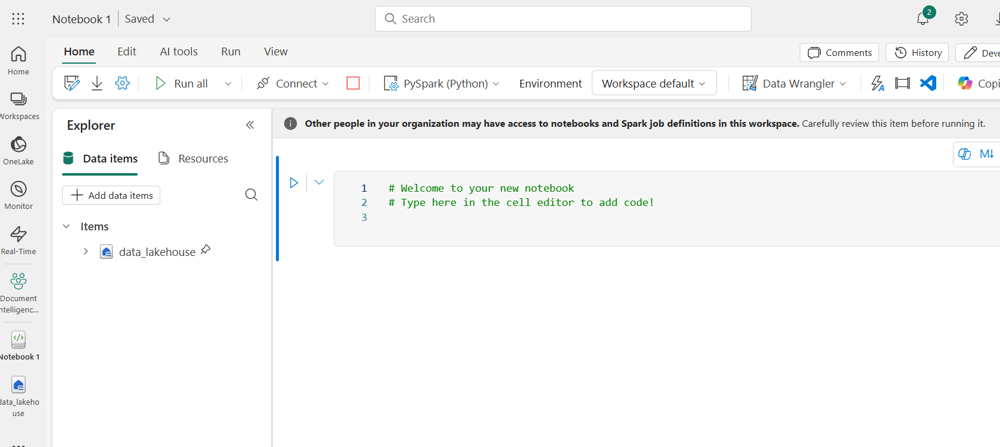
>
> 

5.  Cargue la vista previa de los datos para validar que se hayan
    cargado correctamente, seleccionando la tabla **dimension_city1** en
    el **Explorer**.

> 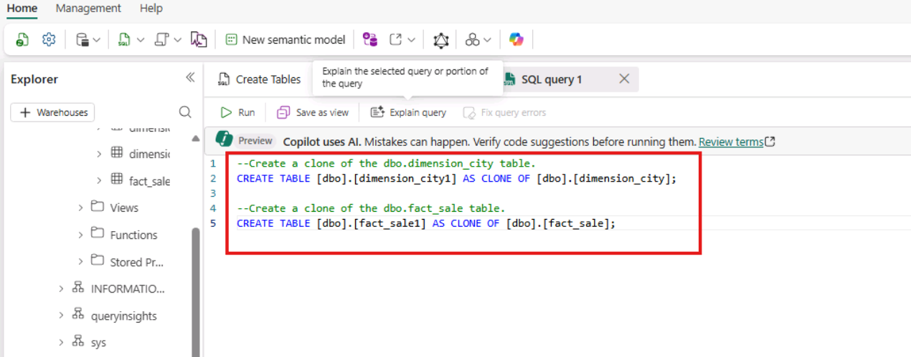

6.  Haga clic derecho en la **SQL query** que creó para clonar las
    tablas en el **Explorer** y seleccione **Rename**.

> 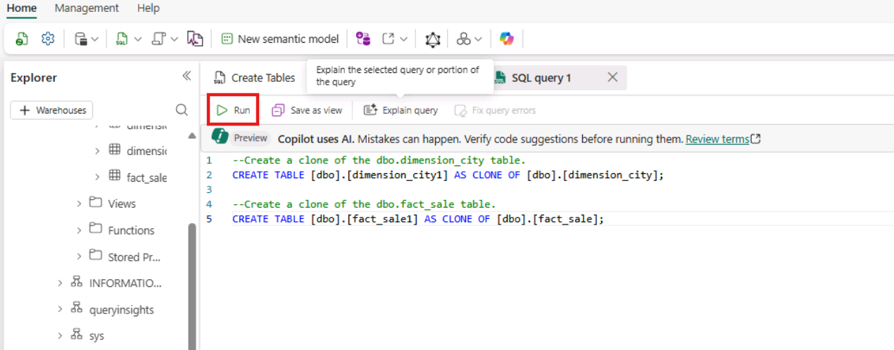

7.  En el cuadro de diálogo **Rename**, en el campo **Name**, ingrese
    **+++Clone Table+++** y luego haga clic en el botón **Rename**.

> 

8.  Haga clic en el icono **Refresh** en la barra de comandos debajo de
    la pestaña **Home**.

> 

## Tarea 2: Crear un clon de tabla entre esquemas dentro del mismo warehouse

1.  En la página de **WideWorldImporters**, vaya a la pestaña **Home**,
    seleccione **SQL** en el menú desplegable y haga clic en **New SQL
    query**.

> 

2.  Cree un nuevo esquema dentro del warehouse **WideWorldImporters**
    llamado **dbo1**. **Copie**, **pegue** y **ejecute** el siguiente
    código T-SQL tal como se muestra en la imagen a continuación:

    +++CREATE SCHEMA dbo1+++

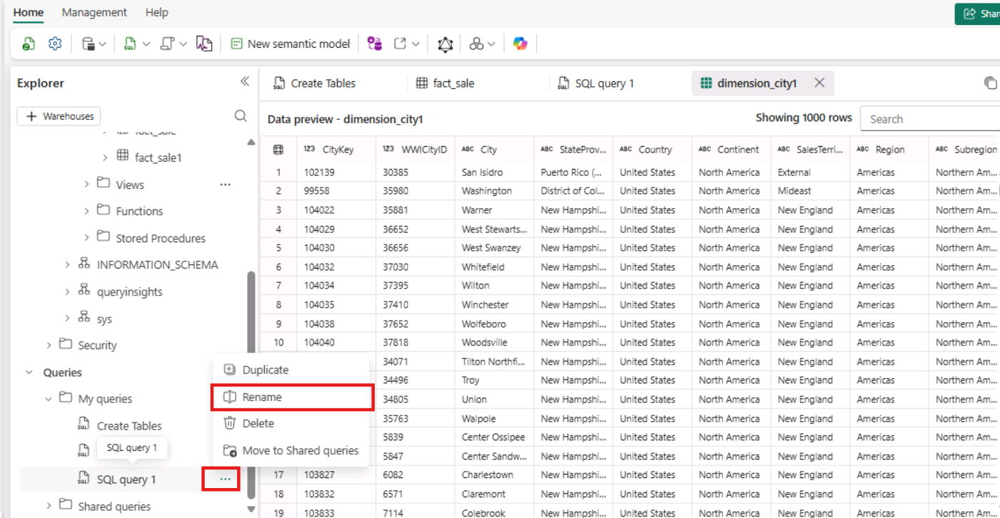

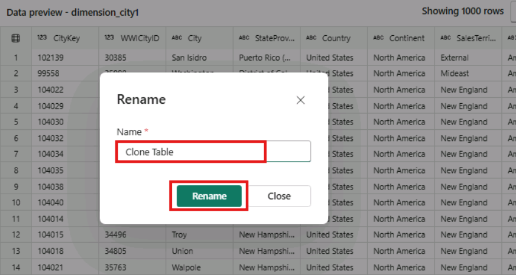

3.  En el editor de consultas, elimine el código existente y pegue el
    siguiente para crear clones de las tablas **dbo.dimension_city** y
    **dbo.fact_sale** en el esquema **dbo1**.

> **SQLCopy**
    ```
    --Create a clone of the dbo.dimension_city table in the dbo1 schema.
    CREATE TABLE [dbo1].[dimension_city1] AS CLONE OF [dbo].[dimension_city];
    
    --Create a clone of the dbo.fact_sale table in the dbo1 schema.
    CREATE TABLE [dbo1].[fact_sale1] AS CLONE OF [dbo].[fact_sale];
    ```

4.  Seleccione **Run** para ejecutar la consulta. La ejecución de la
    consulta tomará unos segundos.

> 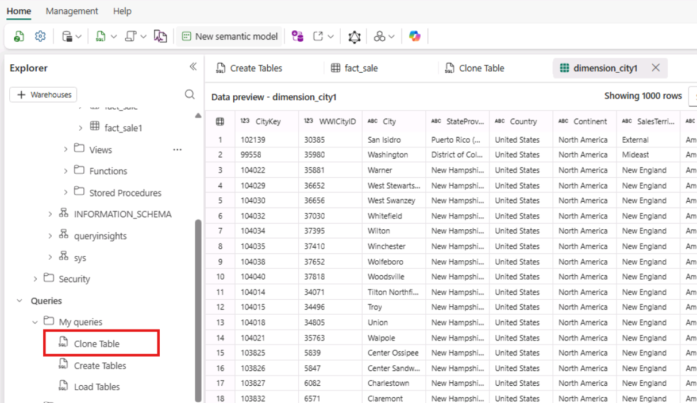

5.  Una vez que la consulta se complete, se habrán creado los clones
    **dimension_city1** y **fact_sale1** en el esquema **dbo1**.

> 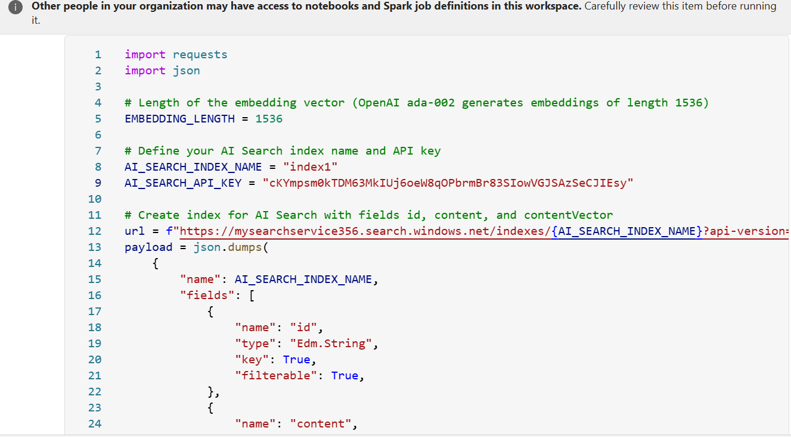

6.  Cargue la vista previa de los datos para validar que se hayan
    cargado correctamente, seleccionando la tabla **dimension_city1**
    bajo el esquema **dbo1** en el **Explorer**.

> 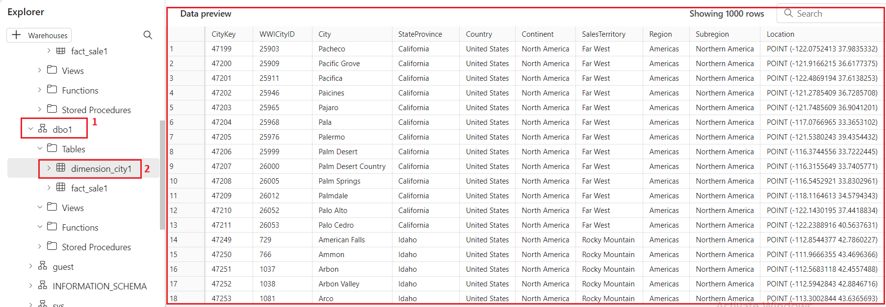

7.  **Cambie el nombre** de la consulta para referencia posterior. Haga
    clic derecho sobre **SQL query 1** en el **Explorer** y seleccione
    **Rename**.

> 

8.  En el cuadro de diálogo **Rename**, en el campo **Name**, ingrese
    **+++Clone Table in another schema+++**, luego haga clic en el botón
    **Rename**.

> 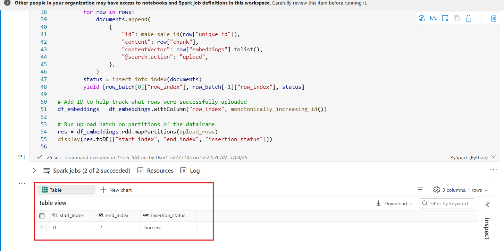

9.  Haga clic en el icono **Refresh** en la barra de comandos debajo de
    la pestaña **Home**.

> 

# Ejercicio 5: Transformar datos usando un procedimiento almacenado

Aprenda cómo crear y guardar un nuevo procedimiento almacenado para
transformar datos.

1.  En la página de **WideWorldImporters**, vaya a la pestaña **Home**,
    seleccione **SQL** en el menú desplegable y haga clic en **New SQL
    query**.

> 

2.  En el editor de consultas, pegue el siguiente código para crear el
    procedimiento almacenado **dbo.populate_aggregate_sale_by_city**.
    Este procedimiento almacenado creará y llenará la tabla
    **dbo.aggregate_sale_by_date_city** en un paso posterior.

    ```
    --Drop the stored procedure if it already exists.
    DROP PROCEDURE IF EXISTS [dbo].[populate_aggregate_sale_by_city]
    GO
    
    --Create the populate_aggregate_sale_by_city stored procedure.
    CREATE PROCEDURE [dbo].[populate_aggregate_sale_by_city]
    AS
    BEGIN
        --If the aggregate table already exists, drop it. Then create the table.
        DROP TABLE IF EXISTS [dbo].[aggregate_sale_by_date_city];
        CREATE TABLE [dbo].[aggregate_sale_by_date_city]
            (
                [Date] [DATETIME2](6),
                [City] [VARCHAR](8000),
                [StateProvince] [VARCHAR](8000),
                [SalesTerritory] [VARCHAR](8000),
                [SumOfTotalExcludingTax] [DECIMAL](38,2),
                [SumOfTaxAmount] [DECIMAL](38,6),
                [SumOfTotalIncludingTax] [DECIMAL](38,6),
                [SumOfProfit] [DECIMAL](38,2)
            );
    
        --Reload the aggregated dataset to the table.
        INSERT INTO [dbo].[aggregate_sale_by_date_city]
        SELECT
            FS.[InvoiceDateKey] AS [Date], 
            DC.[City], 
            DC.[StateProvince], 
            DC.[SalesTerritory], 
            SUM(FS.[TotalExcludingTax]) AS [SumOfTotalExcludingTax], 
            SUM(FS.[TaxAmount]) AS [SumOfTaxAmount], 
            SUM(FS.[TotalIncludingTax]) AS [SumOfTotalIncludingTax], 
            SUM(FS.[Profit]) AS [SumOfProfit]
        FROM [dbo].[fact_sale] AS FS
        INNER JOIN [dbo].[dimension_city] AS DC
            ON FS.[CityKey] = DC.[CityKey]
        GROUP BY
            FS.[InvoiceDateKey],
            DC.[City], 
            DC.[StateProvince], 
            DC.[SalesTerritory]
        ORDER BY 
            FS.[InvoiceDateKey], 
            DC.[StateProvince], 
            DC.[City];
    END
    ```
> 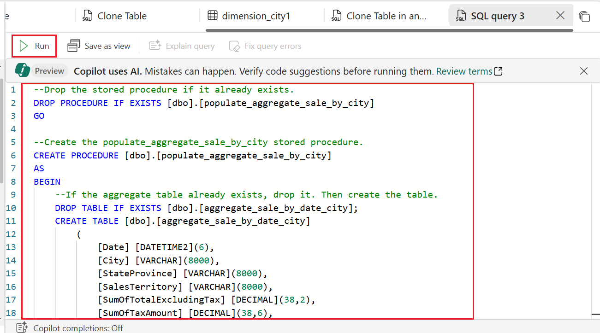
>
> 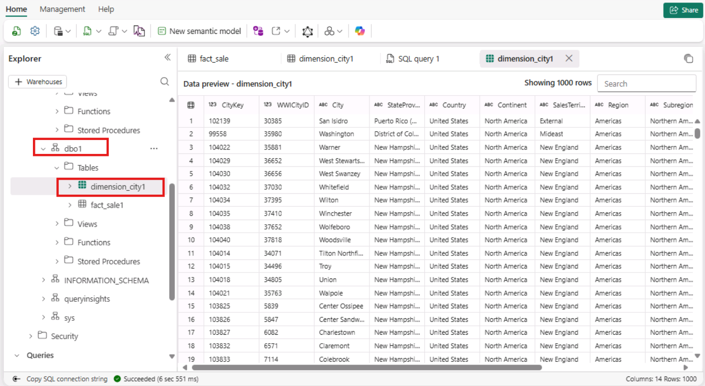

3.  Haga clic derecho sobre la **SQL query** que creó para clonar las
    tablas en el **Explorer** y seleccione **Rename**.

> 

4.  En el cuadro de diálogo **Rename**, en el campo **Name**, escriba
    **+++Create Aggregate Procedure+++** y luego haga clic en el botón
    **Rename**.

> 

5.  Haga clic en el icono **Refresh** debajo de la pestaña **Home**.

> 

6.  En la pestaña **Explorer**, verifique que pueda ver el procedimiento
    almacenado recién creado expandiendo el nodo **StoredProcedures**
    debajo el esquema **dbo**.

> 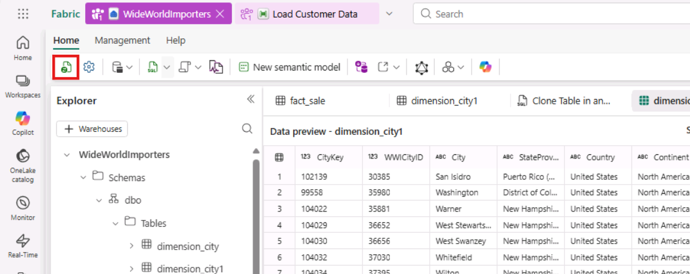

7.  En la página **WideWorldImporters**, vaya a la pestaña **Home**,
    seleccione **SQL** en el menú desplegable y haga clic en **New SQL
    query**.

> 

8.  En el editor de consultas, pegue el siguiente código. Este T-SQL
    ejecuta **dbo.populate_aggregate_sale_by_city** para crear la tabla
    **dbo.aggregate_sale_by_date_city**. Luego, haga clic en **Run**
    para ejecutar la consulta.

SQLCopy

    ```
    --Execute the stored procedure to create the aggregate table.
    EXEC [dbo].[populate_aggregate_sale_by_city];
    ```
> 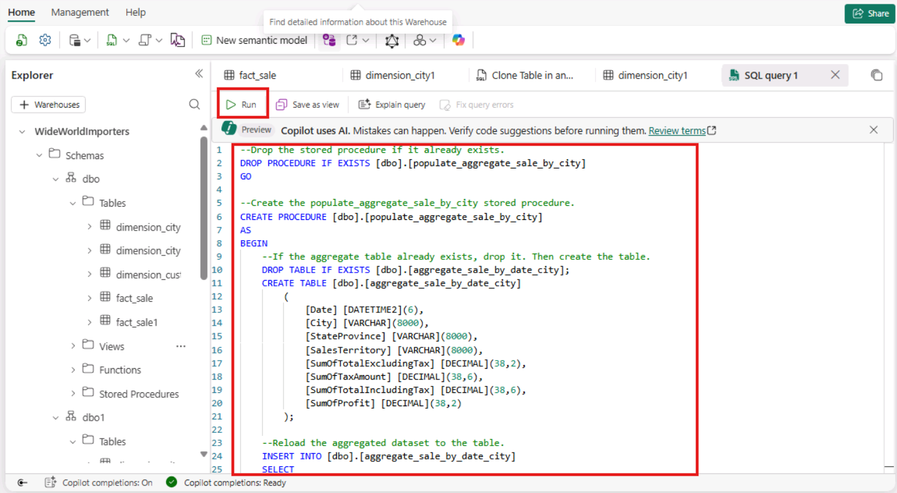

9.  Para guardar esta consulta para referencia futura, haga clic derecho
    en la pestaña de la consulta justo encima del editor y seleccione
    **Rename**.


10. En el cuadro de diálogo **Rename**, en el campo **Name**, ingrese
    **+++Run Create Aggregate Procedure+++** y luego haga clic en el
    botón **Rename**.

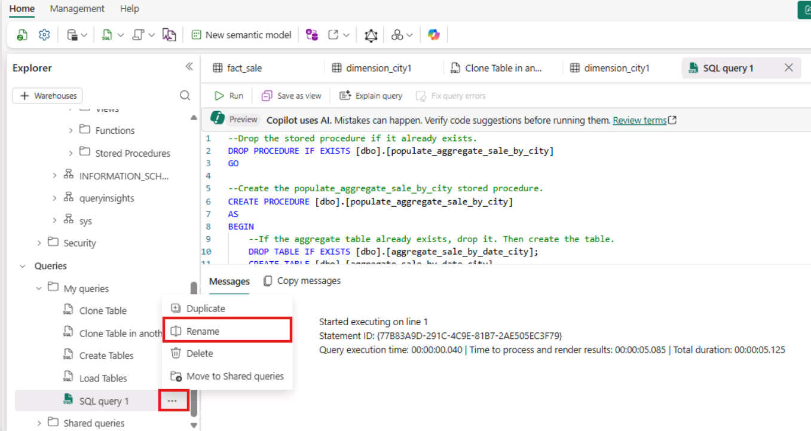

11. Seleccione el icono **Refresh** en la cinta de opciones.


12. En la pestaña **Object Explorer**, cargue la vista previa de los
    datos para validar que se hayan cargado correctamente, seleccionando
    la tabla **aggregate_sale_by_city** en el **Explorer**.


Ejercicio 6: Time travel usando T-SQL a nivel de instrucción

1.  En la página **WideWorldImporters**, vaya a la pestaña **Home**,
    seleccione **SQL** en el menú desplegable y haga clic en **New SQL
    query**.

> 

2.  En el editor de consultas, pegue el siguiente código para crear la
    vista Top10CustomerView. Seleccione **Run** para ejecutar la
    consulta.
    ```
    CREATE VIEW dbo.Top10CustomersView
    AS
    SELECT TOP (10)
        FS.[CustomerKey],
        DC.[Customer],
        SUM(FS.TotalIncludingTax) AS TotalSalesAmount
    FROM
        [dbo].[dimension_customer] AS DC
    INNER JOIN
        [dbo].[fact_sale] AS FS ON DC.[CustomerKey] = FS.[CustomerKey]
    GROUP BY
        FS.[CustomerKey],
        DC.[Customer]
    ORDER BY
        TotalSalesAmount DESC;
    ```
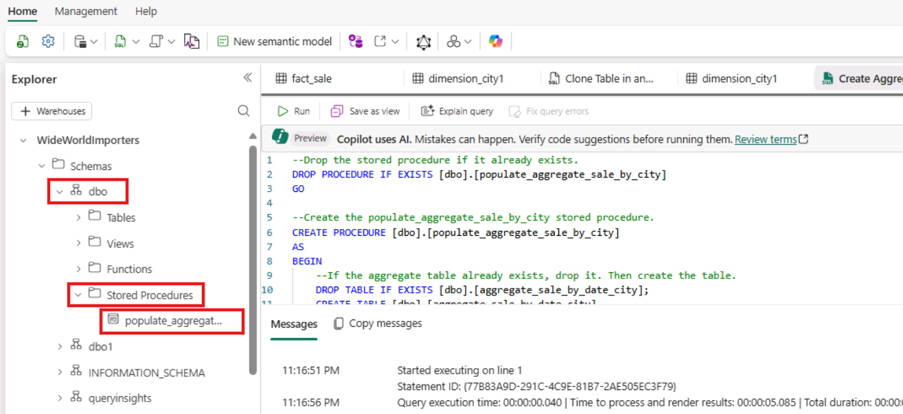

3.  En el **Explorer**, verifique que pueda ver la nueva vista
    **Top10CustomersView** expandiendo el nodo **Views** bajo el esquema
    dbo.

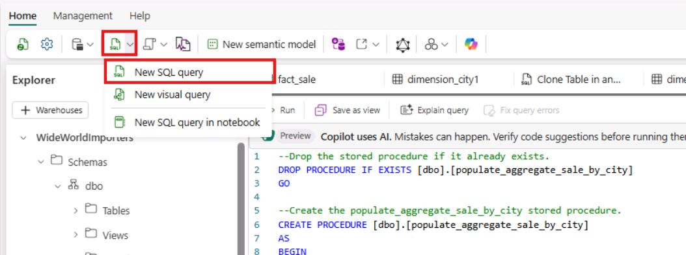

4.  Para guardar esta consulta como referencia, haga clic derecho en la
    pestaña de la consulta justo encima del editor y seleccione
    **Rename**.

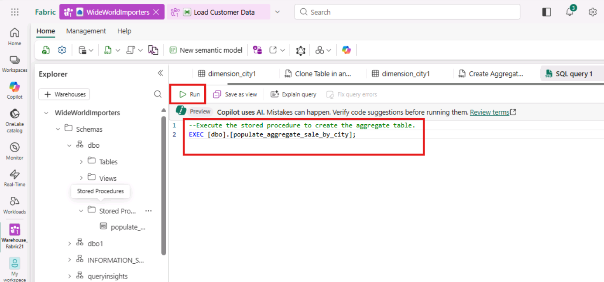

5.  En el cuadro de diálogo **Rename**, en el campo **Name**, ingrese
    **+++Top10CustomersView+++** y luego haga clic en el botón
    **Rename**.

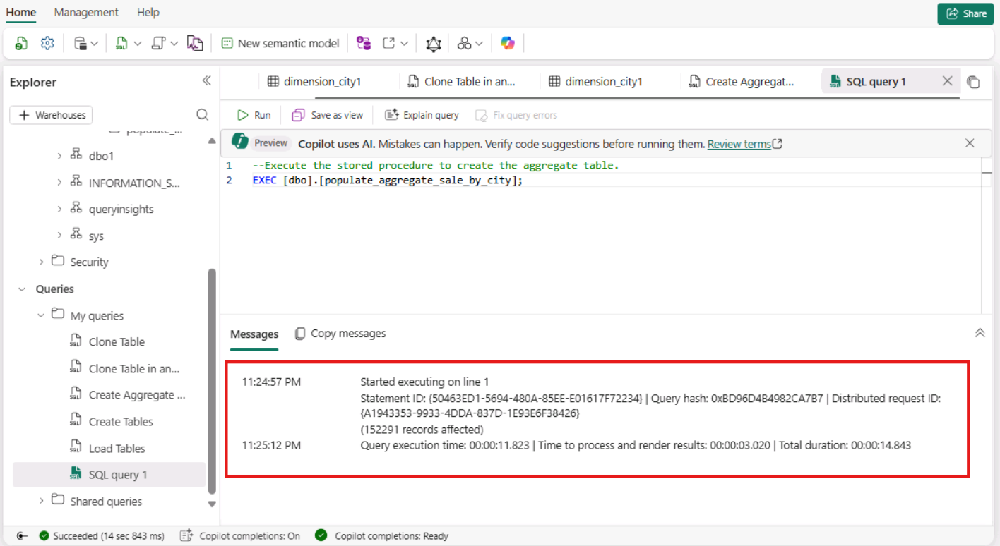

6.  Cree una nueva consulta, de manera similar al Paso 1. En la pestaña
    **Home** de la cinta, seleccione **New SQL query**.


7.  En el editor de consultas, pegue el siguiente código. Esto
    actualizará el valor de la columna **TotalIncludingTax** a
    **200000000** para el registro que tiene el valor **SaleKey** igual
    a **22632918**. Seleccione **Run** para ejecutar la consulta.

SQLCopy

    ```
    /*Update the TotalIncludingTax value of the record with SaleKey value of 22632918*/
    UPDATE [dbo].[fact_sale]
    SET TotalIncludingTax = 200000000
    WHERE SaleKey = 22632918;
    ```


8.  En el editor de consultas, pegue el siguiente código. La función
    T-SQL CURRENT_TIMESTAMP devuelve la marca de tiempo UTC actual como
    un valor **datetime**. Seleccione **Run** para ejecutar la consulta.

    ```
    SELECT CURRENT_TIMESTAMP;
    ```


9.  Copie el valor de la marca de tiempo devuelto en su portapapeles.


10. Pegue el siguiente código en el editor de consultas y reemplace el
    valor de timestamp con el valor de marca de tiempo (timestamp)
    obtenido en el paso anterior. El formato de la sintaxis de timestamp
    es YYYY-MM-DDTHH:MM:SS\[.FFF\].

  **YYYY-MM-DDTHH:MM:SS\[.FFF\].**

11. Elimine los ceros finales, por ejemplo: **2025-06-09T06:16:08.807**.

12. El siguiente ejemplo devuelve la lista de los diez principales
    clientes por **TotalIncludingTax**, incluyendo el nuevo valor para
    **SaleKey 22632918**. Reemplace el código existente, pegue el
    siguiente código y seleccione **Run** para ejecutar la consulta.

    SQLCopy
    ```
    /*View of Top10 Customers as of today after record updates*/
    SELECT *
    FROM [WideWorldImporters].[dbo].[Top10CustomersView]
    OPTION (FOR TIMESTAMP AS OF '2025-06-09T06:16:08.807');
    ```


14. Pegue el siguiente código en el editor de consultas y reemplace el
    valor de timestamp por un momento anterior a la ejecución del script
    de actualización de **TotalIncludingTax**. Esto devolverá la lista
    de los diez principales clientes *antes* de que se actualizara el
    valor de **TotalIncludingTax** para **SaleKey** 22632918. Seleccione
    **Run** para ejecutar la consulta.
    ```
    /*View of Top10 Customers as of today before record updates*/
    SELECT *
    FROM [WideWorldImporters].[dbo].[Top10CustomersView]
    OPTION (FOR TIMESTAMP AS OF '2024-04-24T20:49:06.097');
    ```

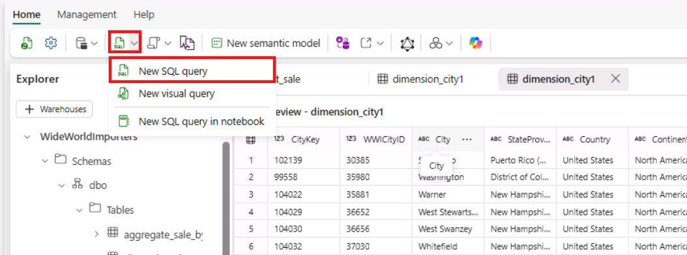

# Exercise 7: Crear una consulta con el generador de consultas visual

## Tarea 1: Usar el generador visual de consultas 

Cree y guarde una consulta con el generador visual de consultas en el
portal de Microsoft Fabric.

1.  En la página **WideWorldImporters**, desde la pestaña **Home** de la
    cinta, seleccione **New visual query**.

> 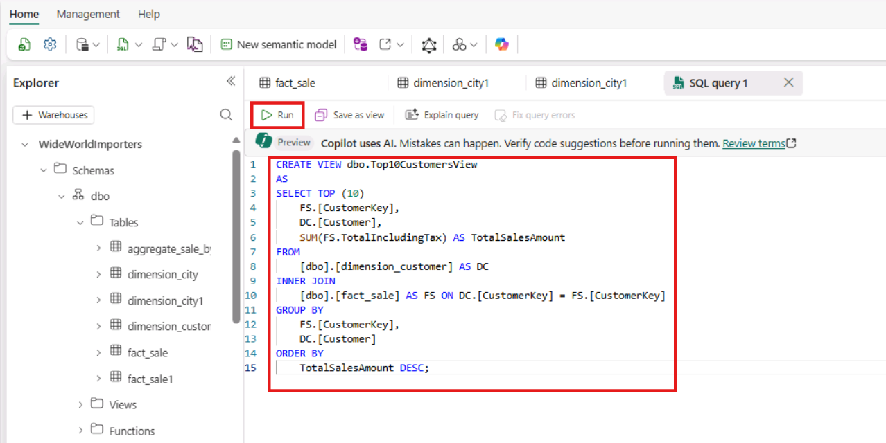

2.  Haga clic derecho sobre **fact_sale** y seleccione **Insert into
    canvas**.

> 
>
> 

3.  Navegue a la pestaña **Transformations** de la cinta en el panel de
    diseño de consultas y limite el tamaño del conjunto de datos
    haciendo clic en el menú desplegable **Reduce rows**, luego haga
    clic en **Keep top rows** como se muestra en la imagen a
    continuación.

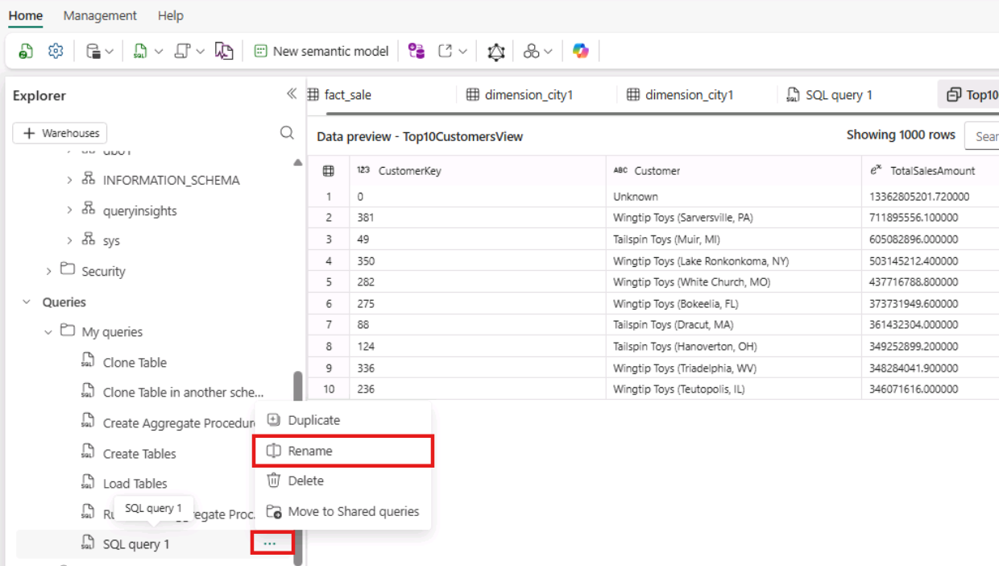

4.  En el cuadro de diálogo **Keep top rows**, ingrese **10000** y
    seleccione **OK**.

> 
>
> 

5.  Haga clic derecho sobre **dimension_city** y seleccione **Insert
    into canvas**.

> 
>
> 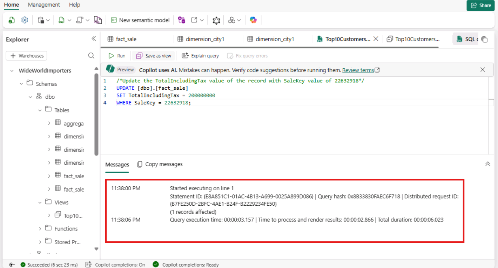

6.  Desde la cinta **Transformations**, seleccione el menú desplegable
    junto a **Combine** y seleccione **Merge queries as new** como se
    muestra en la imagen a continuación.


7.  En la página **Merge settings**, ingrese los siguientes detalles.

- En el menú desplegable **Left table for merge**,
  seleccione **dimension_city**

&nbsp;

- En el menú desplegable **Right table for merge**,
  seleccione **fact_sale** (utilice las barras de desplazamiento
  horizontal y vertical)

&nbsp;

- Seleccione el campo **CityKey** en la tabla **dimension_city**
  haciendo clic en el nombre de la columna en la fila del encabezado
  para indicar la columna de unión.

&nbsp;

- Seleccione el campo **CityKey** en la tabla **fact_sale** haciendo
  clic en el nombre de la columna en la fila del encabezado para indicar
  la columna de unión.

&nbsp;

- En la selección del diagrama **Join kind**, seleccione **Inner** y
  haga clic en el botón **OK**.

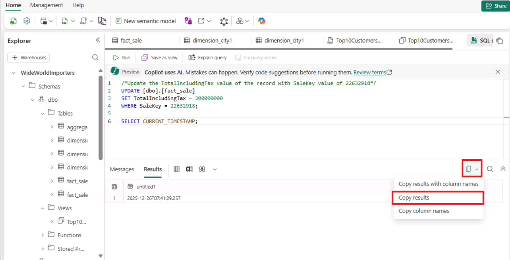


8.  Con el paso **Merge** seleccionado, haga clic en el botón **Expand**
    junto a **fact_sale** en el encabezado de la cuadrícula de datos
    como se muestra en la imagen a continuación, luego seleccione las
    columnas **TaxAmount**, **Profit**, **TotalIncludingTax** y
    seleccione **OK**.

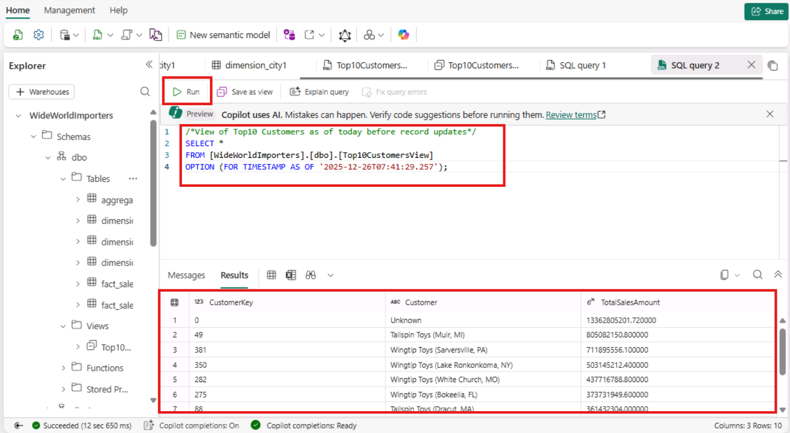

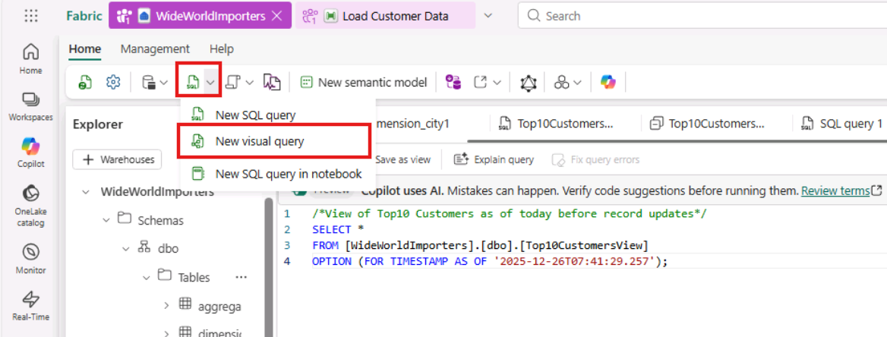

9.  En la cinta **Transformations**, haga clic en el menú desplegable
    junto a **Transform**, luego seleccione **Group by**.

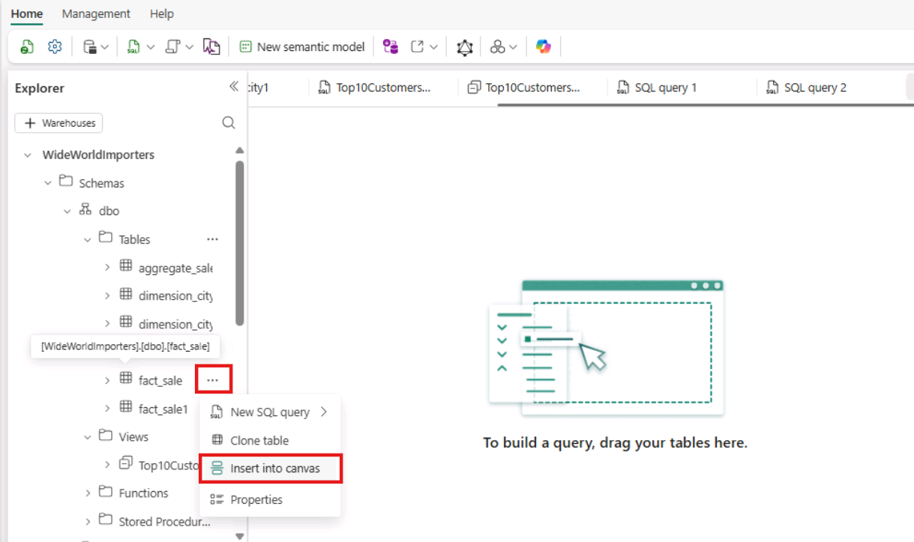

10. En la página **Group by settings**, ingrese los siguientes detalles.

- Seleccione el botón de opción **Advanced**.

- Debajo **Group by**, seleccione lo siguiente:

  1.  **Country**

  2.  **StateProvince**

  3.  **City**

- En **New column name**, ingrese **SumOfTaxAmount**; en el campo
  **Operation**, seleccione **Sum**, luego en el campo **Column**,
  seleccione **TaxAmount**. Haga clic en **Add aggregation** para
  agregar más columnas y operaciones agregadas.

- En **New column name**, ingrese **SumOfProfit**; en el campo
  **Operation**, seleccione **Sum**, luego en el campo **Column**,
  seleccione **Profit**. Haga clic en **Add aggregation** para agregar
  más columnas y operaciones agregadas.

- En **New column name**, ingrese **SumOfTotalIncludingTax**; en el
  campo **Operation**, seleccione **Sum**, luego en el campo **Column**,
  seleccione **TotalIncludingTax.** 

- Haga clic en el botón **OK**.

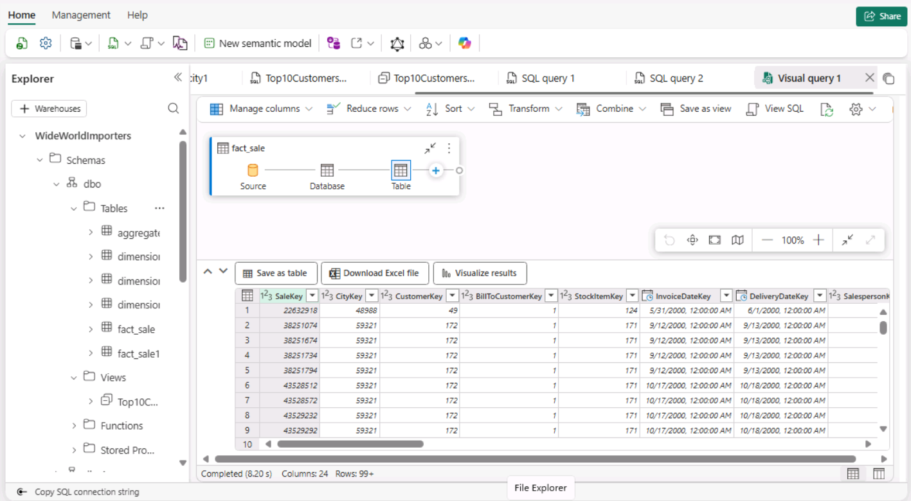

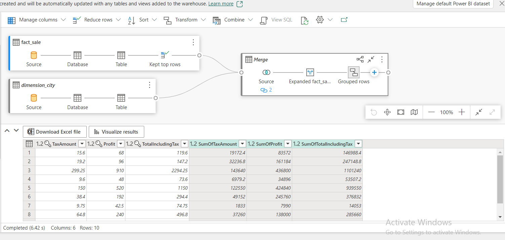

11. En el **explorer**, navegue a **Queries** y haga clic derecho sobre
    **Visual query 1** bajo **Queries**. Luego, seleccione **Rename**.

> 

12. Escriba **+++Sales Summary+++** para cambiar el nombre de la
    consulta. Presione **Enter** en el teclado o seleccione cualquier
    lugar fuera de la pestaña para guardar el cambio.

> 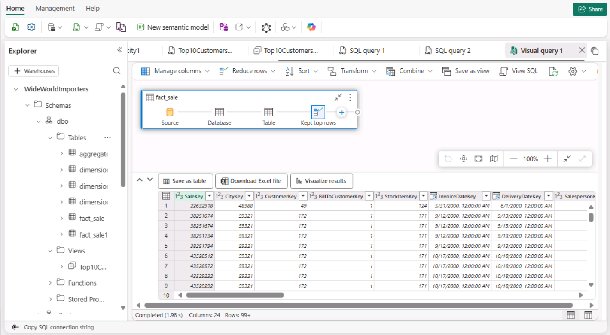

13. Haga clic en el icono **Refresh** debajo de la pestaña **Home**.

> 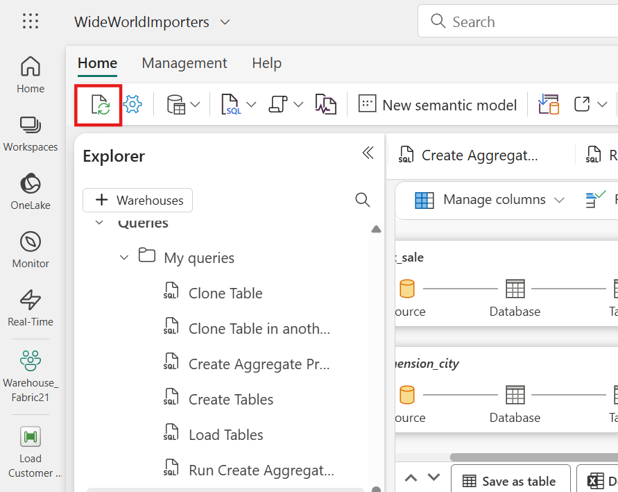

# Ejercicio 8: Analizar datos con un notebook

## Task 1: Crear un acceso directo de lakehouse y analizar datos con un notebook

En esta tarea, aprenda cómo puede guardar sus datos una sola vez y luego
utilizarlos con muchos otros servicios. También se pueden crear accesos
directos a datos almacenados en Azure Data Lake Storage y S3 para
permitir el acceso directo a tablas delta desde sistemas externos.

Primero, creamos un nuevo lakehouse. Para crear un nuevo lakehouse en su
espacio de trabajo de Microsoft Fabric:

1.  En la página **WideWorldImporters**, haga clic en
    **Warehouse_FabricXX** Workspace en el menú de navegación lateral
    izquierdo.

> 

2.  En la página de inicio de **Synapse Data Engineering
    Warehouse_FabricXX**, debajo del panel **Warehouse_FabricXX**, haga
    clic en **+New item** y luego seleccione **Lakehouse** debajo de
    **Stored data.**

> 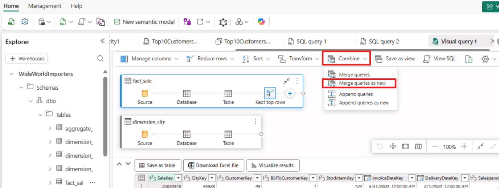

3.  En el campo **Name**, ingrese +++**ShortcutExercise+++** y haga clic
    en el botón **Create**.

> 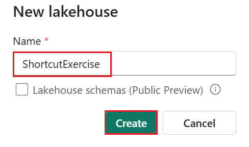

4.  El nuevo lakehouse se carga y se abre la vista **Explorer**, con el
    menú **Get data in your lakehouse**. Bajo **Load data in your
    lakehouse**, seleccione el botón **New shortcut**.

> 

5.  En la ventana **New shortcut**, seleccione **Microsoft OneLake**.

> 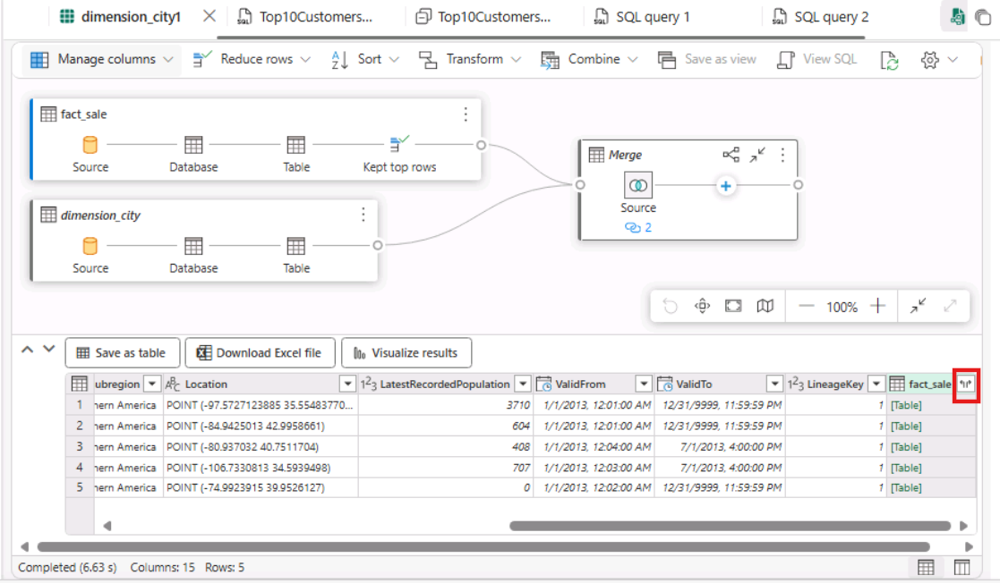

6.  En la ventana **Select a data source type**, navegue cuidadosamente
    y haga clic en el **Warehouse** llamado **WideWorldImporters** que
    creó previamente, luego haga clic en el botón **Next**.

> 

6.  En el explorador de objetos de **OneLake**, expanda **Tables**,
    luego expanda el esquema **dbo** y seleccione el botón de opción
    junto a **dimension_customer**. Seleccione el botón **Next**.

> 

7.  En la ventana **New shortcut**, haga clic en el botón **Create** y
    luego en el botón **Close**.

> 
>
> 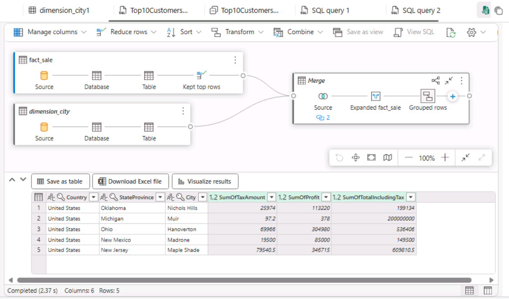

8.  Espere un momento y luego haga clic en el icono **Refresh**.

9.  Luego, seleccione **dimension_customer** en la lista de **Table**
    para previsualizar los datos. Observe que el lakehouse muestra los
    datos de la tabla **dimension_customer** del **Warehouse**.

> 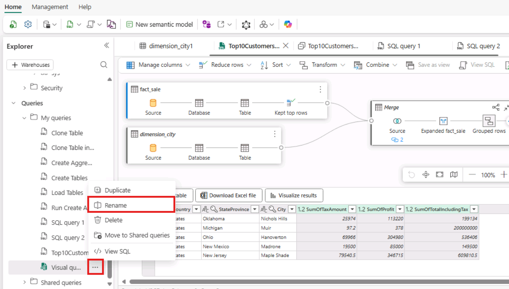

10. A continuación, cree un nuevo notebook para consultar la tabla
    **dimension_customer**. En la cinta **Home**, seleccione el menú
    desplegable de **Open notebook** y seleccione **New notebook**.

> 

11. Seleccione y arrastre **dimension_customer** esde la lista de
    **Tables** a la celda abierta del **notebook**. Podrá ver que se ha
    generado una consulta **PySpark** para consultar todos los datos de
    **ShortcutExercise.dimension_customer**. Esta experiencia de
    notebook es similar a la experiencia de Jupyter notebook en Visual
    Studio Code. También puede abrir el notebook en VS Code.

> 

12. En la cinta **Home**, seleccione el botón **Run all**. ¡Una vez que
    la consulta se complete, verá que puede usar fácilmente **PySpark**
    para consultar las tablas del **Warehouse**!


# Ejercicio 9: Crear consultas entre warehouses con el editor de consultas SQL

## Tarea 1: Agregar múltiples warehouses al Explorer

En esta tarea, aprenda cómo puede crear y ejecutar fácilmente consultas
T-SQL con el SQL query editor a través de múltiples warehouses,
incluyendo la combinación de datos de un SQL Endpoint y un Warehouse en
Microsoft Fabric.

1.  En la página **Notebook1**, navegue y haga clic en
    **Warehouse_FabricXX Workspace** en el menú de navegación lateral
    izquierdo.

> 

2.  En la vista **Warehouse_FabricXX**, seleccione el warehouse
    **WideWorldImporters**.

> 

3.  En la página **WideWorldImporters**, debajo de la pestaña
    **Explorer**, seleccione el botón **+ Warehouses**.

> 

4.  En la ventana Add warehouses, seleccione **ShortcutExercise** y haga
    clic en el botón **Confirm**. Ambas experiencias de warehouse se
    agregan a la consulta.

> 

5.  Sus warehouses seleccionados ahora muestran el mismo panel
    **Explorer**.


## Tarea 2: Ejecutar una consulta entre warehouses

En este ejemplo, puede ver lo fácil que es ejecutar consultas T-SQL a
través del warehouse the WideWorldImporters y el ShortcutExercise SQL
Endpoint. Puede escribir consultas entre bases de datos utilizando la
nomenclatura de tres partes para hacer referencia a
database.schema.table, como en SQL Server.

1.  Desde la pestaña **Home** de la cinta, seleccione **New SQL query**.

> 

2.  En el editor de consultas, copie y pegue el siguiente código T-SQL.
    Seleccione el botón **Run** para ejecutar la consulta. Una vez que
    la consulta se complete, verá los resultados.

    ```
    SELECT Sales.StockItemKey, 
    Sales.Description, 
    SUM(CAST(Sales.Quantity AS int)) AS SoldQuantity, 
    c.Customer
    FROM [dbo].[fact_sale] AS Sales,
    [ShortcutExercise].[dbo].[dimension_customer] AS c
    WHERE Sales.CustomerKey = c.CustomerKey
    GROUP BY Sales.StockItemKey, Sales.Description, c.Customer;
    ```


3.  Cambie el nombre de la consulta para referencia. Haga clic derecho
    sobre **SQL query** en el **Explorer** y seleccione **Rename**.

> 

4.  En el cuadro de diálogo **Rename**, en el campo **Name**, ingrese
    **+++Cross-warehouse query+++**, luego haga clic en el botón
    **Rename**. 

> 

# Ejercicio 10: Crear informes de Power BI

## Tarea 1: Crear un modelo semántico

En esta tarea, aprendemos cómo crear y guardar varios tipos de informes
de Power BI.

1.  En la página **WideWorldImportes**, debajo de la pestaña **Home**,
    seleccione **New semantic model**.

> 

2.  En la ventana **New semantic model**, en el cuadro **Direct Lake
    semantic model name**, ingrese **+++Sales Model+++**

3.  Expanda el esquema dbo, expanda la carpeta **Tables**, y luego
    marque las tablas **dimension_city** y **fact_sale**. Seleccione
    **Confirm**.

> 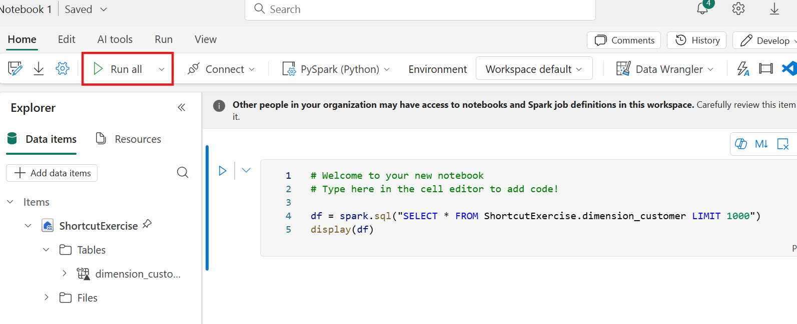
>
> 

4.  Para abrir el modelo semántico, regrese a la página principal del
    **workspace**, y luego seleccione el modelo semántico **Sales
    Model**.

> 

5.  Para abrir el model designer, en el menú, seleccione **Open data
    model**.

> 
>
> 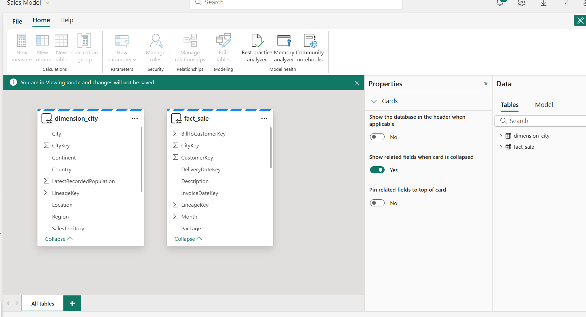

6. En la página **Sales Model**, para editar **Manage Relationships**,
    cambie el modo de **Viewing** a **Editing.**

7. Para crear una relación, en el **model designer**, en la cinta
    **Home**, seleccione **Manage relationships**.

> 

8. En la ventana **New relationship**, complete los siguientes pasos
    para crear la relación:

&nbsp;

1)  En la lista desplegable **From table**, seleccione la tabla
    **dimension_city**.

2)  En la lista desplegable **To table**, seleccione la tabla
    **fact_sale**.

3)  En la lista desplegable **Cardinality**, seleccione **One to many
    (1:\*)**.

4)  En la lista desplegable **Cross-filter direction**, seleccione
    **Single**.

5)  Marque la casilla **Assume referential integrity**..

6)  Seleccione **Save**.

> 
>
> 
>
> 

13. En la ventana **Manage relationship**, seleccione **Close**.

> 
>
> 

## Tarea 2: Crear un informe de Power BI

En esta tarea, aprenda cómo crear un reporte de Power BI basado en el
modelo semántico que creó en la tarea anterior.

1.  En la cinta **File**, seleccione **Create new report**.

> 

2.  2\. En el diseñador de informes, complete los siguientes pasos para
    crear un visual de gráfico de barras:

&nbsp;

1)  En el panel **Data**, expanda la tabla **fact_sale**, y luego revise
    el campo Profit.

2)  En el panel **Data**, expanda la tabla dimension_city, y luego
    revise el campo SalesTerritory.

> 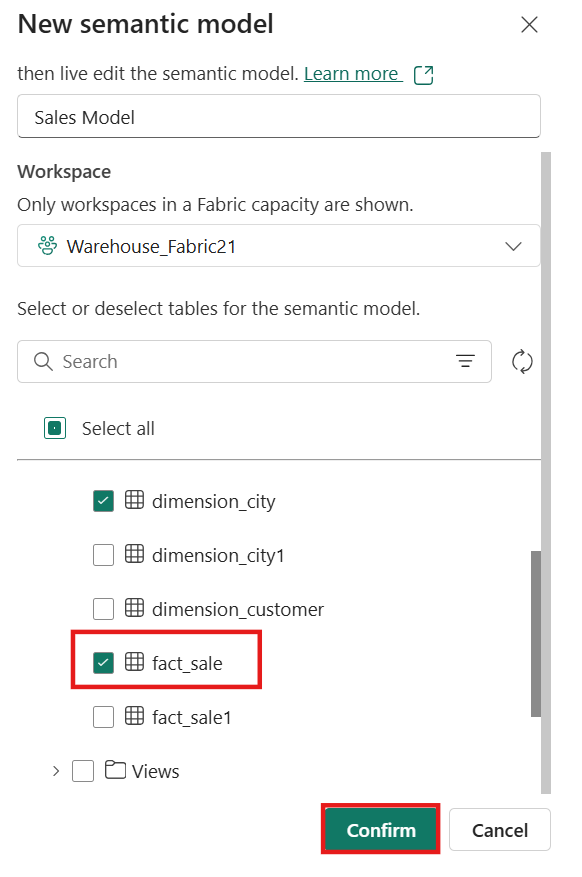

3.  En el panel **Visualizations**, seleccione el visual **Azure Map**.

> 

4.  En el panel **Data**, desde la tabla **dimension_city**, arrastre
    los campos **StateProvince** al **Location well** en el panel
    **Visualizations**.

> 

5.  En el panel **Data**, desde la tabla fact_sale, marque el
    campo Profit para agregarlo al mapa visual **Size**.

6.  En el panel **Visualizations**, seleccione el visual **Table**.

> 

7.  En el panel **Data**, marque los siguientes campos:

&nbsp;

1)  SalesTerritory de la tabla dimension_city 

2)  StateProvince de la tabla dimension_city 

3)  Profit de la tabla fact_sale 

4)  TotalExcludingTax de la tabla fact_sale 

> 
>
> 

8.  Verifique que el diseño completo de la página del reporte se asemeje
    a la siguiente imagen.

> 

9.  Para guardar el reporte, en la cinta **Home**, seleccione **File \>
    Save**.

> 

10. En la ventana **Save your report**, en el cuadro **Enter a name for
    your report**, ingrese **+++Sales Analysis+++** y seleccione
    **Save**.

> 
>
> 
>
> 

## Tarea 3: Eliminar recursos

Puede eliminar reportes individuales, pipelines, warehouses y otros
elementos, o bien eliminar todo el workspace. En este tutorial, limpiará
el workspace, los reportes individuales, pipelines, warehouses y otros
elementos que creó como parte del laboratorio.

1.  Seleccione **Warehouse_FabricXX** en el menú de navegación para
    regresar a la lista de elementos del workspace.

> 

2.  En el menú del encabezado del workspace, seleccione **Workspace
    settings**.

> 

3.  En el cuadro de diálogo **Workspace settings**, seleccione **Other**
    y luego seleccione **Remove this workspace**.

> 

4.  En el cuadro de diálogo **Delete workspace?** haga clic en el botón
    **Delete**. 

**Resumen**

Este laboratorio integral guía a través de una serie de tareas
orientadas a establecer un entorno funcional de datos en Microsoft
Fabric. Comienza con la creación de un workspace, esencial para las
operaciones de datos, y asegura que la prueba esté habilitada.
Posteriormente, se establece un Warehouse llamado WideWorldImporters
dentro del entorno de Fabric, que sirve como el repositorio central para
el almacenamiento y procesamiento de datos.

Se detalla la ingestión de datos en el workspace Warehouse**\_**FabricXX
mediante la implementación de un pipeline de Data Factory. Este proceso
implica obtener datos de fuentes externas e integrarlos de manera fluida
en el workspace. Se crean tablas críticas, dimension_city y fact_sale,
dentro del data warehouse para servir como estructuras fundamentales
para el análisis de datos. El proceso de carga de datos continúa con el
uso de T-SQL, donde los datos de Azure Blob Storage se transfieren a las
tablas especificadas.

Las tareas subsecuentes profundizan en la gestión y manipulación de
datos. Se demuestra la clonación de tablas, ofreciendo una técnica
valiosa para la replicación de datos y propósitos de prueba. Además, el
proceso de clonación se extiende a un esquema diferente **(**dbo1**)**
dentro del mismo warehouse, mostrando un enfoque estructurado para la
organización de datos.

El laboratorio avanza hacia la transformación de datos, introduciendo la
creación de un procedimiento almacenado para agregar eficientemente los
datos de ventas. Luego, se transita a la construcción de consultas
visuales, proporcionando una interfaz intuitiva para consultas de datos
complejas. Esto es seguido por la exploración de notebooks, demostrando
su utilidad para consultar y analizar datos de la tabla
dimension_customer**.**

Se presentan capacidades de consultas multi-warehouse, permitiendo la
obtención de datos de manera fluida a través de distintos warehouses
dentro del workspace. El laboratorio culmina habilitando la integración
de visuales de Azure Maps, mejorando la representación geográfica de los
datos en Power BI. Posteriormente, se crean diversos reportes de Power
BI, incluyendo gráficas de barras, mapas y tablas, para facilitar un
análisis profundo de los datos de ventas.

La tarea final se enfoca en generar un reporte desde el centro de datos
**OneLake**, enfatizando aún más la versatilidad de las fuentes de datos
en Fabric. Finalmente, el laboratorio proporciona conocimientos sobre la
gestión de recursos, destacando la importancia de los procedimientos de
limpieza para mantener un workspace eficiente.

En conjunto, estas tareas presentan una comprensión integral sobre cómo
configurar, gestionar y analizar datos dentro de Microsoft Fabric.
