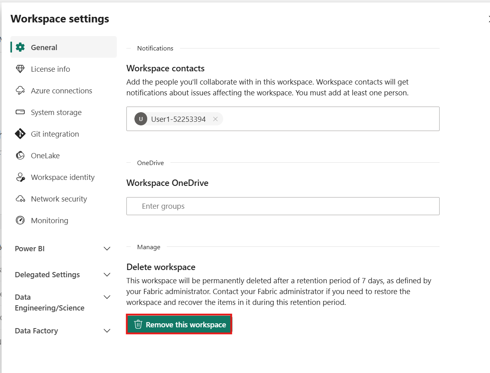

# Use case 05: Building a Sales and Geography Data Warehouse for Contoso in Microsoft Fabric

**Introduction**

Contoso, a multinational retail company, is looking to modernize its
data infrastructure to improve sales and geographical analysis.
Currently, their sales and customer data is scattered across multiple
systems, making it difficult for their business analysts and citizen
developers to derive insights. The company plans to consolidate this
data into a unified platform using Microsoft Fabric to enable
cross-querying, sales analysis, and geographical reporting.

In this lab, you'll assume the role of a data engineer at Contoso tasked
with designing and implementing a data warehouse solution using
Microsoft Fabric. You will start by setting up a Fabric workspace,
creating a data warehouse, loading data from Azure Blob Storage, and
performing analytical tasks to deliver insights to Contoso's
decision-makers.

While many concepts in Microsoft Fabric may be familiar to data and
analytics professionals, it can be challenging to apply those concepts
in a new environment. This lab has been designed to walk step-by-step
through an end-to-end scenario from data acquisition to data consumption
to build a basic understanding of the Microsoft Fabric user experience,
the various experiences and their integration points, and the Microsoft
Fabric professional and citizen developer experiences.

**Objectives**

- Set up a Fabric workspace with trial enabled.

- Establish a new Warehouse named WideWorldImporters in Microsoft
  Fabric.

- Load data into the Warehouse_Fabric@lab.LabInstance.Id workspace using a Data Factory
  pipeline.

- Generate dimension_city and fact_sale tables within the data
  warehouse.

- Populate dimension_city and fact_sale tables with data from Azure Blob
  Storage.

- Create clones of dimension_city and fact_sale tables in the Warehouse.

- Clone dimension_city and fact_sale tables into the dbo1 schema.

- Develop a stored procedure to transform data and create
  aggregate_sale_by_date_city table.

- Generate a query using the visual query builder to merge and aggregate
  data.

- Use a notebook to query and analyze data from the dimension_customer
  table.

- Include WideWorldImporters and ShortcutExercise warehouses for
  cross-querying.

- Execute a T-SQL query across WideWorldImporters and ShortcutExercise
  warehouses.

- Enable Azure Maps visual integration in the Admin portal.

- Generate column chart, map, and table visuals for Sales Analysis
  report.

- Create a report using data from the WideWorldImporters dataset in the
  OneLake data hub.

- Remove the workspace and its associated items.

## Exercise 1: Create a Microsoft Fabric workspace

### Task 1: Sign in to Power BI account 

1.  Open your browser, navigate to the address bar, and type or paste
    the following URL: +++https://app.fabric.microsoft.com/+++ then
    press the **Enter** button.

    > 

2.  In the **Microsoft Fabric** window, enter assigned credentials, and
    click on the **Submit** button.

    > 

3.  Then, In the **Microsoft** window enter the password and click on
    the **Sign in** button.

    > 

4.  In **Stay signed in?** window, click on the **Yes** button.

    > 

5.  You'll be directed to Power BI Home page.

    > 

### Task 2: Create a workspace

Before working with data in Fabric, create a workspace with the Fabric
trial enabled.

1.  In the Workspaces pane Select **+** **New workspace**.

    > 

2.  In the **Create a workspace tab, enter** the following details and
    click on the **Apply** button.

    |  |  |
    |----|---|
    |Name	|+++Warehouse_Fabric@lab.LabInstance.Id+++ (must be a unique Id) |
    |Description	|+++This workspace contains all the artifacts for the data warehouse+++|
    |Advanced	Under License mode| select Fabric capacity|
    |Default storage format	|Small dataset storage format|

    > 

    > 

3.  Wait for the deployment to complete. It takes 1-2 minutes to
    complete. When your new workspace opens, it should be empty.

    > 

### Task 4: Create a Warehouse in Microsoft Fabric

1.  In the **Fabric** page, select **+ New item** 
    and, on the **New item** panel filter by, and select, **+++Warehouse+++** to create a Warehouse.

    > 

2.  On the **New warehouse** dialog,
    enter +++**WideWorldImporters+++** and click on the **Create**
    button.

    > 

    >[!note]**Note**: When provisioning is complete, the **WideWorldImporters**
    warehouse landing page appears.

    > 

## Exercise 2: Ingest data into a Warehouse in Microsoft Fabric

### Task 1: Ingest data into a Warehouse

1.  From the **WideWorldImporters** warehouse landing page,
    select **Warehouse_Fabric@lab.LabInstance.Id** in the left-sided navigation menu to
    return to the workspace item list.

    > 

2.  In the **Warehouse_Fabric@lab.LabInstance.Id** page, select +**New item**. Then,
    click **Data pipeline** to view the full list of available items
    under Get data.

    > 

3.  On the **New** **pipeline** dialog box, in the **Name** field, enter
    **+++Load Customer Data+++** and click on the **Create** button.

    > 

4.  In the **Load Customer Data** page, navigate to **Start building
    your data pipeline** section and click on **Pipeline activity**.

    > 

5.  Navigate and select **Copy data** under **Move
    & transform** section.

    > 

6.  Select the newly created **Copy data** **1** activity from the
    design canvas to configure it.

    >[!note]**Note**: Drag the horizonal line in the design canvas to have a
    > complete view of various features.

    > 

7.  On the **General** tab, in the **Name** field, enter **+++CD Load dimension_customer+++** .

    > 

8.  On the **Source** page, select the **Connection** dropdown.
    Select **Browse all** to see all of the data sources you can choose from,
    including data sources in your local OneLake data hub.

    > !IMAGE[]([instructions303922](https://raw.githubusercontent.com/technofocus-pte/msfbrcanlytcsrio/refs/heads/Cloud-slice/Labguide/Usecase%2005/media)/skillable_image2.png)

9.  On the **Get data** window, search **+++Azure Blobs+++** in, then
    click on the **Azure Blobs** storage button.

    > 

10. On the **Connection settings** pane that appears on the right side,
    configure the following settings and click on the **Connect**
    button.

    - In the **Account name or URL**, enter
      **+++https://fabrictutorialdata.blob.core.windows.net/sampledata/+++**
    
    - In the **Connection credentials** section, click on the dropdown under
      **Connection**, then select **Create new connection**.
    
    - In **Connection name** field, enter **+++Wide World Importers Public Sample+++**.
    
    - Set the **Authentication kind** to **Anonymous**.
    
    > 

11. Change the remaining settings on the **Source** page of the copy
    activity as follows to reach the .parquet files
    in **https://fabrictutorialdata.blob.core.windows.net/sampledata/WideWorldImportersDW/parquet/full/dimension_customer/\*.parquet**

    In the **File path** text boxes, provide:

    - **Container:** **+++sampledata+++**
    
    - **File path - Directory:** **+++WideWorldImportersDW/tables+++**
    
    - **File path - File name:** **+++dimension_customer.parquet+++**
    
    - In the **File format** drop down, choose **Parquet** (if you are
      unable to see **Parquet**, then type in the search box and then select
      it)
    
    > 

13. Click on **Preview data** on the right side of **File path** setting
    to ensure that there are no errors and then click on **close.**

    > 

    > 

14. On the **Destination** tab, enter the following settings.

    |  |  |
    |---|---|
    |Connection	|WideWorldImporters|
    |Table option	|select the Auto create table radio button.|
    |Table	|•	In the first box enter +++dbo+++<br>•	In the second box enter +++dimension_customer+++|


    > 

15. From the ribbon, select **Run**.

    > 

16. In the **Save and run?** dialog box, click on **Save and run**
    button.

    > 

    > 

17. Monitor the copy activity's progress on the **Output** page and wait
    for it to complete.

    > 

## Exercise 3: Create tables in a Data Warehouse

### Task 1: Create table in a Data Warehouse

1.  On **Load Customer Data** page, click on **Warehouse_Fabric@lab.LabInstance.Id**
    workspace in the left-sided navigation bar.

    > 

2.  In the **Syanapse Data Engineering** **Warehouse_Fabric@lab.LabInstance.Id** page,
    carefully navigate and click on **WideWorldImporters** having
    **Warehouse** type as shown in the below image.

    > 

3.  On the **WideWorldImporters** page, go to the **Home** tab, select **New SQL query** from the drop
    down, and click on **New SQL query**.

    > 

4.  In the query editor, paste the following code and select **Run** to
    execute the query
	
    ```
    /*
    1. Drop the dimension_city table if it already exists.
    2. Create the dimension_city table.
    3. Drop the fact_sale table if it already exists.
    4. Create the fact_sale table.
    */
    
    --dimension_city
    DROP TABLE IF EXISTS [dbo].[dimension_city];
    CREATE TABLE [dbo].[dimension_city]
        (
            [CityKey] [int] NULL,
            [WWICityID] [int] NULL,
            [City] [varchar](8000) NULL,
            [StateProvince] [varchar](8000) NULL,
            [Country] [varchar](8000) NULL,
            [Continent] [varchar](8000) NULL,
            [SalesTerritory] [varchar](8000) NULL,
            [Region] [varchar](8000) NULL,
            [Subregion] [varchar](8000) NULL,
            [Location] [varchar](8000) NULL,
            [LatestRecordedPopulation] [bigint] NULL,
            [ValidFrom] [datetime2](6) NULL,
            [ValidTo] [datetime2](6) NULL,
            [LineageKey] [int] NULL
        );
    
    --fact_sale
    
    DROP TABLE IF EXISTS [dbo].[fact_sale];
    
    CREATE TABLE [dbo].[fact_sale]
    
        (
            [SaleKey] [bigint] NULL,
            [CityKey] [int] NULL,
            [CustomerKey] [int] NULL,
            [BillToCustomerKey] [int] NULL,
            [StockItemKey] [int] NULL,
            [InvoiceDateKey] [datetime2](6) NULL,
            [DeliveryDateKey] [datetime2](6) NULL,
            [SalespersonKey] [int] NULL,
            [WWIInvoiceID] [int] NULL,
            [Description] [varchar](8000) NULL,
            [Package] [varchar](8000) NULL,
            [Quantity] [int] NULL,
            [UnitPrice] [decimal](18, 2) NULL,
            [TaxRate] [decimal](18, 3) NULL,
            [TotalExcludingTax] [decimal](29, 2) NULL,
            [TaxAmount] [decimal](38, 6) NULL,
            [Profit] [decimal](18, 2) NULL,
            [TotalIncludingTax] [decimal](38, 6) NULL,
            [TotalDryItems] [int] NULL,
            [TotalChillerItems] [int] NULL,
            [LineageKey] [int] NULL,
            [Month] [int] NULL,
            [Year] [int] NULL,
            [Quarter] [int] NULL
        );
    ```

    > 

    > 

5.  To save this query, right-click on the **SQL query 1** tab just
    above the editor and select **Rename**.

    > 

6.  In the **Rename** dialog box, under **Name** field, enter
    **+++Create Tables+++** to change the name of **SQL query 1**. Then,
    click on the **Rename** button.

    > 

7.  Validate the table was created successfully by selecting the
    **refresh icon** button on the ribbon.

    > 

8.  In the **Explorer** pane, you'll see the **fact_sale** table
    and **dimension_city** table.

    > 

### Task 2: Load data using T-SQL

Now that you know how to build a data warehouse, load a table, and
generate a report, it's time to extend the solution by exploring other
methods for loading data.

1.  On the **WideWorldImporters** page, go to the **Home** tab, select **New SQL query** from the dropdown, and click on **New SQL query**.

    > 

2.  In the query editor, **paste** the following code, then click on
    **Run** to execute the query.
	
    ```
    --Copy data from the public Azure storage account to the dbo.dimension_city table.
    COPY INTO [dbo].[dimension_city]
    FROM 'https://fabrictutorialdata.blob.core.windows.net/sampledata/WideWorldImportersDW/tables/dimension_city.parquet'
    WITH (FILE_TYPE = 'PARQUET');
    
    --Copy data from the public Azure storage account to the dbo.fact_sale table.
    COPY INTO [dbo].[fact_sale]
    FROM 'https://fabrictutorialdata.blob.core.windows.net/sampledata/WideWorldImportersDW/tables/fact_sale.parquet'
    WITH (FILE_TYPE = 'PARQUET');
    ```
	
    > 

    >[!note]**Note**: After the query is completed, review the messages, which indicats
    the number of rows that were loaded into the **dimension_city** and
    **fact_sale** tables respectively.

    > 

4.  Load the data preview to validate the data loaded successfully by
    selecting on the **fact_sale** table in the **Explorer**.

    > 

5.  Rename the query by right-clicking on **SQL query 1** in
    the **Explorer**, then select **Rename**.

    > 

6.  In the **Rename** dialog box, under the **Name** field, enter
    +++**Load Tables+++**. Then, click on **Rename** button.

    > 

7.  Click on the **Refresh** icon in the command bar below the **Home**
    tab.

    > 

## Exercise 4: Clone a table using T-SQL in Microsoft Fabric

### Task 1: Create a table clone within the same schema in a warehouse

This task guides you through creating a [table clone](https://learn.microsoft.com/en-in/fabric/data-warehouse/clone-table) in
Warehouse in Microsoft Fabric, using the [CREATE TABLE AS CLONE OF](https://learn.microsoft.com/en-us/sql/t-sql/statements/create-table-as-clone-of-transact-sql?view=fabric&preserve-view=true) T-SQL
syntax.

1.  Create a table clone within the same schema in a warehouse.

    On the **WideWorldImporters** page, go to the **Home** tab, select **New SQL query** from the dropdown, and click on **New SQL query**.

    > 

3.  In the query editor, paste the following code to create clones of
    the **dbo.dimension_city** and **dbo.fact_sale** tables.
	
    ```
    --Create a clone of the dbo.dimension_city table.
    CREATE TABLE [dbo].[dimension_city1] AS CLONE OF [dbo].[dimension_city];
    
    --Create a clone of the dbo.fact_sale table.
    CREATE TABLE [dbo].[fact_sale1] AS CLONE OF [dbo].[fact_sale];
    ```
	
    > 

4.  Select **Run** to execute the query. The query takes a few seconds
    to execute. After the query is completed, the table clones
    **dimension_city1** and **fact_sale1** will be created.

    > 

    > 

5.  Load the data preview to validate the data loaded successfully by
    selecting on the **dimension_city1** table in the **Explorer**.

    > 

6.  Right-click on **SQL query** that you've created to clone the
    tables in the **Explorer** and select **Rename**.

    > 

7.  In the **Rename** dialog box, under the **Name** field, enter
    **+++Clone Table+++**, then click on the **Rename** button.

    > 

8.  Click on the **Refresh** icon in the command bar below the **Home**
    tab.

    > 

### Task 2: Create a table clone across schemas within the same warehouse

1.  On the **WideWorldImporters** page, go to the **Home** tab, select **New SQL query** from the dropdown, and click on **New SQL query**.

    > 

2.  Create a new schema within the **WideWorldImporter** warehouse
    named **dbo1**. **Copy/Paste** and **Run** the following T-SQL code
    as shown in the below image:

    +++CREATE SCHEMA dbo1+++

    > 
    
    > 

3. In the query editor, remove the existing code and paste the following to create clones of the **dbo.dimension_city** and dbo.**fact_sale tables** in the **dbo1** schema.

    ```
    --Create a clone of the dbo.dimension_city table in the dbo1 schema.
    CREATE TABLE [dbo1].[dimension_city1] AS CLONE OF [dbo].[dimension_city];
    
    --Create a clone of the dbo.fact_sale table in the dbo1 schema.
    CREATE TABLE [dbo1].[fact_sale1] AS CLONE OF [dbo].[fact_sale];
    ```

4.  Select **Run** to execute the query. The query takes a few seconds
    to execute.

    > 

    >[!note]**Note**: After the query is completed,
    the clones **dimension_city1** and **fact_sale1** are created in
    the **dbo1** schema.

    > 

6.  Load the data preview to validate the data loaded successfully by
    selecting on the **dimension_city1** table under **dbo1** schema in
    the **Explorer**.

    > 

7.  **Rename** the query for reference later. Right-click on **SQL query 1** in the **Explorer** and select **Rename**.

    > 

8.  In the **Rename** dialog box, under the **Name** field, enter
    **+++Clone Table in another schema+++**. Then, click on **Rename**
    button.

    > 

9.  Click on the **Refresh** icon in the command bar below the **Home**
    tab.

    > 

## Exercise 5: Transform data using a stored procedure

Learn how to create and save a new stored procedure to transform data.

### Task 1:

1.  On the **WideWorldImporters** page, go to the **Home** tab, select **New SQL query** from the dropdown, and click on **New SQL query**.

    > 

2.  In the query editor, **paste** and **run** the following code to create the
    stored procedure **dbo.populate_aggregate_sale_by_city**. This
    stored procedure will create and load
    the **dbo.aggregate_sale_by_date_city** table in a later step.
	
    ```
    --Drop the stored procedure if it already exists.
    DROP PROCEDURE IF EXISTS [dbo].[populate_aggregate_sale_by_city]
    GO
    
    --Create the populate_aggregate_sale_by_city stored procedure.
    CREATE PROCEDURE [dbo].[populate_aggregate_sale_by_city]
    AS
    BEGIN
        --If the aggregate table already exists, drop it. Then create the table.
        DROP TABLE IF EXISTS [dbo].[aggregate_sale_by_date_city];
        CREATE TABLE [dbo].[aggregate_sale_by_date_city]
            (
                [Date] [DATETIME2](6),
                [City] [VARCHAR](8000),
                [StateProvince] [VARCHAR](8000),
                [SalesTerritory] [VARCHAR](8000),
                [SumOfTotalExcludingTax] [DECIMAL](38,2),
                [SumOfTaxAmount] [DECIMAL](38,6),
                [SumOfTotalIncludingTax] [DECIMAL](38,6),
                [SumOfProfit] [DECIMAL](38,2)
            );
    
        --Reload the aggregated dataset to the table.
        INSERT INTO [dbo].[aggregate_sale_by_date_city]
        SELECT
            FS.[InvoiceDateKey] AS [Date], 
            DC.[City], 
            DC.[StateProvince], 
            DC.[SalesTerritory], 
            SUM(FS.[TotalExcludingTax]) AS [SumOfTotalExcludingTax], 
            SUM(FS.[TaxAmount]) AS [SumOfTaxAmount], 
            SUM(FS.[TotalIncludingTax]) AS [SumOfTotalIncludingTax], 
            SUM(FS.[Profit]) AS [SumOfProfit]
        FROM [dbo].[fact_sale] AS FS
        INNER JOIN [dbo].[dimension_city] AS DC
            ON FS.[CityKey] = DC.[CityKey]
        GROUP BY
            FS.[InvoiceDateKey],
            DC.[City], 
            DC.[StateProvince], 
            DC.[SalesTerritory]
        ORDER BY 
            FS.[InvoiceDateKey], 
            DC.[StateProvince], 
            DC.[City];
    END
    ```
 
    > 

    > 

3.  Right-click on SQL query that you've created to clone the tables in
    the Explorer and select **Rename**.

    > 

4.  In the **Rename** dialog box, under the **Name** field, enter
    +++**Create Aggregate Procedure+++**, then click on the **Rename**
    button.

    > 

5.  Click on the **Refresh icon** below the **Home** tab.

    > 

6.  In the **Explorer** tab, verify that you can see the newly created
    stored procedure by expanding the **StoredProcedures** node under
    the **dbo** schema.

    > 

7.  On the **WideWorldImporters** page, go to the **Home** tab, select **New SQL query** from the dropdown, and click on **New SQL query**.

    > 

8.  In the query editor, paste the following code. This T-SQL executes
    **dbo.populate_aggregate_sale_by_city** to create the
    **dbo.aggregate_sale_by_date_city** table. Run the query.
	
    ```
    --Execute the stored procedure to create the aggregate table.
    EXEC [dbo].[populate_aggregate_sale_by_city];
    ```
	
    > 

9.  To save this query for reference later, right-click on the query tab
    just above the editor and select **Rename.**

    > 

10. In the **Rename** dialog box, under the **Name** field, enter
    **+++Run Create Aggregate Procedure+++**, then click on the
    **Rename** button.

    > 

11. Select the **Refresh** icon on the ribbon.

    > 

12. In the Object **Explorer** tab, load the data preview to validate
    the data loaded successfully by selecting on
    the **aggregate_sale_by_city** table in the **Explorer**.

    > 

## Exercise 6: Time travel using T-SQL at statement level

### Task 1:

1.  On the **WideWorldImporters** page, go to the **Home** tab, select **New SQL query** from the dropdown, and click on **New SQL query**.

    > 

2.  In the query editor, paste the following code to create the
    view Top10CustomerView. Select **Run** to execute the query.
	
    ```
    CREATE VIEW dbo.Top10CustomersView
    AS
    SELECT TOP (10)
        FS.[CustomerKey],
        DC.[Customer],
        SUM(FS.TotalIncludingTax) AS TotalSalesAmount
    FROM
        [dbo].[dimension_customer] AS DC
    INNER JOIN
        [dbo].[fact_sale] AS FS ON DC.[CustomerKey] = FS.[CustomerKey]
    GROUP BY
        FS.[CustomerKey],
        DC.[Customer]
    ORDER BY
        TotalSalesAmount DESC;
    ```
	
    > 

3.  In the **Explorer**, verify that you can see the newly created
    view **Top10CustomersView** by expanding the **View** node
    under dbo schema.

    > 

4.  To save this query for reference later, right-click on the query tab
    just above the editor and select **Rename.**

    > 

5.  In the **Rename** dialog box, under the **Name** field, enter
    **+++Top10CustomersView+++**, then click on the **Rename** button.

    > 

6.  Create another new query, similar to Step 1. From the **Home** tab
    of the ribbon, select **New SQL query**.

    > 

7.  In the query editor, paste the following code. This updates
    the **TotalIncludingTax** column value to **200000000** for the
    record which has the **SaleKey** value of **22632918.**
    Select **Run** to execute the query.
	
    ```
    /*Update the TotalIncludingTax value of the record with SaleKey value of 22632918*/
    UPDATE [dbo].[fact_sale]
    SET TotalIncludingTax = 200000000
    WHERE SaleKey = 22632918;
    ```

    > 

8.  In the query editor, paste the following code.
    The CURRENT_TIMESTAMP T-SQL function returns the current UTC
    timestamp as a **datetime**. Select **Run** to execute the query.
	
    ```
    SELECT CURRENT_TIMESTAMP;
    ```
	
     > 

9.  Copy the timestamp value returned to your clipboard.

    > 

10. Paste the following code in the query editor and replace the
    timestamp value with the current timestamp value obtained from the
    prior step. The timestamp syntax format
    is **YYYY-MM-DDTHH:MM:SS\[.FFF\].**

    Remove the trailing zeroes, for
    example: **2025-06-09T06:16:08.807**.

    The following example returns the list of top ten customers
    by **TotalIncludingTax**, including the new value
    for **SaleKey** 22632918. Replace the existing code and paste the
    following code and select **Run** to execute the query.

    ```
    /*View of Top10 Customers as of today after record updates*/
    SELECT *
    FROM [WideWorldImporters].[dbo].[Top10CustomersView]
    OPTION (FOR TIMESTAMP AS OF '2025-06-09T06:16:08.807');
    ```
    
    > 

13. Paste the following code in the query editor and replace the
    timestamp value to a time prior to executing the update script to
    update the **TotalIncludingTax** value. This would return the list
    of top ten customers *before* the **TotalIncludingTax** was updated
    for **SaleKey** 22632918. Select **Run** to execute the query.
	
    ```
    /*View of Top10 Customers as of today before record updates*/
    SELECT *
    FROM [WideWorldImporters].[dbo].[Top10CustomersView]
    OPTION (FOR TIMESTAMP AS OF '2024-04-24T20:49:06.097');
    ```
	
    > 

## Exercise 7: Create a query with the visual query builder

### Task 1: Use the visual query builder

Create and save a query with the visual query builder in the Microsoft
Fabric portal.

1.  In the **WideWolrdImporters** page, from the **Home** tab of the
    ribbon, select **New SQL query**, and then select **New visual query**.

    > 

2.  Right-click on **fact_sale** and select **Insert into canvas**

    > 

    > 

3.  Navigate to query design pane **transformations ribbon** and limit
    the dataset size by clicking on **Reduce rows** dropdown, then click
    on **Keep top rows** as shown in the below image.

    > 

4.  In the **Keep top rows** dialog box, enter **+++10000+++** and
    Select **OK**.

    > 

    > 

5.  Right-click on **dimension_city**  and select **Insert into canvas**

    > 

    > 

6.  From the transformations ribbon, select the dropdown beside
    **Combine** and select **Merge queries as new** as shown in the
    below image.

    > 

7.  On the **Merge** settings page enter the following details.

    - In the **Left table for merge** dropdown, choose **dimension_city**
    
    - In the **Right table for merge** dropdown, choose **fact_sale** (use
      horizontal and vertical scroll bar)
    
    - Select the **CityKey** field in the **dimension_city** table by
      selecting on the column name in the header row to indicate the join
      column.
    
    - Select the **CityKey** field in the **fact_sale** table by selecting
      on the column name in the header row to indicate the join column.
    
    - In the **Join kind** diagram selection, choose **Inner** and click on
      the **Ok** button.
    
    > 
    
    > 

8.  With the **Merge** step selected, select the **Expand** button
    beside **fact_sale** on the header of the data grid as shown in the
    below image, then select the columns **TaxAmount, Profit,
    TotalIncludingTax** and select **Ok.**

    > 
    
    > 

9.  In the **transformations ribbon,** click on the dropdown beside
    **Transform**, then select **Group by**.

    > 

10. On the **Group by** settings page, enter the following details.

    - Select **Advanced** radio button.
    
    - Under **Group by** select the following:
    
      1.  **Country**
    
      2.  **StateProvince**
    
      3.  **City**
    
    - In the **New column name,** enter +++**SumOfTaxAmount+++** in
      **Operation** column field, select **Sum**, then under **Column**
      field, select **TaxAmount.** Click on **Add aggregation** to add more
      aggregate column and operation.
    
    - In the **New column name,** enter +++**SumOfProfit+++** in
      **Operation** column field, select **Sum**, then under **Column**
      field, select **Profit**. Click on **Add aggregation** to add more
      aggregate column and operation.
    
    - In the **New column name**, enter +++**SumOfTotalIncludingTax+++** in
      **Operation** column field, select **Sum**, then under **Column**
      field, **TotalIncludingTax.** 
    
    - Click on the **OK** button

    > 

    > 

11. In the explorer, navigate to **Queries** and right-click on **Visual
    query 1** under **Queries**. Then, select **Rename**.

    > 

12. Type **+++Sales Summary+++** to change the name of the query.
    Press **Enter** on the keyboard or select anywhere outside the tab
    to save the change.

    > 

13. Click on the **Refresh** icon below the **Home** tab.

    > 

## Exercise 8: Analyze data with a notebook

### Task 1: Create a lakehouse shortcut and analyze data with an notebook

In this task, learn about how you can save your data once and then use
it with many other services. Shortcuts can also be created to data
stored in Azure Data Lake Storage and S3 to enable you to directly
access delta tables from external systems.

First, we create a new lakehouse. To create a new lakehouse in your
Microsoft Fabric workspace:

1.  On the **WideWorldImportes** page, click on **Warehouse_Fabric@lab.LabInstance.Id**
    Workspace on the left-sided navigation menu.

    > 

2. On the **Synapse Data Engineering Warehouse_Fabric@lab.LabInstance.Id** home page, under the **Warehouse_Fabric@lab.LabInstance.Id** pane, click **+New item**, and then Filter by, and select **+++Lakehouse+++** under **Stored data**

    > 

3.  In the **Name** field, enter **+++ShortcutExercise+++** and click on
    the **Create** button.

    > 

4.  The new lakehouse loads and the **Explorer** view opens up, with
    the **Get data in your lakehouse** menu. Under **Load data in your
    lakehouse**, select the **New shortcut** button.

    > 

5.  In the **New shortcut** window, select **Microsoft OneLake**.

    > 

6.  In the **Select a data source type** window, carefully navigate and
    click on the **Warehouse** named **WideWorldImporters** that you've
    created previously, then click on the **Next** button.

    > 

7.  In the **OneLake** object browser, expand **Tables**, then expand
    the **dbo** schema, and select the radio button
    beside **dimension_customer**. Select the **Next** button.

    > 

8.  In the **New shortcut** window, click on the **Create** button. The **New shortcut** window should close when the shortcut has been created.

    > 

9.  Wait for a while and then click on the **Refresh** icon.

10. Then, select the **dimension_customer** in the **Table** list to
    preview the data. Notice that the lakehouse is showing the data from
    the **dimension_customer** table from the Warehouse.

    > 

11. Next, create a new notebook to query
    the **dimension_customer** table. In the **Home** ribbon, select the
    drop down for **Open notebook** and choose **New notebook**.

    > 

12. Select, then drag the **dimension_customer** from
    the **Tables** list into the open notebook cell. You can see a
    **PySpark** query has been written for you to query all the data
    from **ShortcutExercise.dimension_customer**. This notebook
    experience is similar to Visual Studio Code Jupyter notebook
    experience. You can also open the notebook in VS Code.

    > 

13. In the **Home** ribbon, select the **Run all** button. Once the
    query is completed, you will see you can easily use PySpark to query
    the Warehouse tables!

    > 

    > 

## Exercise 9: Create cross-warehouse queries with the SQL query editor

### Task 1: Add multiple warehouses to the Explorer

In this task, learn about how you can easily create and execute T-SQL
queries with the SQL query editor across multiple warehouse, including
joining together data from a SQL Endpoint and a Warehouse in Microsoft
Fabric.

1.  From **Notebook1** page, navigate and click on
    **Warehouse_Fabric@lab.LabInstance.Id** Workspace on the left-sided navigation menu.

    > 

2.  In the **Warehouse_Fabric@lab.LabInstance.Id** view, select
    the **WideWorldImporters** warehouse.

    > 

3.  In the **WideWorldImporters** page, under **Explorer** tab, select
    the **+ Warehouses** button.

    > 

4.  In the **Add warehouses** window, select **ShortcutExercise** and click on
    the **Confirm** button. Both warehouse experiences are added to the
    query.

    > 

5.  Your selected warehouses now show the same **Explorer** pane.

    > 

### Task 2: Execute a cross-warehouse query

In this example, you can see how easily you can run T-SQL queries across
the WideWorldImporters warehouse and ShortcutExercise SQL Endpoint. You
can write cross-database queries using three-part naming to reference
the database.schema.table, as in SQL Server.

1.  From the **Home** tab of the ribbon, select **New SQL query**.

    > 

2.  In the query editor, copy and paste the following T-SQL code. Select
    the **Run** button to execute the query. After the query is
    completed, you will see the results.
	
    ```
    SELECT Sales.StockItemKey, 
    Sales.Description, 
    SUM(CAST(Sales.Quantity AS int)) AS SoldQuantity, 
    c.Customer
    FROM [dbo].[fact_sale] AS Sales,
    [ShortcutExercise].[dbo].[dimension_customer] AS c
    WHERE Sales.CustomerKey = c.CustomerKey
    GROUP BY Sales.StockItemKey, Sales.Description, c.Customer;
    ```
	
    > 

3.  Rename the query for reference. Right-click on **SQL query** in the
    **Explorer** and select **Rename**.

    > 

4.  In the **Rename** dialog box, under the **Name** field, enter
    **+++Cross-warehouse query+++**, then click on the **Rename**
    button. 

    > 

## Exercise 10: Create Power BI reports

### Task 1: Create a semantic model

In this task we learn how to create and save several types of Power BI
reports.

1.  In the **WideWorldImportes** page, under the **Home** tab, select
    the **New semantic model**.

    > 

2.  In the **New semantic model** window, in the **Direct Lake semantic
    model name** box, enter +++**Sales Model+++**

3.  Expand the dbo schema, expand the **Tables** folder, and then check
    the **dimension_city** and **fact_sale** tables. Select **Confirm**.

    > 

    > 

4.  To open the semantic model, return to the workspace landing page,
    and then select the **Sales Model** semantic model.

    > 

9.  To open the model designer, on the menu, select **Open data model** or **Open semantic model**.

    > 

    > 

10. On the **Sales Model** page, to edit **Manage Relationships**,
    change the mode from **Viewing** to **Editing**    > 

11. To create a relationship, in the model designer, on
    the **Home** ribbon, select **Manage relationships**.

    > 

12. In the **New relationships** window, select **+ New relationship**, then complete the following steps to
    create the relationship:

    1.  In the **From table** dropdown list, select
        the **dimension_city** table.
      
    2.  In the **To table** dropdown list, select the **fact_sale** table.
      
    3.  In the **Cardinality** dropdown list, select **One to many (1:\*)**.
      
    4.  In the **Cross-filter direction** dropdown list, select **Single**.
      
    5.  Check the **Assume referential integrity** box.
      
    6.  Select **Save**.

    > 

    > 

13. In the **Manage relationships** window, select **Close**.

    > 

    > 

### Task 2: Create a Power BI report

In this task, learn how to create a Power BI report based on the
semantic model you created in the  task.

1.  Select the **File** menu option, and then select **Create new report**.

    > 

2.  In the report designer, complete the following steps to create a
    column chart visual:

    1.  In the **Data** pane, expand the **fact_sale** table, and then check
        the **Profit** field.
    
    2.  In the **Data** pane, expand the **dimension_city** table, and then
        check the **SalesTerritory** field.

    > 

3.  In the **Visualizations** pane, select the **Azure Map** visual.

    > 

4.  In the **Data** pane, from inside the **dimension_city** table, drag
    the **StateProvince** fiels to the **Location** well in
    the **Visualizations** pane.

    > 

5.  In the **Data** pane, from inside the **fact_sale** table, check
    the Profit field to add it to the map visual **Size** well.

6.  In the **Visualizations** pane, select the **Table** visual.

    > 

7.  In the **Data** pane, check the following fields:

    1.  SalesTerritory from the **dimension_city** table
    
    2.  StateProvince from the **dimension_city** table
    
    3.  Profit from the **fact_sale** table
    
    4.  TotalExcludingTax from the **fact_sale** table

    > 

    > 

8.  Verify that the completed design of the report page resembles the
    following image.

    > 

9.  To save the report, on the **Home** ribbon,
    select **File** \> **Save**.

    > 

10. In the Save your report window, in the Enter a name for your report
    box, enter **+++Sales Analysis+++** and Select **Save**

    > 

    > 

    > 

### Task 3: Clean up resources

You can delete individual reports, pipelines, warehouses, and other
items or remove the entire workspace. In this tutorial, you will clean
up the workspace, individual reports, pipelines, warehouses, and other
items you created as part of the lab.

1.  Select **Warehouse_Fabric@lab.LabInstance.Id** in the navigation menu to return to
    the workspace item list.

    > 

2.  In the menu of the workspace header, select **Workspace settings**.

    > 

3.  In the **Workspace settings** dialog box, in the **General** tab navigate to the bottom and
    select the **Remove this workspace**.

   

4.  In the **Delete workspace?** dialog box, click on the **Delete**
    button.

	> 

**Summary**

This comprehensive lab walks through a series of tasks aimed at
establishing a functional data environment in Microsoft Fabric. It
starts with the creation of a workspace, essential for data operations,
and ensures the trial is enabled. Subsequently, a Warehouse named
WideWorldImporters is established within the Fabric environment to serve
as the central repository for data storage and processing. Data
ingestion into the Warehouse_Fabric@lab.LabInstance.Id workspace is then detailed through
the implementation of a Data Factory pipeline. This process involves
fetching data from external sources and integrating it seamlessly into
the workspace. Critical tables, dimension_city, and fact_sale, are
created within the data warehouse to serve as foundational structures
for data analysis. The data loading process continues with the use of
T-SQL, where data from Azure Blob Storage is transferred into the
specified tables. The subsequent tasks delve into the realm of data
management and manipulation. Cloning tables is demonstrated, offering a
valuable technique for data replication and testing purposes.
Additionally, the cloning process is extended to a different schema
(dbo1) within the same warehouse, showcasing a structured approach to
data organization. The lab progresses to data transformation,
introducing the creation of a stored procedure to efficiently aggregate
sales data. It then transitions to visual query building, providing an
intuitive interface for complex data queries. This is followed by an
exploration of notebooks, demonstrating their utility in querying and
analyzing data from the dimension_customer table. Multi-warehouse
querying capabilities are then unveiled, allowing for seamless data
retrieval across various warehouses within the workspace. The lab
culminates in enabling Azure Maps visuals integration, enhancing
geographical data representation in Power BI. Subsequently, a range of
Power BI reports, including column charts, maps, and tables, are created
to facilitate in-depth sales data analysis. The final task focuses on
generating a report from the OneLake data hub, further emphasizing the
versatility of data sources in Fabric. Finally, the lab provides
insights into resource management, emphasizing the importance of cleanup
procedures to maintain an efficient workspace. Collectively, these tasks
present a comprehensive understanding of setting up, managing, and
analyzing data within Microsoft Fabric.


