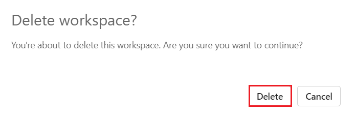

**用例05——在Microsoft Fabric中构建Contoso的销售和地理数据仓库**

Contoso是一家跨国零售公司，正寻求现代化其数据基础设施，以提升销售和地理分析能力。目前，他们的销售和客户数据分散在多个系统中，使业务分析师和公民开发者难以获得洞察。公司计划将这些数据整合到一个统一平台，利用
Microsoft Fabric 实现交叉查询、销售分析和地理报告。

在本实验室中，你将扮演Contoso的数据工程师角色，负责设计和实施使用Microsoft
Fabric的数据仓库解决方案。您将首先搭建 Fabric 工作区，创建数据仓库，从
Azure Blob Storage 加载数据，并执行分析任务，向 Contoso
的决策者提供洞察。

虽然Microsoft
Fabric中的许多概念对数据和分析专业人士来说可能很熟悉，但在新环境中应用这些概念可能具有挑战性。本实验室旨在逐步带领从数据采集到数据消耗的端到端场景，建立对
Microsoft Fabric 用户体验、各种体验及其集成点，以及 Microsoft Fabric
专业和公民开发者体验的基本理解。

**目标**

- 搭建一个启用试用版的Fabric工作区。

- 在 Microsoft Fabric 中建立一个名为 WideWorldImporters 的新仓库。

- 通过数据工厂流水线将数据加载到Warehouse_FabricXX工作区。

- 在数据仓库中生成dimension_city和fact_sale表。

- 用Azure Blob Storage的数据填充dimension_city和fact_sale表。

- 在仓库里创建dimension_city和fact_sale的桌子克隆。

- 将 Tables dimension_city 和 Tables fact_sale 克隆到 dbo1 架构中。

- 开发一个存储过程来转换数据并创建aggregate_sale_by_date_city表。

- 使用可视化查询构建器生成查询，以合并和聚合数据。

- 使用笔记本查询和分析dimension_customer表中的数据。

- 包含WideWorldImporters和ShortcutExercise仓库以便交叉查询。

- 在 WideWorldImporters 和 ShortcutExercise 仓库之间执行 T-SQL 查询。

- 在管理门户中启用 Azure Maps 可视化集成。

- 生成销售分析报告的柱状图、地图和表格可视化。

- 利用OneLake数据中心中的WideWorldImporters数据集中的数据创建报告。

- 移除工作区及其相关项目。

# **练习一： 创建 Microsoft Fabric 工作区**

## **任务1：登录Power BI账户并注册免费[Microsoft Fabric试用版](https://learn.microsoft.com/en-us/fabric/get-started/fabric-trial)**

1.  打开浏览器，进入地址栏，输入或粘贴以下URL：+++https://app.fabric.microsoft.com/+++，
    然后按下 **Enter** 键。

> 

2.  在 **Microsoft Fabric** 窗口中，输入已分配的凭证，然后点击
    **Submit** 按钮。

> 

3.  然后，在 **Microsoft** 窗口输入密码，点击 **Sign in** 按钮**。**

> 

4.  在 **Stay signed in?** 窗口，点击“**Yes**”按钮。

> 

5.  你将被引导到Power BI主页。

> 

## 任务2：创建一个工作区

在处理Fabric数据之前，先创建一个启用Fabric试用区的工作区。

1.  在工作区面板中选择 **+** **New workspace**。

> 

2.  在“**Create a
    workspace**”**选项卡**中，**输入**以下详细信息，然后单击“**Apply**”按钮。

    |  |  |
    |----|---|
    |Name	|**+++Warehouse_Fabric@lab.LabInstance.Id+++** (must be a unique Id) |
    |Description	|**+++This workspace contains all the artifacts for the data warehouse+++**|
    |Advanced	Under License mode| select **Fabric capacity**|
    |Default storage format	|Small dataset storage format|

> 
>
> 

3.  等待部署完成。完成大约需要1-2分钟。
    当你的新工作区开放时，应该是空的。

> 

## 任务3：在 Microsoft Fabric 中创建仓库

1.  在 **Fabric** 页面，选择  **+ New item**  创建
    **lakehouse**，然后选择 **Warehouse**

> 

2.  在“**New warehouse** ”对话框中，输入
    +++**WideWorldImporters+++** 并点击“**Create**”按钮。

> 

3.  配置完成后，会出现 **WideWorldImporters** 仓库的登陆页面。

> 

# **练习2：在Microsoft Fabric中将数据导入仓库**

## 任务1：将数据导入仓库

1.  在**WideWorldImporters**仓库的落地页面，选择左侧导航菜单中的
    **Warehouse_FabricXX**返回工作区物品列表。

> 

2.  在 **Warehouse_FabricXX** 页面，选择 +**New item**。然后，点击
    **“Pipeline**”，在“获取数据”下查看所有可用项目的完整列表。

> 

3.  在“**New** **pipeline**”对话框的 **Name** 字段中，输入 +++**Load
    Customer Data+++**并点击**Create**按钮。

> 

4.  在“**Load Customer Data**”页面中，导航至“**Start building your data
    pipeline** ”部分，然后单击“**Pipeline activity**”。

> 

5.  在“**Move &** **transform**”部分下，导航并选择“**Copy data**”。

> 

6.  从设计画布中选择新创建的**“Copy data 1**”活动进行配置。

> **注意**：在设计画布中拖动横线，可以完整查看各种特征。
>
> 

7.  在“**General**”选项卡上的“**Name**”字段中，输入+++**CD Load
    dimension_customer+++**

> 

8.  在“**Source**”页面上，选择“**Connection**”下拉菜单。选择“**Browse
    all**”以查看所有可供选择的数据源。

> 

9.  在“**Get data**”窗口中，搜索 +++**Azure Blobs+++**，然后点击 **Azure
    Blob Storage** 按钮。 

> 

10. 在右侧出现的“**Connection
    settings**”窗格中，配置以下设置，然后单击“**Connect**”按钮。

- 在 **Account name or URL**中输入
  +++**https://fabrictutorialdata.blob.core.windows.net/sampledata/+++**

- 在**Connection
  credentials**部分，点击**Connection**下的下拉菜单，然后选择**Create
  new connection**。 

- 在 **Connection name** 字段中输入 +++**Wide World Importers Public
  Sample+++**.

- 将**Authentication kind**设置为**Anonymous**。

> 

11. 在复制活动的 Source 页上更改剩余设置如下，以访问
    **https：//fabrictutorialdata.blob.core.windows.net/sampledata/WideWorldImportersDW/parquet/full/dimension_customer/\*.parquet**
    中的 .parquet 文件

12. 在 **File path** 文本框中，提供:

- **容器:** +++**sampledata+++**

- **文件路径 - 目录:** +++**WideWorldImportersDW/tables+++**

- **文件路径- 文件名:** +++**dimension_customer.parquet+++**

- 在“**File
  format**”下拉菜单中，选择**Parquet**（如果看不到**Parquet**，请在搜索框中输入并选择它）

> 

13. 点击 **File path** 设置右侧的“**Preview
    data**”，确保没有错误，然后点击“**close**”。 

> 
>
> 

14. 在**“Destination**”标签页，输入以下设置。

    |  |  |
    |---|---|
    |Connection	|WideWorldImporters|
    |Table option	|select the Auto create table radio button.|
    |Table	|•	In the first box enter +++dbo+++<br>•	In the second box enter +++dimension_customer+++|

> **注意：在将连接添加到WideWorldImporters仓库时，请通过导航从OneLake目录中添加，以便浏览所有选项。**
>
> 
>
> 
>
> 

15. 从色带中选择**“Run**”。

> 

16. 在 **Save and run?** 对话框，点击“**Save and run**”按钮。

> 
>
> 

17. 在输**Output**面监控复制活动的进度 ，等待它完成。

> 

# 练习3：在数据仓库中创建表格

## 任务1：在数据仓库中创建表格

1.  在 **Load Customer Data**
    页面，点击左侧导航栏**Warehouse_FabricXX**工作区，选择**WideWorldImporters**
    Warehouse。

> 

2.  在 **WideWorldImporters** 页面，进入**Home**页标签，从下拉菜单选择
    **SQL**，然后点击“**New SQL query**”。 

> 

3.  在查询编辑器中，粘贴以下代码，选择 **Run **以执行查询

    ```
    /*
    1. Drop the dimension_city table if it already exists.
    2. Create the dimension_city table.
    3. Drop the fact_sale table if it already exists.
    4. Create the fact_sale table.
    */
    
    --dimension_city
    DROP TABLE IF EXISTS [dbo].[dimension_city];
    CREATE TABLE [dbo].[dimension_city]
        (
            [CityKey] [int] NULL,
            [WWICityID] [int] NULL,
            [City] [varchar](8000) NULL,
            [StateProvince] [varchar](8000) NULL,
            [Country] [varchar](8000) NULL,
            [Continent] [varchar](8000) NULL,
            [SalesTerritory] [varchar](8000) NULL,
            [Region] [varchar](8000) NULL,
            [Subregion] [varchar](8000) NULL,
            [Location] [varchar](8000) NULL,
            [LatestRecordedPopulation] [bigint] NULL,
            [ValidFrom] [datetime2](6) NULL,
            [ValidTo] [datetime2](6) NULL,
            [LineageKey] [int] NULL
        );
    
    --fact_sale
    
    DROP TABLE IF EXISTS [dbo].[fact_sale];
    
    CREATE TABLE [dbo].[fact_sale]
    
        (
            [SaleKey] [bigint] NULL,
            [CityKey] [int] NULL,
            [CustomerKey] [int] NULL,
            [BillToCustomerKey] [int] NULL,
            [StockItemKey] [int] NULL,
            [InvoiceDateKey] [datetime2](6) NULL,
            [DeliveryDateKey] [datetime2](6) NULL,
            [SalespersonKey] [int] NULL,
            [WWIInvoiceID] [int] NULL,
            [Description] [varchar](8000) NULL,
            [Package] [varchar](8000) NULL,
            [Quantity] [int] NULL,
            [UnitPrice] [decimal](18, 2) NULL,
            [TaxRate] [decimal](18, 3) NULL,
            [TotalExcludingTax] [decimal](29, 2) NULL,
            [TaxAmount] [decimal](38, 6) NULL,
            [Profit] [decimal](18, 2) NULL,
            [TotalIncludingTax] [decimal](38, 6) NULL,
            [TotalDryItems] [int] NULL,
            [TotalChillerItems] [int] NULL,
            [LineageKey] [int] NULL,
            [Month] [int] NULL,
            [Year] [int] NULL,
            [Quarter] [int] NULL
        );
    ```
> 
>
> 

4.  要保存此查询，请右键单击编辑器上方的 **SQL query
    1**选项卡，然后选择“**Rename**”。

> 

5.  在“**Rename**”对话框中，在 **Name** 字段中输入 +++**Create
    Tables+++**以更改 **SQL query
    1**的名称。然后，点击“**Rename**”按钮。

> 
>
> 

6.  通过选择功能区上的**刷新图标**按钮验证表已成功创建。

> 

7.  在**Explorer**面板中，你会看到**fact_sale**表和**dimension_city**表。

> 

## 任务2：使用T-SQL加载数据

既然你已经知道如何构建数据仓库、加载表和生成报告，接下来是时候通过探索其他加载数据的方法来扩展解决方案了。

1.  在 **WideWorldImporters** 页面，进入**主**页标签，从下拉菜单中选择
    **SQL**，然后点击“**New SQL query**”。

> 

2.  在查询编辑器中， **粘贴** 以下代码，然后点击 **Run **以执行查询。

    ```
    --Copy data from the public Azure storage account to the dbo.dimension_city table.
    COPY INTO [dbo].[dimension_city]
    FROM 'https://fabrictutorialdata.blob.core.windows.net/sampledata/WideWorldImportersDW/tables/dimension_city.parquet'
    WITH (FILE_TYPE = 'PARQUET');
    
    --Copy data from the public Azure storage account to the dbo.fact_sale table.
    COPY INTO [dbo].[fact_sale]
    FROM 'https://fabrictutorialdata.blob.core.windows.net/sampledata/WideWorldImportersDW/tables/fact_sale.parquet'
    WITH (FILE_TYPE = 'PARQUET');
    ```
> 

3.  查询完成后，查看消息，显示**dimension_city**表中**fact_sale**行的数量。

> 

4.  在 **Explorer**
    中的**fact_sale**表中选择，加载数据预览以验证已加载的数据。

> 

5.  重新命名查询。在 **Explorer** 中右键点击**SQL query
    1** ，然后选择“**Rename**”。

> 

6.  在“**Rename**”对话框中，在 **Name** 字段下输入 +++**Load
    Tables+++**。然后，点击“**Rename**”按钮。

> 
>
> 

7.  点击**主**页标签下方命令栏中的**刷新**图标。

> 

# 练习4：在Microsoft Fabric中使用T-SQL克隆表

## 任务1：在仓库中创建同一模式内的表克隆

这个任务会引导你在 Microsoft Fabric 的 Warehouse 中创建 [table
clone](https://learn.microsoft.com/en-in/fabric/data-warehouse/clone-table)，使用“[CREATE
TABLE AS CLONE
OF](https://learn.microsoft.com/en-us/sql/t-sql/statements/create-table-as-clone-of-transact-sql?view=fabric&preserve-view=true)”语法。 

1.  在仓库中创建同一模式内的表克隆。

2.  在 **WideWorldImporters** 页面，进入**主**页标签，从下拉菜单中选择
    **SQL**，然后点击“**New SQL query**”。

> 

3.  在查询编辑器中，粘贴以下代码创建**dbo.dimension_city**和**dbo.fact_sale**表的克隆。

    ```
    --Create a clone of the dbo.dimension_city table.
    CREATE TABLE [dbo].[dimension_city1] AS CLONE OF [dbo].[dimension_city];
    
    --Create a clone of the dbo.fact_sale table.
    CREATE TABLE [dbo].[fact_sale1] AS CLONE OF [dbo].[fact_sale];
    ```
> 

4.  选择**运行**以执行查询。查询执行需要几秒钟。查询完成后，会创建表克隆
    的 **dimension_city1** 和 **fact_sale1** 。

> 
>
> 

5.  在 **Explorer**
    中的**dimension_city1**表中选择，加载数据预览以验证已加载的数据。

> 

6.  右键点击你创建的 **SQL query**，在 **Explorer** 中克隆表，然后选择
    **Rename**。

> 

7.  在“**Rename**”对话框中，在“**Name**”字段下输入 +++**Clone
    Table+++**，然后点击“**Rename**”按钮。

> 
>
> 

8.  点击**主**页标签下方命令栏中的**刷新**图标。

> 

## 任务2：在同一仓库内创建跨模式的表克隆

1.  在 **WideWorldImporters** 页面，进入**主**页标签，从下拉菜单中选择
    **SQL**，然后点击“**New SQL query**”。

> 

2.  在 **WideWorldImporter** 仓库中创建一个名为 **dbo1**
    的新模式。**复制粘贴**并**运行**如下 T-SQL 代码，如下图所示:

    +++CREATE SCHEMA dbo1+++

> 
>
> 

3.  在查询编辑器中，删除现有代码，粘贴以下内容以创建 **dbo1** 模式中
    **dbo.dimension_city** 和 dbo.**fact_sale tables** 的克隆。

    ```
    --Create a clone of the dbo.dimension_city table in the dbo1 schema.
    CREATE TABLE [dbo1].[dimension_city1] AS CLONE OF [dbo].[dimension_city];
    
    --Create a clone of the dbo.fact_sale table in the dbo1 schema.
    CREATE TABLE [dbo1].[fact_sale1] AS CLONE OF [dbo].[fact_sale];
    ```

4.  选择 **Run** 以执行查询。查询执行需要几秒钟。

> 
>
> 

5.  查询完成后，**dbo1** 模式中会创建克隆 **dimension_city1** 和
    **fact_sale1**。

> 

6.  在 **Explorer** 的 **dbo1** 模式下，在 **dimension_city1**
    表中选择，加载数据预览以验证已加载的数据。

> 

7.  **重命名**查询语句以便后续引用。在 **Explorer** 中右键单击 **SQL
    query 1**，然后选择“**Rename**”。

> 

8.  在“**Rename**”对话框的“**Name**”字段下，输入**+++Clone Table in another schema+++**。然后，单击“**Rename**”按钮。

> 
>
> 

9.  点击**主**页标签下方命令栏中的**刷新**图标。

> 

# **练习5：使用存储过程转换数据**

学习如何创建和保存新的存储过程以转换数据。

1.  在 **WideWorldImporters** 页面，进入**主**页标签，从下拉菜单中选择
    **SQL**，然后点击“**New SQL query**”。

2.  在查询编辑器中，**粘贴**以下代码以创建存储过程**dbo.populate_aggregate_sale_by_city**。该存储过程将在后续步骤创建并加载**dbo.aggregate_sale_by_date_city**表。

    ```
    --Drop the stored procedure if it already exists.
    DROP PROCEDURE IF EXISTS [dbo].[populate_aggregate_sale_by_city]
    GO
    
    --Create the populate_aggregate_sale_by_city stored procedure.
    CREATE PROCEDURE [dbo].[populate_aggregate_sale_by_city]
    AS
    BEGIN
        --If the aggregate table already exists, drop it. Then create the table.
        DROP TABLE IF EXISTS [dbo].[aggregate_sale_by_date_city];
        CREATE TABLE [dbo].[aggregate_sale_by_date_city]
            (
                [Date] [DATETIME2](6),
                [City] [VARCHAR](8000),
                [StateProvince] [VARCHAR](8000),
                [SalesTerritory] [VARCHAR](8000),
                [SumOfTotalExcludingTax] [DECIMAL](38,2),
                [SumOfTaxAmount] [DECIMAL](38,6),
                [SumOfTotalIncludingTax] [DECIMAL](38,6),
                [SumOfProfit] [DECIMAL](38,2)
            );
    
        --Reload the aggregated dataset to the table.
        INSERT INTO [dbo].[aggregate_sale_by_date_city]
        SELECT
            FS.[InvoiceDateKey] AS [Date], 
            DC.[City], 
            DC.[StateProvince], 
            DC.[SalesTerritory], 
            SUM(FS.[TotalExcludingTax]) AS [SumOfTotalExcludingTax], 
            SUM(FS.[TaxAmount]) AS [SumOfTaxAmount], 
            SUM(FS.[TotalIncludingTax]) AS [SumOfTotalIncludingTax], 
            SUM(FS.[Profit]) AS [SumOfProfit]
        FROM [dbo].[fact_sale] AS FS
        INNER JOIN [dbo].[dimension_city] AS DC
            ON FS.[CityKey] = DC.[CityKey]
        GROUP BY
            FS.[InvoiceDateKey],
            DC.[City], 
            DC.[StateProvince], 
            DC.[SalesTerritory]
        ORDER BY 
            FS.[InvoiceDateKey], 
            DC.[StateProvince], 
            DC.[City];
    END
    ```
> 
>
> 

3.  右键点击你创建的SQL查询，在资源管理器中克隆表，然后选择 **Rename**。

> 

4.  在“**Rename**”对话框中，在**Name**字段下方输入 +++**Create Aggregate
    Procedure+++**，然后点击**Rename**按钮。

> 
>
> 

5.  点击**主**页标签下方的**刷新图标**。

> 

6.  在 **Explorer** 标签页中，通过在**dbo**
    schema下展开**存储过程**节点，确认你能看到新创建的存储过程。

> 

7.  在 **WideWorldImporters** 页面，进入**主**页标签，从下拉菜单中选择
    **SQL**，然后点击“**New SQL query**”。

> 

8.  在查询编辑器中，粘贴以下代码。该 T-SQL 执行
    **dbo.populate_aggregate_sale_by_city** 以创建
    **dbo.aggregate_sale_by_date_city** 表。运行查询。

    ```
    --Execute the stored procedure to create the aggregate table.
    EXEC [dbo].[populate_aggregate_sale_by_city];
    ```

> 
>
> 

9.  要保存此查询以备后续参考，请右键点击编辑器上方的查询标签，选择
    **Rename。**


10. 在**Rename**对话框中，在**Name**字段下方输入 +++**Run** **Create
    Aggregate Procedure+++**，然后点击**Rename**按钮。


11. 选择 功能区上的**刷新**图标。


12. 在 **Object Explorer**
    标签页中，加载数据预览以验证已加载的数据，方法是在 **Explorer**
    的**aggregate_sale_by_city**表中选择。


# 练习6：在语句层面使用T-SQL进行时间旅行

1.  在 **WideWorldImporters** 页面，进入**主**页标签，从下拉菜单中选择
    **SQL**，然后点击“**New SQL query**”。

> 

2.  在查询编辑器中，粘贴以下代码创建视图 Top10CustomerView。选择
    **Run** 以执行查询。

    ```
    CREATE VIEW dbo.Top10CustomersView
    AS
    SELECT TOP (10)
        FS.[CustomerKey],
        DC.[Customer],
        SUM(FS.TotalIncludingTax) AS TotalSalesAmount
    FROM
        [dbo].[dimension_customer] AS DC
    INNER JOIN
        [dbo].[fact_sale] AS FS ON DC.[CustomerKey] = FS.[CustomerKey]
    GROUP BY
        FS.[CustomerKey],
        DC.[Customer]
    ORDER BY
        TotalSalesAmount DESC;
    ```


3.  在 **Explorer** 中，通过在**dbo
    schema**下展开**View**节点**，**确认你能看到新创建的视图**Top10CustomersView**。


4.  要保存此查询以备后续参考，请右键点击编辑器上方的查询标签，选择
    **Rename。**


5.  在“**Rename**”对话框中，在“**Name**”字段下输入
    +++**Top10CustomersView+++**，然后点击“**Rename**”按钮。


6.  创建一个类似步骤1的新查询。在 功能区的**主**页标签中，选择 **New SQL
    query**。


7.  在查询编辑器中，粘贴以下代码。这将**TotalIncludingTax**列值更新为**20000000000**，适用于**SaleKey**
    值为**22632918**的记录**。** 选择 **Run** 以执行查询。

    ```
    /*Update the TotalIncludingTax value of the record with SaleKey value of 22632918*/
    UPDATE [dbo].[fact_sale]
    SET TotalIncludingTax = 200000000
    WHERE SaleKey = 22632918;
    ```


8.  在查询编辑器中，粘贴以下代码。CURRENT_TIMESTAMP T-SQL 函数返回当前
    UTC 时间戳为**datetime**。选择**Run**以执行查询。

    ```
    SELECT CURRENT_TIMESTAMP;
    ```


9.  把返回的时间戳值复制到你的剪贴板上。


10. 将以下代码粘贴到查询编辑器中，并将时间戳值替换为前一步获得的时间戳值。时间戳语法格式为
    **YYYY-MM-DDTHH：MM：SS\[。**真是太棒了。

11. 例如，去除尾部的零: **2025-06-09T06:16:08.807**。

12. 以下示例返回了按**TotalIncludingTax**排名前十的客户列表，包括**SaleKey
    22632918**的新值。替换现有代码，粘贴以下代码，选择**Run**以执行查询。

    ```
    /*View of Top10 Customers as of today after record updates*/
    SELECT *
    FROM [WideWorldImporters].[dbo].[Top10CustomersView]
    OPTION (FOR TIMESTAMP AS OF '2025-06-09T06:16:08.807');
    ```


13. 将以下代码粘贴到查询编辑器中，并将时间戳值替换为执行更新脚本以更新**TotalIncludingTax**值之前的时间。这将返回
    在**TotalIncludingTax**更新**SaleKey**
    **22632918**前的十大客户名单。选择**Run**以执行查询。

    ```
    /*View of Top10 Customers as of today before record updates*/
    SELECT *
    FROM [WideWorldImporters].[dbo].[Top10CustomersView]
    OPTION (FOR TIMESTAMP AS OF '2024-04-24T20:49:06.097');
    ```


# 练习7：使用可视化查询构建器创建查询

## 任务1：使用可视化查询构建器

在 Microsoft Fabric 门户中使用可视化查询构建器创建并保存查询。

1.  在 **WideWolrdImporters** 页面，从 功能区的**主**页选项卡中，选择
    **New visual query。**

> 

2.  右键点击 **fact_sale** ，选择 **Insert into canvas**

> 
>
> 

3.  导航至查询设计窗格 **transformations ribbon**，单击“**Reduce
    rows**”下拉列表限制数据集大小，然后单击“**Keep top
    rows** ”，如下图所示。

> 

4.  在“**Keep top rows** ”对话框中，输入**10000**并选择 **OK**。

> 
>
> 

5.  右键点击 **dimension_city**，选择 **Insert into canvas**

> 
>
> 

6.  在变换功能区中，选择“**Combine**”旁边的下拉菜单，并如下图所示选择“**Merge
    queries as new**”。

> 

7.  在 **Merge **设置页面输入以下信息。

- 在**左侧表格中的合并下**拉菜单中，选择**dimension_city**

&nbsp;

- 在**右侧合并下**拉菜单中，选择**fact_sale** （使用横向和纵向滚动条）

&nbsp;

- 在**dimension_city**表中选择 **CityKey**
  字段，方法是在头部行的列名中选择 CityKey 字段，以表示连接列。

&nbsp;

- 在**fact_sale**表中选择 **CityKey** 字段，方法是在头部行的列名中选择
  **CityKey** 字段，以表示连接列。

&nbsp;

- 在 **Join kind** 图选择中，选择**“ Inner**”并点击**“Ok**”按钮。

> 
>
> 

8.  选择 **Merge**
    步骤后，如下图所示，选择数据网格头部**fact_sale**旁的“**Expand**”按钮，然后选择“**TaxAmount, Profit,
    TotalIncludingTax**”列，选择 **Ok**。 

> 
>
> 

9.  在**transformations
    ribbon**，点击“**Transform**”旁边的下拉菜单，然后选择“**Group
    by**”。

> 

10. 在“**Group by** ”页面输入以下信息。

- 选择 **Advanced** 单选按钮。

- 在 **“Group by** **”**下选择以下内容:

  1.  **Country**

  2.  **StateProvince**

  3.  **City**

- 在 **New column name** 中，在 **Operation**
  栏字段输入**SumOfTaxAmount**，选择**Sum**，然后在**Column**字段下选择**TaxAmount**。点击“**Add
  aggregation** ”以添加更多汇总列和作。

- 在**New column name**中，在 **Operation**
  栏字段输入**SumOfProfit**，选择
  SumOfProfit，然后在**Column**字段下选择**Profit**。点击“**Add
  aggregation**”以添加更多汇总列和作。

- 在**New column name**中，在作栏字段输入
  **SumOfTotalIncludingTax**，选择 **Sum**，然后在**Column**字段下选
  **TotalIncludingTax**。

- 点击 **OK** 按钮


11. 在资源管理器中，进入**Queries**，右键点击 **Queries** 中的**Visual
    query 1**。然后，选择 **Rename**。

> 

12. 输入 +++**Sales Summary+++** 以更改查询名称。按键盘上的
    **Enter**键或选择选项卡外的任意位置以保存更改。 

> 

13. 点击**主**页标签下方的**刷新**图标。

> 

# **练习8：用笔记本分析数据**

## 任务1：创建一个湖边小屋快捷方式，并用笔记本分析数据

在这个任务中，学习如何一次性保存数据，然后将其用于其他多种服务。还可以为存储在
Azure Data Lake Storage 和 S3
中的数据创建快捷方式，使您可以直接访问外部系统的 delta 表。

首先，我们建造一个新的 lakehouse。在您的 Microsoft Fabric
工作区创建新的lakehouse:

1.  在**WideWorldImportes**页面，点击
    左侧导航菜单**Warehouse_FabricXX**工作区。

> 

2.  在**Synapse Data Engineering Warehouse_FabricXX** 主页，**Warehouse_FabricXX** 
    窗格下点击**+New item**，然后在 **Stored data** 中选择**Lakehouse**

> 

3.  在**Name**字段中输入
    +++**ShortcutExercise+++**并点击“**Create**”按钮。 

> 

4.  新的 lakehouse 加载完毕后，**Explorer** 视图打开，其中包含“**Get
    data in your lakehouse**”菜单。在“**Load data in your
    lakehouse**”下，选择 **New shortcut** 按钮。 view opens up, with
    the  menu. Under , select the  button.

> 

5.  在**“New shortcut**”窗口中，选择 **Microsoft OneLake**。

> 

6.  在“**Select a data source type** ”窗口中，仔细点击你之前创建的名为
    **WideWorldImporters** 的**Warehouse**，然后点击“**Next**”按钮。

> 

7.  在 **OneLake** 对象浏览器中，展开“**Tables**”，然后展开 **dbo**
    模式，选择**dimension_customer**旁边的单选按钮。选择“**Next**”按钮。

> 

8.  在 **New shortcut** 窗口中，点击 **“Create** ”按钮，点击 **Close**
    按钮

> 
>
> 

9.  等一会儿，然后点击 **刷新**图标。

10. 然后，在 **Table** 列表中选择 **dimension_customer**
    以预览数据。请注意，lakehouse显示的是仓库中 **dimension_customer**
    表的数据。

> 

11. 接下来，创建一个新的笔记本来查询**dimension_customer**表。在“**Home**”功能区中，选择“**Open
    notebook** ”下拉菜单，然后选择“**New notebook**”。

> 

12. 选择后，将**Tables**列表中的**dimension_customer** 拖曳到打开的笔记本单元格中。你可以看到已经写了一个
    **PySpark** 查询，用于查询
    **ShortcutExercise.dimension_customer**上的所有数据。这种笔记本体验类似于Visual
    Studio Code Jupyter笔记本体验。你也可以用VS Code打开笔记本。

> 

13. 在**主**页功能区，选择“**Run
    all** ”按钮。查询完成后，你会发现可以轻松用 PySpark 查询仓库表！ 


# **练习9：使用SQL查询编辑器创建跨仓库查询**

## 任务1：向Explorer添加多个仓库

在本任务中，学习如何轻松地使用SQL查询编辑器在多个仓库中创建和执行T-SQL查询，包括将Microsoft
Fabric中的SQL端点和仓库的数据合并在一起。

1.  从**Notebook1**页面，在
    左侧导航菜单中点击**Warehouse_FabricXX**工作区。

> 

2.  在 **Warehouse_FabricXX** 视图中，选择**WideWorldImporters**仓库。

> 

3.  在**WideWorldImporters**页面的**Explorer**标签下，选择**Warehouse**
    按钮。

> 

4.  在添加仓库窗口中，选择 **ShortcutExercise** ，点击 **Confirm**
    按钮。这两种仓库经验都会被添加到查询中。

> 

5.  你选中的仓库现在显示的是相同的**Explorer**面板。


## 任务2：执行跨仓库查询

在这个例子中，你可以看到在 WideWorldImporters 仓库和 ShortcutExercise
SQL 端点之间运行 T-SQL 查询是多么容易 。你可以像 SQL Server
一样，使用三部分命名来引用 database.schema.table 来写跨数据库查询。

1.  在功能区的**主**页标签中，选择 **New SQL query**。

> 

2.  在查询编辑器中，复制粘贴以下 T-SQL
    代码。选择**Run**按钮来执行查询。查询完成后，你会看到结果。

> SQLCopy
>
> SELECT Sales.StockItemKey,
>
> Sales.Description,
>
> SUM(CAST(Sales.Quantity AS int)) AS SoldQuantity,
>
> c.Customer
>
> FROM \[dbo\].\[fact_sale\] AS Sales,
>
> \[ShortcutExercise\].\[dbo\].\[dimension_customer\] AS c
>
> WHERE Sales.CustomerKey = c.CustomerKey
>
> GROUP BY Sales.StockItemKey, Sales.Description, c.Customer;


3.  将查询重命名以便参考。在 **Explorer** 中右键点击 **SQL
    query**，选择“**Rename**”。

> 

4.  在“**Rename**”对话框中，在“**Name**”字段下输入 +++**Cross-warehouse
    query+++**，然后点击**Rename** 按钮。

> 

# 练习10：创建Power BI报告

## 任务1：创建一个 semantic 模型

在这个任务中，我们学习如何创建和保存多种类型的 Power BI 报告。

1.  在 **WideWorldImportes** 页面的 **Home** 标签下，选择 **New semantic
    model**。

> 

2.  在“**New semantic model”** 窗口中，在 **Direct Lake semantic model
    name** 框中输入 +++**Sales Model+++**

3.  展开dbo模式，打开**Tables**文件夹，然后检查**dimension_city**和**fact_sale**表。选择
    **Confirm**。

> 
>
> 

9.  从左侧导航选择 ***Warehouse_FabricXXXXX***，如下图所示

> 

10. 要打开语义模型，返回工作区着陆页，然后选择 **Sales
    Model** 语义模型。

> 

11. 要打开模型设计器，在菜单中选择**“Open data model**”。

> 
>
> 

12. 在 **Sales Model** 页面，要编辑“**Manage
    Relationships**”，请将模式从“**Viewing**”改为“**Editing”**

13. 要创建关系，在模型设计器中，在**主**功能区选择**“Manage
    relationships**”。

> 

14. 在**New relationship窗口**中，完成以下步骤创建关系:

&nbsp;

1)  在“**From table”**下拉菜单中，选择dimension_city表。

2)  在**“To table** ”下拉列表中，选择fact_sale表。

3)  在**Cardinality** 下拉列表中，选择 **One to many (1:\*)。**

4)  在 **Cross-filter direction** 下拉菜单中，选择 **Single**。

5)  勾选**“Assume referential integrity** ”框。

6)  选择 **Save**。

> 
>
> 
>
> 

15. 在 **Manage relationship** 窗口中，选择 **Close**。

> 
>
> 

## 任务2：创建Power BI报告

在这个任务中，学习如何基于你在任务中创建的语义模型创建Power BI报告 。

1.  在 **File** 功能区，选择 **Create new report**。

> 

2.  在报告设计器中，完成以下步骤创建柱状图表可视化:

&nbsp;

1)  在 **Data**面板中，展开**fact_sale**表，然后勾选利润字段。

2)  在 **Data**
    面板中，展开dimension_city表，然后勾选SalesTerritory字段。

> 

3.  在**Visualizations**面板中，选择 **Azure Map** 可视化。

> 

4.  在 **Data** 面板中，从dimension_city表内，将 StateProvince 字段拖到
    **Visualizations**  面板的 **Location** 井中。 

> 

5.  在**Data **面板中，从fact_sale表内部，检查利润字段，将其添加到地图可视化的**尺寸**井中。

6.  在 **Visualizations** 面板中，选择 **Table**可视化。

> 

7.  在 **Data** 面板中，勾选以下字段:

&nbsp;

1)  dimension_city表中的SalesTerritory

2)  来自 dimension_city 表的 StateProvince

3)  fact_sale表的利润

4)  从fact_sale表中剔除的TotalExcludingTax

> 
>
> 

8.  请核实报告页面的完成设计是否与以下图片相似。

> 

9.  要保存报告，请在首页功能区选择“**File** \> **Save**”。

> 

10. 在“保存您的报告”窗口，在“输入报告名称”框中，输入+++**Sales
    Analysis**+++，然后选择 **Save**

> 
>
> 
>
> 

## 任务3：清理资源

你可以删除单个报表、管道、仓库和其他项目，或者删除整个工作区。在这个教程中，你将清理工作区、单个报告、管道、仓库以及你作为实验室一部分创建的其他项目。

1.  在导航菜单中选择**Warehouse_FabricXX**返回工作区的项目列表。

> 

2.  在工作区头的菜单中，选择 **Workspace settings**。

> 

3.  在 **Workspace settings**
    对话框中，选择“**General**”，然后选择“**Remove this workspace**”。

> 

4.  在 **Delete workspace?** 对话框，点击 **Delete**
    按钮。

> 

**摘要**

这个综合实验室介绍了一系列旨在在 Microsoft Fabric
中建立功能性数据环境的任务。它从创建一个工作区开始，这对数据作至关重要，并确保试验的启用。随后，在
Fabric 环境中建立了名为 WideWorldImporters
的仓库，作为数据存储和处理的中央仓库。随后，通过实现数据工厂流水线，详细说明了Warehouse_FabricXX工作区中的数据摄取过程。该过程涉及从外部来源获取数据并将其无缝集成到工作区中。关键表、关键表、dimension_city和fact_sale在数据仓库中被创建，作为数据分析的基础结构。数据加载过程继续使用T-SQL进行，将Azure
Blob存储中的数据传输到指定的表中。后续任务涉及数据管理和作领域。演示了克隆表，为数据复制和测试提供了宝贵的技术。此外，克隆过程被扩展到同一仓库内的不同模式（dbo1），展示了结构化的数据组织方法。实验室推进到数据转换，引入了存储过程以高效聚合销售数据。随后转为可视化查询构建，为复杂数据查询提供直观的界面。接着是对笔记本的探索，展示了它们在查询和分析dimension_customer表数据方面的实用性。随后，展示了多仓库查询功能，使工作空间内不同仓库之间能够无缝检索数据。实验室最终实现了Azure地图可视化集成，增强了Power
BI中的地理数据表示。随后，创建了一系列Power
BI报告，包括柱状图、地图和表格，以促进深入的销售数据分析。最后一项任务是从OneLake数据中心生成报告，进一步强调Fabric中数据源的多样性。最后，实验室还提供了资源管理的见解，强调清理程序对于保持高效工作环境的重要性。这些任务综合起来，提供了对在
Microsoft Fabric 中设置、管理和分析数据的全面理解。
