## Caso de uso 06: Identificación y extracción de texto con Document Intelligence en Microsoft Fabric

**Introducción**

Analizar datos estructurados ha sido un proceso sencillo desde hace
algún tiempo, pero lo mismo no puede decirse de los datos no
estructurados. Los datos no estructurados, como texto, imágenes y
videos, son más difíciles de analizar e interpretar. Sin embargo, con la
aparición de modelos avanzados de IA, como GPT-3 y GPT-4 de OpenAI,
ahora es más fácil analizar y obtener información de datos no
estructurados.

Un ejemplo de este tipo de análisis es la capacidad de consultar un
documento en busca de información específica utilizando lenguaje
natural, lo cual es posible mediante una combinación de recuperación de
información y generación de lenguaje.

Al aprovechar el marco RAG (Retrieval-Augmented Generation), puede crear
un potente flujo de trabajo de preguntas y respuestas que utilice un
modelo de lenguaje grande (LLM) y sus propios datos para generar
respuestas.

La arquitectura de dicha aplicación se muestra a continuación:


**Objetivo**

- Crear un recurso multiservicio para los servicios de Azure AI
  utilizando el portal de Azure.

- Crear capacidad de Fabric y workspace, Key Vault y workspace de
  Fabric.

- Preprocesar documentos PDF utilizando Azure AI Document Intelligence
  en los servicios de Azure AI.

- Realizar segmentación de texto (text chunking) usando SynapseML.

- Generar embeddings para los fragmentos utilizando SynapseML y los
  servicios de Azure OpenAI.

- Almacenar los embeddings en Azure AI Search.

- Construir un pipeline de preguntas y respuestas.

# **Ejercicio 1: Configuración del entorno** 

## Tarea 1: Crear un recurso multiservicio para los servicios de Azure AI

El recurso multiservicio se encuentra listado en **Azure AI services \>
Azure AI services multi-service account** en el portal. Para crear un
recurso multiservicio, siga estas instrucciones:

1.  Seleccione este enlace para crear un recurso multiservicio: 

++++https://portal.azure.com/#create/Microsoft.CognitiveServicesAllInOne+++

    |       |        |
    |-----|----|
    |Project details	|Description|
    |Subscription|	Select the assigned subscription.|
    |Resource group|	Select the assigned resource group|
    |Region|	Select the appropriate region for your CognitiveServices. In this lab, we have chosen the East US 2 region.|
    Name	|+++Cognitive-serviceXXXXX+++(XXXXX can be Lab instant ID)|
    |Pricing tier	|Standard S0|

2.  En la página **Create**, proporcione la siguiente información:

3.  Configure otras configuraciones para su recurso según sea necesario,
    lea y acepte las condiciones (según corresponda) y luego seleccione
    **Review + create**.


4.  En la pestaña **Review+submit**, una vez que la validación haya
    pasado, haga clic en el botón **Create**.

> 

5.  Después de que se complete la implementación, seleccione el botón
    **Go to resource**.

> 

6.  En la ventana de su servicio **Azure AI**, navegue a la sección
    **Resource Management** y haga clic en **Keys and Endpoints**.

> 

7.  En la página **Keys and Endpoints**, copie los valores **KEY1**,
    **KEY2** y **Endpoint**, y péguelo en un bloc de notas como se
    muestra en la imagen a continuación. Luego, **guarde** el bloc de
    notas para usar la información en las próximas tareas.


## **Tarea 2: Crear un Key Vault usando el portal de Azure**

1.  En la página de inicio del portal de Azure, haga clic en **+ Create
    Resource**.

> 

2.  En la página **Create a resource**, en la barra de búsqueda, escriba
    **Key vault** y haga clic en el **Key vault** que
    aparece.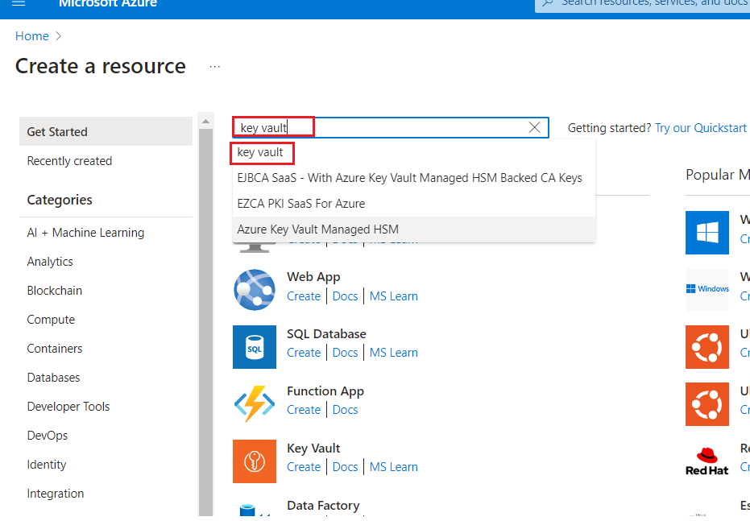

3.  Haga clic en la sección **Key Vault**.

> 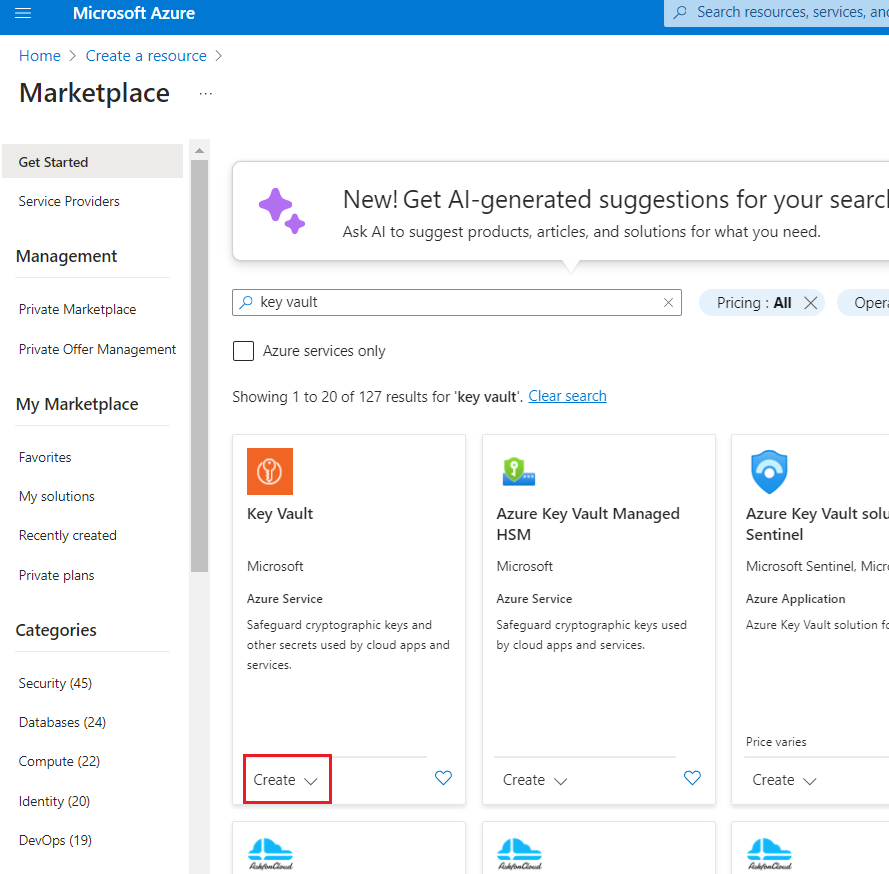

4.  En la página **Create a key Vault**, proporcione la siguiente
    información y haga clic en el botón **Review+create**.

    |     |   |
    |-----|---|
    |Field	|Description|
    |Subscription|	Select the assigned subscription.|
    |Resource group	|Select your Resource group(that you have created in Task 1)|
    |Region|	EastUS 2|
    |Name	|+++fabrickeyvaultXXXXX+++(XXXXX can be Lab instant ID)|
    |Pricing Tier|	Click on change Price Tire>select Standard |

> 

5.  Una vez que la **validación** se haya completado, haga clic en el
    botón **Create**.

> 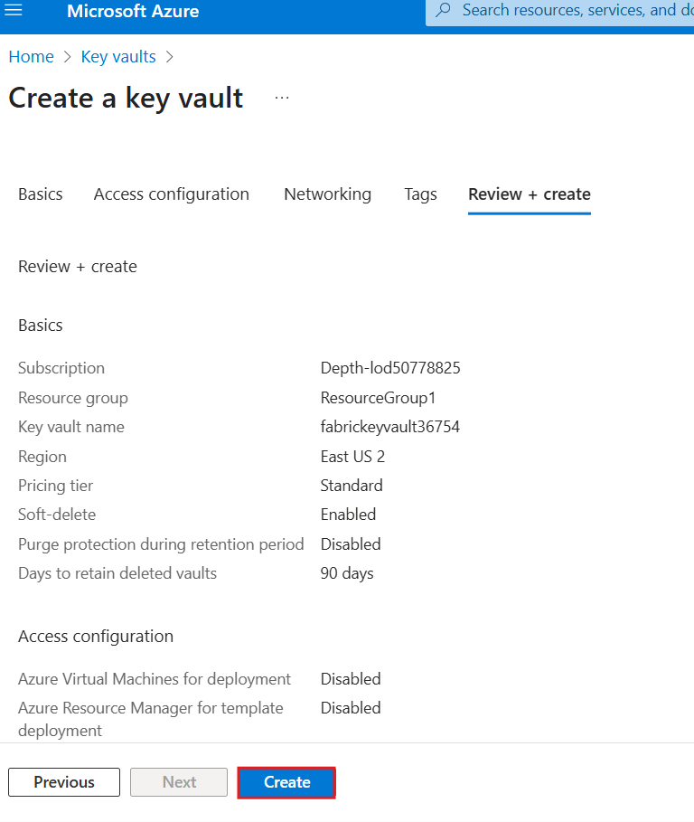

6.  Después de que se complete la implementación, haga clic en el botón
    **Go to resource**.

> 

5.  En la ventana **fabrickeyvaultXX**, en el menú de la izquierda, haga
    clic en **Access control (IAM).**

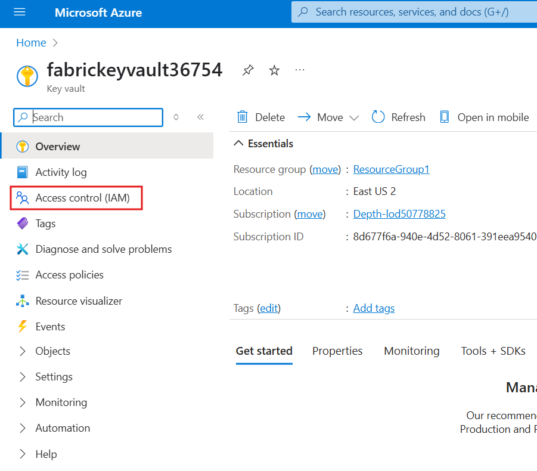

6.  En la página **Access control (IAM)**, haga clic en **+Add** y
    seleccione **Add role assignment**.

> 

5.  En **Job function roles**, escriba **+++Key vault administrator+++**
    en el cuadro de búsqueda y selecciónelo. Haga clic en **Next**.

> 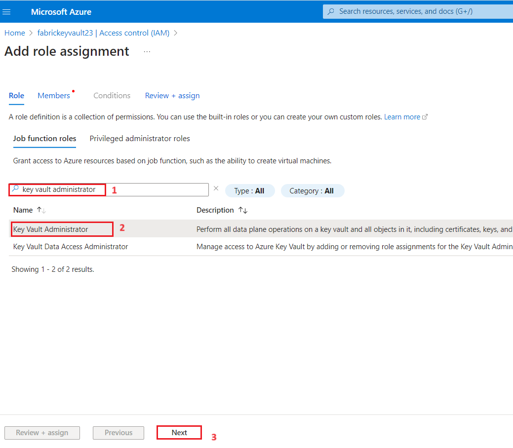

6.  En la pestaña **Add role assignment**, seleccione **Assign access to
    User, group, or service principal**. Debajo de **Members**, haga
    clic en **+ Select members**.

> 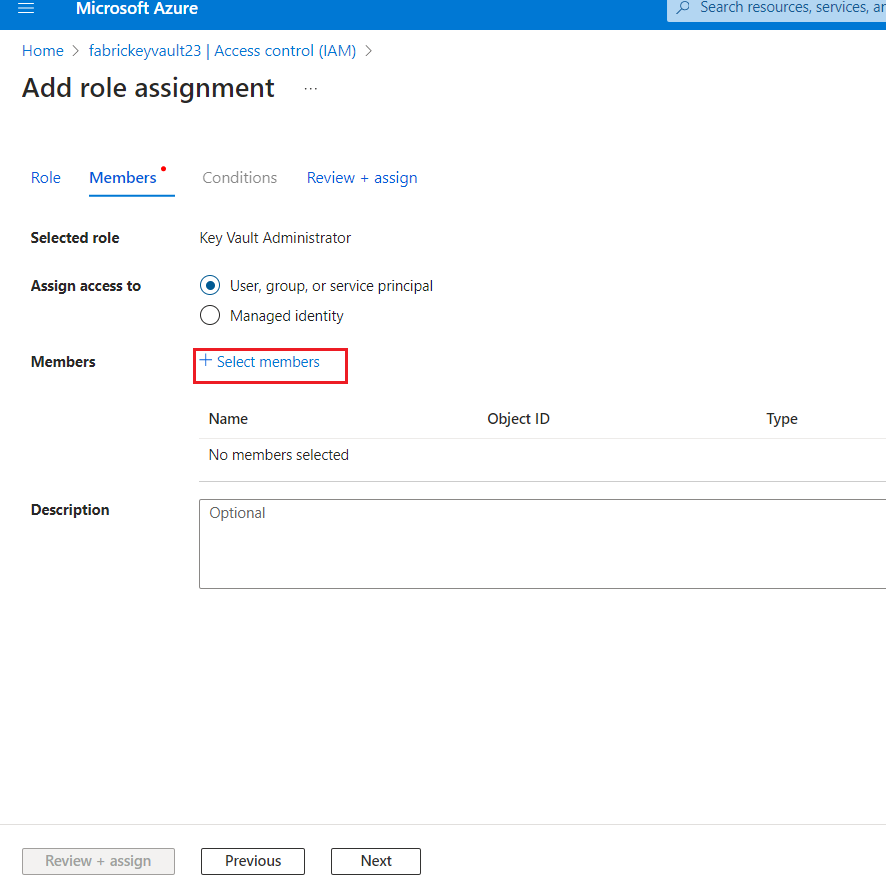

7.  En la pestaña **Select members**, busque su suscripción de Azure
    OpenAI y haga clic en **Select**.

> 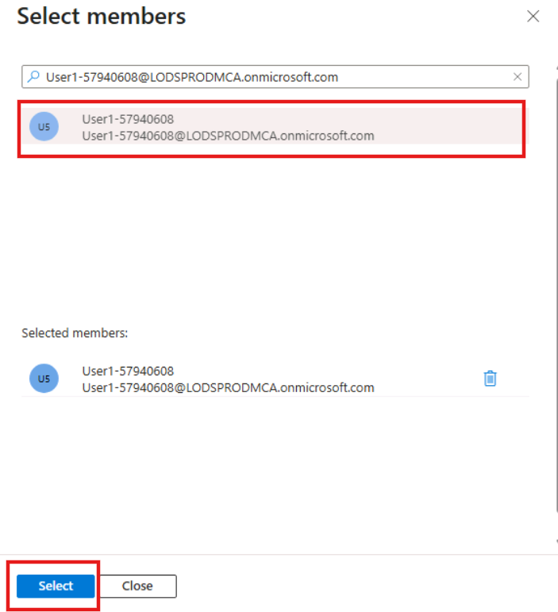

8.  En la página **Add role assignment**, haga clic en **Review +
    Assign**; recibirá una notificación una vez que la asignación del
    rol se haya completado.

> 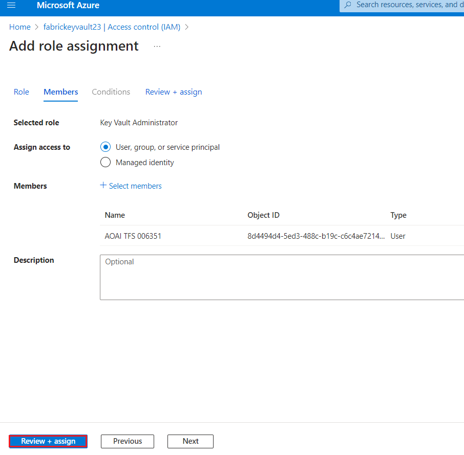
>
> 

9.  Verá una notificación – added as Azure AI Developer for
    Azure-openai-testXX

> 

## Tarea 3: Crear un secreto usando Azure Key Vault

1.  En la barra lateral izquierda de **Key Vault**, seleccione
    **Objects** y luego seleccione **Secrets**.

> 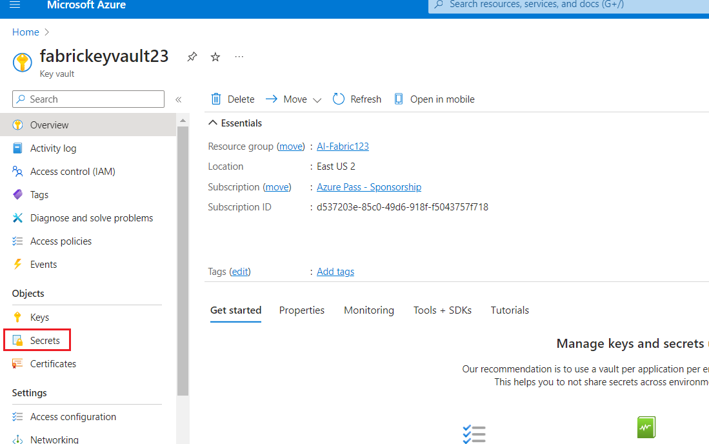

2.  Seleccione **+ Generate/Import**.

> 

3.  En la página **Create a secret**, proporcione la siguiente
    información y haga clic en el botón **Create**.

    |Upload |options	Manual|
    |Name|	Enter the name +++aisearchkey+++|
    |Secret Value|	+++password321+++|

> 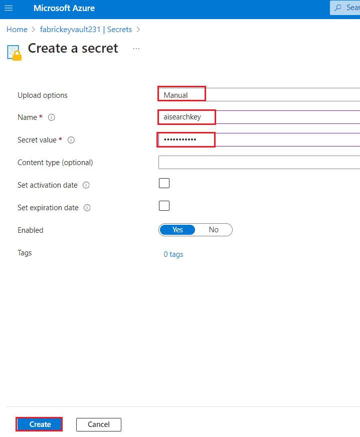

4.  Seleccione **+ Generate/Import**.

> 

5.  En la página **Create a secret**, proporcione la siguiente
    información y haga clic en el botón **Create**.

    |    |   |
    |----|----|
    |Upload |options	Manual|
    |Name|	Enter the name +++aiservicekey+++|
    |Secret Value|	+++password321+++|

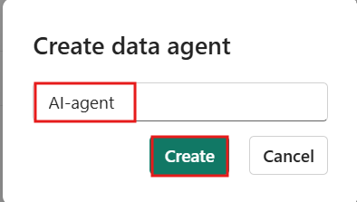

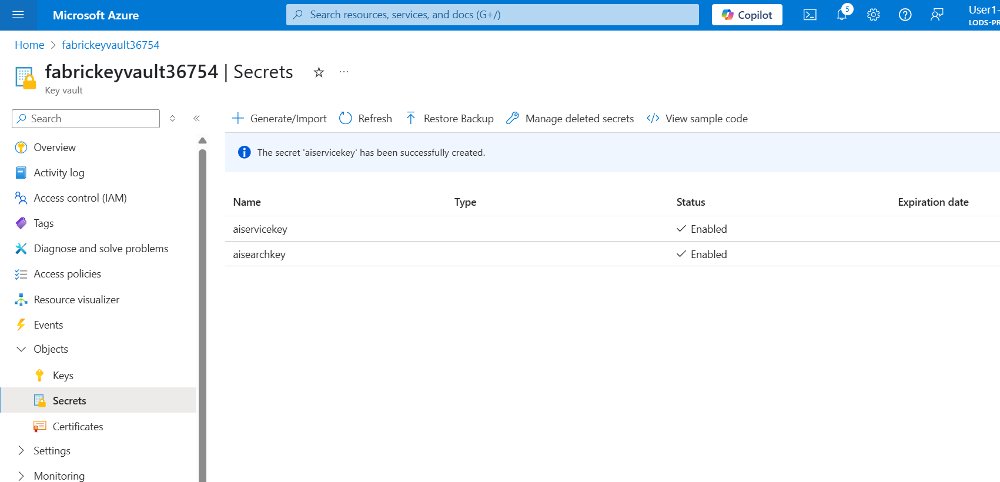

6.  En la página del **Key vault**, copie el nombre del Key vault y los
    valores de **Secrets**, péguelo en un bloc de notas como se muestra
    en la imagen a continuación y **guarde** el archivo para usar la
    información en las próximas tareas.


## **Tarea 4: Crear un servicio Azure AI Search en el portal** 

1.  En la página principal del portal de Azure, haga clic en **+ Create
    Resource**.

> 

2.  En la página **Create a resource**, escriba **Azure AI Search** en
    la barra de búsqueda y haga clic en el **Azure AI Search** que
    aparece.


3.  Haga clic en la sección **azure ai search**.


4.  En la página **Azure AI Search**, haga clic en el botón **Create**.

> 

5.  En la página **Create a search service**, proporcione la siguiente
    información y haga clic en el botón **Review+create**.

    |   |  |
    |----|----|
    |Field	|Description|
    |Subscription	|Select the assigned subscription|
    |Resource group|	Select your Resource group|
    |Region	|EastUS 2|
    |Name	|+++mysearchserviceXXXXX+++(XXXXX can be Lab instant ID)|
    |Pricing Tier	|Click on change Price Tire>select Basic|


6.  Una vez que la validación sea exitosa, haga clic en el botón
    **Create**.


8.  Después de que se complete la implementación, haga clic en el botón
    **Go to resource**.


9.  Copie el nombre de **Azure AI Search** y péguelo en un bloc de notas
    como se muestra en la imagen a continuación, luego **guarde** el
    bloc de notas para usar la información en las próximas tareas del
    laboratorio.


## **Task 5: Crear un workspace de Fabric**

En esta tarea, cree un workspace de Fabric. El workspace contiene todos
los elementos necesarios para este tutorial de lakehouse, incluyendo
lakehouse, dataflows, pipelines de Data Factory, notebooks, conjuntos de
datos de Power BI y reportes.

1.  Abra su navegador, navegue a la barra de direcciones y escriba o
    pegue la siguiente URL: https://app.fabric.microsoft.com/ y presione
    el botón **Enter**.

> 

2.  En la ventana de **Microsoft** **Fabric**, ingrese sus credenciales
    y haga clic en el botón **Submit**.

> 

3.  A continuación, en la ventana de **Microsoft**, ingrese la
    contraseña y haga clic en el botón **Sign** **in**.

> 

4.  En la ventana **Stay signed in?** haga clic en el botón **Yes**.

> 

5.  En el panel **Workspaces**, seleccione **+New workspace**.

> 

6.  En el panel **Create a workspace** que aparece en el lado derecho,
    ingrese los siguientes detalles y haga clic en el botón **Apply**.

    |   |   |
    |----|-----|
    |Name	|++++Document Intelligence-FabricXXXXX+++(XXXXX can be Lab instant ID)|
    |Advanced|	Select Fabric Capacity|
    |Capacity	|Select Realtimefabriccapacity-West US 3|

> 
>
> 

10. Espere a que se complete la implementación. Esto tarda entre 2 y 3
    minutos.


## **Tarea 6: Cree un lakehouse**

1.  En la página de inicio de **Fabric**, seleccione **+New item** y
    seleccione el recuadro **Lakehouse**.

> 

2.  En el cuadro de diálogo **New lakehouse**, ingrese +++
    **data_lakehouse** +++ en el campo **Name**, haga clic en el botón
    **Create** y abra el nuevo **lakehouse**.

> **Nota**: Asegúrese de eliminar el espacio antes de
> **data_lakehouse**.
>
> 

3.  Verá una notificación que indica **Successfully created SQL
    endpoint**.

> 


# **Ejercicio 2: Carga y preprocesamiento de documentos PDF**

## **Tarea 1: Configurar claves de API de Azure** 

Para comenzar, regrese al lakehouse rag\\workshop en su workspace y cree
un nuevo notebook seleccionando Open Notebook y luego New Notebook de
las opciones.

1.  En la página del **lakehouse**, navegue y haga clic en **Open
    notebook** en la barra de comandos, luego seleccione **New
    notebook**.


2.  En el editor de consultas, pegue el siguiente código. Proporcione
    las claves de Azure AI Services, el nombre del Azure Key Vault y los
    secretos para acceder a los servicios.

    ```
    # Azure AI Search
    AI_SEARCH_NAME = ""
    AI_SEARCH_INDEX_NAME = "rag-demo-index"
    AI_SEARCH_API_KEY = ""
    
    # Azure AI Services
    AI_SERVICES_KEY = ""
    AI_SERVICES_LOCATION = ""
    ```

> 

## Tarea 2: Cargar y analizar el documento

1.  Usaremos un documento específico llamado **support.pdf**, que será
    la fuente de nuestros datos.

2.  Para descargar el documento, use el ícono **+ Code** debajo de la
    salida de la celda para agregar una nueva celda de código al
    notebook e ingrese el siguiente código en ella. Haga clic en el
    botón **▷ Run cell** y revise la salida.

    **Copy**
    ```
    import requests
    import os
    
    url = "https://github.com/Azure-Samples/azure-openai-rag-workshop/raw/main/data/support.pdf"
    response = requests.get(url)
    
    # Specify your path here
    path = "/lakehouse/default/Files/"
    
    # Ensure the directory exists
    os.makedirs(path, exist_ok=True)
    
    # Write the content to a file in the specified path
    filename = url.rsplit("/")[-1]
    with open(os.path.join(path, filename), "wb") as f:
        f.write(response.content)
    ```


3.  Ahora, cargue el documento PDF en un Spark DataFrame usando el
    método spark.read.format("binaryFile") proporcionado por Apache
    Spark.

4.  Use el icono **+ Code** debajo de la salida de la celda para agregar
    una nueva celda de código al notebook e ingrese el siguiente código
    en ella. Haga clic en el botón **▷ Run cell** y revise la salida.

**Copiar**

    ```
    from pyspark.sql.functions import udf
    from pyspark.sql.types import StringType
    document_path = f"Files/{filename}"
    df = spark.read.format("binaryFile").load(document_path).select("_metadata.file_name", "content").limit(10).cache()
    display(df)
    ```


Este código leerá el documento PDF y creará un Spark DataFrame llamado
df con el contenido del PDF. El DataFrame tendrá un esquema que
representa la estructura del documento PDF, incluyendo su contenido
textual.

5.  A continuación, utilizaremos Azure AI Document Intelligence para
    leer los documentos PDF y extraer el texto de los mismos.

6.  Use el icono **+ Code** debajo del resultado de la celda para
    agregar una nueva celda de código en el notebook, e ingrese el
    siguiente código en ella. Haga clic en el botón ▷ **Run cell** y
    revise la salida.

**Copiar**
    ```
    from synapse.ml.services import AnalyzeDocument
    from pyspark.sql.functions import col
    
    analyze_document = (
        AnalyzeDocument()
        .setPrebuiltModelId("prebuilt-layout")
        .setSubscriptionKey(AI_SERVICES_KEY)
        .setLocation(AI_SERVICES_LOCATION)
        .setImageBytesCol("content")
        .setOutputCol("result")
    )
    
    analyzed_df = (
        analyze_document.transform(df)
        .withColumn("output_content", col("result.analyzeResult.content"))
        .withColumn("paragraphs", col("result.analyzeResult.paragraphs"))
    ).cache()
    ```


7.  Podemos observar el Spark DataFrame analizado llamado analyzed_df
    usando el siguiente código. Note que eliminamos la columna content
    ya que ya no es necesaria.

8.  Use el icono **+ Code** debajo del resultado de la celda para
    agregar una nueva celda de código en el notebook, e ingrese el
    siguiente código en ella. Haga clic en el botón ▷ **Run cell** y
    revise la salida.

**Copiar**

    ```
    analyzed_df = analyzed_df.drop("content")
    display(analyzed_df)
    ```


# Ejercicio 3: Generación y almacenamiento de embeddings

## **Tarea 1: Fragmentación de texto**

Antes de que podamos generar los embeddings, necesitamos dividir el
texto en fragmentos. Para ello, utilizamos PageSplitter de SynapseML
para separar los documentos en secciones más pequeñas, que
posteriormente se almacenan en la columna chunks. Esto permite una
representación y procesamiento más granular del contenido del documento.

1.  Use el icono **+ Code** debajo del resultado de la celda para
    agregar una nueva celda de código al notebook, ingrese el siguiente
    código en ella, haga clic en el botón ▷ **Run cell** y revise el
    resultado.

    ```
    from synapse.ml.featurize.text import PageSplitter
    
    ps = (
        PageSplitter()
        .setInputCol("output_content")
        .setMaximumPageLength(4000)
        .setMinimumPageLength(3000)
        .setOutputCol("chunks")
    )
    
    splitted_df = ps.transform(analyzed_df)
    display(splitted_df)
    ```


Tenga en cuenta que los chunks de cada documento se presentan en una
sola fila dentro de un arreglo. Para poder generar embeddings de todos
los chunks en las siguientes celdas, necesitamos que cada chunk esté en
una fila separada.

2.  Use el icono **+ Code** debajo de la salida de la celda para agregar
    una nueva celda de código al notebook, e ingrese el siguiente código
    en ella. Haga clic en el botón ▷ **Run cell** y revise la salida.

**Copiar**

    ```
    from pyspark.sql.functions import posexplode, col, concat
    
    # Each "chunks" column contains the chunks for a single document in an array
    # The posexplode function will separate each chunk into its own row
    exploded_df = splitted_df.select("file_name", posexplode(col("chunks")).alias("chunk_index", "chunk"))
    
    # Add a unique identifier for each chunk
    exploded_df = exploded_df.withColumn("unique_id", concat(exploded_df.file_name, exploded_df.chunk_index))
    
    display(exploded_df)
    ```


A partir de este fragmento de código, primero "explotamos" estos
arreglos para que haya un solo chunk en cada fila, y luego filtramos el
Spark DataFrame para mantener únicamente la ruta del documento y el
chunk en una sola fila.

## Tarea 2: Generación de embeddings 

A continuación, generaremos los embeddings para cada fragmento. Para
ello, utilizamos tanto SynapseML como el servicio Azure OpenAI. Al
integrar el servicio Azure OpenAI incorporado con SynapseML, podemos
aprovechar la potencia del framework de computación distribuida Apache
Spark para procesar múltiples prompts utilizando el servicio de OpenAI.

1.  Use el icono **+ Code** debajo del resultado de la celda para
    agregar una nueva celda de código en el notebook, ingrese el
    siguiente código en ella, haga clic en el botón ▷ **Run cell** y
    revise el resultado.

**Copiar**
    ```
    from synapse.ml.services import OpenAIEmbedding
    
    embedding = (
        OpenAIEmbedding()
        .setDeploymentName("text-embedding-ada-002")
        .setTextCol("chunk")
        .setErrorCol("error")
        .setOutputCol("embeddings")
    )
    
    df_embeddings = embedding.transform(exploded_df)
    
    display(df_embeddings)
    ```


Esta integración permite que el cliente de SynapseML Embedding genere
embeddings de manera distribuida, facilitando el procesamiento eficiente
de grandes volúmenes de datos.

## Tarea 3: Almacenar Embeddings

[Azure AI
Search](https://learn.microsoft.com/azure/search/search-what-is-azure-search?WT.mc_id=data-114676-jndemenge) es
un potente motor de búsqueda que incluye la capacidad de realizar
búsqueda de texto completo, búsqueda vectorial y búsqueda híbrida. Para
más ejemplos de sus características de búsqueda vectorial, consulte
[azure-search-vector-samples
repository](https://github.com/Azure/azure-search-vector-samples/).

Almacenar datos en Azure AI Search implica dos pasos principales::

**Creación del índice:** El primer paso consiste en definir el esquema
del índice de búsqueda, que incluye las propiedades de cada campo, así
como las estrategias de búsqueda vectorial que se utilizarán.

**Agregar documentos segmentados y embeddings:** El segundo paso es
subir los documentos segmentados, junto con sus embeddings
correspondientes, al índice. Esto permite un almacenamiento y
recuperación eficientes de los datos utilizando búsqueda híbrida y
vectorial.

1.  El siguiente fragmento de código demuestra cómo crear un índice en
    Azure AI Search utilizando la REST API de Azure AI Search. Este
    código crea un índice con campos para el identificador único de cada
    documento, el contenido de texto del documento y el embedding
    vectorial del contenido de texto.

2.  Use el icono **+ Code** debajo del resultado de la celda para
    agregar una nueva celda de código en el notebook, e ingrese el
    siguiente código en ella. Haga clic en el botón **▷ Run cell** y
    revise el resultado.

**Copiar**

    ```
    import requests
    import json
    
    # Length of the embedding vector (OpenAI ada-002 generates embeddings of length 1536)
    EMBEDDING_LENGTH = 1536
    
    # Define your AI Search index name and API key
    AI_SEARCH_INDEX_NAME = " rag-demo-index"
    AI_SEARCH_API_KEY = "your_api_key"
    
    # Create index for AI Search with fields id, content, and contentVector
    url = f"https://mysearchservice356.search.windows.net/indexes/{AI_SEARCH_INDEX_NAME}?api-version=2024-07-01"
    payload = json.dumps(
        {
            "name": AI_SEARCH_INDEX_NAME,
            "fields": [
                {
                    "name": "id",
                    "type": "Edm.String",
                    "key": True,
                    "filterable": True,
                },
                {
                    "name": "content",
                    "type": "Edm.String",
                    "searchable": True,
                    "retrievable": True,
                },
                {
                    "name": "contentVector",
                    "type": "Collection(Edm.Single)",
                    "searchable": True,
                    "retrievable": True,
                    "dimensions": EMBEDDING_LENGTH,
                    "vectorSearchProfile": "vectorConfig",
                },
            ],
            "vectorSearch": {
                "algorithms": [{"name": "hnswConfig", "kind": "hnsw", "hnswParameters": {"metric": "cosine"}}],
                "profiles": [{"name": "vectorConfig", "algorithm": "hnswConfig"}],
            },
        }
    )
    headers = {"Content-Type": "application/json", "api-key": AI_SEARCH_API_KEY}
    
    response = requests.put(url, headers=headers, data=payload)
    if response.status_code == 201:
        print("Index created!")
    elif response.status_code == 204:
        print("Index updated!")
    else:
        print(f"HTTP request failed with status code {response.status_code}")
        print(f"HTTP response body: {response.text}")
    ```


3.  El siguiente paso es cargar los chunks en el índice recién creado de
    Azure AI Search. La REST API de Azure AI Search admite hasta 1000
    “documentos” por solicitud. Tenga en cuenta que, en este caso, cada
    uno de nuestros “documentos” es en realidad un chunk del archivo
    original.

4.  Use el icono **+ Code** debajo de la salida de la celda para agregar
    una nueva celda de código en el notebook, e ingrese el siguiente
    código en ella. Haga clic en el botón ▷ **Run cell** y revise la
    salida.

**Copiar**
    ```
    import re
    
    from pyspark.sql.functions import monotonically_increasing_id
    
    
    def insert_into_index(documents):
        """Uploads a list of 'documents' to Azure AI Search index."""
    
        url = f"https://{AI_SEARCH_NAME}.search.windows.net/indexes/{AI_SEARCH_INDEX_NAME}/docs/index?api-version=2023-11-01"
    
        payload = json.dumps({"value": documents})
        headers = {
            "Content-Type": "application/json",
            "api-key": AI_SEARCH_API_KEY,
        }
    
        response = requests.request("POST", url, headers=headers, data=payload)
    
        if response.status_code == 200 or response.status_code == 201:
            return "Success"
        else:
            return f"Failure: {response.text}"
    
    def make_safe_id(row_id: str):
        """Strips disallowed characters from row id for use as Azure AI search document ID."""
        return re.sub("[^0-9a-zA-Z_-]", "_", row_id)
    
    
    def upload_rows(rows):
        """Uploads the rows in a Spark dataframe to Azure AI Search.
        Limits uploads to 1000 rows at a time due to Azure AI Search API limits.
        """
        BATCH_SIZE = 1000
        rows = list(rows)
        for i in range(0, len(rows), BATCH_SIZE):
            row_batch = rows[i : i + BATCH_SIZE]
            documents = []
            for row in rows:
                documents.append(
                    {
                        "id": make_safe_id(row["unique_id"]),
                        "content": row["chunk"],
                        "contentVector": row["embeddings"].tolist(),
                        "@search.action": "upload",
                    },
                )
            status = insert_into_index(documents)
            yield [row_batch[0]["row_index"], row_batch[-1]["row_index"], status]
    
    # Add ID to help track what rows were successfully uploaded
    df_embeddings = df_embeddings.withColumn("row_index", monotonically_increasing_id())
    
    # Run upload_batch on partitions of the dataframe
    res = df_embeddings.rdd.mapPartitions(upload_rows)
    display(res.toDF(["start_index", "end_index", "insertion_status"]))
    ```


# Ejercicio 4: Recuperación de documentos relevantes y respuesta a preguntas

Después de procesar el documento, podemos proceder a formular una
pregunta. Usaremos
[SynapseML](https://microsoft.github.io/SynapseML/docs/Explore%20Algorithms/OpenAI/Quickstart%20-%20OpenAI%20Embedding/) para
convertir la pregunta del usuario en un embedding y luego utilizaremos
la similitud coseno para recuperar los top K fragmentos de documentos
que coincidan más estrechamente con la pregunta del usuario.

## Tarea 1: Configurar el entorno y las claves de API de Azure

Cree un nuevo notebook en el Lakehouse y guárdelo como rag\\application.
Usaremos este notebook para crear la aplicación RAG.

1.  Proporcione las credenciales para acceder a Azure AI Search. Puede
    copiar los valores desde el Azure Portal (Ejercicio 1 \> Tarea 4).

2.  Use el **icono + Code** debajo del resultado de la celda para
    agregar una nueva celda de código en el notebook, e ingrese el
    siguiente código en ella. Haga clic en **▷ Run cell** y revise el
    resultado.

    Copy
    ```
    # Azure AI Search
    AI_SEARCH_NAME = ''
    AI_SEARCH_INDEX_NAME = 'rag-demo-index'
    AI_SEARCH_API_KEY = ''
    ```


3.  La siguiente función toma como entrada la pregunta del usuario y la
    convierte en un embedding utilizando el modelo
    text-embedding-ada-002. Este código asume que está utilizando los
    servicios de IA preintegrados en Microsoft Fabric.

4.  Use el icono **+ Code** debajo del resultado de la celda para
    agregar una nueva celda de código en el notebook, e ingrese el
    siguiente código en ella. Haga clic en el botón ▷ **Run cell** y
    revise el resultado.

    ```
    def gen_question_embedding(user_question):
        """Generates embedding for user_question using SynapseML."""
        from synapse.ml.services import OpenAIEmbedding
    
        df_ques = spark.createDataFrame([(user_question, 1)], ["questions", "dummy"])
        embedding = (
            OpenAIEmbedding()
            .setDeploymentName('text-embedding-ada-002')
            .setTextCol("questions")
            .setErrorCol("errorQ")
            .setOutputCol("embeddings")
        )
        df_ques_embeddings = embedding.transform(df_ques)
        row = df_ques_embeddings.collect()[0]
        question_embedding = row.embeddings.tolist()
        return question_embedding
    ```


## Tarea 2: Recuperar documentos relevantes

1.  El siguiente paso es usar la pregunta del usuario y su embedding
    para recuperar los top K fragmentos de documentos más relevantes del
    índice de búsqueda. La siguiente función recupera los top K
    registros utilizando hybrid search.

2.  Use el icono **+ Code** icon debajo de la salida de la celda para
    agregar una nueva celda de código en el notebook, y pegue el
    siguiente código en ella. Haga clic en el botón **▷ Run cell** y
    revise la salida.

**Copiar**
    ```
    import json 
    import requests
    
    def retrieve_top_chunks(k, question, question_embedding):
        """Retrieve the top K entries from Azure AI Search using hybrid search."""
        url = f"https://{AI_SEARCH_NAME}.search.windows.net/indexes/{AI_SEARCH_INDEX_NAME}/docs/search?api-version=2023-11-01"
    
        payload = json.dumps({
            "search": question,
            "top": k,
            "vectorQueries": [
                {
                    "vector": question_embedding,
                    "k": k,
                    "fields": "contentVector",
                    "kind": "vector"
                }
            ]
        })
    
        headers = {
            "Content-Type": "application/json",
            "api-key": AI_SEARCH_API_KEY,
        }
    
        response = requests.request("POST", url, headers=headers, data=payload)
        output = json.loads(response.text)
        return output
    ```


Con esas funciones definidas, podemos definir una función que tome la
pregunta de un usuario, genere un embedding para la pregunta, recupere
los top K fragmentos de documentos y concatene el contenido de los
documentos recuperados para formar el contexto de la pregunta del
usuario..

3.  Use el icono **+ Code** icon debajo de la salida de la celda para
    agregar una nueva celda de código en el notebook, y pegue el
    siguiente código en ella. Haga clic en el botón **▷ Run cell** y
    revise la salida.

**Copiar**

    ```
    def get_context(user_question, retrieved_k = 5):
        # Generate embeddings for the question
        question_embedding = gen_question_embedding(user_question)
    
        # Retrieve the top K entries
        output = retrieve_top_chunks(retrieved_k, user_question, question_embedding)
    
        # concatenate the content of the retrieved documents
        context = [chunk["content"] for chunk in output["value"]]
    
        return context
    ```


## **Tarea 3: Responder la pregunta del usuario**

Finalmente, podemos definir una función que tome la pregunta del
usuario, recupere el contexto de la pregunta y envíe tanto el contexto
como la pregunta a un modelo de lenguaje grande para generar una
respuesta. Para esta demostración, utilizaremos gpt-35-turbo-16k, un
modelo optimizado para la conversación.

1.  Use el icono **+ Code** icon debajo de la salida de la celda para
    agregar una nueva celda de código en el notebook, y pegue el
    siguiente código en ella. Haga clic en el botón **▷ Run cell** y
    revise la salida.

**Copiar**

    ```
    from pyspark.sql import Row
    from synapse.ml.services.openai import OpenAIChatCompletion
    
    
    def make_message(role, content):
        return Row(role=role, content=content, name=role)
    
    def get_response(user_question):
        context = get_context(user_question)
    
        # Write a prompt with context and user_question as variables 
        prompt = f"""
        context: {context}
        Answer the question based on the context above.
        If the information to answer the question is not present in the given context then reply "I don't know".
        """
    
        chat_df = spark.createDataFrame(
            [
                (
                    [
                        make_message(
                            "system", prompt
                        ),
                        make_message("user", user_question),
                    ],
                ),
            ]
        ).toDF("messages")
    
        chat_completion = (
            OpenAIChatCompletion()
            .setDeploymentName("gpt-35-turbo-16k") # deploymentName could be one of {gpt-35-turbo, gpt-35-turbo-16k}
            .setMessagesCol("messages")
            .setErrorCol("error")
            .setOutputCol("chat_completions")
        )
    
        result_df = chat_completion.transform(chat_df).select("chat_completions.choices.message.content")
    
        result = []
        for row in result_df.collect():
            content_string = ' '.join(row['content'])
            result.append(content_string)
    
        # Join the list into a single string
        result = ' '.join(result)
        
        return result
    ```


2.  Ahora, podemos llamar a esa función con una pregunta de ejemplo para
    ver la respuesta:

3.  Use el icono **+ Code** icon debajo de la salida de la celda para
    agregar una nueva celda de código en el notebook, y pegue el
    siguiente código en ella. Haga clic en el botón **▷ Run cell** y
    revise la salida.

    ```
    user_question = "how do i make a booking?"
    response = get_response(user_question)
    print(response)
    ```


## Tarea 4: Eliminar los recursos

Para evitar incurrir en costos innecesarios en Azure, debe eliminar los
recursos que creó en este inicio rápido si ya no son necesarios. Para
administrar los recursos, puede usar el [Azure
portal](https://portal.azure.com/?azure-portal=true).

1.  Para eliminar la cuenta de almacenamiento, navegue a la página de
    inicio del **Azure portal**, y haga clic en **Resource groups**.

> 

2.  Haga clic en el resource group asignado.


3.  En la página principal del **Resource group**, seleccione los
    recursos **Azure AI services**, **Key vault** y **Search service**.
    

4.  Seleccione **Delete**


5.  En el panel **Delete Resources** que aparece en el lado derecho,
    vaya al campo **Enter +++delete+++ to confirm deletion**, luego haga
    clic en el botón **Delete**.


6.  En el cuadro de diálogo de confirmación **Delete**, haga clic en el
    botón **Delete**.

> 

7.  Abra su navegador, vaya a la barra de direcciones y escriba o pegue
    la siguiente URL: +++https://app.fabric.microsoft.com/+++ y presione
    el botón **Enter**.

> 

8.  Seleccione la opción ... debajo del nombre del workspace y
    seleccione **Workspace settings**.


9.  Seleccione **General** y haga clic en **Remove this workspace.**

> 

10. Haga clic en **Delete** en la advertencia que aparece.


11. Espere a recibir una notificación de que el Workspace ha sido
    eliminado antes de continuar con el siguiente laboratorio.


