## Caso de uso 06- Identificación y extracción de texto con Document Intelligence en Microsoft Fabric

**Introducción**

Analizar datos estructurados ha sido un proceso sencillo desde hace
tiempo, pero no se puede decir lo mismo de los datos no estructurados.
Los datos no estructurados, como texto, imágenes y videos, son más
difíciles de analizar e interpretar. Sin embargo, con la llegada de
modelos avanzados de IA, como GPT-3 y GPT-4 de OpenAI, ahora es más
fácil analizar y obtener información de datos no estructurados.

Un ejemplo de este tipo de análisis es la capacidad de consultar un
documento para obtener información específica utilizando lenguaje
natural, lo cual es posible mediante una combinación de recuperación de
información y generación de lenguaje.

Al aprovechar el enfoque RAG (Retrieval-Augmented Generation), puede
crear un potente pipeline de preguntas y respuestas que utiliza un
modelo de lenguaje grande (LLM) y sus propios datos para generar
respuestas.

La arquitectura de esta aplicación se muestra a continuación:


**Objetivos**

- Crear un recurso multiservicio para Azure AI Services utilizando Azure
  Portal.

- Crear la capacidad de Fabric, el espacio de trabajo, el Key Vault y el
  espacio de trabajo de Fabric.

- Preprocesar documentos PDF utilizando Azure AI Document Intelligence
  en Azure AI Services.

- Realizar text chunking mediante SynapseML.

- Generar embeddings para los fragmentos utilizando SynapseML y Azure
  OpenAI Services.

- Almacenar los embeddings en Azure AI Search.

- Crear un pipeline de preguntas y respuestas.

# **Ejercicio 1: Configuración del entorno**

## Tarea 1: Crear un recurso multiservicio para Azure AI Services

El recurso multiservicio se encuentra en **Azure AI services \> Azure AI
services multi-service account dentro del portal**. Para crear un
recurso multiservicio, siga estas instrucciones:

1.  Seleccione el siguiente enlace para crear un recurso multiservicio: 

++++https://portal.azure.com/#create/Microsoft.CognitiveServicesAllInOne+++

    |Project details | Description |
    |-----|----|
    |Subscription|	@lab.CloudSubscription.Name |
    |Resource group|	@lab.CloudResourceGroup(ResourceGroup1).Name|
    |Region|	Select the appropriate region for your CognitiveServices. In this lab, we have chosen the **East US 2** region.|
    |Name	|+++Cognitive-service@lab.LabInstance.Id+++ (must be a unique Id)|
    |Pricing tier	|Standard S0|

2.  En la página **Create**, proporcione la siguiente información:

3.  Configure otros parámetros del recurso según sea necesario, lea y
    acepte las condiciones (cuando aplique), y seleccione **Review +
    create**.

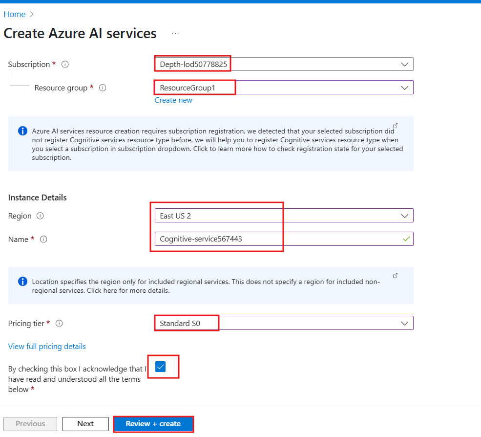

4.  En la pestaña **Review + submit**, cuando aparezca **Validation
    passed**, haga clic en **Create**.

> 

5.  Una vez completada la implementación, haga clic en **Go to
    resource**.

> 

6.  En la ventana de su **Azure AI Service**, diríjase a la sección
    **Resource Management** y seleccione **Keys and Endpoints**.

> 

7.  En la página **Keys and Endpoints**, copie los valores **KEY1,
    KEY2** y **Endpoint**, y péguelo en un archivo de Notepad, como se
    muestra en la imagen. **Guarde** el archivo para usar esta
    información en las tareas siguientes.

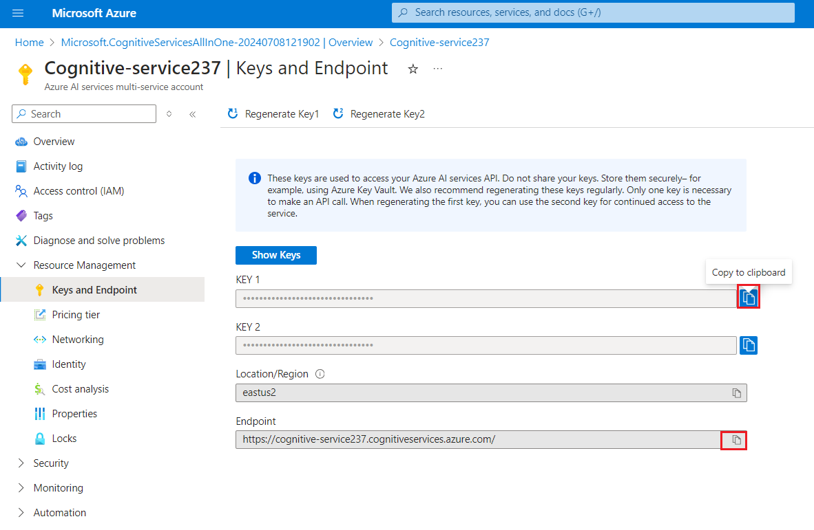

## **Tarea 2: Crear un servicio de Azure AI Search en el portal**

1.  En la página principal de Azure Portal, haga clic en **+ Create
    Resource**.

> 

2.  En la página **Create a resource**, en la barra de búsqueda escriba
    **Azure Cognitive Search** y haga clic en **azure AI search** que
    aparece.

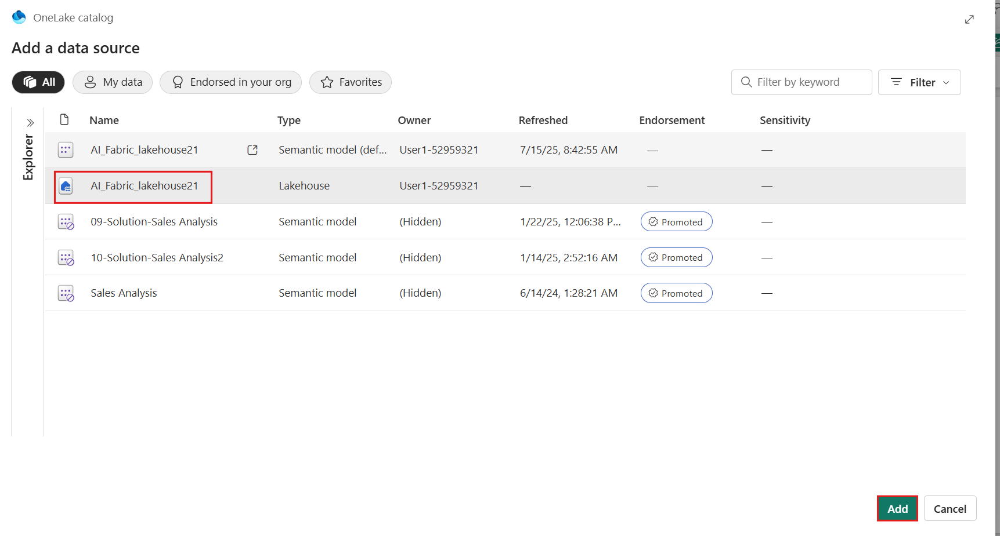

3.  Haga clic en la sección **azure AI search**.


4.  En la página de **Azure AI Search**, haga clic en **Create**.

> 

5.  En la página **Create a search service**, proporcione la siguiente
    información y haga clic en **Review + create**:

|Field	|Description|
|-----|------|
|Subscription	|Select the assigned subscription|
|Resource group	|Select your Resource group|
|Region|	EastUS 2|
|Name	|+++mysearchserviceXXXXX+++(XXXXX can be Lab instant ID)|
|Pricing Tier|	Click on change Price Tire>select Basic|

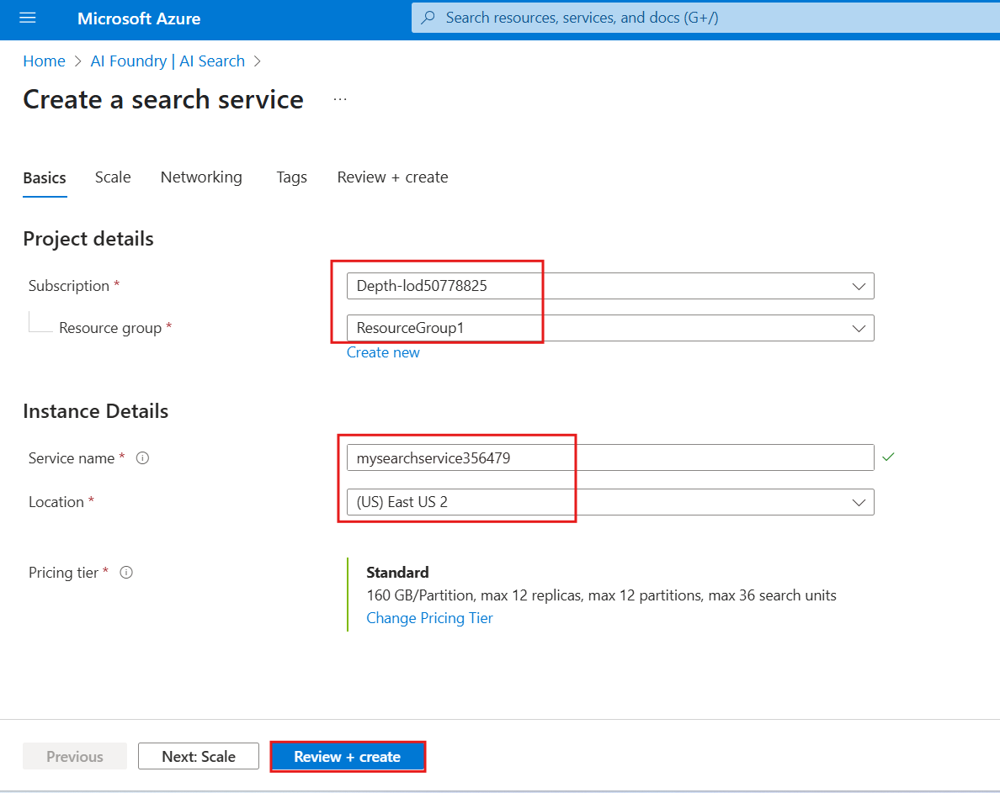


6.  Una vez que la validación sea satisfactoria, haga clic en
    **Create**.


8.  Después de completar la implementación, haga clic en **Go to
    resource**.


9.  Copie el nombre del servicio de **AI Search** y péguelo en un
    archivo de **Notepad**, como se muestra en la imagen. **Guarde** el
    archivo para utilizar esta información en el laboratorio siguiente.

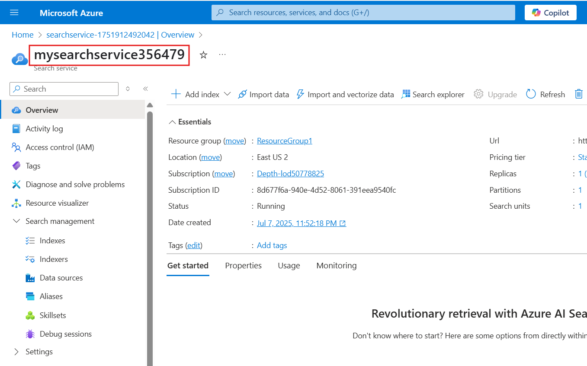

## **Tarea 5: Crear un espacio de trabajo de Fabric**

En esta tarea, se creará un espacio de trabajo de Fabric. El espacio de
trabajo contiene todos los elementos necesarios para este tutorial de
lakehouse, que incluyen lakehouse, dataflows, Data Factory pipelines,
los notebooks, conjuntos de datos de Power BI y reportes.

1.  Abra su navegador, diríjase a la barra de direcciones y escriba o
    pegue la siguiente URL: https://app.fabric.microsoft.com/ y presione
    **Enter**.

> 

2.  En la ventana de **Microsoft Fabric**, ingrese sus credenciales y
    haga clic en **Submit**.

> 

3.  Luego, en la ventana de **Microsoft**, ingrese la contraseña y haga
    clic en **Sign in**.

> 

4.  En la ventana **Stay signed in?,** haga clic en **Yes.**

> 

5.  En el panel **Workspaces**, seleccione **+ New workspace**.

> 

6.  En el panel **Create a workspace** que aparece en el lado derecho,
    ingrese los siguientes datos y haga clic en **Apply**:

    |   |   |
    |----|-----|
    |Name	|+++Document Intelligence-Fabric@lab.LabInstance.Id+++ (must be a unique Id)|
    |Advanced|	Select **Fabric Capacity**|
    |Capacity	|Select the available capacity|

> 
>
> 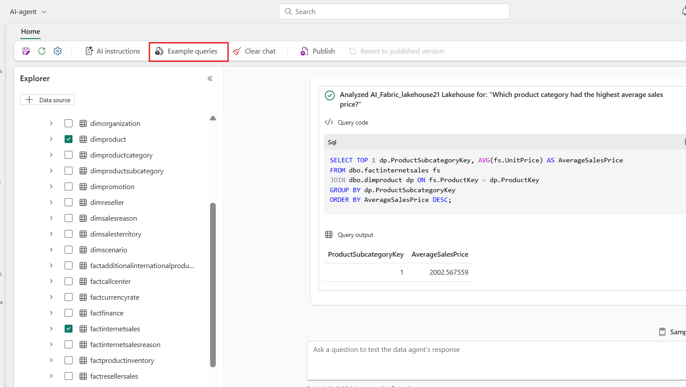

10. Espere a que se complete la implementación. Este proceso tarda
    aproximadamente 2-3 minutos.

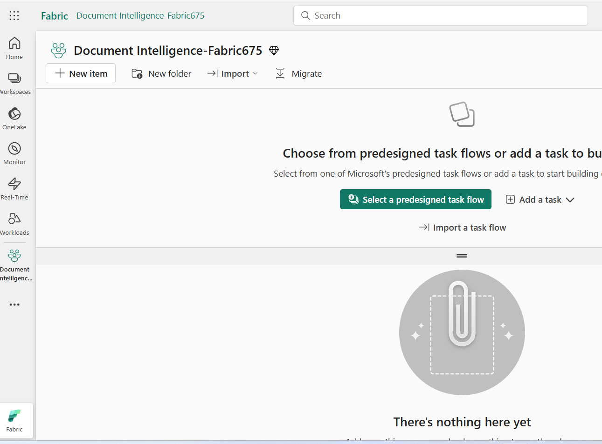

## **Tarea 6: Crear un lakehouse**

1.  En la página de inicio de Fabric, seleccione **+ New item** y luego
    seleccione el mosaico de Lakehouse.

> 

2.  En el cuadro de diálogo **New lakehouse**, ingrese
    +++data_lakehouse+++ en el campo **Name**, haga clic en **Create** y
    abra el **nuevo lakehouse**.

> **Nota:** Asegúrese de eliminar cualquier espacio antes de
> data_lakehouse**.**
>
> 

3.  Aparecerá una notificación indicando **Successfully created SQL
    endpoint**.

> 


# **Ejercicio 2: Carga y preprocesamiento de documentos PDF **

## **Tarea 1: Configure Azure API keys**

Para comenzar, navegue de regreso al **Lakehouse rag_workshop** en su
espacio de trabajo y cree un nuevo notebook seleccionando **Open
Notebook** y **luego New Notebook** en las opciones.

1.  En la página del **Lakehouse**, haga clic en **Open notebook** en la
    barra de comandos y luego seleccione **New notebook.**


2.  En el editor de consultas, pegue el siguiente código. Proporcione
    las claves para Azure AI Services, el nombre de Azure Key Vault y
    los secrets necesarios para acceder a los servicios.


    ```
    # Azure AI Search
    AI_SEARCH_NAME = ""
    AI_SEARCH_INDEX_NAME = "rag-demo-index"
    AI_SEARCH_API_KEY = ""
    
    # Azure AI Services
    AI_SERVICES_KEY = ""
    AI_SERVICES_LOCATION = ""
    ```

> 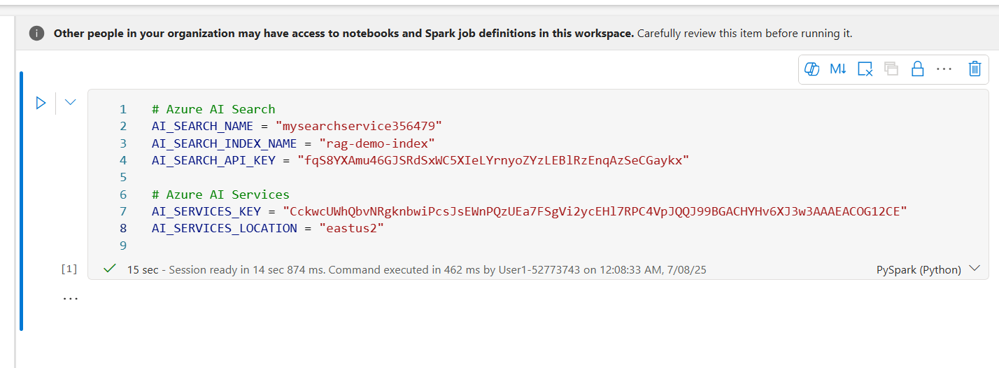

## Tarea 2: Carga y análisis del documento

1.  Utilizaremos un documento específico llamado **support.pdf**, que
    será la fuente de nuestros datos.

2.  Para descargar el documento, utilice el ícono **+ Code** debajo del
    resultado de la celda para agregar una nueva celda de código al
    notebook e ingrese el siguiente código. Luego, haga clic en **▷ Run
    cell** y revise el resultado:

**Copy**

    ```
    import requests
    import os
    
    url = "https://github.com/Azure-Samples/azure-openai-rag-workshop/raw/main/data/support.pdf"
    response = requests.get(url)
    
    # Specify your path here
    path = "/lakehouse/default/Files/"
    
    # Ensure the directory exists
    os.makedirs(path, exist_ok=True)
    
    # Write the content to a file in the specified path
    filename = url.rsplit("/")[-1]
    with open(os.path.join(path, filename), "wb") as f:
        f.write(response.content)
    ```
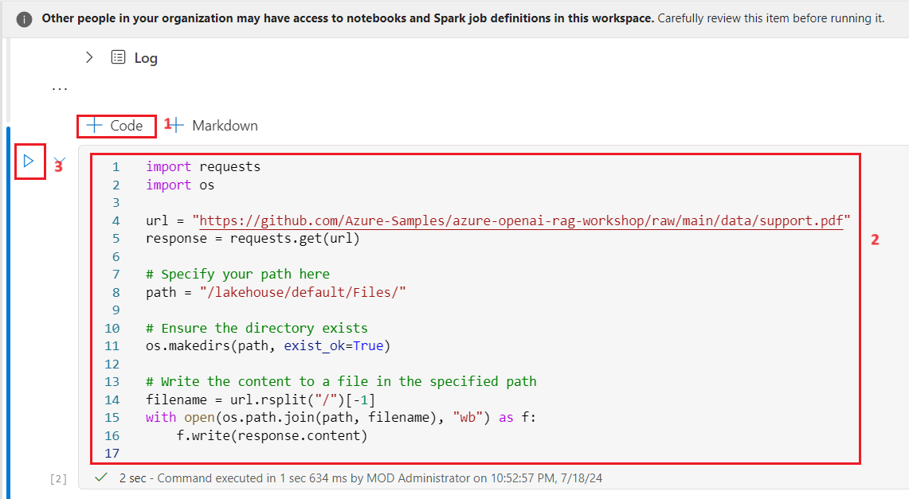

3.  Ahora, cargue el documento PDF en un Spark DataFrame utilizando el
    método spark.read.format("binaryFile") proporcionado por Apache
    Spark.

4.  Utilice el ícono **+ Code** debajo del resultado de la celda para
    agregar una nueva celda de código al notebook e ingrese el siguiente
    código. Luego, haga clic en **▷ Run cell** y verifique el resultado:

**Copy**

    ```
    from pyspark.sql.functions import udf
    from pyspark.sql.types import StringType
    document_path = f"Files/{filename}"
    df = spark.read.format("binaryFile").load(document_path).select("_metadata.file_name", "content").limit(10).cache()
    display(df)
    ```


Este código leerá el documento PDF y creará un Spark DataFrame llamado
df con el contenido del PDF. El DataFrame tendrá un esquema que
representa la estructura del documento PDF, incluyendo su contenido
textual.

5.  A continuación, utilizaremos Azure AI Document Intelligence para
    leer los documentos PDF y extraer el texto de los mismos.

6.  Utilice el ícono **+ Code** debajo del resultado de la celda para
    agregar una nueva celda de código al notebook e ingrese el siguiente
    código. Luego, haga clic en **▷ Run cell** y verifique el resultado:

**Copy**

    ```
    from synapse.ml.services import AnalyzeDocument
    from pyspark.sql.functions import col
    
    analyze_document = (
        AnalyzeDocument()
        .setPrebuiltModelId("prebuilt-layout")
        .setSubscriptionKey(AI_SERVICES_KEY)
        .setLocation(AI_SERVICES_LOCATION)
        .setImageBytesCol("content")
        .setOutputCol("result")
    )
    
    analyzed_df = (
        analyze_document.transform(df)
        .withColumn("output_content", col("result.analyzeResult.content"))
        .withColumn("paragraphs", col("result.analyzeResult.paragraphs"))
    ).cache()
    ```


7.  Podemos observar el **Spark DataFrame** analizado, llamado
    **analyzed_df**, utilizando el siguiente código. Nótese que se
    elimina la columna **content** ya que no es necesaria.

8.  Utilice el ícono **+ Code** debajo del resultado de la celda para
    agregar una nueva celda de código al notebook e ingrese el siguiente
    código. Luego, haga clic en **▷ Run cell** y verifique el resultado:

**Copy**

    ```
    analyzed_df = analyzed_df.drop("content")
    display(analyzed_df)
    ```


# Ejercicio 3: Generación y almacenamiento de embeddings

## **Tarea 1: Segmentación de texto**

Antes de generar los embeddings, necesitamos dividir el texto en
fragmentos. Para ello, utilizamos PageSplitter de SynapseML, que divide
los documentos en secciones más pequeñas, las cuales se almacenan en la
columna chunks. Esto permite una representación y procesamiento más
granular del contenido del documento.

1.  Utilice el ícono **+ Code** debajo del resultado de la celda para
    agregar una nueva celda de código al notebook e ingrese el siguiente
    código. Luego, haga clic en **▷ Run cell** y revise el resultado:

**Copy**

    ```
    from synapse.ml.featurize.text import PageSplitter
    
    ps = (
        PageSplitter()
        .setInputCol("output_content")
        .setMaximumPageLength(4000)
        .setMinimumPageLength(3000)
        .setOutputCol("chunks")
    )
    
    splitted_df = ps.transform(analyzed_df)
    display(splitted_df)
    ```


Nota: Los fragmentos de cada documento se presentan en una sola fila
dentro de un array. Para poder generar los embeddings de todos los
fragmentos en las siguientes celdas, necesitamos que cada fragmento esté
en una fila separada.

2.  Utilice el ícono **+ Code** debajo del resultado de la celda para
    agregar una nueva celda de código al notebook e ingrese el siguiente
    código. Luego, haga clic en **▷ Run cell** y revise el resultado:

**Copy**

    ```
    from pyspark.sql.functions import posexplode, col, concat
    
    # Each "chunks" column contains the chunks for a single document in an array
    # The posexplode function will separate each chunk into its own row
    exploded_df = splitted_df.select("file_name", posexplode(col("chunks")).alias("chunk_index", "chunk"))
    
    # Add a unique identifier for each chunk
    exploded_df = exploded_df.withColumn("unique_id", concat(exploded_df.file_name, exploded_df.chunk_index))
    
    display(exploded_df)
    ```


En este fragmento de código, primero explotamos los arrays para que haya
un solo fragmento por fila y luego filtramos el DataFrame de Spark para
mantener únicamente la ruta del documento y el fragmento en una fila
separada.

## Tarea 2: Generación de embeddings

A continuación, generaremos los embeddings para cada fragmento. Para
ello, utilizamos tanto SynapseML como el servicio Azure OpenAI. Al
integrar el servicio Azure OpenAI incorporado con SynapseML, podemos
aprovechar la potencia del framework de computación distribuida Apache
Spark para procesar múltiples prompts utilizando el servicio de OpenAI.

1.  Utilice el ícono **+ Code** debajo del resultado de la celda para
    agregar una nueva celda de código al notebook e ingrese el siguiente
    código. Luego, haga clic en **▷ Run cell** y revise el resultado:

**Copy**

    ```
    from synapse.ml.services import OpenAIEmbedding
    
    embedding = (
        OpenAIEmbedding()
        .setDeploymentName("text-embedding-ada-002")
        .setTextCol("chunk")
        .setErrorCol("error")
        .setOutputCol("embeddings")
    )
    
    df_embeddings = embedding.transform(exploded_df)
    
    display(df_embeddings)
    ```


Esta integración permite que el cliente de embeddings de SynapseML
genere embeddings de manera distribuida, facilitando el procesamiento
eficiente de grandes volúmenes de datos.

## Tarea 3: Almacenamiento de embeddings 

[Azure AI
Search](https://learn.microsoft.com/azure/search/search-what-is-azure-search?WT.mc_id=data-114676-jndemenge) es
un potente motor de búsqueda que permite realizar búsqueda de texto
completo, búsqueda vectorial y búsqueda híbrida. Para más ejemplos de
sus capacidades de búsqueda vectorial, consulte el
repositorio [azure-search-vector-samples
repository](https://github.com/Azure/azure-search-vector-samples/).

El almacenamiento de datos en Azure AI Search implica dos pasos
principales:

**Creación del índice:** El primer paso consiste en definir el esquema
del índice de búsqueda, incluyendo las propiedades de cada campo, así
como cualquier estrategia de búsqueda vectorial que se vaya a utilizar.

**Agregado de documentos fragmentados y embeddings:** El segundo paso
consiste en subir los documentos fragmentados junto con sus embeddings
correspondientes al índice. Esto permite un almacenamiento y
recuperación eficiente de los datos mediante búsquedas híbridas y
vectoriales.

1.  El siguiente fragmento de código muestra cómo crear un índice en
    Azure AI Search utilizando la API REST de Azure AI Search. Este
    código crea un índice con campos para el identificador único de cada
    documento, el contenido de texto del documento y el embedding
    vectorial del contenido de texto.

2.  Utilice el ícono **+ Code** debajo del resultado de la celda para
    agregar una nueva celda de código al notebook e ingrese el siguiente
    código. Luego, haga clic en **▷ Run cell** y revise el resultado.

**Copy**

    ```
    import requests
    import json
    
    # Length of the embedding vector (OpenAI ada-002 generates embeddings of length 1536)
    EMBEDDING_LENGTH = 1536
    
    # Define your AI Search index name and API key
    AI_SEARCH_INDEX_NAME = "rag-demo-index"
    AI_SEARCH_API_KEY = "your_api_key"
    
    # Create index for AI Search with fields id, content, and contentVector
    url = f"https://mysearchservice@lab.LabInstance.Id.search.windows.net/indexes/{AI_SEARCH_INDEX_NAME}?api-version=2024-07-01"
    payload = json.dumps(
        {
            "name": AI_SEARCH_INDEX_NAME,
            "fields": [
                {
                    "name": "id",
                    "type": "Edm.String",
                    "key": True,
                    "filterable": True,
                },
                {
                    "name": "content",
                    "type": "Edm.String",
                    "searchable": True,
                    "retrievable": True,
                },
                {
                    "name": "contentVector",
                    "type": "Collection(Edm.Single)",
                    "searchable": True,
                    "retrievable": True,
                    "dimensions": EMBEDDING_LENGTH,
                    "vectorSearchProfile": "vectorConfig",
                },
            ],
            "vectorSearch": {
                "algorithms": [{"name": "hnswConfig", "kind": "hnsw", "hnswParameters": {"metric": "cosine"}}],
                "profiles": [{"name": "vectorConfig", "algorithm": "hnswConfig"}],
            },
        }
    )
    headers = {"Content-Type": "application/json", "api-key": AI_SEARCH_API_KEY}
    
    response = requests.put(url, headers=headers, data=payload)
    if response.status_code == 201:
        print("Index created!")
    elif response.status_code == 204:
        print("Index updated!")
    else:
        print(f"HTTP request failed with status code {response.status_code}")
        print(f"HTTP response body: {response.text}")
    ```


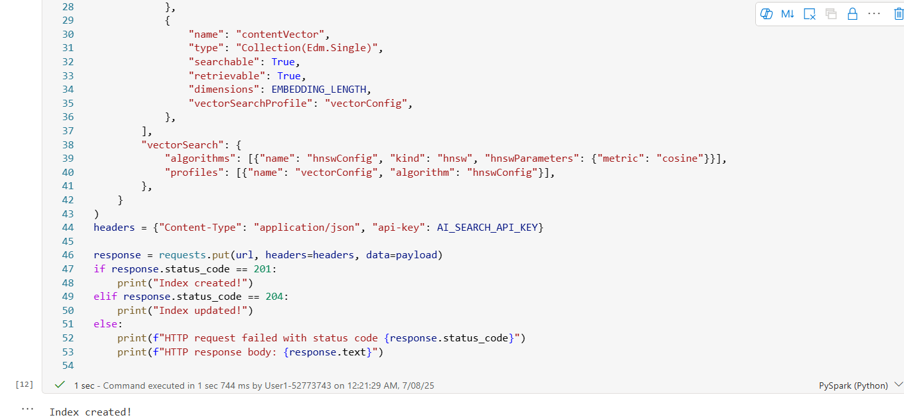

3.  El siguiente paso es subir los fragmentos al índice recién creado en
    Azure AI Search. La API REST de Azure AI Search admite hasta 1000
    “documentos” por solicitud. Tenga en cuenta que, en este caso, cada
    uno de nuestros “documentos” es en realidad un fragmento del archivo
    original.

4.  Utilice el ícono **+ Code** debajo del resultado de la celda para
    agregar una nueva celda de código al notebook e ingrese el siguiente
    código. Luego, haga clic en **▷ Run cell** y revise el resultado.

**Copy**

    ```
    import re
    
    from pyspark.sql.functions import monotonically_increasing_id
    
    
    def insert_into_index(documents):
        """Uploads a list of 'documents' to Azure AI Search index."""
    
        url = f"https://{AI_SEARCH_NAME}.search.windows.net/indexes/{AI_SEARCH_INDEX_NAME}/docs/index?api-version=2023-11-01"
    
        payload = json.dumps({"value": documents})
        headers = {
            "Content-Type": "application/json",
            "api-key": AI_SEARCH_API_KEY,
        }
    
        response = requests.request("POST", url, headers=headers, data=payload)
    
        if response.status_code == 200 or response.status_code == 201:
            return "Success"
        else:
            return f"Failure: {response.text}"
    
    def make_safe_id(row_id: str):
        """Strips disallowed characters from row id for use as Azure AI search document ID."""
        return re.sub("[^0-9a-zA-Z_-]", "_", row_id)
    
    
    def upload_rows(rows):
        """Uploads the rows in a Spark dataframe to Azure AI Search.
        Limits uploads to 1000 rows at a time due to Azure AI Search API limits.
        """
        BATCH_SIZE = 1000
        rows = list(rows)
        for i in range(0, len(rows), BATCH_SIZE):
            row_batch = rows[i : i + BATCH_SIZE]
            documents = []
            for row in rows:
                documents.append(
                    {
                        "id": make_safe_id(row["unique_id"]),
                        "content": row["chunk"],
                        "contentVector": row["embeddings"].tolist(),
                        "@search.action": "upload",
                    },
                )
            status = insert_into_index(documents)
            yield [row_batch[0]["row_index"], row_batch[-1]["row_index"], status]
    
    # Add ID to help track what rows were successfully uploaded
    df_embeddings = df_embeddings.withColumn("row_index", monotonically_increasing_id())
    
    # Run upload_batch on partitions of the dataframe
    res = df_embeddings.rdd.mapPartitions(upload_rows)
    display(res.toDF(["start_index", "end_index", "insertion_status"]))
    ```

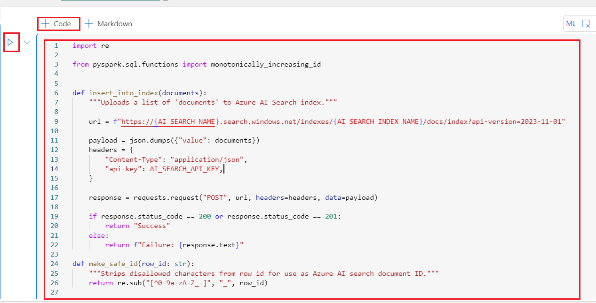


# Ejercicio 4: Recuperación de documentos relevantes y respuesta a preguntas

Después de procesar el documento, podemos proceder a formular una
pregunta.
Usaremos [SynapseML](https://microsoft.github.io/SynapseML/docs/Explore%20Algorithms/OpenAI/Quickstart%20-%20OpenAI%20Embedding/) para
convertir la pregunta del usuario en un embedding y luego emplearemos la
similitud coseno para recuperar los fragmentos de documentos top K que
coincidan más estrechamente con la pregunta del usuario.

## Tarea 1: Configuración del entorno y claves de API de Azure

Cree un nuevo notebook en el Lakehouse y guárdelo como rag_application.
Usaremos este notebook para crear la aplicación RAG.

1.  Proporcione las credenciales para acceder a Azure AI Search. Puede
    copiar los valores desde el Portal de Azure (Ejercicio 1 \> Tarea
    4).

2.  Utilice el ícono **+ Code** debajo del resultado de la celda para
    agregar una nueva celda de código al notebook e ingrese el siguiente
    código. Luego, haga clic en **▷ Run cell** y revise el resultado.

Copy

    ```
    # Azure AI Search
    AI_SEARCH_NAME = 'mysearchservice@lab.LabInstance.Id'
    AI_SEARCH_INDEX_NAME = 'rag-demo-index'
    AI_SEARCH_API_KEY = ''
    ```


3.  La siguiente función toma como entrada la pregunta de un usuario y
    la convierte en un embedding utilizando el modelo
    text-embedding-ada-002. Este código asume que está utilizando los
    Servicios de IA preconstruidos en Microsoft Fabric.

4.  Utilice el ícono **+ Code** debajo del resultado de la celda para
    agregar una nueva celda de código al notebook e ingrese el siguiente
    código. Luego, haga clic en **▷ Run cell** y revise el resultado.

**Copy**

    ```
    def gen_question_embedding(user_question):
        """Generates embedding for user_question using SynapseML."""
        from synapse.ml.services import OpenAIEmbedding
    
        df_ques = spark.createDataFrame([(user_question, 1)], ["questions", "dummy"])
        embedding = (
            OpenAIEmbedding()
            .setDeploymentName('text-embedding-ada-002')
            .setTextCol("questions")
            .setErrorCol("errorQ")
            .setOutputCol("embeddings")
        )
        df_ques_embeddings = embedding.transform(df_ques)
        row = df_ques_embeddings.collect()[0]
        question_embedding = row.embeddings.tolist()
        return question_embedding
    ```


## Tarea 2: Recuperar documentos relevantes

1.  El siguiente paso es utilizar la pregunta del usuario y su embedding
    para recuperar los fragmentos de documentos top K más relevantes del
    índice de búsqueda. La función siguiente recupera las entradas top K
    utilizando búsqueda híbrida.

2.  Utilice el ícono **+ Code** debajo del resultado de la celda para
    agregar una nueva celda de código al notebook e ingrese el siguiente
    código. Luego, haga clic en **▷ Run cell** y revise el resultado.

**Copy**

    ```
    import json 
    import requests
    
    def retrieve_top_chunks(k, question, question_embedding):
        """Retrieve the top K entries from Azure AI Search using hybrid search."""
        url = f"https://{AI_SEARCH_NAME}.search.windows.net/indexes/{AI_SEARCH_INDEX_NAME}/docs/search?api-version=2023-11-01"
    
        payload = json.dumps({
            "search": question,
            "top": k,
            "vectorQueries": [
                {
                    "vector": question_embedding,
                    "k": k,
                    "fields": "contentVector",
                    "kind": "vector"
                }
            ]
        })
    
        headers = {
            "Content-Type": "application/json",
            "api-key": AI_SEARCH_API_KEY,
        }
    
        response = requests.request("POST", url, headers=headers, data=payload)
        output = json.loads(response.text)
        return output
    ```


Con esas funciones definidas, podemos definir una función que tome la
pregunta de un usuario, genere un embedding para la pregunta, recupere
los fragmentos de documentos top K y concatene el contenido de los
documentos recuperados para formar el contexto de la pregunta del
usuario.

3.  Use el ícono **+ Code** debajo del resultado de la celda para
    agregar una nueva celda de código al notebook e ingrese el siguiente
    código en ella. Haga clic en **▷ Run cell** y revise el resultado.

**Copy**

    ```
    def get_context(user_question, retrieved_k = 5):
        # Generate embeddings for the question
        question_embedding = gen_question_embedding(user_question)
    
        # Retrieve the top K entries
        output = retrieve_top_chunks(retrieved_k, user_question, question_embedding)
    
        # concatenate the content of the retrieved documents
        context = [chunk["content"] for chunk in output["value"]]
    
        return context
    ```


## **Tarea 3: Responder la pregunta del usuario**

Finalmente, podemos definir una función que tome la pregunta de un
usuario, recupere el contexto de la pregunta y envíe tanto el contexto
como la pregunta a un modelo de lenguaje grande para generar una
respuesta. Para esta demostración, utilizaremos **gpt-35-turbo-16k**, un
modelo optimizado para conversación.

1.  Use el ícono **+ Code** debajo del resultado de la celda para
    agregar una nueva celda de código al notebook e ingrese el siguiente
    código en ella. Haga clic en **▷ Run cell** y revise el resultado.

**Copy**

    ```
    from pyspark.sql import Row
    from synapse.ml.services.openai import OpenAIChatCompletion
    
    
    def make_message(role, content):
        return Row(role=role, content=content, name=role)
    
    def get_response(user_question):
        context = get_context(user_question)
    
        # Write a prompt with context and user_question as variables 
        prompt = f"""
        context: {context}
        Answer the question based on the context above.
        If the information to answer the question is not present in the given context then reply "I don't know".
        """
    
        chat_df = spark.createDataFrame(
            [
                (
                    [
                        make_message(
                            "system", prompt
                        ),
                        make_message("user", user_question),
                    ],
                ),
            ]
        ).toDF("messages")
    
        chat_completion = (
            OpenAIChatCompletion()
            .setDeploymentName("gpt-35-turbo-16k") # deploymentName could be one of {gpt-35-turbo, gpt-35-turbo-16k}
            .setMessagesCol("messages")
            .setErrorCol("error")
            .setOutputCol("chat_completions")
        )
    
        result_df = chat_completion.transform(chat_df).select("chat_completions.choices.message.content")
    
        result = []
        for row in result_df.collect():
            content_string = ' '.join(row['content'])
            result.append(content_string)
    
        # Join the list into a single string
        result = ' '.join(result)
        
        return result
    ```
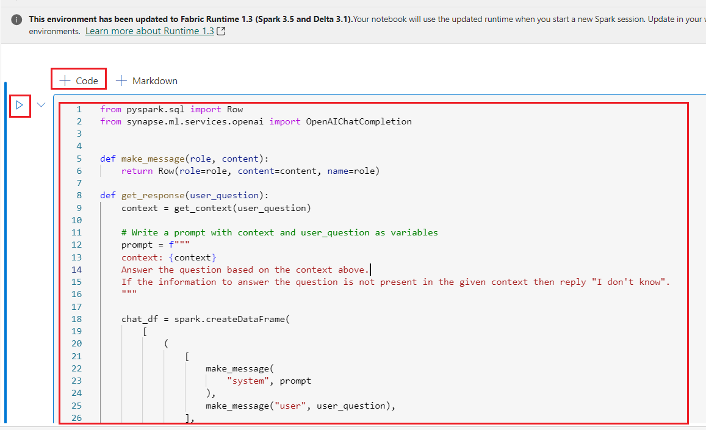


2.  Ahora, podemos llamar a esa función con una pregunta de ejemplo para
    ver la respuesta:

3.  Use el ícono **+ Code** debajo del resultado de la celda para
    agregar una nueva celda de código al notebook e ingrese el siguiente
    código en ella. Haga clic en **▷ Run cell** y revise el resultado.

**Copy**

```
import requests

# Azure Search configuration
search_service_name = ''
index_name = 'rag-demo-index'
api_key = ''
endpoint = f'https://{search_service_name}.search.windows.net'
api_version = '2023-07-01-Preview'
search_url = f"{endpoint}/indexes/{index_name}/docs/search?api-version={api_version}"

headers = {
    "Content-Type": "application/json",
    "api-key": api_key
}

def get_response(user_question, top_k=1):
    payload = {
        "search": user_question,
        "queryType": "simple",   # Can be "semantic" if enabled in your Azure Search
        "top": top_k
    }
    response = requests.post(search_url, headers=headers, json=payload)
    response.raise_for_status()
    results = response.json().get('value', [])
    if not results:
        return "No answer found in the knowledge base."
    return results[0].get('content', '').strip()

# Example usage
user_question = "how do i make a booking?"
response = get_response(user_question)
print(response)
```


## Tarea 4: Eliminar los recursos

Para evitar incurrir en costos innecesarios en Azure, debe eliminar los
recursos que creó en este inicio rápido si ya no son necesarios. Para
administrar los recursos, puede usar el [Azure
portal](https://portal.azure.com/?azure-portal=true).

1.  Para eliminar la cuenta de almacenamiento, navegue a la página
    principal del **portal de Azure** y haga clic en **Resource
    groups**.

> 

2.  Haga clic en el grupo de recursos asignado.


3.  En la página principal del **Resource group,** seleccione los
    recursos **Azure AI services**, **Key Vault** y **Search service**.
    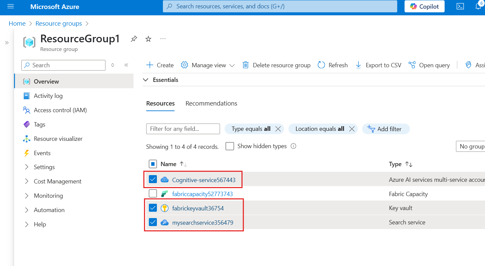

4.  Seleccione **Delete.**

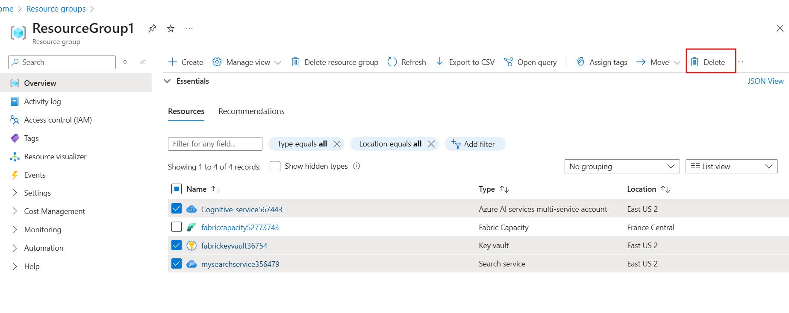


5.  En el panel **Delete Resources** que aparece en el lado derecho,
    navegue hasta el campo **Enter** +++**delete**+++ **to confirm
    deletion**, luego haga clic en el botón **Delete**.


6.  En el cuadro de diálogo de confirmación, haga clic en **Delete**.

> 

7.  Abra su navegador, vaya a la barra de direcciones y escriba o pegue
    la siguiente URL: +++https://app.fabric.microsoft.com/+++ y luego
    presione **Enter**.

> 

8.  Seleccione la opción ... debajo del nombre del espacio de trabajo y
    seleccione **Workspace settings**.


9.  Seleccione **General** y haga clic en **Remove this workspace**.

> 

10. Haga clic en **Delete** en la advertencia que aparece.


11. Espere a recibir una notificación de que el espacio de trabajo ha
    sido eliminado antes de continuar con el siguiente laboratorio.


