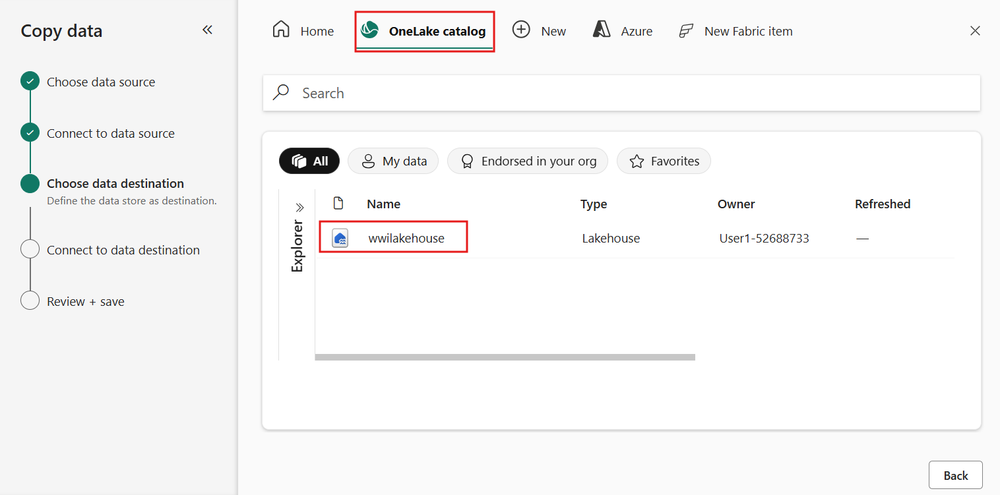
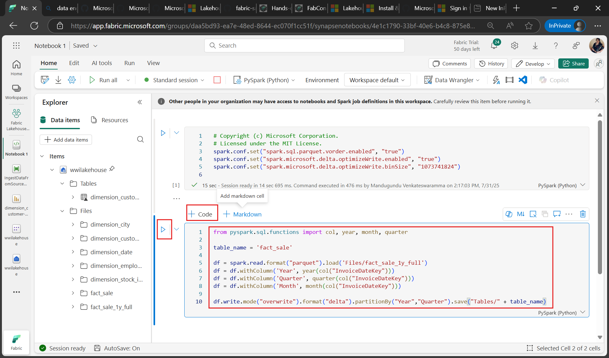
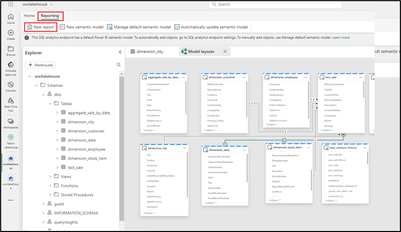
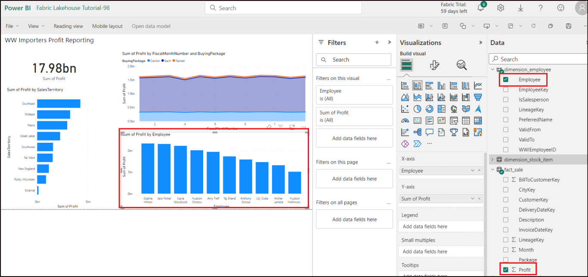

# ユースケース 1: Lakehouseを作成し、サンプルデータを取り込み、レポートを作成する

**紹介**

このラボでは、データ取得からデータ活用までのエンド・ツー・エンドのシナリオを順を追って説明します。これにより、Fabricの基本的な理解を深めることができます。具体的には、さまざまなエクスペリエンスとその連携方法、そしてこのプラットフォームで作業する際に利用できるプロフェッショナル開発者向けおよび市民開発者向けのエクスペリエンスについて学びます。このラボは、リファレンスアーキテクチャ、機能や特性の網羅的なリスト、あるいは特定のベストプラクティスを推奨することを目的としたものではありません。

従来、組織はトランザクションデータや構造化データの分析ニーズに対応するために最新のデータウェアハウスを構築してきました。そして、ビッグデータ(semi/unstructured)データ分析のニーズに対応するために、data
lakehousesを構築してきました。これら2つのシステムが並行して、稼働していたため、サイロ化、データの重複、そして総所有コストの増加が生じていました。

Fabric はデータ ストアを統合し、Delta
Lake形式で標準化することで、サイロを排除し、データの重複を排除し、総所有コストを大幅に削減します。

Fabricが提供する柔軟性により、Lakehouseまたはdata
warehouseーキテクチャのいずれかを実装することも、それらを組み合わせ、シンプルな実装で両方のメリットを享受することもできます。このチュートリアルでは、小売組織を例に挙げ、Lakehouseを最初から最後まで構築します。  
このシステムは[medallion
architecture](https://learn.microsoft.com/en-us/azure/databricks/lakehouse/medallion) を採用しており、ブロンズ層には生データ、シルバー層には検証済みで重複排除されたデータ、ゴールド層には高度に精製されたデータが格納されています。あらゆる業界のあらゆる組織に、同じアプローチでLakehouseを実装できます。

このラボでは、小売分野の架空の Wide World
Importers社の開発者が次の手順を実行する方法について説明します。

**目的**:

1\. Power BI アカウントにサインインし、無料の Microsoft Fabric
試用版を開始します。

2\. Power BI 内で Microsoft Fabric (Preview) の試用版を開始します。

3\. Microsoft 365 管理センターの OneDrive サインアップを構成します。

4.FabricワークスペースとLakehouseの作成を含む、組織のエンド・ツー・エンドのLakehouseを構築および実装します。

5\.
サンプルデータをLakehouseに取り込み、さらに処理できるように準備します。

6\. Python/PySpark と SQL
ノートブックを使用してデータを変換および準備します。

7\. さまざまなアプローチを使用して、ビジネス集計テーブルを作成します。

8\. シームレスなレポート作成のためにテーブル間の関係を確立します。

9\. 準備したデータに基づいて視覚化された Power BI レポートを作成します。

10\. 作成したレポートを保存し、将来の参照や分析に使用します。

## 演習 1: Lakehouse エンド・ツー・エンドシナリオのセットアップ

### タスク 1: Power BI アカウントにサインインし、無料の Microsoft Fabric 試用版にサインアップする

1.  ブラウザを開き、アドレス バーに移動して、次の URL
    を入力または貼り付けます:+++https://app.fabric.microsoft.com/+++
    次に、**Enter** ボタンを押します。

> 

2.  **Microsoft Fabric** ウィンドウで資格情報を入力し、\[**Submit** \]
    ボタンをクリックします。
    |   |   |
    |---|---|
    | Username | +++@lab.CloudPortalCredential(User1).Username+++ |
    | Password | +++@lab.CloudPortalCredential(User1).Password+++ |
> 

3.  次に、Microsoftウィンドウでパスワードを入力し、「**Sign
    in** 」ボタンをクリックします。

> 

4.  「**Stay signed
    in?** 」ウィンドウで、「Yes」ボタンをクリックします。

> 

5.  Power BI Homeページに移動します。

> 

## 演習 2: 組織向けのエンド・ツー・エンドのLakehouseを構築して 実装する

### タスク1: Fabricワークスペースを作成する

このタスクでは、Fabric
ワークスペースを作成します。ワークスペースには、Lakehouse、データフロー、Data
Factory パイプライン、ノートブック、Power BI
データセット、レポートなど、このLakehouse
チュートリアルに必要なすべてのアイテムが含まれています。

1.  Fabric ホームページで、**+New workspace**タイルを選択します。

> 

2.  右側に表示される「**Create a
    workspace** 」ペインで、次の詳細を入力し、「**Apply** 」ボタンをクリックします。

    | Property  | Value  |
    |-------|-----|
    |Name|	+++Fabric Lakehouse Tutorial-@lab.LabInstance.Id+++ (must be a unique Id)|
    |Advanced	|Under License mode, select Fabric capacity|
    |Default	storage format| Small dataset storage format|
    |Template apps	|Check the Develop template apps|

> 

注: ラボのインスタント ID
を見つけるには、「'Help'」を選択してインスタント ID をコピーします。

> 
>
> 

3.  デプロイが完了するまでお待ちください。完了まで2～3分かかります。

> 

### タスク2: Lakehouseを作成する

1.  ナビゲーション バーの \[**+New item** \]
    ボタンをクリックして、新しいLakehouseを作成します。

> 

2.  「Lakehouse」タイルをクリックします。

> 

3.  \[**New lakehouse** \] ダイアログ ボックスで、\[**Name** \]
    フィールドに「+++wwilakehouse+++」と入力し、\[**Create** \]
    ボタンをクリックして、新しいLakehouseを開きます。　

> **注記**: wwilakehouse の前にスペースを削除してください。
>
> 
>
> 

4.  「**Successfully created SQL endpoint**」を示す通知が表示されます。

> 

### タスク3: サンプルデータを取り込む

1.  wwilakehouseページで、「**Get data in your
    lakehouse** 」セクションに移動し、**下の画像に示すように**「**Upload
    files**」をクリックします。

> 

2.  「Upload files」タブで、「Files」の下のフォルダをクリックします。

> 

3.  VM 上の **C:\LabFiles** を参照し、**dimension_customer.csv**
    ファイルを選択して、\[**Open** \] ボタンをクリックします。

> 

4.  次に**Upload** ボタンをクリックして、閉じます。

> 

5.  Upload filesペインを閉じます。

> 

6.  **Files**をクリックして、Refresh
    オプションを選択します。ファイルが表示されます。

> 
>
> 

7.  **Lakehouse**ページの「Explorer」ペインで「Files」を選択します。次に、マウスカーソルを**dimension_customer.csv**ファイルの上に移動します。**dimension_customer.csv**の横にある横三点リーダー**（…）**をクリックします。「**Load
    Table**」を選択し、次に「**New table**」を選択します。　

> 

8.  \[**Load file to new table** \] ダイアログ ボックスで、\[**Load** \]
    ボタンをクリックします。

> 

9.  これで、**dimension_customer**テーブルが正常に作成されました。

> 

10. **dbo** スキーマの下の **dimension_customer** テーブルを選択します。

> 
>
> 

11. LakehouseのSQLエンドポイントを使用して、SQLステートメントでデータをクエリすることもできます。画面右上の**Lakehouse**ドロップダウンメニューから「**SQL
    analytics endpoint** 」を選択してください。

> 

12. **wwilakehouse** ページの「Explorer」で **dimension_customer**
    テーブルを選択してそのデータをプレビューし、「**New SQL
    query** 」を選択して SQL ステートメントを記述します。

> 

13. 以下のサンプルクエリは、**dimension_customer**テーブルの**BuyingGroup**列に基づいて行数を集計します。SQLクエリファイルは将来の参照用に自動的に保存され、必要に応じて名前を変更したり削除したりできます。以下の画像のようにコードを貼り付け、再生アイコンをクリックしてスクリプトを**実行**してください。

    ```
    SELECT BuyingGroup, Count(*) AS Total
    FROM dimension_customer
    GROUP BY BuyingGroup
    ```
> 

**注記**:
スクリプトの実行中にエラーが発生した場合は、スクリプトの構文をクロスチェックして、不要なスペースが含まれていないことを確認してください。

14. 以前は、すべてのLakehouseのテーブルとビューはセマンティックモデルに自動的に追加されていました。最近のアップデートでは、新しいLakehouseについては、テーブルをセマンティックモデルに手動で追加する必要があります。

> 

15. Lakehouseの \[Home\] タブから \[**New semantic model** \]
    を選択し、セマンティック モデルに追加するテーブルを選択します。　

> 

16. \[**New semantic model** \] ダイアログで +++wwilakehouse+++
    と入力し、テーブルのリストから **dimension_customer**
    テーブルを選択して \[**Confirm** \]
    を選択し、新しいモデルを作成します。　

> 

### タスク4: レポートを作成する

1.  次に、左側のナビゲーション ペインで **Fabric
    Lakehouse** **Tutorial-XX** をクリックします。

> 

2.  **Fabric Lakehouse Tutorial-XX**ビューで、タイプ **セマンティック
    モデル**の **wwilakehouse** を選択します。

> 

3.  セマンティックモデルペインから、すべてのテーブルを表示できます。レポートは、最初から作成するか、ページ分割されたレポートを作成するか、Power
    BI
    にデータに基づいて自動作成させるかを選択できます。このチュートリアルでは、下の画像に示すように、「**Explore
    this data**」で「**Auto-create a report**」を選択してください。

> 

4.  レポートの準備ができたので、「**View report
    now**」をクリックしてレポートを開いて確認します。

> 

5.  テーブルはディメンションであり、メジャーが含まれていないため、Power
    BI
    は行数のメジャーを作成し、それをさまざまな列にわたって集計して、次の図に示すようにさまざまなグラフを作成します。

6.  上部のリボンから \[**Save** \]
    を選択して、このレポートを将来保存します。

> 

7.  \[**Save your report** \] ダイアログ ボックスで、レポートの名前を
    +++dimension_customer-report+++ として入力し、\[**Save**\]
    を選択します。　

> 

8.  「**Report saved**」という通知が表示されます。

> 

# 演習2: Lakehouseにデータを取り込む

この演習では、Wide World Importers (WWI) から追加のディメンション
テーブルとファクトテーブルをLakehouseに取り込みます。

### タスク1: データの取り込み

1.  次に、左側のナビゲーション ペインで **Fabric Lakehouse Tutorial-XX**
    をクリックします。

> 

2.  もう一度、ワークスペース名を選択します。


3.  **Fabric Lakehouse Tutorial-XX** ワークスペース ページで、\[**+New
    item**\] ボタンに移動してクリックし、\[**Pipeline**\] を選択します。

> 

4.  「New pipeline」ダイアログ ボックスで、名前を
    **+++IngestDataFromSourceToLakehouse+++**
    　と指定し、「**Create**」を選択します。新しいデータ ファクトリ
    パイプラインが作成され、開きます。　


> 

5.  新しく作成されたデータ ファクトリ パイプライン
    **(IngestDataFromSourceToLakehouse)** で、\[**Copy data**\]
    ドロップダウンを選択し、\[**Add to canvas**\]
    オプションを選択します。

> 

6.  **Copy data**を選択した状態で、\[**Source**\] タブに移動します。


7.  \[**Connection**\] ドロップダウンを選択し、\[**Browse all**\]
    オプションを選択します。


8.  左側のペインから**Sample data**を選択し、**Retail Data Model from
    Wide World Importers**を選択します。


9.  **Connect to data source** ウィンドウで、**Retail Data Model from
    Wide World Importers** データを
    **選択して、**プレビューし、**\[OK\]** を選択します。

> 

10. サンプル データとしてデータ ソース接続が選択されます。


11. 次に、**destination**タブに移動します。


12. 宛先タブで、接続ドロップダウンをクリックし、「**Browse**
    **all**」オプションを選択します。


13. 宛先の選択ウィンドウで、左側のペインから **OneLake
    catalog**を選択し、**wwilakehouse** を選択します。

> 

14. 保存先としてLakehouseが選択されました。**Root
    Folder**を**Files**に指定し、ファイル形式が**Parquet**になっていることを確認してください。


8.  「**Run**」をクリックして、データのコピーを実行します。

> 

9.  パイプラインが保存されて実行されるように、\[**Save and run**\]
    ボタンをクリックします。

> 

10. データのコピープロセスは完了するまでに約 1 ～ 3 分かかります。

> 
>
> 
>
> 

11. 「Output」タブで「**Copy
    data1** 」を選択し、データ転送の詳細を確認します。「**Status** 」が「**Succeeded**」と表示されたら、**閉じる**ボタンをクリックします。

> 
>
> 

12. パイプラインの実行が正常に完了したら、Lakehouse (**wwilakehouse**)
    に移動し、エクスプローラーを開いてインポートされたデータを確認します。

> 

13. すべての **WideWorldImporters** **フォルダ**ーが**エクスプローラー**
    ビューに存在し、すべてのテーブルのデータが含まれていることを確認します。

> 

# 演習3: Lakehouseでデータの準備と変換を行う

### タスク 1: データを変換して シルバーDelta tableにロードする

1.  **wwilakehouse** ページで、コマンド バーの \[**Open notebook** \]
    ドロップに移動してクリックし、\[**New notebook**\] を選択します。

> 

2.  Lakehouse **explorer**で開いているノートブックでは、  
    そのノートブックがすでに開いているLakehouseにリンクされていることがわかります。

> 

\[!note\] 注:
Fabricは、最適化されたデルタレイクファイルを書き込むための[**V-order**](https://learn.microsoft.com/en-us/fabric/data-engineering/delta-optimization-and-v-order)機能を提供します。V-orderは、最適化されていないDelta
Lakeファイルと比較して、圧縮率を3～4倍、パフォーマンスを最大10倍向上させることがよくあります。FabricのSparkは、デフォルトで128MBのサイズのファイルを生成する際に、パーティションを動的に最適化します。ターゲットファイルサイズは、設定を使用してワークロード要件に応じて変更できます。[**optimize
write**](https://learn.microsoft.com/en-us/fabric/data-engineering/delta-optimization-and-v-order#what-is-optimized-write)機能により、Apache　Sparkエンジンは書き込まれるファイルの数を削減し、書き込まれるデータの個々のファイルサイズを増加させることを目指します。

3.  Lakehouseの**Tables** セクションでdelta
    lakeテーブルとしてデータを書き込む前に、データ書き込みの最適化と読み取りパフォーマンスの向上のために、2つのFabric機能（V-orderとOptimize
    Write）を使用します。セッションでこれらの機能を有効にするには、ノートブックの最初のセルでこれらの設定を行います。

4.  **セル**内のコードを次のコードに更新し、マウスをホバーするとセルの左側に表示される
    **▷ Run cell** をクリックします。

    ```
    # Copyright (c) Microsoft Corporation.
    # Licensed under the MIT License.
    spark.conf.set("spark.sql.parquet.vorder.enabled", "true")
    spark.conf.set("spark.microsoft.delta.optimizeWrite.enabled", "true")
    spark.conf.set("spark.microsoft.delta.optimizeWrite.binSize", "1073741824")
    ```

**注**: セルを実行する際、基盤となる Spark
プールやクラスターの詳細を指定する必要はありません。


Fabric が Live Pool
を通じてこれらの情報を提供してくれるからです。すべての Fabric
ワークスペースには、Live Pool と呼ばれるデフォルトの Spark
プールが付属しています。つまり、ノートブックを作成する際に、Spark
の構成やクラスターの詳細を指定する必要はありません。最初のノートブックコマンドを実行すると、Live
Pool が数秒で起動し、Spark
セッションが確立されてコードの実行が開始されます。Spark
セッションがアクティブな間は、このノートブックでのその後のコード実行はほぼ瞬時に行われます。

5.  次に、Lakehouseの**Files** セクションから生データを読み取り、変換の一環として、異なる日付部分に対応する列を追加します。partitionBy
    Spark
    APIを使用してデータをパーティション化し、新しく作成されたデータ部分列（YearとQuarter）に基づいてデルタテーブルとして書き込みます。

6.  セル出力の下にある「**+
    Code** 」アイコンを使用してノートブックに新しいコードセルを追加し、次のコードを入力します。**▷
    Run cell** ボタンをクリックして出力を確認します。　

**注記**: 出力が表示されない場合は、**Spark
jobs**の左側にある水平線をクリックします。

    ```
    from pyspark.sql.functions import col, year, month, quarter
    
    table_name = 'fact_sale'
    
    df = spark.read.format("parquet").load('Files/fact_sale_1y_full')
    df = df.withColumn('Year', year(col("InvoiceDateKey")))
    df = df.withColumn('Quarter', quarter(col("InvoiceDateKey")))
    df = df.withColumn('Month', month(col("InvoiceDateKey")))
    
    df.write.mode("overwrite").format("delta").partitionBy("Year","Quarter").save("Tables/" + table_name)
    ```

> 
>
> 
>
> 

7.  テーブルがロードされたら、残りのディメンションのデータのロードに進むことができます。次のセルは、パラメータとして渡されたテーブル名ごとに、Lakehouseの**Files** セクションから生データを読み取る関数を作成します。次に、ディメンションテーブルのリストを作成します。最後に、テーブルのリストをループ処理し、入力パラメータから読み取ったテーブル名ごとに差分テーブルを作成します。

8.  セル出力の下にある「**+
    Code** 」アイコンを使用してノートブックに新しいコードセルを追加し、そこに以下のコードを入力します。**▷
    Run cell** ボタンをクリックして出力を確認します。　

    ```
    from pyspark.sql.types import *
    
    def loadFullDataFromSource(table_name):
        df = spark.read.format("parquet").load('Files/' + table_name)
        df = df.drop("Photo")
        df.write.mode("overwrite").format("delta").save("Tables/" + table_name)
    
    full_tables = [
        'dimension_city',
        'dimension_customer',
        'dimension_date',
        'dimension_employee',
        'dimension_stock_item'
    ]
    
    for table in full_tables:
        loadFullDataFromSource(table)
    ```
> 
>
> 

6.  作成されたテーブルを検証するには、すべてのテーブルがリストに表示されるまで、**Explorer** パネルの**Tables** をクリックして更新を選択します。

> 
>
> 

### タスク2: 集約のためのビジネスデータの変換

組織には、Scala/Python を扱うデータエンジニアと SQL (Spark SQL または
T-SQL)
を扱うデータエンジニアがいて、全員が同じデータコピーを扱っている場合があります。Fabric
は、経験や好みの異なるこれらの異なるグループが連携して作業することを可能にします。2つの異なるアプローチは、ビジネス集計を変換および生成します。パフォーマンスを損なうことなく、適切なアプローチを選択することも、好みに応じてこれらのアプローチを組み合わせることもできます。

- **アプローチ1**-
  PySparkを使用してデータを結合・集計し、ビジネス集計を生成します。このアプローチは、プログラミング（PythonまたはPySpark）の経験がある方に適しています。

- **アプローチ2**- Spark
  SQLを使用してデータを結合・集計し、ビジネス集計を生成します。このアプローチは、SQLの経験があり、Sparkに移行する方に適しています。

**アプローチ 1 (sale_by_date_city)**

PySparkを使用してデータを結合・集計し、ビジネス集計を生成します。以下のコードでは、既存の差分テーブルを参照する3つの異なるSparkデータフレームを作成します。次に、データフレームを使用してこれらのテーブルを結合し、group
byを使用して集計を生成し、いくつかの列の名前を変更し、最後にLakehouseの**Tables** セクションに差分テーブルとして書き込み、データを永続化します。

1.  セル出力の下にある「**+
    Code** 」アイコンを使用してノートブックに新しいコードセルを追加し、次のコードを入力します。**▷
    Run cell** ボタンをクリックして出力を確認します。

このセルでは、それぞれ既存のデルタ テーブルを参照する 3 つの異なる Spark
データフレームを作成します。

    ```
    df_fact_sale = spark.read.table("wwilakehouse.fact_sale") 
    df_dimension_date = spark.read.table("wwilakehouse.dimension_date")
    df_dimension_city = spark.read.table("wwilakehouse.dimension_city")
    ```


2.  セル出力の下にある「+ Code
    」アイコンを使用してノートブックに新しいコードセルを追加し、次のコードを入力します。▷
    Run cellボタンをクリックして出力を確認します。

このセルでは、先ほど作成したデータフレームを使用してこれらのテーブルを結合し、グループ化して集計を生成し、いくつかの列の名前を変更し、最後にLakehouseの**Tables** セクションにデルタ
テーブルとして書き込みます。

    ```
    sale_by_date_city = df_fact_sale.alias("sale") \
    .join(df_dimension_date.alias("date"), df_fact_sale.InvoiceDateKey == df_dimension_date.Date, "inner") \
    .join(df_dimension_city.alias("city"), df_fact_sale.CityKey == df_dimension_city.CityKey, "inner") \
    .select("date.Date", "date.CalendarMonthLabel", "date.Day", "date.ShortMonth", "date.CalendarYear", "city.City", "city.StateProvince", 
     "city.SalesTerritory", "sale.TotalExcludingTax", "sale.TaxAmount", "sale.TotalIncludingTax", "sale.Profit")\
    .groupBy("date.Date", "date.CalendarMonthLabel", "date.Day", "date.ShortMonth", "date.CalendarYear", "city.City", "city.StateProvince", 
     "city.SalesTerritory")\
    .sum("sale.TotalExcludingTax", "sale.TaxAmount", "sale.TotalIncludingTax", "sale.Profit")\
    .withColumnRenamed("sum(TotalExcludingTax)", "SumOfTotalExcludingTax")\
    .withColumnRenamed("sum(TaxAmount)", "SumOfTaxAmount")\
    .withColumnRenamed("sum(TotalIncludingTax)", "SumOfTotalIncludingTax")\
    .withColumnRenamed("sum(Profit)", "SumOfProfit")\
    .orderBy("date.Date", "city.StateProvince", "city.City")
    
    sale_by_date_city.write.mode("overwrite").format("delta").option("overwriteSchema", "true").save("Tables/aggregate_sale_by_date_city")
    ```


**アプローチ 2 (sale_by_date_employee)**

Spark
SQLを使用してデータを結合・集計し、ビジネス集計を生成します。以下のコードでは、3つのテーブルを結合して一時的なSparkビューを作成し、group
byを使用して集計を生成し、いくつかの列の名前を変更します。最後に、一時的なSparkビューからデータを読み取り、Lakehouseの**Tables** セクションにデルタテーブルとして書き込み、データを永続化します。

3.  セル出力の下にある「**+ Code**
    」アイコンを使用してノートブックに新しいコードセルを追加し、次のコードを入力します。▷
    Run cellボタンをクリックして出力を確認します。

このセルでは、3 つのテーブルを結合して一時的な Spark
ビューを作成し、グループ化を実行して集計を生成し、いくつかの列の名前を変更します。

    ```
    %%sql
    CREATE OR REPLACE TEMPORARY VIEW sale_by_date_employee
    AS
    SELECT
           DD.Date, DD.CalendarMonthLabel
     , DD.Day, DD.ShortMonth Month, CalendarYear Year
          ,DE.PreferredName, DE.Employee
          ,SUM(FS.TotalExcludingTax) SumOfTotalExcludingTax
          ,SUM(FS.TaxAmount) SumOfTaxAmount
          ,SUM(FS.TotalIncludingTax) SumOfTotalIncludingTax
          ,SUM(Profit) SumOfProfit 
    FROM wwilakehouse.fact_sale FS
    INNER JOIN wwilakehouse.dimension_date DD ON FS.InvoiceDateKey = DD.Date
    INNER JOIN wwilakehouse.dimension_Employee DE ON FS.SalespersonKey = DE.EmployeeKey
    GROUP BY DD.Date, DD.CalendarMonthLabel, DD.Day, DD.ShortMonth, DD.CalendarYear, DE.PreferredName, DE.Employee
    ORDER BY DD.Date ASC, DE.PreferredName ASC, DE.Employee ASC
    ```


8.  セル出力の下にある「**+ Code**
    」アイコンを使用してノートブックに新しいコードセルを追加し、次のコードを入力します。**▷
    Run cell**ボタンをクリックして出力を確認します。

このセルでは、前のセルで作成された一時的な Spark
ビューから読み取り、最終的にそれをLakehouseの**Tables** セクションにデルタ
テーブルとして書き込みます。

    ```
    sale_by_date_employee = spark.sql("SELECT * FROM sale_by_date_employee")
    sale_by_date_employee.write.mode("overwrite").format("delta").option("overwriteSchema", "true").save("Tables/aggregate_sale_by_date_employee")
    ```


9.  作成されたテーブルを検証するには、集計テーブルが表示されるまで**テーブル**をクリックして更新を選択します。


どちらのアプローチも結果は同様です。ご自身のバックグラウンドや好みに合わせて選択することで、新しい技術の習得やパフォーマンスの妥協を最小限に抑えることができます。

また、データがdelta
lakeファイルとして書き込まれていることにお気づきかもしれません。Fabricの自動テーブル検出・登録機能により、これらのデータがメタストアに自動的に登録されます。SQLで使用するテーブルを作成するために、明示的にCREATE
TABLEステートメントを呼び出す必要はありません。

# 演習 4: Microsoft Fabric でのレポートの作成

チュートリアルのこのセクションでは、Power BI データ
モデルを作成し、レポートを最初から作成します。

### タスク 1: SQL エンド・ポイントを使用してシルバー レイヤーのデータを探索する

Power BI は Fabric
エクスペリエンス全体にネイティブに統合されています。このネイティブ統合により、DirectLakeと呼ばれる独自のモードが実現します。このモードでは、Lakehouseからデータにアクセスし、最高パフォーマンスのクエリとレポートエクスペリエンスを提供します。  
DirectLake モードは、Power BI
で大規模なデータセットを分析するための画期的な新しいエンジン機能です。このテクノロジは、data
warehouseやLakehouseのエンド・ポイントにクエリを実行したり、Power BI
データセットにデータをインポートしたり複製したりすることなく、data
lakeから
parquet形式のファイルを直接読み込むというアイデアに基づいています。DirectLake
は、data lakeから Power BI
エンジンに直接データを読み込み、分析準備を整えるための高速パスです。

従来の DirectQuery モードでは、Power BI
エンジンは各クエリを実行する際にソースから直接データをクエリするため、クエリのパフォーマンスはデータ取得速度に依存します。  
DirectQueryではデータのコピーが不要になるため、インポート時にソースの変更がクエリ結果に即座に反映されます。一方、Importモードでは、クエリ実行ごとにソースからデータをクエリする必要がなく、  
メモリ内でデータがすぐに利用できるため、パフォーマンスが向上します。  
ただし、Power BI
エンジンはデータ更新時にまずデータをメモリにコピーする必要があります。次回のデータ更新（スケジュール更新とオン・デマンド更新の両方）では、基になるデータソースへの変更のみが反映されます。

DirectLakeモードでは、データファイルを直接メモリに読み込むことで、このインポート処理が不要になりました。明示的なインポートプロセスがないため、ソースでの変更を即座に取得でき、  
DirectQueryとインポートモードの利点を組み合わせながら、それぞれの欠点を回避できます。そのため、DirectLakeモードは、非常に大規模なデータセットやソースで頻繁に更新されるデータセットの分析に最適です。

1.  左側のメニューからワークスペース
    アイコンを選択し、ワークスペース名を選択します。

> 

2.  左のメニューから**Fabric <Lakehouse-@lab.LabInstance.Id>**を選択し、次に、wwilakehouse
    という名前のSemantic modelを選択します。

> 

3.  上部のメニュー バーで \[**Open semantic model**\] を選択して、データ
    モデル デザイナーを開きます。

> 

4.  右上のデータモデルデザイナーが**Editing** モードになっていることを確認してください。ドロップダウンのテキストが「Editing」に変わります。

> 

5.  メニュー リボンで \[**Edit tables** \]
    を選択すると、テーブル同期ダイアログが表示されます。

> 

6.  **Edit semantic model** ダイアログで**select
    all**を選択し、ダイアログの下部にある**Confirm** を選択して、Semantic
    modelを同期します。

> 
>
> 

7.  **fact_sale** テーブルから**CityKey**フィールドをドラッグし、**dimension_city**テーブルの**CityKey**フィールドにドロップしてリレーションシップを作成します。「**Create
    Relationship** 」ダイアログボックスが表示されます。

> 注: テーブルをクリックし、ドラッグ＆ドロップして、dimension_city
> テーブルと fact_sale
> テーブルを隣り合わせに並べます。リレーションシップを作成しようとしている2つのテーブルでも同様です。これは、テーブル間での列のドラッグ＆ドロップを容易にするためです。

8.  \[**Create Relationship** \] ダイアログ
    ボックスで次の操作を行います。

    - **Table 1**に**fact_sale** と **CityKey** の列が入力されます。

    - **Table 2にdimension_city** と **CityKey** の列が入力されます。

    - Cardinality: **Many to one (\*:1)**

    - Cross filter direction: **Single**

    - 「**Make this relationship
      active** 」の横にあるボックスを選択したままにします。

    - 「**Assume referential
      integrity**」の横にあるボックスを選択します。

    - \[**Assume referential integrity**

> **「Save」**を選択します。
>
> 

9.  次に、上記と同じ**Create
    Relationship** 設定で、次のテーブルと列を使用して、これらのリレーションシップを追加します。　

    - **StockItemKey(fact_sale)** - **StockItemKey(dimension_stock_item)**

> 
>
> 

- **Salespersonkey(fact_sale) - EmployeeKey(dimension_employee)**

> 

10. 上記と同じ手順を使用して、以下の 2
    つのセット間のリレーションシップを必ず作成してください。

    - **CustomerKey(fact_sale)** - **CustomerKey(dimension_customer)**

    - **InvoiceDateKey(fact_sale)** - **Date(dimension_date)**

11. これらの関係を追加すると、データ
    モデルは次の画像のようになり、レポートの準備ができています。

> 

### タスク2: レポートの作成

1.  上部のリボンから \[**File** \] を選択し、\[**Create new report** \]
    を選択して、Power BI でレポート/ダッシュボードの作成を開始します。

> 

2.  Power
    BIレポートキャンバスでは、**Data** ペインから必要な列をキャンバスにドラッグし、利用可能な視覚化ツールを1つ以上使用することで、ビジネス要件を満たすレポートを作成できます。

> 

**タイトルを追加:**

3.  リボンで**Text box**を選択します。「**WW Importers Profit
    Reporting**」と入力します。テキストをハイライト表示し、サイズを20に拡大します。

> 

4.  テキスト ボックスのサイズを変更してレポート
    ページの**左上**に配置し、テキスト ボックスの外側をクリックします。

> 

**カードを追加する:**

- **Data** ペインで「**fact_sales**」を展開し、「**Profit**」の横にあるチェックボックスをオンにします。これにより縦棒グラフが作成され、Y軸にフィールドが追加されます。

> 

5.  棒グラフを選択した状態で、視覚化ペインで**カード**
    ビジュアルを選択します。

> 

6.  この選択により、ビジュアルがカードに変換されます。カードをタイトルの下に配置します。

> 

7.  空白のキャンバス上の任意の場所をクリックするか (または Esc
    キーを押す)、配置したカードの選択を解除します。

**バーグラフを追加する**

8.  ペインで「**fact_sales**」を展開し、「**Profit**」の横にあるチェックボックスをオンにします。これにより縦棒グラフが作成され、Y軸にフィールドが追加されます。　

> 

9.  **データ**ペインで、**dimension_city**を展開し、**SalesTerritory**のチェックボックスをオンにします。これにより、Y軸にフィールドが追加されます。

> 

10. 棒グラフを選択した状態で、視覚化ペインから「**Clustered bar
    chart** 」ビジュアルを選択します。これにより、縦棒グラフが棒グラフに変換されます。

> 

11. タイトルとカードの下の領域を埋めるためにバーグラフのサイズを変更します。

> 

12. 空白のキャンバス上の任意の場所をクリックするか (または Esc
    キーを押す)、棒グラフの選択を解除します。

**積み棒グラフのビジュアルを作成する：　**

13. \[**Visualizations** \] ペインで、**Stacked area
    chart** のビジュアルを選択します。

> 

14. 前の手順で作成したカードと棒グラフのビジュアルの右側にある、積み棒グラフの位置とサイズを変更します。

> 

15. **Data** ペインで、**fact_sales**を展開し、「**Profit**」の横にあるチェックボックスをオンにします。**dimension_date**を展開し、「**FiscalMonthNumber**」の横にあるチェックボックスをオンにします。これにより、会計月ごとの利益を示す塗りつぶし折れ線グラフが作成されます。

> 

16. **Data** ペインで、**dimension_stock_item**を展開し、「**BuyingPackage**」を「Legend」フィールドウェルにドラッグします。これにより、各Buying
    Packagesの行が追加されます。

> 

17. 空白のキャンバス上の任意の場所をクリックするか (または Esc
    キーを押す)、積み棒グラフの選択を解除します。

**縦棒グラフを作成する**

18. \[**Visualizations** \] ペインで、**Stacked column
    chart** ビジュアルを選択します。

> 

19. **Data** ペインで「**fact_sales**」を展開し、「**Profit**」の横にあるチェックボックスをオンにします。これにより、Y軸にフィールドが追加されます。

20. データペインで、**dimension_employee**を展開し、「**Employee**」の横にあるチェックボックスをオンにします。これにより、フィールドがX軸に追加されます。

> 

21. 空白のキャンバス上の任意の場所をクリックするか (または Esc
    キーを押す)、チャートの選択を解除します。

22. リボンから、**File** \> **Save**を選択します。

> 

23. レポート名を「**Profit
    Reporting**」と入力し、「**Save**」を選択します。

> 

24. レポートが保存されたことを通知するメッセージが表示されます。

> 

# 演習5: リソースのクリーンアップ

レポート、パイプライン、ウェアハウス、その他のアイテムを個別に削除することも、ワークスペース全体を削除することもできます。このチュートリアル用に作成したワークスペースを削除するには、以下の手順に従ってください。

1.  左側のナビゲーションメニューからワークスペース「**Fabric Lakehouse
    Tutorial-XX**」を選択します。ワークスペースアイテムビューが開きます。

> 

2.  ワークスペース名の下の \[...\] オプションを選択し、\[**Workspace
    settings**\] を選択します。

> 

3.  \[**General** \] を選択し、\[**Remove this workspace**\]
    を選択します。

> 

4.  ポップアップ表示される警告で、「**Delete**」をクリックします。

> 

5.  次のラボに進む前に、「Workspace has been
    deleted」通知が表示されるまでを待ちます。

> 

**まとめ：**この実践的なラボでは、データ管理とレポート作成のためのMicrosoft
FabricとPower
BIの必須コンポーネントの設定と構成に焦点を当てています。トライアルの有効化、OneDriveの設定、ワークスペースの作成、lakehouseの設定などタスクが含まれます。また、サンプルデータの取り込み、差分テーブルの最適化、PowerBIでの効果的なデータ分析のためのレポート作成などのタスクも扱います。このラボの目的は、データ管理とレポート作成のためのMicrosoft
FabricとPower BIの活用方法を実践的に体験してもらうことです。
