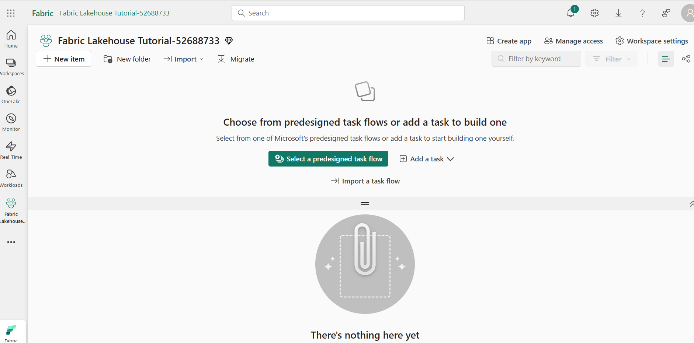
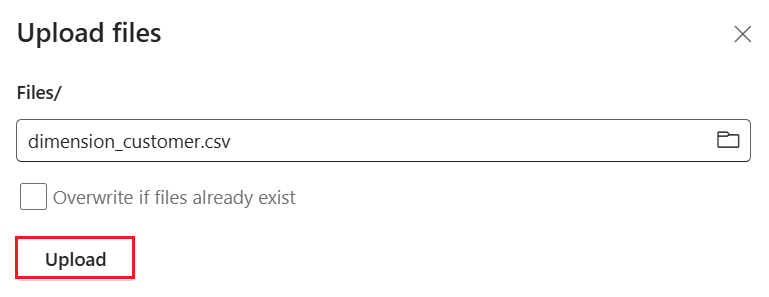
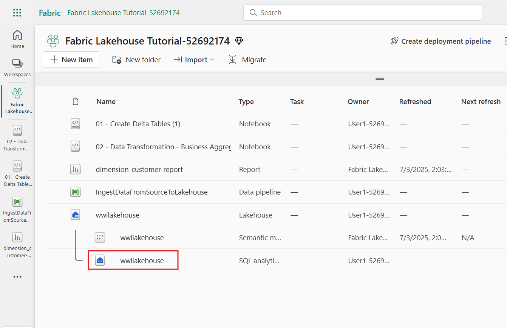
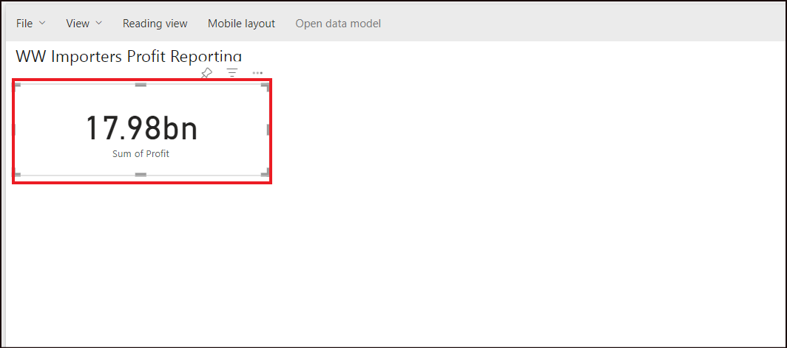

# ユース ケース 1: lakehouseの作成、サンプル データの取り込み、とレポートの作成

**紹介**

このラボでは、データ取得からデータ使用までのエンドツーエンドのシナリオについて説明します。これは、さまざまなエクスペリエンスとその統合方法、およびこのプラットフォームでの作業に伴うプロフェッショナルおよびシチズン開発者のエクスペリエンスなど、Fabric
の基本的な理解を構築するのに役立ちます。このラボは、リファレンスアーキテクチャ、機能の網羅的な一覧、または特定のベスト
プラクティスの推奨事項を意図したものではありません。

従来、組織はトランザクションデータや構造化データの分析ニーズに対応するために最新のdata
warehouseを構築してきました。そして、ビッグデータ（半構造化/非構造化）データ分析のニーズに対応するために、データlakehouseを構築してきました。これら2つのシステムが並行して稼働していたため、サイロ化、データの重複、そして総所有コストの増加が生じていました。  
Fabric はデータ ストアを統合し、Delta Lake
形式で標準化することで、サイロを排除し、データの重複を排除し、総所有コストを大幅に削減します。  
Fabricが提供する柔軟性により、lakehouseまたはdata
warehouseのいずれかのアーキテクチャを実装することも、両方を組み合わせてシンプルな実装で両方のメリットを享受することもできます。このチュートリアルでは、小売組織を例に、lakehouseを最初から最後まで構築します。このアーキテクチャでは、ブロンズレイヤーに生データ、シルバーレイヤーに検証済み・重複排除済みのデータ、ゴールドレイヤーに高度に精製されたデータを格納する[メダリオンアーキテクチャ](https://learn.microsoft.com/en-us/azure/databricks/lakehouse/medallion)を採用しています。あらゆる業界のあらゆる組織に、同じアプローチでlakehouseを実装できます。

このラボでは、小売分野の架空の Wide World Importers
社の開発者が次の手順を実行する方法について説明します。

**目的**:

1.  Power BI アカウントにサインインし、無料の Microsoft Fabric
    試用版を開始します。

2.  Power BI 内で Microsoft Fabric (Preview) 試用版を開始します。

3.  Microsoft 365 管理センターの OneDrive サインアップを構成します。

4.  Fabricワークスペースとlakehouseの作成など、組織のエンドツーエンドのlakehouseを構築して実装します。

5.  サンプル データをlakehouseに取り込み、さらなる処理の準備をします。

6.  Python/PySparkとSQL notebooksを使用してデータを変換し、準備します。

7.  さまざまなアプローチを使用してビジネス集計テーブルを作成します。

8.  シームレスなレポート作成のためにテーブル間の関係を確立します。

9.  準備されたデータに基づいて視覚化した Power BI レポートを作成します。

10. 作成したレポートを保存して保存し、将来の参照と分析のために保存します。

## 演習 1: lakehouseのエンドツーエンド シナリオを設定する

### タスク 1: Power BI アカウントにサインインし、無料の Microsoft Fabric 試用版にサインアップする

1.  ブラウザを開き、アドレスバーに移動して、次のURLを入力または貼り付けます+++https://app.fabric.microsoft.com/+++ 、そして**Enter**キーを押します。  
    

2.  **Microsoft
    Fabric**ウィンドウで、資格情報を入力し、**Submit**ボタンをクリックします。  
    

3.  次に、**Microsoft**ウィンドウでパスワードを入力し、\[**Sign in\]**
    ボタンをクリックします。  
      
    

4.  **サインインしたままですか?**
    ウィンドウで、\[**はい\]**ボタンをクリックします。

> 

5.  Power BI ホーム ページに移動します。

> 

## 演習 2: 組織のエンドツーエンドのlakehouseを構築して実装する

### タスク 1: Fabric ワークスペースの作成

このタスクでは、Fabric
ワークスペースを作成します。ワークスペースには、lakehouse、データフロー、Data
Factory パイプライン、ノートブック、Power BI
データセット、レポートなど、このlakehouse
チュートリアルに必要なすべての項目が含まれています。

1.  Fabric ホーム ページで、**+New workspace** タイルを選択します。

> 

2.  右側に表示される**ワークスペースの作成**ウィンドウで、次の詳細を入力し、**Apply**ボタンをクリックします。

|   |  |
|----|---|
|名前	|+++Fabric Lakehouse Tutorial-XXXXX+++(XXXXX はラボのインスタント ID にすることができます)|
|アドバンスド	|ライセンス モードで、ファブリック容量を選択します|
|デフォルト	|ストレージ形式 小さなデータセットのストレージ形式|
|テンプレート アプリ|	開発テンプレートアプリを確認します|


> 

注: ラボのインスタント ID を確認するには、\[ヘルプ\]
を選択し、インスタント ID をコピーします。

> 
>
> 

3.  デプロイが完了するまで待ちます。完了するまでに2〜3分かかります。

###   タスク 2: lakehouseを作成する

1.  ナビゲーション バーの **\[+New item**\]
    ボタンをクリックして、新しいlakehouseを作成します。

> 

2.  **Lakehouse**タイルをクリックします。

> 

3.  **新しいlakehouse**ダイアログ ボックスで、**名前**フィールドに
    「**+++wwilakehouse+++**」と入力し、\[**作成**\]ボタンをクリックして、新しいlakehouseを開きます。

> **注: wwilakehouse** の前にスペースを削除してください。
>
> 
>
> 

4.  「**SQL
    エンドポイントが正常に作成されました**」という通知が表示されます。

> 

### タスク3: サンプル・データの取り込み

1.  **wwilakehouse** ページで、 \[**lakehouse内のデータの取得\]**
    セクションに移動し、**「Upload files as shown in the below
    image」**をクリックします**。**

> 

2.  ファイルのアップロードタブで、ファイルの下にあるフォルダーをクリックします。

> 

3.  VM 上の **C:\LabFiles** を参照し、**dimension_customer.csv**
    ファイルを選択して、\[**Open**\]ボタンをクリックします。  
      
    

4.  次に、「**Upload」**ボタンをクリックして閉じます

> 

5.  、**ファイル**をクリックして更新します。ファイルが表示されます。

> 
>
> 

6.  \[**lakehouse\]**
    ページのエクスプローラーウィンドウで、ファイルを選択します。なお、マウスを**dimension_customer.csv**ファイルに移動して**dimension_customer.csv**ファイルの横にある水平の省略記号（…）をクリックします。
    \[**Load Table\]** に移動してクリックし、 \[**New Table\]**
    を選択します。

> 

7.  \[**Load file to new table\]** ダイアログ ボックスで、\[**Load\]**
    ボタンをクリックします。

> 

8.  これで、テーブル**dimension_customer**正常に作成されました

> 

9.  テーブル**dimension_coustomer**選択します

> 
>
> 

10. lakehouseの SQL エンドポイントを使用して、SQL
    ステートメントでデータをクエリすることもできます。 画面の右上にある
    **\[lakehouse**\] ドロップダウン メニュー から \[**SQL analytics
    endpoint**\] を選択します。

> 

11. wwilakehouse ページのエクスプローラーで、**dimension_customer**
    テーブルを選択してデータをプレビューし、 \[**New SQL query**\]
    を選択して SQL ステートメントを記述します。

> 

12. 次のサンプル クエリは、**dimension_customer**テーブルの**BuyingGroup
    列**に基づいて行数を集計します。SQL クエリ
    ファイルは、後で参照できるように自動的に保存され、必要に応じてこれらのファイルの名前を変更または削除できます。下の画像に示すようにコードを貼り付け、再生アイコンをクリックして
    スクリプトを**実行します**。

```
SELECT BuyingGroup, Count(*) AS Total
FROM dimension_customer
GROUP BY BuyingGroup
```
> 

**注**:
スクリプトの実行中にエラーが発生した場合は、スクリプト構文を上の画像と照合してください。

> 

13. 以前は、すべてのlakehouse テーブルとビューがセマンティック
    モデルに自動的に追加されていました。最近の更新プログラムでは、新しいlakehouseの場合は、テーブルをセマンティック
    モデルに手動で追加する必要があります。

> 

14. \[lakehouseの**ホーム\]** タブから \[**New semantic model**\]
    を選択し、セマンティック モデルに追加するテーブルを選択します。

> 

15. \[**新しいセマンティック モデル**\]
    ダイアログで、「+++wwilakehouse+++」と入力し、テーブルの一覧から**dimension_customer**テーブルを選択し、
    **\[Confirm**\]を選択して新しいモデルを作成します。

> 

### タスク4: レポートの作成

1.  次に、 左側のナビゲーション ウィンドウで \[**Fabric Lakehouse
    Tutorial-XX**\] をクリックします。

> 

2.  \[**Fabric Lakehouse Tutorial-XX**\]ビューで**、**\[**Semantic
    model**タイプ**\]** の \[**wwilakehouse\]**を選択します。
    

3.  セマンティック モデル
    ウィンドウから、すべてのテーブルを表示できます。レポートを最初から作成するか、ページ分割されたレポートを作成するか、Power
    BI
    でデータに基づいてレポートを自動的に作成させるかを選択できます。このチュートリアルでは、**このデータの探索**で、次の図に示すように
    \[**Auto-create a report**\] を選択します。

> 

4.  レポートの準備ができたので、**View report
    now**をクリックして開いて確認します。

> 

5.  テーブルはディメンションであり、メジャーがないため、Power BI
    は行数のメジャーを作成し、それを異なる列に集計し、次の図に示すように異なるグラフを作成します。

6.  上部のリボンから **\[Save\]**
    を選択して、将来使用するためにこのレポートを保存します。

> 

7.  **\[Save your replort\]**ダイアログ ボックスで、レポートの名前を
    +++dimension_customer-report+++
    として入力し、\[**Save**\]を選択します**。**

> 

8.  **レポートが保存されました**という通知が表示されます。

> 

# 演習 2: lakehouseにデータを取り込む

この演習では、Wide World Importers (WWI)から追加のディメンション
テーブルとファクト テーブルをlakehouseに取り込みます。

### タスク1: データの取り込み

1.  次に、 左側のナビゲーション ウィンドウで \[**Fabric Lakehouse
    Tutorial-XX**\] をクリックします。

> 

2.  **Fabric Lakehouse Tutorial-XX** ワークスペース ページで、 **\[+New
    item**\] ボタンに移動してクリックし、 **\[パイプライン\]**
    を選択します。

> 

3.  \[新しいパイプライン\] ダイアログ ボックスで、名前を
    **+++IngestDataFromSourceToLakehouse+++** として指定し、
    **\[Create\]**を選択します。 新しいデータ ファクトリ
    パイプラインが作成され、開かれます。

> 
>
> 

4.  新しく作成されたデータ ファクトリ パイプライン
    (**IngestDataFromSourceToLakehouse**)で、 \[**Copy data
    assistant\]**を選択します。

> 

5.  次に、**サンプル データ**接続を設定して、サンプルの World Wide
    Importers
    データをlakehouseにインポートします。**新しいソース**の一覧から、**Wide
    World Importers の Retail Data Model** を選択します。

> 

6.  \[**データ ソースに接続\]** ウィンドウで、**Retail Data Model from
    Wide World Importers** **data**\] を選択し、**\[Next\]**
    を選択します。

> 

7.  \[**データの宛先に接続\]** ウィンドウで、 \[**OneLake catalog**\]
    を選択し、 \[**wwilakehouse**\] を選択します。 次に、ルート
    フォルダーを \[**ファイル**\] として指定し、\[**Next**\]
    をクリックします。これにより、lakehouseの \[**ファイル**\]
    セクションにデータが書き込まれます。

> 
>
> 

8.  \[**ファイル形式\]**
    を保存先として空にする必要があります。**\[Save + Run\]**
    をクリックして、パイプラインを開始します。データを定期的に更新するようにパイプラインをスケジュールできます。このチュートリアルでは、パイプラインを一度だけ実行します。

> 

9.  データコピープロセスが完了するまでに約1〜3分かかります。

> 
>
> 

10. 出力タブで
    \[**Copy_a1n**\]を選択して、データ転送の詳細を確認します。**\[Status\]**が
    **\[Succeeded\]** になったら、\[**Close\]**ボタンをクリックします。

> 
>
> 

11. パイプラインが正常に実行されたら、lakehouse (**wwilakehouse**)
    に移動し、エクスプローラーを開いてインポートされたデータを確認します。

> 

12. すべての **WideWorldImporters フォルダー**が**エクスプローラー**
    ビュー に存在
    し、すべてのテーブルのデータが含まれていることを確認します。

> 

# 演習 3: lakehouseでデータを準備して変換する

### タスク1: データを変換し、シルバー・デルタ表にロードする

1.  **wwilakehouse** ページで、コマンド バーの **\[Open
    notebook**\]ドロップに移動し、 \[**New notebook\]**を選択します。

> 

2.  **lakehouse
    エクスプローラー**の開いているノートブックでは、ノートブックが開いているlakehouseに既にリンクされていることがわかります。

> 

\[!注意\]**注**: Fabric には、最適化されたデルタ レイク
ファイルを書き込むための [**V
order**](https://learn.microsoft.com/en-us/fabric/data-engineering/delta-optimization-and-v-order)機能が用意されています。多くの場合、V-order
は、最適化されていない Delta Lake ファイルに比べて圧縮率を 3 倍から 4
倍、パフォーマンス アクセラレーションを最大 10 倍向上させます。Fabric の
Spark は、既定の 128 MB
サイズのファイルを生成しながら、パーティションを動的に最適化します。ターゲットファイルサイズは、構成を使用してワークロード要件ごとに変更できます。[**書き込みの最適化**](https://learn.microsoft.com/en-us/fabric/data-engineering/delta-optimization-and-v-order#what-is-optimized-write)機能により、書き込まれるファイルの数を減らし、書き込まれたデータの個々のファイルサイズを増やすことを目的としたApache
Sparkエンジン。

3.  lakehouseの \[**テーブル**\] セクションにデータをデルタ レイク
    テーブルとして書き込む前に、2つのFabric 機能 (**V
    orderー**と**Optimize Write**)
    を使用して、データ書き込みを最適化し、読み取りパフォーマンスを向上させます。セッションでこれらの機能を有効にするには、ノートブックの最初のセルでこれらの構成を設定します。

4.  **セル**内のコードを次のコードで更新し、セルをホバーすると左側に表示される▷**Run
    cell**をクリックします。

```
# Copyright (c) Microsoft Corporation.
# Licensed under the MIT License.
spark.conf.set("spark.sql.parquet.vorder.enabled", "true")
spark.conf.set("spark.microsoft.delta.optimizeWrite.enabled", "true")
spark.conf.set("spark.microsoft.delta.optimizeWrite.binSize", "1073741824")
```

\[!注意\]**注**:
セルを実行する際に、基盤となるSparkプールやクラスターの詳細を指定する必要はありませんでした。


Fabric がLive Poolを介して提供するためです。すべての Fabric
ワークスペースには、ライブ プールと呼ばれる既定の Spark
プールが付属しています。つまり、ノートブックを作成するときに、Spark
構成やクラスターの詳細の指定について心配する必要はありません。最初のnotebookコマンドを実行すると、ライブ
プールは数秒で稼働します。そして、Spark
セッションが確立され、コードの実行が開始されます。このノートブックでは、Spark
セッションがアクティブである間、後続のコード実行はほぼ瞬時に行われます。

5.  次に、lakehouseの
    \[**ファイル**\]セクションから生データを読み取り、変換の一環としてさまざまな日付部分の列を追加します。partitionBy
    Spark API を使用して、新しく作成されたデータ パーツ列 (年と四半期)
    に基づいてデルタ
    テーブルとして書き込む前に、データをパーティション分割します。

6.  セル出力の下にある **\[+ Code\]**アイコンを使用して、新しいコード
    セルをノートブックに追加し、次のコードを入力します。**▷ Run
    cell**ボタンをクリックして、出力を確認します

**注**: 出力が表示されない場合は、**Spark
jobs**の左側にある水平線をクリックします。
```
from pyspark.sql.functions import col, year, month, quarter

table_name = 'fact_sale'

df = spark.read.format("parquet").load('Files/fact_sale_1y_full')
df = df.withColumn('Year', year(col("InvoiceDateKey")))
df = df.withColumn('Quarter', quarter(col("InvoiceDateKey")))
df = df.withColumn('Month', month(col("InvoiceDateKey")))

df.write.mode("overwrite").format("delta").partitionBy("Year","Quarter").save("Tables/" + table_name)
```

> 
>
> 

7.  テーブルが読み込まれたら、残りのディメンションのデータの読み込みに進むことができます。次のセルは、
    パラメーターとして渡されたテーブル名ごとに、lakehouseの**ファイル**セクションから生データを読み取る関数を作成します。次に、ディメンション
    テーブルのリストを作成します。最後に、テーブルのリストをループし、入力パラメーターから読み取られたテーブル名ごとにデルタ
    テーブルを作成します。

8.  セル出力の下にある \[+**Code\]**アイコンを使用して、新しいコード
    セルをノートブックに追加し、次のコードを入力します。**▷ Run
    cell**ボタンをクリックして、出力を確認します。

```
from pyspark.sql.types import *

def loadFullDataFromSource(table_name):
    df = spark.read.format("parquet").load('Files/' + table_name)
    df = df.drop("Photo")
    df.write.mode("overwrite").format("delta").save("Tables/" + table_name)

full_tables = [
    'dimension_city',
    'dimension_customer',
    'dimension_date',
    'dimension_employee',
    'dimension_stock_item'
]

for table in full_tables:
    loadFullDataFromSource(table)
``` 
  


9.  作成したテーブルを検証するには、すべての**テーブル**がリストに表示されるまで、**エクスプローラ**パネルのテーブルをクリックして更新を選択します。

> 


### タスク2: 集計のためのビジネス・データの変換

組織には、Scala/Pythonを扱うデータ エンジニアと、SQL (Spark SQL または
T-SQL) を扱う他のデータ
エンジニアがあり、全員がデータの同じコピーで作業している場合があります。ファブリックは、さまざまな経験や好みを持つこれらのさまざまなグループが働き、協力することを可能にします。2
つの異なるアプローチは、ビジネス集計を変換して生成します。パフォーマンスを損なうことなく、自分に適したものを選択することも、好みに基づいてこれらのアプローチを組み合わせて組み合わせることもできます。

- **アプローチ \#1** - PySpark
  を使用してデータを結合して集計し、ビジネス集計を生成します。このアプローチは、プログラミング
  (Python または PySpark) のバックグラウンドを持つ人に適しています。

- **アプローチ \#2** - Spark SQL
  を使用して、ビジネス集計を生成するためのデータを結合および集計します。このアプローチは、SQLのバックグラウンドを持ち、Sparkに移行する人に適しています。

**アプローチ \#1 (sale_by_date_city)**

PySpark
を使用して、ビジネス集計を生成するためのデータを結合および集計します。次のコードでは、それぞれが既存のデルタテーブルを参照する
3 つの異なる Spark
データフレームを作成します。次に、データフレームを使用してこれらのテーブルを結合し、グループ化して集計を生成し、いくつかの列の名前を変更し、最後にlakehouseの
\[**テーブル**\] セクションにデルタ
テーブルとして記述してデータを保持します。

1.  セル出力の下にある **\[+ コード\]**アイコンを使用して、新しいコード
    セルをノートブックに追加し、次のコードを入力します。**▷ Run
    cell**ボタンをクリックして、出力を確認します

このセルでは、3 つの異なる Spark
dataframesを作成し、それぞれが既存のデルタテーブルを参照します。

```
df_fact_sale = spark.read.table("wwilakehouse.fact_sale") 
df_dimension_date = spark.read.table("wwilakehouse.dimension_date")
df_dimension_city = spark.read.table("wwilakehouse.dimension_city")
```


2.  セル出力の下にある **\[+ コード\]** アイコンを使用して、新しいコード
    セルをノートブックに追加し、次のコードを入力します。**▷ Run
    cell**ボタンをクリックして、出力を確認します

このセルでは、前に作成したデータフレームを使用してこれらのテーブルを結合し、グループ化して集計を生成し、いくつかの列の名前を変更し、最後にlakehouseの
\[**テーブル**\] セクションにデルタテーブルとして書き込みます。

```
sale_by_date_city = df_fact_sale.alias("sale") \
.join(df_dimension_date.alias("date"), df_fact_sale.InvoiceDateKey == df_dimension_date.Date, "inner") \
.join(df_dimension_city.alias("city"), df_fact_sale.CityKey == df_dimension_city.CityKey, "inner") \
.select("date.Date", "date.CalendarMonthLabel", "date.Day", "date.ShortMonth", "date.CalendarYear", "city.City", "city.StateProvince", 
 "city.SalesTerritory", "sale.TotalExcludingTax", "sale.TaxAmount", "sale.TotalIncludingTax", "sale.Profit")\
.groupBy("date.Date", "date.CalendarMonthLabel", "date.Day", "date.ShortMonth", "date.CalendarYear", "city.City", "city.StateProvince", 
 "city.SalesTerritory")\
.sum("sale.TotalExcludingTax", "sale.TaxAmount", "sale.TotalIncludingTax", "sale.Profit")\
.withColumnRenamed("sum(TotalExcludingTax)", "SumOfTotalExcludingTax")\
.withColumnRenamed("sum(TaxAmount)", "SumOfTaxAmount")\
.withColumnRenamed("sum(TotalIncludingTax)", "SumOfTotalIncludingTax")\
.withColumnRenamed("sum(Profit)", "SumOfProfit")\
.orderBy("date.Date", "city.StateProvince", "city.City")

sale_by_date_city.write.mode("overwrite").format("delta").option("overwriteSchema", "true").save("Tables/aggregate_sale_by_date_city")

```


**アプローチ \#2 (sale_by_date_employee)**

Spark
SQLを使用して、ビジネス集計を生成するためのデータを結合および集計します。次のコードでは、3
つのテーブルを結合して一時的な Spark ビューを作成し、group by
を実行して集計を生成し、いくつかの列の名前を変更します。最後に、一時的な
Spark ビューから読み取り、最後にlakehouseの **\[テーブル**\]
セクションにデルタ テーブルとして書き込み、データを保持します。

3.  セル出力の下にある \[+ **コード\]** アイコンを使用して、新しいコード
    セルをノートブックに追加し、次のコードを入力します。**▷ Run
    cell**ボタンをクリックして、出力を確認します。

このセルでは、3 つのテーブルを結合して一時的な Spark
ビューを作成し、グループ化して集計を生成し、いくつかの列の名前を変更します。

```
%%sql
CREATE OR REPLACE TEMPORARY VIEW sale_by_date_employee
AS
SELECT
       DD.Date, DD.CalendarMonthLabel
 , DD.Day, DD.ShortMonth Month, CalendarYear Year
      ,DE.PreferredName, DE.Employee
      ,SUM(FS.TotalExcludingTax) SumOfTotalExcludingTax
      ,SUM(FS.TaxAmount) SumOfTaxAmount
      ,SUM(FS.TotalIncludingTax) SumOfTotalIncludingTax
      ,SUM(Profit) SumOfProfit 
FROM wwilakehouse.fact_sale FS
INNER JOIN wwilakehouse.dimension_date DD ON FS.InvoiceDateKey = DD.Date
INNER JOIN wwilakehouse.dimension_Employee DE ON FS.SalespersonKey = DE.EmployeeKey
GROUP BY DD.Date, DD.CalendarMonthLabel, DD.Day, DD.ShortMonth, DD.CalendarYear, DE.PreferredName, DE.Employee
ORDER BY DD.Date ASC, DE.PreferredName ASC, DE.Employee ASC

```
 

8\. セル出力の下にある \[**+ コード\]** アイコンを使用して、新しいコード
セルをノートブックに追加し、次のコードを入力します。**▷
セルを実行**ボタンをクリックして、出力を確認します

このセルでは、前のセルで作成された一時的な Spark
ビューから読み取り、最後に lakehouseの \[**テーブル**\]
セクションにデルタ テーブルとして書き込みます。

```
sale_by_date_employee = spark.sql("SELECT * FROM sale_by_date_employee")
sale_by_date_employee.write.mode("overwrite").format("delta").option("overwriteSchema", "true").save("Tables/aggregate_sale_by_date_employee")
```


9\. 作成したテーブルを検証するには、集計テーブルが表示されるまで
\[**テーブル\]** をクリックし、更新します。


どちらのアプローチも同様の結果をもたらします。自分の背景や好みに基づいて選択することで、新しい技術を学んだり、パフォーマンスを妥協したりする必要性を最小限に抑えることができます。

また、データを delta lake
ファイルとして書き込んでいることに気付く場合があります。Fabric
の自動テーブル検出と登録機能は、それらを取得してメタストアに登録します。SQL
で使用するテーブルを作成するために、CREATE TABLE
ステートメントを明示的に呼び出す必要はありません。

# 演習 4: Microsoft Fabric でレポートを作成する

チュートリアルのこのセクションでは、Power BI データ
モデルを作成し、レポートを最初から作成します。

### タスク1: SQLエンドポイントを使用したシルバー・レイヤー内のデータの探索

Power BI は、Fabric
エクスペリエンス全体にネイティブに統合されています。このネイティブ統合により、lakehouseからデータにアクセスする
DirectLake
と呼ばれる独自のモードがもたらされ、最もパフォーマンスの高いクエリとレポート
エクスペリエンスが提供されます。DirectLake モードは、Power BI
で非常に大規模なデータセットを分析するための画期的な新しいエンジン機能です。このテクノロジは、data
warehouseやlakehouse endpointにクエリを実行することなく、また Power BI
データセットにデータをインポートまたは複製することなく、データ
レイクから Parquet
形式のファイルを直接読み込むという考え方に基づいています。DirectLake
は、データ レイクから Power BI
engineにデータを直接読み込み、分析の準備を整えるための高速パスです。

従来の DirectQuery モードでは、Power BI
engineはソースからデータを直接クエリして各クエリを実行し、クエリのパフォーマンスはデータの取得速度に依存します。DirectQuery
を使用すると、データをコピーする必要がなくなり、ソースの変更がインポート中にクエリ結果にすぐに反映されます。一方、インポートモードでは、クエリの実行ごとにソースからデータをクエリしなくても、メモリ内でデータをすぐに使用できるため、パフォーマンスが向上します。ただし、Power
BI
engineは、データの更新時に最初にデータをメモリにコピーする必要があります。基になるデータ
ソースに対する変更のみが、次回のデータ更新時に取得されます
(スケジュールされた更新とオンデマンドの更新)。

DirectLakeモードでは、データファイルをメモリに直接ロードすることで、このインポート要件が排除されるようになりました。明示的なインポート
プロセスがないため、変更が発生したときにソースで取得できるため、DirectQuery
とインポート
モードの利点を組み合わせながら、欠点を回避できます。したがって、DirectLake
モードは、非常に大規模なデータセットや、ソースで頻繁に更新されるデータセットを分析するのに理想的な選択肢です。

1.  左側のメニューから**Fabric**
    [**Lakehouse-@lab.LabInstance.Id**](mailto:%20Lakehouse-@lab.LabInstance.Id)
    を選択し、**wwilakehouse**という名前のセマンティック
    モデルを選択します。

> 

2.  上部のメニュー バーで **Open semantic model**を選択して、データ
    モデル デザイナーを開きます。

> 

3.  右上で、データ・モデル・デザイナーが**編集モード**であることを確認します。これにより、ドロップダウンテキストが「**Editing**」に変更されます。

> 

4.  メニュー リボンで **\[Edit tables\]**
    を選択して、テーブル同期ダイアログを表示します。

> 

5.  \[**Edit semantic
    model\]**ダイアログで、すべてのテーブルを選択し、ダイアログの下部にある
    **\[Confirm\]** を選択して、セマンティック モデルを同期します。

> 
>
> 

6.  **fact_sale** テーブルから **CityKey**
    フィールドをドラッグして、**dimension_city**
    テーブルの**CityKey**フィールドにドロップしてリレーションシップを作成します。**\[Create
    Relationship**\]ダイアログ ボックスが表示されます。

> 注: テーブルをクリックし、ドラッグ アンド ドロップして、dimension_city
> テーブルとfact_sale
> テーブルを隣り合わせにして、テーブルを再配置します。関係を作成しようとしている2つのテーブルについても同じことが当てはまります。これは、テーブル間の列のドラッグアンドドロップを容易にするためです。

7.  \[**Create Relationship\]** ダイアログ
    ボックスで、次の操作を行います。

    - 表 1 には、**fact_saleとCityKey** の列が入力されています。

    - 表2には、**dimension_cityと CityKey**の列が入力されています。

    - カーディナリティ: **Many to one (\*:1)**

    - クロスフィルター方向: **Single**

    - \[**Make this relationship active\]**
      の横にあるボックスを選択したままにします。

    - \[**Assume referential integrity\]**
      の横にあるボックスを選択します。

    - \[**Save**\] を選択します**。**

> 

8.  次に、これらのリレーションシップを、上に示したのと同じ **\[Create
    Relationship\]** 設定で、次のテーブルと列で追加します。

    - **StockItemKey(fact_sale)** - **StockItemKey(dimension_stock_item)**

> 
>
> 

- **Salespersonkey(fact_sale)** - **EmployeeKey(dimension_employee)**

> 

9.  上記と同じ手順を使用して、以下の 2
    つのセット間の関係を作成してください。

    - **CustomerKey(fact_sale)** - **CustomerKey(dimension_customer)**

    - **InvoiceDateKey(fact_sale)** - **Date(dimension_date)**

10. これらのリレーションシップを追加すると、データ
    モデルは次の図のようになり、レポート作成の準備が整います。

> 

### タスク2:レポートを作成する

1.  上部のリボンから \[**ファイル**\]を選択し、\[**Create new
    report**\]を選択して、Power BI
    でのレポート/ダッシュボードの作成を開始します。

> 

2.  Power BI レポート キャンバスでは、必要な列を
    \[**データ**\]ウィンドウからキャンバスにドラッグし、使用可能な 1
    つ以上の視覚化を使用して、ビジネス要件を満たすレポートを作成できます。

> 

**タイトルを追加します。**

3.  リボンで、\[**Text box\]** を選択します。**WW Importers Profit
    Reporting**と入力します。 **テキスト**を**強調表示し、**サイズを
    **20**に増やします。

> 

4.  テキスト ボックスのサイズを変更してレポート
    ページの**左上**に配置し、テキスト ボックスの外側をクリックします。

> 

**カードを追加します。**

- \[**データ\]** ウィンドウで **fact_sales** を展開し、\[**Profit**\]
  の横にあるチェックボックスをオンにします。この選択により、縦棒グラフが作成され、フィールドが
  Y 軸に追加されます。

> 

5.  棒グラフを選択した状態で、
    視覚化ウィンドウで**Card**ビジュアルを選択します。

> 

6.  この選択により、ビジュアルがカードに変換されます。タイトルの下にカードを置きます。

> 

7.  空白のキャンバス上の任意の場所をクリック (または Esc キーを押す)
    すると、先ほど配置したカードが選択されなくなります。

**棒グラフを追加します。**

8.  \[**データ\]** ウィンドウで **fact_sales** を展開し、**\[利益**\]
    の横にあるチェックボックスをオンにします。この選択により、縦棒グラフが作成され、フィールドが
    Y 軸に追加されます。

> 

9.  \[**データ\]** ウィンドウで
    **dimension_city**を展開し、**\[SalesTerritory\]** のチェック
    ボックスをオンにします。この選択により、フィールドが Y
    軸に追加されます。

> 

10. 棒グラフを選択した状態で、視覚化ウィンドウで **\[Clustered bar
    chart\]**
    ビジュアルを選択します。この選択により、縦棒グラフが棒グラフに変換されます。

> 

11. 棒グラフのサイズを変更して、タイトルとカードの下の領域を塗りつぶします。

> 

12. 空白のキャンバス上の任意の場所をクリック (または Esc キーを押す)
    と、棒グラフが選択されなくなります。

**積み上げ面グラフのビジュアルを作成します：**

13. \[**視覚化\]** ウィンドウで、 \[**Stacked area chart\]**
    ビジュアルを選択します。

> 

14. 前の手順で作成したカードと棒グラフのビジュアルの右側にある積み上げ面グラフの位置とサイズを変更します。

> 

15. \[**データ\]**ウィンドウで
    **fact_sales**を展開し、**\[利益\]**の横にあるチェックボックスをオンにします。**dimension_date**を展開し、**\[FiscalMonthNumber\]**
    の横にあるチェックボックスをオンにします。この選択により、会計月ごとの利益を示す塗りつぶし折れ線グラフが作成されます。

> 

16. \[データ**\] ウィンドウで**、\[dimension_stock_item**\]
    を展開**し、\[**BuyingPackage**\] を\[凡例\] フィールド
    ウェルにドラッグします。この選択により、各購入パッケージに行が追加されます。

>  

17. 空白のキャンバス上の任意の場所をクリック (または Esc キーを押す)
    すると、積み上げ面グラフが選択されなくなります。

**縦棒グラフを作成します。**

18. \[**視覚化\]** ウィンドウで、 \[**Stacked column chart\]**
    ビジュアルを選択します。

> 

19. \[**データ\]**ウィンドウで **fact_sales** を展開し、**\[利益\]**
    の横にあるチェックボックスをオンにします。この選択により、フィールドが
    Y 軸に追加されます。

20. \[**データ\]** ウィンドウで**dimension_employee**
    を展開し、**\[従業員\]**の横にあるチェックボックスをオンにします。この選択により、フィールドが
    X 軸に追加されます。

> 

21. 空白のキャンバス上の任意の場所をクリック (または Esc キーを押す)
    すると、グラフが選択されなくなります。

22. リボンから、\[**File\]** \> **\[Save\]**を選択します。

> 

23. レポートの名前を**「Profit
    Reporting」**として入力します。\[**Save\]** を選択します。

> 

24. レポートが保存されたことを示す通知が届きます。

> 

# 演習 5: リソースをクリーンアップする

個々のレポート、パイプライン、ウェアハウス、その他のアイテムを削除したり、ワークスペース全体を削除したりできます。このチュートリアル用に作成したワークスペースを削除するには、次の手順を使用します。

1.  左側のナビゲーション メニューからワークスペース (**Fabric Lakehouse
    Tutorial-XX**)
    を選択します。ワークスペースアイテムビューが開きます。

> 

2.  ... \[ワークスペース名\] のオプションを選択し、\[**Workspace
    settings\]** を選択します。

> 

3.  \[**General\]**を選択し、\[**Remove this workspace\]**
    を選択します。

> 

4.  ポップアップする警告で **\[Delete\]** をクリックします。

> 

5.  ワークスペースが削除されたという通知を待ってから、次のラボに進みます。

> 

**概要**: この実用的なラボでは、データ管理とレポート作成のために
Microsoft Fabric と Power BI
内の重要なコンポーネントをセットアップおよび構成することに焦点を当てます。これには、試用版のアクティブ化、OneDrive
の構成、ワークスペースの作成、lakehouseのセットアップなどのタスクが含まれます。このラボでは、サンプル
データの取り込み、デルタ テーブルの最適化、効果的なデータ分析のための
Power BI
でのレポートの作成に関連するタスクについても説明します。この目的は、データ管理とレポート作成の目的に
Microsoft Fabric と Power BI
を利用する実践的な経験を提供することを目的としています。
