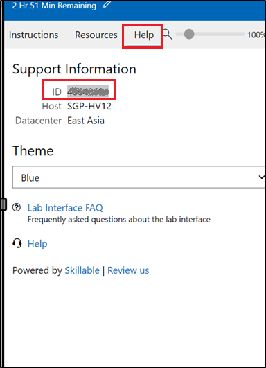
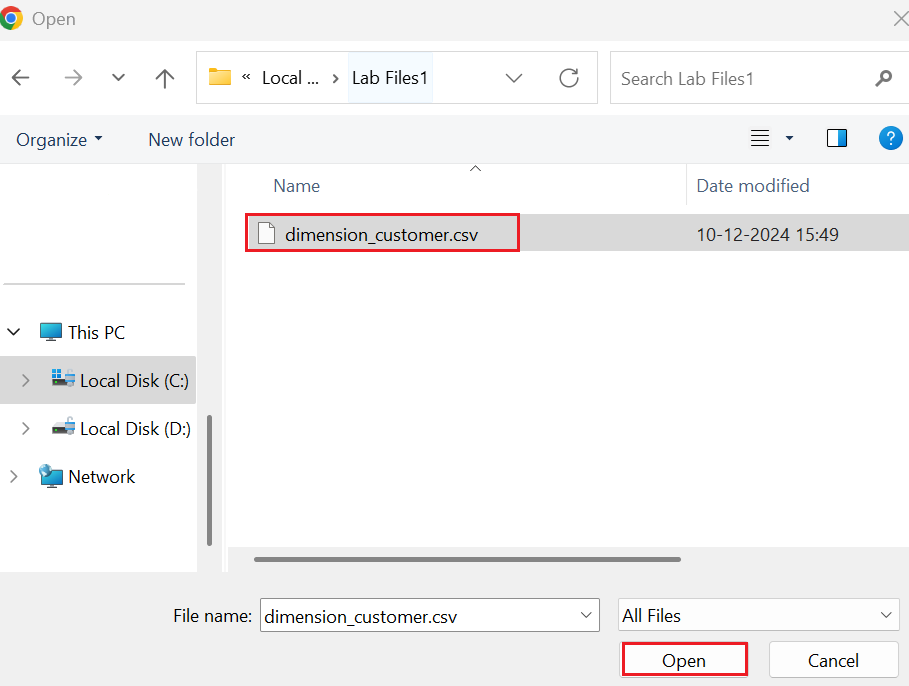
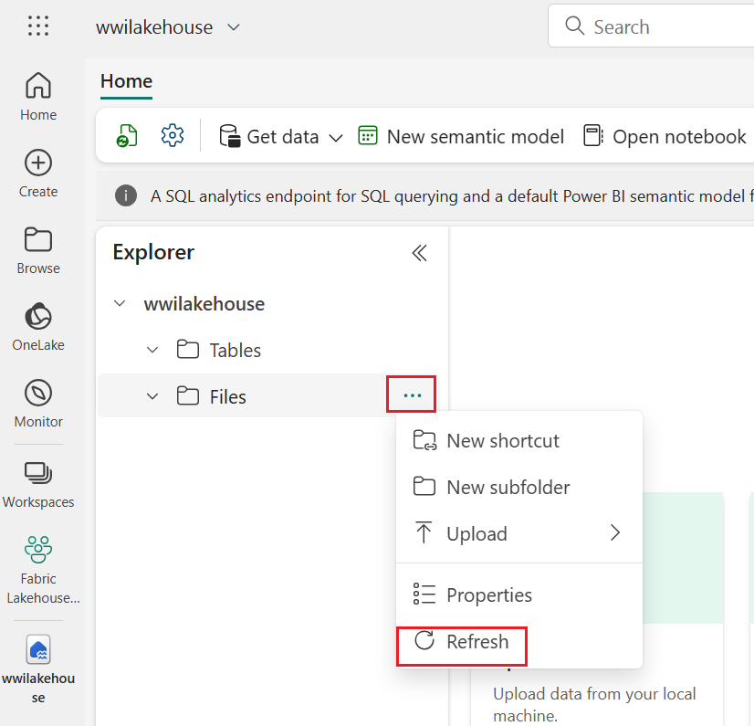
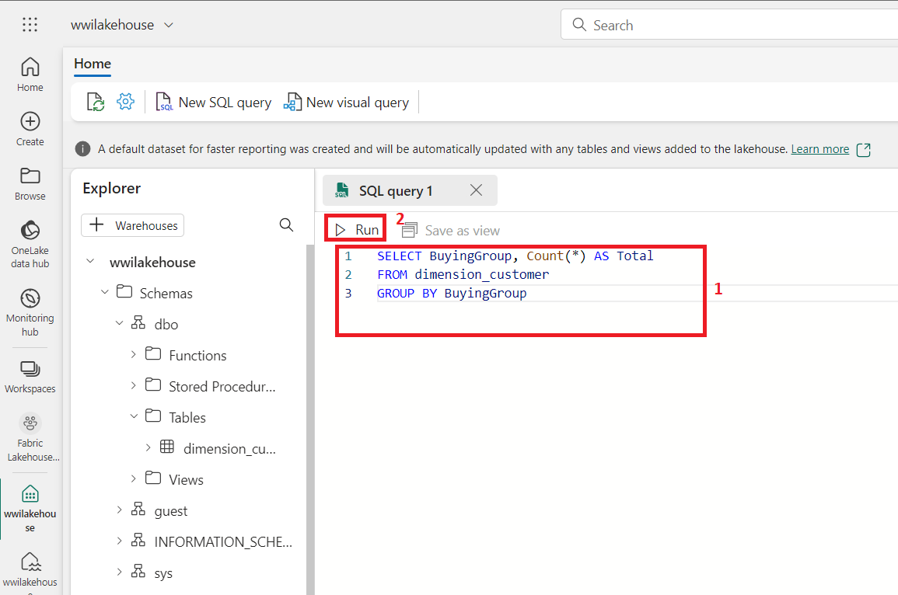
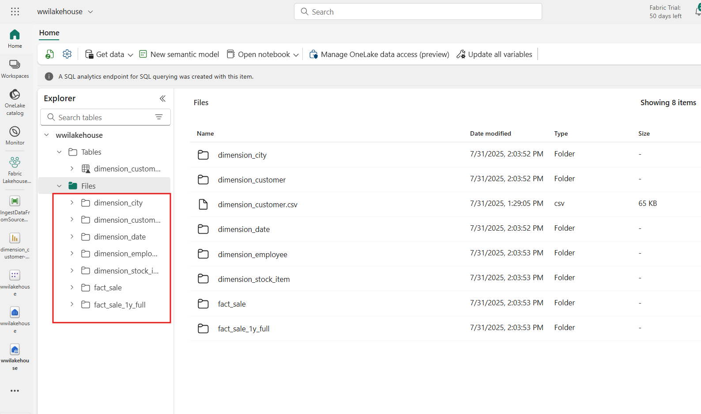

# ユースケース 1: Lakehouseを作成し、サンプルデータを取り込み、レポートを作成する

**導入**

このラボでは、データの取得から利用までのエンドツーエンドのシナリオを段階的に学習します。Fabric
の基本的な理解を深めるのに役立ちます。これには、様々なエクスペリエンスとその統合方法、そしてこのプラットフォームで作業する際に得られるプロフェッショナル開発者とシチズンデベロッパーのエクスペリエンスが含まれます。このラボは、リファレンスアーキテクチャ、機能の網羅的なリスト、または特定のベストプラクティスの推奨を目的としたものではありません。

従来、組織はトランザクションデータや構造化データの分析ニーズに対応するために最新のデータウェアハウスを構築してきました。そして、ビッグデータ（半構造化/非構造化）データ分析のニーズに対応するために、データLakehouseを構築してきました。これら2つのシステムが並行して稼働していたため、サイロ化、データの重複、そして総所有コストの増加が生じていました。

Fabric はデータ ストアを統合し、Delta Lake
形式で標準化することで、サイロを排除し、データの重複を排除し、総所有コストを大幅に削減します。

Fabricが提供する柔軟性により、Lakehouseまたはデータウェアハウスのいずれかのアーキテクチャを実装することも、両方を組み合わせてシンプルな実装で両方のメリットを享受することもできます。このチュートリアルでは、小売組織を例に、Lakehouseを最初から最後まで構築します。[メダリオン・アーキテクチャを採用して](https://learn.microsoft.com/en-us/azure/databricks/lakehouse/medallion)おり、ブロンズレイヤーには生データ、シルバーレイヤーには検証済み・重複排除済みのデータ、ゴールドレイヤーには高度に精製されたデータが格納されます。あらゆる業界のあらゆる組織に、同じアプローチでLakehouseを実装できます。

このラボでは、小売分野の架空の Wide World Importers
社の開発者が次の手順を実行する方法について説明します。

**目的**:

1\. Power BI アカウントにサインインし、Microsoft Fabric
の無料試用版を開始します。

2\. Power BI 内で Microsoft Fabric (プレビュー) の試用版を開始します。

3\. Microsoft 365 管理センターの OneDrive サインアップを構成します。

4\.
組織向けのエンドツーエンドのレイクハウスを構築および実装します。これには、Fabric
ワークスペースとレイクハウスの作成が含まれます。

5\.
レイクハウスにサンプルデータを取り込み、さらに処理できるように準備します。

6\. Python/PySpark と SQL
ノートブックを使用してデータを変換および準備します。

7\. さまざまなアプローチを使用して、ビジネス集計テーブルを作成します。

8\.
シームレスなレポート作成のために、テーブル間のリレーションシップを確立します。

9\. 準備されたデータに基づいて、視覚エフェクトを備えた Power BI
レポートを作成します。

10\. 作成したレポートを保存し、将来の参照と分析に使用します。

## 演習 1: Lakehouse エンドツーエンドシナリオのセットアップ

### タスク 1: Power BI アカウントにサインインし、無料の Microsoft Fabric 試用版にサインアップします。

1.  ブラウザを開き、アドレス バーに移動して、次のURL
    を入力または貼り付けます:+ ++https://app.fabric.microsoft.com/+++
    次に、 **Enter**ボタンを押します。

> 

2.  **Microsoft Fabric**ウィンドウで資格情報を入力し、
    **\[Submit\]**ボタンをクリックします。

> 

3.  次に、 **Microsoft**ウィンドウでパスワードを入力し、「**Sign
    in」**ボタンをクリックします。

> 

4.  **「Stay signed in?** **」**ウィンドウで、
    **「Yes」**ボタンをクリックします。

> 

5.  Power BI ホーム ページに移動します。

> 

## 組織向けのエンドツーエンドのLakehouseを構築して実装する

### タスク1: Fabricワークスペースを作成する

このタスクでは、Fabric
ワークスペースを作成します。ワークスペースには、Lakehouse、データフロー、Data
Factory パイプライン、ノートブック、Power BI
データセット、レポートなど、このLakehouseチュートリアルに必要なすべてのアイテムが含まれています。

1.  Fabric ホームページで、 **+ New workspace**タイルを選択します。

> 

2.  右側に表示される**「Create a
    workspace** **」**ペインで、次の詳細を入力し、
    **「Apply」**ボタンをクリックします。

[TABLE]

> 

注: ラボのインスタント ID を見つけるには、「Help」を選択してインスタント
ID をコピーします。

> 
>
> 

3.  デプロイが完了するまでお待ちください。完了まで2～3分かかります。

> 

### タスク2:Lakehouseを作る

1.  ナビゲーション バーの**\[+ New
    item\]**ボタンをクリックして、新しいLakehouseを作成します。

> 

2.  「 **Lakehouse** 」タイルをクリックします。

> 

3.  **\[New Lakehouse\]**ダイアログ ボックスで、
    **\[Name\]**フィールドに「 +++ **wwilakehouse +++ 」と入力し、
    \[Create\]ボタン**をクリックして新しいLakehouseを開きます。

> **注意: wwilakehouse の**前のスペースを必ず削除してください。
>
> 
>
> 

4.  **「Successfully created SQL endpoint」**という通知が表示されます。

> 

### タスク3: サンプルデータを取り込む

1.  **wwilakehouseページ**で、\[**Get data in your
    lakehouse\]** **セクションのに移動し**、\[**Upload files as shown in
    the below image\]をクリックします。**

> 

2.  「Upload files」タブで、「Files」の下のフォルダをクリックします。

> 

3.  VM 上の**C:\LabFiles**を参照し、
    ***dimension_customer.csv***ファイルを選択して、
    **\[Open\]**ボタンをクリックします。

> 

4.  次に**\[Upload\]**ボタンをクリックして閉じます

> 

5.  **Files**をクリックしてRefreshを選択します。ファイルが表示されます。

> 
>
> 

6.  **Lakehouseページ**の「Explorer」ペインで「Files」を選択します。マウスポインタを**dimension_customer.csv**ファイルに移動します。**dimension_customer.csvの**横にある水平の省略記号（…）をクリックします**。
    「Load Table**」をクリックし、 **「New table」**を選択します。

> 

7.  **\[Load file to new table** **\]**ダイアログ ボックスで、
    **\[Load\]**ボタンをクリックします。

> 
>
> 

8.  **dimension_coustomer**テーブルを選択

> 
>
> 

9.  LakehouseのSQLエンドポイントを使用して、
    SQLステートメントでデータをクエリすることもできます。画面右上の**Lakehouse**ドロップダウンメニューから**「SQL
    analytics endpoint** **」**を選択してください**。**

> 

10. wwilakehouseページの「エクスプローラー」で**dimension_customer**テーブルを選択してそのデータをプレビューし、「**New
    SQL query** **」**を選択してSQL ステートメントを記述します。

> 

11. **dimension_customerテーブル**の**BuyingGroup列**に基づいて行数を集計します。SQLクエリファイルは将来の参照用に自動的に保存され、必要に応じて名前を変更したり削除したりできます。下の画像のようにコードを貼り付け、再生アイコンをクリックしてスクリプト**を実行してください。**

> SELECT BuyingGroup, Count(\*) AS Total
>
> FROM dimension_customer
>
> GROUP BY BuyingGroup
>
> 

**注**:
スクリプトの実行中にエラーが発生した場合は、上記の画像とスクリプトの構文を照合してください。

> 

12. 以前は、すべてのLakehouseのテーブルとビューはセマンティックモデルに自動的に追加されていました。最近のアップデートでは、新しいLakehouseについては、テーブルをセマンティックモデルに手動で追加する必要があります。

> 

13. Lakehouseから **\[Reporting\]**タブで、 **\[Manage default semantic
    model** **\]を選択し**、セマンティック
    モデルに追加するテーブルを選択します。

> 

14. **\[Manage default semantic model** **\]タブ**で、
    **dimension_customer**テーブルを選択し、 **\[Confirm\]
    をクリックします。**

> 

### タスク4: レポートを作成する

1.  左側のナビゲーションペインで**Fabric Lakehouse
    Tutorial-XX**をクリックします。

> 

2.  次に、**SQL analytics**タイプの**wwilakehouse**を選択します。​

> 

3.  Lakehouseから **Home**タブで**Settings**を選択

> 

4.  セマンティックモデル内のテーブルが常に同期されていることを確認するには、**SQL
    analytics
    endpoint** ビューに切り替えてLakehouseを開きます。 **Settings**パネルで、**Default
    Power BI semantic model** を選択し、**Sync the default Power BI
    semantic model**をオンにします**。**

> 

5.  左側のナビゲーションペインで**Fabric Lakehouse
    Tutorial-XX**をクリックします。

> 

6.  **Fabric Lakehouse Tutorial-XX**ビューで、タイプが**Semantic
    model(default)**の**wwilakehouseを選択します。このデータセットは自動的に作成され、**
    lakehouseと同じ名前になります。

> 

7.  セマンティックモデルペインから、すべてのテーブルを表示できます。レポートは、最初から作成するか、ページ分割されたレポートを作成するか、Power
    BI
    にデータに基づいて自動作成させるかを選択できます。このチュートリアルでは、下の画像に示すように、
    **「Explore this data」で「Auto-create a
    report** **」**を選択してください。

> 
>
> 
>
> 

8.  テーブルはディメンションであり、メジャーが含まれていないため、Power
    BI
    は行数のメジャーを作成し、それをさまざまな列にわたって集計して、次の図に示すようにさまざまなグラフを作成します。

9.  上部のリボンから**\[Save\]**を選択して、このレポートを将来保存します。

> 

10. **\[Save your report** **\]**ダイアログ ボックスで、レポートの名前を
    +++ dimension_customer -report+++ として入力し、 **\[Save\]**
    を選択します**。**

> 

11. **「Report saved」**という通知が表示されます。

> 

# 演習2:Lakehouseにデータを取り込む

この演習では、Wide World Importers (WWI)
からLakehouseに追加のディメンション テーブルとファクト
テーブルを取り込みます。

### タスク1: データの取り込み

1.  左側のナビゲーションペインで**Fabric Lakehouse
    Tutorial-XX**をクリックします。

> 

2.  **Fabric Lakehouse Tutorial-XXワークスペース ページ**で、 **\[+New
    item\]**ボタンに移動してクリックし、 **\[Data
    pipeline\]**を選択します。

> 

3.  「New pipeline」ダイアログボックスで、名前を**「+++
    IngestDataFromSourceToLakehouse +++」と指定し**、
    **「Create」**を選択します**。**新しいデータファクトリーパイプラインが作成され、開きます。

> 
>
> 

4.  新しく作成されたデータファクトリーパイプライン、すなわち **IngestDataFromSourceToLakehouse
    で**、**Copy data assistant** を選択します。

> 

5.  次に、 **Sample data** 接続を使用して、 World Wide
    ImportersのサンプルデータをLakehouseにインポートします。 **「New
    sources」**リストから、 **「Wide World Importers」**の**「Retail
    Data Model」**を選択します。

> 

6.  **Connect to data source** ウィンドウで、 **Wide World
    Importers**データから**Retail Data
    Model**を選択し、**Next**を選択します。

> 

7.  **データ宛先への接続ウィンドウ**で、 **OneLakeを選択します。
    カタログを**開き、
    **wwilakehouseを選択します。ルートフォルダをFiles**として指定し、
    **「Next」をクリックします**。これにより、データがlakehouseの**Filesセクションに書き込まれます**。

> 
>
> 

1.  **File形式**を選択する すべき 出力先は空のままにしてください。
    **「Next」をクリックし**、
    **「Save+Run」を**クリックします。パイプラインをスケジュール設定して、定期的にデータを更新することもできます。このチュートリアルでは、パイプラインを1回だけ実行します。

> 
>
> 

2.  データのコピープロセスは完了するまでに約 1 ～ 3 分かかります。

> 
>
> 
>
> 
>
> 

3.  「Output」タブで「**Copy_a1n**」を選択し、データ転送の詳細を確認します。「ステータス」が「成功」と表示されたら、「**Close**」ボタンをクリックします。

> 
>
> 

4.  パイプラインの実行が正常に完了したら、Lakehouse( **wwilakehouse** )
    に移動し、エクスプローラーを開いてインポートされたデータを確認します。

> 

5.  すべての**WideWorldImporters**ファイルが**Explorer**ビューに存在し、すべてのテーブルのデータが含まれていることを確認します。

> 

# 演習3:Lakehouseでデータの準備と変換を行う

### タスク 1: データを変換して Silver Delta テーブルにロードする

1.  **wwilakehouseページ**で、コマンド バーの**\[Open
    notebook** **\]ドロップに移動してクリックし、 \[New
    notebook\]を選択します**。

> 

2.  **Lakehouse
    explorer**で開いているノートブックを見ると、そのノートブックがすでに開いているLakehouseにリンクされていることが分かります。

> 

\*\* 注記\*\*

Fabricは、最適化されたDelta
Lakeファイルを書き込むための[**Vオーダー**](https://learn.microsoft.com/en-us/fabric/data-engineering/delta-optimization-and-v-order)機能を提供します。Vオーダーにより、最適化されていないDelta
Lakeファイルと比較して、圧縮率は3～4倍、パフォーマンスは最大10倍向上します。FabricのSparkは、デフォルトで128MBのサイズのファイルを生成する際に、パーティションを動的に最適化します。ターゲットファイルサイズは、設定を使用してワークロード要件に応じて変更できます。[**最適化書き込み**](https://learn.microsoft.com/en-us/fabric/data-engineering/delta-optimization-and-v-order#what-is-optimized-write)機能により、Apache
Sparkエンジンは書き込まれるファイル数を減らし、書き込まれるデータの個々のファイルサイズを増やすことを目指します。

3.  Lakehouseの**Tables**セクションでデルタレイクテーブルとしてデータを書き込む前に、データ書き込みの最適化と読み取りパフォーマンスの向上のために、2つのFabric機能（
    **V-order**と**Optimize Write**
    ）を使用します。セッションでこれらの機能を有効にするには、ノートブックの最初のセルでこれらの設定を行います。

4.  **セル**に次のコードを入力し、マウスをセルの上に置くと左側に表示される▷**セル実行**をクリックします。

> \# Copyright (c) Microsoft Corporation.
>
> \# Licensed under the MIT License.
>
> spark.conf.set( " spark.sql.parquet.vorder.enabled " , "true" )
>
> spark.conf.set( " spark.microsoft . delta.optimizeWrite.enabled ",
> "true")
>
> spark.conf.set( " spark.microsoft . delta.optimizeWrite.binSize ",
> "1073741824")
>
> 
>
> 
>
> セルを実行する際に、基盤となるSparkプールやクラスターの詳細を指定する必要はありませんでした。FabricはLive
> Poolを通じてそれらを提供するからです。すべてのFabricワークスペースには、Live
> Poolと呼ばれるデフォルトのSparkプールが付属しています。つまり、ノートブックを作成する際に、Spark構成やクラスターの詳細を指定する必要はありません。最初のノートブックコマンドを実行すると、数秒でLive
> Poolが起動し、Sparkセッションが確立され、コードの実行が開始されます。Sparkセッションがアクティブな間、このノートブックでは後続のコード実行はほぼ瞬時に行われます。

5.  **Files**セクションから生データを読み取り、変換の一環として、異なる日付部分に対応する列を追加します。partitionBy
    Spark
    APIを使用してデータをパーティション化し、新しく作成されたデータ部分列（YearとQuarter）に基づいてデルタテーブルとして書き込みます。

6.  セル出力の下にある**「+Code」アイコン**を使用してノートブックに新しいコードセルを追加し、次のコードを入力します。
    **▷ 「セルを実行」**ボタンをクリックして出力を確認します。

**注:** 出力が表示されない場合は、 **Spark**
ジョブの左側にある水平線をクリックしてください。

from pyspark.sql.functions import col, year, month, quarter

table_name = 'fact_sale'

df = spark.read.format("parquet").load('Files/fact_sale_1y_full')

df = df.withColumn('Year', year(col("InvoiceDateKey")))

df = df.withColumn('Quarter', quarter(col("InvoiceDateKey")))

df = df.withColumn('Month', month(col("InvoiceDateKey")))

df.write.mode("overwrite").format("delta").partitionBy("Year","Quarter").save("Tables/" +
table_name)

>  
>
> 

7.  ファクトテーブルがロードされたら、残りのディメンションのデータのロードに進むことができます。次のセルは、パラメータとして渡されたテーブル名ごとに、Lakehouseの**Files**セクションから生データを読み取る関数を作成します。次に、ディメンションテーブルのリストを作成します。最後に、テーブルのリストをループ処理し、入力パラメータから読み取ったテーブル名ごとに差分テーブルを作成します。

8.  セル出力の下にある**「+Code」アイコン**を使用してノートブックに新しいコードセルを追加し、以下のコードを入力します。
    **▷ 「セル実行」**ボタンをクリックして、 pyspark.sql.types import
    \*からの出力を確認します。

> def loadFullDataFromSource(table_name):
>
> df = spark.read.format("parquet").load('Files/' + table_name)
>
> df = df.drop("Photo")
>
> df.write.mode("overwrite").format("delta").save("Tables/" +
> table_name)
>
> full_tables = \[
>
> 'dimension_city',
>
> 'dimension_customer',
>
> 'dimension_date',
>
> 'dimension_employee',
>
> 'dimension_stock_item'
>
> \]
>
> for table in full_tables:
>
> loadFullDataFromSource(table)
>
> 
>
> 

9.  作成したテーブルを検証するには、**Tables**をクリックして更新を選択します。テーブルが表示されます。

> 
>
>  

### タスク2: 集約のためのビジネスデータの変換

1.  組織には、Scala/Python を扱うデータエンジニアと SQL (Spark SQL
    または T-SQL)
    を扱うデータエンジニアがいて、全員が同じデータコピーで作業している場合があります。Fabric
    は、経験や好みの異なるこれらの異なるグループが連携して作業することを可能にします。2
    つの異なるアプローチは、ビジネス集計を変換および生成します。パフォーマンスを損なうことなく、適切なアプローチを選択することも、好みに応じてこれらのアプローチを組み合わせることもできます。

    - **アプローチ1** -
      PySparkを使用してデータを結合・集計し、ビジネス集計を生成します。このアプローチは、プログラミング（PythonまたはPySpark）の経験がある方に適しています。

    - **アプローチ2** - Spark
      SQLを使用してデータを結合・集計し、ビジネス集計を生成します。このアプローチは、SQLの経験があり、Sparkに移行する方に適しています。

2.  **アプローチ \#1 (sale_by_date_city)** - PySpark
    を使用してデータを結合・集計し、ビジネス集計を生成します。以下のコードでは、それぞれ既存の差分テーブルを参照する
    3 つの異なる Spark
    データフレームを作成します。次に、これらのテーブルをデータフレームを使用して結合し、group
    by
    を実行して集計を生成し、いくつかの列の名前を変更し、最後にLakehouseの**Tables**セクションに差分テーブルとして書き込み、データを永続化します。

3.  セル出力の下にある**「+Code」**アイコンを使用してノートブックに新しいコードセルを追加し、次のコードを入力します。
    **▷ 「セルを実行」**ボタンをクリックして出力を確認します。

4.  このセルでは、それぞれ既存のデルタ テーブルを参照する 3 つの異なる
    Spark データフレームを作成します。

> df_fact_sale = spark.read .table(" wwilakehouse.fact \_sale")
>
> df_dimension_date = spark.read .table(" wwilakehouse.dimension
> \_date")
>
> df_dimension_city = spark.read .table(" wwilakehouse.dimension
> \_city")
>
> 
>
> 

5.  セル出力の下にある**「+Code」**アイコンを使用してノートブックに新しいコードセルを追加し、次のコードを入力します。
    **▷ 「セルを実行」**ボタンをクリックして出力を確認します。

6.  このセルでは、先ほど作成したデータフレームを使用してこれらのテーブルを結合し、グループ化して集計を生成し、いくつかの列の名前を変更して、最後にレイクハウスの**Tables**
    セクションにデルタ テーブルとして書き込みます。

> sale_by_date_city = df_fact_sale.alias("sale") \\
>
> .join(df_dimension_date.alias("date"), df_fact_sale.InvoiceDateKey ==
> df_dimension_date.Date, "inner") \\
>
> .join(df_dimension_city.alias("city"), df_fact_sale.CityKey ==
> df_dimension_city.CityKey, "inner") \\
>
> .select("date.Date", "date.CalendarMonthLabel", "date.Day",
> "date.ShortMonth", "date.CalendarYear", "city.City",
> "city.StateProvince",
>
> "city.SalesTerritory", "sale.TotalExcludingTax", "sale.TaxAmount",
> "sale.TotalIncludingTax", "sale.Profit")\\
>
> .groupBy("date.Date", "date.CalendarMonthLabel", "date.Day",
> "date.ShortMonth", "date.CalendarYear", "city.City",
> "city.StateProvince",
>
> "city.SalesTerritory")\\
>
> .sum("sale.TotalExcludingTax", "sale.TaxAmount",
> "sale.TotalIncludingTax", "sale.Profit")\\
>
> .withColumnRenamed("sum(TotalExcludingTax)",
> "SumOfTotalExcludingTax")\\
>
> .withColumnRenamed("sum(TaxAmount)", "SumOfTaxAmount")\\
>
> .withColumnRenamed("sum(TotalIncludingTax)",
> "SumOfTotalIncludingTax")\\
>
> .withColumnRenamed("sum(Profit)", "SumOfProfit")\\
>
> .orderBy("date.Date", "city.StateProvince", "city.City")
>
> sale_by_date_city.write.mode("overwrite").format("delta").option("overwriteSchema",
> "true").save("Tables/aggregate_sale_by_date_city")
>
> 
>
> 

7.  **アプローチ \#2 (sale_by_date_employee)** - Spark SQL
    を使用してデータを結合・集計し、ビジネス集計を生成します。以下のコードでは、3つのテーブルを結合して一時的な
    Spark ビューを作成し、group by
    を実行して集計を生成し、いくつかの列の名前を変更します。最後に、一時的な
    Spark ビューからデータを読み取り、それをLakehouse
    の**Tables**セクションに差分テーブルとして書き込み、データを永続化します。

8.  セル出力の下にある**「+Code」**アイコンを使用してノートブックに新しいコードセルを追加し、次のコードを入力します。
    **▷ 「セルを実行」**ボタンをクリックして出力を確認します。

9.  このセルでは、3 つのテーブルを結合して一時的な Spark
    ビューを作成し、グループ化を実行して集計を生成し、いくつかの列の名前を変更します。

%%sql

CREATE OR REPLACE TEMPORARY VIEW sale_by_date_employee

AS

SELECT

DD.Date, DD.CalendarMonthLabel

, DD.Day, DD.ShortMonth Month, CalendarYear Year

,DE.PreferredName, DE.Employee

,SUM(FS.TotalExcludingTax) SumOfTotalExcludingTax

,SUM(FS.TaxAmount) SumOfTaxAmount

,SUM(FS.TotalIncludingTax) SumOfTotalIncludingTax

,SUM(Profit) SumOfProfit

FROM wwilakehouse.fact_sale FS

INNER JOIN wwilakehouse.dimension_date DD ON FS.InvoiceDateKey = DD.Date

INNER JOIN wwilakehouse.dimension_Employee DE ON FS.SalespersonKey =
DE.EmployeeKey

GROUP BY DD.Date, DD.CalendarMonthLabel, DD.Day, DD.ShortMonth,
DD.CalendarYear, DE.PreferredName, DE.Employee

ORDER BY DD.Date ASC, DE.PreferredName ASC, DE.Employee ASC

> 
>
> 

10. セル出力の下にある**「+Code」**アイコンを使用してノートブックに新しいコードセルを追加し、次のコードを入力します。
    **▷ 「セルを実行」**ボタンをクリックして出力を確認します。

11. このセルでは、前のセルで作成された一時的な Spark
    ビューから読み取り、最終的にそれをLakehouseの**Tables**セクションにデルタ
    テーブルとして書き込みます。

> sale_by_date_employee = spark.sql("SELECT \* FROM
> sale_by_date_employee")
>
> sale_by_date_employee.write.mode("overwrite").format("delta").option("overwriteSchema",
> "true").save("Tables/aggregate_sale_by_date_employee")
>
> 
>
> 

12. 作成したテーブルを検証するには、**Tables**をクリックして**「Refresh」**を選択します。集計テーブルが表示されます。

> 
>
> 

どちらのアプローチも結果は同様です。ご自身のバックグラウンドや好みに合わせて選択することで、新しい技術の習得やパフォーマンスの妥協を最小限に抑えることができます。

また、データがデルタレイクファイルとして書き込まれていることにお気づきかもしれません。Fabricの自動テーブル検出・登録機能により、これらのデータがメタストアに自動的に登録されます。SQLで使用するテーブルを作成するために、明示的にCREATE
TABLEステートメントを呼び出す必要はありません。

# 演習 4: Microsoft Fabric でのレポートの作成

チュートリアルのこのセクションでは、Power BI データ
モデルを作成し、レポートを最初から作成します。

### タスク 1: SQL エンドポイントを使用してシルバー レイヤーのデータを探索する

Power BI は Fabric
エクスペリエンス全体にネイティブに統合されています。このネイティブ統合により、DirectLake
と呼ばれる独自のモードが実現します。このモードでは、Lakehouseからデータにアクセスし、最高パフォーマンスのクエリとレポートエクスペリエンスを提供します。DirectLake
モードは、Power BI
で大規模なデータセットを分析するための画期的な新しいエンジン機能です。このテクノロジは、データ
ウェアハウスやLakehouseのエンドポイントにクエリを実行したり、Power BI
データセットにデータをインポートしたり複製したりすることなく、データ
レイクから parquet
形式のファイルを直接読み込むというアイデアに基づいています。DirectLake
は、データ レイクから Power BI
エンジンに直接データを読み込み、分析準備を整えるための高速パスです。

従来の DirectQuery モードでは、Power BI
エンジンは各クエリを実行する際にソースから直接データをクエリするため、クエリのパフォーマンスはデータ取得速度に依存します。DirectQuery
ではデータのコピーが不要になるため、インポート時にソースの変更がクエリ結果に即座に反映されます。一方、Import
モードでは、クエリ実行ごとにソースからデータをクエリする必要がなく、メモリ内でデータがすぐに利用できるため、パフォーマンスが向上します。ただし、Power
BI
エンジンはデータ更新時にまずデータをメモリにコピーする必要があります。次回のデータ更新（スケジュール更新とオンデマンド更新の両方）では、基になるデータソースへの変更のみが反映されます。

DirectLakeモードでは、データファイルを直接メモリに読み込むことで、このインポート処理が不要になりました。明示的なインポートプロセスがないため、ソースでの変更を即座に取得でき、DirectQueryとインポートモードの利点を組み合わせながら、それぞれの欠点を回避できます。そのため、DirectLakeモードは、非常に大規模なデータセットやソースで頻繁に更新されるデータセットの分析に最適です。

1.  左側のナビゲーション ペインで、**Fabric_LakehouseXX
    を選択し、タイプ**として **\[SQL analytics endpoint\] の
    \[wwilakehouse\]** を選択します。

> 
>
> 

2.  SQLエンドポイントペインには、作成したすべてのテーブルが表示されます。まだ表示されていない場合は、上部の**「Refresh」**アイコンを選択してください。次に、下部の**「Model
    layouts」**タブを選択して、デフォルトのPower
    BIデータセットを開きます。

> 
>
> 

3.  **fact_saleテーブル**から**CityKeyフィールド**をドラッグし、
    **dimension_cityテーブル**の**CityKey**フィールドにドロップしてリレーションシップを作成します。
    **「Create Relationship** **」**ダイアログボックスが表示されます。

> 注: テーブルをクリックし、ドラッグ＆ドロップして、dimension_city
> テーブルと fact_sale
> テーブルを隣り合わせに並べます。リレーションシップを作成しようとしている2つのテーブルでも同様です。これは、テーブル間での列のドラッグ＆ドロップを容易にするためです。

4.  **\[Create Relationship** **\]**ダイアログ
    ボックスで次の操作を行います。

    - **テーブル 1** には **fact_sale** と **CityKey**
      列が入力されています。

    - **テーブル 2** には **dimension_city** と **CityKey**
      列が入力されています。

    - Cardinality: **Many to one (\*:1)**

    - Cross filter direction: **Single**

    - 「**Make this relationship
      active** 」の横にあるボックスはオンのままにしておきます。

    - 「**Assume referential
      integrity**」の横にあるボックスをオンにします。

    - 「**Save**」を選択します。

> 

5.  上記と同じ**Create
    Relationship** 設定で、次のテーブルと列を使用してこれらのリレーションシップを追加します。

    - **StockItemKey(fact_sale)** -
      **StockItemKey(dimension_stock_item)**

> 
>
> 

- **Salespersonkey(fact_sale)** - **EmployeeKey(dimension_employee)**

> 

6.  上記と同じ手順を使用して、以下の 2
    つのセット間のリレーションシップを必ず作成してください。

    - **CustomerKey(fact_sale)** - **CustomerKey(dimension_customer)**

    - **InvoiceDateKey(fact_sale)** - **Date(dimension_date)**

7.  これらの関係を追加すると、データ
    モデルは次の画像のようになり、レポートの準備が整います。

> 

### タスク2: レポートの作成

1.  上部のリボンから**\[Reporting\]を選択し、 \[New
    report** **\]**を選択して、 Power BI
    でレポート/ダッシュボードの作成を開始します。

> 
>
> 

2.  Power BI レポート
    キャンバスでは、**Data**ウィンドウからキャンバスに必要な列をドラッグし、利用可能な
    1
    つ以上の視覚化を使用して、ビジネス要件を満たすレポートを作成できます。

> 

**タイトルを追加:**

3.  リボンで**「Text box」**を選択します。 **「WW Importers Profit
    Reporting」**と入力します。テキスト**をハイライト表示し**、サイズを**20に拡大します**。

> 

4.  テキスト ボックスのサイズを変更してレポート
    ページの左上に配置し、テキスト ボックスの外側をクリックします。

> 

**カードを追加:**

- **Data**ペインで**fact_sales**を展開し、
  **Profit**の横にあるチェックボックスをオンにします。これにより縦棒グラフが作成され、Y軸にフィールドが追加されます。

> 

5.  棒グラフを選択した状態で、視覚化ペインで**カード**ビジュアルを選択します。

> 

6.  この選択により、ビジュアルがカードに変換されます。カードをタイトルの下に配置します。

> 

7.  空白のキャンバス上の任意の場所をクリックするか (または Esc
    キーを押す)、配置したカードの選択を解除します。

**棒グラフを追加します。**

8.  **Data**ペインで**fact_sales**を展開し、
    **Profit**の横にあるチェックボックスをオンにします。これにより縦棒グラフが作成され、Y軸にフィールドが追加されます。

> 

9.  **Data**ペインで、 **dimension_cityを展開し、
    SalesTerritory**のチェックボックスをオンにします。これにより、Y軸にフィールドが追加されます。

> 

10. 棒グラフを選択した状態で、視覚化ペインから「**クラスター棒グラフ」**ビジュアルを選択します。これにより、縦棒グラフが棒グラフに変換されます。

> 

11. タイトルとカードの下の領域を埋めるために棒グラフのサイズを変更します。

> 

12. 空白のキャンバス上の任意の場所をクリックするか (または Esc
    キーを押す)、棒グラフの選択を解除します。

**積み上げ面グラフのビジュアルを作成します。**

13. **\[Visualizations\]ペイン**で、**積み上げ面グラフの**ビジュアルを選択します。

> 

14. 前の手順で作成したカードと棒グラフのビジュアルの右側にある積み上げ面グラフの位置とサイズを変更します。

> 

15. **Dataペイン**で、 **fact_sales**を展開し、
    **Profitの**横にあるチェックボックスをオンにします。dimension_dateを展開し**、
    FiscalMonthNumberの**横にあるチェックボックスをオンにします。これにより、会計月ごとの利益を示す塗りつぶし折れ線グラフが作成されます。

> 

16. **Data**ペインで、 **dimension_stock_item**を展開し、
    **「BuyingPackage」を**「凡例」フィールドウェルにドラッグします。これにより、各購入パッケージの行が追加されます。

>  

17. 空白のキャンバス上の任意の場所をクリックするか (または Esc
    キーを押す)、積み上げ面グラフの選択を解除します。

**縦棒グラフを作成します。**

18. **\[Visualizations\]**ペインで、**積み上げ縦棒グラフの**ビジュアルを選択します。

> 

19. **Dataペイン**で**fact_sales**を展開し、
    **Profit**の横にあるチェックボックスをオンにします。これにより、フィールドがY軸に追加されます。

20. **Dataペイン**で、 **dimension_employeeを展開し、
    Employee**の横にあるチェックボックスをオンにします。これにより、フィールドがX軸に追加されます。

> 

21. 空白のキャンバス上の任意の場所をクリックするか (または Esc
    キーを押す)、チャートの選択を解除します。

22. リボンから、 **\[File** \> **Save\]**を選択します。bb

> 

23. レポート名を**「Profit Reporting」と入力し**、
    **「Save」**を選択します。

> 

24. レポートが保存されたことを通知するメッセージが表示されます。

# 演習5: リソースのクリーンアップ

個々のレポート、パイプライン、ウェアハウス、その他のアイテムを削除したり、ワークスペース全体を削除したりできます。このチュートリアル用に作成したワークスペースを削除するには、以下の手順に従ってください。

1.  左側のナビゲーションメニューからワークスペース「 **Fabric Lakehouse
    Tutorial-XX」**を選択します。ワークスペースアイテムビューが開きます。

> 

2.  ワークスペース名の下の**\[...\]オプション**を選択し、 **\[Workspace
    settings\]**を選択します。

> 

3.  「**Other**」を選択し、「**Remove this workspace**」を選択します。

> 

4.  ポップアップ表示される警告で**「Delete」**をクリックします。

> 

5.  次のラボに進む前に、ワークスペースが削除されたことを知らせる通知を待ちます。

> 

**概要**：この実践的なラボでは、データ管理とレポート作成のためのMicrosoft
FabricとPower
BIの必須コンポーネントの設定と構成に焦点を当てています。トライアルの有効化、OneDriveの設定、ワークスペースの作成、Lakehouseの設定といったタスクが含まれます。また、サンプルデータの取り込み、差分テーブルの最適化、Power
BIでの効果的なデータ分析のためのレポート作成といったタスクも扱います。このラボの目的は、データ管理とレポート作成のためのMicrosoft
FabricとPower BIの活用方法を実践的に体験してもらうことです。
