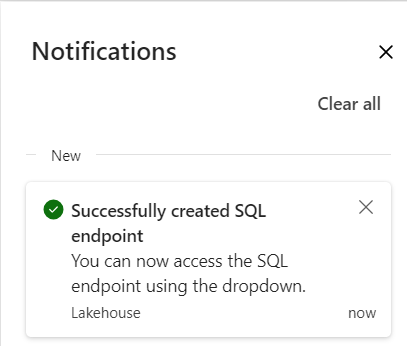
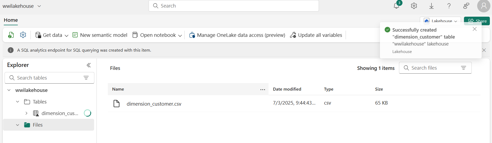
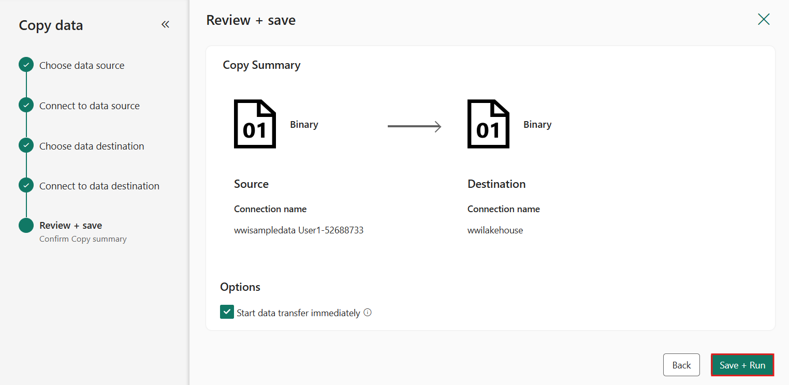
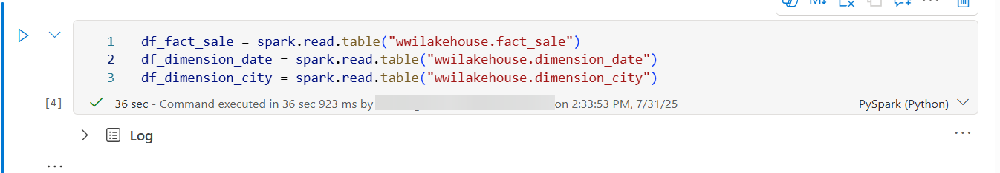
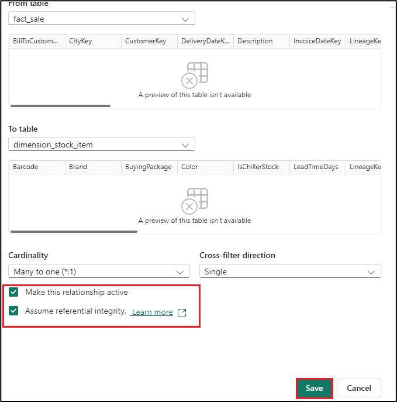
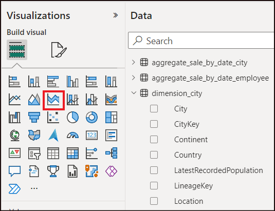
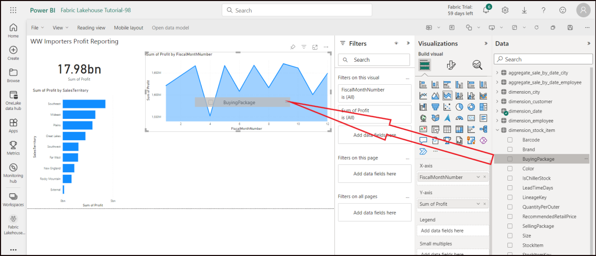
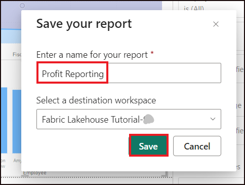

# 사용 사례 1: Lakehouse를 생성하고 샘플 데이터를 수집하고 보고서를 구축하기

**소개**

이 실습은 데이터 수집부터 데이터 소비까지 end-to-end 시나리오를
안내합니다. 이 프로그램은 다양한 경험과 통합, 그리고 이 플랫폼에서
일하면서 얻는 전문성 및 시민 개발자 경험을 포함한 Fabric애 대한 기본적인
이해를 쌓는 데 도움을 줍니다. 이 실습은 참조 아키텍처, 방대한 기능 목록,
또는 특정 모범 사례 권고를 목적으로 하지 않습니다.

전통적으로 조직들은 거래 및 구조화된 데이터 분석 요구를 위해 현대적인
데이터 웨어하우스를 구축해 왔습니다. 그리고 빅데이터 (반정형/비정형)
데이터 분석에 필요한 data lakehouse도 있습니다. 이 두 시스템은 방행하여
사일로, 데이토 중복, 총 소유 비용 증가를 초래했습니다.

Fabric은 데이터 저장소의 통합과 Delta Lake 형식의 표준화를 통해 사일로를
없애고, 데이터 이중성을 제거하며, 총 소유 비용을 크게 줄일 수 있습니다.

Fabric이 제공하는 유연성 덕분에 lakehouse 아키텍처나 데이터 웨어하우스
아키텍처 중 하나를 구현하거나, 두 아키텍처를 결합해 두 아키텍처의 장점을
간단하게 구현할 수 있습니다. 이 튜토리얼에서는 소매업체의 예를 들어
처음부터 끝까지 lakehouse를 지어보게 될 것입니다. [medallion
architecture](https://learn.microsoft.com/en-us/azure/databricks/lakehouse/medallion)를
사용하는데, 청동 층에는 원시 데이터가, 은층에는 검증 및 중복 제거
데이터가 있으며, 금색 층에는 고도로 정제된 데이터가 있습니다. 같은
접근법을 적용해 어떤 산업의 조직에도 lakehouse를 구현할 수 있습니다.

이 실습에서는 소매 도메인의 가상 Wide World Importers 회사의 개발자가
다음 단계를 어떻게 완료하는지 설명합니다.

**목표**:

1\. Power BI 계정으로 로그인하고 무료 Microsoft Fabric 체험판을 구현하기

2\. Power BI에 있는 Microsoft Fabric (미리보기) 체험판을 시작하기

3\. Microsoft 365 관리 센터용 OneDrive 가입을 설정하기

4\. 조직을 위한 end-to-end lakehouse를 구축하고 구현하며, Fabric 작업
공간과 lakehouse를 생성하는 것도 포함

5\. Lakehouse에 샘플 데이터를 수집하고 추가 처리를 준비하기

6\. Python/PySpark 및 SQL 노트북을 사용해 데이터를 변환하고 준비하기

7\. 다양한 방법으로 비즈니스 집계 테이블을 생성하기

8\. 완활한 보고를 위해 테이블 간 관계를 구축하기

9\. 준비된 데이터를 기반으로 시각화된 Power BI 보고서를 작성하기

10\. 작성된 보고서를 저장하여 향후 참고 및 분석을 위해 사용하기

## 연습 1: Lakehouse end-to-end 시나리오 설정하기

### 작업 1: Power BI 계정으로 로그인하고 무료 Microsoft Fabric 체험판을 구현하기

1.  브라우저를 열고 주소 바로 이동하고 다음
    [URL:+++https://app.fabric.microsoft.com/](URL:+++https://app.fabric.microsoft.com/)+++을
    입력하거나 붙여넣고 **Enter** 버튼을 누르세요.

> 

2.  **Microsoft Fabric** 창에서 자격 증명을 입력하고 **Submit** 버튼을
    클릭하세요.

> 

3.  **Microsoft** 창에서 비밀번호를 입력하고 **Sign in** 버튼을
    클릭하세요.

> 

4.  **Stay signed in?** 창에서 **Yes** 버튼을 클릭하세요.

> 

5.  Power BI 홈페이지로 안내됩니다.

> 

## 연습 2: 조직을 위한 end-to-end lakehouse를 구축 및 구현하기

### 작업 1: Fabric 작업 공간 생성하기

이 작업에서는 Fabric 작업 공간을 생성할 것입니다. 작업 공간에는 이
lakehouse 튜토리얼에 필요한 모든 항목이 포함되어 있으며, 여기에는
lakehouse, 데이터 흐름, Data Factory파이프라인, 노트북, Power BI
데이터셋, 보고서 등이 포함됩니다.

1.  Fabric 홈페이지에서 **+New workspace** 타일을 선택하세요.

> 

2.  오른쪽에 나타나는 **Create a workspace** 창에서 다음 정보를 입력하고
    **Apply** 버튼을 클릭하세요.

[TABLE]

> 

참고: 실습 즉시 ID를 찾으려면 'Help'을 선택하고 즉시 ID를 복사하세요.

> 
>
> 

3.  배포가 완료될 때까지 기다리세요. 완료하는 데 2-3분 정도 걸립니다.

> 

### 작업 2: Lakehouse를 생성하기

1.  탐색 바에서 **+New item** 버튼을 클릭하고 새 lakehouse를 생성하세요.

> 

2.  "**Lakehouse**" 타일을 클릭하세요.

> 

3.  **New lakehouse** 대화 상자에서 **Name** 필드에
    +++**wwilakehouse+++**를 입력하고 새 lakehouse를 열려면
    **Create** 버튼을 클릭하세요.

> **참고**: **wwilakehouse** 앞에 공간을 꼭 비워 주세요.
>
> 
>
> 

4.  **Successfully created SQL endpoint**라는 알림이 보일 것입니다.

> 

### 작업 3: 샘플 데이터를 수집하기

1.  **wwilakehouse** 페이지에서 **Get data in your lakehouse** 섹션으로
    이동하고 **Upload files as shown in the below image**를 클릭하세요.

> 

2.  Upload files 탭에서 Files에 있는 폴더를 클릭하세요

> 

3.  VM에서 **C:\LabFiles**로 이동하고 **dimension_customer.csv** 파일을
    선택하고 **Open** 버튼을 클릭하세요.

> 

4.  **Upload** 버튼을 클릭하고 닫으세요

> 

5.  Upload files 창을 **닫으세요**.

> 

6.  **Files**을 클릭해서 새로고침을 선택하세요. 파일이 나타납니다.

> 
>
> 

7.  **Lakehouse** 페이지의 Explorer 창에서 Files을 선택하세요. 이제
    마우스를 **dimension_customer.csv** 파일에 올려주세요. 가로
    ellipses **(…)** 옆의 **dimension_customer**.csv를 클릭하세요.
    **Load Table**을 탐색하고 클릭하고 **New table**을 선택하세요.

> 

8.  **Load file to new table** 대화 상자에서 **Load** 버튼을 클릭하세요.

> 

9.  새로운 **dimension_customer** 테이블이 성공적으로 생성되었습니다.

> 

10. **dbo** 스키마에서 **dimension_customer** 테이블을 선택하세요.

> 
>
> 

11. 또한 lakehouse의 SQL 엔드포인트를 사용해 SQL 문으로 데이터를 쿼리할
    수도 있습니다. 화면 오른쪽 상단의 **Lakehouse** 드롭다운 메뉴에서
    **SQL analytics endpoint**를 선택하세요.

> 

12. **wwilakehouse** 페이지에서 Explorer에서 **dimension_customer**
    테이블을 선택하여 데이터를 미리 보고, SQL 문장을 작성할 때 **New SQL
    query**를 선택하세요.

> 

13. 다음 샘플 쿼리는 dimension_customer **테이블**의 **BuyingGroup
    열**을 기반으로 행 수를 집계합니다. SQL 쿼리 파일은 자동으로
    저장되어 나중에 참고할 수 있으며, 필요에 따라 파일 이름을 바꾸거나
    삭제할 수 있습니다. 아래 이미지에 보이는 코드를 붙여넣고, 재생
    아이콘을 클릭하면 스크립트를 **Run**하세요:

> SELECT BuyingGroup, Count(\*) AS Total
>
> FROM dimension_customer
>
> GROUP BY BuyingGroup
>
> 

**참고**: 스크립트 실행 중 오류가 발생하면, 스크립트 문법에 불필요한
공백이 없어야 하는지 교차 검증하세요.

14. 이전에는 모든 lakehouse가 테이블과 뷰가 semantic model에 자동으로
    추가되었습니다. 최근 업데이트로 새로운 lakehouse의 경우 테이블을
    수동으로 semantic model에 추가해야 합니다.

> 

15. lakehouse **Home** 탭에서 **New semantic model**을 선택하고 semantic
    model에 추가하려는 테이블을 선택하세요.

> 

16. **New semantic model** 대화상자에서 +++wwilakehouse+++를 입략하고
    테이블의 목록에서 **dimension_customer** 테이블을 선택하고 새 모델을
    생성하려면 **Confirm**을 선택하세요.

> 

### 작업 4: 보고서를 구축하기

1.  왼쪽 탐색 창에서 **Fabric Lakehouse** **Tutorial-XX**를 클릭하세요.

> 

2.  **Fabric Lakehouse Tutorial-XX** 뷰에서 Type **Semantic model**의
    **wwilakehouse** 를 선택하세요.

> 

3.  Semantic model 창에서 모든 테이블을 볼 수 있습니다. 처음부터
    보고서를 만들거나, 페이지 생성 보고서를 작성하거나, Power BI가
    데이터를 기반으로 자동으로 보고서를 생성하도록 하는 옵션이 있습니다.
    이 튜토리얼에서는 **Explore this data** 항목에서 아래 이미지와 같이
    **Auto-create a report**를 선택하세요.

> 

4.  보고서가 준비되었으니, **View report now**를 클릭하여 열고
    검토하세요.

> 

5.  테이블이 차원이고 측정값이 없기 때문에, Power BI는 행 수를 위한
    측정값을 생성하고 이를 여러 열에 걸쳐 집계하며, 다음 이미지에 보이는
    다양한 차트를 생성합니다.

6.  상단 리본에서 **Save**을 선택하여 이 보고서를 나중에 저장하세요.

> 

7.  **Save your report** 대화 상자에서 보고서의 이름을
    +++dimension_customer-report+++로 입력하고 **Save**를
    선택하세요**.**

> 

8.  **Report saved**알림이 보일 것입니다 .

> 

# 연습 2: lakehouse에 데이터를 수집하기

이 연습에서는 Wide World Importers (WWI)에서 추가로 차원 및 사실 표를
호숫가로 입력할 것입니다.

### 작업 1: 데이터를 수집하기

1.  이제, 왼쪽 탐색 창에서 **Fabric Lakehouse** **Tutorial-XX**를
    클릭하세요.

> 

2.  작업 공간 이름을 다시 선택하세요.

3.  **Fabric Lakehouse Tutorial-XX** 작업 공간 페이지에서 **+New
    item** 버튼으로 이동하고 클릭하고 **Pipeline**을 선택하세요.

> 

4.  New pipeline 대화 상자에서 이름을
    **+++IngestDataFromSourceToLakehouse+++**로 정하고 **Create**를
    선택하세요. 새로운 data factory파이프라인이 생성되어 개방됩니다.

> 

5.  새로 생성된 data factory 파이프라인,
    즉, **IngestDataFromSourceToLakehouse**에서 **Copy data** 드롭다운을
    선택하고 **Add to canvas** 옵션을 선택하세요.

> 

6.  **copy data**가 선택되면 **Source** 탭으로 이동하세요.

7.  **Connection** 드롭다운에서 **Browse all** 옵션을 선택하세요.

8.  왼쪽 차에서 **Sample data**를 선택하고 **Retail Data Model from Wide
    World Importers**를 선택하세요.

9.  **Connect to data source** 창에서 **Wide World
    Importers** 데이터에서 **Retail Data Model**을 선택하여 미리보기를
    하고 **OK**를 선택하세요.

> 

10. 데이터 소스 연결이 샘플 데이터로 선택됩니다.

11. 이제 **destination** 탭으로 이동하세요.

12. Destination 탭에서 **connection** 드롭다운을 클릭하고 **Browse**
    **all** 옵션을 선택하세요.

13. Choose a destination 창의 왼쪽 창에서 **OneLake catalog**를 선택하고
    **wwilakehouse**를 선택하세요.

> 

14. 현재 목적지는 Lakehouse로 선택되었습니다. **Root Folder**를 as
    **Files**로 정한 후 파일 형식이 **Parquet**으로 선택되었는지
    확인하세요.

8.  Copy data를 실행하려면 **Run**을 클릭하세요.

> 

9.  **Save and run** 번튼을 클릭하면 해당 파이프라인이 저장 후
    실행됩니다.

> 

10. 데이터 복사 과정른 약 1-3분 정도 소요됩니다.

> 
>
> 
>
> 

11. Output 탭에서 데이터 이동의 세부 정보를 보려면 **Copy data1**을
    선택하세요. **Status**는 as **Succeeded**으로 표시되면
    **Close** 버튼을 클릭하세요.

> 
>
> 

12. 파이프라인이 성공적으로 실행된 후 lakehouse (**wwilakehouse**)로
    가서 탐색기를 열어 가져온 데이터를 확인하세요.

> 

13. 모든 **WideWorldImporters folders** 가 **Explorer **뷰에 존재하고
    모든 테이블의 데이터를 포함하고 있는지 확인하세요.

> 

# 연습 3: lakehouse에서 데이터를 준비 및 변환하기

### 작업 1: 데이터 변환 및 silver Delta table 테이블 로드하기

1.  **wwilakehouse** 페이지에서 명령어 바의 **Open
    notebook** 드롭다운으로 이동하고 클릭하고 **New notebook**을
    선택하세요.

> 

2.  **Lakehouse explorer**의 open notebook에서 노트북이 이미 열린
    lakehouse와 연결되어 있는 것을 볼 수 있을 것입니다.

> 

\[!참고\] **참고**: Fabric은 최적화된 delta lake 파일을 작성할 수 있는
[**V-order**](https://learn.microsoft.com/en-us/fabric/data-engineering/delta-optimization-and-v-order)
기능을 제공합니다. V-order는 최적화되지 않은 Delta Lake 파일보다
압축률을 3배에서 4배, 최대 10배까지 성능 가속을 개선하는 경우가
많습니다. Fabric의 Spark는 기본 128MB 크기의 파일을 생성하면서 파티션을
동적으로 최적화합니다. 대상 파일 크기는 구성 요구사항에 따라 변경할 수
있습니다. [**optimize
write**](https://learn.microsoft.com/en-us/fabric/data-engineering/delta-optimization-and-v-order#what-is-optimized-write) 기능을
통해 작성된 파일 수를 줄이고 개별 파일 크기를 늘리는 것을 목표로 하는
Apache Spark 엔진이 있습니다.

3.  Lakehouse의 **Tables** 섹션에서 delta lake 테이블로 데이터를 쓰기
    전에, 최적화된 데이터 쓰기와 읽기 성능 향상을 위해 두 가지 Fabric
    기능 (**V-order**와 **Optimize Write**)을 사용합니다. 세션에서
    이러한 기능을 활성화하려면 노트북의 첫 번째 셀에 이 구성을
    설정하세요.

4.  cell 내 코드를 다음 코드로 업데이트하고 셀 왼쪽에 나타나는 **▷**
    **Run cell** 버튼을 클릭하세요.

> \# Copyright (c) Microsoft Corporation.
>
> \# Licensed under the MIT License.
>
> spark.conf.set("spark.sql.parquet.vorder.enabled", "true")
>
> spark.conf.set("spark.microsoft.delta.optimizeWrite.enabled", "true")
>
> spark.conf.set("spark.microsoft.delta.optimizeWrite.binSize",
> "1073741824")

\[!note\]**Note**: When running a cell, you didn't have to specify the
underlying Spark

풀이나 클러스터 세부 정보는 Fabric이 Live Pool을 통해 제공하기
때문입니다. 모든 Fabric 작업 공간에는 라이브 풀이라는 기본 스파크 풀이
포함되어 있습니다. 즉, 노트북을 만들 때 Spark 설정이나 클러스터 세부
정보를 지정할 필요가 없습니다. 첫 번째 노트북 명령을 실행하면 라이브
풀이 몇 초 만에 가동됩니다. 그리고 Spark 세션이 구축되어 코드 실행을
시작합니다. Spark 세션이 활성화된 동안 이 노트북에서는 이후 코드 실행이
거의 즉각적으로 이루어집니다.

5.  다음으로, lakehouse의 **Files** 섹션에서 원시 데이터를 읽고 변환의
    일환으로 날짜별 칼럼을 추가하세요. PartitionBy Spark API를 사용해
    데이터를 파티션한 후 새로 생성된 데이터 파트 열 (연도와분기)을
    기반으로 delta table로 작성합니다.

6.  셀 출력 아래 **+ Code** 아이콘을 사용해 노트북에 새 코드 셀을
    추가하고 다음 코드를 입력하세요. ▷ **Run cell**버튼을 클릭하고
    출력을 검토하세요

**참고:** 출력이 보이지 않는다면, **Spark jobs**의 왼쪽 가로 선을
클릭하세요.

from pyspark.sql.functions import col, year, month, quarter

table_name = 'fact_sale'

df = spark.read.format("parquet").load('Files/fact_sale_1y_full')

df = df.withColumn('Year', year(col("InvoiceDateKey")))

df = df.withColumn('Quarter', quarter(col("InvoiceDateKey")))

df = df.withColumn('Month', month(col("InvoiceDateKey")))

df.write.mode("overwrite").format("delta").partitionBy("Year","Quarter").save("Tables/" +
table_name)

> 
>
> 
>
> 

7.  테이블이 로드된 후에는 나머지 치수 데이터를 로드할 수 있습니다. 다음
    셀은 각 테이블 이름에 대해 Lakehouse의 **Files** 섹션에서 매개변수로
    전달된 원시 데이터를 읽는 함수를 생성합니다. 다음으로, 차원 테이블
    목록을 생성합니다. 마지막으로, 테이블 목록을 반복하여 입력
    매개변수에서 읽는 각 테이블 이름마다 Delta table을 생성합니다.

8.  셀 출력 아래 **+ Code** 아이콘을 사용해 노트북에 새 코드 셀을
    추가하고 다음 코드를 입력하세요. **▷ Run Cell** 버튼을 클릭하고
    출력을 확인하세요.

> from pyspark.sql.types import \*
>
> def loadFullDataFromSource(table_name):
>
> df = spark.read.format("parquet").load('Files/' + table_name)
>
> df = df.drop("Photo")
>
> df.write.mode("overwrite").format("delta").save("Tables/" +
> table_name)
>
> full_tables = \[
>
> 'dimension_city',
>
> 'dimension_customer',
>
> 'dimension_date',
>
> 'dimension_employee',
>
> 'dimension_stock_item'
>
> \]
>
> for table in full_tables:
>
> loadFullDataFromSource(table)
>
> 
>
> 

6.  생성된 테이블을 검증하려면 **Explorer** 패널의 **Tables**을 클릭해
    새로 고침을 선택해 테이블이 목록에 나타나도록 하세요.

> 
>
> 

### 작업 2: 집계용 비즈니스 데이터를 변환하기

어떤 조직에는 Scala/Python 데이터 엔지니어가 있고, 다른 데이터
엔지니어들이 SQL(Spark SQL 또는 T-SQL)을 다루며 같은 데이터 복사본을
다룰 수 있습니다. 패브릭은 경험과 선호도가 다양한 이들이 함께 일하고
협업할 수 있게 해줍니다. 두 가지 다른 접근법은 비즈니스 집계를
변화시키고 창출합니다. 자신에게 맞는 방식을 선택하거나 성능을 희생하지
않고 선호에 따라 혼합할 수 있습니다:

- **접근 방식 \#1** - PySpark를 사용해 데이터를 결합하고 집계하여
  비즈니스 집계를 생성할 수 있습니다. 이 접근 방식은
  프로그래밍(Python이나 PySpark) 배경이 있는 사람에게는 더 선호됩니다.

- **접근 방식 \#2** - Spark SQL을 사용해 결합하고 데이터를 집계하여
  비즈니스 집계를 생성할 수 있습니다. 이 접근 방식은 SQL 배경이 있는
  사람이 Spark로 전환하는 데 더 적합합니다.

**접근 방식 \#1 (sale_by_date_city)**

PySpark를 사용해 데이터를 결합하고 집계하여 비즈니스 집계를 생성할 수
있습니다. 다음 코드를 사용해 세 개의 서로 다른 Spark 데이터프레임을
생성하며, 각각 기존 delta table을 참조합니다. 그 다음 데이터프레임을
이용해 이 테이블들을 연결하고, 그룹 베이스를 통해 집계를 생성하고, 몇몇
열의 이름을 바꾼 뒤, 마지막으로 lakehouse의 **Tables** 섹션에 delta
table로 작성 해 데이터를 유지합니다.

1.  셀 출력 아래 **+ Code** 아이콘을 사용해 노트북에 새 코드 셀을
    추가하고 다음 코드를 입력하세요. **▷ Run Cell** 버튼을 클릭하고
    출력을 확인하세요.

이 셀에서는 세 개의 서로 다른 Spark 데이터프레임을 생성하며, 각각 기존
delta table을 참조하세요.

> df_fact_sale = spark.read.table("wwilakehouse.fact_sale")
>
> df_dimension_date = spark.read.table("wwilakehouse.dimension_date")
>
> df_dimension_city = spark.read.table("wwilakehouse.dimension_city")

2.  셀 출력 아래 **+ Code** 아이콘을 사용해 노트북에 새 코드 셀을
    추가하고 다음 코드를 입력하세요. **▷ Run Cell** 버튼을 클릭하고
    출력을 확인하세요.

이 셀에서는 이전에 만든 데이터프레임을 사용해 이 테이블들을 연결하고,
그룹 바이 (group-by)를 통해 집계를 생성하고, 몇몇 열의 이름을 바꾼 뒤,
마지막으로 lakehouse의 **Tables** 섹션에 delta table로 작성합니다.

sale_by_date_city = df_fact_sale.alias("sale") \\

.join(df_dimension_date.alias("date"), df_fact_sale.InvoiceDateKey ==
df_dimension_date.Date, "inner") \\

.join(df_dimension_city.alias("city"), df_fact_sale.CityKey ==
df_dimension_city.CityKey, "inner") \\

.select("date.Date", "date.CalendarMonthLabel", "date.Day",
"date.ShortMonth", "date.CalendarYear", "city.City",
"city.StateProvince",

"city.SalesTerritory", "sale.TotalExcludingTax", "sale.TaxAmount",
"sale.TotalIncludingTax", "sale.Profit")\\

.groupBy("date.Date", "date.CalendarMonthLabel", "date.Day",
"date.ShortMonth", "date.CalendarYear", "city.City",
"city.StateProvince",

"city.SalesTerritory")\\

.sum("sale.TotalExcludingTax", "sale.TaxAmount",
"sale.TotalIncludingTax", "sale.Profit")\\

.withColumnRenamed("sum(TotalExcludingTax)", "SumOfTotalExcludingTax")\\

.withColumnRenamed("sum(TaxAmount)", "SumOfTaxAmount")\\

.withColumnRenamed("sum(TotalIncludingTax)", "SumOfTotalIncludingTax")\\

.withColumnRenamed("sum(Profit)", "SumOfProfit")\\

.orderBy("date.Date", "city.StateProvince", "city.City")

sale_by_date_city.write.mode("overwrite").format("delta").option("overwriteSchema",
"true").save("Tables/aggregate_sale_by_date_city")

**접근 방식 \#2 (sale_by_date_employee)**

Use Spark SQL to join and aggregate data for generating business
aggregates. With the following code, you create a temporary Spark view
by joining three tables, do group by to generate aggregation, and rename
a few of the columns. Finally, you read from the temporary Spark view
and finally write it as a delta table in the **Tables** section of the
lakehouse to persist with the data.

3.  셀 출력 아래 **+ Code** 아이콘을 사용해 노트북에 새 코드 셀을
    추가하고 다음 코드를 입력하세요. **▷ Run Cell** 버튼을 클릭하고
    출력을 확인하세요.

이 셀에서는 세 테이블을 연결해 임시 Spark 뷰를 생성하고, 그룹을 통해
집계를 생성하며, 몇몇 열의 이름을 바꾸세요.

%%sql

CREATE OR REPLACE TEMPORARY VIEW sale_by_date_employee

AS

SELECT

DD.Date, DD.CalendarMonthLabel

, DD.Day, DD.ShortMonth Month, CalendarYear Year

,DE.PreferredName, DE.Employee

,SUM(FS.TotalExcludingTax) SumOfTotalExcludingTax

,SUM(FS.TaxAmount) SumOfTaxAmount

,SUM(FS.TotalIncludingTax) SumOfTotalIncludingTax

,SUM(Profit) SumOfProfit

FROM wwilakehouse.fact_sale FS

INNER JOIN wwilakehouse.dimension_date DD ON FS.InvoiceDateKey = DD.Date

INNER JOIN wwilakehouse.dimension_Employee DE ON FS.SalespersonKey =
DE.EmployeeKey

GROUP BY DD.Date, DD.CalendarMonthLabel, DD.Day, DD.ShortMonth,
DD.CalendarYear, DE.PreferredName, DE.Employee

ORDER BY DD.Date ASC, DE.PreferredName ASC, DE.Employee ASC

 

8.  셀 출력 아래 **+ Code** 아이콘을 사용해 노트북에 새 코드 셀을
    추가하고 다음 코드를 입력하세요. **▷ Run Cell** 버튼을 클릭하고
    출력을 확인하세요.

이 셀에서는 이전 셀에서 생성된 임시 Spark 뷰를 읽고, 마지막으로
lakehouse의 **Tables** 섹션에 delta table로 작성합니다.

sale_by_date_employee = spark.sql("SELECT \* FROM
sale_by_date_employee")

sale_by_date_employee.write.mode("overwrite").format("delta").option("overwriteSchema",
"true").save("Tables/aggregate_sale_by_date_employee")

9.  생성된 테이블을 검증하려면 **Tables**을 클릭해 refresh를 선택해 집계
    테이블이 나타나도록 하세요.

두 가지 접근법 모두 유사한 결과를 낳습니다. 자신의 배경과 선호도에 따라
선택할 수 있어, 새로운 기술을 배우거나 성능 면에서 타협할 필요를
최소화할 수 있습니다.

또한 delta table 파일 형식으로 데이터를 쓰고 있다는 점을 확인할 수도
있습니다. Fabric의 자동 테이블 발견 및 등록 기능은 이들을 메타스토어에서
수집하고 등록합니다. SQL과 함께 사용할 테이블을 생성하기 위해 CREATE
TABLE 문명을 명시적으로 호출할 필요는 없습니다.

# 연습 4: Microsoft Fabric의 보고서를 구축하기

이 튜토리얼 섹션에서는 Power BI 데이터 모델을 만들고 처음부터 보고서를
작성합니다.

### 작업 1: SQL endpoint를 사용하여 실버 계층의 데이터를 탐색하기

Power BI는 전체 Fabric 경험에 네이티브로 통합되어 있습니다. 이 네이티브
통합은 DirectLake라는 독특한 모드를 제공하여 lakehouse에서 데이터를
접근하여 가장 성능이 뛰어난 쿼리 및 보고 경험을 제공합니다. DirectLake
모드는 Power BI에서 매우 방대한 데이터세트를 분석할 수 있는 혁신적인
새로운 엔진 기능입니다. 이 기술은 데이터 웨어하우스나 lakehouse
엔드포인트를 쿼리하지 않고, Power BI 데이터세트에 데이터를 가져오거나
중복하지 않고도 파켓 형식의 파일을 직접 불러올 수 있다는 아이디어에
기반합니다. DirectLake는 data lake에서 데이터를 바로 Power BI 엔진으로
불러와 분석할 수 있는 빠른 경로입니다.

전통적인 DirectQuery 모드에서는 Power BI 엔진이 각 쿼리를 실행하기 위해
소스에서 직접 데이터를 쿼리하며, 쿼리 성능은 데이터 검색 속도에 따라
달라집니다. DirectQuery는 데이터를 복사할 필요를 없애어, 소스 변경
사항이 임포트 시 쿼리 결과에 즉시 반영되도록 보장합니다. 반면, 가져오기
모드에서는 데이터가 메모리에서 쉽게 접근 가능하기 때문에 성능이 더
좋습니다. 하지만 Power BI 엔진은 데이터 새로고침 시 먼저 데이터를
메모리에 복사해야 합니다. 다음 데이터 갱신(예약 및 주문형 갱신
모두)에서는 기본 데이터 소스의 변경 사항만 반영됩니다.

DirectLake 모드는 이제 데이터 파일을 메모리에 직접 불러오기 위해 이러한
가져오기 요구사항을 제거합니다. 명시적인 가져오기 프로세스가 없기
때문에, 변경 사항이 발생하면 소스에서 즉시 포착할 수 있어 DirectQuery와
가져오기 모드의 장점을 결합하면서도 단점을 피할 수 있습니다. 따라서
DirectLake 모드는 매우 큰 데이터세트와 소스에서 자주 업데이트되는
데이터셋을 분석하는 데 이상적인 선택입니다.

1.  왼쪽 메뉴에서 workspace 아이콘을 선택하고 workspace 이름을
    선택하세요.

> 

2.  왼쪽 메뉴에서 **Fabric <Lakehouse-@lab.LabInstance.Id>**를
    선택하고 **wwilakehouse**라는 Semantic model을 선택하세요.

> 

3.  데이터 모델 디자이너를 열려면 상단 메뉴바에서  **Open semantic
    model**을 선택하세요.

> 

4.  오른쪽 상단에서 데이터 모델 디자이너가 **Editing**  모드에 있는지
    확인하세요. 이렇게 하면 드롭다운 텍스트가 Editing 으로 바뀔 거예요.

> 

5.  메뉴 리본에서 테이블 동기화 대화상자를 표시하려면 **Edit tables**을
    선택하세요.

> 

6.  **Edit semantic model** 대화 상자에서 **모든** 테이블을 **선택**하고
    대화 하단에서 **Confirm** 을 선택하여 semantic model을 동기화하세요.

> 
>
> 

7.  **fact_sale** 테이블에서 **CityKey** 필드를 드래그해서
    **dimension_city** 테이블의 **CityKey** 필드에 놓으면 관계를
    생성하세요. **Create Relationship** 대화 상자가 나타납니다.

> 참고: 테이블을 클릭하고 드래그 앤 드롭하여 dimension_city와 fact_sale
> 테이블을 나란히 배치할 수 있습니다. 관계를 생성하려는 두 테이블도
> 마찬가지입니다. 이는 테이블 간 열을 드래그 앤 드롭하는 작업을 더 쉽게
> 하기 위함입니다.

8.  **Create Relationship** 대화상자에서:

    - **Table 1**은 **fact_sale**와 **CityKey** 열로 채워져 있습니다.

    - **Table** **2**는 **dimension_city**와 **CityKey** 열로 채워져
      있습니다.

    - Cardinality: **Many to one (\*:1)**

    - Cross filter direction: **Single**

    - **Make this relationship active** 옆의 상자를 남겨두세요.

    - **Assume referential integrity** 옆의 상자를 선택하세요.

    - **Save**를 선택하세요.

> 

9.  다음으로, 위에서 보여준 것과 동일한 **Create Relationship**설정에
    다음 표와 열로 이 관계를 추가하세요 :

    - **StockItemKey(fact_sale)** - **StockItemKey(dimension_stock_item)**

> 
>
> 

- **Salespersonkey(fact_sale)** - **EmployeeKey(dimension_employee)**

> 

10. 아래 두 집합 간의 관계를 위와 같은 단계를 사용해 반드시 작성하세요.

    - **CustomerKey(fact_sale)** - **CustomerKey(dimension_customer)**

    - **InvoiceDateKey(fact_sale)** - **Date(dimension_date)**

11. 이 관계를 추가하면 아래 이미지와 같이 데이터 모델이 보고할 준비가
    되어 있어야 합니다.

> 

### 작업 2: 보고서를 구축하기

1.  상단 리본에서 **File** 을 선택하고 **Create new report** 를 선택하면
    Power BI에서 보고서/대시보드 생성을 시작하세요.

> 

2.  Power BI 보고서 캔버스에서는 **Data** 창에서 필요한 열을 캔 버스로
    드래그하고 하나 이상의 시각화를 사용하여 비즈니스 요구사항에 맞는
    보고서를 생성할 수 있습니다.

> 

**제목 추가하기:**

3.  Ribbon에서 **Text box**를 선택하세요. **WW Importers Profit
    Reporting**을 입력하세요.  **text**를 **Highlight**하고 **20**로
    크기를 증가하세요.

> 

4.  텍스트 박스 크기를 조정해서 보고서 **왼쪽** **상단**에 배치 한 뒤,
    텍스트박스 밖을 클릭하세요.

> 

**카드를 추가하기:**

- **Data** 창에서 **fact_sales** 확장하고 **Profit** 옆 박스를
  확인하세요. 이 선택은 열형 차트를 생성하고 필드를 Y축에 추가합니다.

> 

5.  막대 차트를 선택한 상태에서 시각화 창에서 **Card** 시각을
    선택하세요.

> 

6.  이 선택은 시각적 이미지를 카드로 변환합니다. 명함을 제목 아래에
    두세요.

> 

7.  빈 캔버스 어디든 클릭하거나 Esc 키를 눌러 방금 놓은 카드가 더 이상
    선택되지 않게 하세요.

**막대 차트 추가:**

8.  **Data** 창에서 **fact_sales**를 확장하고 **Profit** 옆의 상자를
    확인하세요. 이 선택은 열형 차트를 생성하고 필드를 Y축에 추가합니다. 

> 

9.  **Data** 창에서 **dimension_city**를 확장하고 **SalesTerritory**
    옆의 상자를 확인하세요. 이 선택은 필드를 Y축에 추가합니다. 

> 

10. 막대 차트를 선택한 상태에서 시각화 창에서 **Clustered bar
    chart**시각화를 선택 하세요. 이 선택은 열형 차트를 막대 차트로
    변환합니다.

> 

11. 막대 차트를 제목과 카드 아래 영역에 맞게 크기 조정하세요.

> 

12. 빈 캔버스 어디든 클릭하거나 Esc 키를 눌러 막대 차트가 더 이상
    선택되지 않게 하세요.

**쌓인 영역 차드 시각화 구축:**

13. **Visualizations** 창에서 **Stacked area chart** 시각화를
    선택하세요.

> 

14. 카드 오른쪽에 쌓인 영역 차트와 이전 단계에서 생성한 막대 차트 시각
    자료를 재배치하고 크기를 조정하세요.

> 

15. **Data** 창에서 **fact_sales**을 확장하고 **Profit** 옆의 상자를
    확인하세요. **dimension_date** 확장하고 **FiscalMonthNumber** 옆의
    상자를 확인하세요. 이 선택은 회계월별 이익을 보여주는 채워진 선
    차트를 생성합니다.

> 

16. **Data** 창에서 **dimension_stock_item**을 확장하고
    **BuyingPackage**를 Legend 필드 분야로 끌어들이세요. 이 선택은 각
    구매 패키지에 줄을 추가합니다.

>  

17. 빈 캔버스 어디든 클릭하거나 Esc 키를 눌러 쌓인 영역 차트가 더 이상
    선택되지 않게 하세요.

**열형 차트를 생성:**

18. **Visualizations** 창에서 **Stacked column chart** 시각화를
    선택하세요.

> 

19. **Data** 창에서 **fact_sales**를 확장하고 **Profit** 옆의 상자를
    확인하세요. 이 선택은 필드를 Y축에 추가합니다.

20.  **Data** 창에서 **dimension_employee**를 확장하고 **Employee** 옆의
    상자를 확인하세요. 이 선택은 필드를 X축에 추가합니다.

> 

21. 빈 캔버스 어디든 클릭하거나 Esc 키를 눌러 차트가 더 이상 선택되지
    않게 하세요.

22. 리본에서 **File** \> **Save**를 선택하세요.

> 

23. 보고서 이름을 **Profit Reporting**로 입력하세요. **Save**를
    선택하세요.

> 

24. 보고서가 저장되었다는 알림을 받게 됩니다.

> 

# 연습 5: 리소스 정리하기

개별 보고서, 파이프라인, warehouses 및 기타 항목을 삭제하거나 전체 작업
공간을 제거할 수 있습니다. 이 튜토리얼을 위해 생성한 작업 공간을
삭제하는 방법은 다음 단계를 사용하세요.

1.  왼쪽 탐색 메뉴에서 작업 공간 **Fabric Lakehouse Tutorial-XX**를
    선택하세요. 그러면 작업 공간 항목 뷰가 열립니다.

> 

2.  작업 공간 이름 아래에서 **...** 옵션을 선택하고 **Workspace
    settings**를 선택하세요.

> 

3.  **General** 및 **Remove this workspace**를 선택하세요.

> 

4.  경고가 뜨는 곳에서 **Delete**를 클릭하세요.

> 

5.  Workspace가 삭제되었다는 알림을 기다린 후 다음 실습으로 넘어가세요.

> 

**요약**: 이 실습은 데이터 관리와 보고를 위한 Microsoft Fabric과 Power
BI 내 필수 구성 요소를 설정하고 설정하는 데 집중합니다. 여기에는 체험판
활성화, OneDrive 설정, 작업 공간 생성, lakehouse 설정 등의 작업이
포함됩니다. 또한 샘플 데이터 수집, delta table 최적화, 효과적인 데이터
분석을 위한 Power BI에서 보고서 작성과 관련된 작업도 다룹니다. 목표는
데이터 관리 및 보고 목적으로 Microsoft Fabric과 Power BI를 활용하는 실무
경험을 제공하는 것을 목표로 합니다.
