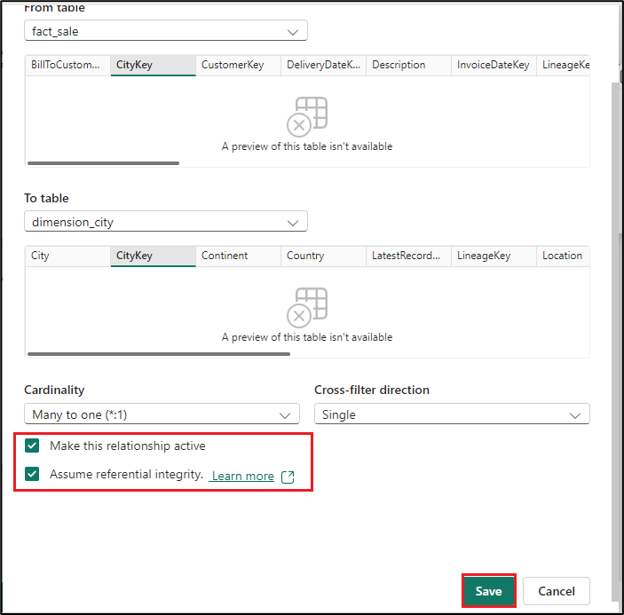
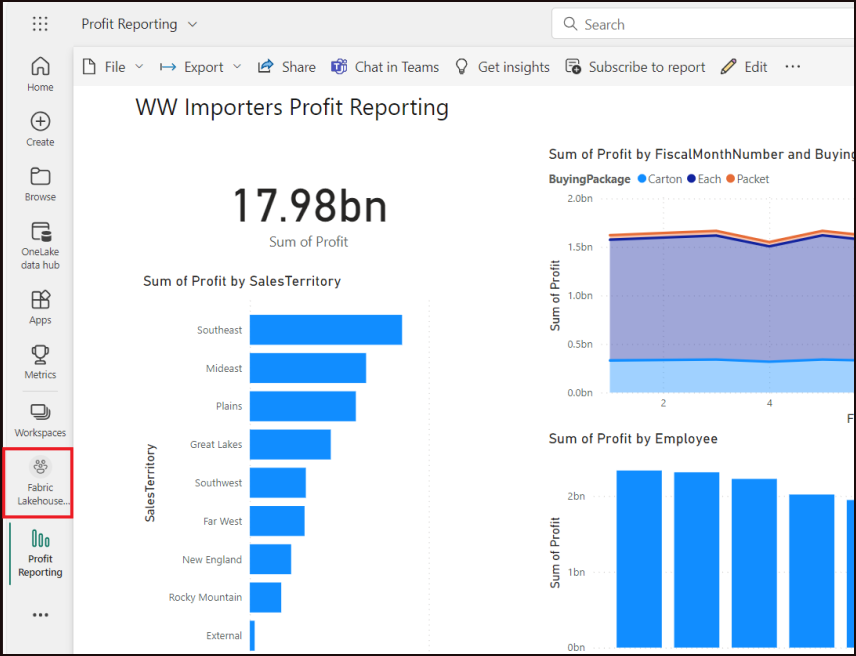
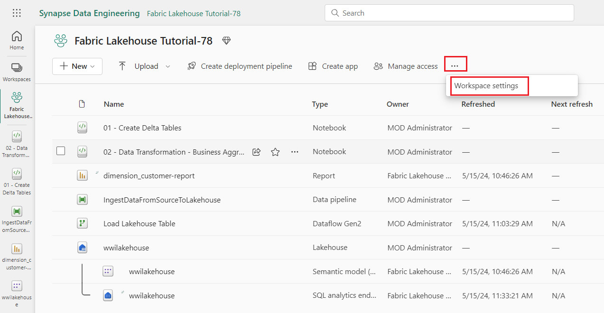

# 사용 사례 1: Lakehouse 생성하기, 샘플 데이터 수집 및 보고서 작성하기

**소개**

이 실습에서는 데이터 수집에서 데이터 사용에 이르는 end-to-end 시나리오를
안내합니다. 다양한 환경 및 통합 방법, 이 플랫폼에서 작업할 때 제공되는
전문 및 시민 개발자 경험을 포함하여 Fabric에 대한 기본적인 이해를
구축하는 데 도움이 됩니다. 이 실습은 참조 아키텍처, 전체 기능 목록 또는
특정 모범 사례에 대한 권장 사항이 아닙니다.

전통적으로 조직은 트랜잭션 및 구조화된 데이터 분석 요구 사항을 위해 최신
데이터 웨어하우스와 빅 데이터 (반/비정형) 데이터 분석 요구 사항을 위한
Data Lakehouse를 구축해 왔습니다. 이 두 시스템은 병렬로 실행되어 사일로,
데이터 중복성을 만들고 총 소유 비용을 증가시켰습니다.

Delta Lake 형식의 데이터 저장소 및 표준화 통합 기능을 갖춘 Fabric을
사용하면 사일로를 제거하고 데이터 중복성을 제거하며 총 소유 비용을 대폭
줄일 수 있습니다.

Fabric에서 제공하는 유연성을 통해 Lakehouse 또는 데이터 웨어하우스
아키텍처를 구현하거나 함께 결합하여 간단한 구현으로 두 가지 아키텍처를
모두 최대한 활용할 수 있습니다. 이 자습서에서는 소매 조직의 예를 들어
처음부터 끝까지 Lakehouse를 빌드합니다. 청 동 레이어에는 원시 데이터가
있고, 실버 레이어에는 검증 및 중복 제거된 데이터가 있으며, 골드
레이어에는 고도로 정제된 데이터가 있는 [메달리온
아키텍처를](https://learn.microsoft.com/en-us/azure/databricks/lakehouse/medallion)
사용합니다. 모든 산업의 모든 조직에 대해 Lakehouse를 구현하는 데 동일한
접근 방식을 취할 수 있습니다.

이 실습에서는 소매 도메인의 가상의 Wide World Importers 회사의 개발자가
다음 단계를 완료하는 방법을 설명합니다.

**목표**:

1.  Power BI 계정에 로그인하고 무료 Microsoft Fabric 평가판을
    시작하세요.

2.  Power BI 내에서 Microsoft Fabric(미리 보기) 평가판을 시작하세요.

4.  Fabric 작업 영역 및 Lakehouse 생성하기를 포함하여 조직에 대한
    end-to-end Lakehouse를 빌드하고 구현하세요.

5.  샘플 데이터를 Lakehouse로 수집하고 추가 처리를 위해 준비하세요.

6.  Python/PySpark 및 SQL Notebook을 사용하여 데이터를 변환하고
    준비하세요.

7.  다양한 접근 방식을 사용하여 비즈니스 집계 테이블을 생성하세요.

8.  원활한 보고를 위해 테이블 간의 관계를 설정하세요.

9.  준비된 데이터를 기반으로 시각화를 사용하여 Power BI 보고서를
    작성하세요.

10. 나중에 참조하고 분석할 수 있도록 생성된 보고서를 저장하고
    저장하세요.

## 연습 1: Lakehouse end-to-end 시나리오 설정하기

### 작업 1: Power BI 계정에 로그인하고 무료 Microsoft Fabric 평가판에 등록하기.

1.  브라우저를 열고 주소 표시줄로 이동한 후 URL:
    +++https://app.fabric.microsoft.com/+++를 입력하거나
    붙여넣고 **Enter** 버튼을 누르세요.

> 

2.  **Microsoft Fabric** 창에서 자격 증명을 입력하고 **Submit** 버튼을
    클릭하세요.

> 

3.  **Microsoft**에서 비밀번호를 입력하고 **Sign in** 버튼을 클릭하세요.

> 

4.  **Stay signed in?** 창에서 **Yes** 버튼을 클릭하세요.

> 

5.  Power BI 홈페이지로 이동하세요.

> 

## 연습2: 조직을 위한 end-to-end Lakehouse 구축 및 구현하기

### 작업 1: Fabric 작업 영역을 생성하기

이 작업에서는 Fabric 작업 영역을 생성합니다. 작업 영역에는 Lakehouse,
데이터 플로우, Data Factory 파이프라인, Notebook, Power BI 데이터 세트
및 보고서를 포함하여 이 Lakehouse 튜토리얼에 필요한 모든 항목이 포함되어
있습니다.

1.  Fabric 홈페이지에서 **+New workspace** 타일을 선택하세요.

> 

2.  오른쪽에 표시되는 **Create a workspace** 창에서 다음 세부 정보를
    입력하고 **Apply **버튼을 클릭하세요.

    |   |   |
    |---|---|
    | Username | +++@lab.CloudPortalCredential(User1).Username+++ |
    | Password | +++@lab.CloudPortalCredential(User1).Password+++ |

> 

참고: 실습 인스턴트 ID를 찾으려면 ' Help'을 선택하고 인스턴트 ID를
복사합니다.

> 
>
> 

3.  배포가 완료될 때까지 기다리세요. 완료하는 데 2-3분이 소요됩니다.

    > 

### 작업 2: lakehouse를 생성하기

1.  새 lakehouse를 생성하려면 탐색바에서 **+New item** 버튼을
    클릭하세요.

    > 

2.  "**Lakehouse**" 타일을 클릭하세요.

> 

3.  **New lakehouse** 대화 상자에서 **Name** 필드에
    +++**wwilakehouse+++** 를 입력하고 **Create** 버튼을 클릭하고 새
    lakehouse를 여세요.

> **참고**: **wwilakehouse** 전에 공간을 제거해야 합니다.
>
> 
>
 > 

4.  **Successfully created SQL endpoint**라는 알림이 표시됩니다.

> 

### 작업 3: 샘플 데이터를 수집하기

1.  **wwilakehouse** 페이지에서 **Get data in your lakehouse** 섹션으로
    이동하고 **Upload files as shown in the below image**를
    클릭하세요**.**

    > 

2.  Upload files 탭에서 Files에서 폴더를 클릭하세요

> 

3.  VM에 **C:\LabFiles** 로 이동하고 ***dimension_customer.csv*** 파일을
    선택하고 **Open** 버튼을 클릭하세요.

 > 

4.  **Upload** 버튼을 클릭하고 닫으세요

> 

5.  클릭하고 **Files**애서 새로고침을 선택하세요. 파일이 나타납니다.

    > 

    > 

6.  **Lakehouse** 페이지에서 Under the Explorer 창에서 Files을
    선택하세요. 이제 마우스를 가져가서 **dimension_customer.csv** 파일을
    선택하세요. **dimension_customer**.csv 옆에 있는 가로 타원 **(…)**를
    클릭하세요. **Load Table**로 이동하고 클릭하여 **New table**을
    선택하세요.

 > 

7.  **Load file to new table** 대화 상자에서 **Load** 버튼을 클릭하세요.

> 
>
> 

8.  **dimension_coustomer** 테이블을 선택하세요

    > 

    > 

9.  Lakehouse의 SQL 엔드포인트를 사용하여 SQL 문으로 데이터를 쿼리할
    수도 있습니다. 화면 오른쪽 위에 있는 **Lakehouse** 드롭다운 메뉴에서
    **SQL analytics endpoint**를 선택하세요.

> 

10. wwilakehouse 페이지의 탐색기에서 **dimension_customer** 테이블을
    선택하여 데이터를 미리 보고 **New SQL query**를 선택하여 SQL 문을
    작성하세요.

> 

11. 다음 샘플 쿼리는 **dimension_customer** 테이블의 **BuyingGroup
    열**을 기반으로 행 수를 집계합니다. SQL 쿼리 파일은 나중에 참조할 수
    있도록 자동으로 저장되며 필요에 따라 이러한 파일의 이름을 바꾸거나
    삭제할 수 있습니다. 아래 이미지와 같이 코드를 붙여넣은 후 재생
    아이콘을 클릭하여 스크립트를 **실행하세요.**

    ```
    SELECT BuyingGroup, Count(*) AS Total
    FROM dimension_customer
    GROUP BY BuyingGroup
    ```
    > 

**참고**: 스크립트 실행 중에 오류가 발생하면 스크립트 구문을 위 이미지와
교차 확인합니다.

> 

12. 이전에는 모든 Lakehouse 테이블과 뷰가 의미 체계 모델에 자동으로
    추가되었습니다. 최근 업데이트를 통해 새 Lakehouse의 경우 의미 체계
    모델에 테이블을 수동으로 추가해야 합니다.

> 

13. Lakehouse **Home** 탭에서 **New semantic model**을
    선택하고 semantic model에 추가할 테이블을 선택하세요.

  

14.New semantic model 대화 상자에서 **+++wwilakehouse+++**를 입력하고, tables 목록에서 **dimension_customer tables**을 선택한 다음 Confirm을 선택하여 새 모델을 생성하세요.

 

### 작업 4: 보고서 구축하기

1.  왼쪽 탐색 페이지에서 **Fabric Lakehouse** **Tutorial-XX**를
    클릭하세요.

   

2.  **Fabric Lakehouse Tutorial-XX** 보기에서 Type이 **Semantic model인 wwilakehouse**를 선택하세요.

       > 
4.  **Semantic model** 창에서 모든 tables를 볼 수 있습니다.
 보고서를 새로 만들거나, 페이지 나누기 보고서를 생성하거나, 또는 **Power BI**가 데이터를 기반으로 자동으로 보고서를 생성하도록 선택할 수 있습니다.
 이 실습에서는 **Explore this data** 아래에서 **Auto-create a report**를 선택하세요. 아래 이미지와 같이 진행합니다.

 
> 

5.  위쪽 리본에서 **Save**를 선택하여 나중에 이 보고서를 저장하세요.

    > 


6. **Save your report** 대화 상자에서 보고서 이름을
    +++dimension_customer-report+++로 입력하고 **Save**를
    선택하세요**.**

 > 

11. **Report saved**라는 알림이 표시됩니다.

> 

# 연습 2: lakehouse에 데이터 수집하기

이 연습에서는Wide World Importers (WWI)에서 Lakehouse로 추가 차원 및
팩트 테이블을 수집합니다.

### 작업 1: 데이터를 수집하기

1.  왼쪽 탐색창에서 **Fabric Lakehouse** **Tutorial-XX**를 클릭하세요.

    > 

2.  **Fabric Lakehouse Tutorial-XX** 작업 영역 페이지에서 **+New
    item** 버튼으로 이동하고 클릭하여 **Data pipeline**를 선택하세요.

    > 

3.  New pipeline 대화 상자에서 이름을
    **+++IngestDataFromSourceToLakehouse+++**로 지정하고 **Create**를
    선택하세요. 새 Data Factory 파이프라인이 만들어지고 열립니다.

> 

   > 

4.  Newly created data factory pipeline
    즉 **IngestDataFromSourceToLakehouse**에서 **Copy data assistant**를
    선택하세요.

> 

5.  다음으로, 샘플 **World** **Wide Importers** 데이터를 Lakehouse로
    가져오도록 **Sample data** 연결을 설정하세요. **New sources**의
    목록에서 **Retail Data Model from Wide World Importers**를
    선택하세요.

> 

6.  **Connect to data source** 창에서 **Retail Data Model from Wide
    World Importers** 데이터를 선택하고 **Next**를 선택하세요.

> 

7.  **Connect to data destination** 창에서 **OneLake catalog**
    및 **wwilakehouse**를 선택하세요. **Root folder**를 as **Files**로
    지정하고 **Next**를 클릭하세요. 이렇게 하면 Lakehouse의
    **Files**섹션에 데이터가 기록됩니다.

> 
>
> 

8.  대상에 대해 **File format**을 비워야 합니다. **Next**를
    클릭하고 **Save+Run**을 클릭하세요. 주기적으로 데이터를 새로
    고치도록 파이프라인을 예약할 수 있습니다. 이 튜토리얼에서는
    파이프라인을 한 번만 실행합니다.

> 
>
> 

9.  데이터 복사 프로세스를 완료하는 데 약 1-3분이 걸립니다.

    > 

    > 

10. Output 탭에서 **Copy_a1n**을 선택하고 데이터 전송의 세부 정보를
    살펴보세요. **Status**를 **Succeeded**로 표시되면 **Close** 버튼을
    클릭하세요.

 >    

> 

11. 파이프라인이 성공적으로 실행되면 Lakehouse(**wwilakehouse**)로
    이동하여 탐색기를 열어 가져온 데이터를 확인하세요.

>  

12. 모든 **WideWorldImporters 폴더**가 Explorer 보기에 있고 모든
    테이블에 대한 데이터가 포함되어 있는지 확인하세요.

> 

# 연습 3: lakehouse에서 데이터를 준비하고 변형하기

### 작업 1: 데이터 변환 및 실버 Delta table로 로드하기

1.  **wwilakehouse** 페이지에서 **Open notebook**로 이동하고 클릭하여
    명령바에 드롭하고 **New notebook**을 선택하세요.

 > 

2.  **Lakehouse explorer**의 open notebook에서, Notebook이 이미 열려
    있는 Lakehouse에 연결되어 있는 것을 볼 수 있습니다.

    > 

\*\* 참고\*\*

Fabric[은 최적화된 델타 레이크 파일을 작성하는
**V-order**](https://learn.microsoft.com/en-us/fabric/data-engineering/delta-optimization-and-v-order)
기능을 제공합니다. V-order는 최적화되지 않은 Delta Lake 파일에 비해
압축을 3-4배, 최대 10배까지 성능 가속화를 개선하는 경우가 많습니다.
Fabric의 Spark는 기본 128MB 크기의 파일을 생성하는 동안 파티션을
동적으로 최적화합니다. 대상 파일 크기는 구성을 사용하여 워크로드 요구
사항에 따라 변경될 수 있습니다. [**optimize write** 기능을
통해](https://learn.microsoft.com/en-us/fabric/data-engineering/delta-optimization-and-v-order#what-is-optimized-write)
Apache Spark 엔진은 기록된 파일 수를 줄이고 기록된 데이터의 개별 파일
크기를 늘리는 것을 목표로 합니다.

3.  Lakehouse의 **Tables** 섹션에서 데이터를 델타 레이크 테이블로 쓰기
    전에 데이터 쓰기를 최적화하고 읽기 성능을 향상시키기 위해 두 가지
    Fabric 기능(**V-order** 및 **Optimize Write**)을 사용합니다.
    세션에서 이러한 기능을 사용하려면 노트북의 첫 번째 셀에서 이러한
    구성을 설정하세요.

4.  다음 코드가 있는 **cell**의 코드를 클릭하고 마우스를 가져갈 때 셀
    왼쪽에 나타나는 **▷ Run cell**을 클릭하세요.

    ```
    # Copyright (c) Microsoft Corporation.
    # Licensed under the MIT License.
    spark.conf.set("spark.sql.parquet.vorder.enabled", "true")
    spark.conf.set("spark.microsoft.delta.optimizeWrite.enabled", "true")
    spark.conf.set("spark.microsoft.delta.optimizeWrite.binSize", "1073741824")
    ```
    > 

> 셀을 실행할 때 Fabric이 Live Pool을 통해 제공하므로 기본 Spark 풀 또는
> 클러스터 세부 정보를 지정할 필요가 없습니다. 모든 Fabric 작업 영역에는
> 라이브 풀이라는 기본 Spark 풀이 함께 제공됩니다. 즉, Notebook을 만들
> 때 Spark 구성 또는 클러스터 세부 정보를 지정하는 것에 대해 걱정할
> 필요가 없습니다. 첫 번째 Notebook 명령을 실행하면 라이브 풀이 몇 초
> 안에 실행됩니다. 그리고 Spark 세션이 설정되고 코드 실행이 시작됩니다.
> 후속 코드 실행은 Spark 세션이 활성 상태인 동안 이 Notebook에서 거의
> 즉각적으로 수행됩니다.

   > 

5.  다음으로, Lakehouse의 **Files** 섹션에서 원시 데이터를 읽고 변환의
    일부로 다른 날짜 부분에 대한 열을 더 추가하세요. partitionBy Spark
    API를 사용하여 새로 만든 데이터 파트 열(연도 및 분기)을 기반으로
    델타 테이블로 쓰기 전에 데이터를 분할합니다.

6.  셀 출력 아래에 있는 + **Code** 아이콘을 사용하여 Notebook에 새 코드
    셀을 추가하고 다음 코드를 입력하세요. **▷ Run cell **버튼을 클릭하고
    출력을 검토하세요.

**참고**: 출력을 볼 수 없는 경우 **Spark jobs**의 왼쪽에 있는 수평선을
클릭합니다 .

    ```
    from pyspark.sql.functions import col, year, month, quarter
    
    table_name = 'fact_sale'
    
    df = spark.read.format("parquet").load('Files/fact_sale_1y_full')
    df = df.withColumn('Year', year(col("InvoiceDateKey")))
    df = df.withColumn('Quarter', quarter(col("InvoiceDateKey")))
    df = df.withColumn('Month', month(col("InvoiceDateKey")))
    
    df.write.mode("overwrite").format("delta").partitionBy("Year","Quarter").save("Tables/" + table_name)
    ```

>  
>
> 

7.  팩트 테이블이 로드된 후 나머지 차원에 대한 데이터 로드로 이동할 수
    있습니다. 다음 셀은 매개 변수로 전달된 각 테이블 이름에 대해
    Lakehouse의 **Files** 섹션에서 원시 데이터를 읽는 함수를 생성합니다.
    다음으로 차원 테이블 목록을 생성합니다. 마지막으로 테이블 목록을
    반복하고 입력 매개 변수에서 읽은 각 테이블 이름에 대한 델타 테이블을
    생성합니다.

8.  셀 출력 아래에 있는 + **Code** 아이콘을 사용하여 Notebook에 새 코드
    셀을 추가하고 다음 코드를 입력하세요. **▷ Run cell **버튼을 클릭하고
    pyspark.sql.types 가져오기의 출력을 검토하세요. \*
  ```
    from pyspark.sql.types import *
    
    def loadFullDataFromSource(table_name):
        df = spark.read.format("parquet").load('Files/' + table_name)
        df = df.drop("Photo")
        df.write.mode("overwrite").format("delta").save("Tables/" + table_name)
    
    full_tables = [
        'dimension_city',
        'dimension_customer',
        'dimension_date',
        'dimension_employee',
        'dimension_stock_item'
    ]
    
    for table in full_tables:
        loadFullDataFromSource(table)
   ```
> 
>
> 

9.  생성된 테이블의 유효성을 검사하려면 **Tables**에서 새로 고침을
    클릭하고 선택하세요. 테이블이 나타납니다. 

> 
>
>  

### 작업 2: 집계를 위한 비즈니스 데이터 변환

    조직에는 Scala/Python으로 작업하는 데이터 엔지니어와 SQL (Spark SQL
    또는 T-SQL)으로 작업하는 다른 데이터 엔지니어가 있을 수 있으며, 모두
    동일한 데이터 복사본에서 작업할 수 있습니다. Fabric은 다양한 경험과
    선호도를 가진 다양한 그룹이 일하고 협업할 수 있도록 합니다. 두 가지
    다른 접근 방식은 비즈니스 집계를 변환하고 생성합니다. 자신에게
    적합한 것을 선택하거나 성능 저하 없이 선호도에 따라 이러한 접근
    방식을 혼합하여 일치시킬 수 있습니다:

    - **접근 \#1** - PySpark를 사용하여 비즈니스 집계를 생성하기 위한
      데이터를 조인하고 집계합니다. 이 접근 방식은 프로그래밍 (Python
      또는 PySpark) 배경 지식이 있는 사람에게 선호됩니다.

    - **접근 \#2** - Spark SQL을 사용하여 비즈니스 집계를 생성하기 위한
      데이터를 조인하고 집계합니다. 이 접근 방식은 SQL 배경이 있는
      사람이 Spark로 전환하는 데 적합합니다.

   **접근 \#1 (sale_by_date_city)** - PySpark를 사용하여 비즈니스
    집계를 생성하기 위한 데이터를 조인하고 집계합니다. 다음 코드를
    사용하여 각각 기존 델타 테이블을 참조하는 세 개의 서로 다른 Spark
    데이터 프레임을 생성합니다. 그런 다음, 데이터 프레임을 사용하여
    이러한 테이블을 조인하고, 그룹화 기준을 수행하여 집계를 생성하고, 몇
    개의 열의 이름을 바꾸고, 마지막으로 Lakehouse의 **Tables** 섹션에
    델타 테이블로 작성하여 데이터를 유지합니다.

1.  셀 출력 아래에 있는 + **Code** 아이콘을 사용하여 Notebook에 새 코드
    셀을 추가하고 다음 코드를 입력하세요. **▷ Run cell **버튼을 클릭하고
    출력을 검토하세요.

2.  이 셀에서는 각각 기존 델타 테이블을 참조하는 세 개의 서로 다른 Spark
    데이터 프레임을 생성합니다.

    ```
    df_fact_sale = spark.read.table("wwilakehouse.fact_sale") 
    df_dimension_date = spark.read.table("wwilakehouse.dimension_date")
    df_dimension_city = spark.read.table("wwilakehouse.dimension_city")
    ```
> 
>
> 

5.  셀 출력 아래에 있는 **+ Code** 아이콘을 사용하여 Notebook에 새 코드
    셀을 추가하고 다음 코드를 입력하세요. **▷ Run cell** 버튼을 클릭하고
    출력을 검토하세요.

6.  이 셀에서는 이전에 만든 데이터 프레임을 사용하여 이러한 테이블을
    조인하고, 그룹화 기준을 수행하여 집계를 생성하고, 몇 개의 열의
    이름을 바꾸고, 마지막으로 Lakehouse의 **Tables** 섹션에 델타
    테이블로 씁니다.

    ```
    sale_by_date_city = df_fact_sale.alias("sale") \
    .join(df_dimension_date.alias("date"), df_fact_sale.InvoiceDateKey == df_dimension_date.Date, "inner") \
    .join(df_dimension_city.alias("city"), df_fact_sale.CityKey == df_dimension_city.CityKey, "inner") \
    .select("date.Date", "date.CalendarMonthLabel", "date.Day", "date.ShortMonth", "date.CalendarYear", "city.City", "city.StateProvince", 
     "city.SalesTerritory", "sale.TotalExcludingTax", "sale.TaxAmount", "sale.TotalIncludingTax", "sale.Profit")\
    .groupBy("date.Date", "date.CalendarMonthLabel", "date.Day", "date.ShortMonth", "date.CalendarYear", "city.City", "city.StateProvince", 
     "city.SalesTerritory")\
    .sum("sale.TotalExcludingTax", "sale.TaxAmount", "sale.TotalIncludingTax", "sale.Profit")\
    .withColumnRenamed("sum(TotalExcludingTax)", "SumOfTotalExcludingTax")\
    .withColumnRenamed("sum(TaxAmount)", "SumOfTaxAmount")\
    .withColumnRenamed("sum(TotalIncludingTax)", "SumOfTotalIncludingTax")\
    .withColumnRenamed("sum(Profit)", "SumOfProfit")\
    .orderBy("date.Date", "city.StateProvince", "city.City")
    
    sale_by_date_city.write.mode("overwrite").format("delta").option("overwriteSchema", "true").save("Tables/aggregate_sale_by_date_city")
    ```
 
> 
>
> 

7.  **접근 \#2 (sale_by_date_employee)** - Spark SQL을 사용하여 비즈니스
    집계를 생성하기 위한 데이터를 조인하고 집계합니다. 다음 코드를
    사용하여 세 개의 테이블을 조인하여 임시 Spark 뷰를 만들고, group
    by를 수행하여 집계를 생성하고, 몇 개의 열의 이름을 바꿉니다.
    마지막으로 임시 Spark 뷰에서 읽고 마지막으로 Lakehouse의
    **Tables** 섹션에 델타 테이블로 작성하여 데이터를 유지합니다.

8.  셀 출력 아래에 있는 + Code 아이콘을 사용하여 Notebook에 새 코드 셀을
    추가하고 다음 코드를 입력하세요. ▷ Run cell 버튼을 클릭하고 출력을
    검토하세요.

9.  이 셀에서는 세 개의 테이블을 조인하여 임시 Spark 뷰를 생성하고,
    그룹화 기준을 수행하여 집계를 생성하고, 몇 개의 열의 이름을
    바꿉니다.

    ```
    %%sql
    CREATE OR REPLACE TEMPORARY VIEW sale_by_date_employee
    AS
    SELECT
           DD.Date, DD.CalendarMonthLabel
     , DD.Day, DD.ShortMonth Month, CalendarYear Year
          ,DE.PreferredName, DE.Employee
          ,SUM(FS.TotalExcludingTax) SumOfTotalExcludingTax
          ,SUM(FS.TaxAmount) SumOfTaxAmount
          ,SUM(FS.TotalIncludingTax) SumOfTotalIncludingTax
          ,SUM(Profit) SumOfProfit 
    FROM wwilakehouse.fact_sale FS
    INNER JOIN wwilakehouse.dimension_date DD ON FS.InvoiceDateKey = DD.Date
    INNER JOIN wwilakehouse.dimension_Employee DE ON FS.SalespersonKey = DE.EmployeeKey
    GROUP BY DD.Date, DD.CalendarMonthLabel, DD.Day, DD.ShortMonth, DD.CalendarYear, DE.PreferredName, DE.Employee
    ORDER BY DD.Date ASC, DE.PreferredName ASC, DE.Employee ASC
    ```

> 
>
> 

10. 셀 출력 아래에 있는 + Code 아이콘을 사용하여 Notebook에 새 코드 셀을
    추가하고 다음 코드를 입력하세요. ▷ Run cell 버튼을 클릭하고 출력을
    검토하세요.

11. 이 셀에서는 이전 셀에서 생성한 임시 Spark 보기에서 읽고 마지막으로
    Lakehouse의 **Tables** 섹션에 델타 테이블로 씁니다.

    ```
    sale_by_date_employee = spark.sql("SELECT * FROM sale_by_date_employee")
    sale_by_date_employee.write.mode("overwrite").format("delta").option("overwriteSchema", "true").save("Tables/aggregate_sale_by_date_employee")
    ```
> 
>
> 

12. 생성된 테이블의 유효성을 검사하려면 **Tables**에서 새로 고침을
    클릭하고 선택하세요. 집계 테이블이 나타납니다.

> 
>
> 

두 접근 방식 모두 비슷한 결과를 낳습니다. 배경과 선호도에 따라 선택하여
새로운 기술을 배우거나 성능을 타협할 필요성을 최소화할 수 있습니다.

또한 데이터를 델타 레이크 파일로 쓰고 있음을 알 수 있습니다. Fabric의
자동 테이블 검색 및 등록 기능은 메타스토어를 선택하여 등록합니다. SQL과
함께 사용할 테이블을 만들기 위해 CREATE TABLE 문을 명시적으로 호출할
필요가 없습니다.

# 연습 5: Microsoft Fabric에서 보고서 작성

자습서의 이 섹션에서는 Power BI 데이터 모델을 만들고 처음부터 보고서를
생성합니다.

### 작업 1: SQL 엔드포인트를 사용하여 실버 계층의 데이터 탐색

Power BI는 기본적으로 전체 Fabric 환경에 통합됩니다. 이 네이티브 통합은
Lakehouse에서 데이터에 액세스하여 가장 성능이 뛰어난 쿼리 및 보고 환경을
제공하는 DirectLake라는 고유한 모드를 제공합니다. DirectLake 모드는
Power BI에서 매우 큰 데이터 세트를 분석하는 획기적인 새 엔진 기능입니다.
이 기술은 데이터 웨어하우스 또는 Lakehouse 엔드포인트를 쿼리할 필요 없이
Power BI 데이터 세트로 데이터를 가져오거나 복제할 필요 없이 데이터
레이크에서 직접 쪽모이 세공 마루 형식의 파일을 로드하는 아이디어를
기반으로 합니다. DirectLake는 데이터 레이크의 데이터를 Power BI 엔진으로
바로 로드하여 분석할 준비가 된 빠른 경로입니다.

기존 DirectQuery 모드에서 Power BI 엔진은 원본에서 데이터를 직접
쿼리하여 각 쿼리를 실행하며 쿼리 성능은 데이터 검색 속도에 따라
달라집니다. DirectQuery를 사용하면 데이터를 복사할 필요가 없으므로
원본의 변경 내용이 가져오는 동안 쿼리 결과에 즉시 반영됩니다. 반면에
가져오기 모드에서는 각 쿼리 실행에 대해 원본에서 데이터를 쿼리하지
않고도 메모리에서 데이터를 쉽게 사용할 수 있기 때문에 성능이 더
좋습니다. 그러나 Power BI 엔진은 먼저 데이터를 새로 고치는 동안 데이터를
메모리에 복사해야 합니다. 기본 데이터 원본에 대한 변경 내용만 다음
데이터 새로 고침 중(예약된 새로 고침 및 주문형 새로 고침) 선택됩니다.

DirectLake 모드는 이제 데이터 파일을 메모리에 직접 로드하여 이러한
가져오기 요구 사항을 제거합니다. 명시적인 가져오기 프로세스가 없기
때문에 원본에서 변경 내용이 발생할 때 선택할 수 있으므로 DirectQuery와
가져오기 모드의 장점을 결합하면서 단점을 피할 수 있습니다. 따라서
DirectLake 모드는 소스에서 자주 업데이트되는 매우 큰 데이터 세트 및
데이터 세트를 분석하는 데 이상적인 선택입니다.

1.	왼쪽 메뉴에서  **Fabric Lakehouse-@lab.LabInstance.Id** 를 선택한 다음, **wwilakehouse**라는 이름의 **Semantic model**을 선택하세요.

    

2.	상단 메뉴 모음에서 **Open semantic model**을 선택하여 데이터 모델 디자이너를 여세요..

  

3.	오른쪽 상단에서 데이터 모델 디자이너가 Editing 모드인지 확인하세요.
 이때 드롭다운 텍스트가 **Editing**으로 변경되어야 합니다.
   

4.	메뉴 리본에서 Edit tables를 선택하면 Table 동기화 대화 상자가 표시됩니다.
     
5.	**Edit semantic model** 대화 상자에서 모든 **tables**를 선택한 후, 대화 상자 하단에 있는 Confirm을 선택하여 Semantic model을 동기화하세요.
      
6.  **fact_sale** 테이블에서 **CityKey** 필드를 끌어서
    **dimension_city** 테이블의 **CityKey** 필드에 놓아 관계를
    생성합니다. **Create Relationship**대화 상자가 나타납니다.

> 참고: 테이블을 클릭하고 드래그 앤 드롭하여 dimension_city 테이블과
> fact_sale 테이블을 나란히 배치하여 테이블을 재정렬합니다. 관계를
> 생성하려고하는 두 테이블에 대해서도 마찬가지입니다. 이것은 테이블
> 사이의 열을 끌어다 놓는 것을 더 쉽게 생성하기 위한
> 것입니다.

> 

4.  **Create Relationship** 대화 상자에서:

    - **Table 1**은 **fact_sale** 및 **CityKey** 열로 채워집니다.

    - **Table 2**는 **dimension_city** 및 **CityKey** 열로 채워집니다.

    - Cardinality: **Many to one (\*:1)**

    - Cross filter direction: **Single**

    - **Make this relationship active** 옆의 상자를 선택한 상태로
      두세요.

    - **Assume referential integrity** 옆에 있는 상자를 선택하세요.

    - **Save**를 선택하세요.

> 

5.  다음으로, 위에 표시된 것과 동일한 **Create Relationship**설정을
    사용하여 다음 테이블과 열을 사용하여 이러한 관계를 추가하세요:

    - **StockItemKey(fact_sale)** - **StockItemKey(dimension_stock_item)**

> 
>
> 

- **Salespersonkey(fact_sale)** - **EmployeeKey(dimension_employee)**

> 

6.  위와 동일한 단계를 사용하여 아래 두 세트 간의 관계를 생성해야
    합니다.

    - **CustomerKey(fact_sale)** - **CustomerKey(dimension_customer)**

    - **InvoiceDateKey(fact_sale)** - **Date(dimension_date)**

7.  이러한 관계를 추가하면 데이터 모델은 아래 이미지와 같아야 하며
    보고할 준비가 된 것입니다.

> 

### 작업 2: 보고서를 구축하기

1.  위쪽 리본에서**Reporting **를 선택하고 **New report**를 선택하여
    Power BI에서 보고서/대시보드 생성하기를 시작하세요.

> 
>
> 

2.  Power BI 보고서 캔버스에서 **Data** 창에서 캔버스로 필요한 열을 끌어
    사용 가능한 시각화를 하나 이상 사용하여 비즈니스 요구 사항을
    충족하는 보고서를 생성할 수 있습니다.

> 

**Add a title:**

3.  Ribbon에서 **Text box**를 선택하세요. **WW Importers Profit
    Reporting**를 입력하세요. **텍스트**를 **강조 표시**하고 크기를
    **20**으로 늘리세요.

> 

4.  텍스트 상자의 크기를 조정하고 보고서 페이지의 **왼쪽 위에** 배치
    하고 텍스트 상자 외부를 클릭하세요.

> 

**Add a Card:**

- **Data** 창에서 **fact_sales** 확장하고 **Profit** 옆의 확인란을
  선택하세요. 이 선택은 세로 막대형 차트를 생성하고 필드를 Y축에
  추가합니다.

> 

5.  가로 막대형 차트를 선택한 상태에서 시각화 창에서 **Card** 시각적
    개체를 선택하세요.

> 

6.  이 선택은 시각적 개체를 카드로 변환합니다. 제목 아래에 카드를
    놓으세요.

> 

7.  빈 캔버스의 아무 곳이나 클릭(또는 Esc 키를 누름)하여 방금 배치한
    카드가 더 이상 선택되지 않도록 합니다.

**Add a Bar chart:**

8.  **Data** 창에서 **fact_sales** 확장하고 **Profit** 옆의 확인란을
    선택하세요. 이 선택은 세로 막대형 차트를 생성하고 필드를 Y축에
    추가합니다. 

> 

9.  **Data** 창에서 **dimension_city** 확장하고 **SalesTerritory**
    확인란을 선택하세요. 이 선택은 필드를 Y축에 추가합니다.

> 

10. 가로 막대 차트를 선택한 상태에서 시각화 창에서 **Clustered bar
    chart** 시각적 개체를 선택하세요. 이 선택은 세로 막대형 차트를
    막대형 차트로 변환합니다.

> 

11. 가로 막대형 차트의 크기를 조정하여 제목과 카드 아래의 영역을
    채우세요.

> 

12. 빈 캔버스의 아무 곳이나 클릭하거나 Esc 키를 눌러 막대 차트가 더 이상
    선택되지 않도록 합니다.

**Build a stacked area chart visual:**

13. **Visualizations** 창에서 **Stacked area chart** 시각적을
    선택하세요.

> 

14. 이전 단계에서 만든 카드 및 막대형 차트 시각적 개체의 오른쪽에 누적
    영역 차트의 위치를 변경하고 크기를 조정하세요.

> 

15. **Data** 창에서 **fact_sales** 확장하고 **Profit** 옆의 확인란을
    선택하세요. **dimension_date** 확장하고 **FiscalMonthNumber** 옆의
    확인란을 선택하세요. 이 선택은 회계 월별 이익을 보여주는 채워진
    꺾은선형 차트를 생성합니다.

> 

16. **Data** 창에서 **dimension_stock_item** 확장하고
    **BuyingPackage**를 범례 필드 웰로 드래그하세요. 이 선택은 각 구매
    패키지에 대한 줄을 추가합니다.

>  

17. 빈 캔버스의 아무 곳이나 클릭 (또는 Esc 키를 누름)하여 누적 영역
    차트가 더 이상 선택되지 않도록 합니다.

**Build a column chart:**

18. **Visualizations** 창에서 **Stacked column chart** 시각적을
    선택하세요.

> 

19. **Data** 창에서 **fact_sales** 확장하고 **Profit** 옆의 확인란을
    선택하세요. 이 선택은 필드를 Y축에 추가합니다.

20.  On the **Data** 창에서 **dimension_employee** 확장하고 **Employee**
    옆의 확인란을 선택하새요. 이 선택은 필드를 X축에 추가합니다.

> 

21. 빈 캔버스의 아무 곳이나 클릭 (또는 Esc 키를 누름)하여 차트가 더 이상
    선택되지 않도록 합니다.

22. Ribbon에서 **File** \> **Save**를 선택하세요.

> 

23. 보고서 이름을 **Profit Reporting**으로 입력히세요. **Save**을
    선택하세요.

> 

24. 보고서가 저장되었다는 알림을 받게 됩니다. 

# 연습 5: 리소스 정리하기

개별 보고서, 파이프라인, 웨어하우스 및 기타 항목을 삭제하거나 전체 작업
영역을 제거할 수 있습니다. 다음 단계를 사용하여 이 자습서를 위해 만든
작업 영역을 삭제합니다.

1.  왼쪽 탐색 메뉴에서 작업 영역인 **Fabric Lakehouse Tutorial-XX**를
    선택하세요. 작업 영역 항목 보기가 열립니다.

> 

2.  ... 작업 영역 이름 아래에 있는 옵션을 선택하고 **Workspace
    settings**을 선택하세요.

> 

3.  **Other** 및 **Remove this workspace**를 선택하세요.

> 

4.  팝업되는 경고에서 **Delete**를 클릭하세요.

> 

5.  작업 영역이 삭제되었다는 알림을 기다린 후 다음 실습으로 진행합니다.

> 

**요약**: 이 실습에서는 데이터 관리 및 보고를 위해 Microsoft Fabric 및
Power BI 내에서 필수 구성 요소를 설정하고 구성하는 데 중점을 둡니다.
여기에는 평가판 활성화, OneDrive 구성, 작업 영역 만들기, Lakehouse
설정과 같은 작업이 포함됩니다. 또한 이 랩에서는 효과적인 데이터 분석을
위해 샘플 데이터 수집, 델타 테이블 최적화, Power BI에서 보고서 작성과
관련된 작업도 다룹니다. 목표는 데이터 관리 및 보고 목적으로 Microsoft
Fabric 및 Power BI를 활용하는 실습 경험을 제공하는 것을 목표로 합니다.


