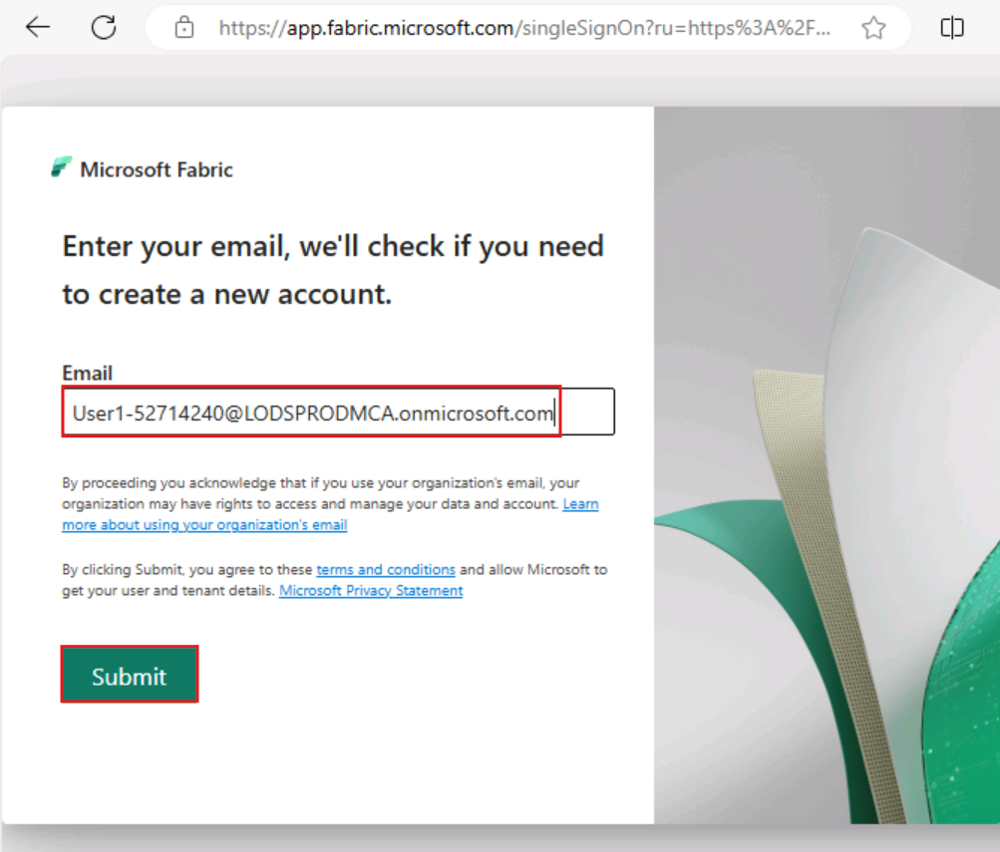
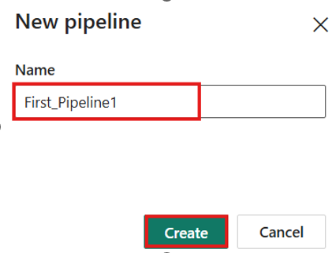
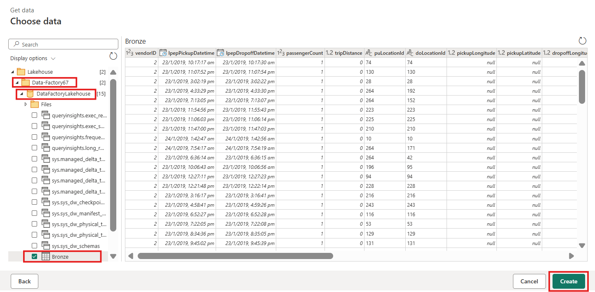
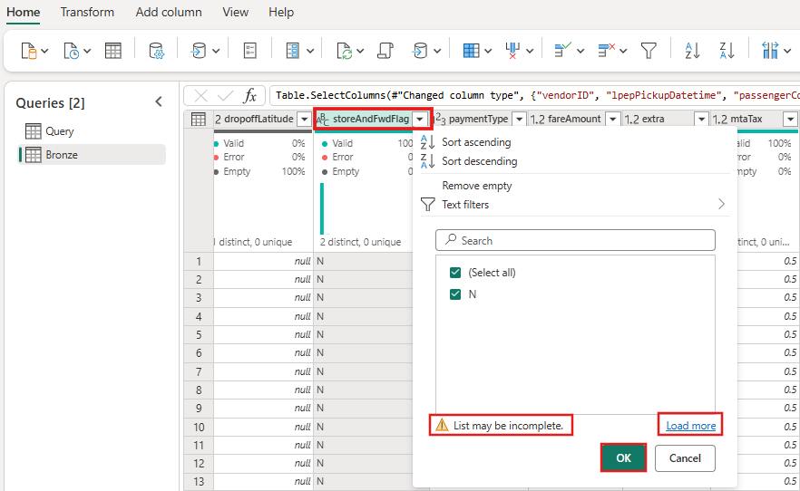
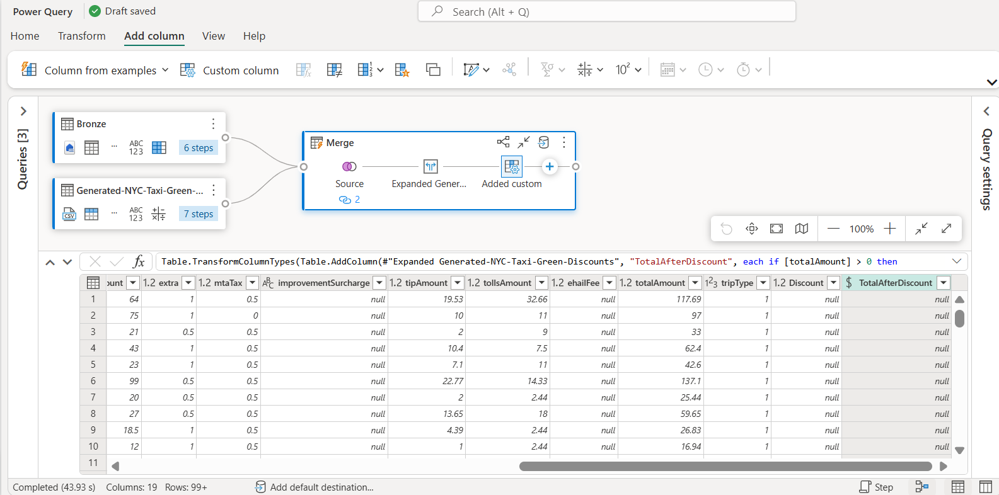

# 사용 사례 02: 데이터 플로우 및 데이터 파이프라인을 이동하고 변환하기 위해 Data Factory 솔루션

**소개**

이 실습은 Microsoft Fabric의 Data Factory 평가 과정을 1시간 이내에 전체
데이터 통합 시나리오에 대한 단계별 안내를 제공하여 가속화할 수 있도록
돕습니다. 이 튜토리얼을 마치면 Data Factory의 가치와 핵심 기능을
이해하고, 일반적인 종단 간 데이터 통합 시나리오를 완성하는 방법을 알게
됩니다.

**목표**

이 실습은 3 가지 연습으로 나뉩니다:

- **연습 1:** Data Factory로 파이프라인을 생성하여 Blob 스토리지에서
  data Lakehouse의 브론즈 테이블로 원시 데이터를 수집하기

- **연습 2:** Data Factory에서 데이터플로우로 데이터를 변환하여 브론즈
  테이블의 원시 데이터를 처리한 후 data Lakehouse의 골드 테이블로
  이동하기

- **연습 3:** Data Factory로 알림을 자동화하고 보내서 모든 작업이
  완료되면 이메일로 알림을 보내고, 마지막으로 전체 플로우를 일정 단위로
  실행하도록 설정하기

# 연습 1: Data Factory를 사용하여 파이프라인 생성하기

## 작업 1: 작업 공간을 생성하기

Fabric에서 데이터를 다루기 전에 Fabric 체험판이 활성화된 작업 공간을
생성하세요.

1.  브라우저를 열고 주소 바로 이동하고 다음URL:
    +++https://app.fabric.microsoft.com/+++을 입력하고 붙여넣고
    **Enter** 버튼을 누르세요.

> **참고**: 만약 Microsoft Fabric 홈페이지로 이동한다면, \#2부터
> \#4까지의 단계를 건너뛰세요.
>
> 

2.  **Microsoft Fabric** 창에서 자격 증명을 입력하고 **Submit** 버튼을
    클릭하세요.

> 

3.  **Microsoft** 창에서 비밀번호를 입력하고 **Sign in** 버튼을
    클릭하세요.

> 

4.  **Stay signed in?** 창에서 **Yes** 버튼을 클릭하세요.

> 
>
> 

5.  Microsoft **Fabric 홈페이지**에서 **New workspace** 옵션을
    선택하세요.

> 

6.  **Create a workspace** 탭에서 다음 정보를 입력하고 **Apply** 버튼을
    클릭하세요.

[TABLE]

> 
>
> 

7.  배포를 완료할 때까지 기다리세요. 약 2-3분 정도 걸립니다.

> 

## 작업 2: lakehouse를 생성하고 샘플 데이터를 수집하기

1.  **Data-FactoryXX** 작업 공간 페이지에서 이동하고 **+New item**
    버튼을 클릭하세요

> 

2.  "**Lakehouse**" 타일을 클릭하세요.

3.  **New lakehouse** 대화 상자에서**Name** 필드에
    +++**DataFactoryLakehouse+++**를 입력하고 **Create** 버튼을 클릭하고
    새로운 lakehouse를 여세요.

> 
>
> 

4.  **Lakehouse** 홈페이지에서 복사 샘플 데이터를 열기 위해 **Start with
    sample data**를 선택하세요.

> 

5.  **Use a sample** 대화 상자가 표시되면 **NYCTaxi** 샘플 데이터 타일을
    선택하세요.

> 
>
> 
>
> 

6.  테이블 이름을 바꾸려면 editor 바로 위의 **green_tripdata_2022** 탭을
    우클릭한 후 **Rename**을 선택하세요.

7.  **Rename** 대화 상자의 **Name** 필드에서 **table**의 이름을
    **+++Bronze+++**로 바꾸고 **Rename** 버튼을 클릭하세요.

**연습 2: Data Factory에서 데이터플로우로 데이토를 변환하기**

## 작업 1: Lakehouse 테이블에서 데이터를 가져오기

1.  이제 왼쪽 탐색 창에서 작업 공간 [**Data
    Factory-@lab.LabInstance.Id**](mailto:Data%20Factory-@lab.LabInstance.Id)를
    클릭하세요.

2.  탐색 바의 **+New item** 버튼을 클릭하여 새로운 Dataflow Gen2를
    생성하세요. 사용 가능한 항목 목록에서 **Dataflow Gen2** 항목을
    선택하세요

> 

3.  새로운 Dataflow Gen2 이름을 +++**nyc_taxi_data_with_discounts+++**로
    설정한 후 **Create**를 선택하세요.

4.  새로운 데이터플로우 메뉴의 **Power Query** 창에서 **Get data drop
    down**을 클릭하고 **More...**를 선택하세요.

> 

5.  **Choose data source** 탭의 검색 바에서 +++**Lakehouse+++**를
    검색하고 입력하고 **Lakehouse** 커넥터를 클릭하세요.

> 

6.  **Connect to data source** 대화상자가 나타나고 현재 로그인한
    사용자를 기반으로 자동으로 새로운 연결이 생성됩니다. **Next**를
    선택하세요.

> 

7.  **Choose data** 대화 상자가 표시됩니다. 탐색 창을 사용해 **작업
    공간인 Data-FactoryXX**를 찾아 확장하세요. 그 다음 이전 모듈에서
    목적지에 대해 생성한 **Lakehouse - DataFactoryLakehouse**를 펼친 후,
    목록에서 **Bronze** 테이블을 선택한 후 **Create** 버튼을 클릭하세요.

8.  캔버스에 데이터가 채워진 것을 볼 수 있을 것입니다.

## 작업 2: Lakehouse에서 가져온 데이터를 변환하기

1.  두 번째 열의 열 헤더에 있는 데이터 타입 아이콘
    **IpepPickupDatetime**을 선택하고 드롭다운 메뉴가 표시되고, 메뉴에서
    데이터 타입을 선택하여 **Date/Time** 에서 **Date**로 타입으로 열을
    변환하세요.

2.  리본에서 **Home** 탭에서 **Manage columns** 그룹에서 **Choose
    columns** 옵션을 선택하세요.

3.  **Choose columns** 대화 상자에서 여기에 나열된 열을 **deselect한**
    후 **OK**를 선택하세요.

    - lpepDropoffDatetime

    &nbsp;

    - DoLocationID

> 

4.  **storeAndFwdFlag** 열의 필터를 선택하고 정렬 드롭다운 메뉴를
    선택하세요. (**List may be incomplete** 경고를 보면 **Load more을**
    선택하면 모든 데이터를 볼 수 있습니다.)

> 

5.  할인이 적용된 행만 보여주려면 **'Y'**를 선택한 후 **OK**를
    선택하세요.

> 

6.  **Ipep_Pickup_Datetime** 열 정렬 및 필터 드롭다운 메뉴를 선택한 후
    **Date filters**를 선택한 후, **Between...** 필터가 날짜 및
    날짜/시간 유형별로 제공됩니다.

7.  **Filter rows** 대화상자에서 **January 1, 2022**부터 **January 31,
    2022** 사이의 날짜를 **OK**를 선택하세요.

> 

## 작업 3: 할인 데이터를 포함된 CSV 파일을 연결하기

이제 여행 데이터가 준비된 후, 각 날짜별 할인 정보와 VendorID가 포함된
데이터를 불러와, 여행 데이터와 결합하기 전에 데이터를 준비하고자 합니다.

1.  Dataflow editor메뉴의 **Home** 탭에서 **Get data** 옵션을 선택하고
    **Text/CSV**를 선택하세요.

> 

2.  **Connect to data source** 창의 **Connection settings**에서 **Link
    to file** 라디오 버튼을 선택하고
    +++https://raw.githubusercontent.com/ekote/azure-architect/master/Generated-NYC-Taxi-Green-Discounts.csv+++를
    입력하고 Connection name을 +++**dfconnection**+++로 입력하고
    **authentication** **kind**가 is set to **Anonymous**로 설정되는지
    확인하세요. **Next** 버튼을 클릭하세요.

3.  **Preview file data** 대화 상자에서 **Create**를 선택하세요.

## 작업 4: 할인 데이터를 변환하기

1.  데이터를 검토해 보면, 헤더가 첫 번째 행에 있는 것으로 보입니다.
    미리보기 그리드 영역 왼쪽 상단의 테이블 컨텍스트 메뉴를 선택해 **Use
    first row as headers**를 선택해 헤더로 승격시키려 합니다.

> 
>
> ***참고:** 헤더를 프로모션한 후, 데이터플로우 편집기 상단의 **Applied
> steps** 창에 열의 데이터 타입에 새로운 단계가 추가된 것을 볼 수
> 있습니다.*
>
> 

2.  **VendorID** 열을 우클릭 한 후, 표시되는 컨텍스트 메뉴에서 **Unpivot
    other columns** 옵션을 선택하세요. 이 기능을 통해 열을 속성-값
    쌍으로 변환할 수 있고, 열은 행이 됩니다.

3.  테이블이 피벗되지 않은 상태에서 **Attribute **및** Value **열의
    이름을 더블 클릭하여 변경하고 **Attribute**를 **+++Date+++**로,
    Value를 **+++Discount+++**로 변경합니다.

4.  **Date** 열의 데이터 타입을 변경하려면 열 이름 왼쪽에 있는 데이터
    타입 메뉴를 선택하고 **Date**를 선택하세요.

> 

5.  **Discount** 열을 선택하고 메뉴에서 **Transform** 탭을 선택하세요.
    **Number column**을 선택하고 서브 메뉴에서 **Standard** 수치 변환을
    선택한 후 **Divide**를 선택하세요.

> 

6.  **Divide** 대화 상자에서 value를 +++100+++로 입력하고 **OK** 버튼을
    클릭하세요.

**작업 7: 여행 및 할인 데이터를 결합하기**

다음 단계는 두 표를 하나의 표로 합치는 것으로, 여행에 적용해야 할 할인과
조정된 총액을 포함시키는 것입니다.

1.  먼저 **Diagram view** 버튼을 켜서 두 쿼리를 모두 볼 수 있게 하세요.

2.  **Bronze** 쿼리를 선택하고 **Home** 탭에서 **Combine** 메뉴를
    선택하고 **Merge queries**를 선택하고 **Merge queries as new**를
    선택하세요.

3.  **Merge** 대화상자의**Right table for merge** 드롭다운에서
    **Generated-NYC-Taxi-Green-Discounts**를 선택하고 대화상자 오른쪽
    상단의 "**light bulb**" 아이콘을 선택하면, 세 테이블 간 열의 권장
    매핑을 확인할 수 있습니다.

4.  두 가지 제안된 열 매핑 중 하나씩을 선택하여 두 테이블의 VendorID와
    날짜 열을 매핑하세요. 두 매핑이 모두 추가되면, 각 테이블에서
    일치하는 열 헤더가 강조 표시됩니다.

> 

5.  여러 데이터 소스의 데이터를 결합해 결과를 볼 수 있도록 허용하라는
    메시지가 표시됩니다. **OK**를 선택하세요.

> 

6.  테이블 영역에서 "The evaluation was canceled because combining data
    from multiple sources may reveal data from one source to another.
    Select continue if the possibility of revealing data is okay."라는
    경고가 볼 수 있습니다. 합쳐진 데이터를 표시하려면 **Continue**를
    선택하세요.

> 

7.  Privacy Levels 대화 상자에서**check box :Ignore Privacy Levels
    checks for this document. Ignoring privacy Levels could expose
    sensitive or confidential data to an unauthorized person**을
    선택하고 **Save** 버튼을 클릭하세요.

> 
>
> 

8.  다이어그램 뷰에서 새 쿼리가 생성된 것을 주목하라. 이 쿼리가 이전에
    만든 두 쿼리와의 관계를 보여준다. 편집기의 테이블 창을 보면, Merge
    query 열 목록 오른쪽으로 스크롤하면 테이블 값이 포함된 새로운 열이
    표시됩니다. 이것은 "**Generated NYC Taxi-Green-Discounts"** 열이며,
    그 유형은 **\[Table\]**입니다.

열 헤더에는 반대 방향으로 향하는 두 개의 화살표가 있는 아이콘이 있어,
테이블에서 열을 선택할 수 있습니다. **Discount**을 제외한 모든 열을 선택
해제한 후 **OK**를 선택하세요.

9.  할인 값이 행 수준에 위치하면, 할인 후 총 금액을 계산할 새로운 열을
    생성할 수 있습니다. 이를 위해 편집기 상단의 **Add column** 탭을
    선택한 후 **General group**에서 **Custom column**을 선택하세요.

> 

10. On the **Custom column** 대화 상자에서, Power Query 공식
    언어(M라고도 함)[를 사용하여 새 열을 어떻게 계산할지
    정의](https://learn.microsoft.com/en-us/powerquery-m)할 수 있습니다.
    **New column name**을 +++**TotalAfterDiscount+++**로 입력하고,
    **Data type**을 **Currency**로 선택하고, **Custom column formula**에
    대해 다음과 같은 M식 제공하세요:

> +++if \[total_amount\] \> 0 then \[total_amount\] \* ( 1 -\[Discount\]
> ) else \[total_amount\]+++

**OK**를 선택하세요.

11. 새로 생성한 **TotalAfterDiscount** 열을 선택하고 editor 창 상단에서
    **Transform** 탭을 선택하세요. **Number column** 그룹에서
    **Rounding** 드롭다운을 선택하고 **Round...**를 선택하세요.

**참고**: **rounding** 옵션을 못 찾으면 메뉴를 확장하고 **Number
column**을 보세요.

12. **Round** 대화상자에서, 소수점 수를 위해 **2**를 입력한 후 **OK**를
    선택하세요.

13. **IpepPickupDatetime**의 데이터 유형을 **Date**에서 **Date/Time**을
    변경하세요.

14. 마지막으로, editor오른쪽에서 Query settings창이 아직 확장되어 있지
    않다면 확장하고 쿼리를 **Merge**에서 +++**Output+++**로 변경하세요.

**작업 8: 출력 쿼리를 Lakehouse 내 테이블에 로드하기**

출력 쿼리가 완전히 준비되고 데이터가 출력될 준비가 되었으면, 쿼리의 출력
목적지를 정의할 수 있습니다.

1.  이전에 생성된 **Output** 병합 쿼리를 선택하세요. 그 다음 **+
    icon**을 선택하여 **data destination**을 이 데이터 플로우에
    추가하세요.

2.  Data destination 목록에서 New destination에서 **Lakehouse** 옵션을
    선택하세요.

3.  **Connect to data destination** 대화 상자에서 연결은 이미 선택되어
    있어야 합니다. 계속하려면 **Next**를 선택하세요.

4.  **Choose destination target** 대화 상자에서 Lakehouse로 이동하고
    **Next**를 다시 선택하세요.

5.  **Choose destination settings** 대화 상자에서 기본
    **Replace** 업데이트 방법을 남겨두고 열이 올바르게 매핑되어 있는지
    다시 한번 확인한 후 **Save settings**을 선택하세요.

6.  메인 editor 창에서 출력 테이블의 **Query settings** 창에서
    **Output** 목적지가 **Lakehouse**로 표시되어 있는지 확인한 후, 홈
    탭에서 **Save and Run**옵션을 선택하세요.

> 
>
> 

9.  Now, click on **Data Factory-XXXX workspace** on the left-sided
    navigation pane.

> 

10. **Data_FactoryXX** 창에서 **DataFactoryLakehouse**를 선택하여 새로
    로드된 테이블을 확인하세요.

11. **Output** 테이블이 **dbo** 스키마 아래에 나타나는지 확인하세요.

# 연습 3: Data Factory로 알림을 자동화하고 보내기

## 작업 1: 파이프라인에 Office 365 Outlook 활동을 추가하기

1.  왼쪽 탐색 메뉴에서 **Data_FactoryXX** Workspace로 이동하고
    클릭하세요.

> 

2.  작업 공간 페이지에서 **+ New item** 옵션을 선택하고 **Pipeline**을
    선택하세요

> 

3.  Pipeline Name을 +++**First_Pipeline1+++**로 입력하고 **Create**를
    선택하세요.

> 

4.  파이프라인 편집기에서 **Home** 탭을 선택하고 검색하고 **Add to
    canvas** 활동을 선택하세요.

> 

5.  **Source** 탭에서다음 설정을 입력하고 **Test connection**을
    클릭하세요

[TABLE]

> 

6.  **Destination** 탭에서 다음 정보를 입력하세요.

[TABLE]

> 
>
> 

7.  리본에서 **Run**을 선택하세요.

> 

8.  **Save and run?** 대화 상자에서 **Save and run** 버튼을 클릭하세요.

> 
>
> 

9.  파이프라인 편집기에서 **Activities** 탭을 선택하고 **Office
    Outlook** 활동을 검색하세요.

> 

10. Copy activity에서 새 Office 365 Outlook 활동으로 전환하는 On Success
    (파이프라인 캔버스 활동 오른쪽 상단의 녹색 체크박스)를 드래그하세요.

11. 파이프라인 캔버스에서 Office 365 Outlook 활동을 선택한 후, 캔버스
    아래 속성 영역의 **Settings** 탭을 선택하여 이메일을 설정하세요.
    **Connection** 드롭다운을 클릭하고 **Browse all**을 선택하세요.

> 

12. ‘Choose a data source’ 창에서 **Office 365 Email** 소스를
    선택하세요.

> 

13. 이메일을 보내고 싶은 계정으로 로그인하세요. 이미 로그인된 계정으로
    기존 연결을 사용할 수 있습니다.

> 

14. 계속하려면 **Connect**를 클릭하세요.

> 

15. 파이프라인 캔버스에서 Office 365 Outlook 활동을 선택하고, 캔버스
    아래 속성 영역의 **Settings** 탭에서 이메일을 설정하세요.

    - **To** 섹션에 이메일 주소를 입력하세요. 여러 주소를 사용하고
      싶다면**;** 분리시키기 위합니다.

> 

- **Subject**에 필드를 선택하여**Add dynamic content** 옵션이 나타나게
  하고, 파이프라인 표현식 빌더 캔버스를 표시하도록 선택하세요.

> 

16. **Pipeline expression builder** 대화 상자에 나타납니다. 다음 식을
    입력한 후 **OK**를 선택하세요:

> *+++@concat('DI in an Hour Pipeline Succeeded with Pipeline Run Id',
> pipeline().RunId)+++*
>
> 

17. **Body**는 필드를 다시 선택한 후 텍스트 영역 아래에 나타나면 **View
    in expression builder** 옵션을 선택하세요. **Pipeline expression
    builder** 대화상자에 다음 표현식을 다시 추가한 후 **OK**를
    선택하세요:

> *+++@concat('RunID = ', pipeline().RunId, ' ; ', 'Copied rows ',
> activity('Copy data1').output.rowsCopied, ' ; ','Throughput ',
> activity('Copy data1').output.throughput)+++*
>
> 
>
> 

**  참고: Copy data1**을 자신의 파이프라인 복사 활동 이름으로
대체하세요.

18. 마지막으로 파이프라인 편집기 상단의 **Home** 탭을 선택하고 **Run**을
    선택하세요. 그 후 **Save and run**을 선택하고 확인 대화상자에서 다시
    실행하여 이 활동을 실행하세요.

> 
>
> 
>
> 

19. 파이프라인이 성공적으로 실행되면 이메일에서 발송된 확인 이메일을
    확인하세요.

**작업 2: 파이프라인 실행 예약하기**

파이프라인 개발과 테스트를 마치면 자동으로 실행되도록 스케줄링할 수
있습니다.

1.  Pipeline editor 창의 **Home** 탭에서 **Schedule**를 선택하세요.

2.  필요에 따라 일정을 설정하세요. 여기 예시는 파이프라인을 연말까지
    매일 오후 8시에 실행하도록 예약한 것입니다.

**작업 3: 파이프라인에 데이터 플로우 활동을 추가하기**

1.  파이프라인 캔버스에서 **Copy activity**와 **Office 365 Outlook**
    활동을 연결하는 녹색 선에 마우스를 올리고, **+** 버튼을 눌러 새
    활동을 삽입하세요.

> 

2.  나타나는 메뉴에서 **Dataflow**를 선택하세요.

3.  새로 생성된 Dataflow 활동은 Copy activity와 Office 365 Outlook 활동
    사이에 삽입되어 자동으로 선택되며, 캔버스 아래 영역에서 속성이
    표시됩니다. 속성 영역에서 Settings 탭을 선택한 후, **연습 2: Data
    Factory에서 데이터플로우로 데이토를 변환하기**를 선택하세요.

4.  Pipeline editor 상단의 **Home** 탭을 선택하고 **Run**을 선택하세요.
    그 다음 **Save and run**을 선택하고 확인 대화상자에서 다시 실행하여
    이 활동을 실행하세요.

> 
>
> 

## 작업 4: 리소스를 정리하기

개별 보고서, 파이프라인, warehouse 및 기타 항목을 삭제하거나 전체 작업
공간을 제거할 수 있습니다. 이 튜토리얼을 위해 생성한 작업 공간을
삭제하는 방법은 다음 단계를 사용하세요.

1.  왼쪽 탐색 메뉴에서 **Data-FactoryXX** 작업 공간을 선택하세요. 그러면
    작업 공간 항목 뷰기 열립니다.

2.  오른쪽 상다의 작업 공간 페이지에서 **Workspace settings** 옵션을
    선택하세요.

3.  **General tab** 및 **Remove this workspace**를 선택하세요.

