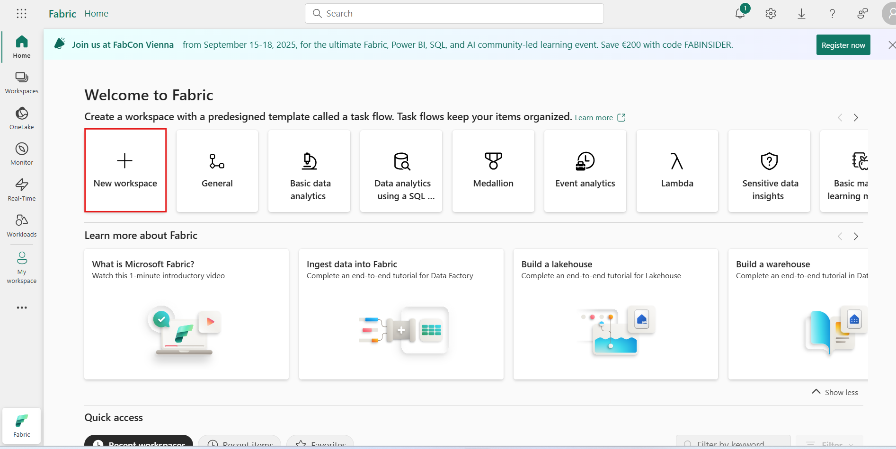
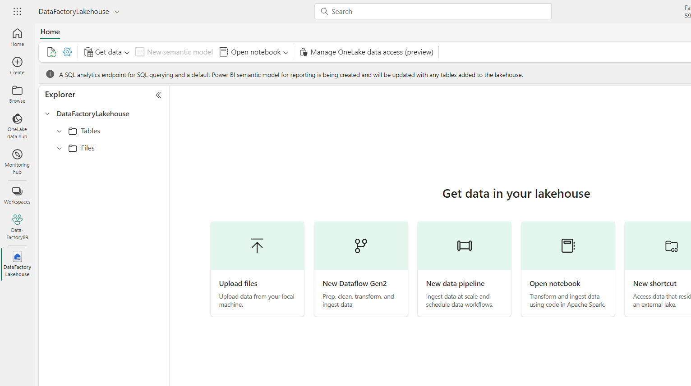
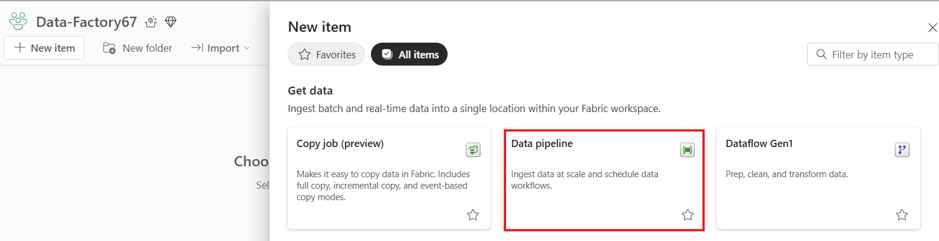
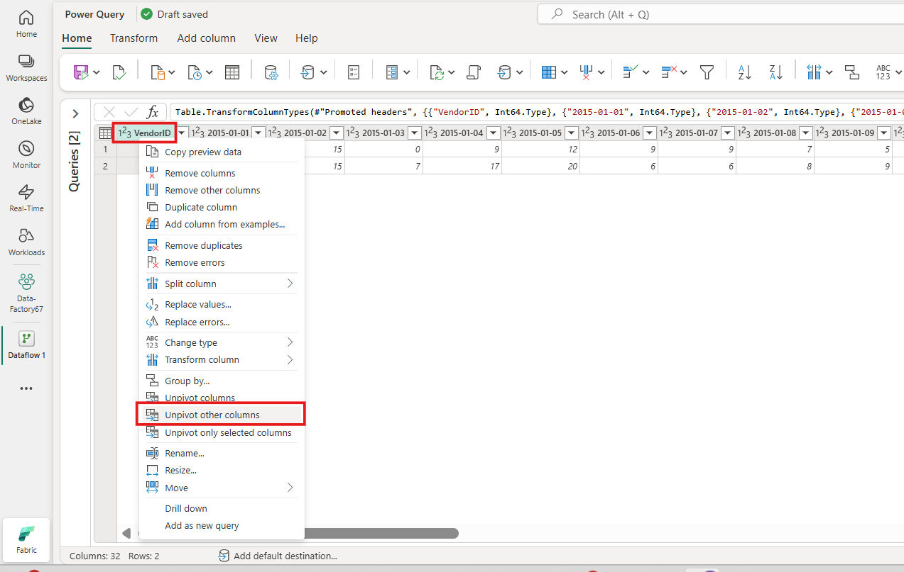
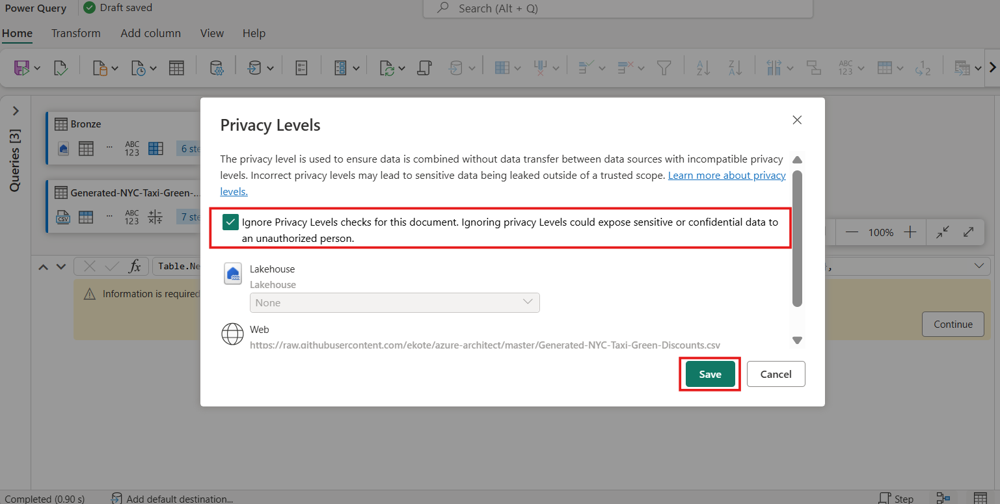
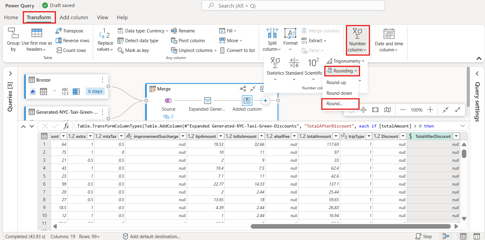
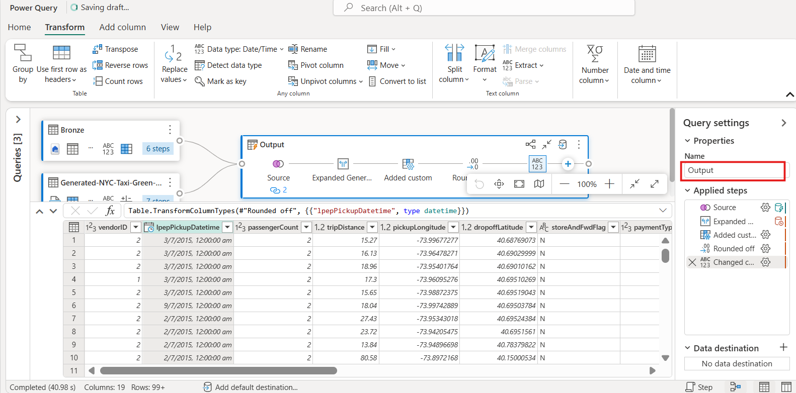

# ユースケース 02: Dataflowとデータ パイプラインを使用してデータを移動および変換する Data Factory ソリューション

**紹介**

このラボでは、1時間以内で完全なデータ統合シナリオを実現するためのステップ・バイ・ステップのガイダンスを提供することで、Microsoft
FabricにおけるData
Factoryの評価プロセスを加速させます。このチュートリアルを完了すると、Data
Factoryの価値と主要な機能を理解し、一般的なエンド・ツー・エンドのデータ統合シナリオを実行する方法を習得できます。

**客観的**

研究室は3つのエクササイズに分かれています:

- **練習1:** Data
  Factoryを使用してパイプラインを作成し、Blobストレージから生データをデータ  
  Lakehouse内のブロンズテーブルに取り込みます。　

- **練習2:**Data Factory のDataflowを使用してデータを変換し、ブロンズ
  テーブルの生データを処理し、データ Lakehouseのゴールド
  テーブルに移動します。

- **練習3:**Data Factory
  を使用して通知を自動化して送信し、すべてのジョブが完了したら通知する電子メールを送信し、最後にフロー全体がスケジュールに従って実行されるように設定します。

# 演習 1: Data Factory を使用してパイプラインを作成する

## タスク1: ワークスペースを作成する

Fabric でデータを操作する前に、Fabric
トライアルが有効になっているワークスペースを作成します。

1.  ブラウザを開き、アドレスバーに移動して、次の URL
    を入力または貼り付けます:
    +++https://app.fabric.microsoft.com/+++。Enterボタンを押します。

> **注記**: Microsoft Fabric Homeページに移動した場合は、手順 2 から 4
> をスキップしてください。
>
> 

2.  Microsoft Fabric ウィンドウで資格情報を入力し、\[**Submit**\]
    ボタンをクリックします。

> 

3.  次に、Microsoft ウィンドウでパスワードを入力し、「**Sign
    in**」ボタンをクリックします。

> 

4.  「**Stay signed
    in?**」ウィンドウで、「**Yes**」ボタンをクリックします。

> 
>
> 

5.  Microsoft **Fabric Home Page**で、**New
    workspace**オプションを選択します。。

> 

6.  「**Create a
    workspace**」タブで、次の詳細を入力し、「**Apply**」ボタンをクリックします。

	|   |   |
	|----|----|
	|Name	| **+++Data-FactoryXXXX+++** (XXXX can be a unique number) |
	|Advanced|	Under License mode, select Fabric capacity|
	|Default storage format|	Small semantic model storage format|

> 
>
> 

7.  デプロイが完了するまでお待ちください。約2～3分かかります。

> 

## タスク 2: Lakehouseを作成し、サンプルデータを取り込む

1.  **Data-FactoryXX** ワークスペースページで、**+New item**
     ボタンに移動してクリックします。

> 

2.  「**Lakehouse**」タイルをクリックします。

3.  **New lakehouse** ダイアログボックスで、**Name** フィールドに
    +++**DataFactoryLakehouse+++**と入力します。**Create**ボタンをクリックして、新しいLakehouseを開きます。
    　

> 
>
> 

4.  Lakehouseのホームページで、「**Start with sample
    data**」を選択して、サンプルデータのコピーを開きます。

> 

5.  \[**Use a sample** \] ダイアログが表示されたら、**NYCTaxi**サンプル
    データ タイルを選択します。

> 
>
> 
>
> 

6.  テーブルの名前を変更するには、エディターのすぐ上にある
    **green_tripdata_2022** タブを右クリックし、\[**Rename**\]
    を選択します。

7.  名前の変更ダイアログボックスの「**Name** 」フィールドに「**+++Bronze+++**」と入力してテーブル名を変更します。次に、「**Rename** 」ボタンをクリックします。

**演習 2: Data Factory のDataflowを使用してデータを変換する**

## タスク1: Lakehouseテーブルからデータを取得する

1.  次に、左側のナビゲーション ペインのワークスペース[**Data
    Factory-@lab.LabInstance.Id**](mailto:Data%20Factory-@lab.LabInstance.Id)をクリックします。

2.  ナビゲーションバーの「+ **New
    item** 」ボタンをクリックして、新しいDataflow
    Gen2を作成します。利用可能なアイテムのリストから**Dataflow
    Gen2**アイテムを選択します。

> 

3.  新しいNew Dataflow Gen2 Nameを
    +++**nyc_taxi_data_with_discounts**+++ として指定し、\[**Create**\]
    を選択します。

4.  新しいDataflowメニューの**Power
    Query**ペインの下からクリック**データを取得ドロップダウン**を選択し、**More...**。

> 

5.  「**Choose data
    source**」タブの検索ボックスに+++**Lakehouse+++**と入力して検索し、Lakehouseコネクタをクリックします。

> 

6.  「**Connect to data
    source** 」ダイアログが表示され、現在サインインしているユーザーに基づいて新しい接続が自動的に作成されます。**Next**を選択してください。

> 

7.  「**Choose
    data** 」ダイアログが表示されます。ナビゲーションペインで**workspace-
    Data-FactoryXX**を見つけて展開します。次に、前のモジュールで保存先として作成した**Lakehouse** -
    **DataFactoryLakehouse**を展開し、リストから「**Bronze**」テーブルを選択して「**Create**」ボタンをクリックします。

8.  キャンバスにデータが入力されていることがわかります。

## タスク2: Lakehouseからインポートしたデータを変換する

1.  2列目の列ヘッダーにあるデータ型アイコン（IpepPickupDatetime）をクリックしてドロップダウンメニューを表示し、メニューからデータ型を選択して、列のデータ型を「**Date/Time** 」から「**Date** 」に変換します。

2.  リボンの \[**Home** \] タブで、\[**Manage columns**\] グループから
    \[**Choose columns** \] オプションを選択します。　

3.  \[**Choose columns** \]
    ダイアログで、ここにリストされているいくつかの列の**選択を解除し**、\[**OK**\]
    を選択します。

    - lpepDropoffDatetime

    &nbsp;

    - DoLocationID

> 

4.  **storeAndFwdFlag** 列のフィルターと並べ替えのドロップダウン
    メニューを選択します。(「**List may be
    incomplete**」という警告が表示された場合は、「**Load
    more** 」を選択してすべてのデータを表示します。)

> 

5.  割引が適用された行のみを表示するには「**Y**」を選択し、「**OK**」を選択します。

> 

6.  **Ipep_Pickup_Datetime** 列の並べ替えとフィルターのドロップダウン
    メニューを選択し、**Date
    filters**を選択して、日付および日付/時刻タイプに提供されている
    **Between...** フィルターを選択します。

7.  \[**Filter rows** \] ダイアログで、**2022 年 1 月 1 日**から **2022
    年 1 月 31** 日までの日付を選択し、\[**OK**\] を選択します。

> 

## タスク3: 割引データを含むCSVファイルに接続する

さて、旅行のデータが準備されたので、各日のそれぞれの割引と VendorID
を含むデータをロードし、旅行データと組み合わせる前にデータを準備します。

1.  Dataflow エディター メニューの \[**Home** \] タブから、\[**Get
    data** \] オプションを選択し、\[**Text/CSV**\] を選択します。

> 

2.  **Connect to data source**ペインの**Connection settings**で、**Link
    to file**ラジオ
    ボタンを選択し、+++https://raw.githubusercontent.com/ekote/azure-architect/master/Generated-NYC-Taxi-Green-Discounts.csv+++
    と入力します。Connection nameに +++**dfconnection**+++
    と入力し、**authentication** **kind**が **Anonymous**
    に設定されていることを確認します。**Next**ボタンをクリックします。

3.  \[**Preview file data** \] ダイアログで、\[**Create**\]
    を選択します。

## タスク4: 割引データを変換する

1.  データを確認すると、ヘッダーが最初の行にあることがわかります。プレビューグリッド領域の左上にあるテーブルのコンテキストメニューを選択し、「**Use
    first row as headers**」を選択して、ヘッダーに昇格してください。

> 
>
> ***注記：**ヘッダーを昇格すると、Dataflow エディターの上部にある
> \[**Applied
> steps**\]ペインに、列のデータ型に新しいステップが追加されていることを確認できます。*
>
> 

2.  VendorID列を右クリックし、表示されるコンテキストメニューから「**Unpivot
    other
    columns**」オプションを選択します。これにより、列を属性と値のペア  
    に変換し、列を行に変換できます。

3.  テーブルのピボットを解除した状態で、属性列と値列をダブルクリックし、属性を
    +++**Date**+++ に、**Value**を +++**Discount**+++
    に変更して名前を変更します。

4.  列名の左側にあるデータ型メニューを選択し、「**Date**」を選択して、**Date**列のデータ型を変更します。

> 

5.  「**Discount** 」列を選択し、メニューの「**Transform** 」タブを選択します。「**Number
    column**」を選択し、サブメニューから**Standard** 数値変換を選択し、「**Divide**」  
    を選択します。

> 

6.  「**Divide**」ダイアログで、値 +++100+++
    を入力し、「**OK**」ボタンをクリックします。　

**タスク7: 旅行と割引データを組み合わせる**

次のステップでは、両方のテーブルを、旅行に適用する割引と調整後の合計を含む
1 つのテーブルに結合します。

1.  まず、**Diagram view** ボタンを切り替えて、両方のクエリが  
    表示されるようにします。

2.  **ブロンズ** クエリを選択し、\[**ホーム**\] タブで \[**Combine** \]
    メニューを選択して \[**Merge queries**\] を選択し、\[**Merge queries
    as new**\] を選択します。

3.  \[**Merge** \] ダイアログで、\[**Right table for merge**\]
    ドロップダウンから
    \[**Generated-NYC-Taxi-Green-Discounts**\]を選択し、ダイアログの右上にある「**電球**」アイコンを選択して、3
    つのテーブル間の列の推奨マッピングを確認します。

4.  提案された2つの列マッピングをそれぞれ1つずつ選択し、両方のテーブルのVendorID列と日付列をマッピングします。両方のマッピングが追加されると、各テーブルで一致する列ヘッダーがハイライト表示されます。

> 

5.  複数のデータソースからのデータを結合して結果を表示することを許可するかどうかを確認するメッセージが表示されます。\[**OK** \]を選択します。

> 

6.  テーブル領域には、最初に「The evaluation was canceled because
    combining data from multiple sources may reveal data from one source
    to another. Select continue if the possibility of revealing data is
    okay」という警告が表示されます。続行を選択すると、結合されたデータが  
    表示されます。　

> 

7.  「Privacy Levels」ダイアログボックスで、「**check box :Ignore
    Privacy Levels checks for this document. Ignoring privacy Levels
    could expose sensitive or confidential data to an unauthorized
    person**」チェックボックスを選択します。「**Save**」ボタンをクリックします。

> 
>
> 

8.  Diagramビューに新しいクエリが作成され、新しいMerge
    queryと以前に作成した2つのクエリの関係が表示されています。エディターのテーブルペインで、Merge
    queryの列リストの右までスクロールすると、テーブル値を持つ新しい列が追加されていることがわかります。これは「**Generated
    NYC Taxi-Green-Discounts**」列で、種類は\[**Table**\]です。

列ヘッダーには、反対方向の矢印が2つ付いたアイコンがあり、これを使ってテーブルから列を選択できます。「**Discount**」以外のすべての列の選択を解除し、「**OK**」を選択してください。

9.  割引値が行レベルに設定されたので、割引後の合計金額を計算するための新しい列を作成できます。そのためには、エディター上部の「**Add
    column** 」タブを選択し、「**General** 」グループから「**Custom
    column** 」を選択します。

> 

10. **Custom column** ダイアログでは、[Power Query 数式言語 (M
    とも呼ばれる)](https://learn.microsoft.com/en-us/powerquery-m)新しい列の計算方法を定義します。**New
    column**名に「+++**TotalAfterDiscount**+++」と入力し、データ型に「**Currency** 」を選択し、**Custom
    column formula**に次のM式を入力します。　

+++if [total_amount] > 0 then [total_amount] * ( 1 -[Discount] ) else [total_amount]+++

次に「**OK**」を選択します。

11. 新しく作成した**TotalAfterDiscount**列を選択し、エディターウィンドウ上部の「**Transform** 」タブを選択します。**Number
    column** グループで、「**Rounding** 」ドロップダウンを選択し、「**Round**...」を選択します。

**注記**:
**rounding**オプションが見つからない場合は、メニューを展開して**Number
column**を表示します。

12. \[**Round**\] ダイアログで、小数点以下の桁数として **2**
    を入力し、\[**OK**\] を選択します。

13. **IpepPickupDatetime** のデータ型を **Date** から **Date/Time**
    に変更します。

14. 最後に、エディターの右側から**クエリ設定**ペインがまだ展開されていない場合は展開し、クエリの名前を
    **Merge** から +++**Output**+++ に変更します。

**タスク8: 出力クエリをLakehouseのテーブルにロードする**

出力クエリが完全に準備され、データの出力準備が整ったので、クエリの出力先を定義できます。

1.  先ほど作成した**Output** マージクエリを選択します。次に、+
    **icon**を選択して、このDataflowに**data destination**を追加します。

2.  データの宛先リストから、\[New destination\] の下の **Lakehouse**
    オプションを選択します。

3.  「**Connect to data
    destination** 」ダイアログでは、接続が既に選択されているはずです。「**Next** 」を選択して続行してください。

4.  \[**Choose destination target** \] ダイアログで、Lakehouse
    を参照して、もう一度 \[**Next** \] を選択します。

5.  \[**Choose destination settings** \] ダイアログで、デフォルトの
    \[**Replace** \]
    更新方法をそのまま使用し、列が正しくマップされていることを再確認して、\[**Save
    settings**\] を選択します。

6.  メイン エディター ウィンドウに戻り、**Output** テーブルの**Query
    settings**   
    ペインで出力先が **Lakehouse**
    として表示されていることを確認し、Home タブから \[**Save and Run**\]
    オプションを選択します。

> 
>
> 

9.  次に、左側のナビゲーション ペインで **Data Factory-XXXX
    ワークスペース**をクリックします。

> 

10. **Data_FactoryXX**ペインで、**DataFactoryLakehouse**
    を選択すると、そこにロードされた新しいテーブルが表示されます。

11. **出力**テーブルが **dbo**
    スキーマの下に表示されることを確認します。

# 演習 3: Data Factory を使用し、通知を自動化して 送信する

## タスク 1: Office 365 Outlook アクティビティをパイプラインに追加する

1.  左側のナビゲーション メニューで **Data_FactoryXX**
    ワークスペースに  
    移動してクリックします。

> 

2.  ワークスペースページで「**+ New
    item**」オプションを選択し、「**Pipeline**」を選択します。

> 

3.  パイプライン名を +++**First_Pipeline1**+++
    として指定し、\[**Create**\] を選択します。

> 

4.  パイプライン エディターで \[**Home** \] タブを選択し、\[**Add to
    canvas** \] アクティビティを見つけます。

> 

5.  ソースタブで、以下の設定を入力し、**Test
    connection**をクリックします。

	|     |    |
	|------|------|
	|Connection|	**dfconnection User-XXXX**|
	|Connection Type|	select **HTTP**.|
	|File format	|Delimited Text|

> 

6.  \[**Destination** \] タブで、次の設定を入力します。

	|    |    |
	|-----|----|
	|Connection	|**Lakehouse**|
	|Lakehouse|	Select **DataFactoryLakehouse**|
	|Root Folder	|select the **Table** radio button.|
	|Table|	• Select New, enter **+++Generated-NYC-Taxi-Green-Discounts+++** and click on Create button|

> 
>
> 

7.  リボンから \[**Run**\] を選択します。

> 

8.  \[**Save and run?** \] ダイアログ ボックスで、\[**Save and run** \]
    ボタンをクリックします。

> 
>
> 

9.  パイプライン エディターで \[**Activities** \] タブを選択し、**Office
    Outlook  
    **アクティビティを見つけます。

> 

10. On Successパス (パイプライン
    キャンバス内のアクティビティの右上にある緑色の  
    チェックボックス) を選択し、Copy アクティビティから新しい Office 365
    Outlook アクティビティにドラッグします。　

11. パイプラインキャンバスからOffice 365
    Outlookアクティビティを選択し、  
    キャンバス下のプロパティエリアの「**Settings** 」タブを選択してメールの設定を行います。「**Connection**」ドロップダウンをクリックし、「Browse
    all」を選択します。

> 

12. 「choose a data source」ウィンドウで、**Office 365
    Email**ソースを選択します。

> 

13. メールを送信するアカウントでサインインしてください。既にサインインしているアカウントとの既存の接続を使用できます。

> 

14. 「**Connect**」をクリックして続行します。

> 

15. パイプライン キャンバスから Office 365 Outlook
    アクティビティを選択し、キャンバスの下のプロパティ領域の
    \[**Settings** \] タブで電子メールを構成します。

    - 「**To** 」欄にメールアドレスを入力してください。複数のアドレスを入力する場合は、「;」で区切ってください。

> 

- \[**Subject**\] で、フィールドを選択して \[**Add dynamic content** \]
  オプションを表示し、それを選択してpipeline expression
  builderキャンバスを表示します。

> 

16. **Pipeline expression builder** ダイアログが表示されます。  
    次の式を入力し、「**OK**」を選択します。

> *+++@concat('DI in an Hour Pipeline Succeeded with Pipeline Run Id',
> pipeline().RunId)+++*
>
> 

17. **Body**については、フィールドを再度選択し、テキストエリアの下に表示される「**View
    in expression builder** 」オプションを選択します。  
    表示される**Pipeline expression
    builder** ダイアログに以下の式を再度追加し、「  
    **OK**」を選択します。

+++@concat('RunID = ', pipeline().RunId, ' ; ', 'Copied rows ', activity('Copy data1').output.rowsCopied, ' ; ','Throughput ', activity('Copy data1').output.throughput)+++

> 
>
> 

**注記：Copy data1** を、独自のパイプライン コピー
アクティビティの名前に  
置き換えます。

18. 最後に、パイプラインエディターの上部にある「**Home** 」タブを選択し、「**Run**」を選択します。確認ダイアログで「**Save
    and run** 」を選択して、これらの  
    アクティビティを実行します。

> 
>
> 
>
> 

19. パイプラインが正常に実行されたら、電子メールをチェックして、パイプラインから送信された確認メールを見つけます。

**タスク2: パイプラインの実行をスケジュールする**

パイプラインの開発とテストが完了したら、自動的に実行されるようにスケジュールを設定できます。

1.  パイプライン エディター ウィンドウの \[**Home** \]
    タブで、\[**Schedule**\] を選択します。

2.  必要に応じてスケジュールを設定します。この例では、年末まで毎日午後8時に  
    パイプラインを実行するようにスケジュールを設定します。

**タスク 3: パイプラインにDataflowアクティビティ  
を追加する**

1.  パイプライン キャンバス上の**Copy** アクティビティと **Office 365
    Outlook**
    アクティビティを接続する緑色の線にマウスカーソルを合わせ、+
    ボタンを選択して新しいアクティビティを挿入します。

> 

2.  表示されるメニューから「**Dataflow** 」を選択します。

3.  新しく作成されたDataflow アクティビティは、Copy アクティビティと
    Office 365 Outlook
    アクティビティの間に挿入され、自動的に選択されて、キャンバスの下の  
    領域にそのプロパティが表示されます。プロパティ領域の
    \[**Settings** \] タブを  
    選択し、「**演習 2: Data Factory
    でDataflowを使用して、データを変換する**」  
    で作成したDataflowを選択します。

4.  パイプラインエディターの上部にある「**ホーム**」タブを選択し、「**Run**」を選択します。確認ダイアログで「**Save
    and run**」を選択して、これらのアクティビティを  
    実行します。

> 
>
> 

## タスク4: リソースをクリーンアップする

レポート、パイプライン、ウェアハウス、その他のアイテムを個別に削除することも、ワークスペース全体を削除することもできます。このチュートリアル用に作成した  
ワークスペースを削除するには、以下の手順に従ってください。

1.  左側のナビゲーションメニューから、ワークスペース「**Data-FactoryXX**」を選択します。ワークスペースアイテムビューが開きます。

2.  右上隅にあるワークスペース ページで、**Workspace
    settings**オプションを  
    選択します。

3.  \[**General**\] タブを選択し、「**Remove this
    workspace」を選択します**。

