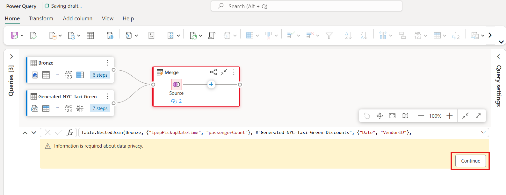

# ユースケース 02: データフローとデータ パイプラインを使用してデータを移動および変換する Data Factory ソリューション

**導入**

このラボでは、1時間以内で完全なデータ統合シナリオを実現するためのステップバイステップのガイダンスを提供することで、Microsoft
FabricにおけるData
Factoryの評価プロセスを加速させます。このチュートリアルを完了すると、Data
Factoryの価値と主要な機能を理解し、一般的なエンドツーエンドのデータ統合シナリオを実行する方法を習得できます。

**客観的**

ラボは3つのeに分かれていますxercises。

- **演習 1:** Data Factory を使用してパイプラインを作成し、Blob
  ストレージからデータ Lakehouseのブロンズ
  テーブルに生データを取り込みます。

- **演習 2:** Data Factory
  のデータフローを使用してデータを変換し、ブロンズ
  テーブルからの生データを処理し、それをデータ Lakehouseのゴールド
  テーブルに移動します。

- **演習 3:** Data Factory
  を使用して通知を自動化して送信し、すべてのジョブが完了したら通知する電子メールを送信し、最後にフロー全体がスケジュールに従って実行されるように設定します。

# 演習 1: Data Factory を使用してパイプラインを作成する

## タスク1: ワークスペースを作成する

Fabric でデータを操作する前に、Fabric
トライアルが有効になっているワークスペースを作成します。

1.  ブラウザを開き、アドレス バーに移動して、次の URL
    を入力または貼り付けます: +++
    https://app.fabric.microsoft.com/+++次に、
    **Enter**ボタンを押します。

> **注**: Microsoft Fabric ホームページに移動した場合は、手順 2 から 4
> をスキップしてください。
>
> 

2.  **Microsoft Fabricウィンドウ**で資格情報を入力し、
    **\[Submit\]**ボタンをクリックします。

> 

3.  次に、 **Microsoft**ウィンドウでパスワードを入力し、 **\[Sign
    in\]**ボタンをクリックします**。**

> 

4.  **「Stay signed in?」**ウィンドウで、
    **「Yes」**ボタンをクリックします。

> 
>
> 

5.  Microsoft **Fabric ホーム ページで**、 **\[New
    workspace\]**オプションを選択します。

> 

6.  **「Create a workspace」タブ**で、次の詳細を入力し、
    **「Apply」**ボタンをクリックします。

  	|   |   |
  	|----|----|
  	|Name	| Data-FactoryXXXX (XXXX can be a unique number) |
  	|Advanced|	Under License mode, select Fabric capacity|
  	|Default storage format|	Small semantic model storage format|

> 
>
> 

7.  デプロイが完了するまでお待ちください。約2～3分かかります。

> 

## タスク 2:Lakehouseを作成し、サンプルデータを取り込む

1.  **Data - FactoryXX**ワークスペースページで、 **「+New
    item」**ボタンに移動してクリックします。

> 

2.  「 **Lakehouse** 」タイルをクリックします。

> 

3.  **\[New Lakehouse\]**ダイアログ
    ボックスで、\[**Name\]フィールド**に「 +++ **DataFactoryLakehouse
    +++ 」と入力し**、
    **\[Create\]**ボタンをクリックして新しいLakehouseを開きます。

> 
>
> 

4.  **Lakehouseの**ホームページで、 **「Start with sample
    data」**を選択して、サンプルデータのコピーを開きます。

> 

5.  **\[Use a sample\]**ダイアログが表示されたら、 **NYCTaxi**サンプル
    データ タイルを選択します。

> 
>
> 
>
> 

6.  エディターのすぐ上にある**green_tripdata_2022**タブを右クリックし、
    **\[Rename\]**を選択します。

7.  **Rename**ダイアログボックスの**「Name」**フィールドに**「+++Bronze+++」と入力して、テーブル**の名前を変更します。次に、「**Rename」**ボタンをクリックします。

**演習 2: Data Factory のデータフローを使用してデータを変換する**

## タスク1: Lakehouseテーブルからデータを取得する

1.  次に、左側のナビゲーション ペインでワークスペース[**Data
    Factory-@lab.LabInstance.Idをクリックします。**](mailto:Data%20Factory-@lab.LabInstance.Id)

2.  **「+New item」ボタン**をクリックして、新しいDataflow
    Gen2を作成します。利用可能なアイテムのリストから**Dataflow
    Gen2**アイテムを選択します。

> 

3.  新しいデータフロー Gen2 名を **+++ nyc_taxi_data_with_discounts+++として指定し**、 **\[Create\]**を選択します。

4.  **Power Query**ペインで、 **\[Get data\]
    ドロップダウン**をクリックし、 **\[More...\]を選択します**。

> 

5.  **Choose data sourceタブ**で、 検索ボックス検索タイプ
    +++**Lakehouse+++** そして、 **Lakehouse**コネクタ。

> 

6.  **「Connect to data
    source」**ダイアログが表示され、現在サインインしているユーザーに基づいて新しい接続が自動的に作成されます。
    **「Next」**を選択してください。

> 

7.  「**Choose
    data**」ダイアログが表示されます。ナビゲーションペインで**ワークスペース「DataFactoryXX
    」**を見つけて展開します。次に、前のモジュールで保存先として作成した**「Lakehouse** -
    **DataFactoryLakehouse」**を展開し、リストから**「Bronze」テーブルを選択して「Create
    」**ボタンをクリックします。

8.  キャンバスにデータが入力されていることがわかります。

## タスク2: Lakehouseからインポートしたデータを変換する

1.  2
    番目の列**IpepPickupDatetimeの列ヘッダーにあるデータ型アイコンを選択して**ドロップダウン
    メニューを表示し、メニューからデータ型を選択して列をDate**/Time型からDate型**に変換します。

2.  リボンの**\[Home\]タブ**で、 **\[Manage
    columns\]グループ**から**\[Choose
    columns\]オプションを選択します**。

3.  **\[Choose
    columns\]ダイアログ**で、ここにリストされているいくつかの列の**選択を解除し**、
    **\[OK\]を選択します**。

    - lpepDropoffDatetime

    &nbsp;

    - DoLocationID

> 

4.  **storeAndFwdFlag列のフィルターと並べ替えのドロップダウン
    メニュー**を選択します。(「**List may be
    incomplete」という**警告が表示された場合は、 「**Load
    more」を選択して**すべてのデータを表示します。)

5.  割引が適用された行のみを表示するには、 「 **Y」**を選択し、
    **「OK」**を選択します。

> 

6.  **Ipep_Pickup_Datetime**列の並べ替えとフィルターのドロップダウン
    メニューを選択し、**Date
    filtersを選択して**、日付および日付/時刻タイプに提供されている**Between...**フィルターを選択します。

7.  **\[Filter rows\]ダイアログ**で、 **2022 年 1 月 1 日**から**2022 年
    1 月 31 日**までの日付を選択し、 **\[OK\]を選択します**。

> 

## タスク3: 割引データを含むCSVファイルに接続する

さて、旅行のデータが準備されたので、各日のそれぞれの割引とVendorID
を含むデータをロードし、旅行データと組み合わせる前にデータを準備します。

1.  データフロー エディター メニューの \[**Home\]タブ**から、 **\[Get
    data\]**オプションを選択し、 **\[Text/CSV\]を選択します**。

> 

2.  \[Connect to data source\] ペインの \[Connection settings\]
    で、\[Link to file\] ラジオ
    ボタンを選択し、+++https://raw.githubusercontent.com/ekote/azure-architect/master/Generated-NYC-Taxi-Green-Discounts.csv+++
    と入力し、接続名に +++dfconnection+++ と入力して、authentication
    kindが \[Anonymous\] に設定されていることを確認します。\[Next\]
    ボタンをクリックします。

3.  **\[Preview file data\]ダイアログ**で、 **\[Create\]を選択します**。

## タスク4: 割引データを変換する

1.  データを確認すると、ヘッダーが最初の行にあることがわかります。プレビューグリッド領域の左上にあるテーブルのコンテキストメニューを選択し、「**Use
    first row as headers」を選択して、ヘッダーに昇格してください**。

> 
>
> ***注:**ヘッダーを昇格すると、データフロー
> エディターの上部にある**\[Applied
> steps\]**ペインに、列のデータ型に新しいステップが追加されます。*
>
> 

2.  **VendorID列を**右クリックし、表示されるコンテキストメニューから「**Unpivot
    other
    columns」オプションを選択します**。これにより、列を属性と値のペアに変換し、列を行に変換できます。

3.  テーブルのピボットを解除した状態で、**Attribute列**と**Value**列をダブルクリックし、**属性を**+++**Date+++に**、**値を**+++
    **Discount+++に変更して名前を変更します**。

4.  列名の左側にあるデータ型メニューを選択し、 **Dateを選択して、
    Date列**のデータ型を変更します。

> 

5.  「**Discount」**列を選択し、メニューの「**Transform」タブを選択します。
    「Number
    column」を選択し**、サブメニューから**「Standard**数値変換」を選択し、
    **「Divide」を選択します**。

> 

6.  **「Divide」ダイアログ**で、値 +++100+++ を入力し、
    **「OK」**ボタンをクリックします。

**タスク7: 旅行と割引データを組み合わせる**

次のステップでは、両方のテーブルを、旅行に適用する割引と調整後の合計を含む
1 つのテーブルに結合します。

1.  まず、**Diagram
    ビュー**ボタンを切り替えて、両方のクエリが表示されるようにします。

2.  **ブロンズクエリ**を選択し、 **\[Home\]タブで
    \[Combine\]メニュー**を選択して**\[Merge queries\]**を選択し、
    **\[Merge queries as new\] を選択します**。

3.  **\[Merge\]ダイアログ**で、 **\[Right table for merge\]
    ドロップダウン**から**\[Generated-NYC-Taxi-Green-Discounts\]を選択し**、ダイアログの右上にある\[**電球\]
    アイコンを選択して、3
    つのテーブル間の列の推奨マッピングを確認します。**

4.  提案された2つの列マッピングをそれぞれ1つずつ選択し、両方のテーブルのVendorID列と日付列をマッピングします。両方のマッピングが追加されると、各テーブルで一致する列ヘッダーがハイライト表示されます。

> 

5.  複数のデータソースからのデータを結合して結果を表示することを許可するかどうかを確認するメッセージが表示されます。
    **\[OK\]**を選択します。 

> 

6.  テーブル領域には、最初に「複数のソースからのデータを組み合わせると、あるソースから別のソースにデータが漏洩する可能性があるため、評価はキャンセルされました。データが漏洩する可能性が問題ない場合は、続行を選択してください。」という警告が表示されます。**Continueを選択すると**、結合されたデータが表示されます。

> 

7.  「Privacy Levels」ダイアログボックスで、「**Ignore Privacy Levels
    checks for this document. Ignoring privacy Levels could expose
    sensitive or confidential data to an unauthorized
    person**」というチェックボックスをオンにし、「Save」ボタンをクリックします。

> 
>
> 

8.  ダイアグラムビューに新しいクエリが作成され、新しいマージクエリと以前に作成した2つのクエリの関係が表示されています。エディターのテーブルペインで、マージクエリの列リストの右までスクロールすると、テーブル値を持つ新しい列が表示されます。これは「Generated
    NYC Taxi-Green-Discounts」列で、その種類は**\[Table\]です**。

列ヘッダーには、反対方向の矢印が2つ付いたアイコンがあり、これを使ってテーブルから列を選択できます。Discount
以外のすべての列の選択を解除し**、** OK を選択し**ます**。

9.  割引値が行レベルに設定されたので、割引後の合計金額を計算するための新しい列を作成できます。そのためには、エディター上部の**「Add
    column」タブを選択し、 「General」グループ**から**「Custom
    column」を選択します**。

> 

10. **「Custum column」ダイアログ**では、 [Power Query の式言語（M
    とも呼ばれます）を](https://learn.microsoft.com/en-us/powerquery-m)使用して、新しい列の計算方法を定義できます。
    「**New column name」**に「+++ **TotalAfterDiscount
    +++」と入力し、「Data type」**で**「Currency」**を選択し、
    **「Custom column formula」に次の M 式を入力します**。

 +++if [total_amount] > 0 then [total_amount] * ( 1 -[Discount] ) else [total_amount]+++

次に**［OK］を選択します**。

11. 新しく作成した**TotalAfterDiscount**列を選択し、エディターウィンドウ上部の**「Transform」タブを選択します。
    「Number column」**グループで、
    **「Rounding」**ドロップダウンを選択し、
    **「Round...」を選択します**。

**注:Roundingオプション**が見つからない場合は、メニューを展開してNumber
column**を表示します**。

12.**\[Round\]ダイアログ**で、小数点以下の桁数として**2
    を入力し、 \[OK\]を選択します**。
     

13. **IpepPickupDatetime**のデータ型を**Date**から**Date/Time**に変更します。

14. 最後に、エディターの右側から**Query
    settingsペインがまだ展開されていない場合は展開し、クエリの名前をMergeから**+++
    **Output+++に変更します**。

**タスク8: 出力クエリをLakehouseのテーブルにロードする**

出力クエリが完全に準備され、データの出力準備が整ったので、クエリの出力先を定義できます。

1.  **Outputマージクエリ**を選択します。次に、
    **+アイコンを選択して**、このデータフローに**data
    destinationを追加します**。

2.  データの宛先リストから、 \[新しい宛先\]
    の下の**Lakehouseオプションを選択します。**

3.  **「Connect to data
    destination** **」ダイアログ**では、接続が既に選択されているはずです。
    **「Next」を選択し**て続行してください。

4.  **\[Choose destination target\]ダイアログ**で、Lakehouse
    を参照して、もう一度**\[Next\]を選択します**。

5.  **\[Choose destination settings** **\]ダイアログ**で、デフォルトの
    \[**Replace\]**更新方法をそのままにして、列が正しくマップされていることを再確認し、
    **\[Save settings\]を選択します**。

6.  **OutputテーブルのQuery
    settings**ペインで出力先が**Lakehouse**として表示されていることを確認し、
    \[Home\] タブから**\[Save and Run\]オプションを選択します。**

> 
>
> 

9.  次に、左側のナビゲーション ペインで**Data Factory-XXXX
    ワークスペースをクリックします。**

> 

10. **Data_FactoryXX**では ペインで、
    **DataFactoryLakehouse**を選択します
    そこにロードされた新しいテーブルを表示します。

11. **Outputテーブルが表示されている**ことを確認します。

# 演習 3: Data Factory を使用して通知を自動化して送信する

## タスク 1: Office 365 Outlook アクティビティをパイプラインに追加する

1.  左側のナビゲーション
    メニューで**Data_FactoryXXワークスペース**に移動してクリックします。

> 

2.  ワークスペースページで**「+ New item」オプション**を選択し、
    **「Pipeline」**を選択します。

> 

3.  パイプライン名を+++ **First_Pipeline1+++として指定し**、
    **\[Create\]を選択します**。

> 

4.  パイプライン エディターで\[**Home\]タブを**選択し、 **\[Add to
    canvas\]**アクティビティを見つけます。

> 

5.  **Sourceタブ**で、以下の設定を入力し、**Test
    connectionをクリックします。**

	|     |    |
	|------|------|
	|Connection|	dfconnection User-XXXX|
	|Connection Type|	select HTTP.|
	|File format	|Delimited Text|

> 

6.  \[Destination\] タブで、次の設定を入力します。

	|    |    |
	|-----|----|
	|Connection	|**Lakehouse**|
	|Lakehouse|	Select **DataFactoryLakehouse**|
	|Root Folder	|select the **Table** radio button.|
	|Table|	• Select New, enter +++ Generated-NYC-Taxi-Green-Discounts+++ and click on Create button|

> 

7.  リボンから**\[Run\]**を選択します。

> 

8.  **\[Save and run?\]ダイアログ ボックス**で、 **\[Save and
    run\]**ボタンをクリックします。

> 
>
> 

9.  パイプライン エディターで**\[Activities\]タブを**選択し、 **Office
    Outlook**アクティビティを見つけます。

> 

10. 成功時のパス (パイプライン
    キャンバス内のアクティビティの右上にある緑色のチェックボックス)
    を選択し、コピー アクティビティから新しい Office 365 Outlook
    アクティビティにドラッグします。

11. パイプラインキャンバスからOffice 365
    Outlookアクティビティを選択し、キャンバス下部のプロパティエリアにある**「Settings」タブを選択してメールの設定を行います。
    「Sign in」**ボタンをクリックします。

> 

12. Power BI 組織アカウントを選択し、**Allow
    access**を選択して確認します。

> 

13. パイプライン キャンバスから Office 365 Outlook
    アクティビティを選択し、キャンバスの下のプロパティ領域の**\[Settings\]タブで電子メールを構成します。**

    - **「To」欄**にメールアドレスを入力してください。複数のアドレスを入力する場合は、「
      **;」**で区切ってください。

    &nbsp;

    - 
    - **\[Subject\]**で、フィールドを選択して**\[Add
      dynamic
      content\]**オプションを表示し、それを選択してパイプライン式ビルダー
      キャンバスを表示します。

14. **Pipeline expression
    builder** ダイアログが表示されます。次の式を入力し、
    **「OK」を選択します**。

    +++@concat('DI in an Hour Pipeline Succeeded with Pipeline Run Id', pipeline().RunId)+++

> 

15. **Body**については、フィールドを再度選択し、テキストエリアの下に表示される**「View
    in expression builder」オプションを選択します。表示されるPipeline
    expression builderダイアログに以下の式を再度追加し、
    「OK」**を選択します。

> *+++@concat('RunID = ', pipeline().RunId, ' ; ', 'Copied rows ',
> activity('Copy data1').output.rowsCopied, ' ; ','Throughput ',
> activity('Copy data1').output.throughput)+++*
>
> 
>
> 

** 注: Copy data1 を、**独自のパイプライン コピー
アクティビティの名前に置き換えます。

16. 最後に、パイプラインエディターの上部にある「**Home」**タブを選択し、
    **「Run」**を選択します。確認ダイアログで**「Save and
    run」**を選択して、これらのアクティビティを実行します。

> 
>
> 
>
> 
>
> 

17. パイプラインが正常に実行されたら、電子メールをチェックして、パイプラインから送信された確認メールを見つけます。

**タスク2: パイプラインの実行をスケジュールする**

パイプラインの開発とテストが完了したら、自動的に実行されるようにスケジュールを設定できます。

1.  パイプライン エディター ウィンドウの**\[Home\]**タブで、
    **\[Schedule\]**を選択します。

2.  必要に応じてスケジュールを設定します。この例では、年末まで毎日午後8時にパイプラインを実行するようにスケジュールを設定します。

**タスク 3: パイプラインにデータフロー アクティビティを追加する**

1.  ライン キャンバス上の**Copy activity**と**Office 365
    Outlookアクティビティ**を接続する緑色の線にマウス カーソルを合わせ、
    **+ボタンを**選択して新しいアクティビティを挿入します。

> 

2.  表示されるメニューから**「Dataflow」**を選択します。

3.  新しく作成されたデータフローアクティビティは、コピーアクティビティとOffice
    365
    Outlookアクティビティの間に挿入され、自動的に選択されて、キャンバスの下の領域にそのプロパティが表示されます。プロパティ領域の**\[Settings\]**タブを選択し、「**Exercise
    2: Transform data with a dataflow in Data
    Factory」**で作成したデータフローを選択します。

4.  パイプラインエディターの上部にある「**Home」**タブを選択し、
    **「Run」**を選択します。確認ダイアログで**「Save and
    run」**を選択して、これらのアクティビティを実行します。

> 
>
> 

## タスク4: リソースをクリーンアップする

レポート、パイプライン、ウェアハウス、その他のアイテムを個別に削除することも、ワークスペース全体を削除することもできます。このチュートリアル用に作成したワークスペースを削除するには、以下の手順に従ってください。

1.  左側のナビゲーションメニューからワークスペース「**DataFactoryXX**」を選択します**。**ワークスペースアイテムビューが開きます。

2.  右上隅にあるワークスペース ページで、**Workspace
    settings**オプションを選択します**。**

3.  **\[General\]**タブを選択し、**Remove this
    workspace**を削除します**。**

