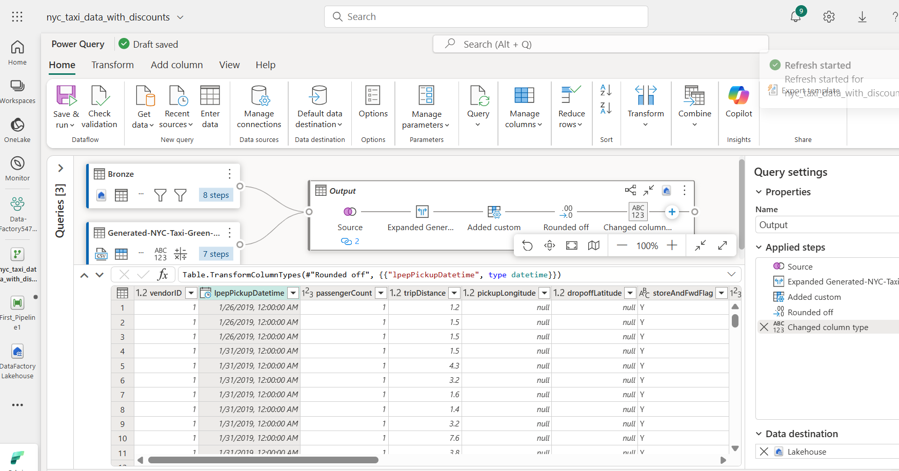

# 사용 사례 02: 데이터 플로우 및 데이터 파이프라인을 활용한 데이터 이동 및 변환을 위한 Data Factory 솔루션

**소개**

이 실습에서는 단계별 안내를 통해 완전한 데이터 통합 시나리오를 1시간
안에 수행하며, Microsoft Fabric의 Data Factory를 빠르고 효과적으로
평가할 수 있도록 돕습니다. 튜토리얼을 마치면 Data Factory의 핵심 기능과
가치를 이해하고, 일반적인 엔드투엔드 데이터 통합 시나리오를 직접 완성할
수 있게 됩니다.

**목표**

이 실습은 세 가지 연습(exercises)으로 구성되어 있습니다:

- **연습1:** Data Factory를 사용해 파이프라인을 생성하고 Blob
  스토리지에서 데이터 레이크하우스의 브론즈 테이블로 원시 데이터를
  수집합니다.

- **연습2:** Data Factory의 데이터 플로우를 사용하여 Bronze 테이블의
  원시 데이터를 변환하고, 이를 Data Lakehouse의 Gold 테이블로
  이동시킵니다.

- **연습3:** Data Factory에서 모든 작업이 완료되면 이메일로 알림을
  보내는 자동화 프로세스를 설정하고, 전체 플로우를 일정 주기로
  실행되도록 구성합니다.

# 연습 1: Data Factory로 파이프라인 생성하기

## 연습 1: 작업 영역 만들기

Fabric에서 데이터 작업을 시작하기 전에, Fabric 평가판이 활성화된 작업
영역을 생성해야 합니다.

1.  브라우저를 열고 주소창에 다음 URL을 입력하거나 붙여넣은
    뒤 **Enter** 키를 누르세요: +++https://app.fabric.microsoft.com/+++.

> **참고**: Microsoft Fabric 홈 페이지로 바로 이동한 경우, 2번부터 4번
> 단계는 건너뛰어도 됩니다.
>
> 

2.  **Microsoft Fabric** 창에서 자격 증명을 입력한 후 **Submit** 버튼을
    클릭하세요.

> 

3.  이후 **Microsoft** 창에서 비밀번호를 입력한 뒤 **Sign in** 버튼을
    클릭하세요**.**

> 

4.  **Stay signed in?** 창이 표시되면 **Yes** 버튼을 클릭하세요.

> 
>
> 

5.  Microsoft **Fabric Home Page**에서 **New workspace**를 선택하세요.

> 

6.  **Create a workspace** 탭에서 다음 정보를 입력한 후 **Apply** 을
    클릭하세요.

    |   |   |
    |-----|----|
    |Name	| Data-FactoryXXXX (XXXX는 고유 번호로 지정 가능) |
    |Advanced|	License mode에서Fabric capacity 선택|
    |Default storage format|	Small semantic model storage format|

> 
>
> 

7.  배포가 완료될 때까지 기다려 주세요. 약 2~3분 정도 소요됩니다.

> 

## 작업 2: Lakehouse 생성 및 샘플 데이터 적재

1.  **Data-FactoryXX** 작업 영역 페이지에서 **+New item**  버튼을
    클릭하세요.

> 

2.  "**Lakehouse**" 타일을 클릭하세요.

> 

3.  **New lakehouse** 대화 상자에서**Name** 필드에
    +++**DataFactoryLakehouse+++**를 입력하고 **Create** 버튼을 클릭한
    후, 새로운 레이크하우스를 여세요.

> 
>
> 

4.  **Lakehouse** 홈 페이지에서 **Start with sample data** 를 선택하여
    Copy sample data를 여세요.

> 

5.  **Use a sample** 대화 상자가 표시되면 **NYCTaxi** 샘플 데이터 타일을
    선택하세요.

> 
>
> 
>
> 

6.  테이블 이름을 변경하려면, 편집기 위에
    있는 **green_tripdata_2022** 탭을 마우스 오른쪽 버튼으로 클릭한
    후 **Rename**을 선택하세요.

7.  **Rename** 대화 상자의 **Name** 필드에 **+++Bronze+++** 를 입력해
    **table** 이름을 변경한 후, **Rename** 버튼을 클릭하세요.

**연습 2: Data Factory의 데이터 플로우로 데이터 변환하기**

## 작업1: Lakehouse테이블에서 데이터 가져오기

1.  왼쪽 탐색 창에서[**Data
    Factory-@lab.LabInstance.Id**](mailto:Data%20Factory-@lab.LabInstance.Id) 작업
    영역을 클릭하세요.

2.  탐색 모음에서 **+New item** 버튼을 클릭하여 새로운 **Dataflow
    Gen2**를 생성하세요. 목록에서**Dataflow Gen2** 항목을 선택하세요.

> 

3.  New Dataflow Gen2 Name으로 **+++nyc_taxi_data_with_discounts+++**를
    입력한 후 **Create**을 선택하세요.

4.  새로운 dataflow 메뉴에서 **Power Query** 창의 **Get data 드롭다운**
    메뉴를 클릭한 후, More...을 선택하세요.

> 

5.  **Choose data source** 탭의 검색 상자에+++**Lakehouse+++**를 입력한
    후, **Lakehouse** 커넥터를 클릭하세요.

> 

6.  The **Connect to data source** 대화 상자가 나타나고, 현재 로그인한
    사용자를 기준으로 새 연결이 자동으로 생성됩니다. **Next**를
    선택하세요.

> 

7.  **Choose data** 대화 상자가 표시됩니다. 탐색 창에서**workspace-
    Data-FactoryXX**를 찾아 확장한 후, 이전 모듈에서 생성한
    **Lakehouse** - **DataFactoryLakehouse** 를 확장하세요.
    목록에서 **Bronze** 테이블을 선택한 후**Create** 버튼을 클릭하세요.

8.  이제 캔버스에 데이터가 표시되는 것을 확인할 수 있습니다.

## 작업2: Lakehouse에서 가져온 데이터 변환하기

1.  두 번째 열 **IpepPickupDatetime**의 열 머리글에 있는 데이터 유형
    아이콘을 선택해 드롭다운 메뉴를 표시 합니다. 메뉴에서 데이터 유형을
    선택해 열을 **Date/Time** 에서 **Date** 유형으로 변환하세요.

2.  리본 메뉴의 **Home** 탭에서 **Manage columns** 그룹 내 **Choose
    columns**을 선택하세요.

3.  **Choose columns** 대화 상자에서 일부 열의 **선택을 해제**한
    후 **OK**를 선택하세요.

    - lpepDropoffDatetime

    &nbsp;

    - DoLocationID

> 

4.  **storeAndFwdFlag**  열의 필터 및 드롭다운 메뉴를 선택하세요.
    ( **List may be incomplete**경고가 표시되면, 모든 데이터를 확인하기
    위해 **Load more** 선택)

5.  할인이 적용된 행만 표시되도록 '**Y'** 를 선택한 후, **OK**를
    선택하세요.

> 

6.  **Ipep_Pickup_Datetime** 열의 정렬 및 필터 드롭다운 메뉴를 선택한
    뒤, **Date filters**를 선택하고 **Between...** 필터(Date 및Date/Time
    유형)를 선택하세요.

7.  **Filter rows** 대화 상자에서 날짜를 **January 1, 2022**부터
    **January 31, 2022**까지로 선택한 후 **OK**를 클릭하세요.

> 

## 작업3: 할인 데이터가 포함된 CSV 파일 연결하기

이제 trips 데이터가 준비되었으므로, 각 날짜와 **VendorID**별로 적용된
할인 정보를 포함한 데이터를 불러와서, trips 데이터와 결합하기 전에 이를
준비합니다.

1.  Dataflow 편집기 메뉴의 **Home** 탭에서 **Get data** 옵션을 선택한
    후, **Text/CSV**를 선택하세요.

> 

2.  **Connect to data source** 창에서 **Connection settings** 아래의
    **Link to file** 라디오 버튼을 선택하세요. 그 후, 다음 URL을
    입력하세요:
    +++https://raw.githubusercontent.com/ekote/azure-architect/master/Generated-NYC-Taxi-Green-Discounts.csv+++
    . Connection name 에는 +++**dfconnection**+++를 입력하고,
    **authentication** **kind** 가 **Anonymous**로 설정되어 있는지
    확인하세요. 모두 완료되면 **Next** 버튼을 클릭하세요.

3.  **Preview file data** 대화 상자에서 **Create**를 선택하세요.

## 작업4: 할인 데이터 변환하기

1.  데이터를 검토하면, 열 제목(headers)이 첫 번째 행에 있는 것을 확인할
    수 있습니다. 미리 보기 그리드의 왼쪽 상단에 있는 테이블 컨텍스트
    메뉴를 클릭한 후  **Use first row as headers**를 선택하여 첫 번째
    행을 열 제목으로 지정하세요.

> 
>
> ***참고:** 헤더를 승격한 후, 데이터 플로우 편집기 상단의 **Applied
> steps** 창에서 새 단계가 추가된 것을 확인할 수 있으며, 이를 통해 각
> 열의 데이터 유형이 설정됩니다.*
>
> 

2.  **VendorID** 열을 마우스 오른쪽 버튼으로 클릭한 후, 표시된 컨텍스트
    메뉴에서 **Unpivot other columns** 옵션을 선택하세요. 이 기능을
    사용하면 열을 행으로 변환해 각 열이 속성-값(attribute-value) 쌍으로
    나타나도록 데이터 구조를 변경할 수 있습니다.

3.  테이블의 열을 행으로 변환한 후, **Attribute** 및**Value** 열을 두 번
    클릭해 이름을
    변경하세요. **Attribute** 는 +++**Date+++**로, **Value**는 +++**Discount+++**로
    변경하세요.

4.  **Date** 열의 데이터 유형을 변경하려면, 열 이름 왼쪽에 있는 데이터
    유형 메뉴를 클릭하고 **Date**를 선택하세요.

> 

5.  **Discount** 열을 선택한 후, 메뉴에서 **Transform** 탭을
    클릭하세요. **Number column**을 선택하고, 하위
    메뉴에서 **Standard** 숫자 변환을 선택하고, **Divide**를 클릭하세요.

> 

6.  **Divide** 대화 상자에서 값으로 +++100+++을 입력한 후, **OK** 버튼을
    클릭하세요.

**작업 7: Trips 및 discounts 데이터 결합**

다음 단계는 두 테이블을 하나의 테이블로 결합하여 trips에 적용해야 하는
할인과 조정된 합계를 포함하도록 하는 것입니다.

1.  먼저, **Diagram view** 버튼을 토글해 두 쿼리를 모두 볼 수 있도록
    합니다.

2.  **Bronze** 쿼리를 선택한 후, **Home** 탭에서 **Combine** 메뉴를
    클릭하고**Merge queries**, 이어서 **Merge queries as new**를
    선택하세요.

3.  **Merge** 대화 상자에서 **Right table for merge** 드롭다운에서
    **Generated-NYC-Taxi-Green-Discounts**를 선택한 후, 대화 상자 오른쪽
    상단의 "**light bulb**" 아이콘을 클릭하여 세 테이블 간의 권장 열
    매핑을 확인하세요.

4.  권장된 두 개의 열 매핑을 하나씩 선택하여, 두
    테이블의 **VendorID**와 **VendorID** 열을 각각 매핑합니다. 두 매핑이
    모두 추가되면, 각 테이블에서 일치하는 열 제목이 강조 표시됩니다.

> 

5.  결과를 확인하기 위해 서로 다른 데이터 출처의 데이터를 결합하도록
    허용할 것인지 묻는 메시지가 표시됩니다. **OK**를 선택하세요. 

> 

6.  테이블 영역에서 처음에는 다음과 같은 경고가 표시됩니다: "The
    evaluation was canceled because combining data from multiple sources
    may reveal data from one source to another. Select continue if the
    possibility of revealing data is okay." **Continue** 를 선택해
    결합된 데이터를 표시합니다.

> 

7.  Privacy Levels 대화 상자에서**Ignore Privacy Levels checks for this
    document. Ignoring privacy Levels could expose sensitive or
    confidential data to an unauthorized person** 체크박스를 선택한 후,
    **Save** 버튼을 클릭하세요.

> 
>
> 

8.  Notice how a new query was created in Diagram 뷰에서 새로 생성된
    쿼리가 이전에 만든 두 쿼리와 결합(Merge) 관계를 보여주는 것을 확인할
    수 있습니다. 편집기의 테이블 창에서 Merge 쿼리 열 목록 오른쪽으로
    스크롤하면 테이블 값이 있는 새 열이 표시됩니다. 이 열이 "Generated
    NYC Taxi-Green-Discounts"이며, 데이터 유형은 **\[Table\]**입니다.

열 머리글에는 서로 반대 방향을 가리키는 두 개의 화살표 아이콘이 있으며,
이를 통해 테이블에서 선택할 열을 지정할 수 있습니다. **Discount**를
제외한 모든 열의 선택을 해제한 후**OK**를 클릭하세요.

9.  이제 할인 값이 행 수준(Row level)에 적용되었으므로, 할인 적용 후
    총액을 계산하는 새 열을 생성할 수 있습니다. 이를 위해 편집기
    상단의 **Add column** 탭을 선택하고,  **General** 그룹에서 **Custom
    column**을 선택하세요.

> 

10. **Custom column** 대화 상자에서, 새 열의 계산 방법을 정의하기 위해
    [Power Query 수식
    언어(M)](https://learn.microsoft.com/en-us/powerquery-m) 를 사용할
    수 있습니다. **New column name** 에 +++**TotalAfterDiscount+++**를
    입력하세요. **Data type**은 **Currency**를 선택하세요. **Custom
    column formula**에는 M 수식을 입력하세요 :

+++if [total_amount] > 0 then [total_amount] * ( 1 -[Discount] ) else [total_amount]+++

그 후, **OK**를 클릭하세요.

11. 새로 생성된 **TotalAfterDiscount** 열을 선택한 후, 편집기
    상단의 **Transform** 탭을 클릭하세요. **Number
    column** 그룹에서 **Rounding** 드롭다운을 선택한 후 **Round...**를
    선택하세요.

**참고**: **rounding** 옵션을 찾을 수 없는 경우 메뉴를 확장해

**Number column**을 확인하세요.

12.  **Round** 대화 상자에서 소수 자릿수를
    **2**로 입력한 후**OK**를 클릭하세요.
      

13. **IpepPickupDatetime** 열의 데이터 유형을**Date**에서
    **Date/Time**으로 변경하세요.

14. 마지막으로, 편집기 오른쪽에 있는 **Query settings** 창이 펼쳐져 있지
    않다면 확장한 후, 쿼리 이름을 **Merge**에서 **+++Output+++**로
    변경하세요.

**작업 8: 출력 쿼리를 Lakehouse의 테이블로 로드하기**

출력 쿼리가 완전히 준비되고 데이터를 내보낼 준비가 되면, 쿼리의 출력
대상을 설정할 수 있습니다.

1.  이전에 생성한 **Output** merge쿼리를 선택한 후, **+ icon**을
    클릭하여 Dataflow에 **data destination**을 추가하세요.

2.  데이터 대상 목록에서 New destination 아래의 **Lakehouse**을
    선택하세요.

3.  **Connect to data destination** 대화 상자에서 연결이 이미 선택되어
    있는지 확인한 후, **Next**를 클릭하여 계속 진행하세요.

4.  **Choose destination target** 대화 상자에서 대상 Lakehouse를 찾아
    선택한 후, 다시 **Next**를 클릭하세요.

5.  **Choose destination settings** 대화 상자에서,
    기본 **Replace** 업데이트 방법을 그대로 두고, 열이 올바르게
    매핑되었는지 다시 확인한 후, **Save settings**을 선택하세요.

6.  편집기 메인 창으로 돌아가 **Query settings** 창에서
    **Output** 테이블의 출력 대상이 **Lakehouse**로 표시되는지 확인한
    후, Home 탭에서 **Save and Run**을 선택하세요.

> 
>
> 

9.  이제 왼쪽 탐색 창에서 **Data Factory-XXXX workspace**을 클릭하세요.

> 

10. **Data_FactoryXX** 창에서 **DataFactoryLakehouse** 를 선택하여 새로
    로드된 테이블을 확인하세요.

11. **Output** 테이블이 표시되는지 확인하세요.

# 연습 3: Data Factory로 자동화 및 알림 전송하기

## 작업 1: 파이프라인에 Office 365 Outlook 활동 추가하기

1.  왼쪽 탐색 메뉴에서 **Data_FactoryXX** 작업 영역을 클릭하세요.

> 

2.  작업 영역 페이지에서 **+ New item** 옵션을 선택한 후, **Pipeline**을
    선택하세요.

> 

3.  Pipeline Name에 +++**First_Pipeline1+++**를 입력한 후, **Create**을
    선택하세요.

> 

4.  파이프라인 편집기에서**Home** 탭을 선택한 후, **Add to canvas**를
    찾아 선택하세요.

> 

5.  **Source** 탭에서 다음 설정을 입력한 후 **Test connection**을
    클릭하세요.

    |   |   |
    |-----|-----|
    |Connection	|dfconnection User-XXXX|
    |Connection Type|	HTTP 선택|
    |File format	|Delimited Text|

> 

6.  Destination 탭에 다음 설정을 입력하세요.

    |   |  |
    |----|----|
    |Connection|	Lakehouse|
    |Lakehouse|DataFactoryLakehouse 선택|
    |Root Folder|	Table 라디오 버튼 선택|
    |Table|	• New 선택하고, +++Generated-NYC-Taxi-Green-Discounts+++ 입력 후, Create 버튼 클릭|

> 

7.  리본에서 **Run**을 선택하세요.

> 

8.  **Save and run?** 대화 상자에서 **Save and run** 버튼을 클릭하세요.

> 
>
> 

9.  파이프라인 편집기에서 **Activities** 탭을 선택하고, **Office
    Outlook** 작업을 찾으세요.

> 

10. 파이프라인 캔버스에서 Copy 작업의 오른쪽 상단에 있는 On success
    경로(녹색 체크박스)를 선택하여 새로운 Office 365 Outlook 작업으로
    드래그하세요.

11. 파이프라인 캔버스에서 Office 365 Outlook 작업을 선택한 후, 캔버스
    아래의 속성 영역에서 **Settings** 탭을 선택하여 이메일을 구성하세요.
    그런 다음 **Sign in** 버튼을 클릭하세요.

> 

12. Power BI 을 선택한 후, **Allow access**를 클릭하여 권한을
    확인하세요.

> 

13. 파이프라인 캔버스에서 Office 365 Outlook 작업을 선택하고 캔버스
    아래의 속성 영역에 있는 **Settings** 탭에서 이메일을 구성하세요.

    - **To** 필드에 이메일 주소를 입력하세요. 여러 주소를 사용할
      경우, **;** 로 구분하세요.

    &nbsp;

    -  **Subject** 필드를 선택하면 **Add dynamic
      content** 옵션이 표시됩니다. 이를 선택하면 파이프라인
      식(Expression) 빌더 캔버스가 표시됩니다.
     

14. **Pipeline expression builder** 대화 상자가 표시됩니다. 다음
    식(expression)을 입력한 후 **OK**를 선택하세요:

   +++@concat('DI in an Hour Pipeline Succeeded with Pipeline Run Id', pipeline().RunId)+++
 
> 

15. **Body** 항목을 다시 선택한 후, 텍스트 영역 아래에 표시되는 **View
    in expression builder** 옵션을 선택하세요. 표시되는 **Pipeline
    expression builder** 대화 상자에 다음 식(expression)을 입력한 후,
    **OK**를 선택하세요:

+++@concat('RunID = ', pipeline().RunId, ' ; ', 'Copied rows ', activity('Copy data1').output.rowsCopied, ' ; ','Throughput ', activity('Copy data1').output.throughput)+++

> 
>
> 

**  참고: Copy data1**을 사용자의 파이프라인 복사 작업 이름으로
변경하세요.

16. 마지막으로, 파이프라인 편집기 상단의 **Home** 탭을
    선택하고 **Run**을 클릭하세요. 확인 대화 상자가 나타나면 **Save and
    run**을 다시 클릭해 작업을 실행하세요.

> 
>
> 
>
> 
>
> 

17. 파이프라인이 정상적으로 실행되면, 파이프라인에서 발송한 확인
    이메일을 확인하세요.

**작업 2: 파이프라인 실행 예약**

파이프라인 개발과 테스트를 마치면, 자동으로 실행되도록 예약할 수
있습니다.

1.  파이프라인 편집기 창의 **Home** 탭에서 **Schedule**을 선택하세요.

2.  필요에 맞게 실행 일정을 설정하세요. 예시에서는 파이프라인이 매일
    오후 8시에 실행되도록 하고, 연말까지 반복되도록 구성했습니다.

**작업 3: 파이프라인에 Dataflow 작업 추가하기**

1.  파이프라인 캔버스에서 **Copy activity**과 **Office 365 Outlook**
    작업을 연결하는 녹색 선 위로 마우스를 이동한 후, **+** 버튼을
    클릭하여 새 작업을 삽입하세요.

> 

2.  나타나는 메뉴에서 **Dataflow**를 선택하세요.

3.  새로 생성된 Dataflow 작업이 Copy 적업과 Office 365 Outlook
    작업 사이에 삽입되며 자동으로 선택되어, 속성 영역에 해당 속성이
    표시됩니다. 속성 영역에서 **Settings** 탭을 선택한 후, **Exercise 2:
    Transform data with a dataflow in Data Factory**에서 생성한 데이터
    플로우를 선택하세요.

4.  파이프라인 편집기 상단의 **Home** 탭을 선택하고 **Run**을
    클릭하세요. 이어 표시되는 확인 대화 상자에서 **Save and run**을
    선택해 작업을 실행하세요.

> 
>
> 

## 작업 4: 리소스 정리

개별 보고서, 파이프라인, 웨어하우스 및 기타 항목을 삭제하거나, 전체 작업
영역을 제거할 수 있습니다. 다음 단계에 따라 이번 튜토리얼에서 생성한
작업 영역을 삭제하세요.

1.  왼쪽 탐색 메뉴에서 **Data-FactoryXX** 작업 영역을 선택하세요. 작업
    영역 항목 뷰가 열립니다.

2.  작업 영역 페이지 오른쪽 상단에 있는 **Workspace settings** 옵션을
    선택하세요.

3.  **General 탭**을 선택한 후, **Remove this workspace**를 클릭하세요.

