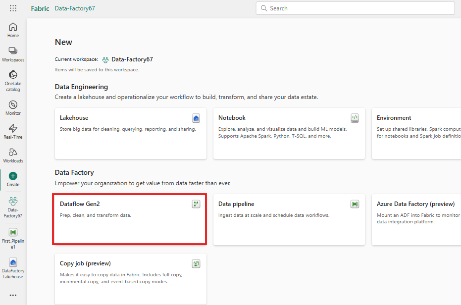
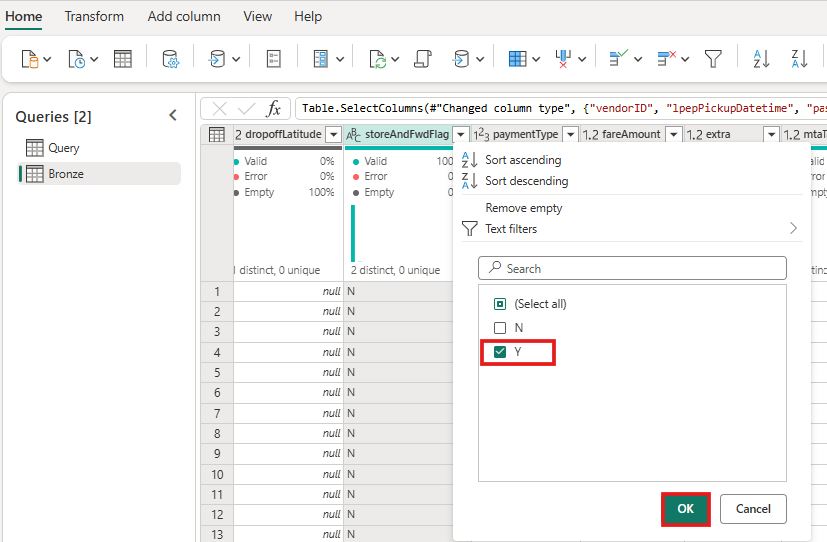
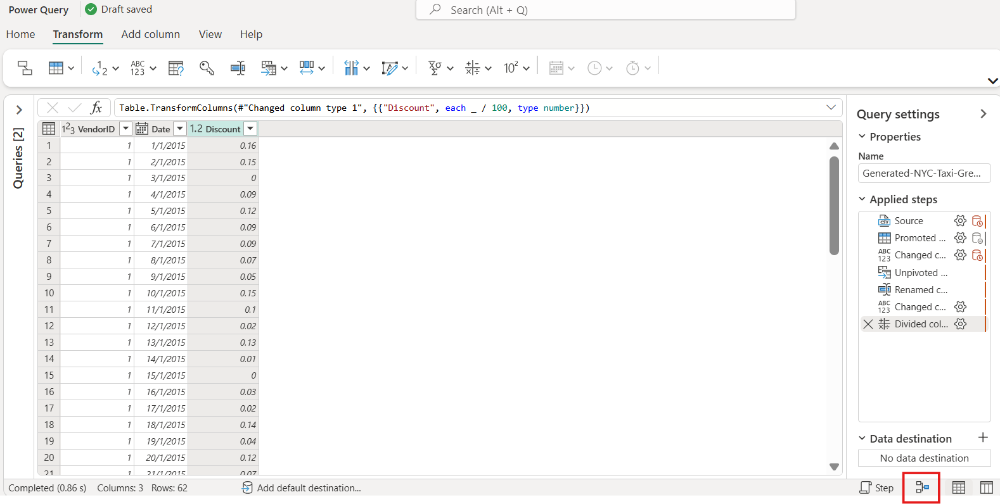
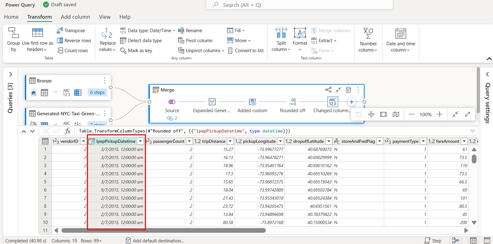
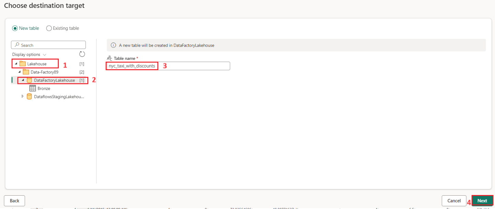
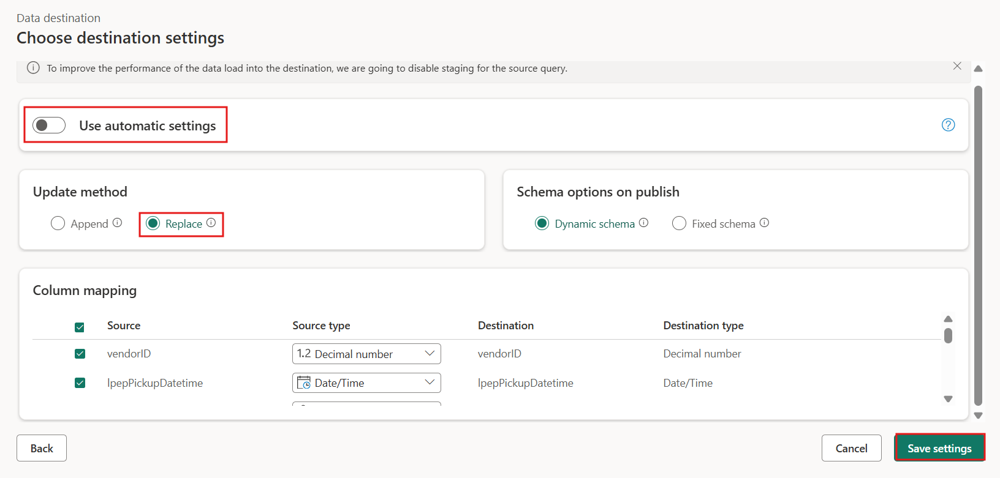
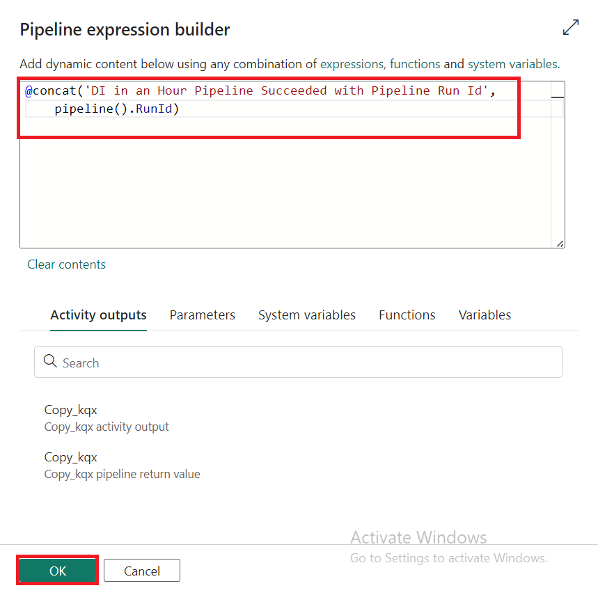

# 사용 사례 02: 데이터 흐름 및 데이터 파이프라인을 사용하여 데이터를 이동하고 변환하기 위한 Data Factory 솔루션

**소개**

이 실습은 1시간 이내에 전체 데이터 통합 시나리오에 대한 단계별 지침을
제공하여 Microsoft Fabric의 Data Factory에 대한 평가 프로세스를
가속화하는 데 도움이 됩니다. 이 자습서가 끝나면 Data Factory의 가치와
주요 기능을 이해하고 일반적인 엔드투엔드 데이터 통합 시나리오를 완료하는
방법을 알게 됩니다.

**목표**

실습은 세 가지 영역으로 나뉩니다:

- **연습 1:** Data Factory를 사용하여 파이프라인을 생성하여 Blob
  Storage에서 Data Lakehouse의 브론즈 테이블로 원시 데이터를 수집합니다.

- **연습 2:** Data Factory의 데이터 흐름을 사용하여 데이터를 변환하여
  Bronze 테이블의 원시 데이터를 처리하고 Data Lakehouse의 Gold 테이블로
  이동합니다.

- **연습 3:** Data Factory를 사용하여 알림을 자동화하고 보내 모든 작업이
  완료되면 알림을 보내는 이메일을 보내고, 마지막으로 전체 흐름이 예약된
  기준으로 실행되도록 설정합니다.

# 연습 1: Data Factory를 사용하여 파이프라인 생성하기

## 작업 1: 작업 영역 생성하기

Fabric에서 데이터를 사용하기 전에 Fabric 평가판을 사용하도록 설정된 작업
영역을 생성하세요.

1.  브라우저를 열고 주소 표시줄로 이동한 후 URL:
    +++https://app.fabric.microsoft.com/+++을 입력하거나 붙여넣고
    **Enter** 버튼을 누르세요.

> **참고**: Microsoft Fabric 홈페이지로 이동하면 \#2에서 \#4까지의
> 단계를 건너뛰세요.
>
> 

2.  **Microsoft Fabric** 창에서 자격 증명을 입력하고 **Submit** 버튼을
    클릭하세요.

> 

3.  **Microsoft** 창에서 비밀번호를 입력하고 **Sign in** 버튼을
    클릭하세요.

> 

4.  **Stay signed in?** 창에서 **Yes** 버튼을 클릭하세요.

> 
>
> 

5.  Microsoft **Fabric Home Page**에서 **New workspace** 옵션을
    선택하세요.

> 

6.  **Create a workspace** 탭에서 다음 세부 정보를 입력하고 **Apply**
    버튼을 클릭하세요.

[TABLE]

> 
>
> 

7.  배포가 완료될 때까지 기다리세요. 약 2-3분 정도 소요됩니다.

> 

## 작업 2: lakehouse를 생성하기

1.  **Data-FactoryXX** 작업 영역 페이지에서 이동하여 **+New item**
    버튼을 클릭하세요

2.  "**Lakehouse**" 타일을 클릭하세요

> 

3.  **New lakehouse** 대화
    상자에서 **Name** 필드에서 +++**DataFactoryLakehouse+++**를 입력하고
    새 lakehouse를 열고 **Create**버튼을 클릭하세요.

4.  왼쪽 탐색 창에서 **Data-FactoryXX**를 클릭하세요.

## 작업3: 데이터 파이프라인을 생성하기

1.  작업 영역 페이지에서 **+ New item** 옵션을 선택하세요.

> 

2.  새 플라이아웃 메뉴에서 **Data Pipeline**을 선택하세요.

3.  Pipeline Name을 +++**First_Pipeline1+++**로 입력하고 **Create**를
    선택하세요.

## 작업 4: 파이프라인에서 복사 작업을 사용하여 data Lakehouse에 샘플 데이터 로드

1.  **First_Pipeline1** 홈페이지에서copy assistant tool을 열려면 **Copy
    data assistant**를 선택하세요.

> 

2.  **Copy data** 대화 상자가 첫 단계에 표시되고 **Choose data
    source**가 강조 표시됩니다. **Sample data** 섹션을 선택하고 **NYC
    Taxi-Green** 데이터 소스 유형을 선택하세요. **Next**를 선택하세요.

3.  **Connect to data source**에서 **Next** 버튼을 클릭하세요.

4.  **OneLake catalog**를 선택하고 표시되는 데이터 대상 구성 페이지에서
    **Existing Lakehouse를** 선택하세요.

5.  **Select and map to folder path or table**에서 Lakehouse 대상의 세부
    정보를 구성하세요. **Root folder**에 대해 **Tables**을 선택하고
    테이블 이름을 +++**Bronze+++**로 입력하고 **Next**를 선택하세요.

6.  마지막으로 복사 데이터
    도우미의 **Review + save** 페이지에서 구성을 검토하세요. 이
    실습에서는 다음 단계에서 활동을 수동으로 실행하므로 **Start data
    transfer immediately** 확인란을 선택 취소하세요. **OK**를
    선택하세요.

## 작업 5: 복사 활동의 결과를 실행하고 보기

1.  파이프라인 편집기 창의 **Home** 탭에서 **Run** 버튼을 선택하여
    파이프라인 실행을 수동으로 트리거하세요.

2.  **Save and run?** 대화 상자에서 **Save and run** 버튼을 클릭하여
    이러한 활동을 실행하세요여. 이 활동은 약 12-13분이 소요됩니다.

> 
>
> 

3.  파이프라인 캔버스 아래의 **Output **탭에서 실행을 모니터링하고
    결과를 확인할 수 있습니다. 실행 세부 정보를 보려면 **활동 이름을**
    선택하세요.

4.  실행 세부 정보에는 읽고 쓴 76,513,115개의 행이 표시됩니다.

> 

5.  확장 **Duration breakdown** 섹션을 클릭하여 복사 활동의 각 단계의
    기간을 확인하세요. 복사 세부 정보를 검토한 후 Close를 선택하세요.

**연습 2: Data Factory의 데이터 흐름을 사용하여 데이터 변환**

## 작업 1: Lakehouse 테이블에서 데이터 가져오기

1.  **First_Pipeline1** 페이지의 사이드바에서 **Create**를 선택하세요.

2.  **New item** 페이지에서 새 dataflow gen2를 생성하려면 **Data
    Factory** 아래의 **Dataflow Gen2**를 클릭하세요**.** 

3.  새 Dataflow Gen2 이름을 +++**nyc_taxi_data_with_discounts+++**로
    입력하고 **Create**를 선택하세요.

4.  새 dataflow 메뉴의 **Power Query** 창에서 **Get data drop down**을
    클릭하고 **More...**를 선택하세요.

> 

5.  **Choose data source** 탭에서 검색 상자에 +++**Lakehouse+++**를
    입력하고 **Lakehouse** 커넥터를 클릭하세요.

> 

6.  **Connect to data source** 대화 상자가 나타나고 현재 로그인한
    사용자를 기반으로 새 연결이 자동으로 생성합니다. **Next**를
    선택하세요.

> 

7.  **Choose data** 대화 상자가 표시됩니다. 탐색 창을 사용하여
    **workspace- Data-FactoryXX**을 찾아 확장하세요. 이전 모듈에서
    대상에 대해 생성한 **Lakehouse - DataFactoryLakehouse**를 확장하고
    목록에서 **Bronze** 테이블을 선택한 후 **Create** 버튼을 클릭하세요.

8.  이제 캔버스가 데이터로 채워진 것을 볼 수 있습니다.

## 작업 2: Lakehouse에서 가져온 데이터 변환

1.  두 번째 열인 **IpepPickupDatetime**의 열 머리글에서 데이터 형식
    아이콘을 선택하여 드롭다운 메뉴를 표시하고 메뉴에서 데이터 형식을
    선택하여 열을 **Date/Time**에서 **Date** 형식으로 변환하세요.

2.  ribbon의 **Home** 탭에서 **Manage
    columns** 그룹에서 **Choose columns** 옵션을 선택하세요.

3.  **Choose columns** 대화 상자에서 여기에 나열된 일부 열을 **선택
    취소**한 후 **OK**을 선택하세요.

    - lpepDropoffDatetime

    &nbsp;

    - puLocationId

    &nbsp;

    - doLocationId

    &nbsp;

    - pickupLatitude

    &nbsp;

    - dropoffLongitude

    &nbsp;

    - rateCodeID

> 

4.  **storeAndFwdFlag** 열의 필터 및 정렬 드롭다운 메뉴를 선택하세요.
    (**List may be incomplete** 경고 고가 표시되면 **Load more**를
    선택하여 모든 데이터를 확인하세요.)

5.  **'Y'**를 선택하여 할인이 적용된 행만 표시한 후 OK을 선택하세요.

6.  **Ipep_Pickup_Datetime** 열 정렬 및 필터 드롭다운 메뉴를 선택한 후
    **Date filters**를 선택하고 **Between...** 날짜 및 날짜/시간 유형에
    대해 제공되는 필터입니다.

7.  **Filter rows** 대화 상자에서 **January 1, 2019**에서 **January 31,
    2019** 사이의 날짜를 선택하고 **OK**를 선택하세요.

> 

## 작업 3: 할인 데이터가 포함된 CSV 파일에 연결

이제 여행의 데이터가 준비되었으므로 각 날짜의 각 할인 및 VendorID가
포함된 데이터를 로드하고 여행 데이터와 결합하기 전에 데이터를 준비하려고
합니다.

1.  데이터 플로우 편집기 메뉴의 **Home** 탭에서**Get data **옵션을
    선택한 후 **Text/CSV**를 선택하세요.

> 

2.  **Connect to data source** 창의 **Connection settings**에서 **Link
    to file** 라디오 버튼을 선택하고 radio button, then enter
    +++https://raw.githubusercontent.com/ekote/azure-architect/master/Generated-NYC-Taxi-Green-Discounts.csv+++를
    입력하고**authentication** **kind**가 **Anonymous**으로 선택되었는지
    확인하세요. **Next** 버튼을 클릭하세요.

> 

3.  **Preview file data** 대화 상자에서 **Create**를 선택하세요.

## 작업 4: 할인 데이터 변환

1.  데이터를 검토하면 헤더가 첫 번째 행에 있는 것처럼 보입니다. 미리
    보기 그리드 영역의 왼쪽 위에 있는 테이블의 상황에 맞는 메뉴를
    선택하여 **Use first row as headers**을 선택하여 머리글로
    승격합니다.

> 
>
> ***참고:** 헤더를 승격한 후 데이터 흐름 편집기 맨 위에 있는 **Applied
> steps** 창에 열의 데이터 형식에 대한 새 단계가 추가된 것을 볼 수
> 있습니다.*
>
> 

2.  **VendorID** 열을 마우스 오른쪽 버튼으로 클릭하고 표시된 상황에 맞는
    메뉴에서 **Unpivot other columns** 옵션을 선택하세요. 이를 통해 열을
    속성-값 쌍으로 변환할 수 있으며, 여기서 열은 행이 됩니다.

3.  테이블이 피벗되지 않은 상태에서 **Attribute** 및 **Value** 열을 두
    번 클릭하고 **Attribute**를 +++**Date**+++로, **Value**를
    +++**Discount**+++로 변경하여 이름을 바꾸세요.

4.  열 이름 왼쪽에 있는 데이터 형식 메뉴를 선택하고 **Date**를 선택하여
    **Date**열의 데이터 형식을 변경하세요.

> 

5.  **Discount** 열을 선택한 후 메뉴에서 **Transform** 탭을 선택하세요.
    **Number** 열을 선택한 후 하위 메뉴에서 **Standard numeric** 변환을
    선택하고 **Divide**를 선택하세요.

> 

6.  **Divide **대화 상자에서 +++100+++ 값을 입력한 후 **OK** 버튼을
    클릭하세요.

**작업 7: 여행 및 할인 데이터 결합**

다음 단계는 두 테이블을 여행에 적용해야 하는 할인과 조정된 합계가 있는
단일 테이블로 결합하는 것입니다.

1.  먼저 **Diagram view** 버튼을 전환하여 두 쿼리를 모두 볼 수 있도록
    합니다.

2.  **Bronze** 쿼리를 선택하고 **Home** 탭에서 **Combine menu**를
    선택하고 **Merge queries**, **Merge queries as new**로 선택하세요.

3.  **Merge** 대화 상자의 **Right table for merge drop down**에서
    **Generated-NYC-Taxi-Green-Discounts** 드롭다운을 선택한 후 대화
    상자의 오른쪽 상단에 있는 "**light bulb**" 아이콘을 선택하여 세
    테이블 간의 열 매핑을 제안합니다.

4.  제안된 두 열 매핑을 한 번에 하나씩 선택하여 두 테이블의 VendorID 및
    날짜 열을 매핑합니다. 두 맵핑이 모두 추가되면 일치하는 열 머리글이
    각 테이블에서 강조 표시됩니다.

> 

5.  결과를 보기 위해 여러 데이터 소스의 데이터를 결합할 수 있도록
    허용하도록 요청하는 메시지가 표시됩니다. **OK**을 선택하세요.  

> 

6.  테이블 영역에는 처음에 "여러 소스의 데이터를 결합하면 한 소스의
    데이터가 다른 소스로 표시될 수 있으므로 평가가 취소되었습니다.
    데이터 공개 가능성이 괜찮으면 계속을 선택합니다." 결합된 데이터를
    표시하려면 **Continue**를 선택하세요.

> 

7.  Privacy Levels 대화 상자에서 **Ignore Privacy Levels checks for this
    document. Ignoring privacy Levels could expose sensitive or
    confidential data to an unauthorized person** 확인란을 선택하고
    **Save** 버튼을 클릭하세요.

> 
>
> 

8.  다이어그램 보기에서 새 쿼리가 어떻게 생성해졌는지 살펴보면 새 Merge
    쿼리와 이전에 생성한 두 쿼리의 관계가 표시됩니다. 편집기의 테이블
    창을 보고 쿼리 열 병합 목록의 오른쪽으로 스크롤하여 테이블 값이 있는
    새 열이 있는지 확인하세요. "Generated NYC Taxi-Green-Discounts"
    열이며 유형은 **\[Table\]**입니다.

열 머리글에는 반대 방향으로 가는 두 개의 화살표가 있는 아이콘이 있어
테이블에서 열을 선택할 수 있습니다. **Discount**을 제외한 모든 열을 선택
취소한 후 **OK**를 선택하세요.

9.  이제 행 수준에서 할인 값을 사용하여 새 열을 만들어 할인 후 총 금액을
    계산할 수 있습니다. 이렇게 하려면 편집기 상단의 **Add column** 탭을
    선택하고 **General** 그룹에서 **Custom column**을 선택하세요.

> 

10. **Custom column** 열 대화 상자에서 Power Query 수식 언어(M이라고도
    함)를 사용하여 새 열을 계산하는 방법을 정의할 수 있습니다. **New
    column name**에 +++**TotalAfterDiscount**+++를 입력하고, **Data
    type**에 대해 **Currency** 를 선택하고, **Custom column formula**에
    대해 다음 M 식을 제공하세요

> *+++if \[totalAmount\] \> 0 then \[totalAmount\] \* ( 1 -\[Discount\]
> ) else \[totalAmount\]+++*

**OK**를 선택하세요.

11. 새로 생성한 **TotalAfterDiscount** 열을 선택한 후 편집기 창 맨 위에
    있는 **Transform** 탭을 선택하세요. **Number column group**에서
    **Rounding** 드롭다운을 선택한 후 **Round**을 선택하세요**...**.

**참고**: **rounding** 옵션을 찾을 수 없는 경우 메뉴를 확장하여
**Number** 열을 확인하세요.

12. **Round** 대화상자에서 소수점 이하 자릿수로 **2**를 입력한 후
    **OK**를 선택하새요.

13. **IpepPickupDatetime**의 데이터 형식을 **Date**에서
    **Date/Time**으로 변경하세요.

14. 마지막으로, 아직 확장되지 않은 경우 편집기 오른쪽에서 **Query
    settings** 창을 확장하고 쿼리 이름을 **Merge** 에서 +++**Output**+++
    로 바꾸세요.

**작업 8: 출력 쿼리를 Lakehouse의 테이블에 로드하기**

이제 출력 쿼리가 완전히 준비되고 데이터를 출력할 준비가 되었으므로
쿼리의 출력 대상을 정의할 수 있습니다.

1.  이전에 생성한 **Output** 병합 쿼리를 선택하세요. **+ icon**을
    선택하여 이 데이터 흐름에 **data destination**을 추가하세요.

> 

2.  데이터 대상 목록에서 새 대상 아래의 Lakehouse 옵션을 선택하세요.

3.  **Connect to data destination** 대화 상자에서 연결이 이미 선택되어
    있어야 합니다. 계속하려면 **Next**를 선택하세요.

4.  **Choose destination target** 대화 상자에서
    데이터를 로드하려는 레이크하우스로 이동하여 새 테이블의 이름을 +++
    **nyc_taxi_with_discounts+++**로 지정한 후, **Next**를 다시
    선택하세요.

5.  Choose destination settings 대화 상자에서 기본 **Replace** 업데이트
    방법을 그대로 두고 열이 올바르게 매핑되었는지 다시 확인한 후 **Save
    settings**을 선택하세요.

6.  주 편집기 창으로 돌아가서 **Output **테이블의 **Query** 설정 창에
    출력 대상이 **Lakehouse**로 표시되는지 확인한 후, 홈 탭에서 **Save
    and Run** 옵션을 선택하세요.

> 
>
> 
>
> 

7.  **Data_FactoryXX** 창에서 거기 로드된 새 테이블을 보려면
    **DataFactoryLakehouse**를 선택하세요.

# 연습 3: Data Factory를 사용하여 알림 자동화 및 보내기

## 작업 1: 파이프라인에 Office 365 Outlook 활동 추가

1.  왼쪽 탐색 메뉴에서 **Data_FactoryXX** 작업 영역을 탐색하고
    클릭하세요.

> 

2.  **Data_FactoryXX** 뷰에서 **First_Pipeline1**을 선택하세요.

> 

3.  파이프라인 편집기에서 **Activities **탭을 선택하고 **Office
    Outlook** 활동을 찾으세요.

> 

4.  성공 경로 발생(파이프라인 캔버스에 있는 활동의 오른쪽 위에 있는 녹색
    확인란)을 선택하여 복사 활동에서 새 Office 365 Outlook 활동으로
    끌어오세요.

5.  파이프라인 캔버스에서 Office 365 Outlook 활동을 선택한 후 캔버스
    아래 속성 영역의 **Settings** 탭을 선택하여 전자 메일을 구성하세요.
    **Sign in** 버튼을 클릭하세요.

6.  Power BI 조직 계정을 선택한 후 **Allow access**를 선택하여
    확인하세요.

7.  파이프라인 캔버스의 캔버스 아래 속성 영역에 있는 **Settings **
    탭에서 Office 365 Outlook 활동을 선택하여 전자 메일을 구성하세요.

    - **To** 섹션에 이메일 주소를 입력하세요. 여러 주소를 사용하려면
      **;** 그것들을 분리하기 위해.

    &nbsp;

    - **Subject**의 경우 **Add dynamic content** 옵션이 나타나도록
      필드를 선택한 후 선택하여 파이프라인 식 빌더 캔버스를 표시하세요.

8.  **Pipeline expression builder** 대화 상자가 나타납니다. 다음 식을
    입력한 후 **OK**을 선택하세요:

> *+++@concat('DI in an Hour Pipeline Succeeded with Pipeline Run Id',
> pipeline().RunId)+++*
>
> 

9.  **Body**의 경우 필드를 다시 선택하고 텍스트 영역 아래에 표시되면
    **View in expression builder** 옵션을 선택하세요. 표시되는
    **Pipeline expression builder** 대화 상자에서 다음 식을 다시 추가한
    후 **OK** 선택하세요:

> *+++@concat('RunID = ', pipeline().RunId, ' ; ', 'Copied rows ',
> activity('Copy data1').output.rowsCopied, ' ; ','Throughput ',
> activity('Copy data1').output.throughput)+++*
>
> 
>
> 

**  참고: Copy data1**을 사용자 고유의 파이프라인 복사 작업의 이름으로
바꾸세요.

10. 마지막으로 파이프라인 편집기 상단의 Home 탭을 선택하고 **Run**을
    선택하세요. 확인 대화 상자에서 **Save and run** 다시 선택하여 이러한
    활동을 실행하세요.

> 
>
> 

11. 파이프라인이 성공적으로 실행되면 이메일을 확인하여 파이프라인에서
    전송된 확인 이메일을 찾으세요.

**작업 2: 파이프라인 실행 예약하기**

파이프라인 개발 및 테스트를 마치면 파이프라인이 자동으로 실행되도록
예약할 수 있습니다.

1.  파이프라인 편집기 창의 **Home** 탭에서 **Schedule** 을 선택하세요.

2.  필요에 따라 일정을 구성하세요. 이 예제에서는 연말까지 매일 오후
    8:00에 실행되도록 파이프라인을 예약합니다.

**작업 3: 파이프라인에 데이터 흐름 활동 추가**

1.  파이프라인 캔버스에서 **Copy activity**과 **Office 365 Outlook**
    활동을 연결하는 녹색 선 위로 마우스를 가져간 후 **+** 버튼을
    선택하여 새 작업을 삽입하세요.

> 

2.  나타나는 메뉴에서 **Dataflow**를 선택하세요.

3.  새로 생성한 데이터 흐름 활동은 복사 활동과 Office 365 Outlook 활동
    사이에 삽입되고 자동으로 선택되어 캔버스 아래 영역에 해당 속성이
    표시됩니다. 속성 영역에서 Settings 탭을 선택한 후 **연습 2: Data
    Factory에서 데이터 흐름을 사용하여 데이터 변환**에서 생성한 데이터
    흐름을 선택하세요.

4.  파이프라인 편집기 상단의 **Home **탭을 선택하고 **Run**을
    선택하세요. 확인 대화 상자에서 **Save and run** 다시 선택하여 다음
    작업을 실행하세요.

## 작업 4: 리소스 정리하기

개별 보고서, 파이프라인, 웨어하우스 및 기타 항목을 삭제하거나 전체 작업
영역을 제거할 수 있습니다. 다음 단계에 따라 이 튜토리얼을 위해 생성한
작업 영역을 삭제합니다.

1.  왼쪽 탐색 메뉴에서 작업 영역인 **Data-FactoryXX**를 선택하세요.
    작업공간 항목 보기가 열립니다.

2.  오른쪽 상단 모서리에 있는 작업 영역 페이지에서 **Workspace
    settings** 옵션을 선택하세요.

3.  **General tab** 및 **Remove this workspace**를 선택하세요**.**

