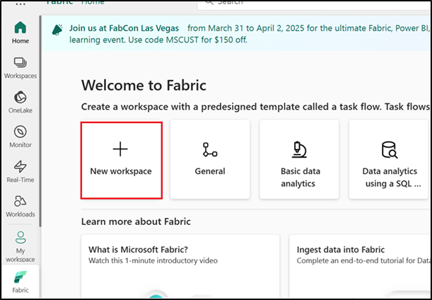
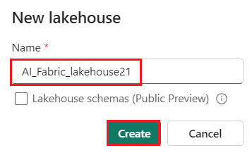

# 사용 사례 03 - Fabric Data Agent를 사용하여 데이터와 채팅하기

**소개:**

이 사용 사례에서는 구조화된 데이터 세트에 대한 자연어 쿼리를 가능하게
하는 Microsoft Fabric의 데이터 에이전트를 소개합니다. 대규모 언어
모델(LLM)을 활용하여 패브릭 데이터 에이전트는 일반 영어 질문을 해석하고
선택한 Lakehouse 데이터에 대해 실행되는 유효한 T-SQL 쿼리로 변환할 수
있습니다. 이 실습에서는 환경을 구성하고, Fabric 작업 영역을 설정하고,
데이터를 업로드하고, AI 기술을 사용하여 대화식으로 데이터와 상호
작용하는 프로세스를 안내합니다. 또한 쿼리 예제 제공, 정확도 향상을 위한
지침 추가, Fabric Notebook에서 프로그래밍 방식으로 AI 기술 호출과 같은
고급 기능을 살펴봅니다

**목표:**

- Fabric 작업 영역을 설정하고 Lakehouse에 데이터를 로드하기

- 자연어 쿼리를 활성화하도록 데이터 에이전트를 만들고 구성하기

- 일반 영어로 질문하고 AI가 생성한 SQL 쿼리 결과를 확인하기

- 사용자 지정 지침과 예제 쿼리를 사용하여 AI 응답을 향상시키기

- Fabric Notebook에서 프로그래밍 방식으로 데이터 에이전트를 사용하기

## **작업 0: 호스트 환경 시간 동기화**

1.  VM에서 **Search bar**을 탐색하여 클릭하고 **Settings**을 입력한 후
    **Best match** 항목에서 **Settings**을 클릭하세요.

> 

2.  Settings 창에서 **Time & language**로 이동하고 클릭하세요.


3.  **Time & language** 페이지에서 **Date & time**을 이동하여
    클릭하세요.


4.  아래로 스크롤하여 **Additional settings** 섹션으로 이동한 후 **Sync
    now** 버튼을 클릭하세요. 동기화하는 데 3-5분이 걸립니다.


5.  **Settings** 창을 닫으세요.


## **작업 1: Fabric 작업 영역 생성하기**

이 작업에서는 패브릭 작업 영역을 만듭니다. 작업 영역에는 Lakehouse,
데이터 흐름, Data Factory 파이프라인, Notebook, Power BI 데이터 세트 및
보고서를 포함하여 이 Lakehouse 자습서에 필요한 모든 항목이 포함되어
있습니다.

1.  브라우저를 열고 주소 표시줄로 이동한 후
    +++https://app.fabric.microsoft.com/++++ URL을 입력하거나 붙여넣은
    후 **Enter** 버튼을 누르세요.

> 

2.  **Microsoft Fabric** 창에서 자격 증명을 입력하고 **Submit** 버튼을
    클릭하세요.

> 

3.  **Microsoft** 창에서 비밀번호를 입력하고 **Sign in** 버튼을
    클릭하세요.

> 

4.  **Stay signed in?** 창에서 **Yes** 버튼을 클릭하세요.

> 

5.  Workspaces 창에서 **+New workspace**를 선택하세요.

> 

6.  In the 오른쪽에 표시되는 **Create a workspace** 창에서 다음 세부
    정보를 입력하고 **Apply** 버튼을 클릭하세요.

    |    |   |
    |----|----|
    |Name	|+++AI-Fabric-@lab.LabInstance.Id+++ (must be a unique Id) |
    |Advanced	|Under License mode, select Fabric capacity|
    |Default storage format	|Small dataset storage format|

> 
>
> 

7.  배포가 완료될 때까지 기다리세요. 완료하는 데 2-3분이 소요됩니다.

> 

## **작업 2: lakehouse를 생성하기**

1.  **Fabric** **Home** 페이지에서 **+New item**을
    선택하고 **Lakehouse** 타일을 선택하세요.

> 

2.  **New lakehouse** 대화 상자에서 **Name** 필드에
    +++**AI_Fabric_lakehouseXX**+++를 입력하고 **Create** 버튼을
    클릭하고 새 lakehouse를 여세요.

> **참고**: **AI_Fabric_lakehouseXX**하기 전에 공간을 제거해야 합니다.
>
> 

3.  **Successfully created SQL endpoint**라는 알림이 표시됩니다.

> 


4.  다음으로, 테이블을 쿼리할 새 Notebook을 생성하세요.
    **Home** ribbon에서, **Open notebook**에 대한 드롭다운을 선택하고
    **New notebook**을 선택하세요**.**


## 작업 3: AdventureWorksDW 데이터를 lakehouse에 업로드

먼저 Lakehouse를 생성하고 필요한 데이터로 채웁니다.

웨어하우스 또는 Lakehouse에 AdventureWorksDW 인스턴스가 이미 있는 경우
이 단계를 건너뛸 수 있습니다. 그렇지 않은 경우 Notebook에서 Lakehouse를
생성합니다. Notebook을 사용하여 Lakehouse를 데이터로 채웁니다.

1.  쿼리 편집기에서 다음 코드를 복사하여 붙여넣으세요. **Run
    all **버튼을 선택하여 쿼리를 실행하세요. 쿼리가 완료되면 결과가
    표시됩니다.

    ```
    import pandas as pd
    from tqdm.auto import tqdm
    base = "https://synapseaisolutionsa.z13.web.core.windows.net/data/AdventureWorks"
    
    # load list of tables
    df_tables = pd.read_csv(f"{base}/adventureworks.csv", names=["table"])
    
    for table in (pbar := tqdm(df_tables['table'].values)):
        pbar.set_description(f"Uploading {table} to lakehouse")
    
        # download
        df = pd.read_parquet(f"{base}/{table}.parquet")
    
        # save as lakehouse table
        spark.createDataFrame(df).write.mode('overwrite').saveAsTable(table)
    ```
> 
>
> 
>
> 

몇 분 후 Lakehouse에 필요한 데이터가 채워집니다.

## 작업 4: 데이터 에이전트 생성하기

1.  이제 왼쪽 탐색 창에서 **AI-Fabric-XXXX**를 클릭하세요.


1.  **Fabric** 홈페이지에서 **+New item**을 선택하세요**.**


2.  **Filter by item type** 검색 상자에서 **+++data agent+++**를
    입력하고 **Data agent**를 선택하세요

3.  Data agent name을 **+++AI-agent+++**로 입력하고 **Create**를
    선택하세요.


4.  AI-agent 페이지에서 **Add a data source**를 선택하세요


5.  **OneLake catalog** 탭에서 **AI-Fabric_lakehouse lakehouse**를
    선택하고 **Add**를 선택하세요.


2.  그런 다음 AI 스킬에 사용 가능한 액세스 권한을 부여할 테이블을
    선택해야 합니다.

이 실습에서는 다음 테이블을 사용합니다:

- DimCustomer

- DimDate

- DimGeography

- DimProduct

- DimProductCategory

- DimPromotion

- DimReseller

- DimSalesTerritory

- FactInternetSales

- FactResellerSales

> 

## 작업 5: 지침 제공

1.  나열된 테이블로 질문을 처음 하면 **factinternetsales**를 선택하면
    데이터 에이전트가 상당히 잘 답변합니다..

2.  예를 들어, **+++ What is the most sold product?+++**,:

> 
>
> 

3.  모든 질문 및 SQL 쿼리를 복사하여 메모장에 붙여넣은 후 메모장을
    저장하여 다음 작업에서 정보를 사용하세요.


4.  **FactResellerSales**를 선택하고 다음 텍스트를 입력한 후 아래
    이미지와 같이 Submit icon을 클릭하세요.

**+++What is our most sold product?+++**


쿼리를 계속 실험하면서 더 많은 지침을 추가해야 합니다.

5.  **dimcustomer**를 선택하고 다음 텍스트를 입력하고 **Submit icon**을
    클릭하세요

+++**how many active customers did we have June 1st, 2013?**+++


> 

6.  모든 질문 및 SQL 쿼리를 복사하여 메모장에 붙여넣은 다음 메모장을
    저장하여 다음 작업에서 정보를 사용하세요.

7.  **dimdate,** **FactInternetSales**를 선택하고 다음 텍스트를 입력하고
    **Submit icon**을 클릭하세요

+++**what are the monthly sales trends for the last year?**+++


> 

6.  **dimproduct,** **FactInternetSales**를 선택하고 다음 텍스트를
    입력하고 **Submit icon**을 클릭하세요

+++**which product category had the highest average sales price?**+++

> 
>
> 

문제의 일부는 "활성 고객"에 공식적인 정의가 없다는 것입니다. 모델 텍스트
상자에 대한 메모의 추가 지침이 도움이 될 수 있지만 사용자는 이 질문을
자주 할 수 있습니다. AI가 질문을 올바르게 처리하는지 확인해야 합니다

7.  관련 쿼리는 적당히 복잡하므로 **Example queries** 번튼을 선택하여
    예제를 제공하세요.

> 

8.  Edit을 선택하세요

> 

8.  Example SQL queries 탭에서 **+Add example**를 선택하세요**.**

> 

9.  예제를 수동으로 추가할 수 있지만 JSON 파일에서 업로드할 수도
    있습니다. 파일에서 예제를 제공하는 것은 쿼리를 하나씩 수동으로
    업로드하는 대신 한 번에 업로드하려는 SQL 쿼리가 많을 때 유용합니다.


10.  메모장에 저장한 모든 쿼리와 SQL 쿼리를 추가한 후 'Download all as
    .json'를 클릭하세요.


## 작업 6: 프로그래밍 방식으로 데이터 에이전트 사용

지침과 예제가 모두 데이터 에이전트에 추가되었습니다. 테스트가 진행됨에
따라 더 많은 예제와 지침을 통해 AI 기술을 더욱 향상시킬 수 있습니다.
동료와 협력하여 그들이 묻고 싶은 질문의 종류를 다루는 예제와 지침을
제공했는지 확인하십시오.

Fabric Notebook 내에서 프로그래밍 방식으로 AI 기술을 사용할 수 있습니다.
AI 스킬에 게시된 URL 값이 있는지 여부를 확인합니다.

1.  Data agent Fabric 페이지의 **Home** ribbon에서 **Settings**을
    선택하세요.


2.  AI 기술을 게시하기 전에는 이 스크린샷과 같이 게시된 URL 값이
    없습니다.

3.  AI Skill 설정을 닫으세요.


4.  **Home** ribbon에서 **Publish**를 선택하세요.

> 
>
> 

9.  **View publishing details**을 클릭하세요

> 

5.  이 스크린샷과 같이 AI 에이전트에 대해 게시된 URL이 나타납니다.


6.  URL을 복사하여 메모장에 붙여넣은 후 메모장을 저장하여 향후 정보를
    사용하세요.

> 

7.  왼쪽 탐색 창에서 **Notebook1**을 선택하세요.

> 

10. U셀 출력 아래에 있는 + **Code** 아이콘을 사용하여 Notebook에 새 코드
    셀을 추가하고 다음 코드를 입력한 후 **URL**을 바꾸세요. ▷ **Run**
    버튼을 클릭하고 출력을 검토하세요.

+++%pip install "openai==1.70.0"+++

> 

11. U셀 출력 아래에 있는 + **Code** 아이콘을 사용하여 Notebook에 새 코드
    셀을 추가하고 다음 코드를 입력한 후 **URL**을 바꾸세요. ▷ **Run**
    버튼을 클릭하고 출력을 검토하세요.

> +++%pip install httpx==0.27.2+++
>
> 

8.  U셀 출력 아래에 있는 + **Code** 아이콘을 사용하여 Notebook에 새 코드
    셀을 추가하고 다음 코드를 입력한 후 **URL**을 바꾸세요. ▷ **Run**
    버튼을 클릭하고 출력을 검토하세요.

    ```
    import requests
    import json
    import pprint
    import typing as t
    import time
    import uuid
    
    from openai import OpenAI
    from openai._exceptions import APIStatusError
    from openai._models import FinalRequestOptions
    from openai._types import Omit
    from openai._utils import is_given
    from synapse.ml.mlflow import get_mlflow_env_config
    from sempy.fabric._token_provider import SynapseTokenProvider
     
    base_url = "https://<generic published base URL value>"
    question = "What datasources do you have access to?"
    
    configs = get_mlflow_env_config()
    
    # Create OpenAI Client
    class FabricOpenAI(OpenAI):
        def __init__(
            self,
            api_version: str ="2024-05-01-preview",
            **kwargs: t.Any,
        ) -> None:
            self.api_version = api_version
            default_query = kwargs.pop("default_query", {})
            default_query["api-version"] = self.api_version
            super().__init__(
                api_key="",
                base_url=base_url,
                default_query=default_query,
                **kwargs,
            )
        
        def _prepare_options(self, options: FinalRequestOptions) -> None:
            headers: dict[str, str | Omit] = (
                {**options.headers} if is_given(options.headers) else {}
            )
            options.headers = headers
            headers["Authorization"] = f"Bearer {configs.driver_aad_token}"
            if "Accept" not in headers:
                headers["Accept"] = "application/json"
            if "ActivityId" not in headers:
                correlation_id = str(uuid.uuid4())
                headers["ActivityId"] = correlation_id
    
            return super()._prepare_options(options)
    
    # Pretty printing helper
    def pretty_print(messages):
        print("---Conversation---")
        for m in messages:
            print(f"{m.role}: {m.content[0].text.value}")
        print()
    
    fabric_client = FabricOpenAI()
    # Create assistant
    assistant = fabric_client.beta.assistants.create(model="not used")
    # Create thread
    thread = fabric_client.beta.threads.create()
    # Create message on thread
    message = fabric_client.beta.threads.messages.create(thread_id=thread.id, role="user", content=question)
    # Create run
    run = fabric_client.beta.threads.runs.create(thread_id=thread.id, assistant_id=assistant.id)
    
    # Wait for run to complete
    while run.status == "queued" or run.status == "in_progress":
        run = fabric_client.beta.threads.runs.retrieve(
            thread_id=thread.id,
            run_id=run.id,
        )
        print(run.status)
        time.sleep(2)
    
    # Print messages
    response = fabric_client.beta.threads.messages.list(thread_id=thread.id, order="asc")
    pretty_print(response)
    
    # Delete thread
    fabric_client.beta.threads.delete(thread_id=thread.id)
    ```
> 
>
> 

## 작업 7: 리소스 정리하기

1.  왼쪽 탐색 메뉴에서 작업 공간인 **AI-Fabric-XXXX**를 선택하세요.
    작업공간 항목 보기가 열립니다.

> 

2.  ... 작업 영역 이름 아래에 있는 옵션을 선택하고 **Workspace
    settings**을 선택하세요.

> 

3.  **Other** 및 **Remove this workspace**를 선택하세요**.**

> 

4.  팝 업되는 경고에서 **Delete 를** 클릭하세요.

> 
>
> 

**요약:**

이 실습에서는 Microsoft Fabric의 데이터 에이전트를 사용하여 대화형
분석의 기능을 활용하는 방법을 알아보았습니다. Fabric 작업 영역을
구성하고, 구조화된 데이터를 Lakehouse에 수집하고, 자연어 질문을 SQL
쿼리로 변환하는 AI 기술을 설정했습니다. 또한 쿼리 생성을 구체화하기 위한
지침과 예제를 제공하여 AI 에이전트의 기능을 향상시켰습니다. 마지막으로
Fabric Notebook에서 프로그래밍 방식으로 에이전트를 호출하여 end-to-end
AI 통합을 시연했습니다. 이 실습에서는 자연어 및 GenAI 기술을 통해
비즈니스 사용자가 엔터프라이즈 데이터에 더 쉽게 액세스하고, 유용하고,
지능적으로 만들 수 있도록 지원합니다.

