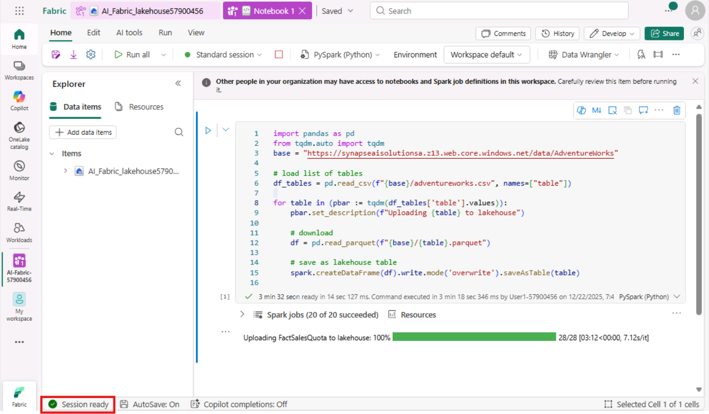
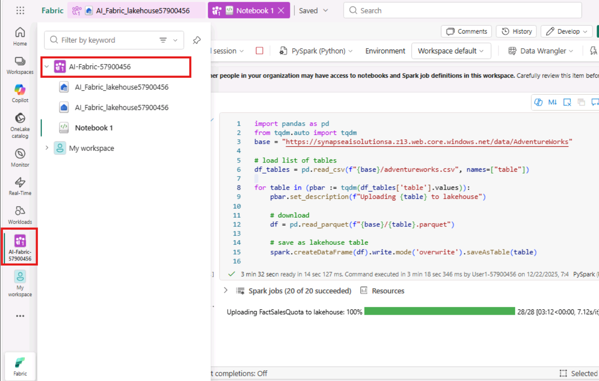
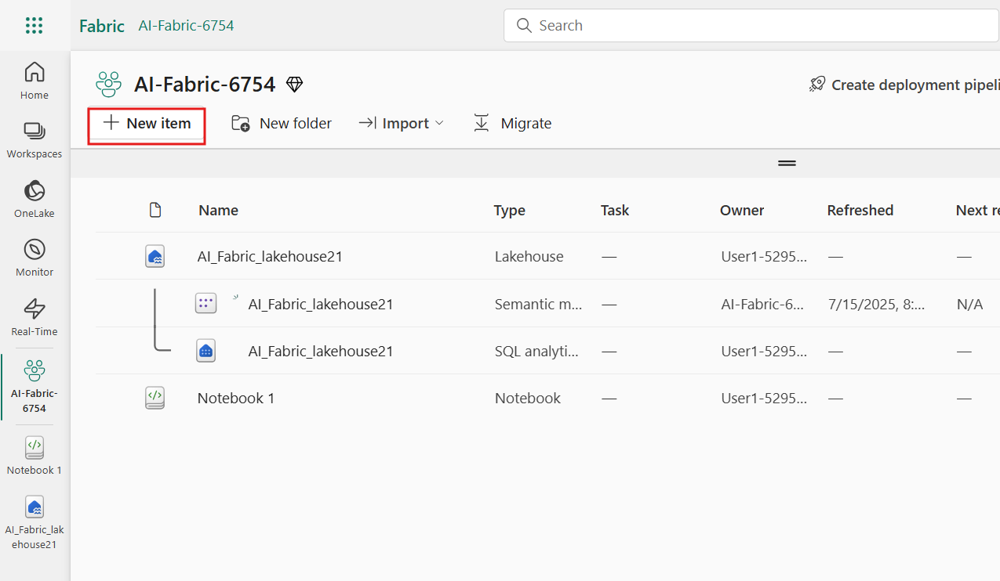
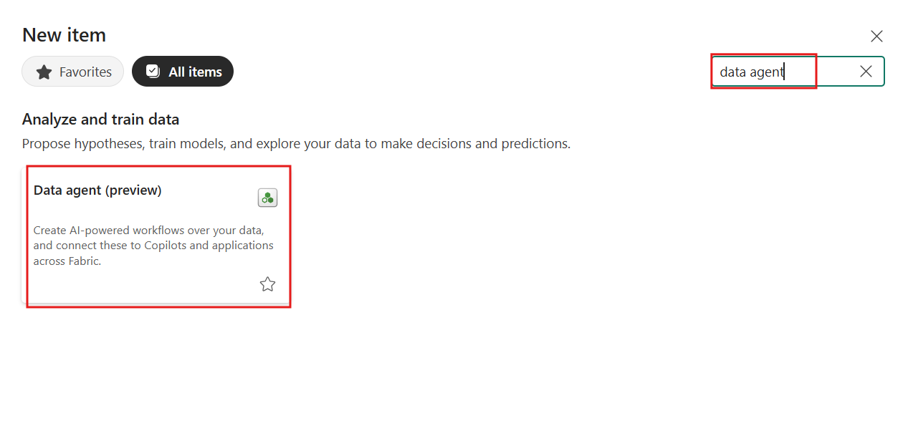
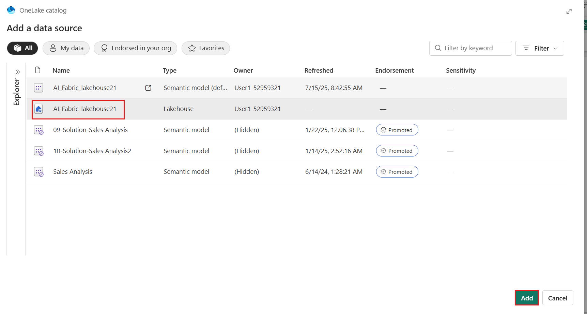
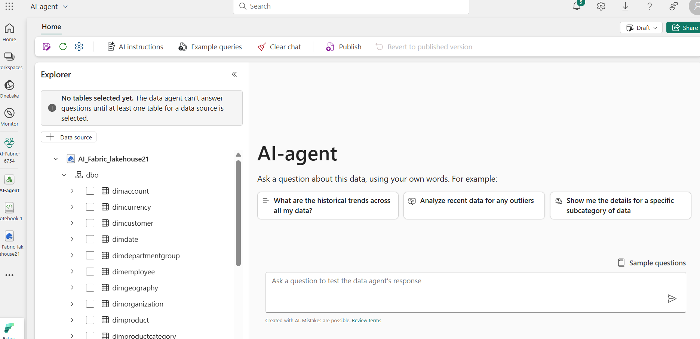
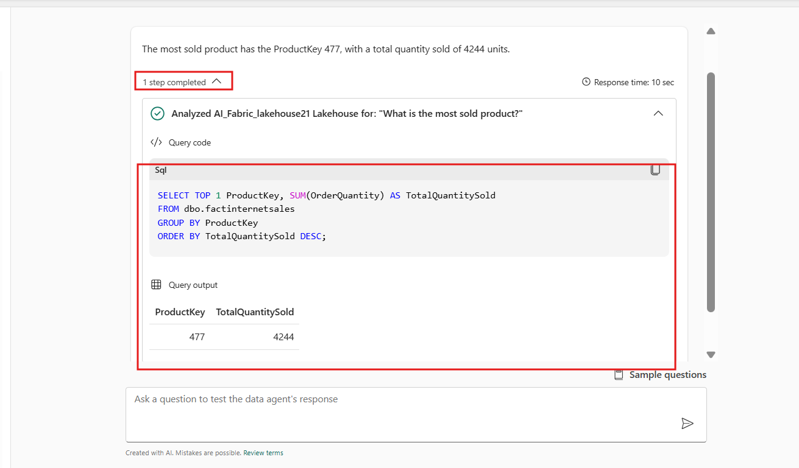
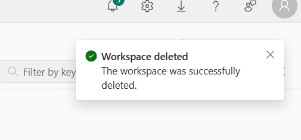

# ユースケース 03 - Fabric Data Agent を使用してデータとチャットする

**導入：**

このユースケースでは、Microsoft Fabric のData
Agentを紹介します。これにより、構造化データセットに対するnatural
languageクエリが可能になります。Fabric Data Agentは、large language
models (LLM) を活用することで、平易な英語の質問を解釈し、有効な T-SQL
クエリに変換して、選択したLakehouse
データに対して実行できます。このハンズ・オン演習では、環境の構成、Fabric
ワークスペースのセットアップ、データのアップロード、AI
スキルを使用した会話形式のデータ操作のプロセスをガイドします。また、クエリ例の提供、精度向上のための指示の追加、Fabric
ノートブックからのプログラムによる AI
スキルの呼び出しなどの高度な機能についても学習します。

**目的:**

- Fabric ワークスペースを設定し、Lakehouseにデータをロードします。

- Natural languageクエリを有効にするには、Data
  Agentを作成して構成します。

- 平易な英語で質問し、AI によって生成された SQL
  クエリの結果を表示します。

- カスタム指示とサンプルクエリを使用して、 AI 応答を強化します。

- Fabric ノートブックからプログラムで Data エージェントを使用します。

## **タスク0: ホスト環境の時刻を同期する**

1.  VM
    で**検索バー**に移動してクリックし、「**Settings**」と入力して、「**Best
    match**」の下の「**Settings**」をクリックします。

> 

2.  Settingsウィンドウで、「**Time &
    language**」に移動してクリックします。


3.  「**Time & language**」ページで、「**Date &
    time**」に移動してクリックします。


4.  下にスクロールして「**Additional
    settings**」セクションに移動し、「**Syn
    now**」ボタンをクリックします。同期には3～5分かかります。　


5.  **Settings**ウィンドウを閉じます。


## **タスク 1:Fabricワークスペースを作成する**

このタスクでは、Fabric
ワークスペースを作成します。ワークスペースには、Lakehouse、データフロー、Data
Factory パイプライン、ノートブック、Power BI
データセット、レポートなど、このLakehouse
チュートリアルに必要なすべてのアイテムが含まれています。

1.  ブラウザを開き、アドレスバーに移動して、次の URL
    を入力または貼り付けます: +++https://app.fabric.microsoft.com/+++。
    Enterボタンを押します。

> 

2.  Microsoft Fabric ウィンドウで資格情報を入力し、\[**Submit**\]
    ボタンをクリックします。

> 

3.  次に、**Microsoft** ウィンドウでパスワードを入力し、「**Sign
    in**」ボタンをクリックします。

> 

4.  「**Stay signed
    in?**」ウィンドウで、「**Yes**」ボタンをクリックします。

> 

5.  Workspacesペインで、**+New workspace**を選択します。

> 

6.  右側に表示される「**Create a
    workspace**」ペインで、次の詳細を入力し、「**Apply**」ボタンをクリックします。

    |    |   |
    |----|----|
    |Name	|+++AI-Fabric-@lab.LabInstance.Id+++ (must be a unique Id) |
    |Advanced	|Under License mode, select Fabric capacity|
    |Default storage format	|Small dataset storage format|

> 
>
> 

7.  デプロイが完了するまでお待ちください。完了まで1～2分かかります。

> 

## **タスク2: Lakehouseを作成する**

1.  **Fabric** **Home** ページで、**+New item** を選択し、**Lakehouse**
    タイルを選択します。

> 

2.  **New lakehouse** ダイアログボックスで、+++**AI_Fabric_lakehouseXX**+++
    を**Name** フィールドに入力し、**Create**ボタンをクリックして、新しいLakehouseを開きます。

> **注記**:
> **AI_Fabric_lakehouseXX**の前のスペースを必ず削除してください。
>
> 

3.  **Successfully created SQL endpoint**を示す、通知が表示されます。

> 


4.  次に、テーブルをクエリするための新しいノートブックを作成します。「**Home** 」リボンで、「**Open
    notebook** 」のドロップダウンを選択し、「**New
    notebook**」を選択します。


## **タスク3: AdventureWorksDWデータをLakehouseにアップロードする**

まず、Lakehouseを作成し、必要なデータを入力します。

WarehouseまたはLakehouseに既にAdventureWorksDWのインスタンスがある場合は、この手順をスキップできます。そうでない場合は、ノートブックからLakehouseを作成します。ノートブックを使用して、Lakehouseにデータを入力します。

1.  クエリエディタで、次のコードをコピーして貼り付けます。**Run
    all** ボタンをクリックしてクエリを実行します。クエリが完了すると、結果が表示されます。

    ```
    import pandas as pd
    from tqdm.auto import tqdm
    base = "https://synapseaisolutionsa.z13.web.core.windows.net/data/AdventureWorks"
    
    # load list of tables
    df_tables = pd.read_csv(f"{base}/adventureworks.csv", names=["table"])
    
    for table in (pbar := tqdm(df_tables['table'].values)):
        pbar.set_description(f"Uploading {table} to lakehouse")
    
        # download
        df = pd.read_parquet(f"{base}/{table}.parquet")
    
        # save as lakehouse table
        spark.createDataFrame(df).write.mode('overwrite').saveAsTable(table)
    ```

> 
>
> 
>
> 

数分後、Lakehouseに必要なデータが入力されます。

## **タスク4: データエージェントを作成する**

1.  次に、左側のナビゲーション ペインで AI-Fabric-XXXX
    をクリックします。



2.  Fabric ホームページで、**+New item**を選択します。



3.  \[**Filter by item type** \] 検索ボックスに「+++**data
    agent**+++」と入力し、**Data agent**を選択します。



4.  Data agent名として +++**AI-agent**+++ と入力し、\[**Create**\]
    を選択します。


5.  AI-agentページで、**Add a data source**を選択します。


6.  **OneLake catalog**タブで、**AI-Fabric_lakehouse**
    Lakehouseを選択し、\[**Add**\] を選択します。

> 
>
> 

1.  次に、AI
    スキルがアクセスできるようにするテーブルを選択する必要があります。

このラボでは次のテーブルを使用します。

- DimCustomer

- DimDate

- DimGeography

- DimProduct

- DimProductCategory

- DimPromotion

- DimReseller

- DimSalesTerritory

- FactInternetSales

- FactResellerSales

> 

## **タスク5: 指示を与える**

1.  リストされたテーブルで **factinternetsales**
    を選択して最初に質問すると、データ
    エージェントがそれらの質問にかなり適切に回答します。

2.  たとえば、「+++ **What is the most sold product?**
    +++」という質問の場合、




3.  質問と SQL
    クエリをコピーしてメモ帳に貼り付け、メモ帳を保存して、今後のタスクで情報を使用します。


4.  **FactResellerSales**を選択し、次のテキストを入力し、下の画像に示すように
    \[**Submit**\] アイコンをクリックします。

+++**What is our most sold product?**+++


クエリの実験を続ける場合は、さらに指示を追加する必要があります。

5.  dimcustomer
    を選択し、次のテキストを入力し、**Submit**アイコンをクリックします。

+++**How many active customers did we have on June 1st, 2013?**+++


7.  すべての質問と SQL
    クエリをコピーしてメモ帳に貼り付け、メモ帳を保存して、今後のタスクで情報を使用します。


8.  **dimdate、FactInternetSales**を選択してください、次のテキストを入力し、**Submit**アイコンをクリックします。

+++**what are the monthly sales trends for the last year?**+++


6.  **dimproduct FactInternetSales**
    を選択します。次のテキストを入力し、**Submit**アイコンをクリックします。

+++**which product category had the highest average sales price?**+++

> 
>
> 

問題の一部は、「active
customer」に正式な定義がないことです。モデルのテキストボックスの注釈に詳細な説明を追加すると役立つかもしれませんが、ユーザーからこの質問が頻繁に寄せられる可能性があります。AIがこの質問を正しく処理できるようにする必要があります。

7.  関連するクエリは中程度に複雑なので、\[**Setup**\] ペインから
    \[**Example queries**\] ボタンを選択して例を示します。

> 

8.  Example queriesタブで、\[**Add example**\] を選択します。

> 

9.  ここで、作成したLakehouseデータソースのサンプルクエリを追加する必要があります。質問フィールドに以下の質問を追加してください。

**+++What is the most sold product?+++**


10. メモ帳に保存したクエリ1を追加します。  
      
```      
SELECT TOP 1 ProductKey, SUM(OrderQuantity) AS TotalQuantitySold
FROM [dbo].[factinternetsales]
GROUP BY ProductKey
ORDER BY TotalQuantitySold DESC
```


11. 新しいクエリ フィールドを追加するには、\[**+Add**\]
    をクリックします。


12. 質問フィールドに 2 番目の質問を追加するには:

+++What are the monthly sales trends for the last year?+++


13. メモ帳に保存したクエリ3を追加します。  
      
	```      
	SELECT
	    d.CalendarYear,
	    d.MonthNumberOfYear,
	    d.EnglishMonthName,
	    SUM(f.SalesAmount) AS TotalSales
	FROM
	    dbo.factinternetsales f
	    INNER JOIN dbo.dimdate d ON f.OrderDateKey = d.DateKey
	WHERE
	    d.CalendarYear = (
	        SELECT MAX(CalendarYear)
	        FROM dbo.dimdate
	        WHERE DateKey IN (SELECT DISTINCT OrderDateKey FROM dbo.factinternetsales)
	    )
	GROUP BY
	    d.CalendarYear,
	    d.MonthNumberOfYear,
	    d.EnglishMonthName
	ORDER BY
	    d.MonthNumberOfYear
	```
> 

14. 新しいクエリ フィールドを追加するには、\[**+Add**\]
    をクリックします。


15. 質問フィールドに 3 番目の質問を追加するには:

+++Which product category has the highest average sales price?+++


16. メモ帳に保存したクエリ4を追加します。  
      
    **SELECT TOP 1**

```      
SELECT TOP 1
    dp.ProductSubcategoryKey AS ProductCategory,
    AVG(fis.UnitPrice) AS AverageSalesPrice
FROM
    dbo.factinternetsales fis
INNER JOIN
    dbo.dimproduct dp ON fis.ProductKey = dp.ProductKey
GROUP BY
    dp.ProductSubcategoryKey
ORDER BY
    AverageSalesPrice DESC
```


11. メモ帳に保存したすべてのクエリとSQLクエリを追加し、「**Export
    all**」をクリックします。


## **タスク6: Dataエージェントをプログラムで使用する**

Data agent
には、説明と例の両方が追加されました。テストが進むにつれて、より多くの例と説明を追加することで、AIスキルをさらに向上させることができます。同僚と協力して、彼らが尋ねたい質問の種類をカバーする例と説明を提供しているかどうかを確認してください。

AIスキルはFabricノートブック内でプログラム的に使用できます。AIスキルに公開されたURL値があるかどうかを判断します。

1.  Data agent
    Fabricページで、**Home** リボンから**Settings**を選択します。


2.  AI
    スキルを公開する前は、このスクリーンショットに示すように、公開された
    URL 値はありません。

3.  AIスキル設定を閉じます。


4.  **Home** リボンで、\[**Publish**\] を選択します。

> 
>
> 

9.  **View publishing details**をクリックします

> 

5.  このスクリーンショットに示すように、AI エージェントの公開された URL
    が表示されます。

6.  URL
    をコピーしてメモ帳に貼り付け、メモ帳を保存して、次の手順で情報を使用します。

> 

7.  左側のナビゲーションペインで**Notebook1**を選択します。。


10. セル出力の下にある「**+
    Code** 」アイコンを使用してノートブックに新しいコードセルを追加し、次のコードを入力して**▷
    Run** ボタンを押して出力を確認します

+++%pip install "openai==1.70.0"+++

> 
>
> 

11. セル出力の下にある「+
    Code」アイコンを使用してノートブックに新しいコードセルを追加し、次のコードを入力してURLを置き換えます。クリックします。**▷
    Run**ボタンを押して出力を確認します

> +++%pip インストール httpx==0.27.2+++
>
> 
>
> 

8.  セル出力の下にある「+
    Code」アイコンを使用してノートブックに新しいコードセルを追加し、次のコードを入力して**URL**を置き換えます。クリックします。**▷
    Run**ボタンを押して出力を確認します

```
import requests
import json
import pprint
import typing as t
import time
import uuid

from openai import OpenAI
from openai._exceptions import APIStatusError
from openai._models import FinalRequestOptions
from openai._types import Omit
from openai._utils import is_given
from synapse.ml.mlflow import get_mlflow_env_config
from sempy.fabric._token_provider import SynapseTokenProvider
 
base_url = "https://<generic published base URL value>"
question = "What datasources do you have access to?"

configs = get_mlflow_env_config()

# Create OpenAI Client
class FabricOpenAI(OpenAI):
    def __init__(
        self,
        api_version: str ="2024-05-01-preview",
        **kwargs: t.Any,
    ) -> None:
        self.api_version = api_version
        default_query = kwargs.pop("default_query", {})
        default_query["api-version"] = self.api_version
        super().__init__(
            api_key="",
            base_url=base_url,
            default_query=default_query,
            **kwargs,
        )
    
    def _prepare_options(self, options: FinalRequestOptions) -> None:
        headers: dict[str, str | Omit] = (
            {**options.headers} if is_given(options.headers) else {}
        )
        options.headers = headers
        headers["Authorization"] = f"Bearer {configs.driver_aad_token}"
        if "Accept" not in headers:
            headers["Accept"] = "application/json"
        if "ActivityId" not in headers:
            correlation_id = str(uuid.uuid4())
            headers["ActivityId"] = correlation_id

        return super()._prepare_options(options)

# Pretty printing helper
def pretty_print(messages):
    print("---Conversation---")
    for m in messages:
        print(f"{m.role}: {m.content[0].text.value}")
    print()

fabric_client = FabricOpenAI()
# Create assistant
assistant = fabric_client.beta.assistants.create(model="not used")
# Create thread
thread = fabric_client.beta.threads.create()
# Create message on thread
message = fabric_client.beta.threads.messages.create(thread_id=thread.id, role="user", content=question)
# Create run
run = fabric_client.beta.threads.runs.create(thread_id=thread.id, assistant_id=assistant.id)

# Wait for run to complete
while run.status == "queued" or run.status == "in_progress":
    run = fabric_client.beta.threads.runs.retrieve(
        thread_id=thread.id,
        run_id=run.id,
    )
    print(run.status)
    time.sleep(2)

# Print messages
response = fabric_client.beta.threads.messages.list(thread_id=thread.id, order="asc")
pretty_print(response)

# Delete thread
fabric_client.beta.threads.delete(thread_id=thread.id)
```
> 
>
> 

## **タスク7: リソースを削除する**

1.  左側のナビゲーションメニューからワークスペース「**AI-Fabric-XXXX**」を選択します。ワークスペースアイテムビューが開きます。

> 

2.  ワークスペース名の下の \[...\] オプションを選択し、\[**Workspace
    settings**\] を選択します。

> 

3.  \[**Other** \] を選択し、**Remove this workspaceを選択します**。

> 

4.  ポップアップ表示される警告で「**Delete** 」をクリックします。

> 
>
> 

**まとめ：**

このラボでは、Microsoft Fabric の Data Agent
を使用して会話型分析のパワーを最大限に引き出す方法を学習しました。Fabric
ワークスペースを構成し、構造化データをLakehouseに取り込み、natural
languageの質問を SQL クエリに変換する AI
スキルをセットアップしました。また、クエリ生成を改善するための手順と例を提供することで、AI
エージェントの機能を強化しました。最後に、Fabric
ノートブックからプログラムでエージェントを呼び出し、エンド・ツー・エンドの
AI 統合を実証しました。このラボでは、natural languageとgenerative
AIテクノロジを通じて、ビジネスユーザーがエンタープライズ
データにアクセスしやすく、使いやすく、インテリジェントに活用できるようにします。　　
