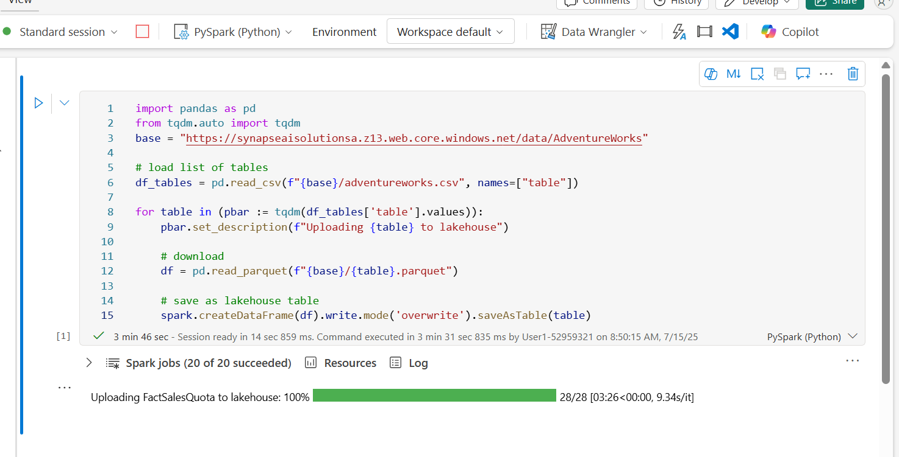
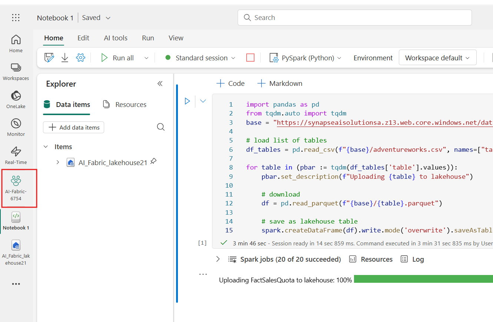

# 사용 사례 03- Fabric Data Agent를 사용하여 데이터와 채팅하기

**소개:**

이 사용 사례는 구조화된 데이터셋에 대한 자연어 쿼리를 가능하게 하는
Microsoft Fabric의 Data Agent를 소개합니다. Large language model (LLM)을
활용함으로써, Fabric Data Agent는 평범한 영어 질문을 해석하여 선택한
lakehouse 데이터 위에 대해 유효한 T-SQL 쿼리로 변환할 수 있습니다. 이
실습은 환경 설정, Fabric 작업 공간 설정, 데이터 업로드, AI 스킬을 활용해
데이터와 대화 방식으로 상호작용하는 과정을 안내합니다. 쿼리 예제 제공,
정확도 향상을 위한 지침 추가, Fabric 노트북에서 AI 스킬을
프로그래밍적으로 호출하는 등 고급 기능도 탐구하게 됩니다

**목표:**

- Fabric 작업 공간을 설정하고 lakehouse에 데이터를 로드하기

- 자연어 쿼리를 활성화하는 Data Agent를 생성하고 구성하기

- 쉬운 영어로 질문하고 AI가 생성한 SQL 쿼리 결과를 확인하기

- 맞춤형 지침과 예제 쿼리를 활용해 AI 응답을 강화하기

- Fabric 노트복에서 데이터 에이전트를 프로그램밍적으로 사용하기

## **작업 0: 호스트 환경 시간 동기화하기**

1.  VM에서 **Search bar**로 이동하고 클릭하고 **Settings**을 입력하고
    **Best match**의 **Settings**을 클릭하세요.

> 

2.  Settings 창에서 **Time & language**로 이동하고 클릭하세요.

3.  **Time & language** 페이지에서 **Date & time**로 이동하고
    클릭하세요.

4.  아래로 스크롤해서 **Additional settings** 섹션으로 이동한 후 **Sync
    now** 버튼을 클릭하세요. 동기화하는 데 3-5분 정도 걸립니다.

5.  **Settings** 창을 닫으세요.

## **작업 1: Fabric 작업 공간을 생성하기**

이 작업에서는 Fabric 작업 공간을 생성합니다. 작업 공간에는 이 lakehouse
튜토리얼에 필요한 모든 항목이 포함되어 있으며, 여기에는 lakehouse,
데이터플로우, Data factory, 파이프라인, 노트북, Power BI 데이터세트,
보고서 등이 포함됩니다.

1.  브라우저를 열고 주소 바로 이동하고 다음 URL:
    +++https://app.fabric.microsoft.com/+++입력하거나 붙여넣고 **Enter**
    버튼을 누르세요.

> 

2.  **Microsoft Fabric** 창에서 자격 증명을 입력하고 **Submit** 버튼을
    클릭하세요.

> 

3.  **Microsoft** 창에서 비밀번호를 입력하고 **Sign in** 버튼을
    클릭하세요.

> 

4.  **Stay signed in?** 창에서 **Yes** 버튼을 클릭하세요.

> 

5.  Workspaces 창에서 **+New workspace**를 선택하세요.

> 

6.  오른쪽에 나타나는 **Create a workspace** 창에서 다음 정보를 입력하고
    **Apply** 버튼을 클릭하세요button.

[TABLE]

> 
>
> 

7.  배치가 완료될 때까지 기다리세요. 완료하는 데 1-2분 정도 걸립니다.

> 

## **작업 2: lakehouse를 생성하기**

1.  **Fabric** **Home** 페이지에서 **+New item**을 선택하고
    **Lakehouse** 타일을 선택하세요.

> 

2.  **New lakehouse** 대화 상자에서 **Name** 필드에
    +++**AI_Fabric_lakehouseXX**+++를 입력하고field **Create** 버튼을
    클릭하고 새 lakehouse를 여세요.

> **참고**: **AI_Fabric_lakehouseXX**하기 전에 반드시 공간을 제거하세요
>
> 

3.  **Successfully created SQL endpoint** 알림이 표시됩니다.

> 

4.  다음으로, 테이블을 쿼리할 새 노트북을 생성하세요. **Home** 리본에서
    **Open notebook**의 드롭다운을 선택하고 **New notebook**을
    선택하세요.

## **작업 3: AdventureWorksDW 데이터를 lakehouse에 업로드하기**

먼저, lakehouse를 생성하고 필요한 데이터를 채우세요.

Warehouse나 lakehouse에 이미 AdventureWorksDW 인스턴스가 있다면 이
단계를 건너뛸 수 있습니다. 만약 없다면, 노트북으로 호숫가 집을
생성하세요. 노트북을 사용해 lakehouse에 데이터를 채우세요.

1.  Query editor에서 다음 코드를 복사해서 붙여넣으세요. 쿼리를
    실행하려면 **Run all** 버튼을 선택하세요. 쿼리가 완료되면 결과를
    보게 될 것입니다.

> import pandas as pd
>
> from tqdm.auto import tqdm
>
> base =
> "https://synapseaisolutionsa.z13.web.core.windows.net/data/AdventureWorks"
>
> \# load list of tables
>
> df_tables = pd.read_csv(f"{base}/adventureworks.csv",
> names=\["table"\])
>
> for table in (pbar := tqdm(df_tables\['table'\].values)):
>
> pbar.set_description(f"Uploading {table} to lakehouse")
>
> \# download
>
> df = pd.read_parquet(f"{base}/{table}.parquet")
>
> \# save as lakehouse table
>
> spark.createDataFrame(df).write.mode('overwrite').saveAsTable(table)
>
> 
>
> 
>
> 

몇 분 후, lakehouse 집은 필요한 데이터로 가득 차게 됩니다.

## **작업 4: 데이터 에이전트를 생성하기**

1.  왼쪽 탐색 창에서 **AI-Fabric-XXXX**를 클릭하세요.

2.  **Fabric** 홈페이지에서 **+New item**을 선택하세요.

3.  **Filter by item type** 검색 상자에서 **+++data agent+++**를
    입력하고 **Data agent**를 선택하세요**.**

4.  Data agent 이름을 **+++AI-agent+++** 로 입력하고 **Create**를
    선택하세요.

5.  AI-agent 페이지에서 **Add a data source**를 선택하세요.

6.  **OneLake catalog** 탭에서 **AI-Fabric_lakehouse lakehouse**를
    선택하고 **Add**를 선택하세요.

> 
>
> 

7.  그 후 AI 스킬이 접근 가능한 테이블을 선택해야 합니다.

이 실습은 이 표들을 사용합니다:

- DimCustomer

- DimDate

- DimGeography

- DimProduct

- DimProductCategory

- DimPromotion

- DimReseller

- DimSalesTerritory

- FactInternetSales

- FactResellerSales

> 

## **작업 5: 지침을 제공하기**

1.  처음 질문을 하면 나열된 표를 선택해 **factinternetsales**를
    선택하면, 데이터 에이전트가 꽤 잘 답변해 줍니다.

2.  예를 들어, +++ What is the most sold product?+++라는 질문에서

3.  질문과 SQL 쿼리를 복사해서 노트패드에 붙여넣고, 노트패드를 저장해서
    앞으로 할 작업에 활용하세요.

4.  **FactResellerSales**를 선택하고 다음 텍스트를 입력한 후 아래
    이미지에 표시된 **Submit icon**을 클릭하세요.

+++**What is our most sold product?**+++

쿼리를 계속 실험해보면서 더 많은 지침을 추가해야 합니다.

5.  **dimcustomer**를 선택하고 다음 텍스트를 입력한 후 **Submit icon**을
    클릭하세요

+++**How many active customers did we have on June 1st, 2013?**+++

8.  모든 질문과 SQL 쿼리를 복사해서 노트패드에 붙여넣고, 노트패드를
    저장해 앞으로 진행할 작업에 활용하세요.

9.  **dimdate,** **FactInternetSales**를 선택하고, 다음 텍스트를 입력한
    후 **Submit icon**을 클릭하세요**:**

+++**what are the monthly sales trends for the last year?**+++

6.  **dimproduct,** **FactInternetSales**를 선택하고 다음 텍스트를
    입력하고 **Submit icon**을 클릭하세요**:**

+++**which product category had the highest average sales price?**+++

> 
>
> 

문제의 일부는 “active customer”라는 단어에 공식적인 정의가 없다는
점입니다. 모델 텍스트 박스에 대한 노트에 더 많은 지시사항이 있으면
도움이 될 수 있지만, 사용자들은 이 질문을 자주 할 수 있습니다. AI가
문제를 올바르게 처리하는지 확인해야 합니다.

7.  관련 쿼리는 중간 정도 복잡하므로, **Setup**창에서 **Example
    queries** 버튼을 선택하여 예시를 제공하세요.

> 

8.  Example queries 탭에서 **Add example**을 선택하세요**.**

> 

9.  여기에 생성한 lakehouse 데이터 소스에 대한 예제 쿼리를 추가해야
    합니다. 아래 질문을 질문란에 추가하세요:

+++What is the most sold product?+++

10. 메모장에 저장된 query1을 추가하세요:  
      
    **SELECT TOP 1 ProductKey, SUM(OrderQuantity) AS TotalQuantitySold**

**FROM \[dbo\].\[factinternetsales\]**

**GROUP BY ProductKey**

**ORDER BY TotalQuantitySold DESC**

11. Add a new query 필드에서 **+Add**를 클릭하세요.

12. 질문란에 두 번째 질문을 추가하기 위해:

+++What are the monthly sales trends for the last year?+++

13. 메모장에 저장된 query3를 추가하세요:  
      
    **SELECT**

> **d.CalendarYear,**
>
> **d.MonthNumberOfYear,**
>
> **d.EnglishMonthName,**
>
> **SUM(f.SalesAmount) AS TotalSales**
>
> **FROM**
>
> **dbo.factinternetsales f**
>
> **INNER JOIN dbo.dimdate d ON f.OrderDateKey = d.DateKey**
>
> **WHERE**
>
> **d.CalendarYear = (**
>
> **SELECT MAX(CalendarYear)**
>
> **FROM dbo.dimdate**
>
> **WHERE DateKey IN (SELECT DISTINCT OrderDateKey FROM
> dbo.factinternetsales)**
>
> **)**
>
> **GROUP BY**
>
> **d.CalendarYear,**
>
> **d.MonthNumberOfYear,**
>
> **d.EnglishMonthName**
>
> **ORDER BY**
>
> **d.MonthNumberOfYear**
>
> 

14. 새 쿼리 필드를 추가하려면 **+** **Add**를 클릭하세요.

15. 질문란에 세 번째 질문을 추가하기 위해:

+++Which product category has the highest average sales price?+++

16. 메모장에 저장된 query4를 추가하세요:  
      
    **SELECT TOP 1**

> **dp.ProductSubcategoryKey AS ProductCategory,**
>
> **AVG(fis.UnitPrice) AS AverageSalesPrice**
>
> **FROM**
>
> **dbo.factinternetsales fis**
>
> **INNER JOIN**
>
> **dbo.dimproduct dp ON fis.ProductKey = dp.ProductKey**
>
> **GROUP BY**
>
> **dp.ProductSubcategoryKey**
>
> **ORDER BY**
>
> **AverageSalesPrice DESC**

11. 메모장에 저장된 모든 쿼리와 SQL 쿼리를 추가한 후 ' **Export all'**를
    클릭하세요

## **작옵 6: 데이터 에이전트를 프로그래밍적으로 사용하기**

명령어와 예제가 모두 데이터 에이전트에 추가되었습니다. 테스트가 진행됨에
따라 더 많은 예제와 지침이 AI 역량을 더욱 향상시킬 수 있습니다. 동료들과
함께 그들이 묻고자 하는 질문 유형을 다루는 예시와 지침을 제공했는지
확인해 보세요.

Fabric 노트북 내에서 AI 스킬을 프로그래밍적으로 사용할 수 있습니다. AI
스킬에 공개된 URL 값이 있는지 여부를 확인하는 것입니다.

1.  Data agent Fabric 페이지의 **Home** 리본에서 **Settings**을
    선택하세요.

2.  AI 스킬을 게시하기 전에는, 이 스크린샷에서 볼 수 있듯이 URL 값이
    공개되어 있지 않습니다.

3.  AI Skill 설정을 닫으세요.

4.  **Home** 리본에서 **Publish**를 선택하세요.

> 
>
> 

10. **View publishing details**을 클릭하세요

> 

5.  이 스크린샷과 같이 AI 에이전트의 공개된 URL이 나타납니다.

6.  URL을 복사해서 메모장에 붙여넣고, 그 정보를 저장해서 앞으로 진행할
    때 활용하세요.

> 

7.  왼쪽 탐색 페이지에서 **Notebook1**을 선택하세요.

11. 셀 출력 아래 + **Code** 아이콘을 사용해 노트북에 새 코드 셀을
    추가하고, 다음 코드를 입력한 뒤 **URL**을 교체하세요. **▷ Run**
    버튼을 클릭하고 출력을 검토하세요.

+++%pip install "openai==1.70.0"+++

> 
>
> 

12. 셀 출력 아래 + **Code** 아이콘을 사용해 노트북에 새 코드 셀을
    추가하고, 다음 코드를 입력한 뒤 **URL**을 교체하세요. **▷ Run**
    버튼을 클릭하고 출력을 검토하세요.

> +++%pip install httpx==0.27.2+++
>
> 
>
> 

8.  셀 출력 아래 + **Code** 아이콘을 사용해 노트북에 새 코드 셀을
    추가하고, 다음 코드를 입력한 뒤 **URL**을 교체하세요. **▷ Run**
    버튼을 클릭하고 출력을 검토하세요.

> import requests
>
> import json
>
> import pprint
>
> import typing as t
>
> import time
>
> import uuid
>
> from openai import OpenAI
>
> from openai.\_exceptions import APIStatusError
>
> from openai.\_models import FinalRequestOptions
>
> from openai.\_types import Omit
>
> from openai.\_utils import is_given
>
> from synapse.ml.mlflow import get_mlflow_env_config
>
> from sempy.fabric.\_token_provider import SynapseTokenProvider
>
> base_url = "https://\<generic published base URL value\>"
>
> question = "What datasources do you have access to?"
>
> configs = get_mlflow_env_config()
>
> \# Create OpenAI Client
>
> class FabricOpenAI(OpenAI):
>
> def \_\_init\_\_(
>
> self,
>
> api_version: str ="2024-05-01-preview",
>
> \*\*kwargs: t.Any,
>
> ) -\> None:
>
> self.api_version = api_version
>
> default_query = kwargs.pop("default_query", {})
>
> default_query\["api-version"\] = self.api_version
>
> super().\_\_init\_\_(
>
> api_key="",
>
> base_url=base_url,
>
> default_query=default_query,
>
> \*\*kwargs,
>
> )
>
> def \_prepare_options(self, options: FinalRequestOptions) -\> None:
>
> headers: dict\[str, str | Omit\] = (
>
> {\*\*options.headers} if is_given(options.headers) else {}
>
> )
>
> options.headers = headers
>
> headers\["Authorization"\] = f"Bearer {configs.driver_aad_token}"
>
> if "Accept" not in headers:
>
> headers\["Accept"\] = "application/json"
>
> if "ActivityId" not in headers:
>
> correlation_id = str(uuid.uuid4())
>
> headers\["ActivityId"\] = correlation_id
>
> return super().\_prepare_options(options)
>
> \# Pretty printing helper
>
> def pretty_print(messages):
>
> print("---Conversation---")
>
> for m in messages:
>
> print(f"{m.role}: {m.content\[0\].text.value}")
>
> print()
>
> fabric_client = FabricOpenAI()
>
> \# Create assistant
>
> assistant = fabric_client.beta.assistants.create(model="not used")
>
> \# Create thread
>
> thread = fabric_client.beta.threads.create()
>
> \# Create message on thread
>
> message =
> fabric_client.beta.threads.messages.create(thread_id=thread.id,
> role="user", content=question)
>
> \# Create run
>
> run = fabric_client.beta.threads.runs.create(thread_id=thread.id,
> assistant_id=assistant.id)
>
> \# Wait for run to complete
>
> while run.status == "queued" or run.status == "in_progress":
>
> run = fabric_client.beta.threads.runs.retrieve(
>
> thread_id=thread.id,
>
> run_id=run.id,
>
> )
>
> print(run.status)
>
> time.sleep(2)
>
> \# Print messages
>
> response =
> fabric_client.beta.threads.messages.list(thread_id=thread.id,
> order="asc")
>
> pretty_print(response)
>
> \# Delete thread
>
> fabric_client.beta.threads.delete(thread_id=thread.id)
>
> 
>
> 

## **작업 7: 리소스를 정리하기**

1.  왼쪽 탐색 메뉴에서 **AI-Fabric-XXXX** 작업 공간을 선택하세요. 작업
    공간 항목 뷰가 열립니다.

> 

2.  작업 공간 이름에서 **...** 옵션을 선택하고 **Workspace settings**를
    선택하세요.

> 

3.  **Other** 및 **Remove this workspace**를 선택하세요.

> 

4.  뜨는 경고에서 **Delete**를 클릭하세요.

> 
>
> 

**요약:**

이 실습에서는 Microsoft Fabric의 Data Agent를 활용해 대화형 분석의 힘을
활용하는 방법을 배웠습니다. Fabric 작업 공간을 구성하고, 구조화된
데이터를 lakehouse에 인징했으며, 자연어 질문을 SQL 쿼리로 변환하는 AI
스킬을 설정했습니다. 또한 쿼리 생성을 개선할 수 있도록 지침과 예제를
제공함으로써 AI 에이전트의 역량을 강화하셨습니다. 마지막으로, Fabric
노트북에서 에이전트를 프로그래밍적으로 호출하여 end-to-end AI 통합을
시연했습니다. 이 실습은 자연어와 생성형 AI 기술을 통해 기업 데이터를
비즈니스 사용자에게 더 접근성, 사용 가능, 지능적으로 생성할 수 있도록
지원합니다.
