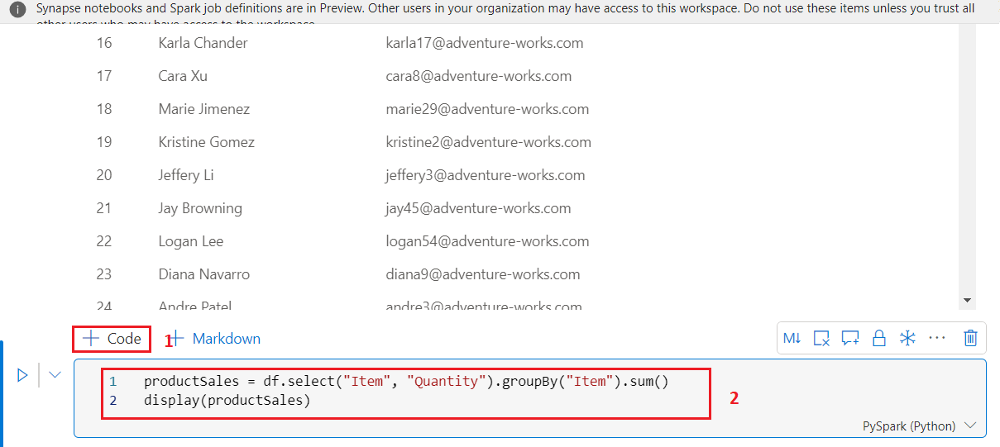
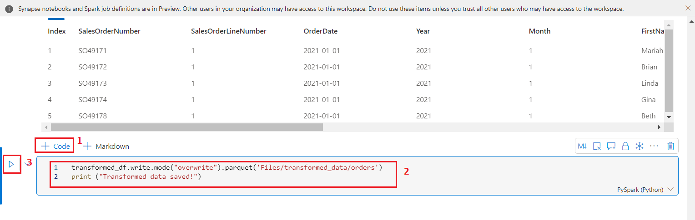
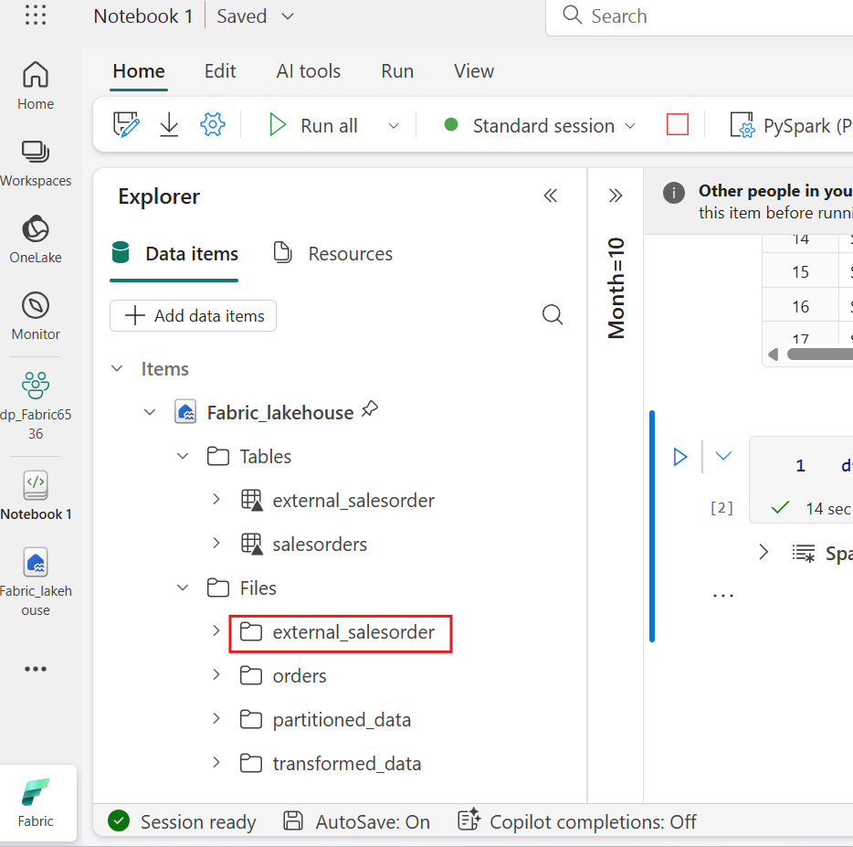
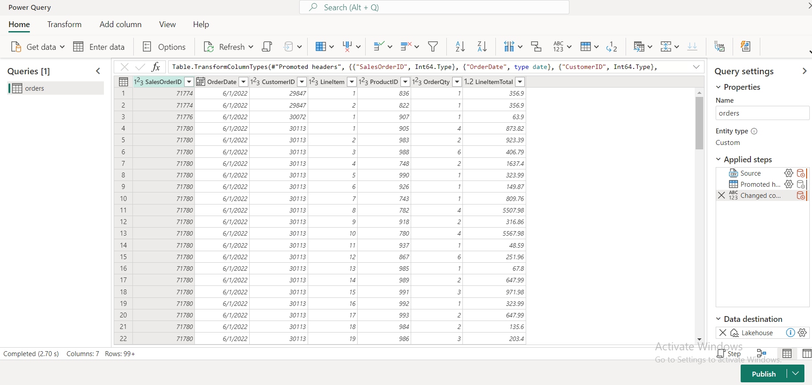

# 사용 사례 04: Apache Spark로 데이터를 분석하기

**소개**

Apache Spark는 분산 데이터 처리를 위한 오픈 소스 엔진으로, data lake
저장소 내 방대한 양의 데이터를 탐색, 처리, 분석하는 데 사용됩니다.
Spark는 Azure HDInsight, Azure Databricks, Azure Synapse Analytics,
Microsoft Fabric 등 많은 데이터 플랫폼 제품에서 처리 옵션으로
제공됩니다. Spark의 장점 중 하나는 Java, Scala, Python, SQL 등 다양한
프로그래밍 언어를 지원한다는 점입니다; Spark는 데이터 정제 및 조작, 통계
분석 및 머신러닝, 데이터 분석 및 시각화 등 데이터 처리 워크로드에 매우
유연한 솔루션이 되었습니다.

Microsoft Fabric lakehouse의 테이블은 Apache Spark의 오픈 소스 *Delta
Lake* 포맷을 기반으로 합니다. Delta Lake는 배치 및 스트리밍 데이터 연산
모두에 대한 관계형 의미론 지원을 추가하고, Apache Spark를 사용해 data
lake 내 기본 파일을 기반으로 한 테이블의 데이터를 처리하고 쿼리할 수
있는 Lakehouse 아키텍처를 생성할 수 있게 합니다.

Microsoft Fabric에서는 Dataflows(Gen2)가 다양한 데이터 소스와 연결되어
Power Query Online에서 변환을 수행합니다. 이후 데이터 파이프라인에서
lakehouse나 기타 분석 저장소에 데이터를 인징하거나, Power BI 보고서용
데이터세트를 정의하는 데 사용할 수 있습니다.

이 실습은 Dataflows(Gen2)의 다양한 요소를 소개하도록 설계되었으며, 기업
내에 존재할 수 있는 복잡한 솔루션을 생성하는 것이 아닙니다.

**목표**:

- Fabric 체험판을 활성화한 Microsoft Fabric에서 작업 공간을 생성하기

- Lakehouse 환경을 구축하고 분석을 위해 데이터 파일을 업로드하기

- 인터랙티브 데이터 탐색 및 분석을 위한 노트복 생성하기

- 추가 처리 및 시각화를 위해 데이터프레임에 데이터를 로드하기

- PySpark를 사용해 데이터에 변환을 적용하기

- 변환된 데이터를 저장하고 분할하여 쿼리를 최적화하기

- 구조화된 데이터 관리를 위해 Spark 메타스토어에 테이블을 생성하기

- DataFrame을 "salesorders"라는 이름의 관리 delta table로 저장하기

- DataFrame을 "external_salesorder"이라는 외부 델타 테이블로 저장하고
  지정된 경로를 지정하기

- 관리 테이블과 외부 테이블의 속성을 설명하고 비교하기

- 분석 및 보고를 위해 테이블에 SQL 쿼리를 실행하기

- matplotlib, seaborn 같은 Python 라이브러리를 사용해 데이터를
  시각화하기

- 데이터 엔지니어링 경험에 data lakehouse를 구축하고 관련 데이터를
  수집하여 후속 분석을 수행하기

- 데이터를 추출, 변환, lakehouse로 로드하는 데이터 흐름을 정의하기

- Power Query 내에서 변환된 데이터를 lakehouse에 저장하도록 데이터
  목적지를 설정하기

- 데이터 흐름을 파이프라인에 통합하여 예정된 데이터 처리 및 수집을
  가능하게 하기

- 작업 공간과 관련 요소를 제거하여 연습을 마무리하기

# 연습 1: Create a데이터프레임에 작업 공간, lakehouse, 노트북 및 데이터 로드하기 

## 작업 1: 작업 공간 생성하기 

Fabric에서 데이터를 다루기 전에 Fabric 체험판이 활성화된 작업 공간을
생성하세요.

1.  브라우저를 열고 주소 바로 이동하고 다음 URL:
    +++https://app.fabric.microsoft.com/+++를 입력하고 붙여넣고
    **Enter** 버튼을 누르세요.

> **참고**: 만약 Microsoft Fabric 홈페이지로 이동한다면, \#2부터
> \#4까지의 단계를 건너뛰세요.
>
> 

2.  **Microsoft Fabric** 창에서 자격 증명을 입력하고 **Submit** 버튼을
    클릭하세요.

> 

3.  **Microsoft** 창에서 비밀번호를 입력하고 **Sign in** 버튼을
    클릭하세요**.**

> 

4.  **Stay signed in?** 창에서 **Yes** 버튼을 클릭하세요.

> 

5.  Fabric 홈페이지에서 **+New workspace** 타일을 선택하세요.

> 

6.  **Create a workspace 탭**에서 다음 정보를 입력하고 **Apply** 버튼을
    클릭하세요.

[TABLE]

> 
>
> 

7.  배치가 완료될 때까지 기다리세요. 완료하는 데 2-3분 정도 걸립니다. 새
    작업 공간이 열리면 비어 있어야 합니다.

> 

## 작업 2: lakehouse를 생성하고 파일을 업로드하기

이제 작업 공간이 생겼으니, 포털에서 *데이터 엔지니어링* 경험으로 전환해
분석할 데이터 파일을 위한 data lakehouse를 생성할 것입니다.

1.  탐색 바에서 **+New item** 버튼을 클릭하고 새 Eventhouse를
    생성하세요.

2.  "**Lakehouse**" 타일을 클릭하세요.

3.  **New lakehouse** 대화 상자에서 **Name** 필드에
    **+++Fabric_lakehouse+++**를 입력하고 **Create** 버튼을 클릭하고 새
    lakehouse를 여세요.

4.  1분 정도 지나면 새로운 빈 lakehouse가 생성해집니다. 분석을 위해
    데이터를 data lakehouse에 인징해야 합니다.

5.  **Successfully created SQL endpoint**라는 알림이 표시됩니다.

6.  **Explorer**섹션의 **fabric_lakehouse** 아래에 마우스를 **Files
    folder** 옆에 올리고, 가로 타원 **(...)** 메뉴를 클릭하세요.
    **Upload**로 이동하고 클릭하고 아래 이미지에 보이는 **Upload
    folder**를 클릭하세요.

7.  오른쪽에 나타나는  **Upload folder** 창에서 **Files/**의 **folder
    icon**을 선택하고 **C:\LabFiles**로 이동하고 **orders** 폴더를
    선택하고 **Upload** 버튼을 클릭하세요.

8.  **Upload 3 files to this site?** 대화 상자가 표시되면 **Upload**
    버튼을 클릭하세요.

9.  Upload folder 창에서 **Upload** 버튼을 클릭하세요.

> 

10. 파일이 업로드된 후에는 **Upload folder** 창을 닫으세요.

11. **Files** 확장하고 **orders** 폴더를 선택한 후 CSV 파일이
    업로드되었는지 확인하세요.

> 

## 작업 3: 노트북을 생성하기

Apache Spark에서 데이터를 다루려면 노트북을 생성할 수 있습니다. 노트북은
여러 언어로 코드를 작성하고 실행할 수 있는 인터랙티브 환경을 제공하며,
문서화할 메모도 추가할 수 있습니다.

1.  **Home** 페이지에서 datalake의 **orders** 폴더 내용을 볼 때 **Open
    notebook**메뉴에서 **New notebook**을 선택하세요.

2.  몇 초 후, 단일 *셀*이 담긴 새 노트북이 열립니다. 노트북은 *코드*
    또는 *마크다운*(서식화된 텍스트)을 담을 수 있는 하나 이상의 셀로
    구성됩니다.

3.  첫 번째 셀 (현재 *코드* 셀)을 선택한 후, 오른쪽 상단의 동적 툴바에서
    **M↓** 버튼을 **눌러 셀을 마크다운 셀로 변환하세요**.

4.  셀이 마크다운 셀로 바뀌면, 그 안에 포함된 텍스트가 렌더링됩니다.

5.  🖉 (Edit) 버튼을 사용해 셀을 편집 모드로 전환하고, 모든 텍스트를
    교체한 후 다음과 같이 마크다운을 수정하세요 :

> CodeCopy
>
> \# Sales order data exploration
>
> Use the code in this notebook to explore sales order data.

6.  셀 밖의 노트북 어디든 클릭하면 편집을 멈추고 렌더링된 마크다운을 볼
    수 있습니다.

## 작업 4: 데이터프레임에 데이터를 로드하기

이제 데이터를 데이터프레임에 로드하는 코드를 실행할 준비가 되었습니다.
Spark의 데이터프레임은 Python의 Pandas 데이터프레임과 유사하며, 행과
열로 이루어진 데이터를 다루는 공통 구조를 제공합니다.

**참고**: Spark는 Scala, Java 등 여러 코딩 언어를 지원합니다. 이번
연습에서는 *PySpark*를 사용할 텐데, 이는 Python의 Spark 최적화
변형입니다. PySpark는 Spark에서 가장 널리 사용되는 언어 중 하나이며,
Fabric 노트북의 기본 언어입니다.

1.  노트북이 보이면 **Files **목록을 확장하고 **orders **폴더를 선택해
    CSV 파일이 노트북 편집기 옆에 나오게 하세요.

> 

2.  이제 마우스를 파일을 2019.csv 위치에 올려주세요. 2019.csv 옆에 있는
    가로 타원표 **(...)**를 클릭하세요. **Load data**로 이동하고
    클릭하고 **Spark**를 선택하세요. 다음 코드가 포함된 새로운 코드 셀이
    노트북에 추가됩니다:

> CodeCopy
>
> df =
> spark.read.format("csv").option("header","true").load("Files/orders/2019.csv")
>
> \# df now is a Spark DataFrame containing CSV data from
> "Files/orders/2019.csv".
>
> display(df)
>
> 
>
> 

**팁**: 왼쪽에 있는 Lakehouse탐험기 창은 « 아이콘 아이콘을 사용해 숨길
수 있습니다.

그래서 노트북에 집중하는 데 도움이 될 거예요.

3.  셀 외쪽에 있는 **▷ Run cell** 버튼을 사용하여 실행하세요.

**참고**: 이번이 처음으로 Spark 코드를 실행하는 경우이므로 Spark 세션을
시작해야 합니다. 즉, 세션의 첫 번째 실행은 완료하는 데 약 1분 정도 걸릴
수 있습니다. 이후 런들은 더 빠르게 진행될 것입니다.

4.  셀 명령이 완료되면, 셀 아래의 출력을 검토하세요. 이 결과는 다음과
    비슷할 것입니다:

5.  출력은 2019.csv 파일의 행과 열을 보여줍니다. 하지만 열의 헤더가
    제대로 보이지 않는다는 점에 유의하세요. 데이터를 데이터프레임에
    로드하는 기본 코드는 CSV 파일에 첫 번째 행의 열 이름이 포함된다고
    가정하지만, 이 경우 CSV 파일은 헤더 정보가 없는 데이터만 포함합니다.

6.  코드를 수정하여 **header **옵션을 **false**로 설정하세요. Cell 내
    모든 코드를 다음 코드로 교체하고 **▷ Run cell**버튼을 클릭한 후
    출력을 검토하세요

> CodeCopy
>
> df =
> spark.read.format("csv").option("header","false").load("Files/orders/2019.csv")
>
> \# df now is a Spark DataFrame containing CSV data from
> "Files/orders/2019.csv".
>
> display(df)

7.  이제 데이터프레임은 첫 번째 행을 데이터 값으로 올바르게 포함하지만,
    열 이름은 자동으로 생성되어 별로 도움이 되지 않습니다. 데이터를
    이해하려면 파일 내 데이터 값에 대해 올바른 스키마와 데이터 타입을
    명시적으로 정의해야 합니다.

8.  Cell 내 모든 코드를 다음 코드로 교체하고 **▷ Run cell**버튼을 클릭한
    후 출력을 검토하세요

> from pyspark.sql.types import \*
>
> orderSchema = StructType(\[
>
> StructField("SalesOrderNumber", StringType()),
>
> StructField("SalesOrderLineNumber", IntegerType()),
>
> StructField("OrderDate", DateType()),
>
> StructField("CustomerName", StringType()),
>
> StructField("Email", StringType()),
>
> StructField("Item", StringType()),
>
> StructField("Quantity", IntegerType()),
>
> StructField("UnitPrice", FloatType()),
>
> StructField("Tax", FloatType())
>
> \])
>
> df =
> spark.read.format("csv").schema(orderSchema).load("Files/orders/2019.csv")
>
> display(df)
>
> 
>
> 

9.  이제 데이터프레임에는 올바른 열 이름이 포함되어 있습니다 (각 행의
    순서 위치에 기반한 모든 데이터프레임에 내장된 열인 **Index**
    외에도). 열의 데이터 타입은 셀 시작 부분에 임포트된 Spark SQL
    라이브러리에서 정의된 표준 타입 세트를 사용하여 지정됩니다.

10. 데이터프레임을 확인하여 변경 사항이 데이터에 적용되었는지
    확인하세요.

11. 셀 출력 아래 **+ Code** 아이콘을 사용해 노트북에 새 코드 셀을
    추가하고 다음 코드를 입력하세요. **▷ Run cell** 버튼을 클릭하고
    출력을 검토합니다

> CodeCopy
>
> display(df)
>
> 

12. 데이터프레임은 **2019.csv** 파일의 데이터만 포함 합니다. 파일 경로가
    **orders** 폴더 내 모든 파일의 판매 주문 데이터를 읽기 위해 \*
    와일드카드를 사용하도록 코드를 수정하세요

13. 셀 출력 아래 + **Code** 아이콘을 사용해 노트북에 새 코드 셀을
    추가하고 다음 코드를 입력하세요.

CodeCopy

> from pyspark.sql.types import \*
>
> orderSchema = StructType(\[
>
>     StructField("SalesOrderNumber", StringType()),
>
>     StructField("SalesOrderLineNumber", IntegerType()),
>
>     StructField("OrderDate", DateType()),
>
>     StructField("CustomerName", StringType()),
>
>     StructField("Email", StringType()),
>
>     StructField("Item", StringType()),
>
>     StructField("Quantity", IntegerType()),
>
>     StructField("UnitPrice", FloatType()),
>
>     StructField("Tax", FloatType())
>
>     \])
>
> df =
> spark.read.format("csv").schema(orderSchema).load("Files/orders/\*.csv")
>
> display(df)
>
> 

14. 수정된 코드 셀을 실행하고 출력을 검토하면, 이제 2019년, 2020년,
    2021년 매출이 포함될 것입니다.

> 

**참고**: 행의 일부만 표시되어 모든 연도의 예시를 볼 수 없을 수도
있습니다.

# 연습 2: 데이터프레임에 데이터를 탐색하기

데이터프레임 객체는 포함된 데이터를 필터링, 그룹화, 기타 방식으로 조작할
수 있는 다양한 기능을 포함하고 있습니다.

## 작업 1: 데이터프레임 필터하기

1.  셀 출력 아래 **+ Code** 아이콘을 사용해 노트북에 새 코드 셀을
    추가하고 다음 코드를 입력하세요.

> customers = df\['CustomerName', 'Email'\]
>
> print(customers.count())
>
> print(customers.distinct().count())
>
> display(customers.distinct())
>
> 

2.  새 코드 셀을 **실행**하고 결과를 검토하세요. 다음 세부 사항을
    주목하세요:

    - 데이터프레임에 연산을 수행하면 결과가 새로운 데이터프레임이
      생성됩니다(이 경우 **df** 데이터프레임에서 특정 열의 하위 집합을
      선택하여 새로운 **customers** 데이터프레임이 생성됩니다)

    - 데이터프레임은 **count, distinct**와 같은 기능을 제공하여 포함된
      데이터를 요약하고 필터링하는 데 사용할 수 있습니다.

    - dataframe\['Field1', 'Field2', ...\] 구문은 열의 하위 집합을
      정의하는 약어입니다. **select** 방법을 사용할 수 도 있어서 위 코드
      첫 줄은 customers = df.select("CustomerName", "Email")로 쓸 수
      있습니다.

> 

3.  코드를 수정하고, cell 내 모든 코드를 다음 코드로 교체한 뒤 **▷ Run
    cell** 버튼을 클릭하세요:

> CodeCopy
>
> customers = df.select("CustomerName",
> "Email").where(df\['Item'\]=='Road-250 Red, 52')
>
> print(customers.count())
>
> print(customers.distinct().count())
>
> display(customers.distinct())

4.  수정된 코드를 실행하여 ***Road-250 Red, 52* product**를 구매한
    고객을 확인하세요. 여러 함수를 'chain**'**하여 한 함수의 출력이 다음
    함수의 입력이 되도록 할 수 있다는 점에 유의하세요. 이 경우
    **select** 방법이 생성한 데이터프레임이 필터링 기준을 적용하는
    **where**의 소스 데이터프레임입니다.

> 

## 작업 2: 데이터프레임에 데이터를 집계하고 그룹하기

1.  **+ Code**를 클릭하고 다음 코드를 복사하고 붙여넣고 **Run cell**
    버튼을 클릭하세요.

> **CodeCopy:**
>
> productSales = df.select("Item", "Quantity").groupBy("Item").sum()
>
> display(productSales)
>
> 

2.  결과는 주문량의 합을 제품별로 그룹화한 것으로 보입니다. **groupBy**
    방법은 항목별로 행을 그룹화하며, 이후 **sum** 집계 함수가 나머지
    모든 수치 열(이 경우 *Quantity*)에 적용됩니다

3.  **+ Code**를 클릭하고 다음 코드를 복사하고 붙여넣고 **Run cell**
    버튼을 클릭하세요.

> **CodeCopy**
>
> from pyspark.sql.functions import \*
>
> yearlySales =
> df.select(year("OrderDate").alias("Year")).groupBy("Year").count().orderBy("Year")
>
> display(yearlySales)
>
> 

4.  결과는 연간 판매 주문 수를 보여줍니다. **select** 방법에는
    *OrderDate* 필드의 **year** 성분을 추출하는 **SQL** 연도 함수가
    포함되어 있다는 점에 유의하세요 (그래서 코드에 Spark SQL
    라이브러리에서 함수를 가져오는 **import** 문이 포함되어 있습니다).
    그 후 **alias** 방법을 사용하여 추출한 연도 값에 열명을 할당합니다.
    데이터는 파생된 연도 열로 그룹화되고, 각 그룹의 행 수를 계산한 후
    최종 **orderBy** 방법을 사용하여 결과 데이터프레임을 정렬합니다.

# 연습 3: Spark를 사용하여 데이터 파일을 변환하기

데이터 엔지니어들이 흔히 수행하는 작업 중 하나는 특정 형식이나 구조로
데이터를 수집하고, 이를 변환하여 추가 처리 또는 분석을 수행하는
것입니다.

## 작업 1: 데이터프레임 방법이 함수를 사용하여 데이터를 변환하기

1.  Click on + Code를 클릭하고 다음 코드를 복사하고 붙여넣으세요

**CodeCopy**

> from pyspark.sql.functions import \*
>
> \## Create Year and Month columns
>
> transformed_df = df.withColumn("Year",
> year(col("OrderDate"))).withColumn("Month", month(col("OrderDate")))
>
> \# Create the new FirstName and LastName fields
>
> transformed_df = transformed_df.withColumn("FirstName",
> split(col("CustomerName"), " ").getItem(0)).withColumn("LastName",
> split(col("CustomerName"), " ").getItem(1))
>
> \# Filter and reorder columns
>
> transformed_df = transformed_df\["SalesOrderNumber",
> "SalesOrderLineNumber", "OrderDate", "Year", "Month", "FirstName",
> "LastName", "Email", "Item", "Quantity", "UnitPrice", "Tax"\]
>
> \# Display the first five orders
>
> display(transformed_df.limit(5))
>
> 

2.  다음 변환을 통해 원본 순서 데이터로부터 새로운 데이터프레임을
    생성하는 코드를 **실행**하세요:

    - **OrderDate** 열을 기반으로 **Year**와 **Month** 열을 추가하기

    - **CustomerName** 열을 기반으로 이름 **FirstName**과 **LastName**
      열을 추가하기

    - **CustomerName** 열을 제거하면서 열을 필터링하고 재정렬하기

> 

3.  출력물을 검토하고 변환이 데이터에 이루어졌는지 확인하세요.

Spark SQL 라이브러리의 모든 기능을 활용해 행 필터링, 열의 도출, 제거,
이름 변경 및 기타 필요한 데이터 수정 등을 적용할 수 있습니다.

**탑**: 데이터프레임 객체의 방법에 대해 더 알고 싶다면 [*Spark dataframe
documentation*](https://spark.apache.org/docs/latest/api/python/reference/pyspark.sql/dataframe.html)를
참조하세요.

## 작업 2: 변환된 데이터를 저장하기

1.  변환된 데이터프레임을 Parquet 형식으로 저장하는 코드로 **새 셀을
    추가하세요**(이미 존재하는 데이터는 덮어쓰기). 셀을 **실행**하고
    데이터가 저장되었다는 메시지를 기다리세요.

> CodeCopy
>
> transformed_df.write.mode("overwrite").parquet('Files/transformed_data/orders')
>
> print ("Transformed data saved!")
>
> **참고**: 일반적으로 *Parquet* 형식은 추가 분석이나 분석 저장소에
> 입력하는 데이터 파일에 선호됩니다. Parquet은 대부분의 대규모 데이터
> 분석 시스템에서 지원하는 매우 효율적인 형식입니다. 사실, 때로는 데이터
> 변환 요구사항이 단순히 다른 형식(예: CSV)에서 Parquet으로 변환하는
> 것일 수도 있습니다!
>
> 
>
> 

2.  왼쪽의 **Lakehouse explorer** 창에서 **Files** 노드의 **…**메뉴에서
    **Refresh**를 선택하세요.

> 

3.  **transformed_data** 폴더를 클릭하여 **orders**라는 새 폴더가 있는지
    확인하는데, 이 폴더에는 하나 이상의 **Parquet files**이 포함되어
    있습니다.

> 

4.  코드 다음에 + **Code**를 클릭해 **transformed_data -\> orders**
    폴더의 parquet 파일에서 새 데이터프레임을 불러오세요:

> **CodeCopy**
>
> orders_df =
> spark.read.format("parquet").load("Files/transformed_data/orders")
>
> display(orders_df)
>
> 

5.  셀을 **실행**하고 결과가 파켓 파일에서 로드된 순서 데이터를
    보여주는지 확인하세요.

> 

## 작업 3: 분리된 파일 내 데이터를 저장하기

1.  새 셀을 추가하고 다음 코드와 함께 + **Code**를 클릭해 다음 코드를
    입력하면 데이터프레임이 저장되어 연도와 월별로 데이터를 분할됩니다.
    셀을 **실행**하고 데이터가 저장되었다는 메시지를 기다리세요

> CodeCopy
>
> orders_df.write.partitionBy("Year","Month").mode("overwrite").parquet("Files/partitioned_data")
>
> print ("Transformed data saved!")
>
> 
>
> 

2.  왼쪽 **Lakehouse explorer** 창에서, ... **Files** 노드 메뉴에서
    **Refresh**를 선택하세요

3.  **partitioned_orders** 폴더를 펼쳐 **Year=*xxxx***라는 폴더 계층
    구조가 있는지 확인 해 보세요. 각 계층에는 **Month=*xxxx*** 폴더가
    포함되어 있습니다. 각 월의 서류철에는 그 월의 주문이 담긴
    parquet파일이 들어 있습니다.

> 데이터 파일 분할은 대량의 데이터를 처리할 때 성능을 최적화하는
> 일반적인 방법입니다. 이 기법은 성능을 크게 향상시키고 데이터 필터링을
> 더 쉽게 생성합니다.

4.  새 셀을 추가하고, 다음 코드로 **+ Code**를 클릭하면
    **orders.parquet** 파일에서 새로운 데이터프레임을 불러오세요:

> CodeCopy
>
> orders_2021_df =
> spark.read.format("parquet").load("Files/partitioned_data/Year=2021/Month=\*")
>
> display(orders_2021_df)

5.  셀을 실행해서 결과에 2021년 판매 주문 데이터가 나오는지 확인하세요.
    경로에 지정된 분할 열(**(Year **및 **Month**)은 데이터프레임에
    포함되지 않는다는 점에 유의하세요.

# **연습 3: 테이블 및 SQL와 작업하기**

보셨듯이, 데이터프레임 객체의 기본 방법 덕분에 파일에서 데이터를
조회하고 분석할 수 있습니다. 하지만 많은 데이터 분석가들은 SQL 문법으로
쿼리할 수 있는 테이블을 다루는 데 더 익숙합니다. Spark는 관계형 테이블을
정의할 수 있는 *메타스토어*를 제공합니다. 데이터프레임 객체를 제공하는
Spark SQL 라이브러리는 메타스토어 내 테이블을 쿼리하기 위한 SQL 문도
지원합니다. Spark의 이러한 기능을 활용하면 data lake의 유연성과 관계형
data warehouse의 구조화된 데이터 스키마 및 SQL 기반 쿼리를 결합할 수
있습니다. 그래서 'data lakehouse'라는 용어가 붙었습니다.

## 작업 1: 관리되는 테이블 생성하기

Spark 메타스토어의 테이블은 데이터 레이크 내 파일에 대한 관계형
추상화입니다. 테이블은 *관리*(이 경우 메타스토어가 파일을 관리함) 또는
*외부(external* table)일 수 있습니다 (이 경우 테이블은 메타데이터 레이크
내 파일 위치를 참조하며, 메타스토어와 독립적으로 관리합니다).

1.  새 코드를 추가하고, 노트북의 **+ Code** 셀을 클릭한 후 다음 코드를
    입력하면, 판매 주문 데이터프레임을 **salesorders**라는 테이블로
    저장합니다:

> CodeCopy
>
> \# Create a new table
>
> df.write.format("delta").saveAsTable("salesorders")
>
> \# Get the table description
>
> spark.sql("DESCRIBE EXTENDED salesorders").show(truncate=False)

**참고**: 이 예시에 대해 몇 가지 주목할 점이 있습니다. 첫째, 명시적인
경로가 제공되지 않아 테이블 파일은 메타스토어에서 관리됩니다. 둘째,
테이블은 **delta** 형식으로 저장됩니다. CSV, Parquet, Avro 등 여러 파일
형식에 기반한 테이블을 생성할 수 있지만, *delta lake*는 Spark 기술로,
테이블에 관계형 데이터베이스 기능을 추가합니다; 트랜잭션, 행 버전 관리
및 기타 유용한 기능을 포함합니다. Data lakehouse에서는 Fabric에서 델타
형식으로 테이블을 생성하는 것이 선호됩니다.

2.  코드 셀을 **실행**하고 출력 결과를 검토하세요. 이 출력은 새 테이블의
    정의를 설명합니다.

3.  **Lakehouse** **explorer** 창에서, ... **Tables** 폴더 메뉴에서
    **Refresh**를 선택하세요.

4.  그 다음 **Tables** 노드를 펼쳐서 **salesorders** 테이블이 **dbo**
    스키마 하에 생성되었는지 확인하세요.

> 

5.  판매주문 테이블 옆에 마우스를 올리고, 가로 타원(...)을 클릭하세요.
    **Load data**를 클릭한 후 **Spark**를 선택하세요.

> 

6.  ▷ **Run Cell** 버튼을 클릭하면 Spark SQL 라이브러리를 사용해 PySpark
    코드의 **salesorder** 테이블에 대한 SQL 쿼리를 삽입하고 쿼리 결과를
    데이터프레임에 불러오게 됩니다.

> CodeCopy
>
> df = spark.sql("SELECT \* FROM Fabric_lakehouse.dbo.salesorders LIMIT
> 1000")
>
> display(df)

## 작업 2: 외부 테이블을 생성하기

또한 Lakehouse의 메타스토어에 스키마 메타데이터가 정의되어 있지만 데이터
파일은 외부 위치에 저장하는 *외부* 테이블을 생성할 수도 있습니다.

1.  첫 번째 코드 셀에서 반환된 결과 아래, + **Code** 버튼을 눌러 이미
    존재하지 않는 새로운 코드 셀을 추가하세요. 그 다음 새 셀에 다음
    코드를 입력하세요.

CodeCopy

> df.write.format("delta").saveAsTable("external_salesorder",
> path="\<abfs_path\>/external_salesorder")

2.  **Lakehouse explorer** 창에서, ... **Files** 폴더 메뉴에서
    메모장에서 **Copy ABFS path**를 선택하세요.

> ABFS 경로는 lakehouse의 OneLake 저장소 내 **Files** 폴더에 대한 완전
> 자격화된 경로로, 이와 비슷합니다:

abfss://dp_Fabric29@onelake.dfs.fabric.microsoft.com/Fabric_lakehouse.Lakehouse/Files/external_salesorder

> 

3.  이제 코드 셀로 들어가서 **\<abfs_path\>**를 메모장에 복사한
    **path**로 바꾸세요. 그래야 코드가 데이터 프레임을 외부 테이블로
    저장하고, 파일 위치에 있는 **external_salesorder**이라는 폴더에
    데이터 **Files**이 저장됩니다. 전체 경로는 이와 비슷해야 합니다.

abfss://dp_Fabric29@onelake.dfs.fabric.microsoft.com/Fabric_lakehouse.Lakehouse/Files/external_salesorder

4.  셀 왼쪽에 있는 ▷***(Run cell)*** 버튼을 사용해 실행할 수 있습니다.

5.  **Lakehouse explorer** 창에서, ... **Tables** 폴더 메뉴에서
    **Refresh**를 선택하세요.

6.  그 다음 **Tables** 노드를 펼쳐서 **external_salesorder** 테이블이
    생성되었는지 확인하세요.

7.  **Lakehouse explorer** 창에서, ... **Files** 폴더 메뉴에서
    **Refresh**를 선택하세요.

8.  그 다음 **Files** 노드를 펼쳐서 테이블의 데이터 파일을 위한
    **external_salesorder** 폴더가 생성되었는지 확인하세요.

## 작업 3: 관리형 및 외부 테이블을 비교하기

관리형 테이블과 외부 테이블의 차이점을 살펴보겠습니다.

1.  코드 셀에서 반환된 결과 아래에서 **+ Code** 버튼을 눌러 새로운 코드
    셀을 추가하세요. 아래 코드를 코드 셀에 복사한 후 셀 왼쪽의 **▷(Run
    cell)** 버튼을 사용해 실행하세요.

> SqlCopy
>
> %%sql
>
> DESCRIBE FORMATTED salesorders;
>
> 

2.  결과에서 테이블의 **Location** 속성을 보세요. 이 속성은 lakehouse의
    OneLake 저장소로 가는 경로이고 **/Tables/salesorder**로 끝나야
    합니다 (전체 경로를 보려면 **Data type** 열 을 넓혀야 할 수도
    있습니다).

3.  **DESCRIBE** 명령어를 수정하여 여기 보이는 **external_saleorder**
    테이블의 세부 정보를 보여주세요.

4.  코드 셀에서 반환된 결과 아래에서 **+ Code** 버튼을 눌러 새로운 코드
    셀을 추가하세요. 아래 코드를 복사해서 셀 왼쪽에 있는 **▷*(Run
    cell)*** 버튼을 사용해 실행할 수 있습니다.

> SqlCopy
>
> %%sql
>
> DESCRIBE FORMATTED external_salesorder;

5.  결과에서 테이블의 **Location** 속성을 보면, 이 페이지는 lakehouse의
    OneLake 저장소로 가는 경로이고 **/Files/external_saleorder**로
    끝나야 합니다 (전체 경로를 보려면 **data type** 열을 넓혀야 할 수도
    있습니다).

## 작업 4: 셀에 SQL 코드를 실행하기

SQL 문을 PySpark 코드가 포함된 셀에 삽입할 수 있다는 점이 유용하지만,
데이터 분석가들은 종종 SQL로 직접 작업하고 싶어 합니다.

1.  노트북의 + **Code** 셀을 클릭하고 다음 코드를 입력하세요. **▷ Run
    cell** 버튼을 클릭하고 결과를 확인하세요:

    - Th 셀 앞에 있는 %%sql 줄(매직이라고 부름)은 PySpark 대신 Spark SQL
      언어 런타임을 사용해 이 셀의 코드를 실행해야 함을 나타냅니다.

    - SQL 코드는 이전에 생성한 **SalesOrders** 테이블을 참조합니다.

    - SQL 쿼리의 출력은 셀 아래에 자동으로 결과로 표시됩니다.

> SqlCopy
>
> %%sql
>
> SELECT YEAR(OrderDate) AS OrderYear,
>
> SUM((UnitPrice \* Quantity) + Tax) AS GrossRevenue
>
> FROM salesorders
>
> GROUP BY YEAR(OrderDate)
>
> ORDER BY OrderYear;

**참고:** Spark SQL과 데이터프레임에 대한 자세한 내용은[*Spark SQL
documentation*](https://spark.apache.org/docs/2.2.0/sql-programming-guide.html)을
참조하세요

# 연습 4: Spark로 데이터를 시각화하기

사진 한 장은 천 마디 말보다 낫고, 차트는 종종 천 행의 데이터보다 더
낫습니다. Fabric의 노트북에는 데이터프레임이나 Spark SQL 쿼리에서
데이터를 표시할 수 있는 내장 차트 뷰가 포함되어 있지만, 포괄적인 차트
작성을 위해 설계된 것은 아닙니다. 하지만 **matplotlib**, **seaborn**
같은 Python 그래픽 라이브러리를 사용해 데이터프레임 데이터로 차트를
생성할 수 있습니다.

## 작업 1: 차트로 결과를 보기

1.  노트북의 + Code 셀을 클릭하고 다음 코드를 입력하세요. **▷ Run cell**
    버튼을 클릭하면 이전에 생성한 **salesorders **뷰의 데이터가 반환되는
    것을 관찰하세요.

> SqlCopy
>
> %%sql
>
> SELECT \* FROM salesorders

2.  셀 아래 결과 섹션에서 **View** 옵션을 **Table**에서 **+New chart**로
    변경하세요.

3.  차트 오른쪽 상단의 **Start editing** 버튼을 사용해 차트의 옵션 창을
    표시하세요. 그 다음 옵션을 다음과 같이 설정하고 **Apply**
    선택하세요:

    - **Chart type**: Bar chart

    - **Key**: Item

    - **Values**: Quantity

    - **Series Group**: *leave blank*

    - **Aggregation**: Sum

    - **Stacked**: *Unselected*

4.  차트가 이와 비슷한지 확인하세요

> 

## 작업 2: matplotlib로 시작하기

1.  **+ Code**를 클릭하고 아래 코드를 복사해 붙여넣으세요. 코드를
    **실행**하면 연간 수익이 담긴 Spark 데이터프레임을 반환하는 것을
    관찰합니다.

> CodeCopy
>
> sqlQuery = "SELECT CAST(YEAR(OrderDate) AS CHAR(4)) AS OrderYear, \\
>
> SUM((UnitPrice \* Quantity) + Tax) AS GrossRevenue \\
>
> FROM salesorders \\
>
> GROUP BY CAST(YEAR(OrderDate) AS CHAR(4)) \\
>
> ORDER BY OrderYear"
>
> df_spark = spark.sql(sqlQuery)
>
> df_spark.show()
>
> 

2.  데이터를 차트로 시각화하기 위해 **matplotlib** Python 라이브러리를
    먼저 사용하겠습니다. 이 라이브러리는 많은 다른 도서관들이 기반으로
    하는 핵심 도표 도서관으로, 차트 제작에 큰 유연성을 제공합니다.

3.  **+ Code**를 클릭하고 아래 코드를 복사하고 붙여넣으세요.

**CodeCopy**

> from matplotlib import pyplot as plt
>
> \# matplotlib requires a Pandas dataframe, not a Spark one
>
> df_sales = df_spark.toPandas()
>
> \# Create a bar plot of revenue by year
>
> plt.bar(x=df_sales\['OrderYear'\], height=df_sales\['GrossRevenue'\])
>
> \# Display the plot
>
> plt.show()

5.  **Run cell** 버튼을 클릭해 결과를 확인하라. 결과는 매년 총 총수익이
    표시된 열형 차트로 구성되어 있다. 이 차트를 생성하는 데 사용된
    코드의 다음 특징들을 주목하세요:

    - **matplotlib** 라이브러리는 *Pandas* 데이터프레임을 필요하므로,
      *Spark* SQL 쿼리가 반환한 Spark 데이터프레임을 이 형식으로
      변환해야 합니다.

    - **matplotlib** 라이브러리의 핵심에는 **pyplot** 객체가 있습니다.
      이것이 대부분의 플롯 기능의 기초입니다.

    - 기본 설정은 사용 가능한 차트를 만들지만, 커스터마이징할 수 있는
      범위가 상당히 큽니다

> 

6.  코드를 수정하여 차트를 다음과 같이 그리고, **cell** 내 모든 코드를
    다음 코드로 교체한 후 **▷ Run cell** 버튼을 클릭한 후 출력을
    검토하세요

> CodeCopy
>
> from matplotlib import pyplot as plt
>
> \# Clear the plot area
>
> plt.clf()
>
> \# Create a bar plot of revenue by year
>
> plt.bar(x=df_sales\['OrderYear'\], height=df_sales\['GrossRevenue'\],
> color='orange')
>
> \# Customize the chart
>
> plt.title('Revenue by Year')
>
> plt.xlabel('Year')
>
> plt.ylabel('Revenue')
>
> plt.grid(color='#95a5a6', linestyle='--', linewidth=2, axis='y',
> alpha=0.7)
>
> plt.xticks(rotation=45)
>
> \# Show the figure
>
> plt.show()
>
> 
>
> 

7.  차트에는 이제 조금 더 많은 정보가 포함되어 있습니다. 플롯은
    기술적으로 **Figure**로 포함된다. 앞서 언급한 예시들에서는 그
    이미지이 암묵적으로 사용자를 위해 생성해졌고; 하지만 명시적으로
    생성할 수는 있습니다.

8.  코드를 수정하여 차트를 다음과 같이 그려 **cell** 내 모든 코드를 다음
    코드로 교체하세요.

> CodeCopy
>
> from matplotlib import pyplot as plt
>
> \# Clear the plot area
>
> plt.clf()
>
> \# Create a Figure
>
> fig = plt.figure(figsize=(8,3))
>
> \# Create a bar plot of revenue by year
>
> plt.bar(x=df_sales\['OrderYear'\], height=df_sales\['GrossRevenue'\],
> color='orange')
>
> \# Customize the chart
>
> plt.title('Revenue by Year')
>
> plt.xlabel('Year')
>
> plt.ylabel('Revenue')
>
> plt.grid(color='#95a5a6', linestyle='--', linewidth=2, axis='y',
> alpha=0.7)
>
> plt.xticks(rotation=45)
>
> \# Show the figure
>
> plt.show()

9.  코드 셀을 **다시 실행**하고 결과를 확인하세요. 이미지는 플롯의
    형태와 크기를 결정합니다.

> 한 인물은 각각 다른 *축*에 걸쳐 여러 개의 하위 플롯을 포함할 수
> 있습니다.
>
> 
>
> 

10. 코드를 수정하여 차트를 다음과 같이 그려보세요. 코드 셀을 **다시
    실행**하고 결과를 확인하세요. 이미지에는 코드에 명시된 하위 플롯들이
    포함되어 있습니다.

> CodeCopy
>
> from matplotlib import pyplot as plt
>
> \# Clear the plot area
>
> plt.clf()
>
> \# Create a figure for 2 subplots (1 row, 2 columns)
>
> fig, ax = plt.subplots(1, 2, figsize = (10,4))
>
> \# Create a bar plot of revenue by year on the first axis
>
> ax\[0\].bar(x=df_sales\['OrderYear'\],
> height=df_sales\['GrossRevenue'\], color='orange')
>
> ax\[0\].set_title('Revenue by Year')
>
> \# Create a pie chart of yearly order counts on the second axis
>
> yearly_counts = df_sales\['OrderYear'\].value_counts()
>
> ax\[1\].pie(yearly_counts)
>
> ax\[1\].set_title('Orders per Year')
>
> ax\[1\].legend(yearly_counts.keys().tolist())
>
> \# Add a title to the Figure
>
> fig.suptitle('Sales Data')
>
> \# Show the figure
>
> plt.show()
>
> 
>
> 

**참고**: matplotlib로 플롯하는 방법에 대해 더 알고 싶다면 [*matplotlib
documentation*](https://matplotlib.org/).를 참조하세요

## 작업 3: seaborn 라이브러리를 사용하기

**matplotlib**은 여러 유형의 복잡한 차트를 만들 수 있게 해주지만, 최상의
결과를 얻으려면 다소 복잡한 코드가 필요할 수 있습니다. 이 때문에 수년간
matplotlib의 복잡성을 추상화하고 기능을 향상시키기 위해 많은 새로운
라이브러리가 생성해졌습니다. 그런 라이브러리 중 하나가 **seaborn**입니다
.

1.  **+ Code**를 클릭하고 아래 코드를 복사하고 붙여넣으세요.

CodeCopy

> import seaborn as sns
>
> \# Clear the plot area
>
> plt.clf()
>
> \# Create a bar chart
>
> ax = sns.barplot(x="OrderYear", y="GrossRevenue", data=df_sales)
>
> plt.show()

2.  **코드를 실행해** 보면 seaborn 라이브러리를 사용해 막대 차트가
    표시됩니다.

3.  코드를 다음과 같이 **수정**하세요. 수정된 코드를 **실행**해 보시면
    Seaborn이 플롯에 일관된 색상 테마를 설정할 수 있다는 점을
    확인하세요.

> CodeCopy
>
> import seaborn as sns
>
> \# Clear the plot area
>
> plt.clf()
>
> \# Set the visual theme for seaborn
>
> sns.set_theme(style="whitegrid")
>
> \# Create a bar chart
>
> ax = sns.barplot(x="OrderYear", y="GrossRevenue", data=df_sales)
>
> plt.show()
>
> 

4.  코드를 다시 **수정**하세요. 수정된 코드를 **실행**하여 연간 수익을
    선도로 확인하세요.

> CodeCopy
>
> import seaborn as sns
>
> \# Clear the plot area
>
> plt.clf()
>
> \# Create a bar chart
>
> ax = sns.lineplot(x="OrderYear", y="GrossRevenue", data=df_sales)
>
> plt.show()
>
> 

**침고**: seaborn으로 플롯하는 방법에 대해 더 알아보고 싶다면 [*seaborn
documentation*](https://seaborn.pydata.org/index.html)을 참조하세요.

## 작업 4: 스트리밍 데이터에 delta table을 사용하기

Delta lake는 스트리밍 데이터를 지원합니다. Delta 테이블은 Spark
Structured Streaming API를 사용해 생성된 데이터 스트림의 싱크나 소스가
될 수 있습니다. 이 예시에서는 internet of things (IoT) 시뮬레이션
환경에서 일부 스트리밍 데이터의 싱크로 delta 테이블을 사용합니다.

1.  **+ Code**를 클릭하고 아래 코드를 복사하고 붙여넣고 **Run cell**
    버튼을 클릭하세요button.

CodeCopy

> from notebookutils import mssparkutils
>
> from pyspark.sql.types import \*
>
> from pyspark.sql.functions import \*
>
> \# Create a folder
>
> inputPath = 'Files/data/'
>
> mssparkutils.fs.mkdirs(inputPath)
>
> \# Create a stream that reads data from the folder, using a JSON
> schema
>
> jsonSchema = StructType(\[
>
> StructField("device", StringType(), False),
>
> StructField("status", StringType(), False)
>
> \])
>
> iotstream =
> spark.readStream.schema(jsonSchema).option("maxFilesPerTrigger",
> 1).json(inputPath)
>
> \# Write some event data to the folder
>
> device_data = '''{"device":"Dev1","status":"ok"}
>
> {"device":"Dev1","status":"ok"}
>
> {"device":"Dev1","status":"ok"}
>
> {"device":"Dev2","status":"error"}
>
> {"device":"Dev1","status":"ok"}
>
> {"device":"Dev1","status":"error"}
>
> {"device":"Dev2","status":"ok"}
>
> {"device":"Dev2","status":"error"}
>
> {"device":"Dev1","status":"ok"}'''
>
> mssparkutils.fs.put(inputPath + "data.txt", device_data, True)
>
> print("Source stream created...")
>
> 
>
> 

2.  **Source stream created…**메시지가 출려되었는지 확인하세요. 방금
    실행한 코드는 가상의 IoT 기기에서 측정된 데이터를 저장한 폴더를
    기반으로 스트리밍 데이터 소스를 생성했습니다.

3.  **+ Code**를 클릭하고 아래 코드를 복사하고 붙여넣고 **Run cell**
    버튼을 클릭하세요.

CodeCopy

> \# Write the stream to a delta table
>
> delta_stream_table_path = 'Tables/iotdevicedata'
>
> checkpointpath = 'Files/delta/checkpoint'
>
> deltastream =
> iotstream.writeStream.format("delta").option("checkpointLocation",
> checkpointpath).start(delta_stream_table_path)
>
> print("Streaming to delta sink...")
>
> 

4.  이 코드는 스트리밍 장치 데이터를 delta 형식으로
    **iotdevicedata**라는 폴더에 기록합니다. 폴더 위치의 경로가
    **Tables** 폴더에 있기 때문에, 자동으로 테이블이 생성됩니다. 테이블
    옆의 가로 타원을 클릭한 후 **Refresh**를 클릭하세요.

5.  **+ Code**를 클릭하고 아래 코드를 복사하고 붙여넣고 **Run cell**
    버튼을 클릭하세요.

> SqlCopy
>
> %%sql
>
> SELECT \* FROM IotDeviceData;
>
> 

6.  이 코드는 스트리밍 소스의 기기 데이터를 포함하는 **IotDeviceData**
    테이블을 조회합니다.

7.  **+ Code**를 클릭하고 아래 코드를 복사하고 붙여넣고 **Run cell**
    버튼을 클릭하세요.

> CodeCopy
>
> \# Add more data to the source stream
>
> more_data = '''{"device":"Dev1","status":"ok"}
>
> {"device":"Dev1","status":"ok"}
>
> {"device":"Dev1","status":"ok"}
>
> {"device":"Dev1","status":"ok"}
>
> {"device":"Dev1","status":"error"}
>
> {"device":"Dev2","status":"error"}
>
> {"device":"Dev1","status":"ok"}'''
>
> mssparkutils.fs.put(inputPath + "more-data.txt", more_data, True)
>
> 

8.  이 코드는 스트리밍 소스에 더 많은 가상의 장치 데이터를 기록합니다.

9.  **+ Code**를 클릭하고 아래 코드를 복사하고 붙여넣고 **Run cell**
    버튼을 클릭하세요.

> SqlCopy
>
> %%sql
>
> SELECT \* FROM IotDeviceData;
>
> 

10. 이 코드는 다시 **IotDeviceData** 테이블을 조회하며, 이제 스트리밍
    소스에 추가된 추가 데이터가 포함되어야 합니다.

11. **+ Code**를 클릭하고 아래 코드를 복사하고 붙여넣고 **Run cell**
    버튼을 클릭하세요.

> CodeCopy
>
> deltastream.stop()
>
> 

12. 이 코드가 스트림을 중단합니다.

## 작업 5: 노트북을 저장하고 Spark 세션을 중단하기

이제 데이터 작업을 마쳤으면, 의미 있는 이름으로 노트북을 저장하고 Spark
세션을 종료할 수 있습니다.

1.  Notebook 메뉴 바에서 notebook 설정을 보기 위해 ⚙️ **Settings**
    아이콘을 사용하세요.

2.  노트북 **Name** 을 **+++Explore Sales Orders+++**로 설정한 후 설정
    창을 닫으세요.

3.  Notebook 메뉴에서 Spark 세션을 중단하려면 **Stop session**을
    선택하세요.

# 작업 5: Microsoft Fabric에 Dataflow (Gen2)를 생성하기

Microsoft Fabric에서는 Dataflows(Gen2)가 다양한 데이터 소스와 연결되어
Power Query Online에서 변환을 수행합니다. 이후 데이터 파이프라인에서
lakehouse나 기타 분석 저장소에 데이터를 인징하거나, Power BI 보고서용
데이터세트를 정의하는 데 사용할 수 있습니다.

이 연습은 Dataflows(Gen2)의 다양한 요소를 소개하기 위해 설계되었으며,
기업 내에 존재할 수 있는 복잡한 솔루션을 생성하는 것이 아닙니다

## 작업 1: Dataflow (Gen2)를 생성하고 데이터를 수집하기

이제 호숫가가 생겼으니, 데이터를 인수해야 합니다. 이를 구현하는 한 가지
방법은 *extract, transform, and load* (ETL) 프로세스를 캡슐화하는
데이터플로우를 정의하는 것입니다.

1.  왼쪽 탐색 창에서 **Fabric_lakehouse**를 클릭하세요.

> 

2.  **Fabric_lakehouse** 홈페이지에서 **Get data** 항목의 드롭다운
    화살표를 클릭하고 **New Dataflow Gen2**를 선택하세요**.** 새로운
    데이터플로우용 Power Query 편집기가 열립니다.

> 

5.  **New Dataflow Gen2** 대화상자에서 **Name** 필드에
    **+++Gen2_Dataflow+++**를 입력하고 **Create** 버튼을 클릭하고 새
    Dataflow Gen2를 여세요.

> 

3.  **Home tab**의 **Power Query** 창에서 **Import from a Text/CSV
    file**을 클릭하세요.

> 

4.  **Connect to data source** 창의 **Connection settings**에서 **Link
    to file (Preview)** 라디오 버튼을 선택하세요

- **Link to file**: *Selected*

- **File path or
  URL**: +++https://raw.githubusercontent.com/MicrosoftLearning/dp-data/main/orders.csv+++

5.  **Connect to data source** 창의 **Connection credentials**에서 다음
    정보를 입력하고 **Next** 버튼을 클릭하세요.

- **Connection**: Create new connection

- **Connection name**: Orders

- **data gateway**: (none)

- **Authentication kind**: Anonymous

> 

6.  **Preview file data** 창에서 데이터 소스를 생성하려면 **Create**를
    클릭하세요. 

7.  **Power Query** 편집기는 데이터 소스와 데이터를 포맷하기 위한 초기
    쿼리 단계를 보여줍니다.

8.  툴바 리본에서 **Add column **탭을 선택하세요. **Custom column**을
    선택하세요.

>  

9.  New column 이름을 +++**MonthNo+++** 로 설정하고, set the Data type을
    to **Whole Number**로 설정하고 **Custom column formula**에서 다음
    형식 +++**Date.Month(\[OrderDate\])+++**를 추가하세요. **OK**를
    선택하세요.

> 

10. 커스텀 컬럼을 추가하는 단계가 쿼리에 추가되는 것을 주목하세요.
    결과된 열은 데이터 창에 표시됩니다.

> 

**팁:** 오른쪽 쿼리 설정 창에서 **Applied Steps**에 각 변환 단계가
포함되어 있음을 확인하세요. 하단에서는 **Diagram flow** 버튼을 켜서
단계별 시각적 다이어그램을 켤 수도 있습니다.

단계는 위아래로 이동할 수 있고, 기어 아이콘을 선택해 편집할 수 있으며,
각 단계를 선택해 미리보기 창에서 변환이 적용되는지 확인할 수 있습니다.

작업 2: Dataflow에 데이터 목적지 추가하기

1.  **Power Query** 툴바 리본에서 **Home** 탭을 선택하세요. **Data
    destination** 드롭다운 메뉴에서 **Lakehouse** (이미 선택되지
    않았다면)를 선택하세요.

**참고:** 이 옵션이 비활성화되어 있다면, 이미 데이터 목적지가 설정되어
있을 수 있습니다. Power Query 편집기 오른쪽 Query설정 창 하단의 데이터
목적지를 확인하세요. 목적지가 이미 설정되어 있다면, 기어를 사용해 변경할
수 있습니다.

2.  **Lakehouse** 목적지는 **Power Query** 편집기의 쿼리 **icon**으로
    표시됩니다.

3.  Home 창에서 **Save & run** 을 선택하고 **Save & run** 버튼을
    클릭하세요

4.  왼쪽 탐색에서 다음 이미지와 같이 ***dp_Fabric-XXXXX workspace
    icon***을 선택하세요

## 작업 3: 파이프라인에 데이터플로우를 추가하기

파이프라인 내 활동으로 데이터 흐름을 포함할 수 있습니다. 파이프라인은
데이터 수집 및 처리 활동을 조율하는 데 사용되어, 데이터 흐름과 다른
종류의 작업을 단일 예약된 프로세스로 결합할 수 있습니다. 파이프라인은
Data Factory 경험을 포함한 여러 가지 경험에서 만들 수 있습니다.

1.  Synapse Data Engineering 홈페이지의 **dp_FabricXX** 창에서 **+New
    item** -\> P**ipeline**을 선택하세요

2.  **New pipeline** 대화상자에서 **Name** 필드에 +++**Load data+++**를
    입력하고 새 파이프라인을 열려면 **Create** 버튼을 클릭하세요.

3.  파이프라인 편집기가 열립니다.

> 
>
> **팁**: Copy Data wizard가 자동으로 열리면 닫으세요!

4.  **Pipeline activity**를 선택하고 **Dataflow** 활동을 파이프라인을
    추가하세요.

5.  새로운 **Dataflow1** 활동을 선택한 상태에서, **Settings** 탭의
    **Dataflow** 드롭다운 목록에서 이전에 생성한 데이터 흐름
    **Gen2_Dataflow**을 선택하세요.

6.  **Home** 탭에서 **🖫 (*Save*)** 아이콘을 사용하여 파이프라인을
    저장하세요.

7.  ▷ **Run **버튼을 사용해 파이프라인을 실행하고 완료될 때까지
    기다리세요. 몇 분 정도 걸릴 수도 있어요.

> 
>
> 
>
> 

8.  위 바에서 **Fabric_lakehouse** 탭을 선택하세요.

> 

9.  **Explorer** 창에서 **Tables**에 **…** 메뉴를 선택하고 **refresh**를
    선택하세요. 그 다음 **Tables**을 펼치고 데이터 흐름에서 생성된
    **orders** 테이블을 선택하세요.

**팁**: Power BI Desktop *Dataflows connector *를 사용해 데이터 흐름으로
이루어진 데이터 변환에 직접 연결하세요.

추가적인 변환을 하거나, 새로운 데이터셋으로 게시하거나, 특정 데이터셋을
위한 의도된 대상에 배포할 수도 있습니다.

## 작업 4: 리소스를 정리하기

이번 연습에서는 Microsoft Fabric에서 Spark를 사용해 데이터를 다루는
방법을 배웠습니다.

Lakehouse 탐험을 마쳤다면, 이 연습을 위해 만든 작업 공간을 삭제할 수
있습니다.

1.  왼쪽 바에서 작업 공간 아이콘을 선택해 그 안에 포함된 모든 항목을
    확인하세요.

> 

2.  툴바에서 **…** 메뉴에서 **Workspace settings**을 선택하세요.

3.  **General**을 선택하고 **Remove this workspace**를 클릭하세요.

4.  **Delete workspace?** 대화상자에서 **Delete** 버튼을 클릭하세요.

> 
>
> 

**요약**

이 사용 사례 는 Power BI 내에서 Microsoft Fabric을 사용하는 과정을
안내합니다. 이 프로그램은 작업 공간 설정, lakehouse 생성, 데이터 파일
업로드 및 관리, 노트북 활용 데이터 탐색 등 다양한 작업을 포함합니다.
참가자들은 PySpark를 이용해 데이터를 조작하고 변환하는 방법, 시각화
생성, 효율적인 쿼리를 위한 데이터 저장 및 분할 방법을 배웁니다.

이 사용 사례에서 참가자들은 Microsoft Fabric의 델타 테이블 작업에
집중하는 일련의 작업에 참여하게 됩니다. 작업에는 데이터 업로드 및 탐색,
관리 및 외부 delta 테이블 생성, 속성 비교, 구조화 데이터 관리를 위한 SQL
기능 소개, matplotlib 및 seaborn 같은 Python 라이브러리를 활용한 데이터
시각화 인사이트를 제공합니다. 이 연습들은 Microsoft Fabric을 데이터
분석에 활용하는 포괄적인 이해와 IoT 맥락에서 데이터 스트리밍을 위한 델타
테이블 도입을 돕는 것을 목표로 합니다.

이 사용 사례는 Fabric 작업 공간 설정, data lakehouse 생성, 분석을 위한
데이터 수집 과정을 안내합니다. ETL 작업을 처리하는 데이터 흐름을
정의하고 변환된 데이터를 저장할 데이터 목적지를 설정하는 방법을
보여줍니다. 또한, 데이터 흐름을 파이프라인에 통합하여 자동화 처리하는
방법도 배우게 됩니다. 마지막으로, 연습이 끝나면 자원을 정리하라는 지시가
제공됩니다.

이 실습은 Fabric 작업에 필수적인 기술을 제공하여 작업 공간을 생성하고
관리하며, 데이터 lakehouse를 구축하고, 데이터 변환을 효율적으로 수행할
수 있도록 합니다. 파이프라인에 데이터 흐름을 통합함으로써 데이터 처리
작업을 자동화하는 방법을 배우고, 워크플로우를 간소화하며 실제 상황에서
생산성을 높일 수 있습니다. 정리 지침은 불필요한 자원을 남기지 않도록
하여 체계적이고 효율적인 작업 공간 관리 방식을 촉진합니다.
