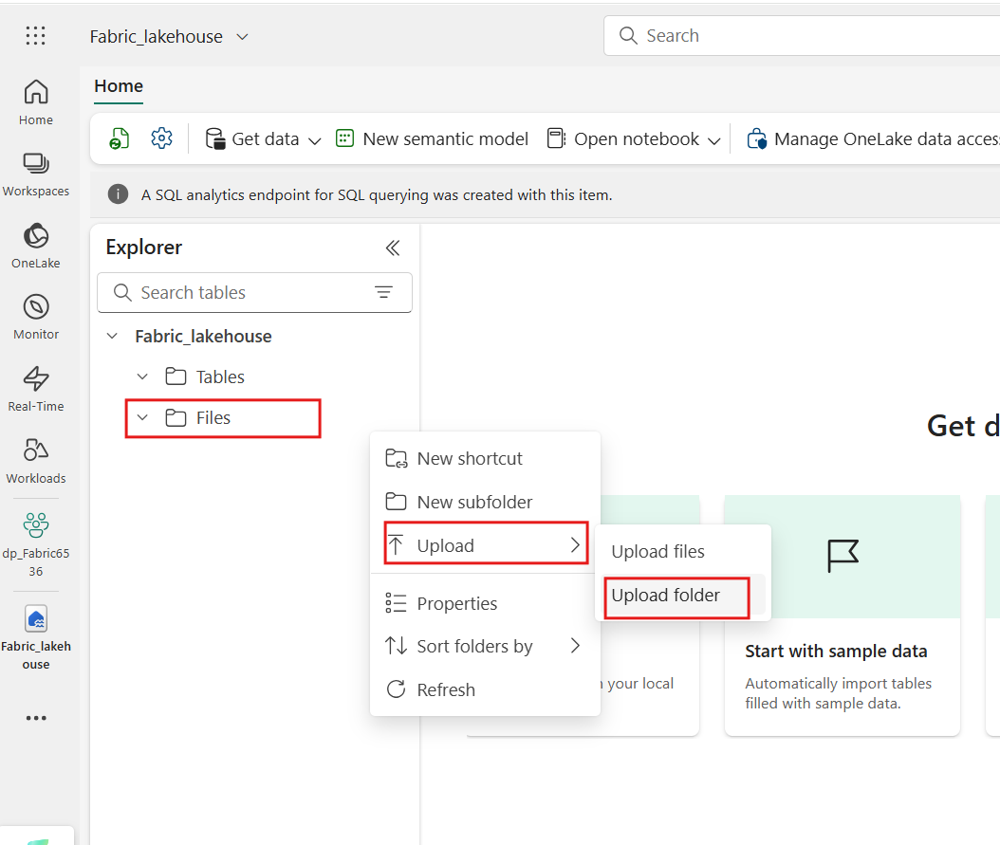
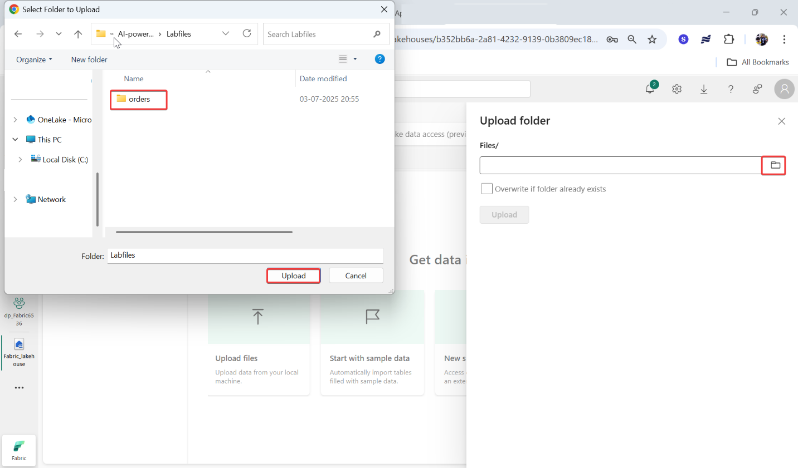
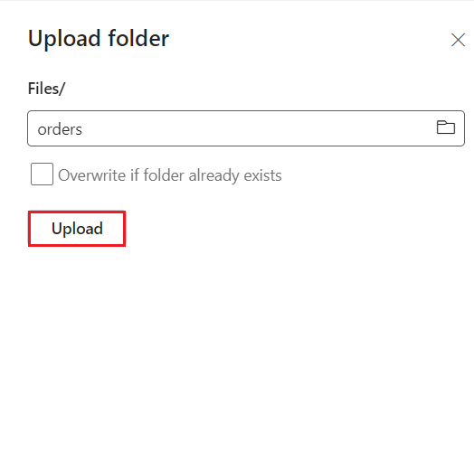
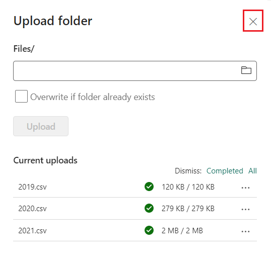
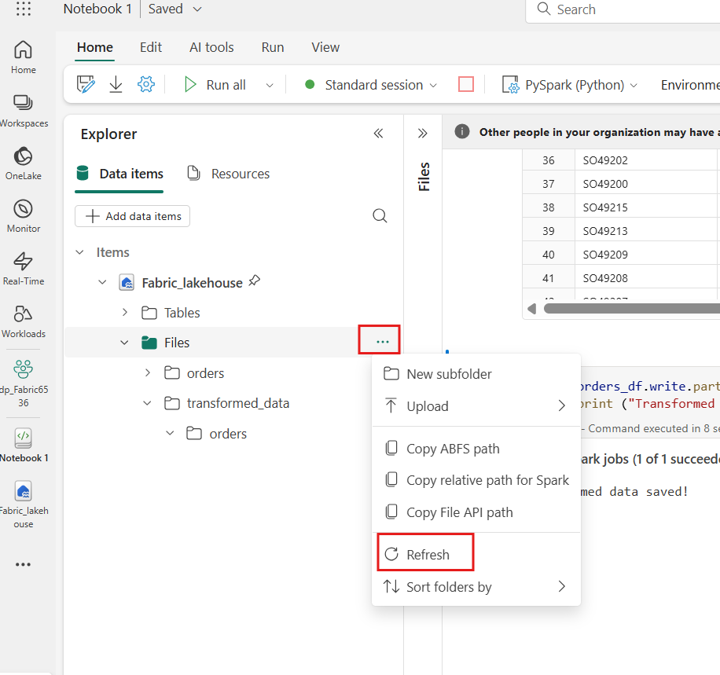

# 사용 사례 04: Apache Spark를 사용하여 데이터 분석

**소개**

Apache Spark는 분산 데이터 처리를 위한 오픈 소스 엔진으로, 데이터 레이크
스토리지에서 방대한 양의 데이터를 탐색, 처리 및 분석하는 데 널리
사용됩니다. Spark는 Azure HDInsight, Azure Databricks, Azure Synapse
Analytics 및 Microsoft Fabric을 비롯한 많은 데이터 플랫폼 제품에서 처리
옵션으로 사용할 수 있습니다. Spark의 이점 중 하나는 Java, Scala, Python
및 SQL을 포함한 광범위한 프로그래밍 언어를 지원한다는 것입니다. Spark는
데이터 정리 및 조작, 통계 분석 및 기계 학습, 데이터 분석 및 시각화를
포함한 데이터 처리 워크로드를 위한 매우 유연한 솔루션입니다.

Microsoft Fabric Lakehouse의 테이블은 Apache Spark용 오픈 소스 *Delta
Lake* 형식을 기반으로 합니다. Delta Lake는 일괄 처리 및 스트리밍 데이터
작업 모두에 대한 관계형 의미 체계에 대한 지원을 추가하고, Apache Spark를
사용하여 데이터 레이크의 기본 파일을 기반으로 하는 테이블의 데이터를
처리하고 쿼리할 수 있는 Lakehouse 아키텍처를 만들 수 있습니다.

Microsoft Fabric에서 Dataflow (Gen2)은 다양한 데이터 원본에 연결하고
Power Query Online에서 변환을 수행합니다. 그런 다음 데이터
파이프라인에서 데이터를 Lakehouse 또는 기타 분석 저장소로 수집하거나
Power BI 보고서에 대한 데이터 세트를 정의하는 데 사용할 수 있습니다.

이 랩은 Dataflow (Gen2)의 다양한 요소를 소개하고 엔터프라이즈에 존재할
수 있는 복잡한 솔루션을 만들지 않도록 설계되었습니다.

**목표**:

- Fabric 평가판을 사용하도록 설정된 Microsoft Fabric에서 작업 영역을
  만듭니다.

- Lakehouse 환경을 설정하고 분석을 위해 데이터 파일을 업로드합니다.

- 대화형 데이터 탐색 및 분석을 위한 Notebook을 생성합니다.

- 추가 처리 및 시각화를 위해 데이터를 데이터 프레임에 로드합니다.

- PySpark를 사용하여 데이터에 변환을 적용합니다.

- 최적화된 쿼리를 위해 변환된 데이터를 저장하고 분할합니다.

- 구조화된 데이터 관리를 위해 Spark 메타스토어에 테이블 만들기

- DataFrame을 "salesorders"라는 관리되는 Delta table로 저장합니다.

- DataFrame을 지정된 경로를 사용하여 "external_salesorder"이라는 외부
  Delta table로 저장합니다.

- 관리 테이블과 외부 테이블의 속성을 설명하고 비교합니다.

- 분석 및 보고를 위해 테이블에 대한 SQL 쿼리를 실행합니다.

- matplotlib 및 seaborn과 같은 Python 라이브러리를 사용하여 데이터를
  시각화합니다.

- 데이터 엔지니어링 환경에서 Data Lakehouse를 설정하고 후속 분석을 위해
  관련 데이터를 수집합니다.

- 데이터를 추출, 변환 및 Lakehouse에 로드하기 위한 Dataflow을
  정의합니다.

- Power Query 내에서 데이터 대상을 구성하여 변환된 데이터를 Lakehouse에
  저장합니다.

- Dataflow을 파이프라인에 통합하여 예약된 데이터 처리 및 수집을
  활성화합니다.

- 작업공간 및 연관된 요소를 제거하여 연습을 마무리합니다.

# 연습 1: 작업 영역, Lakehouse, Notebook 만들기 및 데이터 프레임에 데이터 로드 

## 태스크 1: 작업공간 작성 

Fabric에서 데이터로 작업하기 전에 Fabric 평가판을 사용하도록 설정된 작업
영역을 생성하세요.

1.  브라우저를 열고 주소 표시줄로 이동한 다음
    +++https://app.fabric.microsoft.com/+++ URL을 입력하거나 붙여넣은 후
    **Enter** 버튼을 누르세요.

> **참고**: Microsoft Fabric 홈 페이지로 이동하면 \#2에서 \#4까지의
> 단계를 건너뛰세요.
>
> 

2.  **Microsoft Fabric** 창에서 자격 증명을 입력하고 **Submit** 버튼을
    클릭하세요.

> 

3.  **Microsoft** 창에서 암호를 입력하고 **Sign in** 버튼을
    클릭하세요**.**

> 

4.  **Stay signed in?** 창에서 **Yes** 버튼을 클릭하세요.

> 

5.  Fabric home page에서 **+New workspace** 타일을 선택하세요.

> 

6.  **Create a workspace tab**에서 다음 세부 정보를 입력하고 **Apply**
    버튼을 클릭하세요.

[TABLE]

> 
>
> 

7.  배포가 완료될 때까지 기다리세요. 완료하는 데 2-3분이 소요됩니다. 새
    작업 영역이 열리면 비어 있어야 합니다.

> 

## 작업 2: Lakehouse 생성하고 파일 업로드

이제 작업 영역이 있으므로 포털에서 *데이터 엔지니어링* 환경으로 전환
하고 분석할 데이터 파일에 대한 Data Lakehouse를 만들 차례입니다.

1.  탐색 모음에서 **+** **New item** 버튼을 클릭하여 새 Eventhouse를
    생성하세요.

2.  "**Lakehouse**" 타일을 클릭하세요.

3.  **New lakehouse** 대화 상자에서 **Name** 필드에
    **+++Fabric_lakehouse+++** 를 입력하고 새 lakehouse를
    열려면 **Create** 버튼을 클릭하세요.

4.  1분 정도 후에 빈 새 lakehouse가 만들어집니다. 분석을 위해 일부
    데이터를 데이터 lakehouse로 수집해야 합니다.

5.  **Successfully created SQL endpoint**라는 알림이 표시됩니다.

6.  **Explorer** 섹션의, **fabric_lakehouse**에서 **Files folder** 옆에
    마우스를 놓은 후 가로 줄임표**(...)** 메뉴를 클릭하세요.
    **Upload**를 탐색하여 클릭한 후 아래 이미지와 같이 **Upload folder**
    폴더를 클릭하세요.

7.  오른쪽에 나타나는 **Upload folder** 창에서 **Files/** 아래의
    **folder icon**을 선택한 후 **C:\LabFiles**로 이동한 후 **orders**
    폴더를 선택하고 **Upload** 버튼을 클릭하세요.

8.  **Upload 3 files to this site?** 대화 상자가 나타나면 **Upload**
    버튼을 클릭하세요.

9.  Upload folder 창에서 **Upload** 버튼을 클릭하세요.

> 

10. 파일이 업로드되면 **Upload folder** 창을 닫으세요.

> 

11. **Files** 확장하고 **orders** 폴더를 선택하고 CSV 파일이
    업로드되었는지 확인하세요.

> 

## 작업 3: notebook를 생성하기

Apache Spark에서 데이터로 작업하려면 *Notebook*을 생성할 수 있습니다.
Notebook은 코드를 작성 및 실행하고(여러 언어로) 메모를 추가하여 문서화할
수 있는 대화형 환경을 제공합니다.

1.  Datalake의 **orders** 폴더 내용을 보는 동안 **Home**  페이지의
    **Open notebook** 메뉴에서 **New notebook**을 선택하세요.

2.  몇 초 후에 단일 *셀*이 포함된 새 노트북이 열립니다. 전자 필기장은
    *코드* 또는 *마크다운*(서식이 지정된 텍스트)을 포함할 수 있는 하나
    이상의 셀로 구성됩니다.

3.  첫 번째 셀(현재 코드 셀)을 선택한 다음 오른쪽 상단의 동적 도구
    모음에서 **M↓** 버튼을 사용하여 **convert the cell to
    a markdown cell**.

4.  셀이 마크다운 셀로 변경되면 포함된 텍스트가 렌더링됩니다.

5.  🖉 (**Edit**) 버튼을 사용하여 셀을 편집 모드로 전환하고 모든 텍스트를
    바꾼 다음 다음과 같이 마크다운을 수정하세요.

> CodeCopy
>
> \# Sales order data exploration
>
> Use the code in this notebook to explore sales order data.

6.  전자 필기장에서 셀 외부의 아무 곳이나 클릭하여 편집을 중지하고
    렌더링된 마크다운을 확인하세요.

## 작업 4: 데이터 프레임에 데이터 로드

이제 데이터를 *데이터 프레임*에 로드하는 코드를 실행할 준비가
되었습니다. Spark의 데이터 프레임은 Python의 Pandas 데이터 프레임과
유사하며 행과 열의 데이터 작업을 위한 공통 구조를 제공합니다.

**참고**: Spark는 Scala, Java 등을 포함한 여러 코딩 언어를 지원합니다.
이 연습에서는 Python의 Spark 최적화 변형인 *PySpark*를 사용합니다.
PySpark는 Spark에서 가장 일반적으로 사용되는 언어 중 하나이며 Fabric
Notebook의 기본 언어입니다.

1.  노트북이 표시된 상태에서 **Files** 목록을 확장하고 **orders** 폴더를
    선택하여 CSV 파일이 노트북 편집기 옆에 나열되도록 합니다.

2.  그러나 이제 마우스를 2019.csv 파일. 2019.csv 옆의 수평 타원
    **(...)**을 클릭하세요. **Load data**를 탐색하고 클릭한 후
    **Spark**를 선택하세요. 다음 코드가 포함된 새 코드 셀이 노트북에
    추가됩니다:

> CodeCopy
>
> df =
> spark.read.format("csv").option("header","true").load("Files/orders/2019.csv")
>
> \# df now is a Spark DataFrame containing CSV data from
> "Files/orders/2019.csv".
>
> display(df)
>
> 
>
> 

**팁**: « 아이콘을 **사용하여 왼쪽의 Lakehouse 탐색기 창을 숨길 수
있습니다** . 함

그래서 노트북에 집중하는 데 도움이 될 것입니다.

3.  셀 왼쪽에 있는 **▷ Run cell**버튼을 사용하여 실행하세요.

**참고**: Spark 코드를 처음 실행하는 것이므로 Spark 세션을 시작해야
합니다. 즉, 세션의 첫 번째 실행을 완료하는 데 1분 정도 걸릴 수 있습니다.
후속 실행이 더 빨라집니다.

4.  셀 명령이 완료되면 셀 아래의 출력을 검토하면 다음과 유사해야 합니다:

5.  출력에는 2019.csv 파일의 데이터 행과 열이 표시됩니다. 그러나 열
    머리글이 제대로 보이지 않습니다. 데이터를 데이터 프레임에 로드하는
    데 사용되는 기본 코드는 CSV 파일에 첫 번째 행에 열 이름이 포함되어
    있다고 가정하지만, 이 경우 CSV 파일에는 헤더 정보가 없는 데이터만
    포함됩니다.

6.  **header** 더 옵션을 **false**로 설정하도록 코드를 수정하세요.
    **Cell**의 모든 코드를 다음 코드로 바꾸고 **▷ Run cell** 버튼을
    클릭하고 출력을 검토하세요.

> CodeCopy
>
> df =
> spark.read.format("csv").option("header","false").load("Files/orders/2019.csv")
>
> \# df now is a Spark DataFrame containing CSV data from
> "Files/orders/2019.csv".
>
> display(df)

7.  이제 데이터 프레임에 첫 번째 행이 데이터 값으로 올바르게 포함되지만
    열 이름은 자동으로 생성되어 그다지 유용하지 않습니다. 데이터를
    이해하려면 파일의 데이터 값에 대한 올바른 스키마 및 데이터 유형을
    명시적으로 정의해야 합니다.

8.  **Cell**의 모든 코드를 다음 코드로 바꾸고 **▷ Run cell** 버튼을
    클릭하고 출력을 검토하세요.

> from pyspark.sql.types import \*
>
> orderSchema = StructType(\[
>
> StructField("SalesOrderNumber", StringType()),
>
> StructField("SalesOrderLineNumber", IntegerType()),
>
> StructField("OrderDate", DateType()),
>
> StructField("CustomerName", StringType()),
>
> StructField("Email", StringType()),
>
> StructField("Item", StringType()),
>
> StructField("Quantity", IntegerType()),
>
> StructField("UnitPrice", FloatType()),
>
> StructField("Tax", FloatType())
>
> \])
>
> df =
> spark.read.format("csv").schema(orderSchema).load("Files/orders/2019.csv")
>
> display(df)
>
> 
>
> 

9.  이제 데이터 프레임에는 올바른 열 이름이 포함됩니다(각 행의 서수
    위치를 기반으로 하는 모든 데이터 프레임에 내장된 열인 **Index**
    외에도). 열의 데이터 형식은 셀의 시작 부분에서 가져온 Spark SQL
    라이브러리에 정의된 표준 형식 집합을 사용하여 지정됩니다.

10. 데이터 프레임을 확인하여 변경 사항이 데이터에 적용되었는지
    확인하세요.

11. 셀 출력 아래에 있는 + **Code** 아이콘을 사용하여 Notebook에 새 코드
    셀을 추가하고 다음 코드를 입력하세요. **▷ Run cell**버튼을 클릭하고
    출력을 검토하세요.

> CodeCopy
>
> display(df)
>
> 

12. 데이터 프레임에는 **2019.csv** 파일의 데이터만 포함됩니다. 파일
    경로가 \* 와일드카드를 사용하여 **orders** 폴더의 모든 파일에서 판매
    주문 데이터를 읽도록 코드를 수정하세요

13. 셀 출력 아래에 있는 + **Code** 아이콘을 사용하여 Notebook에 새 코드
    셀을 추가하고 다음 코드를 입력하세요.

CodeCopy

> from pyspark.sql.types import \*
>
> orderSchema = StructType(\[
>
>     StructField("SalesOrderNumber", StringType()),
>
>     StructField("SalesOrderLineNumber", IntegerType()),
>
>     StructField("OrderDate", DateType()),
>
>     StructField("CustomerName", StringType()),
>
>     StructField("Email", StringType()),
>
>     StructField("Item", StringType()),
>
>     StructField("Quantity", IntegerType()),
>
>     StructField("UnitPrice", FloatType()),
>
>     StructField("Tax", FloatType())
>
>     \])
>
> df =
> spark.read.format("csv").schema(orderSchema).load("Files/orders/\*.csv")
>
> display(df)
>
> 

14. 수정된 코드 셀을 실행하고 출력을 검토하면 이제 2019년, 2020년,
    2021년 매출이 포함되어야 합니다.

> 

**참고**: 행의 하위 집합만 표시되므로 모든 연도의 예를 못할 수 있습니다.

# 연습 2: 데이터 프레임의 데이터 탐색

dataframe 개체에는 포함된 데이터를 필터링, 그룹화 및 조작하는 데 사용할
수 있는 다양한 함수가 포함되어 있습니다.

## 작업 1: 데이터 프레임 필터링

1.  셀 출력 아래에 있는 + **Code** 아이콘을 사용하여 Notebook에 새 코드
    셀을 추가하고 다음 코드를 입력하세요.

> customers = df\['CustomerName', 'Email'\]
>
> print(customers.count())
>
> print(customers.distinct().count())
>
> display(customers.distinct())
>
> 

2.  새 코드 셀을 실행하고 결과를 검토하세요. 다음 세부 사항을
    준수하십시오.:

    - 데이터 프레임에 대한 작업을 수행하면 결과는 새 데이터
      프레임입니다(이 경우 **df** 데이터 프레임에서 열의 특정 하위
      집합을 선택하여 새 **고객** 데이터 프레임이 생성됨)

    - Dataframe은 포함된 데이터를 요약하고 필터링하는 데 사용할 수 있는
      **count** 및 **distinct**와 같은 함수를 제공합니다.

    &nbsp;

    - dataframe\['Field1', 'Field2', ...\] 구문은 열의 하위 집합을
      정의하는 약식 방법입니다. **select** 메서드를 사용할 수도 있으므로
      위 코드의 첫 번째 줄은 customers = df.select("CustomerName",
      "Email") 로 작성할 수 있습니다.

> 

3.  코드를 수정하고 cell의 모든 코드를 다음 코드로 바꾼 후 **▷ Run
    cell** 버튼을 클릭하세요:

> CodeCopy
>
> customers = df.select("CustomerName",
> "Email").where(df\['Item'\]=='Road-250 Red, 52')
>
> print(customers.count())
>
> print(customers.distinct().count())
>
> display(customers.distinct())

4.  수정된 코드를 실행하여 ***Road-250 Red, 52*** 제품을 구매한 고객을
    봅니다. 한 함수의 출력이 다음 함수의 입력이 되도록 여러 함수를 함께
    "**연결**"할 수 있습니다 - 이 경우 **select** 메서드에 의해 생성된
    데이터 프레임은 필터링 기준을 적용하는 데 사용되는 **where** 메서드
    의 소스 데이터 프레임입니다.

> 

## 작업 2: Aggregate and group data in a dataframe

1.  \+ **Code**를 클릭하고 아래 코드를 복사하여 붙여넣은 후 **Run cell**
    버튼을 클릭하세요.

> CodeCopy
>
> productSales = df.select("Item", "Quantity").groupBy("Item").sum()
>
> display(productSales)
>
> 

2.  결과에는 제품별로 그룹화된 주문 수량의 합계가 표시됩니다.
    **groupBy** 메서드 는 *Item*별로 행을 그룹화하고 후속 **합계** 집계
    함수는 나머지 모든 숫자 열(이 경우 Quantity)에 적용됩니다

3.  \+ **Code**를 클릭하고 아래 코드를 복사하여 붙여넣은 후 **Run cell**
    버튼을 클릭하세요.

> **CodeCopy**
>
> from pyspark.sql.functions import \*
>
> yearlySales =
> df.select(year("OrderDate").alias("Year")).groupBy("Year").count().orderBy("Year")
>
> display(yearlySales)
>
> 

4.  결과에는 연간 판매 주문 수가 표시됩니다. **select** 메서드 에는
    **OrderDate** 필드 의 연도 구성 요소를 추출하는 SQL *연도* 함수가
    포함되어 있습니다(이 때문에 코드에는 Spark SQL 라이브러리에서 함수를
    가져오는 import 문이 포함되어 있음). 그런 다음 **별칭** 메서드를
    사용하여 추출된 연도 값에 열 이름을 할당합니다. 그런 다음 데이터는
    파생된 **Year** 열별로 그룹화 되고 각 그룹의 행 수가 계산된 후
    마지막으로 **orderBy** 메서드를 사용하여 결과 데이터 프레임을
    정렬합니다.

# 연습 3: Spark를 사용하여 데이터 파일 변환

데이터 엔지니어의 일반적인 작업은 특정 형식이나 구조로 데이터를 수집하고
추가 다운스트림 처리 또는 분석을 위해 변환하는 것입니다.

## 작업 1: 데이터 프레임 메서드 및 함수를 사용하여 데이터 변환

1.  \+ Code를 클릭하고 아래 코드를 복사하여 붙여넣으세요.

**CodeCopy**

> from pyspark.sql.functions import \*
>
> \## Create Year and Month columns
>
> transformed_df = df.withColumn("Year",
> year(col("OrderDate"))).withColumn("Month", month(col("OrderDate")))
>
> \# Create the new FirstName and LastName fields
>
> transformed_df = transformed_df.withColumn("FirstName",
> split(col("CustomerName"), " ").getItem(0)).withColumn("LastName",
> split(col("CustomerName"), " ").getItem(1))
>
> \# Filter and reorder columns
>
> transformed_df = transformed_df\["SalesOrderNumber",
> "SalesOrderLineNumber", "OrderDate", "Year", "Month", "FirstName",
> "LastName", "Email", "Item", "Quantity", "UnitPrice", "Tax"\]
>
> \# Display the first five orders
>
> display(transformed_df.limit(5))
>
> 

2.  **코드를 실행**하여 다음 변환을 사용하여 원래 주문 데이터에서 새
    데이터 프레임을 생성하세요:

    - **OrderDate** 열을 기반으로 **Year **및
      **Month**을** **추가합니다.

    - **CustomerName** 열을 기반으로 **FirstName** 및 **LastName** 열을
      추가합니다.

    - 열을 필터링하고 순서를 변경하여 **CustomerName** 열을 제거합니다.

> 

3.  출력을 검토하고 데이터에 대한 변환이 이루어졌는지 확인하세요.

Spark SQL 라이브러리의 모든 기능을 사용하여 행을 필터링하고, 열을 파생,
제거, 이름 바꾸고, 기타 필요한 데이터 수정을 적용하여 데이터를 변환할 수
있습니다.

**팁**: Dataframe 객체의 메서드에 대해 자세히 알아보려면 [*Spark
dataframe
documentation*](https://spark.apache.org/docs/latest/api/python/reference/pyspark.sql/dataframe.html)를
참조하세요.

## 작업 2: 변환된 데이터 저장

1.  **다음 코드로 새 셀을 추가**하여 변환된 데이터 프레임을 Parquet
    형식으로 저장하세요 (이미 있는 경우 데이터 덮어쓰기). 셀을 실행하고
    데이터가 저장되었다는 메시지를 기다리세요.

> CodeCopy
>
> transformed_df.write.mode("overwrite").parquet('Files/transformed_data/orders')
>
> print ("Transformed data saved!")
>
> **참고**: 일반적으로 *Parquet* 형식은 추가 분석 또는 분석 저장소로의
> 수집에 사용할 데이터 파일에 선호됩니다. Parquet은 대부분의 대규모
> 데이터 분석 시스템에서 지원되는 매우 효율적인 형식입니다. 실제로
> 때로는 데이터 변환 요구 사항이 단순히 다른 형식(예: CSV)에서 Parquet로
> 데이터를 변환하는 것일 수 있습니다!
>
> 
>
> 

2.  왼쪽의 **Lakehouse** 탐색기 창에서 **... Files** 노드의 메뉴에서
    **Refresh**을 선택하세요.

> 

3.  **transformed_data** 폴더를 클릭하여 **orders**라는 새 폴더가
    포함되어 있는지 확인 하며, 이 폴더에는 하나 이상의 **Parquet
    files**이 포함되어 있습니다.

> 

4.  \+ **Code** 다음 코드를 클릭하여 **transformed_data -\> orders**
    폴더의 parquet 파일에서 새 데이터 프레임을 로드하세요:

> **CodeCopy**
>
> orders_df =
> spark.read.format("parquet").load("Files/transformed_data/orders")
>
> display(orders_df)
>
> 

5.  셀을 실행하고 결과에 parquet 파일에서 로드된 주문 데이터가
    표시되는지 확인하세요.

> 

## 작업 3: 파티션된 파일에 데이터 저장

1.  새 셀을 추가하고 다음 코드로 **+ Code**를 클릭하세요. 데이터
    프레임을 저장하고 데이터를 **Year** 및**Month**로 분할하세요. 셀을
    실행하고 데이터가 저장되었다는 메시지를 기다리세요.

> CodeCopy
>
> orders_df.write.partitionBy("Year","Month").mode("overwrite").parquet("Files/partitioned_data")
>
> print ("Transformed data saved!")
>
> 
>
> 

2.  왼쪽의 **Lakehouse** 탐색기 창에서 ... **Files** 노드의 메뉴에서
    **Refresh**을 선택하세요

3.  **partitioned_orders** 폴더를 확장하여 **Year=xxxx**라는 폴더의 계층
    구조가 포함되어 있는지 확인하세요. 각 폴더에는 **Month=xxxx**라는
    폴더가 포함되어 있습니다. 각 월 폴더에는 해당 월의 주문이 포함된
    쪽모이 세공 마루 파일이 포함되어 있습니다.

> 데이터 파일 분할은 대량의 데이터를 처리할 때 성능을 최적화하는
> 일반적인 방법입니다. 이 기술은 성능을 크게 향상시키고 데이터를 더 쉽게
> 필터링할 수 있습니다.

4.  새 셀을 추가하고 다음 코드로 **+ Code**를 클릭하여
    **orders.parquet** 파일에서 새 데이터 프레임을 로드하세요:

> CodeCopy
>
> orders_2021_df =
> spark.read.format("parquet").load("Files/partitioned_data/Year=2021/Month=\*")
>
> display(orders_2021_df)

5.  셀을 실행하고 결과에 2021년 판매에 대한 주문 데이터가 표시되는지
    확인하세요. 경로 (**Year** 및 **Month**)에 지정된 분할 열은 데이터
    프레임에 포함되지 않습니다.

# **연습 3: 테이블 및 SQL에 대한 작업**

보았듯이 dataframe 객체의 기본 메서드를 사용하면 파일의 데이터를 매우
효과적으로 쿼리하고 분석할 수 있습니다. 그러나 많은 데이터 분석가는 SQL
구문을 사용하여 쿼리할 수 있는 테이블로 작업하는 것이 더 편합니다. Spark
는 관계형 테이블을 정의할 수 있는 메타스토어를 제공합니다. dataframe
개체를 제공하는 Spark SQL 라이브러리는 SQL 문을 사용하여 메타스토어의
테이블을 쿼리하는 것도 지원합니다. Spark의 이러한 기능을 사용하면 데이터
레이크의 유연성을 관계형 데이터 웨어하우스의 구조화된 데이터 스키마 및
SQL 기반 쿼리와 결합할 수 있으므로 "Data Lakehouse"라는 용어가
사용됩니다.

## 작업 1: 관리되는 테이블 생성하기

Spark 메타스토어의 테이블은 데이터 레이크의 파일에 대한 관계형
추상화입니다. 테이블은 *관리*(이 경우 파일이 메타스토어에 의해 관리됨)
또는 *외부*(테이블이 메타스토어와 독립적으로 관리하는 데이터 레이크의
파일 위치를 참조함)일 수 있습니다.

1.  새 코드를 추가하고 노트북에 + **Code**셀을 클릭한 후 다음 코드를
    입력하면 판매 주문 데이터의 데이터 프레임이 **salesorder**라는
    테이블로 저장됩니다:

> CodeCopy
>
> \# Create a new table
>
> df.write.format("delta").saveAsTable("salesorders")
>
> \# Get the table description
>
> spark.sql("DESCRIBE EXTENDED salesorders").show(truncate=False)

**참고**: 이 예제에 대해 몇 가지 사항에 주목할 가치가 있습니다. 첫째,
명시적 경로가 제공되지 않으므로 테이블의 파일은 메타스토어에서
관리됩니다. 둘째, 테이블은 **delta**형식으로 저장됩니다. 여러 파일
형식(CSV, Parquet, Avro 등)을 기반으로 테이블을 만들 수 있지만 *delta
lake*는 트랜잭션, 행 버전 관리 및 기타 유용한 기능에 대한 지원을
포함하여 테이블에 관계형 데이터베이스 기능을 추가하는 Spark 기술입니다.
Delta 형식으로 테이블을 만드는 것은 Fabric의 Data Lakehouse에
선호됩니다.

2.  코드 셀을 실행하고 새 테이블의 정의를 설명하는 출력을 검토하세요.

3.  **Lakehouse 탐색기** 창의 **...Tables** 폴더의 메뉴에서
    **Refresh**을 선택하세요.

4.  **Tables **노드를 확장하고 **salesorders** 테이블이 만들어졌는지
    확인하세요.

5.  **salesorders** 테이블 옆에 마우스를 놓은 후 가로 줄임표(...)를
    클릭하세요. **Load data**를 탐색하고 클릭한 후 **Spark**를
    선택하세요.

6.  ▷ **Run cell** 버튼을 클릭하고 Spark SQL 라이브러리를 사용하여
    PySpark 코드의 **salesorder** 테이블 에 대한 SQL 쿼리를 포함하고
    쿼리 결과를 데이터 프레임에 로드하세요.

> CodeCopy
>
> df = spark.sql("SELECT \* FROM \[your_lakehouse\].salesorders LIMIT
> 1000")
>
> display(df)

## 작업 2: 외부 테이블 생성

스키마 메타데이터가 Lakehouse의 메타스토어에 정의되어 있지만 데이터
파일은 외부 위치에 저장되는 *외부 테이블을* 만들 수도 있습니다.

1.  첫 번째 코드 셀에서 반환된 결과 아래에서 **+ Code **버튼을 사용하여
    새 코드 셀이 없는 경우 새 코드 셀을 추가하세요. 새 셀에 다음 코드를
    입력하세요.

CodeCopy

> df.write.format("delta").saveAsTable("external_salesorder",
> path="\<abfs_path\>/external_salesorder")

2.  **Lakehouse 탐색기** 창의 **...**메뉴를 클릭하여 **Files** 폴더에서
    메모장에서 **Copy ABFS path를** 선택하세요.

> ABFS 경로는 Lakehouse에 대한 OneLake 스토리지에 있는 **Files **폴더에
> 대한 정규화된 경로입니다:

abfss://dp_Fabric29@onelake.dfs.fabric.microsoft.com/Fabric_lakehouse.Lakehouse/Files/external_salesorder

3.  이제 코드 셀로 이동하여 **\<abfs_path\>**를 메모장에 복사한
    **path**로 바꾸면 코드가 데이터 프레임을 파일 폴더 위치의
    **external_salesorder**라는 폴더에 데이터 파 **Files**일이 있는 외부
    테이블로 저장됩니다. 전체 경로는 다음과 유사해야 합니다.

abfss://dp_Fabric29@onelake.dfs.fabric.microsoft.com/Fabric_lakehouse.Lakehouse/Files/external_salesorder

4.  셀 왼쪽에 있는 **▷ (*Run cell*)** 버튼을 사용하여 실행하세요.

5.  **Lakehouse 탐색기** 창의 **...Tables** 폴더의 메뉴에서
    **Refresh**을 선택하세요.

6.  **Tables **노드를 확장하고 **external_salesorder** 테이블이
    만들어졌는지 확인하세요.

7.  왼쪽의 **Lakehouse** 탐색기 창에서 ... **Files** 노드의 메뉴에서
    **Refresh**을 선택하세요.

8.  **Files** 노드를 확장하고 테이블의 데이터 파일에 대한
    **external_salesorder** 폴더가 만들어졌는지 확인하세요.

## 작업 3: 관리되는 테이블과 외부 테이블 비교

관리형 테이블과 외부 테이블의 차이점을 살펴보겠습니다.

1.  코드 셀에서 반환된 결과 아래에서 **+ Code **버튼을 사용하여 새 코드
    셀을 추가하세요. 아래 코드를 코드 셀에 복사하고 셀 왼쪽에 있는
    **▷*(Run cell***) 버튼을 사용하여 실행하세요.

> SqlCopy
>
> %%sql
>
> DESCRIBE FORMATTED salesorders;
>
> 

2.  결과에서 **/Tables/salesorders**로 끝나는 Lakehouse의 OneLake
    스토리지에 대한 경로여야 하는 테이블의 **Location** 속성을 봅니다
    (전체 경로를 보려면 ** Data type** 열을 넓혀야 할 수 있음).

3.  여기에 표시된 대로 **external_saleorder** 테이블의 세부 정보를
    표시하도록**DESCRIBE** 명령을 수정하세요.

4.  코드 셀에서 반환된 결과 아래에서 **+ Code **버튼을 사용하여 새 코드
    셀을 추가하세요. 아래 코드를 복사하고 셀 왼쪽에 있는 **▷ (Run
    cell**) 버튼을 사용하여 실행하세요.

> SqlCopy
>
> %%sql
>
> DESCRIBE FORMATTED external_salesorder;

5.  결과에서 **/Files/external_saleorder**로 끝나는 Lakehouse의 OneLake
    스토리지에 대한 경로여야 하는 테이블의 **Location** 속성을
    봅니다(전체 경로를 보려면 **Data type** 열을 넓혀야 할 수 있음).

## 작업4: 셀에서 SQL 코드 실행

PySpark 코드가 포함된 셀에 SQL 문을 포함할 수 있는 것이 유용하지만
데이터 분석가는 종종 SQL에서 직접 작업하기를 원합니다.

1.  노트북에 대한 **+ Code**셀을 클릭하고 다음 코드를 입력하세요. **▷
    Run cell **버튼을 클릭하고 결과를 검토하세요. 다음을 관찰하세요.

    - 셀 시작 부분의 %%sql 줄(매직이라고 함)은 PySpark 대신 Spark SQL
      언어 런타임을 사용하여 이 셀에서 코드를 실행해야 함을 나타냅니다.

    - SQL 코드는 이전에 만든 **salesorders** 테이블을 참조합니다.

    - SQL 쿼리의 출력은 셀 아래에 결과로 자동으로 표시됩니다.

> SqlCopy
>
> %%sql
>
> SELECT YEAR(OrderDate) AS OrderYear,
>
> SUM((UnitPrice \* Quantity) + Tax) AS GrossRevenue
>
> FROM salesorders
>
> GROUP BY YEAR(OrderDate)
>
> ORDER BY OrderYear;

**참고:** Spark SQL 및 데이터 프레임에 대한 자세한 내용은[*Spark SQL
documentation*](https://spark.apache.org/docs/2.2.0/sql-programming-guide.html)를
참조하세요.

# 연습 4: Spark를 사용하여 데이터 시각화

속담에 따르면 사진 한 장이 천 마디 말보다 가치가 있으며, 차트는 종종 천
행의 데이터보다 낫습니다. Fabric의 노트북에는 데이터 프레임 또는 Spark
SQL 쿼리에서 표시되는 데이터에 대한 기본 제공 차트 보기가 포함되어
있지만 포괄적인 차트 작성을 위해 설계되지 않았습니다. 그러나
**matplotlib** 및 **seaborn**과 같은 Python 그래픽 라이브러리 를
사용하여 데이터 프레임의 데이터에서 차트를 만들 수 있습니다.

## 작업1: 결과를 차트로 보기

1.  노트북에 대한 **+ Code**셀을 클릭하고 다음 코드를 입력하세요. **▷
    Run cell **버튼을 클릭하고 이전에 생성한 **salesorders **보기의
    데이터가 반환되는지 확인하세요.

> SqlCopy
>
> %%sql
>
> SELECT \* FROM salesorders

2.  셀 아래의 결과 섹션에서 **View** 옵션을 **Table **에서 + **New
    chart**로 변경하세요.

3.  차트의 오른쪽 위에 있는 **Start editing** 버튼을 사용하여 차트의
    옵션 창을 표시하세요. 다음과 같이 옵션을 설정하고 **Apply**을
    선택하세요:

    - **Chart type**: Bar chart

    - **Key**: Item

    - **Values**: Quantity

    - **Series Group**: *leave blank*

    - **Aggregation**: Sum

    - **Stacked**: *Unselected*

4.  차트가 다음과 유사한지 확인하세요.

> 

## 작업 2: matplotlib 시작하기

1.  \+ Code를 클릭하고 아래 코드를 복사하여 붙여넣으세요. 코드를
    **실행**하고 연간 수익이 포함된 Spark 데이터 프레임을 반환하는지
    확인하세요.

> CodeCopy
>
> sqlQuery = "SELECT CAST(YEAR(OrderDate) AS CHAR(4)) AS OrderYear, \\
>
> SUM((UnitPrice \* Quantity) + Tax) AS GrossRevenue \\
>
> FROM salesorders \\
>
> GROUP BY CAST(YEAR(OrderDate) AS CHAR(4)) \\
>
> ORDER BY OrderYear"
>
> df_spark = spark.sql(sqlQuery)
>
> df_spark.show()
>
> 

2.  데이터를 차트로 시각화하기 위해 **matplotlib** Python 라이브러리를
    사용하여 시작하세요. 이 라이브러리는 다른 많은 라이브러리의 기반이
    되는 핵심 플로팅 라이브러리이며 차트를 생성하는 데 큰 유연성을
    제공합니다.

3.  \+ Code를 클릭하고 아래 코드를 복사하여 붙여넣으세요.

**CodeCopy**

> from matplotlib import pyplot as plt
>
> \# matplotlib requires a Pandas dataframe, not a Spark one
>
> df_sales = df_spark.toPandas()
>
> \# Create a bar plot of revenue by year
>
> plt.bar(x=df_sales\['OrderYear'\], height=df_sales\['GrossRevenue'\])
>
> \# Display the plot
>
> plt.show()

5.  **Run cell** 버튼을 클릭하고 각 연도의 총 수익이 포함된 세로 막대형
    차트로 구성된 결과를 검토하세요. 이 차트를 생성하는 데 사용된 코드의
    다음 기능에 유의하세요:

    - **matplotlib** 라이브러리에는 Pandas 데이터 프레임이 필요하므로
      Spark SQL 쿼리에서 반환된 *Spark* 데이터 프레임을 이 형식으로
      변환해야 합니다.

    - **matplotlib** 라이브러리의 핵심에는 **pyplot** 객체가 있습니다.
      이것은 대부분의 플로팅 기능의 기초입니다.

    - 기본 설정으로 인해 사용 가능한 차트가 생성되지만 사용자 지정할 수
      있는 범위가 상당히 큽니다.

> 

6.  다음과 같이 차트를 그리도록 코드를 수정하고 **cell**의 모든 코드를
    다음 코드로 바꾼 후 **▷ Run cell**버튼을 클릭하고 출력을 검토하세요.

> CodeCopy
>
> from matplotlib import pyplot as plt
>
> \# Clear the plot area
>
> plt.clf()
>
> \# Create a bar plot of revenue by year
>
> plt.bar(x=df_sales\['OrderYear'\], height=df_sales\['GrossRevenue'\],
> color='orange')
>
> \# Customize the chart
>
> plt.title('Revenue by Year')
>
> plt.xlabel('Year')
>
> plt.ylabel('Revenue')
>
> plt.grid(color='#95a5a6', linestyle='--', linewidth=2, axis='y',
> alpha=0.7)
>
> plt.xticks(rotation=45)
>
> \# Show the figure
>
> plt.show()
>
> 
>
> 

7.  이제 차트에 조금 더 많은 정보가 포함됩니다. 플롯은 기술적으로
    **Figure**에 포함되어 있습니다. 이전 예제에서 그림은 암시적으로
    생성되었습니다. 그러나 명시 적으로 만들 수 있습니다.

8.  다음과 같이 차트를 그리도록 코드를 수정하고 cell의 모든 코드를 다음
    코드로 바꾸세요.

> CodeCopy
>
> from matplotlib import pyplot as plt
>
> \# Clear the plot area
>
> plt.clf()
>
> \# Create a Figure
>
> fig = plt.figure(figsize=(8,3))
>
> \# Create a bar plot of revenue by year
>
> plt.bar(x=df_sales\['OrderYear'\], height=df_sales\['GrossRevenue'\],
> color='orange')
>
> \# Customize the chart
>
> plt.title('Revenue by Year')
>
> plt.xlabel('Year')
>
> plt.ylabel('Revenue')
>
> plt.grid(color='#95a5a6', linestyle='--', linewidth=2, axis='y',
> alpha=0.7)
>
> plt.xticks(rotation=45)
>
> \# Show the figure
>
> plt.show()

9.  **코드 셀을 다시 실행**하고 결과를 보세요. 그림은 플롯의 모양과
    크기를 결정합니다.

> 그림에는 각각 자체 축에 있는 여러 하위 플롯이 포함될 수 있습니다 .
>
> 
>
> 

10. 다음과 같이 차트를 표시하도록 코드를 수정하세요. 코드 셀을 **다시
    실행**하고 결과를 보세요. 그림에는 코드에 지정된 서브플롯이 포함되어
    있습니다.

> CodeCopy
>
> from matplotlib import pyplot as plt
>
> \# Clear the plot area
>
> plt.clf()
>
> \# Create a figure for 2 subplots (1 row, 2 columns)
>
> fig, ax = plt.subplots(1, 2, figsize = (10,4))
>
> \# Create a bar plot of revenue by year on the first axis
>
> ax\[0\].bar(x=df_sales\['OrderYear'\],
> height=df_sales\['GrossRevenue'\], color='orange')
>
> ax\[0\].set_title('Revenue by Year')
>
> \# Create a pie chart of yearly order counts on the second axis
>
> yearly_counts = df_sales\['OrderYear'\].value_counts()
>
> ax\[1\].pie(yearly_counts)
>
> ax\[1\].set_title('Orders per Year')
>
> ax\[1\].legend(yearly_counts.keys().tolist())
>
> \# Add a title to the Figure
>
> fig.suptitle('Sales Data')
>
> \# Show the figure
>
> plt.show()
>
> 
>
> 

**참고:** matplotlib를 사용한 플로팅에 대한 자세한 내용은[*matplotlib
documentation*](https://matplotlib.org/)를 참조하세요.

## 작업 3: seaborn 라이브러리 사용

**matplotlib**를 사용하면 여러 유형의 복잡한 차트를 만들 수 있지만
최상의 결과를 얻으려면 복잡한 코드가 필요할 수 있습니다. 이러한 이유로
수년에 걸쳐 복잡성을 추상화하고 기능을 향상시키기 위해 matplotlib를
기반으로 많은 새로운 라이브러리가 구축되었습니다. 그러한 도서관 중
하나가 **Seaborn**입니다.

1.  \+ **Code**를 클릭하고 아래 코드를 복사하여 붙여넣으세요.

CodeCopy

> import seaborn as sns
>
> \# Clear the plot area
>
> plt.clf()
>
> \# Create a bar chart
>
> ax = sns.barplot(x="OrderYear", y="GrossRevenue", data=df_sales)
>
> plt.show()

2.  **코드를 실행**하고 seaborn 라이브러리를 사용하여 막대 차트가
    표시되는지 확인하세요.

3.  다음과 같이 코드를 **수정하세요**. 수정된 코드를 실행하고 seaborn을
    사용하면 플롯에 대해 일관된 색상 테마를 설정할 수 있습니다.

> CodeCopy
>
> import seaborn as sns
>
> \# Clear the plot area
>
> plt.clf()
>
> \# Set the visual theme for seaborn
>
> sns.set_theme(style="whitegrid")
>
> \# Create a bar chart
>
> ax = sns.barplot(x="OrderYear", y="GrossRevenue", data=df_sales)
>
> plt.show()
>
> 

4.  코드를 다시 **수정하세요**. 수정된 코드를 실행하여 연간 수익을
    꺾은선형 차트로 봅니다.

> CodeCopy
>
> import seaborn as sns
>
> \# Clear the plot area
>
> plt.clf()
>
> \# Create a bar chart
>
> ax = sns.lineplot(x="OrderYear", y="GrossRevenue", data=df_sales)
>
> plt.show()
>
> 

**참고:** seaborn을 사용한 플로팅에 대한 자세한 내용은[*seaborn
documentation*](https://seaborn.pydata.org/index.html)를 참조하세요.

## 작업 4: 데이터 스트리밍에 Delta table 사용

Delta Lake는 스트리밍 데이터를 지원합니다. Delta table은 Spark 구조적
스트리밍 API를 사용하여 만든 데이터 스트림의 싱크 또는 원본일 수
있습니다. 이 예제에서는 시뮬레이션된 IoT(사물 인터넷) 시나리오에서 일부
스트리밍 데이터에 대한 싱크로 Delta table을 사용합니다.

1.  \+ **Code**를 클릭하고 아래 코드를 복사하여 붙여넣은 후 **Run cell**
    버튼을 클릭하세요.

CodeCopy

> from notebookutils import mssparkutils
>
> from pyspark.sql.types import \*
>
> from pyspark.sql.functions import \*
>
> \# Create a folder
>
> inputPath = 'Files/data/'
>
> mssparkutils.fs.mkdirs(inputPath)
>
> \# Create a stream that reads data from the folder, using a JSON
> schema
>
> jsonSchema = StructType(\[
>
> StructField("device", StringType(), False),
>
> StructField("status", StringType(), False)
>
> \])
>
> iotstream =
> spark.readStream.schema(jsonSchema).option("maxFilesPerTrigger",
> 1).json(inputPath)
>
> \# Write some event data to the folder
>
> device_data = '''{"device":"Dev1","status":"ok"}
>
> {"device":"Dev1","status":"ok"}
>
> {"device":"Dev1","status":"ok"}
>
> {"device":"Dev2","status":"error"}
>
> {"device":"Dev1","status":"ok"}
>
> {"device":"Dev1","status":"error"}
>
> {"device":"Dev2","status":"ok"}
>
> {"device":"Dev2","status":"error"}
>
> {"device":"Dev1","status":"ok"}'''
>
> mssparkutils.fs.put(inputPath + "data.txt", device_data, True)
>
> print("Source stream created...")
>
> 
>
> 

2.  *** Source stream created...*** 인쇄됩니다. 방금 실행한 코드는 일부
    데이터가 저장된 폴더를 기반으로 스트리밍 데이터 원본을 만들어 가상의
    IoT 디바이스의 판독값을 나타냅니다.

3.  \+ **Code**를 클릭하고 아래 코드를 복사하여 붙여넣은 후 **Run cell**
    버튼을 클릭하세요.

CodeCopy

> \# Write the stream to a delta table
>
> delta_stream_table_path = 'Tables/iotdevicedata'
>
> checkpointpath = 'Files/delta/checkpoint'
>
> deltastream =
> iotstream.writeStream.format("delta").option("checkpointLocation",
> checkpointpath).start(delta_stream_table_path)
>
> print("Streaming to delta sink...")
>
> 

4.  이 코드는 Delta 형식의 스트리밍 디바이스 데이터를
    **iotdevicedata**라는 폴더에 씁니다. 폴더 위치의 경로는
    **Tables** 폴더에 있으므로 테이블이 자동으로 생성됩니다. 테이블 옆에
    있는 가로 줄임표를 클릭한 후 **Refresh**을 클릭하세요.

5.  \+ **Code**를 클릭하고 아래 코드를 복사하여 붙여넣은 후 **Run cell**
    버튼을 클릭하세요.

> SqlCopy
>
> %%sql
>
> SELECT \* FROM IotDeviceData;
>
> 

6.  이 코드는 스트리밍 원본의 디바이스 데이터가 포함된 **IotDeviceData**
    테이블을 쿼리하세요.

7.  \+ **Code**를 클릭하고 아래 코드를 복사하여 붙여넣은 후 **Run cell**
    버튼을 클릭하세요.

> CodeCopy
>
> \# Add more data to the source stream
>
> more_data = '''{"device":"Dev1","status":"ok"}
>
> {"device":"Dev1","status":"ok"}
>
> {"device":"Dev1","status":"ok"}
>
> {"device":"Dev1","status":"ok"}
>
> {"device":"Dev1","status":"error"}
>
> {"device":"Dev2","status":"error"}
>
> {"device":"Dev1","status":"ok"}'''
>
> mssparkutils.fs.put(inputPath + "more-data.txt", more_data, True)
>
> 

8.  This code writes more hypothetical device data to the streaming
    source.

9.  \+ **Code**를 클릭하고 아래 코드를 복사하여 붙여넣은 후 **Run cell**
    버튼을 클릭하세요.

> SqlCopy
>
> %%sql
>
> SELECT \* FROM IotDeviceData;
>
> 

10. 이 코드는 **IotDeviceData** 테이블을 다시 쿼리하며, 이제 스트리밍
    원본에 추가된 추가 데이터가 포함되어야 합니다.

11. \+ **Code**를 클릭하고 아래 코드를 복사하여 붙여넣은 후 **Run cell**
    버튼을 클릭하세요.

> CodeCopy
>
> deltastream.stop()
>
> 

12. 이 코드는 스트림을 중지합니다..

## 작업 5: Notebook 저장 및 Spark 세션 종료

이제 데이터 작업을 마쳤으므로 Notebook을 의미 있는 이름으로 저장하고
Spark 세션을 종료할 수 있습니다.

1.  노트북 메뉴 모음에서 **⚙️ Settings** 아이콘을 사용하여 노트북 설정을
    보세요.

2.  Notebook의 **Name**을 +++**Explore Sales Orders**+++로 설정한 후
    설정 창을 닫으세요.

3.  Notebook 메뉴에서 **Stop session를** 선택하여 Spark 세션을
    종료합니다.

# 연습 5: Microsoft Fabric에서 Dataflow (Gen2) 생성하기

Microsoft Fabric에서 Dataflow(Gen2)은 다양한 데이터 원본에 연결하고
Power Query Online에서 변환을 수행합니다. 그런 다음 데이터
파이프라인에서 데이터를 Lakehouse 또는 기타 분석 저장소로 수집하거나
Power BI 보고서에 대한 데이터 세트를 정의하는 데 사용할 수 있습니다.

이 연습은 Dataflow(Gen2)의 다양한 요소를 소개하고 엔터프라이즈에 존재할
수 있는 복잡한 솔루션을 만들지 않도록 설계되었습니다

## 작업 1: 데이터를 수집하기 위한 Dataflow(Gen2) 생성하기

이제 Lakehouse가 있으므로 일부 데이터를 수집해야 합니다. 이를 수행하는
한 가지 방법은 *extract, transform, and load (ETL)* 프로세스를
캡슐화하는 Dataflow을 정의하는 것입니다.

1.  이제 왼쪽 탐색 창에서 **Fabric_lakehouse**를 클릭하세요.

> 

2.  **Fabric_lakehouse** 홈페이지에서 **Get data**의 드롭다운 화살표를
    클릭하고 **New Dataflow Gen2를** 선택하세요. 새 Dataflow에 대한
    Power Query 편집기가 열립니다.

> 

5.  **New Dataflow Gen2** 대화 상자의 **Name **필드에
    +++**Gen2_Dataflow**+++를 입력하고 Create 버튼을 클릭한 후 새
    Dataflow Gen2를 여세요.

> 

3.  **Home tab**의 **Power Query** 창에서 **Import from a Text/CSV
    file**을 클릭하세요.

> 

4.  **Connect to data source** 창에 **Connection settings**에서 **Link
    to file (Preview)** 라디오 버튼을 선택하세요

- **Link to file**: *Selected*

- **File path or
  URL**: +++https://raw.githubusercontent.com/MicrosoftLearning/dp-data/main/orders.csv+++

5.  **Connect to data source** 창에 **Connection credentials**에서 다음
    세부 정보를 입력하고 **Next** 버튼을 클릭하세요.

- **Connection**: Create new connection

- **data gateway**: (none)

- **Authentication kind**: Anonymous

> 

6.  **Preview file data** 창에서 데이터 소스를 생성하려면 **Create**를
    클릭하세요. 

7.  **Power Query**편집기에는 데이터 원본과 데이터 서식을 지정하기 위한
    초기 쿼리 단계 집합이 표시됩니다.

8.  toolbar ribbon에서, select the **Add column** 탭을 선택하세요.
    **Custom column**을 선택하세요.

 

9.  새 열 이름을 +++ **MonthNo** +++로 설정하고, 데이터 형식을 **Whole
    Number**로 설정한 후, **Custom column formula** 수식에 다음 수식을
    추가하세요:+++ **Date.Month(\[OrderDate\])+++** 확인을 선택하세요.
    **OK**를 선택하세요.

10. 사용자 지정 열을 추가하는 단계가 쿼리에 어떻게 추가되는지
    확인합니다. 결과 열이 데이터 창에 표시됩니다.

**팁:** 오른쪽의 쿼리 설정 창에서 **적용된 단계**에 각 변환 단계가
포함되어 있습니다. 하단에서 **다이어그램 흐름** 버튼을 전환하여 단계의
시각적 다이어그램을 켤 수도 있습니다.

단계를 위 또는 아래로 이동하고, 톱니바퀴 아이콘을 선택하여 편집할 수
있으며, 각 단계를 선택하여 미리보기 창에서 변환이 적용되는 것을 볼 수
있습니다.

작업 2: Dataflow에 대한 데이터 대상 추가

1.  **Power Query** toolbar ribbon에서 **Home** 탭을 선택하세요. D**ata
    destination** 드롭다운 메뉴에서 **Lakehouse**를 선택하세요 (선택되지
    않는 경우).

**참고:** 이 옵션이 회색으로 표시되면 이미 데이터 대상이 설정되어 있을
수 있습니다. Power Query 편집기의 오른쪽에 있는 쿼리 설정 창 아래쪽에서
데이터 대상을 확인합니다. 목적지가 이미 설정되어 있는 경우 기어를
사용하여 변경할 수 있습니다.

2.  **Lakehouse** 대상은 Power Query 편집기의 **query**에 **icon**으로
    표시됩니다.

3.  dataflow를 게시하려면 **Publish**를 선택하세요. 작업 영역에서
    **Dataflow** 1 Dataflow이 만들어질 때까지 기다리세요.

## 작업 3: 파이프라인에 Dataflow 추가

Dataflow을 파이프라인의 활동으로 포함할 수 있습니다. 파이프라인은 데이터
수집 및 처리 활동을 오케스트레이션하는 데 사용되며, 이를 통해 Dataflow을
예약된 단일 프로세스에서 다른 종류의 작업과 결합할 수 있습니다.
파이프라인은 Data Factory 환경을 포함하여 몇 가지 다른 환경에서 만들 수
있습니다.

1.  Synapse Data Engineering 홈페이지의 **dp_FabricXX** 창에서 **+New
    item** -\> **Data pipeline**를 선택하세요

2.  **New pipeline** 대화 상자에서 **Name** 필드에 **Load data**를
    입력하고 새 파이프라인을 열려면 **Create** 버튼을 클릭하세요.

3.  파이프라인 편집기가 열립니다.

> **팁**: 데이터 복사 마법사가 자동으로 열리면 닫으십시오!

4.  **Pipeline activity**를 선택하고 파이프라인에 **Dataflow** 활동을
    추가하세요.

5.  새 **Dataflow1** 활동을 선택한 상태에서 **Settings **탭의
    **Dataflow **드롭다운 목록에서 **Gen2_Dataflow**(이전에 만든
    Dataflow)를 선택하세요

6.  **Home** 탭에서 **🖫 (*Save*)** 아이콘을 사용하여 파이프라인을
    저장하세요.

7.  ▷ **Run **버튼을 사용하여 파이프라인을 실행하고 완료될 때까지
    기다리세요. 몇 분 정도 걸릴 수 있습니다.

> 
>
> 

8.  왼쪽 가장자리의 메뉴 모음에서 작업 공간(예: **dp_FabricXX**를
    선택하세요.

9.  **Fabric_lakehouse** 창에서 Lakehouse 유형의
    **Gen2_FabricLakehouse**를 선택하세요.

10. **Explorer**창에서 ... **Tables**의 메뉴에서 **refresh**을
    선택하세요. **Tables** 을 확장하고 Dataflow에서 생성한
    **orders** 테이블을 선택하세요.

**팁**: Power BI Desktop *Dataflow 커넥터*를 사용하여 Dataflow으로
수행된 데이터 변환에 직접 연결합니다.

또한 추가 변환을 수행하고, 새 데이터 세트로 게시하고, 특수 데이터 세트에
대해 의도한 대상과 배포할 수 있습니다.

## 태스크 4: 리소스 정리하기

이 연습에서는 Spark를 사용하여 Microsoft Fabric에서 데이터를 사용하는
방법을 알아보았습니다.

Lakehouse 탐색을 마친 경우 이 연습을 위해 만든 작업 영역을 삭제할 수
있습니다.

1.  왼쪽 막대에서 작업 영역의 아이콘을 선택하여 포함된 모든 항목을
    봅니다.

> 

2.  메뉴에서 **...**를 클릭하고 **Workspace settings**을 선택하세요.

3.  **General**을 선택하고 **Remove this workspace**를 선택하세요**.**

4.  **Delete workspace?** 대화 상자에서 **Delete** 버튼을 클릭하세요.

> 
>
> 

**요약**

이 사용 사례는 Power BI 내에서 Microsoft Fabric을 사용하는 프로세스를
안내합니다. 작업 공간 설정, Lakehouse 생성, 데이터 파일 업로드 및 관리,
데이터 탐색을 위한 노트북 사용 등 다양한 작업을 다룹니다. 참가자는
PySpark를 사용하여 데이터를 조작 및 변환하고, 시각화를 생성하고,
효율적인 쿼리를 위해 데이터를 저장 및 분할하는 방법을 배웁니다.

이 사용 사례에서 참가자는 Microsoft Fabric의 Delta table 작업에 중점을
둔 일련의 작업에 참여합니다. 작업에는 데이터 업로드 및 탐색, 관리형 및
외부 Delta table 생성, 속성 비교, 구조화된 데이터 관리를 위한 SQL 기능
도입, matplotlib 및 seaborn과 같은 Python 라이브러리를 사용한 데이터
시각화에 대한 통찰력을 제공하는 작업이 포함됩니다. 이 연습은 데이터
분석에 Microsoft Fabric을 활용하고 IoT 컨텍스트에서 데이터 스트리밍을
위한 Delta table을 통합하는 방법에 대한 포괄적인 이해를 제공하는 것을
목표로 합니다.

이 사용 사례는 Fabric 작업 영역을 설정하고, Data Lakehouse를 만들고,
분석을 위해 데이터를 수집하는 프로세스를 안내합니다. ETL 작업을 처리하기
위해 Dataflow을 정의하고 변환된 데이터를 저장하기 위한 데이터 대상을
구성하는 방법을 보여줍니다. 또한 자동화된 처리를 위해 Dataflow을
파이프라인에 통합하는 방법을 알아봅니다. 마지막으로 연습이 완료되면
리소스를 정리하는 지침이 제공됩니다.

이 랩에서는 Fabric 작업에 필요한 필수 기술을 제공하여 작업 영역을 만들고
관리하고, Data Lakehouse를 설정하고, 데이터 변환을 효율적으로 수행할 수
있도록 합니다. Dataflow을 파이프라인에 통합하면 데이터 처리 작업을
자동화하고 작업 흐름을 간소화하며 실제 시나리오에서 생산성을 향상시키는
방법을 배우게 됩니다. 정리 지침을 통해 불필요한 리소스를 남기지 않고
체계적이고 효율적인 작업 공간 관리 접근 방식을 촉진할 수 있습니다.
