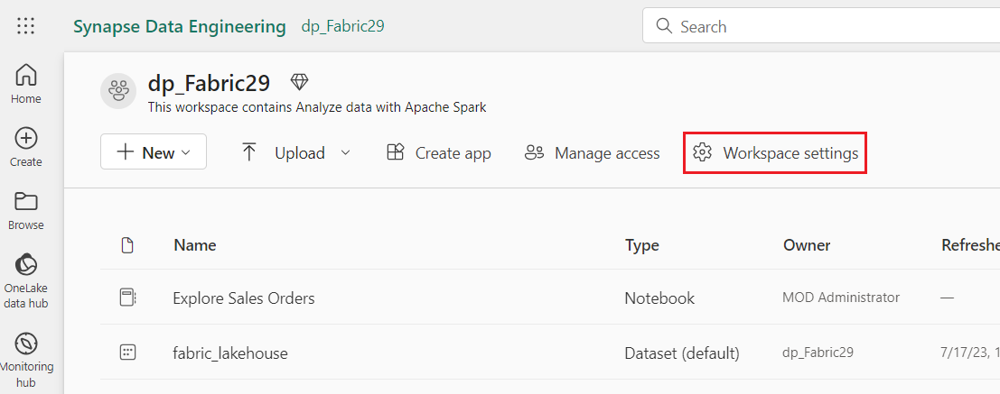

# ユースケース04: Apache Sparkでデータを分析する

**導入**

Apache
Sparkは、分散データ処理用のオープンソースエンジンであり、データレイクストレージ内の膨大なデータの探索、処理、分析に広く利用されています。Sparkは、Azure
HDInsight、Azure Databricks、Azure Synapse Analytics、Microsoft
Fabricなど、多くのデータプラットフォーム製品の処理オプションとして利用できます。Sparkの利点の一つは、Java、Scala、Python、
SQLなど、幅広いプログラミング言語をサポートしていることです。これにより、Sparkは、データクレンジングと操作、統計分析と機械学習、データ分析と可視化といったデータ処理ワークロードに非常に柔軟なソリューションを提供します。

Microsoft
FabricLakehouseのテーブルはオープンソースに基づいています Apache Spark
用の*Delta Lake*形式。Delta Lake
は、バッチデータ操作とストリーミングデータ操作の両方にリレーショナルセマンティクスのサポートを追加し、データレイク内の基盤ファイルに基づくテーブル内のデータを
Apache Spark を使用して処理およびクエリできる Lakehouse
アーキテクチャの作成を可能にします。

Microsoft Fabric では、データフロー (Gen2)
が様々なデータソースに接続し、Power Query Online
で変換を実行します。その後、データ
パイプラインでデータフローを使用して、Lakehouseやその他の分析ストアにデータを取り込み、Power
BI レポート用のデータセットを定義することができます。

)のさまざまな要素を紹介することを目的としており、企業内に存在する可能性のある複雑なソリューションを作成するものではありません。

**目的**:

- Fabric の試用版を有効にして、Microsoft Fabric
  にワークスペースを作成します。

- Lakehouse環境を確立し、分析用のデータ ファイルをアップロードします。

- インタラクティブなデータの探索と分析のためのノートブックを生成します。

- さらに処理して視覚化するために、データをデータフレームに読み込みます。

- PySparkを使用してデータに変換を適用します。

- クエリを最適化するために、変換されたデータを保存してパーティション分割します。

- 構造化データ管理のためにSparkメタストアにテーブルを作成する

- DataFrame を「 salesorders 」という名前の管理されたデルタ
  テーブルとして保存します。

- 指定されたパスを持つ「 external_salesorder 」という名前の外部デルタ
  テーブルとしてDataFrame を保存します。

- 管理対象テーブルと外部テーブルのプロパティについて説明し、比較します。

- 分析とレポートのためにテーブルに対して SQL クエリを実行します。

- matplotlib や seaborn などの Python
  ライブラリを使用してデータを視覚化します。

- データ エンジニアリング
  エクスペリエンスでデータLakehouseを確立し、後続の分析のために関連データを取り込みます。

- データを抽出、変換し、Lakehouseにロードするためのデータフローを定義します。

- 変換されたデータをLakehouseに保存するように、Power Query
  内でデータの保存先を構成します。

- データフローをパイプラインに組み込んで、スケジュールされたデータ処理と取り込みを有効にします。

- 演習を終了するには、ワークスペースと関連要素を削除します。

# 演習 1: ワークスペース、Lakehouse、ノートブックを作成し、データフレームにデータをロードする 

## タスク1: ワークスペースを作成する

Fabric でデータを操作する前に、Fabric
トライアルが有効になっているワークスペースを作成します。

1.  ブラウザを開き、アドレス バーに移動して、次の URL
    を入力または貼り付けます: + ++ https://app.fabric.microsoft.com/+++
    **Enter**ボタンを押します。

> **注**: Microsoft Fabric ホームページに移動した場合は、手順 2 から 4
> をスキップしてください。
>
> 

2.  **Microsoft Fabric**ウィンドウで資格情報を入力し、
    **\[Submit\]**ボタンをクリックします。

> 

3.  次に、 **Microsoft**ウィンドウでパスワードを入力し、 **\[Sign
    in\]**ボタンをクリックします**。**

> 

4.  **「Stay signed in?」ウィンドウ**で、
    **「Yes」**ボタンをクリックします。

> 

5.  Fabricホームページで、 **+ New workspace**を選択します。

> 

6.  **「Create a workspace」**タブで、次の詳細を入力し、
    **「Apply」**ボタンをクリックします。

    |  |  |
    |-----|----|
    |Name|	+++dp_Fabric@lab.LabInstance.Id+++ (must be a unique Id)| 
    |Description|	This workspace contains Analyze data with Apache Spark|
    |Advanced|	Under License mode, select Fabric capacity|
    |Default storage format	|Small dataset storage format|

> 
>
> 

7.  デプロイが完了するまでお待ちください。完了まで2～3分かかります。新しいワークスペースが開いたら、中身は空になっているはずです。

 

## タスク2:Lakehouseを作成し、ファイルをアップロードする

ポータルで*データ
エンジニアリングエクスペリエンス*に切り替えて、分析するデータ
ファイル用のデータLakehouseを作成します。

1.  ナビゲーション バーの**+ New
    item** ボタンをクリックして、新しいEventhouseを作成します。

      

2.  「**Lakehouse**」タイルをクリックします。


3.  **\[New Lakehouse\]**ダイアログ ボックスで、
    \[**Name\]**フィールドに**「 +++Fabric_lakehouse+++ 」**と入力し、
    **\[Create\]**ボタンをクリックして新しいLakehouseを開きます。


4.  1分ほど経つと、新しい空のLakehouseが作成されます。分析のために、データLakehouseにデータをインジェストする必要があります。

     

5.  **「Successfully created SQL endpoint」**という通知が表示されます。


6.  **Explorer**セクションの**fabric_lakehouse**の下で、**Files**フォルダ**の**横にマウスを移動し、水平の省略記号**(…)**メニューをクリックします。移動して**Upload**をクリックします。
    クリック 下の画像に示すように、**Upload**フォルダーにあります。

     

7.  右側に表示される**Upload**フォルダペインで、
    **Files/の**下のフォルダアイコンを選択し、
    **C:\LabFiles**を参照して注文を選択します。
    フォルダーに移動し、\[**Upload\]**ボタンをクリックします。

    

8.  **「Upload 3 files to this site?」という**ダイアログ
    ボックスが表示された場合は、 **「Upload」**ボタンをクリックします。


9.  \[Upload folder\] ペインで、\[**Upload\]**ボタンをクリックします。

> 

10. ファイルがアップロードされたら、 「**Upload
    folder」**ペインを閉じます。

> 

11. **\[Files\]**を展開し、**orders** フォルダを選択して、CSV
    ファイルがアップロードされていることを確認します。


## タスク3: ノートブックを作成する

*ノートブック*を作成します。ノートブックは、（複数の言語で）コードを記述して実行し、メモを追加して記録できるインタラクティブな環境を提供します。

1.  **Home**ページで、データレイクの**orders**フォルダの内容を表示しているときに、
    **\[Open notebook\]**メニューで**\[New notebook\]**を選択します。

 

2.  数秒後、1つの*セルを含む新しいノートブックが開きます。ノートブックは、コード*または*マークダウン*（フォーマットされたテキスト）を含む1つ以上のセルで構成されています。


3.  最初のセル (現在は*コード*セル) を選択し、右上にある動的ツール
    バーで**M↓**ボタンを使用して、**セルをマークダウン
    セルに変換します**。


4.  セルがマークダウン
    セルに変更されると、そこに含まれるテキストがレンダリングされます。


5.  **🖉**
    (編集)ボタンを使用してセルを編集モードに切り替え、すべてのテキストを置き換えてから、次のようにマークダウンを変更します。

    ```
    # Sales order data exploration
    
    Use the code in this notebook to explore sales order data.
    ```


6.  レンダリングされたマークダウンを表示するには、ノートブックのセルの外側の任意の場所をクリックします。


## タスク4: データフレームにデータをロードする

これで、データを*データフレームに読み込むコードを実行する準備が整いました*。Sparkのデータフレームは
PythonのPandasデータフレームに似ており、行と列でデータを操作するための共通構造を提供します。

**注**：SparkはScala、Javaなど、複数のコーディング言語をサポートしています。この演習では、
Spark向けに最適化されたPythonである*PySparkを使用します。PySpark*はSparkで最もよく使われる言語の1つであり、Fabricノートブックのデフォルト言語です。

1.  ノートブックが表示されている状態で、 **\[Files\]**リストを展開し、
    **orders**フォルダーを選択して、CSV ファイルがノートブック
    エディターの横に表示されるようにします。


2.  さて、マウスを2019.csvファイルに移動してください。2019.csvの横にある水平の省略記号（…）をクリックします。
    **「Load data」**に移動し、
    **「Spark」**を選択します。以下のコードを含む新しいコードセルがノートブックに追加されます。

    ```nocopy
    df = spark.read.format("csv").option("header","true").load("Files/orders/2019.csv")
    # df now is a Spark DataFrame containing CSV data from "Files/orders/2019.csv".
    display(df)
    ```
   
 
> 

**ヒント**：左側のLakehouse explorerパネルを非表示にするには、
**「」**アイコンを使用します。

ノートブックに集中するのに役立ちます。

3.  セルの左側にある**▷セル実行ボタン**を使用して、セルを実行します。


**注**：Sparkコードを実行するのは初めてなので、Sparkセッションを開始する必要があります。そのため、セッションの最初の実行には1分ほどかかる場合があります。その後の実行はより短くなります。

4.  セル
    コマンドが完了したら、セルの下の出力を確認します。出力は次のようになります。


5.  出力には、2019.csvファイルのデータの行と列が表示されます。ただし、列ヘッダーが正しく表示されないことに注意してください。データフレームにデータを読み込むために使用されるデフォルトのコードでは、CSVファイルの1行目に列名が含まれていると想定されていますが、このCSVファイルにはヘッダー情報のないデータのみが含まれています。

6.  コードを修正して、**ヘッダーオプションをfalse**に設定します。**セル**内のすべてのコードを次のコードに置き換え、
    **▷セル実行**ボタンをクリックして出力を確認します。

    ```
    df = spark.read.format("csv").option("header","false").load("Files/orders/2019.csv")
    # df now is a Spark DataFrame containing CSV data from "Files/orders/2019.csv".
    display(df)
    ```


7.  これでデータフレームの最初の行はデータ値として正しく含まれるようになりましたが、列名は自動生成されており、あまり役に立ちません。データを理解するには、ファイル内のデータ値に対して正しいスキーマとデータ型を明示的に定義する必要があります。

8.  **セル**内のすべてのコードを次のコードに置き換え、
    **▷セル実行**ボタンをクリックして出力を確認します。

    ```
    from pyspark.sql.types import *
    
    orderSchema = StructType([
        StructField("SalesOrderNumber", StringType()),
        StructField("SalesOrderLineNumber", IntegerType()),
        StructField("OrderDate", DateType()),
        StructField("CustomerName", StringType()),
        StructField("Email", StringType()),
        StructField("Item", StringType()),
        StructField("Quantity", IntegerType()),
        StructField("UnitPrice", FloatType()),
        StructField("Tax", FloatType())
        ])
    
    df = spark.read.format("csv").schema(orderSchema).load("Files/orders/2019.csv")
    display(df)
    ```
> 
>
> 

9.  これで、データフレームに正しい列名（各行の順序に基づいてすべてのデータフレームに組み込まれている列**Index**に加えて）が含まれるようになりました。列のデータ型は、セルの先頭にインポートされた
    Spark SQL
    ライブラリで定義されている標準の型セットを使用して指定されます。

10. データフレームを表示して、変更がデータに適用されたことを確認します。

11. セル出力の下にある**「+Code」**アイコンを使用してノートブックに新しいコードセルを追加し、次のコードを入力します。
    **▷ 「セルを実行」**ボタンをクリックして出力を確認します。

    ```
    display(df)
    ```
> 

12. データフレームには**2019.csv**ファイルのデータのみが含まれています。コードを修正し、ファイルパスにワイルドカード「\*」を使用して、
    **orders**フォルダ内のすべてのファイルから販売注文データを読み取ってください。

13. セル出力の下にある**+
    Code**アイコンを使用してノートブックに新しいコード
    セルを追加し、そこに次のコードを入力します。

    ```
    from pyspark.sql.types import *
    
    orderSchema = StructType([
        StructField("SalesOrderNumber", StringType()),
        StructField("SalesOrderLineNumber", IntegerType()),
        StructField("OrderDate", DateType()),
        StructField("CustomerName", StringType()),
        StructField("Email", StringType()),
        StructField("Item", StringType()),
        StructField("Quantity", IntegerType()),
        StructField("UnitPrice", FloatType()),
        StructField("Tax", FloatType())
        ])
    
    df = spark.read.format("csv").schema(orderSchema).load("Files/orders/*.csv")
    display(df)
    ```
> 

14. 変更したコード セルを実行し、出力を確認します。出力には 2019
    年、2020 年、2021 年の売上が含まれるようになります。

> 

**注**:
行のサブセットのみが表示されるため、すべての年の例を表示できない場合があります。

# 演習2:データフレーム内のデータの探索

データフレームオブジェクトには、そこに含まれるデータのフィルター処理、グループ化、その他の操作に使用できるさまざまな関数が含まれています。

## タスク1:データフレームをフィルタリングする

1.  セル出力の下にある**+Code**アイコンを使用してノートブックに新しいコード
    セルを追加し、そこに次のコードを入力します。

    ```
    customers = df['CustomerName', 'Email']
    print(customers.count())
    print(customers.distinct().count())
    display(customers.distinct())
    ```
    

2.  新しいコードセルを実行し、結果を確認します。以下の点に注意してください。

    - データフレームに対して操作を実行すると、結果は新しいデータフレーム（この場合は新しい**顧客）**になります**。** データフレームは、
      **DF**から特定の列のサブセットを選択して作成されます。 データフレーム）

    - データフレームには、含まれるデータを要約したりフィルタリングしたりするために使用できる**count**や**distinct**などの関数が用意されています。

    - dataframe\['Field1', 'Field2',
      ...\] 構文は、列のサブセットを定義するための簡潔な方法です。selectメソッドも使用できるため、上記のコードの最初の行はcustomers
      = df.select (" CustomerName ", "Email")と記述できます。

> 

3.  コードを変更し、**セル内のすべてのコードを**次のコードに置き換えて、次のように**▷セル実行**ボタンをクリックします。

    ```
    customers = df.select("CustomerName", "Email").where(df['Item']=='Road-250 Red, 52')
    print(customers.count())
    print(customers.distinct().count())
    display(customers.distinct())
    ```

4.  修正したコードを**実行**して、**Road-250 Red**,
    52を購入した顧客を表示します。複数の関数を「**連鎖**」して、ある関数の出力を次の関数の入力として使用できることに注意してください。この場合、**select**メソッドによって作成されたデータフレームが、フィルタリング条件を適用する**where**メソッドのソースデータフレームとなります。

> 

## タスク2:データフレーム内のデータを集計してグループ化する

1.  **「+Code」**をクリックし、以下のコードをコピーして貼り付け、
    **「Run cell」**ボタンをクリックします。

    ```
    productSales = df.select("Item", "Quantity").groupBy("Item").sum()
    display(productSales)
    ```
> 

2.  結果には、商品ごとにグループ化された注文数量の合計が表示されています。**groupBy**メソッドは行を*Itemでグループ化し*、その後に続く**sum**集計関数は残りの数値列（この場合はQuantity）に適用され*ます*。

3.  **「+Code」**をクリックし、以下のコードをコピーして貼り付け、
    **「Run cell」**ボタンをクリックします。


    ```
    from pyspark.sql.functions import *
    
    yearlySales = df.select(year("OrderDate").alias("Year")).groupBy("Year").count().orderBy("Year")
    display(yearlySales)
    ```
> 

4.  結果には年間の販売注文数が表示されています。**select**メソッドには、OrderDateフィールドの年要素を抽出するSQL
    **year**関数が含まれていることに注意してください**（***その*ため、**コード**にはSpark
    SQLライブラリから関数をインポートするための**import**文が含まれています）。次に、
    **alias**メソッドを使用して、抽出された年値に列名を割り当てます。次に、データは導出された*Year*列でグループ化され、各グループの行数が計算された後、最後に**orderBy**メソッドを使用して結果のデータフレームを並べ替えます。

# 演習3: Sparkを使用してデータファイルを変換する

データ
エンジニアの一般的なタスクは、特定の形式または構造でデータを取り込み、それをさらに下流の処理や分析のために変換することです。

## タスク 1:データフレームのメソッドと関数を使用してデータを変換する

1.  +Codeをクリックし、以下のコードをコピーして貼り付けます。

    ```
    from pyspark.sql.functions import *
    
    ## Create Year and Month columns
    transformed_df = df.withColumn("Year", year(col("OrderDate"))).withColumn("Month", month(col("OrderDate")))
    
    # Create the new FirstName and LastName fields
    transformed_df = transformed_df.withColumn("FirstName", split(col("CustomerName"), " ").getItem(0)).withColumn("LastName", split(col("CustomerName"), " ").getItem(1))
    
    # Filter and reorder columns
    transformed_df = transformed_df["SalesOrderNumber", "SalesOrderLineNumber", "OrderDate", "Year", "Month", "FirstName", "LastName", "Email", "Item", "Quantity", "UnitPrice", "Tax"]
    
    # Display the first five orders
    display(transformed_df.limit(5))
    ```
    

2.  コード**を実行して、**次の変換を含む元の注文データから新しいデータフレームを作成します。

    - **OrderDate列**に基づいて、 **Year列**と**Month列**を追加します。

    - **CustomerName列**に基づいて**FirstName列**と**LastName列**を追加します。

    - 列をフィルターして並べ替え、 **CustomerName**列を削除します。

     

3.  出力を確認し、データに変換が行われたことを確認します。


Spark SQL
ライブラリの全機能を活用して、行のフィルタリング、列の派生、削除、名前変更、その他の必要なデータ変更の適用などにより、データを変換できます。

**ヒント**: Dataframeオブジェクトのメソッドの詳細については、
[*Sparkデータフレームのドキュメントを参照してください*](https://spark.apache.org/docs/latest/api/python/reference/pyspark.sql/dataframe.html)。

## タスク2: 変換されたデータを保存する

1.  以下のコードを含む新しいセルを追加し、変換されたデータフレームをParquet形式で保存します（既にデータが存在する場合は上書きします）。セル**を実行し**、データが保存されたことを示すメッセージが表示されるまで待ちます。

    ```
    transformed_df.write.mode("overwrite").parquet('Files/transformed_data/orders')
    print ("Transformed data saved!")
    ```
> **注**：一般的に、さらなる分析や分析ストアへの取り込みに使用するデータファイルには、
> *Parquet形式が好まれます。Parquetは非常に効率的な形式で、ほとんどの*大規模データ分析システムでサポートされています。実際、データ変換の要件が、別の形式（CSVなど）からParquet形式へのデータ変換だけである場合もあります。
>
> 
>
> 

2.  次に、左側の**Lakehouse explorerラーペインで、 \[Files\]ノードの \[
    ...\]**メニューの**\[Refresh\]**を選択します。

> 

3.  **transformed_data**フォルダーをクリックして、
    **orders**という名前の新しいフォルダーが含まれていることを確認します。このフォルダーには、1
    つ以上の**Parquet ファイルが含まれています**。

> 

4.  **+ Code**をクリックし、 **transformed_data -\>
    orders**フォルダー内の parquet
    ファイルから新しいデータフレームを読み込みます。

    ```
    orders_df = spark.read.format("parquet").load("Files/transformed_data/orders")
    display(orders_df)
    ```
> 

5.  セル**を実行**し、結果に parquet
    ファイルから読み込まれた注文データが表示されることを確認します。

> 

## タスク3: パーティションファイルにデータを保存する

1.  新しいセルを追加し、
    **「+Code」**をクリックして以下のコードを入力します。これにより、データフレームが保存され、データが**年**と**月**で分割されます。セルを**実行し**、データが保存されたことを示すメッセージが表示されるまで待ちます。

    ```
    orders_df.write.partitionBy("Year","Month").mode("overwrite").parquet("Files/partitioned_data")
    print ("Transformed data saved!")
    ```
> 
>
> 

2.  次に、左側の**Lakehouse explorer**ペインで、 **\[Files\]**ノードの
    **\[ ...\]**メニューの \[**Refresh**\]を選択します**。**


3.  **「partitioned_orders」フォルダ**を展開し、 **「Year=
    *xxxx」***という名前のフォルダ階層構造になっていることを確認します。各フォルダには「
    **Month=
    *xxxx」という名前のフォルダが含まれています***。各月フォルダには、その月の注文情報を含むparquetファイルが含まれています。


> データファイルのパーティション分割は、大量のデータを扱う際にパフォーマンスを最適化するための一般的な方法です。この手法により、パフォーマンスが大幅に向上し、データのフィルタリングが容易になります。

4.  新しいセルを追加し、次のコードを含む**+Code**をクリックして、
    **orders.parquetファイル**から新しいデータフレームを読み込みます。

    ```
    orders_2021_df = spark.read.format("parquet").load("Files/partitioned_data/Year=2021/Month=*")
    display(orders_2021_df)
    ```

5.  セルを**実行**し、結果に 2021
    年の売上の注文データが表示されることを確認します。パスで指定されたパーティション列
    (**年**と**月**)
    はデータフレームに含まれていないことに注意してください。


# **演習3: テーブルとSQLの操作**

ご覧のとおり、データフレームオブジェクトのネイティブメソッドを使用すると、ファイルからデータを非常に効率的にクエリおよび分析できます。しかし、多くのデータアナリストは、SQL構文を使用してクエリできるテーブルでの作業に慣れています。Sparkは、リレーショナルテーブルを定義できるメタストアを提供します。データフレームオブジェクトを提供するSpark
SQLライブラリは、メタストア内のテーブルをクエリするためのSQLステートメントの使用もサポートしています。Sparkのこれらの機能を使用することで、データレイクの柔軟性と、リレーショナルデータウェアハウスの構造化データスキーマおよびSQLベースのクエリを組み合わせることができます。これが「データレイクハウス」と呼ばれる理由です。

タスク1：マネージドテーブルを作成します。

## タスク1: 管理対象テーブルを作成する

Sparkメタストア内のテーブルは、データ
レイク内のファイルに対するリレーショナル抽象化です。テーブルは*管理対象*(この場合、ファイルはメタストアによって管理されます)
または*外部(この場合、テーブルは*メタストアとは独立して管理されるデータ
レイク内のファイルの場所を参照します) になります。

1.  新しいコードを追加し、
    ノートブックの**+Code**セルをクリックし、次のコードを入力します。これにより、販売注文データのデータフレームが**salesorders**という名前のテーブルとして保存されます。

    ```
    # Create a new table
    df.write.format("delta").saveAsTable("salesorders")
    
    # Get the table description
    spark.sql("DESCRIBE EXTENDED salesorders").show(truncate=False)
    ```

**注**：この例にはいくつか注目すべき点があります。まず、明示的なパスが指定されていないため、テーブルのファイルはメタストアによって管理されます。次に、テーブルは**デルタ**形式で保存されます。テーブルは複数のファイル形式（CSV、Parquet、Avroなど）に基づいて作成できますが、*デルタレイクは、トランザクションのサポート、行のバージョン管理、その他の便利な機能を含む*リレーショナルデータベース機能をテーブルに追加するSparkテクノロジーです。FabricのデータLakehouseでは、デルタ形式でのテーブル作成が推奨されます。

2.  コードセルを**実行**し、新しいテーブルの定義を示す出力を確認します。


3.  **Lakehouse
    explorer**ペインで、**Tables**フォルダーの**…**メニューで、
    **\[Refresh\]** を選択します。


4.  次に、 **\[Tables\]**ノードを展開し、
    **salesorders**テーブルが作成されたことを確認します。


5.  **salesordersテーブルの**横にマウスを移動し、水平の省略記号（…）をクリックします。
    **「Load data」**に移動し、 **「Spark」を選択します**。


6.  **▷Run cellボタン**をクリックすると、Spark SQL
    ライブラリを使用して、 **salesorderテーブルに対する
    SQLクエリを**PySparkコードに埋め込み、クエリの結果をデータフレームに読み込みます。

    ```
    df = spark.sql("SELECT * FROM [your_lakehouse].salesorders LIMIT 1000")
    display(df)
    ```


## タスク2: 外部テーブルを作成する

Lakehouseのメタストアでスキーマ メタデータが定義され、データ
ファイルが外部の場所に保存される*外部テーブル*を作成することもできます。

1.  最初のコードセルから返された結果の下にある**「+Code」**ボタンを使用して、新しいコードセルを追加します（まだコードセルが存在しない場合）。新しいセルに次のコードを入力します。

    ```
    df.write.format("delta").saveAsTable("external_salesorder", path="<abfs_path>/external_salesorder")
    ```


2.  **Lakehouse explorer**ペインの \[**Files**\] フォルダーの \[ …\]
    メニューで**、メモ**帳で \[**Copy ABFS path**\] を選択します**。**

> LakehouseのOneLakeストレージ内の**Files**フォルダーへの完全修飾パスです。次のようになります。

abfss://dp_Fabric29@onelake.dfs.fabric.microsoft.com/Fabric_lakehouse.Lakehouse/Files/external_salesorder

 

3.  コードセルに移動し、
    **\<abfs_path\>を**メモ帳にコピーした**パス**に置き換えます**。これにより、データ**フレームが外部テーブルとして保存され、
    **Files**フォルダ内の**external_salesorder**というフォルダにデータファイルが保存されます。完全なパスは次のようになります。

abfss://dp_Fabric29@onelake.dfs.fabric.microsoft.com/Fabric_lakehouse.Lakehouse/Files/external_salesorder

4.  セルの左側にある**▷ (Run cell)**ボタンを使用して、セルを実行します。


5.  **Lakehouse
    explorer**ペインの**Tables**フォルダーの**…メニュー**で、\[**Refresh\]**を選択します。


6.  次に、**Tables**ノードを展開し、
    **external_salesorder**テーブルが作成されたことを確認します。


7.  **Lakehouse explorer**ペインの **Files** フォルダーの … メニューで、
    **\[Refresh\]**を選択します。


8.  次に、 **\[Files\]**ノードを展開し、テーブルのデータ
    ファイル用に**external_salesorder**フォルダーが作成されていることを確認します。


## タスク 3: 管理対象テーブルと外部テーブルを比較する

管理対象テーブルと外部テーブルの違いを見てみましょう。

1.  コードセルから返された結果の下にある**「+Code」**ボタンを使用して、新しいコードセルを追加します。以下のコードをコードセルにコピーし、セルの左側にある**「▷」
    (*Run cell*)**ボタンを使用して実行します。

    ```
    %%sql
    
    DESCRIBE FORMATTED salesorders;
    ```
> 

2.  結果で、テーブルの**Location**プロパティを確認します**。これは、
    /Tables/
    salesorders**で終わるLakehouseのOneLakeストレージへのパスである必要があります(完全なパスを表示するには、**Data
    type**の列を広げる必要がある場合があります)。


3.  **DESCRIBE**コマンドを変更して、
    **external_saleorder**テーブルの詳細を表示します。

4.  コードセルから返された結果の下にある**「+Code」**ボタンを使用して、新しいコードセルを追加します。以下のコードをコピーし、セルの左側にある**「▷
    （*Run cell*）」**ボタンを使用して実行します。

    ```
    %%sql
    
    DESCRIBE FORMATTED external_salesorder;
    ```

5.  結果で、テーブルの**Location**プロパティを確認します。これは、
    **/Files/external_saleorder**で終わるLakehouseの **OneLake**
    ストレージへのパスである必要があります
    **(**完全なパスを表示するには、**Data
    type**を広げる必要がある場合があります)。


## タスク4: セル内でSQLコードを実行する

PySpark コードを含むセルに SQL
ステートメントを埋め込むことができると便利ですが、データ アナリストは
SQL で直接作業したい場合がよくあります。

1.  **「+Code**」セルをクリックし、以下のコードを入力します。 **「▷Run
    cell」**ボタンをクリックして結果を確認します。以下の点に注意してください。

    - セルの先頭にある %%sql 行 (マジック
      と呼ばれます)は*、*このセル内のコードを実行するために PySpark
      ではなく Spark SQL
      言語ランタイムを使用する必要があることを示します。

    - SQL コードは、以前に作成した**salesorders**テーブルを参照します。

    - SQLクエリの出力は、セルの下に結果として自動的に表示されます。

      ```
      %%sql
      SELECT YEAR(OrderDate) AS OrderYear,
             SUM((UnitPrice * Quantity) + Tax) AS GrossRevenue
      FROM salesorders
      GROUP BY YEAR(OrderDate)
      ORDER BY OrderYear;
      ```


**注**: Spark SQL とデータフレームの詳細については、 [*Spark SQL
のドキュメントを参照してください*](https://spark.apache.org/docs/2.2.0/sql-programming-guide.html)。

# 演習4: Sparkでデータを視覚化する

諺にもあるように、一枚の写真は千の言葉に値し、グラフは千行のデータよりも優れている場合が多いです。Fabricのノートブックには、データフレームまたはSpark
SQLクエリから表示されるデータ用のグラフビューが組み込まれていますが、包括的なグラフ作成には設計されていません。ただし、
**matplotlib**や**seaborn**などのPythonグラフィックライブラリを使用すれば、データフレーム内のデータからグラフを作成できます。

## タスク1: 結果をグラフとして表示する

1.  **「+ Code**」セルをクリックし、以下のコードを入力します。 **「▷Run
    cell」**ボタンをクリックし、先ほど作成した**salesorders**ビューからデータが返されることを確認します。

    ```
    %%sql
    SELECT * FROM salesorders
    ```


2.  セルの下の結果セクションで、\[**View\]**オプションを**\[Table\]**から**\[+New
    chart\]**に変更します。


3.  チャートの右上にある**「Start
    editing」**ボタンをクリックすると、チャートのオプションパネルが表示されます。以下のオプションを設定し、
    **「Apply」**を選択します。

    - **Chart type**: Bar chart

    - **X-axis**: Item

    - **Y-axis**: Quantity

    - **Series Group**: *leave blank*

    - **Aggregation**: Sum

    - **Stacked**: *Unselected*


4.  チャートが次のようになっていることを確認します

> 

## タスク2: matplotlibを使い始める

1.  **「+Code」**をクリックし、以下のコードをコピーして貼り付けます。コードを**実行**すると、年間収益を含むSparkデータフレームが返されることがわかります。

    ```
    sqlQuery = "SELECT CAST(YEAR(OrderDate) AS CHAR(4)) AS OrderYear, \
                    SUM((UnitPrice * Quantity) + Tax) AS GrossRevenue \
                FROM salesorders \
                GROUP BY CAST(YEAR(OrderDate) AS CHAR(4)) \
                ORDER BY OrderYear"
    df_spark = spark.sql(sqlQuery)
    df_spark.show()
    ```
> 

2.  データをグラフとして視覚化するために、まずは**matplotlib**
    Pythonライブラリを使用します。このライブラリは、他の多くのプロットライブラリのベースとなっているコアライブラリであり、グラフ作成において非常に柔軟な機能を提供します。

3.  **+ Code**をクリックし、以下のコードをコピーして貼り付けます。

**CodeCopy**

    ```
    from matplotlib import pyplot as plt
    
    # matplotlib requires a Pandas dataframe, not a Spark one
    df_sales = df_spark.toPandas()
    
    # Create a bar plot of revenue by year
    plt.bar(x=df_sales['OrderYear'], height=df_sales['GrossRevenue'])
    
    # Display the plot
    plt.show()
    ```


5.  **「Run
    cell」ボタン**をクリックして結果を確認します。結果は、各年の総売上高を示す縦棒グラフで構成されています。このグラフを作成するために使用されたコードの以下の特徴に注意してください。

    - **matplotlib**ライブラリには*Pandasデータフレーム*が必要なので、
      Spark SQL
      クエリによって返される*Sparkデータフレームをこの形式に*変換する必要があります。

    - **matplotlib**ライブラリの中核は**pyplot**オブジェクトです。これはほとんどのプロット機能の基盤となります。

    - デフォルト設定でも使えるチャートが出来上がりますが、カスタマイズの余地はかなりあります。

> 

6.  次のようにコードを変更してチャートをプロットし、**セル**内のすべてのコードを次のコードに置き換えて、
    **▷Run cell**ボタンをクリックして出力を確認します。

    ```
    from matplotlib import pyplot as plt
    
    # Clear the plot area
    plt.clf()
    
    # Create a bar plot of revenue by year
    plt.bar(x=df_sales['OrderYear'], height=df_sales['GrossRevenue'], color='orange')
    
    # Customize the chart
    plt.title('Revenue by Year')
    plt.xlabel('Year')
    plt.ylabel('Revenue')
    plt.grid(color='#95a5a6', linestyle='--', linewidth=2, axis='y', alpha=0.7)
    plt.xticks(rotation=45)
    
    # Show the figure
    plt.show()
    ```
> 
>
> 

7.  チャートに少し情報が追加されました。プロットは技術的には**Figure**に含まれています。前の例では、
    Figure
    は暗黙的に作成されていましたが、明示的に作成することもできます。

8.  次のようにグラフをプロットするコードを変更し、**セル**内のすべてのコードを次のコードに置き換えます。

    ```
    from matplotlib import pyplot as plt
    
    # Clear the plot area
    plt.clf()
    
    # Create a Figure
    fig = plt.figure(figsize=(8,3))
    
    # Create a bar plot of revenue by year
    plt.bar(x=df_sales['OrderYear'], height=df_sales['GrossRevenue'], color='orange')
    
    # Customize the chart
    plt.title('Revenue by Year')
    plt.xlabel('Year')
    plt.ylabel('Revenue')
    plt.grid(color='#95a5a6', linestyle='--', linewidth=2, axis='y', alpha=0.7)
    plt.xticks(rotation=45)
    
    # Show the figure
    plt.show()
    ```

9.  コードセルを**再実行**し、結果を確認します。図はプロットの形状とサイズを決定します。

> 図には、それぞれ独自の*軸上に複数のサブプロットを含めることができます*。
>
> 
>
> 

10. コードを以下のように修正してグラフをプロットします。コードセルを**再実行**し、結果を確認します。図には、コードで指定したサブプロットが含まれています。

    ```
    from matplotlib import pyplot as plt
    
    # Clear the plot area
    plt.clf()
    
    # Create a figure for 2 subplots (1 row, 2 columns)
    fig, ax = plt.subplots(1, 2, figsize = (10,4))
    
    # Create a bar plot of revenue by year on the first axis
    ax[0].bar(x=df_sales['OrderYear'], height=df_sales['GrossRevenue'], color='orange')
    ax[0].set_title('Revenue by Year')
    
    # Create a pie chart of yearly order counts on the second axis
    yearly_counts = df_sales['OrderYear'].value_counts()
    ax[1].pie(yearly_counts)
    ax[1].set_title('Orders per Year')
    ax[1].legend(yearly_counts.keys().tolist())
    
    # Add a title to the Figure
    fig.suptitle('Sales Data')
    
    # Show the figure
    plt.show()
    ```
> 
>
> 

**注**: matplotlib を使用したプロットの詳細については、 [*matplotlib
のドキュメントを参照してください*](https://matplotlib.org/)。

## タスク3: seabornライブラリを使用する

**matplotlib**
は複数の種類の複雑なグラフを作成できますが、最適な結果を得るには複雑なコードが必要になる場合があります。そのため、長年にわたり、matplotlib
をベースに多くの新しいライブラリが開発され、その複雑さを抽象化し、機能を強化してきました。そのようなライブラリの一つが**seaborn**です。

1.  **+Code**をクリックし、以下のコードをコピーして貼り付けます。

CodeCopy

    ```
    import seaborn as sns
    
    # Clear the plot area
    plt.clf()
    
    # Create a bar chart
    ax = sns.barplot(x="OrderYear", y="GrossRevenue", data=df_sales)
    plt.show()
    ```

2.  コードを**実行**し、seaborn
    ライブラリを使用して棒グラフが表示されることを確認します。


3.  コードを以下のように**変更**してください**。**変更したコードを**実行**すると、seaborn
    によってプロットに一貫したカラーテーマを設定できることがわかります。

    ```
    import seaborn as sns
    
    # Clear the plot area
    plt.clf()
    
    # Set the visual theme for seaborn
    sns.set_theme(style="whitegrid")
    
    # Create a bar chart
    ax = sns.barplot(x="OrderYear", y="GrossRevenue", data=df_sales)
    plt.show()
    ```
> 

4.  コードを以下のように**修正**してください**。**修正したコードを**実行**すると、年間収益が折れ線グラフで表示されます。

    ```
    import seaborn as sns
    
    # Clear the plot area
    plt.clf()
    
    # Create a bar chart
    ax = sns.lineplot(x="OrderYear", y="GrossRevenue", data=df_sales)
    plt.show()
    ```
> 

**注**: seaborn を使用したプロットの詳細については、 [*seaborn
のドキュメントを参照してください*](https://seaborn.pydata.org/index.html)。

## タスク4: ストリーミングデータにデルタテーブルを使用する

Delta Lakeはストリーミングデータをサポートしています。Deltaテーブルは、
Spark Structured Streaming
APIを使用して作成されたデータストリームの*シンク*または*ソースとして使用できます*。この例では、モノのインターネット（IoT）のシミュレーションシナリオにおいて、Deltaテーブルをストリーミングデータのシンクとして使用します。

1.  **「+Code」**をクリックし、以下のコードをコピーして貼り付け、
    **「Run cell」**ボタンをクリックします。

    ```
    from notebookutils import mssparkutils
    from pyspark.sql.types import *
    from pyspark.sql.functions import *
    
    # Create a folder
    inputPath = 'Files/data/'
    mssparkutils.fs.mkdirs(inputPath)
    
    # Create a stream that reads data from the folder, using a JSON schema
    jsonSchema = StructType([
    StructField("device", StringType(), False),
    StructField("status", StringType(), False)
    ])
    iotstream = spark.readStream.schema(jsonSchema).option("maxFilesPerTrigger", 1).json(inputPath)
    
    # Write some event data to the folder
    device_data = '''{"device":"Dev1","status":"ok"}
    {"device":"Dev1","status":"ok"}
    {"device":"Dev1","status":"ok"}
    {"device":"Dev2","status":"error"}
    {"device":"Dev1","status":"ok"}
    {"device":"Dev1","status":"error"}
    {"device":"Dev2","status":"ok"}
    {"device":"Dev2","status":"error"}
    {"device":"Dev1","status":"ok"}'''
    mssparkutils.fs.put(inputPath + "data.txt", device_data, True)
    print("Source stream created...")
    ```
> 
>
> 

2.  ***ソースストリームが作成されました…」という***メッセージが表示されていることを確認してください。実行したコードにより、仮想IoTデバイスからの読み取りデータが格納されているフォルダーに基づいて、ストリーミングデータソースが作成されました。

3.  **「+Code」**をクリックし、以下のコードをコピーして貼り付け、
    **「Run cell」**ボタンをクリックします。

    ```
    # Write the stream to a delta table
    delta_stream_table_path = 'Tables/iotdevicedata'
    checkpointpath = 'Files/delta/checkpoint'
    deltastream = iotstream.writeStream.format("delta").option("checkpointLocation", checkpointpath).start(delta_stream_table_path)
    print("Streaming to delta sink...")
    ```
> 

4.  このコードは、ストリーミングデバイスのデータをデルタ形式で**iotdevicedata**というフォルダに書き込みます。フォルダのパスは**Tables**フォルダ内にあるため、自動的にテーブルが作成されます。テーブルの横にある水平の省略記号をクリックし、
    **「Refresh」**をクリックしてください。


5.  **「+Code」**をクリックし、以下のコードをコピーして貼り付け、
    **「Run cell」**ボタンをクリックします。

    ```
    %%sql
    
    SELECT * FROM IotDeviceData;
    ```
> 

6.  このコードは、ストリーミング ソースからのデバイス
    データが含まれる**IotDeviceDataテーブルをクエリします。**

7.  **「+Code」**をクリックし、以下のコードをコピーして貼り付け、
    **「Run cell」**ボタンをクリックします。

    ```
    # Add more data to the source stream
    more_data = '''{"device":"Dev1","status":"ok"}
    {"device":"Dev1","status":"ok"}
    {"device":"Dev1","status":"ok"}
    {"device":"Dev1","status":"ok"}
    {"device":"Dev1","status":"error"}
    {"device":"Dev2","status":"error"}
    {"device":"Dev1","status":"ok"}'''
    
    mssparkutils.fs.put(inputPath + "more-data.txt", more_data, True)
    ```
> 

8.  このコードは、ストリーミング ソースにさらに多くの仮想デバイス
    データを書き込みます。

9.  **「+Code」**をクリックし、以下のコードをコピーして貼り付け、
    **「Run cell」**ボタンをクリックします。

    ```
    %%sql
    
    SELECT * FROM IotDeviceData;
    ```
> 

10. このコードは**IotDeviceData**テーブルを再度クエリし、ストリーミング
    ソースに追加された追加データが含まれるようになります。

11. **「+Code」**をクリックし、以下のコードをコピーして貼り付け、
    **「Run cell」**ボタンをクリックします。

    ```
    deltastream.stop()
    ```
> 

12. このコードはストリームを停止します。

## タスク5: ノートブックを保存してSparkセッションを終了する

データの操作が完了したら、わかりやすい名前でノートブックを保存し、Spark
セッションを終了できます。

1.  ノートブックのメニューバーで、⚙️
    設定アイコンを使用してノートブックの設定を表示します。

   

2.  ノートブックの**Nameを +++ Explore Sales Orders+++**に設定し、設定ペインを閉じます。


3.  ノートブック メニューで**\[Stop session\]**を選択して、Spark
    セッションを終了します。

   


# 演習 5: Microsoft Fabric でデータフロー(Gen2) を作成する

Microsoft Fabric では、データフロー (Gen2)
が様々なデータソースに接続し、Power Query Online
で変換を実行します。その後、データ
パイプラインでデータフローを使用して、Lakehouseやその他の分析ストアにデータを取り込み、Power
BI レポート用のデータセットを定義することができます。

この演習は、データフロー（Gen2）のさまざまな要素を紹介することを目的としており、企業に存在する可能性のある複雑なソリューションを作成するものではありません。

## タスク 1: データを取り込むためのデータフロー (Gen2) を作成する

Lakehouseが完成したら、そこにデータを取り込む必要があります。その方法の一つは、*抽出、変換、ロード*（ETL）プロセスをカプセル化するデータフローを定義することです。

1.  次に、左側のナビゲーション
    ペインで**Fabric_lakehouseをクリックします。**

    

2.  **Fabric_lakehouse の**ホームページで、 **「Get
    data」**のドロップダウン矢印をクリックし、 **「New Dataflow
    Gen2」**を選択します**。**新しいデータフロー用の Power Query
    エディターが開きます。

     

5.  **\[New Dataflow Gen2\]**ダイアログ ボックスで、
    \[**Name\]フィールド**に**「+++Gen2_Dataflow+++」**と入力し、
    **\[Create\]**ボタンをクリックして、新しいデータフロー Gen2
    を開きます。

> 

3.  **\[Home\] タブの\[Power Query\]**ペインで、 **\[Import from a
    Text/CSV file\]**をクリックします。

     

4.  **Connect to data source**ペインの**Connection settings**で、**Link
    to file (Preview)**ラジオボタンを選択します。

- **Link to file**: **Selected**

- **File path or
  URL**: +++https://raw.githubusercontent.com/MicrosoftLearning/dp-data/main/orders.csv+++


5.  **\[Connect to data source\]**ペインの**\[Connection credentials\]
    で、**次の詳細を入力し、 **\[Next\]**ボタンをクリックします。

- **Connection**: Create new connection
  
- **Connection name**: +++Orders-@lab.LabInstance.Id+++

- **data gateway**: (none)

- **Authentication kind**: Anonymous

 

6.  **Preview file data**ペインで、 **\[Create\]**をクリックしてデータ
    ソースを作成します。
    

8.  **Power Query**エディターには、データ
    ソースと、データをフォーマットするためのクエリ手順の初期セットが表示されます。


8.  ツールバーのリボンで**「Add column」**タブを選択します。次に、
    **「Custom column」**を選択します。

    

9.  新しい列名を +++ **MonthNo++ +に設定し**、データ型を**Whole
    Number**に設定して、次の数式を追加します**:** +++ **Date.Month
    (\[OrderDate \])+ ++** 。 「**Custom column formula」**
    で**\[OK\]**を選択します。


10. カスタム列を追加する手順がクエリに追加されていることに注意してください。結果の列はデータペインに表示されます。


**ヒント:**右側の「クエリ設定」ペインで、「**Applied
Steps」**に各変換ステップが含まれていることをご確認ください。また、下部にある**「Diagram
flow」**ボタンを切り替えて、ステップのビジュアルダイアグラムを表示することもできます。

ステップは上下に移動したり、歯車アイコンを選択して編集したりすることができ、各ステップを選択してプレビュー
ペインで変換の適用を確認することもできます。

タスク 2: Dataflow のデータ送信先を追加する

1.  **Power
    Query**ツールバーのリボンで、「**Home」**タブを選択します。次に、「D**ata
    destination」**ドロップダウンメニューで**「Lakehouse」**を選択します（まだ選択されていない場合）。


**注:**このオプションがグレー表示になっている場合は、既にデータの保存先が設定されている可能性があります。Power
Query
エディターの右側にあるクエリ設定ウィンドウの下部で、データの保存先を確認してください。既に保存先が設定されている場合は、歯車アイコンを使って変更できます。

2.  **Lakehouse**の宛先は、Power Query
    エディターの**クエリ**内に**アイコン**として示されます。


3. [Home]タブで、「Save」アイコンのドロップダウン矢印をクリックし、「Save, run & close」を選択して、クエリを公開して閉じます。


4. [Home]タブで、「Save」アイコンのドロップダウン矢印をクリックし、「Save, run & close」を選択して、クエリを公開して閉じます。

   

## タスク 3: パイプラインにデータフローを追加する

データフローをパイプラインのアクティビティとして含めることができます。パイプラインは、データの取り込みと処理のアクティビティをオーケストレーションするために使用され、データフローを他の種類の操作と組み合わせた単一のスケジュールされたプロセスを実現できます。パイプラインは、Data
Factory
エクスペリエンスを含むいくつかの異なるエクスペリエンスで作成できます。

1.  Fabricのホームページでは、 下
    **dp_FabricXX**ペインで、 **+ New item** -\> **pipeline**を選択します。

    

2.  **\[New pipeline\]ダイアログ ボックス**で、
    **\[Name\]フィールド**に**「Load data」と入力し**、
    **\[Create\]**ボタンをクリックして新しいパイプラインを開きます。


3.  パイプライン エディターが開きます。


> **ヒント**: データのコピー
> ウィザードが自動的に開いた場合は、閉じてください。

4.  **Pipeline
    activity**を選択し、パイプラインに**Dataflow**アクティビティを追加します。


5.  新しい**Dataflow1**アクティビティを選択した状態で、
    **\[Settings\]タブの\[Dataflow\]**ドロップダウン リストで、
    **Gen2_Dataflow** (以前に作成したデータフロー)を選択します。


6.  **\[Home\]タブ**で、 **🖫
    (*保存*)アイコン**を使用してパイプラインを保存します。

 

7.  **▷「Run」**ボタンを使用してパイプラインを実行し、完了するまでお待ちください。完了まで数分かかる場合があります。

     
>
> 


8.  左端のメニュー バーで、ワークスペース
    (つまり**dp_FabricXX)を**選択します。


9.  **Fabric_lakehouseペイン**で、 Lakehouse
    タイプの**Gen2_FabricLakehouse**を選択します。

 

10. **Explorer**ペインで、 **「Tables」**の**「…」メニューを選択し**、
    **「Refresh」**を選択します。次に、
    **「Tables」**を展開し、データフローによって作成された**「orders」**テーブルを選択します。


 

**ヒント**: Power BI Desktop*データフロー
コネクタを使用して*、データフローで実行されたデータ変換に直接接続します。

追加の変換を行って新しいデータセットとして公開し、特殊なデータセットの対象ユーザーに配布することもできます。

## タスク4: リソースをクリーンアップする

この演習では、Spark を使用して Microsoft Fabric
のデータを操作する方法を学習しました。

Lakehouseの探索が終了したら、この演習用に作成したワークスペースを削除できます。

1.  左側のバーで、ワークスペースのアイコンを選択すると、そこに含まれるすべてのアイテムが表示されます。

> 

2.  **…メニュー**で、**Workspace settings**を選択します。



3.  **\[General\]**を選択し、 **\[Remove this workspace\]
    をクリックします。**


4.  **\[Delete workspace?\]**ダイアログ ボックスで、
    **\[Delete\]**ボタンをクリックします。

> 
>
> 

**まとめ**

このユースケースでは、Power BI 内で Microsoft Fabric
を操作するプロセスを解説します。ワークスペースの設定、Lakehouseの作成、データファイルのアップロードと管理、ノートブックを使ったデータ探索など、様々なタスクを網羅しています。参加者は、PySpark
を使ったデータの操作と変換、ビジュアライゼーションの作成、効率的なクエリ実行のためのデータの保存とパーティション分割の方法を学びます。

このユースケースでは、参加者はMicrosoft
Fabricの差分テーブルの操作に焦点を当てた一連のタスクに取り組みます。タスクには、データのアップロードと探索、マネージドおよび外部差分テーブルの作成、それらのプロパティの比較が含まれます。ラボでは、構造化データを管理するためのSQL機能を紹介し、matplotlibやseabornなどのPythonライブラリを使用したデータ視覚化に関する洞察を提供します。これらの演習は、Microsoft
Fabricをデータ分析に活用し、
IoTコンテキストでストリーミングデータに差分テーブルを組み込む方法について包括的に理解することを目的としています。

このユースケースでは、Fabric
ワークスペースの設定、データLakehouseの作成、分析用データの取り込みのプロセスを解説します。ETL
処理を処理するデータフローの定義方法と、変換されたデータの保存先となるデータデスティネーションの設定方法も紹介します。さらに、データフローをパイプラインに統合して自動処理を実現する方法も学習します。最後に、演習完了後にリソースをクリーンアップする手順についても説明します。

このラボでは、Fabric
を使用するために必要なスキルを習得し、ワークスペースの作成と管理、データLakehouseの構築、そして効率的なデータ変換を行えるようになります。データフローをパイプラインに組み込むことで、データ処理タスクを自動化し、ワークフローを効率化し、実際のシナリオにおける生産性を向上させる方法を習得できます。クリーンアップ手順に従うことで、不要なリソースを残さず、整理された効率的なワークスペース管理アプローチを実現できます。


