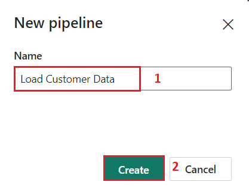
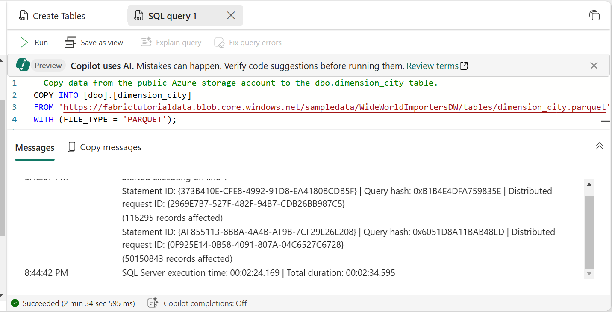
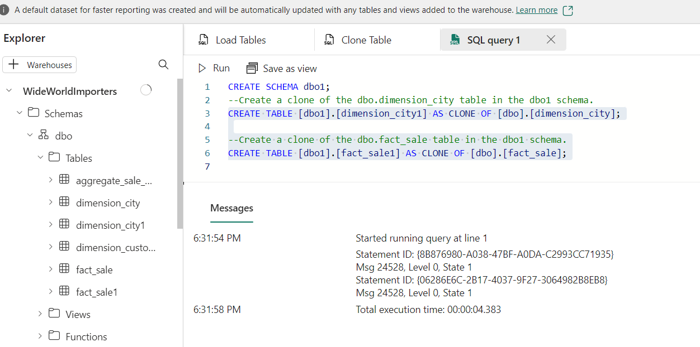

## ユースケース 05 - Microsoft Fabric で Contoso の売上と地理データ Warehouseを構築する

**導入**

多国籍小売企業であるContoso社は、売上と地域分析の効率化を目指し、データインフラストラクチャの近代化を検討しています。現在、売上データと顧客データは複数のシステムに分散しており、ビジネスアナリストやシチズンデベロッパーが分析結果を導き出すことが困難になっています。同社は、Microsoft
Fabricを使用してこれらのデータを統合プラットフォームに統合し、クロスクエリ、売上分析、地域レポートの作成を可能にする予定です。

このラボでは、Contoso 社のデータエンジニアとして、Microsoft Fabric
を使用したデータ Warehouse
ソリューションの設計と実装を担当します。まず、Fabric
ワークスペースの設定、データ Warehouseの作成、Azure Blob Storage
からのデータの読み込み、そして Contoso
社の意思決定者にインサイトを提供するための分析タスクの実行から始めます。

Microsoft Fabric
の多くの概念は、データおよび分析の専門家にとって馴染み深いものかもしれませんが、新しい環境でそれらの概念を適用するのは難しい場合があります。このラボは、データの取得から利用までのエンドツーエンドのシナリオを段階的に説明することで、Microsoft
Fabric
のユーザーエクスペリエンス、さまざまなエクスペリエンスとその統合ポイント、そして
Microsoft Fabric
のプロフェッショナルおよびシチズンデベロッパーのエクスペリエンスについて基本的な理解を深めることを目的としています。

**目的**

- 試用版を有効にして Fabric ワークスペースをセットアップします。

- Microsoft Fabric
  にWideWorldImportersという名前の新しいWarehouseを確立します。

- Data Factory パイプラインを使用して、
  Warehouse_FabricXXワークスペースにデータを読み込みます。

- データ
  Warehouse内にdimension_cityテーブルとfact_saleテーブルを生成します。

- dimension_cityテーブルとfact_saleテーブルに Azure Blob Storage
  のデータを入力します。

- Warehouseにdimension_cityテーブルとfact_saleテーブルのクローンを作成します。

- dimension_city テーブルとfact_saleテーブルを dbo1
  スキーマに複製します。

- aggregate_sale_by_date_cityテーブルを作成するストアド
  プロシージャを開発します。

- ビジュアル クエリ
  ビルダーを使用してクエリを生成し、データを結合および集計します。

- dimension_customerテーブルのデータをクエリおよび分析します。

- クロスクエリ用にWideWorldImportersとShortcutExerciseWarehouseを含めます。

- WideWorldImportersとShortcutExerciseWarehouse全体で T-SQL
  QUERYを実行します。

- 管理ポータルで Azure Maps のビジュアル統合を有効にします。

- 売上分析レポートの縦棒グラフ、マップ、表のビジュアルを生成します。

- OneLakeデータ
  ハブのWideWorldImportersデータセットのデータを使用してレポートを作成します。

- ワークスペースとそれに関連付けられたアイテムを削除します。

# **練習1:** Microsoft Fabric ワークスペースを作成する

## **タスク 1: Power BI アカウントにサインインし、無料の[Microsoft Fabric 試用版にサインアップします。](https://learn.microsoft.com/en-us/fabric/get-started/fabric-trial)**

1.  ブラウザを開き、アドレス バーに移動して、次の URL
    を入力または貼り付けます: + ++
    https://app.fabric.microsoft.com/+++次に、
    **Enter**ボタンを押します。

> 

2.  **Microsoft Fabric**ウィンドウで、割り当てられた資格情報を入力し、
    **\[Submit\]**ボタンをクリックします。

> 

3.  次に、 **Microsoft**ウィンドウでパスワードを入力し、 **\[Sign
    in\]**ボタンをクリックします**。**

> 

4.  **「Stay signed in?」**ウィンドウで、
    **「Yes」**ボタンをクリックします。

> 

5.  Power BI ホーム ページに移動します。

> 

## タスク2: ワークスペースを作成する

Fabric でデータを操作する前に、Fabric
トライアルが有効になっているワークスペースを作成します。

1.  ワークスペースペインで**+ New workspace** を選択します。

> 

2.  **「Create a workspace tab」**タブで、次の詳細を入力し、
    **「Apply」**ボタンをクリックします。

    |  |  |
    |----|---|
    |Name	|+++Warehouse_Fabric@lab.LabInstance.Id+++ (must be a unique Id) |
    |Description	|+++This workspace contains all the artifacts for the data warehouse+++|
    |Advanced	Under License mode| select Fabric capacity|
    |Default storage format	|Small dataset storage format|

> 
>
> 

3.  デプロイが完了するまでお待ちください。完了まで1～2分かかります。新しいワークスペースが開いたら、空になっているはずです。

> 

## タスク 4: Microsoft Fabric でWarehouseを作成する

1.  **Fabricページ**で、 **+ New item** を選択してレイクハウスを作成し、**Warehouse**を選択します。

> 

2.  **\[New warehouse\]**ダイアログで、「+++ **WideWorldImporters
    +++」と入力し**、 **\[Create\]**ボタンをクリックします。

> 

3.  プロビジョニングが完了すると、 **WideWorldImporters**
    倉庫のランディングページが表示されます。

   

# 練習2: Microsoft Fabric のWarehouseにデータを取り込む

## タスク 1: データをWarehouseに取り込む

1.  **WideWorldImporters**より 倉庫ランディング
    ページで、左側のナビゲーション メニューで**Warehouse_FabricXX**
    を選択して、ワークスペース アイテム リストに戻ります。

     

2.  **Warehouse_FabricXXページ**で、「+**New item**を選択します。次に、 **「
    pipeline」**をクリックして、「Get
    data」で利用可能なアイテムの完全なリストを表示します。

     

3.  **New pipeline**ダイアログ ボックスで、\[**Name\]**フィールドに「+++**Load Customer Data+++」と入力し**、
    **\[Create\]**ボタンをクリックします。

> 

4.  **「Load Customer Data」ページ**で、 **「Start building your data
    pipeline** **」**セクションに移動し、 **「Pipeline
    activity」**をクリックします。

> 

5.  **Move &** **transform** セクションの**Copy data**を選択します。

> 

6.  デザイン キャンバスから新しく作成した**「Copy
    data** **1」**アクティビティを選択して構成します。

> **注**: さまざまな機能を完全に表示するには、デザイン
> キャンバス内の水平線をドラッグします。
>
  

7.  **\[General\]**タブの **\[Name\]**フィールドに**、** 「 +++**CD Load dimension_customer+++ 」と入力します**。

> 

8.  **「Source」ページ**で、
    **「Connection」**ドロップダウンを選択します。
    **「More」**を選択すると、ローカルのOneLakeデータハブ内のデータソースを含む、選択可能なすべてのデータソースが表示されます。

     

9.  **\[Get data\] ウィンドウ**で、 **+++Azure Blobs+++**を検索し、
    **\[Azure Blob Storage\]**ボタンをクリックします。

> 

10. 右側に表示される**Connection settings** ペインで、次の設定を構成し、
    **\[接続\]**ボタンをクリックします。

- **Account name or URL**に、 +++**https://fabrictutorialdata.blob.core.windows.net/sampledata/+++**と入力します。

- **\[Connection credentials** **\]**セクションで、
  **\[Connection\]**の下のドロップダウンをクリックし、 **\[Create new
  connection\]**を選択します。

- **「Connection name」**フィールドに**、** 「 **+++Wide World Importers Public Sample+++** 」と入力します。

- **Authentication kind** を**Anonymous**に設定します。


11. コピー
    アクティビティの**\[ソース\]ページ**で残りの設定を次のように変更して、
    **https://fabrictutorialdata.blob.core.windows.net/sampledata/WideWorldImportersDW/parquet/full/dimension_customer/\*.parquet**内の.parquetファイルにアクセスします。

12. **ファイル パス**テキスト ボックスに以下を入力します。

- **Container:** +++**sampledata+++**

- **File path - Directory:** +++ **WideWorldImportersDW /tables+++**

- **File path - File name:** **+++dimension\_ customer.parquet+++**

- **File formatの**ドロップダウンで、 **Parquet**を選択します**（
  Parquet**が表示されない場合は、検索ボックスに入力して選択します）。


13. **File path**設定の右側にある**\[Preview
    data\]**をクリックして、エラーがないことを確認し、 **\[Close\]**
    をクリックします**。**

     


14. **\[Destination\]**タブで、次の設定を入力します。

    |  |  |
    |---|---|
    |Connection	|WideWorldImporters|
    |Table option	|select the Auto create table radio button.|
    |Table	|•	In the first box enter +++dbo+++<br>•	In the second box enter +++dimension_customer+++|
> 

15. リボンから**\[Run\]**を選択します。

     

16. **\[Save and run?\]**ダイアログ ボックスで、 **\[Save and
    run\]**ボタンをクリックします。

> 
>
> 

17. **Output**ページでコピー
    アクティビティの進行状況を監視し、完了するまで待ちます。

> 

# 練習3: データ Warehouseにテーブルを作成する

## タスク1: Data Warehouseにテーブルを作成する

1.  **Load Customer Data**ページで、
    **Warehouse_FabricXX**をクリックします。 左側のナビゲーション
    バーのワークスペース。

     

2.  **Fabric**
    **Warehouse_FabricXX**ページで、下の画像に示すように、
    **Warehouse**タイプを持つ**WideWorldImporters
    を**慎重に移動してクリックします。

     

3.  **WideWorldImporters**ページで、**\[Home\]**タブに移動し、ドロップダウンから**\[SQL\]**を選択して、
    **\[New SQL query\]**をクリックします。

     

4.  クエリエディタで次のコードを貼り付けて**「Run」を選択し、**クエリを実行します。

    ```
    /*
    1. Drop the dimension_city table if it already exists.
    2. Create the dimension_city table.
    3. Drop the fact_sale table if it already exists.
    4. Create the fact_sale table.
    */
    
    --dimension_city
    DROP TABLE IF EXISTS [dbo].[dimension_city];
    CREATE TABLE [dbo].[dimension_city]
        (
            [CityKey] [int] NULL,
            [WWICityID] [int] NULL,
            [City] [varchar](8000) NULL,
            [StateProvince] [varchar](8000) NULL,
            [Country] [varchar](8000) NULL,
            [Continent] [varchar](8000) NULL,
            [SalesTerritory] [varchar](8000) NULL,
            [Region] [varchar](8000) NULL,
            [Subregion] [varchar](8000) NULL,
            [Location] [varchar](8000) NULL,
            [LatestRecordedPopulation] [bigint] NULL,
            [ValidFrom] [datetime2](6) NULL,
            [ValidTo] [datetime2](6) NULL,
            [LineageKey] [int] NULL
        );
    
    --fact_sale
    
    DROP TABLE IF EXISTS [dbo].[fact_sale];
    
    CREATE TABLE [dbo].[fact_sale]
    
        (
            [SaleKey] [bigint] NULL,
            [CityKey] [int] NULL,
            [CustomerKey] [int] NULL,
            [BillToCustomerKey] [int] NULL,
            [StockItemKey] [int] NULL,
            [InvoiceDateKey] [datetime2](6) NULL,
            [DeliveryDateKey] [datetime2](6) NULL,
            [SalespersonKey] [int] NULL,
            [WWIInvoiceID] [int] NULL,
            [Description] [varchar](8000) NULL,
            [Package] [varchar](8000) NULL,
            [Quantity] [int] NULL,
            [UnitPrice] [decimal](18, 2) NULL,
            [TaxRate] [decimal](18, 3) NULL,
            [TotalExcludingTax] [decimal](29, 2) NULL,
            [TaxAmount] [decimal](38, 6) NULL,
            [Profit] [decimal](18, 2) NULL,
            [TotalIncludingTax] [decimal](38, 6) NULL,
            [TotalDryItems] [int] NULL,
            [TotalChillerItems] [int] NULL,
            [LineageKey] [int] NULL,
            [Month] [int] NULL,
            [Year] [int] NULL,
            [Quarter] [int] NULL
        );
    ```
> 
>
> 

5.  エディターのすぐ上にある**SQL query 1**タブを右クリックし、
    **\[Rename\]を**選択します。

> 

6.  **Rename**ダイアログボックスの**「Name」**フィールドに「+++ **Create
    Tables+++」と入力します。** **SQL
    query1**の名前を変更するには、「**Rename」**ボタンをクリックします。

> 

7.  リボンの**更新アイコンボタン**を選択して、テーブルが正常に作成されたことを確認します。

> 

8.  **Explorer**ペインに**fact_sale**が表示されます テーブルと**dimension_city** テーブル。

> 

## タスク2: T-SQL を使用してデータをロードする

データ
Warehouseを構築し、テーブルをロードしてレポートを生成する方法がわかったので、次はデータをロードするための他の方法を検討してソリューションを拡張します。

1.  **WideWorldImporters**ページで、\[**Home\]**タブに移動し、ドロップダウンから**\[SQL\]**を選択して、
    **\[New SQL query\]**をクリックします。

> 

2.  クエリ エディターに次のコード**を貼り付け、
    \[Run\]**をクリックしてクエリを実行します。

    ```
    --Copy data from the public Azure storage account to the dbo.dimension_city table.
    COPY INTO [dbo].[dimension_city]
    FROM 'https://fabrictutorialdata.blob.core.windows.net/sampledata/WideWorldImportersDW/tables/dimension_city.parquet'
    WITH (FILE_TYPE = 'PARQUET');
    
    --Copy data from the public Azure storage account to the dbo.fact_sale table.
    COPY INTO [dbo].[fact_sale]
    FROM 'https://fabrictutorialdata.blob.core.windows.net/sampledata/WideWorldImportersDW/tables/fact_sale.parquet'
    WITH (FILE_TYPE = 'PARQUET');
    ```
> 

3.  **dimension_city**テーブルと**fact_sale**テーブルにそれぞれロードされた行数を示すメッセージを確認します。

> 

4.  **fact_sale**を選択してデータが正常にロードされたことを確認します。 **Explorer**のテーブル。

> 

5.  クエリの名前を変更します。**Explorer**で**SQL
    query1**を右クリックし、 **「Rename」**を選択します。

> 

6.  **Rename**ダイアログボックスの**Name」**フィールドに「 +++Load Tables+++ 」と**入力します。次に、
    **「Rename」**ボタンをクリックします。

> 

7.  **\[Home\]**タブの下のコマンド
    バーにある**\[Refresh\]**アイコンをクリックします。

> 

# 演習 4: Microsoft Fabric で T-SQL を使用してテーブルを複製する

## タスク1: Warehouse内の同じスキーマ内でテーブルクローンを作成する

このタスクでは、 [CREATE TABLE AS CLONE OF T-SQL
構文](https://learn.microsoft.com/en-us/sql/t-sql/statements/create-table-as-clone-of-transact-sql?view=fabric&preserve-view=true)を使用して、Microsoft
Fabric の Warehouse に[テーブル
クローンを作成する手順を説明します](https://learn.microsoft.com/en-in/fabric/data-warehouse/clone-table)。

1.  Warehouse内の同じスキーマ内にテーブル クローンを作成します。

2.  **WideWorldImportersページ**で、**\[Home\]**タブに移動し、ドロップダウンから**\[SQL\]**を選択して、
    **\[New SQL query\]**をクリックします。

> 

3.  クエリ エディターで次のコードを貼り付けて、 **dbo.dimension \_city**
    テーブルと**dbo.fact \_sale**テーブルのクローンを作成します。

    ```
    --Create a clone of the dbo.dimension_city table.
    CREATE TABLE [dbo].[dimension_city1] AS CLONE OF [dbo].[dimension_city];
    
    --Create a clone of the dbo.fact_sale table.
    CREATE TABLE [dbo].[fact_sale1] AS CLONE OF [dbo].[fact_sale];
    ```
> 

4.  **「Run」**を選択してください。クエリの実行には数秒かかります。
    クエリが完了すると、テーブルはクローン化されます
    **dimension_city1**と**fact_sale1**が作成されます。

> 
>
> 

5.  **dimension_city1**を選択してデータが正常にロードされたことを確認します。 **Explorer**のテーブル。

> 

6.  **Explorer**でテーブルを複製するために作成した**SQL
    QUERY**を右クリックし、 **\[Rename\]**を選択します**。**

> 

7.  **Renameダイアログ ボックス**の**「Name」フィールド**に「 +++
    **Clone Table+++ 」と入力し**、
    **「Rename」**ボタンをクリックします。

> 

8.  **\[Home\]**タブの下のコマンド
    バーにある**\[Refresh\]**アイコンをクリックします。

> 

## タスク2: 同じWarehouse内のスキーマ間でテーブルクローンを作成する

1.  **WideWorldImporters**ページで、\[**Home\]**タブに移動し、ドロップダウンから**\[SQL\]**を選択して、
    **\[New SQL query\]**をクリックします。

> 

2.  **WideWorldImporterWarehouse内にdbo1**という新しいスキーマを作成します。以下の画像に示すように、以下のT-SQLコードを**コピーして貼り付け**、**実行します。**

    +++CREATE SCHEMA dbo1+++


3.  クエリ
    エディターで既存のコードを削除し、次のコードを貼り付けて、**dbo1**
    スキーマに **dbo.dimension_city** テーブルと **dbo.fact_sale
    テーブル**のクローンを作成します。

    ```
    --Create a clone of the dbo.dimension_city table in the dbo1 schema.
    CREATE TABLE [dbo1].[dimension_city1] AS CLONE OF [dbo].[dimension_city];
    
    --Create a clone of the dbo.fact_sale table in the dbo1 schema.
    CREATE TABLE [dbo1].[fact_sale1] AS CLONE OF [dbo].[fact_sale];
    ```

4.  **「Run」**を選択してください。クエリの実行には数秒かかります。

> 

5.  クエリが完了したら、
    **dimension_city1**を複製します。 そして**fact_sale1** **dbo1**スキーマに作成されます。

> 

6.  **dimension_city1**を選択してデータが正常にロードされたことを確認します。 **Explorer**の**dbo1**スキーマの下のテーブル。

> 

7.  後で参照できるようにクエリの名前を変更します。ExplorerでSQLクエリ1を右クリックし、「**Rename**」を選択します。

8.  **Rename**ダイアログボックスの**「Name」**フィールドに「 +++Clone Table in another schema+++ 」**と入力します。次に、
    **「Rename」**ボタンをクリックします。

> 

9.  **\[Home\]**タブの下のコマンド
    バーにある**\[Refresh\]**アイコンをクリックします。

> 

# 演習5: ストアドプロシージャを使用してデータを変換する

データを変換するための新しいストアド
プロシージャを作成して保存する方法を学習します。

1.  **WideWorldImportersページ**で、**\[Home\]**タブに移動し、ドロップダウンから**\[SQL\]**を選択して、
    **\[New SQL QUERY\]**をクリックします。

> 

2.  クエリエディタに以下のコード**を貼り付けて、**ストアドプロシージャ**dbo.populate
    \_aggregate_sale_by_city**を作成します。このストアドプロシージャは、
    **dbo.aggregate \_sale_by_date_city
    を**作成し、読み込みます。 後のステップでテーブルを作成します。

    ```
    --Drop the stored procedure if it already exists.
    DROP PROCEDURE IF EXISTS [dbo].[populate_aggregate_sale_by_city]
    GO
    
    --Create the populate_aggregate_sale_by_city stored procedure.
    CREATE PROCEDURE [dbo].[populate_aggregate_sale_by_city]
    AS
    BEGIN
        --If the aggregate table already exists, drop it. Then create the table.
        DROP TABLE IF EXISTS [dbo].[aggregate_sale_by_date_city];
        CREATE TABLE [dbo].[aggregate_sale_by_date_city]
            (
                [Date] [DATETIME2](6),
                [City] [VARCHAR](8000),
                [StateProvince] [VARCHAR](8000),
                [SalesTerritory] [VARCHAR](8000),
                [SumOfTotalExcludingTax] [DECIMAL](38,2),
                [SumOfTaxAmount] [DECIMAL](38,6),
                [SumOfTotalIncludingTax] [DECIMAL](38,6),
                [SumOfProfit] [DECIMAL](38,2)
            );
    
        --Reload the aggregated dataset to the table.
        INSERT INTO [dbo].[aggregate_sale_by_date_city]
        SELECT
            FS.[InvoiceDateKey] AS [Date], 
            DC.[City], 
            DC.[StateProvince], 
            DC.[SalesTerritory], 
            SUM(FS.[TotalExcludingTax]) AS [SumOfTotalExcludingTax], 
            SUM(FS.[TaxAmount]) AS [SumOfTaxAmount], 
            SUM(FS.[TotalIncludingTax]) AS [SumOfTotalIncludingTax], 
            SUM(FS.[Profit]) AS [SumOfProfit]
        FROM [dbo].[fact_sale] AS FS
        INNER JOIN [dbo].[dimension_city] AS DC
            ON FS.[CityKey] = DC.[CityKey]
        GROUP BY
            FS.[InvoiceDateKey],
            DC.[City], 
            DC.[StateProvince], 
            DC.[SalesTerritory]
        ORDER BY 
            FS.[InvoiceDateKey], 
            DC.[StateProvince], 
            DC.[City];
    END
    ```
> 
>
> 

3.  Explorerでテーブルを複製するために作成した SQL QUERYを右クリックし、
    **\[Rename\]**を選択します。

> 

4.  **Rename**ダイアログ ボックスの**「Name」**フィールドに**「 +++Create Aggregate Procedure+++ 」**と入力し、
    「**Rename」**ボタンをクリックします。

> 

5.  **Home**タブの下にある**更新アイコン**をクリックします。

> 

6.  **\[Explorer\]**タブで、
    **dboスキーマ**の下の**StoredProcedures**ノードを展開して、新しく作成されたストアド
    プロシージャが表示されることを確認します。

> 

7.  **WideWorldImportersページ**で、**\[Home\]**タブに移動し、ドロップダウンから**\[SQL\]を**選択して、
    **\[New SQL QUERY\]**をクリックします。

> 

8.  クエリエディタに以下のコードを貼り付けます。このT-SQLは**dbo.populate_aggregate_sale_by_city**を実行し、
    **dbo.aggregate_sale_by_date_city**を作成します**。**
    テーブル。クエリを実行する

    ```
    --Execute the stored procedure to create the aggregate table.
    EXEC [dbo].[populate_aggregate_sale_by_city];
    ```
> 

9.  このクエリを後で参照できるように保存するには、エディターのすぐ上にあるクエリ
    タブを右クリックし、 **\[Rename\]** を選択します。


10. \[**Rename**\] ダイアログ ボックスの \[**Name**\]
    フィールドに「+++**Run Create Aggregate Procedure**+++」と入力し、**\[Rename**\] ボタンをクリックします。

    

11. リボンの**\[Refresh\]**アイコンを選択します。


12. \[Object **Explorer**\] タブでデータ
    プレビューをロードし、**Explorer**で **aggregate_sale_by_city**
    テーブルを選択して、データが正常にロードされたことを確認します。


# 演習6: ステートメントレベルでT-SQLを使用したタイムトラベル

1.  **WideWorldImporters**ページで、**\[Home\]**タブに移動し、ドロップダウンから**\[SQL\]**を選択して、
    **\[New SQL QUERY\]**をクリックします。

> 

2.  クエリエディターに次のコードを貼り付けて、Top10CustomerViewビューを作成します。
    **「Run」を選択して**クエリを実行します。

    ```
    CREATE VIEW dbo.Top10CustomersView
    AS
    SELECT TOP (10)
        FS.[CustomerKey],
        DC.[Customer],
        SUM(FS.TotalIncludingTax) AS TotalSalesAmount
    FROM
        [dbo].[dimension_customer] AS DC
    INNER JOIN
        [dbo].[fact_sale] AS FS ON DC.[CustomerKey] = FS.[CustomerKey]
    GROUP BY
        FS.[CustomerKey],
        DC.[Customer]
    ORDER BY
        TotalSalesAmount DESC;
    ```
   

3.  **Explorer**で、
    dboスキーマの下の**View**ノードを展開して、新しく作成されたビュー**Top10CustomersView**
    が表示されることを確認します。


4.  このクエリを後で参照できるように保存するには、エディターのすぐ上にあるクエリ
    タブを右クリックし、 **\[Rename\]** を選択します。


5.  \[**Rename**\] ダイアログ ボックスの \[**Name**\]
    フィールドに「+++**Top10CustomersView**+++」と入力し、\[**Rename**\]
    ボタンをクリックします。


6.  手順
    1と同様に、別の新しいクエリを作成します。リボンの**\[Home\]**タブから、
    **\[New SQL QUERY\]**を選択します。


7.  クエリエディタに以下のコードを貼り付けます。これにより、
    **SaleKey**を持つレコードの**TotalIncludingTax列の値が200000000**に更新されます。** **値は**22632918です。**クエリを実行するには、
    **\[Run\]**を選択します。

    ```
    /*Update the TotalIncludingTax value of the record with SaleKey value of 22632918*/
    UPDATE [dbo].[fact_sale]
    SET TotalIncludingTax = 200000000
    WHERE SaleKey = 22632918;
    ```


8.  クエリエディターに次のコードを貼り付けます。CURRENT_TIMESTAMP
    T-SQL関数は、現在のUTCタイムスタンプを**datetimeとして返します**。
    \[**Run\]**を選択してクエリを実行します。

    ```
    SELECT CURRENT_TIMESTAMP;
    ```


9.  返されたタイムスタンプ値をクリップボードにコピーします。


10. 以下のコードをクエリエディタに貼り付け、タイムスタンプ値を前の手順で取得した現在のタイムスタンプ値に置き換えます。タイムスタンプの構文形式は、
    **YYYY-MM-DDTHH: MM:SS\[.FFF \]**です。

11. 末尾のゼロを削除します。例: **2025-06-09T06:16:08.807** 。

12. **SaleKey 22632918 の**新しい値を含む、
    **TotalIncludingTax**による上位 10
    人の顧客のリストが返されます。既存のコードを置き換えて次のコードを貼り付け、\[**Run**\]
    を選択して**クエリを**実行します。

    ```
    /*View of Top10 Customers as of today after record updates*/
    SELECT *
    FROM [WideWorldImporters].[dbo].[Top10CustomersView]
    OPTION (FOR TIMESTAMP AS OF '2025-06-09T06:16:08.807');
    ```


13. 以下のコードをクエリエディターに貼り付け、タイムスタンプ値を更新スクリプト実行前の時刻に置き換えて**TotalIncludingTax**の値を更新します。これにより、
    **SaleKey**
    22632918のTotalIncludingTaxが更新される前の上位10人の顧客リストが返されます。\[実行\]
    を選択してクエリ*を*実行します。

    ```
    /*View of Top10 Customers as of today before record updates*/
    SELECT *
    FROM [WideWorldImporters].[dbo].[Top10CustomersView]
    OPTION (FOR TIMESTAMP AS OF '2024-04-24T20:49:06.097');
    ```


# 演習 7: ビジュアルクエリビルダーを使用してクエリを作成する

## タスク 1:ビジュアルクエリビルダーを使用する

Microsoft Fabric ポータルのビジュアル クエリ
ビルダーを使用してクエリを作成し、保存します。

1.  **WideWolrdImporters**では
    ページでは、リボンの**\[Home\]**タブから**\[New visual
    query\]**を選択します**。**

> 

2.  **fact_sale**を右クリックして**Insert into canvas**を選択します。

> 
>
> 

3.  クエリ デザイン ペインの**変換リボンに移動し、 \[Reduce rows\]
    ドロップダウン**をクリックしてデータセットのサイズを制限し、下の画像に示すように
    \[**Keep top rows\]**をクリックします。


4.  **\[Keep top rows** **\]ダイアログ
    ボックス**で**「10000」**と入力し、 **\[OK\]を選択します**。

> 
>
> 

5.  **dimension_cityを**右クリック **Insert into canvas**を選択します

> 
>
> 

6.  変換リボンから、
    **「Combine」**の横にあるドロップダウンを選択し**、**下の画像に示すように**「Merge
    queries as new」**を選択します。


7.  **Merge設定ページ**で次の詳細を入力します。

- **Left table for merge** **ドロップダウン**で、
  **dimension_cityを選択します。**

&nbsp;

- **Right table for merge** **ドロップダウン**で、
  **fact_saleを選択します。** （水平および垂直スクロールバーを使用）

&nbsp;

- **dimension_city**の**CityKeyフィールド**を選択します。 ヘッダー行の列名を選択して結合列を示すことでテーブルを作成します。

&nbsp;

- **fact_sale**の**CityKeyフィールド**を選択します ヘッダー行の列名を選択して結合列を示すことでテーブルを作成します。

&nbsp;

- **Joint kind**ダイアグラムの選択で、 **「Inner」**を選択し、
  **「OK」**ボタンをクリックします。


8.  **Mergeステップを選択した**状態で、
    **fact_saleの**横にある**Expandボタンを選択します。** 下の画像に示すように、データグリッドのヘッダーで、列**TaxAmount
    、 Profit 、 TotalIncludingTaxを選択します。
    \[OK\]**を選択します**。**


9.  **Transformation
    ribbon**で、「**Transform**」の横にあるドロップダウンをクリックし、「**Group
    by**」を選択します。


10. **Group by**設定ページで、次の詳細を入力します。

- **\[Advanced\]**ラジオ ボタンを選択します。

- **Group by**以下を選択してください:

  1.  **Country**

  2.  **StateProvince**

  3.  **City**

- **「New column name」の「Operation
  column」フィールドに「SumOfTaxAmount」と入力し、「Sum」を選択して、「Column」フィールドで「TaxAmount」を選択します。「Add
  aggregation」をクリックして、集計列と演算を追加します。**

- **「New column name」の「Operation
  column」フィールドに「SumOfProfit」と入力し、「Sum」を選択して、「Column」フィールドで「Profit」を選択します。「Add
  aggregation」をクリックして、集計列と演算を追加します。**

- **「New column name」の「Operation
  column」フィールドに「SumOfTotalIncludingTax」と入力し、「Sum」を選択して、「Column」フィールドで「TotalIncludingTax」を選択します。**

- **「OK」ボタンをクリックします。**


11. Explorerで**「Queries」**に移動し、 **「Query」の下の「Visual query
    1」**を右クリックします。次に、 **「Rename」を選択します**。

> 

12. クエリ名を変更するには、「**+++Sales Summary+++**」と入力します。キーボードの**Enter**キーを押すか、タブ以外の場所を選択して変更を保存します。

> 

13. **Home**タブの下にある**Refresh**アイコンをクリックします。

> 

# 練習問題8: ノートブックでデータを分析する

## タスク 1:Lakehouseショートカットを作成し、ノートブックでデータを分析する

このタスクでは、データを一度保存して、他の多くのサービスで利用する方法について学習します。Azure
Data Lake Storage と S3
に保存されているデータへのショートカットを作成し、外部システムから差分テーブルに直接アクセスすることもできます。

まず、新しいLakehouseを作成します。Microsoft Fabric
ワークスペースに新しいLakehouseを作成するには、次の手順を実行します。

1.  **WideWorldImportes**ページで、左側のナビゲーション
    メニューの**Warehouse_FabricXX Workspace** をクリックします。

> 

2.  **Synapse Data Engineering
    Warehouse_FabricXX**ホームページの**Warehouse_FabricXXペイン**で、
    **+New
    item**をクリックし、**Stored data**の下の**Lakehouse**を選択します**。**

> 

3.  **Nameフィールド**に「+++ShortcutExercise+++」と入力し**、
    **「Create」**ボタンをクリックします**。**

> 

4.  新しいLakehouseが読み込まれ、**Explorer**ビューが開き、「**Get data
    in your lakehouse」**メニューが表示されます。 **「Load data in your
    lakehouse」**の下にある**「New shortcut」**ボタンを選択します。

> 

5.  **New shortcut**ウィンドウで、 **Microsoft OneLake**を選択します。

> 

6.  **\[Select a data source
    type\]**ウィンドウで、以前に作成した**WideWorldImporters**という名前の**Warehouse**まで慎重に移動してクリックし、
    **\[Next\]** ボタンをクリックします**。**

> 

7.  **OneLake**で オブジェクトブラウザで**「Tables」を展開し、
    「dbo」スキーマ**を展開して、
    **「dimension_customer」**の横にあるラジオボタンを選択します。「**Next」**ボタンを選択します。

> 

8.  **New shortcut**ウィンドウで、 **「Create」**ボタンをクリックし、
    **「Close」**ボタンをクリックします。

> 
>
> 

9.  しばらく待ってから、 **「Refresh」**アイコンをクリックします。

10. 次に、**Table**リストから **dimension_customer**
    を選択してデータをプレビューします。Lakehouseに、Warehouseの
    **dimension_customer**
    テーブルのデータが表示されていることをご確認ください。

> 

11. **dimension_customer**テーブルをクエリするための新しいノートブックを作成します。
    **「Home」**リボンで、 **「Open
    notebook」**のドロップダウンを選択し、 **「New
    notebook」**を選択します。

> 

12. 選択して、
    **dimension_customerをドラッグします** **Tablesリスト**から開いているノートブックのセルにデータを挿入します。ShortcutExercise.dimension_customer**の**すべてのデータを取得するための**PySpark**クエリが記述されているのがわかります。このノートブックの操作感は、
    Visual Studio CodeのJupyterノートブックの操作感に似ています。VS
    Codeでノートブックを開くこともできます。

> 

13. **Home**リボンで**「Run
    all」**ボタンを選択します。クエリが完了すると、
    PySparkを使って簡単にWarehouseテーブルにクエリを実行できることがわかります。


# 演習9: SQLクエリエディタを使用してクロスWarehouseクエリを作成する

## タスク 1: Explorerに複数のWarehouseを追加する

このタスクでは、SQL クエリ エディターを使用して、Microsoft Fabric の SQL
エンドポイントとWarehouseからのデータを結合するなど、複数のWarehouseにわたって
T-SQL クエリを簡単に作成および実行する方法について学習します。

1.  **Notebook1**ページから、左側のナビゲーション
    メニューの**Warehouse_FabricXX**ワークスペースに移動してクリックします。

   

2.  **Warehouse_FabricXX**ビューで、
    **WideWorldImporters**Warehouseを選択します。

     
3.  **WideWorldImporters**ページの**Explorer** タブで**、** **+
    Warehouses**ボタンを選択します。

> 

4.  「Add Warehouse」ウィンドウで**「ShortcutExercise」**を選択し、
    **「Confirm」**ボタンをクリックします。両方のWarehouseエクスペリエンスがクエリに追加されます。

> 

5.  選択したWarehouseに同じ**Explorer**ペインが表示されるようになりました。


## タスク2: クロスWarehouseクエリを実行する

WideWorldImportersWarehouseとShortcutExercise SQL エンドポイント間で
T-SQL クエリを簡単に実行できることがおわかりいただけます。SQL Server
と同様に、3 部構成の命名規則を使用してdatabase.schema.table
を参照することで、データベース間クエリを作成できます。

1.  リボンの**\[Home\]**タブから、 **\[New SQL query\]**を選択します。

> 

2.  クエリエディターに以下のT-SQLコードをコピーして貼り付けます。
    **「Run」**ボタンを選択してクエリを実行します。クエリが完了すると、結果が表示されます。

    ```
    SELECT Sales.StockItemKey, 
    Sales.Description, 
    SUM(CAST(Sales.Quantity AS int)) AS SoldQuantity, 
    c.Customer
    FROM [dbo].[fact_sale] AS Sales,
    [ShortcutExercise].[dbo].[dimension_customer] AS c
    WHERE Sales.CustomerKey = c.CustomerKey
    GROUP BY Sales.StockItemKey, Sales.Description, c.Customer;
    ```


3.  参照用にクエリの名前を変更します。**Explorer**でSQLクエリを右クリックし、
    「**Rename**」を選択**します**。

> 

4.  **Rename**ダイアログ ボックスの**「Name」**フィールドに +++**Cross-warehouse query+++**と入力し**、**「Rename」**ボタンをクリックします。 

> 

# 練習問題10: Power BI レポートを作成する

## タスク1:セマンティックモデルを作成する

このタスクでは、いくつかの種類の Power BI
レポートを作成して保存する方法を学習します。

1.  **WideWorldImportes**ページの\[**Home**\]タブで、**\[New semantic
    model\]**を選択します。

> 

2.  **New semantic model**ウィンドウの**Direct Lake semantic model
    name** ボックスに、 +++**Sales Model+++**と入力します**。**

3.  dboスキーマを展開し、 **「Tables」**フォルダを展開して、
    **dimension_city**テーブルと**fact_sale**テーブルを確認します。
    **「Confirm」**を選択します。

> 
>
> 

4.  セマンティック モデルを開くには、ワークスペースのランディング
    ページに戻り、「**Sales Model」**セマンティック モデルを選択します。

> 

9.  モデルデザイナーを開くには、メニューで**\[Open data
    model\]**を選択します。

> 
>
> 

10. **Sales model**ページで、**Manage
    Relationships**を編集するには、モードを**Viewing**から**Editing**に変更します。

11. リレーションシップを作成するには、モデル デザイナーの
    \[**Home**\]リボンで**\[Manage relationships\]** を選択します。

> 

12. **「New relationship」**ウィンドウで、次の手順を実行して関係を作成します。

&nbsp;

1)  **\[From table\]**ドロップダウン リストで、
    dimension_cityテーブルを選択します。

2)  **\[To table\]**ドロップダウン リストで、
    fact_saleテーブルを選択します。

3)  **\[Cardinality\]**ドロップダウン リストで、 **\[One to many
    (1:\*)\]**を選択します。

4)  **\[Cross-filter direction** **\]**ドロップダウン リストで、
    **\[Single\]を選択します**。

5)  **「Assume referential integrity** **」ボックス**をチェックします。

6)  **\[Save\]**を選択します。

> 
>
> 
>
> 

13. **\[Manage relationship** **\]**ウィンドウで、
    **\[Close\]**を選択します。

> 
>
> 

## タスク2: Power BI レポートを作成する

タスクで作成したセマンティック モデルに基づいて Power BI
レポートを作成する方法を学習します。

1.  **\[File\]** リボンで、 **\[Create new report\]** を選択します。

> 

2.  レポート デザイナーで、次の手順を実行して縦棒グラフ
    ビジュアルを作成します。

&nbsp;

1)  **Data**ペインで**fact_sale**テーブルを展開し、
    Profitフィールドを確認します。

2)  **Data**ペインで、 dimension_cityテーブルを展開し、
    SalesTerritoryフィールドを確認します。

> 

3.  **\[Visualizations\]**ペインで、 **Azure
    Map**ビジュアルを選択します。

> 

4.  **Data**ペインのdimension_cityテーブル内から、
    StateProvinceフィールドを**Visualizationsペイン**の**Location**ウェルにドラッグします。

> 

5.  **Dataペイン**のfact_saleテーブル内で、
    Profitフィールドをチェックして、マップ
    ビジュアルの**Size**ウェルに追加します。

6.  **\[Visualizations\]**ペインで、**Table**ビジュアルを選択します。

> 

7.  **Dataペイン**で、次のフィールドをチェックします。

&nbsp;

1)  dimension_cityテーブルのSalesTerritory

2)  dimension_cityテーブルのStateProvince

3)  fact_saleテーブルからのProfit

4)  fact_saleテーブルからのTotalExcludingTax

> 
>
> 

8.  レポート
    ページの完成したデザインが次の画像のようになっていることを確認します。

> 

9.  レポートを保存するには、\[**Home**\]リボンで**\[File** \> **Save\]**を選択します。

> 

10. Save your reportウィンドウのレポート名を入力ボックスに「+++ **Sales
    Analysis** +++」と入力し、 **「Save」**を選択します**。**

> 
>
> 
>
> 

## タスク3: リソースをクリーンアップする

個々のレポート、パイプライン、Warehouse、その他のアイテムを削除したり、ワークスペース全体を削除したりできます。このチュートリアルでは、ラボで作成したワークスペース、個々のレポート、パイプライン、Warehouse、その他のアイテムをクリーンアップします。

1.  ナビゲーション メニューで**Warehouse_FabricXX
    を**選択して、ワークスペース アイテム リストに戻ります。

> 

2.  ワークスペース ヘッダーのメニューで、**\[Workspace
    settings\]**を選択します。

> 

3.  **Workspace settings**ダイアログボックスで、
    **「Other」**を選択し、「**Remove this workspace」**を選択します。

> 

4.  **\[Delete workspace?\]**ダイアログ ボックスで、
    **\[Delete\]**ボタンをクリックします。 

**まとめ**

この包括的なラボでは、Microsoft Fabric
で機能的なデータ環境を構築するための一連のタスクを段階的に説明します。まず、データ操作に不可欠なワークスペースを作成し、トライアルが有効になっていることを確認します。次に、
Fabric
環境内にWideWorldImportersというWarehouseを構築し、データの保存と処理のための中央リポジトリとして機能します。次に、Data
Factory パイプラインの実装を通じて、
Warehouse_FabricXXワークスペースへのデータ取り込みの詳細を説明します。このプロセスでは、外部ソースからデータを取得し、ワークスペースにシームレスに統合します。重要なテーブル
( dimension_cityとfact_sale ) がデータ
Warehouse内に作成され、データ分析の基盤構造として機能します。データの読み込みプロセスは
T-SQL を使用して続行され、Azure Blob Storage
からのデータが指定されたテーブルに転送されます。以降のタスクでは、データの管理と操作の領域を詳細に説明します。テーブルの複製のデモンストレーションを行い、データ
レプリケーションとテストに役立つ手法を紹介します。さらに、複製プロセスは同じWarehouse内の別のスキーマ
(dbo1)
に拡張され、データ編成に対する構造化されたアプローチを示します。ラボはデータ変換に進み、売上データを効率的に集計するためのストアドプロシージャの作成を紹介します。次に、複雑なデータクエリのための直感的なインターフェイスを提供するビジュアルクエリ構築へと移行します。続いてノートブックの活用方法を学習し、
dimension_customerテーブルのデータのクエリと分析におけるその有用性を示します。さらに、マルチWarehouseクエリ機能も紹介し、ワークスペース内の様々なWarehouse間でシームレスなデータ取得を可能にします。ラボの最後は、Azure
Mapsビジュアルの統合を実現し、Power
BIにおける地理データ表示を強化します。さらに、棒グラフ、マップ、テーブルなど、様々なPower
BIレポートを作成し、詳細な売上データ分析を可能にします。最後のタスクでは、
OneLakeデータハブからのレポート生成に焦点を当て、Fabricのデータソースの汎用性をさらに強調します。最後に、リソース管理に関する洞察を提供し、効率的なワークスペースを維持するためのクリーンアップ手順の重要性を強調します。これらのタスクを総合的に理解することで、Microsoft
Fabric内でのデータの設定、管理、分析に関する包括的な理解が得られます。


