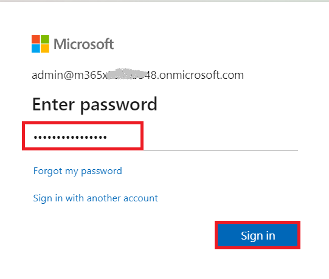
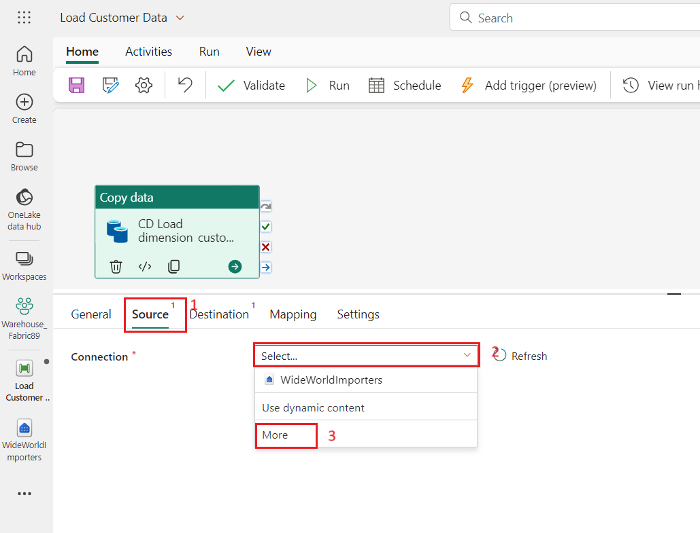
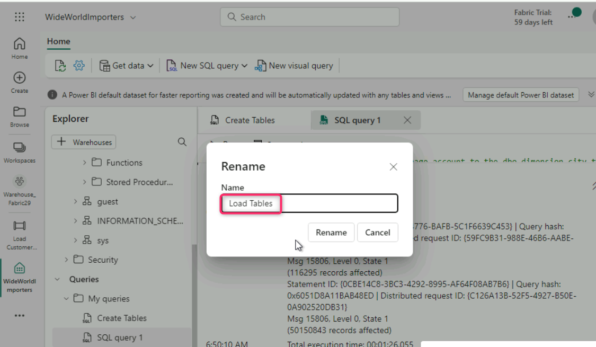
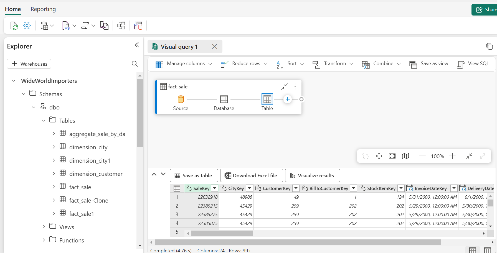
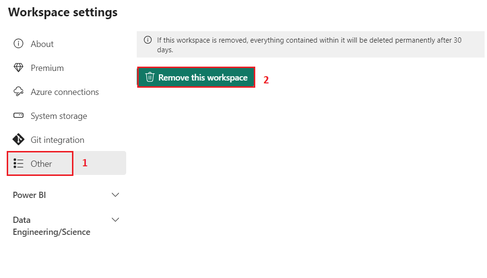

**소개**

다국적 소매업체인 Contoso는 매출과 지리적 분석을 개선하기 위해 데이터
인프라를 현대화하려 하고 있습니다. 현재 그들의 영업 및 고객 데이터가
여러 시스템에 분산되어 있어 비즈니스 분석가와 시민 개발자들이 인사이트를
도출하기 어렵습니다. 회사는 이 데이터를 Microsoft Fabric을 활용한 통합
플랫폼으로 통합하여 교차 쿼리, 영업 분석, 지리적 보고를 가능하게 할
계획입니다.

이 실습에서는 Contoso의 데이터 엔지니어로서 Microsoft Fabric을 활용한
data warehouse 솔루션을 설계하고 구현하는 역할을 맡게 됩니다. 먼저
Fabric 작업 공간을 설정하고, data warehouse를 생성하고, Azure Blob
Storage에서 데이터를 불러오고, 분석 작업을 수행하여 Contoso의
의사결정자들에게 인사이트를 전달하게 됩니다.

Microsoft Fabric의 많은 개념이 데이터 및 분석 전문가에게는 익숙할 수
있지만, 새로운 환경에서 이를 적용하는 것은 도전적일 수 있습니다. 이
실습은 데이터 수집부터 데이터 소비까지 종단 간 시나리오를 단계별로
안내하여 Microsoft Fabric 사용자 경험, 다양한 경험과 통합 지점, 그리고
Microsoft Fabric 전문가 및 시민 개발자 경험에 대한 기본적인 이해를
구축하도록 설계되었습니다.

**목표**

- 체험판이 활성화된 Fabric 작업 공간을 설정하기

- Microsoft Fabric에서 WideWorldImporters라는 새로운 Warehouse를
  구축하기

- Data Factory 파이프라인을 사용하여 데이터를 Warehouse_FabricXX 작업
  공간에 로드하기

- Data warehouse 내에서 dimension_city 및 fact_sale 테이블을 생성하기

- Azure Blob Storage에서 dimension_city 테이블과 fact_sale tables
  테이블을 채우기

- Warehouse에서 dimension_city 및 fact_sale 테이블의 클론을 생성하기

- dimension_city 및 fact_sale 테이블을 dbo1 스키마에 복제하기

- 데이터를 변환하고 aggregate_sale_by_date_city 테이블을 생성하는 저장
  과정을 개발하기

- 시각적 쿼리 빌더를 사용해 데이터를 병합하고 집계하는 쿼리를 생성하기

노트북을 사용해 dimension_customer 테이블에서 데이터를 쿼리 및 분석하기

- 교차 쿼리를 위해 WideWorldImporters 및 ShortcutExercise warehouse를
  포함하기

- WideWorldImporters 및 ShortcutExercise warehouse T-SQL 간에 쿼리를
  실행하기

- 관리자 포털에서 Azure Maps 시각적 통합을 활성화하기

- 판매 분석 보고서용 열, 차트, 지도, 표 시각화를 생성하기

- OneLake 데이터 허브에 있는 WideWorldImporters 데이터세트 데이터를
  사용하여 보고서를 작성하기

- 작업 공간과 관련된 항목을 제거하기

# **연습 1: Microsoft Fabric 작업 공간을 생성하기**

## **작업 1: Power BI 계정으로 로그인하고 무료 [Microsoft Fabric 체험판에 가입하기](https://learn.microsoft.com/en-us/fabric/get-started/fabric-trial)**

1.  브라우저를 열고 주소 바로 이동하고 다음 URL:
    +++https://app.fabric.microsoft.com/+++를 입력하고 붙여넣고
    **Enter** 버튼을 누르세요.

> 

2.  **Microsoft Fabric** 창에서 할당된 자격 증명을 입력하고 **Submit**
    버튼을 클릭하세요.

> 

3.  **Microsoft** 창에서 비밀번호를 입력하고 **Sign in** 버튼을
    클릭하세요.

> 

4.  **Stay signed in?** 창에서 **Yes** 버튼을 클릭하세요.

> 

5.  Power BI 홈페이지로 안내됩니다.

> 

## 작업 2: 작업 공간을 생성하기

Fabric에서 데이터를 다루기 전에 Fabric 체험판이 활성화된 작업 공간을
생성하세요.

1.  Workspaces 창에서 **+** **New workspace**를 선택하세요.

> 

2.  **Create a workspace 탭**에서 다음 정보를 **입력하고 Apply** 버튼을
    클릭하세요.

[TABLE]

> 
>
> 

3.  배포가 완료될 때까지 기다리세요. 완료하는 데 1-2분 정도 걸립니다. 새
    작업 공간이 열리면 비어 있어야 합니다.

> 

## 작업 3: Microsoft Fabric에 Warehouse를 생성하기

1.  **Fabric** 페이지에서 lakehouse를 생성하려면 **+ New item**을
    선택하고 **Warehouse**를 선택하세요

> 

2.  **New warehouse** 대화 상자에서 +++**WideWorldImporters+++**를
    입력하고 **Create** 버튼을 클릭하세요.

> 

3.  프로비저닝이 완료되면 **WideWorldImporters** warehouse 랜딩 페이지가
    나타납니다.

> 

# **연습 2: Microsoft Fabric의 Warehouse에 데이터를 수집하기**

## 작업 1: Warehouse에 데이터를 수집하기

1.  **WideWorldImporters** warehouse 랜딩 페이지에서 왼쪽 내비게이션
    메뉴에서 **Warehouse_FabricXX**를 선택해 작업 공간 항목 목록으로
    돌아가세요.

> 

2.  **Warehouse_FabricXX** 페이지에서 +**New item**을 선택하세요. Get
    data 항목의 전체 목록을 확인하려면 **Pipeline**을 클릭하세요.

> 

3.  **New** **pipeline** 대화 상자의 **Name** 필드에서 +++**Load
    Customer Data+++**를 입력하고 **Create** 버튼을 클릭하세요.

> 

4.  **Load Customer Data** 페이지에서 **Start building your data
    pipeline** 섹션으로 이동하고 **Pipeline activity**를 클릭하세요.

> 

5.  **Move &** **transform** 섹션의 **Copy data** 로 이동하고
    선택하세요.

> 

6.  디자인 캔버스에서 새로 생성된 **Copy data 1** 활동을 선택하여
    설정하세요.

> **참고**: 디자인 캔버스에서 가로선을 드래그하면 다양한 특징을 완전히
> 볼 수 있습니다.
>
> 

7.  **General** 탭의 **Name** 필드에서 +++**CD Load
    dimension_customer+++**를 입력하세요.

> 

8.  **Source** 페이지에서 **Connection** 드롭다운을 선택하세요. 선택할
    수 있는 모든 데이터 소스를 보려면**Browse all**을 선택하세요.

> 

9.  **Get data** 창에서 +++**Azure Blobs+++**를 검색하고 **Azure Blob
    Storage** 버튼을 클릭하세요.

> 

10. 오른쪽에 나타나는 **Connection settings** 창에서 다음 설정을
    구성하고 **Connect** 버튼을 클릭하세요.

- **Account name or URL**에서
  +++**https://fabrictutorialdata.blob.core.windows.net/sampledata/+++**를
  입력하세요

- **Connection credentials** 섹션에서 **Connection**의 드롭다운을
  클릭하고 **Create new connection**을 선택하세요.

- **Connection name** 필드에서 +++**Wide World Importers Public
  Sample+++**를 입력하세요.

- **Authentication kind**을 **Anonymous**로 설정하세요.

> 

11. 복사 활동의 **Source** 페이지에서 남은 설정을 다음과 같이 변경하여
    **https://fabrictutorialdata.blob.core.windows.net/sampledata/WideWorldImportersDW/parquet/full/dimension_customer/\*.parquet**
    파일의 .parquet 파일에 도달하세요.

12. **File path** 텍스트 박스에서 다음을 제공하세요:

- **Container:** +++**sampledata+++**

- **File path - Directory:** +++**WideWorldImportersDW/tables+++**

- **File path - File name:** +++**dimension_customer.parquet+++**

- **File format** 드롭다운에서 **Parquet**을 선택하세요 (**Parquet**이
  보이지 않으면 검색창에 입력한 후 선택하세요).

> 

13. **File path** 설정 오른쪽에 **Preview data**를 클릭하고 오류가
    없는지 확인한 후 **close**를 클릭하세요.

> 
>
> 

14. **Destination** 탭에서 다음 설정을 입력하세요.

[TABLE]

> **참고: WideWorldImporters warehouse로 connect를 추가할 때,
> 내비게이션을 통해 OneLake 카탈로그에서 모든 옵션을 탐색할 수 있도록
> 추가하세요.**
>
> 
>
> 
>
> 

15. 리본에서 **Run**을 선택하세요.

> 

16. **Save and run?** 대화 상자에서 **Save and run** 버튼을 클릭하세요.

> 
>
> 

17. **Output** 페이지에서 복사 활동의 진행 상황을 모니터링하고 완료될
    때까지 기다리세요.

> 

# 연습 3: Data Warehouse에 테이블을 생성하기

## 작업 1: Data Warehouse에 테이블을 생성하기

1.  **Load Customer Data** 페이지의 왼쪽 탐색 바에서
    **Warehouse_FabricXX** 작업 공간을 클릭하고 **WideWorldImporters**
    Warehouse를 선택하세요.

> 

2.  **WideWorldImporters** 페이지에서 **Home **탭으로 이동하고
    드롭다운에서 **SQL**을 선택하고 **New SQL query**를 클릭하세요.

> 

3.  Query editor에서 아래 코드를 붙여넣고 쿼리를 실행하려면 **Run**을
    선택하세요

> /\*
>
> 1\. Drop the dimension_city table if it already exists.
>
> 2\. Create the dimension_city table.
>
> 3\. Drop the fact_sale table if it already exists.
>
> 4\. Create the fact_sale table.
>
> \*/
>
> --dimension_city
>
> DROP TABLE IF EXISTS \[dbo\].\[dimension_city\];
>
> CREATE TABLE \[dbo\].\[dimension_city\]
>
> (
>
> \[CityKey\] \[int\] NULL,
>
> \[WWICityID\] \[int\] NULL,
>
> \[City\] \[varchar\](8000) NULL,
>
> \[StateProvince\] \[varchar\](8000) NULL,
>
> \[Country\] \[varchar\](8000) NULL,
>
> \[Continent\] \[varchar\](8000) NULL,
>
> \[SalesTerritory\] \[varchar\](8000) NULL,
>
> \[Region\] \[varchar\](8000) NULL,
>
> \[Subregion\] \[varchar\](8000) NULL,
>
> \[Location\] \[varchar\](8000) NULL,
>
> \[LatestRecordedPopulation\] \[bigint\] NULL,
>
> \[ValidFrom\] \[datetime2\](6) NULL,
>
> \[ValidTo\] \[datetime2\](6) NULL,
>
> \[LineageKey\] \[int\] NULL
>
> );
>
> --fact_sale
>
> DROP TABLE IF EXISTS \[dbo\].\[fact_sale\];
>
> CREATE TABLE \[dbo\].\[fact_sale\]
>
> (
>
> \[SaleKey\] \[bigint\] NULL,
>
> \[CityKey\] \[int\] NULL,
>
> \[CustomerKey\] \[int\] NULL,
>
> \[BillToCustomerKey\] \[int\] NULL,
>
> \[StockItemKey\] \[int\] NULL,
>
> \[InvoiceDateKey\] \[datetime2\](6) NULL,
>
> \[DeliveryDateKey\] \[datetime2\](6) NULL,
>
> \[SalespersonKey\] \[int\] NULL,
>
> \[WWIInvoiceID\] \[int\] NULL,
>
> \[Description\] \[varchar\](8000) NULL,
>
> \[Package\] \[varchar\](8000) NULL,
>
> \[Quantity\] \[int\] NULL,
>
> \[UnitPrice\] \[decimal\](18, 2) NULL,
>
> \[TaxRate\] \[decimal\](18, 3) NULL,
>
> \[TotalExcludingTax\] \[decimal\](29, 2) NULL,
>
> \[TaxAmount\] \[decimal\](38, 6) NULL,
>
> \[Profit\] \[decimal\](18, 2) NULL,
>
> \[TotalIncludingTax\] \[decimal\](38, 6) NULL,
>
> \[TotalDryItems\] \[int\] NULL,
>
> \[TotalChillerItems\] \[int\] NULL,
>
> \[LineageKey\] \[int\] NULL,
>
> \[Month\] \[int\] NULL,
>
> \[Year\] \[int\] NULL,
>
> \[Quarter\] \[int\] NULL
>
> );
>
> 
>
> 

4.  이 쿼리를 저장하려면 편집기 바로 위의 **SQL query 1** 탭을 우클릭한
    후 **Rename**을 선택하세요**.**

> 

5.  **Rename** 대화 상자의 **Name** 필드에서 **SQL query 1**의 이름을
    입력하면 +++**Create Tables+++**를 입력하세요. **Rename** 버튼을
    클릭하세요.

> 
>
> 

6.  리본의 **refresh icon**버튼을 선택하여 테이블이 성공적으로
    생성되었는지 검증합니다 .

> 

7.  **Explorer** 창에서 **fact_sale**
    테이블과 **dimension_city** 테이블을 볼 수 있습니다.

> 

## 작업 2: T-SQL를 사용하여 데이터를 로드하기

이제 data warehouse를 구축하고, 테이블을 로드하며, 보고서를 생성하는
방법을 알게 되었으니, 이제 데이터를 로드하는 다른 방법들을 탐색하며
솔루션을 확장할 때입니다.

1.  **WideWorldImporters** 페이지에서 **Home** 탭으로 이동하고
    드롭다운에서 **SQL**을 선택하고 **New SQL query**를 클릭하세요.

> 

2.  Query editor에서 아래 코드를 **붙여넣고** 쿼리를 실행하려면
    **Run**을 클릭하세요.

> --Copy data from the public Azure storage account to the
> dbo.dimension_city table.
>
> COPY INTO \[dbo\].\[dimension_city\]
>
> FROM
> 'https://fabrictutorialdata.blob.core.windows.net/sampledata/WideWorldImportersDW/tables/dimension_city.parquet'
>
> WITH (FILE_TYPE = 'PARQUET');
>
> --Copy data from the public Azure storage account to the dbo.fact_sale
> table.
>
> COPY INTO \[dbo\].\[fact_sale\]
>
> FROM
> 'https://fabrictutorialdata.blob.core.windows.net/sampledata/WideWorldImportersDW/tables/fact_sale.parquet'
>
> WITH (FILE_TYPE = 'PARQUET');
>
> 

3.  쿼리가 완료된 후, 메시지를 검토하면 **dimension_city** 테이블과
    **fact_sale** 테이블에 각각 로드된 행 수를 나타냅니다.

> 

4.  **Explorer**에서 **fact_sale** 테이블을 선택하여 데이터 미리보기를
    불러와 성공적으로 로드된 데이터를 검증하세요.

> 

5.  쿼리 이름을 변경하세요. **Explorer**에서 **SQL query 1**을
    우클릭하고 **Rename**을 선택하세요.

> 

6.  **Rename** 대화 상자의 **Name** 필드에서 +++**Load Tables+++**를
    입력하세요. **Rename** 버튼을 클릭하세요.

> 
>
> 

7.  **Home** 탭 아래의 명령 바에서 **Refresh** 아이콘을 클릭하세요.

> 

# 연습 4: Microsoft Fabric에서 T-SQL을 사용해 테이블을 복제하기

## 작업 1: 같은 스키마 내에서 warehouse에서 테이블 클론을 생성하기

이 작업은 Microsoft Fabric의 Warehouse에서 [CREATE TABLE AS CLONE
OF](https://learn.microsoft.com/en-us/sql/t-sql/statements/create-table-as-clone-of-transact-sql?view=fabric&preserve-view=true) T-SQL
문법을 사용하여 [table
clone](https://learn.microsoft.com/en-in/fabric/data-warehouse/clone-table)을
생성하는 과정을 안내합니다.

1.  같은 스키마 내에서 warehouse 내에서 테이블 클론을 생성하세요.

2.  **WideWorldImporters** 페이지에서 **Home** 탭으로 이동하고
    드롭다운에서 **SQL**을 선택하고 **New SQL query**를 클릭하세요.

> 

3.  Query editor에서 아래 코드를 붙여넣고 **dbo.dimension_city** 및
    **dbo.fact_sale** 테이블의 클론을 생성하세요.

> --Create a clone of the dbo.dimension_city table.
>
> CREATE TABLE \[dbo\].\[dimension_city1\] AS CLONE OF
> \[dbo\].\[dimension_city\];
>
> --Create a clone of the dbo.fact_sale table.
>
> CREATE TABLE \[dbo\].\[fact_sale1\] AS CLONE OF \[dbo\].\[fact_sale\];
>
> 

4.  쿼리를 실행하려면 **Run**을 선택하세요. 쿼리는 실행하는 데 몇 초가
    걸립니다. 쿼리가 완료되면 테이블 복제가 **dimension_city1**되고
    **fact_sale1**가 생성됩니다.

> 
>
> 

5.  **Explorer**에서 **dimension_city1** 테이블에서 선택하여 데이터
    미리보기를 불러와 성공적으로 로드된 데이터를 검증하세요.

> 

6.  **Explorer**에서 테이블을 복제하기 위해 생성한 **SQL query**를
    우클릭한 후 **Rename**을 선택하세요.

> 

7.  **Rename** 대화 상자의 **Name** 필드에서 +++**Clone Table+++**를
    입력하고 **Rename** 버튼을 클릭하세요.

> 
>
> 

8.  **Home** 탭 아래의 명령 바에서 **Refresh** 아이콘을 클릭하세요.

> 

## 작업 2: 같은 warehouse 내에서 스키마 간 테이블 클론을 생성하기

1.  **WideWorldImporters** 페이지에서 **Home** 탭으로 이동하고
    드롭다운에서 **SQL**을 선택하고 **New SQL query**를 클릭하세요.

> 

2.  **WideWorldImporter** warehouse내에서 **dbo1**이라는 새로운 스키마를
    생성 하세요. 아래 이미지에 보이는 대로 다음 T-SQL 코드를 **복사해서
    실행하세요**:

> CREATE SCHEMA dbo1;
>
> 
>
> 

3.  쿼리 편집기에서 기존 코드를 제거하고 다음 코드를 붙여넣어 dbo1
    스키마의 **dbo.dimension_city** 및 dbo**.fact_sale** 테이블 클론을
    생성하세요.

> --Create a clone of the dbo.dimension_city table in the dbo1 schema.
>
> CREATE TABLE \[dbo1\].\[dimension_city1\] AS CLONE OF
> \[dbo\].\[dimension_city\];
>
> --Create a clone of the dbo.fact_sale table in the dbo1 schema.
>
> CREATE TABLE \[dbo1\].\[fact_sale1\] AS CLONE OF
> \[dbo\].\[fact_sale\];

4.  쿼리를 실행하려면 **Run**을 선택하세요. 쿼리는 실행하는 데 몇 초가
    걸립니다.

> 
>
> 

5.  쿼리가 완료되면 **dbo1** 스키마에서 클론 **dimension_city1**와
    **fact_sale1**이 생성됩니다.

> 

6.  데이터 미리보기를 불러와 성공적으로 로드된 데이터를 검증하려면
    **Explorer**에서 **dbo1** 스키마 **dimension_city1** 테이블에서
    선택하세요**.**

> 

7.  쿼리의 **이름**을 나중에 참조용으로 **변경하세요**. **Explorer**에서
    **SQL query 1**을 우클릭하고 **Rename**을 선택하세요.

> 

8.  **Rename** 대화 상자의 **Name** 필드에서+++**Clone Table in another
    schema+++**를 입력하세요. **Rename** 버튼을 클릭하세요.

> 
>
> 

9.  **Home** 탭 아래의 명령 바에서 **Refresh** 아이콘을 클릭하세요.

> 

# **작업 5: 저장 과정을 이용한 데이터 변환하기**

데이터를 변환하기 위해 새로운 저장 과정을 생성하고 저장하는 방법을
배워보세요.

1.  **WideWorldImporters** 페이지에서 **Home** 탭으로 이동하고
    드롭다운에서 **SQL**을 선택하고 **New SQL query**를 클릭하세요.

> 

2.  Query editor에서 다음 코드를 **붙여넣**어 저장 과정
    **dbo.populate_aggregate_sale_by_city**을 생성하세요. 이 저장 과정은
    이후 단계에서 **dbo.aggregate_sale_by_date_city** 테이블을 생성하고
    로드합니다.

> --Drop the stored procedure if it already exists.
>
> DROP PROCEDURE IF EXISTS \[dbo\].\[populate_aggregate_sale_by_city\]
>
> GO
>
> --Create the populate_aggregate_sale_by_city stored procedure.
>
> CREATE PROCEDURE \[dbo\].\[populate_aggregate_sale_by_city\]
>
> AS
>
> BEGIN
>
> --If the aggregate table already exists, drop it. Then create the
> table.
>
> DROP TABLE IF EXISTS \[dbo\].\[aggregate_sale_by_date_city\];
>
> CREATE TABLE \[dbo\].\[aggregate_sale_by_date_city\]
>
> (
>
> \[Date\] \[DATETIME2\](6),
>
> \[City\] \[VARCHAR\](8000),
>
> \[StateProvince\] \[VARCHAR\](8000),
>
> \[SalesTerritory\] \[VARCHAR\](8000),
>
> \[SumOfTotalExcludingTax\] \[DECIMAL\](38,2),
>
> \[SumOfTaxAmount\] \[DECIMAL\](38,6),
>
> \[SumOfTotalIncludingTax\] \[DECIMAL\](38,6),
>
> \[SumOfProfit\] \[DECIMAL\](38,2)
>
> );
>
> --Reload the aggregated dataset to the table.
>
> INSERT INTO \[dbo\].\[aggregate_sale_by_date_city\]
>
> SELECT
>
> FS.\[InvoiceDateKey\] AS \[Date\],
>
> DC.\[City\],
>
> DC.\[StateProvince\],
>
> DC.\[SalesTerritory\],
>
> SUM(FS.\[TotalExcludingTax\]) AS \[SumOfTotalExcludingTax\],
>
> SUM(FS.\[TaxAmount\]) AS \[SumOfTaxAmount\],
>
> SUM(FS.\[TotalIncludingTax\]) AS \[SumOfTotalIncludingTax\],
>
> SUM(FS.\[Profit\]) AS \[SumOfProfit\]
>
> FROM \[dbo\].\[fact_sale\] AS FS
>
> INNER JOIN \[dbo\].\[dimension_city\] AS DC
>
> ON FS.\[CityKey\] = DC.\[CityKey\]
>
> GROUP BY
>
> FS.\[InvoiceDateKey\],
>
> DC.\[City\],
>
> DC.\[StateProvince\],
>
> DC.\[SalesTerritory\]
>
> ORDER BY
>
> FS.\[InvoiceDateKey\],
>
> DC.\[StateProvince\],
>
> DC.\[City\];
>
> END
>
> 
>
> 

3.  탐색기에서 테이블을 복제하기 위해 만든 SQL 쿼리를 우클릭한 후
    **Rename**을 선택하세요.

> 

4.  **Rename** 대화 상자의 **Name** 필드에서 +++**Create Aggregate
    Procedure+++**를 입력하고 **Rename**버튼을 클릭하세요.

> 
>
> 

5.  **Home** 탭 아래의 **Refresh icon**을 클릭하세요.

> 

6.  **Explorer** 탭에서 **dbo **스키마 아래의 **Stored Procedures**
    노드를 확장하여 새로 생성된 저장 과정이 보이는지 확인하세요.

> 

7.  **WideWorldImporters** 페이지에서 **Home** 탭으로 이동하고
    드롭다운에서 **SQL**을 **New SQL query**를 클릭하세요.

> 

8.  Query editor에서 아래 코드를 붙여넣으세요. 이 T-SQL은
    **dbo.populate_aggregate_sale_by_city** 실행하여
    **dbo.aggregate_sale_by_date_city** 테이블을 생성합니다. 쿼리를
    실행하세요.

> --Execute the stored procedure to create the aggregate table.
>
> EXEC \[dbo\].\[populate_aggregate_sale_by_city\];
>
> 
>
> 

9.  이 쿼리를 나중에 참고할 수 있도록 저장하려면, 편집기 바로 위의 쿼리
    탭을 우클릭한 후 **Rename**을 선택하세요.

10. **Rename** 대화 상자의 **Name** 필드에서 +++**Run** **Create
    Aggregate Procedure+++**를 입력하고 **Rename** 버튼을 클릭하세요.

11. 리본에서 **Refresh** 아이콘을 선택하세요.

12. Object **Explorer** 탭에서 **Explorer**에서
    **aggregate_sale_by_city** 테이블을 선택하여 데이터 미리보기를
    불러와 성공적으로 로드된 데이터를 검증합니다.

# 연습 6: 문장 수준에서 T-SQL을 이용한 타임 트래블

1.  **WideWorldImporters** 페이지에서 **Home** 탭으로 이동하고
    드롭다운에서 **SQL**을 선택하고 **New SQL query**를 클릭하세요.

> 

2.  Query editor에서 다음 코드를 붙여넣어 Top10CustomerView 뷰를
    생성하세요.쿼리를 실행하려면 **Run**을 선택하세요.

CREATE VIEW dbo.Top10CustomersView

AS

SELECT TOP (10)

    FS.\[CustomerKey\],

    DC.\[Customer\],

    SUM(FS.TotalIncludingTax) AS TotalSalesAmount

FROM

    \[dbo\].\[dimension_customer\] AS DC

INNER JOIN

    \[dbo\].\[fact_sale\] AS FS ON DC.\[CustomerKey\] =
FS.\[CustomerKey\]

GROUP BY

    FS.\[CustomerKey\],

    DC.\[Customer\]

ORDER BY

    TotalSalesAmount DESC;

3.  **Explorer**에서 **dbo** 스키마 아래에서 **View** 노드를 확장하고
    새로 생성된 뷰 **Top10CustomersView**가 보이는지 확인하세요.

4.  이 쿼리를 나중에 참고할 수 있도록 저장하려면, 편집기 바로 위의 쿼리
    탭을 우클릭한 후 **Rename**을 선택하세요.

5.  **Rename** 대화 상자의 **Name** 필드에서
    +++**Top10CustomersView+++**를 입력하고 **Rename** 버튼을
    클릭하세요.

6.  Step 1과 유사한 새로운 쿼리를 하나 더 생성하세요. 리본의
    **Home** 탭에서 **New SQL query를** 선택하세요.

7.  Query editor에서 다음 코드를 붙여넣으세요. 이 경우 **SaleKey** 값이
    **22632918**인 기록의 **TotalIncludingTax** 열 값이
    **200000000**으로 업데이트됩니다**.** 쿼리를 실행하려면 **Run**을
    선택하세요.

/\*Update the TotalIncludingTax value of the record with SaleKey value
of 22632918\*/

UPDATE \[dbo\].\[fact_sale\]

SET TotalIncludingTax = 200000000

WHERE SaleKey = 22632918;

8.  Query editor에서 아래 코드를 붙여넣으세요. CURRENT_TIMESTAMP T-SQL
    함수는 현재 UTC 타임스탬프를 **datetime**으로 반환합니다. 쿼리를
    실행하려면 **Run**을 선택하세요.

SELECT CURRENT_TIMESTAMP;

9.  클립보드에 반환된 타임스탬프 값을 복사하세요.

10. 다음 코드를 쿼리 편집기에 붙여넣고, 이전 단계에서 얻은 현재
    타임스탬프 값으로 타임스탬프 값을 교체합니다. 타임스템프 구문
    형식은 **YYYY-MM-DDTHH:MM:SS\[.FFF\]**입니다.

11. 예를 들어 뒤에 있는 0을 제거하세요: **2025-06-09T06:16:08.807**.

12. 다음 예시는 **TotalIncludingTax**로 상위 10명의 고객 목록을
    반환하며, **SaleKey** 22632918의 새로운 값도 포함합니다. 기존 코드를
    교체하고 다음 코드를 붙여넣고 쿼리를 실행하려면 **Run**을
    선택하세요.

/\*View of Top10 Customers as of today after record updates\*/

SELECT \*

FROM \[WideWorldImporters\].\[dbo\].\[Top10CustomersView\]

OPTION (FOR TIMESTAMP AS OF '2025-06-09T06:16:08.807');

13. 다음 코드를 쿼리 편집기에 붙여넣고, **TotalIncludingTax** 값을
    업데이트하기 위해 업데이트 스크립트를 실행하기 전의 타임스탬프 값을
    타임스탬프 값으로 교체하세요. 이 경우 **TotalIncludingTax**가
    **SaleKey** 22632918 업데이트되기 전의 상위 10개 고객 목록이
    반환됩니다. 쿼리를 실행하려면 **Run**을 선택하세요.

/\*View of Top10 Customers as of today before record updates\*/

SELECT \*

FROM \[WideWorldImporters\].\[dbo\].\[Top10CustomersView\]

OPTION (FOR TIMESTAMP AS OF '2024-04-24T20:49:06.097');

# 연습 7: 시각적 쿼리 빌더로 쿼리를 생성하기

## 작업 1: 시각적 쿼리 빌더를 사용하기

Microsoft Fabric 포털에서 시각적 쿼리 빌더로 쿼리를 생성하고 저장하세요.

1.  **WideWolrdImporters** 페이지에 리본의 **Home** 탭에서 **New visual
    query**를 선택하세요.

> 

2.  **fact_sale**을 우클릭하고 **Insert into canvas**를 선택하세요

> 
>
> 

3.  쿼리 디자인 창 **transformations ribbon**으로 이동해 **Reduce rows**
    드롭다운을 클릭한 후 아래 이미지에 나온 대로 **Keep top
    rows**를 클릭해 데이터세트 크기를 제한하세요.

> 

4.  **Keep top rows** 대화 상자에서 **10000**를 입력하고 **OK**를
    선택하세요.

> 
>
> 

5.  **dimension_city**를 우클릭하고 **Insert into canvas**를 선택하세요

> 
>
> 

6.  Transformations ribbon에서 **Combine** 옆의 드롭다운을 선택하고 다음
    이미지와 같이 **Merge queries as new**를 선택하세요.

> 

7.  **Merge** 설정 창에서 다음 정보를 입력하세요.

- **Left table for merge** 드롭다운에서**dimension_city**를 선택하세요

&nbsp;

- **Right table for merge** 드롭다운에서**fact_sale** 를 선택하세요
  (수평 및 수직 스크롤 바 사용)

&nbsp;

- **dimension_city** 테이블에서 헤더 행의 열명을 선택하여 조인 열을
  선택하여 **CityKey** 필드를 선택하세요.

&nbsp;

- **fact_sale** 테이블에서 헤더 행의 열명을 선택하여 조인 열을 표시하여
  **CityKey** 필드를 선택하세요.

&nbsp;

- **Join kind** 다이어그램 선택에서 **Inner**를 선택하고 **Ok** 버튼을
  클릭하세요.

> 
>
> 

8.  **Merge** 단계를 선택한 후, 아래 이미지에 보이는 대로 데이터 그리드
    헤더의 fact_sale 옆에 있는 **Expand** 버튼을 선택한 후 **TaxAmount,
    Profit, TotalIncludingTax** 열을 선택하고 **Ok**를 선택하세요.

> 
>
> 

9.  **Transformations ribbon**에서 **Transform** 옆의 드롭다운을
    클릭하고 **Group by**를 선택하세요.

> 

10. **Group by** 설정 페이지에서 다음 정보를 입력하세요.

- **Advanced** 라디오 버튼을 선택하세요.

- **Group by**에서 다음을 선택하세요:

  1.  **Country**

  2.  **StateProvince**

  3.  **City**

- **New column name**에서 **Operation** 열 필드에 **SumOfTaxAmount**를
  입력하고 **Sum**을 선택하고 **Column** 필드에서 **TaxAmount**를
  선택하세요**.** 더 많은 집계 열과 연산을 추가하려면 **Add
  aggregation**을 클릭하세요.

- **New column name**에서**Operation** 열 필드에 **SumOfProfit**를
  입력하고 **Sum**을 선택하고 **Column** 필드에 **Profit**를 선택하세요.
  더 많은 집계 열과 연산을 추가하려면 **Add aggregation**을 클릭하세요.

- **New column name**에서 **Operation** 열
  필드의**SumOfTotalIncludingTax**를 입력하고 **Sum**을 선택하고
  **Column** 필드에 **TotalIncludingTax**를 선택하세요. 

- **OK** 버튼을 클릭하세요.

11. Explorer에서 **Queries**로 이동하고 **Queries**에 **Visual query
    1**을 우클릭하세요. **Rename**을 선택하세요.

> 

12. 쿼리 이름을 변경하려면 +++**Sales Summary+++**를 입력하세요.
    키보드에서 **Enter**를 누르거나 탭 밖 어디든 선택해서 변경 사항을
    저장하세요.

> 

13. **Home** 탭 아래의 **Refresh** 아이콘을 클릭하세요.

> 

# **연습 8: 노트북으로 데이터를 분석하기**

## 작업 1: lakehouse 단축키를 만들고 노트북으로 데이터를 분석하기

이 작업에서는 데이터를 한 번 저장한 후 여러 다른 서비스와 함께 사용하는
방법을 배워보세요. 또한 Azure Data Lake Storage와 S3에 저장된 데이터에
대해 바로가기를 만들어 외부 시스템에서 Delta table에 직접 접근할 수 있게
할 수 있습니다.

먼저, 새로운 lakehouse를 생성합니다. Microsoft Fabric 작업 공간에 새로운
lakehouse를 생성하려면:

1.  **WideWorldImportes** 페이지의 왼쪽 탐색 메뉴에서
    **Warehouse_FabricXX** Workspace를 클릭하세요.

> 

2.  **Synapse Data Engineering Warehouse_FabricXX** 홈페이지의
    **Warehouse_FabricXX** 창에 **+New item**을 클릭하고 **Stored data**
    아래의 **Lakehouse**를 선택하세요.

> 

3.  **Name** 필드에서 +++**ShortcutExercise+++**를 입력하고 **Create**
    버튼을 클릭하세요.

> 

4.  새 lakehouse가 로드되고 **Explorer** 뷰가 열리며, **Get data in your
    lakehouse**가 켜집니다. **Load data in your lakehouse**에서 **New
    shortcut** 버튼을 선택하세요.

> 

5.  **New shortcut** 창에서 **Microsoft OneLake**를 선택하세요.

> 

6.  **Select a data source type** 창에서 이전에 생성한
    **WideWorldImporters**라는 이름의 **Warehouse**를 조심스럽게
    탐색하고 **Next** 버튼을 클릭하세요**.**

> 

7.  **OneLake** 객체 브라우저에서 **Table**을 펼친 dbo 스키마를 펼친 후
    **dimension_customer** 옆에 있는 라디오 버튼을 선택하세요. **Next**
    버튼을 선택하세요.

> 

8.  **New shortcut** 창에서 **Create** 버튼을 클릭하고 **Close** 버튼을
    클릭하세요.

> 
>
> 

9.  잠시 기다렸다가 **Refresh **아이콘을 클릭하세요.

10. 그 다음 **Table** 목록에서 **dimension_customer**을 선택하여
    데이터를 미리 확인하세요. Lakehouse가 warehouse의 dimension_customer
    테이블에서 데이터를 보여주고 있다는 점을 주목하세요.

> 

11. 다음으로, dimension_customer 테이블을 쿼리할 새 노트북을 생성하세요.
    **Home** 리보에서 **Open notebook**의 드롭다운을 선택하고 **New
    notebook**를 클릭하세요.

> 

12. **Tables** 목록에서 **dimension_customer**를 선택한 후 열린 노트북
    셀로 드래그하세요. **PySpark** 쿼리가 작성되어 있어
    **ShortcutExercise.dimension_customer** 데이터를 모두 쿼리할 수
    있습니다. 이 노트북 경험은 Visual Studio Code Jupyter 노트북 경험과
    유사합니다. VS Code로도 노트북을 열 수 있습니다.

> 

13. **Home** 리본에서 **Run all** 버튼을 선택하세요. 쿼리가 완료되면
    PySpark를 사용해 Warehouse 테이블을 쉽게 쿼리할 수 있다는 것을 알 수
    있을 것입니다!

# **연습 9: SQL 쿼리 편집기로warehouse 간 쿼리를 생성하기**

## 작업 1: Explorer에 여러 개의 warehouse를 추가하기

이 작업에서는 SQL 쿼리 편집기를 통해 여러 Warehouse에서 T-SQL 쿼리를
쉽게 생성하고 실행할 수 있는 방법을 배우고, SQL 엔드포인트와 Microsoft
Fabric의 Warehouse 데이터를 연결하는 방법을 포함합니다.

1.  **Notebook1** 페이지에 왼쪽 탐색 메뉴에서 **Warehouse_FabricXX**
    Workspace로 이동하고 클릭하세요.

> 

2.  **Warehouse_FabricXX** 뷰에서 **WideWorldImporters** warehouse를
    선택하세요.

> 

3.  **WideWorldImporters** 페이지의 **Explorer** 탭에서 **+
    Warehouses** 버튼을 선택하세요.

> 

4.  Add warehouses 창에서 **ShortcutExercise**를 선택하고 **Confirm**
    버튼을 클릭하세요. 두 warehouse 경험 모두 쿼리에 추가됩니다.

> 

5.  선택한 warehouse들은 이제 같은 **Explorer **창을 보여줍니다.

## 작업 2: Warehouse 간 쿼리 실행

이 예시에서 WideWorldImporters warehouse와 ShortcutExercise SQL
엔드포인트 간에 T-SQL 쿼리를 얼마나 쉽게 실행할 수 있는지 확인할 수
있습니다. SQL Server처럼 database.schema.table을 참조하기 위해 3부분
명명을 사용하는 교차 데이터베이스 쿼리를 작성할 수 있습니다.

1.  리본의 **Home** 탭에서 **New SQL query**를 선택하세요.

> 

2.  Query editor에서 아래 T-SQL 코드를 복사하고 붙여넣으세요. 쿼리를
    실행하려면 **Run** 버튼을 선택하세요. 쿼리가 완료되면 결과를 보게 될
    것입니다.

> SQLCopy
>
> SELECT Sales.StockItemKey,
>
> Sales.Description,
>
> SUM(CAST(Sales.Quantity AS int)) AS SoldQuantity,
>
> c.Customer
>
> FROM \[dbo\].\[fact_sale\] AS Sales,
>
> \[ShortcutExercise\].\[dbo\].\[dimension_customer\] AS c
>
> WHERE Sales.CustomerKey = c.CustomerKey
>
> GROUP BY Sales.StockItemKey, Sales.Description, c.Customer;

3.  참조용으로 쿼리 이름을 변경하세요. **Explorer**에서 **SQL query**를
    우클릭하고 **Rename**을 선택하세요.

> 

4.  **Rename** 대화 상자에 **Name** 필드에서 +++**Cross-warehouse
    query+++**를 입력하고 **Rename** 버튼을 클릭하세요. 

> 

# 연습 10: Power BI 보고서를 생성하기

## 작업 1: semantic model을 생성하기

이 작업에서는 여러 종류의 Power BI 보고서를 생성하고 저장하는 방법을
배웁니다.

1.  **WideWorldImportes** 페이지에 **Home** 탭에서 **New semantic
    model**을 선택하세요.

> 

2.  **New semantic model** 창의 **Direct Lake semantic model
    name** 상자에서 +++**Sales Model+++**를 입력하세요

3.  dbo 스키마를 확장하고 **Tables** 폴더를 확장하고
    **dimension_city** 및 **fact_sale** 테이블을 확인하세요.
    **Confirm**을 선택하세요.

> 
>
> 

9.  왼쪽 탐색에서 아래 이미지와 같이 ***Warehouse_FabricXXXXX***,를
    선택하세요

> 

10. Semantic model을 열려면 작업 공간 랜딩 페이지로 돌아가서 **Sales
    model** semantic model을 선택하세요.

> 

11. Model designer를 열려면 메뉴에서 **Open data model**을 선택하세요.

> 
>
> 

12. **Sales Model** 페이지에서 **Manage Relationships**를 편집하려면
    모드를 **Viewing**에서 **Editing**으로 변경하세요.

13. 관계를 생성하려면 model designer에 **Home** 리본에서 **Manage
    relationships**를 선택하세요.

> 

14. **New relationship 창**에서 다음 단계를 완료하고 관계를 생성하세요:

&nbsp;

1)  **From table** 드롭다운 목록에서 dimension_city 테이블을 선택하세요.

2)  **To table** 드롭다운 목록에서 fact_sale 테이블을 선택하세요.

3)  **Cardinality**드롭다운 목록에서 **One to many (1:\*)**를
    선택하세요.

4)  **Cross-filter direction**드롭다운 목록에서 **Single**을 선택하세요.

5)  **Assume referential integrity** 상자를 확인하세요box.

6)  **Save**를 선택하세요.

> 
>
> 
>
> 

15. **Manage relationship** 창에서 **Close**를 선택하세요.

> 
>
> 

## 작업 2: Power BI 보고서를 생성하기

이 작업에서는 작업 내에서 생성한 semantic model을 기반으로 Power BI
보고서를 만드는 방법을 배우세요.

1.  **File** 리본에서 **Create new report**를 선택하세요.

> 

2.  Report designer에서 다음 단계를 수행하여 열형 차트 시각화를
    생성하세요:

&nbsp;

1)  **Data** 창에서 **fact_sale** 테이블을 확장하고 Profit 필드를
    확인하세요.

2)  **Data** 창에서 dimension_city 테이블을 확장하고
    SalesTerritory 필드를 확인하세요.

> 

3.  **Visualizations** 창에서 **Azure Map** 시각화를 선택하세요.

> 

4.  **Data** 창에 dimension_city 테이블 내에서 StateProvince 필드를
    **Visualizations** 창의 **Location **웰로 드래그하세요.

> 

5.  **Data** 창에서 fact_sale 테이블 내에서 Profit 필드를 확인하고 맵
    시각화 **Size** well로 추가하세요.

6.  **Visualizations** 창에서 **Table** 시각화를 선택하세요.

> 

7.  **Data** 창에서 다음 필드를 확인하세요:

&nbsp;

1)  dimension_city 테이블에서SalesTerritory 

2)  dimension_city 테이블에서 StateProvince 

3)  fact_sale 테이블에서Profit 

4)  fact_sale 테이블에서TotalExcludingTax 

> 
>
> 

8.  보고서 페이지의 완성된 디자인이 다음 이미지와 유사한지 확인하세요.

> 

9.  보고서를 저장하려면 **Home** 리본에서 **File** \> **Save**를
    선택하세요.

> 

10. Save your report 창에서 Enter a name for your report 상자에서
    +++**Sales Analysis**+++를 입력하고 **Save**를 선택하세요

> 
>
> 
>
> 

## 작업 3: 리소스를 정리하기

개별 보고서, 파이프라인, warehouse 및 기타 항목을 삭제하거나 전체 작업
공간을 제거할 수 있습니다. 이 튜토리얼에서는 작업 공간, 개별 보고서,
파이프라인, warehouse 및 실습에서 생성한 기타 항목을 정리하게 됩니다.

1.  Select작업 공간 항목 목록으로 돌아가려면 탐색
    메뉴에서 **Warehouse_FabricXX**를 선택하세요.

> 

2.  Workspace의 메뉴 헤더에서 **Workspace settings**를 선택하세요.

> 

3.  **Workspace settings** 대화 상자에서 **General**을 선택하고 **Remove
    this workspace**를 선택하세요.

> 

4.  **Delete workspace?** 대화 상자에서 **Delete** 버튼을 클릭하세요.
    

> 

**요약**

이 실습은 Microsoft Fabric에서 기능적인 데이터 환경을 구축하기 위한
일련의 작업들을 안내합니다. 데이터 작업에 필수적인 작업 공간 생성에서
시작하여 시험이 활성화되도록 보장합니다. 이후 Fabric 환경 내에
WideWorldImporters라는 이름의 warehouse가 설립되어 데이터 저장 및 처리를
위한 중앙 저장소 역할을 합니다. Warehouse_FabricXX 작업 공간으로의
데이터 인제스팅은 Data Factory 파이프라인 구현을 통해 상세히
이루어집니다. 이 과정은 외부 소스에서 데이터를 가져오고 이를 작업 공간에
원활하게 통합하는 것을 포함합니다. 중요한 테이블, dimension_city,
fact_sale은 data warehouse 내에서 생성되어 데이터 분석의 기초 구조로
사용됩니다. 데이터 로딩 과정은 Azure Blob 저장소의 데이터를 지정된
테이블로 전송하는 T-SQL을 사용하여 계속됩니다. 이후 작업들은 데이터 관리
및 조작 영역에 깊이 들어가 있습니다. 클론 테이블 시연은 데이터 복제 및
테스트 목적에 유용한 기술을 제공합니다. 또한, 복제 과정은 동일한
warehouse 내 다른 스키마(dbo1)로 확장되어 구조화된 데이터 조직 방식을
보여줍니다. 실습은 데이터 변환으로 진행하며, 판매 데이터를 효율적으로
집계하는 저장 과정 생성을 도입합니다. 그 후 시각적 쿼리 구축으로
전환되어 복잡한 데이터 쿼리에 직관적인 인터페이스를 제공합니다. 이어서
노트북을 탐구하며, dimension_customer 테이블에서 데이터를 쿼리하고
분석하는 데 노트북이 얼마나 유용한지 보여줍니다. 다중 warehouse 쿼리
기능이 공개되어 작업 공간 내 다양한 warehouse 간 원활한 데이터 검색이
가능해집니다. 이 실습은 Azure Maps 시각화 기능을 활성화하여 Power BI에서
지리 데이터 표현을 강화하는 것으로 마무리됩니다. 이후 심층적인 영업
데이터 분석을 용이하게 하기 위해 컬럼 차트, 지도, 표 등 다양한 Power BI
보고서가 생성됩니다. 마지막 작업은 OneLake 데이터 허브에서 보고서를
생성하는 것으로, Fabric 내 데이터 소스의 다양성을 더욱 강조합니다.
마지막으로, 실습은 효율적인 작업 공간을 유지하기 위해 청소 절차의
중요성을 강조하며 자원 관리에 대한 통찰을 제공합니다. 이 작업들은 모두
Microsoft Fabric 내에서 데이터를 설정, 관리, 분석하는 데 대한 포괄적인
이해를 제공합니다.
