**소개**

다국적 소매 회사인 Contoso는 판매 및 지리적 분석을 개선하기 위해 데이터
인프라를 현대화하려고 합니다. 현재 영업 및 고객 데이터가 여러 시스템에
흩어져 있어 비즈니스 분석가와 시민 개발자가 통찰력을 도출하기가
어렵습니다. 회사는 Microsoft Fabric을 사용하여 이 데이터를 통합
플랫폼으로 통합하여 교차 쿼리, 판매 분석 및 지리적 보고를 가능하게 할
계획입니다.

이 랩에서는 Microsoft Fabric을 사용하여 데이터 웨어하우스 솔루션을
디자인하고 구현하는 작업을 맡은 Contoso의 데이터 엔지니어 역할을
맡습니다. 먼저 패브릭 작업 영역을 설정하고, 데이터 웨어하우스를 만들고,
Azure Blob Storage에서 데이터를 로드하고, 분석 작업을 수행하여 Contoso의
의사 결정자에게 인사이트를 제공합니다.

Microsoft Fabric의 많은 개념은 데이터 및 분석 전문가에게 친숙할 수
있지만 이러한 개념을 새 환경에 적용하는 것은 어려울 수 있습니다. 이 랩은
Microsoft Fabric 사용자 환경, 다양한 환경 및 해당 통합 지점, Microsoft
Fabric 전문가 및 시민 개발자 환경에 대한 기본적인 이해를 구축하기 위해
데이터 수집에서 데이터 사용에 이르는 엔드투엔드 시나리오를 단계별로
안내하도록 설계되었습니다.

**목표**

- 평가판을 사용하도록 설정된 Fabric 작업 영역을 설정합니다.

- Microsoft Fabric에서 WideWorldImporters라는 새 웨어하우스를
  설정합니다.

- Data Factory 파이프라인을 사용하여 Warehouse_FabricXX 작업 영역에
  데이터를 로드합니다.

- 데이터 웨어하우스 내에서 dimension_city 및 fact_sale 테이블을
  생성합니다.

- dimension_city 및 fact_sale 테이블을 Azure Blob Storage의 데이터로
  채웁니다.

- 웨어하우스에서 dimension_city 및 fact_sale 테이블의 복제본을
  생성합니다.

- dimension_city 테이블과 fact_sale 테이블을 dbo1 스키마에 복제합니다.

- 데이터를 변환하고 테이블을 만드는 저장
  프로시저aggregate_sale_by_date_city 개발합니다.

- 시각적 쿼리 빌더를 사용하여 쿼리를 생성하여 데이터를 병합하고
  집계합니다.

- Notebook을 사용하여 dimension_customer 테이블의 데이터를 쿼리하고
  분석합니다.

- 교차 쿼리를 위해 WideWorldImporters 및 ShortcutExercise 웨어하우스를
  포함합니다.

- WideWorldImporters 및 ShortcutExercise 웨어하우스에서 T-SQL 쿼리를
  실행합니다.

- 관리 포털에서 Azure Maps 시각적 개체 통합을 사용하도록 설정합니다.

- 판매 분석 보고서에 대한 세로 막대형 차트, 지도 및 테이블 시각적 개체를
  생성합니다.

- OneLake 데이터 허브의 WideWorldImporters 데이터 세트의 데이터를
  사용하여 보고서를 만듭니다.

- 작업공간 및 연관된 항목을 제거합니다.

# **연습 1:** Microsoft Fabric 작업 영역 생성하기

## **작업 1: Power BI 계정에 로그인하고 무료 [Microsoft Fabric 체험판에 등록하기](https://learn.microsoft.com/en-us/fabric/get-started/fabric-trial)**

1.  브라우저를 열고 주소 표시줄로 이동한 다음
    +++https://app.fabric.microsoft.com/+++ URL을 입력하거나 붙여넣은 후
    **Enter** 버튼을 누르세요.

> 

2.  **Microsoft Fabric** 창에서 할당된 자격 증명을 입력하고 **Submit**
    버튼을 클릭하세요.

> 

3.  **Microsoft** 창에서 비밀번호를 입력하고 **Sign in** 버튼을
    클릭하세요**.**

> 

4.  **Stay signed in?** 창에서**Yes** 버튼을 클릭하세요.

> 

5.  Power BI 홈페이지로 이동합니다.

> 

## 작업 2: 작업 영역 생성하기

Fabric에서 데이터로 작업하기 전에 Fabric 평가판을 사용하도록 설정된 작업
영역을 생성합니다.

1.  Workspaces 창에서 **+** **New workspace**를 선택하세요.

> 

2.  **Create a workspace tab**에서 다음 세부 정보를 입력하고 **Apply**
    버튼을 클릭하세요.

[TABLE]

> 
>
> 

3.  배포가 완료될 때까지 기다리세요. 완료하는 데 1-2분이 걸립니다. 새
    작업 영역이 열리면 비어 있어야 합니다.

> 

## 작업 4: Microsoft Fabric에서 웨어하우스 생성

1.  **Fabric** 페이지에서 lakehouse를 생성하려면 **+ New item**을
    선택하고 **Warehouse**를 선택하세요.

> 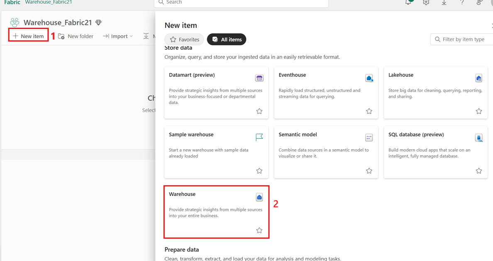

2.  **New warehouse** 대화 상자에서 +++**WideWorldImporters+++**를
    입력하고 **Create** 버튼을 클릭하세요.

> 

3.  프로비저닝이 완료되면 **WideWorldImporters** 웨어하우스 랜딩
    페이지가 나타납니다.

> 

# 연습 2: Microsoft Fabric의 웨어하우스로 데이터 수집

## 작업 1: 웨어하우스로 데이터 수집

1.  **WideWorldImporters** 웨어하우스 랜딩 페이지의 왼쪽 탐색 메뉴에서
    **Warehouse_FabricXX** 를 선택하여 작업 영역 항목 목록으로
    돌아가세요.

> 

2.  **Warehouse_FabricXX** 페이지에서 +**New item**을 선택하세요. **Data
    pipeline**을 클릭하여 Get data.에서 사용 가능한 항목의 전체 목록을
    보세요.

> 

3.  **New** **pipeline** 대화 상자에 **Name** 필드에서 +++**Load
    Customer Data+++**를 입력하고 **Create** 버튼을 클릭하세요.

> 

4.  **Load Customer Data** 페이지에서 **Start building your data
    pipeline** 섹션으로 이동하고 **Pipeline activity**를 클릭하세요.

> 

5.  **Move & transform**섹션에서 **Copy data**를 탐색하고 선택하세요.

> 

6.  디자인 캔버스에서 **Copy data 1** 활동을 선택하여 구성하세요.

> **참고**: 디자인 캔버스에서 수평선을 드래그하면 다양한 기능을
> 전체적으로 볼 수 있습니다.
>
> 

7.  **General** 탭에 **Name** 필드에서 +++**CD Load
    dimension_customer+++**를 입력하세요.

> 

8.  **Source** 페이지에서 **Connection** 드롭다운을 선택하세요.
    **More**를 선택하여 로컬 OneLake 데이터 허브의 데이터 원본을
    포함하여 선택할 수 있는 모든 데이터 원본을 확인하세요.

> 

9.  **Get data** 창에서 +++**Azure Blobs+++**를 검색하고 **Azure Blob
    Storage** 버튼을 클릭하세요.

> 

10. 오른쪽에 나타나는 **Connection settings** 창에서 다음 설정을
    구성하고 **Connect** 버튼을 클릭하세요.

- **Account name or URL**에서
  +++**https://fabrictutorialdata.blob.core.windows.net/sampledata/+++**를
  입력하세요

- **Connection credentials** 섹션에서 **Connection**의 드롭다운에서
  **Create new connection**을 선택하세요.

- **Connection name** 필드에서 +++**Wide World Importers Public
  Sample+++**를 입략하세요.

- **Authentication kind**를 **Anonymous**로 설정하세요.

11. 복사 작업의 Source 페이지에서 나머지 설정을 다음과 같이 변경하여
    **https://fabrictutorialdata.blob.core.windows.net/sampledata/WideWorldImportersDW/parquet/full/dimension_customer/\*.parquet**
    의 **.**parquet 파일에 도달하세요.

12. **File path** 텍스트 상자에서 다음을 제공하세요:

- **Container:** +++**sampledata+++**

- **File path - Directory:** +++**WideWorldImportersDW/tables+++**

- **File path - File name:** +++**dimension_customer.parquet+++**

- **File format** 드롭다운에서 **Parquet**를 선택하세요 (**Parquet**을
  볼 수 없는 경우 검색 상자에 입력한 후 선택하세요)

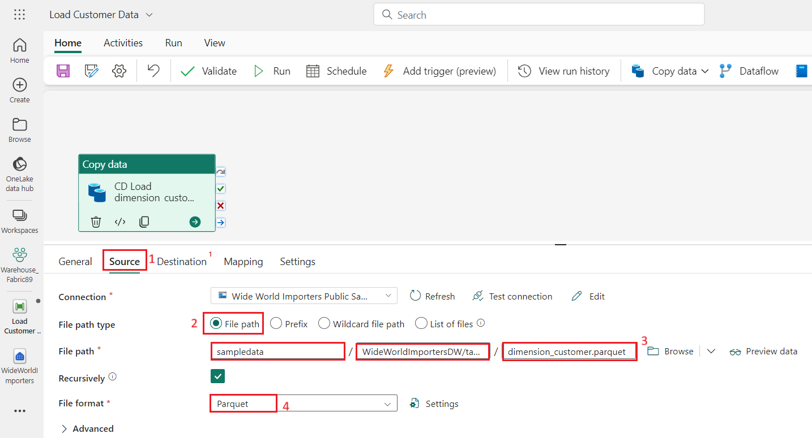

13. **File path**설정의 오른쪽에 있는 **Preview data**를 클릭하여 오류가
    없는지 확인한 후 **close**를 클릭하세요.

> 

14. **Destination** 탭에서 다음 설정을 입력하세요.

[TABLE]

> 

15. Ribbon에서 **Run**을 선택하세요.

> 

16. **Save and run?** 대화 상자에서 **Save and run** 버튼을 클릭하세요.

> 
>
> 

17. **Output** 페이지에서 복사 작업의 진행률을 모니터링하고 완료될
    때까지 기다리세요.

> 

# 연습 3: 데이터 웨어하우스에서 테이블 생성하기

## 작업 1: 데이터 웨어하우스에서 테이블 생성하기

1.  **Load Customer Data** 페이지에서 왼쪽 탐색 모음에서
    **Warehouse_FabricXX** 작업 영역을 클릭하세요.

> 

2.  **Syanapse Data Engineering** **Warehouse_FabricXX** 페이지에서 아래
    이미지와 같이 **Warehouse** 유형이 있는 **WideWorldImporters** 를
    주의 깊게 탐색하고 클릭하세요.

> 

3.  **WideWorldImporters** 페이지에서 **Home **탭으로 이동하고
    드롭다운에서 **SQL**을 선택하고 **New SQL query**를 클릭하세요.

> 

4.  쿼리 편집기에서 다음 코드를 붙여넣고 **Run**을 선택하여 쿼리를
    실행하세요

> SQLCopy
>
> /\*
>
> 1\. Drop the dimension_city table if it already exists.
>
> 2\. Create the dimension_city table.
>
> 3\. Drop the fact_sale table if it already exists.
>
> 4\. Create the fact_sale table.
>
> \*/
>
> --dimension_city
>
> DROP TABLE IF EXISTS \[dbo\].\[dimension_city\];
>
> CREATE TABLE \[dbo\].\[dimension_city\]
>
> (
>
> \[CityKey\] \[int\] NULL,
>
> \[WWICityID\] \[int\] NULL,
>
> \[City\] \[varchar\](8000) NULL,
>
> \[StateProvince\] \[varchar\](8000) NULL,
>
> \[Country\] \[varchar\](8000) NULL,
>
> \[Continent\] \[varchar\](8000) NULL,
>
> \[SalesTerritory\] \[varchar\](8000) NULL,
>
> \[Region\] \[varchar\](8000) NULL,
>
> \[Subregion\] \[varchar\](8000) NULL,
>
> \[Location\] \[varchar\](8000) NULL,
>
> \[LatestRecordedPopulation\] \[bigint\] NULL,
>
> \[ValidFrom\] \[datetime2\](6) NULL,
>
> \[ValidTo\] \[datetime2\](6) NULL,
>
> \[LineageKey\] \[int\] NULL
>
> );
>
> --fact_sale
>
> DROP TABLE IF EXISTS \[dbo\].\[fact_sale\];
>
> CREATE TABLE \[dbo\].\[fact_sale\]
>
> (
>
> \[SaleKey\] \[bigint\] NULL,
>
> \[CityKey\] \[int\] NULL,
>
> \[CustomerKey\] \[int\] NULL,
>
> \[BillToCustomerKey\] \[int\] NULL,
>
> \[StockItemKey\] \[int\] NULL,
>
> \[InvoiceDateKey\] \[datetime2\](6) NULL,
>
> \[DeliveryDateKey\] \[datetime2\](6) NULL,
>
> \[SalespersonKey\] \[int\] NULL,
>
> \[WWIInvoiceID\] \[int\] NULL,
>
> \[Description\] \[varchar\](8000) NULL,
>
> \[Package\] \[varchar\](8000) NULL,
>
> \[Quantity\] \[int\] NULL,
>
> \[UnitPrice\] \[decimal\](18, 2) NULL,
>
> \[TaxRate\] \[decimal\](18, 3) NULL,
>
> \[TotalExcludingTax\] \[decimal\](29, 2) NULL,
>
> \[TaxAmount\] \[decimal\](38, 6) NULL,
>
> \[Profit\] \[decimal\](18, 2) NULL,
>
> \[TotalIncludingTax\] \[decimal\](38, 6) NULL,
>
> \[TotalDryItems\] \[int\] NULL,
>
> \[TotalChillerItems\] \[int\] NULL,
>
> \[LineageKey\] \[int\] NULL,
>
> \[Month\] \[int\] NULL,
>
> \[Year\] \[int\] NULL,
>
> \[Quarter\] \[int\] NULL
>
> );
>
> 
>
> 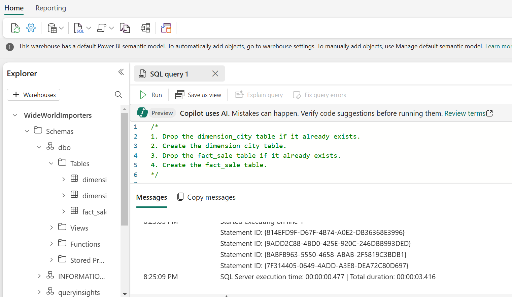

5.  이 쿼리를 저장하려면 편집기 바로 위에 **SQL query 1** 탭을 마우스
    오른쪽 버튼으로 클릭하고 **Rename**를 선택하세요.

> 

6.  **Rename** 대화 상자에 **Name** 필드에서 +++**Create Tables+++**를
    입력하고 **SQL query 1**의 이름을 바꾸세요. **Rename** 버튼을
    클릭하세요.

> 

7.  리본에서 **refresh icon** 버튼을 선택하여 테이블이 성공적으로
    만들어졌는지 확인하세요.

> 

8.  **Explorer** 창에서, **fact_sale** 테이블과 **dimension_city**
    테이블이 표시됩니다.

> 

## 작업 2: T-SQL을 사용하여 데이터 로드

이제 데이터 웨어하우스를 구축하고, 테이블을 로드하고, 보고서를 생성하는
방법을 알았으므로 데이터를 로드하는 다른 방법을 탐색하여 솔루션을 확장할
차례입니다.

1.  **WideWorldImporters** 페이지에서, go to the **Home** 탭으로
    이동하고 드롭다운에서 **SQL**을 선택하고 **New SQL query**를
    클릭하세요.

> 

2.  쿼리 편집기에서 다음 코드를 **붙여넣은** 후 **Run 을** 클릭하여
    쿼리를 실행하세요.

> SQLCopy
>
> --Copy data from the public Azure storage account to the
> dbo.dimension_city table.
>
> COPY INTO \[dbo\].\[dimension_city\]
>
> FROM
> 'https://fabrictutorialdata.blob.core.windows.net/sampledata/WideWorldImportersDW/tables/dimension_city.parquet'
>
> WITH (FILE_TYPE = 'PARQUET');
>
> --Copy data from the public Azure storage account to the dbo.fact_sale
> table.
>
> COPY INTO \[dbo\].\[fact_sale\]
>
> FROM
> 'https://fabrictutorialdata.blob.core.windows.net/sampledata/WideWorldImportersDW/tables/fact_sale.parquet'
>
> WITH (FILE_TYPE = 'PARQUET');
>
> 

3.  쿼리가 완료되면 **dimension_city** 및 **fact_sale** 테이블에 각각
    로드된 행 수를 나타내는 메시지를 검토하세요.

> 

4.  데이터 미리 보기를 로드하여 **Explorer**의 **fact_sale** 테이블에서
    선택하여 성공적으로 로드된 데이터의 유효성을 검사하세요.

> 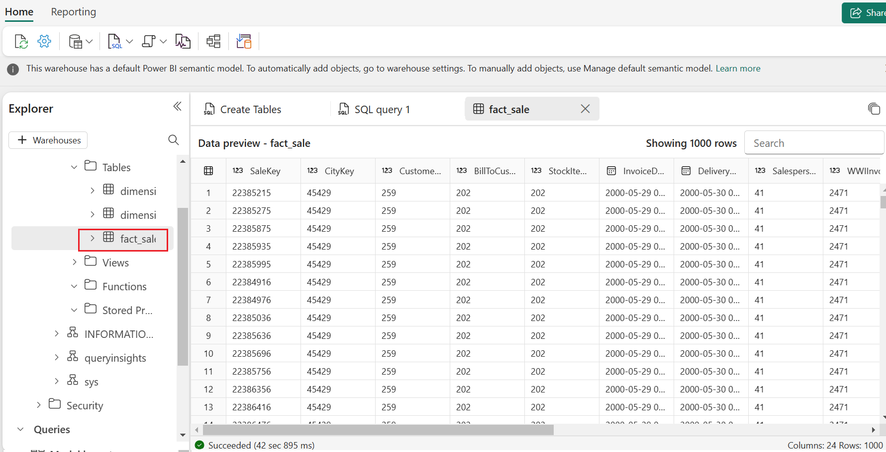

5.  쿼리의 이름을 바꾸세요. **Explorer**에서**SQL query** 1을 마우스
    오른쪽 버튼으로 클릭한 후 **Rename**을 선택하세요**.**

> 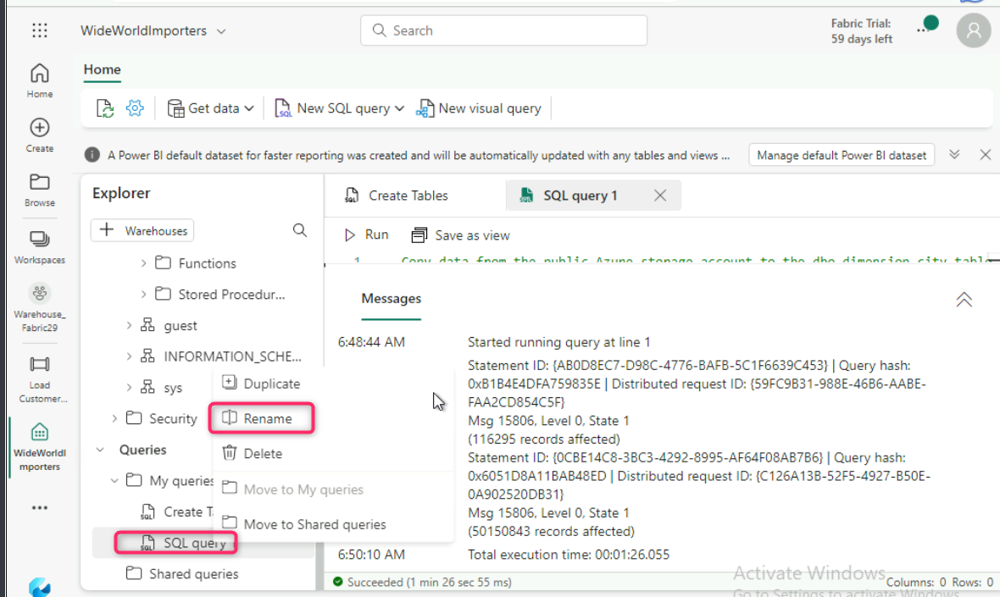

6.  **Rename** 대화 상자에 **Name** 필드에서 +++**Load Tables+++**를
    입력하세요. **Rename** 버튼을 클릭하세요.

> 

7.  **Home** 탭 아래의 명령 모음에서 **Refresh** 아이콘을 클릭하세요.

> 

# 연습 4: Microsoft Fabric에서 T-SQL을 사용하여 테이블 복제

## 작업 1: 웨어하우스의 동일한 스키마 내에서 테이블 복제 생성

이 작업은 [CREATE TABLE AS CLONE
OF](https://learn.microsoft.com/en-us/sql/t-sql/statements/create-table-as-clone-of-transact-sql?view=fabric&preserve-view=true)
T-SQL 구문을 사용하여 Microsoft Fabric의 웨어하우스에서 [table
clone](https://learn.microsoft.com/en-in/fabric/data-warehouse/clone-table)을
생성하는 방법을 안내합니다.

1.  웨어하우스의 동일한 스키마 내에서 테이블 복제본을 생성하세요.

2.  **WideWorldImporters** 페이지에서 **Home** 탭으로 이동하고
    드롭다운에서 **SQL**을 선택하고 **New SQL query**를 클릭하세요.

> 

3.  쿼리 편집기에서 다음 코드를 붙여넣어 **dbo.dimension_city** 및
    **dbo.fact_sale** 테이블의 복제본을 생성하세요.

> SQLCopy
>
> --Create a clone of the dbo.dimension_city table.
>
> CREATE TABLE \[dbo\].\[dimension_city1\] AS CLONE OF
> \[dbo\].\[dimension_city\];
>
> --Create a clone of the dbo.fact_sale table.
>
> CREATE TABLE \[dbo\].\[fact_sale1\] AS CLONE OF \[dbo\].\[fact_sale\];
>
> 

4.  쿼리를 실행하려면 **Run**을 선택하세요. 쿼리를 실행하는 데 몇 초
    정도 걸립니다. 쿼리가 완료되면 테이블이 복제되고 **dimension_city1**
    및 **fact_sale1** 생성됩니다**.**

> 
>
> 

5.  데이터 미리 보기를 로드하여 **Explorer**의 **dimension_city1**
    테이블에서 선택하여 성공적으로 로드된 데이터의 유효성을 검사하세요.

> 

6.  생성한 **SQL query**를 마우스 오른쪽 버튼으로 클릭하여
    **Explorer** 에서 테이블을 복제하고 **Rename**을 선택하세요.

> 

7.  **Rename** 대화 상자에 **Name** 필드에서 +++**Clone Table+++**를
    입력하고 **Rename** 버튼을 클릭하세요.

> 

8.  **Home** 탭 밑의 명령 바에서 **Refresh** 아이콘을 클릭하세요.

> 

## 작업 2: 동일한 웨어하우스 내의 스키마에서 테이블 복제 생성

1.  **WideWorldImporters** 페이지에서 **Home** 탭으로 이동하고
    드롭다운에서 **SQL**을 선택하고 **New SQL query**를 클릭하세요.

> 

2.  **dbo1**이라는 **WideWorldImporter** 웨어하우스 내에 새 스키마를
    생성하세요. 아래 이미지와 같이 다음 T-SQL 코드를 복사, paste **및**
    run하세요:

> SQLCopy
>
> CREATE SCHEMA dbo1;

3.  쿼리 편집기에서 기존 코드를 제거하고 다음을 붙여넣어 **dbo1**
    스키마에 **dbo.dimension_city** 및 **dbo.fact_sale** **tables** 의
    복제본을 생성하세요.

> **SQLCopy**
>
> --Create a clone of the dbo.dimension_city table in the dbo1 schema.
>
> CREATE TABLE \[dbo1\].\[dimension_city1\] AS CLONE OF
> \[dbo\].\[dimension_city\];
>
> --Create a clone of the dbo.fact_sale table in the dbo1 schema.
>
> CREATE TABLE \[dbo1\].\[fact_sale1\] AS CLONE OF
> \[dbo\].\[fact_sale\];

4.  쿼리를 실행하려면 **Run**을 선택하세요. 쿼리를 실행하는 데 몇 초
    정도 걸립니다.

> 

5.  쿼리가 완료되면 복제 **dimension_city1** 및 **fact_sale1 가** dbo1
    **스키마**에 생성해집니다.

> 

6.  데이터 미리 보기를 로드하여 **Explorer**의 **dbo1** 스키마 아래의
    **dimension_city1** 테이블을 선택하여 성공적으로 로드된 데이터의
    유효성을 검사하세요.

> 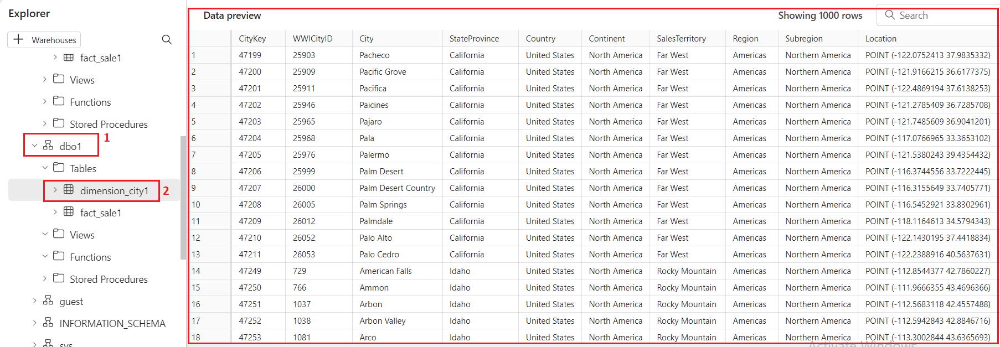

7.  나중에 참조할 수 있도록 쿼리의 이름을 바꾸세요. **Explorer**에서
    **SQL query 1**을 마우스 오른쪽 버튼으로 클릭하고 **Rename**를
    선택하세요.

> 

8.  **Rename** 대화 상자에 **Name** 필드에서 +++**Clone Table in another
    schema+++**를 입력하세요. **Rename** 버튼을 클릭하세요.

> 

9.  **Home** 탭 아래의 명령 모음에서**Refresh** 아이콘을 클릭하세요.

> 

# 연습 5: 저장 프로시저를 사용하여 데이터 변환

데이터를 변환하기 위해 새 저장 프로시저를 생성하고 저장하는 방법을
알아봅니다.

1.  **WideWorldImporters** 페이지의 **Home** 탭으로 이동하여
    드롭다운에서 **SQL**을 선택한 후 **New SQL query**를 클릭하세요.

> 

2.  쿼리 편집기에서 다음 코드를 **붙여넣**어 저장 프로시저
    **dbo.populate_aggregate_sale_by_city** 생성하세요. 이 저장
    프로시저는 이후 단계에서 **dbo.aggregate_sale_by_date_city**
    테이블을 생성하고 로드하세요.

> SQLCopy
>
> --Drop the stored procedure if it already exists.
>
> DROP PROCEDURE IF EXISTS \[dbo\].\[populate_aggregate_sale_by_city\]
>
> GO
>
> --Create the populate_aggregate_sale_by_city stored procedure.
>
> CREATE PROCEDURE \[dbo\].\[populate_aggregate_sale_by_city\]
>
> AS
>
> BEGIN
>
> --If the aggregate table already exists, drop it. Then create the
> table.
>
> DROP TABLE IF EXISTS \[dbo\].\[aggregate_sale_by_date_city\];
>
> CREATE TABLE \[dbo\].\[aggregate_sale_by_date_city\]
>
> (
>
> \[Date\] \[DATETIME2\](6),
>
> \[City\] \[VARCHAR\](8000),
>
> \[StateProvince\] \[VARCHAR\](8000),
>
> \[SalesTerritory\] \[VARCHAR\](8000),
>
> \[SumOfTotalExcludingTax\] \[DECIMAL\](38,2),
>
> \[SumOfTaxAmount\] \[DECIMAL\](38,6),
>
> \[SumOfTotalIncludingTax\] \[DECIMAL\](38,6),
>
> \[SumOfProfit\] \[DECIMAL\](38,2)
>
> );
>
> --Reload the aggregated dataset to the table.
>
> INSERT INTO \[dbo\].\[aggregate_sale_by_date_city\]
>
> SELECT
>
> FS.\[InvoiceDateKey\] AS \[Date\],
>
> DC.\[City\],
>
> DC.\[StateProvince\],
>
> DC.\[SalesTerritory\],
>
> SUM(FS.\[TotalExcludingTax\]) AS \[SumOfTotalExcludingTax\],
>
> SUM(FS.\[TaxAmount\]) AS \[SumOfTaxAmount\],
>
> SUM(FS.\[TotalIncludingTax\]) AS \[SumOfTotalIncludingTax\],
>
> SUM(FS.\[Profit\]) AS \[SumOfProfit\]
>
> FROM \[dbo\].\[fact_sale\] AS FS
>
> INNER JOIN \[dbo\].\[dimension_city\] AS DC
>
> ON FS.\[CityKey\] = DC.\[CityKey\]
>
> GROUP BY
>
> FS.\[InvoiceDateKey\],
>
> DC.\[City\],
>
> DC.\[StateProvince\],
>
> DC.\[SalesTerritory\]
>
> ORDER BY
>
> FS.\[InvoiceDateKey\],
>
> DC.\[StateProvince\],
>
> DC.\[City\];
>
> END
>
> 
>
> 

3.  생성한 SQL 쿼리를 마우스 오른쪽 버튼으로 클릭하여 탐색기에서
    테이블을 복제하고 **Rename**을 선택하세요.

> 

4.  **Rename** 대화 상자에 **Name** 필드에서 +++**Create Aggregate
    Procedure+++**를 입력하고 **Rename** 버튼을 클릭하세요.

> 

5.  **Home** 탭 아래에 있는 **Refresh 아이콘을** 클릭하세요.

> 

6.  **Explorer** 탭에서 **dbo** 스키마 아래의 **StoredProcedures**
    노드를 확장하여 새로 생성한 저장 프로시저를 볼 수 있는지 확인하세요.

> 

7.  **WideWorldImporters** 페이지에 **Home** 탭에서
    드롭다운에서 **SQL**을 선택하고 **New SQL query**를 클릭하세요.

> 

8.  쿼리 편집기에서 다음 코드를 붙여넣습니다. 이 T-SQL은
    **dbo.populate_aggregate_sale_by_city**를 실행하여
    **dbo.aggregate_sale_by_date_city** 테이블을 생성합니다. 쿼리 실행

SQLCopy

> --Execute the stored procedure to create the aggregate table.
>
> EXEC \[dbo\].\[populate_aggregate_sale_by_city\];
>
> 

9.  나중에 참조할 수 있도록 이 쿼리를 저장하려면 편집기 바로 위의 쿼리
    탭을 마우스 오른쪽 버튼으로 클릭하고 **Rename**을 선택하세요.

10. **Rename** 대화 상자에 **Name** 필드에서 +++**Run** **Create
    Aggregate Procedure+++**를 입력하고 **Rename** 버튼을 클릭하세요.

11. Ribbon에서 **Refresh** 아이콘을 선택하세요.

12. Object **Explorer** 탭에서, 데이터 미리 보기를 로드하여
    **Explorer**의 **aggregate_sale_by_city** 테이블에서 선택하여
    성공적으로 로드된 데이터의 유효성을 검사하세요.

# 연습 6: 문 수준에서 T-SQL을 사용한 타임 트래블

1.  **WideWorldImporters** 페이지에서 **Home** 탭으로 이동하고
    드롭다운에서 **SQL**을 선택하고 **New SQL query**를 클릭하세요.

> 

2.  쿼리 편집기에서 다음 코드를 붙여넣어 Top10CustomerView 보기를
    만듭니다. **Run을** 선택하여 쿼리를 실행하세요.

CREATE VIEW dbo.Top10CustomersView

AS

SELECT TOP (10)

    FS.\[CustomerKey\],

    DC.\[Customer\],

    SUM(FS.TotalIncludingTax) AS TotalSalesAmount

FROM

    \[dbo\].\[dimension_customer\] AS DC

INNER JOIN

    \[dbo\].\[fact_sale\] AS FS ON DC.\[CustomerKey\] =
FS.\[CustomerKey\]

GROUP BY

    FS.\[CustomerKey\],

    DC.\[Customer\]

ORDER BY

    TotalSalesAmount DESC;

3.  **Explorer**에서 dbo 스키마 아래의 **View **노드를 확장하여 새로
    생성한 뷰 **Top10CustomersView**를 볼 수 있는지 확인하세요.

4.  나중에 참조할 수 있도록 이 쿼리를 저장하려면 편집기 바로 위의 쿼리
    탭을 마우스 오른쪽 단추로 클릭하고 **Rename**을 선택하세요.

5.  **Rename** 대화 상자에 **Name** 필드에서
    +++**Top10CustomersView+++**를 입력하고 **Rename** 버튼을
    클릭하세요.

6.  1단계와 유사한 다른 새 쿼리 생성하세요. 리본의 **Home **탭에서 **New
    SQL query**를 선택하세요.

7.  쿼리 편집기에서 다음 코드를 붙여넣으세요. 이렇게 하면 **SaleKey**
    값이 **22632918**인 레코드에 대해 **TotalIncludingTax** 열 값이
    **200000000**으로 업데이트됩니다**. Run** 을 선택하여 쿼리를
    실행하세요.

SQLCopy

/\*Update the TotalIncludingTax value of the record with SaleKey value
of 22632918\*/

UPDATE \[dbo\].\[fact_sale\]

SET TotalIncludingTax = 200000000

WHERE SaleKey = 22632918;

8.  쿼리 편집기에서 다음 코드를 붙여넣으세요. CURRENT_TIMESTAMP T-SQL
    함수는 현재 UTC 타임스탬프를 **datetime**으로 반환하세요. **Run**을
    선택하여 쿼리를 실행하세요.

SQLCopy

SELECT CURRENT_TIMESTAMP;

9.  클립보드에 반환된 타임스탬프 값을 복사하세요.

10. 쿼리 편집기에 다음 코드를 붙여넣고 타임스탬프 값을 이전 단계에서
    가져온 현재 타임스탬프 값으로 바꾸세요. 타임스탬프 구문 형식은
    **YYYY-MM-DDTHH:MM:SS\[.FFF\]** 입니다.

11. 후행 0을 제거하세요 (예: **2025-06-09T06:16:08.807**).

12. 다음 예제에서는 **SaleKey 22632918**의 새 값을 포함하여
    **TotalIncludingTax**를 기준으로 상위 10개 고객 목록을 반환하세요.
    기존 코드를 바꾸고 다음 코드를 붙여넣고 **Run**을 선택하여 쿼리를
    실행하세요.

SQLCopy

/\*View of Top10 Customers as of today after record updates\*/

SELECT \*

FROM \[WideWorldImporters\].\[dbo\].\[Top10CustomersView\]

OPTION (FOR TIMESTAMP AS OF '2025-06-09T06:16:08.807');

13. 쿼리 편집기에 다음 코드를 붙여넣고 타임스탬프 값을 업데이트
    스크립트를 실행하기 전의 시간으로 바꿔 **TotalIncludingTax** 값을
    업데이트하세요. 이렇게 하면 TotalIncludingTax가 **SaleKey**
    22632918에 대해 업데이트되기 *전의* 상위 10개 고객 목록이
    반환됩니다. **Run**을 선택하여 쿼리를 실행하세요.

SQLCopy

/\*View of Top10 Customers as of today before record updates\*/

SELECT \*

FROM \[WideWorldImporters\].\[dbo\].\[Top10CustomersView\]

OPTION (FOR TIMESTAMP AS OF '2024-04-24T20:49:06.097');

# 연습 7: 시각적 쿼리 빌더를 사용하여 쿼리 생성하기

## 작업 1: 시각적 쿼리 빌더 사용

Microsoft Fabric 포털에서 시각적 쿼리 작성기를 사용하여 쿼리를 만들고
저장합니다.

1.  **WideWolrdImporters** 페이지의 리본 메뉴의 **Home** 탭에서 **New
    visual query**를 선택하세요.

> 

2.  **fact_sale**를 마우스 오른쪽 버튼으로 클릭하고 **Insert into
    canvas**을 선택하세요.

> 
>
> 

3.  쿼리 디자인 창 **transformations ribbon**으로 이동하고 **Reduce
    rows** 드롭다운을 클릭하여 데이터 세트 크기를 제한한 후 아래
    이미지와 같이 **Keep top rows**를 클릭하세요.

4.  **Keep top rows** 대화 상자에서 **10000**를 입력하고 **OK**를
    선택하세요.

> 
>
> 

5.  **dimension_city**를 마우스 오른쪽 버튼으로 클릭하고 **Insert into
    canvas**을 선택하세요.

> 
>
> 

6.  변환 리본에서 **Combine** 옆에 있는 드롭다운을 선택하고 아래
    이미지와 같이 **Merge queries as new**을 선택하세요.

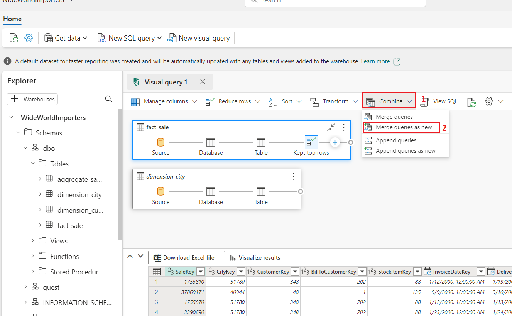

7.  **Merge** 설정 페이지에서 다음 세부 정보를 입력하세요.

- **Left table for merge** 드롭다운에서 **dimension_city**를 선택

&nbsp;

- **Right table for merge** 드롭다운에서 **fact_sale**를 선택 (가로 및
  세로 스크롤 막대 사용)

&nbsp;

- 조인 열을 나타내기 위해 머리글 행의 열 이름을 선택하여
  **dimension_city** 테이블에서 **CityKey** 필드를 선택.

&nbsp;

- 조인 열을 나타내기 위해 머리글 행의 열 이름을 선택하여 **fact_sale**
  테이블에서 **CityKey** 필드를 선택.

&nbsp;

- **Join kind** 다이어그램 선택에서 **Inner**를 선택하고 **OK** 버튼을
  클릭.

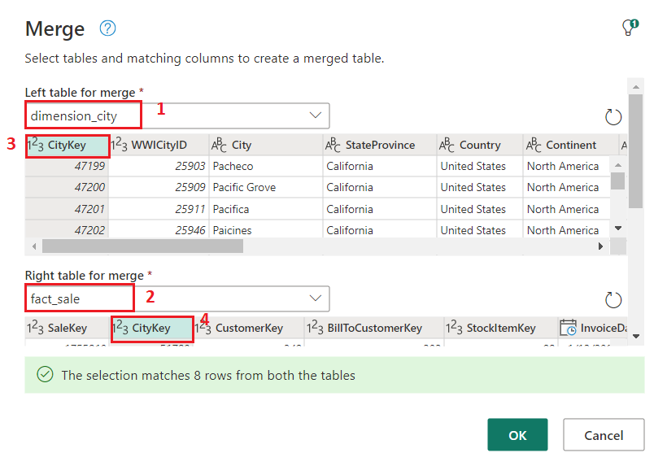

8.  **Merge** 단계를 선택한 상태에서 아래 이미지와 같이 데이터 표의
    헤더에서 **fact_sale** 옆에 있는 **Expand** 버튼을 선택한 후
    **TaxAmount, Profit, TotalIncludingTax** 열을 선택하고 **Ok**을
    선택하세요.

9.  **transformations ribbon**에서 **Transform**옆에 있는 드롭다운을
    클락하고 **Group by**를 선택하세요.

10. **Group by**설정 페이지에서 다음 세부 정보를 입력하세요.

- **Advanced** 라디오 버튼을 선택.

- **Group by**에서 다음을 선택:

  1.  **Country**

  2.  **StateProvince**

  3.  **City**

- **New column name**에서**Operation** 열 필드에 **SumOfTaxAmount**를
  입력하고 **Sum**을 선택하고, **Column** 필드에서 **TaxAmount**를
  선택하세요**. Add aggregation**을 클릭하여 집계 열 및 작업을 더
  추가하세요.

- **New column name**에서**Operation** 열 필드에 **SumOfProfit**를
  입력하고 **Sum**을 선택하고 **Column** 필드에서 **Profit**을
  선택하세요. **Add aggregation**을 클릭하여 집계 열 및 작업을 더
  추가하세요.

- **New column name**에서 **Operation** 열 필드에
  **SumOfTotalIncludingTax**를 입력하고 **Sum**을 선택하고 **Column**
  필드에서 **TotalIncludingTax**을 선택하세요**.** 

- **OK** 버튼을 클릭하세요.

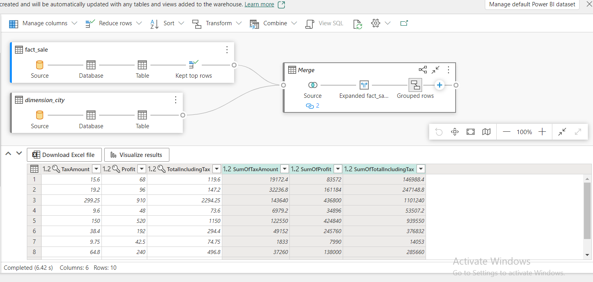

11. Explorer에서 **Queries**로 이동하고 **Queries**에서 **Visual query
    1**을 마우스 오른쪽 버튼으로 클릭하세요. **Rename**을 선택하세요.

> 

12. 쿼리 이름을 바꾸려면 +++**Sales Summary+++**를 입력하세요.
    키보드에서 **Enter** 키를 누르거나 탭 외부의 아무 곳이나 선택하여
    변경 사항을 저장하세요.

> 

13. **Home** 탭에서 **Refresh** 아이콘을 클릭하세요.

> 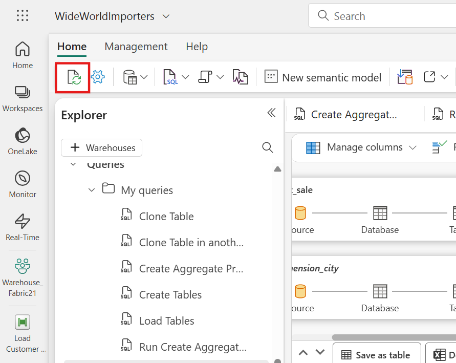

# 연습 8: 노트북으로 데이터 분석

## 작업 1: Lakehouse 바로 가기 만들기 및 Notebook을 사용하여 데이터 분석

이 작업에서는 데이터를 한 번 저장한 후 다른 여러 서비스와 함께 사용하는
방법에 대해 알아봅니다. Azure Data Lake Storage 및 S3에 저장된 데이터에
대한 바로 가기를 생성하여 외부 시스템에서 델타 테이블에 직접 액세스할
수도 있습니다.

먼저 새 Lakehouse를 생성합니다. Microsoft Fabric 작업 영역에서 새
Lakehouse를 만들려면:

1.  **WideWorldImportes** 페이지에서 왼쪽 탐색 메뉴에서
    **Warehouse_FabricXX** Workspace를 클릭하세요.

> 

2.  **Synapse Data Engineering Warehouse_FabricXX** 홈페이지에 **Warehouse_FabricXX** 창에서 **+New item**을
    클릭하고 **Stored data**에서 **Lakehouse**를 선택하세요.

> 

3.  **Name** 필드에서 +++**ShortcutExercise+++**를 입력하고 **Create**
    버튼을 클릭하세요**.**

> 

4.  새 Lakehouse가 로드되고 **Explorer **보기가 열리고 **Get data in
    your lakehouse **메뉴가 표시됩니다. **Load data in your
    lakehouse**에서 **New shortcut** 버튼을 선택하세요.

> 

5.  **New shortcut** 창에서 **Microsoft OneLake**를 선택하세요.

> 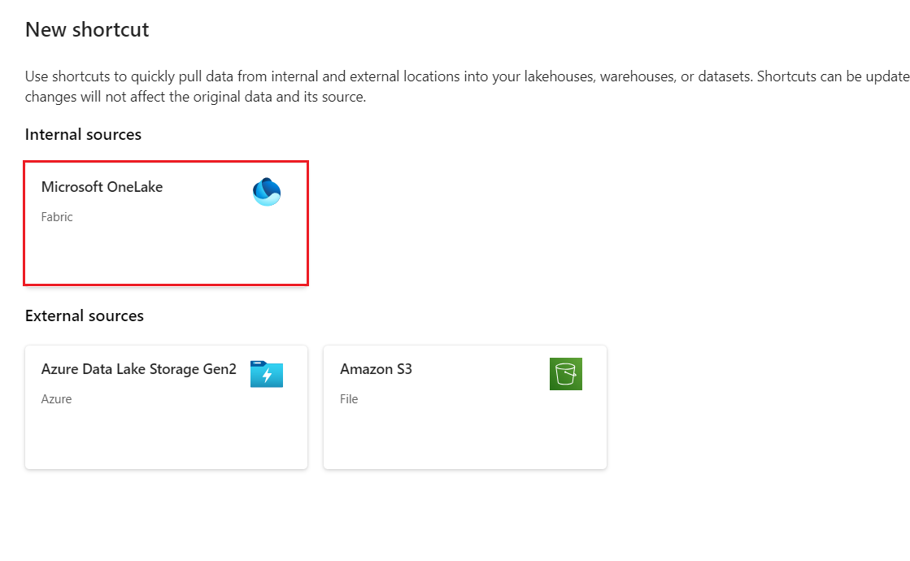

6.  **Select a data source type** 창에서 이전에 생성한
    **WideWorldImporters** 라는 **Warehouse** 를 주의 깊게 탐색하고
    클릭한 후 **Next** 버튼을 클릭하세요**.**

> 

7.  **OneLake** object 브라우저에서 **Tables**을 확장하고
    **dbo** 스키마를 확장하고 **dimension_customer** 옆의 라디오 버튼을
    선택하세요. **Next** 버튼을 선택하세요.

> 

8.  **New shortcut** 창에서 **Create** 버튼을 클릭하고 **Close** 버튼을
    클릭하세요

> 
>
> 

9.  잠시 기다렸다가 **Refresh **아이콘을 클릭하세요.

10. **Table** 목록에서 **dimension_customer** 선택하여 데이터를 미리
    보세요. Lakehouse는 웨어하우스의 **dimension_customer** 테이블의
    데이터를 표시하세요.

> 

11. 다음으로, **dimension_customer** 테이블을 쿼리할 새 Notebook을
    생성하세요. **Home** 리본에서 **Open notebook**에 대한 드롭다운을
    선택하고 **New notebook**을 선택하세요.

> 

12. 선택한 후 **Tables** 목록에서 열려 있는 Notebook 셀로
    **dimension_customer** 끄세요.
    **ShortcutExercise.dimension_customer**에서 모든 데이터를 쿼리하기
    위해 **PySpark** 쿼리가 작성된 것을 볼 수 있습니다. 이 Notebook
    환경은 Visual Studio Code Jupyter Notebook 환경과 비슷합니다. VS
    Code에서 Notebook을 열 수도 있습니다.

> 

13. **Home** 리본에서 **Run all**버튼을 선택하세요. 쿼리가 완료되면
    PySpark를 사용하여 웨어하우스 테이블을 쉽게 쿼리할 수 있습니다!

# 연습 9: SQL 쿼리 편집기를 사용하여 웨어하우스 간 쿼리 생성하기

## 작업 1: 탐색기에 여러 warehouses 추가

이 작업에서는 SQL 엔드포인트와 Microsoft Fabric의 웨어하우스에서
데이터를 함께 조인하는 것을 포함하여 여러 웨어하우스에서 SQL 쿼리
편집기를 사용하여 T-SQL 쿼리를 쉽게 만들고 실행하는 방법에 대해
알아봅니다.

1.  **Notebook1** 페이지에서 이동하고 왼쪽 탐색 메뉴에서
    **Warehouse_FabricXX** Workspace를 클릭하세요.

> 

2.  **Warehouse_FabricXX** 뷰에서 **WideWorldImporters** warehouse를
    선택하세요.

> 

3.  **Explorer** 탭에 **WideWorldImporters** 페이지에서 **+
    Warehouses** 버튼을 선택하세요.

> 

4.  Add warehouses 창에서 **ShortcutExercise**를 선택하고 **Confirm**
    버튼을 클릭하세요. 두 웨어하우스 환경이 모두 쿼리에 추가됩니다.

> 

5.  이제 선택한 warehouses에 동일한 **Explorer **창이 표시됩니다.

## 작업 2: warehouse 간 쿼리 실행

이 예제에서는 WideWorldImporters 웨어하우스 및 ShortcutExercise SQL
엔드포인트에서 T-SQL 쿼리를 얼마나 쉽게 실행할 수 있는지 확인할 수
있습니다. SQL Server에서와 같이 database.schema.table을 참조하는 세
부분으로 구성된 이름 지정을 사용하여 데이터베이스 간 쿼리를 작성할 수
있습니다.

1.  Ribbon의 **Home** 탭에서 **New SQL query**를 선택하세요.

> 

2.  쿼리 편집기에서 다음 T-SQL 코드를 복사하여 붙여넣으세요.
    **Run **버튼을 선택하여 쿼리를 실행하세요. 쿼리가 완료되면 결과가
    표시됩니다.

> SQLCopy
>
> SELECT Sales.StockItemKey,
>
> Sales.Description,
>
> SUM(CAST(Sales.Quantity AS int)) AS SoldQuantity,
>
> c.Customer
>
> FROM \[dbo\].\[fact_sale\] AS Sales,
>
> \[ShortcutExercise\].\[dbo\].\[dimension_customer\] AS c
>
> WHERE Sales.CustomerKey = c.CustomerKey
>
> GROUP BY Sales.StockItemKey, Sales.Description, c.Customer;

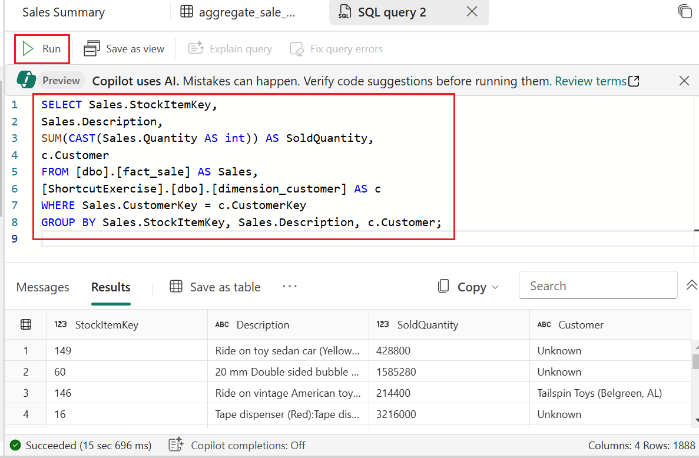

3.  참조를 위해 쿼리 이름 바꾸세요. **Explorer**에서 **SQL query**를
    마우스 오른쪽 버튼으로 클릭하고 **Rename**을 선택하세요.

> 

4.  **Rename** 대화 상자에 **Name** 필드에서 +++**Cross-warehouse
    query+++**를 입력하고 **Rename** 버튼을 클릭하세요. 

> 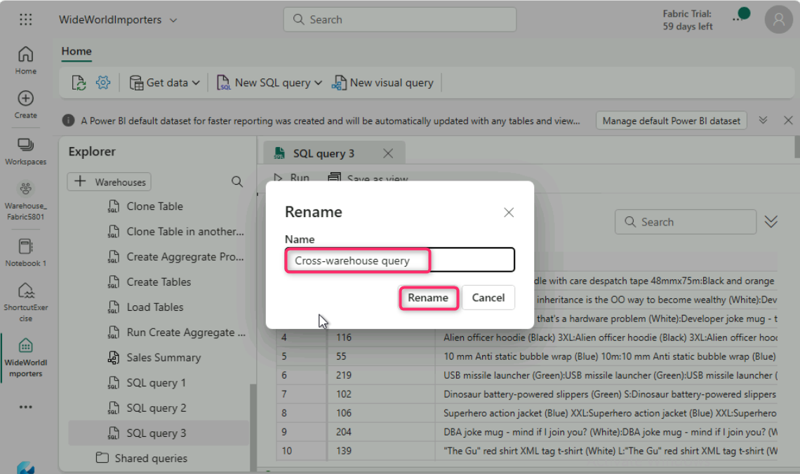

# 연습 10: Power BI 보고서 생성하기

## 작업 1: semantic model을 생성하기

이 작업에서는 여러 유형의 Power BI 보고서를 생성하고 저장하는 방법을
알아봅니다.

1.  **WideWorldImportes** 페이지에 **Home** 탭에서 **New semantic
    model**을 선택하세요.

> 

2.  **New semantic model** 창에 **Direct Lake semantic model
    name** 상자에서 +++**Sales Model+++**를 입력하세요

3.  dbo 스키마를 확장하고 **Tables** 폴더를 확장한 후 **dimension_city**
    및 **fact_sale** 테이블을 확인하세요. **Confirm**을 선택하세요.

> 
>
> 

4.  Semantic model을 열려면 작업 영역 방문 페이지로 돌아간 후 **Sales
    Model **semantic model을 선택하세요.

> 

9.  메뉴에 model designer를 열려면 **Open data model**을 선택하세요.

> 
>
> 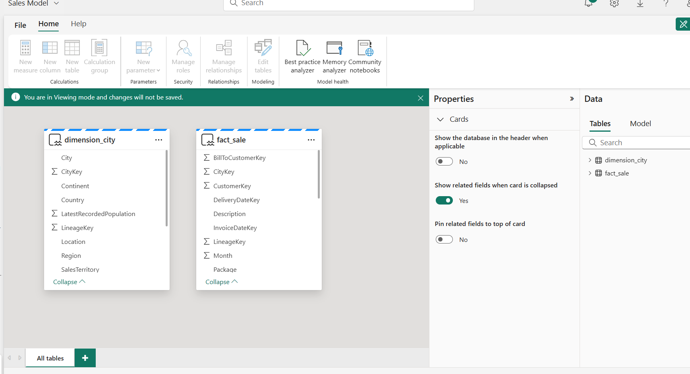

10. **Sales Model** 페이지에서 **Manage Relationships**를 편집하려면,
    모드를 보기에서 **Viewing**을 **Editing**로 바꾸세요

11. 관계를 생성하려면 모델 디자이너의 **Home **리본에서 **Manage
    relationships**를 선택하세요.

> 

12. **New relationship window**에서 다음 단계를 완료하여 관계를
    작성하세요:

&nbsp;

1)  **From table** 드롭다운 목록에서 dimension_city 테이블을 선택.

2)  **To table** 드롭다운 목록에서 fact_sale 테이블을 선택.

3)  **Cardinality** 드롭다운 목록에서 **One to many (1:\*)** 테이블을
    선택.

4)  **Cross-filter direction** 드롭다운 목록에서 **Single**을 선택.

5)  **Assume referential integrity** 상자 확인.

6)  **Save** 선택.

> 
>
> 
>
> 

13. **Manage relationship** 창에서 **Close**를 선택하세요.

> 
>
> 

## 작업 2: Power BI 보고서 생성하기

이 작업에서는 작업에서 생성한 semantic model을 기반으로 Power BI
보고서를 만드는 방법을 알아봅니다.

1.  **File** ribbon에서 **Create new report**를 선택하세요.

> 

2.  보고서 디자이너에서 다음 단계를 완료하여 세로 막대형 차트 시각적
    개체를 생성하세요:

&nbsp;

1)  **Data** 창에서 **fact_sale** 테이블을 확장하고 Profit 필드를 확인.

2)  **Data** 창에서 dimension_city 테이블을 확장하고
    SalesTerritory 필드를 확인.

> 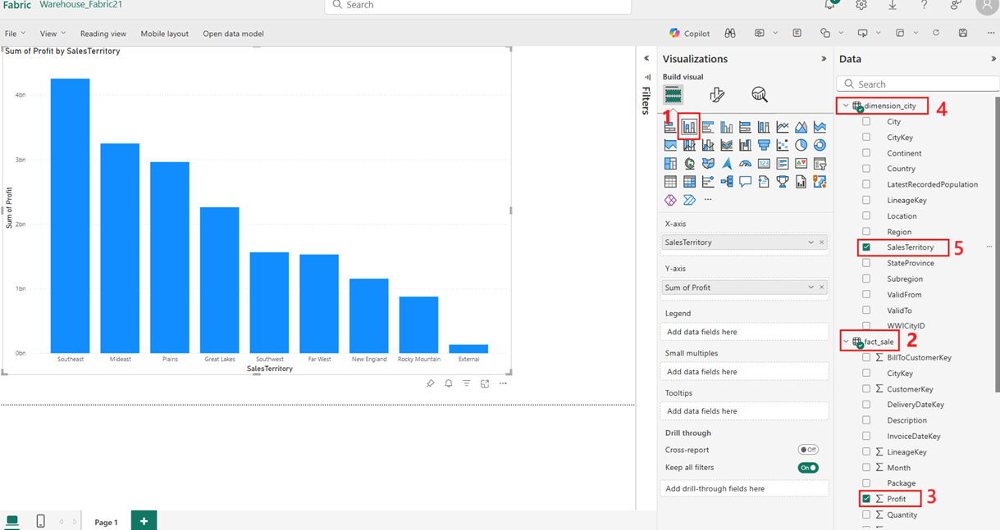

3.  **Visualizations** 창에서 **Azure Map** 시각적을 선택하세요.

> 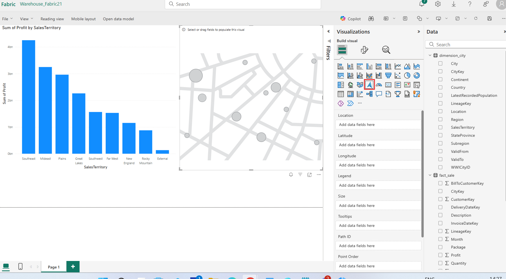

4.  **Data** 창에서 dimension_city 테이블 안에서 StateProvince 필드를
    **Visualizations** 창의 **Location** well로 드래그하세요.

> 

5.  **Data** 창에서 fact_sale 테이블 안에서 Profit 필드를 확인하고 map
    visual **Size** well로 추가하세요.

6.  **Visualizations** 창에서 **Table** 시각적을 선택하세요.

> 

7.  **Data** 창에서 다음 필드를 확인하세요:

&nbsp;

1)  dimension_city 테이블에서 SalesTerritory 

2)  dimension_city 테이블에서StateProvince 

3)  fact_sale 테이블에서Profit 

4)  fact_sale 테이블에서TotalExcludingTax 

> 
>
> 

8.  보고서 페이지의 완성된 디자인이 다음 이미지와 유사한지 확인하세요.

> 

9.  보고서를 저장하려면 **Home **리본 메뉴에서 **File** \> **Save**를
    선택하세요.

> 

10. Save your report 창의, 보고서의 이름 입력 상자에 +++**Sales
    Analysis**+++를 입력하고 **Save**를 선택하세요.

> 
>
> 
>
> 

## 작업 3: 리소스 정리하기

개별 보고서, 파이프라인, 웨어하우스 및 기타 항목을 삭제하거나 전체 작업
영역을 제거할 수 있습니다. 이 튜토리얼에서는 작업 영역, 개별 보고서,
파이프라인, 웨어하우스 및 실습의 일부로 생성한 기타 항목을 정리합니다.

1.  탐색 메뉴에 **Warehouse_FabricXX**를 선택하고 적업 영역 항목
    목록으로 돌어가세요.

> 

2.  Workspace header의 메뉴에서 **Workspace settings**를 선택하세요.

> 

3.  **Workspace settings** 대화 상자에서 **Other**를 선택하고 **Remove
    this workspace**를 선택하세요.

> 

4.  **Delete workspace?** 대화 상자에서 **Delete** 버튼을 클릭하세요.
    

**요약**

이 포괄적인 실습에서는 Microsoft Fabric에서 기능적 데이터 환경을
설정하기 위한 일련의 작업을 안내합니다. 데이터 작업에 필수적인 작업 공간
생성으로 시작하여 평가판이 활성화되도록 합니다. 그 후,
WideWorldImporters라는 웨어하우스가 패브릭 환경 내에 설정되어 데이터
저장 및 처리를 위한 중앙 저장소 역할을 합니다. 그런 다음
Warehouse_FabricXX 작업 영역으로의 데이터 수집은 Data Factory
파이프라인의 구현을 통해 자세히 설명됩니다. 이 프로세스에는 외부
소스에서 데이터를 가져와 작업 공간에 원활하게 통합하는 작업이
포함됩니다. 중요한 테이블, dimension_city 및 fact_sale는 데이터 분석의
기본 구조 역할을 하기 위해 데이터 웨어하우스 내에 생성됩니다. 데이터
로드 프로세스는 Azure Blob Storage의 데이터가 지정된 테이블로 전송되는
T-SQL을 사용하여 계속됩니다. 후속 작업에서는 데이터 관리 및 조작 영역을
탐구합니다. 테이블 복제가 시연되어 데이터 복제 및 테스트 목적에 유용한
기술을 제공합니다. 또한 복제 프로세스는 동일한 웨어하우스 내의 다른
스키마(dbo1)로 확장되어 데이터 구성에 대한 구조화된 접근 방식을
보여줍니다. 랩에서는 데이터 변환으로 진행하여 판매 데이터를 효율적으로
집계하기 위한 저장 프로시저 생성을 소개합니다. 그런 다음 시각적 쿼리
구축으로 전환하여 복잡한 데이터 쿼리에 대한 직관적인 인터페이스를
제공합니다. 그런 다음 노트북을 탐색하여 dimension_customer 테이블의
데이터를 쿼리하고 분석하는 데 유용한 노트북을 보여줍니다. 다중
웨어하우스 쿼리 기능이 공개되어 작업 공간 내의 다양한 웨어하우스에서
원활한 데이터 검색이 가능합니다. 이 랩은 Azure Maps 시각적 개체 통합을
사용하도록 설정하여 Power BI에서 지리적 데이터 표현을 향상시키는 데
중점을 둡니다. 그 후 세로 막대형 차트, 지도, 표를 포함한 다양한 Power BI
보고서가 생성되어 심층적인 판매 데이터 분석을 용이하게 합니다. 마지막
작업은 OneLake 데이터 허브에서 보고서를 생성하는 데 중점을 두고
Fabric에서 데이터 원본의 다양성을 더욱 강조합니다. 마지막으로 이
연구실에서는 자원 관리에 대한 통찰력을 제공하고 효율적인 작업 공간을
유지하기 위한 정리 절차의 중요성을 강조합니다. 종합적으로 이러한 작업은
Microsoft Fabric 내에서 데이터 설정, 관리 및 분석에 대한 포괄적인 이해를
제공합니다.
