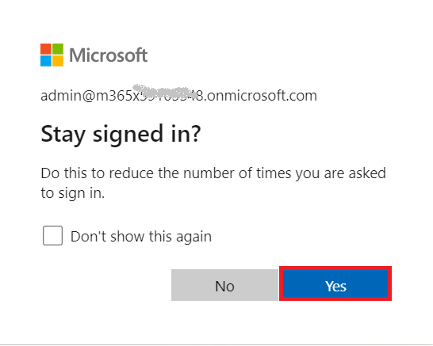
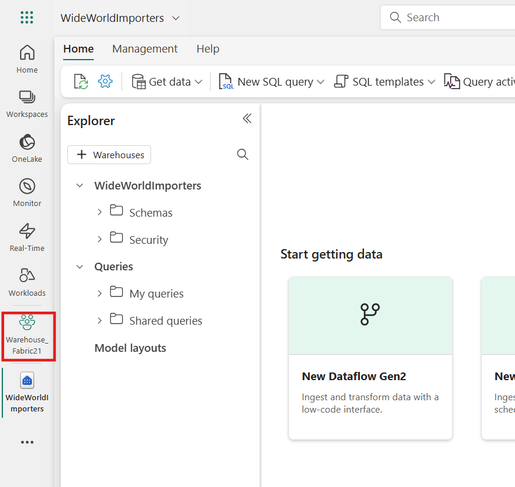
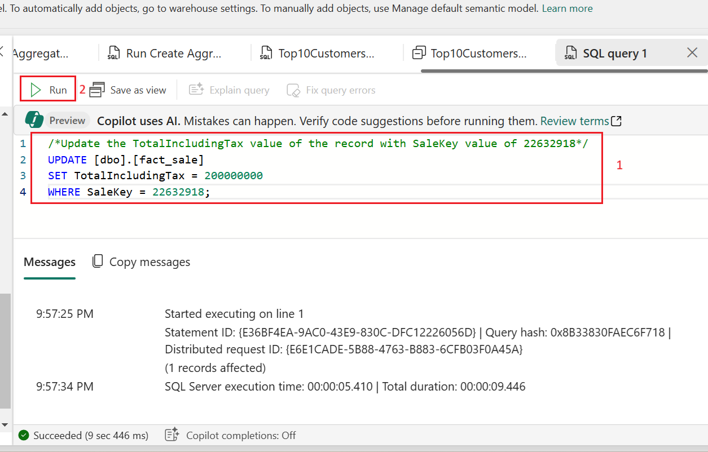
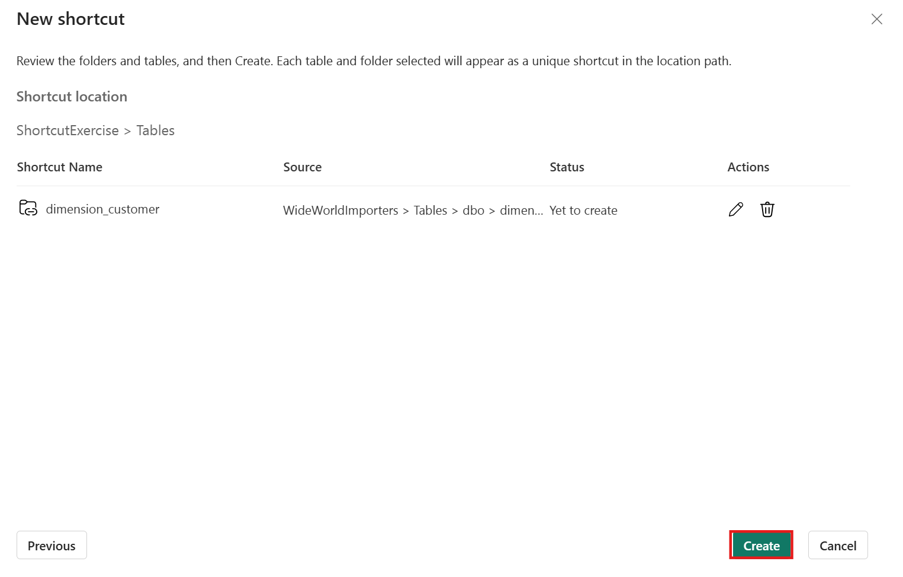

## ユースケース 05 - Microsoft Fabric で Contoso社の売上と地理data warehouseを構築する

**紹介**

多国籍小売企業であるContoso社は、売上と地域分析の効率化を目指し、データインフラストラクチャの近代化を検討しています。現在、売上データと顧客データは複数のシステムに分散しており、ビジネスアナリストやシチズンデベロッパーが分析結果を導き出すことが困難になっています。同社は、Microsoft
Fabricを使用してこれらのデータを統合プラットフォームに統合し、クロスクエリ、売上分析、地域レポートの作成を可能にする予定です。

このラボでは、Contoso 社のデータエンジニアとして、Microsoft Fabric
を使用したdata warehouse
ソリューションの設計と実装を担当します。まず、Fabric
ワークスペースの設定、data warehouseの作成、Azure Blob Storage
からのデータの読み込み、そして Contoso
社の意思決定者にインサイトを提供するための分析タスクの実行から始めます。

Microsoft Fabric
の多くの概念は、データおよび分析の専門家にとって馴染み深いものかもしれませんが、新しい環境でそれらの概念を適用するのは難しい場合があります。このラボは、データの取得から利用までのエンド・ツー・エンドのシナリオを段階的に説明することで、Microsoft
Fabric
のユーザーエクスペリエンス、さまざまなエクスペリエンスとその統合ポイント、そして
Microsoft Fabric
のプロフェッショナルおよびシチズンデベロッパーのエクスペリエンスについて基本的な理解を深めることを目的としています。

**目的**

- 試用版を有効にして Fabric ワークスペースをセットアップします。

- Microsoft Fabric に WideWorldImporters
  という名前の新しいWarehouseを確立します。

- Data Factory パイプラインを使用して、Warehouse_FabricXX
  ワークスペースにデータを読み込みます。

- Data warehouse内に dimension_city テーブルと fact_sale
  テーブルを生成します。

- dimension_city テーブルと fact_sale テーブルに Azure Blob Storage
  のデータを入力します。

- Warehouseに dimension_city テーブルと fact_sale
  テーブルのクローンを作成します。

- dimension_city テーブルと fact_sale テーブルを dbo1
  スキーマに複製します。

- データを変換し、aggregate_sale_by_date_city
  テーブルを作成する、ストアド プロシージャを開発します。

- ビジュアルクエリビルダーを使用してクエリを生成し、データを結合および集計します。

- ノートブックを使用して、dimension_customer
  テーブルのデータをクエリおよび分析します。

- クロスクエリ用に WideWorldImporters と ShortcutExercise
  warehouseを含めます。

- WideWorldImporters と ShortcutExercise warehouse全体で T-SQL
  クエリを実行します。

- Adminポータルで Azure Maps のビジュアル統合を有効にします。　

- 売上分析レポートの縦棒グラフ、マップ、表のビジュアルを生成します。

- OneLakeデータハブの WideWorldImporters
  データセットのデータを使用してレポートを作成します。

- ワークスペースとそれに関連付けられたアイテムを削除します。

# 練習1: **Microsoft Fabric ワークスペースを作成する**

## **タスク 1: Power BI アカウントにサインインして無料でサインアップする[Microsoft Fabric トライアル](https://learn.microsoft.com/en-us/fabric/get-started/fabric-trial)**

1.  ブラウザを開き、アドレスバーに移動して、次の URL
    を入力または貼り付けます:
    +++https://app.fabric.microsoft.com/+++。Enterボタンを押します。

> 

2.  **Microsoft Fabric**
    ウィンドウで、割り当てられた資格情報を入力し、\[**Submit**\]
    ボタンをクリックします。

> 

3.  次に、**Microsoft** ウィンドウでパスワードを入力し、「**Sign
    in**」ボタンをクリックします。

> 

4.  「**Stay signed
    in?**」ウィンドウで、「**Yes**」ボタンをクリックします。

> 

5.  Power BI Homeページに移動します。

> 

## **タスク2: ワークスペースを作成する**

Fabric でデータを操作する前に、Fabric
トライアルが有効になっているワークスペースを作成します。

1.  Workspacesペインで、**+** **New workspace**を選択します。

> 

2.  「**Create a
    workspace**」タブで、次の詳細を入力し、「**Apply**」ボタンをクリックします。

    |  |  |
    |----|---|
    |Name	|+++Warehouse_Fabric@lab.LabInstance.Id+++ (must be a unique Id) |
    |Description	|+++This workspace contains all the artifacts for the data warehouse+++|
    |Advanced	Under License mode| select Fabric capacity|
    |Default storage format	|Small dataset storage format|

> 
>
> 

3.  デプロイが完了するまでお待ちください。完了まで1～2分かかります。新しいワークスペースが開くと、空になっているはずです。

> 

## タスク 3: Microsoft Fabric でWarehouseを作成する

1.  **Fabric**ページで、**+ New
    item** を選択してlakehouseを作成し、**Warehouse**を選択します。　

> 

2.  \[**New warehouse** \]
    ダイアログで、「+++**WideWorldImporters**+++」と入力し、\[**Create**\]
    ボタンをクリックします。

> 

3.  プロビジョニングが完了すると、**WideWorldImporters**
    ウェアハウス ランディング ページが表示されます。

> 

# **演習 2: Microsoft Fabric のWarehouseにデータを取り込む**

## **タスク 1: データをWarehouseに取り込む**

1.  **WideWorldImporters** ウェアハウスランディング
    ページで、左側のナビゲーション メニューの **Warehouse_FabricXX**
    を選択して、ワークスペース アイテム リストに戻ります。

> 

2.  **Warehouse_FabricXX**ページで、「+**New
    item**」を選択します。次に、「**Pipeline**」をクリックすると、「Get
    data」で利用可能なアイテムの完全なリストが表示されます。

> 

3.  \[**New** **pipeline** \] ダイアログ ボックスの \[**Name**\]
    フィールドに「+++**Load Customer Data**+++」と入力し、\[**Create**\]
    ボタンをクリックします。

> 

4.  「**Load Customer Data**」ページで、「**Start building your data
    pipeline** 」セクションに移動し、「**Pipeline
    activity**」をクリックします。

> 

5.  \[**Move &** **transform**\] セクションの \[**Copy data**\]
    に移動して選択します。

> 

6.  デザイン キャンバスから新しく作成された「**Copy
    data** **1**」アクティビティを選択して構成します。

> **注記**: デザイン
> キャンバス内の水平線をドラッグすると、さまざまな機能の全体が表示されます。
>
> 

7.  **General** タブの「**Name**」フィールドに+++**CD Load
    dimension_customer+++を入**力します

> 

8.  「**Source** 」ページで、「**Connection** 」ドロップダウンを選択します。「**Browse
    all**」を選択すると、選択可能なすべてのデータソースが表示されます。

> 

9.  \[**Get data** \] ウィンドウで、「+++**Azure
    Blobs**+++」を検索し、\[**Azure Blob Storage**\]
    ボタンをクリックします。

> 

10. 右側に表示される**Connection
    settings** ペインで、次の設定を構成し、\[**Connect**\]
    ボタンをクリックします。

- **Account
  name**または**URL**に+++**https://fabrictutorialdata.blob.core.windows.net/sampledata/+++**と入力します

- \[**Connection credentials** \] セクションで、\[**Connection**\]
  の下のドロップダウンをクリックし、\[**Create new connection**\]
  を選択します。

- **Connection nam**フィールドに、+++**Wide World Importers Public
  Sample+++**を入力します。

- **Authentication kind** を**Anonymous**と設定します。

> 

11. コピー アクティビティの \[**Source** \]
    ページで残りの設定を次のように変更して、**https://fabrictutorialdata.blob.core.windows.net/sampledata/WideWorldImportersDW/parquet/full/dimension_customer/\*.parquet**
    内の .parquet ファイルにアクセスします。

12. **File path** テキスト ボックスに以下を入力します。

- **Container:** +++**sampledata+++**

- **File path - Directory:** +++**WideWorldImportersDW/tables+++**

- **File path - File name:** +++**dimension_customer.parquet+++**

- **File
  format** のドロップダウンで、Parquetを選択します（**Parquet**が表示されない場合は、検索ボックスに入力して選択します）。　

> 

13. **File path** 設定の右側にある \[**Preview data** \]
    をクリックして、エラーがないことを確認し、\[閉じる\]
    をクリックします。　

> 
>
> 

14. \[**Destination** \] タブで、次の設定を入力します。

    |  |  |
    |---|---|
    |Connection	|WideWorldImporters|
    |Table option	|select the Auto create table radio button.|
    |Table	|•	In the first box enter +++dbo+++<br>•	In the second box enter +++dimension_customer+++|

> **注: WideWorldImporters
> ウェアハウスとして接続を追加するときに、ナビゲーションを使用して
> OneLake カタログからすべてのオプションを参照するように追加します。**
>
> 
>
> 
>
> 

15. リボンから \[**Run**\] を選択します。

> 

16. \[**Save and run?**\] ダイアログ ボックスで、\[**Save and run**\]
    ボタンをクリックします。

> 
>
> 

17. **Output** ページでコピー
    アクティビティの進行状況を監視し、完了するまで待ちます。

> 

# 演習3: Data Warehouseにテーブルを作成する

## **タスク1: Data Warehouseにテーブルを作成する**

1.  「**Load Customer Data**」ページで、左側のナビゲーション バーの
    **Warehouse_FabricXX**
    ワークスペースをクリックし、WideWorldImporters ウェアハウス
    を選択します。

> 

2.  **WideWorldImporters** ページで、\[Home\]
    タブに移動し、ドロップダウンから \[**SQL**\]
    を選択して、\[**New SQL query**\] をクリックします。

> 

3.  クエリエディタで次のコードを貼り付けて「**Run** 」を選択し、クエリを実行します。

    ```
    /*
    1. Drop the dimension_city table if it already exists.
    2. Create the dimension_city table.
    3. Drop the fact_sale table if it already exists.
    4. Create the fact_sale table.
    */
    
    --dimension_city
    DROP TABLE IF EXISTS [dbo].[dimension_city];
    CREATE TABLE [dbo].[dimension_city]
        (
            [CityKey] [int] NULL,
            [WWICityID] [int] NULL,
            [City] [varchar](8000) NULL,
            [StateProvince] [varchar](8000) NULL,
            [Country] [varchar](8000) NULL,
            [Continent] [varchar](8000) NULL,
            [SalesTerritory] [varchar](8000) NULL,
            [Region] [varchar](8000) NULL,
            [Subregion] [varchar](8000) NULL,
            [Location] [varchar](8000) NULL,
            [LatestRecordedPopulation] [bigint] NULL,
            [ValidFrom] [datetime2](6) NULL,
            [ValidTo] [datetime2](6) NULL,
            [LineageKey] [int] NULL
        );
    
    --fact_sale
    
    DROP TABLE IF EXISTS [dbo].[fact_sale];
    
    CREATE TABLE [dbo].[fact_sale]
    
        (
            [SaleKey] [bigint] NULL,
            [CityKey] [int] NULL,
            [CustomerKey] [int] NULL,
            [BillToCustomerKey] [int] NULL,
            [StockItemKey] [int] NULL,
            [InvoiceDateKey] [datetime2](6) NULL,
            [DeliveryDateKey] [datetime2](6) NULL,
            [SalespersonKey] [int] NULL,
            [WWIInvoiceID] [int] NULL,
            [Description] [varchar](8000) NULL,
            [Package] [varchar](8000) NULL,
            [Quantity] [int] NULL,
            [UnitPrice] [decimal](18, 2) NULL,
            [TaxRate] [decimal](18, 3) NULL,
            [TotalExcludingTax] [decimal](29, 2) NULL,
            [TaxAmount] [decimal](38, 6) NULL,
            [Profit] [decimal](18, 2) NULL,
            [TotalIncludingTax] [decimal](38, 6) NULL,
            [TotalDryItems] [int] NULL,
            [TotalChillerItems] [int] NULL,
            [LineageKey] [int] NULL,
            [Month] [int] NULL,
            [Year] [int] NULL,
            [Quarter] [int] NULL
        );
    ```
> 
>
> 

4.  このクエリを保存するには、エディターのすぐ上にある **SQL query
    1**タブを右クリックし、\[**Rename**\] を選択します。

> 

5.  **Rename**ダイアログボックスで、SQL クエリ 1
    の名前を変更するには**Name**フィールドに+++**Create
    Tables+++** を入力します。次に、\[**Rename**\]
    ボタンをクリックします。　

> 
>
> 

6.  リボンの更新アイコン
    ボタンを選択して、テーブルが正常に作成されたことを確認します。

> 

7.  **Explorer**ペインに、**fact_sale** テーブルと **dimension_city**
    テーブルが表示されます。

> 

## **タスク 2: T-SQL を使用してデータをロードする**

Data
warehouseを構築し、テーブルをロードしてレポートを生成する方法がわかったので、次はデータをロードするための他の方法を検討してソリューションを拡張します。

1.  **WideWorldImporters** ページで、\[**Home** \]
    タブに移動し、ドロップダウンから \[**SQL**\]
    を選択して、\[**New SQL query**\] をクリックします。

> 

2.  クエリ エディターに次のコードを貼り付け、\[**Run** \]
    をクリックしてクエリを実行します。

    ```
    --Copy data from the public Azure storage account to the dbo.dimension_city table.
    COPY INTO [dbo].[dimension_city]
    FROM 'https://fabrictutorialdata.blob.core.windows.net/sampledata/WideWorldImportersDW/tables/dimension_city.parquet'
    WITH (FILE_TYPE = 'PARQUET');
    
    --Copy data from the public Azure storage account to the dbo.fact_sale table.
    COPY INTO [dbo].[fact_sale]
    FROM 'https://fabrictutorialdata.blob.core.windows.net/sampledata/WideWorldImportersDW/tables/fact_sale.parquet'
    WITH (FILE_TYPE = 'PARQUET');
    ```
> 

3.  クエリが完了したら、**dimension_city** テーブルと **fact_sale**
    テーブルにそれぞれロードされた行数を示すメッセージを確認します。

> 

4.  Explorerで **fact_sale** テーブルを選択して、データ
    プレビューをロードし、データが正常にロードされたことを確認します。

> 

5.  クエリの名前を変更します。**Explorer**で**SQLクエリ1**を右クリックし、「**Rename**」を選択します。

> 

6.  **Rename**ダイアログボックスの「**Name**」フィールドに+++Load
    Tables+++と入力し、「**Rename**」ボタンをクリックします。

> 
>
> 

7.  \[**Home**\] タブの下のコマンド バーにある \[**Refresh**\]
    アイコンをクリックします。

> 

# 演習 4: Microsoft Fabric で T-SQL を使用して、テーブルを複製する

## **タスク1:** **Warehouse内の同じスキーマ内でテーブルクローンを作成する**

このタスクでは、[テーブルクローン](https://learn.microsoft.com/en-in/fabric/data-warehouse/clone-table)Microsoft
FabricのWarehouseで、[CREATE TABLE AS CLONE
OF](https://learn.microsoft.com/en-us/sql/t-sql/statements/create-table-as-clone-of-transact-sql?view=fabric&preserve-view=true)という
T-SQL構文を使用してテーブルのクローンを作成する手順を説明します。。

1.  Warehouse内の同じスキーマ内にテーブル クローンを作成します。

2.  **WideWorldImporters** ページで、\[**Home** \]
    タブに移動し、ドロップダウンから \[**SQL**\]
    を選択して、\[**New SQL query**\] をクリックします。

> 

3.  クエリ エディターで次のコードを貼り付けて、**dbo.dimension_city**
    テーブルと **dbo.fact_sale** テーブルのクローンを作成します。

    ```
    --Create a clone of the dbo.dimension_city table.
    CREATE TABLE [dbo].[dimension_city1] AS CLONE OF [dbo].[dimension_city];
    
    --Create a clone of the dbo.fact_sale table.
    CREATE TABLE [dbo].[fact_sale1] AS CLONE OF [dbo].[fact_sale];
    ```
> 

4.  「**Run** 」を選択してクエリを実行します。クエリの実行には数秒かかります。
    クエリが完了すると、テーブルクローン **dimension_city1**
    とが作成されます。

> 
>
> 

5.  **Explorer**で **dimension_city1** テーブルを選択して、データ
    プレビューをロードし、データが正常にロードされたことを確認します。

> 

6.  **Explorer**でテーブルを複製するために作成した **SQL
    query**を右クリックし、「**Explorer**

**Rename**」を選択します。

> 

7.  **Rename** ダイアログ ボックスの「**Name**」フィールドに+++**Clone
    Table**+++と入力し、「**Rename**」ボタンをクリックします。

> 
>
> 

8.  \[**Home**\] タブの下のコマンド バーにある \[**Refresh**\]
    アイコンをクリックします。

> 

## **タスク2: 同じWarehouse内のスキーマ間でテーブルクローンを作成する**

1.  WideWorldImporters ページで、**\[Home\]**
    タブに移動し、ドロップダウンから \[**SQL**\]
    を選択して、\[**New SQL query**\] をクリックします。

> 

2.  **WideWorldImporter**ウェアハウス内にdbo1という名前の新しいスキーマを作成します。以下のT-SQLコードをコピーして貼り付け、以下の画像のように**実行します**。

    +++CREATE SCHEMA dbo1+++

> 
>
> 

3.  クエリ
    エディターで、既存のコードを削除し、次のコードを貼り付けて、**dbo1**
    スキーマに **dbo.dimension_city**テーブルと **dbo.fact_sale**
    テーブルのクローンを作成します。

    ```
    --Create a clone of the dbo.dimension_city table in the dbo1 schema.
    CREATE TABLE [dbo1].[dimension_city1] AS CLONE OF [dbo].[dimension_city];
    
    --Create a clone of the dbo.fact_sale table in the dbo1 schema.
    CREATE TABLE [dbo1].[fact_sale1] AS CLONE OF [dbo].[fact_sale];
    ```

4.  「**Run** 」を選択してクエリを実行します。クエリの実行には数秒かかります。

> 
>
> 

5.  クエリが完了すると、クローン **dimension_city1** と **fact_sale1**
    が **dbo1** スキーマに作成されます。

> 

6.  Explorerで **dbo1** スキーマの **dimension_city1**
    テーブルを選択して、データ
    プレビューをロードし、データが正常にロードされたことを確認します。

> 

7.  後で参照のため、クエリを名前を変更します。**Explorer**で**SQLクエリ1**を右クリックし、「**Rename**」を選択します。

> 

8.  **Rename**ダイアログボックスの「**Name**」フィールドに+++Clone Table
    in another schema+++と入力し、「**Rename**」ボタンをクリックします。

> 
>
> 

9.  \[Home\] タブの下のコマンド バーにある \[**Refresh**\]
    アイコンをクリックします。

> 

# **演習5: ストアドプロシージャを使用してデータを変換する**

データを変換するための新しいストアド
プロシージャを作成して保存する方法を学習します。

1.  **WideWorldImporters** ページで、\[**Home**\]
    タブに移動し、ドロップダウンから \[**SQL**\]
    を選択して、\[**New SQL query**\] をクリックします。

> 

2.  クエリエディターに以下のコードを貼り付けて、ストアドプロシージャ**dbo.populate_aggregate_sale_by_city**を作成します。このストアドプロシージャは、後の手順で**dbo.aggregate_sale_by_date_city**テーブルを作成し、読み込みます。

    ```
    --Drop the stored procedure if it already exists.
    DROP PROCEDURE IF EXISTS [dbo].[populate_aggregate_sale_by_city]
    GO
    
    --Create the populate_aggregate_sale_by_city stored procedure.
    CREATE PROCEDURE [dbo].[populate_aggregate_sale_by_city]
    AS
    BEGIN
        --If the aggregate table already exists, drop it. Then create the table.
        DROP TABLE IF EXISTS [dbo].[aggregate_sale_by_date_city];
        CREATE TABLE [dbo].[aggregate_sale_by_date_city]
            (
                [Date] [DATETIME2](6),
                [City] [VARCHAR](8000),
                [StateProvince] [VARCHAR](8000),
                [SalesTerritory] [VARCHAR](8000),
                [SumOfTotalExcludingTax] [DECIMAL](38,2),
                [SumOfTaxAmount] [DECIMAL](38,6),
                [SumOfTotalIncludingTax] [DECIMAL](38,6),
                [SumOfProfit] [DECIMAL](38,2)
            );
    
        --Reload the aggregated dataset to the table.
        INSERT INTO [dbo].[aggregate_sale_by_date_city]
        SELECT
            FS.[InvoiceDateKey] AS [Date], 
            DC.[City], 
            DC.[StateProvince], 
            DC.[SalesTerritory], 
            SUM(FS.[TotalExcludingTax]) AS [SumOfTotalExcludingTax], 
            SUM(FS.[TaxAmount]) AS [SumOfTaxAmount], 
            SUM(FS.[TotalIncludingTax]) AS [SumOfTotalIncludingTax], 
            SUM(FS.[Profit]) AS [SumOfProfit]
        FROM [dbo].[fact_sale] AS FS
        INNER JOIN [dbo].[dimension_city] AS DC
            ON FS.[CityKey] = DC.[CityKey]
        GROUP BY
            FS.[InvoiceDateKey],
            DC.[City], 
            DC.[StateProvince], 
            DC.[SalesTerritory]
        ORDER BY 
            FS.[InvoiceDateKey], 
            DC.[StateProvince], 
            DC.[City];
    END
    ```
> 
>
> 

3.  Explorerでテーブルを複製するために作成した SQL
    クエリを右クリックし、「Rename」を選択します。

> 

4.  **Rename**ダイアログ ボックスの「**Name**」フィールドに+++**Create
    Aggregate Procedure**+++と入力し、\[Rename\]ボタンをクリックします。

> 
>
> 

5.  Homeタブの下にある**Refresh**アイコンをクリックします。

> 

6.  \[**Explorer**\] タブで、**dbo** スキーマの下の \[**Stored
    Procedures** \] ノードを展開して、新しく作成されたストアド
    プロシージャが表示されることを確認します。　

> 

7.  **WideWorldImporters** ページで、\[**Home**\]
    タブに移動し、ドロップダウンから \[**SQL**\]
    を選択して、\[**New SQL query**.\] をクリックします。

> 

8.  クエリエディターに次のコードを貼り付けます。このT-SQLは**dbo.populate_aggregate_sale_by_city**を実行し、**dbo.aggregate_sale_by_date_city**テーブルを作成します。クエリを実行します。　

    ```
    --Execute the stored procedure to create the aggregate table.
    EXEC [dbo].[populate_aggregate_sale_by_city];
    ```
> 
>
> 

9.  このクエリを後で参照できるように保存するには、エディターのすぐ上にあるクエリ
    タブを右クリックし、\[Rename\] を選択します。


10. Renameダイアログ ボックスの「**Name**」フィールドに+++Run Create
    Aggregate
    Procedure+++と入力し、\[**Rename**\]ボタンをクリックします。




11. リボンの \[Refresh\] アイコンを選択します。


12. オブジェクト**Explorer**タブで、エクスプローラー内の「**aggregate_sale_by_city**」テーブルを選択して、データプレビューを読み込み、データが正常にロードされたことを確認します。


# 演習6: ステートメントレベルでT-SQLを使用したタイムトラベル

1.  **WideWorldImporters** ページで、\[**Home**\]
    タブに移動し、ドロップダウンから \[**SQL**\] を選択して、\[**New SQL
    query**\] をクリックします。

> 

2.  クエリエディターに次のコードを貼り付けて、Top10CustomerViewビューを作成します。「**Run**」を選択してクエリを実行します。

    ```
    CREATE VIEW dbo.Top10CustomersView
    AS
    SELECT TOP (10)
        FS.[CustomerKey],
        DC.[Customer],
        SUM(FS.TotalIncludingTax) AS TotalSalesAmount
    FROM
        [dbo].[dimension_customer] AS DC
    INNER JOIN
        [dbo].[fact_sale] AS FS ON DC.[CustomerKey] = FS.[CustomerKey]
    GROUP BY
        FS.[CustomerKey],
        DC.[Customer]
    ORDER BY
        TotalSalesAmount DESC;
    ```


3.  **Explorer**で、dbo スキーマの下の**View** 
    ノードを展開して、新しく作成されたビュー **Top10CustomersView**
    が表示されることを確認します。　


4.  このクエリを後で参照できるように保存するには、エディターのすぐ上にあるクエリタブを右クリックし、\[**Rename**\]
    を選択します。


5.  Renameダイアログ
    ボックスの「**Name**」フィールドに+++Top10CustomersView+++と入力し、\[**Rename**\]ボタンをクリックします。


6.  手順 1 と同様に、別の新しいクエリを作成します。リボンの \[**Home**\]
    タブから、\[**New SQL query**\] を選択します。


7.  クエリエディターに以下のコードを貼り付けます。これにより、SaleKey値が22632918であるレコードの**TotalIncludingTax**列の値が**200000000**に更新されます。「**Run** 」を選択してクエリを実行します。

    ```
    /*Update the TotalIncludingTax value of the record with SaleKey value of 22632918*/
    UPDATE [dbo].[fact_sale]
    SET TotalIncludingTax = 200000000
    WHERE SaleKey = 22632918;
    ```


8.  クエリエディターに次のコードを貼り付けます。CURRENT_TIMESTAMP
    T-SQL関数は、現在のUTCタイムスタンプを**datetime**として返します。「**Run** 」を選択してクエリを実行します。

    ```
    SELECT CURRENT_TIMESTAMP;
    ```


9.  返されたタイムスタンプ値をクリップボードにコピーします。


10. 以下のコードをクエリエディタに貼り付け、タイムスタンプ値を前の手順で取得した現在のタイムスタンプ値に置き換えます。タイムスタンプの構文形式は**YYYY-MM-DDTHH:MM:SS\[.FFF\]**です。

11. 末尾のゼロを削除します。例: 2025-06-09T06:16:08.807。

12. 次の例では、**SaleKey** 22632918
    の新しい値を含む、**TotalIncludingTax** による上位 10
    人の顧客のリストが返されます。既存のコードを置き換えて次のコードを貼り付け、\[Run\]
    を選択してクエリを実行します。

    ```
    /*View of Top10 Customers as of today after record updates*/
    SELECT *
    FROM [WideWorldImporters].[dbo].[Top10CustomersView]
    OPTION (FOR TIMESTAMP AS OF '2025-06-09T06:16:08.807');
    ```


13. 以下のコードをクエリエディターに貼り付け、タイムスタンプ値を更新スクリプト実行前の時刻に置き換えて**TotalIncludingTax**の値を更新します。これにより、**SaleKey**
    22632918の**TotalIncludingTax**が更新される*前*の上位10人の顧客リストが返されます。\[Run\]
    を選択してクエリを実行します。

    ```
    /*View of Top10 Customers as of today before record updates*/
    SELECT *
    FROM [WideWorldImporters].[dbo].[Top10CustomersView]
    OPTION (FOR TIMESTAMP AS OF '2024-04-24T20:49:06.097');
    ```


# 演習 7: ビジュアルクエリビルダーを使用してクエリを作成する

## **タスク 1: ビジュアルクエリビルダーを使用する** 

Microsoft Fabric
ポータルのビジュアルクエリビルダーを使用して、クエリを作成し、保存します。

1.  **WideWolrdImporters** ページで、リボンの \[**Home**\] タブから
    \[**New visual query**\] を選択します。

> 

2.  **fact_sale**を右クリックして、**Insert into canvas**を選択します。

> 
>
> 

3.  クエリデザインペインの変換リボンに移動し、\[**Reduce rows**\]
    ドロップダウンをクリックしてデータセットのサイズを制限し、下の画像に示すように
    \[**Keep top rows** \] をクリックします。

> 

4.  「**Keep top rows** 」ダイアログボックスで、**10000**を入力します。
    \[OK\]を選択します。

> 
>
> 

5.  **dimension_city**を右クリックして、**Insert into
    canvas**を選択します。

> 
>
> 

6.  変換リボンから、「**Combine** 」の横にあるドロップダウンを選択し、下の画像に示すように「**Merge
    queries as new**」を選択します。

> 

7.  **Merge** 設定ページで次の詳細を入力します。

- **Left table for
  merge** ドロップダウンで、**dimension_city**を選択します。

&nbsp;

- **Right table for
  merge** ドロップダウンで、**fact_sale**を選択します。（水平および垂直スクロールバーを使用）

&nbsp;

- ヘッダー行の列名を選択して結合列を指定し、**dimension_city**
  テーブルの **CityKey** フィールドを選択します。

&nbsp;

- ヘッダー行の列名を選択して結合列を指定し、**fact_sale** テーブルの
  **CityKey** フィールドを選択します。

&nbsp;

- **Join
  kind** ダイアグラムの選択で、「**Inner**」を選択し、「OK」ボタンをクリックします。

> 
>
> 

8.  **Merge** ステップを選択した状態で、下の画像に示すように、データ
    グリッドのヘッダーにある **fact_sale**
    の横にある**Expand** ボタンを選択し、**TaxAmount、Profit、TotalIncludingTax**
    の列を選択して、**OK** を選択します。

> 
>
> 

9.  **変換リボン**で、\[**Transform**\]
    の横にあるドロップダウンをクリックし、\[**Group by**\]
    を選択します。

> 

10. **Group by** 設定ページで、次の詳細を入力します。

- \[**Advanced**\]ラジオ ボタンを選択します。　

- **Group by** で以下を選択してください:

  1.  **Country**

  2.  **StateProvince**

  3.  **City**

- 「**New column
  name**」に「**SumOfTaxAmount**」と入力し、「**Operation**」列のフィールドで「**Sum**」を選択します。次に、「**Column**」フィールドで「**TaxAmount**」を選択します。「**Add
  aggregation** 」をクリックすると、さらに集計列と操作を追加できます。

- 「**New column
  name**」に「**SumOfProfit**」と入力し、「**Operation**」列フィールドで「**Sum**」を選択し、「**Column**」フィールドで「Profit」を選択します。集計列と操作をさらに追加するには、「**Add
  aggregation** 」をクリックします。

- 「**New column
  name**」に「**SumOfTotalIncludingTax**」と入力し、「**Operation**」列フィールドで「**Sum**」を選択し、「**Column**」フィールドで「**TotalIncludingTax**」を選択します。

- **OK**ボタンをクリックします。




11. Explorerで「**Queries**」に移動し、「**Queries**」の下の「**Visual
    query 1**」を右クリックします。\[**Rename**\]を選択します。　

> 

12. クエリ名を変更するには、「+++**Sales
    Summary**+++」と入力してください。キーボードの**Enter**キーを押すか、タブ以外の場所を選択して変更を保存します。

> 

13. **Home**タブの下にある**Refresh**アイコンをクリックします。

> 

# **演習8: ノートブックでデータを分析する**

## **タスク 1: lakehouse ショートカットを作成し、ノートブックでデータを分析する**

このタスクでは、データを一度保存​​して、他の多くのサービスで利用する方法について学習します。Azure
Data Lake Storage と S3
に保存されているデータへのショートカットを作成し、外部システムから差分テーブルに直接アクセスすることもできます。

まず、新しいlakehouseを作成します。Microsoft Fabric
ワークスペースに新しいlakehouseを作成するには、以下の手順に従います。

1.  **WideWorldImportes** ページで、左側のナビゲーション メニューの
    **Warehouse_FabricXX** Workspace をクリックします。

> 

2.  **Synapse Data Engineering Warehouse_FabricXX** ホームページの
    **Warehouse_FabricXX**
    ペインで、**+New item**をクリックし、**Stored data　**の下の
    **Lakehouse** を選択します。

> 

3.  **Name** フィールドに+++**ShortcutExercise+++**と入力、\[**Create**\]ボタンをクリックします。

> 

4.  新しいlakehouseが読み込まれ、**Explorer**ビューが開き、「**Get data
    in your lakehouse** 」メニューが表示されます。「**Load data in your
    lakehouse**」の下にある「**New shortcut** 」ボタンを選択します。

> 

5.  **New shortcut** ウィンドウで、**Microsoft OneLake**を選択します。

> 

6.  「**Select a data source
    type** 」ウィンドウで、以前に作成した「**WideWorldImporters** 」という名前の**Warehouse** を慎重に選択し、クリックします。「**Next**」ボタンをクリックします。

> 

7.  **OneLake**オブジェクトブラウザで「**Tables**」を展開し、「**dbo** 」スキーマを展開して、「**dimension_customer**」の横にあるラジオボタンを選択します。「**Next** 」ボタンをクリックします。

> 

8.  **New
    shortcut** ウィンドウで、「**Create**」ボタンをクリックし、「**Close」**ボタンをクリックします。

> 
>
> 

9.  しばらく待ってから、「**Refresh** 」アイコンをクリックします。

10. 次に、**Table** リストから **dimension_customer**
    を選択してデータをプレビューします。lakehouseに、Warehouseの
    **dimension_customer**
    テーブルのデータが表示されていることをご確認ください。　

> 

11. 次に、**dimension_customer**テーブルをクエリするために、新しいノートブックを作成します。「**Home** 」リボンで、「**Open
    notebook**」のドロップダウンを選択し、「**New
    notebook**」を選択します。

> 

12. **Tables** リストから「**dimension_customer**」を選択し、開いているノートブックセルにドラッグします。**ShortcutExercise.dimension_customer**からすべてのデータをクエリするための**PySpark**クエリが自動的に作成されていることがわかります。このノートブックの操作感は、Visual
    Studio
    CodeのJupyterノートブックの操作感と似ています。ノートブックはVS
    Codeで開くこともできます。　　

> 

13. **Home** リボンで「**Run
    all**」ボタンを選択します。クエリが完了すると、PySparkを使って簡単にWarehouseテーブルにクエリを実行できることがわかります。　


# **演習9: SQLクエリエディタを使用してクロスWarehouseクエリを作成する**

## **タスク 1: Explorerに複数のウェアハウスを追加する**

このタスクでは、SQL エンドポイントと Microsoft Fabric
のWarehouseからのデータを結合するなど、複数のWarehouseにわたって SQL
クエリエディターを使用して 、T-SQL
クエリを簡単に作成および実行する方法について学習します。

1.  **Notebook1** ページから、左側のナビゲーション メニューの
    **Warehouse_FabricXX** ワークスペースに移動してクリックします。

> 

2.  **Warehouse_FabricXX** ビューで、**WideWorldImporters**
    ウェアハウスを選択します。

> 

3.  **WideWorldImporters** ページの **Explorer** タブで、**+
    Warehouses** ボタンを選択します。

> 

4.  Add
    warehousesウィンドウで、**ShortcutExercise**をせんたくし、「**Confirm**」ボタンをクリックします。両方のウェアハウスエクスペリエンスがクエリに追加されます。　

> 

5.  選択したウェアハウスに同じ**Explorer**
    ペインが表示されるようになりました。


## タスク2: クロスWarehouseクエリを実行する

この例では、WideWorldImporters ウェアハウスと ShortcutExercise SQL
エンドポイント間で T-SQL
クエリを簡単に実行できることが分かるようになります。SQL Server
と同様に、3 部構成の命名規則を使用して 、database.schema.table
を参照することで、データベース間クエリを作成できます。

1.  リボンの \[**Home**\] タブから、\[**New SQL query**\] を選択します。

> 

2.  クエリエディターに以下のT-SQLコードをコピーして貼り付けます。「**Run** 」ボタンを選択してクエリを実行します。クエリが完了すると、結果が表示されます。

    ```
    SELECT Sales.StockItemKey, 
    Sales.Description, 
    SUM(CAST(Sales.Quantity AS int)) AS SoldQuantity, 
    c.Customer
    FROM [dbo].[fact_sale] AS Sales,
    [ShortcutExercise].[dbo].[dimension_customer] AS c
    WHERE Sales.CustomerKey = c.CustomerKey
    GROUP BY Sales.StockItemKey, Sales.Description, c.Customer;
    ```


3.  参照用にクエリの名前を変更します。Explorerで**SQL query**
    を右クリックし、\[**Rename**\]を選択します。

> 

4.  **Rename**ダイアログ
    ボックスの「**Name**」フィールドに+++**Cross-warehouse
    query**+++と入力し、\[**Rename**\]ボタンをクリックします。

> 

# 練習問題10: Power BI レポートを作成する

## **タスク1: セマンティックモデルを作成する**

このタスクでは、いくつかの種類の Power BI
レポートを作成して保存する方法を学習します。

1.  **WideWorldImportes** ページの \[**Home**\] タブで、\[**New semantic
    model**\] を選択します。

> 

2.  **New semantic model**  ウィンドウの **Direct Lake** **semantic
    model name** ボックスに、「+++**Sales Model**+++」と入力します。

3.  dboスキーマを展開し、「**Tables**」フォルダを展開して、**dimension_city**テーブルと**fact_sale**テーブルを確認します。「**Confirm**」を選択します。

> 
>
> 

9.  左側のナビゲーションから、下の画像に示すように***Warehouse_FabricXXXXX***を選択します。

> 

10. セマンティック モデルを開くには、ワークスペースのランディング
    ページに戻り、「**Sales Model**」セマンティック モデルを選択します。

> 

11. モデル デザイナーを開くには、メニューで \[データ モデルを開く**Open
    data model**\] を選択します。

> 
>
> 

12. **Sales Model**ページで、**Manage
    Relationships**を編集するには、モードを**Viewing**から**Editing**に変更します。

13. リレーションシップを作成するには、モデル デザイナーの \[**Home**\]
    リボンで \[**Manage relationships**\] を選択します。　

> 

14. 「**New
    relationship**」ウィンドウで、次の手順を実行して関係を作成します。

&nbsp;

1)  \[From table\] ドロップダウン リストで、dimension_city
    テーブルを選択します。

2)  \[To table\] ドロップダウン リストで、fact_sale
    テーブルを選択します。

3)  \[**Cardinality** \] ドロップダウン リストで、\[**One to many
    (1:\*)**.\] を選択します。　　

4)  「**Cross-filter direction** 」ドロップダウン
    リストで、\[**Single**\] を選択します。

5)  「**Assume referential integrity** 」ボックスをチェックします。

6)  \[**Save**\]を選択します。

> 
>
> 
>
> 

15. \[**Manage relationship** \] ウィンドウで、\[**Close**\]
    を選択します。

> 
>
> 

## **タスク2: Power BI レポートを作成する**

このタスクでは、先のタスクで作成したセマンティックモデルに基づいてPower
BIレポートを作成する方法を学習します。　

1.  \[**File** \] リボンで、\[**Create new report**\] を選択します。

> 

2.  Report designerで、次の手順を実行して縦棒グラフ
    ビジュアルを作成します。

&nbsp;

1)  **Data** ペインで **fact_sale** テーブルを展開し、**Profit**
    フィールドを確認します。

2)  **Data** ペインで、**dimension_city**
    テーブルを展開し、**SalesTerritory** フィールドを確認します。

> 

3.  \[**Visualizations**\] ペインで、**Azure Map**
    ビジュアルを選択します。

> 

4.  **Data** ペインの dimension_city テーブル内から、StateProvince
    フィールドを**Visualizations** ペインの **Location**
    ウェルにドラッグします。

> 

5.  **Data** ペインで、fact_sale テーブルの中からProfitフィールドを選択し、マップビジュアルの「**Size** 」領域に追加します。

6.  \[**Visualizations** \] ペインで、**Table** ビジュアルを選択します。

> 

7.  **Data** ペインで、次のフィールドをチェックします。

&nbsp;

1)  dimension_cityテーブルのSalesTerritory　

2)  dimension_cityテーブルのStateProvince

3)  fact_saleテーブルからのProfit 

4)  fact_saleテーブルからのTotalExcludingTax　

> 
>
> 

8.  レポートページの完成したデザインが、次の画像のようになっていることを確認します。

> 

9.  レポートを保存するには、\[**Home**\] リボンで
    **File** \> **Save**を選択します。

> 

10. Save your reportウィンドウのEnter a name for your
    reportボックスに+++**Sales
    Analysis**+++と入力し、「**Save**」を選択します。

> 
>
> 
>
> 

## タスク3: リソースをクリーンアップする

個々のレポート、パイプライン、Warehouse、その他のアイテムを削除したり、ワークスペース全体を削除したりできます。このチュートリアルでは、ラボで作成したワークスペース、個々のレポート、パイプライン、Warehouse、その他のアイテムをクリーンアップします。

1.  ナビゲーション ニューで **Warehouse_FabricXX**
    を選択して、ワークスペース アイテム リストに戻ります。

> 

2.  ワークスペース ヘッダーのメニューで、**Workspace
    settings**を選択します。

> 

3.  **Workspace
    settings**ダイアログボックスで、「**General** 」を選択し、「**Remove
    this workspace**」を選択します。

> 

4.  \[**Delete workspace?**\] ダイアログ ボックスで、\[**Delete**\]
    ボタンをクリックします。 

> 

**まとめ　**

この包括的なラボでは、Microsoft
Fabricで機能的なデータ環境を構築するための一連のタスクを順を追って説明します。まず、データ操作に不可欠なワークスペースを作成し、試用版が有効になっていることを確認します。次に、データストレージと処理の中央リポジトリとして機能するWideWorldImportersという名前のWarehouseをFabric環境内に構築します。その後、Data
Factoryパイプラインの実装を通じて、Warehouse_FabricXXワークスペースへのデータ取り込みについて詳しく説明します。このプロセスでは、外部ソースからデータを取得し、ワークスペースにシームレスに統合します。データ分析の基盤となる構造として、dimension_cityテーブルとfact_saleテーブルという重要なテーブルがデータウェアハウス内に作成されます。データ読み込みプロセスはT-SQLを使用して続行され、Azure
Blob
Storageから指定されたテーブルにデータが転送されます。次のタスクでは、データ管理と操作の領域について説明します。テーブルのクローン作成が実演され、データレプリケーションとテストに役立つ貴重なテクニックが紹介されます。さらに、クローン作成プロセスは同じウェアハウス内の別のスキーマ（dbo1）に拡張され、データ編成への構造化されたアプローチが示されます。ラボは、データ変換に進み、売上データを効率的に集計するためのストアドプロシージャの作成を紹介します。次に、視覚的なクエリ構築に移行し、複雑なデータクエリのための直感的なインターフェースを提供します。その後、ノートブックの活用方法を探求し、dimension_customerテーブルからのデータのクエリと分析におけるノートブックの有用性を示します。次に、マルチウェアハウスクエリ機能が紹介され、ワー​​クスペース内のさまざまなウェアハウス間でシームレスなデータ取得が可能になります。ラボは、Power
BIでの地理データ表現を強化するAzure
Mapsビジュアル統合の有効化で最高潮に達します。その後、詳細な売上データ分析を容易にするために、縦棒グラフ、マップ、テーブルなど、さまざまなPower
BIレポートが作成されます。最後のタスクでは、OneLakeデータハブからレポートを生成することに焦点を当て、Fabricにおけるデータソースの多様性をさらに強調します。最後に、ラボではリソース管理に関する洞察を提供し、効率的なワークスペースを維持するためのクリーンアップ手順の重要性を強調します。これらのタスク全体を通して、Microsoft
Fabricにおけるデータのセットアップ、管理、分析に関する包括的な理解が得られます。
