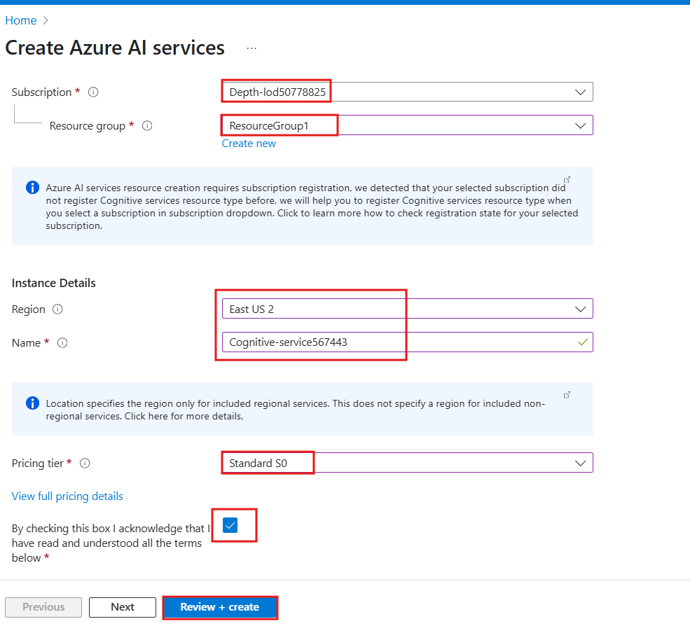

## ユースケース 06 - Microsoft Fabric のドキュメント インテリジェンスによるテキストの識別と抽出

**導入**

構造化データの分析はこれまで容易でしたが、非構造化データの場合はそうではありません。テキスト、画像、動画などの非構造化データは、分析と解釈がより困難です。しかし、OpenAIのGPT-3やGPT-4といった高度なAIモデルの登場により、非構造化データを分析し、そこから洞察を得ることが容易になりつつあります。

このような分析の一例としては、情報検索と言語生成を組み合わせることで実現できる自然言語を使用して文書内の特定の情報を照会する機能があります。

)と独自のデータを使用して応答を生成する強力な質問と回答のパイプラインを作成できます。

このようなアプリケーションのアーキテクチャは次のようになります。


**客観的**

- Azure ポータルを使用して Azure AI サービスのマルチサービス
  リソースを作成する

- ファブリック容量とワークスペース、キー コンテナー、ファブリック
  ワークスペースを作成する

- Azure AI サービスの Azure AI Document Intelligence を使用して PDF
  ドキュメントを前処理します。

- SynapseMLを使用してテキスト チャンクを実行します。

- SynapseMLと Azure OpenAI
  サービスを使用して、チャンクの埋め込みを生成します。

- 埋め込みを Azure AI Search に保存します。

- 質問回答パイプラインを構築します。

# **演習1:環境設定**

## タスク 1: Azure AI サービス用のマルチサービス リソースを作成する

マルチサービスリソースは、ポータルの**「Azure AI services」** \>
**「Azure AI services multi-service
account」**に表示されます。マルチサービスリソースを作成するには、以下の手順に従ってください。

1.  マルチサービス リソースを作成するには、このリンクを選択します。

++++
https://portal.azure.com/#create/Microsoft.CognitiveServicesAllInOne+++

|  |   |
|---|---|
|プロジェクトの詳細|	説明|
|Subscription|	割り当てられたサブスクリプションを選択します。|
|Resource group|	割り当てられたリソースグループを選択します|
|Region	CognitiveServices|の適切なリージョンを選択します。このラボでは、East US2 を選択しました。| 
|Name|	+++Cognitive- serviceXXXXX+++ ( XXXXX はラボのインスタント ID になります)|
|Pricing tier	|Standard S0|


2.  **「Create」ページ**で、次の情報を入力します。

3.  必要に応じてリソースのその他の設定を構成し、条件を読んで同意し
    (該当する場合)、 **\[Review + create\]**を選択します。



4.  **「Review+submit」**タブで検証に合格したら、
    **「Create」**ボタンをクリックします。

> 

5.  デプロイが完了したら、\[**Go to resource\]**ボタンをクリックします。

> 

6.  **Azure** **AI Service**ウィンドウで、**Resource
    Management**セクションに移動し、**Keys and
    Endpoints**をクリックします。

> 

7.  「**Keys and Endpoints**」ページで、**KEY1、KEY
    2**、**Endpoint**の値をコピーし、下の画像のようにメモ帳に貼り付けて、メモ帳を保存し、今後のタスクで情報を使用します。


## **タスク 2: ポータルで Azure AI Search サービスを作成する**

1.  Azure ポータルのホーム ページで、 **+ Create
    Resource**をクリックします。

> 

2.  **\[Create a resource\]**ページの検索バーに**「Azure AI
    Search」**と入力し、表示された**azure ai search**をクリックします。


3.  **Azure AI Search**セクションをクリックします。


4.  **Azure AI Searchページ**で、 **\[Create\]**ボタンをクリックします。

> 

5.  **Create a search service** ページで以下の情報を入力し、
    **「Review+create」**をクリックします**。**
|   |  |
|---|---|
|分野|	説明|
|Subscription|	割り当てられたサブスクリプションを選択する|
|Resource group	|リソースグループ (ラボ 1で作成したもの)を選択します。|
|Region	|EastUS 2|
|Name	|+++ mysearchserviceXXXXX+++ ( XXXXX は Lab のインスタント ID になります)|
|Pricing Tier|	Change Price Tireをクリック>Basicを選択|


6.  検証に合格したら、 **「Create」**ボタンをクリックします。


8.  デプロイが完了したら、\[**Go to resource\]**ボタンをクリックします。


9.  **AI search
    name**をコピーし、下の画像のようにメモ帳に貼り付けて、メモ帳**を保存し、**今後のラボで情報を使用します。


## **タスク5: Fabricワークスペースを作成する**

このタスクでは、Fabric
ワークスペースを作成します。ワークスペースには、レイクハウス、データフロー、Data
Factory パイプライン、ノートブック、Power BI
データセット、レポートなど、このレイクハウスチュートリアルに必要なすべてのアイテムが含まれています。

1.  ブラウザを開き、アドレス バーに移動して、次の URL
    を入力または貼り付けます: https://app.fabric.microsoft.com/
    **Enter**ボタンを押します。

> 

2.  **Microsoft Fabricウィンドウ**で資格情報を入力し、
    **\[Submit\]**ボタンをクリックします。

> 

3.  次に、 **Microsoft**ウィンドウでパスワードを入力し、 **\[Sign
    in\]**ボタンをクリックします**。**

> 

4.  **\[Stay signed in?」**ウィンドウで、
    **「Yes」**ボタンをクリックします。

> 

5.  \[Workspaces\] ペインで**\[+New workspace\]**を選択します。

> 

6.  右側に表示される**「Create a
    workspace」**ペインで、次の詳細を入力し、
    **「Apply」**ボタンをクリックします。
|   |  |
|----|---|
|名前	|++++ Document Intelligence-FabricXXXXX+++ ( XXXXX はラボのインスタント ID になります)|
|Advanced	|Fabric Capacityを選択|
|Capacity	|Realtimefabriccapacity-West US 3を選択します。|


> 
>
> 

10. デプロイメントが完了するまでお待ちください。完了まで2～3分かかります。


## **タスク6:レイクハウスを作成する**

1.  **Fabric** **ホーム**ページで、 **+New item**を選択し、
    **Lakehouse**タイルを選択します。

> 

2.  **\[New lakehouse** **\]**ダイアログ ボックスで、
    **\[Name\]**フィールドに「 +++ **data_lakehouse +++ 」と入力し、
    \[Create\]**ボタンをクリックして新しいレイクハウスを開きます。

> **注: data_lakehouse の**前のスペースを必ず削除してください。
>
> 

3.  **「Successfully created SQL endpoint」**という通知が表示されます。

> 


# **練習2: PDFドキュメントの読み込みと前処理**

## **タスク 1: Azure API キーを構成する**

まず、ワークスペースのrag_workshop Lakehouse
に戻り、「ノートブックを開く」を選択し、オプションから「新しいノートブック」を選択して新しいノートブックを作成します。

1.  **Lakehouse**ページで、コマンド バーの**\[Open
    notebook\]**ドロップに移動してクリックし、 **\[New
    notebook\]**を選択します。


2.  クエリエディターに次のコードを貼り付けます。Azure AI
    Servicesのキーを指定します。 サービスにアクセスするためのAzure Key
    Vault 名とシークレット

```
# Azure AI Search
AI_SEARCH_NAME = ""
AI_SEARCH_INDEX_NAME = "rag-demo-index"
AI_SEARCH_API_KEY = ""

# Azure AI Services
AI_SERVICES_KEY = ""
AI_SERVICES_LOCATION = ""
```

> 

## タスク2: ドキュメントの読み込みと分析

1.  データのソースとなる[**support.pdf**](https://github.com/Azure-Samples/azure-openai-rag-workshop/blob/main/data/support.pdf)という特定のドキュメントを使用します。

2.  ドキュメントをダウンロードするには、セル出力の下にある「
    **+Code」**アイコンを使用してノートブックに新しいコードセルを追加し、そこに以下のコードを入力してください。
    **▷ 「Run cell」**ボタンをクリックして出力を確認してください。

```
import requests
import os

url = "https://github.com/Azure-Samples/azure-openai-rag-workshop/raw/main/data/support.pdf"
response = requests.get(url)

# Specify your path here
path = "/lakehouse/default/Files/"

# Ensure the directory exists
os.makedirs(path, exist_ok=True)

# Write the content to a file in the specified path
filename = url.rsplit("/")[-1]
with open(os.path.join(path, filename), "wb") as f:
    f.write(response.content)
```


3.  spark.read.format (" binaryFile
    ")メソッドを使用してPDFドキュメントをSpark DataFrameに読み込みます。

4.  セル出力の下にある「**+Code**」アイコンを使用してノートブックに新しいコードセルを追加し、次のコードを入力します。
    **▷ 「Run cell」**ボタンをクリックして出力を確認します。

```
from pyspark.sql.functions import udf
from pyspark.sql.types import StringType
document_path = f"Files/{filename}"
df = spark.read.format("binaryFile").load(document_path).select("_metadata.file_name", "content").limit(10).cache()
display(df)
```


このコードはPDFドキュメントを読み取り、
PDFの内容を含むdfという名前のSpark
DataFrameを作成します。このDataFrameは、テキストコンテンツを含むPDFドキュメントの構造を表すスキーマを持ちます。

5.  次に、Azure AI Document Intelligence を使用して PDF
    ドキュメントを読み取り、そこからテキストを抽出します。

6.  セル出力の下にある「**+Code**」アイコンを使用してノートブックに新しいコードセルを追加し、次のコードを入力します。
    **▷ 「Run cell」**ボタンをクリックして出力を確認します。

```
from synapse.ml.services import AnalyzeDocument
from pyspark.sql.functions import col

analyze_document = (
    AnalyzeDocument()
    .setPrebuiltModelId("prebuilt-layout")
    .setSubscriptionKey(AI_SERVICES_KEY)
    .setLocation(AI_SERVICES_LOCATION)
    .setImageBytesCol("content")
    .setOutputCol("result")
)

analyzed_df = (
    analyze_document.transform(df)
    .withColumn("output_content", col("result.analyzeResult.content"))
    .withColumn("paragraphs", col("result.analyzeResult.paragraphs"))
).cache()

```


7.  のSpark DataFrame
    （analyze_df）を確認できます。content列は不要になったため削除することに注意してください。

8.  セル出力の下にある「**+Code**」アイコンを使用してノートブックに新しいコードセルを追加し、次のコードを入力します。
    **▷ 「Run cell」**ボタンをクリックして出力を確認します。

```
analyzed_df = analyzed_df.drop("content")
display(analyzed_df)
```


# 練習3: 埋め込みの生成と保存

## **タスク 1: テキストチャンク**

埋め込みを生成する前に、テキストをチャンクに分割する必要があります。そのためにSynapseMLの
PageSplitter
はドキュメントを小さなセクションに分割し、それらをchunks列に格納します。これにより、ドキュメントのコンテンツをより細かく表現および処理できるようになります。

1.  セル出力の下にある「**+Code**」アイコンを使用してノートブックに新しいコードセルを追加し、次のコードを入力します。
    **▷ 「Run cell」**ボタンをクリックして出力を確認します。

```
from synapse.ml.featurize.text import PageSplitter

ps = (
    PageSplitter()
    .setInputCol("output_content")
    .setMaximumPageLength(4000)
    .setMinimumPageLength(3000)
    .setOutputCol("chunks")
)

splitted_df = ps.transform(analyzed_df)
display(splitted_df)
```


各ドキュメントのチャンクは配列内の1行に表示されていることに注意してください。すべてのチャンクを後続のセルに埋め込むには、各チャンクを別々の行に配置する必要があります。

2.  セル出力の下にある「**+Code**」アイコンを使用してノートブックに新しいコードセルを追加し、次のコードを入力します。
    **▷ 「Run cell」**ボタンをクリックして出力を確認します。

```
from pyspark.sql.functions import posexplode, col, concat

# Each "chunks" column contains the chunks for a single document in an array
# The posexplode function will separate each chunk into its own row
exploded_df = splitted_df.select("file_name", posexplode(col("chunks")).alias("chunk_index", "chunk"))

# Add a unique identifier for each chunk
exploded_df = exploded_df.withColumn("unique_id", concat(exploded_df.file_name, exploded_df.chunk_index))

display(exploded_df)
```


このコードスニペットでは、まずこれらの配列を分解して各行に1つのチャンクだけを残し、次にSpark
DataFrameをフィルタリングします。 ドキュメントへのパスとチャンクのみを 1
行に保持するためです。

## タスク2: 埋め込みの生成

次に、各チャンクの埋め込みを生成します。これには、 SynapseMLとAzure
OpenAIサービスの両方を利用します。Azure
OpenAIサービスとSynapseMLを統合することで、Apache
Spark分散コンピューティングフレームワークのパワーを活用し、OpenAIサービスを用いて多数のプロンプトを処理できるようになります。

1.  セル出力の下にある「**+Code**」アイコンを使用してノートブックに新しいコードセルを追加し、次のコードを入力します。
    **▷ 「Run cell」**ボタンをクリックして出力を確認します。

```
from synapse.ml.services import OpenAIEmbedding

embedding = (
    OpenAIEmbedding()
    .setDeploymentName("text-embedding-ada-002")
    .setTextCol("chunk")
    .setErrorCol("error")
    .setOutputCol("embeddings")
)

df_embeddings = embedding.transform(exploded_df)

display(df_embeddings)
```


この統合により、
SynapseML埋め込みクライアントは分散方式で埋め込みを生成できるようになり、大量のデータを効率的に処理できるようになります。

## タスク3: 埋め込みの保存

[Azure AI
Searchは](https://learn.microsoft.com/azure/search/search-what-is-azure-search?WT.mc_id=data-114676-jndemenge)、全文検索、ベクター検索、ハイブリッド検索を実行できる強力な検索エンジンです。ベクター検索機能の詳細な例については、
[azure-search-vector-samplesリポジトリをご覧ください](https://github.com/Azure/azure-search-vector-samples/)。

Azure AI Search にデータを保存するには、主に次の 2
つの手順を実行します。

**インデックスの作成:**最初のステップは、検索インデックスのスキーマを定義することです。これには、各フィールドのプロパティと、使用されるベクトル検索戦略が含まれます。

**チャンク化されたドキュメントと埋め込みの追加：**
2番目のステップは、チャンク化されたドキュメントとそれに対応する埋め込みをインデックスにアップロードすることです。これにより、ハイブリッド検索とベクトル検索を用いたデータの効率的な保存と取得が可能になります。

1.  以下のコード スニペットは、Azure AI Search REST API を使用して Azure
    AI Search
    にインデックスを作成する方法を示しています。このコードは、各ドキュメントの一意の識別子、ドキュメントのテキスト
    コンテンツ、およびテキスト
    コンテンツのベクトル埋め込み用のフィールドを持つインデックスを作成します。

2.  セル出力の下にある「**+Code**」アイコンを使用してノートブックに新しいコードセルを追加し、次のコードを入力します。
    **▷ 「Run cell」**ボタンをクリックして出力を確認します。

```
import requests
import json

# Length of the embedding vector (OpenAI ada-002 generates embeddings of length 1536)
EMBEDDING_LENGTH = 1536

# Define your AI Search index name and API key
AI_SEARCH_INDEX_NAME = "rag-demo-index"
AI_SEARCH_API_KEY = "your_api_key"

# Create index for AI Search with fields id, content, and contentVector
url = f"https://mysearchservice@lab.LabInstance.Id.search.windows.net/indexes/{AI_SEARCH_INDEX_NAME}?api-version=2024-07-01"
payload = json.dumps(
    {
        "name": AI_SEARCH_INDEX_NAME,
        "fields": [
            {
                "name": "id",
                "type": "Edm.String",
                "key": True,
                "filterable": True,
            },
            {
                "name": "content",
                "type": "Edm.String",
                "searchable": True,
                "retrievable": True,
            },
            {
                "name": "contentVector",
                "type": "Collection(Edm.Single)",
                "searchable": True,
                "retrievable": True,
                "dimensions": EMBEDDING_LENGTH,
                "vectorSearchProfile": "vectorConfig",
            },
        ],
        "vectorSearch": {
            "algorithms": [{"name": "hnswConfig", "kind": "hnsw", "hnswParameters": {"metric": "cosine"}}],
            "profiles": [{"name": "vectorConfig", "algorithm": "hnswConfig"}],
        },
    }
)
headers = {"Content-Type": "application/json", "api-key": AI_SEARCH_API_KEY}

response = requests.put(url, headers=headers, data=payload)
if response.status_code == 201:
    print("Index created!")
elif response.status_code == 204:
    print("Index updated!")
else:
    print(f"HTTP request failed with status code {response.status_code}")
    print(f"HTTP response body: {response.text}")
```


3.  次のステップは、新しく作成したAzure AI
    Searchインデックスにチャンクをアップロードすることです。Azure AI
    Search REST
    APIは、1回のリクエストで最大1000個の「ドキュメント」をサポートします。この場合、各「ドキュメント」は実際には元のファイルのチャンクであることに注意してください。

4.  セル出力の下にある「**+Code**」アイコンを使用してノートブックに新しいコードセルを追加し、次のコードを入力します。
    **▷ 「Run cell」**ボタンをクリックして出力を確認します。

```
import re

from pyspark.sql.functions import monotonically_increasing_id


def insert_into_index(documents):
    """Uploads a list of 'documents' to Azure AI Search index."""

    url = f"https://{AI_SEARCH_NAME}.search.windows.net/indexes/{AI_SEARCH_INDEX_NAME}/docs/index?api-version=2023-11-01"

    payload = json.dumps({"value": documents})
    headers = {
        "Content-Type": "application/json",
        "api-key": AI_SEARCH_API_KEY,
    }

    response = requests.request("POST", url, headers=headers, data=payload)

    if response.status_code == 200 or response.status_code == 201:
        return "Success"
    else:
        return f"Failure: {response.text}"

def make_safe_id(row_id: str):
    """Strips disallowed characters from row id for use as Azure AI search document ID."""
    return re.sub("[^0-9a-zA-Z_-]", "_", row_id)


def upload_rows(rows):
    """Uploads the rows in a Spark dataframe to Azure AI Search.
    Limits uploads to 1000 rows at a time due to Azure AI Search API limits.
    """
    BATCH_SIZE = 1000
    rows = list(rows)
    for i in range(0, len(rows), BATCH_SIZE):
        row_batch = rows[i : i + BATCH_SIZE]
        documents = []
        for row in rows:
            documents.append(
                {
                    "id": make_safe_id(row["unique_id"]),
                    "content": row["chunk"],
                    "contentVector": row["embeddings"].tolist(),
                    "@search.action": "upload",
                },
            )
        status = insert_into_index(documents)
        yield [row_batch[0]["row_index"], row_batch[-1]["row_index"], status]

# Add ID to help track what rows were successfully uploaded
df_embeddings = df_embeddings.withColumn("row_index", monotonically_increasing_id())

# Run upload_batch on partitions of the dataframe
res = df_embeddings.rdd.mapPartitions(upload_rows)
display(res.toDF(["start_index", "end_index", "insertion_status"]))
```


# 演習4：関連文書の検索と質問への回答

文書を処理した後、質問の提示に進みます。[SynapseML](https://microsoft.github.io/SynapseML/docs/Explore%20Algorithms/OpenAI/Quickstart%20-%20OpenAI%20Embedding/)を使用してユーザーの質問を埋め込み情報に変換し、コサイン類似度を利用してユーザーの質問に最も一致する上位K個の文書チャンクを取得します。

## タスク 1:環境と Azure API キーを構成する

Lakehouse に新しいノートブックを作成し、
rag_applicationという名前で保存します。このノートブックを使って RAG
アプリケーションを構築します。

1.  Azure AI Search
    にアクセスするための資格情報を入力してください。Azure Portal
    から値をコピーできます。(演習 1 \> タスク 4)

2.  セル出力の下にある「**+Code**」アイコンを使用してノートブックに新しいコードセルを追加し、次のコードを入力します。
    **▷ 「Run cell」**ボタンをクリックして出力を確認します。

コピー

```
# Azure AI Search
AI_SEARCH_NAME = 'mysearchservice@lab.LabInstance.Id'
AI_SEARCH_INDEX_NAME = 'rag-demo-index'
AI_SEARCH_API_KEY = ''
```


3.  以下の関数は、ユーザーの質問を入力として受け取り、text-embedding-ada-002モデルを用いて埋め込み情報に変換します。このコードは、Microsoft
    Fabricの事前構築済みAIサービスを使用していることを前提としています。

4.  セル出力の下にある「**+Code**」アイコンを使用してノートブックに新しいコードセルを追加し、次のコードを入力します。
    **▷ 「Run cell」**ボタンをクリックして出力を確認します。

```
def gen_question_embedding(user_question):
    """Generates embedding for user_question using SynapseML."""
    from synapse.ml.services import OpenAIEmbedding

    df_ques = spark.createDataFrame([(user_question, 1)], ["questions", "dummy"])
    embedding = (
        OpenAIEmbedding()
        .setDeploymentName('text-embedding-ada-002')
        .setTextCol("questions")
        .setErrorCol("errorQ")
        .setOutputCol("embeddings")
    )
    df_ques_embeddings = embedding.transform(df_ques)
    row = df_ques_embeddings.collect()[0]
    question_embedding = row.embeddings.tolist()
    return question_embedding
```


## タスク2: 関連文書を取得する

1.  次のステップは、ユーザーの質問とその埋め込み情報を用いて、検索インデックスから最も関連性の高い上位K個のドキュメントチャンクを取得することです。以下の関数は、ハイブリッド検索を用いて上位K個のエントリを取得します。

2.  セル出力の下にある「**+Code**」アイコンを使用してノートブックに新しいコードセルを追加し、**次**のコードを入力します。
    **▷ 「Run cell」**ボタンをクリックして出力を確認します。

**Copy**

```
import json 
import requests

def retrieve_top_chunks(k, question, question_embedding):
    """Retrieve the top K entries from Azure AI Search using hybrid search."""
    url = f"https://{AI_SEARCH_NAME}.search.windows.net/indexes/{AI_SEARCH_INDEX_NAME}/docs/search?api-version=2023-11-01"

    payload = json.dumps({
        "search": question,
        "top": k,
        "vectorQueries": [
            {
                "vector": question_embedding,
                "k": k,
                "fields": "contentVector",
                "kind": "vector"
            }
        ]
    })

    headers = {
        "Content-Type": "application/json",
        "api-key": AI_SEARCH_API_KEY,
    }

    response = requests.request("POST", url, headers=headers, data=payload)
    output = json.loads(response.text)
    return output
```


これらの関数を定義すると、ユーザーの質問を受け取り、質問の埋め込みを生成し、上位
K 個のドキュメント
チャンクを取得し、取得したドキュメントのコンテンツを連結してユーザーの質問のコンテキストを形成する関数を定義できます。

3.  セル出力の下にある「**+Code**」アイコンを使用してノートブックに新しいコードセルを追加し、次のコードを入力します。
    **▷ 「Run cell」**ボタンをクリックして出力を確認します。

**Copy**

```
def get_context(user_question, retrieved_k = 5):
    # Generate embeddings for the question
    question_embedding = gen_question_embedding(user_question)

    # Retrieve the top K entries
    output = retrieve_top_chunks(retrieved_k, user_question, question_embedding)

    # concatenate the content of the retrieved documents
    context = [chunk["content"] for chunk in output["value"]]

    return context
```


## **タスク3: ユーザーの質問に答える**

最後に、ユーザーの質問を受け取り、質問のコンテキストを取得し、そのコンテキストと質問の両方を大規模言語モデルに送信して応答を生成する関数を定義します。このデモでは、会話に最適化されたモデルであるgpt-35-turbo-16kを使用します。

1.  セル出力の下にある「**+Code**」アイコンを使用してノートブックに新しいコードセルを追加し、次のコードを入力します。
    **▷ 「Run cell」**ボタンをクリックして出力を確認します。

**Copy**

```
from pyspark.sql import Row
from synapse.ml.services.openai import OpenAIChatCompletion


def make_message(role, content):
    return Row(role=role, content=content, name=role)

def get_response(user_question):
    context = get_context(user_question)

    # Write a prompt with context and user_question as variables 
    prompt = f"""
    context: {context}
    Answer the question based on the context above.
    If the information to answer the question is not present in the given context then reply "I don't know".
    """

    chat_df = spark.createDataFrame(
        [
            (
                [
                    make_message(
                        "system", prompt
                    ),
                    make_message("user", user_question),
                ],
            ),
        ]
    ).toDF("messages")

    chat_completion = (
        OpenAIChatCompletion()
        .setDeploymentName("gpt-35-turbo-16k") # deploymentName could be one of {gpt-35-turbo, gpt-35-turbo-16k}
        .setMessagesCol("messages")
        .setErrorCol("error")
        .setOutputCol("chat_completions")
    )

    result_df = chat_completion.transform(chat_df).select("chat_completions.choices.message.content")

    result = []
    for row in result_df.collect():
        content_string = ' '.join(row['content'])
        result.append(content_string)

    # Join the list into a single string
    result = ' '.join(result)
    
    return result
```


2.  ここで、サンプルの質問でその関数を呼び出して、応答を確認します。

3.  セル出力の下にある「**+Code**」アイコンを使用してノートブックに新しいコードセルを追加し、次のコードを入力します。
    **▷ 「Run cell」**ボタンをクリックして出力を確認します。

**Copy**
```
import requests

# Azure Search configuration
search_service_name = ''
index_name = 'rag-demo-index'
api_key = ''
endpoint = f'https://{search_service_name}.search.windows.net'
api_version = '2023-07-01-Preview'
search_url = f"{endpoint}/indexes/{index_name}/docs/search?api-version={api_version}"

headers = {
    "Content-Type": "application/json",
    "api-key": api_key
}

def get_response(user_question, top_k=1):
    payload = {
        "search": user_question,
        "queryType": "simple",   # Can be "semantic" if enabled in your Azure Search
        "top": top_k
    }
    response = requests.post(search_url, headers=headers, json=payload)
    response.raise_for_status()
    results = response.json().get('value', [])
    if not results:
        return "No answer found in the knowledge base."
    return results[0].get('content', '').strip()

# Example usage
user_question = "how do i make a booking?"
response = get_response(user_question)
print(response)
```


## タスク4: リソースを削除する

クイックスタートで作成したリソースは不要になったら削除してください。リソースを管理するには、
[Azure
Portalを使用できます](https://portal.azure.com/?azure-portal=true)。

1.  ストレージ アカウントを削除するには、 **Azure
    portalのホーム**ページに移動し、 **\[Resource
    groups\]**をクリックします。

> 

2.  割り当てられたリソース グループをクリックします。


3.  **Resource group**のホーム ページで、リソース Azure AI
    サービス、キー値、および検索サービスを選択します。

4.  **Delete**を選択


5.  右側に表示される**「Delete Resources」**ペインで、
    **「+++delete+++」**と入力して削除を確認し、
    \[**Delete**\]ボタンをクリックします。


6.  **Delete confirmationダイアログボックス**で、
    **「Delete」**ボタンをクリックします。

> 

7.  ブラウザを開き、アドレス バーに移動して、次の URL
    を入力または貼り付けます: + ++ https://app.fabric.microsoft.com/+++
    **Enter**ボタンを押します。

> 

8.  ワークスペース名の下の**\[...\]オプション**を選択し、 **\[Workspace
    settings\]**を選択します**。**


9.  **\[General\]**を選択し、 **\[Remove this workspace\]**
    をクリックします。

> 

10. ポップアップ表示される警告で**「Delete」**をクリックします。


11. 次のラボに進む前に、ワークスペースが削除されたことを知らせる通知を待ちます。


