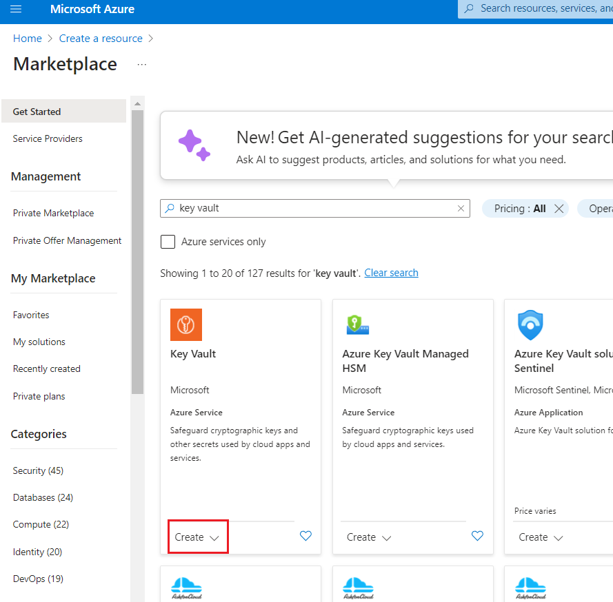
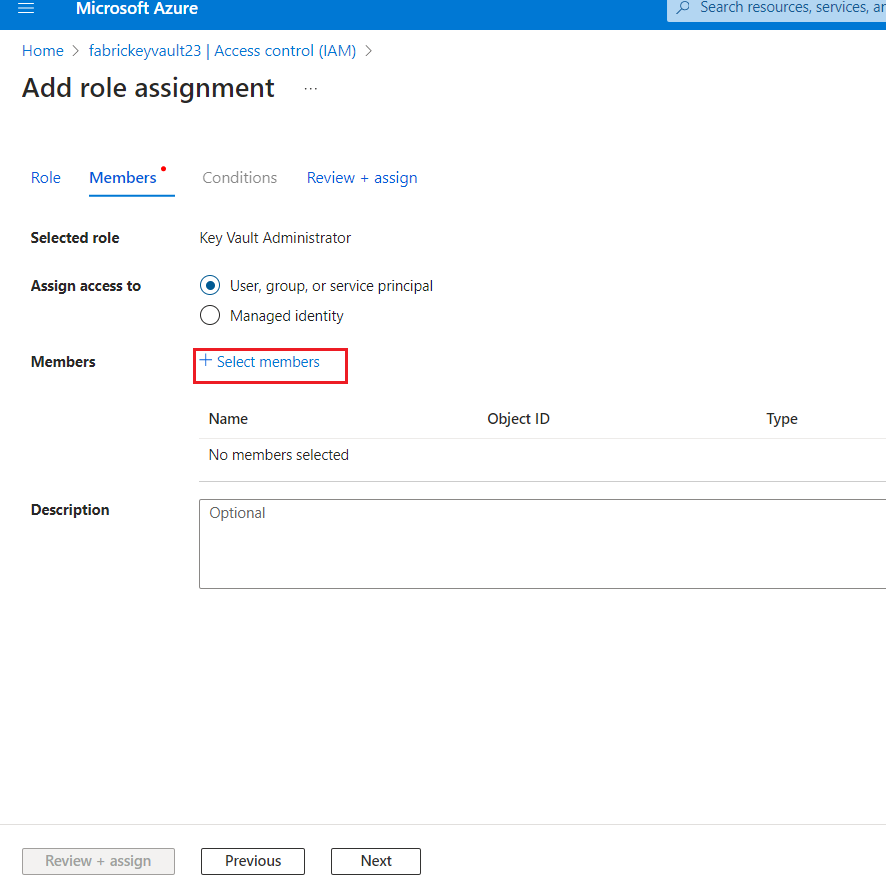
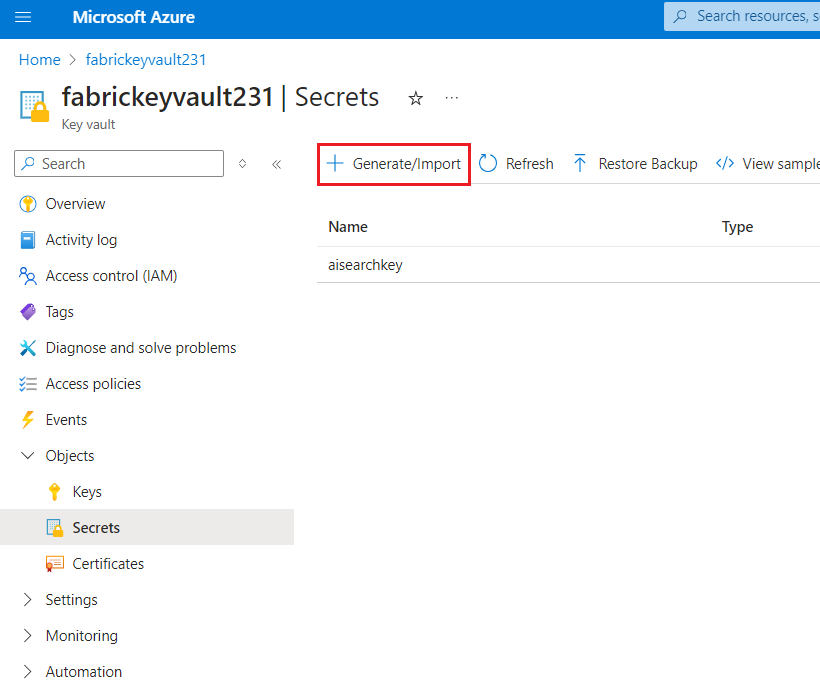
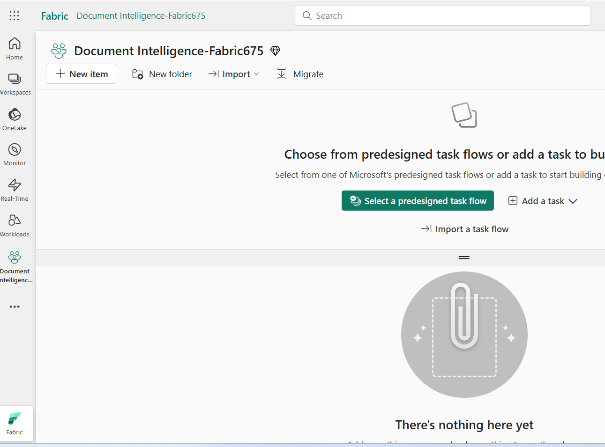
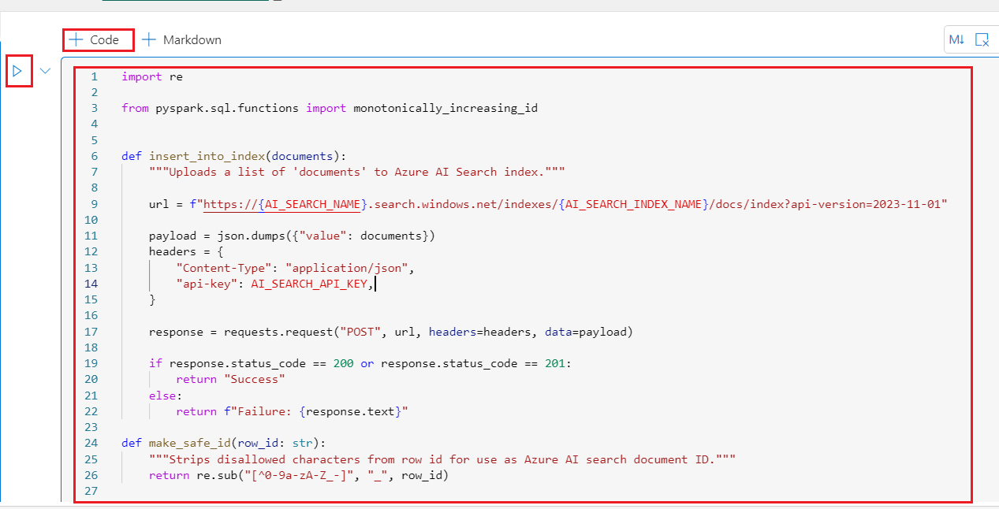

**소개**

구조화 데이터 분석은 한동안 쉬운 과정이었지만, 비구조화 데이터에
대해서는 그렇지 않습니다. 텍스트, 이미지, 동영상과 같은 비정형 데이터는
분석과 해석이 더 어렵습니다. 하지만 OpenAI의 GPT-3, GPT-4와 같은 첨단 AI
모델의 등장으로 비정형 데이터에서 분석하고 인사이트를 얻는 것이 점점 더
쉬워지고 있습니다.

이러한 분석의 예로는 정보 검색과 언어 생성의 조합을 통해 자연어를
사용하여 문서에서 특정 정보를 조회하는 능력이 있습니다.

RAG (Retrieval-Augmented Generation) 프레임워크를 활용하면, large
language model (LLM)과 자신의 데이터를 활용해 응답을 생성하는 강력한
질문-답변 파이프라인을 생성할 수 있습니다.

이러한 애플리케이션의 아키텍처는 아래에 나타난 것입니다:

**목표**

- Azure portal사용하여 Azure AI 서비스에 대한 다중 서비스 리소스를
  생성하기

- Fabric 용량과 작업 공간, Key vault 및 fabric 작업 공간을
  생성하기workspace

- Azure AI 서비스 내 Azure AI Document Intelligence를 사용하여 PDF
  문서를 사전 처리하기

- SynapseML을 사용해 텍스트 청킹을 수행하기

- SynapseML 및 Azure OpenAI Service를 사용해 청크에 대해 임베딩을
  생성하기

- 임베딩을 Azure AI Search에 저장하기

- 질문 답변 파이프라인을 구축하기

# **연습 1: 환경 설정**

## 작업 1: Azure AI 서비스용 다중 서비스 리소스를 생성하기

다중 서비스 리소스는 포털 내 **Azure AI services** \> **Azure AI
services multi-service account** 아래에 나열됩니다. 다중 서비스 리소스를
생성하려면 다음 지침을 따르세요:

1.  다중 서비스 리소스를 생성하려면 이 링크를 선택하세요: 

++++https://portal.azure.com/#create/Microsoft.CognitiveServicesAllInOne+++

[TABLE]

2.  **Create** 페이지에서 다음 정보를 제공하세요:

3.  필요에 따라 리소스의 다른 설정을 설정하고, 해당 조건을 읽고 수락한
    후 ** Review + create**를 선택하세요**.**

4.  **Review+submit** 탭에서 검증되면 **Create** 버튼을 클릭하세요.

> 

5.  배포가 완료되면 **Go to resource** 버튼을 클릭하세요.

> 

6.  **Azure** **AI service** 창에서 **Resource Management** 섹션으로
    이동하고 **Keys and Endpoints**를 클릭하세요.

> 

7.  **Keys and Endpoints** 페이지에서 **KEY1, KEY 2, Endpoint** 값을
    복사하여 아래 이미지처럼 메모장에 붙여넣은 후, 다음 작업에 사용할 수
    있도록 메모장을 **저장**하세요.

## **작업 2: Azure portal을 사용하여 key vault를 생성하기**

1.  Azure portal 홈페이지에서 **+ Create Resource**를 클릭하세요.

> 

2.  **Create a resource** 페이지 검색 바에서 **Key vault**를 입력하고
    나타나는 **Key vault**를 클릭하세요.

> 

3.  **Key Vault** 섹션을 클릭하세요.

> 

4.  **Create a key Vault** 페이지에서 다음 정보를 제공하고
    **Review+create** 버튼을 클릭하세요.

[TABLE]

> 

5.  검증되면 **Create** 버튼을 클릭하세요.

> 

6.  배포가 완료되면 **Go to resource** 버튼을 클릭하세요.

> 

5.  왼쪽 메뉴에서 **fabrickeyvaultXX** 창에서 **Access control(IAM)**를
    클릭하세요.

6.  Access control(IAM) 페이지에서 +**Add**를 클릭하고 **Add role
    assignments**를 선택하세요.

> 

5.  **Job function roles**에서 검색 바에 +++**Key vault
    administrator+++**를 입력하고 선택하세요. **Next**를 클릭하세요.

> 

6.  **Add role assignment** 탭에서 Assign access to User group or
    service principal을 선택하세요. Members에서 **+Select members**를
    클릭하세요.

> 

7.  Select members 탭에서 Azure OpenAI 구독을 검색하고 **Select**를
    클릭하세요.

8.  **Add role assignment** 페이지에서 **Review + Assign**을 클릭하면
    역할 배정이 완료되면 알림을 받게 됩니다.

> 
>
> 

9.  Added as Azure AI Developer for Azure-openai-testXX라는 알림이
    표시됩니다.

## 작업 3: Azure Key vault를 사용하여 비밀을 생성하기

1.  Key Vault 왼쪽 사이드바에서 **Objects**를 선택하고 **Secrets**를
    선택하세요.

> 

2.  **+ Generate/Import**를 선택하세요.

> 

3.  **Create a secret** 페이지에서 다음 정보를 제공하고 **Create**
    버튼을 클릭하세요.

[TABLE]

> 

4.  **+ Generate/Import**를 선택하세요.

> 

5.  **Create a secret** 페이지에서 다음 정보를 제공하고 **Create**
    버튼을 클릭하세요.

[TABLE]

6.  **Key Vault** 페이지에서 **Key Vault** 이름과 **Secrets** 값을
    복사해서 아래 이미지처럼 메모장에 붙여넣은 후, 앞으로 진행될 작업에
    사용할 수 있도록 메모장을 **저장**하세요.

## **작업 4: 포털에 Azure AI Search 서비스를 생성하기**

1.  Azure portal 홈페이지에서 **+ Create Resource**를 클릭하세요.

> 

2.  **Create a resource** 페이지 검색 바에서 **Azure cognitive
    Search**를 입력하고 나타나는 **azure AI search**를 클릭하세요.

3.  **azure ai search** 섹션을 클릭하세요.

4.  **Azure AI Search** 페이지에서 **Create** 버튼을 클릭하세요.

> 

5.  **Create a search service** 페이지에서 다음 정보를 제공하고
    **Review+create** 버튼을 클릭하세요.

[TABLE]

6.  검증되면 **Create** 버튼을 클릭하세요.

8.  배포가 완료되면 **Go to resource** 버튼을 클릭하세요.

9.  아래 이미지처럼 **AI search name**을 복사해 메모장에 붙여넣고,
    다가오는 실습에서 정보를 사용할 수 있도록 메모장을 **저장**하세요.

## **작업 5: Fabric 작업 공간을 생성하기**

이 작업에서는 Fabric 작업 공간을 생성합니다. 작업 공간에는 이 lakehouse
튜토리얼에 필요한 모든 항목이 포함되어 있으며, 여기에는 lakehouse,
데이터 플로우, Data Factory 파이프라인, 노트북, Power BI 데이터세트
보고서 등이 포함됩니다.

1.  브라우저를 열고 주소 바로 이동하고 다음 URL:
    <https://app.fabric.microsoft.com/>을 입력하고 붙여넣고 **Enter**
    버튼을 누르세요.

> 

2.  **Microsoft Fabric** 창에서 자격 증명을 입력하고 **Submit** 버튼을
    클릭하세요.

> 

3.  **Microsoft** 창에서 비밀번호를 입력하고 **Sign in** 버튼을
    클릭하세요.

> 

4.  **Stay signed in?** 창에서 **Yes** 버튼을 클릭하세요.

> 

5.  Workspaces 창에서 **+New workspace**를 선택하세요.

> 

6.  오른쪽에 나타나는 **Create a workspace** 창에서 다음 정보를 입력하고
    **Apply** 버튼을 클릭하세요.

[TABLE]

> 
>
> 

10. 배포가 완료될 때까지 기다리세요. 완료하는 데 2-3분 정도 걸립니다.

## **작업 6: lakehouse를 생성하기**

1.  **Fabric** **Home** 페이지에서 **+New item**을 선택하고
    **Lakehouse** 타일을 선택하세요.

> 

2.  **New lakehouse** 대화 상자에서 **Name** 필드에
    +++**data_lakehouse**+++를 입력하고 **Create** 버튼을 클릭하고 새
    lakehouse를 여세요.

> **참고**: **data_lakehouse** 전에 빈드시 공간을 확보하세요.
>
> 

3.  **Successfully created SQL endpoint**라는 알림이 표시됩니다.

> 

# **연습 2: PDF 문서 로딩 및 전처리하기**

## **작업 1: Azure API 키를 구성하기**

시작하려면 작업 공간에서 rag_workshop Lakehouse로 돌아가 Open Notebook을
선택한 후 새 Notebook을 선택해 새 노트북을 생성하세요.

1.  **Lakehouse** 페이지에서 명령 바의 드롭다운에서 **Open notebook**을
    클릭하고 **New notebook**을 선택하세요.

2.  Query editor에서 아래 코드를 붙여넣으세요. Azure A I 서비스, Azure
    Key Vault 이름, 그리고 서비스에 접근하기 위한 비밀 키를 제공하세요

\# Azure AI Search

AI_SEARCH_NAME = ""

AI_SEARCH_INDEX_NAME = "rag-demo-index"

AI_SEARCH_API_KEY = ""

\# Azure AI Services

AI_SERVICES_KEY = ""

AI_SERVICES_LOCATION = ""

> 

## 작업 2: 문서를 로드 및 분석하기

1.  데이터의 출처가 될
    [**support.pdf**](https://github.com/Azure-Samples/azure-openai-rag-workshop/blob/main/data/support.pdf)라는
    특정 문서를 사용할 예정입니다.

2.  문서를 다운로드하려면 셀 출력 아래 **+ Code **아이콘을 사용해
    노트북에 새 코드 셀을 추가하고, 다음 코드를 입력하세요. **▷ Run
    cell** 버튼을 클릭하고 출력을 검토하세요.

**Copy**

import requests

import os

url =
"https://github.com/Azure-Samples/azure-openai-rag-workshop/raw/main/data/support.pdf"

response = requests.get(url)

\# Specify your path here

path = "/lakehouse/default/Files/"

\# Ensure the directory exists

os.makedirs(path, exist_ok=True)

\# Write the content to a file in the specified path

filename = url.rsplit("/")\[-1\]

with open(os.path.join(path, filename), "wb") as f:

f.write(response.content)

3.  이제 Apache Spark에서 제공하는 spark.read.format("binaryFile")
    메서드를 사용해 PDF 문서를 Spark DataFrame에 불러오세요.

4.  셀 출력 아래 + **Code** 아이콘을 사용해 노트북에 새 코드 셀을
    추가하고 다음 코드를 입력하세요. **▷ Run cell** 버튼을 클릭하고
    출력을 검토하세요

**Copy**

from pyspark.sql.functions import udf

from pyspark.sql.types import StringType

document_path = f"Files/{filename}"

df =
spark.read.format("binaryFile").load(document_path).select("\_metadata.file_name",
"content").limit(10).cache()

display(df)

이 코드는 PDF 문서를 읽고 PDF의 내용을 담은 df 이름의 Spark DataFrame을
생성합니다. DataFrame은 PDF 문서의 구조를 나타내는 스키마를 가지며,
텍스트 내용도 포함됩니다.

5.  다음으로, Azure AI Document Intelligence를 사용해 PDF 문서를 읽고
    텍스트를 추출할 것입니다.

6.  셀 출력 아래 **+ Code** 아이콘을 사용해 노트북에 새 코드 셀을
    추가하고 다음 코드를 입력하세요. **▷ Run cell** 버튼을 클릭하고
    출력을 검토하세요

**Copy**

from synapse.ml.services import AnalyzeDocument

from pyspark.sql.functions import col

analyze_document = (

AnalyzeDocument()

.setPrebuiltModelId("prebuilt-layout")

.setSubscriptionKey(AI_SERVICES_KEY)

.setLocation(AI_SERVICES_LOCATION)

.setImageBytesCol("content")

.setOutputCol("result")

)

analyzed_df = (

analyze_document.transform(df)

.withColumn("output_content", col("result.analyzeResult.content"))

.withColumn("paragraphs", col("result.analyzeResult.paragraphs"))

).cache()

7.  분석된 Spark DataFrame 이름이 analyzed_df 다음과 같은 코드를 사용해
    관찰할 수 있습니다. 콘텐츠 열은 더 이상 필요하지 않으므로
    제외했습니다.

8.  셀 출력 아래 **+ Code** 아이콘을 사용해 노트북에 새 코드 셀을
    추가하고 다음 코드를 입력하세요. **▷ Run cell** 버튼을 클릭하고
    출력을 검토하세요.

**Copy**

analyzed_df = analyzed_df.drop("content")

display(analyzed_df)

# 연습 3: 임베딩 생성 및 저장하기

## **작업 1: 텍스트 청킹**

임베딩을 생성하기 전에 텍스트를 청크로 나눠야 합니다. 이를 위해
SynapseML의 PageSplitter를 활용해 문서를 더 작은 섹션으로 나누고, 이후
청크 열에 저장합니다. 이로 인해 문서 내용을 더 세분화하고 표현할 수
있습니다.

1.  셀 출력 아래 **+ Code** 아이콘을 사용해 노트북에 새 코드 셀을
    추가하고 다음 코드를 입력하세요. **▷ Run cell** 버튼을 클릭하고
    출력을 검토하세요.

**Copy**

from synapse.ml.featurize.text import PageSplitter

ps = (

PageSplitter()

.setInputCol("output_content")

.setMaximumPageLength(4000)

.setMinimumPageLength(3000)

.setOutputCol("chunks")

)

splitted_df = ps.transform(analyzed_df)

display(splitted_df)

각 문서의 청크는 배열 내 단일 행으로 표시되어 있다는 점에 유의하세요.
모든 청크를 다음 셀에 임베드하려면, 각 청크를 별도의 행에 배치해야
합니다.

2.  셀 출력 아래 **+ Code** 아이콘을 사용해 노트북에 새 코드 셀을
    추가하고 다음 코드를 입력하세요. **▷ Run cell** 버튼을 클릭하고
    출력을 검토하세요.

**Copy**

from pyspark.sql.functions import posexplode, col, concat

\# Each "chunks" column contains the chunks for a single document in an
array

\# The posexplode function will separate each chunk into its own row

exploded_df = splitted_df.select("file_name",
posexplode(col("chunks")).alias("chunk_index", "chunk"))

\# Add a unique identifier for each chunk

exploded_df = exploded_df.withColumn("unique_id",
concat(exploded_df.file_name, exploded_df.chunk_index))

display(exploded_df)

이 코드 스니펫에서 먼저 배열을 폭발시켜 각 행에 하나의 청크만 남게 하고,
Spark DataFrame을 필터링하여 문서로 가는 경로와 청크만 한 행에 남게
합니다.

## 작업 2: 임베딩 생성하기

다음으로 각 청크에 대한 임베딩을 생성할 것입니다. 이를 위해 SynapseML과
Azure OpenAI 서비스를 모두 활용합니다. 내장된 Azure OpenAI 서비스와
SynapseML을 통합함으로써, Apache Spark의 분산 컴퓨팅 프레임워크의 힘을
활용해 OpenAI 서비스를 이용해 수많은 프롬프트를 처리할 수 있습니다.

1.  셀 출력 아래 **+ Code** 아이콘을 사용해 노트북에 새 코드 셀을
    추가하고 다음 코드를 입력하세요. **▷ Run cell** 버튼을 클릭하고
    출력을 검토하세요

**Copy**

from synapse.ml.services import OpenAIEmbedding

embedding = (

OpenAIEmbedding()

.setDeploymentName("text-embedding-ada-002")

.setTextCol("chunk")

.setErrorCol("error")

.setOutputCol("embeddings")

)

df_embeddings = embedding.transform(exploded_df)

display(df_embeddings)

이 통합은 SynapseML 임베딩 클라이언트가 분산 방식으로 임베딩을 생성할 수
있게 하여 대량의 데이터를 효율적으로 처리할 수 있게 합니다.

## 작업 3: 임베딩 저장하기

[Azure AI
Search](https://learn.microsoft.com/azure/search/search-what-is-azure-search?WT.mc_id=data-114676-jndemenge)는
전체 텍스트 검색, 벡터 검색, 하이브리드 검색 기능을 포함하는 강력한 검색
엔진입니다. 벡터 검색 기능에 대한 더 많은 예시는
[azure-search-vector-samples
repository](https://github.com/Azure/azure-search-vector-samples/).를
참조하세요.

Azure AI Search에 데이터를 저장하는 데는 두 가지 주요 단계가 있습니다:

**인덱스 생성:** 첫 번째 단계는 각 필드의 속성과 사용할 벡터 탐색 전략을
포함하는 검색 인덱스의 스키마를 정의하는 것입니다.

**청크된 문서 및 임베딩 추가:** 두 번째 단계는 청크된 문서와 해당
임베딩을 인덱스에 업로드하는 것입니다. 이로 인해 하이브리드 및 벡터
탐색을 통해 데이터를 효율적으로 저장하고 검색할 수 있습니다.

1.  다음 코드 스니펫은 Azure AI Search REST API를 사용하여 Azure AI
    Search에서 인덱스를 생성하는 방법을 보여줍니다. 이 코드는 각 문서의
    고유 식별자, 문서의 텍스트 내용, 텍스트 내용의 벡터 임베딩을 위한
    필드를 포함하는 인덱스를 생성합니다.

2.  셀 출력 아래 **+ Code** 아이콘을 사용해 노트북에 새 코드 셀을
    추가하고 다음 코드를 입력하세요. **▷ Run cell** 버튼을 클릭하고
    출력을 검토하세요.

**Copy**

import requests

import json

\# Length of the embedding vector (OpenAI ada-002 generates embeddings
of length 1536)

EMBEDDING_LENGTH = 1536

\# Define your AI Search index name and API key

AI_SEARCH_INDEX_NAME = " rag-demo-index"

AI_SEARCH_API_KEY = "your_api_key"

\# Create index for AI Search with fields id, content, and contentVector

url =
f"https://mysearchservice356.search.windows.net/indexes/{AI_SEARCH_INDEX_NAME}?api-version=2024-07-01"

payload = json.dumps(

{

"name": AI_SEARCH_INDEX_NAME,

"fields": \[

{

"name": "id",

"type": "Edm.String",

"key": True,

"filterable": True,

},

{

"name": "content",

"type": "Edm.String",

"searchable": True,

"retrievable": True,

},

{

"name": "contentVector",

"type": "Collection(Edm.Single)",

"searchable": True,

"retrievable": True,

"dimensions": EMBEDDING_LENGTH,

"vectorSearchProfile": "vectorConfig",

},

\],

"vectorSearch": {

"algorithms": \[{"name": "hnswConfig", "kind": "hnsw", "hnswParameters":
{"metric": "cosine"}}\],

"profiles": \[{"name": "vectorConfig", "algorithm": "hnswConfig"}\],

},

}

)

headers = {"Content-Type": "application/json", "api-key":
AI_SEARCH_API_KEY}

response = requests.put(url, headers=headers, data=payload)

if response.status_code == 201:

print("Index created!")

elif response.status_code == 204:

print("Index updated!")

else:

print(f"HTTP request failed with status code {response.status_code}")

print(f"HTTP response body: {response.text}")

3.  다음 단계는 청크를 새로 생성된 Azure AI 검색 인덱스에 업로드하는
    것입니다. Azure AI Search REST API는 요청당 최대 1000개의 "문서"를
    지원합니다. 이 경우 각 "문서"는 사실 원본 파일의 한 조각임을
    유의하세요

4.  셀 출력 아래 **+ Code** 아이콘을 사용해 노트북에 새 코드 셀을
    추가하고 다음 코드를 입력하세요. **▷ Run cell** 버튼을 클릭하고
    출력을 검토하세요.

**Copy**

import re

from pyspark.sql.functions import monotonically_increasing_id

def insert_into_index(documents):

"""Uploads a list of 'documents' to Azure AI Search index."""

url =
f"https://{AI_SEARCH_NAME}.search.windows.net/indexes/{AI_SEARCH_INDEX_NAME}/docs/index?api-version=2023-11-01"

payload = json.dumps({"value": documents})

headers = {

"Content-Type": "application/json",

"api-key": AI_SEARCH_API_KEY,

}

response = requests.request("POST", url, headers=headers, data=payload)

if response.status_code == 200 or response.status_code == 201:

return "Success"

else:

return f"Failure: {response.text}"

def make_safe_id(row_id: str):

"""Strips disallowed characters from row id for use as Azure AI search
document ID."""

return re.sub("\[^0-9a-zA-Z\_-\]", "\_", row_id)

def upload_rows(rows):

"""Uploads the rows in a Spark dataframe to Azure AI Search.

Limits uploads to 1000 rows at a time due to Azure AI Search API limits.

"""

BATCH_SIZE = 1000

rows = list(rows)

for i in range(0, len(rows), BATCH_SIZE):

row_batch = rows\[i : i + BATCH_SIZE\]

documents = \[\]

for row in rows:

documents.append(

{

"id": make_safe_id(row\["unique_id"\]),

"content": row\["chunk"\],

"contentVector": row\["embeddings"\].tolist(),

"@search.action": "upload",

},

)

status = insert_into_index(documents)

yield \[row_batch\[0\]\["row_index"\], row_batch\[-1\]\["row_index"\],
status\]

\# Add ID to help track what rows were successfully uploaded

df_embeddings = df_embeddings.withColumn("row_index",
monotonically_increasing_id())

\# Run upload_batch on partitions of the dataframe

res = df_embeddings.rdd.mapPartitions(upload_rows)

display(res.toDF(\["start_index", "end_index", "insertion_status"\]))

# 연습 4: 관련 문서 조회 및 질문 답변

문서를 처리한 후에는 질문을 던질 수 있습니다.
[SynapseML](https://microsoft.github.io/SynapseML/docs/Explore%20Algorithms/OpenAI/Quickstart%20-%20OpenAI%20Embedding/)을
사용해 사용자의 질문을 임베딩으로 변환한 후, 코사인 유사성을 활용해
사용자의 질문과 가장 잘 일치하는 상위 K개의 문서 청크를 가져올 것입니다.

## 작업 1: 환경 및 Azure API Key를 구성하기

Lakehouse에 새 노트북을 생성하여 rag_application로 저장하세요. RAG
애플리케이션을 생성하기 위해 이 노트북을 사용할 것입니다.

1.  Azure AI Search에 접근할 수 있는 자격 증명을 제공하세요. Azure
    포털에서 값을 복사할 수 있습니다. (연습 1\> 작업 4)

2.  셀 출력 아래 **+ Code** 아이콘을 사용해 노트북에 새 코드 셀을
    추가하고 다음 코드를 입력하세요. **▷ Run cell** 버튼을 클릭하고
    출력을 검토하세요.

Copy

\# Azure AI Search

AI_SEARCH_NAME = ''

AI_SEARCH_INDEX_NAME = 'rag-demo-index'

AI_SEARCH_API_KEY = ''

3.  다음 함수는 사용자의 질문을 입력값으로 받아
    text-embedding-ada-002모델을 사용하여 임베딩으로 변환합니다. 이
    코드는 Microsoft Fabric의 Pre-built AI Services를 사용하고 있다고
    가정합니다

4.  셀 출력 아래 **+ Code** 아이콘을 사용해 노트북에 새 코드 셀을
    추가하고 다음 코드를 입력하세요. **▷ Run cell** 버튼을 클릭하고
    출력을 검토하세요

**Copy**

def gen_question_embedding(user_question):

"""Generates embedding for user_question using SynapseML."""

from synapse.ml.services import OpenAIEmbedding

df_ques = spark.createDataFrame(\[(user_question, 1)\], \["questions",
"dummy"\])

embedding = (

OpenAIEmbedding()

.setDeploymentName('text-embedding-ada-002')

.setTextCol("questions")

.setErrorCol("errorQ")

.setOutputCol("embeddings")

)

df_ques_embeddings = embedding.transform(df_ques)

row = df_ques_embeddings.collect()\[0\]

question_embedding = row.embeddings.tolist()

return question_embedding

## 작업 2: 관련된 무서 조회하기

1.  다음 단계는 사용자 질문과 그 임베딩을 사용해 검색 인덱스에서 가장
    관련 높은 K개의 문서 청크를 가져오는 것입니다. 다음 함수는
    하이브리드 검색을 사용하여 상위 K개 항목을 검색합니다.

2.  셀 출력 아래 **+ Code** 아이콘을 사용해 노트북에 새 코드 셀을
    추가하고 다음 코드를 입력하세요. **▷ Run cell** 버튼을 클릭하고
    출력을 검토하세요.

**Copy**

import json

import requests

def retrieve_top_chunks(k, question, question_embedding):

"""Retrieve the top K entries from Azure AI Search using hybrid
search."""

url =
f"https://{AI_SEARCH_NAME}.search.windows.net/indexes/{AI_SEARCH_INDEX_NAME}/docs/search?api-version=2023-11-01"

payload = json.dumps({

"search": question,

"top": k,

"vectorQueries": \[

{

"vector": question_embedding,

"k": k,

"fields": "contentVector",

"kind": "vector"

}

\]

})

headers = {

"Content-Type": "application/json",

"api-key": AI_SEARCH_API_KEY,

}

response = requests.request("POST", url, headers=headers, data=payload)

output = json.loads(response.text)

return output

이 함수들이 정의되면, 사용자의 질문을 받아 질문에 대한 임베딩을
생성하고, 상위 K개의 문서 청크를 검색하고, 검색된 문서의 내용을 연결하여
사용자의 질문에 대한 맥락을 만드는 함수를 정의할 수 있습니다.

3.  셀 출력 아래 **+ Code** 아이콘을 사용해 노트북에 새 코드 셀을
    추가하고 다음 코드를 입력하세요. **▷ Run cell** 버튼을 클릭하고
    출력을 검토하세요.

**Copy**

def get_context(user_question, retrieved_k = 5):

\# Generate embeddings for the question

question_embedding = gen_question_embedding(user_question)

\# Retrieve the top K entries

output = retrieve_top_chunks(retrieved_k, user_question,
question_embedding)

\# concatenate the content of the retrieved documents

context = \[chunk\["content"\] for chunk in output\["value"\]\]

return context

## **작업 3: 사용자의 질문을 답변하기**

마지막으로, 사용자의 질문을 받아 질문의 맥락을 가져오고, 맥락과 질문을
모두 대형 언어 모델에 보내 응답을 생성하는 함수를 정의할 수 있습니다.
이번 데모에서는 대화에 최적화된 gpt-35-turbo-16k 모델을 사용할
예정입니다.

1.  셀 출력 아래 **+ Code** 아이콘을 사용해 노트북에 새 코드 셀을
    추가하고 다음 코드를 입력하세요. **▷ Run cell** 버튼을 클릭하고
    출력을 검토하세요.

**Copy**

from pyspark.sql import Row

from synapse.ml.services.openai import OpenAIChatCompletion

def make_message(role, content):

return Row(role=role, content=content, name=role)

def get_response(user_question):

context = get_context(user_question)

\# Write a prompt with context and user_question as variables

prompt = f"""

context: {context}

Answer the question based on the context above.

If the information to answer the question is not present in the given
context then reply "I don't know".

"""

chat_df = spark.createDataFrame(

\[

(

\[

make_message(

"system", prompt

),

make_message("user", user_question),

\],

),

\]

).toDF("messages")

chat_completion = (

OpenAIChatCompletion()

.setDeploymentName("gpt-35-turbo-16k") \# deploymentName could be one of
{gpt-35-turbo, gpt-35-turbo-16k}

.setMessagesCol("messages")

.setErrorCol("error")

.setOutputCol("chat_completions")

)

result_df =
chat_completion.transform(chat_df).select("chat_completions.choices.message.content")

result = \[\]

for row in result_df.collect():

content_string = ' '.join(row\['content'\])

result.append(content_string)

\# Join the list into a single string

result = ' '.join(result)

return result

2.  이제 예제 질문과 함께 그 함수를 호출하여 응답을 볼 수 있습니다:

3.  셀 출력 아래 **+ Code** 아이콘을 사용해 노트북에 새 코드 셀을
    추가하고 다음 코드를 입력하세요. **▷ Run cell** 버튼을 클릭하고
    출력을 검토하세요.

**Copy**

user_question = "how do i make a booking?"

response = get_response(user_question)

print(response)

## 작업 4: 리소스를 정리하기

불필요한 Azure 비용을 피하기 위해, 이 퀵스타트에서 생성한 리소스가 더
이상 필요 없으면 삭제해야 합니다. 리소스를 관리하려면 [Azure
portal](https://portal.azure.com/?azure-portal=true)을 사용할 수
있습니다.

1.  스토리지 계정을 삭제하려면 **Azure portal Home** 페이지로 이동하고
    **Resource groups**을 클릭하세요.

> 

2.  할당된 리소스 그룹을 클릭하세요.

3.  **Resource group** 홈페이지에서 Azure AI services, Key valut 및
    Search 서비스 리소스를 선택하세요. 

4.  **Delete**를 선택하세요

5.  오른쪽에 나타나는 **Delete Resources** 창에서 **Enter +++delete+++
    to confirm deletion** 필드로 이동하고 **Delete** 버튼을 클릭하세요.

6.  **Delete confirmation** 대화 상자에서 **Delete** 버튼을 클릭하세요.

> 

7.  브라우저를 열고 주소바로 이동하고 다음 URL:
    +++https://app.fabric.microsoft.com/+++를 입력하고 붙여넣고
    **Enter** 버튼을 누르세요.

> 

8.  Workspace name 아래의 … 옵션을 선택하고 **Workspace settings**을
    선택하세요.

9.  **General**을 선택하고 **Remove this workspace**를 클릭하세요**.**

> 

10. 경고 팝업에 **Delete**를 클릭하세요.

11. 다음 실습으로 이동하기 전에 Workspace가 삭제되었다는 알림을
    기다리세요.

