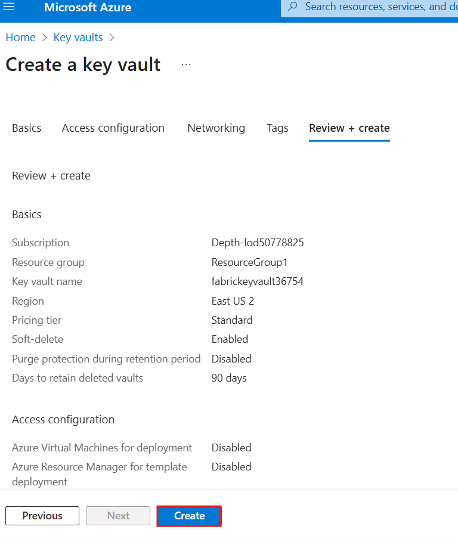
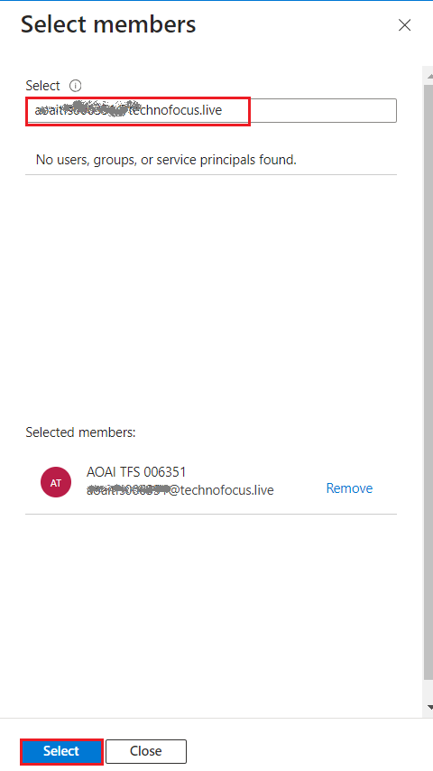
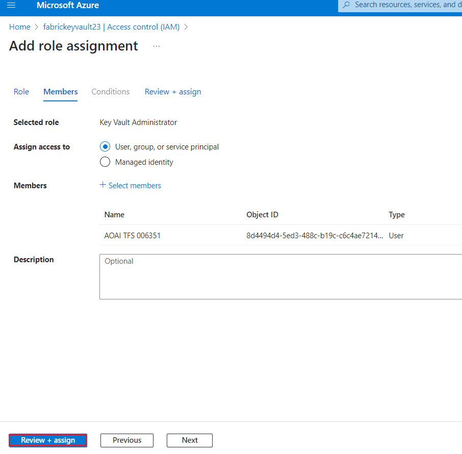

## 사용 사례 06 - Microsoft Fabric에서 문서 인텔리전스를 사용하여 텍스트 식별 및 추출

**소개**

정형 데이터 분석은 한동안 쉬운 프로세스였지만 비정형 데이터의 경우
마찬가지입니다. 텍스트, 이미지, 비디오와 같은 비정형 데이터는 분석 및
해석이 더 어렵습니다. 그러나 OpenAI의 GPT-3 및 GPT-4와 같은 고급 AI
모델의 출현으로 이제 비정형 데이터를 분석하고 통찰력을 얻는 것이 더
쉬워지고 있습니다.

이러한 분석의 예로는 정보 검색과 언어 생성의 조합을 통해 달성할 수 있는
자연어를 사용하여 특정 정보에 대한 문서를 쿼리하는 기능이 있습니다.

RAG(Retrieval-Augmented Generation) 프레임워크를 활용하면 대규모 언어
모델(LLM)을 사용하고 응답을 생성하는 데이터를 소유하는 강력한 질문 및
답변 파이프라인을 만들 수 있습니다.

이러한 응용 프로그램의 아키텍처는 다음과 같습니다.


**목표**

- Azure Portal을 사용하여 Azure AI 서비스에 대한 다중 서비스 리소스
  만들기

- 패브릭 용량 및 작업 영역, 키 자격 증명 모음 및 패브릭 작업 영역을
  만들려면

- Azure AI Services에서 Azure AI Document Intelligence를 사용하여 PDF
  문서를 전처리합니다.

- SynapseML을 사용하여 텍스트 청크를 수행합니다.

- SynapseML 및 Azure OpenAI Services를 사용하여 청크에 대한 포함을
  생성합니다.

- Azure AI Search에 포함을 저장합니다.

- 질문 답변 파이프라인을 구축합니다.

# **연습 1: 환경 설정**

## 작업 1: Azure AI 서비스에 대한 다중 서비스 리소스 생성하기

다중 서비스 리소스는 포털의 **Azure AI services \> Azure AI services
multi-service account ** 아래에 나열됩니다. 다중 서비스 리소스를
생성하려면 다음 지침을 따르세요:

1.  다중 서비스 리소스를 생성하려면 이 링크를 선택하세요: 

++++https://portal.azure.com/#create/Microsoft.CognitiveServicesAllInOne+++

    |Project details | Description |
    |-----|----|
    |Subscription|	@lab.CloudSubscription.Name |
    |Resource group|	@lab.CloudResourceGroup(ResourceGroup1).Name|
    |Region|	Select the appropriate region for your CognitiveServices. In this lab, we have chosen the **East US 2** region.|
    |Name	|+++Cognitive-service@lab.LabInstance.Id+++ (must be a unique Id)|
    |Pricing tier	|Standard S0|

2.  **Create **페이지에서 다음 정보를 제공하세요:

3.  필요에 따라 리소스에 대한 다른 설정을 구성하고, 조건을 읽고
    수락하고(해당되는 경우) **Review + create**를 선택하세요.


4.  **Review+submit** 탭에서 유효성 검사가 통과되면 **Create** 버튼을
    클릭하세요.

> 

5.  배포가 완료되면 **Go to resource** 버튼을 클릭하세요.

> 

6.  **Azure** **AI service** 창에서 **Resource Management** 섹션으로
    이동하고 **Keys and Endpoints**를 클릭하세요.

> 

7.   **Keys and Endpoints** 페이지에서 **KEY1, KEY 2** 및 **Endpoint**
    값을 복사하여 아래 이미지와 같이 메모장에 붙여넣은 후 메모장을
    **Save**하여 향후 작업에서 정보를 사용하세요.


## **작업 2: Azure Portal을 사용하여 키 자격 증명 모음 생성하기**

1.  Azure portal 홈페이지에서 **+ Create Resource**를 클릭하세요.

> 

2.  **Create a resource** 페이지 검색 바에서 **Key vault**을 입력하고
    표시된 **Key vault**를 클릭하세요.

3.  **Key Vault** 섹션을 클릭하세요.

> 

4.  **Create a key Vault** 페이지에서, 다음 정보를 제공하고
    **Review+create** 버튼을 클릭하세요.

    | Field | Description |
    |-----|---|
    |Subscription|	@lab.CloudSubscription.Name |
    |Resource group	| @lab.CloudResourceGroup(ResourceGroup1).Name |
    |Region| East US 2 |
    |Name	|+++fabrickeyvault@lab.LabInstance.Id+++ (must be a unique Id)|
    |Pricing Tier|	Click on change Price Tier > select Standard |

> 

5.  유효성 검사가 통과되면 **Create**버튼을 클릭하세요.

> 

6.  배포가 완료되면 **Go to resource** 버튼을 클릭하세요.

> 

5.  왼쪽 메뉴 **fabrickeyvaultXX** 창에서 **Access control(IAM)**를
    클릭하세요.


6.  Access control(IAM) 페이지에서 +**Add**를 클릭하고 **Add role
    assignments**를 선택하세요.

> 

5.  In **Job function roles**에서 검색 상자에 +++**Key vault
    administrator+++**를 입력하고 선택하세요. **Next**를 클릭하세요

> 

6.  **Add role assignment** 탭에서 Assign access to User group or
    service principal를 선택하세요. Members에서 **+Select members**를
    클릭하세요

> 

7.  Select members 탭에서Azure OpenAI subscription을 검색하고
    **Select**를 클릭하세요.

> 

8.  **Add role assignment** 페이지에서 **Review + Assign**을 클릭하면
    역할 할당이 완료되면 알림을 받게 됩니다.

> 
>
> 

9.  added as Azure AI Developer for Azure-openai-testXX라는 알림이
    표시됩니다

> 

## 작업 3: Azure Key 자격 증명 모음을 사용하여 비밀 생성하기

1.  Key Vault의 왼쪽 사이드바에서 **Objects**을 선택하고 **Secrets**를
    선택하세요.

> 

2.  **+ Generate/Import**를 선택하세요.

> 

3.  **Create a secret** 페이지에서 다음 정보를 제공하고 **Create**
    버튼을 클릭하세요.

    |   |   |
    |---|---|
    |Upload options | Manual|
    |Name|	+++aisearchkey+++|
    |Secret Value|	+++password321+++|

> 

4.  **+ Generate/Import**를 선택하세요.

> 

5.  **Create a secret** 페이지에서 다음 정보를 제공하고 **Create**
    버튼을 클릭하세요.

    |    |   |
    |----|----|
    |Upload options | Manual|
    |Name|	+++aiservicekey+++|
    |Secret Value|	+++password321+++|


6.  In **Key vault** 페이지에서, **Key vault** 이름 및 **Secrets** 값을
    복사하여 아래 이미지와 같이 메모장에 붙여넣은 후 메모장을
    **저장**하여 향후 작업에서 정보를 사용하세요.


## **작업 4: 포털에서 Azure AI Search 서비스 생성하기**

1.  Azure portal 홈페이지에서 **+ Create Resource**를 클릭하세요.

> 

2.  **Create a resource** 페이지 검색 바에서 **Azure AI Search**를
    입력하고 나타나는 **azure ai search**를 클릭하세요.


3.  **azure ai search** 섹션을 클릭하세요.


4.  **Azure AI Search** 페이지에서 **Create** 버튼을 클릭하세요.

> 

5.  **Create a search service** 페이지에서 다음 정보를 제공하고
    **Review+create** 버튼을 클릭하세요.

    |Field	|Description|
    |----|----|
    |Resource group| @lab.CloudSubscription.Name |
    |Region	| East US 2|
    |Name	|+++mysearchservice@lab.LabInstance.Id+++ (must can be a unique Id)|
    |Pricing Tier	|Click on change Price Tire > select Basic|


6.  검색이 완료되면 **Create** 버튼을 클릭하세요.


8.  배포가 완료되면 **Go to resource**버튼을 클릭하세요.


9.  아래 이미지와 같이 **AI search name**을 **복사**하여 메모장에
    붙여넣은 후 메모장을 저장하여 예정된 실습에서 정보를 사용하세요.


## **작업 5: Fabric 작업 영역 생성하기**

이 작업에서는 패브릭 작업 영역을 만듭니다. 작업 영역에는 Lakehouse,
데이터 흐름, Data Factory 파이프라인, Notebook, Power BI 데이터 세트 및
보고서를 포함하여 이 Lakehouse 튜토리얼에 필요한 모든 항목이 포함되어
있습니다.

1.  브라우저를 열고 주소 표시줄로 이동한 다음 URL
    https://app.fabric.microsoft.com/을 입력하거나 붙여넣고 **Enter**
    버튼을 누르세요.

> 

2.  **Microsoft Fabric** 창에서 자격 증명을 입력하고 **Submit** 버튼을
    클릭하세요.

> 

3.  **Microsoft** 창에서 비밀번호를 입력하고 **Sign in**버튼을
    클릭하세요**.**

> 

4.  **Stay signed in?** 창에서 **Yes** 버튼을 클릭하세요.

> 

5.  Workspaces 창에서 **+New workspace**를 선택하세요.

> 

6.  오른쪽에 표시되는 **Create a workspace**창에서 다음 세부 정보를
    입력하고 **Apply** 버튼을 클릭하세요.

    |   |   |
    |----|-----|
    |Name	|+++Document Intelligence-Fabric@lab.LabInstance.Id+++ (must be a unique Id)|
    |Advanced|	Select **Fabric Capacity**|
    |Capacity	|Select the available capacity|

> 
>
> 

10. 배포가 완료될 때까지 기다리세요. 완료하는 데 2-3분이 소요됩니다.


## **작업 6: lakehouse를 생성하기**

1.  **Fabric** **Home** 페이지에서 **+New item**을 선택하고
    **Lakehouse** 타일을 선택하세요.

> 

2.  **New lakehouse** 대화 상자에서 **Name** 필드에
    +++**data_lakehouse**+++를 입력하고 **Create** 버튼을 클릭하고 새
    lakehouse를 여세요.

> **참고**: **data_lakehouse**하기 전에 공간을 제거해야 합니다.
>
> 

3.  **Successfully created SQL endpoint**라는 알림이 표시됩니다.

> 


# **연습 2: PDF 문서 로드 및 전처리 **

## **작업 1: Azure API 키 구성**

시작하려면 작업 영역의 rag_workshop Lakehouse로 돌아가서 Notebook 열기를
선택하고 옵션에서 새 Notebook을 선택하여 새 Notebook을 생성합니다.

1.  **Lakehouse** 페이지에서 명령 바에서 이동하고 **Open notebook**을
    클릭하고 **New notebook**을 선택하세요.


2.  쿼리 편집기에서 다음 코드를 붙여넣으세요. 서비스에 액세스하기 위한
    Azure AI 서비스, Azure Key Vault 이름 및 비밀에 대한 키 제공하세요

    ```
    # Azure AI Search
    AI_SEARCH_NAME = ""
    AI_SEARCH_INDEX_NAME = "rag-demo-index"
    AI_SEARCH_API_KEY = ""
    
    # Azure AI Services
    AI_SERVICES_KEY = ""
    AI_SERVICES_LOCATION = ""
    ```

> 

## 작업 2: 문서 로드 및 분석

1.  우리는 데이터의 소스가 될
    [**support.pdf**](https://github.com/Azure-Samples/azure-openai-rag-workshop/blob/main/data/support.pdf)라는
    특정 문서를 사용할 것입니다.

2.  문서를 다운로드하려면 셀 출력 아래에 있는 + **Code** 아이콘을
    사용하여 Notebook에 새 코드 셀을 추가하고 다음 코드를 입력하세요.
    **▷ Run cell**버튼을 클릭하고 출력을 검토하세요.

    ```
    import requests
    import os
    
    url = "https://github.com/Azure-Samples/azure-openai-rag-workshop/raw/main/data/support.pdf"
    response = requests.get(url)
    
    # Specify your path here
    path = "/lakehouse/default/Files/"
    
    # Ensure the directory exists
    os.makedirs(path, exist_ok=True)
    
    # Write the content to a file in the specified path
    filename = url.rsplit("/")[-1]
    with open(os.path.join(path, filename), "wb") as f:
        f.write(response.content)
    ```


3.  이제 Apache Spark에서 제공하는 spark.read.format("binaryFile")
    메서드를 사용하여 PDF 문서를 Spark DataFrame에 로드하세요

4.  셀 출력 아래에 있는 + **Code** 아이콘을 사용하여 Notebook에 새 코드
    셀을 추가하고 다음 코드를 입력하세요. **▷ Run cell **버튼을 클릭하고
    출력을 검토하세요.

    ```
    from pyspark.sql.functions import udf
    from pyspark.sql.types import StringType
    document_path = f"Files/{filename}"
    df = spark.read.format("binaryFile").load(document_path).select("_metadata.file_name", "content").limit(10).cache()
    display(df)
    ```


이 코드는 PDF 문서를 읽고 PDF 내용으로 df라는 Spark DataFrame을
생성합니다. DataFrame에는 텍스트 콘텐츠를 포함하여 PDF 문서의 구조를
나타내는 스키마가 있습니다.

5.  다음으로, Azure AI 문서 인텔리전스를 사용하여 PDF 문서를 읽고
    텍스트를 추출합니다.

6.  셀 출력 아래에 있는 + **Code** 아이콘을 사용하여 Notebook에 새 코드
    셀을 추가하고 다음 코드를 입력하세요. ▷ **Run cell** 버튼을 클릭하고
    출력을 검토하세요.

    ```
    from synapse.ml.services import AnalyzeDocument
    from pyspark.sql.functions import col
    
    analyze_document = (
        AnalyzeDocument()
        .setPrebuiltModelId("prebuilt-layout")
        .setSubscriptionKey(AI_SERVICES_KEY)
        .setLocation(AI_SERVICES_LOCATION)
        .setImageBytesCol("content")
        .setOutputCol("result")
    )
    
    analyzed_df = (
        analyze_document.transform(df)
        .withColumn("output_content", col("result.analyzeResult.content"))
        .withColumn("paragraphs", col("result.analyzeResult.paragraphs"))
    ).cache()
    ```


7.  다음 코드를 사용하여 analyzed_df라는 분석된 Spark DataFrame을 관찰할
    수 있습니다. 더 이상 필요하지 않으므로 content 열을 삭제합니다.

8.  셀 출력 아래에 있는 **+ Code** 아이콘을 사용하여 Notebook에 새 코드
    셀을 추가하고 다음 코드를 입력하세요. ▷ **Run cell** 버튼을 클릭하고
    출력을 검토하세요.

**Copy**

    ```
    analyzed_df = analyzed_df.drop("content")
    display(analyzed_df)
    ```


# 연습 3: 임베딩 생성 및 저장

## **작업 1: 텍스트 청크**

임베딩을 생성하기 전에 텍스트를 청크로 분할해야 합니다. 이를 위해
SynapseML의 PageSplitter를 활용하여 문서를 더 작은 섹션으로 나누고
이후에 청크 열에 저장합니다. 이를 통해 문서 내용을 더 세부적으로
표현하고 처리할 수 있습니다.

1.  셀 출력 아래에 있는 **+ Code** 아이콘을 사용하여 Notebook에 새 코드
    셀을 추가하고 다음 코드를 입력하세요. **▷ Run cell** 버튼을 클릭하고
    출력을 검토하세요.

    ```
    from synapse.ml.featurize.text import PageSplitter
    
    ps = (
        PageSplitter()
        .setInputCol("output_content")
        .setMaximumPageLength(4000)
        .setMinimumPageLength(3000)
        .setOutputCol("chunks")
    )
    
    splitted_df = ps.transform(analyzed_df)
    display(splitted_df)
    ```


각 문서의 청크는 배열 내부의 단일 행으로 표시됩니다. 다음 셀에 모든
청크를 포함하려면 각 청크를 별도의 행에 포함시켜야 합니다.

2.  셀 출력 아래에 있는 **+ Code** 아이콘을 사용하여 Notebook에 새 코드
    셀을 추가하고 다음 코드를 입력하세요. **▷ Run cell** 버튼을 클릭하고
    출력을 검토하세요.

    ```
    from pyspark.sql.functions import posexplode, col, concat
    
    # Each "chunks" column contains the chunks for a single document in an array
    # The posexplode function will separate each chunk into its own row
    exploded_df = splitted_df.select("file_name", posexplode(col("chunks")).alias("chunk_index", "chunk"))
    
    # Add a unique identifier for each chunk
    exploded_df = exploded_df.withColumn("unique_id", concat(exploded_df.file_name, exploded_df.chunk_index))
    
    display(exploded_df)
    ```


이 코드 조각에서 먼저 각 행에 하나의 청크만 있도록 이러한 배열을 분해한
다음 문서 경로와 청크만 단일 행에 유지하도록 Spark DataFrame을
필터링합니다.

## 작업 2: 임베딩 생성

다음으로 각 청크에 대한 임베딩을 생성합니다. 이를 위해 SynapseML과 Azure
OpenAI Service를 모두 활용합니다. 기본 제공 Azure OpenAI 서비스를
SynapseML과 통합하면 Apache Spark 분산 컴퓨팅 프레임워크의 기능을
활용하여 OpenAI 서비스를 사용하여 수많은 프롬프트를 처리할 수 있습니다.

1.  셀 출력 아래에 있는 **+ Code** 아이콘을 사용하여 Notebook에 새 코드
    셀을 추가하고 다음 코드를 입력하세요. **▷ Run cell** 버튼을 클릭하고
    출력을 검토하세요.

    ```
    from synapse.ml.services import OpenAIEmbedding
    
    embedding = (
        OpenAIEmbedding()
        .setDeploymentName("text-embedding-ada-002")
        .setTextCol("chunk")
        .setErrorCol("error")
        .setOutputCol("embeddings")
    )
    
    df_embeddings = embedding.transform(exploded_df)
    
    display(df_embeddings)
    ```


이 통합을 통해 SynapseML 포함 클라이언트는 분산 방식으로 포함을 생성할
수 있으므로 대량의 데이터를 효율적으로 처리할 수 있습니다

## 작업 3: 임베딩 저장 

[Azure AI
Search](https://learn.microsoft.com/azure/search/search-what-is-azure-search?WT.mc_id=data-114676-jndemenge) 는
전체 텍스트 검색, 벡터 검색 및 하이브리드 검색을 수행하는 기능을
포함하는 강력한 검색 엔진입니다. 벡터 검색 기능에 대한 자세한
예제는 [azure-search-vector-samples
repository](https://github.com/Azure/azure-search-vector-samples/)리포지토리를
참조하세요.

Azure AI Search에 데이터를 저장하려면 두 가지 주요 단계가 포함됩니다:

**인덱스 생성하기:** 첫 번째 단계는 각 필드의 속성과 사용될 벡터 검색
전략을 포함하는 검색 인덱스의 스키마를 정의하는 것입니다.

**청크 문서 및 임베딩 추가:** 두 번째 단계는 청크 문서를 해당 임베딩과
함께 인덱스에 업로드하는 것입니다. 이를 통해 하이브리드 (hybrid) 및 벡터
검색 (vector search) 을 사용하여 데이터를 효율적으로 저장하고 검색할 수
있습니다.

1.  다음 코드 조각은 Azure AI Search REST API를 사용하여 Azure AI
    Search에서 인덱스를 만드는 방법을 보여 줍니다. 이 코드는 각 문서의
    고유 식별자, 문서의 텍스트 콘텐츠 및 텍스트 콘텐츠의 벡터 임베딩에
    대한 필드가 있는 인덱스를 생성합니다.

2.  셀 출력 아래에 있는 **+ Code** 아이콘을 사용하여 Notebook에 새 코드
    셀을 추가하고 다음 코드를 입력하세요. **▷ Run cell** 버튼을 클릭하고
    출력을 검토하세요.

**Copy**

    ```
    import requests
    import json
    
    # Length of the embedding vector (OpenAI ada-002 generates embeddings of length 1536)
    EMBEDDING_LENGTH = 1536
    
    # Define your AI Search index name and API key
    AI_SEARCH_INDEX_NAME = "rag-demo-index"
    AI_SEARCH_API_KEY = "your_api_key"
    
    # Create index for AI Search with fields id, content, and contentVector
    url = f"https://mysearchservice@lab.LabInstance.Id.search.windows.net/indexes/{AI_SEARCH_INDEX_NAME}?api-version=2024-07-01"
    payload = json.dumps(
        {
            "name": AI_SEARCH_INDEX_NAME,
            "fields": [
                {
                    "name": "id",
                    "type": "Edm.String",
                    "key": True,
                    "filterable": True,
                },
                {
                    "name": "content",
                    "type": "Edm.String",
                    "searchable": True,
                    "retrievable": True,
                },
                {
                    "name": "contentVector",
                    "type": "Collection(Edm.Single)",
                    "searchable": True,
                    "retrievable": True,
                    "dimensions": EMBEDDING_LENGTH,
                    "vectorSearchProfile": "vectorConfig",
                },
            ],
            "vectorSearch": {
                "algorithms": [{"name": "hnswConfig", "kind": "hnsw", "hnswParameters": {"metric": "cosine"}}],
                "profiles": [{"name": "vectorConfig", "algorithm": "hnswConfig"}],
            },
        }
    )
    headers = {"Content-Type": "application/json", "api-key": AI_SEARCH_API_KEY}
    
    response = requests.put(url, headers=headers, data=payload)
    if response.status_code == 201:
        print("Index created!")
    elif response.status_code == 204:
        print("Index updated!")
    else:
        print(f"HTTP request failed with status code {response.status_code}")
        print(f"HTTP response body: {response.text}")
    ```


3.  다음 단계는 새로 생성한 Azure AI Search 인덱스에 청크를 업로드하는
    것입니다. Azure AI Search REST API는 요청당 최대 1,000개의 "문서"를
    지원합니다. 이 경우 각 "문서"는 실제로 원본 파일의 덩어리입니다

4.  셀 출력 아래에 있는 **+ Code** 아이콘을 사용하여 Notebook에 새 코드
    셀을 추가하고 다음 코드를 입력하세요. **▷ Run cell** 버튼을 클릭하고
    출력을 검토하세요.

**Copy**

    ```
    import re
    
    from pyspark.sql.functions import monotonically_increasing_id
    
    
    def insert_into_index(documents):
        """Uploads a list of 'documents' to Azure AI Search index."""
    
        url = f"https://{AI_SEARCH_NAME}.search.windows.net/indexes/{AI_SEARCH_INDEX_NAME}/docs/index?api-version=2023-11-01"
    
        payload = json.dumps({"value": documents})
        headers = {
            "Content-Type": "application/json",
            "api-key": AI_SEARCH_API_KEY,
        }
    
        response = requests.request("POST", url, headers=headers, data=payload)
    
        if response.status_code == 200 or response.status_code == 201:
            return "Success"
        else:
            return f"Failure: {response.text}"
    
    def make_safe_id(row_id: str):
        """Strips disallowed characters from row id for use as Azure AI search document ID."""
        return re.sub("[^0-9a-zA-Z_-]", "_", row_id)
    
    
    def upload_rows(rows):
        """Uploads the rows in a Spark dataframe to Azure AI Search.
        Limits uploads to 1000 rows at a time due to Azure AI Search API limits.
        """
        BATCH_SIZE = 1000
        rows = list(rows)
        for i in range(0, len(rows), BATCH_SIZE):
            row_batch = rows[i : i + BATCH_SIZE]
            documents = []
            for row in rows:
                documents.append(
                    {
                        "id": make_safe_id(row["unique_id"]),
                        "content": row["chunk"],
                        "contentVector": row["embeddings"].tolist(),
                        "@search.action": "upload",
                    },
                )
            status = insert_into_index(documents)
            yield [row_batch[0]["row_index"], row_batch[-1]["row_index"], status]
    
    # Add ID to help track what rows were successfully uploaded
    df_embeddings = df_embeddings.withColumn("row_index", monotonically_increasing_id())
    
    # Run upload_batch on partitions of the dataframe
    res = df_embeddings.rdd.mapPartitions(upload_rows)
    display(res.toDF(["start_index", "end_index", "insertion_status"]))
    ```


# 연습 4: 관련 문서 검색 및 질문에 답변

문서를 처리한 후 질문을 진행할 수 있습니다. SynapseML을 사용하여
사용자의 질문을 포함으로 변환한 후 코사인 유사성을 활용하여 사용자의
질문과 거의 일치하는 상위 K 문서 청크를 검색합니다.

## 작업 1: 환경 및 Azure API 키 구성

Lakehouse에서 새 Notebook을 생성하고 rag_application로 저장합니다. 이
Notebook을 사용하여 RAG 애플리케이션을 빌드합니다.

1.  Azure AI Search에 액세스하기 위한 자격 증명을 제공하세요. Azure
    Portal에서 값을 복사할 수 있습니다. (연습 1\>과제 4)

2.  셀 출력 아래에 있는 **+ Code** 아이콘을 사용하여 Notebook에 새 코드
    셀을 추가하고 다음 코드를 입력하세요. **▷ Run cell** 버튼을 클릭하고
    출력을 검토하세요.

Copy
    ```
    # Azure AI Search
    AI_SEARCH_NAME = 'mysearchservice@lab.LabInstance.Id'
    AI_SEARCH_INDEX_NAME = 'rag-demo-index'
    AI_SEARCH_API_KEY = ''
    ```


3.  다음 함수는 사용자의 질문을 입력으로 받아 text-embedding-ada-002
    모델을 사용하여 임베딩으로 변환합니다. 이 코드에서는 Microsoft
    Fabric에서 미리 빌드된 AI 서비스를 사용하고 있다고 가정합니다

4.  셀 출력 아래에 있는 **+ Code** 아이콘을 사용하여 Notebook에 새 코드
    셀을 추가하고 다음 코드를 입력하세요. **▷ Run cell** 버튼을 클릭하고
    출력을 검토하세요.

**Copy**

    ```
    def gen_question_embedding(user_question):
        """Generates embedding for user_question using SynapseML."""
        from synapse.ml.services import OpenAIEmbedding
    
        df_ques = spark.createDataFrame([(user_question, 1)], ["questions", "dummy"])
        embedding = (
            OpenAIEmbedding()
            .setDeploymentName('text-embedding-ada-002')
            .setTextCol("questions")
            .setErrorCol("errorQ")
            .setOutputCol("embeddings")
        )
        df_ques_embeddings = embedding.transform(df_ques)
        row = df_ques_embeddings.collect()[0]
        question_embedding = row.embeddings.tolist()
        return question_embedding
    ```


## 작업 2: 관련 문서 검색

1.  다음 단계는 사용자 질문 및 그 임베딩을 사용하여 검색 인덱스에서 가장
    관련성이 높은 상위 K 문서 청크를 검색하는 것입니다. 다음 함수는
    하이브리드 검색을 사용하여 상위 K 항목을 검색합니다

2.  셀 출력 아래에 있는 **+ Code** 아이콘을 사용하여 Notebook에 새 코드
    셀을 추가하고 다음 코드를 입력하세요. **▷ Run cell** 버튼을 클릭하고
    출력을 검토하세요.

**Copy**

    ```
    import json 
    import requests
    
    def retrieve_top_chunks(k, question, question_embedding):
        """Retrieve the top K entries from Azure AI Search using hybrid search."""
        url = f"https://{AI_SEARCH_NAME}.search.windows.net/indexes/{AI_SEARCH_INDEX_NAME}/docs/search?api-version=2023-11-01"
    
        payload = json.dumps({
            "search": question,
            "top": k,
            "vectorQueries": [
                {
                    "vector": question_embedding,
                    "k": k,
                    "fields": "contentVector",
                    "kind": "vector"
                }
            ]
        })
    
        headers = {
            "Content-Type": "application/json",
            "api-key": AI_SEARCH_API_KEY,
        }
    
        response = requests.request("POST", url, headers=headers, data=payload)
        output = json.loads(response.text)
        return output
    ```


이러한 함수가 정의되면 사용자의 질문을 받고, 질문에 대한 임베딩을
생성하고, 상위 K 문서 청크를 검색하고, 검색된 문서의 내용을 연결하여
사용자 질문에 대한 컨텍스트를 형성하는 함수를 정의할 수 있습니다.

3.  셀 출력 아래에 있는 **+ Code** 아이콘을 사용하여 Notebook에 새 코드
    셀을 추가하고 다음 코드를 입력하세요. **▷ Run cell** 버튼을 클릭하고
    출력을 검토하세요.

**Copy**

    ```
    def get_context(user_question, retrieved_k = 5):
        # Generate embeddings for the question
        question_embedding = gen_question_embedding(user_question)
    
        # Retrieve the top K entries
        output = retrieve_top_chunks(retrieved_k, user_question, question_embedding)
    
        # concatenate the content of the retrieved documents
        context = [chunk["content"] for chunk in output["value"]]
    
        return context
    ```


## **작업 3: 사용자의 질문에 답변**

마지막으로 사용자의 질문을 받아 질문에 대한 컨텍스트를 검색한 후
컨텍스트와 질문을 모두 대규모 언어 모델로 보내 응답을 생성하는 함수를
정의할 수 있습니다. 이 데모에서는 대화에 최적화된 모델인
gpt-35-turbo-16k를 사용합니다.

1.  셀 출력 아래에 있는 **+ Code** 아이콘을 사용하여 Notebook에 새 코드
    셀을 추가하고 다음 코드를 입력하세요. **▷ Run cell** 버튼을 클릭하고
    출력을 검토하세요.

**Copy**

    ```
    from pyspark.sql import Row
    from synapse.ml.services.openai import OpenAIChatCompletion
    
    
    def make_message(role, content):
        return Row(role=role, content=content, name=role)
    
    def get_response(user_question):
        context = get_context(user_question)
    
        # Write a prompt with context and user_question as variables 
        prompt = f"""
        context: {context}
        Answer the question based on the context above.
        If the information to answer the question is not present in the given context then reply "I don't know".
        """
    
        chat_df = spark.createDataFrame(
            [
                (
                    [
                        make_message(
                            "system", prompt
                        ),
                        make_message("user", user_question),
                    ],
                ),
            ]
        ).toDF("messages")
    
        chat_completion = (
            OpenAIChatCompletion()
            .setDeploymentName("gpt-35-turbo-16k") # deploymentName could be one of {gpt-35-turbo, gpt-35-turbo-16k}
            .setMessagesCol("messages")
            .setErrorCol("error")
            .setOutputCol("chat_completions")
        )
    
        result_df = chat_completion.transform(chat_df).select("chat_completions.choices.message.content")
    
        result = []
        for row in result_df.collect():
            content_string = ' '.join(row['content'])
            result.append(content_string)
    
        # Join the list into a single string
        result = ' '.join(result)
        
        return result
    ```


2.  이제 예제 질문과 함께 해당 함수를 호출하여 응답을 볼 수 있습니다:

3.  셀 출력 아래에 있는 **+ Code** 아이콘을 사용하여 Notebook에 새 코드
    셀을 추가하고 다음 코드를 입력하세요. **▷ Run cell** 버튼을 클릭하고
    출력을 검토하세요.

**Copy**

    ```
    user_question = "how do i make a booking?"
    response = get_response(user_question)
    print(response)
    ```


## 작업 4: 리소스 정리하기

불필요한 Azure 비용이 발생하지 않도록 하려면 이 빠른 시작에서 만든
리소스가 더 이상 필요하지 않은 경우 삭제해야 합니다. 리소스를
관리하려면 [Azure portal](https://portal.azure.com/?azure-portal=true)을
사용할 수 있습니다.

1.  스토리지 계정을 삭제하려면 **Azure portal Home**페이지로 이동하여
    **Resource groups**을 클릭하세요.

> 

2.  할당된 리소스 그룹을 클릭하세요.


3.  **Resource group** 홈페이지에서 Azure AI 서비스, 키 가치 및 검색
    서비스 리소스를 선택하세요. 

4.  **Delete**를 선택하세요


5.  오른쪽에 표시되는 **Delete Resources** 창에서 **Enter +++delete+++
    to confirm deletion** 필드로 이동하고 **Delete** 버튼을 클릭하세요.


6.  **Delete confirmation** 대화 상자에서 **Delete** 버튼을 클릭하세요.

> 

7.  브라우저를 열고 주소 표시줄로 이동한 다음
    +++https://app.fabric.microsoft.com/+++ URL을 입력하거나 붙여넣은 후
    **Enter** 버튼을 누르세요.

> 

8.  ... 작업 영역 이름 아래에 있는 옵션을 선택하고 **Workspace
    settings**을 선책하새요**.**


9.  **General**을 선택하고 **Remove this workspace**를 클릭하세요.

> 

10. 팝업되는 경고에서 **Delete를** 클릭하세요.


11. 작업 영역이 삭제되었다는 알림을 기다린 후 다음 실습으로 진행하세요.


